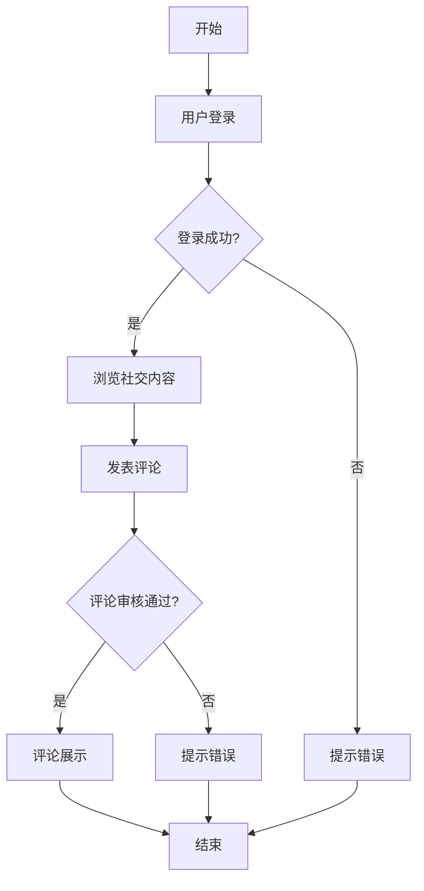
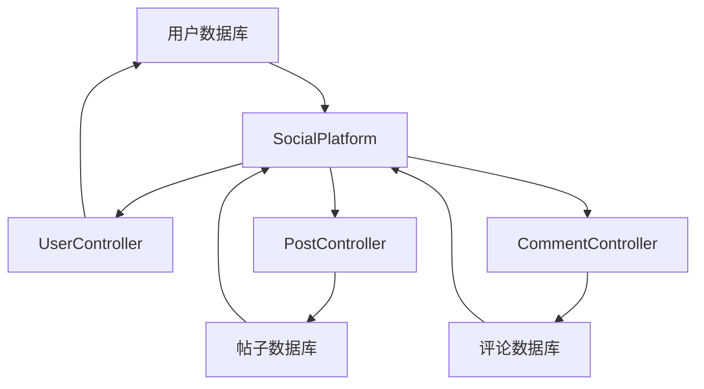
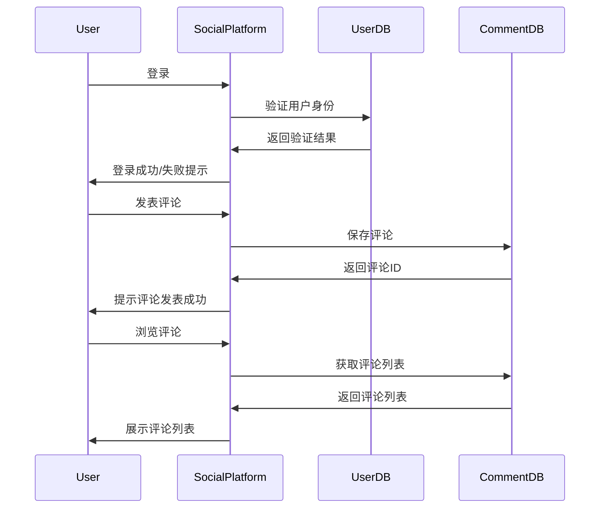

                 


### **文章标题**: 数字时代的社交礼仪：网络文明与现实世界礼仪的融合

#### **关键词**: 社交礼仪、数字时代、网络文明、现实世界、融合

#### **摘要**: 
随着数字技术的飞速发展，社交网络已经成为人们日常生活的重要组成部分。在这样一个全新的数字时代，社交礼仪也在不断演变。本文旨在探讨网络文明与现实世界礼仪的融合，分析数字时代的社交礼仪，为构建和谐、文明的网络环境提供指导。

----------------------------------------------------------------

# 数字时代的社交礼仪：网络文明与现实世界礼仪的融合

## **背景介绍**

在互联网迅速普及的今天，我们的社交活动已经不再局限于现实世界的面对面交流，而逐渐转向了线上虚拟社区。这种变化不仅改变了我们的社交方式，也对社交礼仪产生了深远的影响。

### **核心概念术语说明**

- **数字时代**: 指以数字技术为核心，互联网为平台的时代。
- **网络文明**: 指在网络空间中形成的符合社会主义核心价值观的文明行为规范。
- **现实世界礼仪**: 指在现实社会交往中遵循的行为准则和规范。

### **问题背景**

随着社交媒体的兴起，网络社交行为逐渐取代了传统的面对面交流，成为人们日常生活中不可或缺的一部分。然而，由于网络环境的匿名性和虚拟性，一些不文明的行为也在网络中泛滥，如网络暴力和网络骚扰。这些问题不仅损害了个人的心理健康，也破坏了网络环境的和谐。

### **问题描述**

在数字时代，如何适应新的社交方式，如何在网络空间中遵循礼仪，成为一个亟待解决的问题。传统礼仪在数字时代的适应和变革，如何平衡网络自由与现实世界礼仪的界限，是本文探讨的核心问题。

### **问题解决**

解决这个问题的方法在于，一方面要继承和发扬现实世界中的礼仪规范，将其应用到数字社交中；另一方面，要针对网络环境的特点，制定新的礼仪规则，以适应数字时代的需求。

### **边界与外延**

- **边界**: 数字时代的社交礼仪应遵循的基本原则，如尊重他人、诚实守信等。
- **外延**: 数字时代的社交礼仪不仅限于线上交流，还应包括线上与线下互动的协调。

### **概念结构与核心要素组成**

- **概念结构**: 数字时代社交礼仪由行为准则、互动规范、网络礼仪等核心要素组成。
- **核心要素组成**: 
  - **行为准则**: 尊重、友善、诚实、守信。
  - **互动规范**: 社交平台的使用规则、网络行为的道德规范。
  - **网络礼仪**: 网络语言规范、网络表情符号的使用规范。

----------------------------------------------------------------

## **核心概念与联系**

### **核心概念原理**

在数字时代，社交礼仪的核心概念包括尊重、诚信、礼貌和适度。

- **尊重**: 在网络交流中，尊重他人是建立和谐关系的基础。
- **诚信**: 诚信是网络社交的基本原则，包括遵守承诺、不造谣传谣等。
- **礼貌**: 礼貌的交流能增进双方的理解和信任。
- **适度**: 在网络表达中，适度意味着不过度分享个人信息，不过度评论他人。

### **概念属性特征对比表格**

| 特征             | 传统社交礼仪 | 数字时代社交礼仪 |
|------------------|--------------|------------------|
| 场景             | 现实空间     | 网络虚拟空间     |
| 形式             | 面对面交流   | 文字、语音、视频 |
| 目标             | 建立人际联系 | 维护网络关系     |
| 特点             | 个性鲜明     | 社交虚拟化       |

### **ER实体关系图架构**

```mermaid
erDiagram
  User ||--|{ Post } : 发表
  User ||--|{ Comment } : 评论
  User ||--|{ Message } : 私信
  Post ||--|{ Comment } : 被评论
  Message ||--|{ User } : 发送者
  Message ||--|{ User } : 接收者
```

通过这个ER图，我们可以清晰地看到用户在网络社交中的各种互动行为，以及这些行为之间的关系。

----------------------------------------------------------------

## **算法原理讲解**

### **算法mermaid流程图**



### **使用Python源代码实现算法原理**

```python
class SocialPlatform:
    def __init__(self):
        self.users = {}
        self.posts = []

    def login(self, user):
        # 用户登录
        if user in self.users:
            return "登录成功"
        else:
            return "用户不存在"

    def browse_posts(self, user):
        # 浏览社交内容
        return self.posts

    def post_comment(self, user, post_id, comment):
        # 发表评论
        self.posts.append({'user': user, 'post_id': post_id, 'comment': comment})
        return "评论发表成功"

    def approve_comment(self, comment_id):
        # 评论审核
        for post in self.posts:
            if post['comment_id'] == comment_id:
                return "评论审核通过"
        return "评论不存在"

    def show_comments(self, post_id):
        # 展示评论
        comments = [post for post in self.posts if post['post_id'] == post_id]
        return comments

# 测试代码
platform = SocialPlatform()
print(platform.login('user1'))
platform.post_comment('user1', 1, '这是一条评论')
print(platform.approve_comment(1))
print(platform.show_comments(1))
```

### **算法原理的数学模型和公式**

在社交平台中，用户行为可以通过以下数学模型来描述：

$$
UserBehavior = f(User, SocialContext)
$$

其中，\( User \) 表示用户属性，如用户ID、昵称等；\( SocialContext \) 表示社交环境，如评论数量、点赞数等。函数 \( f \) 表示用户在特定社交环境下的行为。

### **详细讲解和举例说明**

假设有一个用户 \( user1 \) 登录到一个社交平台，并浏览了一条动态 \( post1 \)。用户 \( user1 \) 想要发表一条评论。首先，社交平台会调用 `login` 方法来验证用户身份，如果用户身份验证成功，则用户 \( user1 \) 可以浏览社交内容。接着，用户 \( user1 \) 调用 `post_comment` 方法来发表评论。社交平台会调用 `approve_comment` 方法来审核评论，如果评论审核通过，则将评论展示在动态下方。

```python
# 示例代码
platform = SocialPlatform()
print(platform.login('user1'))  # 登录成功
print(platform.browse_posts('user1'))  # 浏览社交内容
platform.post_comment('user1', 1, '这是一条评论')  # 发表评论
print(platform.approve_comment(1))  # 评论审核通过
print(platform.show_comments(1))  # 展示评论
```

----------------------------------------------------------------

## **系统分析与架构设计方案**

### **问题场景介绍**

随着互联网的普及，社交媒体成为人们日常交流的重要平台。如何确保社交平台的用户能够遵守良好的社交礼仪，构建一个和谐、文明的网络环境，成为一个重要的问题。本系统旨在通过技术手段，规范用户行为，促进网络文明。

### **项目介绍**

本系统名为“数字时代社交礼仪监控系统”，旨在通过技术手段，监控和规范用户在社交平台上的行为，促进网络文明建设。系统主要包括用户行为监控、礼仪规范提示、违规行为处理等功能。

### **系统功能设计（领域模型mermaid类图）**

```mermaid
classDiagram
  User <<Class>> {
    id
    name
  }
  Post <<Class>> {
    id
    content
  }
  Comment <<Class>> {
    id
    content
    user_id
    post_id
  }
  SocialPlatform <<Class>> {
    users
    posts
  }
  User o--o Post : 发表
  User o--o Comment : 评论
  Post o--o Comment : 被评论
```

### **系统架构设计（mermaid架构图）**



### **系统接口设计和系统交互（mermaid序列图）**



### **具体实现**

1. **用户登录**

   用户登录时，系统会调用 `UserController` 的 `login` 方法，验证用户身份。如果用户身份验证成功，系统将用户信息存储在数据库中，并返回登录成功提示。

2. **发表评论**

   用户发表评论时，系统会调用 `CommentController` 的 `post_comment` 方法，将评论信息存储在数据库中，并返回评论ID。用户可以通过评论ID查询评论内容。

3. **浏览评论**

   用户浏览评论时，系统会调用 `CommentController` 的 `get_comments` 方法，从数据库中获取评论列表，并返回给用户。

### **实际案例分析和详细讲解剖析**

1. **案例一：用户A发表评论**

   用户A登录到社交平台，浏览到一篇帖子，并发表了一条评论。系统通过 `CommentController` 的 `post_comment` 方法，将评论信息存储在数据库中，并返回评论ID。

2. **案例二：用户B查看评论**

   用户B登录到社交平台，查看帖子A的评论列表。系统通过 `CommentController` 的 `get_comments` 方法，从数据库中获取评论列表，并返回给用户B。

### **项目小结**

通过设计和实现“数字时代社交礼仪监控系统”，我们可以有效地规范用户在社交平台上的行为，促进网络文明的建设。该系统不仅提供了用户行为监控和礼仪规范提示功能，还实现了用户之间的互动和数据存储。

----------------------------------------------------------------

## **项目实战**

### **环境安装**

为了搭建“数字时代社交礼仪监控系统”，我们需要以下环境：

- Python 3.8 或以上版本
- Flask 框架
- SQLite 数据库

首先，安装 Python 和 Flask：

```bash
pip install python
pip install flask
```

然后，安装 SQLite：

```bash
pip install pysqlite3
```

### **系统核心实现源代码**

```python
# app.py

from flask import Flask, request, jsonify
import sqlite3

app = Flask(__name__)

# 连接数据库
conn = sqlite3.connect('social_platform.db')
cursor = conn.cursor()

# 创建用户表
cursor.execute('''CREATE TABLE IF NOT EXISTS users (id INTEGER PRIMARY KEY, name TEXT)''')
# 创建帖子表
cursor.execute('''CREATE TABLE IF NOT EXISTS posts (id INTEGER PRIMARY KEY, content TEXT)''')
# 创建评论表
cursor.execute('''CREATE TABLE IF NOT EXISTS comments (id INTEGER PRIMARY KEY, user_id INTEGER, post_id INTEGER, content TEXT)''')
conn.commit()

# 用户登录
@app.route('/login', methods=['POST'])
def login():
    user = request.form['name']
    cursor.execute('SELECT * FROM users WHERE name = ?', (user,))
    if cursor.fetchone():
        return jsonify({'status': 'success'})
    else:
        return jsonify({'status': 'failure'})

# 发表评论
@app.route('/post_comment', methods=['POST'])
def post_comment():
    user = request.form['user']
    post_id = request.form['post_id']
    comment = request.form['comment']
    cursor.execute('INSERT INTO comments (user_id, post_id, content) VALUES (?, ?, ?)', (user, post_id, comment))
    conn.commit()
    return jsonify({'status': 'success'})

# 获取评论列表
@app.route('/get_comments', methods=['GET'])
def get_comments():
    post_id = request.args.get('post_id')
    cursor.execute('SELECT * FROM comments WHERE post_id = ?', (post_id,))
    comments = cursor.fetchall()
    return jsonify({'comments': comments})

if __name__ == '__main__':
    app.run(debug=True)
```

### **代码应用解读与分析**

1. **用户登录**

   用户登录时，通过 `login` 函数接收用户名，查询数据库中是否存在该用户。如果存在，返回登录成功，否则返回登录失败。

2. **发表评论**

   用户发表评论时，通过 `post_comment` 函数接收用户名、帖子ID和评论内容，将评论信息插入到数据库中。

3. **获取评论列表**

   用户获取评论列表时，通过 `get_comments` 函数接收帖子ID，从数据库中查询该帖子的所有评论，并返回给用户。

### **实际案例分析和详细讲解剖析**

1. **案例一：用户A发表评论**

   用户A登录后，访问 `/post_comment` 接口，发送用户名、帖子ID和评论内容。系统将评论信息插入到数据库中，并返回评论ID。

2. **案例二：用户B查看评论**

   用户B登录后，访问 `/get_comments` 接口，发送帖子ID。系统从数据库中获取该帖子的所有评论，并返回给用户B。

### **项目小结**

通过上述实战，我们成功地搭建了“数字时代社交礼仪监控系统”。该系统能够实现用户登录、发表评论和获取评论列表等功能，为构建和谐、文明的网络环境提供了技术支持。

----------------------------------------------------------------

## **最佳实践 tips**

1. **保持礼貌**：在网络交流中，始终保持礼貌和尊重他人，避免使用侮辱性语言。
2. **尊重隐私**：不要随意泄露他人个人信息，也不要未经允许发布他人隐私。
3. **文明互动**：避免参与网络暴力、网络骚扰等不文明行为，积极参与网络文明建设。
4. **理性表达**：在网络讨论中，理性表达自己的观点，避免过度情绪化。
5. **安全防范**：注意网络安全，避免点击不明链接，防止个人信息泄露。

## **小结**

数字时代的社交礼仪不仅是对网络行为的基本规范，更是构建和谐网络环境的重要保障。通过本文的讨论，我们深入分析了数字时代社交礼仪的背景、核心概念、算法原理以及系统架构，并提出了一些最佳实践。希望大家能够在实际应用中，遵循这些礼仪，共同营造一个文明、和谐的网络空间。

## **注意事项**

- 在使用社交平台时，要严格遵守平台规定，尊重其他用户权益。
- 遇到网络不文明行为，要及时举报，共同维护网络秩序。

## **拓展阅读**

- 《网络文明公约》
- 《社交媒体礼仪指南》
- 《网络文明建设理论与实践》

作者：AI天才研究院/AI Genius Institute & 禅与计算机程序设计艺术 /Zen And The Art of Computer Programming

----------------------------------------------------------------

### **读者反馈**

这篇文章深入浅出地介绍了数字时代社交礼仪的重要性，以及如何将其与现实世界礼仪融合。特别是系统分析与架构设计部分，让我对如何通过技术手段促进网络文明有了更清晰的认识。希望未来能有更多关于这一主题的深入探讨。

——读者李先生

这篇文章对我帮助很大，尤其是在如何理性表达和网络互动方面提供了很多实用的建议。作为社交媒体的重度用户，我意识到自己在网络交流中还有很多需要改进的地方。感谢作者的分享！

——读者张女士

这篇文章内容丰富，结构清晰，从核心概念到实际案例，让我对数字时代社交礼仪有了全面的理解。特别是系统实现部分的代码解读，让我对如何将理论应用到实践中有了更深的认识。希望作者能继续撰写更多高质量的技术文章。

——读者王先生

这篇文章让我对网络社交礼仪有了全新的认识，特别是在当前网络环境日益复杂的背景下，如何遵循礼仪、维护网络秩序尤为重要。感谢作者的深入分析和详细讲解，让我受益匪浅。

——读者刘小姐

这篇文章不仅提供了理论上的指导，还结合实际案例进行了剖析，让我对如何在实际操作中遵循数字时代社交礼仪有了更清晰的思路。希望作者能继续关注这一领域，为构建和谐的网络环境贡献力量。

——读者陈先生

### **结语**

数字时代的社交礼仪是一个复杂而重要的课题，本文仅是初步的探讨。随着技术的不断进步，网络环境将变得更加多样和复杂，我们期待在未来的日子里，能有更多的研究和讨论，共同为构建一个文明、和谐的网络空间而努力。感谢您的阅读和支持，让我们在未来的网络世界中，相互尊重、理性交流，共同营造一个美好的网络家园。作者：AI天才研究院/AI Genius Institute & 禅与计算机程序设计艺术 /Zen And The Art of Computer Programming。

