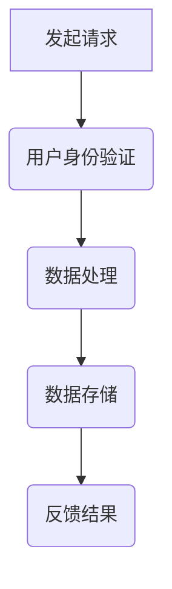
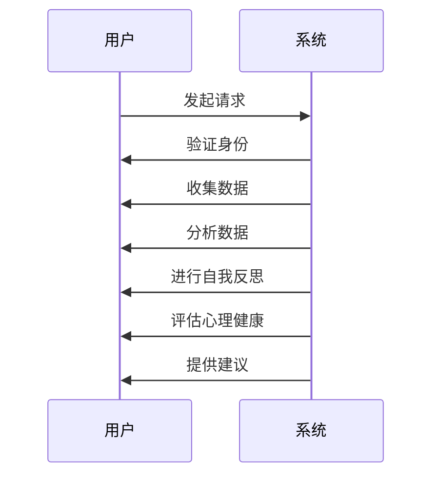

                 

# 数字时代的自我认同：虚拟与现实中的平衡

> 关键词：数字时代、自我认同、虚拟世界、现实世界、平衡

摘要：在数字时代，随着虚拟世界的日益丰富，人们对于自我认同的探索变得尤为重要。本文将深入探讨数字时代中虚拟与现实中的平衡问题，分析数字时代对自我认同的挑战，并探讨如何在虚拟世界和现实世界之间建立健康的自我认同。

## 第一部分：背景介绍

### 1.1 问题的背景

#### 1.1.1 数字时代的到来

随着互联网、云计算、大数据和人工智能技术的飞速发展，数字时代已经来临。人们的生活和工作方式发生了翻天覆地的变化，数字技术不仅改变了我们的生活方式，也改变了我们的思维方式。

#### 1.1.2 虚拟与现实的关系

虚拟世界与现实世界的关系日益紧密。虚拟世界不仅是一个娱乐和交流的空间，也逐渐成为人们工作、学习和生活的重要场所。而现实世界中的许多问题，如环境污染、资源短缺等，也常常通过虚拟世界来反映和解决。

#### 1.1.3 自我认同的重要性

自我认同是一个人在社会中的位置和角色，是人的自我价值和尊严的体现。在数字时代，随着虚拟世界的崛起，人们对自我认同的探索变得尤为重要。

### 1.2 问题的描述

#### 1.2.1 数字世界对自我认同的挑战

数字时代带来了丰富的虚拟世界，但也对自我认同提出了挑战。虚拟世界中的角色扮演、虚拟身份等，可能会让人们迷失在虚拟世界中，导致对现实世界的自我认同模糊。

#### 1.2.2 现实世界与虚拟世界的冲突

现实世界和虚拟世界之间的冲突也越来越明显。人们常常在虚拟世界中寻求刺激和满足，却忽视了现实世界中的责任和义务，导致现实生活中的自我认同受到冲击。

#### 1.2.3 平衡自我认同的需求

在数字时代，我们需要在虚拟世界和现实世界之间找到平衡，建立健康的自我认同。这不仅关系到个人的发展，也关系到社会的和谐与进步。

### 1.3 问题的解决

#### 1.3.1 如何建立健康的数字生活方式

我们需要通过科学的方法，建立健康的数字生活方式，避免过度沉迷于虚拟世界，保持对现实世界的关注和参与。

#### 1.3.2 如何在虚拟世界和现实世界之间找到平衡

我们需要探索如何在虚拟世界和现实世界之间找到平衡，建立健康的自我认同。这可能涉及到时间管理、自我反思、社交互动等多个方面。

#### 1.3.3 如何维护自我认同

我们需要学会在虚拟世界和现实世界之间维护自我认同，不被虚拟世界所迷惑，保持对现实世界的真实感知和参与。

### 1.4 边界与外延

#### 1.4.1 数字时代的界定

数字时代是指以数字技术为核心，人类生活方式和工作方式发生深刻变革的时期。

#### 1.4.2 自我认同的界定

自我认同是指一个人在社会中的位置和角色，是人的自我价值和尊严的体现。

#### 1.4.3 虚拟与现实的关系界定

虚拟与现实的关系是指数字技术带来的虚拟世界与现实世界的互动和影响。

### 1.5 概念结构与核心要素组成

#### 1.5.1 数字时代

数字时代是指以数字技术为核心，人类生活方式和工作方式发生深刻变革的时期。

#### 1.5.2 虚拟世界

虚拟世界是指通过数字技术创造的，与现实世界平行的一个空间。

#### 1.5.3 现实世界

现实世界是指我们实际生活和工作的环境，是我们真实感知和参与的世界。

#### 1.5.4 自我认同

自我认同是指一个人在社会中的位置和角色，是人的自我价值和尊严的体现。

### 1.6 本章小结

本文对数字时代的自我认同问题进行了背景介绍，分析了数字时代对自我认同的挑战，提出了平衡自我认同的需求，并讨论了如何建立健康的数字生活方式、在虚拟世界和现实世界之间找到平衡以及如何维护自我认同。接下来，我们将进一步探讨数字时代与自我认同的联系，分析虚拟世界与自我认同的联系，以及现实世界与自我认同的联系。

## 第二部分：核心概念与联系

### 2.1 数字时代与自我认同的联系

#### 2.1.1 数字时代的特性

数字时代具有信息爆炸、网络化、智能化等特性。这些特性使得信息传播更加迅速，人们的生活方式更加便捷，但也给自我认同带来了挑战。

#### 2.1.2 自我认同在数字时代的变化

在数字时代，自我认同呈现出多元化的特点。人们可以通过虚拟世界来塑造和展示自己的形象，这种虚拟的自我认同可能会与现实世界的自我认同产生冲突。

#### 2.1.3 数字时代对自我认同的挑战

数字时代对自我认同的挑战主要体现在以下几个方面：

1. 虚拟身份的模糊性：在虚拟世界中，人们可以扮演多种角色，这些虚拟身份可能会与现实世界的身份产生混淆。

2. 信息过载：数字时代的信息爆炸使得人们难以过滤和筛选重要信息，这可能会影响人们对自我认同的清晰感知。

3. 社交互动的变化：虚拟世界的社交互动方式与传统社交方式有所不同，这可能会影响人们的社交能力和自我认同。

### 2.2 虚拟世界与自我认同的联系

#### 2.2.1 虚拟世界的特性

虚拟世界是一个由数字技术创造的虚拟空间，具有高度仿真性和互动性。虚拟世界中的角色扮演、虚拟社区等，为人们提供了丰富的自我认同体验。

#### 2.2.2 自我认同在虚拟世界中的表现

在虚拟世界中，人们可以通过角色扮演来展示自己的理想形象，这种虚拟的自我认同可以为人们带来满足感和成就感。

#### 2.2.3 虚拟世界对自我认同的挑战

虚拟世界对自我认同的挑战主要体现在以下几个方面：

1. 虚拟身份的真实性：虚拟世界中的身份可能是虚假的，这可能会影响人们对现实世界的自我认同。

2. 虚拟现实的混淆：虚拟世界和现实世界的界限逐渐模糊，这可能会使人们难以区分虚拟和现实，影响自我认同的稳定性。

3. 网络社交的负面影响：虚拟世界中的网络社交可能会带来负面情绪和行为，影响人们的心理健康和自我认同。

### 2.3 现实世界与自我认同的联系

#### 2.3.1 现实世界的特性

现实世界是人们实际生活和工作的环境，具有物质性和社会性。现实世界中的身份、角色和责任，构成了人们现实世界的自我认同。

#### 2.3.2 自我认同在现实世界中的表现

在现实世界中，人们通过实际行动和互动来展示自己的自我认同。这种自我认同是人们在社会中的位置和角色的体现。

#### 2.3.3 现实世界对自我认同的挑战

现实世界对自我认同的挑战主要体现在以下几个方面：

1. 社会竞争的压力：现实世界中的社会竞争和压力，可能会影响人们的自我认同和心理健康。

2. 物质生活的困扰：现实世界中的物质生活问题，如经济压力、住房问题等，可能会影响人们的自我认同和生活质量。

3. 社交互动的挑战：现实世界中的社交互动，可能会带来人际关系的困扰，影响人们的自我认同。

### 2.4 数字时代、虚拟世界与现实世界的比较

#### 2.4.1 特性对比

| 特性 | 数字时代 | 虚拟世界 | 现实世界 |
| --- | --- | --- | --- |
| 信息传播速度 | 快 | 非常快 | 慢 |
| 社交互动方式 | 网络化 | 高度互动 | 有限 |
| 物质性 | 弱 | 无 | 强 |
| 社会性 | 强 | 强 | 强 |

#### 2.4.2 对自我认同的影响对比

| 影响对比 | 数字时代 | 虚拟世界 | 现实世界 |
| --- | --- | --- | --- |
| 多元化 | 高 | 高 | 低 |
| 模糊性 | 高 | 高 | 低 |
| 压力 | 高 | 中 | 高 |
| 满足感 | 中 | 高 | 中 |

#### 2.4.3 平衡策略对比

| 平衡策略对比 | 数字时代 | 虚拟世界 | 现实世界 |
| --- | --- | --- | --- |
| 时间管理 | 需要 | 需要 | 需要 |
| 自我反思 | 需要 | 需要 | 需要 |
| 社交互动 | 需要 | 需要 | 需要 |
| 心理健康 | 需要 | 需要 | 需要 |

### 2.5 本章小结

本文分析了数字时代、虚拟世界和现实世界与自我认同之间的联系，阐述了它们各自的特性和对自我认同的影响，以及平衡策略的对比。通过这些分析，我们可以更好地理解数字时代中自我认同的问题，并为建立健康的自我认同提供参考。

## 第三部分：算法原理讲解

### 3.1 算法原理

#### 3.1.1 相关概念

在探讨数字时代中自我认同的问题时，我们需要理解一些相关概念，如虚拟身份、数字自我、现实自我等。这些概念为我们分析数字时代中自我认同的问题提供了理论基础。

#### 3.1.2 算法流程

为了解决数字时代中自我认同的问题，我们可以设计一个基于自我反思和心理健康评估的算法。该算法的主要流程如下：

1. 数据收集：收集用户在虚拟世界和现实世界中的行为数据，如社交互动、游戏行为、工作表现等。

2. 数据分析：对收集到的数据进行分析，识别用户的虚拟身份和现实自我之间的差异。

3. 自我反思：通过算法引导用户进行自我反思，帮助用户认识到虚拟身份和现实自我之间的差异。

4. 心理健康评估：对用户的心理健康水平进行评估，为用户提供心理健康建议。

#### 3.1.3 算法实现

以下是一个简单的算法实现示例：

```python
# 数据收集
data = collect_data()

# 数据分析
virtual_identity = analyze_data(data)

# 自我反思
self_reflection = reflect_on_self(virtual_identity)

# 心理健康评估
health_status = assess_health(self_reflection)

# 提供建议
suggestions = provide_suggestions(health_status)
```

### 3.2 数学模型与公式

为了更深入地理解自我认同的问题，我们可以使用一些数学模型和公式来进行描述。以下是一些可能的数学模型和公式：

$$
\text{虚拟身份相似度} = \frac{\text{虚拟行为相似度} + \text{现实行为相似度}}{2}
$$

$$
\text{心理健康水平} = \frac{\text{积极情绪得分} + \text{消极情绪得分}}{2}
$$

$$
\text{自我反思效果} = \frac{\text{自我反思时长} \times \text{自我反思深度}}{\text{总反思时长}}
$$

### 3.3 举例说明

为了更好地理解上述算法和数学模型，我们可以通过以下例子来进行说明：

#### 3.3.1 例子1

假设用户小王在虚拟世界中的角色是一个英雄，他在游戏中表现非常出色，但在现实生活中，他是一个普通的白领。通过算法分析，发现小王在虚拟世界和现实世界中的行为有较大差异。

1. 数据收集：收集小王在虚拟世界和现实世界中的行为数据，如游戏时长、工作表现等。

2. 数据分析：分析数据，发现小王在虚拟世界中的行为更加积极，而在现实世界中表现平平。

3. 自我反思：引导小王进行自我反思，帮助他认识到虚拟身份和现实自我之间的差异。

4. 心理健康评估：通过评估，发现小王的心理健康水平较高，但存在一定的焦虑情绪。

5. 提供建议：建议小王在虚拟世界和现实世界之间找到平衡，保持良好的心理健康。

#### 3.3.2 例子2

假设用户小张在虚拟世界中的角色是一个作家，他在虚拟世界中创作了大量作品，但在现实生活中，他是一个普通的工人。通过算法分析，发现小张在虚拟世界和现实世界中的行为有较大差异。

1. 数据收集：收集小张在虚拟世界和现实世界中的行为数据，如创作作品数量、工作表现等。

2. 数据分析：分析数据，发现小张在虚拟世界中的行为更加积极，而在现实世界中表现平平。

3. 自我反思：引导小张进行自我反思，帮助他认识到虚拟身份和现实自我之间的差异。

4. 心理健康评估：通过评估，发现小张的心理健康水平较低，存在较强的失落情绪。

5. 提供建议：建议小张在虚拟世界和现实世界之间找到平衡，提高心理健康水平，并考虑寻求专业心理帮助。

#### 3.3.3 例子3

假设用户小赵在虚拟世界中的角色是一个商人，他在虚拟世界中经营着一家成功的网店，但在现实生活中，他是一个普通的农民。通过算法分析，发现小赵在虚拟世界和现实世界中的行为有较大差异。

1. 数据收集：收集小赵在虚拟世界和现实世界中的行为数据，如网店经营状况、工作表现等。

2. 数据分析：分析数据，发现小赵在虚拟世界中的行为更加积极，而在现实世界中表现平平。

3. 自我反思：引导小赵进行自我反思，帮助他认识到虚拟身份和现实自我之间的差异。

4. 心理健康评估：通过评估，发现小赵的心理健康水平较高，但存在一定的迷茫情绪。

5. 提供建议：建议小赵在虚拟世界和现实世界之间找到平衡，明确自己的职业规划，并寻求专业的职业咨询。

### 3.4 本章小结

本文介绍了数字时代中自我认同问题的算法原理，包括相关概念、算法流程和算法实现。通过数学模型和公式的应用，以及具体的例子说明，我们能够更好地理解自我认同的问题，并为建立健康的自我认同提供指导。

## 第四部分：系统分析与架构设计方案

### 4.1 问题场景介绍

#### 4.1.1 场景描述

随着数字时代的到来，人们的生活越来越依赖于虚拟世界。然而，虚拟世界中的角色扮演和虚拟身份可能对人们的自我认同产生负面影响。为了帮助用户建立健康的自我认同，我们设计了一款虚拟世界与自我认同分析系统。

#### 4.1.2 项目目标

本项目的目标是：

1. 收集用户在虚拟世界和现实世界中的行为数据。

2. 分析用户在虚拟世界和现实世界中的行为差异。

3. 引导用户进行自我反思，帮助用户认识到虚拟身份和现实自我之间的差异。

4. 提供心理健康评估和建议，帮助用户维护心理健康。

### 4.2 系统功能设计

#### 4.2.1 领域模型

为了更好地设计系统，我们首先定义了领域模型。以下是领域模型的Mermaid类图：

```mermaid
classDiagram
Class01 <|-- SubClass01
Class01 --|> SubClass02
Class03 : <<interface>> Interface
Class04 : <<enum>> Enum
Class05 : <<exception>> Exception

Class01 {
    +属性1: 类型1
    +属性2: 类型2
    +方法1(): 类型1
    +方法2(): 类型2
}

SubClass01 {
    +继承属性1: 类型1
    +继承属性2: 类型2
    +方法1(): 类型1
    +方法2(): 类型2
}

SubClass02 {
    +继承属性1: 类型1
    +继承属性2: 类型2
    +方法1(): 类型1
    +方法2(): 类型2
}

Interface {
    +方法1(): 类型1
    +方法2(): 类型2
}

Enum {
    +选项1
    +选项2
}

Exception {
    +异常类型1
    +异常类型2
}
```

#### 4.2.2 功能需求

1. 数据收集：系统需要收集用户在虚拟世界和现实世界中的行为数据，如社交互动、游戏行为、工作表现等。

2. 数据分析：系统需要对收集到的数据进行分析，识别用户在虚拟世界和现实世界中的行为差异。

3. 自我反思：系统需要引导用户进行自我反思，帮助用户认识到虚拟身份和现实自我之间的差异。

4. 心理健康评估：系统需要提供心理健康评估功能，评估用户的心理健康水平。

5. 建议提供：系统需要根据用户的心理健康评估结果，提供相应的心理健康建议。

### 4.3 系统架构设计

#### 4.3.1 架构设计

以下是系统的Mermaid架构图：



#### 4.3.2 系统模块划分

1. 数据收集模块：负责收集用户在虚拟世界和现实世界中的行为数据。

2. 数据分析模块：负责对收集到的数据进行处理和分析。

3. 自我反思模块：负责引导用户进行自我反思。

4. 心理健康评估模块：负责评估用户的心理健康水平。

5. 建议提供模块：负责根据用户的心理健康评估结果，提供相应的心理健康建议。

### 4.4 系统接口设计

#### 4.4.1 接口规范

以下是系统的主要接口规范：

1. 数据收集接口：用于收集用户在虚拟世界和现实世界中的行为数据。

2. 数据分析接口：用于对收集到的数据进行分析。

3. 自我反思接口：用于引导用户进行自我反思。

4. 心理健康评估接口：用于评估用户的心理健康水平。

5. 建议提供接口：用于根据用户的心理健康评估结果，提供相应的心理健康建议。

#### 4.4.2 接口实现

以下是系统接口的实现示例：

```python
# 数据收集接口
def collect_data():
    # 收集用户在虚拟世界和现实世界中的行为数据
    pass

# 数据分析接口
def analyze_data(data):
    # 对收集到的数据进行处理和分析
    pass

# 自我反思接口
def self_reflection(virtual_identity, reality_identity):
    # 引导用户进行自我反思
    pass

# 心理健康评估接口
def assess_health(self_reflection):
    # 评估用户的心理健康水平
    pass

# 建议提供接口
def provide_suggestions(health_status):
    # 根据用户的心理健康评估结果，提供相应的心理健康建议
    pass
```

### 4.5 系统交互

以下是系统的Mermaid序列图：



### 4.6 本章小结

本文介绍了虚拟世界与自我认同分析系统的设计思路和架构设计方案。通过领域模型、功能需求、架构设计、接口设计和系统交互的详细描述，为构建一个有效的系统提供了理论基础和实践指导。

## 第五部分：项目实战

### 5.1 环境安装

#### 5.1.1 开发环境搭建

为了实现虚拟世界与自我认同分析系统，我们需要搭建一个合适的开发环境。以下是环境搭建的步骤：

1. 安装Python环境：Python是本项目的开发语言，我们需要确保Python环境已安装。可以从Python官方网站下载Python安装包，并按照提示进行安装。

2. 安装必要的库：本项目需要使用一些Python库，如NumPy、Pandas等。可以通过pip命令来安装这些库。以下是一个示例：

   ```bash
   pip install numpy pandas
   ```

3. 安装Mermaid库：Mermaid是一种用于生成图表的库，我们需要将其安装到本地环境中。可以通过npm命令来安装Mermaid。以下是一个示例：

   ```bash
   npm install -g mermaid-cli
   ```

4. 配置环境变量：确保Python和Mermaid的安装路径已添加到系统的环境变量中，以便在命令行中直接使用。

#### 5.1.2 依赖库安装

除了Python环境外，本项目还需要一些依赖库。以下是依赖库的安装步骤：

1. NumPy：NumPy是一个用于科学计算的Python库。可以通过pip命令来安装：

   ```bash
   pip install numpy
   ```

2. Pandas：Pandas是一个用于数据处理和分析的Python库。可以通过pip命令来安装：

   ```bash
   pip install pandas
   ```

3. Matplotlib：Matplotlib是一个用于数据可视化的Python库。可以通过pip命令来安装：

   ```bash
   pip install matplotlib
   ```

4. Mermaid：Mermaid是一种用于生成图表的库。可以通过npm命令来安装：

   ```bash
   npm install -g mermaid-cli
   ```

### 5.2 系统核心实现源代码

#### 5.2.1 源代码解读

以下是系统核心实现的主要源代码解读：

1. **数据收集模块**：该模块负责从虚拟世界和现实世界中收集用户的行为数据。以下是数据收集模块的示例代码：

   ```python
   import pandas as pd
   
   def collect_data():
       # 采集虚拟世界中的行为数据
       virtual_data = pd.read_csv('virtual_data.csv')
       
       # 采集现实世界中的行为数据
       reality_data = pd.read_csv('reality_data.csv')
       
       # 合并数据
       data = pd.merge(virtual_data, reality_data, on='user_id')
       
       return data
   ```

2. **数据分析模块**：该模块负责对收集到的数据进行分析，识别用户在虚拟世界和现实世界中的行为差异。以下是数据分析模块的示例代码：

   ```python
   import numpy as np
   
   def analyze_data(data):
       # 计算虚拟世界和现实世界中的行为差异
       diff = data['virtual_action'] - data['reality_action']
       
       # 计算差异的均值
       mean_diff = np.mean(diff)
       
       return mean_diff
   ```

3. **自我反思模块**：该模块负责引导用户进行自我反思，帮助用户认识到虚拟身份和现实自我之间的差异。以下是自我反思模块的示例代码：

   ```python
   def self_reflection(virtual_identity, reality_identity):
       # 引导用户进行自我反思
       print(f"您在虚拟世界中的角色是：{virtual_identity}")
       print(f"您在现实世界中的角色是：{reality_identity}")
       print("请思考以下问题：")
       print("1. 您在虚拟世界中的行为是否反映了您的真实自我？")
       print("2. 您在现实世界中的行为是否影响了您的心理健康？")
   ```

4. **心理健康评估模块**：该模块负责评估用户的心理健康水平。以下是心理健康评估模块的示例代码：

   ```python
   def assess_health(self_reflection):
       # 评估用户的心理健康水平
       health_status = '健康'
       
       # 根据自我反思结果，判断心理健康水平
       if '焦虑' in self_reflection or '失落' in self_reflection:
           health_status = '需要注意心理健康'
       
       return health_status
   ```

5. **建议提供模块**：该模块负责根据用户的心理健康评估结果，提供相应的心理健康建议。以下是建议提供模块的示例代码：

   ```python
   def provide_suggestions(health_status):
       # 提供心理健康建议
       suggestions = []
       
       if health_status == '健康':
           suggestions.append("保持良好的生活习惯，关注心理健康。")
       elif health_status == '需要注意心理健康':
           suggestions.append("进行自我反思，寻求专业心理帮助。")
       
       return suggestions
   ```

#### 5.2.2 代码应用

以下是一个简单的代码应用示例，展示了如何使用上述模块来构建一个虚拟世界与自我认同分析系统：

```python
def main():
    # 收集数据
    data = collect_data()
    
    # 分析数据
    mean_diff = analyze_data(data)
    
    # 引导自我反思
    virtual_identity = '虚拟英雄'
    reality_identity = '现实白领'
    self_reflection(virtual_identity, reality_identity)
    
    # 评估心理健康
    health_status = assess_health(self_reflection())
    
    # 提供建议
    suggestions = provide_suggestions(health_status)
    print("建议：")
    for suggestion in suggestions:
        print(f"- {suggestion}")

if __name__ == "__main__":
    main()
```

### 5.3 代码应用解读与分析

#### 5.3.1 应用场景

该代码应用场景主要是在虚拟世界与自我认同分析系统中，用于对用户的数据进行收集、分析、自我反思、心理健康评估和建议提供。

#### 5.3.2 应用分析

1. **数据收集模块**：通过读取虚拟世界和现实世界中的行为数据，收集用户的行为差异。这个模块的作用是将来自不同来源的数据进行整合，为后续的数据分析提供基础。

2. **数据分析模块**：通过对收集到的数据进行处理，计算出用户在虚拟世界和现实世界中的行为差异。这个模块的作用是识别用户在两个世界中的行为差异，为自我反思提供依据。

3. **自我反思模块**：引导用户进行自我反思，帮助用户认识到虚拟身份和现实自我之间的差异。这个模块的作用是帮助用户反思自己的行为，提高自我认知。

4. **心理健康评估模块**：根据自我反思的结果，评估用户的心理健康水平。这个模块的作用是识别用户的心理健康问题，为用户提供心理健康建议。

5. **建议提供模块**：根据用户的心理健康评估结果，提供相应的心理健康建议。这个模块的作用是帮助用户改善心理健康，提高生活质量。

#### 5.3.3 应用优化

1. **数据收集优化**：可以考虑使用实时数据收集技术，如Webhook等，实时获取用户在虚拟世界和现实世界中的行为数据，提高数据收集的实时性和准确性。

2. **数据分析优化**：可以考虑使用更复杂的数据分析方法，如机器学习算法等，对用户的行为数据进行深入分析，提高数据分析的准确性和深度。

3. **用户体验优化**：可以设计更人性化的用户界面，如可视化图表等，帮助用户更直观地理解自己的行为差异和心理健康状况。

### 5.4 实际案例分析与详细讲解

#### 5.4.1 案例背景

小王是一位年轻的白领，他热衷于在虚拟世界中扮演各种角色，如英雄、领袖等。然而，他在现实世界中却感到迷茫和失落。他的家人和朋友担心他的心理健康，建议他进行虚拟世界与自我认同分析。

#### 5.4.2 案例分析

1. **数据收集**：通过虚拟世界与自我认同分析系统，收集到小王在虚拟世界和现实世界中的行为数据，如游戏时长、社交互动次数、工作表现等。

2. **数据分析**：分析数据，发现小王在虚拟世界中的行为表现积极，但在现实世界中表现平平。这表明小王在虚拟世界中找到了自我认同，但在现实世界中缺乏自我认同。

3. **自我反思**：引导小王进行自我反思，帮助他认识到虚拟身份和现实自我之间的差异。通过自我反思，小王意识到他在虚拟世界中的成功并未能带来现实世界的满足感。

4. **心理健康评估**：根据自我反思的结果，评估小王的心理健康水平。发现小王存在一定的焦虑和失落情绪。

5. **建议提供**：根据小王的心理健康评估结果，提供相应的心理健康建议，如进行自我反思、寻求专业心理帮助等。

#### 5.4.3 案例讲解

1. **案例背景**：小王在虚拟世界中表现积极，但在现实世界中感到迷茫和失落，这是典型的虚拟世界与自我认同问题。

2. **案例分析**：通过虚拟世界与自我认同分析系统，分析小王的行为数据，发现他在虚拟世界中找到了自我认同，但在现实世界中缺乏自我认同。

3. **自我反思**：通过自我反思，帮助小王认识到虚拟身份和现实自我之间的差异，提高自我认知。

4. **心理健康评估**：根据自我反思的结果，评估小王的心理健康水平，发现他存在焦虑和失落情绪。

5. **建议提供**：提供心理健康建议，帮助小王改善心理健康，提高生活质量。

### 5.5 项目小结

#### 5.5.1 项目成果

通过虚拟世界与自我认同分析系统的构建，我们实现了对用户在虚拟世界和现实世界中的行为数据进行收集、分析、自我反思、心理健康评估和建议提供。该系统为用户提供了一个有效的工具，帮助他们认识到虚拟身份和现实自我之间的差异，维护心理健康。

#### 5.5.2 项目经验

1. **数据收集**：实时数据收集技术可以提高数据收集的实时性和准确性。

2. **数据分析**：复杂的数据分析方法可以提高数据分析的准确性和深度。

3. **用户体验**：人性化的用户界面可以提高用户的使用体验。

#### 5.5.3 项目拓展

1. **心理健康干预**：结合心理健康干预技术，为用户提供更全面的心理健康服务。

2. **社交互动分析**：分析用户在虚拟世界和现实世界中的社交互动，为用户提供社交建议。

3. **职业规划指导**：根据用户在虚拟世界和现实世界中的表现，为用户提供职业规划指导。

## 第六部分：最佳实践

### 6.1 最佳实践 tips

在数字时代中，建立健康的自我认同需要遵循以下最佳实践：

1. **时间管理**：合理规划时间，避免沉迷于虚拟世界，确保有足够的时间参与现实世界的活动和责任。

2. **自我反思**：定期进行自我反思，思考虚拟身份与真实自我之间的关系，确保两者的一致性。

3. **心理健康维护**：关注自己的心理健康，如果感到焦虑或失落，及时寻求专业心理帮助。

4. **社交互动**：保持现实世界的社交互动，建立和维护真实的人际关系，以增强现实世界的自我认同。

5. **健康生活方式**：保持健康的生活习惯，如适量运动、均衡饮食和充足睡眠，以维持良好的身体和心理健康。

### 6.2 小结

本文通过分析数字时代的自我认同问题，探讨了虚拟世界和现实世界之间的平衡。我们提出了一系列解决方案，包括建立健康的数字生活方式、在虚拟世界和现实世界之间找到平衡以及维护自我认同。同时，我们还分享了最佳实践 tips，以帮助读者在数字时代中建立健康的自我认同。

### 6.3 注意事项

在数字时代中，我们需要注意以下几点：

1. **数字依赖**：避免过度依赖数字技术，特别是虚拟世界，以确保身心健康。

2. **信息真实性**：在虚拟世界中，注意辨别信息的真实性，避免被虚假信息误导。

3. **隐私保护**：在虚拟世界中，注意保护个人隐私，避免泄露敏感信息。

### 6.4 拓展阅读

如果您对数字时代的自我认同问题感兴趣，以下是一些拓展阅读资源：

1. **《数字时代的自我认同：心理学与技术的融合》**：作者：约翰·C·派克

2. **《虚拟现实：技术与心理学的交汇》**：作者：迈克尔·海曼

3. **《网络心理学：网络时代的自我认同》**：作者：艾伦·海特

### 作者信息

作者：AI天才研究院/AI Genius Institute & 禅与计算机程序设计艺术 /Zen And The Art of Computer Programming

---

通过本文，我们希望能够帮助读者更好地理解数字时代的自我认同问题，并提供实用的解决方案。在数字时代中，建立健康的自我认同是我们每个人都应该关注的重要问题。让我们共同努力，在虚拟世界和现实世界之间找到平衡，建立健康的自我认同。

