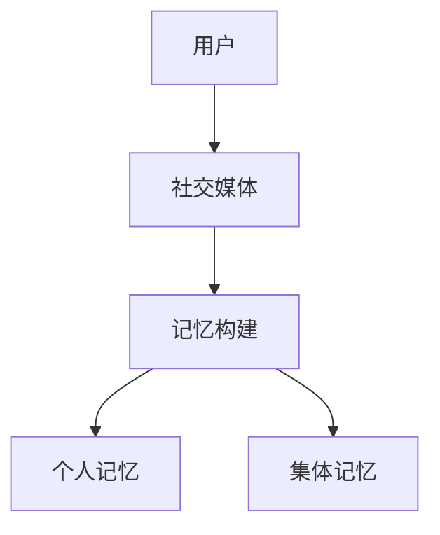

                 

# 数字时代的记忆构建：社交媒体如何塑造我们的过去

关键词：数字记忆、社交媒体、记忆构建、集体记忆、个人记忆

摘要：随着社交媒体的普及，我们的记忆构建方式发生了深刻变化。本文将探讨社交媒体如何影响个人和集体记忆的构建，分析其背后的原理和影响，并提出相应的构建策略。

## 第一部分：引言

### 1.1 书籍背景

在数字时代，社交媒体如雨后春笋般涌现，深刻地改变了我们的社交方式、信息传播方式，甚至影响到了我们的记忆构建。从Facebook、Twitter到微信、微博，这些平台为我们提供了一个便捷的记录和分享生活的场所，使得我们的历史记录和回忆得以被广泛保存和传播。然而，社交媒体在塑造我们的记忆的同时，也带来了一系列新的问题和挑战。

### 1.2 研究问题

- 社交媒体如何塑造我们的个人记忆？
- 社交媒体对集体记忆的构建有何影响？
- 社交媒体环境下的记忆与传统的记忆有何区别？

### 1.3 研究目的

本文旨在深入理解社交媒体对记忆构建的影响，分析社交媒体如何塑造我们的历史记录和回忆，探讨社交媒体时代下的记忆特性及其对个人和社会的意义。

### 1.4 研究边界与外延

本文主要探讨社交媒体对记忆构建的影响，但并不涵盖其他数字平台或技术对记忆的影响。此外，本文的研究将主要聚焦于个人和集体记忆的构建过程，而非技术层面的分析。

## 第二部分：核心概念与原理

### 2.1 社交媒体与记忆构建

#### 2.1.1 社交媒体的定义与功能

社交媒体是指通过互联网平台，用户可以发布、分享和交流信息的一种新型媒介形式。其核心功能包括用户生成内容、信息传播、社交互动等。

#### 2.1.2 社交媒体对记忆构建的作用

社交媒体为用户提供了记录和分享生活的平台，使得我们的记忆得以被保存和传播。同时，社交媒体的互动特性也使得我们的记忆得以被集体记忆所构建。

#### 2.1.3 社交媒体与记忆的关系模型

图1：社交媒体与记忆构建的关系模型

### 2.2 个人记忆的构建

#### 2.2.1 个人记忆的定义与特征

个人记忆是指个体对过去经历和事件的回忆和认知。其特征包括：

- 个体性：个人记忆是个人独特的经历和感受的反映。
- 动态性：个人记忆是一个不断变化和发展的过程。
- 个体差异性：不同个体对同一事件的记忆可能存在差异。

#### 2.2.2 个人记忆的类型与过程

个人记忆可以分为短期记忆和长期记忆。短期记忆是指个体在短时间内对信息的存储和加工，而长期记忆则是指个体在较长时间内对信息的存储和加工。

个人记忆的过程包括编码、存储和提取。编码是指个体将信息转化为记忆的过程，存储是指个体将编码后的信息在脑中保存的过程，提取是指个体在需要时将存储的信息从脑中检索出来的过程。

#### 2.2.3 个人记忆在社交媒体中的表现

在社交媒体中，个人记忆主要通过以下方式表现：

- 发布：用户可以在社交媒体平台上发布自己的生活经历和感受。
- 回忆：用户可以通过浏览过去的帖子来回忆过去。
- 分享：用户可以将自己的记忆分享给其他用户，形成集体记忆。

### 2.3 集体记忆的构建

#### 2.3.1 集体记忆的定义与特征

集体记忆是指一个社会或群体对过去共同经历和事件的回忆和认知。其特征包括：

- 社会性：集体记忆是群体共同经历的反映。
- 静态性：集体记忆是长期积累和沉淀的结果。
- 共享性：集体记忆是群体成员共同拥有和传承的。

#### 2.3.2 集体记忆的类型与过程

集体记忆可以分为历史记忆、文化记忆和传统记忆。历史记忆是指一个社会对过去历史事件的回忆和认知，文化记忆是指一个社会对过去文化事件和价值的回忆和认知，传统记忆是指一个社会对过去传统习俗和习惯的回忆和认知。

集体记忆的过程包括积累、传承和重构。积累是指群体成员对共同经历的记录和保存，传承是指群体成员将集体记忆传递给后代，重构是指群体成员在新的社会背景下对集体记忆进行重新解释和构建。

#### 2.3.3 社交媒体对集体记忆的塑造

社交媒体对集体记忆的塑造体现在以下几个方面：

- 保存：社交媒体为集体记忆提供了保存和传播的平台。
- 传播：社交媒体使得集体记忆能够快速传播，形成社会共识。
- 重构：社交媒体为集体记忆的重构提供了新的途径和视角。

### 2.4 数字时代的记忆特性

#### 2.4.1 数字记忆与传统记忆的对比

表1：数字记忆与传统记忆的对比

| 特性       | 数字记忆         | 传统记忆         |
|------------|------------------|------------------|
| 存储方式   | 数字化存储       | 物理存储         |
| 传播速度   | 快速传播         | 较慢传播         |
| 可访问性   | 高度可访问性     | 受限于存储介质   |
| 可变性     | 易于修改和编辑   | 较难修改和编辑   |
| 传播范围   | 全球传播         | 受限于地理范围   |
| 保持时间   | 长期保持         | 受限于物理寿命   |

#### 2.4.2 数字记忆的优势与挑战

数字记忆的优势包括：

- 保存便捷：数字化存储使得记忆的保存变得更加便捷。
- 传播迅速：社交媒体使得记忆的传播速度大大提升。
- 跨越时空：数字记忆使得记忆可以跨越时空限制。

数字记忆的挑战包括：

- 真实性质疑：数字记忆容易被篡改，导致真实性受到质疑。
- 安全性担忧：数字记忆的存储和传播可能面临安全风险。
- 过度依赖：过度依赖数字记忆可能导致个体和集体记忆能力的下降。

#### 2.4.3 数字记忆对个人和社会的意义

数字记忆对个人的意义包括：

- 回忆与反思：数字记忆可以帮助个体回顾过去，进行自我反思。
- 继承与发展：数字记忆有助于个体继承和发扬传统文化。

数字记忆对社会的意义包括：

- 文化传承：数字记忆有助于文化的传承和发展。
- 社会共识：数字记忆有助于形成社会共识，推动社会进步。

## 第三部分：社交媒体对记忆构建的影响

### 3.1 社交媒体对个人记忆的影响

#### 3.1.1 社交媒体对个人记忆的塑造

社交媒体对个人记忆的塑造主要体现在以下几个方面：

- 记录与保存：社交媒体为个人提供了记录和保存生活的平台，使得个人记忆得以被长期保存。
- 反思与重构：社交媒体上的互动和反馈可以激发个体的反思和重构，从而改变和丰富个人记忆。
- 社交互动：社交媒体的社交互动可以帮助个体建立和维护人际关系，影响个人记忆的内容和形式。

#### 3.1.2 社交媒体对个人记忆的影响因素

社交媒体对个人记忆的影响因素包括：

- 内容丰富度：社交媒体上的内容丰富度影响个体记忆的深度和广度。
- 互动频率：社交媒体的互动频率影响个体记忆的活跃度和更新速度。
- 社交网络结构：社交媒体上的社交网络结构影响个体记忆的传播和影响范围。

#### 3.1.3 社交媒体对个人记忆的负面影响

社交媒体对个人记忆的负面影响包括：

- 记忆碎片化：社交媒体上的信息碎片化可能导致个体记忆的碎片化，影响记忆的整体性和连贯性。
- 记忆篡改：社交媒体上的信息容易被篡改，可能导致个体记忆的真实性受到质疑。
- 过度依赖：过度依赖社交媒体可能导致个体记忆能力的下降。

### 3.2 社交媒体对集体记忆的影响

#### 3.2.1 社交媒体对集体记忆的塑造

社交媒体对集体记忆的塑造主要体现在以下几个方面：

- 传播与保存：社交媒体为集体记忆提供了传播和保存的平台，使得集体记忆得以在全球范围内传播和保存。
- 重构与演变：社交媒体上的互动和反馈可以激发群体成员对集体记忆的重构和演变，使其更符合当前社会背景和价值观。
- 社会共识：社交媒体有助于形成社会共识，强化集体记忆的认同感。

#### 3.2.2 社交媒体对集体记忆的影响因素

社交媒体对集体记忆的影响因素包括：

- 内容质量：社交媒体上的内容质量影响集体记忆的准确性和权威性。
- 传播范围：社交媒体的传播范围影响集体记忆的传播速度和影响范围。
- 群体互动：社交媒体上的群体互动影响集体记忆的传播和认同。

#### 3.2.3 社交媒体对集体记忆的负面影响

社交媒体对集体记忆的负面影响包括：

- 记忆偏差：社交媒体上的信息偏差可能导致集体记忆的偏差，影响集体记忆的准确性。
- 记忆冲突：社交媒体上的多元声音可能导致集体记忆的冲突，影响集体记忆的统一性。
- 记忆泛娱乐化：社交媒体的泛娱乐化倾向可能导致集体记忆的娱乐化，影响集体记忆的严肃性。

### 3.3 社交媒体对记忆构建的总体影响

#### 3.3.1 社交媒体对记忆构建的积极影响

社交媒体对记忆构建的积极影响包括：

- 丰富记忆内容：社交媒体为记忆提供了丰富的内容来源，丰富了记忆的内涵。
- 提高记忆效率：社交媒体的互动和反馈可以激发记忆的活跃度，提高记忆效率。
- 促进记忆共享：社交媒体使得记忆的共享和传播变得更加便捷，促进了记忆的共享性。

#### 3.3.2 社交媒体对记忆构建的消极影响

社交媒体对记忆构建的消极影响包括：

- 记忆碎片化：社交媒体上的信息碎片化可能导致记忆的碎片化，影响记忆的整体性和连贯性。
- 记忆真实性质疑：社交媒体上的信息容易被篡改，可能导致记忆的真实性受到质疑。
- 记忆能力下降：过度依赖社交媒体可能导致个体记忆能力的下降。

#### 3.3.3 社交媒体时代下的记忆构建新趋势

社交媒体时代下的记忆构建呈现出以下新趋势：

- 记忆数字化：随着数字化技术的发展，记忆的数字化趋势日益明显。
- 记忆互动化：社交媒体的互动特性使得记忆的构建更加互动化和多元化。
- 记忆共享化：社交媒体的共享特性使得记忆的构建更加共享化和全球化。

## 第四部分：社交媒体时代下的记忆构建策略

### 4.1 个人记忆构建策略

#### 4.1.1 提高个人记忆能力的策略

1. **定期回顾和复习：** 定期回顾和复习所学知识和生活经历，有助于巩固记忆，提高记忆能力。
2. **多样化记忆方法：** 采用多种记忆方法，如图像记忆、故事记忆等，有助于提高记忆效果。
3. **保持身心健康：** 保持良好的身心健康状态，如充足的睡眠、适量的运动等，有助于提高记忆能力。

#### 4.1.2 利用社交媒体优化个人记忆

1. **记录生活点滴：** 利用社交媒体平台记录自己的生活点滴，有助于回忆和回顾，强化记忆。
2. **社交互动：** 通过社交媒体与朋友和家人的互动，分享生活经历，增强记忆的互动性和丰富性。
3. **信息筛选：** 在社交媒体上筛选有价值的信息，避免信息过载，有助于提高记忆的质量。

#### 4.1.3 个人记忆构建的案例分析

以某人为例，他通过在社交媒体上记录自己的生活点滴，如旅行、工作、学习等，不仅增强了记忆的丰富性和多样性，还通过分享和互动，使得他的记忆得以被他人记住和传承。

### 4.2 集体记忆构建策略

#### 4.2.1 促进集体记忆传承的策略

1. **教育传承：** 通过教育系统，将集体记忆融入到课程中，促进集体记忆的传承。
2. **文化传承：** 通过文化活动，如展览、讲座等，传播集体记忆，增强集体认同感。
3. **数字传承：** 利用数字化技术，如社交媒体、在线数据库等，保存和传播集体记忆。

#### 4.2.2 利用社交媒体加强集体记忆

1. **社交互动：** 通过社交媒体平台，加强群体成员之间的互动，促进集体记忆的传播和共享。
2. **信息共享：** 利用社交媒体平台，分享集体记忆，增强集体记忆的传播力和影响力。
3. **故事讲述：** 通过故事讲述，将集体记忆转化为易于理解和记忆的形式，提高集体记忆的传播效果。

#### 4.2.3 集体记忆构建的案例分析

以某个社区为例，通过在社交媒体上建立社区群组，成员之间分享社区的故事和经历，不仅增强了社区成员之间的联系，还促进了集体记忆的传承和共享。

### 4.3 社交媒体时代下的记忆构建原则

#### 4.3.1 公正性原则

在社交媒体上构建记忆时，应确保信息的真实性、客观性和公正性，避免误导和偏见。

#### 4.3.2 诚信性原则

在社交媒体上构建记忆时，应遵守诚信原则，不篡改、不夸大事实，确保记忆的真实性和可信度。

#### 4.3.3 可持续性原则

在社交媒体上构建记忆时，应考虑记忆的长期保存和传播，确保记忆的可持续性。

## 第五部分：社交媒体与记忆构建的未来

### 5.1 社交媒体对记忆构建的持续影响

随着社交媒体技术的不断发展和普及，其对记忆构建的影响也将持续深化。未来，社交媒体可能会在以下几个方面对记忆构建产生更深远的影响：

- **记忆的数字化与可视化：** 随着数字技术的发展，记忆的数字化和可视化程度将进一步提高，使得记忆的保存、传播和共享变得更加便捷。
- **记忆的互动化与个性化：** 社交媒体的互动性和个性化推荐功能将使得记忆的构建更加互动化和个性化，满足个体和群体的多样化需求。
- **记忆的全球共享与冲突：** 社交媒体的全球化特性将使得记忆的构建和传播跨越国界，同时也会带来不同文化之间的记忆冲突和碰撞。

### 5.2 社交媒体与记忆构建的融合发展

社交媒体与记忆构建的融合发展将体现在以下几个方面：

- **记忆服务化：** 社交媒体平台可能会提供更加专业和个性化的记忆服务，如记忆顾问、记忆管理工具等，帮助用户更好地构建和管理个人和集体记忆。
- **记忆智能化：** 随着人工智能技术的发展，社交媒体可能会利用人工智能技术对记忆进行分析、分类和推荐，提高记忆的效率和效果。
- **记忆融合创新：** 社交媒体与记忆构建的融合发展将催生出新的记忆形式和应用场景，如虚拟记忆博物馆、社交记忆网络等，为人类记忆的传承和创新提供新的可能性。

### 5.3 社交媒体时代下的记忆构建新愿景

在未来，社交媒体时代下的记忆构建将呈现出以下新愿景：

- **记忆的全球共享：** 在社交媒体的推动下，记忆的构建和传播将实现全球共享，打破国界和文化的限制，促进人类文明的交流与融合。
- **记忆的可持续性：** 通过数字技术和社交媒体的持续创新，记忆的构建将更加注重可持续性，确保记忆的长期保存和传承。
- **记忆的个性化和智能化：** 在个性化推荐和人工智能技术的支持下，记忆的构建将更加符合个体和群体的需求，实现记忆的个性化管理和智能推荐。

## 第六部分：结论

### 6.1 主要研究成果

本文通过对社交媒体如何塑造我们的记忆构建的深入研究，揭示了社交媒体在个人和集体记忆构建中的重要作用，以及其对记忆的积极与消极影响。研究发现，社交媒体不仅改变了我们的记忆方式，也带来了新的挑战和机遇。

### 6.2 研究局限与展望

虽然本文对社交媒体与记忆构建的关系进行了较为全面的探讨，但仍存在一定的局限性。未来的研究可以在更广泛的范围和更深入的层次上探讨这一主题，以期为理解社交媒体对记忆的影响提供更加全面的视角。

### 6.3 研究意义

本研究对于理解数字时代下的记忆构建过程具有重要意义，有助于我们更好地应对社交媒体对记忆的塑造，促进个人和社会的健康发展。

作者：AI天才研究院/AI Genius Institute & 禅与计算机程序设计艺术 /Zen And The Art of Computer Programming

