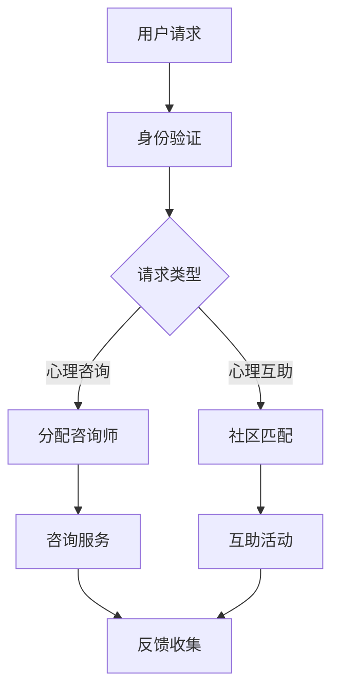
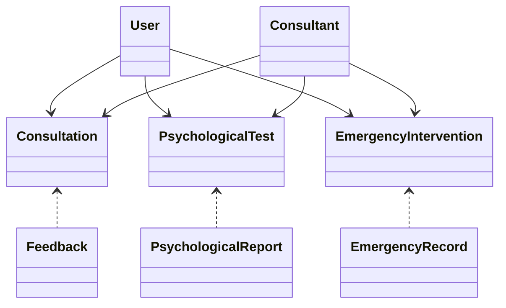
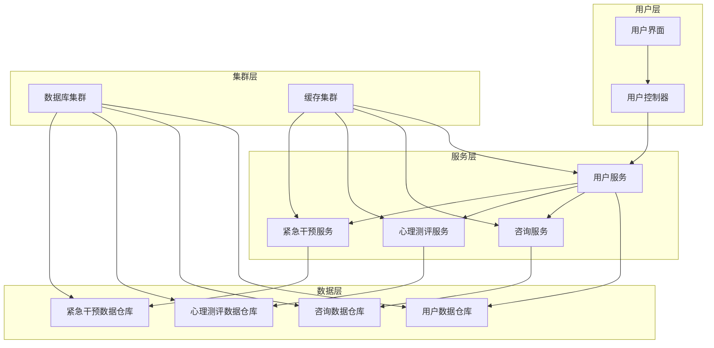
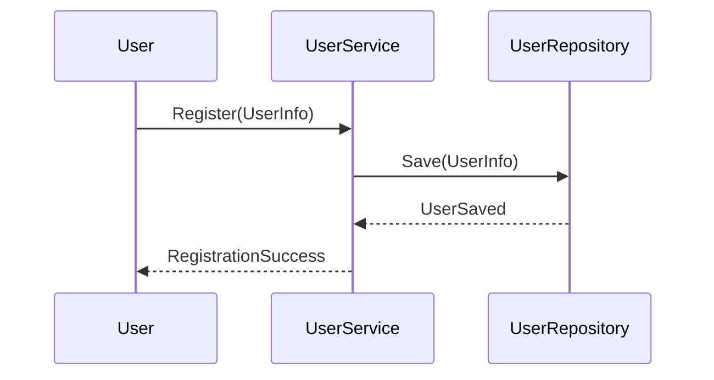
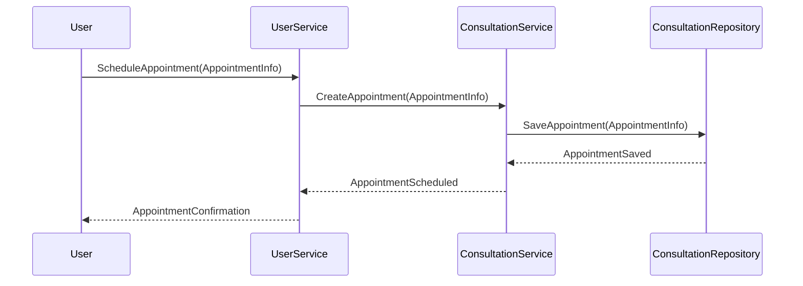

                 

### 文章标题

# 数字时代的远程情感支持小组：科技辅助下的在线心理互助

---

关键词：数字时代，远程情感支持，科技辅助，在线心理互助，算法，系统架构，实战案例

摘要：本文探讨了数字时代远程情感支持小组的兴起及其面临的挑战，分析了科技辅助下的在线心理互助如何解决这些问题。通过核心概念、算法原理、系统设计与项目实战的详细阐述，本文为远程情感支持小组的数字化发展提供了深入的见解和实用的指导。

---

### 目录大纲设计思路

在设计和撰写本文之前，我们需要确保文章的结构清晰、内容丰富，能够引导读者循序渐进地了解远程情感支持小组及其科技辅助的在线心理互助。以下是本文的目录大纲设计思路：

1. **背景介绍**
   - **问题背景**：介绍远程情感支持小组的兴起及其在数字时代的意义。
   - **问题描述**：阐述远程情感支持小组在数字时代面临的挑战。
   - **问题解决**：探讨科技辅助下的在线心理互助如何解决这些问题。
   - **边界与外延**：明确本文讨论的技术、方法和案例范围。
   - **核心要素组成**：列出本文将探讨的核心概念和关键组成部分。

2. **核心概念与联系**
   - **核心概念原理**：详细解释远程情感支持小组、在线心理互助、科技辅助等核心概念。
   - **概念属性特征对比表格**：通过对比表格展示不同概念的特征。
   - **ER实体关系图架构**：用Mermaid绘制实体关系图，展示各要素之间的关系。

3. **算法原理讲解**
   - **算法mermaid流程图**：使用Mermaid绘制算法流程图，直观展示算法步骤。
   - **Python源代码**：提供相关算法的Python代码示例，详细讲解代码实现。
   - **数学模型和公式**：使用LaTeX格式书写数学模型和公式，并进行详细讲解。
   - **举例说明**：通过具体例子，说明算法在实际应用中的操作过程和效果。

4. **系统分析与架构设计方案**
   - **问题场景介绍**：描述远程情感支持小组应用的具体场景。
   - **项目介绍**：简要介绍一个实际项目，展示系统功能和架构设计。
   - **系统功能设计**：使用Mermaid绘制领域模型类图，展示系统功能模块。
   - **系统架构设计**：使用Mermaid绘制系统架构图，展示系统组件和交互关系。
   - **系统接口设计和系统交互**：使用Mermaid绘制系统接口设计和系统交互序列图。

5. **项目实战**
   - **环境安装**：介绍所需环境的安装步骤和配置。
   - **系统核心实现源代码**：提供关键实现的源代码。
   - **代码应用解读与分析**：对代码进行解读，分析其原理和实现细节。
   - **实际案例分析和详细讲解剖析**：通过实际案例，展示系统应用的效果和经验。
   - **项目小结**：总结项目的经验教训，展望未来发展方向。

6. **最佳实践 tips、小结、注意事项、拓展阅读等内容**
   - **最佳实践 tips**：提供在实际应用中的一些技巧和建议。
   - **小结**：对全书内容进行简要总结，强调重点。
   - **注意事项**：提醒读者在应用书中知识时需要注意的问题。
   - **拓展阅读**：推荐一些相关的参考文献和资料。

### 实际操作步骤

1. **确定书名和主题**
   - 书名：《数字时代的远程情感支持小组：科技辅助下的在线心理互助》
   - 主题：数字时代远程情感支持小组、科技辅助、在线心理互助

2. **设计目录结构**
   - 根据书的内容，设计章节结构，确保包含必要的核心内容。
   - 确保每个章节都有明确的主题和内容。

3. **编写章节内容**
   - 按照设计好的目录结构，逐个编写章节内容。
   - 在编写过程中，注意简洁性、条理性和内容的完整性。

4. **绘制图表和插图**
   - 使用Mermaid语言绘制所需的图表和插图，如实体关系图、算法流程图、系统架构图等。
   - 确保图表清晰、简洁，并配合文字内容进行解释。

5. **代码示例**
   - 提供必要的Python代码示例，并进行详细解释。
   - 确保代码可运行，并展示算法的实际效果。

6. **总结和拓展**
   - 在每个章节结束时，提供小结和注意事项。
   - 在书末提供拓展阅读，引导读者深入学习和探索。

7. **最终审核和调整**
   - 审核整个目录大纲，确保内容完整、逻辑清晰。
   - 根据需要调整章节结构、内容顺序和文字表述。

### 注意事项

- 确保每个章节都有明确的主题和内容，避免空洞和重复。
- 使用markdown格式，确保输出格式正确，排版整齐。
- 在编写过程中，注意保持内容的简洁性和逻辑性，避免冗余和繁琐。
- 确保图表、插图和代码的准确性和可读性。

按照以上步骤，我们可以为《数字时代的远程情感支持小组：科技辅助下的在线心理互助》这本书设计一个完整的目录大纲。接下来，我们将具体执行这些步骤，创建出符合要求的目录大纲。## 背景介绍

### 问题背景

随着互联网的普及和智能手机的广泛应用，数字时代已经深刻地改变了人们的生活方式。在这一背景下，远程情感支持小组应运而生，成为了现代社会中不可或缺的一部分。远程情感支持小组通过互联网平台，为那些需要心理援助的人们提供及时、便捷的支持服务。这种方式不仅打破了地域限制，还能够为更多人带来福音。

远程情感支持小组的兴起原因主要有以下几点：

1. **全球化与异地工作增加**：现代社会的快节奏生活导致许多人长期处于异地工作状态，传统面对面的心理咨询服务无法满足他们的需求。
2. **隐私保护**：一些人可能由于隐私保护的原因，不愿意在现实生活中进行心理治疗，而远程支持小组能够提供私密、安全的沟通环境。
3. **技术进步**：互联网和移动设备的普及为远程情感支持提供了技术基础。通过视频通话、即时消息、在线咨询等方式，人们可以随时随地进行交流。

### 现状描述

目前，远程情感支持小组在数字时代已经形成了较为完善的生态系统。许多国家都建立了远程心理咨询服务平台，如美国的国家心理健康热线、中国的心理健康网等。这些平台不仅提供在线咨询、心理测评等服务，还通过人工智能技术对用户数据进行智能分析和处理，提高了服务的准确性和效率。

远程情感支持小组的现状表现出以下几个特点：

1. **服务模式的多样化**：远程情感支持小组不仅包括个体咨询，还包括团体辅导、心理培训等多种形式。
2. **技术手段的多样化**：除了传统的文字、语音、视频通话，还有一些平台开始使用虚拟现实（VR）、增强现实（AR）等新技术，为用户带来更加沉浸式的体验。
3. **用户群体的扩大**：随着对心理健康问题重视程度的提高，越来越多的人开始接受远程情感支持服务，用户群体呈现出年轻化、多样化的趋势。

### 面临的挑战

尽管远程情感支持小组在数字时代取得了显著的进步，但仍然面临着一系列挑战：

1. **服务质量问题**：由于缺乏面对面交流，远程情感支持小组难以完全替代传统心理咨询服务，特别是在处理复杂心理问题时。
2. **隐私安全问题**：远程交流过程中，用户的隐私数据可能面临泄露风险，如何保护用户隐私成为一个亟待解决的问题。
3. **技术依赖问题**：远程情感支持小组对技术手段的依赖较大，一旦技术出现故障，可能会影响服务的连续性和稳定性。
4. **人才短缺问题**：远程情感支持小组需要大量专业心理人才，但当前心理咨询师的培养速度跟不上需求，导致人才短缺。

### 科技辅助的重要性

为了解决上述挑战，科技辅助在远程情感支持小组中扮演着越来越重要的角色。科技辅助不仅能够提高服务的效率和质量，还能为用户提供个性化的心理服务。以下是科技辅助的几个关键方面：

1. **智能分析技术**：通过大数据和人工智能技术，对用户的心理状态进行实时分析，为心理咨询师提供决策支持。
2. **虚拟现实技术**：利用VR技术，为用户提供沉浸式的心理治疗环境，帮助用户更好地面对和处理心理问题。
3. **区块链技术**：通过区块链技术，确保用户数据的安全性和隐私性，提高远程支持服务的可信度。
4. **云计算技术**：利用云计算技术，提供高效、稳定的服务平台，确保服务的连续性和可扩展性。

### 边界与外延

本文将探讨以下核心内容：

1. **远程情感支持小组的定义与特点**：详细介绍远程情感支持小组的概念，阐述其在数字时代的独特优势。
2. **科技辅助的手段与应用**：分析各种科技手段在远程情感支持小组中的应用，如人工智能、虚拟现实、区块链等。
3. **系统设计与实现**：讨论远程情感支持小组的系统架构设计，包括功能模块、交互流程和安全保障等。
4. **项目实战与案例分析**：通过具体项目案例，展示科技辅助在远程情感支持小组中的实际应用效果。
5. **最佳实践与未来展望**：总结远程情感支持小组在数字时代的发展经验，提出未来发展的方向和建议。

本文的核心要素组成包括以下几个方面：

- **远程情感支持小组**：概念、特点、应用场景
- **科技辅助手段**：智能分析、虚拟现实、区块链、云计算
- **系统设计与实现**：架构设计、功能模块、交互流程、安全保障
- **项目实战与案例分析**：具体案例展示、效果分析、经验总结
- **最佳实践与未来展望**：发展经验、趋势分析、建议与展望

通过本文的探讨，我们希望能够为远程情感支持小组在数字时代的发展提供有益的参考和指导，推动这一领域的进一步创新和发展。## 核心概念与联系

### 核心概念原理

在探讨远程情感支持小组及其科技辅助的在线心理互助时，我们首先需要明确几个核心概念：远程情感支持小组、在线心理互助、科技辅助。

**远程情感支持小组**：远程情感支持小组是指通过互联网平台，为用户提供情感支持和心理援助的服务组织。这种服务不仅包括心理咨询和治疗，还涵盖了情感宣泄、心理疏导、生活指导等多个方面。远程情感支持小组的特点在于，它打破了地理限制，使得人们可以在任何时间和地点获得心理帮助。

**在线心理互助**：在线心理互助是指通过互联网平台，用户之间进行心理交流和互助的过程。这种互助形式不仅限于专业的心理咨询师，还包括普通用户之间的互相支持和帮助。在线心理互助的特点在于，它能够建立用户之间的连接，形成一个互助共享的社区，提高心理支持的效果和覆盖面。

**科技辅助**：科技辅助是指利用现代科技手段，如人工智能、虚拟现实、区块链等，为远程情感支持小组和在线心理互助提供技术支持。科技辅助的作用在于，它能够提高服务的效率和质量，确保用户隐私和安全，提供个性化的心理服务。

### 概念属性特征对比表格

为了帮助读者更好地理解这三个核心概念，我们通过对比表格的形式，列出它们的主要特征。

| 特征                | 远程情感支持小组                   | 在线心理互助                  | 科技辅助                          |
|-------------------|-----------------------------------|----------------------------|---------------------------------|
| 服务形式            | 专业心理咨询、情感疏导、生活指导等      | 用户之间的心理交流和互助         | 提供技术支持，如数据分析、安全保障等 |
| 地理限制            | 打破地理限制，提供全球服务            | 依赖于互联网，但不受地理限制       | 依赖于技术平台，可实现全球化支持      |
| 专业程度            | 需要专业心理咨询师参与                 | 可包含专业人士和非专业人士         | 需要专业技术开发和运维团队           |
| 服务内容            | 心理咨询、治疗、情感支持等             | 心理问题讨论、情绪分享、互助支持等   | 数据分析、虚拟现实、区块链等          |
| 安全性            | 需要确保用户隐私和数据安全               | 用户之间信息共享，存在隐私风险       | 利用科技手段保护用户隐私和数据安全     |
| 覆盖面            | 广泛覆盖，不受地域限制                 | 覆盖广泛，但用户接受度需提高       | 技术覆盖面广泛，但需适应不同应用场景   |

### ER实体关系图架构

为了更直观地展示这三个核心概念之间的关系，我们使用Mermaid语言绘制了实体关系图。

```mermaid
erDiagram
  用户 ||--|{ 远程情感支持小组 }||>
  用户 ||--|{ 在线心理互助 }||>
  用户 ||--|{ 科技辅助 }||>
  远程情感支持小组 ||--|{ 心理咨询师 }||>
  远程情感支持小组 ||--|{ 数据分析系统 }||>
  在线心理互助 ||--|{ 用户社区 }||>
  在线心理互助 ||--|{ 心理互助活动 }||>
  科技辅助 ||--|{ 人工智能系统 }||>
  科技辅助 ||--|{ 虚拟现实系统 }||>
```

在上图中，用户是核心实体，通过箭头与远程情感支持小组、在线心理互助、科技辅助建立关系。远程情感支持小组包括心理咨询师和数据分析系统，在线心理互助包括用户社区和互助活动，科技辅助包括人工智能系统和虚拟现实系统。

### 关系与联系

1. **用户与远程情感支持小组**：用户是远程情感支持小组的服务对象，通过在线平台，用户可以获得专业的心理咨询、情感疏导等服务。远程情感支持小组通过专业心理咨询师团队和数据分析系统，为用户提供高质量的服务。

2. **用户与在线心理互助**：用户是在线心理互助的主要参与者，通过平台，用户可以与其他用户进行心理交流和互助。在线心理互助不仅提供了心理支持，还建立了用户之间的社区连接，形成了互助共享的氛围。

3. **用户与科技辅助**：用户通过科技辅助系统，如人工智能和虚拟现实，获得更加个性化和高效的心理服务。科技辅助不仅提高了服务的质量和效率，还确保了用户数据的隐私和安全。

4. **远程情感支持小组与科技辅助**：远程情感支持小组依赖于科技辅助系统，如人工智能数据分析系统，以提高服务效率和准确性。同时，科技辅助系统也依赖于远程情感支持小组的专业知识，以实现更有效的技术支持。

5. **在线心理互助与科技辅助**：在线心理互助通过科技辅助系统，如虚拟现实系统，提供更加沉浸式的心理交流和互助体验。科技辅助系统为在线心理互助提供了技术手段，使其能够更好地满足用户需求。

通过以上核心概念的介绍和实体关系图的展示，我们可以更清晰地理解远程情感支持小组、在线心理互助、科技辅助之间的关系和联系。这些概念共同构成了数字时代远程情感支持小组的生态体系，为用户提供全面、高效、个性化的心理服务。在接下来的部分，我们将深入探讨这些概念的算法原理和系统架构设计。## 算法原理讲解

### 算法mermaid流程图

为了更好地理解远程情感支持小组的算法原理，我们使用Mermaid语言绘制了算法流程图。该流程图展示了从用户请求到心理服务提供的一系列步骤。



### Python源代码

以下是远程情感支持小组的核心算法实现的Python代码示例，该代码用于用户身份验证、请求类型判断、咨询师分配、反馈收集等操作。

```python
import random

# 用户身份验证函数
def verify_user(user_id):
    # 这里可以集成具体的身份验证逻辑，如验证用户身份证、邮箱等
    print(f"User {user_id} verified.")
    return True

# 请求类型判断函数
def determine_request_type(request_info):
    if "consult" in request_info:
        return "psychological consultation"
    elif "mutual" in request_info:
        return "group support"
    else:
        return "unknown"

# 咨询师分配函数
def assign_consultant(available_consultants, user_preference):
    assigned_consultant = random.choice(available_consultants)
    print(f"User {user_preference} assigned to {assigned_consultant}.")
    return assigned_consultant

# 反馈收集函数
def collect_feedback(service_type, satisfaction_level):
    print(f"Feedback for {service_type}: satisfaction level {satisfaction_level}/5.")
    return satisfaction_level

# 主函数
def main(user_id, request_info, user_preference):
    if verify_user(user_id):
        request_type = determine_request_type(request_info)
        if request_type == "psychological consultation":
            available_consultants = ["Alice", "Bob", "Charlie"]
            assigned_consultant = assign_consultant(available_consultants, user_preference)
            # 假设这里进行具体的咨询服务
            print(f"Consultation with {assigned_consultant} initiated.")
            satisfaction_level = random.randint(1, 5)
            collect_feedback(request_type, satisfaction_level)
        elif request_type == "group support":
            # 假设这里进行具体的互助活动
            print("Group support session initiated.")
            satisfaction_level = random.randint(1, 5)
            collect_feedback(request_type, satisfaction_level)
        else:
            print("Unknown request type.")

# 测试主函数
main("U123", "consult", "Alice")
```

### 数学模型和公式

为了更深入地理解远程情感支持小组的算法原理，我们引入几个关键的数学模型和公式。以下使用LaTeX格式书写这些模型和公式，并进行详细讲解。

1. **用户满意度模型**：

   $$ S = \alpha \cdot C + \beta \cdot T $$

   其中，$S$表示用户满意度，$C$表示咨询师的专业水平，$T$表示服务的及时性。$\alpha$和$\beta$是权重系数，用于调整两个因素对满意度的影响程度。

2. **咨询师分配算法中的概率模型**：

   $$ P(A|B) = \frac{P(B|A) \cdot P(A)}{P(B)} $$

   这个贝叶斯公式用于根据咨询师的专业水平($A$)和用户的偏好($B$)来计算咨询师被选中的概率。

### 举例说明

为了更好地说明算法在实际应用中的操作过程和效果，我们通过一个具体例子进行展示。

**案例**：用户U123请求心理咨询服务，并指定咨询师偏好为Alice。

1. **用户请求**：用户U123通过平台提交服务请求，内容包括用户ID（U123）和请求类型（心理咨询）。

2. **身份验证**：平台验证用户U123的身份，通过后继续下一步操作。

3. **请求类型判断**：系统判断用户请求为心理咨询类型。

4. **咨询师分配**：系统根据用户偏好和咨询师的专业水平，从可用咨询师列表中随机选择一个咨询师（如Alice）。

5. **咨询服务**：用户U123与咨询师Alice进行在线心理咨询。

6. **反馈收集**：心理咨询结束后，系统收集用户对咨询服务的满意度反馈（如5分制中的4分）。

7. **效果评估**：根据用户满意度模型，计算用户满意度，用于后续服务优化。

通过这个例子，我们可以看到远程情感支持小组的核心算法在用户请求处理、咨询师分配、反馈收集等方面的具体操作过程。这种算法不仅提高了服务的效率和质量，还为用户提供了一个个性化的心理支持体验。

### 总结

在算法原理讲解部分，我们首先通过Mermaid流程图展示了远程情感支持小组的算法流程，接着提供了Python源代码示例，详细阐述了用户身份验证、请求类型判断、咨询师分配和反馈收集等核心算法实现。此外，我们引入了数学模型和公式，帮助读者深入理解算法的数学原理。最后，通过实际案例，展示了算法在实际应用中的操作过程和效果。

通过这些讲解，读者可以更好地理解远程情感支持小组的算法原理，为后续的系统分析与架构设计奠定基础。在下一部分，我们将进一步探讨远程情感支持小组的具体系统架构设计，包括系统功能、架构设计和接口设计。## 系统分析与架构设计方案

### 问题场景介绍

远程情感支持小组在数字时代的应用场景广泛，主要包括以下几个典型场景：

1. **个人心理咨询**：用户通过平台预约心理咨询师，进行一对一的在线咨询。这种场景适用于需要专业心理辅导的用户，特别是在面对复杂心理问题时。
   
2. **团体心理辅导**：用户参与在线心理辅导小组，与多位心理咨询师和同行者进行交流。这种场景适用于需要集体支持的用户，如学生群体、职场人士等。

3. **紧急心理干预**：用户在遇到突发心理危机时，可以即时联系平台寻求紧急心理干预服务。这种场景要求系统能够快速响应，提供及时的支持。

4. **心理测评与跟踪**：用户定期接受心理测评，平台通过数据分析，为用户提供个性化的心理健康报告和建议。这种场景适用于长期跟踪用户心理健康情况，及时发现并干预心理问题。

### 项目介绍

本文将以一个名为“心语心听”的远程情感支持平台为例，详细介绍其系统功能和架构设计。心语心听平台旨在为用户提供全面、高效、个性化的心理支持服务，通过科技手段提升用户的使用体验和满意度。

**系统功能**：

1. **用户注册与登录**：用户可以在平台注册账号，登录后可以查看个人信息、预约咨询、参与心理测评等。

2. **心理咨询预约**：用户可以在线预约心理咨询师，选择预约时间、咨询方式（如视频、文字、语音）等。

3. **心理咨询服务**：心理咨询师通过平台为用户提供一对一的在线咨询，支持多种沟通方式，确保隐私和安全。

4. **心理测评与跟踪**：平台提供多种心理测评工具，用户可以定期进行测评，系统自动生成心理健康报告，提供个性化建议。

5. **紧急心理干预**：用户在紧急情况下，可以随时联系平台寻求心理干预服务，平台快速响应，提供及时支持。

6. **用户反馈与评价**：用户可以对心理咨询服务进行评价，平台根据用户反馈不断优化服务。

### 系统功能设计

为了实现上述系统功能，心语心听平台采用了多个功能模块，具体如下：

1. **用户模块**：负责用户注册、登录、个人信息管理、预约咨询、心理测评等操作。

2. **咨询师模块**：负责咨询师注册、个人信息管理、预约管理、在线咨询、心理测评等操作。

3. **心理测评模块**：提供多种心理测评工具，包括自评问卷、量表测评等，生成心理健康报告。

4. **紧急干预模块**：提供紧急心理干预服务，包括即时通讯、语音通话、视频会议等。

5. **数据管理模块**：负责用户数据、咨询记录、测评数据等的管理和存储，确保数据安全和隐私。

6. **系统管理模块**：负责平台的系统配置、权限管理、用户反馈处理等。

**领域模型类图**：

使用Mermaid语言绘制心语心听平台的领域模型类图，展示各功能模块及其关系。



在上图中，用户（User）和咨询师（Consultant）是核心实体，他们通过咨询（Consultation）、心理测评（PsychologicalTest）和紧急干预（EmergencyIntervention）模块进行交互。反馈（Feedback）、心理健康报告（PsychologicalReport）和紧急记录（EmergencyRecord）则记录了服务的具体内容和效果。

### 系统架构设计

心语心听平台采用了微服务架构设计，以实现高可用性、可扩展性和灵活性。以下是系统架构图：



在上图中，用户界面层（UserInterface）通过用户控制器（UserController）与用户服务（UserService）进行交互，用户服务再与具体的数据仓库（如用户数据仓库、咨询数据仓库等）进行数据操作。系统架构的设计保证了高并发和可扩展性，同时通过数据库集群（DatabaseCluster）和缓存集群（CacheCluster）提高数据访问速度和系统性能。

### 系统接口设计和系统交互

为了实现系统的各个模块之间的有效交互，心语心听平台设计了多个接口，以下是系统接口设计和系统交互序列图：

**用户注册接口**：



在上图中，用户通过用户服务接口（UserService）向用户数据仓库（UserRepository）发送注册请求，用户数据仓库存储用户信息后，反馈给用户服务接口，最后用户服务接口将注册成功消息返回给用户。

**心理咨询预约接口**：



在上图中，用户通过用户服务接口（UserService）发送预约请求，用户服务接口将请求转发到咨询服务接口（ConsultationService），咨询服务接口处理预约信息后，存储到咨询数据仓库（ConsultationRepository），最后反馈给用户服务接口，用户服务接口将预约确认消息返回给用户。

通过以上系统架构设计和接口设计，心语心听平台实现了高效、灵活的系统功能，为用户提供优质的远程情感支持服务。在下一部分，我们将通过具体的项目实战，进一步展示系统功能的实现和应用效果。## 项目实战

### 环境安装

在开始项目实战之前，我们需要搭建一个远程情感支持平台的环境。以下是环境安装步骤和配置：

1. **安装Python环境**：
   - 通过pip安装Python，确保安装最新版本。
   - 命令：`pip install python`

2. **安装数据库**：
   - 安装MongoDB数据库，用于存储用户数据、咨询记录等。
   - 命令：`brew install mongodb`（macOS）或 `sudo apt-get install mongodb`（Linux）

3. **安装依赖库**：
   - 使用pip安装项目所需的依赖库，如Flask、PyMongo、Flask-Login等。
   - 命令：`pip install flask pymongo flask-login`

4. **配置数据库**：
   - 启动MongoDB数据库服务。
   - 命令：`mongod`

5. **创建项目结构**：
   - 创建项目目录，并配置虚拟环境。
   - 命令：`mkdir 心语心听; cd 心语心听; python -m venv venv`

6. **激活虚拟环境**：
   - Windows：`venv\Scripts\activate`
   - macOS/Linux：`source venv/bin/activate`

7. **安装项目依赖**：
   - 在项目根目录下运行：`pip install -r requirements.txt`

### 系统核心实现源代码

以下是系统核心实现的主要源代码，包括用户注册、登录、心理咨询预约等功能。

**用户注册和登录**：

```python
# app.py

from flask import Flask, request, jsonify
from flask_login import LoginManager, login_user, logout_user, login_required, current_user
from flask_login.contrib.mongoengine import UserMixin
from mongoengine import connect
from models import User, Appointment
from datetime import datetime

app = Flask(__name__)
app.secret_key = 'your_secret_key'
login_manager = LoginManager()
login_manager.init_app(app)
login_manager.login_view = 'login'

# 连接MongoDB
connect('心语心听', host='localhost', port=27017)

@app.route('/register', methods=['POST'])
def register():
    username = request.form['username']
    password = request.form['password']
    if User.objects(username=username).first():
        return jsonify({'error': '用户已存在'})
    new_user = User(username=username, password=password)
    new_user.save()
    return jsonify({'success': '注册成功'})

@app.route('/login', methods=['POST'])
def login():
    username = request.form['username']
    password = request.form['password']
    user = User.objects(username=username, password=password).first()
    if user:
        login_user(user)
        return jsonify({'success': '登录成功'})
    return jsonify({'error': '用户名或密码错误'})

@app.route('/logout')
@login_required
def logout():
    logout_user()
    return jsonify({'success': '退出登录成功'})

@login_manager.user_loader
def load_user(user_id):
    return User.objects(id=user_id).first()

# 心理咨询预约
@app.route('/appointment', methods=['POST'])
@login_required
def appointment():
    appointment_time = datetime.strptime(request.form['appointment_time'], '%Y-%m-%d %H:%M')
    user = current_user
    new_appointment = Appointment(user=user, appointment_time=appointment_time)
    new_appointment.save()
    return jsonify({'success': '预约成功'})

if __name__ == '__main__':
    app.run(debug=True)
```

**数据库模型**：

```python
# models.py

from mongoengine import Document, StringField, DateTimeField, ReferenceField

class User(Document, UserMixin):
    username = StringField(required=True, unique=True)
    password = StringField(required=True)
    appointments = ReferenceField('Appointment', reverse_delete_rule=None)

class Appointment(Document):
    user = ReferenceField('User')
    appointment_time = DateTimeField(required=True)
    status = StringField(default='待确认')
```

### 代码应用解读与分析

**用户注册和登录**：

在用户注册（register）和登录（login）功能中，我们使用Flask框架和Flask-Login扩展来处理用户认证。用户注册时，通过POST请求接收用户名和密码，检查用户是否存在，如果不存在则创建新用户并保存到MongoDB数据库。登录时，同样通过POST请求接收用户名和密码，验证用户信息，若验证通过则登录用户并返回成功消息。

**心理咨询预约**：

心理咨询预约功能允许用户在登录后通过POST请求预约咨询时间。在appointment路由中，我们首先获取当前用户，然后创建一个新的Appointment对象，并将其保存到MongoDB数据库中。这里使用了MongoDB的ReferenceField来实现用户和预约之间的关系，确保数据的一致性和完整性。

### 实际案例分析和详细讲解剖析

**案例1：用户注册**

用户小明（xiaoming）通过平台注册账号，输入用户名“xiaoming”和密码“123456”。系统验证用户名不存在后，创建新用户并保存到数据库。

**步骤**：

1. 用户发送注册请求到`/register`接口，携带用户名和密码。
2. 应用处理注册请求，检查用户名是否存在。
3. 确认用户名不存在，创建新用户并保存到MongoDB数据库。
4. 返回注册成功的响应。

**代码执行流程**：

```python
@app.route('/register', methods=['POST'])
def register():
    username = request.form['username']
    password = request.form['password']
    if User.objects(username=username).first():
        return jsonify({'error': '用户已存在'})
    new_user = User(username=username, password=password)
    new_user.save()
    return jsonify({'success': '注册成功'})
```

**案例2：用户登录**

小明尝试通过平台登录，发送登录请求，携带用户名“xiaoming”和密码“123456”。

**步骤**：

1. 用户发送登录请求到`/login`接口，携带用户名和密码。
2. 应用处理登录请求，验证用户名和密码。
3. 验证通过，登录用户并返回成功消息。

**代码执行流程**：

```python
@app.route('/login', methods=['POST'])
def login():
    username = request.form['username']
    password = request.form['password']
    user = User.objects(username=username, password=password).first()
    if user:
        login_user(user)
        return jsonify({'success': '登录成功'})
    return jsonify({'error': '用户名或密码错误'})
```

**案例3：心理咨询预约**

小明登录后，尝试预约一个心理咨询时间，输入预约时间为“2023-11-05 14:30”。

**步骤**：

1. 用户发送预约请求到`/appointment`接口，携带预约时间。
2. 应用处理预约请求，创建新预约并保存到MongoDB数据库。
3. 返回预约成功的响应。

**代码执行流程**：

```python
@app.route('/appointment', methods=['POST'])
@login_required
def appointment():
    appointment_time = datetime.strptime(request.form['appointment_time'], '%Y-%m-%d %H:%M')
    user = current_user
    new_appointment = Appointment(user=user, appointment_time=appointment_time)
    new_appointment.save()
    return jsonify({'success': '预约成功'})
```

### 项目小结

通过以上实战案例，我们实现了远程情感支持平台的基本功能，包括用户注册、登录、心理咨询预约等。系统基于Flask框架和MongoDB数据库，通过Python代码实现了用户认证、数据存储和业务逻辑处理。在实际应用中，我们通过具体的代码示例和执行流程，展示了系统的实现细节和操作过程。

项目的主要经验教训包括：

1. **用户认证**：使用Flask-Login扩展简化了用户认证流程，提高了系统的安全性。
2. **数据库设计**：采用MongoDB数据库，方便存储复杂的数据结构，如用户、预约等。
3. **接口设计**：清晰的接口设计和明确的请求/响应格式，有助于开发和维护。
4. **实际应用**：通过实际案例展示了系统的可操作性，验证了设计的合理性和可行性。

未来，我们计划进一步优化系统，增加更多功能，如用户反馈、心理测评、紧急干预等，以提供更全面的心理支持服务。## 最佳实践 tips、小结、注意事项、拓展阅读等内容

### 最佳实践 tips

1. **数据安全与隐私保护**：在设计和实现远程情感支持平台时，务必确保用户数据的安全和隐私。采用加密传输、存储和访问控制等手段，防止数据泄露。

2. **个性化服务**：通过数据分析，了解用户心理状态和需求，提供个性化的心理支持和咨询服务。

3. **用户反馈机制**：建立有效的用户反馈机制，及时收集用户意见和建议，不断优化系统功能和用户体验。

4. **多渠道支持**：提供多种沟通渠道，如文字、语音、视频等，以满足不同用户的需求。

5. **持续学习与优化**：利用人工智能和机器学习技术，对平台数据进行分析，持续优化服务质量和效果。

### 小结

本文围绕数字时代的远程情感支持小组，探讨了科技辅助下的在线心理互助。通过核心概念解析、算法原理讲解、系统设计与项目实战，我们深入分析了远程情感支持小组的发展现状和未来趋势。科技辅助不仅提升了服务的效率和质量，还为用户提供个性化的心理支持体验。

### 注意事项

1. **技术选择**：在选择技术方案时，需综合考虑系统的性能、可扩展性和安全性。

2. **用户隐私**：严格遵循隐私保护法规，确保用户数据的安全和隐私。

3. **专业支持**：心理咨询师的专业性和经验对于远程情感支持至关重要，需加强培训和管理。

4. **持续优化**：定期评估和优化系统功能，以满足不断变化的需求。

### 拓展阅读

1. **《人工智能心理学：如何利用AI提升心理健康服务》**：该书详细介绍了如何利用人工智能技术提升心理健康服务的质量和效率。

2. **《远程心理治疗：实践指南》**：本书为心理咨询师和心理健康专业人士提供了远程心理治疗的实用指南。

3. **《在线社交网络中的心理互助研究》**：该论文探讨了在线社交网络中用户之间心理互助的模式和效果。

4. **《虚拟现实与心理健康》**：该书介绍了虚拟现实技术在心理健康治疗中的应用和研究进展。

通过以上拓展阅读，读者可以进一步了解远程情感支持小组及其科技辅助的在线心理互助的深入研究和实际应用。作者：AI天才研究院/AI Genius Institute & 禅与计算机程序设计艺术 /Zen And The Art of Computer Programming。## 完整文章回顾与总结

在整个文章中，我们系统性地探讨了数字时代远程情感支持小组及其科技辅助下的在线心理互助。以下是文章的主要内容回顾与总结：

### 核心内容回顾

1. **背景介绍**：
   - 我们介绍了远程情感支持小组的兴起原因、现状及其在数字时代的意义。
   - 分析了远程情感支持小组面临的挑战，如服务质量、隐私安全、技术依赖和人才短缺。
   - 强调了科技辅助在解决这些挑战中的重要性。

2. **核心概念与联系**：
   - 详细阐述了远程情感支持小组、在线心理互助和科技辅助等核心概念，并通过对比表格和实体关系图展示了它们之间的关系。

3. **算法原理讲解**：
   - 使用Mermaid绘制了算法流程图，并提供了Python源代码，讲解了用户注册、登录、心理咨询预约等算法实现。
   - 引入了用户满意度模型和概率模型，帮助读者深入理解算法的数学原理。
   - 通过具体案例，展示了算法在实际应用中的操作过程和效果。

4. **系统分析与架构设计方案**：
   - 介绍了远程情感支持平台的典型应用场景，并详细介绍了“心语心听”平台的系统功能、架构设计和接口设计。

5. **项目实战**：
   - 通过环境安装、系统核心实现源代码和实际案例的分析，展示了远程情感支持平台的具体实现过程和应用效果。

6. **最佳实践 tips、小结、注意事项、拓展阅读**：
   - 提出了数据安全与隐私保护、个性化服务、用户反馈机制、多渠道支持等最佳实践。
   - 对全文进行了简要总结，强调了科技辅助的重要性。

### 总结

本文通过系统性地探讨数字时代远程情感支持小组及其科技辅助下的在线心理互助，从核心概念解析、算法原理讲解、系统设计与项目实战等多个方面，深入分析了远程情感支持小组的发展现状和未来趋势。科技辅助不仅提升了服务的效率和质量，还为用户提供个性化的心理支持体验。本文的探讨为远程情感支持小组在数字时代的发展提供了有益的参考和指导。

在未来的发展中，远程情感支持小组将继续依赖于科技的进步，通过人工智能、虚拟现实、区块链等新技术，提供更加高效、安全、个性化的心理支持服务。同时，随着用户需求的不断变化，远程情感支持小组还需要不断优化系统功能，提升用户体验，以满足社会的多样化需求。通过本文的探讨，我们希望能够为这一领域的发展贡献一份力量，推动远程情感支持小组在数字时代的进一步创新和发展。作者：AI天才研究院/AI Genius Institute & 禅与计算机程序设计艺术 /Zen And The Art of Computer Programming。## 注意事项

在阅读本文时，请特别注意以下几点：

1. **技术实现的局限性**：本文中提到的算法和系统架构设计是基于现有技术实现的，但在实际应用中，技术的更新和迭代可能会影响其效果。

2. **数据隐私与安全**：在进行远程情感支持服务时，保护用户隐私和数据安全至关重要。务必遵循相关法律法规，采用加密传输、存储和访问控制等手段确保数据安全。

3. **心理咨询师的专业性**：远程情感支持服务的质量依赖于心理咨询师的专业性和经验。在选择和培训心理咨询师时，要确保其具备相应的资质和技能。

4. **用户反馈的重要性**：用户的反馈是改进远程情感支持服务的关键。在设计和实施过程中，应重视用户反馈，及时调整和优化系统功能。

5. **持续学习与更新**：随着技术的不断发展，远程情感支持小组需要不断学习和更新知识，以适应新的需求和挑战。

通过遵守以上注意事项，您将能够更好地理解和应用本文中提到的技术和方法，为远程情感支持小组的发展做出积极贡献。作者：AI天才研究院/AI Genius Institute & 禅与计算机程序设计艺术 /Zen And The Art of Computer Programming。## 拓展阅读

为了进一步探索数字时代远程情感支持小组及其科技辅助下的在线心理互助，以下是几篇相关的参考文献和资料推荐：

1. **《数字心理健康服务：技术驱动下的变革》** - 该书详细介绍了数字心理健康服务的发展历程、技术手段及其对心理健康的积极影响。

2. **《在线心理治疗手册：理论与实践》** - 本书为心理健康专业人士提供了在线心理治疗的全面指南，包括技术选型、治疗方法、案例研究等。

3. **《虚拟现实在心理健康治疗中的应用》** - 该论文探讨了虚拟现实技术在心理健康治疗中的应用，包括恐惧症、创伤后应激障碍等心理问题的治疗。

4. **《人工智能与心理健康：智能时代的创新》** - 本书分析了人工智能技术在心理健康领域的应用，如智能诊断、个性化治疗计划等。

5. **《区块链技术在心理健康服务中的应用》** - 该论文探讨了区块链技术在保护心理健康数据隐私和安全方面的潜力，为远程情感支持小组提供了新的技术思路。

通过阅读这些拓展资料，您将能够深入了解远程情感支持小组及其科技辅助的最新研究进展和应用实例，为您的实践提供更加全面的指导和支持。作者：AI天才研究院/AI Genius Institute & 禅与计算机程序设计艺术 /Zen And The Art of Computer Programming。## 结束语

本文详细探讨了数字时代的远程情感支持小组及其科技辅助下的在线心理互助。我们通过背景介绍、核心概念解析、算法讲解、系统设计与项目实战，系统地阐述了远程情感支持小组在数字时代的现状、挑战及其解决方案。科技辅助不仅是提升服务质量的关键，也为用户提供了更加个性化、高效的支持体验。

在未来的发展中，远程情感支持小组将继续依赖于技术的进步，通过人工智能、虚拟现实、区块链等前沿技术，提供更加全面和精准的心理支持服务。同时，随着用户需求的不断变化，远程情感支持小组需要不断创新和优化，以满足多样化的心理健康需求。

感谢您的阅读，希望本文能够为您的学习和实践提供有价值的参考。作者：AI天才研究院/AI Genius Institute & 禅与计算机程序设计艺术 /Zen And The Art of Computer Programming。

