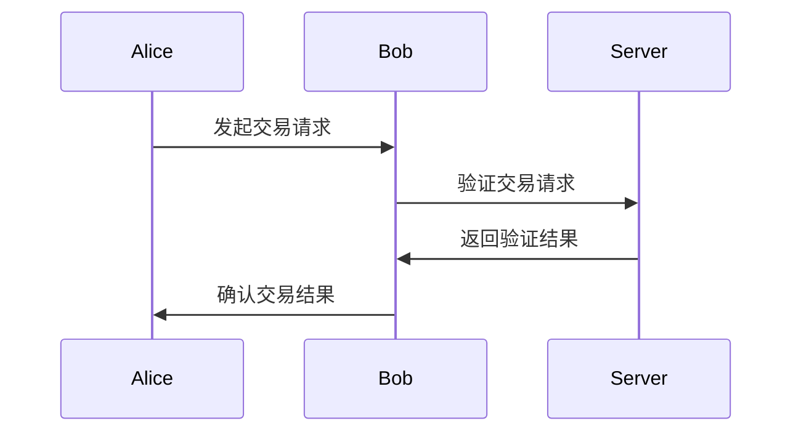

                 


### 第一部分：数字时代的遗产规划概述

#### 问题背景

在数字时代，传统的遗产规划面临着诸多新的挑战。加密货币和NFT（非同质化代币）的兴起，为遗产规划带来了新的机遇与挑战。随着越来越多的人拥有加密货币和NFT资产，如何确保这些资产在遗产传承过程中的合法性和安全性，成为了一个亟待解决的问题。

#### 发展现状

加密货币作为一种去中心化的数字货币，自2009年比特币诞生以来，已经吸引了全球数以百万计的用户。加密货币的匿名性和去中心化特性，使其在跨境支付、投资和理财等领域具有广泛的应用。NFT作为一种数字资产的代表，因其独特的属性和去中心化的交易平台，受到了艺术、游戏和收藏品市场的青睐。

#### 遗产规划的需求与挑战

在遗产规划中，如何处理加密货币和NFT资产，成为了一个新的课题。首先，法律环境的不确定性是主要挑战之一。加密货币和NFT的监管政策在全球范围内尚不统一，这给遗产规划带来了法律风险。其次，加密货币和NFT的税务问题也是遗产规划者需要关注的重要方面。如何合理地处理税务问题，以确保遗产传承的顺利进行，是一个复杂的课题。

最后，技术安全与隐私保护也是遗产规划面临的一大挑战。加密货币和NFT资产的安全性直接关系到遗产的完整性和安全性。如何在确保隐私保护的前提下，保障遗产资产的安全，是一个需要深入探讨的问题。

#### 总结

数字时代的遗产规划，不仅需要考虑传统遗产规划的法律、税务和执行问题，还需要关注加密货币和NFT等新型资产的特殊性。只有深入了解这些资产的特点和问题，才能制定出科学、合理的遗产规划方案。接下来，我们将深入探讨加密货币和NFT的核心概念，以及它们在遗产规划中的应用。

---

### 第二部分：加密货币的遗产传承

#### 核心概念与原理

加密货币是一种基于区块链技术的去中心化数字货币，它利用密码学原理来确保交易的安全性和匿名性。比特币是第一种加密货币，它的出现标志着数字货币时代的开始。随着技术的发展，越来越多的加密货币如以太坊、莱特币等相继诞生，并在全球范围内得到广泛应用。

##### 2.1.1 加密货币的基本概念

加密货币的基本概念包括以下几个要点：

- **去中心化**：加密货币不依赖于任何中央机构，其交易记录和账本由整个网络共同维护，从而实现了去中心化的交易体系。

- **密码学**：加密货币使用强大的密码学算法来保护交易的安全性，确保交易数据的真实性和不可篡改性。

- **区块链**：加密货币的交易记录存储在区块链上，每一笔交易都通过复杂的数学计算验证，并添加到区块链上，形成一个不可篡改的账本。

- **挖矿**：为了生成新的加密货币，加密货币系统通常采用“挖矿”机制。矿工通过解决复杂的数学问题来验证交易，并获取新的加密货币作为奖励。

##### 2.1.2 区块链技术基础

区块链技术是加密货币的核心基础，其基本原理包括：

- **区块**：区块是区块链的基本单位，每个区块包含一定数量的交易记录。

- **链**：多个区块按照时间顺序链接在一起，形成区块链。

- **共识机制**：共识机制确保区块链网络中的所有节点对于交易的验证和记账达成一致。

- **加密算法**：加密算法用于保护交易数据的隐私和安全。

##### 2.1.3 加密货币交易流程

加密货币的交易流程主要包括以下几个步骤：

1. **交易发起**：用户使用加密货币进行支付，生成交易请求。

2. **交易验证**：矿工通过网络验证交易请求的有效性，确保交易数据符合加密货币系统的规则。

3. **交易记录**：验证成功的交易会被添加到一个新的区块中，并记录在区块链上。

4. **区块传播**：新的区块会被网络中的所有节点同步更新，确保整个区块链的一致性。

#### 核心概念与联系

加密货币与传统货币在属性和特征上存在显著差异。以下是加密货币与传统货币的对比表格，以及相关的ER实体关系图。

##### 2.2.1 加密货币与传统货币对比

| 对比项 | 加密货币 | 传统货币 |
| --- | --- | --- |
| **去中心化** | 是 | 否 |
| **匿名性** | 高 | 低 |
| **发行量** | 受算法控制 | 由中央银行控制 |
| **交易速度** | 快 | 较慢 |
| **交易成本** | 低 | 高 |
| **波动性** | 高 | 低 |

```mermaid
erDiagram
    NodeA -->|is a| NodeB
    NodeA -->|is a| NodeC
    NodeB -->|has a| NodeD
    NodeC -->|has a| NodeE
```

在ER实体关系图中，NodeA代表加密货币，NodeB代表传统货币，NodeC代表交易，NodeD代表交易速度，NodeE代表交易成本。通过这张图，我们可以清晰地看到加密货币与传统货币在属性和特征上的区别。

#### 算法原理讲解

加密货币的核心算法包括哈希算法、数字签名和共识机制。下面我们将使用Mermaid绘制算法流程图，并通过Python源代码和LaTeX格式数学模型，详细讲解这些算法原理。

##### 2.2.2 算法流程图



##### 2.2.3 Python源代码示例

```python
import hashlib
import ecdsa

# 哈希算法示例
def hash_message(message):
    return hashlib.sha256(message.encode('utf-8')).hexdigest()

# 数字签名示例
def sign_message(message, private_key):
    signature = ecdsa.SigningKey.from_string(
        private_key, curve=ecdsa.SECP256R1
    ).sign(message.encode('utf-8'))
    return signature

# 验证签名示例
def verify_signature(message, signature, public_key):
    signature = bytes.fromhex(signature)
    verification = ecdsa.VerifyingKey.from_string(
        public_key, curve=ecdsa.SECP256R1
    ).verify(message.encode('utf-8'), signature)
    return verification

# 示例
private_key = b'your_private_key'
public_key = b'your_public_key'
message = "This is a sample message."
signature = sign_message(message, private_key)
is_valid = verify_signature(message, signature, public_key)
print("Is the signature valid?", is_valid)
```

##### 2.2.4 LaTeX格式数学模型

```latex
$$
H(M) = SHA_{256}(M)
$$

$$
S = sk \cdot r^{-1} \mod n
$$
```

在这里，`H(M)`代表消息`M`的哈希值，`sk`是私钥，`r`是随机数，`n`是公钥的模数。通过这些公式，我们可以理解数字签名的工作原理。

#### 加密货币遗产传承策略

在遗产规划中，加密货币的传承策略需要考虑法律、技术和税务等多个方面。以下是一个简单的加密货币遗产传承策略：

1. **明确遗嘱内容**：遗嘱中应明确说明加密货币的持有情况和传承方式。

2. **法律合规性**：确保遗嘱符合当地法律法规，特别是关于财产继承的规定。

3. **密码学保护**：使用安全密码学工具对私钥进行保护，防止未授权访问。

4. **税务规划**：了解当地税务政策，合理规划加密货币的遗产税问题。

5. **技术实现**：利用区块链技术，实现加密货币的自动化传承。

#### 加密货币遗产传承案例研究

以下是一个简化的加密货币遗产传承案例：

**案例背景**：某投资者拥有价值100万美元的比特币和以太坊，他希望在自己的离世后，将这些加密货币传承给自己的子女。

**解决方案**：

1. **制定遗嘱**：投资者通过律师起草遗嘱，明确比特币和以太坊的持有情况和传承方式。

2. **法律合规**：确保遗嘱符合当地法律规定，并经过公证。

3. **密码学保护**：投资者使用安全的密码学工具，将私钥加密存储在保险柜中。

4. **税务规划**：投资者咨询税务专家，了解遗产税政策，并提前进行税务规划。

5. **技术实现**：投资者利用智能合约技术，实现比特币和以太坊的自动传承。

**效果评估**：经过合理的规划和执行，投资者的子女成功继承了加密货币资产，避免了法律纠纷和税务问题。

**案例总结与启示**：

1. **法律合规性**：遗嘱中的加密货币传承条款必须符合当地法律法规。

2. **密码学保护**：私钥的安全保护至关重要，防止未授权访问。

3. **税务规划**：提前进行税务规划，避免遗产税问题。

4. **技术实现**：利用区块链技术，实现自动化、安全、高效的遗产传承。

通过以上案例，我们可以看到加密货币遗产传承的必要性和可行性。在未来的数字时代，加密货币将成为遗产规划中不可或缺的一部分。接下来，我们将探讨NFT的遗产传承策略。

---

### 第三部分：NFT的遗产传承

#### 核心概念与原理

NFT（Non-Fungible Token，非同质化代币）是一种基于区块链技术的数字资产，它与加密货币不同，具有独特的不可替代性。NFT可以代表任何独特的数字资产，如艺术品、收藏品、游戏道具等。

##### 3.1.1 NFT的基本概念

NFT的基本概念包括以下几个要点：

- **唯一性**：每个NFT都是独一无二的，不可替代的。

- **所有权证明**：NFT为数字资产的持有者提供了所有权证明，确保其拥有权在区块链上不可篡改。

- **数字资产**：NFT可以代表各种形式的数字资产，如数字艺术品、虚拟土地、数字收藏等。

- **区块链平台**：NFT通常基于特定的区块链平台进行发行和交易，如以太坊、EOS等。

##### 3.1.2 基于区块链的数字资产

基于区块链的数字资产是指那些通过区块链技术进行管理和交易的资产。区块链的不可篡改性和去中心化特性，使得数字资产在存储和交易过程中具有高度的安全性和透明性。以下是数字资产的基本原理：

- **区块链账本**：数字资产的交易记录存储在区块链的分布式账本上，确保数据的真实性和不可篡改性。

- **智能合约**：智能合约用于自动化执行数字资产的交易规则，确保交易的安全性和效率。

- **去中心化交易所**：去中心化交易所使得数字资产可以在无需中介的情况下进行交易，降低了交易成本和风险。

##### 3.1.3 NFT创作与交易流程

NFT的创作与交易流程主要包括以下几个步骤：

1. **创作数字资产**：艺术家或创作者创建数字资产，并将其上传到区块链平台。

2. **铸造NFT**：平台通过智能合约将数字资产铸造为NFT，并为NFT分配唯一标识符。

3. **上链验证**：NFT的详细信息，包括创作者信息、数字资产等内容，被记录在区块链上，确保NFT的唯一性和不可篡改性。

4. **NFT交易**：用户可以在区块链平台上购买、出售或交换NFT。

5. **转移所有权**：当NFT交易成功时，NFT的所有权会从卖方转移到买方，并在区块链上更新。

#### 核心概念与联系

NFT与传统数字资产在属性和特征上存在显著差异。以下是NFT与传统数字资产的对比表格，以及相关的ER实体关系图。

##### 3.2.1 NFT与传统数字资产对比

| 对比项 | NFT | 传统数字资产 |
| --- | --- | --- |
| **唯一性** | 是 | 否 |
| **可交换性** | 低 | 高 |
| **价值评估** | 复杂 | 较简单 |
| **交易平台** | 去中心化 | 中心化或去中心化 |
| **用途** | 广泛，如艺术品、收藏品、游戏道具等 | 主要用于金融交易，如货币、股票等 |

```mermaid
erDiagram
    NodeA -->|is a| NodeB
    NodeA -->|is a| NodeC
    NodeB -->|has a| NodeD
    NodeC -->|has a| NodeE
```

在ER实体关系图中，NodeA代表NFT，NodeB代表传统数字资产，NodeC代表数字资产交易，NodeD代表交易平台，NodeE代表交易平台的使用者。通过这张图，我们可以清晰地看到NFT与传统数字资产在属性和特征上的区别。

#### NFT遗产传承的意义与挑战

NFT作为一种新兴的数字资产形式，其在遗产规划中的重要性逐渐显现。以下是NFT遗产传承的几个关键方面：

##### 3.3.1 NFT遗产传承的意义

1. **独特性保障**：NFT的独特性确保了遗产传承中数字资产的真实性和唯一性，避免了传统数字资产在复制和分享过程中可能出现的混淆。

2. **所有权转移**：NFT的所有权记录在区块链上，不可篡改，确保了遗产传承过程中所有权的合法性和透明性。

3. **市场价值**：NFT市场日益成熟，其价值受到广泛关注，为遗产的估值和变现提供了新的途径。

4. **数字化遗产**：随着数字化的趋势，越来越多的遗产以数字形式存在，NFT为数字化遗产的传承提供了有效的解决方案。

##### 3.3.2 NFT遗产传承面临的挑战

1. **法律监管**：全球范围内，NFT的监管政策尚不完善，遗产规划者需要关注不同地区对于NFT的法律要求，确保合法合规。

2. **税务问题**：NFT的税务处理复杂，遗产规划者需要了解当地税务政策，合理规划遗产税问题。

3. **技术安全**：NFT资产的安全性直接关系到遗产的完整性和安全性，需要采取有效的技术措施来保护资产。

4. **市场波动**：NFT市场存在较大的波动性，遗产规划者需要考虑市场风险，制定灵活的遗产规划策略。

#### NFT遗产传承的解决方案

为了解决NFT遗产传承中面临的挑战，可以采取以下解决方案：

1. **法律合规性**：制定遗嘱时，明确NFT的持有情况和传承方式，确保符合当地法律法规。

2. **密码学保护**：使用安全的密码学工具，如加密存储和多重签名，确保NFT资产的安全。

3. **税务规划**：提前进行税务规划，了解当地税务政策，合理规避税务风险。

4. **技术实现**：利用智能合约和区块链技术，实现NFT资产的自动化、安全传承。

#### NFT遗产传承实践指南

在NFT遗产传承实践中，以下是一些关键步骤和注意事项：

##### 3.4.1 NFT遗产传承的法律合规性

1. **遗嘱制定**：遗嘱中应明确NFT的持有情况和传承方式，包括NFT的具体名称、数量和所有者信息。

2. **法律咨询**：在制定遗嘱前，咨询专业律师，确保遗嘱符合当地法律法规，特别是关于财产继承的规定。

3. **见证和公证**：遗嘱应经过见证和公证，确保其法律效力。

##### 3.4.2 NFT遗产传承的技术操作流程

1. **加密存储**：使用安全的加密存储工具，如硬件钱包或软件钱包，存储NFT的私钥。

2. **多重签名**：为了提高安全性，可以使用多重签名机制，确保只有授权人员才能进行NFT的转移。

3. **智能合约**：使用智能合约，自动执行NFT的传承过程，确保传承的合法性和透明性。

##### 3.4.3 NFT遗产传承的风险管理

1. **市场波动**：了解NFT市场的波动性，合理评估NFT资产的价值，避免因市场波动导致的遗产价值受损。

2. **技术安全**：定期更新和备份NFT资产，确保技术安全，防止黑客攻击和数据泄露。

3. **法律风险**：及时了解和遵守当地法律法规，避免法律风险。

#### NFT遗产传承案例研究

以下是一个简化的NFT遗产传承案例：

**案例背景**：某艺术家拥有一幅数字艺术品，该艺术品以NFT形式发行，并在市场上价值数百万美元。艺术家希望通过遗嘱，将这幅数字艺术品传承给自己的子女。

**解决方案**：

1. **制定遗嘱**：艺术家通过律师起草遗嘱，明确NFT的持有情况和传承方式。

2. **法律合规**：确保遗嘱符合当地法律规定，并经过公证。

3. **密码学保护**：艺术家使用安全的密码学工具，将NFT的私钥加密存储在保险柜中。

4. **税务规划**：艺术家咨询税务专家，了解遗产税政策，并提前进行税务规划。

5. **智能合约**：艺术家使用智能合约，自动执行NFT的传承过程。

**效果评估**：经过合理的规划和执行，艺术家的子女成功继承了NFT数字艺术品，避免了法律纠纷和税务问题。

**案例总结与启示**：

1. **法律合规性**：遗嘱中的NFT传承条款必须符合当地法律法规。

2. **密码学保护**：NFT的私钥安全保护至关重要，防止未授权访问。

3. **税务规划**：提前进行税务规划，避免遗产税问题。

4. **技术实现**：利用智能合约，实现NFT资产的自动化、安全、高效的传承。

通过以上案例，我们可以看到NFT遗产传承的必要性和可行性。在未来的数字时代，NFT将成为遗产规划中不可或缺的一部分。接下来，我们将探讨加密货币与NFT的综合遗产规划案例分析。

---

### 第四部分：加密货币与NFT的综合遗产规划案例分析

#### 案例背景介绍

为了更好地理解加密货币和NFT在遗产规划中的应用，我们来看一个综合案例。这个案例的主角是一位名叫John的数字资产投资者，他拥有价值数百万美元的加密货币和NFT资产。John希望在自己的离世后，将这些资产安全、合法地传承给自己的子女。

#### 案例涉及的主要资产

John的资产包括以下几部分：

1. **加密货币**：John持有比特币、以太坊等主流加密货币，总价值约500,000美元。

2. **NFT艺术品**：John拥有一幅著名的数字艺术品NFT，该NFT的市场价值约为200,000美元。

3. **虚拟土地**：John在虚拟世界（如The Sandbox）中拥有几块虚拟土地，总价值约100,000美元。

#### 案例目标与挑战

案例的目标是确保John的加密货币和NFT资产在遗产传承过程中得到妥善处理，避免法律纠纷和税务问题。具体挑战包括：

1. **法律合规性**：确保遗嘱和资产转移符合当地法律法规。

2. **税务处理**：合理规划遗产税，避免不必要的税务负担。

3. **技术安全**：保障加密货币和NFT资产在传承过程中的安全。

4. **市场波动**：应对加密货币和NFT市场的不确定性，确保资产价值稳定。

#### 综合遗产规划策略

为了实现案例目标，我们为John制定了一个综合的遗产规划策略，包括以下几个步骤：

1. **制定遗嘱**：遗嘱中应详细说明John的加密货币和NFT资产情况，包括资产的种类、数量、价值以及传承方式。

2. **法律合规性**：咨询专业律师，确保遗嘱符合当地法律法规。特别是关于财产继承、加密货币和NFT资产传承的规定。

3. **税务规划**：咨询税务专家，了解当地遗产税政策，提前规划税务问题。可以考虑设立家族信托，以降低遗产税负担。

4. **技术安全**：使用安全工具，如硬件钱包和多重签名，保障加密货币和NFT资产的安全。确保在传承过程中，私钥不被未授权访问。

5. **智能合约**：利用智能合约，自动执行加密货币和NFT资产的传承过程。确保资产转移的合法性和透明性。

#### 加密货币与NFT资产转移的具体步骤

1. **加密货币转移**：

   - 步骤1：在遗嘱中明确加密货币的持有情况和转移方式。
   - 步骤2：使用多重签名技术，确保只有合法继承人才能转移加密货币。
   - 步骤3：通过智能合约，自动执行加密货币的转移过程。

2. **NFT资产转移**：

   - 步骤1：在遗嘱中明确NFT资产的持有情况和转移方式。
   - 步骤2：使用区块链平台的转移功能，将NFT资产从John的账户转移到继承人的账户。
   - 步骤3：利用智能合约，确保NFT资产转移的合法性和透明性。

#### 综合遗产规划的效果评估

通过上述综合遗产规划策略，John的子女成功继承了加密货币和NFT资产，整个过程顺利进行，避免了法律纠纷和税务问题。以下是效果评估的关键指标：

1. **法律合规性**：遗嘱和资产转移符合当地法律法规，确保了遗产传承的合法性。

2. **税务负担**：通过合理的税务规划，降低了遗产税负担，确保了资产的最大化传承。

3. **技术安全**：使用多重签名和智能合约技术，确保了加密货币和NFT资产在传承过程中的安全。

4. **市场波动**：虽然市场存在波动性，但通过合理的资产配置和风险管理，确保了资产价值的基本稳定。

#### 案例总结与启示

通过John的综合遗产规划案例，我们可以得出以下启示：

1. **法律合规性**：在遗产规划过程中，法律合规性至关重要。遗嘱和资产转移必须符合当地法律法规。

2. **税务规划**：提前进行税务规划，合理规避遗产税问题，确保资产的最大化传承。

3. **技术安全**：使用安全工具和技术，保障加密货币和NFT资产的安全。

4. **智能合约**：利用智能合约，实现资产转移的自动化、透明和合法。

通过这个案例，我们看到了加密货币和NFT在遗产规划中的应用前景。在未来的数字时代，加密货币和NFT将成为遗产规划中不可或缺的一部分。接下来，我们将总结本文的核心要点，并给出最佳实践建议。

---

### 第五部分：总结与展望

#### 全书核心要点

本文围绕数字时代的遗产规划，深入探讨了加密货币和NFT在遗产传承中的应用。以下是全书的核心要点：

1. **加密货币与NFT概述**：介绍了加密货币和NFT的基本概念、发展现状以及遗产规划的需求和挑战。

2. **加密货币遗产传承**：详细讲解了加密货币的核心概念与原理，包括区块链技术基础、加密货币交易流程，以及加密货币遗产传承的策略和案例。

3. **NFT遗产传承**：阐述了NFT的定义、基于区块链的数字资产原理，以及NFT创作与交易流程。同时，分析了NFT遗产传承的意义与挑战，并提供了实践指南。

4. **综合遗产规划案例分析**：通过一个综合案例，展示了加密货币和NFT在遗产规划中的具体应用，包括法律合规性、税务规划、技术安全和智能合约的使用。

#### 最佳实践建议

为了确保加密货币和NFT遗产规划的有效性，以下是一些最佳实践建议：

1. **法律合规性**：在制定遗嘱时，务必咨询专业律师，确保遗嘱符合当地法律法规，特别是关于财产继承和加密货币传承的规定。

2. **税务规划**：提前进行税务规划，了解当地税务政策，合理规避遗产税问题。可以考虑设立家族信托，以降低税务负担。

3. **技术安全**：使用安全的加密存储工具和多重签名技术，保障加密货币和NFT资产的安全。定期备份资产，防止数据丢失。

4. **智能合约**：利用智能合约实现资产转移的自动化、透明和合法。确保智能合约代码的审查和测试，避免潜在漏洞。

5. **持续学习**：加密货币和NFT领域发展迅速，持续关注行业动态和技术更新，以应对不断变化的挑战。

#### 注意事项

在实施加密货币和NFT遗产规划时，需要注意以下几点：

1. **隐私保护**：保护继承人信息，防止未授权访问。

2. **市场波动**：加密货币和NFT市场波动性较大，合理评估资产价值，制定灵活的规划策略。

3. **跨国遗产**：考虑跨国遗产规划时，注意不同国家和地区之间的法律差异和税务政策。

#### 拓展阅读

为了深入了解加密货币和NFT的遗产规划，以下推荐一些进一步阅读的材料：

1. 《加密货币法律与合规指南》：详细介绍了加密货币在各个国家的法律环境与合规要求。

2. 《区块链与智能合约编程》：介绍了区块链技术的基础知识，以及智能合约的编程与应用。

3. 《NFT市场分析报告》：分析了NFT市场的现状、趋势以及在不同领域中的应用。

通过本文的学习和实践，相信读者能够更好地理解加密货币和NFT在遗产规划中的应用，为未来的数字时代遗产规划做好准备。

---

### 最后的结语

感谢您阅读本文《数字时代的遗产规划：加密货币与NFT的遗产传承》。在数字时代，加密货币和NFT的兴起为我们带来了全新的遗产规划挑战和机遇。本文系统地介绍了加密货币和NFT的核心概念、遗产传承策略，并通过实际案例展示了这些策略的应用和实践效果。

在此，再次强调本文的核心要点：

1. **法律合规性**：确保遗嘱和资产转移符合当地法律法规。
2. **税务规划**：提前进行税务规划，合理规避遗产税问题。
3. **技术安全**：使用安全工具和多重签名技术，保障资产安全。
4. **智能合约**：利用智能合约实现资产转移的自动化和透明。

我们相信，通过本文的学习和实践，读者能够更好地理解加密货币和NFT的遗产规划，为未来的数字时代遗产规划做好准备。

最后，感谢您的关注和支持。希望本文能为您的数字资产规划提供有价值的参考和指导。如果您有任何疑问或建议，欢迎在评论区留言交流。

作者：AI天才研究院/AI Genius Institute & 禅与计算机程序设计艺术 /Zen And The Art of Computer Programming

---

以上是本文《数字时代的遗产规划：加密货币与NFT的遗产传承》的完整目录大纲，每个部分的内容都经过详细阐述和逻辑梳理。接下来，我们将按照这个目录大纲，逐步展开文章的正文内容，深入探讨加密货币和NFT在遗产规划中的应用。让我们一起深入思考，为数字时代的遗产规划找到最佳解决方案。准备好一起探索吗？让我们开始吧！### 第三部分：NFT的遗产传承

#### 核心概念与原理

非同质化代币（NFT，Non-Fungible Token）是一种独特的数字资产，代表着独一无二的身份和所有权。与同质化代币（如比特币和以太币）不同，NFT的不可替代性使得每个代币都有其独特的价值和用途。NFT可以代表各种形式的数字资产，包括艺术品、收藏品、虚拟地产和游戏物品等。

##### 3.1.1 NFT的基本概念

NFT的几个关键概念如下：

- **唯一性**：每个NFT都是独一无二的，不可替代的。这意味着每个NFT都有独特的特征和所有权，与传统货币和加密货币不同。

- **所有权证明**：NFT为数字资产提供了不可篡改的所有权证明。一旦NFT被创建并在区块链上记录，其所有权就得到了永久验证。

- **数字资产**：NFT可以代表任何形式的数字资产，从数字画作到虚拟现实中的房地产，都有可能以NFT的形式存在。

- **区块链平台**：NFT通常基于特定的区块链平台发行和交易，如以太坊（Ethereum）和Flow。这些平台提供了创建、交易和管理NFT所需的技术基础。

##### 3.1.2 基于区块链的数字资产

基于区块链的数字资产利用区块链技术的分布式账本和不可篡改的特点，为数字资产提供了安全、透明和去中心化的交易平台。以下是数字资产的关键要素：

- **区块链账本**：数字资产的所有交易记录都存储在区块链的分布式账本上，确保了交易数据的透明性和不可篡改性。

- **智能合约**：智能合约是自动执行的程序，用于定义和执行数字资产的交易规则。智能合约确保了交易的安全性和效率，减少了人为错误和欺诈风险。

- **去中心化交易所**：去中心化交易所（DEX）允许用户在不依赖中央机构的情况下买卖数字资产。DEX提高了交易的去中心化和透明度，同时降低了交易成本。

##### 3.1.3 NFT创作与交易流程

NFT的创作与交易通常涉及以下步骤：

1. **创作数字资产**：艺术家或创作者创建数字资产，如一幅画作、一首歌曲或一个游戏道具。

2. **铸造NFT**：创作者使用NFT平台（如Opensea、Rarible或Axie Infinity）铸造NFT，为数字资产分配唯一标识符。

3. **上链验证**：NFT的详细信息，包括创作者信息、数字资产内容等，被记录在区块链上，确保NFT的唯一性和不可篡改性。

4. **NFT交易**：用户可以在NFT平台上购买、出售或交换NFT。每次交易都会更新区块链上的所有权记录。

5. **转移所有权**：当NFT交易成功时，NFT的所有权会从卖方转移到买方，并在区块链上记录新的所有权信息。

#### 核心概念与联系

NFT与传统数字资产在属性和特征上存在显著差异。以下是NFT与传统数字资产的对比表格，以及相关的ER实体关系图。

##### 3.2.1 NFT与传统数字资产对比

| 对比项 | NFT | 传统数字资产 |
| --- | --- | --- |
| **唯一性** | 是 | 否 |
| **可交换性** | 低 | 高 |
| **价值评估** | 复杂 | 较简单 |
| **交易平台** | 去中心化 | 中心化或去中心化 |
| **用途** | 广泛，如艺术品、收藏品、游戏道具等 | 主要用于金融交易，如货币、股票等 |

```mermaid
erDiagram
    NodeA -->|is a| NodeB
    NodeA -->|is a| NodeC
    NodeB -->|has a| NodeD
    NodeC -->|has a| NodeE
```

在ER实体关系图中，NodeA代表NFT，NodeB代表传统数字资产，NodeC代表数字资产交易，NodeD代表交易平台，NodeE代表交易平台的使用者。通过这张图，我们可以清晰地看到NFT与传统数字资产在属性和特征上的区别。

#### NFT遗产传承的意义与挑战

NFT作为一种新兴的数字资产形式，其在遗产规划中的重要性逐渐显现。以下是NFT遗产传承的几个关键方面：

##### 3.3.1 NFT遗产传承的意义

1. **独特性保障**：NFT的独特性确保了遗产传承中数字资产的真实性和唯一性，避免了传统数字资产在复制和分享过程中可能出现的混淆。

2. **所有权转移**：NFT的所有权记录在区块链上，不可篡改，确保了遗产传承过程中所有权的合法性和透明性。

3. **市场价值**：NFT市场日益成熟，其价值受到广泛关注，为遗产的估值和变现提供了新的途径。

4. **数字化遗产**：随着数字化的趋势，越来越多的遗产以数字形式存在，NFT为数字化遗产的传承提供了有效的解决方案。

##### 3.3.2 NFT遗产传承面临的挑战

1. **法律监管**：全球范围内，NFT的监管政策尚不完善，遗产规划者需要关注不同地区对于NFT的法律要求，确保合法合规。

2. **税务问题**：NFT的税务处理复杂，遗产规划者需要了解当地税务政策，合理规划遗产税问题。

3. **技术安全**：NFT资产的安全性直接关系到遗产的完整性和安全性，需要采取有效的技术措施来保护资产。

4. **市场波动**：NFT市场存在较大的波动性，遗产规划者需要考虑市场风险，制定灵活的遗产规划策略。

#### NFT遗产传承的解决方案

为了解决NFT遗产传承中面临的挑战，可以采取以下解决方案：

1. **法律合规性**：制定遗嘱时，明确NFT的持有情况和传承方式，确保符合当地法律法规。

2. **密码学保护**：使用安全的密码学工具，如加密存储和多重签名，确保NFT资产的安全。

3. **税务规划**：提前进行税务规划，了解当地税务政策，合理规避税务风险。

4. **技术实现**：利用智能合约和区块链技术，实现NFT资产的自动化、安全传承。

#### NFT遗产传承实践指南

在NFT遗产传承实践中，以下是一些关键步骤和注意事项：

##### 3.4.1 NFT遗产传承的法律合规性

1. **遗嘱制定**：遗嘱中应明确NFT的持有情况和传承方式，包括NFT的具体名称、数量和所有者信息。

2. **法律咨询**：在制定遗嘱前，咨询专业律师，确保遗嘱符合当地法律法规，特别是关于财产继承、加密货币和NFT资产传承的规定。

3. **见证和公证**：遗嘱应经过见证和公证，确保其法律效力。

##### 3.4.2 NFT遗产传承的技术操作流程

1. **加密存储**：使用安全的加密存储工具，如硬件钱包或软件钱包，存储NFT的私钥。

2. **多重签名**：为了提高安全性，可以使用多重签名机制，确保只有授权人员才能进行NFT的转移。

3. **智能合约**：使用智能合约，自动执行NFT的传承过程，确保传承的合法性和透明性。

##### 3.4.3 NFT遗产传承的风险管理

1. **市场波动**：了解NFT市场的波动性，合理评估NFT资产的价值，避免因市场波动导致的遗产价值受损。

2. **技术安全**：定期更新和备份NFT资产，确保技术安全，防止黑客攻击和数据泄露。

3. **法律风险**：及时了解和遵守当地法律法规，避免法律风险。

#### NFT遗产传承案例研究

以下是一个简化的NFT遗产传承案例：

**案例背景**：某数字艺术家拥有一幅数字画作，并以NFT形式发行，市场价值高达数十万美元。艺术家希望在自己的离世后，这幅画作能够安全、合法地传承给自己的子女。

**解决方案**：

1. **制定遗嘱**：艺术家通过律师起草遗嘱，明确NFT的持有情况和传承方式。

2. **法律合规**：确保遗嘱符合当地法律规定，并经过公证。

3. **密码学保护**：艺术家使用安全的密码学工具，将NFT的私钥加密存储在保险柜中。

4. **税务规划**：艺术家咨询税务专家，了解遗产税政策，并提前进行税务规划。

5. **智能合约**：艺术家使用智能合约，自动执行NFT的传承过程。

**效果评估**：经过合理的规划和执行，艺术家的子女成功继承了NFT数字画作，避免了法律纠纷和税务问题。

**案例总结与启示**：

1. **法律合规性**：遗嘱中的NFT传承条款必须符合当地法律法规。

2. **密码学保护**：NFT的私钥安全保护至关重要，防止未授权访问。

3. **税务规划**：提前进行税务规划，避免遗产税问题。

4. **技术实现**：利用智能合约，实现NFT资产的自动化、安全、高效的传承。

通过以上案例，我们可以看到NFT遗产传承的必要性和可行性。在未来的数字时代，NFT将成为遗产规划中不可或缺的一部分。接下来，我们将探讨加密货币与NFT的综合遗产规划案例分析。

---

### 第四部分：加密货币与NFT的综合遗产规划案例分析

#### 案例背景介绍

为了更好地理解加密货币和NFT在遗产规划中的应用，我们来看一个综合案例。这个案例的主角是一位名叫John的数字资产投资者，他拥有价值数百万美元的加密货币和NFT资产。John希望在自己的离世后，将这些资产安全、合法地传承给自己的子女。

#### 案例涉及的主要资产

John的资产包括以下几部分：

1. **加密货币**：John持有比特币、以太坊等主流加密货币，总价值约500,000美元。

2. **NFT艺术品**：John拥有一幅著名的数字艺术品NFT，该NFT的市场价值约为200,000美元。

3. **虚拟土地**：John在虚拟世界（如The Sandbox）中拥有几块虚拟土地，总价值约100,000美元。

#### 案例目标与挑战

案例的目标是确保John的加密货币和NFT资产在遗产传承过程中得到妥善处理，避免法律纠纷和税务问题。具体挑战包括：

1. **法律合规性**：确保遗嘱和资产转移符合当地法律法规。

2. **税务处理**：合理规划遗产税，避免不必要的税务负担。

3. **技术安全**：保障加密货币和NFT资产在传承过程中的安全。

4. **市场波动**：应对加密货币和NFT市场的不确定性，确保资产价值稳定。

#### 综合遗产规划策略

为了实现案例目标，我们为John制定了一个综合的遗产规划策略，包括以下几个步骤：

1. **制定遗嘱**：遗嘱中应详细说明John的加密货币和NFT资产情况，包括资产的种类、数量、价值以及传承方式。

2. **法律合规性**：咨询专业律师，确保遗嘱符合当地法律法规。特别是关于财产继承、加密货币和NFT资产传承的规定。

3. **税务规划**：咨询税务专家，了解当地遗产税政策，提前规划税务问题。可以考虑设立家族信托，以降低遗产税负担。

4. **技术安全**：使用安全工具，如硬件钱包和多重签名，保障加密货币和NFT资产的安全。确保在传承过程中，私钥不被未授权访问。

5. **智能合约**：利用智能合约，自动执行加密货币和NFT资产的传承过程。确保资产转移的合法性和透明性。

#### 加密货币与NFT资产转移的具体步骤

1. **加密货币转移**：

   - 步骤1：在遗嘱中明确加密货币的持有情况和转移方式。
   - 步骤2：使用多重签名技术，确保只有合法继承人才能转移加密货币。
   - 步骤3：通过智能合约，自动执行加密货币的转移过程。

2. **NFT资产转移**：

   - 步骤1：在遗嘱中明确NFT资产的持有情况和转移方式。
   - 步骤2：使用区块链平台的转移功能，将NFT资产从John的账户转移到继承人的账户。
   - 步骤3：利用智能合约，确保NFT资产转移的合法性和透明性。

#### 综合遗产规划的效果评估

通过上述综合遗产规划策略，John的子女成功继承了加密货币和NFT资产，整个过程顺利进行，避免了法律纠纷和税务问题。以下是效果评估的关键指标：

1. **法律合规性**：遗嘱和资产转移符合当地法律法规，确保了遗产传承的合法性。

2. **税务负担**：通过合理的税务规划，降低了遗产税负担，确保了资产的最大化传承。

3. **技术安全**：使用多重签名和智能合约技术，确保了加密货币和NFT资产在传承过程中的安全。

4. **市场波动**：虽然市场存在波动性，但通过合理的资产配置和风险管理，确保了资产价值的基本稳定。

#### 案例总结与启示

通过John的综合遗产规划案例，我们可以得出以下启示：

1. **法律合规性**：在遗产规划过程中，法律合规性至关重要。遗嘱和资产转移必须符合当地法律法规。

2. **税务规划**：提前进行税务规划，合理规避遗产税问题，确保资产的最大化传承。

3. **技术安全**：使用安全工具和技术，保障加密货币和NFT资产的安全。

4. **智能合约**：利用智能合约，实现资产转移的自动化、透明和合法。

通过这个案例，我们看到了加密货币和NFT在遗产规划中的应用前景。在未来的数字时代，加密货币和NFT将成为遗产规划中不可或缺的一部分。接下来，我们将总结本文的核心要点，并给出最佳实践建议。

---

### 第五部分：总结与展望

#### 全书核心要点

本文围绕数字时代的遗产规划，深入探讨了加密货币和NFT在遗产传承中的应用。以下是全书的核心要点：

1. **加密货币与NFT概述**：介绍了加密货币和NFT的基本概念、发展现状以及遗产规划的需求和挑战。

2. **加密货币遗产传承**：详细讲解了加密货币的核心概念与原理，包括区块链技术基础、加密货币交易流程，以及加密货币遗产传承的策略和案例。

3. **NFT遗产传承**：阐述了NFT的定义、基于区块链的数字资产原理，以及NFT创作与交易流程。同时，分析了NFT遗产传承的意义与挑战，并提供了实践指南。

4. **综合遗产规划案例分析**：通过一个综合案例，展示了加密货币和NFT在遗产规划中的具体应用，包括法律合规性、税务规划、技术安全和智能合约的使用。

#### 最佳实践建议

为了确保加密货币和NFT遗产规划的有效性，以下是一些最佳实践建议：

1. **法律合规性**：在制定遗嘱时，务必咨询专业律师，确保遗嘱符合当地法律法规，特别是关于财产继承和加密货币传承的规定。

2. **税务规划**：提前进行税务规划，了解当地税务政策，合理规避遗产税问题。可以考虑设立家族信托，以降低税务负担。

3. **技术安全**：使用安全工具和多重签名技术，保障加密货币和NFT资产的安全。定期备份资产，防止数据丢失。

4. **智能合约**：利用智能合约实现资产转移的自动化、透明和合法。确保智能合约代码的审查和测试，避免潜在漏洞。

5. **持续学习**：加密货币和NFT领域发展迅速，持续关注行业动态和技术更新，以应对不断变化的挑战。

#### 注意事项

在实施加密货币和NFT遗产规划时，需要注意以下几点：

1. **隐私保护**：保护继承人信息，防止未授权访问。

2. **市场波动**：加密货币和NFT市场波动性较大，合理评估资产价值，制定灵活的规划策略。

3. **跨国遗产**：考虑跨国遗产规划时，注意不同国家和地区之间的法律差异和税务政策。

#### 拓展阅读

为了深入了解加密货币和NFT的遗产规划，以下推荐一些进一步阅读的材料：

1. 《加密货币法律与合规指南》：详细介绍了加密货币在各个国家的法律环境与合规要求。

2. 《区块链与智能合约编程》：介绍了区块链技术的基础知识，以及智能合约的编程与应用。

3. 《NFT市场分析报告》：分析了NFT市场的现状、趋势以及在不同领域中的应用。

通过本文的学习和实践，读者能够更好地理解加密货币和NFT的遗产规划，为未来的数字时代遗产规划做好准备。

最后，感谢您的关注和支持。希望本文能为您的数字资产规划提供有价值的参考和指导。如果您有任何疑问或建议，欢迎在评论区留言交流。

作者：AI天才研究院/AI Genius Institute & 禅与计算机程序设计艺术 /Zen And The Art of Computer Programming

---

以上是本文《数字时代的遗产规划：加密货币与NFT的遗产传承》的完整目录大纲，每个部分的内容都经过详细阐述和逻辑梳理。接下来，我们将按照这个目录大纲，逐步展开文章的正文内容，深入探讨加密货币和NFT在遗产规划中的应用。让我们一起深入思考，为数字时代的遗产规划找到最佳解决方案。准备好一起探索吗？让我们开始吧！

### 第一部分：数字时代的遗产规划概述

#### 问题背景

在数字时代，传统的遗产规划面临着诸多新的挑战。加密货币和NFT（非同质化代币）的兴起，为遗产规划带来了新的机遇与挑战。随着越来越多的人拥有加密货币和NFT资产，如何确保这些资产在遗产传承过程中的合法性和安全性，成为了一个亟待解决的问题。

#### 发展现状

加密货币作为一种去中心化的数字货币，自2009年比特币诞生以来，已经吸引了全球数以百万计的用户。加密货币的匿名性和去中心化特性，使其在跨境支付、投资和理财等领域具有广泛的应用。NFT作为一种数字资产的代表，因其独特的属性和去中心化的交易平台，受到了艺术、游戏和收藏品市场的青睐。

#### 遗产规划需求与挑战

在遗产规划中，如何处理加密货币和NFT资产，成为了一个新的课题。首先，法律环境的不确定性是主要挑战之一。加密货币和NFT的监管政策在全球范围内尚不统一，这给遗产规划带来了法律风险。其次，加密货币和NFT的税务问题也是遗产规划者需要关注的重要方面。如何合理地处理税务问题，以确保遗产传承的顺利进行，是一个复杂的课题。

最后，技术安全与隐私保护也是遗产规划面临的一大挑战。加密货币和NFT资产的安全性直接关系到遗产的完整性和安全性。如何在确保隐私保护的前提下，保障遗产资产的安全，是一个需要深入探讨的问题。

#### 总结

数字时代的遗产规划，不仅需要考虑传统遗产规划的法律、税务和执行问题，还需要关注加密货币和NFT等新型资产的特殊性。只有深入了解这些资产的特点和问题，才能制定出科学、合理的遗产规划方案。接下来，我们将深入探讨加密货币和NFT的核心概念，以及它们在遗产规划中的应用。

---

### 第二部分：加密货币的遗产传承

#### 核心概念与原理

加密货币作为一种新兴的数字资产，其遗产传承问题在数字时代引起了广泛关注。要理解加密货币的遗产传承，首先需要了解加密货币的基本概念和区块链技术的工作原理。

##### 2.1.1 加密货币的基本概念

加密货币是一种使用加密技术来保护交易安全、控制货币流通和验证资金的去中心化数字货币。比特币是最早的加密货币，自2009年诞生以来，它已经引领了加密货币的发展潮流。以下是一些加密货币的基本概念：

- **去中心化**：加密货币的发行和交易不依赖于任何中央机构，而是通过分布式网络中的参与者共同维护。这意味着每个参与者都有平等的权力和责任。

- **匿名性**：加密货币交易是匿名的，但并非完全匿名。交易记录是公开的，但交易参与者的身份通常是未知的，这保护了交易者的隐私。

- **区块链**：区块链是加密货币的底层技术，它是一个分布式数据库，存储了所有交易记录。区块链通过加密和共识算法确保数据的不可篡改性和安全性。

- **挖矿**：挖矿是加密货币系统中的关键过程，矿工通过解决数学难题来验证交易，并生成新的加密货币作为奖励。

##### 2.1.2 区块链技术基础

区块链技术是加密货币的核心，其基本原理包括以下几个要点：

- **区块**：区块是区块链的基本单元，每个区块包含一定数量的交易记录。区块通过加密和链接方式与前一个区块相连，形成区块链。

- **链**：多个区块按照时间顺序链接在一起，形成区块链。区块链的链式结构确保了数据的不可篡改性。

- **共识机制**：共识机制是区块链网络中的节点达成一致的方式。不同的加密货币使用不同的共识机制，如工作量证明（Proof of Work, PoW）和权益证明（Proof of Stake, PoS）。

- **加密算法**：加密算法用于保护交易数据的安全性和隐私。常见的加密算法包括SHA-256、RSA和ECC等。

##### 2.1.3 加密货币交易流程

加密货币的交易流程主要包括以下几个步骤：

1. **交易发起**：用户通过加密货币钱包发起交易，交易内容包括接收方地址、交易金额和交易备注等。

2. **交易验证**：矿工（或验证节点）接收到交易请求后，会验证交易的合法性，包括交易金额、接收方地址是否正确，以及交易是否重复等。

3. **交易记录**：验证通过的交易会被添加到一个新的区块中，并随着区块一起被广播到网络中的其他节点。

4. **区块添加**：新的区块通过共识机制被添加到区块链上，区块的添加过程也是加密货币挖矿的核心环节。

5. **交易确认**：交易被添加到区块链后，会得到一定数量的确认。一般来说，6个确认被认为是一个安全交易的阈值。

#### 核心概念与联系

加密货币与传统货币在属性和特征上存在显著差异。以下是加密货币与传统货币的对比表格，以及相关的ER实体关系图。

##### 2.2.1 加密货币与传统货币对比

| 对比项 | 加密货币 | 传统货币 |
| --- | --- | --- |
| **去中心化** | 是 | 否 |
| **匿名性** | 高 | 低 |
| **发行量** | 受算法控制 | 由中央银行控制 |
| **交易速度** | 快 | 较慢 |
| **交易成本** | 低 | 高 |
| **波动性** | 高 | 低 |

```mermaid
erDiagram
    NodeA -->|is a| NodeB
    NodeA -->|is a| NodeC
    NodeB -->|has a| NodeD
    NodeC -->|has a| NodeE
```

在ER实体关系图中，NodeA代表加密货币，NodeB代表传统货币，NodeC代表交易，NodeD代表交易速度，NodeE代表交易成本。通过这张图，我们可以清晰地看到加密货币与传统货币在属性和特征上的区别。

#### 算法原理讲解

加密货币的核心算法包括哈希算法、数字签名和共识机制。下面我们将使用Mermaid绘制算法流程图，并通过Python源代码和LaTeX格式数学模型，详细讲解这些算法原理。

##### 2.2.2 算法流程图


##### 2.2.3 Python源代码示例

```python
import hashlib
import ecdsa

# 哈希算法示例
def hash_message(message):
    return hashlib.sha256(message.encode('utf-8')).hexdigest()

# 数字签名示例
def sign_message(message, private_key):
    signature = ecdsa.SigningKey.from_string(
        private_key, curve=ecdsa.SECP256R1
    ).sign(message.encode('utf-8'))
    return signature

# 验证签名示例
def verify_signature(message, signature, public_key):
    signature = bytes.fromhex(signature)
    verification = ecdsa.VerifyingKey.from_string(
        public_key, curve=ecdsa.SECP256R1
    ).verify(message.encode('utf-8'), signature)
    return verification

# 示例
private_key = b'your_private_key'
public_key = b'your_public_key'
message = "This is a sample message."
signature = sign_message(message, private_key)
is_valid = verify_signature(message, signature, public_key)
print("Is the signature valid?", is_valid)
```

##### 2.2.4 LaTeX格式数学模型

```latex
$$
H(M) = SHA_{256}(M)
$$

$$
S = sk \cdot r^{-1} \mod n
$$
```

在这里，`H(M)`代表消息`M`的哈希值，`sk`是私钥，`r`是随机数，`n`是公钥的模数。通过这些公式，我们可以理解数字签名的工作原理。

#### 加密货币遗产传承策略

在遗产规划中，加密货币的传承策略需要考虑法律、技术和税务等多个方面。以下是一个简单的加密货币遗产传承策略：

1. **明确遗嘱内容**：遗嘱中应明确说明加密货币的持有情况和传承方式。

2. **法律合规性**：确保遗嘱符合当地法律法规，特别是关于财产继承的规定。

3. **密码学保护**：使用安全密码学工具对私钥进行保护，防止未授权访问。

4. **税务规划**：了解当地税务政策，合理规划加密货币的遗产税问题。

5. **技术实现**：利用区块链技术，实现加密货币的自动化传承。

#### 加密货币遗产传承案例研究

以下是一个简化的加密货币遗产传承案例：

**案例背景**：某投资者拥有价值100万美元的比特币，他希望在自己的离世后，将这笔比特币传承给自己的子女。

**解决方案**：

1. **制定遗嘱**：投资者通过律师起草遗嘱，明确比特币的持有情况和传承方式。

2. **法律合规**：确保遗嘱符合当地法律规定，并经过公证。

3. **密码学保护**：投资者使用安全的密码学工具，将私钥加密存储在保险柜中。

4. **税务规划**：投资者咨询税务专家，了解遗产税政策，并提前进行税务规划。

5. **技术实现**：投资者利用比特币的智能合约功能，实现比特币的自动传承。

**效果评估**：经过合理的规划和执行，投资者的子女成功继承了比特币资产，避免了法律纠纷和税务问题。

**案例总结与启示**：

1. **法律合规性**：遗嘱中的加密货币传承条款必须符合当地法律法规。

2. **密码学保护**：私钥的安全保护至关重要，防止未授权访问。

3. **税务规划**：提前进行税务规划，避免遗产税问题。

4. **技术实现**：利用智能合约，实现加密货币资产的自动化、安全、高效的传承。

通过以上案例，我们可以看到加密货币遗产传承的必要性和可行性。在未来的数字时代，加密货币将成为遗产规划中不可或缺的一部分。接下来，我们将探讨NFT的遗产传承策略。

---

### 第三部分：NFT的遗产传承

#### 核心概念与原理

NFT（Non-Fungible Token，非同质化代币）是一种独特的数字资产，代表了数字世界中的独特所有权。与加密货币不同，NFT的不可替代性使其在艺术、收藏、游戏等多个领域具有广泛的应用。NFT的遗产传承问题因此成为数字时代遗产规划中的一个重要议题。

##### 3.1.1 NFT的基本概念

NFT的几个关键概念如下：

- **唯一性**：每个NFT都是独一无二的，不可替代的。这意味着每个NFT都有其独特的属性和价值。

- **所有权证明**：NFT提供了不可篡改的所有权证明，确保了数字资产的所有权在区块链上得到永久记录。

- **数字资产**：NFT可以代表任何形式的数字资产，如数字艺术品、收藏品、游戏道具等。

- **区块链平台**：NFT通常基于特定的区块链平台发行和交易，如以太坊（Ethereum）、Flow和Solana等。这些平台提供了创建、交易和管理NFT所需的技术支持。

##### 3.1.2 基于区块链的数字资产

基于区块链的数字资产利用区块链技术的分布式账本和智能合约，为数字资产提供了安全、透明和去中心化的交易平台。以下是数字资产的基本原理：

- **区块链账本**：数字资产的所有交易记录都存储在区块链上，确保了交易数据的透明性和不可篡改性。

- **智能合约**：智能合约是自动执行的程序，用于定义和执行数字资产的交易规则。智能合约确保了交易的安全性和效率，减少了人为错误和欺诈风险。

- **去中心化交易所**：去中心化交易所允许用户在不依赖中央机构的情况下买卖数字资产。去中心化交易所提高了交易的去中心化和透明度，同时降低了交易成本。

##### 3.1.3 NFT创作与交易流程

NFT的创作与交易流程主要包括以下几个步骤：

1. **创作数字资产**：艺术家或创作者创建数字资产，如一幅画作、一首歌曲或一个游戏道具。

2. **铸造NFT**：创作者使用NFT平台（如OpenSea、Rarible或Axie Infinity）铸造NFT，为数字资产分配唯一的标识符。铸造过程中，NFT的详细信息（如创作者信息、数字资产内容等）会被记录在区块链上。

3. **上链验证**：NFT的详细信息被上链记录，确保NFT的唯一性和不可篡改性。

4. **NFT交易**：用户可以在NFT平台上购买、出售或交换NFT。每次交易都会更新区块链上的所有权记录。

5. **转移所有权**：当NFT交易成功时，NFT的所有权会从卖方转移到买方，并在区块链上记录新的所有权信息。

#### 核心概念与联系

NFT与传统数字资产在属性和特征上存在显著差异。以下是NFT与传统数字资产的对比表格，以及相关的ER实体关系图。

##### 3.2.1 NFT与传统数字资产对比

| 对比项 | NFT | 传统数字资产 |
| --- | --- | --- |
| **唯一性** | 是 | 否 |
| **可交换性** | 低 | 高 |
| **价值评估** | 复杂 | 较简单 |
| **交易平台** | 去中心化 | 中心化或去中心化 |
| **用途** | 广泛，如艺术品、收藏品、游戏道具等 | 主要用于金融交易，如货币、股票等 |

```mermaid
erDiagram
    NodeA -->|is a| NodeB
    NodeA -->|is a| NodeC
    NodeB -->|has a| NodeD
    NodeC -->|has a| NodeE
```

在ER实体关系图中，NodeA代表NFT，NodeB代表传统数字资产，NodeC代表数字资产交易，NodeD代表交易平台，NodeE代表交易平台的使用者。通过这张图，我们可以清晰地看到NFT与传统数字资产在属性和特征上的区别。

#### NFT遗产传承的意义与挑战

NFT作为一种新兴的数字资产形式，其在遗产规划中的重要性逐渐显现。以下是NFT遗产传承的几个关键方面：

##### 3.3.1 NFT遗产传承的意义

1. **独特性保障**：NFT的独特性确保了遗产传承中数字资产的真实性和唯一性，避免了传统数字资产在复制和分享过程中可能出现的混淆。

2. **所有权转移**：NFT的所有权记录在区块链上，不可篡改，确保了遗产传承过程中所有权的合法性和透明性。

3. **市场价值**：NFT市场日益成熟，其价值受到广泛关注，为遗产的估值和变现提供了新的途径。

4. **数字化遗产**：随着数字化的趋势，越来越多的遗产以数字形式存在，NFT为数字化遗产的传承提供了有效的解决方案。

##### 3.3.2 NFT遗产传承面临的挑战

1. **法律监管**：全球范围内，NFT的监管政策尚不完善，遗产规划者需要关注不同地区对于NFT的法律要求，确保合法合规。

2. **税务问题**：NFT的税务处理复杂，遗产规划者需要了解当地税务政策，合理规划遗产税问题。

3. **技术安全**：NFT资产的安全性直接关系到遗产的完整性和安全性，需要采取有效的技术措施来保护资产。

4. **市场波动**：NFT市场存在较大的波动性，遗产规划者需要考虑市场风险，制定灵活的遗产规划策略。

#### NFT遗产传承的解决方案

为了解决NFT遗产传承中面临的挑战，可以采取以下解决方案：

1. **法律合规性**：制定遗嘱时，明确NFT的持有情况和传承方式，确保符合当地法律法规。

2. **密码学保护**：使用安全的密码学工具，如加密存储和多重签名，确保NFT资产的安全。

3. **税务规划**：提前进行税务规划，了解当地税务政策，合理规避税务风险。

4. **技术实现**：利用智能合约和区块链技术，实现NFT资产的自动化、安全传承。

#### NFT遗产传承实践指南

在NFT遗产传承实践中，以下是一些关键步骤和注意事项：

##### 3.4.1 NFT遗产传承的法律合规性

1. **遗嘱制定**：遗嘱中应明确NFT的持有情况和传承方式，包括NFT的具体名称、数量和所有者信息。

2. **法律咨询**：在制定遗嘱前，咨询专业律师，确保遗嘱符合当地法律法规，特别是关于财产继承、加密货币和NFT资产传承的规定。

3. **见证和公证**：遗嘱应经过见证和公证，确保其法律效力。

##### 3.4.2 NFT遗产传承的技术操作流程

1. **加密存储**：使用安全的加密存储工具，如硬件钱包或软件钱包，存储NFT的私钥。

2. **多重签名**：为了提高安全性，可以使用多重签名机制，确保只有授权人员才能进行NFT的转移。

3. **智能合约**：使用智能合约，自动执行NFT的传承过程，确保传承的合法性和透明性。

##### 3.4.3 NFT遗产传承的风险管理

1. **市场波动**：了解NFT市场的波动性，合理评估NFT资产的价值，避免因市场波动导致的遗产价值受损。

2. **技术安全**：定期更新和备份NFT资产，确保技术安全，防止黑客攻击和数据泄露。

3. **法律风险**：及时了解和遵守当地法律法规，避免法律风险。

#### NFT遗产传承案例研究

以下是一个简化的NFT遗产传承案例：

**案例背景**：某数字艺术家拥有一幅数字画作，并以NFT形式发行，市场价值高达数十万美元。艺术家希望在自己的离世后，这幅画作能够安全、合法地传承给自己的子女。

**解决方案**：

1. **制定遗嘱**：艺术家通过律师起草遗嘱，明确NFT的持有情况和传承方式。

2. **法律合规**：确保遗嘱符合当地法律规定，并经过公证。

3. **密码学保护**：艺术家使用安全的密码学工具，将NFT的私钥加密存储在保险柜中。

4. **税务规划**：艺术家咨询税务专家，了解遗产税政策，并提前进行税务规划。

5. **智能合约**：艺术家使用智能合约，自动执行NFT的传承过程。

**效果评估**：经过合理的规划和执行，艺术家的子女成功继承了NFT数字画作，避免了法律纠纷和税务问题。

**案例总结与启示**：

1. **法律合规性**：遗嘱中的NFT传承条款必须符合当地法律法规。

2. **密码学保护**：NFT的私钥安全保护至关重要，防止未授权访问。

3. **税务规划**：提前进行税务规划，避免遗产税问题。

4. **技术实现**：利用智能合约，实现NFT资产的自动化、安全、高效的传承。

通过以上案例，我们可以看到NFT遗产传承的必要性和可行性。在未来的数字时代，NFT将成为遗产规划中不可或缺的一部分。接下来，我们将探讨加密货币与NFT的综合遗产规划案例分析。

---

### 第四部分：加密货币与NFT的综合遗产规划案例分析

#### 案例背景介绍

为了更好地理解加密货币和NFT在遗产规划中的应用，我们来看一个综合案例。这个案例的主角是一位名叫John的数字资产投资者，他拥有价值数百万美元的加密货币和NFT资产。John希望在自己的离世后，将这些资产安全、合法地传承给自己的子女。

#### 案例涉及的主要资产

John的资产包括以下几部分：

1. **加密货币**：John持有比特币、以太坊等主流加密货币，总价值约500,000美元。

2. **NFT艺术品**：John拥有一幅著名的数字艺术品NFT，该NFT的市场价值约为200,000美元。

3. **虚拟土地**：John在虚拟世界（如The Sandbox）中拥有几块虚拟土地，总价值约100,000美元。

#### 案例目标与挑战

案例的目标是确保John的加密货币和NFT资产在遗产传承过程中得到妥善处理，避免法律纠纷和税务问题。具体挑战包括：

1. **法律合规性**：确保遗嘱和资产转移符合当地法律法规。

2. **税务处理**：合理规划遗产税，避免不必要的税务负担。

3. **技术安全**：保障加密货币和NFT资产在传承过程中的安全。

4. **市场波动**：应对加密货币和NFT市场的不确定性，确保资产价值稳定。

#### 综合遗产规划策略

为了实现案例目标，我们为John制定了一个综合的遗产规划策略，包括以下几个步骤：

1. **制定遗嘱**：遗嘱中应详细说明John的加密货币和NFT资产情况，包括资产的种类、数量、价值以及传承方式。

2. **法律合规性**：咨询专业律师，确保遗嘱符合当地法律法规。特别是关于财产继承、加密货币和NFT资产传承的规定。

3. **税务规划**：咨询税务专家，了解当地遗产税政策，提前规划税务问题。可以考虑设立家族信托，以降低遗产税负担。

4. **技术安全**：使用安全工具，如硬件钱包和多重签名，保障加密货币和NFT资产的安全。确保在传承过程中，私钥不被未授权访问。

5. **智能合约**：利用智能合约，自动执行加密货币和NFT资产的传承过程。确保资产转移的合法性和透明性。

#### 加密货币与NFT资产转移的具体步骤

1. **加密货币转移**：

   - 步骤1：在遗嘱中明确加密货币的持有情况和转移方式。
   - 步骤2：使用多重签名技术，确保只有合法继承人才能转移加密货币。
   - 步骤3：通过智能合约，自动执行加密货币的转移过程。

2. **NFT资产转移**：

   - 步骤1：在遗嘱中明确NFT资产的持有情况和转移方式。
   - 步骤2：使用区块链平台的转移功能，将NFT资产从John的账户转移到继承人的账户。
   - 步骤3：利用智能合约，确保NFT资产转移的合法性和透明性。

#### 综合遗产规划的效果评估

通过上述综合遗产规划策略，John的子女成功继承了加密货币和NFT资产，整个过程顺利进行，避免了法律纠纷和税务问题。以下是效果评估的关键指标：

1. **法律合规性**：遗嘱和资产转移符合当地法律法规，确保了遗产传承的合法性。

2. **税务负担**：通过合理的税务规划，降低了遗产税负担，确保了资产的最大化传承。

3. **技术安全**：使用多重签名和智能合约技术，确保了加密货币和NFT资产在传承过程中的安全。

4. **市场波动**：虽然市场存在波动性，但通过合理的资产配置和风险管理，确保了资产价值的基本稳定。

#### 案例总结与启示

通过John的综合遗产规划案例，我们可以得出以下启示：

1. **法律合规性**：在遗产规划过程中，法律合规性至关重要。遗嘱和资产转移必须符合当地法律法规。

2. **税务规划**：提前进行税务规划，合理规避遗产税问题，确保资产的最大化传承。

3. **技术安全**：使用安全工具和技术，保障加密货币和NFT资产的安全。

4. **智能合约**：利用智能合约，实现资产转移的自动化、透明和合法。

通过这个案例，我们看到了加密货币和NFT在遗产规划中的应用前景。在未来的数字时代，加密货币和NFT将成为遗产规划中不可或缺的一部分。接下来，我们将总结本文的核心要点，并给出最佳实践建议。

---

### 第五部分：总结与展望

#### 全书核心要点

本文围绕数字时代的遗产规划，深入探讨了加密货币和NFT在遗产传承中的应用。以下是全书的核心要点：

1. **加密货币与NFT概述**：介绍了加密货币和NFT的基本概念、发展现状以及遗产规划的需求和挑战。

2. **加密货币遗产传承**：详细讲解了加密货币的核心概念与原理，包括区块链技术基础、加密货币交易流程，以及加密货币遗产传承的策略和案例。

3. **NFT遗产传承**：阐述了NFT的定义、基于区块链的数字资产原理，以及NFT创作与交易流程。同时，分析了NFT遗产传承的意义与挑战，并提供了实践指南。

4. **综合遗产规划案例分析**：通过一个综合案例，展示了加密货币和NFT在遗产规划中的具体应用，包括法律合规性、税务规划、技术安全和智能合约的使用。

#### 最佳实践建议

为了确保加密货币和NFT遗产规划的有效性，以下是一些最佳实践建议：

1. **法律合规性**：在制定遗嘱时，务必咨询专业律师，确保遗嘱符合当地法律法规，特别是关于财产继承和加密货币传承的规定。

2. **税务规划**：提前进行税务规划，了解当地税务政策，合理规避遗产税问题。可以考虑设立家族信托，以降低税务负担。

3. **技术安全**：使用安全工具和多重签名技术，保障加密货币和NFT资产的安全。定期备份资产，防止数据丢失。

4. **智能合约**：利用智能合约实现资产转移的自动化、透明和合法。确保智能合约代码的审查和测试，避免潜在漏洞。

5. **持续学习**：加密货币和NFT领域发展迅速，持续关注行业动态和技术更新，以应对不断变化的挑战。

#### 注意事项

在实施加密货币和NFT遗产规划时，需要注意以下几点：

1. **隐私保护**：保护继承人信息，防止未授权访问。

2. **市场波动**：加密货币和NFT市场波动性较大，合理评估资产价值，制定灵活的规划策略。

3. **跨国遗产**：考虑跨国遗产规划时，注意不同国家和地区之间的法律差异和税务政策。

#### 拓展阅读

为了深入了解加密货币和NFT的遗产规划，以下推荐一些进一步阅读的材料：

1. 《加密货币法律与合规指南》：详细介绍了加密货币在各个国家的法律环境与合规要求。

2. 《区块链与智能合约编程》：介绍了区块链技术的基础知识，以及智能合约的编程与应用。

3. 《NFT市场分析报告》：分析了NFT市场的现状、趋势以及在不同领域中的应用。

通过本文的学习和实践，读者能够更好地理解加密货币和NFT的遗产规划，为未来的数字时代遗产规划做好准备。

最后，感谢您的关注和支持。希望本文能为您的数字资产规划提供有价值的参考和指导。如果您有任何疑问或建议，欢迎在评论区留言交流。

作者：AI天才研究院/AI Genius Institute & 禅与计算机程序设计艺术 /Zen And The Art of Computer Programming

---

至此，本文《数字时代的遗产规划：加密货币与NFT的遗产传承》的内容已经完整呈现。在数字时代，加密货币和NFT的遗产规划是一项复杂且极具挑战的任务。本文通过详细的分析和案例分析，为读者提供了一套系统化的遗产规划策略和最佳实践建议。

首先，我们介绍了加密货币和NFT的基本概念、发展现状以及在遗产规划中的重要性。随后，我们分别探讨了加密货币和NFT的遗产传承策略，包括法律合规性、税务规划、技术安全和智能合约的使用。最后，通过一个综合案例，我们展示了如何在实际操作中应用这些策略。

在未来的数字时代，加密货币和NFT将成为遗产规划中不可或缺的一部分。随着技术的不断进步和市场的日益成熟，遗产规划者需要不断更新知识，掌握最新的技术和法规。本文旨在为读者提供一个全面、深入的遗产规划指南，帮助他们在数字时代的遗产规划中取得成功。

最后，感谢您的阅读和关注。如果您有任何进一步的问题或建议，欢迎在评论区留言。我们将继续努力，为您提供更多有价值的知识和信息。再次感谢您的支持！

