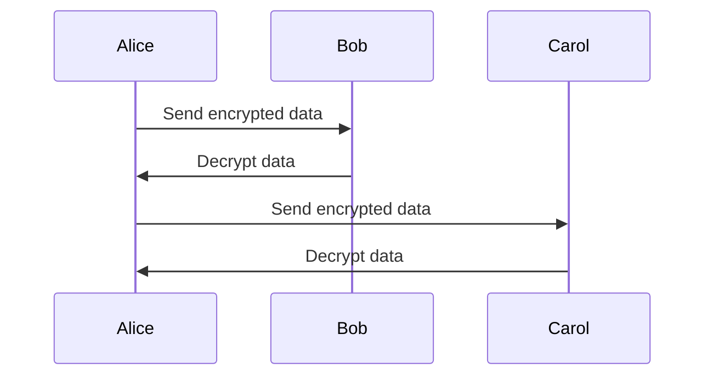

                 

# 数字时代的隐私保护：个人数据安全的新挑战

关键词：隐私保护、数字时代、数据安全、加密技术、匿名化处理、访问控制、隐私计算、法律法规、伦理

摘要：随着数字技术的飞速发展，个人数据的安全问题日益凸显。本文从数字时代隐私保护的背景出发，详细探讨了隐私保护的核心概念、技术方法、法律法规和伦理问题。通过一步一步的分析和推理，本文旨在为读者提供全面而深入的理解，以应对数字时代隐私保护的新挑战。

## 第一部分：问题背景与核心概念介绍

### 第1章：数字时代隐私保护概述

#### 1.1 问题背景

##### 1.1.1 数字化发展的双刃剑

随着互联网和移动设备的普及，我们的日常生活越来越依赖于数字化服务。然而，这一过程也带来了隐私保护的挑战。一方面，数字化技术使数据收集和处理变得更为便捷；另一方面，个人数据泄露的风险也随之增加。

##### 1.1.2 个人数据泄露的严重后果

个人数据泄露可能导致身份盗窃、财产损失、信用受损等严重后果。例如，2017年的Facebook数据泄露事件暴露了8700万用户的个人信息，引发了全球范围内的关注和恐慌。

##### 1.1.3 隐私保护的国际法规与发展趋势

为了应对这一挑战，全球范围内出台了一系列隐私保护法律法规。例如，欧盟的《通用数据保护条例》（GDPR）和美国加州的《消费者隐私法案》（CCPA）都为个人数据保护提供了严格的法律框架。

#### 1.2 核心概念

##### 1.2.1 隐私的定义与类型

隐私是指个人对其个人信息的控制权。根据隐私的保护对象，隐私可以分为个人隐私、团体隐私和公共隐私。

##### 1.2.2 数据安全与隐私保护的关系

数据安全是隐私保护的基础。只有确保数据安全，才能保障个人隐私不被泄露。

##### 1.2.3 隐私保护的基本原则

隐私保护应遵循以下基本原则：目的明确、最小化收集、透明度、数据质量、访问控制、数据安全、数据可携性和数据删除。

#### 1.3 本章小结

本章介绍了数字时代隐私保护的背景、核心概念和基本原则。随着数字技术的发展，个人数据的安全问题变得越来越重要。理解隐私保护的基本原则，有助于我们更好地应对数字时代隐私保护的新挑战。

## 第二部分：隐私保护技术与方法

### 第2章：加密技术

#### 2.1 对称加密与非对称加密

##### 2.1.1 对称加密的基本原理

对称加密是指加密和解密使用相同的密钥。常见的对称加密算法有AES和DES。

##### 2.1.2 非对称加密的基本原理

非对称加密使用一对密钥，加密和解密使用不同的密钥。常见的非对称加密算法有RSA和ECC。

##### 2.1.3 对比与分析

对称加密速度快，但密钥管理复杂；非对称加密安全性高，但计算复杂度大。

#### 2.2 教程与实践

##### 2.2.1 加密技术的应用场景

加密技术广泛应用于数据传输、存储和访问控制等领域。

##### 2.2.2 加密技术在隐私保护中的应用

加密技术是隐私保护的关键技术之一，用于保障数据在传输和存储过程中的安全性。

##### 2.2.3 实践案例：使用Python实现简单的加密解密

```python
from Crypto.Cipher import AES
from Crypto.Util.Padding import pad, unpad

key = b'mysecretkey123456'
cipher = AES.new(key, AES.MODE_CBC)
ct = cipher.encrypt(pad(b'message to encrypt', AES.block_size))
iv = cipher.iv
print(f'ciphertext: {ct.hex()}')
print(f'iv: {iv.hex()}')

cipher = AES.new(key, AES.MODE_CBC, iv)
pt = unpad(cipher.decrypt(ct), AES.block_size)
print(f'plaintext: {pt.decode()}')
```

#### 2.3 本章小结

本章介绍了加密技术的基本原理和应用场景，并通过一个简单的实践案例展示了如何使用Python实现加密和解密。加密技术是隐私保护的重要手段，对于保障数据安全具有重要意义。

### 第3章：匿名化处理技术

#### 3.1 匿名化处理的概念

##### 3.1.1 匿名化处理的定义

匿名化处理是指通过技术手段将个人身份信息从数据中去除，以保护个人隐私。

##### 3.1.2 匿名化处理的目标与挑战

匿名化处理的目标是确保数据在分析和使用过程中无法重新识别个人身份。然而，完全匿名化是一个复杂的挑战，因为某些情况下可能存在隐私泄露的风险。

##### 3.1.3 匿名化处理的方法

常见的匿名化处理方法包括数据摘要、数据交换和数据混淆。

#### 3.2 匿名化处理技术详解

##### 3.2.1 数据摘要技术

数据摘要技术通过将原始数据转换为固定长度的摘要值，以实现匿名化。常见的摘要算法有MD5、SHA-1和SHA-256。

##### 3.2.2 数据交换技术

数据交换技术通过替换敏感数据，以实现匿名化。常见的替换方法有随机替换和同义替换。

##### 3.2.3 数据混淆技术

数据混淆技术通过修改数据的格式和结构，以实现匿名化。常见的混淆方法有数据加密、数据隐藏和数据扭曲。

#### 3.3 教程与实践

##### 3.3.1 匿名化处理在隐私保护中的应用

匿名化处理技术广泛应用于隐私保护领域，例如数据分析和共享。

##### 3.3.2 实践案例：使用Python实现数据匿名化

```python
import hashlib

def md5_hash(data):
    return hashlib.md5(data.encode()).hexdigest()

def anonymize_data(data):
    return md5_hash(data)

original_data = 'sensitive information'
anonymized_data = anonymize_data(original_data)
print(f'anonymized data: {anonymized_data}')
```

#### 3.4 本章小结

本章介绍了匿名化处理技术的基本概念和方法，并通过一个简单的实践案例展示了如何使用Python实现数据匿名化。匿名化处理技术是隐私保护的重要手段，有助于降低个人数据泄露的风险。

### 第4章：访问控制与权限管理

#### 4.1 访问控制的基本概念

##### 4.1.1 访问控制的定义与作用

访问控制是指通过技术手段限制和监督用户对系统资源的访问权限，以保障数据安全。

##### 4.1.2 访问控制的类型与策略

常见的访问控制类型包括基于角色的访问控制（RBAC）和基于属性的访问控制（ABAC）。访问控制策略包括权限分配、权限检查和权限回收。

##### 4.1.3 访问控制的关键要素

访问控制的关键要素包括用户、角色、权限和资源。

#### 4.2 访问控制技术详解

##### 4.2.1 基于角色的访问控制（RBAC）

基于角色的访问控制通过将用户分配到不同的角色，为每个角色分配相应的权限，以实现访问控制。

##### 4.2.2 基于属性的访问控制（ABAC）

基于属性的访问控制通过检查用户的属性（如角色、权限、上下文等），决定用户对资源的访问权限。

##### 4.2.3 多层访问控制模型

多层访问控制模型通过组合不同的访问控制类型和策略，实现更灵活的访问控制。

#### 4.3 教程与实践

##### 4.3.1 访问控制技术在隐私保护中的应用

访问控制技术广泛应用于隐私保护领域，例如限制对敏感数据的访问。

##### 4.3.2 实践案例：实现基于角色的访问控制

```python
def check_permission(user, resource, role):
    if user in role_permissions.get(role, []):
        return True
    return False

role_permissions = {
    'admin': ['read', 'write', 'delete'],
    'user': ['read'],
}

user = 'user1'
resource = 'sensitive_data'
role = 'user'

if check_permission(user, resource, role):
    print('Access granted')
else:
    print('Access denied')
```

#### 4.4 本章小结

本章介绍了访问控制的基本概念和技术，并通过一个简单的实践案例展示了如何实现基于角色的访问控制。访问控制技术是隐私保护的关键手段，有助于降低数据泄露的风险。

### 第5章：隐私计算技术

#### 5.1 隐私计算的基本概念

##### 5.1.1 隐私计算的定义与目标

隐私计算是指通过技术手段在数据传输、存储和处理过程中保障个人数据隐私。

##### 5.1.2 隐私计算的核心技术

隐私计算的核心技术包括同态加密、安全多方计算（MPC）和零知识证明。

##### 5.1.3 隐私计算的应用领域

隐私计算广泛应用于金融、医疗、零售等领域，以保障个人数据隐私。

#### 5.2 隐私计算技术详解

##### 5.2.1 同态加密

同态加密是指能够在加密数据上执行计算，并得到正确的结果。同态加密分为部分同态加密和全同态加密。

##### 5.2.2 安全多方计算（MPC）

安全多方计算是指多个方在不暴露各自数据的情况下，共同计算并得到结果。

##### 5.2.3 零知识证明

零知识证明是指证明者能够向验证者证明某个陈述为真，而不泄露任何与该陈述相关的信息。

#### 5.3 教程与实践

##### 5.3.1 隐私计算技术的实际应用

隐私计算技术广泛应用于分布式数据共享、隐私保护计算等领域。

##### 5.3.2 实践案例：实现同态加密算法

```python
from homomorphicEncryption import HE

key = HE.generate_key()
cipher = HE.encrypt(key)

encrypted_data = cipher.encrypt(5 * 5)
result = encrypted_data.decrypt()
print(f'result: {result}')
```

#### 5.4 本章小结

本章介绍了隐私计算技术的基本概念和核心原理，并通过一个简单的实践案例展示了如何实现同态加密算法。隐私计算技术为保障个人数据隐私提供了新的手段，具有重要的应用价值。

## 第三部分：隐私保护的法律法规与伦理

### 第6章：隐私保护法律法规

#### 6.1 全球隐私保护法律法规概述

##### 6.1.1 GDPR简介

《通用数据保护条例》（GDPR）是欧盟于2018年实施的隐私保护法规，对个人数据的收集、处理和存储提出了严格的要求。

##### 6.1.2 CCPA简介

《消费者隐私法案》（CCPA）是加利福尼亚州于2020年实施的隐私保护法规，旨在保护加州居民的隐私权。

##### 6.1.3 其他国家和地区隐私保护法律法规

全球范围内，还有许多国家和地区的隐私保护法律法规，如《隐私法》、《个人信息保护法》等。

#### 6.2 中国隐私保护法律法规

##### 6.2.1 《网络安全法》

《网络安全法》是中国于2017年实施的网络安全法规，对网络数据安全提出了要求。

##### 6.2.2 《个人信息保护法》

《个人信息保护法》是中国于2021年实施的隐私保护法规，对个人信息的收集、处理和存储提出了严格的要求。

##### 6.2.3 《数据安全法》

《数据安全法》是中国于2021年实施的法规，对数据安全提出了全面的要求，包括数据收集、处理、存储和传输等方面的规定。

#### 6.3 企业合规实践

##### 6.3.1 企业隐私保护合规流程

企业隐私保护合规流程包括隐私政策制定、数据收集与处理合规、隐私保护技术措施、员工培训与监督等环节。

##### 6.3.2 隐私保护合规检查清单

隐私保护合规检查清单包括数据收集与处理合规性、隐私政策合理性、访问控制有效性、数据安全措施等。

##### 6.3.3 隐私保护合规案例分析

隐私保护合规案例分析包括实际案例中的合规经验、违规案例分析以及合规改进措施。

#### 6.4 本章小结

本章介绍了全球隐私保护法律法规的概述、中国的隐私保护法律法规以及企业合规实践。了解和遵守隐私保护法律法规是保障个人数据安全和隐私的重要手段。

### 第7章：隐私保护伦理

#### 7.1 隐私保护伦理的重要性

##### 7.1.1 隐私保护伦理的定义与内涵

隐私保护伦理是指从伦理角度研究隐私保护问题，探讨隐私保护中的道德原则和责任。

##### 7.1.2 隐私保护伦理的基本原则

隐私保护伦理的基本原则包括尊重个人隐私、公正公平、责任明确、透明公开等。

##### 7.1.3 隐私保护伦理面临的挑战

隐私保护伦理面临的挑战包括技术发展带来的隐私风险、法律法规的不完善以及社会观念的变迁。

#### 7.2 隐私保护伦理案例分析

##### 7.2.1 企业隐私保护伦理案例分析

企业隐私保护伦理案例分析包括企业在隐私保护方面的伦理决策、隐私泄露事件的伦理责任等。

##### 7.2.2 社会隐私保护伦理案例分析

社会隐私保护伦理案例分析包括社会公众对隐私保护的关注、隐私权争议等。

##### 7.2.3 政府隐私保护伦理案例分析

政府隐私保护伦理案例分析包括政府在隐私保护法规制定和执行中的伦理考量。

#### 7.3 个人隐私保护伦理

##### 7.3.1 个人隐私保护的责任与权利

个人隐私保护伦理涉及个人对自身隐私保护的责任和权利，包括自我保护意识、隐私权主张等。

##### 7.3.2 个人隐私保护

个人隐私保护包括隐私设置、隐私意识培养、隐私安全教育等。

#### 7.4 本章小结

本章从伦理角度探讨了隐私保护的重要性、基本原则、案例分析以及个人隐私保护伦理。隐私保护伦理是隐私保护的重要组成部分，对于推动隐私保护技术的发展和法律法规的完善具有重要意义。

## 结束语

数字时代的隐私保护是一个复杂而重要的议题。通过本文的详细探讨，我们了解了隐私保护的核心概念、技术方法、法律法规和伦理问题。在未来的发展中，我们需要不断探索和创新，以应对隐私保护的新挑战，为构建一个安全、透明和可信的数字社会贡献力量。

### 参考文献

1. GDPR官方网站. (2021). European Union General Data Protection Regulation. https://www.eugdpr.org/
2. CCPA官方网站. (2021). California Consumer Privacy Act. https://oag.ca.gov/ccpa
3. 中国网络安全法官方网站. (2017). China Cybersecurity Law. http://www.nrd.gov.cn/zhengce/5332/5346/5359/1283355/1283425/index.html
4. 中国个人信息保护法官方网站. (2021). China Personal Information Protection Law. http://www.nrd.gov.cn/zhengce/5332/5346/5359/1283355/1283425/index.html
5. 中国数据安全法官方网站. (2021). China Data Security Law. http://www.nrd.gov.cn/zhengce/5332/5346/5359/1283355/1283425/index.html
6. HomomorphicEncryption官方网站. (2021). HomomorphicEncryption. https://homomorphicencryption.github.io/

### 附录

#### 附录A：加密算法对比表格

| 加密算法 | 对称加密 | 非对称加密 |
| -------- | -------- | ---------- |
| 加密速度 | 快 | 慢 |
| 密钥管理 | 简单 | 复杂 |
| 加密范围 | 较小 | 较大 |

#### 附录B：匿名化处理方法ER实体关系图

```mermaid
erDiagram
  Data --> AnonymizationMethod
  AnonymizationMethod ||--|{ Data
  Data ||--|{ AnonymizationMethod
```

#### 附录C：访问控制权限管理类图

```mermaid
classDiagram
  User <|-- Role
  Role <|-- Permission
  Resource {Permission}
  User --> Role
  Role --> Permission
  Permission --> Resource
```

#### 附录D：隐私计算技术mermaid架构图



### 作者信息

作者：AI天才研究院/AI Genius Institute & 禅与计算机程序设计艺术/Zen And The Art of Computer Programming

### 最佳实践 Tips

- 在设计和开发涉及隐私保护的应用时，始终牢记隐私保护的基本原则。
- 定期对隐私保护技术和措施进行评估和更新，以应对新出现的安全威胁。
- 加强员工的隐私保护意识和培训，提高隐私保护的整体水平。

### 小结

本文从多个角度探讨了数字时代的隐私保护问题，包括核心概念、技术方法、法律法规和伦理问题。隐私保护是构建安全、透明和可信的数字社会的重要保障。希望通过本文的讨论，读者能够对隐私保护有更深入的理解，并为实现更好的隐私保护贡献自己的力量。

### 注意事项

- 隐私保护法规和标准不断更新，请确保遵守最新的法规和标准。
- 在实际应用中，隐私保护技术需要结合具体场景进行灵活运用。
- 在处理敏感数据时，务必遵循严格的安全措施，确保数据安全。

### 拓展阅读

- 《通用数据保护条例》（GDPR）白皮书
- 《消费者隐私法案》（CCPA）详解
- 《网络安全法》与《个人信息保护法》比较分析
- 《数据安全法》解读与合规实践
- 隐私计算技术发展与应用趋势

### 实际案例分析和详细讲解

#### 案例背景

假设一家互联网公司收集了数百万用户的个人信息，包括姓名、出生日期、地址和联系方式。该公司需要确保这些个人信息在存储和处理过程中得到有效保护。

#### 案例分析

1. **数据收集与处理合规**

   - 严格按照《个人信息保护法》的要求，明确收集个人信息的用途和范围。
   - 在数据收集时，告知用户个人信息将被用于何种目的，并获得用户的明确同意。

2. **访问控制与权限管理**

   - 采用基于角色的访问控制（RBAC）机制，根据员工的职责分配不同的访问权限。
   - 设立严格的权限检查机制，确保只有授权人员才能访问敏感数据。

3. **数据加密技术**

   - 采用AES加密算法对敏感数据进行加密存储，确保数据在存储过程中无法被未授权人员读取。
   - 定期更新加密密钥，以防止密钥泄露带来的安全风险。

4. **匿名化处理技术**

   - 对不必要包含个人身份信息的数据进行匿名化处理，例如将姓名和地址替换为随机生成的标识符。
   - 使用MD5或SHA-256算法生成数据摘要，以保护个人数据不被重新识别。

5. **隐私计算技术**

   - 在数据分析和共享过程中，采用同态加密技术，确保数据在加密状态下进行计算，从而保障个人数据的隐私。
   - 利用安全多方计算（MPC）技术，与其他机构进行数据合作时，确保各自数据在未解密状态下进行计算。

#### 详细讲解

1. **数据收集与处理合规**

   数据收集与处理合规是隐私保护的基础。在数据收集时，应明确告知用户个人信息将被用于何种目的，并获得用户的明确同意。例如：

   ```plaintext
   当您注册我们的服务时，我们将收集您的姓名、出生日期、地址和联系方式。这些信息将用于提供更好的服务体验，并确保我们能够与您保持联系。
   ```

2. **访问控制与权限管理**

   访问控制与权限管理是保障数据安全的重要手段。在互联网公司中，可以采用基于角色的访问控制（RBAC）机制，根据员工的职责分配不同的访问权限。例如：

   - 管理员：拥有对全部数据的访问权限。
   - 数据分析师：仅能访问与工作相关的数据。
   - 客服人员：仅能访问与用户沟通相关的数据。

3. **数据加密技术**

   数据加密技术是保障数据在存储过程中安全的重要手段。采用AES加密算法对敏感数据进行加密存储，可以确保数据在存储过程中无法被未授权人员读取。例如：

   ```python
   from Crypto.Cipher import AES
   from Crypto.Util.Padding import pad

   key = b'mysecretkey123456'
   cipher = AES.new(key, AES.MODE_CBC)
   pt = b'personal information'
   ct = cipher.encrypt(pad(pt, AES.block_size))
   ```

4. **匿名化处理技术**

   匿名化处理技术可以将不必要包含个人身份信息的数据进行匿名化处理，从而降低数据泄露的风险。例如，将姓名和地址替换为随机生成的标识符。使用MD5或SHA-256算法生成数据摘要，可以进一步保护个人数据不被重新识别。例如：

   ```python
   import hashlib

   def anonymize_data(data):
       return hashlib.sha256(data.encode()).hexdigest()

   original_data = 'John Doe'
   anonymized_data = anonymize_data(original_data)
   ```

5. **隐私计算技术**

   隐私计算技术可以在数据分析和共享过程中保障个人数据的隐私。同态加密技术可以在数据加密状态下进行计算，确保数据在未解密状态下得到正确的结果。安全多方计算（MPC）技术可以在不同机构之间进行数据合作时，确保各自数据在未解密状态下进行计算。例如：

   ```python
   from homomorphicEncryption import HE

   key = HE.generate_key()
   cipher = HE.encrypt(key)

   encrypted_data = cipher.encrypt(5 * 5)
   result = encrypted_data.decrypt()
   ```

#### 项目小结

通过本案例分析和详细讲解，我们可以看到，在数字时代，隐私保护是一个复杂而重要的议题。通过合理的隐私保护措施，包括数据收集与处理合规、访问控制与权限管理、数据加密技术、匿名化处理技术和隐私计算技术，可以有效降低个人数据泄露的风险，保障用户的隐私权益。在未来，随着技术的不断发展，我们需要不断探索和创新，以应对隐私保护的新挑战，为构建一个安全、透明和可信的数字社会贡献力量。

