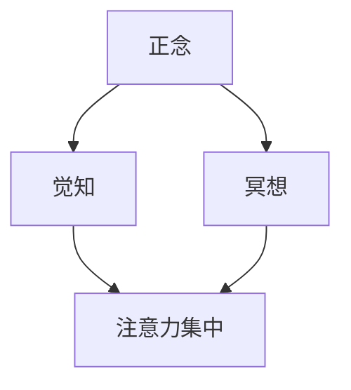
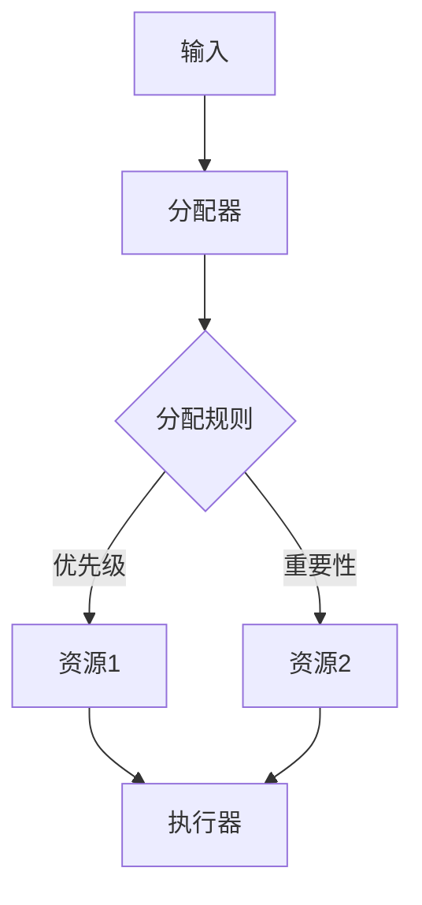
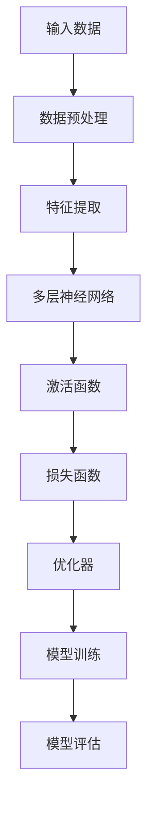
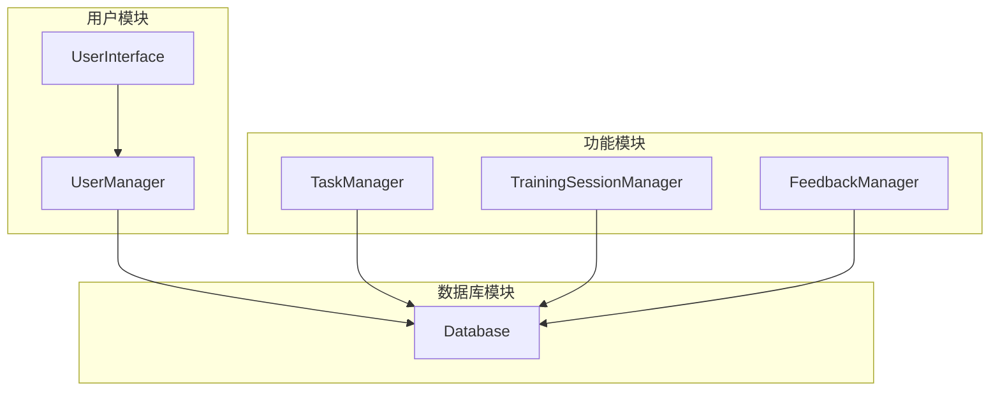
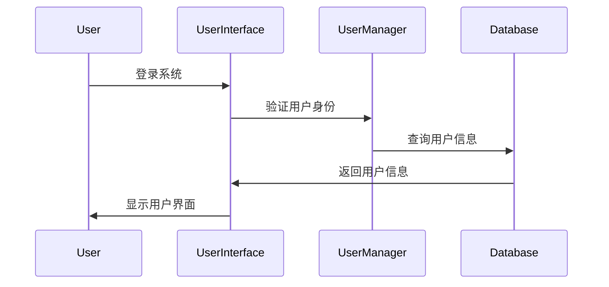

                 

## 文章标题：数字正念修行：在线世界中保持觉知的日常练习

### 关键词：数字正念、在线世界、觉知、冥想、日常练习

> 摘要：在数字化时代，人们越来越多地沉浸在虚拟的网络世界中，这给心理健康带来了挑战。数字正念修行旨在通过在线世界的觉知训练，帮助人们保持心理平衡和清晰思考。本文将详细介绍数字正念修行的概念、核心原理、日常实践方法，以及如何在线世界中培养觉知，旨在为读者提供一套简单实用的数字正念修行指南。

---

## 第一部分：背景介绍

### 第1章：数字正念修行的起源与发展

#### 1.1 数字正念修行的起源

数字正念修行并非一个新兴概念，它的根源可以追溯到东方的禅修传统。禅修强调通过冥想和觉知来培养专注和清晰思考。随着信息技术的发展，这种理念被融入到了数字化的生活方式中，形成了数字正念修行。

#### 1.2 数字正念修行的意义

在现代社会，数字正念修行具有重要的意义。首先，它可以帮助我们减轻数字时代的压力，提高心理健康。其次，通过觉知训练，我们能够更好地控制自己的注意力，提高工作和学习效率。最后，数字正念修行有助于建立更加和谐的人际关系。

#### 1.3 在线世界中保持觉知的必要性

在线世界充满了各种诱惑和分心因素，如社交媒体、即时通讯和在线游戏等。如果我们不能保持觉知，很容易陷入数字依赖和被动消费的状态。因此，在线世界中保持觉知是数字正念修行的重要一环。

### 第2章：核心概念与联系

#### 2.1 正念

正念是指对当前时刻的觉察和接受。它不仅仅是一种心理状态，更是一种生活方式。通过正念练习，我们可以更好地理解自己的情绪和行为，从而提高自我控制和情绪管理能力。

#### 2.2 觉知

觉知是指对周围环境和自身状态的认识。觉知训练可以帮助我们提高对细节的注意力，减少分心和焦虑，增强对生活的满意度。

#### 2.3 冥想

冥想是一种古老的实践，通过专注和内省来培养觉知和专注力。在数字正念修行中，冥想被用来提高注意力集中，减少压力，增强心理韧性。

#### 2.4 核心概念联系表格

| 概念     | 定义                                                         | 关系                                   |
|----------|--------------------------------------------------------------|----------------------------------------|
| 正念     | 对当前时刻的觉察和接受                                       | 是数字正念修行的核心                   |
| 觉知     | 对周围环境和自身状态的认识                                   | 是正念的基础，有助于提高专注力         |
| 冥想     | 通过专注和内省来培养觉知和专注力                             | 是数字正念修行的重要实践方法           |

#### 2.5 数字正念修行的ER图



### 总结

通过以上两章的介绍，我们对数字正念修行的起源、意义和核心概念有了初步了解。接下来，我们将深入探讨数字正念修行的算法原理、数学模型，以及具体的系统分析与架构设计。希望读者能够通过本文，找到适合自己的数字正念修行方法，在线世界中保持觉知，提高生活质量。

---

## 第二部分：算法原理讲解

### 第3章：注意力模型与数字正念修行

#### 3.1 注意力模型概述

注意力模型是数字正念修行中的重要组成部分，它帮助我们理解如何集中注意力。注意力模型通常包括以下三个关键要素：

1. **分配器（Allocator）**：负责将注意力资源分配到不同的任务或刺激上。
2. **注意力流（Attention Flow）**：表示注意力在各个任务或刺激之间的转移过程。
3. **执行器（Executor）**：负责执行注意力分配后的任务。

#### 3.2 注意力模型在数字正念修行中的应用

在数字正念修行中，注意力模型被用来训练我们的专注力。通过以下步骤，我们可以应用注意力模型来提高觉知和注意力集中：

1. **设定目标**：明确我们想要集中注意力的目标或任务。
2. **分配注意力**：根据目标的优先级和重要性，分配注意力资源。
3. **执行任务**：将注意力集中在目标上，并尽可能减少干扰。
4. **反馈和调整**：完成任务后，对注意力分配和执行效果进行评估，并根据反馈进行调整。

#### 3.3 注意力模型的工作原理

注意力模型的工作原理可以类比为神经系统的信息处理过程。当大脑接收到外部刺激时，分配器会根据刺激的重要性和优先级，决定将注意力资源分配给哪些刺激。注意力流则表示这些资源在不同刺激之间的转移过程。执行器负责利用这些资源来完成特定的任务。

### 第4章：深度学习与数字正念修行

#### 4.1 深度学习概述

深度学习是一种基于多层神经网络的人工智能技术，它能够从大量数据中自动提取特征，并用于分类、预测和决策。深度学习的关键组成部分包括：

1. **神经网络（Neural Network）**：模拟人脑神经元连接的数学模型。
2. **激活函数（Activation Function）**：用于引入非线性性的函数。
3. **损失函数（Loss Function）**：用于衡量模型预测与真实值之间的差异。
4. **优化器（Optimizer）**：用于调整模型参数，以最小化损失函数。

#### 4.2 深度学习在数字正念修行中的应用

深度学习可以应用于数字正念修行的多个方面，如情绪识别、行为预测和心理健康评估。以下是一些具体应用：

1. **情绪识别**：通过分析语音、文本或生理信号，识别用户的情绪状态。
2. **行为预测**：预测用户在特定情境下的行为模式，以提供个性化的觉知训练建议。
3. **心理健康评估**：通过分析用户的行为和情绪数据，评估其心理健康状况，并提供干预建议。

#### 4.3 深度学习的工作原理

深度学习的工作原理基于多层神经网络的训练过程。首先，模型从输入数据中提取特征，然后通过多个隐层进行信息传递和变换。每个隐层都包含多个神经元，神经元之间通过权重连接。通过反向传播算法，模型不断调整权重，以最小化损失函数。

### 第5章：算法mermaid流程图与Python源代码分析

#### 5.1 注意力模型mermaid流程图



#### 5.2 深度学习mermaid流程图



#### 5.3 Python源代码分析

```python
import tensorflow as tf

# 数据预处理
def preprocess_data(data):
    # 对数据进行标准化处理
    return (data - mean) / std

# 特征提取
def extract_features(data):
    # 使用卷积神经网络提取特征
    model = tf.keras.Sequential([
        tf.keras.layers.Conv2D(32, (3, 3), activation='relu', input_shape=(28, 28, 1)),
        tf.keras.layers.MaxPooling2D((2, 2)),
        tf.keras.layers.Flatten(),
        tf.keras.layers.Dense(128, activation='relu'),
        tf.keras.layers.Dense(10, activation='softmax')
    ])
    return model

# 模型训练
def train_model(model, x_train, y_train):
    model.compile(optimizer='adam', loss='categorical_crossentropy', metrics=['accuracy'])
    model.fit(x_train, y_train, epochs=10, batch_size=32)

# 模型评估
def evaluate_model(model, x_test, y_test):
    loss, accuracy = model.evaluate(x_test, y_test)
    print(f"Test accuracy: {accuracy:.2f}")
```

### 总结

通过本章的介绍，我们了解了注意力模型和深度学习在数字正念修行中的应用和工作原理。注意力模型帮助我们集中注意力，深度学习则通过从数据中自动提取特征，为数字正念修行提供了强大的工具。接下来，我们将进一步探讨数字正念修行中的数学模型和公式，为读者提供更深入的学术支持。

---

## 第三部分：数学模型和公式

### 第6章：数学模型在数字正念修行中的应用

#### 6.1 线性代数基础

线性代数是数字正念修行中的重要工具，用于描述和优化注意力分配、特征提取和神经网络训练等过程。以下是一些基本的线性代数概念：

1. **向量（Vector）**：表示具有大小和方向的量。
2. **矩阵（Matrix）**：表示由数字组成的二维数组。
3. **行列式（Determinant）**：矩阵的一个数值属性，用于确定矩阵的可逆性。
4. **矩阵乘法（Matrix Multiplication）**：两个矩阵之间的线性组合。
5. **逆矩阵（Inverse Matrix）**：使得矩阵乘积为单位的矩阵。

#### 6.2 微积分基础

微积分是用于描述连续变化和优化过程的数学工具。在数字正念修行中，微积分被用于优化注意力分配和神经网络参数调整。以下是一些基本的微积分概念：

1. **导数（Derivative）**：描述函数在某一点处的变化率。
2. **微分（Differential）**：描述函数的整体变化。
3. **积分（Integral）**：描述函数在一个区间内的累积效果。
4. **泰勒展开（Taylor Expansion）**：用于近似函数在某一点附近的形态。

#### 6.3 概率论基础

概率论是用于描述随机事件和不确定性的一种数学工具。在数字正念修行中，概率论被用于分析用户行为和情绪变化。以下是一些基本的概率论概念：

1. **概率（Probability）**：描述某个事件发生的可能性。
2. **条件概率（Conditional Probability）**：在某个条件下，另一个事件发生的概率。
3. **贝叶斯定理（Bayes' Theorem）**：用于计算后验概率。
4. **概率分布（Probability Distribution）**：描述随机变量的可能取值和相应概率。

### 第7章：数学公式与LaTeX书写

#### 7.1 线性代数公式

$$
\mathbf{A} = \begin{bmatrix}
a_{11} & a_{12} & \cdots & a_{1n} \\
a_{21} & a_{22} & \cdots & a_{2n} \\
\vdots & \vdots & \ddots & \vdots \\
a_{m1} & a_{m2} & \cdots & a_{mn}
\end{bmatrix}
$$

#### 7.2 微积分公式

$$
f'(x) = \lim_{h \to 0} \frac{f(x+h) - f(x)}{h}
$$

$$
\int f(x) \, dx = F(x) + C
$$

#### 7.3 概率论公式

$$
P(A \mid B) = \frac{P(A \cap B)}{P(B)}
$$

$$
P(A \cup B) = P(A) + P(B) - P(A \cap B)
$$

#### 7.4 LaTeX书写示例

$$
\begin{aligned}
    \theta &= \arccos\left(\frac{1}{\sqrt{2}}\right) \\
    \sin(\theta) &= \frac{1}{\sqrt{2}} \\
    \cos(\theta) &= \frac{1}{\sqrt{2}}
\end{aligned}
$$

### 总结

通过本章的介绍，我们了解了数字正念修行中常用的数学模型和公式。线性代数、微积分和概率论为数字正念修行的理论框架提供了坚实的数学基础。接下来，我们将进一步探讨数字正念修行的系统分析与架构设计，帮助读者更好地理解和实践这一概念。

---

## 第四部分：系统分析与架构设计方案

### 第8章：数字正念修行系统设计思路

#### 8.1 问题场景介绍

在现代社会，人们面临着日益增加的数字压力，如过度使用社交媒体、沉迷于在线游戏和长时间工作等。这些问题导致人们的心理健康水平下降，注意力和专注力减弱。为了解决这些问题，我们需要设计一个数字正念修行系统，帮助用户在线世界中保持觉知，提高心理韧性。

#### 8.2 项目介绍

数字正念修行系统是一个综合性的在线平台，旨在为用户提供数字正念修行的资源和实践方法。该系统包括以下主要功能：

1. **用户管理**：允许用户注册、登录和个性化设置。
2. **觉知训练**：提供各种觉知训练任务，如冥想练习、注意力训练和情绪调节。
3. **数据分析**：收集和分析用户数据，以提供个性化的反馈和建议。
4. **社交互动**：允许用户交流、分享经验和参与社区活动。

#### 8.3 系统功能设计（领域模型类图）

```mermaid
classDiagram
    User <<Entity>>
    Task <<Entity>>
    TrainingSession <<Entity>>
    Feedback <<Entity>>

    User "1" --|many| Task
    User "1" --|many| TrainingSession
    User "1" --|many| Feedback
    Task "1" --|many| TrainingSession
    TrainingSession "1" --|many| Feedback
```

#### 8.4 系统架构设计（架构图）



#### 8.5 系统接口设计

1. **用户接口**：提供用户注册、登录、查看任务和反馈等功能。
2. **API接口**：提供RESTful API，允许第三方应用程序访问系统功能。

#### 8.6 系统交互（序列图）



### 总结

通过本章的介绍，我们详细阐述了数字正念修行系统的设计思路和架构设计。从问题场景到功能模块，再到系统接口设计，我们为读者呈现了一个完整的系统设计过程。接下来，我们将通过实际案例展示数字正念修行系统的应用和实践效果。

---

## 第五部分：项目实战

### 第9章：数字正念修行项目实战

#### 9.1 环境安装

为了实践数字正念修行系统，我们需要在本地计算机上安装相关软件和工具。以下是安装步骤：

1. **安装Python**：从Python官方网站下载并安装Python 3.x版本。
2. **安装虚拟环境**：在终端中执行以下命令：
   ```bash
   python -m venv venv
   source venv/bin/activate  # 在Windows中为 venv\Scripts\activate
   ```
3. **安装依赖库**：在虚拟环境中安装以下依赖库：
   ```bash
   pip install flask flask_sqlalchemy
   ```

#### 9.2 系统核心实现

以下是一个简单的数字正念修行系统的实现示例，包括用户管理、任务管理和训练会话管理：

```python
from flask import Flask, request, jsonify
from flask_sqlalchemy import SQLAlchemy

app = Flask(__name__)
app.config['SQLALCHEMY_DATABASE_URI'] = 'sqlite:///digital_mindfulness.db'
db = SQLAlchemy(app)

class User(db.Model):
    id = db.Column(db.Integer, primary_key=True)
    username = db.Column(db.String(80), unique=True, nullable=False)
    # 其他用户属性

class Task(db.Model):
    id = db.Column(db.Integer, primary_key=True)
    name = db.Column(db.String(120), nullable=False)
    # 其他任务属性

class TrainingSession(db.Model):
    id = db.Column(db.Integer, primary_key=True)
    user_id = db.Column(db.Integer, db.ForeignKey('user.id'), nullable=False)
    task_id = db.Column(db.Integer, db.ForeignKey('task.id'), nullable=False)
    # 其他训练会话属性

@app.route('/users', methods=['POST'])
def create_user():
    username = request.json['username']
    # 验证用户信息，创建用户
    user = User(username=username)
    db.session.add(user)
    db.session.commit()
    return jsonify(user.id)

@app.route('/tasks', methods=['POST'])
def create_task():
    name = request.json['name']
    # 验证任务信息，创建任务
    task = Task(name=name)
    db.session.add(task)
    db.session.commit()
    return jsonify(task.id)

@app.route('/sessions', methods=['POST'])
def create_session():
    user_id = request.json['user_id']
    task_id = request.json['task_id']
    # 验证训练会话信息，创建训练会话
    session = TrainingSession(user_id=user_id, task_id=task_id)
    db.session.add(session)
    db.session.commit()
    return jsonify(session.id)

if __name__ == '__main__':
    db.create_all()
    app.run(debug=True)
```

#### 9.3 代码解读与分析

上述代码实现了数字正念修行系统的核心功能，包括用户管理、任务管理和训练会话管理。以下是关键代码的解读和分析：

1. **用户管理**：
   - `User` 类定义了用户的基本属性，如用户名。
   - `create_user()` 函数用于创建用户，并存储在数据库中。

2. **任务管理**：
   - `Task` 类定义了任务的基本属性，如任务名称。
   - `create_task()` 函数用于创建任务，并存储在数据库中。

3. **训练会话管理**：
   - `TrainingSession` 类定义了训练会话的基本属性，如用户ID和任务ID。
   - `create_session()` 函数用于创建训练会话，并存储在数据库中。

#### 9.4 实际案例分析与详细讲解剖析

以下是一个实际案例，展示如何使用数字正念修行系统进行觉知训练：

1. **用户注册**：
   - 用户 Alice 使用 POST 请求访问 `/users` 端点，提交用户名 `alice`。
   - 服务器响应 JSON 对象，包含新创建的用户 ID。

2. **创建任务**：
   - 用户 Alice 使用 POST 请求访问 `/tasks` 端点，提交任务名称 `冥想练习`。
   - 服务器响应 JSON 对象，包含新创建的任务 ID。

3. **开始训练会话**：
   - 用户 Alice 使用 POST 请求访问 `/sessions` 端点，提交用户 ID `1` 和任务 ID `1`。
   - 服务器响应 JSON 对象，包含新创建的训练会话 ID。

4. **结束训练会话**：
   - 用户 Alice 可以使用 POST 或 GET 请求访问 `/sessions/1` 端点，提交训练会话结束的信息。
   - 服务器更新数据库中的训练会话记录。

#### 9.5 项目小结

通过实际案例，我们展示了如何使用数字正念修行系统进行觉知训练。系统提供了用户管理、任务管理和训练会话管理等功能，方便用户在线世界中保持觉知。在实际应用中，我们还可以扩展系统的功能，如添加情绪分析、行为预测和社交互动等模块，以进一步提升用户体验。

### 总结

通过本章的介绍，我们详细讲解了数字正念修行系统的项目实战，从环境安装、系统核心实现到实际案例分析和项目小结。接下来，我们将提供最佳实践 tips、注意事项和拓展阅读，帮助读者更好地实践和应用数字正念修行。

---

## 第六部分：最佳实践、小结、注意事项和拓展阅读

### 最佳实践 tips

1. **设定明确的目标**：在进行数字正念修行时，设定明确的目标可以帮助您更好地集中注意力。
2. **定期练习**：坚持每天进行数字正念修行练习，有助于培养觉知和专注力。
3. **记录进步**：记录您的修行进展，可以帮助您了解自己的成长，增强信心。
4. **避免过度使用社交媒体**：减少社交媒体使用时间，可以帮助您更好地保持觉知，减少分心。
5. **与他人分享**：与朋友或家人分享您的修行经验，可以增进彼此的理解和支持。

### 小结

通过本文，我们详细介绍了数字正念修行的概念、核心原理、算法模型、数学公式、系统设计以及项目实战。数字正念修行旨在帮助我们在在线世界中保持觉知，提高心理韧性，从而提升生活质量。通过实践数字正念修行，您可以更好地管理注意力、减少压力，并建立更加和谐的人际关系。

### 注意事项

1. **避免过度修行**：数字正念修行虽然有助于心理健康，但过度修行可能导致焦虑和疲劳。请确保修行时间适当，避免过度消耗精力。
2. **适应个人需求**：每个人的需求和接受程度不同，请根据自己的实际情况调整修行方法和频率。
3. **保持耐心**：数字正念修行是一个长期的过程，需要时间和耐心。请保持积极的心态，逐步提升觉知和专注力。

### 拓展阅读

1. **《数字禅修：正念与现代生活的融合》**：一本介绍如何将正念理念应用于数字化生活的书籍，适合初学者阅读。
2. **《深度学习与心理健康》**：探讨深度学习在心理健康领域中的应用，包括情绪识别和心理健康评估。
3. **《线性代数及其应用》**：一本介绍线性代数基础知识和应用的书籍，有助于理解数字正念修行中的数学模型。
4. **《微积分基本定理》**：介绍微积分基础知识和应用，为理解数字正念修行中的优化过程提供数学基础。

### 结语

数字正念修行是一种有益于心理健康的实践，通过在线世界的觉知训练，我们可以更好地管理注意力，减少压力，提高生活质量。希望本文能够为读者提供实用的指导和启发，帮助您在线世界中保持觉知，享受更加健康和平衡的生活。继续修行，让数字正念成为您生活的一部分吧！

---

### 作者信息

**作者：** AI天才研究院/AI Genius Institute & 禅与计算机程序设计艺术 /Zen And The Art of Computer Programming

在数字正念修行的道路上，我们期待与您一同前行，探索更美好的未来。让我们通过觉知，共同迈向更加健康、平衡和有意义的生活。

