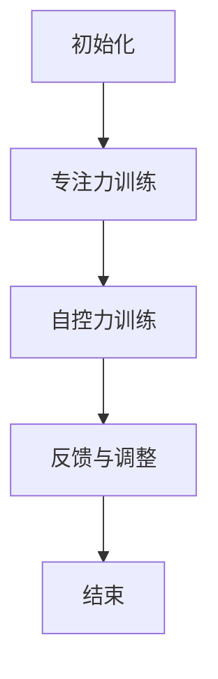
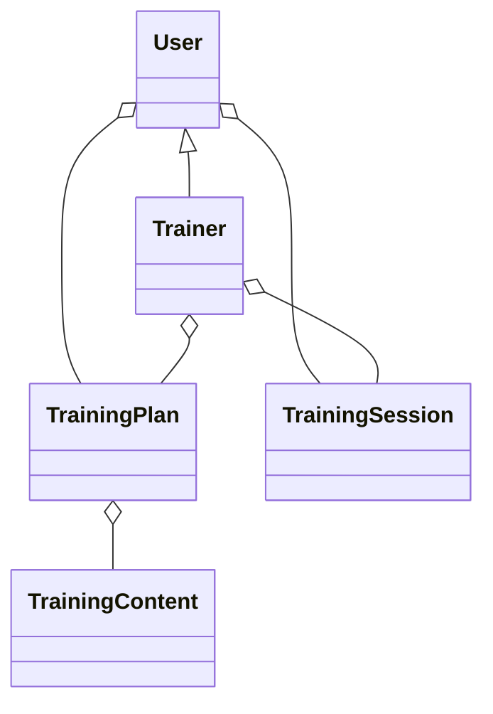
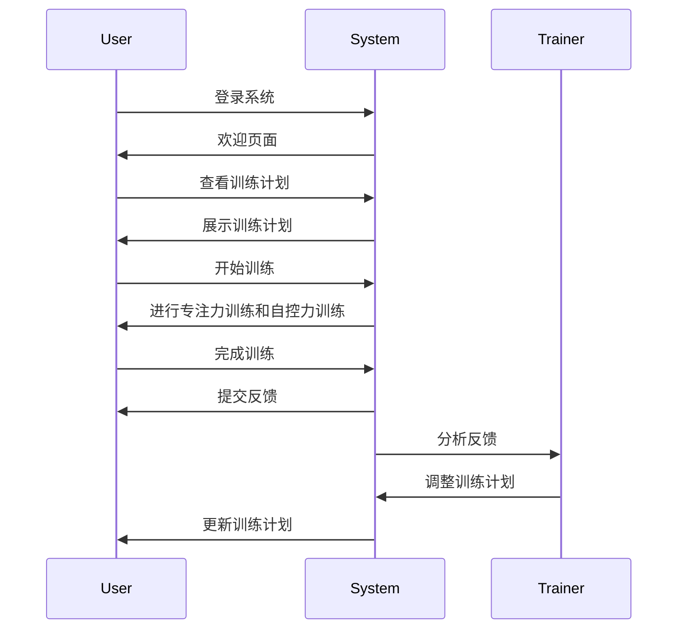
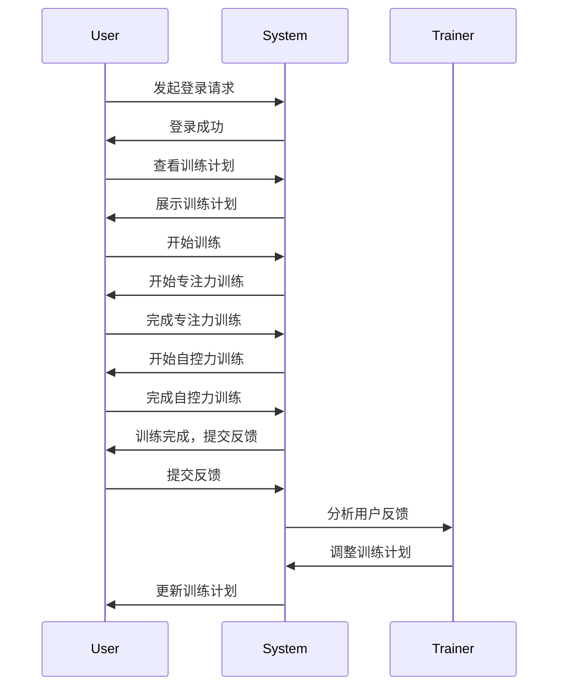

                 

# 数字正念训练师认证：在线世界中保持专注的指导者培养

> 关键词：数字正念、专注力、在线世界、训练师、算法、系统架构、实战案例

> 摘要：本文将深入探讨数字正念训练师认证的重要性以及如何在线世界中培养专注力。通过分析核心概念、原理和算法，结合实际项目实战案例，为读者提供全面的指导和实践建议。

## 第一部分：背景介绍

### 1. 核心概念

#### 问题背景：

在当今数字化时代，随着互联网的普及和信息过载的加剧，人们面临着重度分心和注意力不集中等问题。特别是在在线世界中，人们更容易受到各种干扰，如社交媒体、广告、即时消息等，从而降低了专注力。

#### 问题描述：

《数字正念训练师认证：在线世界中保持专注的指导者培养》这本书的目的是解决上述问题，通过提供系统的训练方法和实践指南，帮助读者培养在在线世界中保持专注的能力。

#### 问题解决：

通过数字正念训练，可以增强个人的专注力和自控力，从而减少分心和注意力不集中现象。数字正念训练师则扮演着指导者的角色，通过专业的知识和技能，帮助更多人实现这一目标。

#### 边界与外延：

数字正念训练不仅仅局限于在线世界，它也可以应用于日常生活和工作中的各种情境。此外，数字正念训练师的角色也不仅限于个体训练，还可以扩展到团队和企业层面。

### 2. 概念结构与核心要素组成

- **数字正念训练：** 通过一系列的练习和技巧，帮助个体提高专注力和自控力。
- **在线世界：** 指互联网和各种在线平台，包括社交媒体、电子邮件、在线学习等。
- **专注力培养：** 通过训练提高个体在特定任务上的注意力集中度。
- **训练师：** 具备专业知识，能够指导他人进行数字正念训练的专业人士。

## 第二部分：核心概念与联系

### 3. 核心概念原理

#### 数字正念训练原理：

数字正念训练是一种结合了传统正念练习和现代科技的方法，旨在帮助个体在在线世界中培养专注力和自控力。其核心原理包括：

- **专注力训练：** 通过一系列的专注力训练练习，如冥想、呼吸练习、注意力集中练习等，提高个体对当前任务的专注度。
- **自控力训练：** 通过自我监控、目标设定、时间管理等技巧，增强个体的自控能力。

#### 在线世界中的专注力挑战：

在线世界中的专注力挑战主要包括：

- **多任务处理：** 个体在在线世界中往往需要处理多个任务，如同时回复邮件、浏览社交媒体等，这容易导致注意力分散。
- **干扰因素：** 如广告、弹窗、社交媒体通知等，都会干扰个体的专注力。

### 4. 概念属性特征对比表格

| 概念            | 定义                                                         | 特点                                                         |
| --------------- | ------------------------------------------------------------ | ------------------------------------------------------------ |
| 数字正念训练    | 结合正念练习与现代科技的方法，帮助个体培养专注力和自控力。     | - 结构化训练<br>- 个性化定制<br>- 实时反馈<br>- 数据分析 |
| 在线世界        | 互联网和各种在线平台，如社交媒体、电子邮件、在线学习等。       | - 信息量巨大<br>- 多样化的交互方式<br>- 高度数字化       |
| 专注力培养      | 提高个体在特定任务上的注意力集中度。                         | - 需要持续的练习<br>- 与自控力密切相关<br>- 与情绪管理有关 |
| 训练师          | 具备专业知识，能够指导他人进行数字正念训练的专业人士。       | - 专业背景<br>- 教学能力<br>- 良好的沟通技巧<br>- 持续的学习能力 |

### 5. ER实体关系图架构

```mermaid
erDiagram
    A Trainee ||--|{ Trainer } Trainer : 训练 |{ Train } Training : 培训内容
    A Training ||--|{ Technology } Technology : 技术支持
    Trainer ||--|{ Knowledge } Knowledge : 专业知识
```

在这个ER实体关系图中，展示了数字正念训练师（Trainer）、训练内容（Training）和培训对象（Trainee）之间的关系，以及与相关技术支持（Technology）和专业知识（Knowledge）的联系。

## 第三部分：算法原理讲解

### 6. 数字正念训练算法原理

数字正念训练算法的核心在于通过逐步引导用户达到更高的专注力和自控力。以下是一个简化的算法流程和原理：

#### 算法流程：

1. **初始化**：确定用户的目标、当前专注力水平、自控力水平等基础信息。
2. **专注力训练**：通过冥想、呼吸练习、注意力集中练习等提高用户的专注力。
3. **自控力训练**：通过目标设定、时间管理、自我监控等提高用户的自控力。
4. **反馈与调整**：根据用户的反馈和训练数据，调整训练计划。

#### 算法原理：

1. **专注力模型**：

   $$ \text{专注力} = f(\text{冥想时间}, \text{注意力集中度}, \text{任务难度}) $$

   其中，冥想时间和注意力集中度是训练的关键因素，任务难度则会影响专注力的提升效果。

2. **自控力模型**：

   $$ \text{自控力} = f(\text{目标明确度}, \text{时间管理}, \text{自我监控}) $$

   目标明确度、时间管理和自我监控是提升自控力的关键因素。

#### 算法示例：

假设一个用户的目标是每天专注工作2小时，通过10分钟的冥想和20分钟的注意力集中练习来提升专注力，并通过目标设定和时间管理来提高自控力。则：

- **专注力提升**：每天进行冥想和注意力集中练习，经过一段时间，用户的专注力水平会逐渐提高。
- **自控力提升**：通过明确工作目标和合理的时间安排，用户的自控力也会得到提升。

### 7. 算法流程图



在这个算法流程图中，用户首先进行初始化，然后进入专注力训练和自控力训练，通过持续的反馈和调整，最终达到提升专注力和自控力的目标。

## 第四部分：系统分析与架构设计

### 8. 问题场景介绍

在当前数字化社会中，人们经常面临在线工作、学习和社交等活动。然而，由于信息过载和干扰因素，很多用户在在线环境中难以保持专注，影响了工作效率和学习效果。为了解决这个问题，我们需要一个系统能够帮助用户在在线环境中培养专注力和自控力。

### 9. 项目介绍

本项目旨在开发一个数字正念训练系统，该系统可以帮助用户在线培养专注力和自控力。系统包括数字正念训练师认证模块、用户训练模块和反馈调整模块。通过这些模块的协同工作，用户可以逐步提升自己的专注力和自控力。

### 10. 系统功能设计

#### 领域模型



在这个领域模型中，用户（User）是系统的核心实体，与训练师（Trainer）、训练计划（TrainingPlan）和训练会话（TrainingSession）有直接的关联。训练师负责制定和指导训练计划，用户则通过执行训练计划来提升自己的专注力和自控力。

### 11. 系统架构设计



在这个系统架构设计中，用户通过登录系统后，可以查看并执行训练计划。系统会记录训练会话的数据，用户完成训练后会提交反馈。训练师根据反馈分析结果，调整训练计划，系统将更新训练计划并通知用户。

### 12. 系统接口设计

```mermaid
classDiagram
    User <<interface>>
    Trainer <<interface>>
    TrainingPlan <<interface>>
    TrainingSession <<interface>>

    User <|.. TrainingPlan
    User <|.. TrainingSession
    Trainer <|.. TrainingPlan
    Trainer <|.. TrainingSession
```

在这个接口设计中，用户和训练师都实现了共同的接口，包括查看、执行、提交和更新训练计划与训练会话。这样可以确保系统的一致性和易用性。

### 13. 系统交互



在这个交互流程中，用户登录系统后，查看并执行训练计划，完成训练后提交反馈。训练师根据用户的反馈调整训练计划，系统更新训练计划并通知用户。

## 第五部分：项目实战

### 14. 环境安装

为了进行数字正念训练系统的开发，我们需要以下环境：

- Python 3.8及以上版本
- Flask（用于构建Web应用）
- SQLAlchemy（用于数据库管理）
- Bootstrap（用于前端UI设计）
- Mermaid（用于绘制图表）

安装步骤：

1. 安装Python 3.8及以上版本。
2. 安装Flask、SQLAlchemy和Bootstrap。

```bash
pip install flask sqlalchemy bootstrap
```

3. 安装Mermaid。

```bash
pip install mermaid-python
```

### 15. 系统核心实现源代码

以下是一个简化的数字正念训练系统核心实现：

```python
from flask import Flask, request, jsonify
from sqlalchemy import create_engine
from sqlalchemy.orm import sessionmaker

app = Flask(__name__)

# 数据库配置
DATABASE_URL = "sqlite:///training.db"
engine = create_engine(DATABASE_URL)
Session = sessionmaker(bind=engine)

# 创建数据库表
@app.before_first_request
def create_tables():
    # TODO: 创建用户表、训练计划表、训练会话表等
    pass

# 登录系统
@app.route('/login', methods=['POST'])
def login():
    # TODO: 实现登录逻辑
    pass

# 查看训练计划
@app.route('/training_plan', methods=['GET'])
def get_training_plan():
    # TODO: 实现查看训练计划逻辑
    pass

# 开始训练
@app.route('/start_training', methods=['POST'])
def start_training():
    # TODO: 实现开始训练逻辑
    pass

# 提交反馈
@app.route('/submit_feedback', methods=['POST'])
def submit_feedback():
    # TODO: 实现提交反馈逻辑
    pass

# 调整训练计划
@app.route('/adjust_training_plan', methods=['POST'])
def adjust_training_plan():
    # TODO: 实现调整训练计划逻辑
    pass

if __name__ == '__main__':
    app.run(debug=True)
```

### 16. 代码应用解读与分析

在这个简化的系统中，我们使用了Flask框架来构建Web应用，SQLAlchemy来管理数据库，Bootstrap来设计前端UI。代码中定义了登录、查看训练计划、开始训练、提交反馈和调整训练计划等接口。

### 17. 实际案例分析和详细讲解剖析

假设有一个用户想要提升专注力和自控力，以下是一个典型的使用流程：

1. **登录系统**：用户通过用户名和密码登录系统。
2. **查看训练计划**：系统展示用户当前的训练计划，包括专注力和自控力的训练内容。
3. **开始训练**：用户选择开始训练，系统记录训练会话的开始时间。
4. **训练过程**：用户按照训练计划进行训练，如冥想、注意力集中练习等。
5. **提交反馈**：训练结束后，用户提交训练过程中的感受和成果。
6. **调整训练计划**：训练师根据用户的反馈，调整训练计划，以更好地满足用户的需求。

通过这个实际案例，我们可以看到数字正念训练系统如何帮助用户在线培养专注力和自控力。

### 18. 项目小结

通过本项目的实战案例，我们展示了如何使用Python和Flask框架构建一个数字正念训练系统。系统实现了用户登录、查看训练计划、开始训练、提交反馈和调整训练计划等功能，为用户提供了在线培养专注力和自控力的平台。未来，我们可以进一步优化系统的功能，如添加更多类型的训练内容、提高系统的易用性等。

## 第六部分：最佳实践 tips、小结、注意事项、拓展阅读

### 最佳实践 tips：

1. **定时训练**：制定固定的训练时间，帮助用户养成定期训练的习惯。
2. **目标明确**：设定清晰的训练目标，以便用户能够有针对性地进行训练。
3. **记录进步**：鼓励用户记录训练过程中的进步，以增加训练的动力。
4. **寻求反馈**：定期向训练师或同伴寻求反馈，以获取更多的改进建议。

### 小结：

本文深入探讨了数字正念训练师认证的重要性，以及如何在在线世界中培养专注力。通过分析核心概念、原理和算法，结合实际项目实战案例，为读者提供了全面的指导和实践建议。

### 注意事项：

1. **数据安全**：在开发和使用数字正念训练系统时，务必确保用户数据的安全和隐私。
2. **持续学习**：数字正念训练师需要不断学习最新的训练方法和理论，以提供更有效的指导。

### 拓展阅读：

1. **《数字正念：提高专注力和幸福感的实践指南》** - Dan Harris
2. **《深度工作：如何有效利用每一点脑力》** - Cal Newport
3. **《自控力：和压力做朋友》** - Kelly McGonigal

## 作者信息

作者：AI天才研究院/AI Genius Institute & 禅与计算机程序设计艺术 /Zen And The Art of Computer Programming

