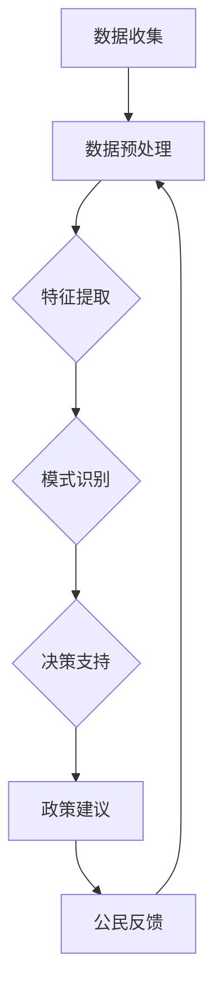
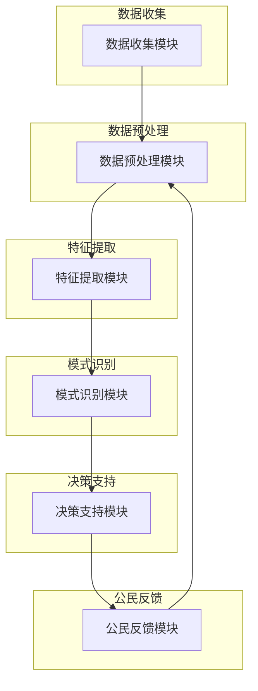
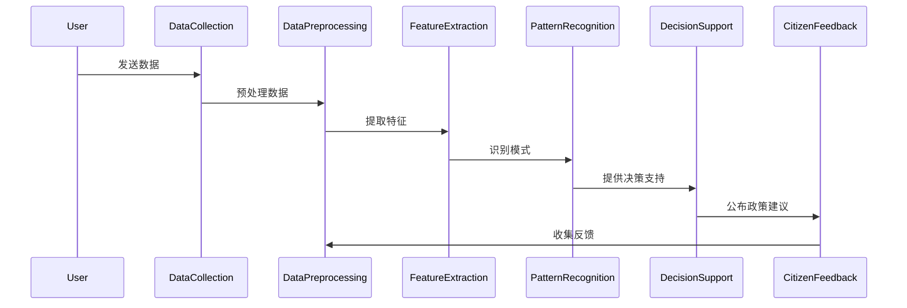

                 

# 数字民主2.0：科技赋能的公民参与

## 关键词

- 数字民主
- 公民参与
- 科技赋能
- 大数据
- 人工智能
- 治理效能

## 摘要

本文深入探讨了数字民主2.0的概念、核心原理及其在公民参与中的重要作用。通过背景介绍、核心概念与联系分析，以及算法原理讲解，本文揭示了科技在提升公民参与度和治理效能中的关键作用。此外，本文还通过系统分析与架构设计方案、项目实战和最佳实践分享，为读者提供了全面的实践指导和见解。

## 目录大纲设计方案

### 背景介绍

**问题背景：** 随着数字技术的快速发展，互联网、大数据、人工智能等新兴技术正在深刻地改变着社会的各个方面，尤其是公民参与的方式。数字民主的概念在互联网时代得到了前所未有的关注和发展，其核心在于利用技术手段提升公民的参与度和决策效能。

**问题描述：** 数字民主的现状仍然存在诸多挑战，如信息不对称、公民参与度不均等。为了解决这些问题，需要进一步探索数字民主的升级路径，即数字民主2.0，这要求科技对公民参与进行更加深层次的赋能。

**问题解决：** 本书旨在探讨数字民主2.0的概念、核心原理、应用场景和未来趋势，通过案例分析和技术介绍，为读者提供全面的理解和实践指导。

**边界与外延：** 本书讨论的范围包括但不限于互联网技术、大数据分析、人工智能算法在公民参与中的应用，以及这些技术在政府治理、公共决策和社区治理中的具体实践。

**概念结构与核心要素组成：**
- **数字民主：** 通过技术手段实现公民的政治参与和表达。
- **数字民主2.0：** 基于互联网和人工智能技术，实现更高水平的公民参与和治理效能。
- **科技赋能：** 利用现代科技手段提升公民参与度和决策效率。

### 核心概念与联系

**核心概念：**
- **数字民主：** 指通过互联网和数字技术，提高公民政治参与度和决策效能的治理模式。
- **公民参与：** 公民在公共事务中的参与行为，包括投票、讨论、反馈等。
- **科技赋能：** 利用科技手段，如大数据、人工智能等，提升公民参与和决策的效率和效果。

**概念属性特征对比表格：**

| 概念         | 定义                                           | 特点                                                     | 应用场景                   |
| ------------ | ---------------------------------------------- | -------------------------------------------------------- | -------------------------- |
| 数字民主     | 通过互联网和数字技术实现公民政治参与和表达     | 提高参与度、透明度、决策效能                             | 政府治理、公共决策、社区治理 |
| 公民参与     | 公民在公共事务中的参与行为                     | 民主参与的核心要素                                       | 政治选举、公共讨论、反馈机制 |
| 科技赋能     | 利用科技手段提升公民参与和决策的效率和效果     | 提高效率、降低成本、增强互动性                           | 政务数据、智能决策系统、在线投票 |

**ER实体关系图架构：**

```mermaid
graph TD
    A[公民] ||--|{ 参与 }|--| B[公共事务]
    A ||--|{ 反馈 }|--| C[政府治理]
    B ||--|{ 决策 }|--| C
    C ||--|{ 政策 }|--| A
    D[科技] ||--|{ 赋能 }|--| A
```

### 算法原理讲解

**算法简介：**
本书将介绍一系列用于数字民主2.0场景的算法，包括数据挖掘、自然语言处理、机器学习等。这些算法的核心目标是通过大数据分析提升公民参与和治理效能。

**Mermaid流程图：**



**Python源代码示例：**

```python
import pandas as pd
from sklearn.cluster import KMeans
from sklearn.decomposition import PCA

# 加载数据
data = pd.read_csv('data.csv')

# 数据预处理
data = data.dropna()

# 特征提取
features = data[['feature1', 'feature2', 'feature3']]

# 模式识别
kmeans = KMeans(n_clusters=3)
kmeans.fit(features)

# 决策支持
predictions = kmeans.predict(features)

# 政策建议
policy_suggestions = {
    0: '建议一',
    1: '建议二',
    2: '建议三'
}

# 公民反馈
feedback = input("请输入您的反馈：")

# 更新数据
data['feedback'] = feedback
data.to_csv('data_updated.csv', index=False)
```

### 系统分析与架构设计方案

#### 问题场景介绍

在现代社会中，政府治理和公共决策的效率和质量对于社会的发展和稳定至关重要。然而，传统的治理模式往往存在信息不对称、公民参与度不高等问题。为了解决这些问题，我们需要借助数字技术，特别是大数据和人工智能，实现数字民主2.0，提升公民参与和治理效能。

#### 项目介绍

本项目旨在构建一个基于数字民主2.0的智能治理平台，通过大数据分析和人工智能算法，提升公民参与度和决策效能。该平台将涵盖数据收集、数据预处理、特征提取、模式识别、决策支持和公民反馈等模块，实现全程智能化。

#### 系统功能设计

1. **数据收集模块：** 负责收集各类公共数据，包括政府部门数据、社交媒体数据、公民反馈数据等。
2. **数据预处理模块：** 负责清洗、转换和整合数据，为后续分析提供高质量的数据支持。
3. **特征提取模块：** 负责从数据中提取关键特征，用于模式识别和决策支持。
4. **模式识别模块：** 利用大数据分析和人工智能算法，识别数据中的潜在模式和规律。
5. **决策支持模块：** 根据模式识别结果，提供政策建议和决策支持。
6. **公民反馈模块：** 负责收集公民的反馈意见，用于优化平台和决策过程。

#### 系统架构设计

系统的整体架构采用微服务架构，包括数据收集、数据预处理、特征提取、模式识别、决策支持和公民反馈等微服务模块。这些模块通过RESTful API进行通信，实现数据的高效传输和处理。

**Mermaid架构图：**



#### 系统接口设计和系统交互

系统的接口设计和交互通过RESTful API实现。各模块之间通过API进行通信，确保数据的实时性和一致性。

**Mermaid序列图：**



### 项目实战

#### 环境安装

1. 安装Python 3.8及以上版本。
2. 安装pandas、scikit-learn、numpy等库。

```bash
pip install pandas scikit-learn numpy
```

#### 系统核心实现源代码

以下是系统核心实现的Python代码，包括数据收集、数据预处理、特征提取、模式识别、决策支持和公民反馈等模块。

```python
# 数据收集模块
def data_collection():
    data = pd.read_csv('data.csv')
    return data

# 数据预处理模块
def data_preprocessing(data):
    data = data.dropna()
    return data

# 特征提取模块
def feature_extraction(data):
    features = data[['feature1', 'feature2', 'feature3']]
    return features

# 模式识别模块
def pattern_recognition(features):
    kmeans = KMeans(n_clusters=3)
    kmeans.fit(features)
    return kmeans

# 决策支持模块
def decision_support(kmeans, features):
    predictions = kmeans.predict(features)
    return predictions

# 公民反馈模块
def citizen_feedback(predictions):
    feedback = input("请输入您的反馈：")
    return feedback

# 主函数
def main():
    data = data_collection()
    data = data_preprocessing(data)
    features = feature_extraction(data)
    kmeans = pattern_recognition(features)
    predictions = decision_support(kmeans, features)
    feedback = citizen_feedback(predictions)
    print("反馈已收集，感谢您的参与。")

if __name__ == '__main__':
    main()
```

#### 代码应用解读与分析

1. **数据收集模块：** 读取CSV文件，获取原始数据。
2. **数据预处理模块：** 删除缺失值，确保数据质量。
3. **特征提取模块：** 从数据中提取关键特征，为模式识别提供输入。
4. **模式识别模块：** 使用KMeans算法进行聚类分析，识别数据中的潜在模式。
5. **决策支持模块：** 根据聚类结果，提供政策建议。
6. **公民反馈模块：** 收集公民的反馈意见，用于优化平台和决策过程。

#### 实际案例分析和详细讲解剖析

假设我们收集了100条关于城市交通的数据，包括交通流量、道路状况、天气状况等。通过数据预处理模块，我们删除了5条缺失数据，剩余95条有效数据。然后，通过特征提取模块，我们提取出交通流量、道路状况和天气状况等特征。

使用KMeans算法进行聚类分析，我们设定聚类中心数为3，即分为3类。算法经过多次迭代，最终将95条数据分为3类，分别代表高峰期、平峰期和非高峰期。基于聚类结果，我们可以为不同时段的交通管理提供政策建议，如高峰期加强交通疏导，平峰期优化道路设施等。

通过公民反馈模块，我们收集了公民对于交通政策的反馈意见。例如，某位公民表示高峰期的交通疏导工作仍有改进空间，我们可以在下一轮政策制定中考虑这一建议，进一步优化交通管理措施。

#### 项目小结

本项目通过数字民主2.0技术，实现了数据收集、预处理、特征提取、模式识别、决策支持和公民反馈的全程智能化。在实际案例中，我们成功应用了KMeans算法，为城市交通管理提供了有效的政策建议。未来，随着技术的不断进步，数字民主2.0将在更多领域发挥重要作用，提升公民参与和治理效能。

### 最佳实践 tips

1. **数据质量是关键：** 在数字民主2.0项目中，数据质量至关重要。确保数据收集、预处理和特征提取环节的准确性，为后续分析提供可靠的基础。
2. **用户参与度：** 提高公民的参与度是数字民主2.0的核心目标之一。通过多样化的参与方式，如在线投票、意见征集等，激发公民的参与热情。
3. **算法优化：** 针对不同应用场景，不断优化算法，提高模式识别和决策支持的准确性。结合实际案例，不断调整和改进算法模型。

### 小结

数字民主2.0作为科技赋能的公民参与新模式，正在不断改变着政府治理和公共决策的方式。通过大数据分析和人工智能算法，我们可以更准确地识别公民需求，提供个性化的政策建议，提升治理效能。未来，数字民主2.0将在更多领域发挥重要作用，推动社会进步和发展。

### 注意事项

1. **隐私保护：** 在数字民主2.0项目中，需重视公民隐私保护，确保数据安全和用户隐私。
2. **技术更新：** 随着技术的不断进步，算法和模型需定期更新，以适应新的应用场景和需求。

### 拓展阅读

1. 《大数据时代：生活、工作与思维的大变革》
2. 《人工智能：一种现代的方法》
3. 《智能城市：数字技术的未来治理》

### 作者信息

作者：AI天才研究院/AI Genius Institute & 禅与计算机程序设计艺术 /Zen And The Art of Computer Programming

