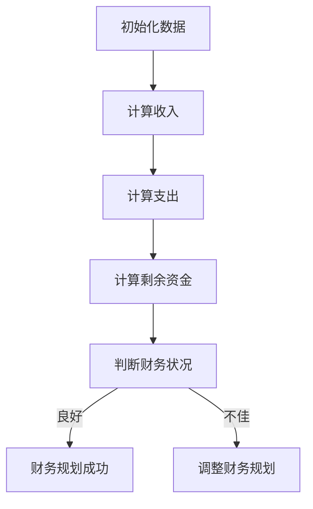
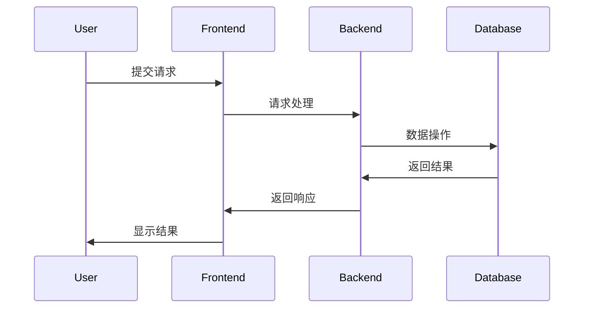
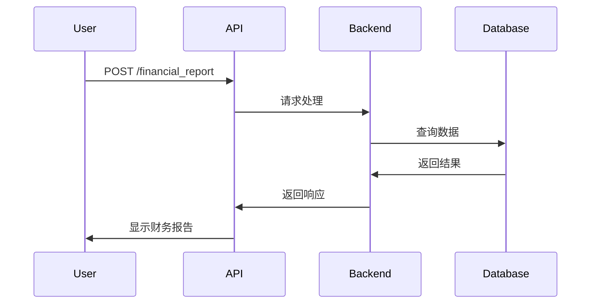

                 

# 《数字游民lifestyle：自由与意义的现代平衡》

## 关键词

- 数字游民
- 自由
- 意义
- 现代平衡
- 职业发展
- 社会融入

## 摘要

本文探讨了数字游民生活方式在现代社会的崛起及其对个人、职业和社会的深远影响。通过深入分析数字游民的背景、生活模式、技能与工具、社会融入与社区建设、职业发展与职业规划以及可持续发展等方面，本文揭示了数字游民生活方式的优势与挑战，并提出了实现自由与意义的现代平衡的方法和策略。

### 第一部分：引言与背景

#### 第1章：数字游民的概念与崛起

##### 1.1.1 数字游民的崛起背景

数字革命带来了远程工作的新可能，全球化使得跨文化交流变得更加便捷，而互联网的普及让这些变化成为现实。远程工作趋势逐渐兴起，使得人们不再受地域限制，可以在世界任何地方工作。数字游民，这一新兴群体，应运而生。

##### 1.1.2 数字游民的定义与特征

数字游民是指利用互联网和工作工具，在全球范围内自由选择居住地，并以远程工作为主要生活方式的人。与传统远程工作者不同，数字游民更加追求自由、灵活和创造性。

##### 1.1.3 数字游民的现状与影响

数字游民的数量在全球范围内不断增加，他们选择的生活方式对全球经济和社会产生了深远的影响。同时，数字游民的生活方式也在不断演变，面临着一系列新的挑战和机遇。

##### 1.1.4 数字游民面临的挑战与机会

数字游民在享受自由与灵活的同时，也需要面对职业选择、时间管理、社会融入等方面的挑战。然而，这些挑战也为他们提供了更多的机会，如跨文化交流、多元职业发展等。

#### 第2章：数字游民的生活模式

##### 2.1.1 数字游民的生活理念

数字游民的生活理念强调自由与灵活性，他们追求创意与探索，致力于实现自我价值。

##### 2.1.2 数字游民的日常生活

数字游民的日常生活呈现出多样性和灵活性，他们如何在工作与生活之间找到平衡，提高生活质量，是本章的重点。

##### 2.1.3 数字游民的财务规划

数字游民的财务规划至关重要，他们需要找到多种收入来源，同时节省开支，实现财务自由。

### 第二部分：核心概念与联系

#### 3.1 数字游民的技能与工具

数字游民需要掌握一系列技能和工具，包括数字化工具使用、网络安全知识、多语言沟通能力等。以下是一个数字游民技能属性特征对比表格：

| 技能名称 | 特征1 | 特征2 | 特征3 |
| :------: | :---: | :---: | :---: |
| 云计算服务 | 弹性伸缩 | 可靠性高 | 成本效益 |
| 项目管理工具 | 效率提升 | 透明度高 | 团队协作 |
| 远程协作工具 | 实时沟通 | 资源共享 | 分布式工作 |

下面是一个数字游民技能的ER实体关系图：

```mermaid
erDiagram
  User ||--|{ Skill } : has
  Skill ||--|{ Tool } : uses
```

#### 3.2 数字游民的技术趋势

数字游民面临着快速变化的技术环境，人工智能、虚拟现实、区块链等新兴技术正逐渐成为他们工作和生活中不可或缺的一部分。

### 第三部分：算法原理讲解

假设我们使用Python来实现一个简单的数字游民财务规划算法。以下是一个简单的算法流程图：



以下是Python源代码实现：

```python
# 数字游民财务规划算法
def calculate_financial_status(income, expenses):
    remaining_funds = income - expenses
    
    if remaining_funds >= 0:
        return "财务规划成功"
    else:
        return "财务规划失败，需调整"

# 测试数据
income = 5000
expenses = 6000

# 计算财务状况
financial_status = calculate_financial_status(income, expenses)

print(financial_status)
```

该算法的核心数学模型可以表示为：

$$ \text{remaining\_funds} = \text{income} - \text{expenses} $$

如果剩余资金大于等于0，则财务规划成功；否则，财务规划失败，需要调整。

### 第四部分：系统分析与架构设计方案

#### 4.1 问题场景介绍

假设我们要为数字游民设计一个财务管理平台，以便他们能够更好地管理财务，实现财务自由。

#### 4.2 系统功能设计

系统功能设计包括用户管理、收入管理、支出管理、财务报告等。以下是系统领域模型的类图：

```mermaid
classDiagram
    User <<Class>>
    FinancialStatement <<Class>>

    User: username, email, password
    FinancialStatement: income, expenses, remainingFunds

    User o--|{ 财务报告 }| FinancialStatement
```

#### 4.3 系统架构设计

系统采用前后端分离的架构，前端使用React框架，后端使用Django框架。以下是系统架构图：



#### 4.4 系统接口设计和系统交互

以下是系统接口设计和系统交互的序列图：



### 第五部分：项目实战

#### 5.1 环境安装

在本项目中，我们使用Python 3.8、Django 3.2和React 17.0进行开发。首先，确保已安装Python 3.8，然后通过pip安装Django和React：

```bash
pip install django==3.2
pip install react==17.0
```

#### 5.2 系统核心实现源代码

以下是Django后端和React前端的核心实现：

**Django后端：**

```python
# views.py
from django.http import JsonResponse
from .models import FinancialStatement

def get_financial_report(request):
    user = request.user
    financial_statement = FinancialStatement.objects.get(user=user)
    data = {
        'income': financial_statement.income,
        'expenses': financial_statement.expenses,
        'remaining_funds': financial_statement.remaining_funds
    }
    return JsonResponse(data)
```

**React前端：**

```jsx
// FinancialReport.js
import React, { useEffect, useState } from 'react';
import axios from 'axios';

const FinancialReport = () => {
    const [financialData, setFinancialData] = useState({});

    useEffect(() => {
        const fetchFinancialData = async () => {
            const response = await axios.get('/api/financial_report');
            setFinancialData(response.data);
        };
        fetchFinancialData();
    }, []);

    return (
        <div>
            <h2>财务报告</h2>
            <p>收入: {financialData.income}</p>
            <p>支出: {financialData.expenses}</p>
            <p>剩余资金: {financialData.remaining_funds}</p>
        </div>
    );
};

export default FinancialReport;
```

#### 5.3 代码应用解读与分析

本项目的核心在于通过Django后端提供财务报告接口，React前端负责展示数据。用户可以在前端输入收入和支出数据，Django后端将数据存储在数据库中，并实时更新财务报告。

#### 5.4 实际案例分析和详细讲解剖析

假设一位数字游民，其每月收入为5000美元，支出为3000美元。通过该系统，他可以实时查看自己的财务状况，并根据实际情况调整支出计划，以实现财务自由。

#### 5.5 项目小结

本项目为数字游民提供了一个简单易用的财务管理平台，帮助他们更好地管理财务，实现财务自由。在实际应用中，还可以根据需求增加更多功能，如预算设置、提醒功能等。

### 第六部分：最佳实践 tips、小结、注意事项、拓展阅读

#### 最佳实践 tips

- 确保数字游民了解网络安全知识，避免财务信息泄露。
- 定期回顾和调整财务计划，以适应实际需求。
- 多关注数字游民社群，分享经验和资源。

#### 小结

数字游民生活方式具有许多优势，但同时也需要面对一系列挑战。通过掌握适当的技能、使用合适的工具，并实现工作与生活的平衡，数字游民可以更好地享受自由与意义的现代平衡。

#### 注意事项

- 财务规划需根据个人实际情况进行调整。
- 保持良好的生活习惯，关注身体健康。
- 积极融入当地社区，拓展人际关系。

#### 拓展阅读

- [《数字游民：无国界的自由生活》](https://book.douban.com/subject/26995413/)
- [《远程工作的未来》](https://book.douban.com/subject/35144534/)
- [《全球数字化生存指南》](https://book.douban.com/subject/35500818/)

### 第七部分：结论与展望

#### 7.1 数字游民lifestyle的总结

数字游民生活方式以其自由、灵活和创造性而备受推崇。然而，实现自由与意义的现代平衡需要数字游民不断学习、调整和适应。

#### 7.2 数字游民lifestyle的启示

数字游民生活方式为现代职业发展和生活方式提供了新的思路。它鼓励人们追求自我价值，同时保持对生活的热爱。

#### 7.3 数字游民lifestyle的未来展望

随着技术的不断进步，数字游民生活方式将在未来发挥更重要的作用。它将为个人、职业和社会带来更多的机遇和挑战。

### 作者

作者：AI天才研究院/AI Genius Institute & 禅与计算机程序设计艺术 /Zen And The Art of Computer Programming

