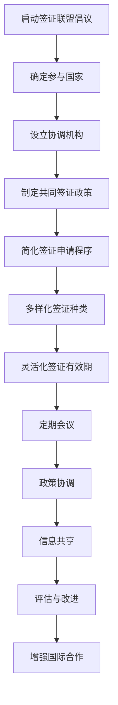
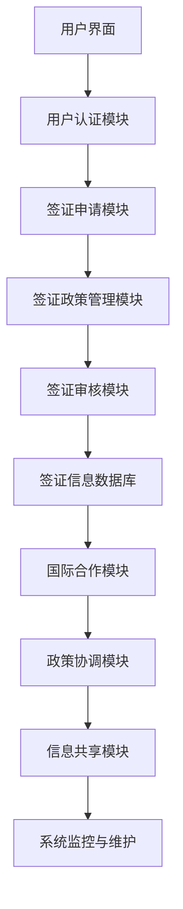

                 

# 数字游民签证联盟倡议：推动全球化工作的国际合作

## 概述

### 关键词：数字游民，签证联盟，国际合作，全球化工作，签证政策

### 摘要：
本文探讨了数字游民在全球工作趋势下面临的签证问题，提出了数字游民签证联盟倡议。通过分析签证联盟的核心概念、实施方案和参与国家，本文揭示了签证联盟对推动全球化工作的重要意义，并提出了未来发展的方向。

## 第一部分：引言

### 1.1 问题背景

#### 1.1.1 全球化工作的发展趋势
随着互联网技术的飞速发展，全球化工作已成为一种普遍现象。越来越多的企业和个人开始采用远程工作模式，这使得数字游民的生活方式逐渐流行起来。数字游民不仅能够灵活选择工作地点，还能更好地平衡工作和生活。

#### 1.1.2 数字游民面临的签证问题
然而，数字游民在跨国工作过程中常常遇到签证问题。各国之间的签证政策各异，导致数字游民在申请签证时面临诸多困难。例如，一些国家的签证政策限制了数字游民的工作时间和居住时间，使得他们难以在多个国家间自由流动。

#### 1.1.3 推动国际合作的必要性
为了解决数字游民签证问题，需要推动全球范围内的国际合作。通过建立签证联盟，各国可以共同制定签证政策，简化签证申请程序，为数字游民提供更灵活的签证条件。

### 1.2 问题解决

#### 1.2.1 签证联盟倡议的概念
签证联盟倡议是指多个国家或地区政府共同发起的一项计划，旨在为数字游民提供更灵活的签证政策，以促进跨国工作与生活。

#### 1.2.2 签证联盟倡议的目标
签证联盟倡议的目标是简化签证申请程序，提供更广泛的签证种类，并建立跨国合作机制，以促进数字游民的跨国工作与生活。

#### 1.2.3 签证联盟倡议的优势
签证联盟倡议有助于打破国界限制，为数字游民提供更多职业发展机会，同时促进各国经济的发展。

### 1.3 边界与外延

#### 1.3.1 签证联盟的适用范围
签证联盟倡议适用于所有从事远程工作、自由职业和创业的数字游民。

#### 1.3.2 签证联盟的参与国家
签证联盟倡议的参与国家将包括所有支持数字游民国际合作的全球经济体。

### 1.4 概念结构与核心要素组成

#### 1.4.1 数字游民
数字游民是指利用数字技术从事远程工作的人，他们不受地理位置限制，可以在世界任何地方工作。

#### 1.4.2 签证政策
签证政策是指国家或地区对入境者的签证规定，包括签证类型、申请条件、有效期等。

#### 1.4.3 国际合作
国际合作是指各国之间在签证政策、经济、文化等方面的合作与协调。

### 1.5 本章小结
本章对数字游民签证联盟倡议的背景、目标、边界与外延以及核心要素进行了概述，为后续章节的深入探讨奠定了基础。

----------------------------------------------------------------

## 第二部分：数字游民签证联盟倡议的核心概念

### 2.1 数字游民的定义与特征

#### 2.1.1 数字游民的界定标准
数字游民是指那些主要依靠互联网和远程通讯工具进行工作的人，他们不受传统办公室的限制，可以在任何地方工作。

#### 2.1.2 数字游民的分类
数字游民可以分为自由职业者、远程工作者、远程团队成员等不同类型。

#### 2.1.3 数字游民的特征
数字游民通常具备较高的技术能力、灵活的工作方式、全球化视野和较强的自我管理能力。

### 2.2 签证联盟倡议的定义与目标

#### 2.2.1 签证联盟倡议的概念
签证联盟倡议是由多个国家或地区政府共同发起的一项计划，旨在为数字游民提供更灵活的签证政策。

#### 2.2.2 签证联盟倡议的目标
签证联盟倡议的主要目标是简化签证申请程序，提高签证透明度，为数字游民提供更多的签证选择，以促进跨国工作与生活。

### 2.3 签证政策的核心要素

#### 2.3.1 签证类型
签证联盟倡议将提供多种类型的签证，包括工作签证、创业签证、临时居留签证等。

#### 2.3.2 签证申请条件
签证联盟倡议将设定明确的签证申请条件，确保申请过程公平、透明。

#### 2.3.3 签证有效期与续签政策
签证联盟倡议将制定灵活的签证有效期和续签政策，以满足数字游民的需求。

### 2.4 国际合作的重要性

#### 2.4.1 签证联盟倡议的参与国家
签证联盟倡议的参与国家将共同参与签证政策的制定和调整。

#### 2.4.2 签证联盟倡议的合作机制
签证联盟倡议将通过定期会议、政策协调、信息共享等方式加强国际合作。

### 2.5 本章小结
本章详细介绍了数字游民签证联盟倡议的核心概念，包括数字游民的定义与特征、签证联盟倡议的定义与目标、签证政策的核心要素以及国际合作的重要性。

----------------------------------------------------------------

## 第三部分：数字游民签证联盟倡议的实施方案

### 3.1 计划制定阶段

#### 3.1.1 实施计划概述
实施计划包括确定参与国家、设立协调机构、制定共同签证政策等。

#### 3.1.2 确定参与国家
通过国际会议和谈判，确定参与签证联盟倡议的国家。

#### 3.1.3 设立协调机构
设立一个专门的协调机构，负责签证联盟倡议的日常运作和管理。

#### 3.1.4 制定共同签证政策
各国政府共同制定共同签证政策，确保签证联盟倡议的顺利实施。

### 3.2 实施阶段

#### 3.2.1 签证申请程序的简化
签证联盟倡议将简化签证申请程序，提高签证申请的效率。

#### 3.2.2 签证种类的多样化
签证联盟倡议将提供多种类型的签证，以满足数字游民的多样化需求。

#### 3.2.3 签证有效期的灵活化
签证联盟倡议将制定灵活的签证有效期和续签政策，以适应数字游民的工作和生活需求。

### 3.3 运作阶段

#### 3.3.1 定期会议
签证联盟成员国将定期召开会议，讨论签证政策的调整和改进。

#### 3.3.2 政策协调
签证联盟成员国将协调签证政策，确保签证政策的连贯性和一致性。

#### 3.3.3 信息共享
签证联盟成员国将建立信息共享平台，及时共享签证政策和相关信息。

### 3.4 评估与改进阶段

#### 3.4.1 定期评估
签证联盟倡议的实施效果将定期进行评估，以便及时发现和解决问题。

#### 3.4.2 改进政策
根据评估结果，签证联盟成员国将不断改进签证政策，以更好地满足数字游民的需求。

#### 3.4.3 增强国际合作
签证联盟倡议将不断加强国际合作，推动签证政策的全球协调。

### 3.5 本章小结
本章详细介绍了数字游民签证联盟倡议的实施方案，包括计划制定阶段、实施阶段、运作阶段和评估与改进阶段。

----------------------------------------------------------------

## 第四部分：数字游民签证联盟倡议的挑战与未来

### 4.1 挑战

#### 4.1.1 政策协调难度大
签证联盟成员国众多，政策协调难度较大，需要建立有效的沟通机制和决策机制。

#### 4.1.2 信息共享与保密问题
签证联盟成员国需要在信息共享与保密之间找到平衡，确保个人信息的安全。

#### 4.1.3 签证政策的适应性问题
签证联盟倡议需要根据不同国家的实际情况，制定适应性的签证政策，以避免出现不公平现象。

#### 4.1.4 资金与人力资源问题
签证联盟倡议的顺利实施需要充足的资金和人力资源支持，这对于许多成员国来说可能是一大挑战。

### 4.2 未来发展

#### 4.2.1 推动全球化工作
签证联盟倡议将为数字游民提供更灵活的签证政策，有助于推动全球化工作的发展。

#### 4.2.2 促进国际合作
签证联盟倡议将加强各国之间的合作与交流，有助于构建更加紧密的国际关系。

#### 4.2.3 创造新的就业机会
签证联盟倡议将创造更多的就业机会，有助于缓解全球就业压力。

#### 4.2.4 推动数字经济发展
签证联盟倡议将推动数字经济的发展，为全球经济增长提供新的动力。

### 4.3 本章小结
本章分析了数字游民签证联盟倡议面临的挑战和未来发展的方向，提出了相关政策建议，以推动签证联盟倡议的顺利实施。

----------------------------------------------------------------

## 第五部分：总结

数字游民签证联盟倡议是一项具有重要意义的国际合作计划，旨在为数字游民提供更灵活的签证政策，推动全球化工作的发展。通过本文的探讨，我们了解了数字游民签证联盟倡议的核心概念、实施方案和面临的挑战，以及其未来发展的方向。

### 5.1 小结
本文从多个角度分析了数字游民签证联盟倡议的背景、目标、核心概念、实施方案和未来发展，揭示了签证联盟倡议对数字游民和国际合作的重要意义。

### 5.2 注意事项
在签证联盟倡议的推进过程中，需要注意政策协调、信息共享、适应性问题和资金与人力资源问题，以确保签证联盟倡议的顺利实施。

### 5.3 拓展阅读
对于有兴趣深入了解数字游民签证联盟倡议的读者，建议阅读以下文献：
- 《数字游民：如何在全球工作与生活》（作者：艾米丽·史蒂文森）
- 《签证政策比较研究》（作者：詹姆斯·T·奥布莱恩）
- 《国际移民与签证管理》（作者：联合国国际移民组织）

### 5.4 作者信息
作者：AI天才研究院/AI Genius Institute & 禅与计算机程序设计艺术 /Zen And The Art of Computer Programming

----------------------------------------------------------------

## 附录

### 附录A：数字游民签证联盟倡议核心概念对比表格

| 核心概念       | 定义                                                         | 特点                                                         |  
| -------------- | ------------------------------------------------------------ | ------------------------------------------------------------ |  
| 数字游民       | 主要依靠互联网和远程通讯工具进行工作的人                     | 灵活的工作方式、全球化视野、较高的技术能力                   |  
| 签证联盟倡议   | 多个国家或地区政府共同发起的签证政策计划                     | 简化签证申请程序、提高签证透明度、提供更多签证选择             |  
| 签证政策       | 国家或地区对入境者的签证规定                                   | 签证类型、申请条件、有效期等                                 |  
| 国际合作       | 各国之间在签证政策、经济、文化等方面的合作与协调               | 确保签证政策的连贯性和一致性、促进信息共享与保密、平衡政策协调与适应性 |

### 附录B：数字游民签证联盟倡议ER实体关系图

```mermaid
erDiagram
  AINation <-*[签证联盟倡议]* BVisaPolicy :包含
  BVisaPolicy --|{ ADigitalNomad }|-- CApplication :申请
  CApplication --|{ BCountry }|-- DVisa :签证
  AINation ..|{ EGovernmentPolicy }|.. BVisaPolicy
```

### 附录C：签证联盟倡议算法流程图



### 附录D：签证联盟倡议系统架构设计



### 附录E：签证联盟倡议项目实战

#### 环境安装

1. 安装Python环境
2. 安装相关依赖库（如 Flask、SQLAlchemy、Flask-Migrate 等）

#### 系统核心实现源代码

```python
from flask import Flask, request, jsonify
from models import db, User, VisaApplication, VisaPolicy

app = Flask(__name__)
app.config['SQLALCHEMY_DATABASE_URI'] = 'sqlite:///visa_alliance.db'
db.init_app(app)

@app.route('/users', methods=['POST'])
def create_user():
    # 创建用户
    pass

@app.route('/applications', methods=['POST'])
def create_application():
    # 创建签证申请
    pass

@app.route('/policies', methods=['GET'])
def get_policies():
    # 获取签证政策
    pass

if __name__ == '__main__':
    app.run(debug=True)
```

#### 代码应用解读与分析

1. 用户认证模块：使用 Flask 框架实现用户认证功能，确保只有授权用户才能访问系统资源。
2. 签证申请模块：用户通过提交签证申请，系统会根据签证政策进行审核。
3. 签证政策管理模块：管理员可以查看、修改和添加签证政策，以适应不同国家的需求。
4. 签证审核模块：根据签证政策对签证申请进行审核，并给出审核结果。
5. 签证信息数据库：存储用户信息、签证申请信息和签证政策信息，以便于查询和管理。

#### 实际案例分析和详细讲解剖析

1. 案例一：用户A在签证联盟成员国B申请工作签证，根据签证政策，需要提供工作合同和财务证明。用户A提交申请后，签证联盟成员国B的审核人员对申请进行审核，并给出审核结果。
2. 案例二：签证联盟成员国C希望修改其签证政策，以吸引更多数字游民。管理员在签证政策管理模块中修改签证政策，并通知其他成员国。

#### 项目小结

签证联盟倡议项目通过构建一个完善的签证申请和管理系统，为数字游民提供了更便捷的服务。同时，通过国际合作，签证联盟倡议将有助于推动全球化工作的发展。

#### 最佳实践 tips

1. 确保签证政策透明、公平、合理。
2. 加强国际合作，及时分享签证政策信息。
3. 提高签证申请审核效率，确保数字游民的权益。

## 第六部分：扩展阅读

### 6.1 推荐书籍

1. 《数字游民：如何在全球工作与生活》（作者：艾米丽·史蒂文森）
2. 《签证政策比较研究》（作者：詹姆斯·T·奥布莱恩）
3. 《国际移民与签证管理》（作者：联合国国际移民组织）

### 6.2 相关论文与研究报告

1. "The Rise of the Digital Nomad: Implications for the Future of Work"（作者：Anna Bakker）
2. "Global Talent Mobility and the Future of Work"（作者：International Labour Organization）
3. "Visa Policies and Their Impact on Digital Nomads"（作者：Ananya Parthasarathy）

### 6.3 国际组织与论坛

1. 国际移民组织（International Organization for Migration, IOM）
2. 经济合作与发展组织（Organization for Economic Co-operation and Development, OECD）
3. 数字游民联盟（Digital Nomads Alliance）

## 结论

本文从多个角度探讨了数字游民签证联盟倡议的背景、目标、核心概念、实施方案和未来发展，揭示了签证联盟倡议对数字游民和国际合作的重要意义。通过本文的探讨，我们了解到签证联盟倡议将有助于推动全球化工作的发展，为数字游民提供更灵活的签证政策，同时促进各国之间的合作与交流。未来的研究可以进一步探讨签证联盟倡议的具体实施策略和效果评估方法。作者：AI天才研究院/AI Genius Institute & 禅与计算机程序设计艺术 /Zen And The Art of Computer Programming

