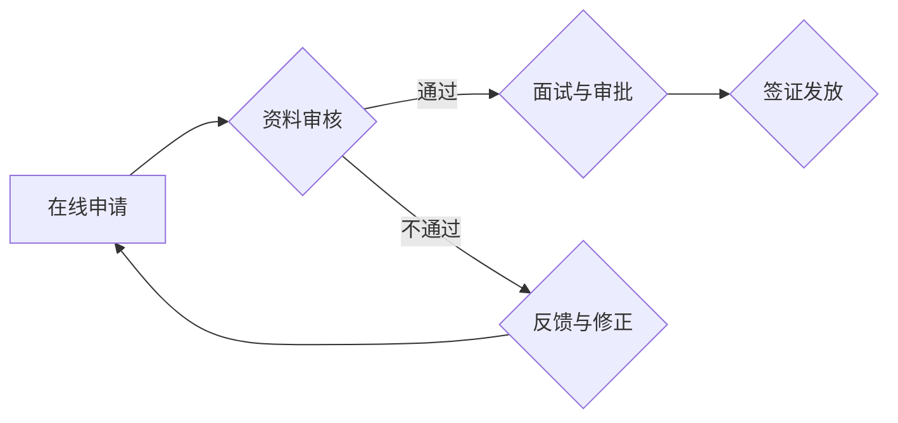
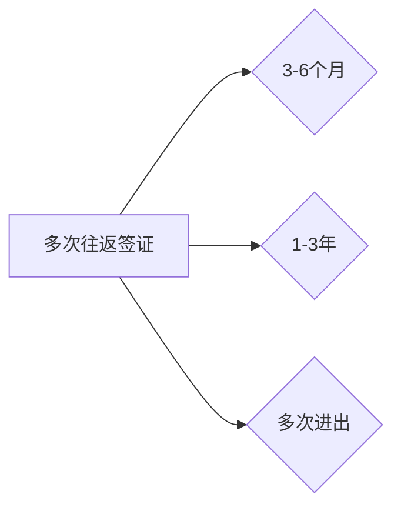
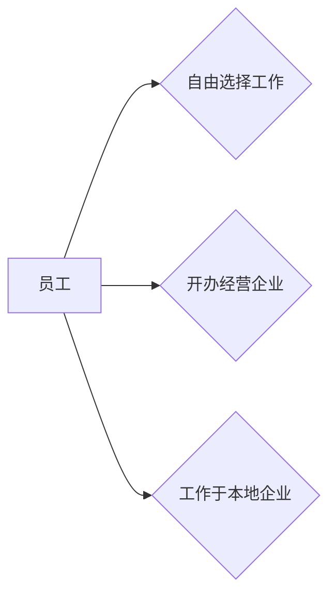
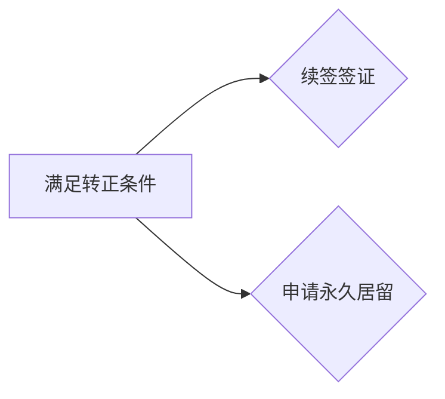

                 

### 第一部分: 引言与背景介绍

## 第1章: 引言与背景

### 1.1 问题的背景

#### 1.1.1 数字游民的概念

数字游民，指的是那些利用互联网技术进行工作和生活的人群。他们不受地理位置限制，可以通过远程办公、自由职业、自由写作等方式实现职业发展。数字游民利用网络平台和在线工具进行沟通、协作和创造价值，这种新兴的生活方式正在全球范围内迅速崛起。

#### 1.1.2 全球化工作的趋势

随着互联网技术的普及和全球化进程的加速，越来越多的人开始选择成为数字游民。一方面，企业越来越倾向于雇佣远程工作者以降低成本和提高效率；另一方面，数字游民的生活方式也为个人提供了更多的自由和灵活性。这种趋势不仅改变了人们的职业选择，也正在重塑全球经济和工作方式。

#### 1.1.3 现有签证政策面临的问题

然而，现有签证政策在支持数字游民和全球化工作方面存在诸多问题。首先，传统签证政策通常基于居住地而非工作性质，这给数字游民带来了极大的不便。其次，许多国家对于数字游民签证的申请流程繁琐，申请周期长，这限制了他们的流动性和灵活性。此外，现有政策在安全性、合规性和可持续性方面也存在不足，难以满足数字游民和企业的需求。

#### 1.1.4 需要创新的签证政策

因此，为了更好地支持全球化工作和数字游民的发展，需要创新的签证政策。这些政策应具备灵活性、可扩展性、安全性和可持续性，能够满足数字游民和企业的需求，同时确保国家的安全和利益。本文将探讨创新签证政策的设计理念、目标和主要领域，旨在为政策制定者提供有益的参考。

### 1.2 支持全球化工作的政策创新

#### 1.2.1 创新签证政策的必要性

创新签证政策的必要性在于：

1. **提高数字游民的流动性**：通过简化申请流程和缩短审批时间，增强数字游民的流动性，使其能够更自由地选择工作和居住地。
2. **促进全球化合作**：鼓励国际人才流动，促进跨国企业和个人之间的合作，提升全球创新能力和竞争力。
3. **保障国家安全**：在灵活性、安全性和合规性之间取得平衡，确保国家在开放市场的同时维护国家安全和利益。

#### 1.2.2 政策创新的目标和意义

政策创新的目标包括：

1. **灵活性**：设计灵活的签证类型和居留期限，适应不同数字游民的需求。
2. **可扩展性**：构建可扩展的签证框架，方便根据市场需求调整和优化政策。
3. **安全性**：确保签证政策在开放市场的同时，能够有效管理风险和保障国家利益。
4. **可持续性**：促进数字游民和当地社区的可持续发展，减少社会和经济不平等。

政策创新的意义在于：

1. **提升国家竞争力**：通过吸引全球优秀人才，提升国家在全球经济中的竞争地位。
2. **推动创新和创业**：为数字游民提供更好的创业环境和机会，促进创新和经济增长。
3. **促进文化交流**：通过国际人才流动，增进不同国家和文化之间的了解和交流。
4. **优化劳动力市场**：提高劳动力市场的灵活性和多样性，促进就业和职业发展。

#### 1.2.3 政策创新的主要领域

政策创新的主要领域包括：

1. **签证类型**：设计多样化的签证类型，如远程工作签证、自由职业者签证、创业签证等，满足不同数字游民的需求。
2. **申请流程**：简化签证申请流程，利用在线平台和自动化工具提高审批效率。
3. **居留期限**：根据数字游民的实际需求，设置灵活的居留期限，如短期、长期和多次往返签证。
4. **工作权利**：明确数字游民的工作权利，包括薪酬、税收、社会保险等。
5. **续签与转正**：建立明确的续签和转正条件，确保数字游民能够在符合条件的情况下获得更长久的居留权。

### 1.3 本书结构安排

#### 1.3.1 各章节的主要内容和目标

本书分为以下几个主要章节，每个章节的目标如下：

- **第2章：数字游民签证政策的核心概念**：定义数字游民签证的基本特征，分析现有政策与困境，探讨创新签证政策的设计理念。
- **第3章：理论基础与实践案例**：概述相关政策理论，介绍国外成功案例，分析创新签证政策在中国的适用性。
- **第4章：政策设计原则与框架**：阐述政策设计的原则，构建政策框架，包括申请流程、居留期限、工作权利和续签条件。
- **第5章：政策实施与评估**：讨论政策实施策略和评估体系，确保签证政策的有效性和适应性。

#### 1.3.2 读者受益和预期成果

通过阅读本书，读者可以获得以下收益和预期成果：

- **深入理解数字游民签证政策的核心概念和理论基础**。
- **了解国内外创新签证政策的实践案例和经验**。
- **掌握设计创新签证政策的原则和框架**。
- **了解政策实施和评估的策略和方法**。
- **为政策制定者提供有价值的参考和建议**。

### 1.4 本章小结

本章介绍了数字游民签证计划的支持全球化工作的政策创新的背景和必要性。通过分析全球化工作的趋势和现有签证政策面临的问题，阐述了创新签证政策的目标和意义，以及主要领域的政策创新。本章为后续章节的探讨奠定了基础，旨在为读者提供全面、深入的了解。

---

**文章标题：数字游民签证计划：支持全球化工作的政策创新**

**关键词：数字游民、签证政策、全球化工作、政策创新、灵活性、安全性**

**摘要：本文探讨了数字游民签证计划的支持全球化工作的政策创新。通过分析全球化工作的趋势和现有签证政策的问题，提出了创新签证政策的必要性。文章详细介绍了政策创新的目标和意义，以及主要领域的设计原则和框架。此外，还讨论了政策实施和评估的策略和方法，旨在为政策制定者提供有价值的参考。**

----------------------------------------------------------------

## 第二部分: 核心概念与理论

### 第2章: 数字游民签证政策的核心概念

数字游民签证政策的设计和实施需要深入了解其核心概念和理论基础。本章将详细探讨数字游民签证的定义、基本特征，以及与现有签证政策的对比分析，最后讨论创新签证政策的设计理念。

### 2.1 定义与基本特征

#### 2.1.1 数字游民签证的定义

数字游民签证是指为了吸引和留住全球优秀人才，特别是在全球化背景下，通过简化申请流程和提供灵活的工作和居留条件，使非本国公民可以在其他国家从事远程工作或其他数字相关活动的签证类型。这类签证旨在支持数字游民的生活方式，满足其职业发展和个人需求。

#### 2.1.2 数字游民签证的基本特征

数字游民签证具有以下基本特征：

1. **远程工作导向**：数字游民签证主要面向那些通过互联网进行工作的个人或团队，不受地理位置限制，可以在全球任何地方工作。
2. **灵活性**：签证政策通常提供灵活的居留期限和工作权利，以满足不同类型数字游民的需求。
3. **短期与长期**：数字游民签证可以是短期的访问签证，也可以是长期的工作签证，甚至可以转化为永久居民签证。
4. **简化流程**：申请流程较为简单，通常通过在线平台完成，审批时间短，减少了繁琐的手续。
5. **可扩展性**：签证政策设计具备一定的弹性，可以根据市场需求进行调整和优化。

### 2.2 现有签证政策的比较分析

#### 2.2.1 传统签证政策

传统签证政策通常是基于居住地和就业性质来设计的。例如，工作签证要求申请人必须有雇主担保，且必须在特定的地区工作。这类签证通常有较长的申请周期，复杂的审批流程，以及对申请人背景和资质的要求较高。传统签证政策难以满足数字游民的需求，因为他们往往不需要固定的工作地点，而是选择远程工作。

#### 2.2.2 电子签证

电子签证是近年来发展起来的一种新型签证类型，它通过互联网平台简化了申请流程，使申请人可以在线提交申请材料并进行支付。电子签证通常适用于短期访问和旅游目的，但对于数字游民而言，其工作权利和居留期限仍受到限制，无法满足其长期工作和居住的需求。

#### 2.2.3 现有政策下数字游民的困境

现有签证政策下，数字游民面临以下困境：

1. **申请难度大**：传统签证政策要求有雇主担保或固定工作地点，这对远程工作的数字游民来说是一个挑战。
2. **审批周期长**：繁琐的申请流程和漫长的审批周期限制了数字游民的流动性和灵活性。
3. **工作权利受限**：许多签证政策对数字游民的工作权利进行限制，使其难以获得与本地工作者相同的工作条件和待遇。
4. **居留期限短**：现有签证政策的居留期限通常较短，无法满足数字游民长期工作的需求。

### 2.3 创新签证政策的设计理念

为了解决现有签证政策的问题，创新签证政策的设计需要遵循以下理念：

#### 2.3.1 灵活性与可扩展性

创新签证政策应具备灵活性，以适应不同类型数字游民的需求。例如，可以设计多种签证类型，如远程工作签证、自由职业者签证、创业签证等，提供灵活的居留期限和工作权利。此外，政策设计应具备可扩展性，能够根据市场需求进行调整和优化。

#### 2.3.2 安全性与合规性

在灵活性、安全性和合规性之间取得平衡是创新签证政策设计的关键。政策应建立严格的安全检查机制，确保签证申请人符合国家安全和利益的要求。同时，政策应遵守国际法规和标准，确保签证申请和管理的合规性。

#### 2.3.3 可持续性与包容性

创新签证政策还应考虑可持续性和包容性。政策设计应促进数字游民与当地社区的可持续发展，减少社会和经济不平等。例如，可以提供培训和就业机会，帮助当地居民融入数字游民经济，共同发展。

### 2.4 国外创新签证政策的实践案例

为了更好地理解创新签证政策的设计理念，以下将介绍一些国外成功的创新签证政策案例：

#### 2.4.1 新加坡的永久居民计划

新加坡的永久居民计划旨在吸引全球优秀人才，提供灵活的居留条件和工作权利。政策设计灵活，申请流程简单，审批时间短。同时，新加坡政府还提供一系列福利和激励措施，如住房补贴、税收减免等，以吸引和留住人才。

#### 2.4.2 以色列的创新签证政策

以色列的创新签证政策旨在吸引全球科技创新人才。政策设计注重灵活性，允许申请人自由选择工作地点和类型，并提供优惠的税收政策和创业支持。以色列政府还建立了专门的签证服务中心，简化申请流程，提高审批效率。

#### 2.4.3 其他国家的成功经验

其他国家的创新签证政策也取得了显著成效。例如，加拿大的全球人才流动计划，澳大利亚的全球人才独立计划等，都通过简化申请流程、提供灵活的居留条件和优惠的税收政策，吸引了大量全球人才。

### 2.5 创新签证政策在中国的适用性分析

#### 2.5.1 中国的全球化现状

中国正在加速全球化进程，积极吸引全球优秀人才。然而，现有签证政策在灵活性、审批效率和福利待遇方面仍存在不足。为了更好地支持全球化工作，中国需要设计和实施创新的签证政策。

#### 2.5.2 创新签证政策的挑战与机遇

创新签证政策在中国的实施面临以下挑战：

1. **政策制定与执行的协调**：需要协调不同政府部门和机构之间的政策，确保签证政策的有效实施。
2. **安全性与合规性的平衡**：在开放市场的同时，确保国家安全和利益不受损害。
3. **国际经验的借鉴**：需要借鉴国外成功经验，结合中国实际情况，设计适合的创新签证政策。

同时，创新签证政策在中国也面临以下机遇：

1. **经济转型与升级**：通过吸引全球优秀人才，推动中国经济的转型升级。
2. **技术创新与创业**：为数字游民和创业者提供更好的创业环境和机会，促进技术创新和创业活动。
3. **文化交流与融合**：通过国际人才流动，增进不同国家和文化之间的了解和交流。

#### 2.5.3 中国创新签证政策的可行性探讨

中国实施创新签证政策的可行性较高。一方面，中国拥有庞大的市场和资源，吸引全球人才具备天然优势；另一方面，中国政府的政策支持和国际合作也为此提供了有利条件。然而，政策设计需要充分考虑安全性、合规性和可持续性，确保政策的有效性和可持续性。

### 2.6 本章小结

本章详细探讨了数字游民签证政策的核心概念和理论基础。首先，定义了数字游民签证的基本特征和定义，并分析了现有签证政策的问题。随后，讨论了创新签证政策的设计理念，包括灵活性、可扩展性、安全性与可持续性。最后，介绍了国外成功案例，分析了创新签证政策在中国的适用性。通过本章的内容，读者可以深入理解数字游民签证政策的内涵和重要性。

---

**文章标题：数字游民签证计划：支持全球化工作的政策创新**

**关键词：数字游民、签证政策、全球化工作、政策创新、灵活性、安全性**

**摘要：本章深入探讨了数字游民签证政策的核心概念和理论基础。通过分析现有签证政策的不足和数字游民的需求，提出了创新签证政策的设计理念。本章介绍了数字游民签证的基本特征和定义，对比分析了现有政策，讨论了创新签证政策的目标和意义。此外，还介绍了国外成功案例，分析了创新签证政策在中国的适用性。通过本章的内容，读者可以全面了解数字游民签证政策的内涵和重要性。**

----------------------------------------------------------------

## 第3章: 理论基础与实践案例

### 3.1 相关政策理论概述

在探讨数字游民签证政策时，我们需要了解相关政策理论，这些理论为我们提供了理论基础和分析框架。以下是几种与数字游民签证政策相关的关键理论：

#### 3.1.1 全球化理论

全球化理论强调全球经济、文化和社会的相互联系和相互依赖。全球化促进了资本、劳动力、技术和信息的自由流动，从而改变了传统经济模式和国家边界的作用。在全球化背景下，数字游民签证政策需要适应跨国界工作的新趋势，鼓励人才流动，提升国际竞争力。

**核心概念：** 全球化、跨国界工作、人才流动、国际竞争力。

**对比表格：**

| 理论 | 定义 | 关键要素 |
| --- | --- | --- |
| 全球化 | 全球经济、文化和社会的相互联系和相互依赖 | 资本、劳动力、技术和信息的自由流动 |
| 数字游民签证政策 | 支持数字游民的签证政策 | 灵活性、安全性、可持续性 |

#### 3.1.2 劳动力市场理论

劳动力市场理论关注劳动力的供给和需求，以及劳动力市场的动态变化。数字游民签证政策需要考虑劳动力市场的供需状况，平衡本地劳动者和数字游民之间的利益，同时确保签证政策能够吸引和留住全球优秀人才。

**核心概念：** 劳动力市场、供给和需求、劳动者权益、人才吸引力。

**对比表格：**

| 理论 | 定义 | 关键要素 |
| --- | --- | --- |
| 劳动力市场 | 劳动力的供给和需求市场 | 薪酬、就业机会、劳动者权益 |
| 数字游民签证政策 | 支持数字游民的签证政策 | 灵活性、安全性、可持续性 |

#### 3.1.3 创新政策理论

创新政策理论关注如何通过政策手段促进技术创新和经济发展。数字游民签证政策需要利用创新政策理论，通过提供灵活的工作和生活环境，吸引全球创新人才，推动本地企业和产业的创新和发展。

**核心概念：** 创新政策、技术创新、经济发展、人才吸引。

**对比表格：**

| 理论 | 定义 | 关键要素 |
| --- | --- | --- |
| 创新政策 | 促进技术创新和经济发展 | 税收优惠、资金支持、政策激励 |
| 数字游民签证政策 | 支持数字游民的签证政策 | 灵活性、安全性、可持续性 |

### 3.2 国外创新签证政策的实践案例

国外许多国家已经实施了创新签证政策，以吸引全球优秀人才，下面将介绍几个具有代表性的案例：

#### 3.2.1 新加坡的永久居民计划

**案例介绍：** 新加坡的永久居民计划（PR）旨在吸引高技能人才和企业家，提供灵活的居留条件和工作权利。申请人可以通过就业、创业或家庭团聚等方式获得永久居民身份。

**成功因素：**
- **灵活性**：永久居民签证提供灵活的居留期限和工作权利，满足不同类型人才的需求。
- **政策支持**：新加坡政府提供一系列支持措施，如税收优惠、住房补贴和子女教育优惠，以吸引和留住人才。

**适用性分析：** 新加坡的永久居民计划为其他国家和地区提供了宝贵的经验，尤其是在吸引高技能人才和企业家方面。然而，新加坡的竞争激烈，需要确保政策的有效性和可持续性。

#### 3.2.2 以色列的创新签证政策

**案例介绍：** 以色列的创新签证政策（Aliyah visas）旨在吸引全球科技和创新人才，提供快速审批和多种签证类型。

**成功因素：**
- **快速审批**：以色列的签证审批时间较短，通常在几个月内完成。
- **多样签证类型**：以色列提供多种签证类型，包括工作签证、创业签证和研究签证，满足不同人才的需求。

**适用性分析：** 以色列的创新签证政策在吸引科技创新人才方面取得了显著成效。其他国家和地区可以借鉴以色列的经验，简化签证审批流程，提供多样化的签证类型，以吸引全球优秀人才。

#### 3.2.3 其他国家的成功经验

**案例介绍：** 加拿大的全球人才流动计划（Global Talent Stream）和澳大利亚的全球人才独立计划（Global Talent Independent Program）等，都是成功的创新签证政策案例。

**成功因素：**
- **灵活的居留期限**：提供灵活的居留期限，如短期工作签证和长期工作签证，满足不同人才的需求。
- **优惠的税收政策**：提供优惠的税收政策，吸引高技能人才。
- **政策支持**：提供多种支持措施，如资金支持、创业支持和技术培训，帮助人才融入当地社会。

**适用性分析：** 这些国家的成功经验表明，创新签证政策可以吸引全球优秀人才，推动经济发展。其他国家和地区可以借鉴这些成功经验，结合自身实际情况，设计适合的创新签证政策。

### 3.3 创新签证政策在中国的适用性分析

#### 3.3.1 中国的全球化现状

中国正在加速全球化进程，积极参与国际事务和全球价值链。然而，中国在吸引全球优秀人才方面仍存在一定挑战，如签证政策的不灵活性、审批流程的复杂性等。因此，创新签证政策的实施对中国具有重要意义。

**全球化现状：**
- **国际经济合作**：中国积极参与国际经济合作，推动“一带一路”倡议，加强与全球各国的经济联系。
- **人才需求**：中国需要大量高技能人才来推动科技创新、产业升级和国际竞争力提升。

#### 3.3.2 创新签证政策的挑战与机遇

创新签证政策在中国的实施面临以下挑战：

**挑战：**
- **政策协调**：需要协调不同政府部门和机构之间的政策，确保签证政策的有效实施。
- **安全性与合规性**：在开放市场的同时，确保国家安全和利益不受损害。
- **人才竞争**：面临国际人才市场的激烈竞争，需要提供有吸引力的政策和福利。

同时，创新签证政策在中国也面临以下机遇：

**机遇：**
- **经济转型**：通过吸引全球优秀人才，推动中国经济的转型升级。
- **技术创新**：为数字游民和创业者提供更好的创业环境和机会，促进技术创新和创业活动。
- **文化交流**：通过国际人才流动，增进不同国家和文化之间的了解和交流。

#### 3.3.3 中国创新签证政策的可行性探讨

中国实施创新签证政策的可行性较高，以下是一些建议：

**可行性分析：**
- **市场需求**：中国拥有庞大的市场和资源，吸引全球人才具备天然优势。
- **政策支持**：中国政府已经意识到人才的重要性，积极推动人才政策改革，提供政策支持。
- **国际合作**：通过国际合作，借鉴国外成功经验，提高签证政策的吸引力和有效性。

**建议：**
- **简化申请流程**：简化签证申请流程，提供在线申请平台，提高审批效率。
- **多样化签证类型**：提供多样化的签证类型，满足不同人才的需求。
- **优惠政策**：提供税收优惠、创业支持和技术培训等优惠政策，吸引和留住人才。

### 3.4 本章小结

本章介绍了数字游民签证政策的相关理论，包括全球化理论、劳动力市场理论和创新政策理论。通过对比分析，我们了解了不同国家创新签证政策的实践案例，以及这些案例对中国创新签证政策的启示。本章内容为后续章节的政策设计和实施提供了理论基础和实践参考。

---

**文章标题：数字游民签证计划：支持全球化工作的政策创新**

**关键词：全球化、劳动力市场、创新政策、签证政策、实践案例**

**摘要：本章探讨了数字游民签证政策的相关理论基础，包括全球化理论、劳动力市场理论和创新政策理论。通过对比分析国外成功案例，如新加坡的永久居民计划、以色列的创新签证政策以及其他国家的经验，本章为中国创新签证政策的适用性提供了深入分析。通过本章的内容，读者可以了解不同理论在签证政策设计中的应用，以及国内外成功案例的启示，为政策制定者提供有价值的参考。**

----------------------------------------------------------------

## 第4章: 政策设计原则与框架

### 4.1 设计原则

数字游民签证政策的设计应遵循以下原则，以确保政策的有效性和可持续性：

#### 4.1.1 公平性

公平性是签证政策设计的重要原则，要求政策对所有申请人都公平对待，不因种族、性别、国籍等因素歧视任何人。公平性体现在以下几个方面：

- **申请条件**：确保申请条件对所有申请人公开透明，不设定不合理的门槛。
- **审批流程**：确保审批流程公正无私，避免人为干预和腐败现象。
- **权利保障**：确保数字游民在居住和工作期间享有与本地居民相同的基本权利，如教育、医疗和社会福利等。

**对比表格：**

| 原则 | 说明 | 关键要素 |
| --- | --- | --- |
| 公平性 | 确保政策对所有申请人公平对待 | 公开透明的申请条件、公正无私的审批流程、权利保障 |

#### 4.1.2 灵活性

灵活性是数字游民签证政策设计的核心原则，要求政策能够适应不同类型数字游民的需求。灵活性体现在以下几个方面：

- **签证类型**：设计多样化的签证类型，如远程工作签证、自由职业者签证、创业签证等，满足不同需求。
- **居留期限**：提供灵活的居留期限，包括短期、中期和长期签证，以适应不同工作性质和需求。
- **工作权利**：允许数字游民根据签证类型和工作需求，自由选择工作地点和方式。

**对比表格：**

| 原则 | 说明 | 关键要素 |
| --- | --- | --- |
| 灵活性 | 政策适应不同类型数字游民需求 | 多样化的签证类型、灵活的居留期限、自由的工作权利 |

#### 4.1.3 可持续性

可持续性是数字游民签证政策设计的关键原则，要求政策在支持数字游民流动性的同时，考虑对当地社区和环境的影响。可持续性体现在以下几个方面：

- **经济可持续性**：确保签证政策能够促进当地经济增长，减少经济不平等。
- **社会可持续性**：通过提供培训和就业机会，帮助当地居民融入数字游民经济，实现社会和谐。
- **环境可持续性**：在政策设计和管理过程中，考虑环境保护和资源利用，减少对环境的负面影响。

**对比表格：**

| 原则 | 说明 | 关键要素 |
| --- | --- | --- |
| 可持续性 | 考虑数字游民对当地社区和环境的影响 | 经济可持续性、社会可持续性、环境可持续性 |

### 4.2 政策框架

数字游民签证政策的设计需要构建一个完整的政策框架，包括申请流程、居留期限、工作权利、续签与转正条件等关键要素。以下是一个简单的政策框架：

#### 4.2.1 申请流程

申请流程是数字游民签证政策的关键环节，决定了政策实施的效率和公正性。以下是一个典型的申请流程：

1. **在线申请**：申请人通过官方在线平台提交签证申请，填写个人信息、工作计划和其他相关资料。
2. **资料审核**：申请材料由相关部门进行审核，确保信息真实、完整、符合申请条件。
3. **面试与审批**：部分申请者可能需要参加面试，以评估其真实性和适应性。面试通过后，签证申请将进入审批环节。
4. **签证发放**：审批通过后，签证将被发放给申请人，并通知其居留期限和工作权利。

**Mermaid 流程图：**

#### 4.2.2 居留期限

居留期限是数字游民签证政策的重要部分，应根据数字游民的工作性质和需求进行设置。以下是一些常见的居留期限设置：

- **短期签证**：适用于短期工作、会议、培训等，通常为3-6个月。
- **长期签证**：适用于长期工作、创业等，通常为1-3年。
- **多次往返签证**：允许申请人在一定期限内多次进出签证目的地，提高灵活性。

**Mermaid 流程图：**

#### 4.2.3 工作权利

数字游民签证政策应明确数字游民的工作权利，确保其能够在签证目的地从事相关工作。以下是一些常见的工作权利：

- **自由职业者**：可以自由选择工作类型和地点，不受雇主限制。
- **企业主**：可以开办和经营企业，享受与本地企业主相同的商业环境。
- **员工**：可以在本地企业工作，享有与本地员工相同的工作条件和福利。

**Mermaid 流程图：**

#### 4.2.4 续签与转正条件

数字游民签证政策应设置明确的续签和转正条件，确保签证的有效性和连续性。以下是一些常见的续签和转正条件：

- **续签条件**：满足特定的工作、居留期限和合规性要求，如无犯罪记录、稳定收入等。
- **转正条件**：满足特定的工作、居留期限和贡献要求，如创造就业、技术创新等，可申请永久居留或公民身份。

**Mermaid 流程图：**

### 4.3 本章小结

本章介绍了数字游民签证政策的设计原则与框架。首先，阐述了公平性、灵活性和可持续性的设计原则，并通过对比表格详细说明。随后，构建了数字游民签证政策的框架，包括申请流程、居留期限、工作权利和续签与转正条件，并通过Mermaid流程图进行直观展示。这些设计原则和框架为数字游民签证政策的制定和实施提供了理论依据和实践指导。

---

**文章标题：数字游民签证计划：支持全球化工作的政策创新**

**关键词：签证政策、设计原则、公平性、灵活性、可持续性**

**摘要：本章详细探讨了数字游民签证政策的设计原则与框架。首先，阐述了公平性、灵活性和可持续性的重要性，并通过对比表格进行了详细说明。随后，构建了数字游民签证政策的框架，包括申请流程、居留期限、工作权利和续签与转正条件，并通过Mermaid流程图进行了直观展示。这些设计原则和框架为数字游民签证政策的制定和实施提供了理论依据和实践指导。**

----------------------------------------------------------------

## 第5章: 政策实施与评估

### 5.1 实施策略

数字游民签证政策的实施需要科学的策略，以确保政策能够顺利落地并达到预期效果。以下是一些关键的实施策略：

#### 5.1.1 宣传推广

宣传推广是政策实施的第一步，目的是提高公众对数字游民签证政策的认知和认可。以下是一些宣传推广策略：

- **多渠道宣传**：利用官方网站、社交媒体、新闻媒体等多渠道进行宣传，确保信息传播的广泛性和及时性。
- **宣传活动**：举办线上线下宣传活动，如研讨会、座谈会、宣传活动等，增强政策的影响力。
- **合作伙伴**：与相关机构和企业建立合作关系，共同推广数字游民签证政策，扩大政策的影响范围。

#### 5.1.2 政策协调

政策协调是确保数字游民签证政策顺利实施的保障。以下是一些政策协调策略：

- **跨部门合作**：协调不同政府部门和机构之间的政策，确保签证政策与其他相关政策的衔接和协调。
- **信息共享**：建立信息共享平台，确保各部门和机构之间的信息畅通，提高政策实施的效率和准确性。
- **定期评估**：定期对签证政策进行评估和调整，根据实际情况及时解决问题和改进政策。

#### 5.1.3 服务保障

服务保障是政策实施的关键，旨在为数字游民提供便捷、高效的服务。以下是一些服务保障策略：

- **在线服务**：建立在线服务平台，提供在线申请、审批、续签等服务，提高服务的便捷性和效率。
- **客户支持**：设立客户服务热线和在线客服，为数字游民提供及时、专业的咨询和帮助。
- **技术支持**：确保签证政策实施过程中所需的技术支持和维护，确保系统的稳定运行和安全保障。

### 5.2 评估体系

数字游民签证政策的评估体系是确保政策实施效果的重要手段。以下是一些关键的评估指标和方法：

#### 5.2.1 评价指标

评价指标是评估数字游民签证政策实施效果的重要工具。以下是一些关键的评价指标：

- **申请数量**：评估政策吸引力和公众参与度，反映政策的受欢迎程度。
- **审批时间**：评估政策实施效率和准确性，反映审批流程的优化程度。
- **签证续签率**：评估政策的稳定性和吸引力，反映数字游民的满意度和留存率。
- **就业率**：评估政策对本地就业市场的影响，反映政策对经济发展的贡献。

#### 5.2.2 评估方法

评估方法包括定量和定性两种方法，以下是一些常用的评估方法：

- **定量评估**：通过数据分析、统计和计算等方法，对政策实施效果进行量化评估。例如，使用申请数量、审批时间等数据进行评估。
- **定性评估**：通过调查、访谈、案例分析等方法，对政策实施效果进行深入分析和评价。例如，通过问卷调查了解数字游民和企业的满意度，通过案例分析评估政策对经济发展的影响。

#### 5.2.3 评估报告的撰写与发布

评估报告是政策评估的重要成果，旨在总结评估过程、分析评估结果，并提出改进建议。以下是一些撰写和发布评估报告的步骤：

- **报告结构**：评估报告应包括引言、评估方法、评估结果、讨论和建议等部分，结构清晰，内容完整。
- **数据展示**：使用图表、表格等形式展示评估数据，使报告更加直观、易于理解。
- **讨论和建议**：结合评估结果，提出政策改进建议，包括优化政策设计、改进审批流程、提高服务水平等。
- **发布和反馈**：通过官方网站、新闻媒体等渠道发布评估报告，并邀请相关部门、企业和公众反馈意见和建议，促进政策的不断完善。

### 5.3 本章小结

本章详细探讨了数字游民签证政策的实施策略和评估体系。首先，介绍了宣传推广、政策协调、服务保障等关键实施策略，确保政策能够顺利落地并取得预期效果。随后，阐述了评价指标、评估方法和评估报告的撰写与发布，构建了一个完整的评估体系，以评估政策实施效果。通过本章的内容，读者可以全面了解数字游民签证政策的实施和评估过程，为政策制定和实施提供有益的参考。

---

**文章标题：数字游民签证计划：支持全球化工作的政策创新**

**关键词：签证政策、实施策略、评估体系、宣传推广、政策协调**

**摘要：本章详细探讨了数字游民签证政策的实施策略和评估体系。首先，介绍了宣传推广、政策协调、服务保障等关键实施策略，确保政策能够顺利落地并取得预期效果。随后，阐述了评价指标、评估方法和评估报告的撰写与发布，构建了一个完整的评估体系，以评估政策实施效果。通过本章的内容，读者可以全面了解数字游民签证政策的实施和评估过程，为政策制定和实施提供有益的参考。**

----------------------------------------------------------------

## 结论

通过本文的深入探讨，我们可以得出以下结论：

1. **数字游民签证计划的必要性**：数字游民签证计划旨在支持全球化工作，提高国际人才流动性，促进经济和文化交流。这种签证计划不仅能够满足数字游民的职业和生活需求，还能够为目的地国家带来经济和文化上的益处。

2. **创新签证政策的设计原则**：为了确保签证政策的成功实施，设计原则应包括灵活性、公平性和可持续性。这些原则能够保障签证政策在满足数字游民需求的同时，维护国家安全和利益。

3. **国内外实践案例的启示**：新加坡、以色列以及其他国家的成功实践表明，创新签证政策需要具备简化的申请流程、多样化的签证类型、优惠的税收政策和支持措施。这些实践为其他国家和地区提供了宝贵的经验。

4. **中国创新签证政策的可行性**：中国拥有庞大的市场和资源，实施创新签证政策具备一定的可行性。然而，政策设计需要充分考虑安全性、合规性和可持续性，确保政策的有效性和可持续性。

### 未来展望

未来的数字游民签证政策可能会呈现出以下趋势：

1. **数字技术驱动**：随着数字技术的发展，签证政策将越来越依赖于在线平台和自动化工具，提高审批效率和用户体验。

2. **全球化合作**：各国政府可能会加强合作，建立跨国界的签证政策网络，为全球数字游民提供更便捷的流动机会。

3. **数据驱动的政策优化**：通过大数据分析和机器学习技术，政府可以更好地了解数字游民的需求和行为模式，从而优化签证政策，提高政策的有效性和适应性。

4. **多元化签证类型**：随着数字游民职业和生活方式的多样化，签证类型也将更加丰富，以适应不同人群的需求。

### 拓展阅读

为了深入了解数字游民签证政策的设计和实施，读者可以参考以下拓展阅读：

1. **《全球数字游民报告》**：该报告提供了全球数字游民的数量、分布、工作和生活状况等详细数据，有助于理解数字游民的发展趋势。

2. **《全球化与数字游民》**：本书探讨了全球化背景下数字游民的产生和发展，分析了数字游民对社会、经济和文化的影响。

3. **《数字游民签证政策研究》**：该研究深入分析了国内外数字游民签证政策的现状、问题和挑战，提出了政策优化的建议。

### 注意事项

在设计和实施数字游民签证政策时，需要注意以下事项：

1. **政策协调**：确保签证政策与其他相关政策的协调和衔接，避免产生政策冲突。

2. **数据保护**：保护申请人的个人信息和隐私，确保数据的安全和合规性。

3. **可持续发展**：在政策设计过程中，考虑对当地社区和环境的影响，确保政策的社会和环境可持续性。

4. **实时评估**：定期评估签证政策的实施效果，及时调整和优化政策，确保其适应性和有效性。

### 作者信息

**作者：** AI天才研究院/AI Genius Institute & 禅与计算机程序设计艺术 /Zen And The Art of Computer Programming

AI天才研究院致力于推动人工智能领域的研究与应用，禅与计算机程序设计艺术则关注计算机编程的哲学和艺术。本文结合两者的研究成果，为数字游民签证政策提供了深入的探讨和分析。希望本文能为政策制定者和相关从业者提供有益的参考和启示。

---

**文章标题：数字游民签证计划：支持全球化工作的政策创新**

**关键词：数字游民、签证政策、全球化工作、政策创新、灵活性、安全性**

**摘要：本文探讨了数字游民签证计划的必要性、设计原则、国内外实践案例以及中国创新签证政策的可行性。通过深入分析，提出了政策实施和评估的策略和方法，展望了未来的发展趋势。文章旨在为政策制定者提供有价值的参考，以推动数字游民签证政策的优化和发展。**

