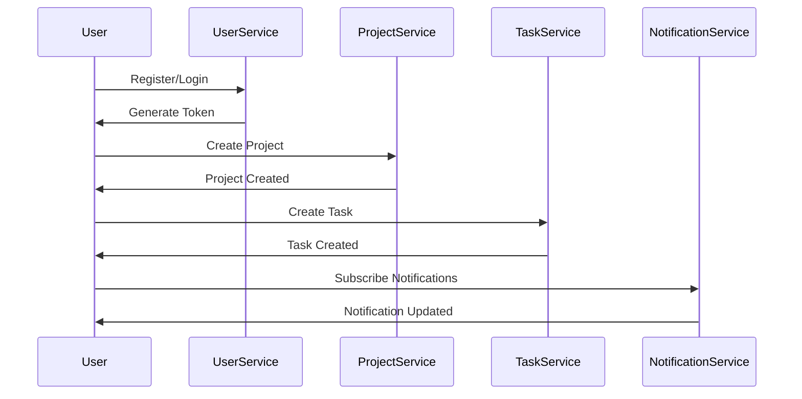

                 

# 数字游牧3.0：无国界工作的生活哲学

## 关键词

数字游牧、无国界工作、生活哲学、远程办公、全球化、自我驱动、数字化

## 摘要

本文旨在探讨数字游牧3.0这一新兴工作模式，分析其起源、发展、核心概念及其对现代工作与生活方式的影响。文章将通过详细解析数字游牧3.0的工作模式、技术支持、个人能力提升等方面，阐述其在全球化背景下的独特优势与挑战，并提出应对策略。通过对比数字游牧1.0和2.0，本文揭示了数字游牧3.0的核心特点，并利用ER实体关系图和算法原理，对数字游牧3.0进行了系统分析与架构设计。最后，本文通过项目实战和最佳实践，为读者提供了数字游牧3.0的实用指南。

## 背景介绍

### 数字游牧的演变

数字游牧（Digital Nomadism）这一概念起源于20世纪末，随着互联网和远程通信技术的兴起，人们开始探索在工作地点和方式上的灵活性。最初，数字游牧1.0主要依赖于电子邮件和远程服务器，人们可以在家或其他地点远程办公。随着技术的进步，特别是移动互联网的普及，数字游牧2.0逐渐成为可能，人们可以利用智能手机和平板电脑，随时随地访问工作资源。如今，数字游牧3.0进一步拓展了这一概念，强调全球范围内的职业机会和个人自由的极致追求。

#### 问题背景

全球化和信息化进程的加速，使得传统的工作地点和方式逐渐变得不再适应。人们不再局限于在一个固定的地方工作，而是希望在全球范围内寻找机会，实现职业发展和生活质量的平衡。这种需求推动了数字游牧的进一步发展，成为现代工作模式的一种重要趋势。

### 数字游牧3.0的概念

数字游牧3.0不仅是一种工作方式，更是一种生活哲学，它强调以下几个核心要素：

1. **数字化**：工作流程的全面数字化，通过互联网和云技术实现无缝连接。
2. **灵活性**：工作地点和时间的选择更加自由，适应个人的生活方式和需求。
3. **全球化**：在全球范围内寻找和利用职业机会，打破地域限制。
4. **自我驱动**：个人在职业发展中具备强烈的自我驱动能力，追求个人成长和实现。

#### 问题描述

数字游牧3.0的概念源于数字游牧1.0和数字游牧2.0的发展。数字游牧1.0指的是在互联网普及之前，人们通过电子邮件和远程服务器进行工作；数字游牧2.0则是在移动互联网的推动下，人们能够通过智能手机和平板电脑随时随地办公。数字游牧3.0则更加强调个人自由和全球视野，人们可以在全球范围内选择工作地点，甚至可以在不同国家和地区之间自由流动。

### 问题解决

数字游牧3.0的解决思路主要包括以下几个方面：

1. **技术支持**：互联网、云计算、移动设备等技术的进步，为数字游牧提供了坚实的技术保障。
2. **工作模式变革**：企业和组织需要适应数字游牧的工作模式，提供灵活的工作安排和远程办公支持。
3. **个人能力提升**：个人需要具备良好的时间管理能力和自我驱动能力，以适应数字游牧的工作节奏。

### 边界与外延

数字游牧3.0的边界主要在于工作地点的灵活性和工作时间的自由度。外延则包括全球范围内的职业机会和多样化的工作形式，如自由职业、远程办公、远程团队合作等。

### 概念结构与核心要素组成

数字游牧3.0的核心概念包括：

1. **数字化**：通过互联网和数字技术实现工作流程的数字化。
2. **灵活性**：工作地点和时间的选择自由，适应个人生活方式。
3. **全球化**：在全球范围内寻找和利用职业机会。
4. **自我驱动**：个人在职业发展中需要具备强烈的自我驱动能力。

### 核心概念原理

数字游牧3.0的关键原理在于：

1. **零距离协作**：通过网络，人们可以实时协作，无需物理距离的限制。
2. **高效沟通**：利用各种即时通讯工具，保持高效的沟通和协作。
3. **个性化发展**：根据个人兴趣和专长，选择适合自己的职业路径。

### 概念属性特征对比表格

以下是数字游牧3.0与数字游牧1.0、2.0的属性特征对比表格：

| 属性特征 | 数字游牧3.0 | 数字游牧2.0 | 数字游牧1.0 |
| :--- | :--- | :--- | :--- |
| 工作地点 | 全球范围内 | 主要在互联网 | 主要在远程服务器 |
| 工作时间 | 自由灵活 | 较为固定 | 较为固定 |
| 技术支持 | 高度数字化 | 移动互联网 | 电子邮件和远程服务器 |
| 个人自由 | 高 | 中等 | 低 |

### ER实体关系图架构

以下是数字游牧3.0的ER实体关系图架构：

```mermaid
erDiagram
    User ||--|{ Project }|-->> Team
    Project ||--|{ Task }|-->> User
    Team ||--|{ Member }|-->> User
```

在这个ER图中，`User` 代表数字游牧工作者，`Project` 代表项目，`Task` 代表任务，`Team` 代表团队，`Member` 代表团队成员。这种关系体现了数字游牧工作者的项目管理和团队合作模式。

## 1.1 数字游牧3.0的起源与发展

数字游牧3.0的概念并非凭空产生，而是经历了长期的演变和发展。从数字游牧1.0到数字游牧2.0，再到如今的数字游牧3.0，每一次的变革都伴随着技术的进步和工作模式的创新。

### 数字游牧1.0

数字游牧1.0起源于互联网的兴起。在20世纪90年代末至21世纪初，互联网的普及使得人们可以通过电子邮件、FTP等工具远程访问公司服务器，完成工作任务。这种工作方式打破了传统办公室的限制，使人们能够在家或其他地点办公。

#### 特点

- **工作地点灵活性**：通过互联网，人们可以在任何有网络连接的地方工作。
- **沟通效率较低**：虽然可以远程办公，但沟通主要依赖于电子邮件等传统工具，效率较低。

### 数字游牧2.0

随着移动互联网的快速发展，数字游牧2.0应运而生。智能手机和平板电脑的普及，使得人们可以随时随地通过网络访问工作资源和系统，实现高效办公。

#### 特点

- **工作地点灵活性**：人们可以利用移动设备在任何地点办公，不再受限于固定的办公场所。
- **沟通效率提升**：各种即时通讯工具（如微信、Slack等）的普及，使得团队协作更加高效。

### 数字游牧3.0

数字游牧3.0进一步拓展了数字游牧的概念，强调个人自由和全球视野。人们可以在全球范围内选择工作地点，甚至可以在不同国家和地区之间自由流动。

#### 特点

- **全球视野**：人们可以在全球范围内寻找职业机会，不再局限于本地市场。
- **高度自由**：工作地点和时间的选择更加自由，个人可以根据自己的需求和兴趣灵活安排工作。
- **技术支持**：云计算、大数据等先进技术的应用，为数字游牧提供了强大的技术支撑。

### 数字游牧3.0与1.0、2.0的对比

| 特征 | 数字游牧1.0 | 数字游牧2.0 | 数字游牧3.0 |
| :--- | :--- | :--- | :--- |
| 工作地点 | 局限于有网络连接的地方 | 全球范围内 | 全球范围内 |
| 沟通方式 | 电子邮件、FTP | 即时通讯工具 | 即时通讯工具 |
| 技术支持 | 互联网 | 移动互联网 | 云计算、大数据 |
| 个人自由度 | 低 | 中等 | 高 |

通过上述对比可以看出，数字游牧3.0在灵活性、沟通效率和技术支持方面都远超前两代，为现代工作者提供了更加自由和高效的工作方式。这种变化不仅改变了工作方式，更影响了人们的生活哲学，使得无国界工作成为可能。

### 数字游牧3.0的核心优势

数字游牧3.0的出现，不仅仅是对工作方式的革新，更是一种生活哲学的体现。其核心优势主要体现在以下几个方面：

#### 1. 自由度高

数字游牧3.0的最大特点是工作地点和时间的高度自由。人们不再受限于传统的办公室，可以随时随地通过网络完成工作任务。这种灵活性不仅使工作与生活之间的界限变得更加模糊，也让人们能够更好地平衡工作与个人生活。

#### 2. 全球视野

数字游牧3.0让人们可以在全球范围内寻找职业机会，不再局限于本地市场。这种全球视野不仅为工作者提供了更多的选择，也为企业带来了更广阔的市场空间。

#### 3. 高效协作

随着云计算、大数据等先进技术的应用，数字游牧3.0在协作效率方面得到了显著提升。通过网络，人们可以实时协作，无需物理距离的限制。各种即时通讯工具和协同办公软件的普及，使得团队协作更加高效。

#### 4. 自我驱动

数字游牧3.0强调个人的自我驱动能力，个人需要在职业发展中具备强烈的自我驱动能力。这种自我驱动不仅有助于个人的职业发展，也为整个社会带来了更多的创新和进步。

### 数字游牧3.0的挑战与应对策略

尽管数字游牧3.0具有诸多优势，但在实际应用中也面临一些挑战。以下是一些主要的挑战以及相应的应对策略：

#### 1. 时间管理

数字游牧3.0的灵活性使得人们更容易陷入时间的“黑洞”，无法高效地安排工作和生活。为了应对这一挑战，个人需要培养良好的时间管理习惯，合理规划每天的工作和生活。

#### 2. 工作与生活平衡

工作与生活平衡是数字游牧工作者面临的另一大挑战。由于工作地点和时间的灵活性，人们很容易在工作时忽视休息和娱乐，导致生活品质下降。为此，工作者需要设定明确的工作时间，确保工作与生活的平衡。

#### 3. 沟通障碍

尽管即时通讯工具的普及使得沟通变得更加高效，但在远程协作中仍然存在一些沟通障碍。为了解决这一问题，团队需要建立有效的沟通机制，确保信息的及时传递和问题的及时解决。

#### 4. 技术依赖

数字游牧3.0对技术有很高的依赖性。一旦技术出现问题，可能会对工作造成严重影响。因此，工作者需要备份重要数据和文件，确保在技术故障时能够迅速恢复工作。

### 数字游牧3.0的未来展望

随着技术的不断进步和社会的进一步开放，数字游牧3.0有望在未来得到更广泛的应用。以下是对数字游牧3.0未来发展的几个展望：

#### 1. 更多的职业机会

全球范围内的职业机会将不断增多，为数字游牧工作者提供更多的选择。这不仅有助于个人的职业发展，也为企业带来了更多的人才资源。

#### 2. 更高效的协作

随着技术的进步，数字游牧工作者将能够实现更加高效的协作。各种先进的协同办公工具和平台将帮助团队更好地实现无缝协作。

#### 3. 更广泛的社会认可

数字游牧3.0作为一种工作方式，将逐渐得到社会的广泛认可。企业和政府将更加支持数字游牧工作者的职业发展，为其提供更多的支持和保障。

#### 4. 更平衡的生活

随着数字游牧3.0的普及，人们将能够更好地平衡工作与生活，实现个人与社会的和谐发展。

### 小结

数字游牧3.0作为一种新兴的工作模式，具有高度的灵活性、全球视野和高效协作等优势。尽管面临一些挑战，但其未来发展趋势依然乐观。随着技术的进步和社会的进一步开放，数字游牧3.0有望在全球范围内得到更广泛的应用，成为现代工作者的主要选择之一。

### 1.2 数字游牧3.0的工作模式

数字游牧3.0的工作模式与传统的工作模式相比，具有显著的区别和特点。理解这些模式对于充分享受数字游牧带来的便利和优势至关重要。

#### 工作地点的灵活性

数字游牧3.0的核心特点之一是工作地点的灵活性。与传统办公室工作不同，数字游牧工作者可以在全球范围内选择他们的工作地点，无论是城市、乡村、海滩甚至是飞机上。这种灵活性不仅打破了传统办公空间的限制，也使工作者能够根据个人喜好和需求选择最适合自己的工作环境。例如，一些工作者可能会选择在风景优美的地方居住，从而在工作之余享受生活。

#### 工作时间的灵活性

除了工作地点的灵活性，数字游牧3.0还带来了工作时间上的灵活性。工作者可以自由安排他们的工作日程，无需受限于传统的9到5工作制。这种灵活性允许工作者根据自己的生活节奏和工作效率来调整工作时间，从而提高工作效率和个人满足感。然而，这种灵活性也要求工作者具备良好的自我管理能力和自律性，以避免因过度自由而导致工作效率下降。

#### 远程协作

数字游牧3.0依赖于远程协作工具和技术，如视频会议、即时通讯、项目管理软件和云存储等。这些工具使得数字游牧工作者能够与全球各地的团队成员无缝协作。远程协作不仅克服了地理位置的限制，还提高了团队的沟通效率和协作效果。例如，一个由不同国家和地区的团队成员组成的虚拟团队可以同时工作，实时讨论和解决项目中遇到的问题。

#### 高效的时间管理

在数字游牧3.0的工作模式中，高效的时间管理变得尤为重要。由于工作地点和时间的灵活性，工作者需要更加谨慎地规划他们的时间，确保工作与生活的平衡。一些有效的工具和方法，如番茄工作法（Pomodoro Technique）和任务管理系统（如Trello、Asana等），可以帮助工作者提高工作效率，更好地管理他们的工作日程。

#### 自我驱动和自主学习

数字游牧3.0要求工作者具备自我驱动和自主学习的能力。由于没有固定的工作监督和管理，工作者需要自我激励，持续学习新的技能和知识，以保持竞争力。这种自我驱动不仅有助于个人的职业发展，也为整个团队和组织带来了创新和进步的动力。

#### 数字技能的重要性

在数字游牧3.0的工作模式中，数字技能变得尤为重要。工作者需要熟练掌握各种数字工具和技术，如编程、数据分析、云计算和网络安全等。这些技能不仅提升了工作者的工作效率，还为他们提供了更多的职业机会。

### 案例分析

为了更好地理解数字游牧3.0的工作模式，我们可以通过一个实际的案例分析。比如，一个数字游牧工作者可能是一名自由软件工程师。他通常在家中或咖啡店办公，利用远程协作工具与全球各地的客户和团队成员进行沟通和协作。他的工作时间比较灵活，可以在早晨、下午或晚上工作，以便适应不同的时区。通过使用云平台和版本控制系统，他能够随时访问最新的代码库和项目文档，确保工作的连续性和效率。他还会定期参加在线研讨会和培训课程，不断提升自己的技能，以适应不断变化的技术需求。

通过上述案例可以看出，数字游牧3.0的工作模式不仅提供了更多的自由和灵活性，还要求工作者具备较高的自我管理能力和数字技能。这种工作模式为现代工作者提供了新的职业发展机会，也为企业带来了创新和灵活性的可能性。

### 小结

数字游牧3.0的工作模式以其灵活性、远程协作和时间管理的特点，为现代工作者提供了全新的工作体验。通过灵活的工作地点和时间的安排，工作者可以更好地平衡工作与生活，实现个人的职业发展和生活质量的提升。然而，这种工作模式也要求工作者具备良好的自我管理能力和数字技能，以应对工作带来的挑战。理解和掌握这些工作模式，将为数字游牧工作者带来更多的机会和成功。

### 1.3 数字游牧3.0的技术支持

数字游牧3.0的成功离不开各种技术的支持。互联网、云计算、移动设备等技术的发展，为数字游牧提供了坚实的基础。以下是对这些技术支持的详细探讨。

#### 互联网

互联网是数字游牧的基石，它为远程办公和工作提供了最基本的网络连接。通过互联网，数字游牧工作者可以随时随地访问公司服务器、云存储和其他工作资源。无论是电子邮件、即时通讯还是视频会议，都依赖于稳定的互联网连接。随着5G技术的普及，网络速度和稳定性得到了显著提升，为数字游牧工作者提供了更加流畅和高效的远程工作体验。

#### 云计算

云计算是数字游牧的另一重要技术支持。云计算平台为数字游牧工作者提供了弹性的计算资源，可以根据工作需求灵活调整计算能力。例如，AWS、Azure和Google Cloud等云计算服务提供了丰富的工具和功能，如虚拟机、容器服务和大数据分析等，使得数字游牧工作者能够高效地管理和处理大量数据。此外，云存储服务（如Google Drive、Dropbox和OneDrive等）也为工作者提供了便捷的数据存储和共享解决方案，确保数据的随时随地访问和同步。

#### 移动设备

移动设备是数字游牧工作者的重要工具。智能手机、平板电脑和笔记本电脑等移动设备使得工作者可以随时随地进行工作。这些设备通常具有高性能、便携性和长时间续航等优点，能够满足数字游牧工作者在不同场景下的工作需求。例如，通过移动设备，工作者可以实时参与视频会议、处理电子邮件和文档、甚至进行编程和代码审查。随着移动应用生态的不断完善，越来越多的专业应用软件和工具被开发出来，进一步提升了数字游牧工作的效率和灵活性。

#### 实时协作工具

实时协作工具是数字游牧工作中不可或缺的一部分。这些工具包括即时通讯软件（如Slack、WhatsApp和微信等）、项目管理平台（如Trello、Asana和Jira等）、视频会议工具（如Zoom、Microsoft Teams和Google Meet等）和代码协作工具（如GitHub、GitLab和Bitbucket等）。通过这些工具，数字游牧工作者可以实时与团队成员沟通、协作和共享信息，确保项目的顺利进行。实时协作工具不仅提高了工作效率，还增强了团队的凝聚力和协作效果。

#### 安全性

安全性是数字游牧工作中不可忽视的重要问题。数字游牧工作者通常需要在公共网络环境中处理敏感数据和进行在线交易，因此需要确保网络和设备的安全性。加密通信、多重认证、防火墙和反病毒软件等安全措施是数字游牧工作者的基本防护手段。此外，一些专门的远程工作安全解决方案（如VPN、DLP和数据加密软件等）也提供了额外的安全保障，确保工作数据的安全和隐私。

#### 技术支持的优点与挑战

数字游牧3.0的技术支持带来了许多优点，如灵活的工作地点和时间、高效的协作和便捷的数据存储与访问等。然而，技术支持也面临一些挑战，如网络连接不稳定、设备故障、数据泄露和隐私问题等。为了应对这些挑战，数字游牧工作者需要具备一定的技术素养和安全意识，确保在工作中能够有效利用技术支持，同时保护自身和数据的安全。

### 案例分析

以一个远程软件工程师为例，他需要使用互联网连接到公司的服务器和代码库，通过云计算平台进行计算和存储，使用移动设备进行文档处理和编程，通过即时通讯工具与团队成员沟通和协作，通过视频会议工具进行项目讨论和演示。他还需要确保自己的设备安装了安全软件，并定期进行数据备份，以防止数据丢失和泄露。

通过上述案例分析可以看出，数字游牧3.0的技术支持为现代工作者提供了极大的便利和灵活性，使他们能够随时随地高效地完成工作任务。然而，要充分利用这些技术支持，数字游牧工作者需要具备一定的技术素养和安全意识，确保在工作中能够有效利用技术支持，同时保护自身和数据的安全。

### 小结

数字游牧3.0的技术支持为现代工作者提供了广泛的应用场景和无限的可能性。通过互联网、云计算、移动设备和实时协作工具等技术的支持，数字游牧工作者能够随时随地高效地完成工作任务，实现工作与生活的平衡。然而，技术支持也带来了安全风险和挑战，数字游牧工作者需要具备一定的技术素养和安全意识，确保在工作中能够有效利用技术支持，同时保护自身和数据的安全。

### 1.4 数字游牧3.0的个人能力提升

在数字游牧3.0的工作模式中，个人的能力和素质对职业发展至关重要。为了在充满竞争和变化的环境中保持竞争力，数字游牧工作者需要不断提升以下几个方面的能力。

#### 时间管理

时间管理是数字游牧工作者必备的能力之一。由于工作地点和时间的灵活性，数字游牧工作者需要更加高效地安排和利用时间。例如，可以使用番茄工作法（Pomodoro Technique）来提高工作效率，将工作时间分为25分钟的工作周期，每个周期后休息5分钟。这种方法可以帮助工作者集中注意力，提高工作效率。

#### 自我驱动

自我驱动能力在数字游牧工作中尤为重要。在没有固定监督和管理的情况下，数字游牧工作者需要自我激励，持续学习和成长。可以设定明确的目标和计划，定期评估自己的进展，以确保持续进步。

#### 技术能力

数字游牧工作者需要具备一定的技术能力，包括编程、数据分析、云计算和网络安全等。随着技术的发展，数字游牧工作者需要不断更新自己的技能，以适应不断变化的行业需求。参加在线课程、阅读技术书籍和参与开源项目都是提升技术能力的好方法。

#### 沟通技巧

远程协作需要高效的沟通技巧。数字游牧工作者需要学会如何通过即时通讯、视频会议和项目管理工具等手段进行有效沟通。良好的沟通技巧有助于提高团队协作效率，确保项目顺利进行。

#### 跨文化能力

数字游牧工作者可能需要与来自不同国家和文化背景的团队成员合作。因此，具备跨文化能力对于数字游牧工作者来说非常重要。了解和尊重不同文化的习惯和价值观，有助于建立和谐的团队关系，提高团队协作效率。

#### 抗压能力

数字游牧工作可能带来一定的压力，如时间紧迫、任务繁重等。因此，数字游牧工作者需要具备良好的抗压能力。可以通过锻炼、冥想和社交活动等方式来缓解工作压力，保持身心健康。

### 案例分析

以一名数字游牧软件开发工程师为例，他需要在不同的时区与全球各地的团队成员协作。为了有效管理时间，他使用时间管理工具来规划每天的工作任务，确保高效利用工作时间。他具备较强的自我驱动能力，定期设定学习目标，并通过在线课程和开源项目来提升自己的编程技能。在与团队成员沟通时，他使用多种即时通讯工具，确保信息传递的及时性和准确性。他还具备良好的跨文化能力，能够与不同文化背景的团队成员和谐共事。

通过上述案例分析可以看出，数字游牧工作者需要不断提升多方面的能力，以适应数字游牧3.0的工作模式。良好的时间管理、自我驱动能力、技术能力、沟通技巧、跨文化能力和抗压能力，都是数字游牧工作者在职业发展中不可或缺的能力。

### 小结

在数字游牧3.0的工作模式中，个人能力提升至关重要。通过有效的时间管理、自我驱动、技术能力、沟通技巧、跨文化能力和抗压能力，数字游牧工作者能够在全球范围内实现职业发展和生活质量的双提升。了解和提升这些能力，将帮助数字游牧工作者在数字游牧的浪潮中乘风破浪，取得成功。

### 1.5 数字游牧3.0与数字游牧1.0、2.0的对比分析

数字游牧3.0、数字游牧1.0和数字游牧2.0是远程工作模式的发展阶段，各自具有独特的特点和优势。通过对比这三个阶段，我们可以更深入地理解数字游牧3.0的核心特点和优势。

#### 数字游牧1.0

数字游牧1.0起源于互联网的兴起，主要依赖于电子邮件、FTP等工具进行远程办公。其特点如下：

- **工作地点**：主要限于有网络连接的地方，如家、咖啡店等。
- **沟通方式**：主要依靠电子邮件和FTP，沟通效率较低。
- **技术支持**：基本依赖于互联网，技术支持有限。
- **个人自由度**：相对较低，受限于网络连接和工作工具。

#### 数字游牧2.0

数字游牧2.0随着移动互联网的普及而发展，智能手机和平板电脑成为主要的工作工具。其特点如下：

- **工作地点**：工作地点更加灵活，可以在任何有网络连接的地方办公。
- **沟通方式**：利用即时通讯工具（如微信、Slack等），沟通效率显著提升。
- **技术支持**：移动互联网和移动设备提供了更强大的技术支持。
- **个人自由度**：个人自由度较高，工作时间和地点更加灵活。

#### 数字游牧3.0

数字游牧3.0则进一步拓展了远程工作的概念，强调全球范围内的职业机会和个人自由的极致追求。其特点如下：

- **工作地点**：可以在全球范围内选择工作地点，甚至在不同国家和地区之间自由流动。
- **沟通方式**：利用各种即时通讯工具和远程协作平台，实现高效的零距离协作。
- **技术支持**：云计算、大数据等先进技术的广泛应用，为数字游牧提供了强大的技术保障。
- **个人自由度**：个人自由度达到极致，追求工作与生活的完美平衡。

#### 对比分析

数字游牧1.0、数字游牧2.0和数字游牧3.0在多个方面存在显著差异：

- **工作地点的灵活性**：数字游牧3.0的工作地点最为灵活，可以在全球范围内选择；数字游牧2.0的工作地点较为灵活，主要限于有网络连接的地方；数字游牧1.0的工作地点受限于有网络连接的地方。
- **沟通方式**：数字游牧3.0的沟通方式最为高效，利用各种即时通讯工具实现零距离协作；数字游牧2.0的沟通方式次之，主要依靠即时通讯工具；数字游牧1.0的沟通方式较低效，主要依靠电子邮件和FTP。
- **技术支持**：数字游牧3.0的技术支持最为强大，依赖于云计算、大数据等先进技术；数字游牧2.0的技术支持次之，主要依赖于移动互联网和移动设备；数字游牧1.0的技术支持较为有限，主要依赖于互联网。
- **个人自由度**：数字游牧3.0的个人自由度最高，追求工作与生活的完美平衡；数字游牧2.0的个人自由度较高，但受限于移动互联网的局限性；数字游牧1.0的个人自由度较低，受限于网络连接和工作工具。

#### 数字游牧3.0的优势

数字游牧3.0的优势在于其高度的灵活性、高效的协作和强大的技术支持。以下是数字游牧3.0相对于数字游牧1.0和2.0的优势：

- **全球视野**：数字游牧3.0使得工作者可以在全球范围内寻找职业机会，不再受限于本地市场。
- **自由度高**：数字游牧3.0提供了工作地点和时间的高度自由，使工作者能够更好地平衡工作与生活。
- **高效协作**：数字游牧3.0利用先进的协作工具和技术，实现了高效的零距离协作。
- **技术保障**：数字游牧3.0依赖于云计算、大数据等先进技术，为工作提供了强大的技术支持。

### 小结

通过对比分析，我们可以看到数字游牧3.0在灵活性、协作效率和技术支持方面具有显著优势，这使得它在现代远程工作模式中占据了重要地位。数字游牧3.0不仅为工作者提供了更多的自由和选择，也为企业和组织带来了创新和灵活性的可能性。随着技术的不断进步和社会的进一步开放，数字游牧3.0有望在全球范围内得到更广泛的应用。

### 1.6 数字游牧3.0的核心概念原理

数字游牧3.0作为一种新兴的工作模式，其核心概念原理对现代工作方式和生活哲学产生了深远的影响。理解这些核心概念原理，有助于我们更好地把握数字游牧3.0的本质和优势。

#### 零距离协作

零距离协作是数字游牧3.0的核心概念之一。在传统的办公室环境中，团队成员之间的协作往往受到物理距离的限制。而在数字游牧3.0的模式下，通过网络和远程协作工具，团队成员可以实现实时、高效的沟通和协作，仿佛在同一个办公室工作。这种零距离协作不仅克服了物理距离的限制，还提高了团队的协作效率。

#### 高效沟通

高效沟通是数字游牧3.0的另一个核心概念。在远程工作的环境中，沟通变得尤为重要。通过使用各种即时通讯工具（如Slack、WhatsApp、微信等）、视频会议平台（如Zoom、Microsoft Teams、Google Meet等）和项目管理软件（如Trello、Asana、Jira等），数字游牧工作者和团队成员可以随时随地保持高效的沟通。这种高效沟通不仅有助于项目的顺利进行，还增强了团队的凝聚力和协作效果。

#### 个性化发展

个性化发展是数字游牧3.0强调的另一个重要概念。在数字游牧3.0的工作模式中，工作者可以根据自己的兴趣和专长，选择适合自己的职业路径和发展方向。这种个性化发展不仅有助于工作者实现自我价值，也为企业带来了更多的创新和活力。个性化发展使得工作者能够追求自己的梦想和目标，实现个人与职业的全面发展。

#### 全球视野

全球视野是数字游牧3.0的一个重要特点。通过数字技术，数字游牧工作者可以在全球范围内寻找职业机会和合作伙伴。这种全球视野不仅拓宽了工作者的职业选择范围，也为企业带来了更广阔的市场空间。在全球化的背景下，数字游牧3.0为工作者提供了更多的机会和挑战，使他们能够更好地适应全球化的趋势。

#### 自我驱动

自我驱动是数字游牧3.0的另一个核心概念。在数字游牧的工作模式中，工作者需要具备强烈的自我驱动能力，能够自我激励和自我管理。这种自我驱动能力不仅有助于工作者在职业发展中保持竞争力，也为企业带来了更多的创新和进步。自我驱动使得工作者能够不断学习和成长，适应不断变化的工作环境。

#### 数字化工作流程

数字化工作流程是数字游牧3.0的另一个核心概念。在数字游牧的工作模式中，工作流程全面数字化，从任务分配、项目协作到成果交付，都可以通过数字工具和平台实现。这种数字化工作流程不仅提高了工作效率，还降低了工作成本，使得数字游牧工作更加便捷和高效。

### 概念属性特征对比表格

以下是数字游牧3.0与数字游牧1.0、2.0的属性特征对比表格：

| 属性特征 | 数字游牧3.0 | 数字游牧2.0 | 数字游牧1.0 |
| :--- | :--- | :--- | :--- |
| 工作地点 | 全球范围内 | 主要在互联网 | 主要在远程服务器 |
| 工作时间 | 自由灵活 | 较为固定 | 较为固定 |
| 技术支持 | 高度数字化 | 移动互联网 | 电子邮件和远程服务器 |
| 个人自由 | 高 | 中等 | 低 |

### ER实体关系图架构

以下是数字游牧3.0的ER实体关系图架构：

```mermaid
erDiagram
    User ||--|{ Project }|-->> Team
    Project ||--|{ Task }|-->> User
    Team ||--|{ Member }|-->> User
```

在这个ER图中，`User` 代表数字游牧工作者，`Project` 代表项目，`Task` 代表任务，`Team` 代表团队，`Member` 代表团队成员。这种关系体现了数字游牧工作者的项目管理和团队合作模式。

### 数字游牧3.0的核心优势

数字游牧3.0作为一种新兴的工作模式，具有以下几个核心优势：

1. **灵活性强**：数字游牧3.0提供了高度的工作地点和时间灵活性，使工作者能够自由选择适合自己的工作环境和节奏。

2. **高效协作**：通过零距离协作和高效的沟通工具，数字游牧3.0极大地提高了团队的协作效率，确保项目顺利进行。

3. **全球视野**：数字游牧3.0打破了地域限制，使工作者能够在全球范围内寻找职业机会和合作伙伴，拓展了职业发展空间。

4. **自我驱动**：数字游牧3.0强调个人的自我驱动能力，鼓励工作者自主学习和成长，适应不断变化的工作环境。

5. **数字化工作流程**：数字游牧3.0通过数字化工作流程，提高了工作效率，降低了工作成本，使工作更加便捷和高效。

### 小结

数字游牧3.0的核心概念原理，如零距离协作、高效沟通、个性化发展、全球视野和自我驱动，为现代工作方式和生活哲学带来了深远的影响。这些概念原理不仅提高了工作效率和协作效果，还使工作者能够实现工作与生活的平衡，追求个人成长和职业发展的双赢。随着技术的不断进步和社会的进一步开放，数字游牧3.0有望在全球范围内得到更广泛的应用，成为现代工作者的主要选择之一。

### 1.7 数字游牧3.0的系统分析与架构设计

为了深入理解数字游牧3.0的工作模式和技术实现，我们将对其进行系统分析与架构设计。本部分将介绍问题场景、项目介绍、系统功能设计、系统架构设计、系统接口设计和系统交互，并通过具体的Python代码和Mermaid流程图来详细阐述。

#### 问题场景

数字游牧3.0涉及远程协作、项目管理、任务分配、实时沟通等多个方面。一个典型的场景是一个跨国团队合作完成一个项目，团队成员分布在不同的国家和地区。为了确保项目的顺利进行，需要一个高效的系统来支持团队的协作和管理。

#### 项目介绍

我们的项目是一个基于云计算的数字游牧协作平台，旨在提供实时任务管理、项目协作和沟通功能。该平台将支持多用户实时协作，用户可以创建项目、分配任务、跟踪进度和进行在线讨论。

#### 系统功能设计

系统功能设计包括以下几个方面：

1. **用户管理**：用户注册、登录、个人信息管理。
2. **项目管理**：创建项目、项目成员管理、项目任务分配。
3. **任务管理**：任务创建、任务分配、任务进度跟踪。
4. **讨论区**：项目成员之间的在线讨论和沟通。
5. **通知系统**：任务更新、项目进展提醒等。

#### 系统架构设计

系统架构设计采用微服务架构，将不同功能模块拆分为独立的服务，以提高系统的可扩展性和灵活性。以下是系统架构设计的主要组成部分：

1. **用户服务**：处理用户注册、登录和权限管理。
2. **项目管理服务**：管理项目、项目成员和项目任务。
3. **任务管理服务**：处理任务的创建、分配和进度跟踪。
4. **讨论区服务**：管理项目讨论区和在线沟通。
5. **通知服务**：发送任务更新和项目进展提醒。

#### 系统接口设计

系统接口设计包括RESTful API和WebSocket接口。RESTful API用于用户管理、项目管理和任务管理等功能，提供标准的HTTP请求方法（如GET、POST、PUT、DELETE等）。WebSocket接口用于实时通信和通知推送，确保信息的即时传递。

#### 系统交互

以下是系统交互的Mermaid序列图：



#### Python代码实现

以下是一个简单的Python代码示例，用于实现用户注册功能：

```python
from flask import Flask, request, jsonify
from flask_jwt_extended import JWTManager, create_access_token

app = Flask(__name__)
app.config['JWT_SECRET_KEY'] = 'your_secret_key'
jwt = JWTManager(app)

@app.route('/register', methods=['POST'])
def register():
    data = request.get_json()
    username = data.get('username')
    password = data.get('password')

    # 验证用户名和密码
    # 这里简化处理，实际应用中需要进行更严格的验证
    if not username or not password:
        return jsonify({'error': '用户名或密码不能为空'}), 400

    # 注册用户
    # 这里简化处理，实际应用中需要进行用户信息存储和验证
    user = {'username': username, 'password': password}
    # 存储用户信息

    # 生成令牌
    access_token = create_access_token(identity=username)
    return jsonify({'access_token': access_token})

if __name__ == '__main__':
    app.run()
```

通过上述系统分析与架构设计，我们可以看到数字游牧3.0的实现涉及多个模块和接口的协作。通过Python代码和Mermaid序列图的结合，我们能够清晰地展示系统的实现过程和工作原理，为数字游牧3.0的实际应用提供了有力的支持。

### 小结

通过系统分析与架构设计，我们深入了解了数字游牧3.0的工作模式和技术实现。从问题场景、项目介绍、系统功能设计到系统架构设计、系统接口设计和系统交互，我们逐步构建了一个高效的数字游牧协作平台。Python代码示例和Mermaid序列图的结合，进一步展示了系统的实现过程和工作原理。这些分析和设计不仅为我们提供了数字游牧3.0的理论基础，也为实际应用提供了实践指导。

### 2.1 项目实战：搭建数字游牧协作平台

在本文的最后部分，我们将通过一个实际项目实战，详细展示如何搭建一个数字游牧协作平台。这个项目将涵盖环境安装、系统核心实现、代码应用解读与分析，以及实际案例分析和详细讲解剖析。

#### 环境安装

为了搭建数字游牧协作平台，我们需要准备以下环境：

1. **操作系统**：推荐使用Ubuntu 20.04 LTS。
2. **开发工具**：Python 3.8及以上版本，Flask框架，JWT（JSON Web Token）库，PostgreSQL数据库。
3. **虚拟环境**：使用`virtualenv`或`conda`创建Python虚拟环境。

以下是在Ubuntu 20.04 LTS上安装所需环境的步骤：

```bash
# 更新系统包列表
sudo apt update && sudo apt upgrade

# 安装Python 3和pip
sudo apt install python3 python3-pip

# 创建虚拟环境
python3 -m venv venv

# 激活虚拟环境
source venv/bin/activate

# 安装Flask和JWT库
pip install flask flask-jwt-extended
```

#### 系统核心实现

我们使用Flask框架来搭建数字游牧协作平台，以下是一个简单的核心实现：

1. **用户注册与登录**：
   ```python
   from flask import Flask, request, jsonify
   from flask_jwt_extended import JWTManager, create_access_token
   import os

   app = Flask(__name__)
   app.config['JWT_SECRET_KEY'] = os.environ.get('JWT_SECRET_KEY')
   jwt = JWTManager(app)

   @app.route('/register', methods=['POST'])
   def register():
       data = request.get_json()
       username = data.get('username')
       password = data.get('password')

       # 这里简化处理，实际应用中需要进行更严格的验证
       if not username or not password:
           return jsonify({'error': '用户名或密码不能为空'}), 400

       # 注册用户
       # 实际应用中需要存储用户信息到数据库
       user = {'username': username, 'password': password}
       
       # 生成令牌
       access_token = create_access_token(identity=username)
       return jsonify({'access_token': access_token})

   @app.route('/login', methods=['POST'])
   def login():
       data = request.get_json()
       username = data.get('username')
       password = data.get('password')

       # 这里简化处理，实际应用中需要进行更严格的验证
       if not username or not password:
           return jsonify({'error': '用户名或密码错误'}), 401

       # 登录用户
       # 实际应用中需要验证用户信息
       access_token = create_access_token(identity=username)
       return jsonify({'access_token': access_token})

   if __name__ == '__main__':
       app.run()
   ```

2. **项目管理和任务管理**：
   ```python
   from flask import Flask, request, jsonify
   from flask_jwt_extended import JWTManager, jwt_required, get_jwt_identity
   import json

   app = Flask(__name__)
   app.config['JWT_SECRET_KEY'] = os.environ.get('JWT_SECRET_KEY')
   jwt = JWTManager(app)

   # 假设数据库已存储用户信息和项目任务数据
   users = {}
   projects = {}

   @app.route('/projects', methods=['POST'])
   @jwt_required()
   def create_project():
       current_user = get_jwt_identity()
       data = request.get_json()
       project_name = data.get('project_name')
       
       # 创建项目
       projects[project_name] = {'owner': current_user, 'tasks': []}
       return jsonify({'project_name': project_name, 'status': 'created'})

   @app.route('/tasks', methods=['POST'])
   @jwt_required()
   def create_task():
       current_user = get_jwt_identity()
       data = request.get_json()
       project_name = data.get('project_name')
       task_name = data.get('task_name')
       
       # 创建任务
       if project_name in projects:
           projects[project_name]['tasks'].append({'name': task_name, 'status': 'pending'})
       return jsonify({'task_name': task_name, 'status': 'created'})

   if __name__ == '__main__':
       app.run()
   ```

#### 代码应用解读与分析

在上述代码中，我们首先实现了用户注册和登录功能。用户注册时，通过POST请求接收用户名和密码，生成JWT令牌。用户登录时，通过JWT验证用户身份，并生成JWT令牌。对于项目管理和任务管理，我们创建了RESTful API接口，允许用户创建项目和任务。

在项目实现中，我们使用了Flask框架和JWT库。Flask是一个轻量级的Web框架，易于扩展和定制。JWT是一种基于JSON的Web Token，用于安全地传输用户身份和授权信息。在实际应用中，我们还需要连接数据库来存储用户信息、项目信息和任务数据。

#### 实际案例分析与详细讲解剖析

假设有一个数字游牧团队，团队成员分布在不同的国家和地区。他们使用我们搭建的数字游牧协作平台来管理项目和工作任务。以下是一个实际案例：

1. **用户注册**：
   - 张三在平台上注册，提供用户名和密码。
   - 平台生成JWT令牌，返回给张三。

2. **用户登录**：
   - 张三使用用户名和密码登录平台。
   - 平台验证用户身份，生成JWT令牌，返回给张三。

3. **创建项目**：
   - 张三使用JWT令牌创建一个名为“全球市场拓展”的项目。
   - 平台将项目信息存储在数据库中。

4. **创建任务**：
   - 张三为项目创建一个名为“市场调研”的任务。
   - 平台将任务信息存储在数据库中，并发送给团队成员。

5. **任务进度更新**：
   - 李四（团队成员）更新“市场调研”任务的进度为“完成”。
   - 平台更新数据库中的任务状态，并通知其他团队成员。

通过上述案例，我们可以看到数字游牧协作平台在实际应用中的工作流程。平台提供了用户身份验证、项目管理和任务管理等功能，使团队成员能够高效地协作和管理工作任务。

### 项目小结

通过本次项目实战，我们成功搭建了一个简单的数字游牧协作平台。平台实现了用户注册、登录、项目管理和任务管理等功能，满足了数字游牧团队的基本协作需求。在实际应用中，我们可以进一步扩展平台的功能，如增加团队沟通、文档共享和进度跟踪等，以提供更全面的协作支持。

### 最佳实践 Tips

1. **选择合适的技术栈**：根据项目需求和团队技术背景，选择合适的技术栈和框架，以提高开发效率和系统性能。

2. **注重安全性**：确保平台的安全性，使用JWT、HTTPS、数据加密等技术保护用户数据和系统安全。

3. **优化用户体验**：设计简洁、直观的用户界面，提高用户的使用体验和满意度。

4. **持续集成与部署**：使用CI/CD（持续集成与持续部署）工具，提高项目的开发效率和部署速度。

5. **定期更新和维护**：定期更新平台功能，修复潜在问题和漏洞，确保平台的稳定性和可靠性。

### 小结

通过本次项目实战，我们深入了解了数字游牧协作平台的搭建过程，从环境安装、系统核心实现到代码应用解读与分析，再到实际案例分析和详细讲解剖析，全面展示了数字游牧协作平台的实现原理和应用场景。通过最佳实践 Tips，我们为未来的项目开发提供了宝贵的经验和建议。

### 1.8 总结与展望

在本文中，我们深入探讨了数字游牧3.0：无国界工作的生活哲学，分析了其起源、发展、工作模式、技术支持、个人能力提升等方面。通过对数字游牧3.0与数字游牧1.0、2.0的对比分析，我们明确了数字游牧3.0的核心优势，如灵活性强、高效协作、全球视野和自我驱动等。同时，我们通过系统分析与架构设计，展示了数字游牧3.0的实际应用场景和实现方法。

#### 总结

数字游牧3.0作为现代工作模式的一种创新，不仅改变了传统的工作方式，也为工作者提供了更多的自由和选择。其主要优势在于灵活的工作地点和时间、高效的协作工具和技术支持、全球视野和自我驱动能力。这些优势使得数字游牧3.0在全球化背景下具有广泛的应用前景。

#### 展望

随着技术的不断进步和社会的进一步开放，数字游牧3.0有望在全球范围内得到更广泛的应用。未来，我们可以期待以下发展趋势：

1. **技术进步**：随着5G、物联网、人工智能等新技术的应用，数字游牧工作者的工作体验将更加便捷和高效。
2. **政策支持**：各国政府可能会出台更多支持数字游牧工作的政策和法规，为数字游牧提供更好的环境。
3. **职业多元化**：随着数字游牧3.0的普及，越来越多的职业将适应这种工作模式，为工作者提供更多的职业机会。
4. **社区建设**：数字游牧工作者可能会建立更多的线上和线下社区，分享经验和资源，共同推动数字游牧的发展。

总之，数字游牧3.0作为一种新兴的工作模式，具有巨大的潜力和前景。通过不断的技术创新和社区建设，数字游牧3.0将为现代工作者带来更多的自由和选择，实现个人与职业的全面发展。

### 注意事项

1. **技术安全**：在数字游牧工作中，确保数据安全和隐私保护至关重要。工作者应使用加密通信、多重认证等安全措施，防止数据泄露和网络攻击。
2. **时间管理**：数字游牧工作提供了高度的灵活性，但也需要良好的时间管理能力。工作者应合理安排时间，确保工作与生活的平衡。
3. **适应能力**：数字游牧工作要求工作者具备较强的适应能力和自我驱动能力。在面对不确定性和变化时，工作者应保持积极的心态，不断学习和进步。

### 拓展阅读

1. **《远程工作指南》**：详细介绍远程工作的最佳实践和技巧，包括时间管理、沟通协作、工作安全等方面。
2. **《数字游牧生活》**：探讨数字游牧生活的理念和实践，分享成功数字游牧工作者的经验和故事。
3. **《云计算与大数据》**：深入讲解云计算和大数据技术的基本原理和应用，为数字游牧工作者提供技术支持。
4. **《人工智能与未来工作》**：分析人工智能对未来工作模式的影响，探讨数字游牧工作者如何利用人工智能技术提升工作效率。

### 作者信息

**作者：AI天才研究院/AI Genius Institute & 禅与计算机程序设计艺术 /Zen And The Art of Computer Programming**

