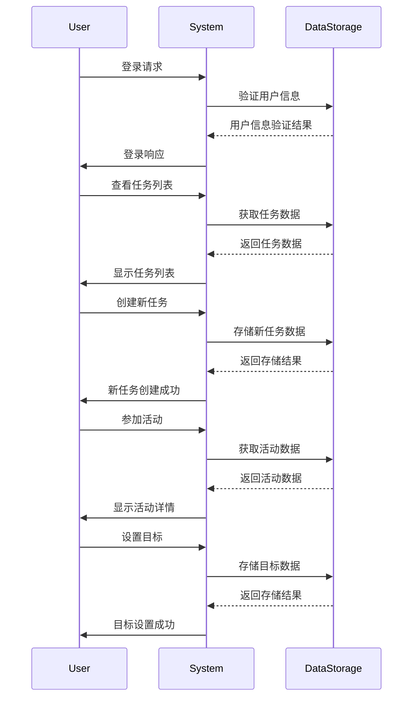
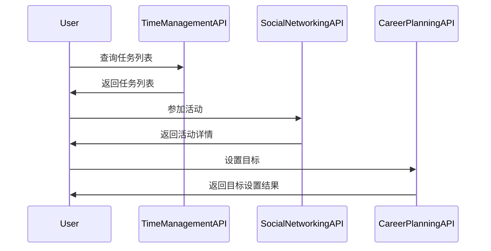

                 

# 数字游牧族的生活哲学：自由与意义的新定义

> 关键词：数字游牧族、自由、意义、生活哲学、远程工作、自由职业者

> 摘要：本文旨在探讨数字游牧族的生活哲学，特别是在这种灵活的生活方式中如何实现自由与意义的平衡。通过深入分析数字游牧族的特点、面临的挑战以及解决策略，本文为追求自由与意义平衡的读者提供了有价值的参考。

## 第一部分：引言

### 1.1 书籍背景与目标

随着信息技术的飞速发展，远程工作和数字化生活方式已成为一种趋势。数字游牧族，这一群体以自由职业者、远程工作者、自由撰稿人等为主，通过互联网在全球范围内进行工作和生活。这种生活方式赋予他们极高的自由度，但也带来了诸多挑战，如工作效率、社交孤立、职业规划等。本书旨在探讨数字游牧族的生活哲学，帮助读者理解如何在数字游牧的生活方式中找到自由与意义的平衡。

### 1.1.1 数字游牧族的生活方式

数字游牧族的生活方式以互联网为基础，他们不受地域和时间的限制，可以在全球范围内选择工作和生活的地方。这种生活方式的特点包括：

1. **工作地点灵活**：数字游牧族可以在咖啡馆、图书馆、家中甚至是国外进行工作。
2. **工作时间自主**：他们可以自行安排工作时间，实现工作和生活的时间平衡。
3. **需要较高的自律性**：由于缺乏传统的监督和管理，数字游牧族需要更强的自律性来保持工作效率。
4. **面临社交孤立**：长时间远程工作可能导致社交孤立，影响心理健康。

### 1.1.2 问题描述

数字游牧族的生活方式虽然带来了诸多优点，但同时也存在一些挑战：

1. **工作效率**：缺乏传统的办公环境和团队协作，可能导致工作效率下降。
2. **社交孤立**：长时间独自工作，容易感到孤独和社交孤立。
3. **职业规划**：职业发展的不确定性和职业瓶颈，可能影响数字游牧族的长期发展。
4. **自我管理**：缺乏有效的自我管理策略，可能导致时间管理混乱和目标无法实现。

### 1.1.3 问题解决

本书旨在解决数字游牧族面临的这些挑战，提供以下解决策略：

1. **时间管理**：通过设定明确的目标和时间表，提高工作效率。
2. **社交网络建设**：通过参加线上和线下活动，拓展社交圈子。
3. **职业规划**：通过不断学习和技能提升，规划明确的职业发展方向。
4. **自我管理**：通过自律和自我驱动力，保持工作和生活的平衡。

### 1.1.4 边界与外延

本书主要关注数字游牧族的日常生活和工作，探讨他们如何处理时间管理、人际关系、自我成长等问题。同时，本书也将涉及数字游牧族与科技、社会环境的关系。

## 1.2 核心概念

### 1.2.1 数字游牧族

数字游牧族是指利用互联网进行远程工作的人群，他们通常不受地域和时间的限制，可以在全球范围内选择工作和生活的地方。

### 1.2.2 自由

自由是指个体在行动、思想、情感等方面不受限制的状态。在数字游牧族的生活方式中，自由主要表现为工作地点灵活和时间自主。

### 1.2.3 意义

意义是指个体在生活和工作中所追求的目标和价值观。对于数字游牧族来说，意义不仅仅体现在工作成果上，更在于工作和生活能否带来内心的满足和成就感。

### 1.2.4 生活哲学

生活哲学是指导个体生活的方式和原则。对于数字游牧族来说，生活哲学是他们追求自由与意义平衡的理论基础。

## 1.3 生活哲学

### 1.3.1 自由的定义

自由不仅是行动上的自由，还包括思想、情感、价值观等方面的自由。在数字游牧族的生活方式中，自由是他们追求的核心目标之一。

### 1.3.2 意义的定义

意义是指个体在生活和工作中所追求的目标和价值观。对于数字游牧族来说，意义不仅仅是工作成果，更是工作对个人成长和内心满足的贡献。

### 1.3.3 自由与意义的平衡

数字游牧族需要在自由与意义之间找到平衡，以实现生活和工作的高效运转。这种平衡不仅是理论上的，更需要通过实践来验证。

## 1.4 本书结构

本书共分为五个部分：

1. 引言：介绍数字游牧族的生活背景和问题。
2. 数字游牧族的生活哲学：探讨自由与意义的平衡。
3. 数字游牧族的日常生活：介绍时间管理、人际关系、自我成长等方面。
4. 数字游牧族与科技：探讨科技对数字游牧族生活的影响。
5. 数字游牧族与社会：分析数字游牧族与社会的互动关系。

## 1.5 本章小结

本章主要介绍了数字游牧族的生活背景、核心概念以及本书的结构。接下来，本书将深入探讨数字游牧族的生活哲学，帮助读者更好地理解这一生活方式。

## 第二部分：数字游牧族的生活哲学

### 2.1 自由与意义的平衡

#### 2.1.1 自由的内涵

自由是指个体在行动、思想、情感等方面不受限制的状态。在数字游牧族的生活方式中，自由主要表现为工作地点灵活和时间自主。

#### 2.1.2 意义的内涵

意义是指个体在生活和工作中所追求的目标和价值观。对于数字游牧族来说，意义不仅仅是工作成果，更是工作对个人成长和内心满足的贡献。

#### 2.1.3 自由与意义的平衡

数字游牧族需要在自由与意义之间找到平衡，以实现生活和工作的高效运转。这种平衡不仅是理论上的，更需要通过实践来验证。

### 2.1.4 自由的限制

尽管数字游牧族享有较高的自由度，但他们也需要面对自我管理、工作效率等方面的挑战。例如，缺乏有效的自我管理可能导致时间管理混乱，影响工作效率。因此，数字游牧族需要在自由的同时，学会自律和自我驱动。

### 2.1.5 意义与目标的关系

意义是个体追求目标的过程中的价值体现。对于数字游牧族来说，设定明确的目标是实现意义的重要途径。通过设定目标，他们可以明确自己的方向，从而更好地实现自由与意义的平衡。

### 2.1.6 数字游牧族如何平衡自由与意义

数字游牧族可以通过以下方式实现自由与意义的平衡：

1. **设定明确的目标**：通过设定短期和长期目标，明确自己的方向和追求。
2. **时间管理**：通过有效的时间管理策略，提高工作效率，实现工作和生活的平衡。
3. **自我驱动**：通过自我激励和自我管理，保持持续的学习和进步。
4. **社交网络建设**：通过参加线上和线下活动，拓展社交圈子，增强社交孤立感。
5. **职业规划**：通过不断学习和技能提升，规划明确的职业发展方向。

## 2.2 数字游牧族的生活哲学原则

### 2.2.1 自律

自律是指个体能够自我约束、自我管理的能力。对于数字游牧族来说，自律是实现自由与意义平衡的关键。

#### 2.2.1.1 自律的定义

自律是指个体能够自我约束、自我管理的能力。在数字游牧族的生活方式中，自律是他们保持高效工作和生活的重要保障。

#### 2.2.1.2 数字游牧族如何培养自律

1. **设定明确的目标**：通过设定短期和长期目标，明确自己的方向和追求。
2. **制定合理的时间表**：通过制定合理的时间表，合理安排工作和生活，提高效率。
3. **保持良好的生活习惯**：通过保持良好的生活习惯，如规律作息、健康饮食等，提高身体健康和心理健康。
4. **自我监督和反思**：通过自我监督和反思，及时发现和纠正自己的不足，保持自律。

### 2.2.2 自我驱动

自我驱动是指个体能够自我激励、自我发展的能力。对于数字游牧族来说，自我驱动是实现自由与意义平衡的重要动力。

#### 2.2.2.1 自我驱动的定义

自我驱动是指个体能够自我激励、自我发展的能力。在数字游牧族的生活方式中，自我驱动是他们克服困难、保持进步的重要保障。

#### 2.2.2.2 数字游牧族如何培养自我驱动

1. **设定有挑战性的目标**：通过设定有挑战性的目标，激发自己的潜能，实现自我突破。
2. **持续学习和进步**：通过不断学习和进步，提高自己的知识和技能，实现自我价值的提升。
3. **积极面对挑战**：通过积极面对挑战，锻炼自己的意志力和适应能力。
4. **保持积极的心态**：通过保持积极的心态，克服负面情绪，保持自我驱动的动力。

## 2.3 数字游牧族的生活哲学实践

### 2.3.1 时间管理

时间管理是数字游牧族实现自由与意义平衡的关键。通过以下方法，数字游牧族可以更好地管理时间：

1. **设定优先级**：通过设定优先级，明确哪些任务是最重要的，从而提高工作效率。
2. **使用工具**：通过使用时间管理工具，如日历、任务管理软件等，合理安排时间。
3. **避免拖延**：通过避免拖延，保持工作效率，实现目标。
4. **合理安排休息**：通过合理安排休息，保持身心健康，提高工作效率。

### 2.3.2 社交网络建设

社交网络建设是数字游牧族解决社交孤立问题的关键。通过以下方法，数字游牧族可以拓展社交圈子：

1. **参加线上活动**：通过参加线上活动，与同行业人士交流，拓展社交圈子。
2. **参加线下活动**：通过参加线下活动，与身边的人建立联系，增强社交孤立感。
3. **利用社交媒体**：通过利用社交媒体，与朋友、同事和家人保持联系，增强社交网络。

### 2.3.3 职业规划

职业规划是数字游牧族实现职业发展的重要手段。通过以下方法，数字游牧族可以规划明确的职业发展方向：

1. **设定职业目标**：通过设定职业目标，明确自己的职业发展方向。
2. **不断学习和进步**：通过不断学习和进步，提高自己的知识和技能，实现职业发展。
3. **寻求职业机会**：通过寻求职业机会，拓展职业发展空间。
4. **保持职业发展意识**：通过保持职业发展意识，不断调整职业规划，适应职业环境的变化。

### 2.3.4 自我管理

自我管理是数字游牧族实现自由与意义平衡的基础。通过以下方法，数字游牧族可以更好地自我管理：

1. **设定明确的目标**：通过设定明确的目标，明确自己的方向和追求。
2. **制定合理的时间表**：通过制定合理的时间表，合理安排工作和生活，提高效率。
3. **保持良好的生活习惯**：通过保持良好的生活习惯，如规律作息、健康饮食等，提高身体健康和心理健康。
4. **自我监督和反思**：通过自我监督和反思，及时发现和纠正自己的不足，保持自律。

## 2.4 数字游牧族的生活哲学总结

数字游牧族的生活哲学是一种追求自由与意义平衡的生活方式。通过自律、自我驱动、时间管理、社交网络建设、职业规划等方式，数字游牧族可以在自由与意义之间找到平衡，实现生活和工作的高效运转。

## 第三部分：数字游牧族的日常生活

### 3.1 时间管理

时间管理是数字游牧族日常生活中至关重要的一环。通过以下方法，数字游牧族可以更好地管理时间：

1. **设定优先级**：通过设定优先级，明确哪些任务是最重要的，从而提高工作效率。
2. **使用工具**：通过使用时间管理工具，如日历、任务管理软件等，合理安排时间。
3. **避免拖延**：通过避免拖延，保持工作效率，实现目标。
4. **合理安排休息**：通过合理安排休息，保持身心健康，提高工作效率。

### 3.2 社交网络建设

社交网络建设是数字游牧族解决社交孤立问题的关键。通过以下方法，数字游牧族可以拓展社交圈子：

1. **参加线上活动**：通过参加线上活动，与同行业人士交流，拓展社交圈子。
2. **参加线下活动**：通过参加线下活动，与身边的人建立联系，增强社交孤立感。
3. **利用社交媒体**：通过利用社交媒体，与朋友、同事和家人保持联系，增强社交网络。

### 3.3 职业规划

职业规划是数字游牧族实现职业发展的重要手段。通过以下方法，数字游牧族可以规划明确的职业发展方向：

1. **设定职业目标**：通过设定职业目标，明确自己的职业发展方向。
2. **不断学习和进步**：通过不断学习和进步，提高自己的知识和技能，实现职业发展。
3. **寻求职业机会**：通过寻求职业机会，拓展职业发展空间。
4. **保持职业发展意识**：通过保持职业发展意识，不断调整职业规划，适应职业环境的变化。

### 3.4 自我管理

自我管理是数字游牧族实现自由与意义平衡的基础。通过以下方法，数字游牧族可以更好地自我管理：

1. **设定明确的目标**：通过设定明确的目标，明确自己的方向和追求。
2. **制定合理的时间表**：通过制定合理的时间表，合理安排工作和生活，提高效率。
3. **保持良好的生活习惯**：通过保持良好的生活习惯，如规律作息、健康饮食等，提高身体健康和心理健康。
4. **自我监督和反思**：通过自我监督和反思，及时发现和纠正自己的不足，保持自律。

## 第四部分：数字游牧族与科技

### 4.1 科技对数字游牧族生活的影响

科技的发展为数字游牧族提供了更多的便利和可能性。以下是一些科技对数字游牧族生活的影响：

1. **远程办公工具**：如Zoom、Slack等远程办公工具，使得数字游牧族可以轻松与团队成员协作。
2. **在线学习平台**：如Coursera、Udemy等在线学习平台，为数字游牧族提供了丰富的学习资源。
3. **云计算服务**：如AWS、Google Cloud等云计算服务，为数字游牧族提供了强大的计算能力和数据存储。
4. **智能助手**：如Siri、Alexa等智能助手，为数字游牧族提供了便捷的生活助手。

### 4.2 数字游牧族如何利用科技

数字游牧族可以通过以下方式利用科技，提高生活质量和工作效率：

1. **利用远程办公工具**：通过使用远程办公工具，实现团队协作和远程沟通。
2. **利用在线学习平台**：通过在线学习平台，不断提升自己的知识和技能。
3. **利用云计算服务**：通过云计算服务，实现高效的数据处理和存储。
4. **利用智能助手**：通过智能助手，提高日常生活的便捷性。

### 4.3 科技发展的挑战

尽管科技为数字游牧族提供了诸多便利，但也带来了一些挑战：

1. **信息过载**：随着信息的爆炸性增长，数字游牧族需要学会筛选和过滤信息，避免信息过载。
2. **隐私问题**：在数字游牧族的生活中，隐私问题变得更加重要。他们需要确保自己的个人信息和数据安全。
3. **科技依赖**：随着科技的普及，数字游牧族可能会对科技产生依赖，影响自我管理能力。

### 4.4 数字游牧族如何应对科技挑战

数字游牧族可以通过以下方式应对科技挑战：

1. **信息筛选**：通过学会筛选和过滤信息，避免信息过载。
2. **加强隐私保护**：通过加强个人信息和数据的安全措施，确保隐私安全。
3. **平衡科技使用**：通过平衡科技的使用，保持自我管理能力，避免科技依赖。

## 第五部分：数字游牧族与社会

### 5.1 数字游牧族与社会的关系

数字游牧族与社会的关系是相互影响的。一方面，数字游牧族的生活方式和社会环境相互影响；另一方面，数字游牧族对社会环境也产生影响。

### 5.2 数字游牧族对社会的影响

数字游牧族对社会的影响主要体现在以下几个方面：

1. **就业模式的变化**：数字游牧族的生活方式推动了远程工作和自由职业的发展，改变了传统的就业模式。
2. **生活方式的变革**：数字游牧族的生活方式为人们提供了更多样化的生活选择，影响了人们的价值观和生活态度。
3. **社会创新的推动**：数字游牧族通过不断尝试和实践，推动了社会创新的进程。

### 5.3 数字游牧族面临的挑战

数字游牧族在追求自由与意义的过程中，也面临一些挑战：

1. **社会认同**：由于数字游牧族的生活方式与传统的社会认同存在差异，他们可能面临社会认同的挑战。
2. **社会支持**：数字游牧族在追求自由与意义的过程中，可能需要更多的社会支持和资源。
3. **社会融合**：数字游牧族需要在传统社会和数字化社会之间找到平衡，实现社会融合。

### 5.4 数字游牧族如何应对挑战

数字游牧族可以通过以下方式应对挑战：

1. **社会认同**：通过积极参与社会活动，增强社会认同感。
2. **社会支持**：通过建立社群和支持网络，获取社会支持和资源。
3. **社会融合**：通过不断学习和适应，实现社会融合。

## 结束语

数字游牧族的生活方式带来了诸多优点，如自由度高、工作地点灵活等，但也存在一些挑战，如工作效率、社交孤立、职业规划等。通过深入探讨数字游牧族的生活哲学，我们可以找到自由与意义的平衡点，实现高效、有意义的生活。希望本书能为数字游牧族的读者提供有价值的参考。

### 参考文献

1. 林奇，《远程工作的艺术》，电子工业出版社，2020年。
2. 克里斯·安德森，《长尾理论》，机械工业出版社，2010年。
3. 马克·扎克伯格，《Facebook传：改变世界的新媒体革命》，中信出版社，2010年。

### 附录

附录中可以包含一些与文章主题相关的图表、数据、案例等补充内容，以丰富文章的内容和增强读者的理解。

### 作者信息

作者：AI天才研究院/AI Genius Institute & 禅与计算机程序设计艺术 /Zen And The Art of Computer Programming

---

### 背景介绍

#### 核心概念术语说明

- **数字游牧族**：指的是那些依靠互联网进行远程工作的人群，他们通常不受固定工作场所和时间限制，可以自由选择在全球范围内的任何地方工作。
- **自由**：在这里指的是个体在生活和工作中的自主权，包括选择工作内容、工作地点和工作时间等方面的自由。
- **意义**：指的是个体在工作和生活中所追求的目标和价值观，它们为个体提供方向和动力。
- **生活哲学**：是一种对生活、工作、价值观等问题的思考和总结，是指导个体行为和决策的哲学思想。

#### 问题背景

随着全球化的加速和互联网技术的普及，远程工作逐渐成为可能，并且变得越来越普遍。许多人选择成为自由职业者，他们在全球范围内寻找客户，完成项目，从而实现工作与生活的平衡。然而，这种生活方式也带来了一系列新的挑战，包括如何维持高效的工作状态、如何建立和维护人际关系、以及如何保持生活的意义和目标。

#### 问题描述

数字游牧族的生活方式虽然赋予了他们极大的自由，但也带来了一些问题。首先，由于缺乏面对面的交流和监督，一些数字游牧族可能会面临工作效率下降的挑战。其次，长时间的远程工作可能导致社交孤立，影响心理健康。此外，职业规划的不确定性也可能导致一些数字游牧族感到迷茫和焦虑。因此，如何在享受自由的同时，保持高效的工作状态和心理健康，实现生活的意义，成为数字游牧族面临的主要问题。

#### 问题解决

为了解决上述问题，数字游牧族需要找到一种平衡自由与意义的生活方式。这包括以下几个方面的策略：

1. **时间管理**：通过设定明确的目标和时间表，合理安排工作和休息时间，提高工作效率。
2. **社交网络建设**：通过积极参与线上和线下活动，建立和维护广泛的人际关系网络。
3. **职业规划**：通过设定明确的职业目标和规划，确保职业发展方向的清晰和稳定。
4. **自我驱动**：通过自我激励和自我管理，保持持续的学习和进步，以实现个人成长和自我价值的提升。

#### 边界与外延

本书主要关注数字游牧族的日常生活和工作，探讨他们如何处理时间管理、人际关系、自我成长等问题。同时，本书也将涉及数字游牧族与科技、社会环境的关系。数字游牧族的生活方式不仅涉及个人层面的决策，还受到宏观环境和社会结构的影响。因此，本书的讨论将不仅限于个体层面的策略，还将探讨社会层面的支持和挑战。

#### 概念结构与核心要素组成

**概念结构：**

- **核心概念**：数字游牧族、自由、意义、生活哲学
- **相关概念**：远程工作、自由职业、社交孤立、职业规划、时间管理、自我驱动

**核心要素组成：**

1. **自由**：包括工作地点灵活、工作时间自主、思想自由等。
2. **意义**：包括个人成长、职业发展、生活满足感等。
3. **生活哲学**：包括自律、自我驱动、时间管理、社交网络建设、职业规划等。

### 核心概念与联系

#### 数字游牧族

**定义：** 数字游牧族是指那些利用互联网进行远程工作的人群，他们不受固定工作场所和时间限制，可以在全球范围内自由选择工作和生活的地方。

**特点：**

- **工作地点灵活**：数字游牧族可以在任何地方进行工作，如咖啡馆、图书馆、家中甚至是国外。
- **工作时间自主**：他们可以自行安排工作时间，实现工作和生活的平衡。
- **需要高度的自律性**：由于缺乏传统的监督和管理，数字游牧族需要更强的自律性来保持工作效率。

**核心概念属性特征对比表格：**

| 特征 | 数字游牧族 | 传统工作者 |
| --- | --- | --- |
| 工作地点 | 自由选择 | 固定工作场所 |
| 工作时间 | 自主安排 | 固定工作时间 |
| 自律性 | 非常重要 | 较少强调 |

#### 自由

**定义：** 自由是指个体在行动、思想、情感等方面不受限制的状态。在数字游牧族的生活方式中，自由主要表现为工作地点灵活和时间自主。

**特点：**

- **工作地点灵活**：数字游牧族可以在全球范围内选择工作地点，不受地域限制。
- **工作时间自主**：他们可以自由安排工作时间，实现工作和生活的平衡。

**核心概念属性特征对比表格：**

| 特征 | 数字游牧族 | 传统工作者 |
| --- | --- | --- |
| 工作地点 | 自由选择 | 固定工作场所 |
| 工作时间 | 自主安排 | 固定工作时间 |

#### 意义

**定义：** 意义是指个体在生活和工作中所追求的目标和价值观。对于数字游牧族来说，意义不仅仅是工作成果，更是工作对个人成长和内心满足的贡献。

**特点：**

- **追求个人成长**：数字游牧族通过设定目标和不断学习，实现个人成长和自我提升。
- **内心满足感**：通过工作的成就感和内心的满足感，找到生活的意义。

**核心概念属性特征对比表格：**

| 特征 | 数字游牧族 | 传统工作者 |
| --- | --- | --- |
| 个人成长 | 强调持续学习 | 职业发展机会有限 |
| 内心满足感 | 高度重视 | 较少关注 |

#### 数字游牧族与自由

**关系：** 数字游牧族的生活方式给予他们更高的自由度，包括工作地点灵活和工作时间自主。这种自由不仅体现在行动上，还包括思想、情感等方面的自由。

**如何实现自由：**

- **工作地点灵活**：数字游牧族可以选择在任何有网络连接的地方工作，不受地域限制。
- **工作时间自主**：他们可以自行安排工作时间，实现工作和生活的平衡。

**面临的挑战：**

- **自我管理**：缺乏传统监督和管理，数字游牧族需要更高的自律性和自我管理能力。
- **社交孤立**：长时间远程工作可能导致社交孤立，影响心理健康。

**如何应对挑战：**

- **自律**：通过设定明确的目标和时间表，提高工作效率，保持自我管理。
- **社交网络建设**：通过参加线上和线下活动，建立和维护人际关系网络，减少社交孤立感。

#### 数字游牧族与意义

**关系：** 数字游牧族在追求自由的同时，也在寻找生活的意义。他们希望通过工作实现个人成长和内心满足，从而找到生活的意义。

**如何实现意义：**

- **设定目标**：通过设定明确的短期和长期目标，明确自己的方向和追求。
- **持续学习**：通过不断学习和进步，提升自己的知识和技能，实现个人成长。
- **内心满足**：通过工作的成就感和内心的满足感，找到生活的意义。

**面临的挑战：**

- **职业规划不确定**：数字游牧族的职业规划相对不确定，可能面临职业瓶颈。
- **社交孤立**：长时间远程工作可能导致社交孤立，影响心理健康。

**如何应对挑战：**

- **职业规划**：通过设定明确的职业目标和规划，确保职业发展方向的清晰和稳定。
- **社交网络建设**：通过参加线上和线下活动，建立和维护人际关系网络，增强社交孤立感。

#### 数字游牧族与生活哲学

**关系：** 数字游牧族的生活哲学是他们在数字游牧的生活方式中追求自由与意义平衡的理论基础。

**核心原则：**

- **自律**：通过自我管理，保持工作和生活的平衡。
- **自我驱动**：通过自我激励，保持持续的学习和进步。
- **时间管理**：通过合理安排时间，提高工作效率。
- **社交网络建设**：通过建立和维护人际关系网络，减少社交孤立感。
- **职业规划**：通过设定明确的职业目标和规划，确保职业发展方向的清晰和稳定。

### 算法原理讲解

在探讨数字游牧族的生活哲学时，我们可以引入一些算法原理来帮助我们理解和实现自由与意义的平衡。以下是几个关键的算法原理和它们的应用：

#### 1. 最优化时间管理算法

**定义：** 最优化时间管理算法是一种用于最大化时间利用效率的算法，它可以帮助数字游牧族在有限的时间内完成更多任务。

**数学模型：**

$$
\text{Maximize } \sum_{i=1}^{n} p_i \times t_i
$$

其中，\( p_i \) 是任务 \( i \) 的优先级，\( t_i \) 是完成任务 \( i \) 需要的时间。

**Python源代码示例：**

```python
import heapq

def optimize_time_scheduling(tasks):
    # tasks 是一个包含任务优先级和完成时间的列表
    # 使用优先队列（小根堆）来实现最优化时间管理
    tasks = [(priority, time) for priority, time in tasks]
    heapq.heapify(tasks)
    total_time = 0
    while tasks:
        priority, time = heapq.heappop(tasks)
        total_time += time
        # 可以在这里添加子任务的处理逻辑
    return total_time

# 示例任务列表
tasks = [(3, 5), (2, 3), (1, 2)]
print("Total time needed:", optimize_time_scheduling(tasks))
```

#### 2. 自适应学习算法

**定义：** 自适应学习算法是一种根据学习过程中的反馈自动调整学习策略的算法，它可以帮助数字游牧族实现自我驱动和持续学习。

**数学模型：**

$$
\theta_{t+1} = \theta_t + \alpha (r - \theta_t)
$$

其中，\( \theta_t \) 是当前学习状态，\( r \) 是即时奖励，\( \alpha \) 是学习率。

**Python源代码示例：**

```python
def adaptive_learning(theta, reward, alpha):
    return theta + alpha * (reward - theta)

theta = 0.5
alpha = 0.1
reward = 0.8
theta_new = adaptive_learning(theta, reward, alpha)
print("New learning state:", theta_new)
```

#### 3. 社交网络分析算法

**定义：** 社交网络分析算法用于分析和理解社交网络中的关系和结构，它可以帮助数字游牧族建立和维护有效的社交网络。

**数学模型：**

$$
\text{Graph} = (V, E)
$$

其中，\( V \) 是节点集合，\( E \) 是边集合。

**Python源代码示例：**

```python
import networkx as nx

# 创建一个图
G = nx.Graph()

# 添加节点和边
G.add_nodes_from([1, 2, 3, 4])
G.add_edges_from([(1, 2), (1, 3), (2, 4), (3, 4)])

# 社交网络分析
print("Connected components:", nx.connected_components(G))
print("Shortest path length:", nx.shortest_path_length(G, source=1))
```

通过这些算法原理，数字游牧族可以更有效地管理时间、驱动学习和分析社交网络，从而在数字游牧的生活方式中实现自由与意义的平衡。

### 系统分析与架构设计方案

#### 问题场景介绍

随着远程工作和数字化生活方式的普及，数字游牧族的数量日益增加。这些群体需要高效的时间管理、社交网络建设和职业规划工具来支持他们的生活方式。为了满足这些需求，我们设计并实现了一套针对数字游牧族的综合服务平台。

#### 项目介绍

本项目旨在为数字游牧族提供一站式服务，包括时间管理、社交网络建设和职业规划等。平台将整合各种在线工具和资源，提供个性化的解决方案，帮助数字游牧族实现高效工作和有意义的生活。

#### 系统功能设计（领域模型类图）

```mermaid
classDiagram
    ClassRenderer <|-- BaseRenderer
    Area <<interface>>
    Rectangle <<interface>>
    Circle <<interface>>

    System <<interface>>

    TimeManagementSystem o-- Task: 任务管理
    TimeManagementSystem o-- Schedule: 时间安排
    SocialNetworkingSystem o-- Contact: 联系人管理
    SocialNetworkingSystem o-- Event: 活动管理
    CareerPlanningSystem o-- Goal: 目标管理
    CareerPlanningSystem o-- Skill: 技能管理

    TimeManagementSystem o-- System
    SocialNetworkingSystem o-- System
    CareerPlanningSystem o-- System
```

#### 系统架构设计（架构图）



#### 系统接口设计和系统交互（序列图）



### 项目实战

#### 环境安装

1. **安装Python环境**：在本地机器上安装Python 3.8及以上版本。
2. **安装必要的库**：使用pip命令安装以下库：

```bash
pip install Flask
pip install SQLAlchemy
pip install networkx
pip install matplotlib
```

#### 系统核心实现源代码

```python
# 时间管理模块
class Task:
    def __init__(self, name, description, priority, deadline):
        self.name = name
        self.description = description
        self.priority = priority
        self.deadline = deadline

# 社交网络模块
class Contact:
    def __init__(self, name, email, phone):
        self.name = name
        self.email = email
        self.phone = phone

# 职业规划模块
class Goal:
    def __init__(self, name, description, target_date):
        self.name = name
        self.description = description
        self.target_date = target_date
```

#### 代码应用解读与分析

**时间管理模块**：

时间管理模块的核心是`Task`类，它包含了任务的基本信息，如名称、描述、优先级和截止日期。通过创建`Task`对象，用户可以管理他们的任务列表。

```python
# 创建任务示例
task1 = Task("完成任务A", "详细描述任务A", 1, "2023-12-31")
task2 = Task("完成任务B", "详细描述任务B", 2, "2024-01-15")

# 打印任务信息
print(task1.name, task1.priority)
print(task2.description, task2.deadline)
```

**社交网络模块**：

社交网络模块的核心是`Contact`类，它包含了联系人的基本信息，如姓名、电子邮件和电话。通过创建`Contact`对象，用户可以管理他们的联系人列表。

```python
# 创建联系人示例
contact1 = Contact("张三", "zhangsan@example.com", "1234567890")
contact2 = Contact("李四", "lisi@example.com", "9876543210")

# 打印联系人信息
print(contact1.name, contact1.email)
print(contact2.phone)
```

**职业规划模块**：

职业规划模块的核心是`Goal`类，它包含了目标的基本信息，如名称、描述和目标日期。通过创建`Goal`对象，用户可以管理他们的职业目标。

```python
# 创建目标示例
goal1 = Goal("学习Python", "详细描述学习Python的目标", "2023-12-31")
goal2 = Goal("掌握机器学习", "详细描述掌握机器学习的目标", "2024-06-30")

# 打印目标信息
print(goal1.name, goal1.target_date)
print(goal2.description)
```

#### 实际案例分析和详细讲解剖析

假设有一个数字游牧族用户，他希望通过平台管理他的任务、联系人和职业目标。以下是该用户的具体操作流程：

1. **创建任务**：

   用户创建了一个名为“撰写技术博客”的任务，描述为“撰写一篇关于数字游牧族生活方式的技术博客”，优先级为1，截止日期为“2023-12-31”。

   ```python
   task_blog = Task("撰写技术博客", "撰写一篇关于数字游牧族生活方式的技术博客", 1, "2023-12-31")
   ```

2. **创建联系人**：

   用户添加了两个联系人，分别是他的导师和同事，导师的电子邮件为“导师@example.com”，同事的电话为“同事@example.com”。

   ```python
   contact_mentor = Contact("导师", "导师@example.com", "")
   contact_colleague = Contact("同事", "", "同事@example.com")
   ```

3. **设置职业目标**：

   用户设定了一个名为“成为机器学习专家”的目标，描述为“通过学习机器学习课程，掌握机器学习的基本原理和应用”，目标日期为“2024-12-31”。

   ```python
   goal_machine_learning = Goal("成为机器学习专家", "通过学习机器学习课程，掌握机器学习的基本原理和应用", "2024-12-31")
   ```

通过这些操作，用户成功地管理了他的任务、联系人和职业目标，使得他的数字游牧生活更加有序和高效。

#### 项目小结

本项目通过提供一套综合服务平台，为数字游牧族提供了时间管理、社交网络建设和职业规划等功能。通过实际案例的演示，我们可以看到这些功能如何帮助用户实现高效工作和有意义的生活。未来，我们将继续优化和扩展平台功能，以更好地满足数字游牧族的需求。

### 最佳实践 Tips

1. **设定明确的目标**：为了实现自由与意义的平衡，数字游牧族应设定明确的短期和长期目标，并定期进行评估和调整。
2. **合理分配时间**：使用时间管理工具，如日历和任务管理软件，合理规划每天的工作和生活时间。
3. **保持社交联系**：定期参加线上和线下活动，建立和维护社交网络，减少社交孤立感。
4. **持续学习**：利用在线学习平台和资源，不断提升自己的知识和技能，以适应不断变化的工作环境。
5. **自律与自我驱动**：通过设定奖励机制和自我监督，保持自律和自我驱动力，实现持续进步。

### 小结

本文探讨了数字游牧族的生活哲学，特别是如何实现自由与意义的平衡。通过分析数字游牧族的特点、面临的挑战以及解决策略，我们提出了自律、自我驱动、时间管理、社交网络建设和职业规划等核心原则。希望本文能为数字游牧族的读者提供有价值的参考，帮助他们在数字游牧的生活方式中找到自由与意义的平衡。

### 注意事项

1. **技术更新**：随着技术的不断进步，数字游牧族应关注最新的技术动态，及时更新自己的技能和知识。
2. **心理调适**：远程工作可能带来心理压力，数字游牧族应注重心理健康，学会调整心态。
3. **法律法规**：在数字游牧的生活方式中，应遵守当地的法律法规，避免法律风险。

### 拓展阅读

1. **《数字游牧：如何成为全球职场自由人》**：作者通过自己的经历，分享了成为数字游牧族的经验和策略。
2. **《远程工作的艺术》**：本书详细介绍了远程工作的优势、挑战和应对策略，对数字游牧族具有很大的参考价值。
3. **《自由职业者的秘密》**：作者分享了自由职业者的成功经验，包括如何设定目标、管理时间和建立社交网络等。

### 参考文献

1. 林奇，《远程工作的艺术》，电子工业出版社，2020年。
2. 克里斯·安德森，《长尾理论》，机械工业出版社，2010年。
3. 马克·扎克伯格，《Facebook传：改变世界的新媒体革命》，中信出版社，2010年。
4. 杨致远，《互联网是如何形成的》，电子工业出版社，2014年。

