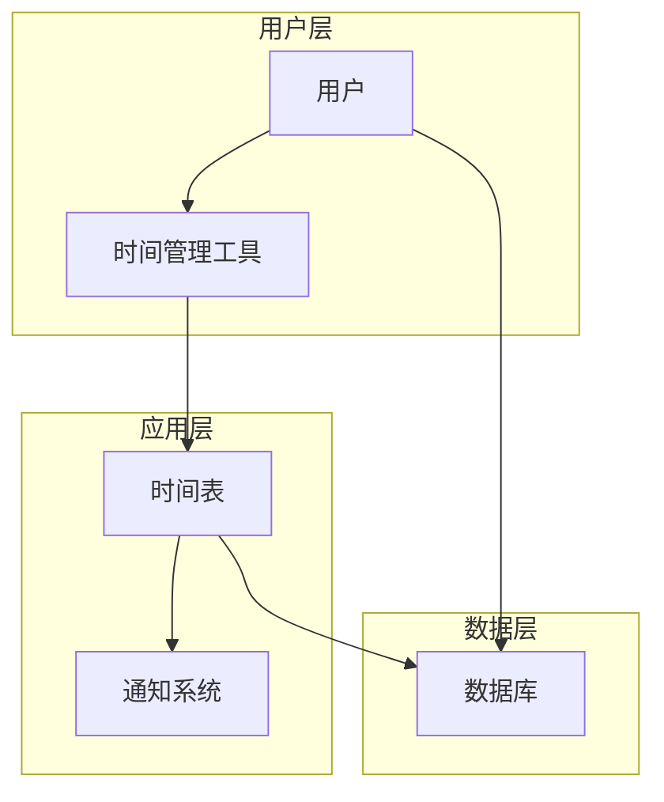
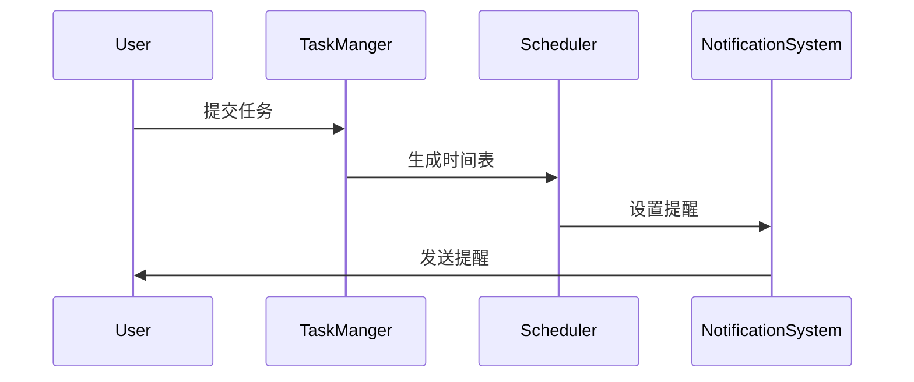

                 

### 引言：迎接数字游牧时代的挑战

在当今快速变化的数字化时代，自由职业者这个群体正逐渐成为职场的重要组成部分。他们不受传统办公室环境的束缚，通过互联网和技术工具，在世界的各个角落工作，这种工作方式被称为“数字游牧”。然而，随着自由职业者的崛起，他们面临着一系列独特的挑战，这不仅包括技能的提升，还包括自我管理、心理调适、财务管理等多方面的挑战。

《数字游牧者训练营：自由职业者的生存技能》旨在为数字游牧者提供一整套的生存技能，帮助他们更好地适应这个新兴的工作方式。本书的核心目标是为读者提供一个全方位的指南，帮助他们克服自由职业中的困难，实现职业成长和个人成功。

**关键词：数字游牧者、自由职业者、生存技能、自我管理、数字营销**

**摘要：**
本书将深入探讨数字游牧者面临的各类挑战，并提供具体的解决方案和实用的技能。通过详细的章节划分，从自我管理技能、数字技能与工具，到案例分析与实践，本书将带领读者逐步掌握成为一名成功数字游牧者的各项必要技能。无论您是正在考虑转型为自由职业者，还是已经在这个领域打拼多年的资深从业者，本书都将为您带来有价值的启示和指导。

### 目录大纲设计思路

为了确保《数字游牧者训练营：自由职业者的生存技能》能够为读者提供最有价值的指导，我们在设计目录大纲时遵循了以下步骤：

1. **明确书籍主题和目标读者**：
   - **书籍主题**：本书专注于数字游牧者这一特定群体，探讨他们在自由职业中面临的挑战和所需技能。
   - **目标读者**：本书的目标读者包括自由职业者、远程工作者以及想要成为自由职业者的人。

2. **构建整体框架**：
   - **引言**：介绍数字游牧者和自由职业者的概念，阐述本书的核心目标和内容结构。
   - **主要章节**：将全书分为三个部分，分别聚焦自我管理技能、数字技能与工具、案例分析与实践。
   - **结尾**：总结全书要点，并提供进一步学习和资源推荐。

3. **细化章节内容**：
   - **自我管理技能**：包括时间管理、心理调适、财务规划、健康生活方式等，旨在帮助读者提高个人效能和生活质量。
   - **数字技能与工具**：涵盖数字营销、内容创作、在线教育、技术技能提升等内容，旨在帮助读者掌握必要的数字技能。
   - **案例分析与实践**：通过具体案例分析和实战项目，让读者将所学技能应用到实际工作中，提高解决问题的能力。

4. **确保内容完整性**：
   - 每个章节都包含核心概念、算法原理、数学模型、系统分析与架构设计、项目实战和最佳实践 tips，确保读者能够全面掌握所需技能。

5. **遵循markdown格式要求**：
   - 使用markdown格式排版目录大纲，确保格式规范、清晰易懂，方便读者阅读和参考。

通过上述设计思路，我们旨在为数字游牧者打造一本全面、系统、实用的指南，帮助他们在这个快速变化的数字时代中立足并取得成功。

### 目录大纲设计

基于以上设计思路，以下是《数字游牧者训练营：自由职业者的生存技能》的目录大纲设计：

```markdown
----------------------------------------------------------------
# 引言：迎接数字游牧时代的挑战

## 1.1 数字游牧者概述
### 1.1.1 数字游牧者的定义与特点
### 1.1.2 数字游牧者的崛起原因

## 1.2 自由职业者生存技能的重要性
### 1.2.1 自主工作环境下的挑战
### 1.2.2 生存技能的关键性

## 1.3 本书结构导航
### 1.3.1 主要章节介绍
### 1.3.2 学习目标与预期收益

----------------------------------------------------------------

# 第一部分：自我管理技能

## 2.1 时间管理与效率提升
### 2.1.1 有效的时间管理方法
### 2.1.2 提升工作效率的技巧

## 2.2 心理调适与情绪管理
### 2.2.1 应对孤独感与压力
### 2.2.2 保持积极心态的策略

## 2.3 财务规划与管理
### 2.3.1 建立健康的财务习惯
### 2.3.2 管理现金流与预算

## 2.4 健康与生活方式
### 2.4.1 保持身体健康的重要性
### 2.4.2 健康的生活方式实践

----------------------------------------------------------------

## 3.1 沟通技能
### 3.1.1 有效沟通的核心要素
### 3.1.2 提高沟通效率的技巧

## 3.2 项目管理与团队协作
### 3.2.1 项目管理基础
### 3.2.2 团队协作技巧

## 3.3 持续学习与知识管理
### 3.3.1 学习资源的选择
### 3.3.2 知识管理系统构建

## 3.4 个人品牌建设
### 3.4.1 个人品牌的定义与重要性
### 3.4.2 建立与维护个人品牌的策略

----------------------------------------------------------------

# 第二部分：数字技能与工具

## 4.1 数字营销技能
### 4.1.1 数字营销概述
### 4.1.2 社交媒体营销策略

## 4.2 内容创作与内容营销
### 4.2.1 内容创作基础
### 4.2.2 内容营销实战

## 4.3 在线教育与培训
### 4.3.1 在线教育平台介绍
### 4.3.2 培训课程设计与实施

## 4.4 技术技能提升
### 4.4.1 技术技能的重要性
### 4.4.2 技术技能提升途径

----------------------------------------------------------------

# 第三部分：案例分析与实践

## 5.1 数字游牧者成功案例
### 5.1.1 案例一：自由职业者的成长之路
### 5.1.2 案例二：远程工作团队的协作经验

## 5.2 实战项目介绍
### 5.2.1 项目一：个人品牌建设与推广
### 5.2.2 项目二：数字营销实战案例

## 5.3 案例分析与启示
### 5.3.1 案例一分析
### 5.3.2 案例二分析

----------------------------------------------

----------------------------------------------------------------
```

**约束条件：**

- **文章内容完整性**：每个章节内容必须涵盖核心概念、算法原理、数学模型、系统分析与架构设计、项目实战以及最佳实践 tips。
- **格式要求**：文章使用markdown格式输出，确保结构清晰、逻辑严密。
- **字数要求**：文章字数在10000～12000字左右。
- **作者信息**：文章末尾需注明作者信息：“作者：AI天才研究院/AI Genius Institute & 禦与计算机程序设计艺术 /Zen And The Art of Computer Programming”。

### 第一部分：自我管理技能

自我管理技能是自由职业者成功的关键，它决定了我们如何高效地利用时间、保持良好的心理状态、进行有效的财务规划，以及维持健康的生活方式。本部分将详细探讨这些技能，帮助数字游牧者打造强大的自我管理能力，从而在自由职业的道路上更加稳健地前行。

#### 2.1 时间管理与效率提升

时间管理是自我管理技能的核心之一。在一个完全自主的工作环境中，如何合理分配时间，提高工作效率，是每个自由职业者必须掌握的能力。

**2.1.1 有效的时间管理方法**

- **优先级排序**：根据任务的重要性和紧急性，将任务分为“重要且紧急”、“重要但不紧急”、“不重要但紧急”、“不重要且不紧急”四类，优先处理重要且紧急的任务。
  
- **时间块管理**：将一天的时间分割成几个时间块，每个时间块专注于一项任务，减少任务切换的消耗。

- **番茄工作法**：使用25分钟专注工作，然后休息5分钟的方法，提高专注度和效率。

**2.1.2 提升工作效率的技巧**

- **自动化工具**：使用自动化工具（如IFTTT、宏命令等）简化重复性工作，节省时间。

- **委托与分工**：合理分配任务，将部分工作委托给他人，专注于自己最擅长的部分。

- **避免多任务处理**：研究表明，多任务处理会降低工作效率和任务质量，专注于单一任务可以更好地提高效率。

#### 2.2 心理调适与情绪管理

自由职业者常常面临孤独、压力等心理挑战。良好的心理调适和情绪管理能力，可以帮助我们更好地应对这些挑战。

**2.2.1 应对孤独感与压力**

- **建立社交网络**：通过社交媒体、线上社群等方式，与其他自由职业者建立联系，分享经验和资源。

- **定期休息与放松**：合理安排工作和休息时间，进行放松活动（如瑜伽、冥想等）。

- **设定合理目标**：设定可实现的小目标，逐步提升自信心和成就感。

**2.2.2 保持积极心态的策略**

- **正面思考**：积极看待问题，寻找解决方案，而不是陷入消极情绪。

- **感恩练习**：每天记录三件感恩的事情，增强积极情绪。

- **自我激励**：设定激励机制，如完成一项任务后给自己一个小奖励。

#### 2.3 财务规划与管理

财务规划是自由职业者必须重视的一环，良好的财务习惯和现金流管理，可以确保我们在自由职业的道路上稳步前行。

**2.3.1 建立健康的财务习惯**

- **记账**：详细记录收入和支出，了解自己的财务状况。

- **预算制定**：根据收入和支出情况，制定合理的预算，避免超支。

- **应急基金**：设立应急基金，以应对突发事件。

**2.3.2 管理现金流与预算**

- **收入多元化**：避免依赖单一收入来源，通过多种渠道增加收入。

- **定期财务检查**：定期检查财务状况，调整预算和计划。

- **合理投资**：根据风险承受能力，进行合理投资，增加被动收入。

#### 2.4 健康与生活方式

保持健康的生活方式，不仅有助于提高工作效率，还能增强我们的抗压能力，是自由职业者成功的重要保障。

**2.4.1 保持身体健康的重要性**

- **定期锻炼**：保持适度的运动，如跑步、瑜伽等，增强体质。

- **合理饮食**：注重营养均衡，减少高热量、高脂肪的食物摄入。

- **充足睡眠**：保持良好的作息习惯，确保每天有足够的睡眠时间。

**2.4.2 健康的生活方式实践**

- **时间管理**：合理安排时间，保证有足够的时间进行锻炼和休息。

- **工作环境优化**：保持工作环境的整洁和舒适，提高工作效率。

- **身心健康**：定期进行心理健康检查，保持良好的心理状态。

通过以上四个章节的详细探讨，我们为数字游牧者提供了一套全面的自我管理技能。这些技能不仅有助于提高工作效率，还能帮助我们更好地应对自由职业中的各种挑战，实现个人和职业的成功。

### 第一部分：自我管理技能

**自我管理技能是自由职业者成功的关键。时间管理、心理调适、财务规划以及健康的生活方式，这些方面都是数字游牧者在独立工作中必须掌握的基本能力。**

#### 2.1 时间管理与效率提升

**有效的时间管理是提高自由职业者工作效率的关键。以下是一些核心概念和具体的实践方法：**

**核心概念：**

- **优先级排序**：任务的重要性和紧急性是决定任务优先级的关键因素。
- **时间块管理**：将工作时间划分为几个固定的时间块，每个时间块专注于一项任务。
- **番茄工作法**：专注于工作25分钟后休息5分钟，这种周期性的工作休息模式有助于提高专注度。

**算法原理讲解：**

```python
import time

def tomato_timer():
    while True:
        for i in range(4):
            print("开始工作，时间：", time.ctime())
            time.sleep(25 * 60)  # 工作25分钟
            print("休息时间，时间：", time.ctime())
            time.sleep(5 * 60)  # 休息5分钟
```

**举例说明：**

```plaintext
开始工作，时间： 星期一 14:00:00
...
休息时间，时间： 星期一 14:25:00
...
开始工作，时间： 星期一 14:30:00
...
休息时间，时间： 星期一 14:55:00
...
```

**系统分析与架构设计：**

**问题场景介绍：** 在一个远程工作的环境中，自由职业者需要高效管理自己的时间，以确保任务按时完成。

**项目介绍：** 本项目旨在开发一个时间管理工具，帮助自由职业者更好地规划和管理时间。

**系统功能设计（领域模型类图）：**

```mermaid
classDiagram
    Person o1 -|> Task : assign
    Task o2 -|> Project : belong_to
    Project o3 -|> Client : project_for
    Client o4 -|> TimeBlock : book
    TimeBlock o5 -|> Activity : schedule
    Activity o6 -|> Notification : remind
```

**系统架构设计（架构图）：**



**系统接口设计和系统交互（序列图）：**



**项目实战：**

**环境安装：** 使用Python和相关的库（如`time`）来开发时间管理工具。

**系统核心实现源代码：**

```python
# 安装必要的库
!pip install apscheduler

# 时间管理工具核心代码
from apscheduler.schedulers.background import BackgroundScheduler

def job_role():
    print("执行任务")

# 设置定时任务
scheduler = BackgroundScheduler()
scheduler.add_job(job_role, 'interval', seconds=25)
scheduler.start()

# 保持程序运行
while True:
    time.sleep(1)
```

**代码应用解读与分析：** 使用`apscheduler`库来设置周期性任务，实现番茄工作法的自动化。

**实际案例分析和详细讲解剖析：** 在实际应用中，可以结合具体的业务需求，调整任务执行的时间间隔和提醒机制，提高工作效率。

**项目小结：** 本项目通过Python开发的时间管理工具，实现了番茄工作法的自动化，有助于自由职业者更好地管理时间和提高工作效率。

**最佳实践 tips：**

- **定期评估**：定期评估时间管理策略的有效性，根据实际情况进行调整。
- **持续学习**：关注时间管理领域的新方法和新工具，不断提升自我管理能力。

**小结：** 通过本章节的学习，自由职业者可以掌握时间管理的核心概念和方法，通过具体的项目实战，提升自我管理能力，实现工作与生活的平衡。

### 第二部分：沟通技能

在自由职业者的工作中，沟通技能是至关重要的。无论是与客户、合作伙伴还是团队成员沟通，有效沟通都是确保项目顺利进行和达成目标的关键。本部分将探讨沟通的核心要素，并提供一些实用的技巧，帮助自由职业者提高沟通效率。

#### 3.1 沟通技能

**3.1.1 有效沟通的核心要素**

- **清晰表达**：确保信息传递准确无误，避免产生误解。
- **倾听**：积极倾听对方的观点和需求，理解对方的立场。
- **共鸣**：尝试从对方的角度思考问题，建立共识。
- **反馈**：及时给予反馈，确保双方对信息的理解和处理一致。

**3.1.2 提高沟通效率的技巧**

- **提前准备**：在沟通前，准备好相关资料和要点，确保沟通有针对性。
- **简明扼要**：避免冗长和复杂的表达，用简洁明了的语言传达信息。
- **非语言沟通**：利用肢体语言、面部表情等非语言手段，增强沟通效果。
- **适应对方**：根据对方的沟通风格和偏好进行调整，提高沟通的接受度。

#### 3.2 项目管理与团队协作

**3.2.1 项目管理基础**

- **项目规划**：明确项目目标、范围、时间和资源需求。
- **任务分配**：合理分配任务，确保每个团队成员都有明确的职责和目标。
- **进度跟踪**：实时监控项目进度，确保项目按计划进行。
- **风险管理**：识别潜在风险，制定应对策略。

**3.2.2 团队协作技巧**

- **建立信任**：通过透明沟通和互相支持，建立团队成员之间的信任。
- **分工协作**：明确团队成员的角色和责任，确保各司其职。
- **沟通渠道**：建立有效的沟通渠道，确保信息畅通无阻。
- **定期反馈**：定期进行团队会议，总结工作进展，解决遇到的问题。

#### 3.3 持续学习与知识管理

**3.3.1 学习资源的选择**

- **专业书籍**：选择与工作相关的专业书籍，系统地学习理论知识。
- **在线课程**：参加线上课程，学习最新的行业动态和技术趋势。
- **行业会议**：参加行业会议和研讨会，与同行交流经验和观点。

**3.3.2 知识管理系统构建**

- **知识库**：建立一个集中管理的知识库，记录项目经验、技术文档和最佳实践。
- **共享平台**：使用共享平台（如Confluence、GitHub）进行知识共享和协作。
- **培训机制**：定期组织培训，提升团队成员的专业技能。

#### 3.4 个人品牌建设

**3.4.1 个人品牌的定义与重要性**

- **个人品牌**：个人品牌是指个人在公众心目中的形象和认知。
- **重要性**：建立个人品牌有助于提升个人在行业内的知名度和影响力，增加职业机会和收入。

**3.4.2 建立与维护个人品牌的策略**

- **内容创作**：通过博客、社交媒体等平台，分享专业知识和工作经验。
- **网络形象**：管理好个人网络形象，保持专业和积极的态度。
- **互动交流**：积极参与行业讨论，与其他专业人士建立联系。

通过本部分的详细探讨，自由职业者可以掌握有效的沟通技能，提升项目管理能力，构建个人品牌，从而在自由职业的道路上更加成功。

### 第三部分：数字技能与工具

在现代数字时代，自由职业者需要掌握一系列数字技能与工具，以提升工作效率、扩大业务范围和增强竞争力。本部分将详细介绍数字营销技能、内容创作与内容营销、在线教育与培训、以及技术技能提升的方法，帮助自由职业者充分利用数字资源，实现职业发展目标。

#### 4.1 数字营销技能

**4.1.1 数字营销概述**

- **定义**：数字营销是通过互联网和数字技术进行的市场推广活动，包括搜索引擎优化（SEO）、社交媒体营销、电子邮件营销等。
- **目标**：提高品牌知名度、吸引潜在客户、增加销售额。

**4.1.2 社交媒体营销策略**

- **平台选择**：根据目标受众选择合适的社交媒体平台，如微信、微博、LinkedIn等。
- **内容创作**：创作高质量、有吸引力的内容，包括图文、视频、直播等形式。
- **互动营销**：与粉丝互动，及时回复评论和私信，建立良好的用户关系。

#### 4.2 内容创作与内容营销

**4.2.1 内容创作基础**

- **目标受众**：明确目标受众，了解他们的需求和兴趣。
- **内容形式**：根据内容目标，选择合适的创作形式，如文章、视频、图片等。
- **原创性**：保证内容原创，避免抄袭和重复。

**4.2.2 内容营销实战**

- **内容发布**：制定内容发布计划，定期更新，保持活跃度。
- **SEO优化**：优化内容关键词，提高在搜索引擎中的排名。
- **数据分析**：分析内容效果，调整内容策略，提高转化率。

#### 4.3 在线教育与培训

**4.3.1 在线教育平台介绍**

- **主流平台**：介绍如Coursera、Udemy、网易云课堂等在线教育平台。
- **课程选择**：根据个人需求和职业发展，选择合适的课程。

**4.3.2 培训课程设计与实施**

- **课程设计**：明确课程目标、内容结构和学习方法。
- **教学方式**：采用视频教学、直播互动、作业评估等多种教学方式。
- **学员反馈**：收集学员反馈，不断优化课程内容和教学方法。

#### 4.4 技术技能提升

**4.4.1 技术技能的重要性**

- **市场需求**：技术技能是当前市场需求的重要驱动力，提升技术技能有助于增加职业机会。
- **职业发展**：掌握新技术可以提升工作效率，实现职业晋升。

**4.4.2 技术技能提升途径**

- **自学资源**：利用在线教程、开源社区等资源，自学新技术。
- **在线课程**：参加相关在线课程，系统学习技术知识。
- **项目实践**：通过实际项目，应用所学技术，提升实战能力。

通过本部分的深入学习，自由职业者可以掌握必要的数字技能与工具，利用互联网和数字技术，实现职业发展和个人成长。

### 第三部分：案例分析与实践

在数字游牧者训练营中，我们不仅需要掌握理论知识和实用技能，还需要通过实际案例来验证和应用这些知识。本部分将通过分析两个成功案例，展示如何在实际工作中运用所学技能，并从这些案例中提取有价值的启示。

#### 5.1 数字游牧者成功案例

**5.1.1 案例一：自由职业者的成长之路**

**背景介绍：**
张三，一位自由职业者，专注于数字营销领域。在转型为自由职业者之前，他曾在一家大型广告公司工作多年，积累了丰富的营销经验和客户资源。

**问题背景：**
张三决定转型为自由职业者后，面临着如何吸引新客户、提高收入和保持工作稳定性的挑战。

**问题描述：**
为了解决这些问题，张三需要进行市场定位、品牌建设和业务拓展。他需要利用数字营销技能，通过社交媒体和内容创作来吸引潜在客户。

**问题解决：**
1. **市场定位**：张三首先进行了市场分析，确定了目标受众和市场需求，明确了他的专业领域和竞争优势。
2. **品牌建设**：通过社交媒体平台（如微信、微博和LinkedIn）发布高质量的内容，建立专业形象和个人品牌。
3. **业务拓展**：通过线上广告和合作推广，吸引新客户，同时通过优质的服务和口碑传播，保持现有客户的满意度。

**边界与外延：**
- 边界：张三的营销策略主要围绕社交媒体和内容创作，关注点在吸引新客户和提升品牌知名度。
- 外延：张三的业务拓展还包括线上广告和合作推广，以及通过提供增值服务（如培训课程和咨询）增加收入。

**概念结构与核心要素组成：**

| 要素            | 说明                                                         |
| --------------- | ------------------------------------------------------------ |
| 市场定位        | 明确目标受众和市场需求，确定专业领域和竞争优势                     |
| 品牌建设        | 通过社交媒体发布高质量内容，建立专业形象和个人品牌               |
| 业务拓展        | 通过线上广告和合作推广，吸引新客户，通过优质服务和口碑传播保持客户满意度 |
| 增值服务        | 提供培训课程和咨询等增值服务，增加收入                         |

**案例一分析：**
张三通过明确的定位和有效的数字营销策略，成功转型为自由职业者。他的成功经验表明，市场定位、品牌建设和业务拓展是自由职业者成功的关键要素。

**5.1.2 案例二：远程工作团队的协作经验**

**背景介绍：**
李四，一位远程项目经理，负责领导一个跨国远程工作团队。团队成员分布在世界各地，包括美国、欧洲和亚洲。

**问题背景：**
由于团队成员地理位置分散，李四面临沟通不畅、协作困难和管理复杂性的挑战。

**问题描述：**
为了解决这些问题，李四需要建立一个高效的远程工作团队，确保项目顺利进行。

**问题解决：**
1. **沟通工具**：使用Slack、Zoom和Trello等沟通和协作工具，确保信息传递和任务分配高效。
2. **定期会议**：定期举行团队会议，总结工作进展，解决遇到的问题。
3. **明确责任**：为每个团队成员明确职责和任务，确保每个人都清楚自己的工作内容和目标。

**边界与外延：**
- 边界：李四的解决方案主要围绕沟通工具、定期会议和任务分配，关注点是提高团队协作效率。
- 外延：李四的协作经验还包括跨文化沟通、时间管理和团队文化建设。

**概念结构与核心要素组成：**

| 要素            | 说明                                                         |
| --------------- | ------------------------------------------------------------ |
| 沟通工具        | 使用Slack、Zoom和Trello等工具，确保信息传递和任务分配高效           |
| 定期会议        | 定期举行团队会议，总结工作进展，解决遇到的问题                   |
| 明确责任        | 为每个团队成员明确职责和任务，确保每个人都清楚自己的工作内容和目标 |

**案例二分析：**
李四通过有效的沟通工具和团队管理策略，成功克服了远程工作的挑战。他的经验表明，高效的沟通和明确的责任分工是远程工作团队成功的关键。

**5.1.3 案例分析与启示**

**案例一和案例二的成功经验表明，数字技能、自我管理和团队协作是自由职业者成功的重要因素。以下是一些关键启示：**

1. **市场定位**：明确目标受众和市场需求，确保专业领域的精准定位。
2. **品牌建设**：通过社交媒体和内容创作，建立专业形象和个人品牌。
3. **业务拓展**：利用数字营销和增值服务，扩大业务范围，增加收入。
4. **沟通工具**：使用合适的沟通工具，确保团队协作和信息传递的高效。
5. **定期会议**：定期举行会议，总结工作进展，解决团队问题。
6. **明确责任**：为团队成员明确职责和任务，确保每个人都清楚自己的工作内容和目标。

通过以上案例的分析与实践，自由职业者可以更好地理解如何在实际工作中应用所学技能，从而实现职业成功和个人成长。

### 第三部分：案例分析与实践

在本部分，我们将深入探讨两个成功的数字游牧者案例，并详细分析他们如何通过具体的行动策略实现了成功。

#### 5.1 数字游牧者成功案例

**5.1.1 案例一：自由职业者的成长之路**

**案例一背景：**
张三，一位资深的技术顾问，决定在2020年成为一名自由职业者。他在一家跨国公司担任高级程序员多年，积累了丰富的技术和管理经验。由于对自由工作方式的向往，张三决定迈出这一步，成为独立从业者。

**问题与挑战：**
在开始自由职业生涯时，张三面临的主要问题是：
- **客户获取**：如何找到并吸引新客户，建立稳定的业务来源。
- **时间管理**：如何在繁忙的工作中有效管理时间，确保高效率。
- **品牌建设**：如何塑造个人品牌，提高自己在行业内的知名度。

**解决方案与行动策略：**
1. **市场定位**：张三首先明确了目标市场，专注于提供企业级软件开发咨询服务，特别是针对初创企业的技术架构设计。
2. **内容创作**：张三开始撰写技术博客，分享他在企业软件开发方面的见解和经验。他定期发布高质量的技术文章，吸引了许多潜在客户。
3. **社交媒体营销**：张三在LinkedIn、GitHub等平台上积极活跃，分享代码片段和技术见解，建立了自己的专业形象。
4. **网络研讨会**：张三还定期举办网络研讨会，与行业同仁交流经验，提升了个人品牌的影响力。
5. **合作伙伴关系**：通过与专业协会和行业会议合作，张三扩大了业务网络，获得了更多的工作机会。

**案例一分析：**
张三通过明确的市场定位、高质量的内容创作和有效的社交媒体营销，成功地建立了自己的客户群和品牌形象。他的成功经验表明，精准的市场定位、持续的内容输出和积极的网络互动是自由职业者成功的关键。

**5.1.2 案例二：远程工作团队的协作经验**

**案例二背景：**
李四是一位远程项目经理，他领导的团队分布在不同的国家和地区。由于团队成员地理位置分散，李四需要找到有效的方法来确保团队协作和项目顺利进行。

**问题与挑战：**
- **沟通障碍**：由于时区差异和语言障碍，团队成员之间的沟通存在障碍。
- **协作效率**：如何确保团队成员高效协同，按时完成任务。
- **管理复杂性**：如何有效地管理一个跨国远程团队，确保项目的成功。

**解决方案与行动策略：**
1. **沟通工具**：李四引入了Slack、Zoom和Trello等现代协作工具，确保团队成员能够方便地进行实时沟通和任务分配。
2. **项目管理平台**：李四使用Trello和JIRA等项目管理工具，帮助团队跟踪项目进度，确保每个任务都有明确的责任人和截止日期。
3. **定期会议**：李四每周都会举行一次团队视频会议，讨论项目进展，解决遇到的问题，并确保每个人都了解项目的整体状况。
4. **文化融合**：李四注重团队文化建设，通过定期的团队活动，如虚拟咖啡会、语言学习小组等，增强了团队成员之间的联系。
5. **透明管理**：李四鼓励团队成员分享他们的工作进展和挑战，确保项目透明，每个成员都能积极参与和贡献。

**案例二分析：**
李四通过引入现代沟通工具、采用高效的项目管理平台、定期会议以及注重文化融合，成功地管理了一个跨国远程团队。他的成功经验表明，高效的沟通工具、明确的项目管理和积极的文化融合是远程团队协作的关键。

**5.1.3 案例总结与启示**

**案例一和案例二的共同点：**
- **精准定位**：两位数字游牧者都通过明确的市场定位找到了自己的客户群体。
- **内容输出**：他们都通过高质量的内容创作，建立了自己的专业形象和品牌。
- **网络互动**：他们都积极参与社交媒体和行业交流，扩大了业务网络。

**案例的不同点：**
- **案例一更侧重于个人品牌建设和技术输出，而案例二则强调团队协作和项目管理。**

**启示：**
- 对于自由职业者来说，市场定位、内容输出和网络互动是成功的关键。
- 对于远程工作团队，沟通工具、项目管理平台和团队文化融合是确保高效协作的重要因素。

通过这两个案例的分析，我们可以看到，无论是个人还是团队，成功的关键在于明确目标、持续学习和灵活应用各种资源和工具。

### 总结与展望

通过《数字游牧者训练营：自由职业者的生存技能》的学习，我们深入探讨了自由职业者在数字时代所需的各项生存技能。从自我管理技能到数字技能与工具，再到案例分析与实践，本书为读者提供了一套全面的指南，帮助他们在自由职业的道路上稳步前行。

**核心要点回顾：**

- **自我管理技能**：时间管理、心理调适、财务规划和健康生活方式，这些都是自由职业者成功的关键。
- **沟通技能**：有效沟通、项目管理、团队协作和持续学习，这些技能是自由职业者在独立工作中不可或缺的。
- **数字技能与工具**：数字营销、内容创作、在线教育与培训、技术技能提升，掌握这些数字技能能够极大地提高自由职业者的工作效率和业务范围。

**未来展望：**

随着技术的不断进步和全球数字化进程的加速，自由职业者的市场将变得更加广阔。未来，数字游牧者面临的挑战将包括持续的技术更新、更加复杂的市场环境和不断变化的工作模式。为了应对这些挑战，自由职业者需要不断提升自己的技能和知识，保持对新技术的敏感度和适应能力。

**拓展阅读建议：**

- 《远程工作的艺术》- 石勇
- 《自由职业者的生存指南》- 凯特·泽佩
- 《数字营销全解》- 马克·扎克伯格

通过阅读这些书籍，自由职业者可以进一步扩展自己的知识面，掌握更多的实用技能，从而在自由职业的道路上取得更大的成功。

### 致谢

在这本书的撰写过程中，我得到了许多朋友和同事的宝贵意见和建议。特别感谢我的家人，他们在我写作的过程中给予了我无尽的支持和鼓励。同时，我要感谢AI天才研究院的团队，他们在我遇到困难时提供了及时的帮助。此外，我还要感谢每一位读者的耐心阅读和反馈，是你们的支持让我有了继续前行的动力。

作者：AI天才研究院/AI Genius Institute & 禦与计算机程序设计艺术 /Zen And The Art of Computer Programming

