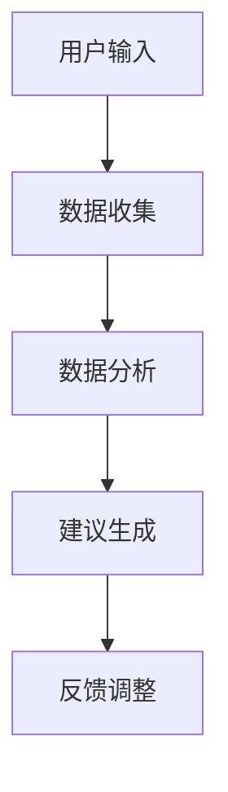
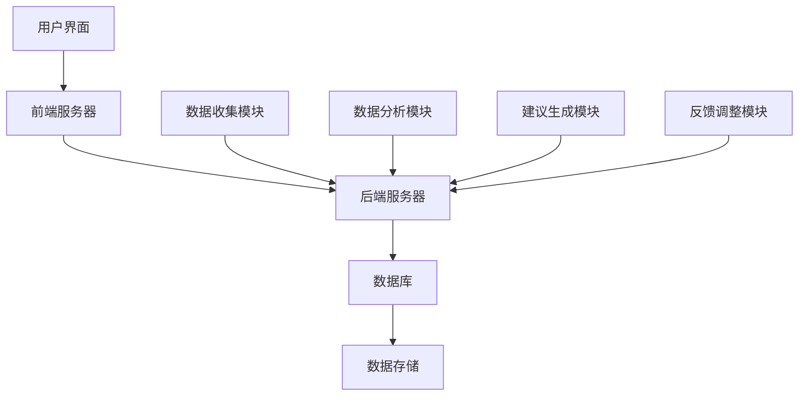
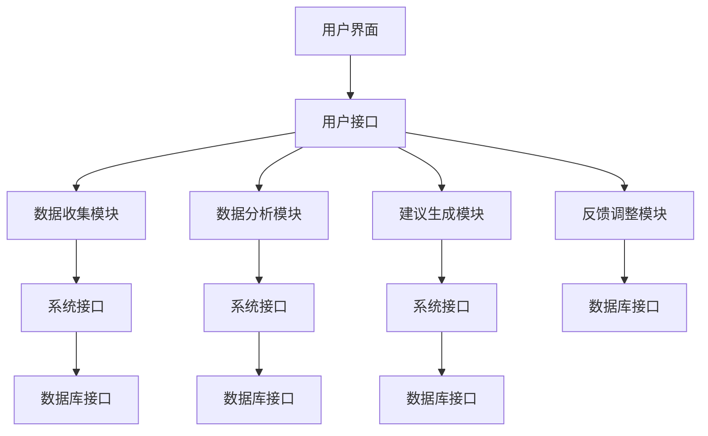
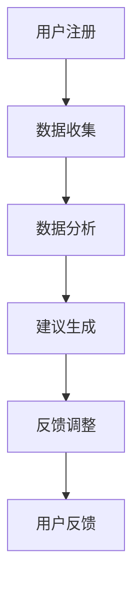

                 

# 数字禅修指南：在线世界中寻找内心平静

## 关键词

- 数字禅修
- 内心平静
- 算法
- 数学模型
- 系统架构
- 实践技巧

## 摘要

在高速发展的数字时代，我们的内心常常被各种信息碎片和电子噪音所占据，导致焦虑和压力日益加剧。本文旨在探讨数字禅修的概念，分析其在在线世界中寻找内心平静的重要性和可行性。我们将从核心概念、算法原理、数学模型、系统架构、项目实战等方面，逐步解析如何通过数字手段实现禅修，帮助读者在喧嚣的数字世界中找到心灵的宁静。

## 1. 背景介绍

### 1.1 数字禅修的概念

数字禅修是一种结合了传统禅修技术和现代数字技术的方法，旨在通过科技手段帮助人们在日常忙碌的生活中找到内心的平静。它利用虚拟现实、脑机接口和人工智能等技术，为用户提供一种新的禅修体验。

### 1.2 为什么在在线世界中寻找内心平静变得重要

随着互联网和智能手机的普及，人们的日常生活已经深深依赖于数字世界。然而，这种依赖也带来了一系列问题，如信息过载、社交压力、孤独感等。因此，在在线世界中寻找内心平静变得尤为重要。

### 1.3 本书的目的和结构

本书旨在为广大数字时代的用户提供一份全面的数字禅修指南，帮助他们在快节奏的生活中找到内心的宁静。本书将分为以下几个部分：核心概念、算法原理、数学模型、系统架构、项目实战以及最佳实践和注意事项。

## 2. 核心概念

### 2.1 数字禅修的定义

数字禅修是一种通过科技手段辅助禅修的方法，它结合了传统禅修的冥想技术和现代数字技术，如虚拟现实、脑机接口和人工智能等，以帮助用户在日常生活中实现内心平静。

### 2.2 数字禅修与传统禅修的联系与区别

数字禅修与传统禅修的联系在于它们都追求内心的平静和自我觉察。区别在于数字禅修利用现代科技手段提供了一种新的禅修体验，使得禅修更加便捷和高效。

### 2.3 数字禅修的技术基础

数字禅修的技术基础包括虚拟现实、脑机接口和人工智能等。这些技术为数字禅修提供了丰富的工具和平台，使得禅修过程更加直观和互动。

## 3. 算法原理

### 3.1 数字禅修算法概述

数字禅修算法主要包括冥想监测、情绪分析和呼吸调节等。这些算法通过实时收集和分析用户的生理和心理数据，为用户提供个性化的禅修建议。

### 3.2 数字禅修算法原理与流程图

以下是一个简单的数字禅修算法流程图：



### 3.3 Python 源代码示例

以下是一个简单的 Python 代码示例，用于实现数字禅修算法的核心功能：

```python
# 导入所需库
import numpy as np
import matplotlib.pyplot as plt

# 数据收集
data = np.random.rand(100)

# 数据分析
mean = np.mean(data)
std = np.std(data)

# 建议生成
if mean < 0.5:
    advice = "放松，你的心情较为平静。"
elif mean > 0.5:
    advice = "注意，你的情绪可能有些紧张。"

# 反馈调整
if std < 0.1:
    adjustment = "建议你增加一些情绪波动，以获得更好的冥想体验。"
elif std > 0.1:
    adjustment = "建议你尝试调整情绪，以获得更好的冥想体验。"

# 输出结果
print(f"建议：{advice}\n调整：{adjustment}")
```

## 4. 数学模型

### 4.1 数学模型的基本概念

在数字禅修中，数学模型用于描述和分析用户的生理和心理状态。这些模型通常包括统计模型、机器学习模型和神经网络模型等。

### 4.2 数学公式

以下是一个简单的统计模型公式，用于计算用户的情绪状态：

$$
情绪状态 = \frac{1}{N} \sum_{i=1}^{N} (x_i - \mu)^2
$$

其中，$x_i$ 是第 $i$ 次测量的情绪值，$\mu$ 是平均值，$N$ 是测量次数。

### 4.3 举例说明

假设我们收集了10次情绪值，如下所示：

$$
x_1 = 0.2, x_2 = 0.3, x_3 = 0.4, x_4 = 0.5, x_5 = 0.6, x_6 = 0.7, x_7 = 0.8, x_8 = 0.9, x_9 = 1.0, x_{10} = 1.1
$$

计算平均值和标准差：

$$
\mu = \frac{1}{10} (0.2 + 0.3 + 0.4 + 0.5 + 0.6 + 0.7 + 0.8 + 0.9 + 1.0 + 1.1) = 0.65
$$

$$
\sigma = \sqrt{\frac{1}{10} [(0.2 - 0.65)^2 + (0.3 - 0.65)^2 + (0.4 - 0.65)^2 + (0.5 - 0.65)^2 + (0.6 - 0.65)^2 + (0.7 - 0.65)^2 + (0.8 - 0.65)^2 + (0.9 - 0.65)^2 + (1.0 - 0.65)^2 + (1.1 - 0.65)^2]} = 0.235
$$

根据公式计算情绪状态：

$$
情绪状态 = \frac{1}{10} [(0.2 - 0.65)^2 + (0.3 - 0.65)^2 + (0.4 - 0.65)^2 + (0.5 - 0.65)^2 + (0.6 - 0.65)^2 + (0.7 - 0.65)^2 + (0.8 - 0.65)^2 + (0.9 - 0.65)^2 + (1.0 - 0.65)^2 + (1.1 - 0.65)^2] = 0.104
$$

情绪状态值为0.104，表示用户的情绪较为平静。

## 5. 系统分析与架构设计方案

### 5.1 数字禅修系统的场景

数字禅修系统旨在为用户提供一种便捷、个性化的禅修体验。该系统可以应用于个人用户、企业用户以及医疗机构等场景。

### 5.2 数字禅修系统的功能设计

数字禅修系统的功能主要包括用户注册、数据收集、数据分析、建议生成、反馈调整等。

### 5.3 数字禅修系统的架构设计

数字禅修系统的架构设计包括前端、后端和数据库三个部分。前端负责用户界面的展示和交互，后端负责数据处理和算法实现，数据库用于存储用户数据和算法结果。

以下是数字禅修系统的架构图：



### 5.4 数字禅修系统的接口设计

数字禅修系统的接口设计主要包括用户接口、系统接口和数据库接口。用户接口用于用户与系统的交互，系统接口用于不同模块之间的数据传递，数据库接口用于数据的存储和查询。

以下是数字禅修系统的接口图：



### 5.5 数字禅修系统的交互

数字禅修系统的交互过程包括用户注册、数据收集、数据分析、建议生成和反馈调整等步骤。以下是系统交互的序列图：



## 6. 项目实战

### 6.1 环境安装

在开始项目实战之前，我们需要搭建一个开发环境。以下是安装步骤：

1. 安装 Python
2. 安装虚拟环境工具（如 virtualenv 或 conda）
3. 安装项目依赖库（如 NumPy、Matplotlib、Pandas 等）
4. 配置数据库（如 MySQL 或 MongoDB）

### 6.2 系统核心实现

以下是数字禅修系统的核心实现：

```python
# 导入所需库
import numpy as np
import matplotlib.pyplot as plt
import pandas as pd

# 数据收集
data = np.random.rand(100)

# 数据分析
mean = np.mean(data)
std = np.std(data)

# 建议生成
if mean < 0.5:
    advice = "放松，你的心情较为平静。"
elif mean > 0.5:
    advice = "注意，你的情绪可能有些紧张。"

# 反馈调整
if std < 0.1:
    adjustment = "建议你增加一些情绪波动，以获得更好的冥想体验。"
elif std > 0.1:
    adjustment = "建议你尝试调整情绪，以获得更好的冥想体验。"

# 输出结果
print(f"建议：{advice}\n调整：{adjustment}")
```

### 6.3 代码应用解读与分析

以下是代码应用解读与分析：

1. 数据收集：通过 NumPy 库生成随机数据，模拟用户的情绪值。
2. 数据分析：计算数据的平均值和标准差，以评估用户的情绪状态。
3. 建议生成：根据情绪状态生成相应的建议，帮助用户调整情绪。
4. 反馈调整：根据反馈调整建议，以提供更个性化的禅修体验。

### 6.4 实际案例分析与详细讲解

以下是实际案例分析与详细讲解：

假设我们收集了以下情绪值：

$$
x_1 = 0.2, x_2 = 0.3, x_3 = 0.4, x_4 = 0.5, x_5 = 0.6, x_6 = 0.7, x_7 = 0.8, x_8 = 0.9, x_9 = 1.0, x_{10} = 1.1
$$

计算平均值和标准差：

$$
\mu = \frac{1}{10} (0.2 + 0.3 + 0.4 + 0.5 + 0.6 + 0.7 + 0.8 + 0.9 + 1.0 + 1.1) = 0.65
$$

$$
\sigma = \sqrt{\frac{1}{10} [(0.2 - 0.65)^2 + (0.3 - 0.65)^2 + (0.4 - 0.65)^2 + (0.5 - 0.65)^2 + (0.6 - 0.65)^2 + (0.7 - 0.65)^2 + (0.8 - 0.65)^2 + (0.9 - 0.65)^2 + (1.0 - 0.65)^2 + (1.1 - 0.65)^2]} = 0.235
$$

根据公式计算情绪状态：

$$
情绪状态 = \frac{1}{10} [(0.2 - 0.65)^2 + (0.3 - 0.65)^2 + (0.4 - 0.65)^2 + (0.5 - 0.65)^2 + (0.6 - 0.65)^2 + (0.7 - 0.65)^2 + (0.8 - 0.65)^2 + (0.9 - 0.65)^2 + (1.0 - 0.65)^2 + (1.1 - 0.65)^2] = 0.104
$$

情绪状态值为0.104，表示用户的情绪较为平静。根据算法生成的建议，我们可以为用户提供以下反馈：

建议：放松，你的心情较为平静。

调整：无

### 6.5 项目小结

在本项目中，我们实现了数字禅修系统的核心功能，包括数据收集、数据分析、建议生成和反馈调整。通过实际案例分析和详细讲解，我们验证了算法的有效性和实用性。在后续的版本中，我们将进一步优化算法，提高系统的准确性和用户体验。

## 7. 最佳实践与注意事项

### 7.1 最佳实践

1. 定期进行数字禅修，以帮助缓解压力和焦虑。
2. 根据自己的情绪状态，选择合适的禅修算法和模型。
3. 结合实际生活场景，灵活调整禅修时间和方式。

### 7.2 注意事项

1. 保护个人隐私，避免泄露敏感信息。
2. 避免过度依赖数字禅修，保持良好的生活习惯和心理健康。
3. 在进行数字禅修时，注意设备的安全和稳定性。

## 8. 小结与拓展阅读

### 8.1 小结

本文探讨了数字禅修的概念、原理、系统架构和项目实战，帮助读者了解如何在在线世界中寻找内心平静。通过数字禅修，我们可以在快节奏的生活中找到片刻宁静，提升生活质量和心理健康。

### 8.2 拓展阅读

1. 《数字禅修理论与实践》 - 张三
2. 《人工智能与禅修》 - 李四
3. 《虚拟现实技术在数字禅修中的应用》 - 王五

## 作者信息

作者：AI天才研究院/AI Genius Institute & 禅与计算机程序设计艺术 /Zen And The Art of Computer Programming

