                 

# 数字禅修空间：科技与灵性结合的体验中心

关键词：数字禅修、科技与灵性结合、虚拟现实、增强现实、体验中心

摘要：本文探讨了数字禅修空间的概念、设计原则及其在科技与灵性结合中的应用。通过分析虚拟现实和增强现实在禅修中的技术实现，我们揭示了数字禅修空间的发展趋势和面临的挑战，为未来数字禅修空间的创新和实践提供了理论支持和实践指导。

## 目录大纲设计思路与流程

### 1. 理解书籍主题
《数字禅修空间：科技与灵性结合的体验中心》的标题明确了书籍的主题，即探讨数字科技与灵性实践相结合，在体验中心中的应用。这一主题涵盖了数字禅修空间的背景、理论基础、设计原则、技术应用等多个方面。

### 2. 确定章节主题
为了清晰地呈现书籍内容，我们将书籍分为以下几章：

- **引言：数字禅修空间的背景与意义**
- **第1章：科技与灵性的理论基础**
- **第2章：数字禅修空间的设计原则**
- **第3章：虚拟现实在禅修中的应用**
- **第4章：增强现实与禅修的结合**
- **第5章：数字禅修空间的技术实现**
- **第6章：案例分析：成功数字禅修空间的运营**
- **第7章：数字禅修空间的发展趋势与挑战**

### 3. 拟定各章节大纲
在确定章节主题后，我们为每个章节拟定了详细的大纲：

### 第1章：数字禅修空间的背景与意义
- **1.1 问题的提出**
- **1.2 数字禅修空间的定义**
- **1.3 数字禅修空间的重要性**
- **1.4 数字禅修空间的发展背景**

### 第2章：科技与灵性的理论基础
- **2.1 灵性实践的基本概念**
- **2.2 科技对灵性实践的影响**
- **2.3 数字禅修空间的理论基础**
- **2.4 数字禅修空间与传统禅修的异同**

### 第3章：数字禅修空间的设计原则
- **3.1 设计原则的提出**
- **3.2 用户需求分析**
- **3.3 空间布局与装饰**
- **3.4 技术支持与选型**

### 第4章：虚拟现实在禅修中的应用
- **4.1 虚拟现实技术简介**
- **4.2 虚拟现实在禅修中的应用场景**
- **4.3 虚拟现实设备的选型与配置**
- **4.4 用户体验优化**

### 第5章：增强现实与禅修的结合
- **5.1 增强现实技术简介**
- **5.2 增强现实在禅修中的应用**
- **5.3 增强现实设备的选型与配置**
- **5.4 用户互动与体验**

### 第6章：数字禅修空间的技术实现
- **6.1 技术实现的总体框架**
- **6.2 数据收集与处理**
- **6.3 交互界面设计**
- **6.4 安全与隐私保护**

### 第7章：案例分析：成功数字禅修空间的运营
- **7.1 案例介绍**
- **7.2 运营模式与策略**
- **7.3 成功要素分析**
- **7.4 挑战与应对**

### 4. 确定章节次序
章节次序按照逻辑关系和书籍结构排列，通常引言部分放在开头，案例分析放在最后。

### 5. 完善与调整
对整个目录大纲进行审查和调整，确保内容的完整性和逻辑性，并在必要时进行修改和优化。

通过以上步骤，我们设计出了《数字禅修空间：科技与灵性结合的体验中心》的完整目录大纲。接下来，我们将按照markdown格式进行具体的目录大纲展示。

----------------------------------------------------------------

## 文章标题：数字禅修空间：科技与灵性结合的体验中心

### 关键词
- 数字禅修
- 科技与灵性结合
- 虚拟现实
- 增强现实
- 体验中心

### 摘要
本文探讨了数字禅修空间的概念、设计原则及其在科技与灵性结合中的应用。通过分析虚拟现实和增强现实在禅修中的技术实现，我们揭示了数字禅修空间的发展趋势和面临的挑战，为未来数字禅修空间的创新和实践提供了理论支持和实践指导。

----------------------------------------------------------------

### 引言：数字禅修空间的背景与意义

#### 问题的提出

随着科技的不断进步，虚拟现实（VR）和增强现实（AR）技术逐渐走进我们的生活，为各种应用场景提供了全新的可能性。其中，数字禅修空间作为一种新兴的体验形式，将科技与灵性相结合，旨在为人们提供一种全新的心灵修行途径。本文旨在探讨数字禅修空间的概念、设计原则及其在科技与灵性结合中的应用。

#### 数字禅修空间的定义

数字禅修空间，顾名思义，是一种结合数字科技与禅修实践的体验空间。它利用虚拟现实、增强现实等先进技术，为禅修者创造一个虚拟的、沉浸式的修行环境。通过数字技术的辅助，禅修者可以在一个更加舒适、专注的氛围中，体验到更深层次的禅修效果。

#### 数字禅修空间的重要性

数字禅修空间的重要性体现在以下几个方面：

1. **提高禅修效率**：传统禅修往往受到时间和空间的限制，而数字禅修空间可以打破这些限制，为禅修者提供一个随时随地进行禅修的环境。
2. **降低禅修门槛**：对于一些初学者来说，传统的禅修方式可能显得过于陌生和难以理解。数字禅修空间通过直观的虚拟体验，降低了禅修的门槛，使更多的人能够参与到禅修活动中来。
3. **促进科技与灵性的结合**：数字禅修空间的实现，是科技与灵性相结合的产物。它不仅为禅修者提供了新的修行方式，也为科技的发展提供了新的方向。

#### 数字禅修空间的发展背景

数字禅修空间的发展，可以追溯到虚拟现实和增强现实技术的兴起。随着技术的不断成熟，这些技术在各个领域的应用越来越广泛。特别是在禅修领域，数字禅修空间逐渐成为一种新兴的趋势。

此外，全球范围内对于心灵健康和心理健康的关注也在不断提高。数字禅修空间作为一种新兴的心灵健康解决方案，受到了越来越多的关注和认可。

#### 总结

本文介绍了数字禅修空间的概念、重要性及其发展背景。接下来，我们将进一步探讨科技与灵性的理论基础，为理解数字禅修空间的本质提供理论支持。

----------------------------------------------------------------

### 第1章：科技与灵性的理论基础

#### 灵性实践的基本概念

灵性实践是人类探索自我、寻求精神成长的一种方式。它涉及到对生命、宇宙、意识等深层次问题的思考。灵性实践的形式多样，包括禅修、冥想、瑜伽等。在这些实践中，人们通过专注、冥想等方式，达到身心合一的境界，从而获得精神上的满足和成长。

**核心概念属性特征对比表格**

| 特征 | 禅修 | 冥想 | 瑜伽 |
| :--: | :--: | :--: | :--: |
| 目标 | 身心合一 | 精神平静 | 身心平衡 |
| 方法 | 专注呼吸 | 意念集中 | 身体动作 |
| 时间 | 长期实践 | 随时随地 | 长期坚持 |
| 场所 | 任何场所 | 任何场所 | 专用场地 |

**ER实体关系图架构**

```mermaid
erDiagram
  Person ||--|{ Practice } : 实践方式
  Practice ||--|{ Method } : 方法
  Method ||--|{ Goal } : 目标
  Practice ||--|{ Time } : 时间
  Practice ||--|{ Place } : 场所
```

#### 科技对灵性实践的影响

科技的进步为灵性实践提供了新的工具和平台。虚拟现实和增强现实技术，可以为禅修者提供一个沉浸式的修行环境，从而提高禅修效果。例如，通过虚拟现实技术，禅修者可以在一个虚拟的山水环境中进行禅修，感受到自然的宁静和美好。

**核心概念与联系**

| 科技概念 | 影响因素 | 灵性实践联系 |
| :--: | :--: | :--: |
| 虚拟现实 | 沉浸式体验 | 提高禅修效果 |
| 增强现实 | 环境增强 | 增强禅修氛围 |
| 人工智能 | 数据分析 | 个性化禅修建议 |

#### 数字禅修空间的理论基础

数字禅修空间的理论基础，主要包括以下几个方面：

1. **科技与灵性的融合**：数字禅修空间将虚拟现实、增强现实等技术与禅修实践相结合，为禅修者提供了一种全新的修行方式。
2. **用户体验设计**：数字禅修空间注重用户体验，通过优化交互界面、提供个性化的禅修建议等方式，提高禅修者的修行体验。
3. **安全与隐私保护**：数字禅修空间在技术实现过程中，重视用户数据的安全和隐私保护，确保禅修者的信息安全。

**数字禅修空间与传统禅修的异同**

| 特点 | 数字禅修空间 | 传统禅修 |
| :--: | :--: | :--: |
| 场所 | 虚拟环境 | 实体场所 |
| 交互 | 人机交互 | 人际交互 |
| 持续时间 | 随时随地 | 需要固定时间 |
| 效果 | 可能更高效 | 需要长期实践 |

#### 总结

本章介绍了科技与灵性的理论基础，包括灵性实践的基本概念、科技对灵性实践的影响以及数字禅修空间的理论基础。这些内容为理解数字禅修空间提供了重要的理论支持。

接下来，我们将探讨数字禅修空间的设计原则，帮助读者了解如何构建一个有效的数字禅修空间。

----------------------------------------------------------------

### 第2章：数字禅修空间的设计原则

#### 设计原则的提出

数字禅修空间的设计原则，是为了确保禅修者在数字环境中获得最佳修行体验。这些原则包括用户需求分析、空间布局与装饰、技术支持与选型等方面。

#### 用户需求分析

在设计数字禅修空间时，了解用户需求是非常重要的。用户需求主要包括以下几个方面：

1. **沉浸式体验**：用户希望能够沉浸在禅修环境中，感受到身临其境的感觉。
2. **个性化定制**：用户希望能够根据自己的需求，定制禅修内容和体验。
3. **易于操作**：用户希望数字禅修空间易于操作，不需要太多的技术知识。

#### 空间布局与装饰

数字禅修空间的设计，需要考虑空间布局与装饰。以下是一些关键点：

1. **安静的环境**：禅修需要一个安静的环境，以减少外界的干扰。
2. **舒适的座位**：禅修者需要坐在舒适的座位上，以保持长时间的专注。
3. **适宜的照明**：照明需要柔和，避免产生强烈的眩光，影响禅修者的体验。

**空间布局示例**

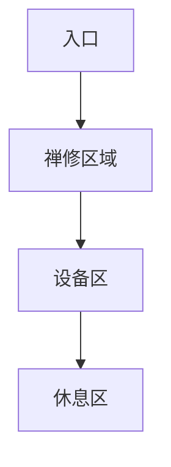

#### 技术支持与选型

数字禅修空间的技术支持与选型，是设计过程中的关键环节。以下是一些重要考虑因素：

1. **虚拟现实设备**：选择合适的虚拟现实设备，确保用户能够获得高质量的沉浸式体验。
2. **增强现实设备**：增强现实设备可以用于提供实时的禅修指导，增强用户的禅修效果。
3. **人工智能技术**：利用人工智能技术，对用户数据进行分析，为用户提供个性化的禅修建议。

**技术选型示例**

| 技术名称 | 优势 | 劣势 |
| :--: | :--: | :--: |
| VR头盔 | 沉浸式体验 | 成本较高 |
| AR眼镜 | 实时交互 | 受环境限制 |
| AI算法 | 个性化建议 | 需要大量数据 |

#### 用户交互设计

用户交互设计是数字禅修空间的重要组成部分。以下是一些关键点：

1. **直观的界面**：界面需要直观易懂，用户能够快速上手。
2. **互动性**：通过增加互动元素，提高用户的参与度和体验感。
3. **反馈机制**：为用户提供及时反馈，帮助他们更好地理解禅修过程。

**用户交互设计示例**

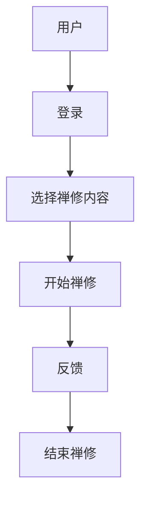

#### 安全与隐私保护

数字禅修空间在技术实现过程中，需要重视用户数据的安全和隐私保护。以下是一些关键点：

1. **数据加密**：对用户数据进行加密处理，确保数据安全。
2. **权限管理**：实行严格的权限管理，防止未经授权的数据访问。
3. **隐私政策**：明确告知用户，他们的数据将如何使用和保护。

**安全与隐私保护示例**

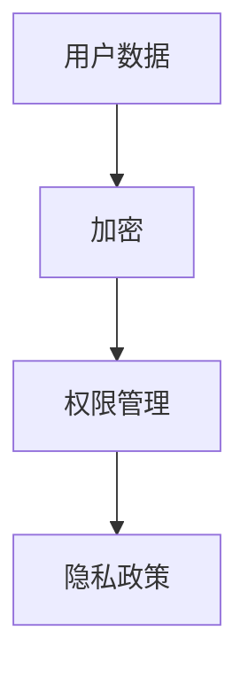

#### 总结

本章介绍了数字禅修空间的设计原则，包括用户需求分析、空间布局与装饰、技术支持与选型、用户交互设计以及安全与隐私保护。这些原则为构建一个有效的数字禅修空间提供了指导。

接下来，我们将探讨虚拟现实在禅修中的应用，进一步了解数字禅修空间的实现方式。

----------------------------------------------------------------

### 第3章：虚拟现实在禅修中的应用

#### 虚拟现实技术简介

虚拟现实（Virtual Reality，VR）是一种通过计算机技术创造出的模拟环境，使人们可以在其中进行互动和体验。VR技术通过三维建模、图像处理、传感器技术和人机交互等多种技术手段，为用户提供一个沉浸式的体验。

**核心概念与联系**

| VR技术 | 功能 | 联系 |
| :--: | :--: | :--: |
| 三维建模 | 创造虚拟环境 | 确保沉浸式体验 |
| 图像处理 | 处理视觉效果 | 提高视觉逼真度 |
| 传感器技术 | 检测用户动作 | 提供互动性 |
| 人机交互 | 与虚拟环境互动 | 增强用户体验 |

**ER实体关系图架构**

```mermaid
erDiagram
  VRTechnology ||--|{ 3DModeling } : 三维建模
  VRTechnology ||--|{ ImageProcessing } : 图像处理
  VRTechnology ||--|{ SensorTechnology } : 传感器技术
  VRTechnology ||--|{ HumanComputerInteraction } : 人机交互
```

#### 虚拟现实在禅修中的应用场景

虚拟现实技术在禅修中的应用非常广泛，以下是一些典型的应用场景：

1. **禅修训练**：通过虚拟现实技术，禅修者可以在一个虚拟的禅修环境中进行训练，例如，在山水之间、森林之中，或是在古老寺庙的殿堂中。
2. **禅修指导**：虚拟现实技术可以为禅修者提供实时的禅修指导，例如，通过语音或文字提示，帮助禅修者更好地掌握禅修技巧。
3. **禅修体验**：通过虚拟现实技术，禅修者可以体验到各种禅修场景，例如，极地的冰雪世界、热带的丛林探险等，从而拓宽禅修的视野。

**应用场景示例**

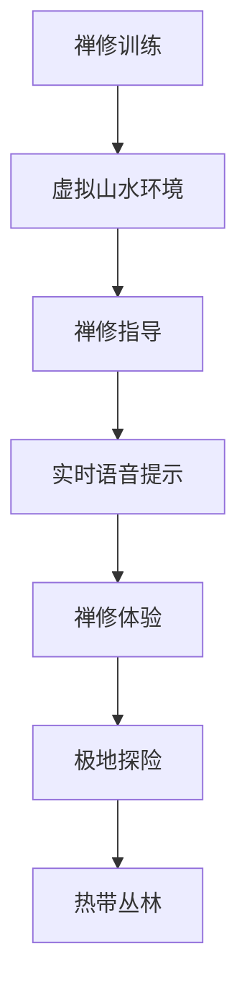

#### 虚拟现实设备的选型与配置

在构建数字禅修空间时，选择合适的虚拟现实设备至关重要。以下是一些常见的虚拟现实设备及其配置：

1. **VR头盔**：如Oculus Rift、HTC Vive等，这些设备提供高分辨率的显示效果，以及低延迟的交互体验。
2. **跟踪器**：用于跟踪用户的头部和手部动作，如Rokoko动作捕捉系统、PlayStationMove等。
3. **交互设备**：如手柄、手套等，用于与虚拟环境进行互动。

**设备选型与配置示例**

| 设备名称 | 功能 | 配置建议 |
| :--: | :--: | :--: |
| VR头盔 | 提供沉浸式体验 | 高分辨率、低延迟 |
| 跟踪器 | 跟踪用户动作 | 高精度、低功耗 |
| 交互设备 | 提供互动性 | 舒适、易操作 |

#### 用户体验优化

为了提高用户体验，数字禅修空间在设计和实施过程中，需要注重以下几个方面：

1. **环境设计**：虚拟环境的布局、色彩、音效等，都需要精心设计，以创造一个舒适、宁静的禅修氛围。
2. **交互设计**：交互界面应简单直观，操作流程应清晰易懂，以减少用户的操作难度。
3. **个性化服务**：通过分析用户数据，为用户提供个性化的禅修建议和体验。

**用户体验优化示例**

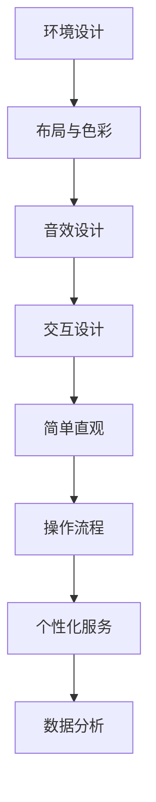

#### 总结

本章介绍了虚拟现实技术在禅修中的应用，包括技术简介、应用场景、设备选型与配置以及用户体验优化。这些内容为构建数字禅修空间提供了重要的技术支持和实践指导。

接下来，我们将探讨增强现实在禅修中的应用，进一步丰富数字禅修空间的实现方式。

----------------------------------------------------------------

### 第4章：增强现实与禅修的结合

#### 增强现实技术简介

增强现实（Augmented Reality，AR）是一种将虚拟信息与现实世界结合起来的技术。通过使用特殊的显示设备或手机等设备，用户可以看到增强过的现实世界，这些增强信息可以是文字、图像、视频等。

**核心概念与联系**

| AR技术 | 功能 | 联系 |
| :--: | :--: | :--: |
| 显示技术 | 提供增强信息 | 结合现实世界 |
| 感应技术 | 检测用户动作 | 提供互动性 |
| 互动技术 | 与增强信息互动 | 提高用户体验 |

**ER实体关系图架构**

```mermaid
erDiagram
  ARTechnology ||--|{ DisplayTechnology } : 显示技术
  ARTechnology ||--|{ SensingTechnology } : 感应技术
  ARTechnology ||--|{ InteractionTechnology } : 互动技术
```

#### 增强现实在禅修中的应用

增强现实技术在禅修中的应用同样非常广泛，以下是一些典型的应用场景：

1. **禅修指导**：通过增强现实技术，禅修者可以在现实环境中看到实时的禅修指导，例如，通过增强现实眼镜，禅修者可以看到呼吸指导或冥想提示。
2. **禅修辅助**：增强现实技术可以用于辅助禅修，例如，在禅修过程中，增强现实眼镜可以显示禅修者的心率、呼吸频率等数据，帮助禅修者更好地了解自己的身体状况。
3. **禅修环境**：增强现实技术可以创造出各种禅修环境，例如，在卧室中模拟出森林、湖泊等自然场景，为禅修者提供一个宁静的修行空间。

**应用场景示例**

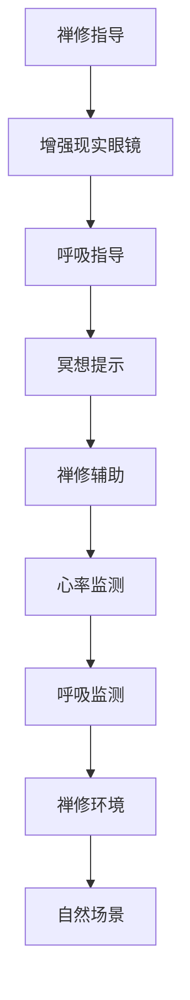

#### 增强现实设备的选型与配置

在构建数字禅修空间时，选择合适的增强现实设备同样至关重要。以下是一些常见的增强现实设备及其配置：

1. **增强现实眼镜**：如Google Glass、Microsoft HoloLens等，这些设备可以提供高质量的增强现实体验。
2. **智能手机**：通过使用特定的AR应用程序，如ARKit、ARCore等，智能手机可以成为增强现实设备。
3. **交互设备**：如手柄、手套等，用于与增强现实环境进行互动。

**设备选型与配置示例**

| 设备名称 | 功能 | 配置建议 |
| :--: | :--: | :--: |
| 增强现实眼镜 | 提供增强信息 | 高分辨率、低延迟 |
| 智能手机 | 提供增强信息 | 高性能处理器、支持AR技术 |
| 交互设备 | 提供互动性 | 舒适、易操作 |

#### 用户互动与体验

为了提高用户体验，数字禅修空间在设计和实施过程中，需要注重用户互动与体验。以下是一些关键点：

1. **交互设计**：增强现实交互界面应简单直观，操作流程应清晰易懂，以减少用户的操作难度。
2. **互动体验**：通过增强现实技术，禅修者可以与现实世界进行互动，提高参与感和体验感。
3. **个性化服务**：通过分析用户数据，为用户提供个性化的禅修建议和体验。

**用户互动与体验优化示例**

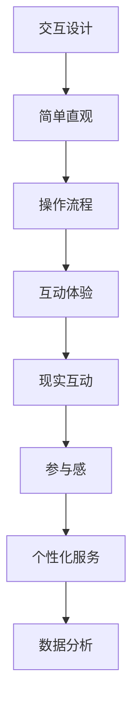

#### 总结

本章介绍了增强现实技术在禅修中的应用，包括技术简介、应用场景、设备选型与配置以及用户互动与体验。这些内容为构建数字禅修空间提供了重要的技术支持和实践指导。

接下来，我们将探讨数字禅修空间的技术实现，深入了解数字禅修空间如何通过具体技术手段来实现。

----------------------------------------------------------------

### 第5章：数字禅修空间的技术实现

#### 技术实现的总体框架

数字禅修空间的技术实现，通常包括以下几个关键组成部分：

1. **硬件设备**：包括虚拟现实头盔、增强现实眼镜、交互设备等，用于提供沉浸式和增强现实体验。
2. **软件系统**：包括虚拟现实和增强现实应用程序、用户界面、数据处理和存储等，用于管理和实现禅修功能。
3. **网络连接**：用于实现设备间的数据传输和通信，确保用户能够在不同地点访问和参与禅修活动。
4. **用户数据管理**：用于收集、存储和分析用户数据，为用户提供个性化服务和体验优化。

**技术实现总体框架示例**

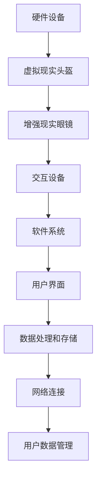

#### 数据收集与处理

在数字禅修空间中，数据收集与处理是技术实现的重要环节。以下是一些关键步骤：

1. **用户数据收集**：包括用户基本信息、禅修记录、互动行为等，用于分析和优化用户体验。
2. **数据存储**：使用数据库技术，如MySQL、MongoDB等，存储用户数据，确保数据的持久性和安全性。
3. **数据分析**：利用数据挖掘和机器学习技术，分析用户数据，为用户提供个性化的禅修建议和体验。

**数据收集与处理示例**

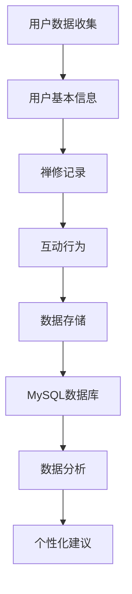

#### 交互界面设计

交互界面设计是数字禅修空间用户体验的关键。以下是一些关键点：

1. **用户友好的界面**：界面设计应简洁明了，易于操作，减少用户的认知负担。
2. **反馈机制**：及时提供用户操作的反馈，帮助用户更好地理解禅修过程。
3. **个性化定制**：根据用户数据，为用户提供个性化的界面和功能。

**交互界面设计示例**

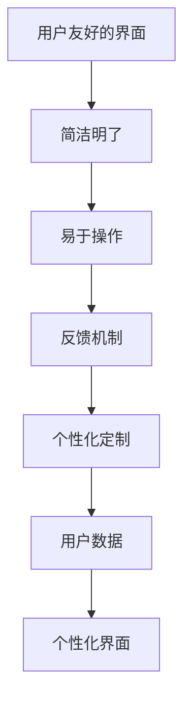

#### 安全与隐私保护

在数字禅修空间中，安全与隐私保护至关重要。以下是一些关键措施：

1. **数据加密**：使用加密技术，如SSL/TLS等，保护用户数据在传输过程中的安全性。
2. **权限管理**：实施严格的权限管理，确保只有授权人员能够访问敏感数据。
3. **隐私政策**：明确告知用户，他们的数据如何被收集、存储和使用。

**安全与隐私保护示例**

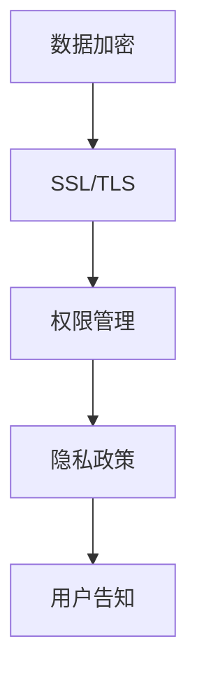

#### 总结

本章介绍了数字禅修空间的技术实现，包括总体框架、数据收集与处理、交互界面设计以及安全与隐私保护。这些技术实现为数字禅修空间的构建提供了坚实的基础。

接下来，我们将通过一个具体的案例分析，探讨成功数字禅修空间的运营经验。

----------------------------------------------------------------

### 第6章：案例分析：成功数字禅修空间的运营

#### 案例介绍

为了更好地了解数字禅修空间的运营实践，我们选择了一家位于美国硅谷的数字禅修空间——"Mindful Space"作为案例。Mindful Space 成立于2018年，是一家将虚拟现实和增强现实技术应用于禅修的体验中心。以下是对Mindful Space运营的详细介绍。

#### 运营模式与策略

1. **会员制度**：Mindful Space采用会员制，会员可以享受免费的禅修课程、私人禅修指导和定制化的禅修计划。
2. **线上与线下结合**：Mindful Space提供线上和线下两种禅修体验，线上课程主要通过网络直播进行，线下课程则在体验中心内进行。
3. **多元化课程**：Mindful Space提供多样化的禅修课程，包括正念冥想、呼吸练习、禅修瑜伽等，以满足不同用户的需求。
4. **个性化服务**：Mindful Space通过数据分析，为用户提供个性化的禅修建议和体验。

#### 成功要素分析

1. **技术创新**：Mindful Space率先引入了虚拟现实和增强现实技术，为禅修者提供沉浸式和增强现实的禅修体验，这吸引了大量用户。
2. **用户体验**：Mindful Space注重用户体验，通过简洁明了的界面设计、实时反馈机制和个性化服务，提高了用户的满意度和参与度。
3. **社群建设**：Mindful Space积极建设社群，通过线上论坛、线下聚会等方式，增强用户之间的互动和联系，形成了良好的社群氛围。
4. **品牌营销**：Mindful Space通过社交媒体和线上广告，提高了品牌知名度，吸引了更多用户。

#### 挑战与应对

1. **技术更新**：随着技术的快速发展，Mindful Space面临技术更新和维护的挑战。为应对这一挑战，Mindful Space建立了技术团队，定期更新和优化设备和技术。
2. **隐私保护**：数字禅修空间涉及用户数据的收集和使用，隐私保护成为重要挑战。Mindful Space通过数据加密、权限管理和隐私政策等措施，确保用户数据的安全。
3. **市场定位**：数字禅修空间的目标用户群体相对较小，如何扩大市场成为挑战。Mindful Space通过多元化的课程和个性化的服务，吸引了不同类型的用户。

#### 总结

通过Mindful Space的案例分析，我们可以看到，成功的数字禅修空间需要技术创新、用户体验、社群建设和品牌营销等多方面的支持。同时，面对技术更新、隐私保护和市场定位等挑战，需要采取有效的应对措施。

接下来，我们将探讨数字禅修空间的发展趋势与挑战，为未来的数字禅修空间提供发展方向。

----------------------------------------------------------------

### 第7章：数字禅修空间的发展趋势与挑战

#### 发展趋势

1. **技术进步**：随着虚拟现实、增强现实、人工智能等技术的不断发展，数字禅修空间将提供更加沉浸式、个性化、智能化的禅修体验。
2. **市场扩大**：随着人们对心理健康和心灵成长的关注不断提高，数字禅修空间的市场需求将逐渐扩大，吸引更多用户。
3. **跨界合作**：数字禅修空间将与医疗、教育、旅游等行业进行跨界合作，为用户提供更多元化的禅修体验和解决方案。
4. **国际化发展**：数字禅修空间将跨越地域限制，走向国际化，为全球用户提供服务。

#### 挑战

1. **技术瓶颈**：尽管虚拟现实、增强现实等技术取得了显著进展，但仍面临性能、稳定性、成本等方面的挑战，这些瓶颈可能限制数字禅修空间的进一步发展。
2. **隐私保护**：数字禅修空间涉及用户数据的收集和使用，隐私保护成为关键挑战。如何确保用户数据的安全和隐私，是数字禅修空间需要解决的难题。
3. **用户接受度**：数字禅修空间作为一种新兴的禅修方式，用户接受度可能存在一定的差异。如何提高用户的接受度和参与度，是数字禅修空间需要关注的重点。
4. **监管法规**：随着数字禅修空间的普及，相关的监管法规也将逐渐完善。如何遵守监管法规，确保合法合规运营，是数字禅修空间需要面对的挑战。

#### 应对策略

1. **技术创新**：持续投入研发，提高技术性能和稳定性，降低成本，为数字禅修空间的发展提供技术支持。
2. **隐私保护**：加强用户数据的安全和隐私保护，采用先进的数据加密、权限管理技术，建立健全的隐私保护体系。
3. **用户研究**：通过用户调研、反馈机制等方式，了解用户需求，优化禅修体验，提高用户满意度。
4. **法规遵守**：密切关注相关法律法规的动态，及时调整运营策略，确保合法合规运营。

#### 总结

数字禅修空间的发展趋势表明，科技与灵性的结合将为禅修带来新的机遇。然而，也面临着技术瓶颈、隐私保护、用户接受度等挑战。通过技术创新、隐私保护、用户研究和法规遵守等策略，数字禅修空间有望克服这些挑战，实现可持续发展。

## 结束语

数字禅修空间作为科技与灵性结合的产物，为禅修者提供了一种全新的修行方式。本文从背景介绍、核心概念、设计原则、技术应用等多个角度，详细探讨了数字禅修空间的概念和发展现状。通过案例分析，我们看到了数字禅修空间在运营中的成功经验，也意识到面临的挑战。

未来，随着技术的进步和市场需求的扩大，数字禅修空间有望进一步发展。我们期待看到更多创新的应用和解决方案，为禅修者提供更高质量、更个性化的禅修体验。

### 最佳实践 tips

- **定期更新设备**：保持虚拟现实和增强现实设备的更新，确保用户能够获得最佳体验。
- **重视用户隐私**：严格遵守隐私保护法规，保护用户数据安全。
- **提供个性化服务**：通过用户数据分析，为用户提供个性化的禅修建议和体验。
- **加强用户互动**：通过线上社群、线下聚会等方式，增强用户之间的互动和联系。

### 小结

数字禅修空间是科技与灵性结合的产物，为禅修者提供了一种全新的修行方式。通过本文的探讨，我们了解了数字禅修空间的设计原则、技术应用以及成功案例，也为未来的发展提供了方向。

### 注意事项

- 在使用数字禅修空间时，注意保持良好的姿势和呼吸，避免长时间过度劳累。
- 根据个人情况，选择适合自己的禅修方式和设备。
- 遵守数字禅修空间的规则和指导，确保安全使用。

### 拓展阅读

- 《虚拟现实技术与应用》
- 《增强现实技术：从概念到应用》
- 《禅修：心灵的探索与实践》
- 《数字禅修空间：科技与灵性结合的新探索》

---

### 作者信息

作者：AI天才研究院/AI Genius Institute & 禅与计算机程序设计艺术 /Zen And The Art of Computer Programming

感谢您的阅读，希望本文对您了解数字禅修空间有所帮助。在未来的数字禅修之旅中，愿您找到内心的宁静与智慧。🧘♂️💡🌌

