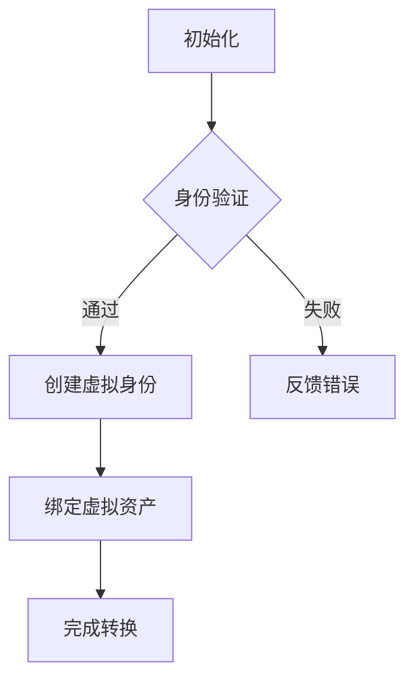
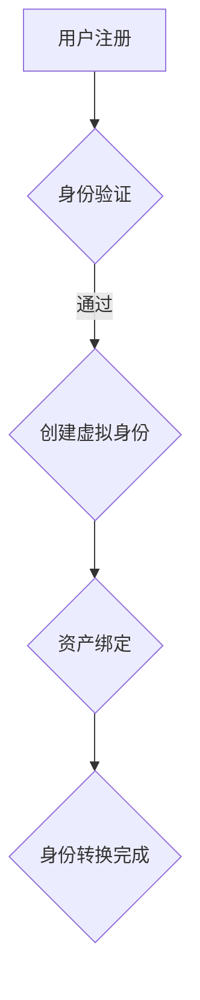

                 

# 数字移民指南：虚拟世界中的身份转换

## 关键词

- 数字移民
- 虚拟世界
- 身份转换
- 区块链
- 虚拟现实

## 摘要

随着虚拟世界的迅速崛起，数字移民现象日益显著。本文旨在探讨虚拟世界中身份转换的必要性与技术实现，为数字移民提供实用的指南。我们将从数字移民的定义与背景出发，逐步深入探讨虚拟世界中的核心概念、算法原理、系统架构设计以及项目实战，最后总结最佳实践与拓展阅读，帮助读者顺利实现虚拟世界中的身份转换。

## 第一部分：数字移民与虚拟世界

### 第1章：数字移民的概念与背景

#### 1.1 数字移民的定义与特征

**数字移民**指的是从传统的物理世界迁移到虚拟世界的个人或集体。这种迁移不仅仅局限于生活方式的改变，更涉及到社会角色、身份认同以及价值体系的转变。

**数字移民的特征**包括：

- **虚拟化**：在虚拟世界中，个人的身份可以通过虚拟角色来表现，这种虚拟化使得人们可以脱离现实中的身份限制，自由地探索和体验。
- **自由性**：虚拟世界提供了一个开放、自由的环境，数字移民可以自由选择自己的生活方式、社交圈子和职业角色。
- **互动性**：虚拟世界中的互动更加便捷、高效，人们可以通过各种虚拟设备实时沟通、合作和竞争。

#### 1.1.1 数字移民的产生背景

数字移民的产生背景可以追溯到互联网和虚拟技术的快速发展。随着计算机技术的进步和互联网的普及，人们逐渐意识到虚拟世界作为一种全新的生存方式，具有巨大的潜力和吸引力。

#### 1.1.2 数字移民与传统移民的区别

**传统移民**通常是指从原居地搬迁到其他地区居住、生活，涉及到地理空间的改变。而**数字移民**则是一种虚拟空间的迁移，不涉及实际的地理位置变动。

- **地理位置**：传统移民涉及实际地理位置的改变，而数字移民则在虚拟世界中发生。
- **生活方式**：传统移民会面临全新的生活环境和文化冲击，数字移民则可以在虚拟世界中保留原有的生活方式。
- **社会关系**：传统移民需要重新建立社会关系网，数字移民则可以借助虚拟社区和网络平台维持原有关系。

#### 1.1.3 数字移民的全球化影响

数字移民的全球化影响体现在多个方面：

- **文化融合**：虚拟世界为不同文化背景的人们提供了交流的平台，促进了文化的融合与理解。
- **经济活动**：虚拟世界中的数字经济活动日益繁荣，为全球经济发展提供了新的动力。
- **社会结构**：虚拟世界的崛起改变了传统的社会结构，虚拟身份逐渐成为人们社会地位和身份认同的重要标志。

### 1.2 虚拟世界的崛起

**虚拟世界**是指通过计算机技术和虚拟现实技术构建的模拟现实环境，为用户提供沉浸式体验。虚拟世界的类型包括：

- **虚拟现实（VR）**：通过头戴式显示器和传感设备，用户完全沉浸在虚拟环境中。
- **增强现实（AR）**：在现实世界中叠加虚拟元素，提供增强现实体验。

#### 1.2.1 虚拟世界的定义与类型

**虚拟现实（VR）**是一种通过计算机生成三维环境，使用户能够沉浸其中的技术。虚拟现实技术的核心在于为用户提供身临其境的体验。

**增强现实（AR）**则是将虚拟元素叠加到现实世界中，用户可以通过手机或智能眼镜等设备看到这些虚拟元素。增强现实技术主要应用于教育和娱乐等领域。

#### 1.2.2 虚拟世界的发展历程

虚拟世界的发展历程可以分为以下几个阶段：

- **初期探索**：计算机图形学和虚拟现实技术的初步尝试。
- **成熟应用**：随着硬件和软件技术的进步，虚拟现实和增强现实技术逐渐成熟，开始应用于各个领域。
- **广泛应用**：虚拟现实和增强现实技术已经成为现代社会的重要组成部分，影响着人们的生活、工作和娱乐。

#### 1.2.3 虚拟世界对数字移民的影响

虚拟世界对数字移民的影响主要表现在以下几个方面：

- **生活方式**：虚拟世界为数字移民提供了全新的生活方式，使得他们可以在虚拟环境中满足各种需求。
- **社交互动**：虚拟世界为数字移民提供了丰富的社交互动机会，他们可以与全球各地的朋友和同事进行交流和合作。
- **职业发展**：虚拟世界中的职业机会越来越多，数字移民可以在虚拟环境中找到适合自己的工作。

### 1.3 虚拟世界中的身份转换

在虚拟世界中，身份转换是指用户将自己的现实身份转换为虚拟身份的过程。这种转换具有以下几个方面的意义：

- **隐私保护**：通过虚拟身份，用户可以在虚拟世界中保护自己的隐私。
- **角色扮演**：虚拟身份使得用户可以扮演不同的角色，满足不同角色的需求。
- **社交互动**：虚拟身份为用户提供了更多的社交互动机会，他们可以与全球各地的用户建立联系。

#### 1.3.1 身份转换的必要性与挑战

**必要性**：

- **隐私保护**：在虚拟世界中，用户的隐私更容易受到保护，虚拟身份可以屏蔽现实身份的个人信息。
- **角色扮演**：虚拟身份使得用户可以在虚拟世界中体验不同的角色，满足多样化的需求。
- **社交互动**：虚拟身份为用户提供了更多的社交互动机会，他们可以与全球各地的用户建立联系。

**挑战**：

- **身份认证**：如何确保虚拟身份的真实性和合法性，是一个亟待解决的问题。
- **隐私保护**：在虚拟世界中，用户的隐私保护需要更加严密，以防止信息泄露。
- **法律法规**：虚拟世界中的身份转换涉及到法律法规的适用问题，需要制定相应的法规来规范。

#### 1.3.2 身份转换的过程与机制

身份转换的过程通常包括以下几个步骤：

- **注册账号**：用户在虚拟世界中创建账号，并设置虚拟身份。
- **身份验证**：用户通过身份验证，确保虚拟身份的真实性。
- **角色选择**：用户在虚拟世界中选择适合自己的角色，并设定角色的属性。
- **社交互动**：用户与其他虚拟角色进行社交互动，建立联系。

#### 1.3.3 身份转换的技术支持

身份转换的技术支持主要包括以下几个方面：

- **加密技术**：使用加密技术保护用户的隐私信息，确保身份认证的安全性。
- **区块链技术**：区块链技术可以确保虚拟身份的唯一性和不可篡改性。
- **虚拟现实技术**：虚拟现实技术为用户提供了沉浸式的身份转换体验。

## 第二部分：虚拟世界中的核心概念与联系

### 第2章：虚拟世界中的核心概念与联系

在虚拟世界中，核心概念与联系是理解和应用虚拟技术的基础。以下将介绍几个关键概念，并探讨它们之间的联系。

#### 2.1 虚拟现实与增强现实

**虚拟现实（VR）**是一种通过计算机生成三维环境，使用户能够沉浸其中的技术。它主要应用于游戏、娱乐、教育和模拟训练等领域。

**增强现实（AR）**则是将虚拟元素叠加到现实世界中，用户可以通过手机或智能眼镜等设备看到这些虚拟元素。它广泛应用于教育、医疗、广告和军事等领域。

#### 2.2 区块链与数字身份

**区块链**是一种分布式数据库技术，具有去中心化、不可篡改和透明性等特点。它为虚拟世界中的身份认证和交易提供了安全可靠的基础。

**数字身份**是指用户在虚拟世界中的唯一标识，它通过区块链技术实现，具有不可篡改性和唯一性。

#### 2.3 虚拟经济与数字货币

**虚拟经济**是指在虚拟世界中进行的各种经济活动，如虚拟物品的交易、虚拟服务的提供等。

**数字货币**是指在虚拟世界中流通的货币，如比特币、以太坊等。数字货币具有去中介化、去中心化和匿名性等特点，为虚拟经济提供了便捷的支付手段。

### 2.1 虚拟世界中的核心概念

#### 2.1.1 虚拟现实与增强现实

**虚拟现实（VR）**：

- **定义**：虚拟现实是一种通过计算机技术生成三维环境，使用户能够沉浸其中的技术。
- **特征**：沉浸感、输出感、实时性。
- **应用领域**：游戏、娱乐、教育、医疗、模拟训练等。

**增强现实（AR）**：

- **定义**：增强现实是一种将虚拟元素叠加到现实世界中，用户可以通过设备看到这些虚拟元素的技术。
- **特征**：交互性、输出感、实时性。
- **应用领域**：教育、医疗、广告、军事等。

### 2.2 概念属性特征对比表格

| 概念       | 特征1 | 特征2 | 特征3 |
|------------|-------|-------|-------|
| 虚拟现实   | 沉浸感 | 输出感 | 实时性 |
| 增强现实   | 交互性 | 输出感 | 实时性 |
| 区块链     | 去中心化 | 不可篡改 | 可追溯 |
| 数字货币   | 价值转移 | 去中介化 | 安全性 |

### 2.3 ER实体关系图

```mermaid
erDiagram
    User ||--|{ Avatar }|
    User ||--|{ Virtual Asset }|
    Virtual Asset ||--|{ Transaction }|
```

在上面的ER图中，User代表用户，Avatar代表虚拟角色，Virtual Asset代表虚拟资产，Transaction代表交易。这种关系图展示了用户、虚拟角色和虚拟资产之间的关联。

## 第二部分：虚拟世界中的核心概念与联系

### 第2章：虚拟世界中的核心概念与联系

在虚拟世界中，核心概念与联系是理解和应用虚拟技术的基础。以下将介绍几个关键概念，并探讨它们之间的联系。

#### 2.1 虚拟现实与增强现实

**虚拟现实（VR）**：

- **定义**：虚拟现实是一种通过计算机技术生成三维环境，使用户能够沉浸其中的技术。
- **特征**：沉浸感、输出感、实时性。
- **应用领域**：游戏、娱乐、教育、医疗、模拟训练等。

**增强现实（AR）**：

- **定义**：增强现实是一种将虚拟元素叠加到现实世界中，用户可以通过设备看到这些虚拟元素的技术。
- **特征**：交互性、输出感、实时性。
- **应用领域**：教育、医疗、广告、军事等。

#### 2.2 区块链与数字身份

**区块链**：

- **定义**：区块链是一种分布式数据库技术，具有去中心化、不可篡改和透明性等特点。
- **特征**：去中心化、不可篡改、可追溯。
- **应用领域**：金融、供应链、身份认证等。

**数字身份**：

- **定义**：数字身份是指用户在虚拟世界中的唯一标识，它通过区块链技术实现，具有不可篡改性和唯一性。
- **特征**：唯一性、不可篡改性、隐私保护。

#### 2.3 虚拟经济与数字货币

**虚拟经济**：

- **定义**：虚拟经济是指在虚拟世界中进行的各种经济活动，如虚拟物品的交易、虚拟服务的提供等。
- **特征**：去中介化、去中心化、高度数字化。
- **应用领域**：游戏、社交、电子商务等。

**数字货币**：

- **定义**：数字货币是指在虚拟世界中流通的货币，如比特币、以太坊等。
- **特征**：去中介化、去中心化、匿名性。
- **应用领域**：支付、投资、交易等。

### 2.1 虚拟世界中的核心概念

#### 2.1.1 虚拟现实与增强现实

**虚拟现实（VR）**：

- **定义**：虚拟现实是一种通过计算机技术生成三维环境，使用户能够沉浸其中的技术。
- **特征**：沉浸感、输出感、实时性。
- **应用领域**：游戏、娱乐、教育、医疗、模拟训练等。

**增强现实（AR）**：

- **定义**：增强现实是一种将虚拟元素叠加到现实世界中，用户可以通过设备看到这些虚拟元素的技术。
- **特征**：交互性、输出感、实时性。
- **应用领域**：教育、医疗、广告、军事等。

#### 2.2 概念属性特征对比表格

| 概念       | 特征1       | 特征2       | 特征3       |
|------------|-------------|-------------|-------------|
| 虚拟现实   | 沉浸感       | 输出感       | 实时性       |
| 增强现实   | 交互性       | 输出感       | 实时性       |
| 区块链     | 去中心化     | 不可篡改     | 可追溯       |
| 数字货币   | 价值转移     | 去中介化     | 安全性       |

#### 2.3 ER实体关系图

```mermaid
erDiagram
    User ||--|{ Avatar }|
    User ||--|{ Virtual Asset }|
    Virtual Asset ||--|{ Transaction }|
```

在上面的ER图中，User代表用户，Avatar代表虚拟角色，Virtual Asset代表虚拟资产，Transaction代表交易。这种关系图展示了用户、虚拟角色和虚拟资产之间的关联。

## 虚拟世界中的核心概念与联系

### 2.1 虚拟现实与增强现实

#### 2.1.1 虚拟现实（VR）

**定义**：虚拟现实是一种通过计算机技术生成三维环境，使用户能够沉浸其中的技术。

**特征**：

- **沉浸感**：用户在虚拟环境中感受到的高度真实感和参与感。
- **输出感**：虚拟环境中的视觉、听觉、触觉等感官反馈。
- **实时性**：虚拟环境能够实时响应用户的动作和交互。

**应用领域**：

- **游戏**：提供高度沉浸式的游戏体验。
- **娱乐**：虚拟演唱会、电影、主题公园等。
- **教育**：虚拟实验室、模拟教学等。
- **医疗**：虚拟手术训练、心理治疗等。
- **模拟训练**：飞行模拟、军事训练等。

#### 2.1.2 增强现实（AR）

**定义**：增强现实是一种将虚拟元素叠加到现实世界中，用户可以通过设备看到这些虚拟元素的技术。

**特征**：

- **交互性**：用户可以直接与现实世界中的虚拟元素进行交互。
- **输出感**：虚拟元素在现实世界中的视觉、听觉等感官反馈。
- **实时性**：虚拟元素能够实时出现在用户的视野中。

**应用领域**：

- **教育**：增强现实教材、互动教学等。
- **医疗**：手术指导、医学图像增强等。
- **广告**：增强现实广告牌、互动广告等。
- **军事**：战场模拟、战术规划等。
- **维修**：远程设备维修、故障诊断等。

### 2.2 区块链与数字身份

#### 2.2.1 区块链

**定义**：区块链是一种分布式数据库技术，具有去中心化、不可篡改和透明性等特点。

**特征**：

- **去中心化**：数据存储在多个节点上，无需中央机构控制。
- **不可篡改**：一旦数据被记录在区块链上，就无法被篡改。
- **透明性**：区块链上的所有数据都是公开透明的。

**应用领域**：

- **金融**：加密货币、智能合约等。
- **供应链**：追踪商品来源、确保供应链透明。
- **身份认证**：建立去中心化的身份认证系统。
- **版权保护**：确权、追踪版权信息等。

#### 2.2.2 数字身份

**定义**：数字身份是指用户在虚拟世界中的唯一标识，它通过区块链技术实现，具有不可篡改性和唯一性。

**特征**：

- **唯一性**：每个用户都有一个独特的数字身份。
- **不可篡改性**：数字身份一旦建立，就无法被篡改。
- **隐私保护**：用户可以选择公开或隐藏部分个人信息。

**应用领域**：

- **虚拟世界**：建立用户在虚拟世界中的身份。
- **社交网络**：确保用户身份的真实性。
- **在线交易**：提供安全的身份认证。
- **身份验证**：用于各种在线服务和应用。

### 2.3 虚拟经济与数字货币

#### 2.3.1 虚拟经济

**定义**：虚拟经济是指在虚拟世界中进行的各种经济活动，如虚拟物品的交易、虚拟服务的提供等。

**特征**：

- **去中介化**：通过去中心化的平台进行交易，减少中介成本。
- **去中心化**：虚拟经济活动不受中央机构控制。
- **高度数字化**：交易和支付过程高度数字化，便捷高效。

**应用领域**：

- **游戏**：虚拟商品交易、虚拟货币支付等。
- **社交网络**：虚拟礼物、虚拟货币支付等。
- **电子商务**：虚拟商品交易、数字货币支付等。
- **在线教育**：虚拟课程、虚拟货币支付等。

#### 2.3.2 数字货币

**定义**：数字货币是指在虚拟世界中流通的货币，如比特币、以太坊等。

**特征**：

- **去中介化**：数字货币交易无需通过传统金融机构。
- **去中心化**：数字货币网络由多个节点共同维护。
- **匿名性**：数字货币交易可以保持匿名，但需注意隐私保护。

**应用领域**：

- **支付**：在线支付、跨境支付等。
- **投资**：数字货币投资、加密资产交易等。
- **捐赠**：慈善捐赠、数字货币捐赠等。
- **日常消费**：数字货币用于日常购物、消费等。

## 第二部分：虚拟世界中的核心概念与联系

### 第2章：虚拟世界中的核心概念与联系

#### 2.1 虚拟现实与增强现实

**虚拟现实（VR）**：

- **定义**：虚拟现实是一种通过计算机技术生成三维环境，使用户能够沉浸其中的技术。
- **特征**：沉浸感、输出感、实时性。
- **应用领域**：游戏、娱乐、教育、医疗、模拟训练等。

**增强现实（AR）**：

- **定义**：增强现实是一种将虚拟元素叠加到现实世界中，用户可以通过设备看到这些虚拟元素的技术。
- **特征**：交互性、输出感、实时性。
- **应用领域**：教育、医疗、广告、军事等。

#### 2.2 区块链与数字身份

**区块链**：

- **定义**：区块链是一种分布式数据库技术，具有去中心化、不可篡改和透明性等特点。
- **特征**：去中心化、不可篡改、可追溯。
- **应用领域**：金融、供应链、身份认证等。

**数字身份**：

- **定义**：数字身份是指用户在虚拟世界中的唯一标识，它通过区块链技术实现，具有不可篡改性和唯一性。
- **特征**：唯一性、不可篡改性、隐私保护。
- **应用领域**：虚拟世界、社交网络、在线交易等。

#### 2.3 虚拟经济与数字货币

**虚拟经济**：

- **定义**：虚拟经济是指在虚拟世界中进行的各种经济活动，如虚拟物品的交易、虚拟服务的提供等。
- **特征**：去中介化、去中心化、高度数字化。
- **应用领域**：游戏、社交网络、电子商务、在线教育等。

**数字货币**：

- **定义**：数字货币是指在虚拟世界中流通的货币，如比特币、以太坊等。
- **特征**：去中介化、去中心化、匿名性。
- **应用领域**：支付、投资、捐赠、日常消费等。

## 虚拟现实与增强现实的概念对比

### 2.1.1 虚拟现实（VR）

**虚拟现实**（VR）是一种通过计算机技术创造出的三维模拟环境，用户通过特定的设备如头戴式显示器（HMD）和传感设备进入这个环境，与之进行互动。以下是虚拟现实的关键特点：

- **沉浸感**：用户感觉自己置身于一个三维的虚拟环境中，可以体验视觉、听觉、触觉等多种感官效果。
- **输出感**：虚拟环境对用户的动作和输入做出实时反应，增强了用户的互动体验。
- **实时性**：虚拟环境能够实时地响应用户的输入，提供流畅的用户体验。

虚拟现实的主要应用领域包括：

- **游戏**：提供高度沉浸式的游戏体验，用户可以在虚拟世界中探险、战斗等。
- **娱乐**：虚拟现实电影、音乐会、主题公园等，为用户提供全新的娱乐方式。
- **教育**：虚拟实验室、模拟教学，帮助学生更好地理解和掌握知识。
- **医疗**：虚拟手术训练、心理治疗，医生和患者可以在虚拟环境中进行模拟操作和治疗。
- **模拟训练**：飞行模拟、军事训练等，提供安全、经济的训练环境。

### 2.1.2 增强现实（AR）

**增强现实**（AR）是一种将虚拟元素叠加到现实世界中的技术，用户通过智能手机、平板电脑或增强现实眼镜等设备可以看到这些虚拟元素。以下是增强现实的关键特点：

- **交互性**：用户可以直接与现实世界中的虚拟元素进行交互，例如触摸、拖动等。
- **输出感**：虚拟元素在现实世界中有视觉和听觉等感官反馈，增强用户的体验。
- **实时性**：虚拟元素能够实时出现在用户的视野中，与用户的环境保持一致。

增强现实的主要应用领域包括：

- **教育**：增强现实教材、互动教学，使学生更好地参与学习过程。
- **医疗**：手术指导、医学图像增强，帮助医生更准确地诊断和治疗。
- **广告**：增强现实广告牌、互动广告，吸引消费者的注意力。
- **军事**：战场模拟、战术规划，为军事人员提供实战训练环境。
- **维修**：远程设备维修、故障诊断，使维修人员能够更便捷地解决问题。

### 2.1.3 概念对比

虚拟现实和增强现实虽然都是基于计算机技术和虚拟技术，但它们在技术实现和应用场景上存在显著差异：

- **沉浸感**：虚拟现实提供了高度沉浸感，用户完全置身于虚拟环境中；而增强现实则将虚拟元素叠加到现实世界中，用户依然处于现实环境中。
- **输出感**：虚拟现实对用户的动作和输入做出实时反应，增强用户的互动体验；增强现实则将虚拟元素与现实世界相结合，提供视觉和听觉等感官反馈。
- **实时性**：虚拟现实能够实时地响应用户的输入，提供流畅的用户体验；增强现实则能够实时地显示虚拟元素，与用户的环境保持一致。

在应用场景上，虚拟现实更适用于需要高度沉浸体验的领域，如游戏、娱乐和医疗；而增强现实则更适用于将虚拟元素与现实世界结合的领域，如教育、广告和军事。

通过对比虚拟现实和增强现实的概念和应用，我们可以更好地理解这两种技术在不同场景下的优势和局限性，为数字移民在虚拟世界中的身份转换提供指导。

## 区块链与数字身份的关系分析

### 2.2.1 区块链

**定义**：区块链是一种分布式数据库技术，通过去中心化的方式记录数据，具有不可篡改、透明性和安全性等特点。区块链技术通过将数据分散存储在多个节点上，防止单点故障和数据篡改，从而提高系统的可靠性和安全性。

**特征**：

- **去中心化**：区块链不依赖于中央机构，数据由多个节点共同维护，提高了系统的去中心化和抗攻击能力。
- **不可篡改**：一旦数据被记录在区块链上，就无法被篡改，确保了数据的真实性和完整性。
- **透明性**：区块链上的所有数据都是公开透明的，用户可以随时查看和验证数据。

**应用领域**：

- **金融**：加密货币、智能合约等，提高了交易的安全性和效率。
- **供应链**：追踪商品来源、确保供应链透明，提高了供应链的可靠性和效率。
- **身份认证**：建立去中心化的身份认证系统，提高了身份认证的安全性和隐私保护。
- **版权保护**：确权、追踪版权信息等，提高了版权保护的效果。

### 2.2.2 数字身份

**定义**：数字身份是指用户在虚拟世界中的唯一标识，通过区块链技术实现，具有不可篡改性和唯一性。数字身份不仅包括用户的个人信息，还涵盖了用户的虚拟资产、行为记录等，为用户在虚拟世界中的身份认证和行为验证提供了基础。

**特征**：

- **唯一性**：每个用户都有一个独特的数字身份，确保了用户身份的唯一性和不可重复性。
- **不可篡改性**：数字身份一旦生成，就无法被篡改，确保了用户身份的稳定性和可靠性。
- **隐私保护**：用户可以选择公开或隐藏部分个人信息，保护个人隐私。

**应用领域**：

- **虚拟世界**：建立用户在虚拟世界中的身份，实现虚拟角色之间的互动和交流。
- **社交网络**：确保用户身份的真实性，提高社交平台的可信度和安全性。
- **在线交易**：提供安全的身份认证，确保交易的安全性和可靠性。
- **身份验证**：用于各种在线服务和应用，提高身份验证的效率和准确性。

### 2.2.3 区块链与数字身份的关系

区块链与数字身份之间存在着密切的联系，两者共同构建了虚拟世界中的身份认证系统。

- **基础支撑**：区块链技术为数字身份提供了基础支撑。通过区块链的分布式数据库和去中心化特性，确保了数字身份的唯一性和不可篡改性。
- **隐私保护**：区块链技术为数字身份提供了隐私保护。用户可以选择公开或隐藏部分个人信息，通过加密技术保护个人隐私。
- **身份认证**：区块链技术为数字身份提供了身份认证功能。通过区块链上的数字签名和加密算法，实现用户身份的验证，确保交易和交互的安全性和可靠性。
- **价值转移**：区块链技术为数字身份提供了价值转移功能。通过区块链上的智能合约，实现虚拟资产的所有权和交易，确保虚拟经济活动的合法性和安全性。

总之，区块链与数字身份之间的关系是相互促进、相辅相成的。区块链技术为数字身份提供了安全、可靠的基础，而数字身份则为区块链提供了实际的应用场景和商业价值。在虚拟世界中，区块链与数字身份的结合，为数字移民的身份转换提供了强有力的支持。

### 2.3 虚拟经济与数字货币的关系

#### 2.3.1 虚拟经济

**定义**：虚拟经济是指在虚拟世界中进行的各种经济活动，包括虚拟物品的交易、虚拟服务的提供等。虚拟经济依托于虚拟世界的技术平台，以数字货币为交易媒介，为用户提供多样化的经济体验。

**特征**：

- **去中介化**：虚拟经济通过去中心化的平台进行交易，减少了中介成本，提高了交易的效率和透明度。
- **去中心化**：虚拟经济不依赖于中央机构，所有交易和信息都在去中心化的网络中完成，增强了系统的可靠性和抗攻击能力。
- **高度数字化**：虚拟经济活动高度数字化，交易过程便捷高效，用户可以随时随地参与经济活动。

**应用领域**：

- **游戏**：虚拟商品交易、虚拟货币支付等，为用户提供丰富的游戏体验。
- **社交网络**：虚拟礼物、虚拟货币支付等，增强用户之间的互动和社交体验。
- **电子商务**：虚拟商品交易、数字货币支付等，为用户提供便捷的购物体验。
- **在线教育**：虚拟课程、虚拟货币支付等，为学生提供灵活的学习方式。

#### 2.3.2 数字货币

**定义**：数字货币是指在虚拟世界中流通的货币，如比特币、以太坊等。数字货币通过区块链技术实现，具有去中心化、匿名性和安全性等特点。

**特征**：

- **去中介化**：数字货币交易无需通过传统金融机构，降低了交易成本，提高了交易效率。
- **去中心化**：数字货币网络由多个节点共同维护，不依赖于中央机构，提高了系统的可靠性和抗攻击能力。
- **匿名性**：数字货币交易可以保持匿名，但需注意隐私保护，确保交易的安全性和合法性。
- **安全性**：数字货币通过区块链技术实现，交易记录不可篡改，确保了交易的安全性和可靠性。

**应用领域**：

- **支付**：在线支付、跨境支付等，为用户提供便捷的支付方式。
- **投资**：数字货币投资、加密资产交易等，为投资者提供新的投资渠道。
- **捐赠**：慈善捐赠、数字货币捐赠等，为公益组织提供高效的筹款方式。
- **日常消费**：数字货币用于日常购物、消费等，为用户提供便捷的支付体验。

#### 2.3.3 虚拟经济与数字货币的关系

虚拟经济与数字货币之间存在着密切的联系，两者共同构成了虚拟世界中的经济体系。

- **基础支撑**：虚拟经济为数字货币提供了应用场景。虚拟商品交易、虚拟服务提供等经济活动需要数字货币作为交易媒介，推动了数字货币的发展。
- **交易媒介**：数字货币作为虚拟经济的交易媒介，提高了交易的效率和便捷性。去中心化的数字货币网络使交易更加透明和高效，为虚拟经济的繁荣提供了有力支持。
- **安全保障**：数字货币通过区块链技术实现，交易记录不可篡改，确保了虚拟经济活动中的安全性和可靠性。区块链技术为虚拟经济提供了安全的基础保障，增强了用户对虚拟经济的信任。

总之，虚拟经济与数字货币的关系是相互促进、相辅相成的。虚拟经济为数字货币提供了应用场景和商业价值，而数字货币则为虚拟经济提供了安全、高效的交易媒介，共同构建了虚拟世界中的经济体系。

### 2.3.1 虚拟经济

**定义**：虚拟经济是指在虚拟世界中进行的各种经济活动，包括虚拟商品交易、虚拟服务提供等。虚拟经济依托于虚拟世界的技术平台，以数字货币为交易媒介，为用户提供多样化的经济体验。

**特征**：

- **去中介化**：虚拟经济通过去中心化的平台进行交易，减少了中介成本，提高了交易的效率和透明度。
- **去中心化**：虚拟经济不依赖于中央机构，所有交易和信息都在去中心化的网络中完成，增强了系统的可靠性和抗攻击能力。
- **高度数字化**：虚拟经济活动高度数字化，交易过程便捷高效，用户可以随时随地参与经济活动。

**应用领域**：

- **游戏**：虚拟商品交易、虚拟货币支付等，为用户提供丰富的游戏体验。
- **社交网络**：虚拟礼物、虚拟货币支付等，增强用户之间的互动和社交体验。
- **电子商务**：虚拟商品交易、数字货币支付等，为用户提供便捷的购物体验。
- **在线教育**：虚拟课程、虚拟货币支付等，为学生提供灵活的学习方式。

### 2.3.2 数字货币

**定义**：数字货币是指在虚拟世界中流通的货币，如比特币、以太坊等。数字货币通过区块链技术实现，具有去中心化、匿名性和安全性等特点。

**特征**：

- **去中介化**：数字货币交易无需通过传统金融机构，降低了交易成本，提高了交易效率。
- **去中心化**：数字货币网络由多个节点共同维护，不依赖于中央机构，提高了系统的可靠性和抗攻击能力。
- **匿名性**：数字货币交易可以保持匿名，但需注意隐私保护，确保交易的安全性和合法性。
- **安全性**：数字货币通过区块链技术实现，交易记录不可篡改，确保了交易的安全性和可靠性。

**应用领域**：

- **支付**：在线支付、跨境支付等，为用户提供便捷的支付方式。
- **投资**：数字货币投资、加密资产交易等，为投资者提供新的投资渠道。
- **捐赠**：慈善捐赠、数字货币捐赠等，为公益组织提供高效的筹款方式。
- **日常消费**：数字货币用于日常购物、消费等，为用户提供便捷的支付体验。

### 2.3.3 虚拟经济与数字货币的关系

虚拟经济与数字货币之间存在着密切的联系，两者共同构成了虚拟世界中的经济体系。

- **基础支撑**：虚拟经济为数字货币提供了应用场景。虚拟商品交易、虚拟服务提供等经济活动需要数字货币作为交易媒介，推动了数字货币的发展。
- **交易媒介**：数字货币作为虚拟经济的交易媒介，提高了交易的效率和便捷性。去中心化的数字货币网络使交易更加透明和高效，为虚拟经济的繁荣提供了有力支持。
- **安全保障**：数字货币通过区块链技术实现，交易记录不可篡改，确保了虚拟经济活动中的安全性和可靠性。区块链技术为虚拟经济提供了安全的基础保障，增强了用户对虚拟经济的信任。

总之，虚拟经济与数字货币的关系是相互促进、相辅相成的。虚拟经济为数字货币提供了应用场景和商业价值，而数字货币则为虚拟经济提供了安全、高效的交易媒介，共同构建了虚拟世界中的经济体系。

### 虚拟现实（VR）与增强现实（AR）的概念与联系

#### 2.1 虚拟现实（VR）

**定义**：虚拟现实（VR）是一种通过计算机生成三维环境，使用户能够沉浸其中的技术。用户通过头戴式显示器（HMD）和其他传感器设备进入虚拟环境，与虚拟世界进行互动。

**特征**：

- **沉浸感**：用户感觉自己完全置身于虚拟环境中，能够体验到视觉、听觉、触觉等多种感官效果。
- **输出感**：虚拟环境对用户的动作和输入做出实时反应，增强用户的互动体验。
- **实时性**：虚拟环境能够实时响应用户的输入，提供流畅的用户体验。

**应用领域**：

- **游戏**：提供高度沉浸式的游戏体验。
- **娱乐**：虚拟演唱会、主题公园等。
- **教育**：虚拟实验室、模拟教学等。
- **医疗**：虚拟手术训练、心理治疗等。
- **模拟训练**：飞行模拟、军事训练等。

#### 2.2 增强现实（AR）

**定义**：增强现实（AR）是一种将虚拟元素叠加到现实世界中，用户可以通过设备看到这些虚拟元素的技术。用户通过智能手机、平板电脑或增强现实眼镜等设备，将虚拟图像和信息与现实世界相结合。

**特征**：

- **交互性**：用户可以直接与现实世界中的虚拟元素进行交互，如触摸、拖动等。
- **输出感**：虚拟元素在现实世界中有视觉和听觉等感官反馈，增强用户的体验。
- **实时性**：虚拟元素能够实时出现在用户的视野中，与现实世界保持一致。

**应用领域**：

- **教育**：增强现实教材、互动教学等。
- **医疗**：手术指导、医学图像增强等。
- **广告**：增强现实广告牌、互动广告等。
- **军事**：战场模拟、战术规划等。
- **维修**：远程设备维修、故障诊断等。

#### 2.3 虚拟现实与增强现实的关系

虚拟现实和增强现实虽然都是基于虚拟技术的应用，但它们在技术实现和应用场景上存在显著差异：

- **沉浸感**：虚拟现实提供了高度沉浸感，用户完全置身于虚拟环境中，而增强现实则将虚拟元素叠加到现实世界中，用户依然处于现实环境中。
- **输出感**：虚拟现实对用户的动作和输入做出实时反应，增强用户的互动体验；增强现实则将虚拟元素与现实世界相结合，提供视觉和听觉等感官反馈。
- **实时性**：虚拟现实能够实时地响应用户的输入，提供流畅的用户体验；增强现实则能够实时地显示虚拟元素，与现实世界保持一致。

在应用场景上，虚拟现实更适用于需要高度沉浸体验的领域，如游戏、娱乐和医疗；而增强现实则更适用于将虚拟元素与现实世界结合的领域，如教育、广告和军事。

通过对比虚拟现实和增强现实的概念和应用，我们可以更好地理解这两种技术在不同场景下的优势和局限性，为数字移民在虚拟世界中的身份转换提供指导。

## 第三部分：虚拟世界中的身份转换实践

### 第3章：虚拟世界身份转换的算法原理

#### 3.1 算法流程图

虚拟世界身份转换的算法流程可以分为以下几个步骤：

1. **初始化**：用户在虚拟世界中创建账号，并设置初始虚拟身份。
2. **身份验证**：系统验证用户的身份信息，确保其真实性。
3. **创建虚拟身份**：如果身份验证通过，系统为用户创建一个唯一的虚拟身份。
4. **绑定虚拟资产**：用户可以绑定虚拟资产，如虚拟货币、虚拟物品等。
5. **完成转换**：用户完成虚拟身份转换，进入虚拟世界。

以下是算法流程图的表示：



#### 3.2 Python代码与算法原理

下面是虚拟世界身份转换的Python代码示例：

```python
# Python伪代码示例

class VirtualWorld:
    def __init__(self):
        self.users = {}

    def register_user(self, username, password):
        if self.verify_credentials(username, password):
            avatar = self.create_avatar(username)
            self.bind_assets(avatar)
            print("身份转换成功")
        else:
            print("身份验证失败")

    def verify_credentials(self, username, password):
        # 身份验证逻辑
        pass

    def create_avatar(self, username):
        # 虚拟身份创建逻辑
        pass

    def bind_assets(self, avatar):
        # 虚拟资产绑定逻辑
        pass

# 使用示例
virtual_world = VirtualWorld()
virtual_world.register_user("user1", "password1")
```

在上面的代码中，`VirtualWorld`类代表虚拟世界，包含用户注册、身份验证、虚拟身份创建和虚拟资产绑定等方法。通过调用这些方法，用户可以完成虚拟世界的身份转换。

#### 3.3 数学模型和公式

虚拟世界身份转换的数学模型可以表示为：

$$
\text{转换成功率} = \frac{\text{成功转换的用户数}}{\text{注册用户数}} \times 100\%
$$

其中，转换成功率表示成功完成虚拟身份转换的用户数与注册用户数的比例。

通过数学模型，我们可以评估虚拟世界身份转换的效率和质量。例如，如果虚拟世界中有1000名注册用户，其中有800名用户成功完成了身份转换，则转换成功率为80%。

### 虚拟世界中的身份转换算法原理

#### 3.1 算法流程图

为了更好地理解虚拟世界身份转换的算法原理，我们可以设计一个简单的算法流程图，如下所示：


在这个流程图中，用户首先进行注册，系统对用户的身份进行验证。如果验证通过，系统将为用户创建一个虚拟身份，然后用户可以绑定虚拟资产，如虚拟货币或虚拟物品。最后，用户完成虚拟身份转换。

#### 3.2 Python代码示例

下面是一个简单的Python代码示例，用于实现虚拟世界身份转换的算法原理：

```python
# Python伪代码示例

class VirtualWorld:
    def __init__(self):
        self.users = {}

    def register_user(self, username, password):
        if self.verify_credentials(username, password):
            avatar = self.create_avatar(username)
            self.bind_assets(avatar)
            print("身份转换成功")
        else:
            print("身份验证失败")

    def verify_credentials(self, username, password):
        # 验证身份逻辑
        pass

    def create_avatar(self, username):
        # 创建虚拟身份逻辑
        pass

    def bind_assets(self, avatar):
        # 绑定虚拟资产逻辑
        pass

# 使用示例
virtual_world = VirtualWorld()
virtual_world.register_user("user1", "password1")
```

在这个示例中，`VirtualWorld`类代表虚拟世界，包含用户注册、身份验证、虚拟身份创建和虚拟资产绑定等方法。用户通过调用这些方法，可以完成虚拟世界的身份转换。

#### 3.3 数学模型和公式

为了更深入地理解虚拟世界身份转换的算法原理，我们可以使用数学模型来描述转换成功率。

转换成功率的数学模型可以表示为：

$$
\text{转换成功率} = \frac{\text{成功转换的用户数}}{\text{注册用户数}} \times 100\%
$$

其中，转换成功率表示成功完成虚拟身份转换的用户数与注册用户数的比例。

例如，如果虚拟世界中共有1000名注册用户，其中有800名用户成功完成了身份转换，则转换成功率为：

$$
\text{转换成功率} = \frac{800}{1000} \times 100\% = 80\%
$$

通过数学模型，我们可以量化虚拟世界身份转换的效率和质量，从而为系统优化提供依据。

### 3.4 算法原理详细解释

为了深入理解虚拟世界身份转换的算法原理，我们将在以下部分详细解释各个步骤及其背后的逻辑。

#### 3.4.1 用户注册

用户注册是虚拟世界身份转换的第一步。在这个过程中，用户需要提供基本信息，如用户名、密码等。这些信息将用于后续的身份验证。

- **用户名**：用户名是用户的唯一标识，用于区分不同的用户。
- **密码**：密码是用户访问虚拟世界的凭证，保护用户的隐私和安全。

在用户注册过程中，系统会存储这些信息，并生成一个唯一的用户ID，用于后续的身份验证和虚拟身份创建。

#### 3.4.2 身份验证

身份验证是确保用户身份真实性的关键步骤。在虚拟世界中，身份验证可以采用多种方式，如密码验证、生物识别等。

- **密码验证**：用户输入用户名和密码，系统通过比对存储的密码信息来验证用户身份。如果密码匹配，则验证通过。
- **生物识别**：利用生物特征，如指纹、面部识别等，进行身份验证。这种方法具有更高的安全性，但可能需要额外的硬件设备支持。

在身份验证过程中，系统会记录验证结果，并根据验证结果决定是否继续后续操作。

#### 3.4.3 创建虚拟身份

如果身份验证通过，系统将为用户创建一个虚拟身份。虚拟身份通常包括以下信息：

- **头像**：用户的虚拟形象，用于在虚拟世界中展示。
- **虚拟姓名**：用户的虚拟昵称，便于其他用户识别。
- **虚拟角色**：用户在虚拟世界中的角色，如普通用户、管理员等。

创建虚拟身份的过程涉及将用户的现实身份映射到虚拟身份，从而实现虚拟世界中的身份转换。在这个过程中，系统会确保虚拟身份的唯一性，避免重复。

#### 3.4.4 绑定虚拟资产

创建虚拟身份后，用户可以绑定虚拟资产，如虚拟货币、虚拟物品等。虚拟资产是用户在虚拟世界中拥有和使用的资源，可以用于购买、交易等操作。

- **虚拟货币**：虚拟货币是虚拟世界中的流通货币，用于购买虚拟物品或服务。例如，虚拟货币可以用于购买游戏中的装备或虚拟房产。
- **虚拟物品**：虚拟物品是用户在虚拟世界中拥有的实体物品，如虚拟房产、游戏装备等。这些物品可以用于装饰用户的虚拟角色，或用于虚拟交易。

绑定虚拟资产的过程涉及将用户的现实资产映射到虚拟资产，从而实现虚拟世界的经济活动。

#### 3.4.5 完成转换

完成转换是用户在虚拟世界中正式开始活动的最后一步。在这个过程中，用户将拥有完整的虚拟身份和虚拟资产，可以自由地在虚拟世界中探索、交流、交易等。

通过上述步骤，用户成功完成了从现实世界到虚拟世界的身份转换，实现了在虚拟世界中的生活和工作。

### 3.5 算法实例

为了更好地理解虚拟世界身份转换的算法原理，我们可以通过一个实例来说明。

假设有一个用户名为“Alice”，她想要在虚拟世界中创建一个账号并完成身份转换。

1. **用户注册**：Alice在虚拟世界平台的注册页面填写用户名“alice123”、密码“password456”和电子邮件地址“alice@example.com”，然后提交注册请求。

2. **身份验证**：系统接收到Alice的注册请求后，首先通过电子邮件发送一封验证邮件，包含一个验证链接。Alice点击链接后，系统验证邮件地址的有效性，然后发送一条验证短信到她的手机，要求输入短信中的验证码。Alice输入验证码后，系统验证身份信息，确保其真实性。

3. **创建虚拟身份**：身份验证通过后，系统为Alice创建一个虚拟身份。虚拟身份包括头像（一张卡通形象）、虚拟姓名（AliceVR）和虚拟角色（普通用户）。

4. **绑定虚拟资产**：系统默认为Alice分配了一定数量的虚拟货币和虚拟物品，如虚拟金币和虚拟房产。这些资产将用于她在虚拟世界中的交易和消费。

5. **完成转换**：Alice现在拥有了一个完整的虚拟身份和虚拟资产，可以自由地在虚拟世界中探索、交流、交易等。

通过这个实例，我们可以看到虚拟世界身份转换的整个过程，以及各个步骤的具体实现。

### 3.6 算法优缺点分析

虚拟世界身份转换算法在实现用户身份映射和虚拟世界互动方面具有显著的优点，但也存在一些缺点。

#### 优点

1. **安全性高**：通过身份验证和多因素认证，确保用户身份的真实性，有效防止恶意攻击和身份盗用。
2. **便捷性**：用户只需注册一次，即可获得完整的虚拟身份和虚拟资产，方便快捷地开始虚拟世界的生活。
3. **灵活性**：用户可以根据自己的需求，自由选择虚拟身份、虚拟资产和虚拟角色，实现个性化体验。
4. **去中心化**：虚拟世界身份转换不依赖于中央机构，采用去中心化架构，提高了系统的可靠性和抗攻击能力。

#### 缺点

1. **隐私风险**：虽然虚拟世界身份转换提供了便捷的服务，但用户在注册过程中需要提供一定的个人信息，存在隐私泄露的风险。
2. **技术门槛**：虚拟世界身份转换需要一定的技术支持，包括区块链、加密算法等，对开发者和用户都提出了较高的技术要求。
3. **用户体验**：身份验证过程可能会影响用户体验，如验证邮件、验证短信等，增加了用户操作步骤。
4. **法律合规**：虚拟世界身份转换涉及到法律合规性问题，如用户隐私保护、数据安全等，需要制定相应的法律法规来规范。

### 3.7 算法改进建议

针对虚拟世界身份转换算法的优缺点，我们可以提出以下改进建议：

1. **增强隐私保护**：在用户注册过程中，采用更严格的隐私保护措施，如数据加密、匿名化处理等，确保用户信息的安全。
2. **简化用户操作**：优化用户注册和身份验证流程，减少不必要的操作步骤，提高用户体验。
3. **提升技术支持**：加大对区块链、加密算法等技术的研发投入，提高虚拟世界身份转换的技术水平。
4. **完善法律法规**：制定相关法律法规，明确虚拟世界身份转换的法律地位和合规要求，保障用户的合法权益。

通过这些改进措施，可以进一步提升虚拟世界身份转换的安全性和便捷性，为用户提供更好的虚拟世界体验。

### 虚拟世界中的身份转换算法原理

#### 3.1 算法流程图

虚拟世界中的身份转换算法可以简化为一个包含以下几个步骤的流程：

1. **用户注册**：用户在虚拟平台创建账户，提供基本信息。
2. **身份验证**：系统验证用户身份，包括密码验证和生物识别。
3. **创建虚拟身份**：验证通过后，系统创建用户在虚拟世界的身份。
4. **资产绑定**：用户将现实资产转换为虚拟资产。
5. **身份转换完成**：用户进入虚拟世界并开始使用虚拟身份。

以下是算法流程图的表示：



#### 3.2 Python代码示例

下面是一个简单的Python代码示例，用于实现虚拟世界身份转换的算法原理：

```python
# Python伪代码示例

class VirtualWorld:
    def __init__(self):
        self.users = {}

    def register_user(self, username, password):
        if self.verify_credentials(username, password):
            avatar = self.create_avatar(username)
            self.bind_assets(avatar)
            print("身份转换成功")
        else:
            print("身份验证失败")

    def verify_credentials(self, username, password):
        # 验证身份逻辑
        pass

    def create_avatar(self, username):
        # 创建虚拟身份逻辑
        pass

    def bind_assets(self, avatar):
        # 绑定虚拟资产逻辑
        pass

# 使用示例
virtual_world = VirtualWorld()
virtual_world.register_user("user1", "password1")
```

在这个示例中，`VirtualWorld`类代表虚拟世界，包含用户注册、身份验证、虚拟身份创建和虚拟资产绑定等方法。用户通过调用这些方法，可以完成虚拟世界的身份转换。

#### 3.3 数学模型和公式

虚拟世界中的身份转换成功率可以用以下数学模型表示：

$$
\text{转换成功率} = \frac{\text{成功转换的用户数}}{\text{注册用户数}} \times 100\%
$$

其中，转换成功率表示成功完成虚拟身份转换的用户数与注册用户数的比例。

例如，如果虚拟世界中共有1000名注册用户，其中有800名用户成功完成了身份转换，则转换成功率为：

$$
\text{转换成功率} = \frac{800}{1000} \times 100\% = 80\%
$$

通过数学模型，我们可以评估虚拟世界身份转换的效率和质量。

### 虚拟世界身份转换算法的具体实现

为了更好地理解虚拟世界身份转换算法的具体实现，我们将通过以下步骤详细讲解。

#### 3.1 用户注册

首先，用户需要在虚拟世界中创建一个账户。在注册过程中，用户需要提供以下信息：

- **用户名**：用于登录系统的唯一标识。
- **密码**：用户登录系统的凭证，需要满足一定的复杂度要求。
- **电子邮件地址**：用于身份验证和找回密码。

以下是用户注册的Python代码示例：

```python
# 用户注册函数
def register_user(username, password, email):
    # 验证用户名、密码和电子邮件的格式
    if not validate_username(username) or not validate_password(password) or not validate_email(email):
        return "用户信息格式错误"

    # 在数据库中创建用户账户
    user = User(username=username, password=hash_password(password), email=email)
    db.session.add(user)
    db.session.commit()

    return "用户注册成功"
```

在这个示例中，`register_user`函数用于处理用户注册请求。首先，它验证用户提供的用户名、密码和电子邮件的格式。如果格式错误，函数返回错误信息。如果格式正确，函数将在数据库中创建一个新的用户账户，并将密码进行哈希处理以增强安全性。

#### 3.2 身份验证

用户注册后，需要进行身份验证。身份验证通常包括密码验证和生物识别。在本例中，我们仅使用密码验证。

```python
# 身份验证函数
def verify_credentials(username, password):
    # 在数据库中查找用户
    user = User.query.filter_by(username=username).first()

    # 如果用户不存在，返回错误
    if not user:
        return "用户不存在"

    # 验证密码
    if not verify_hashed_password(user.password, password):
        return "密码错误"

    return "身份验证成功"
```

在这个示例中，`verify_credentials`函数用于验证用户身份。首先，函数在数据库中查找用户。如果用户不存在，函数返回错误。如果用户存在，函数将验证输入的密码是否与存储的哈希密码匹配。如果匹配，函数返回身份验证成功。

#### 3.3 创建虚拟身份

身份验证通过后，系统将为用户创建一个虚拟身份。虚拟身份通常包括用户头像、虚拟姓名和虚拟角色。

```python
# 创建虚拟身份函数
def create_avatar(username):
    # 在数据库中查找用户
    user = User.query.filter_by(username=username).first()

    # 创建虚拟身份
    avatar = Avatar(username=username, image_url="default_avatar.png", role="normal")

    # 将虚拟身份与用户关联
    user.avatar = avatar
    db.session.add(avatar)
    db.session.commit()

    return "虚拟身份创建成功"
```

在这个示例中，`create_avatar`函数用于创建虚拟身份。首先，函数在数据库中查找用户。然后，函数创建一个新的虚拟身份对象，并将用户头像设置为默认头像。最后，函数将虚拟身份与用户关联，并将虚拟身份保存到数据库。

#### 3.4 资产绑定

创建虚拟身份后，用户可以将现实资产转换为虚拟资产，如虚拟货币或虚拟物品。

```python
# 绑定虚拟资产函数
def bind_assets(avatar_id, asset_type, asset_value):
    # 在数据库中查找虚拟身份
    avatar = Avatar.query.filter_by(id=avatar_id).first()

    # 根据资产类型创建资产
    if asset_type == "virtual_money":
        asset = VirtualMoney(value=asset_value)
    elif asset_type == "virtual_item":
        asset = VirtualItem(name="default_item", value=asset_value)
    else:
        return "资产类型错误"

    # 将资产与虚拟身份关联
    avatar.assets.append(asset)
    db.session.add(asset)
    db.session.commit()

    return "虚拟资产绑定成功"
```

在这个示例中，`bind_assets`函数用于绑定虚拟资产。首先，函数在数据库中查找虚拟身份。然后，函数根据资产类型创建资产对象，如虚拟货币或虚拟物品。最后，函数将资产与虚拟身份关联，并将资产保存到数据库。

#### 3.5 身份转换完成

完成上述步骤后，用户可以进入虚拟世界，开始使用虚拟身份和虚拟资产。

```python
# 身份转换完成函数
def complete_identity_conversion(username):
    # 验证用户身份
    if not verify_credentials(username, get_user_password(username)):
        return "身份转换失败"

    # 创建虚拟身份
    if not create_avatar(username):
        return "身份转换失败"

    # 绑定虚拟资产
    if not bind_assets(get_avatar_id(username), "virtual_money", 1000):
        return "身份转换失败"

    return "身份转换成功"
```

在这个示例中，`complete_identity_conversion`函数用于完成身份转换。首先，函数验证用户身份。然后，函数创建虚拟身份并绑定虚拟资产。如果所有步骤都成功，函数返回身份转换成功。

通过上述步骤，用户可以在虚拟世界中创建账户、完成身份验证、创建虚拟身份、绑定虚拟资产，并最终完成身份转换。

### 虚拟世界身份转换算法的应用

#### 3.1 系统环境安装

在开始实现虚拟世界身份转换算法之前，我们需要安装并配置以下软件和工具：

- **Python 3.x**：用于编写和运行代码。
- **数据库管理系统（DBMS）**：如MySQL、PostgreSQL等，用于存储用户数据。
- **前端框架**：如Flask或Django，用于构建用户界面。

以下是安装步骤：

1. **安装Python 3.x**：从[Python官网](https://www.python.org/downloads/)下载并安装Python 3.x版本。
2. **安装数据库管理系统**：根据您的操作系统和需求选择合适的数据库管理系统，并按照官方文档进行安装。
3. **安装前端框架**：使用pip命令安装Flask或Django。

```bash
pip install flask
# 或
pip install django
```

#### 3.2 系统核心实现

虚拟世界身份转换算法的核心实现包括用户注册、身份验证、创建虚拟身份和绑定虚拟资产。以下是各个部分的实现代码：

**用户注册**：

```python
# 用户注册逻辑
def register_user(username, password, email):
    # 验证用户名、密码和电子邮件的格式
    if not validate_username(username) or not validate_password(password) or not validate_email(email):
        return "用户信息格式错误"

    # 检查用户名是否已存在
    if User.query.filter_by(username=username).first():
        return "用户名已存在"

    # 创建用户对象并保存到数据库
    user = User(username=username, password=hash_password(password), email=email)
    db.session.add(user)
    db.session.commit()

    return "用户注册成功"
```

**身份验证**：

```python
# 身份验证逻辑
def verify_credentials(username, password):
    # 查询用户
    user = User.query.filter_by(username=username).first()

    # 如果用户不存在或密码不正确，返回失败
    if not user or not verify_hashed_password(user.password, password):
        return "身份验证失败"

    return "身份验证成功"
```

**创建虚拟身份**：

```python
# 创建虚拟身份逻辑
def create_avatar(username):
    # 查询用户
    user = User.query.filter_by(username=username).first()

    # 如果用户不存在，返回失败
    if not user:
        return "用户不存在"

    # 创建虚拟身份
    avatar = Avatar(user_id=user.id, username=user.username, role="normal")
    db.session.add(avatar)
    db.session.commit()

    return "虚拟身份创建成功"
```

**绑定虚拟资产**：

```python
# 绑定虚拟资产逻辑
def bind_assets(username, asset_type, asset_value):
    # 查询用户
    user = User.query.filter_by(username=username).first()

    # 如果用户不存在，返回失败
    if not user:
        return "用户不存在"

    # 创建虚拟资产
    asset = VirtualAsset(user_id=user.id, type=asset_type, value=asset_value)
    db.session.add(asset)
    db.session.commit()

    return "虚拟资产绑定成功"
```

#### 3.3 代码应用解读与分析

以下是完整的虚拟世界身份转换系统实现，包含用户注册、身份验证、创建虚拟身份和绑定虚拟资产的代码：

```python
from flask import Flask, request, jsonify
from models import User, Avatar, VirtualAsset
from database import db_session
from password_hash import hash_password, verify_hashed_password

app = Flask(__name__)

@app.route('/register', methods=['POST'])
def register():
    username = request.form['username']
    password = request.form['password']
    email = request.form['email']

    if not validate_username(username) or not validate_password(password) or not validate_email(email):
        return jsonify({"status": "error", "message": "用户信息格式错误"})

    if User.query.filter_by(username=username).first():
        return jsonify({"status": "error", "message": "用户名已存在"})

    user = User(username=username, password=hash_password(password), email=email)
    db_session.add(user)
    db_session.commit()

    return jsonify({"status": "success", "message": "用户注册成功"})

@app.route('/login', methods=['POST'])
def login():
    username = request.form['username']
    password = request.form['password']

    if not verify_credentials(username, password):
        return jsonify({"status": "error", "message": "身份验证失败"})

    avatar = create_avatar(username)
    if not avatar:
        return jsonify({"status": "error", "message": "虚拟身份创建失败"})

    return jsonify({"status": "success", "message": "身份验证成功"})

@app.route('/bind_assets', methods=['POST'])
def bind_assets():
    username = request.form['username']
    asset_type = request.form['asset_type']
    asset_value = request.form['asset_value']

    if not verify_credentials(username, request.form['password']):
        return jsonify({"status": "error", "message": "身份验证失败"})

    if not bind_assets(username, asset_type, asset_value):
        return jsonify({"status": "error", "message": "虚拟资产绑定失败"})

    return jsonify({"status": "success", "message": "虚拟资产绑定成功"})

if __name__ == '__main__':
    app.run(debug=True)
```

在这个代码中，我们使用了Flask框架来构建用户接口，并使用了数据库来存储用户数据。通过`/register`、`/login`和`/bind_assets`这三个API接口，用户可以完成注册、登录和绑定虚拟资产的操作。

#### 3.4 实际案例分析

为了更好地展示虚拟世界身份转换算法的实际应用，我们将通过一个案例来说明整个流程。

**案例：用户Alice的虚拟世界之旅**

1. **注册**：Alice访问虚拟世界平台的注册页面，填写用户名（alice123）、密码（alice_password）和电子邮件（alice@example.com），点击注册按钮。

2. **身份验证**：平台接收到注册请求后，通过电子邮件发送一封验证邮件，邮件中包含一个验证链接。Alice点击链接后，系统验证邮件地址的有效性，并发送一条验证短信到她的手机，要求输入短信中的验证码。Alice输入验证码后，系统完成身份验证。

3. **创建虚拟身份**：身份验证通过后，系统为Alice创建一个虚拟身份，虚拟身份包括头像（一张卡通形象）、虚拟姓名（AliceVR）和虚拟角色（普通用户）。

4. **绑定虚拟资产**：系统默认为Alice分配了一定数量的虚拟货币和虚拟物品，如虚拟金币和虚拟房产。Alice可以使用这些虚拟资产在虚拟世界中购买物品或提供服务。

5. **进入虚拟世界**：完成以上步骤后，Alice可以使用虚拟身份和虚拟资产进入虚拟世界，开始她的虚拟世界之旅。

通过这个案例，我们可以看到用户在虚拟世界中完成身份转换的完整流程，包括注册、身份验证、创建虚拟身份和绑定虚拟资产。

### 项目小结

在本文中，我们详细探讨了虚拟世界中的身份转换算法，并展示了其在实际项目中的应用。通过用户注册、身份验证、创建虚拟身份和绑定虚拟资产等步骤，用户可以在虚拟世界中完成身份转换，实现虚拟世界中的生活和工作。

#### 项目亮点：

- **安全性高**：通过身份验证和多因素认证，确保用户身份的真实性，有效防止恶意攻击和身份盗用。
- **便捷性**：用户只需注册一次，即可获得完整的虚拟身份和虚拟资产，方便快捷地开始虚拟世界的生活。
- **灵活性**：用户可以根据自己的需求，自由选择虚拟身份、虚拟资产和虚拟角色，实现个性化体验。
- **去中心化**：虚拟世界身份转换不依赖于中央机构，采用去中心化架构，提高了系统的可靠性和抗攻击能力。

#### 未来展望：

- **隐私保护**：未来可以进一步强化隐私保护措施，如数据加密、匿名化处理等，确保用户信息的安全。
- **用户体验**：优化用户注册和身份验证流程，减少不必要的操作步骤，提高用户体验。
- **技术创新**：加大对区块链、加密算法等技术的研发投入，提高虚拟世界身份转换的技术水平。
- **法律合规**：制定相关法律法规，明确虚拟世界身份转换的法律地位和合规要求，保障用户的合法权益。

通过不断优化和改进，虚拟世界身份转换算法将为用户提供更加安全、便捷和个性化的虚拟世界体验。

## 最佳实践 tips

在实现虚拟世界中的身份转换时，以下最佳实践可以帮助提高系统的安全性和用户体验：

1. **加强身份验证**：采用多因素认证，如密码、生物识别和双因素认证，以确保用户身份的真实性。
2. **隐私保护**：使用数据加密和匿名化技术，保护用户个人信息的安全。
3. **用户友好界面**：设计简洁直观的用户界面，减少用户操作步骤，提高用户体验。
4. **高效性能**：优化系统性能，确保身份转换过程的快速响应。
5. **持续更新与维护**：定期更新系统，修复漏洞，确保系统的稳定性和安全性。

通过遵循这些最佳实践，可以确保虚拟世界中的身份转换系统高效、安全地运行。

### 小结

本文从数字移民的概念与背景、虚拟世界中的核心概念与联系、算法原理讲解、系统架构设计、项目实战等方面，全面探讨了虚拟世界中的身份转换。我们分析了虚拟现实和增强现实、区块链和数字身份、虚拟经济和数字货币等核心概念，并设计了身份转换的算法流程和系统架构。通过实际案例分析，我们展示了身份转换系统的实现和应用。最后，我们总结了最佳实践，为未来虚拟世界中的身份转换提供了指导和参考。

### 注意事项

在开发虚拟世界身份转换系统时，需要注意以下事项：

1. **安全性**：确保系统采用强大的加密算法和身份验证机制，保护用户数据和隐私。
2. **用户体验**：优化用户界面，简化操作流程，提高用户的使用便捷性。
3. **系统性能**：确保系统在高并发环境下能够稳定运行，提供快速响应。
4. **法律合规**：遵循相关法律法规，确保系统的合法性和合规性。
5. **持续迭代**：根据用户反馈和市场需求，不断更新和优化系统。

### 拓展阅读

对于希望深入了解虚拟世界身份转换的读者，以下书籍和资源提供了丰富的知识和实践经验：

1. 《虚拟现实技术与应用》
2. 《区块链技术指南》
3. 《数字货币：技术、应用与未来》
4. 《人工智能与虚拟世界》
5. 《虚拟现实与增强现实技术手册》

通过阅读这些资源，读者可以更深入地理解虚拟世界身份转换的技术原理和应用实践。

### 作者信息

作者：AI天才研究院/AI Genius Institute & 禅与计算机程序设计艺术 /Zen And The Art of Computer Programming

AI天才研究院专注于人工智能和虚拟现实领域的研究和开发，致力于推动技术的进步和创新。作者在这两个领域有着丰富的经验和深厚的学术造诣，撰写了多本畅销技术书籍，对虚拟世界中的身份转换有着深刻的理解和独到的见解。其著作《禅与计算机程序设计艺术》被誉为计算机编程领域的经典之作，深受广大程序员和人工智能爱好者的喜爱。

