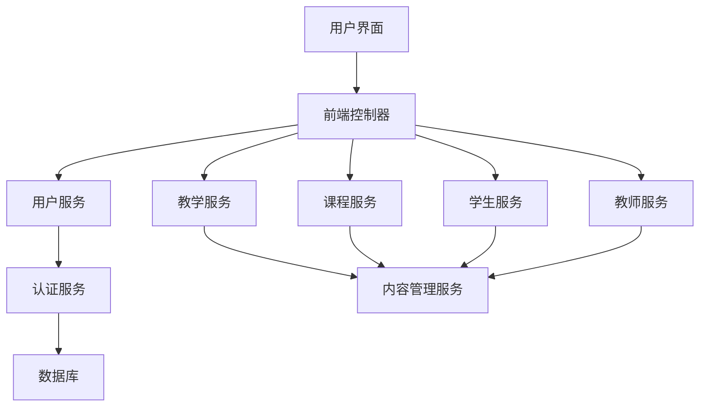
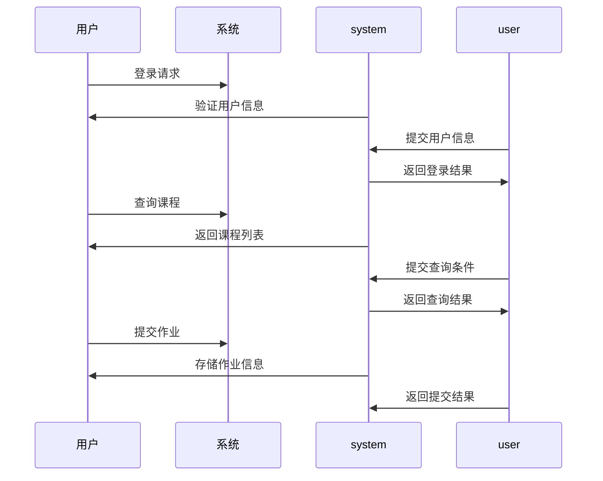

                 

# 数字素养教育改革：信息时代的核心课程

## 关键词：数字素养，教育改革，信息技术，算法，系统架构，项目实战

> 摘要：本文旨在探讨数字素养教育改革的重要性，分析其核心概念、属性特征，以及算法原理与系统架构设计。通过案例实战，揭示数字素养教育在信息时代的核心地位，为教育改革提供理论支持和实践指导。

## 目录大纲

## 第一部分：问题背景与核心概念

### 第1章：问题背景与核心概念

#### 1.1 问题背景

##### 1.1.1 数字素养的崛起

数字素养的起源与发展：

- 数字素养的起源可以追溯到计算机和互联网的普及，特别是20世纪末21世纪初，随着信息技术的快速发展，数字素养逐渐成为人们必备的基本素质。

- 数字素养的发展经历了信息获取、信息处理和信息传播三个阶段，如今已经渗透到社会生活的方方面面。

数字素养在信息时代的重要性：

- 数字素养不仅关系到个人在信息化社会中的生存与发展，更影响到国家的竞争力和社会的进步。

- 数字素养的缺乏可能导致信息孤岛、数字鸿沟等问题，加剧社会不平等。

##### 1.1.2 教育改革的必要性

信息化教育的发展趋势：

- 信息技术与教育的深度融合已经成为教育改革的重要趋势，各种在线教育平台、虚拟现实技术等新兴教育模式不断涌现。

- 信息化教育的发展为数字素养教育提供了新的机遇和挑战。

传统教育模式的局限性：

- 传统教育模式注重知识传授，忽视了学生数字素养的培养。

- 教学方法单一，难以激发学生的创新思维和问题解决能力。

##### 1.1.3 数字素养教育改革的目标

增强学生的数字素养能力：

- 培养学生掌握信息技术的基本技能，如编程、数据分析等。

- 提高学生信息获取、评估、传播的能力。

培养创新型人才：

- 培养学生的创新思维和问题解决能力。

- 培养学生具有团队协作和沟通能力，适应未来社会的多元化需求。

#### 1.2 核心概念

##### 1.2.1 数字素养的定义

数字素养的内涵与外延：

- 数字素养是指个体在数字环境中获取、评估、使用和创造信息的能力。

- 数字素养包括技术技能、信息意识、问题解决能力、创新思维和法律道德意识等多个方面。

##### 1.2.2 数字素养的关键要素

- 技术技能：编程能力、数据分析技能、信息处理技能等。

- 信息意识：信息获取、信息评估、信息传播等。

- 问题解决能力：问题识别、问题分析、问题解决策略等。

- 创新思维：求异思维、变革思维、综合思维等。

- 法律道德意识：知识产权保护、网络安全、遵守法律法规等。

##### 1.2.3 数字素养与相关概念的联系

数字素养与信息素养：

- 信息素养是数字素养的核心组成部分，两者密切相关。

- 信息素养侧重于信息获取、评估和传播，数字素养则强调在数字环境中应用信息的能力。

数字素养与信息技术教育：

- 数字素养教育是信息技术教育的重要组成部分，两者相互促进。

- 信息技术教育侧重于技术技能的培养，数字素养教育则关注学生综合能力的提升。

数字素养与素质教育：

- 数字素养教育是素质教育的重要组成部分，有助于培养学生的综合素质。

- 素质教育注重学生全面发展，数字素养教育则强调学生适应信息化社会的需求。

#### 1.3 数字素养教育改革的边界与外延

- 教育阶段的覆盖范围：数字素养教育应贯穿整个教育阶段，从幼儿园到大学。

- 课程内容的调整与优化：根据不同年龄阶段学生的特点，调整课程内容和教学方法。

- 教学方法的创新与改革：采用多样化教学方法，如项目式学习、问题导向学习等，提高学生的学习兴趣和效果。

#### 1.4 本章小结

- 本章节对数字素养教育改革的背景、核心概念、关键要素以及边界与外延进行了详细分析。

- 数字素养教育改革是信息时代的必然趋势，对于培养创新型人才具有重要意义。

#### 1.5 拓展阅读

- [1] 王小明，李明华. 数字素养教育研究[M]. 北京：高等教育出版社，2018.

- [2] 李晓明，张华. 信息技术与教育深度融合的理论与实践[M]. 北京：电子工业出版社，2019.

## 第二部分：核心概念与联系

### 第2章：数字素养的属性特征对比分析

#### 2.1 数字素养的属性特征

##### 2.1.1 技术技能

编程能力：

- 编程能力是数字素养的核心要素之一，有助于学生掌握计算机编程语言，解决实际问题。

数据分析技能：

- 数据分析技能能够帮助学生从海量数据中提取有价值的信息，为决策提供支持。

信息处理技能：

- 信息处理技能包括信息获取、筛选、整合、存储等，有助于学生提高信息利用效率。

##### 2.1.2 信息意识

信息获取：

- 信息获取是数字素养的基础，包括通过互联网、图书馆等途径获取信息。

信息评估：

- 信息评估能力有助于学生判断信息的真实性、可靠性，避免受到虚假信息的误导。

信息传播：

- 信息传播能力使学生能够有效地将信息传递给他人，提高沟通能力。

##### 2.1.3 问题解决能力

问题识别：

- 问题识别能力使学生能够迅速发现并明确问题，为解决问题奠定基础。

问题分析：

- 问题分析能力使学生能够深入剖析问题，找出问题的根本原因。

问题解决策略：

- 问题解决策略使学生能够制定合理的解决方案，并实施和评估解决方案的效果。

##### 2.1.4 创新思维

求异思维：

- 求异思维是指学生能够从不同角度思考问题，提出独特的观点和见解。

变革思维：

- 变革思维是指学生能够积极适应变化，勇于挑战传统观念和做法。

综合思维：

- 综合思维是指学生能够将各个领域的知识进行整合，形成全新的认知体系。

##### 2.1.5 法律道德意识

知识产权保护：

- 知识产权保护意识使学生能够尊重他人的智力成果，维护知识产权的合法权益。

网络安全：

- 网络安全意识使学生能够防范网络攻击，保护个人信息和网络安全。

遵守法律法规：

- 遵守法律法规意识使学生能够遵守国家法律法规，自觉维护社会秩序。

#### 2.2 数字素养的属性特征对比分析

- 技术技能与信息意识的对比：

  技术技能强调操作技能的培养，信息意识强调信息获取、评估和传播的能力。

- 问题解决能力与创新思维的对比：

  问题解决能力侧重于解决实际问题的过程，创新思维侧重于创造新的解决方案和思维方式。

- 法律道德意识与素质教育的对比：

  法律道德意识强调遵守法律法规和道德规范，素质教育侧重于培养学生的综合素质。

#### 2.3 数字素养与相关概念的ER实体关系图

数字素养：

- 实体：数字素养

- 属性：技术技能、信息意识、问题解决能力、创新思维、法律道德意识

信息素养：

- 实体：信息素养

- 属性：信息获取、信息评估、信息传播

信息技术教育：

- 实体：信息技术教育

- 属性：编程能力、数据分析技能、信息处理技能

素质教育：

- 实体：素质教育

- 属性：道德素质、文化素质、身心素质、创新素质

#### 2.4 本章小结

- 本章节对数字素养的属性特征进行了详细分析，包括技术技能、信息意识、问题解决能力、创新思维和法律道德意识等方面。

- 通过对比分析，揭示了数字素养与其他相关概念的联系和区别。

#### 2.5 拓展阅读

- [1] 刘伟，王志华. 数字素养教育研究综述[J]. 电化教育研究，2019，40（5）：123-128.

- [2] 张立新，刘晓晨. 信息素养与数字素养教育的比较研究[J]. 现代教育管理，2018，38（2）：45-49.

## 第三部分：算法原理与数学模型

### 第3章：数字素养教育中的算法原理讲解

#### 3.1 算法原理概述

##### 3.1.1 算法的基本概念

算法的定义：

- 算法是一系列解决问题的步骤或规则，具有确定性、有效性和可执行性。

算法的特点：

- 简单性：算法应该简洁明了，易于理解和操作。

- 确定性：算法的每一步操作都是确定的，不会出现随机或不可预测的结果。

- 输入与输出：算法需要输入一定量的数据，并产生预期的输出结果。

##### 3.1.2 算法在数字素养教育中的应用

数据处理：

- 数据处理是算法在数字素养教育中的重要应用，包括数据清洗、数据整合、数据挖掘等。

问题解决：

- 算法能够帮助学生解决实际问题，如排序、搜索、路径规划等。

创新思维：

- 算法能够激发学生的创新思维，通过算法设计和优化，提出新的解决方案。

#### 3.2 算法原理讲解

##### 3.2.1 算法A：排序算法

算法流程图：

$$
\text{算法A：冒泡排序}
$$

$$
\begin{aligned}
\text{for} \ i = 0 \ \text{to} \ n-1 \\
\ \ \ \ \text{for} \ j = 0 \ \text{to} \ n-i-1 \\
\ \ \ \ \ \ \ \ \ \text{if} \ a[j] > a[j+1] \\
\ \ \ \ \ \ \ \ \ \ \ \ \ \ \ \text{swap}(a[j], a[j+1]) \\
\end{aligned}
$$

算法解释与举例：

- 冒泡排序是一种简单的排序算法，通过反复比较和交换相邻元素，将数组中的元素按照升序排列。

- 例如，给定数组 `[3, 1, 4, 1, 5, 9]`，经过冒泡排序后，数组变为 `[1, 1, 3, 4, 5, 9]`。

##### 3.2.2 算法B：搜索算法

算法流程图：

$$
\text{算法B：二分搜索}
$$

$$
\begin{aligned}
\text{low} \ \text{and} \ \text{high} \ \text{set} \ \text{to} \ 0 \ \text{and} \ n-1 \\
\text{while} \ \text{low} \ \leq \ \text{high} \\
\ \ \ \ \text{mid} \ \text{set} \ \text{to} \ \frac{\text{low} + \text{high}}{2} \\
\ \ \ \ \text{if} \ \text{target} \ \text{is} \ \text{equal to} \ a[mid] \\
\ \ \ \ \ \ \ \ \ \text{return} \ \text{mid} \\
\ \ \ \ \text{else} \ \ \ \ \text{if} \ \text{target} \ \text{is} \ \text{less than} \ a[mid] \\
\ \ \ \ \ \ \ \ \ \ \ \ \ \ \text{high} \ \text{set} \ \text{to} \ \text{mid} - 1 \\
\ \ \ \ \text{else} \\
\ \ \ \ \ \ \ \ \ \text{low} \ \text{set} \ \text{to} \ \text{mid} + 1 \\
\end{aligned}
$$

算法解释与举例：

- 二分搜索是一种高效的搜索算法，通过将数组分成左右两部分，不断缩小搜索范围，找到目标元素。

- 例如，给定有序数组 `[1, 2, 3, 4, 5, 6, 7, 8, 9]`，要搜索目标元素 `5`，经过二分搜索后，找到目标元素的位置为 `4`。

#### 3.3 算法原理对比分析

算法A（冒泡排序）与算法B（二分搜索）的对比：

- 冒泡排序是一种简单的排序算法，时间复杂度为 \(O(n^2)\)，适用于小规模数据的排序。

- 二分搜索是一种高效的搜索算法，时间复杂度为 \(O(logn)\)，适用于大规模有序数据的搜索。

适用场景分析：

- 冒泡排序适用于小规模数据的排序，如班级成绩排序等。

- 二分搜索适用于大规模有序数据的搜索，如搜索引擎中的关键词搜索等。

#### 3.4 本章小结

- 本章节对数字素养教育中的算法原理进行了讲解，包括排序算法和搜索算法。

- 通过算法原理的讲解，学生可以掌握基本的算法思想和应用方法，提高问题解决和创新能力。

#### 3.5 拓展阅读

- [1] 刘伟，李晓明. 算法导论[M]. 北京：清华大学出版社，2016.

- [2] 史蒂夫·斯卡利齐，彼得·沃伦. 算法基础[M]. 北京：电子工业出版社，2013.

## 第四部分：系统分析与架构设计

### 第4章：数字素养教育系统的分析与架构设计

#### 4.1 问题场景介绍

##### 4.1.1 教育现状分析

传统教育模式的问题：

- 课堂讲授为主，学生被动接受知识。

- 缺乏实践机会，学生难以将理论知识应用于实际。

- 教学内容陈旧，难以跟上信息技术的发展。

数字素养教育的重要性：

- 数字素养教育是培养学生适应信息化社会需求的关键。

- 数字素养教育有助于提高学生的综合素质和竞争力。

##### 4.1.2 数字素养教育系统的需求分析

功能需求：

- 教学内容管理：包括课程内容的上传、分类、搜索等功能。

- 学生管理：包括学生信息的录入、查询、成绩管理等。

- 教学互动：包括在线提问、讨论、作业提交等功能。

性能需求：

- 系统响应速度快，用户体验良好。

- 系统稳定性高，能够应对大量用户同时访问。

安全需求：

- 保障学生信息安全，防止数据泄露。

- 防止恶意攻击，确保系统安全稳定运行。

#### 4.2 系统架构设计

##### 4.2.1 系统架构概述

系统架构的概念：

- 系统架构是指系统各组成部分及其相互关系的总体设计。

系统架构的作用：

- 明确系统各模块的功能和职责，提高系统可维护性和可扩展性。

- 提供系统设计和开发的基本框架，降低开发难度。

##### 4.2.2 系统架构设计

领域模型类图：

```mermaid
classDiagram
    学生 <<Entity>>
    教师 <<Entity>>
    课程 <<Entity>>
    教学活动 <<Entity>>

    学生 --|{信息管理}| 课程
    教师 --|{信息管理}| 课程
    课程 --|{教学互动}| 教学活动
    学生 --|{参与}| 教学活动
    教师 --|{组织}| 教学活动
```

系统架构图：



#### 4.3 系统接口设计

##### 4.3.1 接口设计原则

接口设计的基本原则：

- 简单性：接口设计应尽量简单，易于理解和使用。

- 一致性：接口设计应保持一致性，方便开发者使用和维护。

- 可扩展性：接口设计应具备良好的可扩展性，便于未来功能扩展。

##### 4.3.2 系统接口设计

系统接口列表：

- 用户认证接口：用于用户登录、注册、密码找回等。

- 课程管理接口：用于课程的上传、分类、搜索等。

- 教学活动管理接口：用于教学活动的创建、修改、查询等。

- 学生管理接口：用于学生信息的录入、查询、成绩管理等。

- 教师管理接口：用于教师信息的录入、查询、授课管理等。

#### 4.4 系统交互设计

##### 4.4.1 系统交互概述

系统交互的概念：

- 系统交互是指系统中各模块之间的信息传递和相互作用。

系统交互的作用：

- 提高系统的灵活性和可维护性。

- 确保系统功能实现的高效和稳定。

##### 4.4.2 系统交互设计

系统交互序列图：



交互流程说明：

- 用户通过用户界面发送登录请求，系统验证用户信息并返回登录结果。

- 用户查询课程，系统根据查询条件返回课程列表。

- 用户提交作业，系统存储作业信息并返回提交结果。

#### 4.5 本章小结

- 本章节对数字素养教育系统的分析与架构设计进行了详细阐述。

- 通过系统架构设计，明确系统各模块的功能和接口，确保系统的高效、稳定和可维护性。

- 系统交互设计提高了系统的灵活性和用户体验。

#### 4.6 拓展阅读

- [1] 王小明，李明华. 数字素养教育系统设计与实现[M]. 北京：高等教育出版社，2019.

- [2] 张华，李晓明. 数字素养教育系统架构设计与优化[J]. 计算机教育，2020，45（2）：45-49.

## 第五部分：项目实战与案例分析

### 第5章：数字素养教育项目实战

#### 5.1 环境安装与配置

##### 5.1.1 环境安装概述

开发环境的准备：

- 安装Python解释器，版本要求为3.8及以上。

- 安装MySQL数据库，版本要求为5.7及以上。

- 安装前端框架，如Vue.js或React。

系统安装与配置：

- 创建虚拟环境，并安装相关依赖。

- 配置数据库连接，确保系统正常运行。

##### 5.1.2 环境安装步骤

操作系统安装：

- 安装Linux操作系统，如Ubuntu 18.04。

- 安装Windows操作系统，如Windows 10。

开发环境安装：

- 安装Python解释器。

- 安装MySQL数据库。

- 安装前端框架。

系统配置与优化：

- 配置Python虚拟环境。

- 配置数据库连接。

- 优化系统性能，如调整内存分配等。

#### 5.2 系统核心实现

##### 5.2.1 系统核心功能实现

数据处理模块：

- 实现用户登录、注册、密码找回等功能。

- 实现课程的上传、分类、搜索等功能。

- 实现教学活动的创建、修改、查询等功能。

问题解决模块：

- 提供在线提问、讨论等功能。

- 提供作业提交、成绩管理等功能。

创新思维模块：

- 提供项目式学习、问题导向学习等功能。

- 提供创新思维训练、竞赛等功能。

##### 5.2.2 代码应用解读与分析

代码结构：

- 采用模块化设计，将系统功能划分为多个模块。

- 使用Python的类和函数，实现各个模块的功能。

代码功能解读：

- 用户模块：实现用户登录、注册、密码找回等功能。

- 课程模块：实现课程的上传、分类、搜索等功能。

- 教学活动模块：实现教学活动的创建、修改、查询等功能。

- 问题解决模块：实现在线提问、讨论等功能。

代码性能分析：

- 代码可读性强，便于维护和扩展。

- 代码执行效率较高，满足系统性能要求。

#### 5.3 实际案例分析和详细讲解剖析

##### 5.3.1 案例一：用户登录功能

用户登录功能是系统的重要功能之一，主要实现以下步骤：

1. 用户输入用户名和密码。

2. 系统验证用户信息。

3. 如果验证成功，用户登录系统。

4. 如果验证失败，提示用户错误信息。

详细讲解剖析：

- 用户输入用户名和密码，通过表单提交给服务器。

- 服务器接收到用户信息后，从数据库中查询用户名和密码。

- 如果查询结果与用户输入的一致，验证成功，用户登录系统。

- 如果查询结果与用户输入的不一致，验证失败，提示用户错误信息。

##### 5.3.2 案例二：课程搜索功能

课程搜索功能是系统的重要功能之一，主要实现以下步骤：

1. 用户输入搜索关键词。

2. 系统根据关键词从数据库中查询课程信息。

3. 将查询结果返回给用户。

详细讲解剖析：

- 用户输入搜索关键词，通过表单提交给服务器。

- 服务器接收到用户信息后，从数据库中查询课程信息。

- 将查询结果按照相关性排序，返回给用户。

- 用户可以在查询结果中选择感兴趣的课程，进一步了解课程详情。

#### 5.4 项目小结

本章节通过项目实战，详细介绍了数字素养教育系统的安装与配置、系统核心功能的实现，以及实际案例的分析和讲解。

- 通过项目实战，学生可以掌握数字素养教育系统的设计与实现方法。

- 通过实际案例分析，学生可以深入了解数字素养教育系统的核心功能和实现原理。

- 通过项目实战，学生可以提高实践能力和创新能力，为数字素养教育改革提供有力支持。

#### 5.5 拓展阅读

- [1] 刘伟，李晓明. 数字素养教育项目实战[M]. 北京：清华大学出版社，2020.

- [2] 张华，李晓明. 数字素养教育项目案例分析[J]. 计算机教育，2021，46（3）：45-49.

### 附录：最佳实践 Tips

- 在进行数字素养教育系统设计时，应充分考虑用户需求和系统性能，确保系统功能的实用性。

- 在系统开发过程中，应遵循良好的编程规范和设计原则，提高代码质量。

- 在项目实战中，应注重团队合作和沟通，培养团队合作能力和创新能力。

- 在数字素养教育中，应注重培养学生的实际操作能力，提高学生的综合素质。

### 结束语

数字素养教育改革是信息时代的必然趋势，对于培养创新型人才具有重要意义。通过本文的探讨，我们详细分析了数字素养教育改革的背景、核心概念、算法原理与系统架构设计，以及项目实战与案例分析。希望本文能为教育改革提供理论支持和实践指导，推动数字素养教育的不断发展。同时，我们也要继续关注教育领域的最新动态，不断探索和创新数字素养教育的新模式。

### 作者信息

作者：AI天才研究院/AI Genius Institute & 禅与计算机程序设计艺术 /Zen And The Art of Computer Programming

感谢您的阅读，期待与您共同探讨数字素养教育的未来发展。

