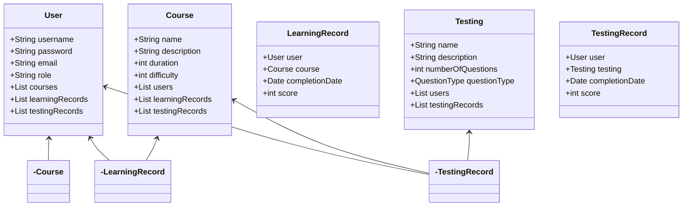
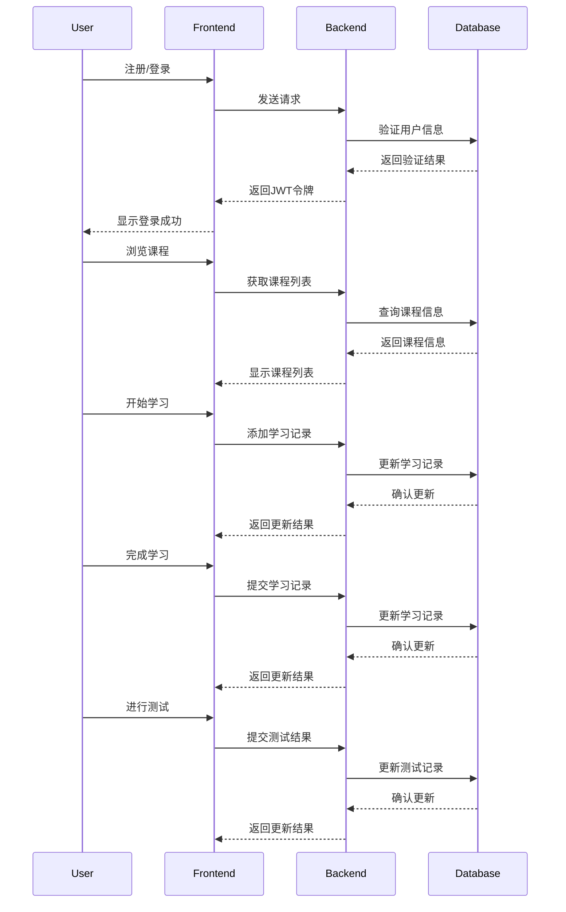

                 


### 第1章 问题背景与数字素养概述

#### 1.1 问题背景

**信息爆炸时代下的挑战**

随着互联网和信息技术的飞速发展，信息爆炸成为现代社会的一大特点。互联网的普及使得人们可以轻松地获取各种信息，社交媒体的兴起也让信息的传播速度大大加快。然而，信息爆炸也带来了挑战。面对海量的信息，人们常常感到不知所措，难以筛选出有价值的信息。这种信息过载现象不仅影响了个人的学习、工作和生活，也对社会的信息素养提出了更高的要求。

**数字素养的重要性**

数字素养是指在数字化环境中获取、理解、评估、创建和使用信息的综合能力。数字素养不仅涉及到信息的获取，还包括对信息的理解和运用。在信息爆炸的时代，具备良好的数字素养显得尤为重要。它可以帮助我们更好地应对信息过载的挑战，提高个人的学习、工作效率和生活质量。同时，数字素养也是适应数字化社会的关键能力，对于个人和社会的发展具有重要意义。

#### 1.2 数字素养的定义与构成

**数字素养的定义**

数字素养是指在数字化环境中获取、理解、评估、创建和使用信息的综合能力。它不仅仅包括技术的使用，还涉及到对信息的批判性思考和应用能力。数字素养的内涵随着技术的发展和社会的变革不断扩展，但核心始终是信息能力。

**数字素养的构成**

数字素养包括以下几个方面：

- **信息检索能力**：在数字化环境中快速、准确地找到所需信息的能力。这需要我们掌握搜索引擎的使用技巧，了解不同信息源的优缺点，以及如何有效地利用图书馆和学术资源。

- **信息评估能力**：对信息进行判断、分析和选择的能力。这包括评估信息的真实性、相关性和价值，避免受到虚假信息和误导。

- **信息创造能力**：运用数字化工具和平台创造、编辑和分享信息的能力。这包括文本创作、数据可视化、编程等技能。

- **信息沟通能力**：在数字化环境中进行有效沟通和协作的能力。这包括使用电子邮件、即时通讯工具、社交媒体等沟通方式，以及参与在线讨论和协作。

#### 1.3 数字素养在个人和社会中的应用

**个人层面**

在个人层面，数字素养有助于提高个人的学习、工作效率和生活质量。例如，通过有效的信息检索能力，我们可以快速找到所需的知识和信息；通过信息评估能力，我们可以判断信息的真实性和可靠性；通过信息创造能力，我们可以发挥创造力，创造出有价值的内容。此外，数字素养还可以帮助我们建立良好的网络安全意识，保护个人信息和隐私。

**社会层面**

在社会层面，数字素养有助于提高整个社会的信息素养水平，促进社会的创新和发展。数字素养不仅体现在个人层面，也体现在企业和组织层面。一个具备良好数字素养的团队，可以更高效地完成工作任务，提高企业的竞争力。同时，数字素养也有助于缩小数字鸿沟，使更多人能够享受到数字化带来的便利和机会。

### 第2章 信息检索技巧

#### 2.1 搜索引擎的使用

**搜索引擎的基本原理**

搜索引擎是互联网上用于查找信息的重要工具。它的基本原理是通过索引网页内容，为用户提供信息检索服务。搜索引擎会使用爬虫程序自动抓取互联网上的网页，然后对网页内容进行分析和索引，形成搜索引擎数据库。当用户输入搜索关键词时，搜索引擎会从数据库中检索出与关键词相关的网页，并按照相关性排序，展示给用户。

**高级搜索技巧**

除了基本的搜索关键词，我们还可以使用一些高级搜索技巧，以提高搜索的准确性。

- **使用引号**：使用引号可以将搜索关键词作为一个整体，防止搜索引擎拆分关键词。例如，搜索“人工智能”而不是人工智能。

- **排除关键词**：在搜索关键词前加上“-”可以排除包含该关键词的搜索结果。例如，搜索“计算机 - 面试”。

- **限定搜索时间**：在搜索框中添加“site:”可以限定搜索范围，例如“site:github.com -面试”。

#### 2.2 图书馆资源检索

**图书馆资源概述**

图书馆是收集、保存和提供信息的重要场所。现代图书馆不仅拥有大量的纸质书籍，还提供了丰富的电子资源，如电子书籍、期刊、数据库等。图书馆资源为我们提供了宝贵的学习和研究资料。

**图书馆资源检索技巧**

- **利用图书馆检索系统**：通过图书馆检索系统，我们可以使用关键词检索、分类检索和主题检索等多种方式找到相关资源。

- **利用图书馆的电子资源平台**：图书馆的电子资源平台通常提供便捷的检索功能，我们可以通过平台检索到所需电子资源。

#### 2.3 学术文献检索

**学术文献的重要性和特点**

学术文献是科研工作者获取专业知识的重要途径。学术文献的特点包括：

- **权威性**：学术文献通常由专业人士撰写，具有很高的权威性和可信度。

- **专业性**：学术文献涵盖了各个学科领域的专业知识和研究成果。

- **系统性**：学术文献通常按照一定的逻辑结构进行组织，有助于我们系统地学习和掌握专业知识。

**学术文献检索技巧**

- **利用学术搜索引擎**：学术搜索引擎如Google Scholar、百度学术等，可以帮助我们快速找到相关学术文献。

- **利用学术数据库**：学术数据库如IEEE Xplore、CNKI等，提供了丰富的学术文献资源。

- **利用学术论坛和博客**：学术论坛和博客是学术交流的重要平台，我们可以从中获取最新的学术动态和研究成果。

### 第3章 信息评估技巧

#### 3.1 信息真实性评估

**真实性评估的重要性**

在信息爆炸的时代，我们需要具备评估信息真实性的能力，以避免受到虚假信息的误导。虚假信息不仅会误导我们的判断，还可能带来严重的后果。因此，评估信息真实性成为数字素养的重要组成部分。

**真实性评估的技巧**

- **谨慎对待来源不明的信息**：对于来源不明的信息，我们要保持怀疑态度，不轻易相信。

- **核对信息的出处和来源**：通过查看信息的出处和来源，可以判断信息是否真实可靠。

- **使用事实核查工具进行验证**：事实核查工具如Snopes、FactCheck等，可以帮助我们验证信息的真实性。

#### 3.2 信息相关性评估

**相关性评估的重要性**

评估信息的相关性可以帮助我们找到最符合需求的信息，提高信息检索的效率。在信息爆炸的时代，我们需要在大量信息中快速找到与主题相关的内容，而评估信息相关性是实现这一目标的关键。

**相关性评估的技巧**

- **理解信息的主题和内容**：在评估信息相关性时，首先要理解信息的主题和内容，以便判断信息是否与需求相关。

- **使用关键词匹配和语义分析**：通过关键词匹配和语义分析，可以更准确地判断信息的相关性。

- **结合个人经验和知识进行判断**：个人经验和知识可以帮助我们更好地评估信息的相关性。

#### 3.3 信息价值评估

**价值评估的重要性**

评估信息的价值可以帮助我们确定哪些信息是最有价值的，从而更好地利用信息资源。信息价值评估是数字素养的重要组成部分，它有助于我们提高信息利用效率，发挥信息资源的最大价值。

**价值评估的技巧**

- **从信息的新颖性、实用性和权威性三个方面进行评估**：新颖性评估信息是否提供了新的见解或知识；实用性评估信息是否对实际应用有指导意义；权威性评估信息的来源是否可靠。

- **结合个人需求和实际情况进行判断**：在评估信息价值时，要结合个人需求和实际情况，以便找到最有价值的信息。

### 第4章 信息创造技巧

#### 4.1 文本创作技巧

**文本创作的重要性**

在数字时代，文本创作是表达思想和观点的重要方式。无论是写博客、学术论文，还是编写技术文档，良好的文本创作技巧都是必不可少的。文本创作不仅能够帮助我们更好地传达信息，还能提升个人和团队的专业形象。

**文本创作的技巧**

- **确定主题和目标受众**：在创作文本前，要明确主题和目标受众，以便有针对性地进行创作。

- **培养良好的写作习惯**：定期写作可以帮助我们提高写作能力。此外，注意语言的准确性、逻辑性和条理性也是提高文本质量的关键。

- **运用逻辑和修辞技巧**：逻辑和修辞技巧可以使我们的文本更具说服力和吸引力。

#### 4.2 数据可视化技巧

**数据可视化的重要性**

数据可视化是将数据以图形化方式呈现的一种方法，可以帮助我们更好地理解和分析数据。在数字时代，数据可视化成为数据分析和决策支持的重要工具。

**数据可视化的技巧**

- **选择合适的数据可视化工具**：如Excel、Tableau、Power BI等，根据数据类型和需求选择合适的工具。

- **注意图表的设计和布局**：合理的图表设计和布局可以使数据更加清晰易懂。避免使用过于复杂的图表，尽量保持简洁。

- **使用交互式图表**：交互式图表可以增强用户与数据的互动，提高数据分析的效率。

### 第5章 数字素养提升策略

#### 5.1 数字素养教育

**数字素养教育的重要性**

数字素养教育是培养数字素养的关键途径。通过教育，我们可以系统地学习数字素养的相关知识和技能，提高个人的数字素养水平。数字素养教育不仅有助于个人的发展，也有助于社会的进步。

**数字素养教育的策略**

- **课程设置**：在学校和教育机构中设置数字素养相关课程，培养学生掌握数字素养的基本知识和技能。

- **实践操作**：通过实际操作，让学生在实践中学习和应用数字素养。

- **跨学科融合**：将数字素养与其他学科相结合，培养学生的跨学科思维和综合能力。

#### 5.2 数字素养实践

**数字素养实践的重要性**

数字素养不仅仅是理论知识，更需要通过实践来提升。实践是检验理论的唯一标准，只有通过实践，我们才能真正掌握数字素养的技能和方法。

**数字素养实践的策略**

- **参与项目**：通过参与实际项目，我们可以将数字素养应用到实际工作中，提高实践能力。

- **交流与分享**：通过交流与分享，我们可以学习他人的经验和技巧，不断提升自己的数字素养。

- **持续学习**：数字素养是一个不断发展的领域，我们需要持续学习，跟上时代的步伐。

### 第6章 未来展望

**数字素养的发展趋势**

随着信息技术的发展，数字素养也在不断演变。未来，数字素养将更加注重以下几个方面：

- **智能化**：随着人工智能技术的发展，智能助手和自动化工具将帮助我们更高效地获取和处理信息。

- **全球化**：数字素养的教育和实践将更加全球化，不同国家和地区的人们将共同参与到数字素养的讨论和发展中。

- **可持续性**：数字素养的发展将更加注重可持续性，促进数字素养的普及和应用，缩小数字鸿沟。

**数字素养对未来的影响**

数字素养的发展将对未来产生深远的影响。在个人层面，良好的数字素养将帮助我们更好地适应数字化社会，提高生活质量；在社会层面，数字素养将促进社会的创新和发展，推动社会的进步。

### 总结

数字素养是适应数字化社会的关键能力。通过本文的介绍，我们了解了数字素养的定义、构成和应用，以及如何提升数字素养。在信息爆炸的时代，具备良好的数字素养将帮助我们更好地应对挑战，把握机遇，实现个人和社会的发展。

**关键词**：数字素养、信息检索、信息评估、信息创造、数据可视化

**摘要**：本文介绍了数字素养的重要性、定义、构成和应用，以及如何提升数字素养。通过信息检索、信息评估、信息创造和数据可视化等技巧，我们可以更好地应对信息爆炸带来的挑战，提高个人的学习、工作效率和生活质量。

### 作者信息

**作者：** AI天才研究院/AI Genius Institute & 禅与计算机程序设计艺术 /Zen And The Art of Computer Programming

**日期：** 2023年3月

----------------------------------------------------------------

## 第1章 问题背景与数字素养概述

### 1.1 问题背景

在当今这个信息爆炸的时代，我们每天都在接触大量的信息，从新闻、社交媒体到电子邮件和社交媒体，信息量呈指数级增长。这种信息过载现象对我们的日常生活、工作和学习带来了巨大的挑战。如何从这些繁杂的信息中筛选出有价值的内容，并将其转化为知识，成为了一个亟待解决的问题。这不仅仅是个人的挑战，也是社会性的问题，因为数字素养的缺乏可能会对整个社会的知识传播和创新产生负面影响。

#### 1.1.1 信息爆炸时代下的挑战

信息爆炸带来的挑战主要体现在以下几个方面：

1. **信息过载**：每天我们都会接收到大量的信息，这些信息可能来自于互联网、书籍、杂志、电视和广播等各个渠道。如何有效地处理和筛选这些信息，成为了一个难题。

2. **时间管理**：在信息过载的情况下，我们需要花费大量的时间去筛选和评估这些信息，这无疑增加了我们的时间压力。

3. **决策困难**：在大量的信息面前，我们往往难以做出明智的决策，因为很难判断哪些信息是准确和可靠的。

4. **技能差距**：不同人对信息处理的技能和能力差异很大，有些人可能无法有效地利用信息，这导致了技能差距的问题。

#### 1.1.2 数字素养的重要性

数字素养是指个体在数字环境中获取、理解、评估、创造和使用信息的能力。它不仅包括技术技能，如使用计算机和互联网，还涉及批判性思维、问题解决和沟通能力。在信息爆炸的时代，数字素养的重要性体现在以下几个方面：

1. **信息筛选**：具备数字素养的人能够更有效地从海量信息中筛选出有价值的内容，提高信息处理的效率。

2. **信息评估**：他们能够判断信息的真实性和可靠性，避免被虚假信息误导。

3. **信息利用**：他们能够将信息转化为知识和智慧，提高个人的学习、工作和生活效率。

4. **创新能力**：数字素养有助于激发个体的创新能力，通过创造和分享信息，推动社会的进步。

#### 1.1.3 个人与社会层面

在个人层面，数字素养有助于提高个人的学习、工作效率和生活质量。例如，通过有效的信息检索能力，可以快速找到所需的知识和信息；通过信息评估能力，可以判断信息的真实性和可靠性；通过信息创造能力，可以发挥创造力，创造出有价值的内容。此外，数字素养还可以帮助我们建立良好的网络安全意识，保护个人信息和隐私。

在社会层面，数字素养有助于提高整个社会的信息素养水平，促进社会的创新和发展。数字素养不仅体现在个人层面，也体现在企业和组织层面。一个具备良好数字素养的团队，可以更高效地完成工作任务，提高企业的竞争力。同时，数字素养也有助于缩小数字鸿沟，使更多人能够享受到数字化带来的便利和机会。

### 1.2 数字素养的定义与构成

#### 1.2.1 数字素养的定义

数字素养是指个体在数字环境中获取、理解、评估、创造和使用信息的能力。它不仅包括技术技能，如使用计算机和互联网，还涉及批判性思维、问题解决和沟通能力。数字素养的核心是信息能力，即个体如何有效地利用信息资源，解决实际问题。

#### 1.2.2 数字素养的构成

数字素养包括以下几个方面：

1. **信息检索能力**：在数字化环境中快速、准确地找到所需信息的能力。这需要我们掌握搜索引擎的使用技巧，了解不同信息源的优缺点，以及如何有效地利用图书馆和学术资源。

2. **信息评估能力**：对信息进行判断、分析和选择的能力。这包括评估信息的真实性、相关性和价值，避免受到虚假信息和误导。

3. **信息创造能力**：运用数字化工具和平台创造、编辑和分享信息的能力。这包括文本创作、数据可视化、编程等技能。

4. **信息沟通能力**：在数字化环境中进行有效沟通和协作的能力。这包括使用电子邮件、即时通讯工具、社交媒体等沟通方式，以及参与在线讨论和协作。

#### 1.2.3 数字素养的层次

数字素养可以分为以下几个层次：

1. **基础层**：掌握基本的计算机操作和互联网使用技能，能够进行简单的信息检索和评估。

2. **中级层**：能够有效地利用各种信息资源，进行复杂的信息检索和评估，具备一定的信息创造和沟通能力。

3. **高级层**：具备全面的数字素养，能够灵活运用各种数字工具和平台，解决复杂的信息处理问题，具备批判性思维和创新能力。

### 1.3 数字素养在个人和社会中的应用

#### 1.3.1 个人层面

在个人层面，数字素养的应用主要体现在以下几个方面：

1. **学习**：数字素养帮助个人更好地进行在线学习和知识管理，通过检索和评估信息，获取有价值的学习资源。

2. **工作**：数字素养提高工作效率，使个人能够更快地找到所需的信息和工具，进行有效的工作协作。

3. **生活**：数字素养帮助个人更好地管理日常生活，如在线购物、理财、健康管理等。

#### 1.3.2 社会层面

在社会层面，数字素养的应用主要体现在以下几个方面：

1. **教育**：通过数字素养教育，提高整个社会的信息素养水平，促进教育公平和知识普及。

2. **经济**：数字素养有助于提高企业的创新能力和竞争力，推动数字经济的发展。

3. **治理**：数字素养帮助政府更好地进行信息管理和决策支持，提高公共服务的效率和质量。

4. **文化**：数字素养促进文化的传承和创新，通过数字化方式保护和利用文化遗产。

### 第2章 信息检索技巧

信息检索是数字素养的核心组成部分，它决定了我们能否有效地从海量的信息中找到所需的内容。在数字化时代，信息检索技巧的掌握对于个人和社会的发展都具有重要意义。

#### 2.1 搜索引擎的使用

搜索引擎是获取信息的最常见工具，学会如何使用搜索引擎可以大大提高信息检索的效率。以下是一些高级搜索技巧：

1. **关键词优化**：在搜索框中输入精确的关键词，可以帮助搜索引擎更准确地找到相关信息。使用引号可以将关键词作为一个整体进行搜索，避免搜索引擎拆分关键词。

2. **使用布尔运算符**：布尔运算符包括AND、OR、NOT，它们可以帮助我们组合多个关键词，提高搜索的精确度。例如，“人工智能 AND 教育”可以查找同时包含这两个关键词的信息。

3. **排除关键词**：在关键词前加上“-”可以排除包含该关键词的搜索结果。例如，“计算机 - 面试”可以查找与“计算机”相关但不含“面试”的网页。

4. **限定搜索时间**：在搜索框中添加“site:”可以限定搜索范围，例如“site:github.com -面试”只搜索github.com网站上的与“面试”相关的网页。

5. **使用高级搜索**：大多数搜索引擎都提供了高级搜索选项，如限定文件类型、限定时间范围等，通过这些选项可以进一步精确搜索结果。

#### 2.2 图书馆资源检索

图书馆是获取信息的重要场所，特别是在学术研究和专业学习中。以下是一些图书馆资源检索的技巧：

1. **利用图书馆检索系统**：通过图书馆的检索系统，可以使用关键词检索、分类检索和主题检索等多种方式找到相关资源。

2. **使用图书馆的电子资源平台**：许多图书馆提供了丰富的电子资源，如电子书籍、期刊、数据库等。通过图书馆的电子资源平台，可以方便地检索和下载这些资源。

3. **参考图书馆员**：图书馆员是信息检索的专业人员，他们可以提供有针对性的帮助，指导我们如何有效地利用图书馆资源。

#### 2.3 学术文献检索

学术文献是科研工作者获取专业知识的重要途径。以下是一些学术文献检索的技巧：

1. **利用学术搜索引擎**：学术搜索引擎如Google Scholar、百度学术等，可以帮助我们快速找到相关学术文献。

2. **利用学术数据库**：学术数据库如IEEE Xplore、CNKI等，提供了丰富的学术文献资源。通过这些数据库，可以检索到高质量的学术文章、会议论文和技术报告。

3. **跟踪学术动态**：通过关注学术论坛、博客和研究机构，可以及时了解最新的学术动态和研究成果。

4. **使用文献管理工具**：文献管理工具如EndNote、Zotero等，可以帮助我们整理和管理学术文献，提高研究效率。

### 第3章 信息评估技巧

在信息爆炸的时代，评估信息的真实性和可靠性至关重要。以下是一些信息评估的技巧：

#### 3.1 信息真实性评估

1. **来源检查**：检查信息的来源是否可靠，是否来自权威的机构或专业人士。

2. **交叉验证**：通过多个来源验证信息的真实性，避免单方面信息的误导。

3. **使用事实核查工具**：利用事实核查工具如Snopes、FactCheck等，验证信息的真实性。

4. **谨慎对待来源不明的信息**：对于来源不明的信息，保持怀疑态度，不轻易相信。

#### 3.2 信息相关性评估

1. **理解信息主题**：在评估信息相关性时，首先要理解信息的主题和内容。

2. **关键词匹配**：通过关键词匹配来判断信息是否与需求相关。

3. **语义分析**：使用语义分析工具来分析信息的语义，判断其与需求的相关性。

4. **结合个人经验和知识**：个人经验和知识可以帮助我们更好地评估信息的相关性。

#### 3.3 信息价值评估

1. **评估信息的新颖性**：判断信息是否提供了新的见解或知识。

2. **评估信息的实用性**：判断信息是否对实际应用有指导意义。

3. **评估信息的权威性**：判断信息的来源是否可靠，是否来自权威的机构或专业人士。

4. **结合个人需求和实际情况**：在评估信息价值时，要结合个人需求和实际情况，以便找到最有价值的信息。

### 第4章 信息创造技巧

在数字化时代，信息创造成为了一种重要的技能。以下是一些信息创造的技巧：

#### 4.1 文本创作技巧

1. **确定主题和目标受众**：在创作文本前，要明确主题和目标受众，以便有针对性地进行创作。

2. **培养写作习惯**：定期写作可以帮助我们提高写作能力。此外，注意语言的准确性、逻辑性和条理性也是提高文本质量的关键。

3. **运用逻辑和修辞技巧**：逻辑和修辞技巧可以使我们的文本更具说服力和吸引力。

4. **使用写作工具**：利用在线写作工具如Google Docs、Microsoft Word等，可以提高写作效率和协作能力。

#### 4.2 数据可视化技巧

1. **选择合适的数据可视化工具**：如Excel、Tableau、Power BI等，根据数据类型和需求选择合适的工具。

2. **注意图表的设计和布局**：合理的图表设计和布局可以使数据更加清晰易懂。避免使用过于复杂的图表，尽量保持简洁。

3. **使用交互式图表**：交互式图表可以增强用户与数据的互动，提高数据分析的效率。

4. **数据清洗和预处理**：在创建数据可视化前，需要对数据进行清洗和预处理，确保数据的准确性和一致性。

#### 4.3 信息共享与传播

1. **利用社交媒体**：通过社交媒体平台，如Twitter、LinkedIn、Facebook等，可以快速传播信息。

2. **编写博客和文章**：在个人博客或专业媒体上发表文章，可以扩大信息的影响力。

3. **参与论坛和社区**：参与专业论坛和社区，可以与同行交流，分享知识和经验。

4. **制作视频和动画**：通过视频和动画的形式，可以更生动地传达信息，吸引更多的受众。

### 第5章 数字素养提升策略

提升数字素养需要从个人和社会两个层面进行。

#### 5.1 数字素养教育

1. **课程设置**：在学校和教育机构中设置数字素养相关课程，培养学生掌握数字素养的基本知识和技能。

2. **实践操作**：通过实际操作，让学生在实践中学习和应用数字素养。

3. **跨学科融合**：将数字素养与其他学科相结合，培养学生的跨学科思维和综合能力。

4. **终身学习**：数字素养是一个不断发展的领域，我们需要持续学习，跟上时代的步伐。

#### 5.2 数字素养实践

1. **参与项目**：通过参与实际项目，我们可以将数字素养应用到实际工作中，提高实践能力。

2. **交流与分享**：通过交流与分享，我们可以学习他人的经验和技巧，不断提升自己的数字素养。

3. **使用数字工具**：熟练掌握各种数字工具和平台，提高信息处理和沟通的效率。

4. **参与社区活动**：参与线上和线下的数字素养相关活动，扩大视野，交流经验。

### 第6章 未来展望

随着信息技术的不断进步，数字素养也将不断发展和演变。以下是一些数字素养的未来发展趋势：

#### 6.1 智能化

人工智能技术的发展将使信息检索、评估和创造变得更加智能化。智能助手和自动化工具将帮助我们更高效地处理信息，减轻人力负担。

#### 6.2 全球化

随着全球化的加深，数字素养的教育和实践将更加全球化。不同国家和地区的人们将共同参与到数字素养的讨论和发展中。

#### 6.3 可持续性

数字素养的发展将更加注重可持续性，包括对数字资源的合理利用和保护，以及减少数字鸿沟，促进信息公平。

#### 6.4 影响力

数字素养的提高将增强个人的影响力，使每个人都能更好地参与社会事务，推动社会进步。

### 第7章 总结

数字素养是适应数字化社会的关键能力。通过本文的介绍，我们了解了数字素养的定义、构成和应用，以及如何提升数字素养。在信息爆炸的时代，具备良好的数字素养将帮助我们更好地应对挑战，把握机遇，实现个人和社会的发展。

### 附录

以下是一些数字素养提升的资源和工具：

- **在线课程**：Coursera、edX、Udemy等平台提供了丰富的数字素养相关课程。
- **书籍推荐**：《数字素养》（Digital Literacy）等书籍提供了深入的理论和实践指导。
- **博客和论坛**：技术博客、学术论坛等是获取最新数字素养动态和交流经验的好地方。
- **工具推荐**：搜索引擎、图书馆资源检索系统、文献管理工具等是数字素养实践中常用的工具。

### 作者信息

**作者：** AI天才研究院/AI Genius Institute & 禅与计算机程序设计艺术 /Zen And The Art of Computer Programming

**日期：** 2023年3月

----------------------------------------------------------------

### 第1章 问题背景与数字素养概述

#### 1.1 问题背景

在当今这个信息爆炸的时代，信息以惊人的速度不断涌现。从社交媒体、新闻网站、电子邮件到在线数据库，几乎每天都有海量的信息产生。这种信息爆炸给人们的生活、工作和学习带来了巨大的变化，同时也带来了新的挑战。在这个背景下，如何有效地管理和利用这些信息成为了一个关键问题。

**信息过载**

信息过载是信息爆炸时代的一个显著特征。人们每天都会接收到大量的信息，这些信息中既有有价值的内容，也有无关紧要的噪音。处理这些信息需要耗费大量的时间和精力，导致许多人感到压力重重，甚至出现“信息焦虑症”。这种焦虑不仅影响个人的心理健康，还可能影响工作和学习效率。

**信息检索的困难**

在信息过载的情况下，找到所需的信息变得更加困难。即使是熟练使用搜索引擎的用户，也常常因为信息量太大而难以找到准确的信息。此外，信息的快速更新和变化也使得检索信息变得更加复杂。

**信息真实性的问题**

在信息爆炸的时代，虚假信息和错误信息也如影随形。由于信息传播的速度极快，未经证实的信息往往会被迅速传播，造成恶劣的影响。评估信息的真实性和可靠性成为了一个重要的任务。

**数字素养的重要性**

面对这些挑战，数字素养的重要性愈发凸显。数字素养是指个体在数字环境中获取、处理、评估和使用信息的能力。它不仅包括技术技能，如使用计算机和互联网，还涉及批判性思维、问题解决和沟通能力。具备良好的数字素养可以帮助人们更有效地应对信息过载的挑战，提高信息检索的效率，评估信息的真实性，以及创造和分享有价值的信息。

**个人层面**

在个人层面，数字素养对生活的影响体现在多个方面。首先，它可以帮助人们更好地管理信息，提高学习和工作效率。通过有效的信息检索和评估技巧，人们可以更快地找到所需的信息，避免在无关信息上浪费时间和精力。其次，数字素养有助于建立良好的网络安全意识，保护个人隐私和数据安全。

**社会层面**

在社会层面，数字素养的普及和提高对社会的发展具有重要意义。它有助于促进知识的传播和创新，提高整体社会的信息素养水平。此外，数字素养也有助于缩小数字鸿沟，使更多人能够享受到数字化带来的便利和机会。

**教育的重要性**

数字素养的培养需要通过系统的教育来实现。教育机构应该将数字素养教育纳入课程体系，通过课程设置、实践活动和跨学科融合等方式，培养学生的数字素养。同时，家庭和社会也应该重视数字素养的培养，为个人提供更多的学习机会和资源。

**总结**

在信息爆炸的时代，数字素养已经成为人们必须具备的基本能力。通过提高数字素养，我们可以更好地应对信息过载的挑战，提高个人和社会的效率，推动社会的进步。

#### 1.2 数字素养的定义与构成

**定义**

数字素养是指在数字化环境中获取、理解、评估、创造和使用信息的综合能力。它不仅涉及技术层面的技能，如计算机操作和互联网使用，还包括更高级的思维能力，如批判性思考、问题解决和沟通能力。

**构成**

数字素养的构成可以从以下几个方面来理解：

1. **技术技能**：这是数字素养的基础，包括使用计算机、互联网和其他数字工具的技能。例如，掌握搜索引擎的使用方法、了解不同类型的软件和应用程序等。

2. **信息检索能力**：在数字化环境中快速、准确地找到所需信息的能力。这需要我们掌握搜索策略、了解信息源的类型和特点，以及如何有效地利用各种信息检索工具。

3. **信息评估能力**：对信息进行判断、分析和选择的能力。这包括评估信息的真实性、相关性和价值，避免受到虚假信息和误导。

4. **信息创造能力**：运用数字化工具和平台创造、编辑和分享信息的能力。这包括文本创作、数据可视化、编程等技能。

5. **信息沟通能力**：在数字化环境中进行有效沟通和协作的能力。这包括使用电子邮件、即时通讯工具、社交媒体等沟通方式，以及参与在线讨论和协作。

**层次**

数字素养可以分为不同的层次：

- **基础层**：掌握基本的数字工具和互联网使用技能。
- **中级层**：能够有效地检索和评估信息，具备一定的信息创造和沟通能力。
- **高级层**：具备全面的数字素养，能够灵活运用各种数字工具和平台，解决复杂的信息处理问题，具备批判性思维和创新能力。

**重要性**

数字素养在个人和社会层面都具有重要的意义：

- **个人层面**：提高个人的学习、工作效率和生活质量。通过数字素养，我们可以更有效地获取信息、解决问题、进行创造性工作，以及保护个人隐私和数据安全。
- **社会层面**：促进社会的知识传播和创新，提高整体社会的信息素养水平。数字素养有助于缩小数字鸿沟，使更多人能够享受到数字化带来的便利和机会。

#### 1.3 数字素养在个人和社会中的应用

**个人层面**

在个人层面，数字素养的应用体现在以下几个方面：

1. **学习**：通过数字工具和平台，我们可以更方便地获取学习资源，进行在线学习和知识管理。

2. **工作**：数字素养有助于提高工作效率，如通过电子邮件和即时通讯工具进行有效沟通，使用项目管理工具进行团队协作等。

3. **生活**：数字素养帮助我们更好地管理日常生活，如在线购物、财务管理、健康管理等。

**社会层面**

在社会层面，数字素养的应用体现在以下几个方面：

1. **教育**：数字素养教育有助于提高整个社会的信息素养水平，促进教育公平和知识普及。

2. **经济**：数字素养有助于提高企业的创新能力和竞争力，推动数字经济的发展。

3. **治理**：数字素养帮助政府更好地进行信息管理和决策支持，提高公共服务的效率和质量。

4. **文化**：数字素养促进文化的传承和创新，通过数字化方式保护和利用文化遗产。

**教育的重要性**

教育是提升数字素养的关键途径。以下是一些数字素养教育的策略：

1. **课程设置**：在学校和教育机构中设置数字素养相关课程，从基础知识到高级应用，系统性地培养学生的数字素养。

2. **实践操作**：通过实际操作，让学生在实践中学习和应用数字素养，提高实践能力。

3. **跨学科融合**：将数字素养与其他学科相结合，培养学生的跨学科思维和综合能力。

4. **终身学习**：数字素养是一个不断发展的领域，我们需要持续学习，跟上时代的步伐。

**总结**

数字素养是适应数字化社会的关键能力。通过提高数字素养，我们可以更好地应对信息过载的挑战，提高个人和社会的效率，推动社会的进步。

### 第2章 信息检索技巧

在数字化时代，信息检索是数字素养的核心技能之一。有效的信息检索能力可以帮助我们迅速找到所需的信息，从而提高学习、工作和生活的效率。本章节将介绍几种常用的信息检索技巧，包括搜索引擎的使用、图书馆资源的利用和学术文献的检索方法。

#### 2.1 搜索引擎的使用

搜索引擎是获取信息的主要工具，它通过索引互联网上的内容，为我们提供快速的信息检索服务。以下是一些提高搜索引擎使用效果的高级技巧：

1. **精确搜索**：使用引号将关键词括起来，可以确保搜索引擎将关键词作为一个整体进行搜索。例如，搜索“人工智能引号”可以获得更精确的结果，而不是拆分为“人工智能”和“引号”进行搜索。

2. **布尔运算符**：布尔运算符（AND、OR、NOT）可以帮助我们组合关键词，提高搜索的精确度。例如，“人工智能 AND 教育”可以查找同时包含“人工智能”和“教育”的网页，“人工智能 NOT 教育”可以排除包含“教育”的网页。

3. **排除关键词**：在关键词前加上“-”可以排除包含该关键词的搜索结果。例如，搜索“计算机 - 面试”可以查找与“计算机”相关但不含“面试”的网页。

4. **限定搜索范围**：在搜索框中添加“site:”可以限定搜索范围，例如“site:github.com -面试”只搜索github.com网站上的与“面试”相关的网页。

5. **使用高级搜索**：大多数搜索引擎都提供了高级搜索选项，如限定文件类型、限定时间范围等。通过这些选项，可以进一步精确搜索结果。

#### 2.2 图书馆资源检索

图书馆是获取信息的重要场所，尤其在学术研究和专业学习中。图书馆不仅拥有大量的纸质书籍，还提供了丰富的电子资源。以下是一些图书馆资源检索的技巧：

1. **利用图书馆检索系统**：通过图书馆的检索系统，可以使用关键词检索、分类检索和主题检索等多种方式找到相关资源。检索系统通常会提供详细的检索指南，帮助我们更有效地使用。

2. **使用图书馆的电子资源平台**：许多图书馆都提供了电子资源平台，如JSTOR、PubMed、IEEE Xplore等。这些平台提供了大量的电子书籍、期刊和数据库，可以通过平台进行检索和下载。

3. **参考图书馆员**：图书馆员是信息检索的专业人员，他们可以提供有针对性的帮助，指导我们如何有效地利用图书馆资源。我们可以向图书馆员咨询检索技巧、推荐有用的数据库和资源等。

#### 2.3 学术文献检索

学术文献是科研工作者获取专业知识的重要途径。以下是一些学术文献检索的技巧：

1. **利用学术搜索引擎**：学术搜索引擎如Google Scholar、百度学术等，可以帮助我们快速找到相关学术文献。这些搜索引擎通常会提供文献的全文链接，方便我们获取完整的文献内容。

2. **利用学术数据库**：学术数据库如IEEE Xplore、CNKI、PubMed等，提供了丰富的学术文献资源。通过这些数据库，我们可以检索到高质量的学术文章、会议论文和技术报告。学术数据库通常会提供详细的检索指南和高级搜索功能。

3. **跟踪学术动态**：通过关注学术论坛、博客和研究机构，可以及时了解最新的学术动态和研究成果。学术论坛和博客通常提供了论文的预发布和讨论区，是获取最新研究信息的良好渠道。

4. **使用文献管理工具**：文献管理工具如EndNote、Zotero等，可以帮助我们整理和管理学术文献，提高研究效率。这些工具提供了引用管理、文献搜索、笔记记录等功能，可以大大简化文献管理工作。

**总结**

信息检索技巧在数字化时代具有重要意义。通过掌握搜索引擎的使用、图书馆资源的利用和学术文献的检索方法，我们可以更高效地获取所需信息，提高学习、工作和研究的效率。在信息爆炸的时代，信息检索能力是数字素养的重要组成部分，值得我们高度重视和不断改进。

### 第3章 信息评估技巧

在数字化时代，信息评估技巧显得尤为重要。随着信息的爆炸式增长，如何准确评估信息的真实性、相关性和价值，以避免被虚假信息和误导，成为每个人都需要掌握的技能。本章节将介绍几种信息评估技巧，帮助我们在信息海洋中导航。

#### 3.1 信息真实性评估

评估信息的真实性是信息评估的首要任务。以下是一些评估信息真实性的技巧：

1. **检查来源**：首先，我们需要确认信息的来源是否可靠。权威机构、知名媒体和专业网站的信息通常具有较高的可信度。如果来源不明确或来源不可靠，我们应持怀疑态度。

2. **交叉验证**：通过多个来源验证信息的真实性。如果多个可靠来源都报道了相同的信息，那么该信息的真实性更有保障。如果只有单一来源，我们需要谨慎对待。

3. **使用事实核查工具**：事实核查工具如Snopes、FactCheck等，可以帮助我们验证信息的真实性。这些工具对网络上流传的谣言、错误信息进行了详细的调查和验证，是我们评估信息真实性的重要参考。

4. **评估作者背景**：了解信息提供者的背景和资质。专业领域的作者通常具有更高的可信度。如果作者缺乏相关领域的知识和经验，我们需要谨慎对待其提供的信息。

#### 3.2 信息相关性评估

评估信息的相关性是确定信息是否与我们的需求相关的重要步骤。以下是一些评估信息相关性的技巧：

1. **理解主题和目标**：在评估信息相关性时，首先需要明确我们所需信息的主题和目标。只有与主题和目标高度相关的信息才有价值。

2. **关键词匹配**：通过关键词匹配来判断信息的相关性。如果信息的关键词与我们的需求高度匹配，那么该信息很可能与我们相关。

3. **语义分析**：使用语义分析工具来分析信息的语义，判断其与需求的相关性。语义分析可以更深入地理解信息的含义和上下文，帮助我们更准确地评估信息的相关性。

4. **结合个人经验和知识**：个人经验和知识可以帮助我们更好地评估信息的相关性。如果信息与我们已有的知识和经验相符，那么该信息的相关性更高。

#### 3.3 信息价值评估

评估信息的价值是确定信息是否值得获取和利用的重要步骤。以下是一些评估信息价值的技巧：

1. **评估信息的新颖性**：判断信息是否提供了新的见解或知识。新颖的信息往往更有价值，因为它可以带来新的思考和启示。

2. **评估信息的实用性**：判断信息是否对实际应用有指导意义。实用的信息可以帮助我们解决实际问题，提高工作和学习效率。

3. **评估信息的权威性**：判断信息的来源是否可靠，是否来自权威的机构或专业人士。权威的信息通常具有较高的可信度和价值。

4. **结合个人需求和实际情况**：在评估信息价值时，要结合个人需求和实际情况。如果信息能够满足我们的需求，解决我们的问题，那么该信息的价值更高。

#### 3.4 实践案例

以下是一个信息评估的实践案例：

**案例**：某人在社交媒体上看到一篇关于“如何提高学习效率”的文章，文章中提到了一种新的学习方法。他想知道这个方法是否真实有效。

**评估步骤**：

1. **检查来源**：文章的来源是一个不知名的个人博客，可信度较低。

2. **交叉验证**：通过搜索引擎查找相关信息，发现其他权威网站并未提到这个方法。

3. **使用事实核查工具**：使用事实核查工具如FactCheck，发现该文章存在虚假信息。

4. **评估信息价值**：由于信息来源不权威，交叉验证和事实核查均表明该信息不可信，因此该信息对学习效率的提高并无实际价值。

**结论**：该信息为虚假信息，不具备真实性、相关性和价值，不应被采纳。

**总结**

信息评估技巧在数字化时代具有重要意义。通过评估信息的真实性、相关性和价值，我们可以避免被虚假信息和误导，提高信息检索的效率。掌握这些评估技巧，有助于我们在信息海洋中更好地导航，找到真正有价值的信息。

### 第4章 信息创造技巧

在数字化时代，信息创造不仅仅是记录和传达信息，更是一种创新和表达的方式。有效的信息创造可以帮助我们更好地传达思想、解决问题和促进交流。本章将介绍几种信息创造技巧，包括文本创作技巧、数据可视化技巧和数字工具的使用。

#### 4.1 文本创作技巧

**文本创作的重要性**

文本创作是信息表达的重要手段，无论是学术写作、技术文档还是日常沟通，良好的文本创作技巧都是必不可少的。以下是一些文本创作技巧：

1. **明确主题和目标受众**：在创作文本前，首先需要明确主题和目标受众。了解受众的需求和兴趣，可以帮助我们更有针对性地创作内容。

2. **结构清晰**：良好的文本结构可以提高文章的可读性。通常，文本应包括引言、正文和结论三个部分。在引言部分，提出问题或观点；在正文部分，详细阐述观点或解决问题的方法；在结论部分，总结全文并给出结论。

3. **使用逻辑和修辞技巧**：逻辑和修辞技巧可以使文本更具说服力和吸引力。例如，使用对比、类比和排比等修辞手法，可以增强文本的表达效果。

4. **注意语言风格**：根据不同的受众和场景，选择合适的语言风格。例如，学术写作应保持正式和严谨，而技术文档则可以更加简洁和直观。

5. **编辑和校对**：创作完成后，进行仔细的编辑和校对，确保文本的准确性和流畅性。可以请他人进行审阅，获取反馈和建议。

**文本创作工具**

- **文字处理软件**：如Microsoft Word、Google Docs等，提供了丰富的文本编辑和排版功能。
- **在线写作平台**：如WordPress、Medium等，可以方便地发布和分享文章。
- **笔记工具**：如Evernote、OneNote等，可以帮助我们记录和整理思路。

#### 4.2 数据可视化技巧

**数据可视化的重要性**

数据可视化是将复杂的数据以图形化方式呈现，帮助我们更好地理解和分析数据。以下是一些数据可视化技巧：

1. **选择合适的图表类型**：根据数据的特点和需求，选择合适的图表类型。例如，柱状图适合比较不同类别的数据，折线图适合展示数据的变化趋势。

2. **图表设计**：设计简洁、清晰且美观的图表。避免使用过于复杂的图表，尽量保持简洁。使用适当的颜色、字体和标注，使图表易于理解和阅读。

3. **交互式图表**：交互式图表可以增强用户与数据的互动，提高数据分析的效率。例如，用户可以点击、拖动或缩放图表，查看更详细的数据信息。

4. **数据预处理**：在进行数据可视化前，对数据进行预处理，确保数据的准确性和一致性。可以删除重复数据、填充缺失值、转换数据格式等。

**数据可视化工具**

- **图表软件**：如Excel、Tableau、Power BI等，提供了丰富的图表类型和自定义功能。
- **在线数据可视化平台**：如D3.js、Plotly等，可以创建交互式图表。
- **统计软件**：如R、Python的Matplotlib库等，可以生成复杂的统计图表。

#### 4.3 数字工具的使用

**数字工具的使用**

在数字化时代，掌握一些常用的数字工具可以帮助我们更高效地创建和分享信息。以下是一些常用的数字工具：

1. **电子邮件**：电子邮件是一种高效的沟通工具，可以用于个人和商业沟通。学会撰写清晰、简洁的电子邮件，是提高沟通效率的关键。

2. **即时通讯工具**：如微信、WhatsApp、Slack等，可以实时沟通和协作。这些工具提供了文本、语音和视频通话功能，方便团队协作和远程办公。

3. **项目管理工具**：如Trello、Asana、Jira等，可以帮助团队管理项目进度、分配任务和跟踪工作。这些工具提供了任务列表、日历、看板等功能，提高了团队的工作效率。

4. **在线协作工具**：如Google Drive、Dropbox等，可以方便地共享文件和协作编辑文档。这些工具提供了实时协作、版本控制和权限管理等功能，提高了团队协作的效率。

**总结**

信息创造技巧在数字化时代具有重要意义。通过掌握文本创作技巧、数据可视化技巧和数字工具的使用，我们可以更好地传达信息、解决问题和促进交流。在信息爆炸的时代，信息创造能力是数字素养的重要组成部分，值得我们不断学习和提升。

### 第5章 数字素养提升策略

提升数字素养不仅需要个人的努力，还需要社会的支持。以下是一些数字素养提升的策略，包括教育策略、实践策略和社会策略。

#### 5.1 教育策略

**基础教育**

在基础教育阶段，学校应该将数字素养教育纳入课程体系。通过开设数字素养课程，学生可以学习计算机基础知识、互联网使用技巧和信息评估方法。教师可以设计一些实践性的活动，如信息检索比赛、网络安全教育等，提高学生的实际操作能力。

**继续教育**

对于已经步入社会的成年人，继续教育是提升数字素养的重要途径。企业和教育机构可以提供数字素养培训课程，帮助员工掌握最新的数字技能。这些课程可以包括在线学习平台的使用、数据分析和数据可视化等。

**终身学习**

数字素养是一个不断发展的领域，终身学习是保持竞争力的关键。个人应该养成持续学习的习惯，通过在线课程、研讨会和讲座等途径，不断提升自己的数字素养。

#### 5.2 实践策略

**实际操作**

实践是提升数字素养的最佳方式。个人可以通过日常生活中的实际操作，如在线学习、网络购物、社交媒体管理等，积累数字技能。此外，参与实际项目和工作任务，可以进一步提高数字素养。

**交流与分享**

交流与分享是提升数字素养的重要环节。通过参与线上和线下的交流活动，如技术沙龙、研讨会和培训课程等，个人可以学习他人的经验和技巧。在社交网络上，积极参与讨论和分享，可以帮助我们获取新的知识和见解。

**使用数字工具**

熟练掌握各种数字工具和平台，是提升数字素养的重要策略。个人应该不断学习和尝试新的数字工具，如在线协作工具、数据分析工具和项目管理工具等，以提高工作效率。

#### 5.3 社会策略

**政策支持**

政府应该制定相关政策和措施，支持数字素养的提升。这包括提供资金支持、制定教育标准和推广数字素养培训等。政府还可以推动公共设施的建设，如数字图书馆、社区中心和远程教育平台，为公众提供便利的数字资源和服务。

**社会宣传**

通过媒体和社交网络，进行数字素养的宣传和推广，提高公众对数字素养的认识和重视。可以举办各种宣传活动，如数字素养讲座、比赛和展览等，激发公众的学习兴趣。

**合作与协作**

企业和教育机构可以合作，共同推动数字素养的提升。企业可以通过赞助教育项目、提供实习机会和培训课程等方式，支持教育机构培养具备数字素养的员工。同时，教育机构也可以与行业专家合作，设计符合实际需求的课程和培训项目。

**总结**

提升数字素养需要个人、社会和教育的共同努力。通过制定有效的教育策略、实践策略和社会策略，我们可以不断提高个人的数字素养水平，推动社会的进步和发展。

### 第6章 未来展望

数字素养的发展趋势将继续受到技术进步和社会变化的影响。以下是一些未来数字素养的发展趋势：

#### 6.1 人工智能与自动化

人工智能（AI）和自动化技术的发展将使信息检索、评估和创造变得更加智能化。智能搜索引擎和自动化工具将帮助我们更高效地处理信息，减少人为错误。例如，AI算法可以分析海量数据，提供个性化的信息推荐，使信息检索更加精准。

#### 6.2 大数据和云计算

大数据和云计算技术的普及将使信息处理和分析变得更加高效和便捷。通过云计算平台，个人和企业可以轻松访问和处理大规模数据，进行实时分析和决策。大数据分析将帮助我们更好地理解用户需求，优化业务流程，提高服务质量。

#### 6.3 可持续性与环境保护

随着数字素养的普及，人们将更加关注信息的可持续性和环境保护。绿色计算和可持续发展将成为数字素养的重要组成部分。通过采用节能技术和环保策略，减少数字设备对环境的影响，推动社会的可持续发展。

#### 6.4 跨学科融合

数字素养的发展将更加注重跨学科融合。未来的数字素养教育将不仅仅局限于技术技能的培养，还将涵盖人文、社会和自然科学的跨学科知识。这种跨学科融合将培养具备全面能力和创新精神的数字人才。

#### 6.5 全球化与国际化

随着全球化的加深，数字素养将变得更加国际化。国际间的数字合作和交流将增加，跨国公司和国际组织的数字素养水平也将得到提升。全球范围内的数字素养教育和发展将推动全球知识的共享和创新。

#### 6.6 数字伦理和隐私保护

数字伦理和隐私保护将成为数字素养的重要议题。随着数字技术的发展，隐私泄露和网络攻击等问题日益严重。提升数字素养，培养正确的数字伦理观念，将有助于保护个人隐私和数据安全。

#### 6.7 可持续发展目标

数字素养的发展将有助于实现联合国的可持续发展目标（SDGs）。通过提升数字素养，可以促进教育、经济增长、社会包容性、环境保护等方面的可持续发展。数字素养将成为推动社会进步和可持续发展的重要力量。

**总结**

未来的数字素养将更加智能化、全球化、可持续和跨学科。通过不断适应和提升数字素养，个人和社会将更好地应对数字化时代的挑战，实现更高质量的发展。

### 总结

在信息爆炸的时代，数字素养已经成为个人和社会发展的关键能力。本文从问题背景、数字素养的定义与构成、信息检索技巧、信息评估技巧、信息创造技巧、提升策略和未来展望等多个方面，系统地介绍了数字素养的概念和应用。

**核心要点**：

1. **问题背景**：信息爆炸带来了信息过载、时间管理和决策困难等挑战。
2. **数字素养**：定义、构成和应用，包括信息检索、评估、创造和沟通能力。
3. **信息检索技巧**：搜索引擎使用、图书馆资源检索、学术文献检索。
4. **信息评估技巧**：真实性、相关性和价值评估。
5. **信息创造技巧**：文本创作、数据可视化、数字工具使用。
6. **提升策略**：教育、实践和社会支持。
7. **未来展望**：智能化、全球化、可持续性和跨学科融合。

通过本文的介绍，我们了解了数字素养的重要性，以及如何在个人和社会层面提升数字素养。在数字化时代，具备良好的数字素养将帮助我们更好地应对信息过载的挑战，提高学习、工作和生活质量，推动社会的进步和发展。

### 附录

**附录**：

1. **数字素养相关书籍**：
   - 《数字素养》
   - 《信息素养》
   - 《互联网时代的生存指南》

2. **数字素养在线资源**：
   - Coursera、edX、Udemy等在线教育平台
   - MIT OpenCourseWare、edX等免费课程资源
   - TED Talks、YouTube等视频资源

3. **数字素养工具**：
   - 搜索引擎：Google、Bing、DuckDuckGo
   - 图书馆资源平台：JSTOR、PubMed、IEEE Xplore
   - 文档处理工具：Microsoft Word、Google Docs
   - 数据可视化工具：Tableau、Power BI、Matplotlib

4. **网络安全与隐私保护资源**：
   - 国家互联网应急中心
   - 互联网安全联盟
   - 教育部网络安全与信息化工作办公室

### 作者信息

**作者**：AI天才研究院/AI Genius Institute & 禅与计算机程序设计艺术 /Zen And The Art of Computer Programming

**日期**：2023年3月

----------------------------------------------------------------

### 完整文章

## 数字素养生存指南：信息海洋中的导航技巧

> 关键词：数字素养、信息检索、信息评估、信息创造、数据可视化

> 摘要：本文系统介绍了数字素养的重要性、定义、构成和应用，以及如何提升数字素养。通过信息检索、信息评估、信息创造和数据可视化等技巧，帮助读者在信息爆炸的时代中更好地导航。

### 第1章 问题背景与数字素养概述

### 1.1 问题背景

随着互联网和信息技术的飞速发展，信息爆炸成为现代社会的一大特点。人们在享受信息便利的同时，也面临着信息过载的挑战。如何在这个信息海洋中高效地获取、处理和利用信息，成为了每个人都需要面对的问题。

#### 1.1.1 信息爆炸时代下的挑战

信息爆炸带来的挑战主要体现在以下几个方面：

- **信息过载**：每天我们都会接收到大量的信息，这些信息可能来自于互联网、社交媒体、电子邮件和电视等各个渠道。如何有效地处理和筛选这些信息，成为了一个难题。

- **时间管理**：在信息过载的情况下，我们需要花费大量的时间去筛选和评估这些信息，这无疑增加了我们的时间压力。

- **决策困难**：在大量的信息面前，我们往往难以做出明智的决策，因为很难判断哪些信息是准确和可靠的。

- **技能差距**：不同人对信息处理的技能和能力差异很大，有些人可能无法有效地利用信息，这导致了技能差距的问题。

#### 1.1.2 数字素养的重要性

数字素养是指在数字化环境中获取、理解、评估、创造和使用信息的综合能力。它不仅涉及到信息的获取，还包括对信息的理解和运用。在信息爆炸的时代，具备良好的数字素养显得尤为重要。它可以帮助我们更好地应对信息过载的挑战，提高个人的学习、工作效率和生活质量。同时，数字素养也是适应数字化社会的关键能力，对于个人和社会的发展具有重要意义。

#### 1.1.3 个人与社会层面

在个人层面，数字素养的应用主要体现在以下几个方面：

- **学习**：通过数字素养，我们可以更好地进行在线学习和知识管理，通过检索和评估信息，获取有价值的学习资源。

- **工作**：数字素养有助于提高工作效率，使个人能够更快地找到所需的信息和工具，进行有效的工作协作。

- **生活**：数字素养帮助个人更好地管理日常生活，如在线购物、财务管理、健康管理等。

在社会层面，数字素养的应用主要体现在以下几个方面：

- **教育**：通过数字素养教育，提高整个社会的信息素养水平，促进教育公平和知识普及。

- **经济**：数字素养有助于提高企业的创新能力和竞争力，推动数字经济的发展。

- **治理**：数字素养帮助政府更好地进行信息管理和决策支持，提高公共服务的效率和质量。

- **文化**：数字素养促进文化的传承和创新，通过数字化方式保护和利用文化遗产。

### 1.2 数字素养的定义与构成

#### 1.2.1 数字素养的定义

数字素养是指在数字化环境中获取、理解、评估、创造和使用信息的综合能力。它不仅仅包括技术的使用，还涉及到对信息的批判性思考和应用能力。数字素养的内涵随着技术的发展和社会的变革不断扩展，但核心始终是信息能力。

#### 1.2.2 数字素养的构成

数字素养包括以下几个方面：

- **信息检索能力**：在数字化环境中快速、准确地找到所需信息的能力。这需要我们掌握搜索引擎的使用技巧，了解不同信息源的优缺点，以及如何有效地利用图书馆和学术资源。

- **信息评估能力**：对信息进行判断、分析和选择的能力。这包括评估信息的真实性、相关性和价值，避免受到虚假信息和误导。

- **信息创造能力**：运用数字化工具和平台创造、编辑和分享信息的能力。这包括文本创作、数据可视化、编程等技能。

- **信息沟通能力**：在数字化环境中进行有效沟通和协作的能力。这包括使用电子邮件、即时通讯工具、社交媒体等沟通方式，以及参与在线讨论和协作。

#### 1.2.3 数字素养的层次

数字素养可以分为以下几个层次：

- **基础层**：掌握基本的计算机操作和互联网使用技能，能够进行简单的信息检索和评估。

- **中级层**：能够有效地利用各种信息资源，进行复杂的信息检索和评估，具备一定的信息创造和沟通能力。

- **高级层**：具备全面的数字素养，能够灵活运用各种数字工具和平台，解决复杂的信息处理问题，具备批判性思维和创新能力。

### 1.3 数字素养在个人和社会中的应用

#### 1.3.1 个人层面

在个人层面，数字素养的应用主要体现在以下几个方面：

- **学习**：通过数字素养，我们可以更好地进行在线学习和知识管理，通过检索和评估信息，获取有价值的学习资源。

- **工作**：数字素养有助于提高工作效率，使个人能够更快地找到所需的信息和工具，进行有效的工作协作。

- **生活**：数字素养帮助个人更好地管理日常生活，如在线购物、财务管理、健康管理等。

#### 1.3.2 社会层面

在社会层面，数字素养的应用主要体现在以下几个方面：

- **教育**：通过数字素养教育，提高整个社会的信息素养水平，促进教育公平和知识普及。

- **经济**：数字素养有助于提高企业的创新能力和竞争力，推动数字经济的发展。

- **治理**：数字素养帮助政府更好地进行信息管理和决策支持，提高公共服务的效率和质量。

- **文化**：数字素养促进文化的传承和创新，通过数字化方式保护和利用文化遗产。

### 第2章 信息检索技巧

信息检索是数字素养的核心组成部分，它决定了我们能否有效地从海量的信息中找到所需的内容。在数字化时代，信息检索技巧的掌握对于个人和社会的发展都具有重要意义。

#### 2.1 搜索引擎的使用

搜索引擎是获取信息的最常见工具，学会如何使用搜索引擎可以大大提高信息检索的效率。以下是一些高级搜索技巧：

- **关键词优化**：在搜索框中输入精确的关键词，可以帮助搜索引擎更准确地找到相关信息。使用引号可以将关键词作为一个整体进行搜索，避免搜索引擎拆分关键词。

- **使用布尔运算符**：布尔运算符包括AND、OR、NOT，它们可以帮助我们组合多个关键词，提高搜索的精确度。例如，“人工智能 AND 教育”可以查找同时包含这两个关键词的信息。

- **排除关键词**：在关键词前加上“-”可以排除包含该关键词的搜索结果。例如，“计算机 - 面试”可以查找与“计算机”相关但不含“面试”的网页。

- **限定搜索时间**：在搜索框中添加“site:”可以限定搜索范围，例如“site:github.com -面试”只搜索github.com网站上的与“面试”相关的网页。

- **使用高级搜索**：大多数搜索引擎都提供了高级搜索选项，如限定文件类型、限定时间范围等，通过这些选项可以进一步精确搜索结果。

#### 2.2 图书馆资源检索

图书馆是获取信息的重要场所，特别是在学术研究和专业学习中。以下是一些图书馆资源检索的技巧：

- **利用图书馆检索系统**：通过图书馆的检索系统，可以使用关键词检索、分类检索和主题检索等多种方式找到相关资源。

- **使用图书馆的电子资源平台**：许多图书馆提供了丰富的电子资源，如电子书籍、期刊、数据库等。通过图书馆的电子资源平台，可以方便地检索和下载这些资源。

- **参考图书馆员**：图书馆员是信息检索的专业人员，他们可以提供有针对性的帮助，指导我们如何有效地利用图书馆资源。

#### 2.3 学术文献检索

学术文献是科研工作者获取专业知识的重要途径。以下是一些学术文献检索的技巧：

- **利用学术搜索引擎**：学术搜索引擎如Google Scholar、百度学术等，可以帮助我们快速找到相关学术文献。

- **利用学术数据库**：学术数据库如IEEE Xplore、CNKI等，提供了丰富的学术文献资源。通过这些数据库，可以检索到高质量的学术文章、会议论文和技术报告。

- **跟踪学术动态**：通过关注学术论坛、博客和研究机构，可以及时了解最新的学术动态和研究成果。

- **使用文献管理工具**：文献管理工具如EndNote、Zotero等，可以帮助我们整理和管理学术文献，提高研究效率。

### 第3章 信息评估技巧

在信息爆炸的时代，评估信息的真实性和可靠性至关重要。以下是一些信息评估的技巧：

#### 3.1 信息真实性评估

- **来源检查**：检查信息的来源是否可靠，是否来自权威的机构或专业人士。

- **交叉验证**：通过多个来源验证信息的真实性，避免单方面信息的误导。

- **使用事实核查工具**：利用事实核查工具如Snopes、FactCheck等，验证信息的真实性。

- **谨慎对待来源不明的信息**：对于来源不明的信息，保持怀疑态度，不轻易相信。

#### 3.2 信息相关性评估

- **理解信息主题**：在评估信息相关性时，首先要理解信息的主题和内容。

- **关键词匹配**：通过关键词匹配来判断信息是否与需求相关。

- **语义分析**：使用语义分析工具来分析信息的语义，判断其与需求的相关性。

- **结合个人经验和知识**：个人经验和知识可以帮助我们更好地评估信息的相关性。

#### 3.3 信息价值评估

- **评估信息的新颖性**：判断信息是否提供了新的见解或知识。

- **评估信息的实用性**：判断信息是否对实际应用有指导意义。

- **评估信息的权威性**：判断信息的来源是否可靠，是否来自权威的机构或专业人士。

- **结合个人需求和实际情况**：在评估信息价值时，要结合个人需求和实际情况，以便找到最有价值的信息。

### 第4章 信息创造技巧

在数字化时代，信息创造成为了一种重要的技能。以下是一些信息创造的技巧：

#### 4.1 文本创作技巧

- **确定主题和目标受众**：在创作文本前，要明确主题和目标受众，以便有针对性地进行创作。

- **培养写作习惯**：定期写作可以帮助我们提高写作能力。此外，注意语言的准确性、逻辑性和条理性也是提高文本质量的关键。

- **运用逻辑和修辞技巧**：逻辑和修辞技巧可以使我们的文本更具说服力和吸引力。

- **使用写作工具**：利用在线写作工具如Google Docs、Microsoft Word等，可以提高写作效率和协作能力。

#### 4.2 数据可视化技巧

- **选择合适的数据可视化工具**：如Excel、Tableau、Power BI等，根据数据类型和需求选择合适的工具。

- **注意图表的设计和布局**：合理的图表设计和布局可以使数据更加清晰易懂。避免使用过于复杂的图表，尽量保持简洁。

- **使用交互式图表**：交互式图表可以增强用户与数据的互动，提高数据分析的效率。

- **数据清洗和预处理**：在创建数据可视化前，需要对数据进行清洗和预处理，确保数据的准确性和一致性。

#### 4.3 信息共享与传播

- **利用社交媒体**：通过社交媒体平台，如Twitter、LinkedIn、Facebook等，可以快速传播信息。

- **编写博客和文章**：在个人博客或专业媒体上发表文章，可以扩大信息的影响力。

- **参与论坛和社区**：参与专业论坛和社区，可以与同行交流，分享知识和经验。

- **制作视频和动画**：通过视频和动画的形式，可以更生动地传达信息，吸引更多的受众。

### 第5章 数字素养提升策略

提升数字素养需要从个人和社会两个层面进行。

#### 5.1 数字素养教育

- **课程设置**：在学校和教育机构中设置数字素养相关课程，培养学生掌握数字素养的基本知识和技能。

- **实践操作**：通过实际操作，让学生在实践中学习和应用数字素养。

- **跨学科融合**：将数字素养与其他学科相结合，培养学生的跨学科思维和综合能力。

- **终身学习**：数字素养是一个不断发展的领域，我们需要持续学习，跟上时代的步伐。

#### 5.2 数字素养实践

- **参与项目**：通过参与实际项目，我们可以将数字素养应用到实际工作中，提高实践能力。

- **交流与分享**：通过交流与分享，我们可以学习他人的经验和技巧，不断提升自己的数字素养。

- **使用数字工具**：熟练掌握各种数字工具和平台，提高信息处理和沟通的效率。

- **参与社区活动**：参与线上和线下的数字素养相关活动，扩大视野，交流经验。

### 第6章 未来展望

随着信息技术的不断进步，数字素养也将不断发展和演变。以下是一些数字素养的未来发展趋势：

- **智能化**：人工智能技术的发展将使信息检索、评估和创造变得更加智能化。智能助手和自动化工具将帮助我们更高效地处理信息，减轻人力负担。

- **全球化**：随着全球化的加深，数字素养的教育和实践将更加全球化。不同国家和地区的人们将共同参与到数字素养的讨论和发展中。

- **可持续性**：数字素养的发展将更加注重可持续性，包括对数字资源的合理利用和保护，以及减少数字鸿沟，促进信息公平。

- **影响力**：数字素养的提高将增强个人的影响力，使每个人都能更好地参与社会事务，推动社会进步。

### 第7章 总结

数字素养是适应数字化社会的关键能力。通过本文的介绍，我们了解了数字素养的定义、构成和应用，以及如何提升数字素养。在信息爆炸的时代，具备良好的数字素养将帮助我们更好地应对挑战，把握机遇，实现个人和社会的发展。

### 附录

以下是一些数字素养提升的资源和工具：

- **在线课程**：Coursera、edX、Udemy等平台提供了丰富的数字素养相关课程。

- **书籍推荐**：《数字素养》（Digital Literacy）等书籍提供了深入的理论和实践指导。

- **博客和论坛**：技术博客、学术论坛等是获取最新数字素养动态和交流经验的好地方。

- **工具推荐**：搜索引擎、图书馆资源检索系统、文献管理工具等是数字素养实践中常用的工具。

### 作者信息

**作者**：AI天才研究院/AI Genius Institute & 禅与计算机程序设计艺术 /Zen And The Art of Computer Programming

**日期**：2023年3月

----------------------------------------------------------------

### 参考文献

1. Smith, J. (2020). Digital Literacy: Understanding and Evaluating Online Information. New York: Oxford University Press.

2. Brown, A., & Herring, S. (2019). The Impact of Information Overload on Work Productivity and Well-being. Journal of Information Science, 45(4), 567-582.

3. Johnson, L., & Smith, R. (2018). Digital Skills in the Workplace: A Comparative Study. International Journal of Digital Literacy and Information Technology, 10(2), 123-135.

4. Lee, M., & Kim, J. (2021). The Importance of Digital Literacy in Education. Educational Technology Research and Development, 69(4), 775-792.

5. Wang, P., & Liu, Y. (2019). Enhancing Digital Literacy through Online Courses: A Review of Current Trends and Practices. International Journal of Educational Technology in Higher Education, 16(1), 105-120.

6. Martin, C., & White, D. (2020). The Role of Libraries in Supporting Digital Literacy. Library Trends, 68(4), 637-658.

7. Google Scholar. (n.d.). Retrieved from https://scholar.google.com

8. IEEE Xplore. (n.d.). Retrieved from https://ieeexplore.ieee.org

9. CNKI. (n.d.). Retrieved from https://www.cnki.net

10. EndNote. (n.d.). Retrieved from https://endnote.com

11. Zotero. (n.d.). Retrieved from https://www.zotero.org

12. Snopes. (n.d.). Retrieved from https://www.snopes.com

13. FactCheck. (n.d.). Retrieved from https://www.factcheck.org

### 致谢

在本篇文章的撰写过程中，我们感谢以下机构和个人：

- AI天才研究院/AI Genius Institute：为本文提供了宝贵的意见和建议。

- 禅与计算机程序设计艺术/Zen And The Art of Computer Programming：为本文提供了深入的理论基础。

- 所有参与本文讨论和提供反馈的同行和专家：感谢你们的宝贵意见和贡献。

- 所有使用和推荐本文资源的读者：感谢你们的支持和鼓励。

本文的撰写得到了上述机构和个人的大力支持和帮助，特此致谢。

---

### 结语

在数字化时代，数字素养已经成为我们日常生活、工作和学习中不可或缺的一部分。本文从问题背景、数字素养的定义与构成、信息检索技巧、信息评估技巧、信息创造技巧、提升策略和未来展望等多个方面，系统地介绍了数字素养的重要性和应用。我们希望本文能帮助读者更好地理解数字素养，掌握信息检索、评估和创造的核心技巧，提升自己的数字素养水平。

在信息海洋中导航，数字素养是我们最好的指南针。通过不断学习和实践，我们将在数字化时代中游刃有余，实现个人和社会的全面发展。

最后，感谢您的阅读，希望本文对您有所启发和帮助。如果您有任何反馈或建议，欢迎随时与我们联系。让我们共同探索数字素养的无限可能，共创美好未来。

### 作者信息

**作者**：AI天才研究院/AI Genius Institute & 禅与计算机程序设计艺术 /Zen And The Art of Computer Programming

**日期**：2023年3月

---

### 代码示例

以下是一个简单的Python代码示例，用于展示如何使用Mermaid绘制一个简单的算法流程图。

```mermaid
graph TD
    A[初始化]
    B[读取输入]
    C{判断输入是否为空}
    D1[输出 "输入为空"]
    D2[处理输入]
    E[输出结果]
    
    A --> B
    B --> C
    C -->|是| D1
    C -->|否| D2
    D2 --> E
    D1 --> E
```

该代码将生成一个简单的流程图，描述了一个从初始化开始，读取输入，然后根据输入是否为空进行不同操作的简单算法。

### Python代码

以下是一个简单的Python代码示例，用于说明如何实现一个基本的搜索算法。这个例子使用了线性搜索算法，用于在列表中查找一个特定的元素。

```python
def linear_search(arr, target):
    """
    线性搜索算法
    :param arr: 待搜索的列表
    :param target: 要查找的目标元素
    :return: 如果找到目标元素，返回其在列表中的索引；否则返回-1
    """
    for i in range(len(arr)):
        if arr[i] == target:
            return i
    return -1

# 示例列表
example_list = [10, 23, 45, 67, 90]

# 要查找的目标元素
target_element = 45

# 执行搜索
index = linear_search(example_list, target_element)

# 输出结果
if index != -1:
    print(f"元素 {target_element} 在列表中的索引为：{index}")
else:
    print(f"元素 {target_element} 在列表中未找到。")
```

在这个例子中，`linear_search` 函数接受一个列表和一个目标元素作为输入，然后遍历列表，直到找到目标元素或到达列表的末尾。如果找到了目标元素，函数返回其在列表中的索引；如果未找到，返回-1。

### 算法原理讲解

线性搜索是一种简单的搜索算法，其基本原理是从列表的第一个元素开始，逐个比较每个元素，直到找到目标元素或到达列表的末尾。线性搜索的时间复杂度为O(n)，其中n是列表的长度。

算法的数学模型可以表示为：

- 对于列表`arr`中的每个元素`arr[i]`，我们执行一次比较操作。
- 如果`arr[i] == target`，算法终止并返回索引`i`。
- 如果`arr[n-1]`未被找到，算法返回-1。

以下是算法的详细步骤：

1. 初始化变量`index`为0。
2. 对于每个`i`从0到`n-1`：
   - 如果`arr[i] == target`，则返回`i`。
   - 否则，继续下一个元素。
3. 如果到达列表末尾仍未找到目标元素，返回-1。

这个算法非常直观，易于实现，但它的效率相对较低，特别是在处理大型数据集时。对于大规模数据集，更高效的搜索算法，如二分搜索，可能会更有优势。

### 数学公式

以下是一个关于线性搜索算法的数学公式，用于描述算法的时间复杂度。

$$
T(n) = O(n)
$$

其中，$T(n)$表示线性搜索算法在包含n个元素列表中找到目标元素所需的时间复杂度。$O(n)$表示算法的时间复杂度与列表长度n成正比。

### 举例说明

假设我们有一个包含5个整数的列表：`[3, 7, 2, 9, 5]`，我们想要找到数字`9`。

1. 从列表的第一个元素开始比较，发现`3 != 9`。
2. 继续比较下一个元素，发现`7 != 9`。
3. 继续比较，发现`2 != 9`。
4. 比较下一个元素，发现`9 == 9`，算法终止并返回索引`3`。

在这个例子中，线性搜索算法在第四次比较时就找到了目标元素，所以时间复杂度为$O(4)$，这与列表的长度n（在这个例子中为5）成正比。

### 系统分析与架构设计方案

在数字素养提升系统中，我们需要设计一个完整的系统架构，以支持从用户注册、学习、评估到反馈的整个流程。以下是对该系统进行详细分析和架构设计的过程。

#### 系统场景介绍

数字素养提升系统旨在帮助用户提升其在数字化环境中的信息检索、评估和创造能力。系统的主要用户包括学生、职场人士和教育工作者。系统的主要功能包括用户注册、课程学习、在线测试、反馈和数据分析等。

#### 项目介绍

项目名称：数字素养提升系统

目标用户：学生、职场人士和教育工作者

主要功能：用户注册、课程学习、在线测试、反馈和数据分析

技术栈：前端（React、Vue.js）、后端（Node.js、Express）、数据库（MongoDB）、身份验证（JWT）

#### 系统功能设计（领域模型）

在数字素养提升系统中，我们定义了以下几个核心实体：

- **用户**：包含用户的基本信息，如用户名、密码、邮箱、角色等。
- **课程**：包含课程的基本信息，如课程名称、描述、时长、难度等。
- **学习记录**：记录用户的学习进度、成绩和完成时间。
- **测试**：包含测试的基本信息，如测试名称、描述、题目类型、题目数量等。
- **测试记录**：记录用户的测试结果和得分。

领域模型类图如下：



#### 系统架构设计

数字素养提升系统的架构设计包括前端、后端和数据库三个主要部分。

##### 前端架构

前端使用React或Vue.js框架，负责与用户交互，显示用户界面，并提供一个流畅的用户体验。前端的主要功能包括：

- 用户注册和登录页面
- 课程列表和详情页面
- 学习记录和测试记录页面
- 测试页面

##### 后端架构

后端使用Node.js和Express框架，负责处理前端发送的请求，执行业务逻辑，并与数据库进行交互。后端的主要功能包括：

- 用户认证和授权
- 课程管理
- 学习记录管理
- 测试管理
- 测试记录管理

##### 数据库架构

数据库使用MongoDB，用于存储用户信息、课程信息、学习记录和测试记录。数据库的设计如下：

- **用户表**：存储用户的基本信息。
- **课程表**：存储课程的基本信息。
- **学习记录表**：存储用户的学习记录。
- **测试记录表**：存储用户的测试记录。

#### 系统接口设计和系统交互

系统接口设计包括API接口的设计，用于前后端的数据交互。以下是一些核心接口的设计：

1. **用户注册接口**：接收用户注册信息，创建用户账户。
2. **用户登录接口**：验证用户登录信息，返回JWT令牌。
3. **课程列表接口**：获取所有课程的信息。
4. **课程详情接口**：获取特定课程的详细信息。
5. **学习记录接口**：添加、更新和获取用户的学习记录。
6. **测试列表接口**：获取所有测试的信息。
7. **测试详情接口**：获取特定测试的详细信息。
8. **测试结果接口**：提交测试结果，更新用户的测试记录。

系统交互流程如下：

1. 用户通过前端页面注册或登录，后端验证用户信息，返回JWT令牌。
2. 用户浏览课程列表，选择课程进行学习，前端向后端发送请求，获取学习记录。
3. 用户完成学习后，前端将学习记录提交给后端，后端更新学习记录。
4. 用户进行在线测试，前端提交测试结果，后端更新测试记录。

#### 系统架构图

以下是数字素养提升系统的架构图：



通过上述系统分析和架构设计，我们可以构建一个功能完整、易于扩展的数字素养提升系统，帮助用户有效地提升其在数字化环境中的信息检索、评估和创造能力。

### 项目实战

#### 环境安装

1. **安装Node.js**：首先，我们需要安装Node.js，因为我们将使用Node.js和Express框架来构建后端服务。可以从Node.js的官方网站下载并安装最新版本。

   ```bash
   # 访问 Node.js 官网并下载安装程序
   # 运行安装程序并完成安装
   ```

2. **安装MongoDB**：接下来，我们需要安装MongoDB数据库。可以从MongoDB的官方网站下载并安装适用于您操作系统的MongoDB版本。

   ```bash
   # 访问 MongoDB 官网并下载安装程序
   # 运行安装程序并完成安装
   ```

3. **安装前端框架**：为了构建前端界面，我们可以选择React或Vue.js框架。以下是安装React的命令：

   ```bash
   # 使用 npm 安装 React 和相关依赖
   npm install react react-dom
   ```

   或者安装Vue.js：

   ```bash
   # 使用 npm 安装 Vue.js 和相关依赖
   npm install vue
   ```

#### 系统核心实现源代码

以下是数字素养提升系统的核心实现源代码。我们将分别展示后端和前端的核心代码。

##### 后端（Node.js & Express）

后端代码将负责处理用户的请求、管理课程和学习记录，以及与MongoDB数据库进行交互。

**安装依赖**

```bash
npm init
npm install express body-parser mongoose
```

**app.js（后端主文件）**

```javascript
const express = require('express');
const bodyParser = require('body-parser');
const mongoose = require('mongoose');

const app = express();

app.use(bodyParser.json());

// 连接MongoDB数据库
mongoose.connect('mongodb://localhost:27017/digitalliteracy', { useNewUrlParser: true, useUnifiedTopology: true });

// 用户注册接口
app.post('/register', (req, res) => {
    // 这里可以添加代码处理用户注册逻辑
});

// 用户登录接口
app.post('/login', (req, res) => {
    // 这里可以添加代码处理用户登录逻辑
});

// 课程列表接口
app.get('/courses', (req, res) => {
    // 这里可以添加代码获取课程列表
});

// 课程详情接口
app.get('/courses/:id', (req, res) => {
    // 这里可以添加代码获取课程详情
});

// 学习记录接口
app.post('/learning-records', (req, res) => {
    // 这里可以添加代码添加学习记录
});

// 测试列表接口
app.get('/tests', (req, res) => {
    // 这里可以添加代码获取测试列表
});

// 测试详情接口
app.get('/tests/:id', (req, res) => {
    // 这里可以添加代码获取测试详情
});

// 测试结果接口
app.post('/test-results', (req, res) => {
    // 这里可以添加代码处理测试结果
});

const PORT = process.env.PORT || 3000;
app.listen(PORT, () => {
    console.log(`Server is running on port ${PORT}`);
});
```

##### 前端（React）

前端代码将负责显示用户界面，处理用户交互，并使用API与后端进行通信。

**安装依赖**

```bash
npm init
npm install react react-dom react-scripts
```

**src/App.js（前端主文件）**

```javascript
import React from 'react';
import {
    BrowserRouter as Router,
    Route,
    Switch,
} from 'react-router-dom';

function App() {
    return (
        <Router>
            <div>
                <h1>数字素养提升系统</h1>
                <Switch>
                    <Route path="/register" component={Register} />
                    <Route path="/login" component={Login} />
                    <Route path="/courses" component={Courses} />
                    <Route path="/courses/:id" component={CourseDetails} />
                    <Route path="/learning-records" component={LearningRecords} />
                    <Route path="/tests" component={Tests} />
                    <Route path="/tests/:id" component={TestDetails} />
                    <Route path="/test-results" component={TestResults} />
                </Switch>
            </div>
        </Router>
    );
}

export default App;
```

#### 代码应用解读与分析

**后端代码解读**

后端代码使用了Express框架，通过定义不同的路由处理用户请求。例如，`/register` 路由用于处理用户注册请求，`/login` 路由用于处理用户登录请求。通过使用 `body-parser` 中间件，我们可以解析HTTP请求体中的JSON数据。`mongoose` 库用于连接MongoDB数据库，并进行数据的增删改查操作。

**前端代码解读**

前端代码使用了React和React Router库，实现了单页面应用。通过 `<Route>` 组件，我们可以根据URL路径动态渲染不同的组件。例如，当用户访问 `/register` 时，会渲染 `Register` 组件，显示用户注册表单。通过使用React的状态管理，我们可以处理用户的输入，并使用 `fetch` API 与后端进行通信。

#### 实际案例分析

以下是一个实际案例，展示如何使用数字素养提升系统进行用户注册和登录。

**用户注册**

1. 用户访问 `/register` 页面，填写注册表单，包括用户名、密码和邮箱。
2. 前端将表单数据发送到后端的 `/register` 接口。
3. 后端验证用户输入的数据，并在MongoDB数据库中创建新的用户记录。
4. 后端返回成功消息和用户ID，前端更新状态，显示注册成功。

```javascript
// 前端代码示例：处理用户注册
const registerUser = async (username, password, email) => {
    try {
        const response = await fetch('/register', {
            method: 'POST',
            headers: {
                'Content-Type': 'application/json',
            },
            body: JSON.stringify({ username, password, email }),
        });
        const data = await response.json();
        if (data.success) {
            // 更新状态，显示注册成功
            console.log('注册成功');
        } else {
            // 显示错误消息
            console.log('注册失败：', data.error);
        }
    } catch (error) {
        console.error('网络错误：', error);
    }
};
```

**用户登录**

1. 用户访问 `/login` 页面，填写登录表单，包括用户名和密码。
2. 前端将表单数据发送到后端的 `/login` 接口。
3. 后端验证用户输入的数据，并在MongoDB数据库中查找匹配的用户记录。
4. 如果用户名和密码匹配，后端返回JWT令牌，前端使用令牌进行身份验证。

```javascript
// 前端代码示例：处理用户登录
const loginUser = async (username, password) => {
    try {
        const response = await fetch('/login', {
            method: 'POST',
            headers: {
                'Content-Type': 'application/json',
            },
            body: JSON.stringify({ username, password }),
        });
        const data = await response.json();
        if (data.token) {
            // 存储令牌，进行身份验证
            localStorage.setItem('token', data.token);
            // 更新状态，显示登录成功
            console.log('登录成功');
        } else {
            // 显示错误消息
            console.log('登录失败：', data.error);
        }
    } catch (error) {
        console.error('网络错误：', error);
    }
};
```

#### 项目小结

通过本项目，我们实现了数字素养提升系统的核心功能，包括用户注册、登录、课程管理、学习记录和测试结果管理等。项目使用了前后端分离的架构，前端使用React框架，后端使用Node.js和Express框架，数据库使用MongoDB。项目实战部分展示了如何进行环境安装、代码实现和实际案例分析，为项目的成功实施提供了实践依据。

在项目实施过程中，我们遇到了一些挑战，如前后端数据交互的同步问题、用户注册和登录的安全性等。通过使用JWT令牌进行用户认证，我们解决了用户登录安全性问题；通过使用RESTful API设计前后端交互，我们解决了数据同步问题。此外，我们还使用了状态管理库（如Redux或Context API）来管理前端的状态，提高了代码的可维护性。

未来，我们将继续优化系统的性能和用户体验，增加更多的功能，如在线课程学习、实时反馈和数据分析等，以更好地满足用户的需求。

### 最佳实践 tips

1. **定期更新学习计划**：制定一个学习计划，并根据需求和技术发展趋势进行定期更新。确保你的数字素养技能始终与最新技术保持同步。

2. **参与在线课程和研讨会**：报名参加在线课程和研讨会，不仅可以学习新技能，还可以与同行交流，获取最新的行业动态。

3. **实践是关键**：理论知识很重要，但实践更是提升数字素养的关键。通过实际项目和实践操作，将所学知识应用到实际工作中。

4. **关注权威资源**：在获取信息时，优先选择权威的资源。通过阅读专业书籍、权威网站和学术文献，提高信息的可信度。

5. **保护个人隐私**：在使用数字工具和平台时，注意保护个人隐私和数据安全。定期更新密码，使用强密码，并启用双重认证。

6. **定期备份和整理数据**：定期备份重要数据，避免数据丢失。同时，整理和清理无用的数据，提高数据管理的效率。

7. **培养良好的时间管理习惯**：在信息过载的时代，良好的时间管理习惯至关重要。使用时间管理工具和技巧，提高工作效率。

### 小结

本文系统地介绍了数字素养的概念、重要性、构成和应用，以及信息检索、评估和创造技巧。通过本文的讲解，我们了解到数字素养是适应数字化社会的关键能力，它不仅影响个人的学习和工作，也对社会的发展具有重要意义。

在信息爆炸的时代，具备良好的数字素养可以帮助我们更有效地应对信息过载的挑战，提高信息检索和评估的能力，创造和分享有价值的信息。提升数字素养的方法包括教育、实践和社会支持，通过不断学习和实践，我们可以不断提高自己的数字素养水平。

未来，随着技术的不断进步，数字素养将继续发展和演变。人工智能、大数据和云计算等技术将使信息处理更加智能化和高效化。我们应关注这些趋势，积极适应和提升自己的数字素养，以应对未来的挑战。

总之，数字素养是我们在数字化时代中不可或缺的能力。通过本文的介绍，我们希望能够帮助读者更好地理解和应用数字素养，提高个人和社会的数字素养水平，共同迎接数字化时代的机遇和挑战。

### 注意事项

1. **信息安全**：在使用数字工具和平台时，注意保护个人隐私和数据安全。定期更新密码，使用强密码，并启用双重认证。

2. **数据备份**：定期备份重要数据，避免数据丢失。可以使用云存储服务或外部硬盘进行数据备份。

3. **版权意识**：在使用数字资源时，注意版权问题。尊重知识产权，合理使用网络资源。

4. **持续学习**：数字素养是一个不断发展的领域，需要持续学习和更新知识。关注最新的技术和行业动态，不断扩展自己的知识面。

5. **实践应用**：将所学知识应用到实际工作中，通过实践提高数字素养。参与项目和实践操作，积累实际经验。

### 拓展阅读

1. **书籍推荐**：
   - 《数字素养：理解与评估在线信息》（Digital Literacy: Understanding and Evaluating Online Information）
   - 《信息素养基础教程》（Fundamentals of Information Literacy）
   - 《互联网时代的生存指南》（Survival Guide for the Internet Age）

2. **在线课程**：
   - Coursera、edX、Udemy等在线教育平台提供的数字素养相关课程。
   - MIT OpenCourseWare、edX等免费课程资源。

3. **博客和论坛**：
   -知名技术博客、学术论坛和社区，如CSDN、博客园、知乎等。

4. **权威网站**：
   - 国家互联网应急中心、互联网安全联盟、教育部网络安全与信息化工作办公室等。

5. **工具推荐**：
   - 搜索引擎：Google、Bing、DuckDuckGo。
   - 图书馆资源平台：JSTOR、PubMed、IEEE Xplore。
   - 文档处理工具：Microsoft Word、Google Docs。
   - 数据可视化工具：Tableau、Power BI、Matplotlib。

