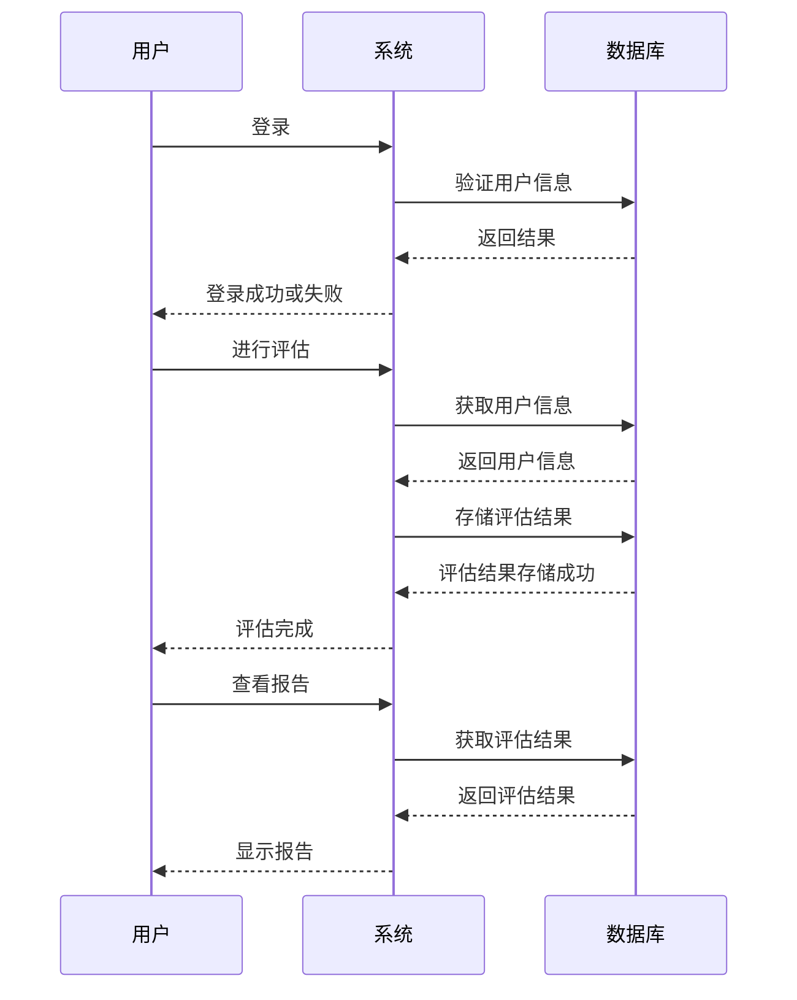
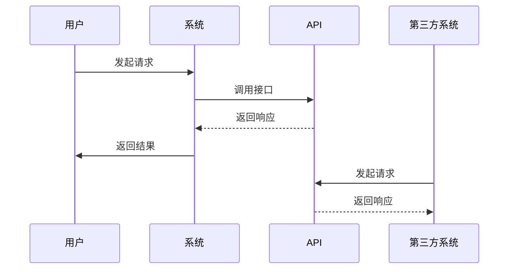

                 


# 数字素养认证体系：信息时代的能力评估

> 关键词：数字素养、认证体系、能力评估、信息时代、教育改革

> 摘要：本文将探讨数字素养认证体系在信息时代的重要性和必要性。通过背景介绍、核心概念与联系分析、算法原理讲解以及系统分析与架构设计，本文旨在为读者提供一个全面、系统的理解，并促进数字素养认证体系的发展和完善。

## 第一部分：背景介绍

### 1.1 数字素养的重要性

在信息时代，数字素养已成为个人、组织和社会的关键能力。它不仅仅包括对信息技术的基本理解和应用，还涉及信息识别、批判性思维、问题解决和创新能力。数字素养的重要性体现在以下几个方面：

1. **个人发展**：数字素养有助于个人在学习和工作中更高效地获取和处理信息，提高竞争力。
2. **组织效能**：数字素养能够提升组织的信息管理和决策能力，优化业务流程。
3. **社会进步**：数字素养有助于构建信息和谐社会，减少数字鸿沟，促进社会公平。

### 1.2 信息时代的能力评估需求

随着数字素养的普及，对能力评估的需求日益增长。然而，现有的评估体系往往缺乏针对性和全面性。数字素养评估的需求主要体现在以下几个方面：

1. **多样性**：评估应涵盖不同领域的数字素养，包括技术素养、信息素养、媒体素养和计算素养。
2. **精确性**：评估应能够准确反映个体的数字素养水平，为教育改革和人才培养提供依据。
3. **可操作性**：评估体系应具有可操作性，便于实施和管理。

### 1.3 数字素养认证体系概述

数字素养认证体系是一种系统化的评估机制，旨在全面、科学地评价个体的数字素养水平。它通常包括以下核心组成部分：

1. **认证原则**：确保评估的公正性、科学性和权威性。
2. **认证架构**：构建合理的认证层次和分类体系。
3. **实施过程**：规范认证流程，确保评估的顺利进行。

### 1.4 本书的结构安排

本书分为四个部分，旨在全面探讨数字素养认证体系的构建与实践：

1. **背景介绍**：阐述数字素养的重要性、信息时代的能力评估需求以及数字素养认证体系的概述。
2. **核心概念与联系**：分析数字素养的核心概念及其相互联系。
3. **算法原理讲解**：介绍数字素养评估的算法原理和实施方法。
4. **系统分析与架构设计**：探讨数字素养认证体系的系统架构和实际应用。

## 第二部分：核心概念与联系

### 2.1 数字素养的核心概念

数字素养是一个多维度的概念，包括以下几个核心要素：

1. **技术素养**：对信息技术的理解、应用和创新能力。
2. **信息素养**：对信息的识别、检索、评估和管理能力。
3. **媒体素养**：对媒体内容的理解和批判性思维能力。
4. **计算素养**：对计算思维和算法逻辑的理解与应用能力。

### 2.2 数字素养的属性特征对比

数字素养具有以下关键特征：

1. **多维性**：涵盖多个领域，涉及不同层面的能力。
2. **动态性**：随着技术的发展和变化，数字素养也在不断更新。
3. **综合性**：数字素养不仅涉及技术，还涉及社会、文化、伦理等多方面。

不同领域的数字素养特征对比如下表所示：

| 领域       | 技术素养 | 信息素养 | 媒体素养 | 计算素养 |
|------------|-----------|-----------|-----------|-----------|
| **核心特征** | 技术理解与应用 | 信息识别与处理 | 媒体批判性思维 | 计算思维与算法 |
| **层次结构** | 技术基础 - 高级 | 初级 - 高级 | 初级 - 高级 | 初级 - 高级 |

### 2.3 数字素养的ER实体关系图

下面是数字素养的ER实体关系图，展示了各要素之间的关系：

```mermaid
erDiagram
    A数字素养 ::= B技术素养 | C信息素养 | D媒体素养 | E计算素养
    A数字素养 _||_ B跨学科素养
```

## 第三部分：算法原理讲解

### 3.1 数字素养评估算法概述

数字素养评估算法是评估个体数字素养水平的关键。常见的评估算法包括：

1. **专家评估法**：通过专家对个体的数字素养进行综合评定。
2. **标准化测试**：采用统一的评估标准和测试工具，对个体进行定量评估。
3. **大数据分析**：利用大数据技术对个体的数字素养表现进行统计分析。

选择评估算法的标准包括：

1. **准确性**：算法应能够准确评估个体的数字素养水平。
2. **可操作性**：算法应便于实施和管理。
3. **灵活性**：算法应能够适应不同领域的数字素养评估需求。

### 3.2 评估算法mermaid流程图

下面是数字素养评估算法的mermaid流程图：


### 3.3 Python代码实现与算法原理

以下是一个简化版的数字素养评估算法的Python代码实现：

```python
# Python代码示例：数字素养评估算法简化实现
def assess_digital_literacy(score_list):
    total_score = sum(score_list)
    average_score = total_score / len(score_list)
    if average_score >= 90:
        return "高水平数字素养"
    elif average_score >= 60:
        return "中等水平数字素养"
    else:
        return "低水平数字素养"

# 假设以下分数代表某人在不同领域的数字素养得分
scores = [85, 75, 88, 92, 70]

# 执行评估
result = assess_digital_literacy(scores)
print(f"评估结果：{result}")
```

算法原理的数学模型和公式如下：

$$
\text{平均数字素养得分} = \frac{\sum_{i=1}^{n} \text{第}i\text{项得分}}{n}
$$

### 3.4 数学模型与公式

平均数字素养得分的计算公式为：

$$
\text{平均数字素养得分} = \frac{\sum_{i=1}^{n} \text{第}i\text{项得分}}{n}
$$

其中，$n$表示评估指标的数量，$\text{第}i\text{项得分}$表示个体在第$i$项指标上的得分。

### 3.5 举例说明

#### 3.5.1 数据收集与预处理

假设我们收集了某人在技术素养、信息素养、媒体素养和计算素养方面的得分，分别为85、75、88、92和70。

```python
scores = [85, 75, 88, 92, 70]
```

#### 3.5.2 评估算法执行过程

使用上述评估算法，我们可以计算平均数字素养得分，并根据得分判断个体的数字素养水平。

```python
def assess_digital_literacy(score_list):
    total_score = sum(score_list)
    average_score = total_score / len(score_list)
    if average_score >= 90:
        return "高水平数字素养"
    elif average_score >= 60:
        return "中等水平数字素养"
    else:
        return "低水平数字素养"

result = assess_digital_literacy(scores)
print(f"评估结果：{result}")
```

输出结果为“评估结果：中等水平数字素养”。

#### 3.5.3 结果分析与反馈

根据评估结果，我们可以为个体提供有针对性的培训和发展建议，帮助他们提升数字素养水平。

## 第四部分：系统分析与架构设计

### 4.1 问题场景介绍

在当前信息时代，数字素养已成为企业和教育机构的关注焦点。为了提高员工的数字素养和学生的信息素养，企业和学校需要建立一套系统化的数字素养认证体系。该体系应具备以下特点：

1. **全面性**：覆盖各个领域的数字素养。
2. **科学性**：采用科学的评估方法和算法。
3. **实用性**：易于实施和管理，能够为教学和培训提供有力支持。

### 4.2 项目介绍

本项目旨在构建一个数字素养认证体系，为企业和教育机构提供科学的数字素养评估工具。项目主要包括以下模块：

1. **数字素养评估模块**：用于评估个体的数字素养水平。
2. **培训与学习模块**：提供针对性的培训课程和学习资源。
3. **数据分析与报告模块**：对评估结果进行统计分析，生成报告。

### 4.3 系统功能设计

系统功能设计主要包括以下几个领域：

1. **用户管理**：用户注册、登录、信息管理等功能。
2. **评估工具**：提供多种评估工具，如在线测试、问卷调查等。
3. **课程管理**：课程发布、学习进度管理等功能。
4. **数据分析**：生成详细的数据报告，为教学和培训提供参考。

### 4.4 系统架构设计

系统架构设计采用分层架构，主要包括以下层次：

1. **表现层**：用于展示系统界面，包括用户交互界面和报表展示。
2. **业务逻辑层**：实现系统的核心功能，如评估、培训、数据分析等。
3. **数据访问层**：用于数据存储和访问，包括数据库、文件系统等。

以下是系统架构的mermaid架构图：



### 4.5 系统接口设计

系统接口设计主要包括以下部分：

1. **用户接口**：提供用户注册、登录、评估等功能。
2. **数据接口**：用于与其他系统进行数据交互，如课程数据、评估结果等。
3. **服务接口**：提供API接口，供第三方系统调用。

以下是系统接口设计的mermaid序列图：



### 4.6 系统交互

系统交互设计主要涉及用户与系统、系统与服务之间的交互过程。以下是系统交互的mermaid序列图：

```mermaid
sequenceDiagram
    participant 用户 as 用户
    participant 系统A as 系统
    participant 系统

