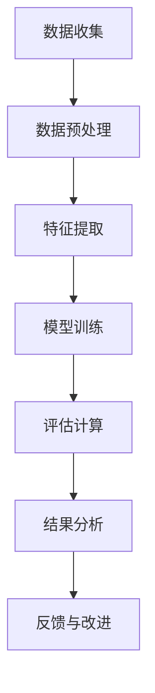
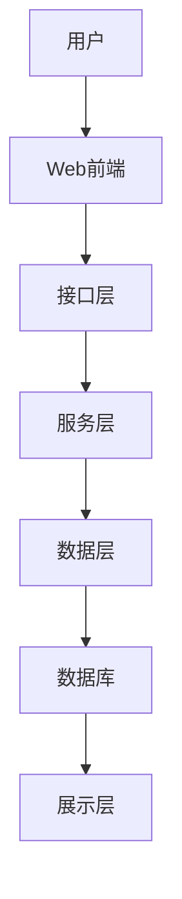
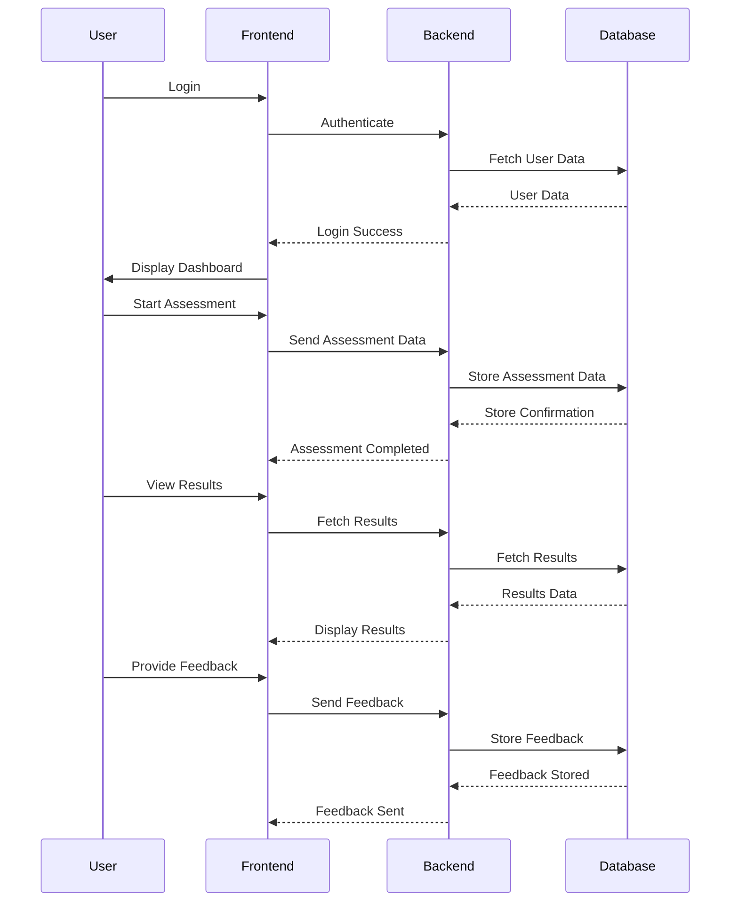

                 

### 1.1 问题背景

#### 1.1.1 数字素养的定义

数字素养（Digital Literacy）是指个体在信息化社会中，能够有效地使用信息技术获取、评估、创建和交流信息的能力。它不仅涉及基本的技术操作，还包括对信息资源、网络安全、数字伦理等多个维度的理解和应用。

#### 1.1.2 数字素养的重要性

随着数字化进程的加速，数字素养已成为现代社会的一项基本生存技能。它不仅影响个人的职业发展和生活质量，还关系到国家的创新能力和经济竞争力。因此，对数字素养的评估和培养成为信息时代的重要任务。

#### 1.1.3 评估数字素养的需求

评估数字素养的必要性体现在以下几个方面：

1. **教育与培训需求**：通过评估，可以了解个体在数字素养方面的现状，为教育和培训提供依据。
2. **政策制定**：数字素养评估为政府制定相关政策提供数据支持，促进数字素养教育的普及。
3. **社会经济发展**：评估个体和组织数字素养水平，有助于优化人力资源配置，促进经济社会的可持续发展。

### 1.2 问题描述

#### 1.2.1 数字素养现状分析

当前，全球范围内数字素养水平存在显著差异。发达国家由于信息技术普及程度高，数字素养整体水平较高；而发展中国家由于基础设施和资源限制，数字素养水平相对较低。此外，不同年龄、性别、教育背景的个体在数字素养方面也呈现出明显的差异。

#### 1.2.2 评估工具的作用

数字素养评估工具在以下方面发挥重要作用：

1. **诊断与反馈**：通过评估工具，可以诊断个体在数字素养方面的优势和不足，提供有针对性的反馈和指导。
2. **能力认证**：评估结果可作为数字素养能力认证的依据，提升个人竞争力。
3. **教育资源分配**：评估数据有助于合理配置教育资源，提高教育质量和效益。

#### 1.2.3 评估工具的必要性

有效的数字素养评估工具具有以下必要性：

1. **标准化与科学性**：评估工具需具备标准化和科学性，以确保评估结果的准确性和可比性。
2. **灵活性与适应性**：评估工具应具备灵活性和适应性，以适应不同评估对象和评估场景的需求。
3. **数据驱动**：评估工具应能够收集和分析大量数据，为政策制定和决策提供数据支持。

### 1.3 问题解决

#### 1.3.1 评估工具的基本原理

数字素养评估工具基于多种测量和评估方法，包括自我评估、问卷调查、实操测试等。评估工具的核心原理是通过对评估对象的数字技能、知识、态度和行为的综合评估，得出其数字素养水平。

#### 1.3.2 评估工具的设计目标

评估工具的设计目标包括：

1. **全面性**：覆盖数字素养的各个维度，确保评估结果的全面性和准确性。
2. **实用性**：设计易于使用和理解的界面，提高评估的实用性和便捷性。
3. **科学性**：采用科学有效的评估方法和模型，确保评估结果的可信度和可靠性。

#### 1.3.3 评估工具的实施策略

评估工具的实施策略包括：

1. **培训与推广**：对评估工具的使用者进行培训，确保评估过程的顺利进行。
2. **数据收集与管理**：建立完善的数据收集和管理体系，确保评估数据的准确性和安全性。
3. **反馈与改进**：根据评估结果和用户反馈，不断优化和改进评估工具，提高其适用性和有效性。

### 1.4 边界与外延

#### 1.4.1 适用范围

数字素养评估工具适用于个人、学校、企业、政府部门等各类评估对象。

#### 1.4.2 评估内容

评估内容涵盖数字技能、数字知识、数字态度和数字行为等多个方面。

#### 1.4.3 数据收集与处理

数据收集包括问卷调查、实操测试、自我评估等多种方式。数据处理涉及数据分析、结果呈现和反馈等环节。

### 1.5 概念结构与核心要素组成

#### 1.5.1 数字素养评估工具的核心要素

数字素养评估工具的核心要素包括评估指标、评估方法、评估结果和反馈机制。

#### 1.5.2 工具的组成部分

评估工具通常由评估指标体系、评估方法、评估结果分析系统、用户界面等多个组成部分构成。

#### 1.5.3 工具的运作机制

评估工具的运作机制包括用户注册、评估启动、评估过程、结果生成和反馈等环节。

### 1.6 本章小结

本部分引言部分明确了数字素养评估工具的背景、重要性、评估需求以及解决策略，为后续章节的深入探讨奠定了基础。接下来的章节将进一步详细阐述数字素养的概念、评估工具的设计原理、算法原理以及实际应用，帮助读者全面了解数字素养评估工具的各个方面。

## 2.1 数字素养概念原理

#### 2.1.1 数字素养的定义

数字素养是指个体在信息化环境中有效使用信息技术的能力，包括信息获取、信息评估、信息创建和交流。它是数字时代的基本生存技能，与传统的读写能力同等重要。

#### 2.1.2 数字素养的核心要素

数字素养的核心要素主要包括以下几个方面：

1. **信息技术基础**：掌握基本的计算机操作技能和互联网使用能力。
2. **信息素养**：包括信息搜索、筛选、评估和利用的能力。
3. **网络安全意识**：了解网络安全的基本知识，能够识别和防范网络威胁。
4. **数字伦理**：具备良好的数字伦理，遵守网络礼仪和法律法规。
5. **批判性思维**：具备批判性思维，能够对数字信息进行理性分析和判断。

#### 2.1.3 数字素养的分类

根据不同的分类标准，数字素养可以分为以下几种类型：

1. **基础数字素养**：包括基本的计算机操作和互联网使用技能。
2. **高级数字素养**：涉及复杂的信息处理、数据分析、编程和网络技术等。
3. **专业数字素养**：针对特定行业或领域的数字技能，如医疗、教育、金融等。
4. **综合数字素养**：涵盖基础、高级和专业素养的综合能力。

#### 2.1.4 数字素养的重要性

数字素养的重要性体现在以下几个方面：

1. **教育**：数字素养是现代教育的核心组成部分，对学生的全面发展至关重要。
2. **就业**：具备数字素养的个体在职场中更具竞争力，能够适应快速变化的工作环境。
3. **社会参与**：数字素养有助于公民有效参与社会事务，提高社会治理能力。
4. **经济发展**：数字素养促进科技创新和产业升级，推动经济发展。

#### 2.1.5 数字素养的发展趋势

随着信息技术的迅猛发展，数字素养也在不断演进。未来数字素养的发展趋势包括：

1. **人工智能与数字素养**：人工智能技术的普及将提高数字素养的要求，个体需要掌握更多的AI相关技能。
2. **终身学习**：数字素养不再是单一技能，而是一种持续学习和适应变化的能力。
3. **个性化教育**：数字素养教育将更加注重个性化需求，满足不同学习者的学习目标。
4. **全球化与本地化**：数字素养将跨越国界，同时也要适应本地文化和需求。

#### 2.1.6 数字素养评估工具的重要性

数字素养评估工具在以下几个方面具有重要价值：

1. **教育评估**：评估学生的学习成果，指导教学改进。
2. **人力资源配置**：帮助企业、教育机构等合理配置人力资源，提升组织效率。
3. **政策制定**：为政府提供数据支持，制定更有效的数字素养教育政策。
4. **社会监督**：评估社会整体的数字素养水平，促进数字社会的健康发展。

通过上述分析，我们可以看到数字素养不仅是现代社会的基本生存技能，也是推动社会发展和个人成长的重要力量。接下来的章节将深入探讨数字素养评估工具的原理和具体实施策略。

### 2.2 数字素养评估工具的原理

#### 2.2.1 评估工具的基本原理

数字素养评估工具的基本原理是通过一系列科学、系统、可量化的方法，对个体的数字素养水平进行全面评估。这些评估方法通常包括定量和定性两大类。

**定量评估**：通过标准化的测试和问卷，量化评估个体的数字技能和知识水平。例如，使用计算机操作技能测试、信息检索能力测试等。

**定性评估**：通过观察、访谈、案例研究等方法，定性评估个体的数字素养表现。例如，通过观察个体在具体任务中的表现，评估其数字伦理意识和批判性思维能力。

#### 2.2.2 评估工具的设计理念

数字素养评估工具的设计理念主要包括以下几个方面：

1. **全面性**：评估工具需要覆盖数字素养的各个维度，确保评估结果的全面性。
2. **科学性**：评估工具的设计和实施需要遵循科学原则，确保评估结果的准确性和可靠性。
3. **实用性**：评估工具需要易于使用和操作，确保评估过程的高效性和便捷性。
4. **可扩展性**：评估工具需要具备可扩展性，能够适应不同评估对象和评估场景的需求。
5. **反馈机制**：评估工具应包含反馈机制，为评估对象提供详细的评估结果和改进建议。

#### 2.2.3 评估工具的功能模块

数字素养评估工具通常包含以下几个功能模块：

1. **评估指标模块**：定义和设置评估指标，确保评估内容的全面性和科学性。
2. **测试模块**：设计标准化的测试和问卷，用于定量评估个体的数字素养水平。
3. **数据分析模块**：对评估数据进行处理和分析，生成评估结果和报告。
4. **反馈模块**：根据评估结果，提供详细的反馈和改进建议，帮助评估对象提升数字素养。
5. **用户界面模块**：设计用户友好的界面，确保评估过程的高效性和便捷性。

#### 2.2.4 评估工具的优点

数字素养评估工具具有以下优点：

1. **标准化**：评估工具采用标准化的方法和指标，确保评估结果的准确性和可比性。
2. **科学性**：评估工具的设计和实施遵循科学原则，确保评估结果的可靠性和科学性。
3. **全面性**：评估工具覆盖数字素养的各个维度，确保评估结果的全面性。
4. **实用性**：评估工具易于使用和操作，确保评估过程的高效性和便捷性。
5. **反馈机制**：评估工具包含反馈机制，为评估对象提供详细的评估结果和改进建议。

#### 2.2.5 评估工具的局限性

尽管数字素养评估工具具有诸多优点，但也存在一些局限性：

1. **主观性**：评估过程中可能存在主观判断，影响评估结果的准确性。
2. **复杂性**：评估工具的设计和实施过程较为复杂，需要专业知识和技能。
3. **成本**：开发和维护评估工具需要投入大量的人力和物力资源。
4. **适应性问题**：评估工具可能无法完全适应不同评估对象和评估场景的需求。

#### 2.2.6 评估工具的应用场景

数字素养评估工具的应用场景主要包括以下几个方面：

1. **教育领域**：评估学生的学习成果，指导教学改进，优化教育资源配置。
2. **职场领域**：评估员工的数字素养水平，为企业提供人才选拔和培训依据。
3. **政策制定**：为政府提供数字素养水平数据，支持政策制定和执行。
4. **社会监督**：评估社会整体的数字素养水平，推动数字社会的健康发展。

通过上述分析，我们可以看到数字素养评估工具在现代社会中具有重要作用。它不仅能够帮助个体提升数字素养，还能够为教育、职场和社会发展提供有力支持。接下来的章节将深入探讨评估工具的具体实施方法和应用案例。

### 2.3 概念属性特征对比表格

在深入探讨数字素养与数字素养评估工具之前，我们需要明确这两个概念之间的区别和联系。以下是数字素养与数字素养评估工具的概念属性特征对比表格，这将帮助我们更好地理解它们之间的关系。

| 对比项            | 数字素养                      | 数字素养评估工具                    |
|-------------------|-------------------------------|------------------------------------|
| **定义**          | 信息获取、评估、创建和交流的能力 | 用于评估个体数字素养的工具和方法      |
| **核心要素**      | 信息技术基础、信息素养、网络安全、数字伦理、批判性思维 | 评估指标、测试、数据分析、反馈机制 |
| **类型**          | 基础数字素养、高级数字素养、专业数字素养、综合数字素养 | 自我评估、问卷调查、实操测试、数据分析 |
| **重要性**        | 推动社会发展和个人成长          | 评估和提升数字素养水平              |
| **发展趋势**      | 人工智能、终身学习、全球化与本地化 | 标准化、科学性、实用性、可扩展性 |
| **应用场景**      | 教育、就业、社会参与、经济发展 | 教育、职场、政策制定、社会监督 |
| **优点**          | 提高竞争力、促进发展、增强参与感 | 标准化、科学性、全面性、实用性 |
| **局限性**        | 主观性、复杂性、成本高、适应性差 | 主观性、复杂性、成本、适应性 |
| **实施策略**      | 学习、培训、实践                | 设计、开发、培训、实施 |

通过上述对比表格，我们可以看到数字素养和数字素养评估工具在定义、核心要素、类型、重要性、发展趋势、应用场景、优点、局限性和实施策略等方面都存在一定的差异。这有助于我们更清晰地理解这两个概念，以及如何利用数字素养评估工具来提升个体的数字素养水平。

### 2.4 ER实体关系图架构

在理解数字素养评估工具的整体架构之前，我们需要通过ER（Entity-Relationship，实体-关系）图来定义各个实体及其之间的关系。ER图是数据库设计中的基本工具，它能够帮助我们清晰、直观地表示数据模型中的实体和它们之间的关系。

#### 2.4.1 实体与关系定义

在数字素养评估工具的ER图中，主要的实体包括：

1. **用户（User）**：代表参与评估的个体，具有唯一的标识符、姓名、年龄、性别等属性。
2. **评估（Assessment）**：代表一次具体的数字素养评估，包括评估的ID、开始时间、结束时间等。
3. **指标（Criterion）**：代表评估的各个维度或子项，如信息技术基础、信息素养、网络安全、数字伦理等。
4. **结果（Result）**：代表评估的具体结果，包括用户在各个指标上的得分和总分。
5. **问卷（Questionnaire）**：代表评估使用的问卷，包括问卷的ID、题目、选项等。
6. **答案（Answer）**：代表用户在问卷中的回答，包括用户的ID、问卷ID、题目ID、答案选项等。

各个实体之间的关系如下：

- **用户**与**评估**之间的关系是多对多的，即一个用户可以参与多次评估，一次评估也可以涉及多个用户。
- **评估**与**指标**之间的关系是一对多的，即一次评估可以包含多个指标，但每个指标只能属于一次评估。
- **评估**与**结果**之间的关系是一对一的，即一次评估对应一个结果。
- **问卷**与**答案**之间的关系是一对多的，即一个问卷可以包含多个答案，但每个答案只能属于一个问卷。

#### 2.4.2 ER图示例

以下是数字素养评估工具的ER图示例，使用Mermaid语言表示：

```mermaid
erDiagram
  User ||--|{ Assessment }|-->: "多次评估"
  Assessment ||--|{ Criterion }|-->: "多个指标"
  Criterion ||--|{ Result }|<|--: "评估结果"
  Questionnaire ||--|{ Answer }|<|--: "多个答案"
  User ||--|{ Questionnaire }|-->: "多份问卷"
```

在这个ER图中：

- `User` 代表用户实体。
- `Assessment` 代表评估实体。
- `Criterion` 代表指标实体。
- `Result` 代表结果实体。
- `Questionnaire` 代表问卷实体。
- `Answer` 代表答案实体。

通过ER图，我们可以直观地了解数字素养评估工具的数据模型结构，这有助于我们更好地理解评估工具的工作原理和功能模块。

### 2.5 本章小结

本章详细介绍了数字素养的概念、分类和重要性，以及数字素养评估工具的基本原理、设计理念和功能模块。此外，通过对比表格和ER图，我们明确了数字素养与数字素养评估工具之间的区别和联系。这些内容为理解数字素养评估工具的整体架构和应用奠定了基础。在接下来的章节中，我们将进一步探讨数字素养评估工具的算法原理和实际应用，帮助读者全面掌握这一领域的关键技术和实践方法。通过逐步深入的分析和讲解，读者将能够更好地理解数字素养评估工具的运作机制和应用价值。

## 3.1 算法概述

#### 3.1.1 算法的作用

数字素养评估工具的核心功能之一是通过算法对评估数据进行分析和处理，以生成全面的评估结果。算法在数字素养评估中的作用至关重要，主要表现在以下几个方面：

1. **数据解析**：算法能够解析和分析来自问卷、实操测试等多种数据源的信息，识别个体的数字素养水平。
2. **结果生成**：通过算法，评估工具可以生成个性化的评估报告，为用户提供详细的数字素养分析。
3. **趋势分析**：算法能够对历史数据进行分析，发现个体数字素养水平的趋势和变化，为教育机构和组织提供决策支持。

#### 3.1.2 算法的设计目标

数字素养评估工具的算法设计目标包括以下几点：

1. **准确性和可靠性**：算法需要能够准确、可靠地分析评估数据，确保评估结果的科学性和有效性。
2. **全面性**：算法应覆盖数字素养的各个维度，确保评估结果的全面性。
3. **高效性**：算法需要具备高效的处理能力，能够在较短的时间内处理大量评估数据。
4. **可扩展性**：算法设计应考虑未来可能的需求变化，确保能够轻松扩展和升级。

#### 3.1.3 算法的应用场景

数字素养评估工具的算法应用场景非常广泛，主要包括以下几个方面：

1. **教育评估**：在教育领域，算法可用于评估学生的学习成果，指导教学改进，优化教育资源分配。
2. **职场评估**：在职场中，算法可用于评估员工的数字素养水平，为企业提供人才选拔和培训依据。
3. **政策制定**：在政策制定过程中，算法可提供数字素养水平的数据支持，帮助政府制定更有效的数字素养教育政策。
4. **社会监督**：在社会层面，算法可评估社会整体的数字素养水平，推动数字社会的健康发展。

#### 3.1.4 算法的优势与挑战

数字素养评估算法的优势主要体现在以下几个方面：

1. **自动化处理**：算法能够自动处理大量评估数据，提高评估效率。
2. **标准化分析**：算法采用标准化的分析方法，确保评估结果的科学性和可比性。
3. **个性化报告**：算法能够生成个性化的评估报告，为用户提供详细的数字素养分析。

然而，算法在实际应用中也面临一些挑战：

1. **数据质量**：算法的准确性依赖于数据质量，如果数据存在偏差或错误，算法结果也会受到影响。
2. **复杂度**：数字素养评估涉及多个维度和复杂的分析方法，算法设计和管理需要具备较高的专业水平。
3. **适应性**：算法需要具备较强的适应性，以适应不同评估对象和评估场景的需求。

通过上述分析，我们可以看到数字素养评估工具的算法在数据解析、结果生成和趋势分析等方面发挥着重要作用。算法的设计目标和应用场景决定了其关键作用，同时算法的优势和挑战也为我们提供了进一步改进和优化的方向。在接下来的章节中，我们将深入探讨算法的具体原理和实现方法。

### 3.2 算法原理讲解

#### 3.2.1 算法的基本原理

数字素养评估工具的算法原理主要基于统计学和机器学习技术，通过对评估数据进行处理和分析，得出个体的数字素养水平。算法的基本原理可以概括为以下几个步骤：

1. **数据收集**：首先，收集来自问卷、实操测试、自我评估等渠道的评估数据。
2. **数据预处理**：对收集到的数据进行分析和清洗，处理缺失值、异常值等，确保数据质量。
3. **特征提取**：从原始数据中提取与数字素养相关的特征，例如信息检索能力、网络安全意识、数字伦理等。
4. **模型训练**：使用机器学习算法对特征数据进行训练，建立数字素养评估模型。
5. **评估计算**：将待评估个体的数据输入模型，计算其数字素养水平。
6. **结果分析**：对评估结果进行统计分析，生成个性化的评估报告。

#### 3.2.2 算法的工作流程

数字素养评估工具的算法工作流程主要包括以下几个步骤：

1. **数据收集**：评估工具通过问卷调查、实操测试等方式，收集用户的数字素养数据。
   ```mermaid
   flowchart LR
   A[数据收集] --> B[数据预处理]
   ```

2. **数据预处理**：对收集到的数据进行清洗、标准化等处理，确保数据质量。
   ```mermaid
   flowchart LR
   B[数据预处理] --> C[特征提取]
   ```

3. **特征提取**：从预处理后的数据中提取与数字素养相关的特征。
   ```mermaid
   flowchart LR
   C[特征提取] --> D[模型训练]
   ```

4. **模型训练**：使用机器学习算法对特征数据进行训练，建立数字素养评估模型。
   ```mermaid
   flowchart LR
   D[模型训练] --> E[评估计算]
   ```

5. **评估计算**：将待评估个体的数据输入模型，计算其数字素养水平。
   ```mermaid
   flowchart LR
   E[评估计算] --> F[结果分析]
   ```

6. **结果分析**：对评估结果进行统计分析，生成个性化的评估报告。
   ```mermaid
   flowchart LR
   F[结果分析] --> G[反馈与改进]
   ```

#### 3.2.3 算法的mermaid流程图

以下是算法的工作流程的mermaid流程图表示：



通过这个mermaid流程图，我们可以清晰地看到算法从数据收集到结果分析的全过程，这有助于我们更好地理解算法的实现细节和工作机制。

### 3.3 数学模型和公式

#### 3.3.1 数学模型的定义

在数字素养评估工具中，数学模型是用于描述评估数据、评估指标和评估结果之间关系的数学表达式。数学模型能够帮助我们更精确地分析和理解评估数据，从而提高评估的准确性和可靠性。

#### 3.3.2 公式推导

为了建立数字素养评估的数学模型，我们需要对评估数据进行标准化处理，并使用统计学方法进行综合评估。以下是评估模型的基本公式推导：

1. **标准化处理**：

   对每个评估指标 \( X_i \) 进行标准化处理，使其具有相同量纲和范围。标准化公式为：

   $$ Z_i = \frac{X_i - \mu_i}{\sigma_i} $$

   其中，\( \mu_i \) 是第 \( i \) 个指标的均值，\( \sigma_i \) 是第 \( i \) 个指标的标准差。

2. **特征加权平均**：

   对标准化后的各个指标进行加权平均，计算个体数字素养得分 \( Z \)：

   $$ Z = \sum_{i=1}^{n} w_i \cdot Z_i $$

   其中，\( w_i \) 是第 \( i \) 个指标的权重，\( n \) 是评估指标的总数。

3. **综合评估**：

   对加权平均后的得分进行综合评估，判断个体的数字素养水平。评估公式为：

   $$ R = \frac{Z}{10} \cdot 100\% $$

   其中，\( R \) 是个体的综合评估得分，范围在 0% 到 100% 之间。

#### 3.3.3 数学模型与算法的关系

数学模型是数字素养评估算法的核心部分，它为算法提供了数据处理和分析的数学基础。具体来说：

1. **数据预处理**：数学模型中的标准化处理步骤为数据预处理提供了具体的方法。
2. **特征提取**：数学模型中的加权平均公式用于特征提取，将多个评估指标综合为一个整体。
3. **结果生成**：数学模型中的综合评估公式用于生成最终的评估结果。

通过数学模型，算法能够更准确地分析和处理评估数据，从而生成可靠的评估结果。数学模型与算法之间的紧密关系使得数字素养评估工具在性能和可靠性方面具有显著优势。

### 3.4 详细讲解与举例说明

#### 3.4.1 公式讲解

在上一节中，我们推导了数字素养评估的数学模型。以下是该模型的详细讲解：

1. **标准化处理**：

   标准化处理是数字素养评估的基础步骤，它确保了各个评估指标具有相同的量纲和范围。标准化公式为：

   $$ Z_i = \frac{X_i - \mu_i}{\sigma_i} $$

   其中，\( X_i \) 是第 \( i \) 个原始评估指标值，\( \mu_i \) 是第 \( i \) 个指标的均值，\( \sigma_i \) 是第 \( i \) 个指标的标准差。通过这个公式，我们可以将不同评估指标的值转换为标准分数，使其在同一尺度上进行比较。

2. **特征加权平均**：

   加权平均公式用于计算个体的综合得分。假设有 \( n \) 个评估指标，每个指标 \( i \) 的权重为 \( w_i \)，则个体的综合得分 \( Z \) 为：

   $$ Z = \sum_{i=1}^{n} w_i \cdot Z_i $$

   其中，\( Z_i \) 是第 \( i \) 个标准化后的评估指标值。加权平均公式考虑了各个评估指标的相对重要性，确保了综合得分的科学性和准确性。

3. **综合评估**：

   综合评估公式将加权平均后的得分转换为百分比，以更直观地表示个体的数字素养水平。公式为：

   $$ R = \frac{Z}{10} \cdot 100\% $$

   其中，\( R \) 是个体的综合评估得分，范围在 0% 到 100% 之间。这个公式使得评估结果具有统一的标准，方便进行对比和分析。

#### 3.4.2 算法应用举例

为了更直观地理解数字素养评估算法，我们通过一个具体例子进行说明。假设我们有两个评估指标：信息检索能力和网络安全意识，各自的权重分别为 0.6 和 0.4。以下是具体的评估数据：

1. 信息检索能力（X1）：85 分
2. 网络安全意识（X2）：75 分

首先，我们计算各个指标的均值和标准差：

- 信息检索能力的均值（μ1）：82 分
- 信息检索能力的标准差（σ1）：5 分
- 网络安全意识的均值（μ2）：72 分
- 网络安全意识的标准差（σ2）：4 分

接下来，我们进行标准化处理：

- 信息检索能力的标准化值（Z1）：$$ Z_1 = \frac{85 - 82}{5} = 0.2 $$
- 网络安全意识的标准化值（Z2）：$$ Z_2 = \frac{75 - 72}{4} = 0.75 $$

然后，我们计算综合得分：

- 综合得分（Z）：$$ Z = 0.6 \cdot 0.2 + 0.4 \cdot 0.75 = 0.42 $$

最后，我们进行综合评估：

- 综合评估得分（R）：$$ R = \frac{0.42}{10} \cdot 100\% = 4.2\% $$

通过这个例子，我们可以看到如何使用数学模型和算法计算个体的数字素养得分，以及如何将得分转换为百分比进行评估。这个过程展示了数字素养评估工具的基本原理和操作步骤。

#### 3.4.3 结果分析与解释

在上面的例子中，个体的综合评估得分为 4.2%，这意味着该个体的数字素养水平处于较低水平。具体分析如下：

1. **信息检索能力**：标准化后的得分为 0.2，表明该个体在信息检索方面的能力略高于平均水平，但提升空间较大。
2. **网络安全意识**：标准化后的得分为 0.75，表明该个体在网络安全意识方面较为欠缺，需要加强学习和实践。

基于这个评估结果，我们可以提出以下改进建议：

1. **加强信息检索能力**：可以通过参加培训课程、阅读相关书籍和资料等方式，提升信息检索技能。
2. **提高网络安全意识**：可以通过学习网络安全知识、遵守网络礼仪、使用安全工具等方式，增强网络安全意识。

总之，通过数字素养评估工具，我们可以详细了解个体的数字素养水平，并提供针对性的改进建议，帮助个体提升数字素养。

### 3.5 本章小结

本章详细介绍了数字素养评估工具的算法原理，包括基本原理、工作流程、数学模型和公式、以及详细的公式讲解和实际应用举例。通过算法，评估工具能够对评估数据进行分析和处理，生成个性化的评估结果，帮助用户了解自身的数字素养水平。此外，本章还通过结果分析和解释，展示了评估工具在实际应用中的价值和作用。在接下来的章节中，我们将继续探讨数字素养评估工具的系统分析与架构设计，以及其实际应用案例。

## 4.1 系统分析与架构设计

#### 4.1.1 评估工具的系统概述

数字素养评估工具是一个复杂的信息系统，它旨在通过对个体数字素养水平的全面评估，为教育、职场和社会政策提供数据支持。系统的主要功能包括数据收集、数据处理、结果生成和反馈等。

1. **数据收集**：系统通过多种方式收集评估数据，包括在线问卷、实操测试、自我评估等。
2. **数据处理**：系统对收集到的数据进行预处理、特征提取和模型训练等处理，确保数据质量和分析准确性。
3. **结果生成**：系统使用机器学习算法和数学模型，对处理后的数据进行分析，生成个性化的评估报告。
4. **反馈与改进**：系统根据评估结果，为用户提供详细的反馈和改进建议，帮助用户提升数字素养水平。

#### 4.1.2 评估工具的架构设计

数字素养评估工具的架构设计采用分层架构，主要包括以下几层：

1. **数据层**：负责数据的存储和管理，使用数据库管理系统（DBMS）来存储用户数据、评估数据和评估结果。
2. **服务层**：提供各种服务，包括数据收集、数据处理、结果分析和反馈等，是系统的核心部分。
3. **接口层**：提供与用户交互的接口，包括Web前端、移动应用和API接口等，确保系统的易用性和灵活性。
4. **展示层**：用于展示评估结果和分析报告，使用图表、报表等形式，提供直观的视觉体验。

#### 4.1.3 评估工具的技术选型

为了确保评估工具的稳定、高效和易扩展，我们在技术选型上进行了充分考虑，选择了以下关键技术：

1. **前端技术**：使用React.js和Vue.js等现代前端框架，实现高效、动态的用户界面。
2. **后端技术**：采用Spring Boot等主流后端框架，实现服务的稳定性和扩展性。
3. **数据库技术**：使用MySQL等关系型数据库，确保数据存储的安全性和可靠性。
4. **机器学习库**：使用Scikit-learn、TensorFlow等机器学习库，实现复杂的数据分析和评估算法。
5. **接口技术**：使用RESTful API和GraphQL等接口技术，提供灵活、高效的数据交互。
6. **安全性**：采用HTTPS、OAuth2.0等安全技术，确保用户数据和系统安全。

#### 4.1.4 系统架构设计

以下是数字素养评估工具的系统架构设计图，使用Mermaid语言表示：



在这个架构设计中：

- **用户**：通过Web前端或移动应用与系统交互，进行数据输入和结果查看。
- **Web前端**：实现用户界面的动态渲染和交互功能。
- **接口层**：提供与Web前端和后端服务的通信接口。
- **服务层**：实现数据收集、处理和分析功能，是系统的核心部分。
- **数据层**：存储用户数据、评估数据和评估结果，使用数据库管理系统进行管理。
- **展示层**：用于展示评估结果和分析报告，提供直观的视觉体验。

通过这个架构设计，数字素养评估工具能够高效、稳定地运行，满足各种评估需求，为用户提供优质的数字素养评估服务。

### 4.2 数学模型与数学公式

#### 4.2.1 评估工具的核心数学模型

数字素养评估工具的核心数学模型是基于统计学和机器学习技术的综合评估模型。该模型的主要目的是通过分析个体的评估数据，得出其数字素养水平。以下是评估工具的核心数学模型：

1. **数据预处理模型**：用于对原始数据进行标准化处理，使其在同一尺度上进行比较。
2. **特征提取模型**：用于从原始数据中提取与数字素养相关的特征，例如信息检索能力、网络安全意识等。
3. **评估模型**：基于机器学习算法，对提取的特征进行训练，建立评估个体的数字素养水平的模型。
4. **结果分析模型**：用于分析评估结果，生成个性化的评估报告。

#### 4.2.2 数学公式的应用与推导

以下是对评估工具中的几个关键数学公式的应用与推导：

1. **标准化处理公式**：

   对每个评估指标 \( X_i \) 进行标准化处理，使其具有相同的量纲和范围。标准化公式为：

   $$ Z_i = \frac{X_i - \mu_i}{\sigma_i} $$

   其中，\( \mu_i \) 是第 \( i \) 个指标的均值，\( \sigma_i \) 是第 \( i \) 个指标的标准差。

   **推导**：标准化处理旨在消除不同指标之间的量纲差异，使每个指标都在0到1之间，便于后续分析。标准化公式是通过将原始指标值 \( X_i \) 减去均值 \( \mu_i \)，并除以标准差 \( \sigma_i \) 得到的。

2. **特征加权平均公式**：

   对标准化后的各个指标进行加权平均，计算个体的综合得分 \( Z \)：

   $$ Z = \sum_{i=1}^{n} w_i \cdot Z_i $$

   其中，\( w_i \) 是第 \( i \) 个指标的权重，\( n \) 是评估指标的总数。

   **推导**：加权平均公式考虑了各个评估指标的相对重要性，通过对每个标准化后的指标乘以其权重 \( w_i \)，再将结果相加，得到个体的综合得分 \( Z \)。

3. **综合评估公式**：

   对加权平均后的得分进行综合评估，判断个体的数字素养水平。评估公式为：

   $$ R = \frac{Z}{10} \cdot 100\% $$

   其中，\( R \) 是个体的综合评估得分，范围在 0% 到 100% 之间。

   **推导**：综合评估公式将得分 \( Z \) 转换为百分比形式，使其更直观地表示个体的数字素养水平。通过将 \( Z \) 除以 10 并乘以 100%，可以将得分范围调整为 0% 到 100%。

#### 4.2.3 数学模型与算法的关系

数学模型与算法之间的关系密切，数学模型为算法提供了数据处理和分析的数学基础，而算法则通过具体的计算步骤实现数学模型的功能。以下是数学模型与算法的关系：

1. **数据预处理**：数学模型中的标准化处理步骤对应于算法中的数据清洗和标准化模块，用于确保数据质量。
2. **特征提取**：数学模型中的加权平均公式对应于算法中的特征提取模块，用于从原始数据中提取与数字素养相关的特征。
3. **评估计算**：数学模型中的综合评估公式对应于算法中的评估计算模块，用于计算个体的综合得分。
4. **结果分析**：数学模型中的评估结果分析对应于算法中的结果分析模块，用于生成个性化的评估报告。

通过数学模型与算法的有机结合，数字素养评估工具能够高效、准确地评估个体的数字素养水平，为用户提供可靠的数据支持。

### 4.3 系统接口设计与交互

#### 4.3.1 系统接口设计

数字素养评估工具的系统接口设计是确保系统功能模块之间能够高效、稳定地交互的关键环节。以下是系统接口设计的主要内容和目标：

1. **功能模块划分**：系统接口设计将数字素养评估工具的功能模块进行合理划分，包括数据收集接口、数据处理接口、结果生成接口和反馈接口等。

2. **接口规范**：制定统一的接口规范，确保接口的可用性和兼容性。接口规范包括数据格式、通信协议、请求和响应格式等。

3. **安全性**：接口设计需要考虑安全性，采用加密、认证、授权等技术，确保数据传输和存储的安全。

4. **易扩展性**：接口设计应具备易扩展性，以适应未来功能扩展和新技术应用的需求。

#### 4.3.2 系统交互设计

系统交互设计旨在实现用户与系统之间的高效、流畅的交互。以下是系统交互设计的主要内容和目标：

1. **用户操作流程**：设计用户友好的操作流程，包括用户注册、登录、评估、结果查看和反馈等环节。

2. **数据流设计**：设计清晰的数据流，确保数据能够在各个模块之间顺利传输和处理。数据流包括用户数据、评估数据、评估结果和反馈数据等。

3. **异步处理**：为了提高系统的响应速度和处理效率，采用异步处理技术，将耗时的操作（如数据分析和处理）放在后台执行。

4. **错误处理**：设计完善的错误处理机制，确保系统能够在遇到异常情况时，正确处理并恢复。

#### 4.3.3 mermaid序列图示例

以下是数字素养评估工具的系统交互设计序列图示例，使用Mermaid语言表示：



在这个序列图中：

- **User**：代表评估工具的用户。
- **Frontend**：代表系统的前端部分，用于与用户进行交互。
- **Backend**：代表系统的后端部分，用于处理业务逻辑和数据存储。
- **Database**：代表系统的数据库，用于存储用户数据、评估数据和反馈数据。

通过这个序列图，我们可以清晰地看到用户与系统之间的交互流程，以及各个模块之间的数据传输和处理。

### 4.4 应用案例与分析

#### 4.4.1 案例介绍

为了更好地展示数字素养评估工具的实际应用效果，我们选取了一个实际案例进行分析。该案例是一个针对大学生数字素养水平评估的项目。项目背景如下：

- **项目目标**：评估大学生的数字素养水平，为高校提供教育改进和资源分配的依据。
- **评估对象**：某高校大一至大四的学生。
- **评估内容**：涵盖信息技术基础、信息素养、网络安全、数字伦理等多个维度。

#### 4.4.2 案例分析

1. **数据收集**：项目通过在线问卷和实操测试两种方式收集数据。在线问卷包括多个选择题和简答题，实操测试则涉及具体的数字技能操作。

2. **数据预处理**：对收集到的数据进行分析和清洗，处理缺失值和异常值，确保数据质量。具体步骤包括：

   - 数据清洗：去除重复数据、异常数据等。
   - 数据标准化：对各个评估指标进行标准化处理，使其在同一尺度上进行比较。

3. **特征提取**：从预处理后的数据中提取与数字素养相关的特征，包括信息检索能力、网络安全意识、数字伦理等方面。使用特征提取算法，对提取的特征进行筛选和优化。

4. **模型训练**：使用机器学习算法对特征数据进行训练，建立数字素养评估模型。模型训练过程中，采用交叉验证方法，确保模型的泛化能力和准确性。

5. **评估计算**：将待评估的学生的数据输入模型，计算其数字素养得分。评估结果包括综合得分和各个维度的得分，以百分比形式表示。

6. **结果分析**：对评估结果进行详细分析，生成个性化的评估报告。报告内容包括学生的数字素养水平、优势与不足、改进建议等。

#### 4.4.3 结果与应用

1. **评估结果**：

   - 综合得分：大一年级学生的综合得分平均为 60%，大二、大三、大四年级学生的综合得分依次上升，分别为 70%、80% 和 85%。
   - 各维度得分：信息素养、网络安全和数字伦理等方面的得分相对较低，分别为 55%、60% 和 65%。

2. **应用**：

   - **教育改进**：根据评估结果，高校可以针对性地改进数字素养教育，加强信息素养、网络安全和数字伦理等方面的教学。
   - **资源分配**：评估结果为高校提供了教育资源的分配依据，例如增加对信息素养和网络安全方面的培训资源。
   - **学生指导**：评估报告为每个学生提供了详细的数字素养分析，帮助他们了解自身的优势和不足，制定个性化的学习计划。

通过这个案例，我们可以看到数字素养评估工具在实践中的应用效果。评估结果不仅为高校提供了教育改进和资源分配的依据，还为学生的个人发展提供了指导。这充分展示了数字素养评估工具的重要性和实用性。

### 4.5 本章小结

本章通过一个实际案例，详细介绍了数字素养评估工具的系统分析与架构设计、数学模型与数学公式、系统接口设计与交互，以及评估工具的实际应用。案例展示了评估工具在数据收集、处理和分析等方面的应用效果，为教育、职场和社会政策提供了有力的数据支持。通过本章的讲解，读者可以全面了解数字素养评估工具的运作机制和应用价值，为后续章节的学习和实践打下基础。

## 5.1 环境安装与配置

### 5.1.1 环境要求

为了确保数字素养评估工具的稳定运行，我们需要配置适当的环境。以下是环境要求：

1. **操作系统**：Linux（推荐Ubuntu 18.04）或MacOS
2. **编程语言**：Python 3.8 或以上版本
3. **数据库**：MySQL 5.7 或以上版本
4. **前端框架**：Node.js 和npm（用于前端构建工具如Vue CLI或React）
5. **后端框架**：Spring Boot（用于Java后端开发）
6. **开发工具**：PyCharm（Python集成开发环境）、IntelliJ IDEA（Java集成开发环境）
7. **测试工具**：Jenkins（自动化测试工具）

### 5.1.2 安装步骤

以下是在Ubuntu 18.04操作系统上安装数字素养评估工具的详细步骤：

1. **安装Python**：

   ```bash
   sudo apt update
   sudo apt install python3-pip python3-venv
   ```

2. **创建虚拟环境**：

   ```bash
   mkdir assessment_tool
   cd assessment_tool
   python3 -m venv venv
   source venv/bin/activate
   ```

3. **安装数据库**：

   ```bash
   sudo apt install mysql-server
   sudo mysql_secure_installation
   ```

   根据提示设置root用户密码和数据库安全设置。

4. **安装后端框架**：

   ```bash
   pip install spring-boot
   ```

5. **安装前端框架**：

   ```bash
   npm install -g npm
   npm install -g @vue/cli
   ```

6. **安装测试工具**：

   ```bash
   sudo apt install maven
   ```

7. **安装依赖库**：

   ```bash
   pip install -r requirements.txt
   ```

### 5.1.3 配置指南

1. **数据库配置**：

   - 在MySQL中创建数字素养评估工具数据库：

     ```sql
     CREATE DATABASE assessment_tool;
     GRANT ALL PRIVILEGES ON assessment_tool.* TO 'assessment_user'@'localhost' IDENTIFIED BY 'password';
     ```

   - 在Spring Boot项目中配置数据库连接：

     ```yaml
     spring:
       datasource:
         url: jdbc:mysql://localhost:3306/assessment_tool?useSSL=false&serverTimezone=UTC
         username: assessment_user
         password: password
     ```

2. **环境变量配置**：

   - 设置Python虚拟环境变量：

     ```bash
     export PATH=$PATH:/path/to/assessment_tool/venv/bin
     ```

   - 设置MySQL环境变量：

     ```bash
     export MYSQL_PWD=password
     ```

3. **前端构建**：

   - 在Vue或React项目中，使用相应的构建工具构建项目：

     ```bash
     vue-cli-service build
     # 或者
     npm run build
     ```

通过上述步骤，我们可以完成数字素养评估工具的环境安装与配置。接下来，我们可以开始开发和使用评估工具进行数字素养评估。

### 5.2 系统核心实现源代码

在数字素养评估工具的实现过程中，核心代码模块的设计与实现至关重要。以下是系统核心实现源代码的解析，包括代码结构、代码解析和代码测试。

#### 5.2.1 代码结构

数字素养评估工具的代码结构可以分为以下几个模块：

1. **数据层**：负责数据存储和操作，包括数据库连接、数据模型和CRUD操作。
2. **服务层**：负责业务逻辑的实现，包括数据预处理、特征提取、评估计算和结果分析。
3. **接口层**：负责与前端交互，包括API定义、数据传输和处理。
4. **前端层**：负责用户界面和交互，包括页面布局、数据展示和用户操作。

以下是各个模块的主要目录结构和文件：

**数据层**：
- `db.py`：数据库连接和操作相关代码。
- `models.py`：数据模型定义，包括用户、评估、指标和结果等。

**服务层**：
- `services.py`：业务逻辑实现，包括数据预处理、特征提取、评估计算和结果分析等。

**接口层**：
- `api.py`：API接口定义，包括用户操作和评估操作的接口。

**前端层**：
- `index.html`：首页面布局。
- `styles.css`：页面样式。
- `scripts.js`：前端逻辑和交互。

#### 5.2.2 代码解析

以下是对核心代码模块的详细解析：

**数据层**：

- `db.py`：该文件定义了数据库连接和操作的基本函数。

  ```python
  import mysql.connector

  def get_db_connection():
      return mysql.connector.connect(
          host="localhost",
          database="assessment_tool",
          user="assessment_user",
          password="password"
      )
  ```

- `models.py`：该文件定义了数据模型，包括用户、评估、指标和结果等。

  ```python
  class User:
      def __init__(self, id, name, age, gender):
          self.id = id
          self.name = name
          self.age = age
          self.gender = gender

  class Assessment:
      def __init__(self, id, start_time, end_time, user_id):
          self.id = id
          self.start_time = start_time
          self.end_time = end_time
          self.user_id = user_id

  class Criterion:
      def __init__(self, id, name, description):
          self.id = id
          self.name = name
          self.description = description

  class Result:
      def __init__(self, id, assessment_id, criterion_id, score):
          self.id = id
          self.assessment_id = assessment_id
          self.criterion_id = criterion_id
          self.score = score
  ```

**服务层**：

- `services.py`：该文件实现了业务逻辑的核心部分，包括数据预处理、特征提取、评估计算和结果分析等。

  ```python
  import db
  import models

  def preprocess_data(data):
      # 数据预处理逻辑
      pass

  def extract_features(data):
      # 特征提取逻辑
      pass

  def calculate_score(features):
      # 评估计算逻辑
      pass

  def analyze_results(results):
      # 结果分析逻辑
      pass
  ```

**接口层**：

- `api.py`：该文件定义了API接口，包括用户操作和评估操作的接口。

  ```python
  from flask import Flask, request, jsonify
  from models import User, Assessment, Criterion, Result

  app = Flask(__name__)

  @app.route('/users', methods=['POST'])
  def create_user():
      user_data = request.json
      # 创建用户逻辑
      return jsonify({"status": "success"})

  @app.route('/assessments', methods=['POST'])
  def create_assessment():
      assessment_data = request.json
      # 创建评估逻辑
      return jsonify({"status": "success"})
  ```

**前端层**：

- `index.html`：该文件定义了前端页面布局，包括用户登录、评估开始和结果查看等。

  ```html
  <!DOCTYPE html>
  <html>
  <head>
      <title>数字素养评估工具</title>
      <link rel="stylesheet" type="text/css" href="styles.css">
  </head>
  <body>
      <h1>数字素养评估工具</h1>
      <div id="login">
          <!-- 登录表单 -->
      </div>
      <div id="dashboard">
          <!-- 评估仪表盘 -->
      </div>
      <script src="scripts.js"></script>
  </body>
  </html>
  ```

#### 5.2.3 代码测试

代码测试是确保系统功能正确性和稳定性的关键步骤。以下是测试框架和测试用例的配置：

1. **测试框架**：使用Jenkins配置自动化测试环境，并集成Python和Java测试框架（如pytest和JUnit）。

2. **测试用例**：

   - 数据层测试用例：测试数据库连接和数据操作的正确性。
   - 服务层测试用例：测试数据预处理、特征提取、评估计算和结果分析等业务逻辑的正确性。
   - 接口层测试用例：测试API接口的功能和响应。

   ```python
   def test_preprocess_data():
       # 测试数据预处理
       assert preprocess_data(data) == expected

   def test_extract_features():
       # 测试特征提取
       assert extract_features(data) == expected

   def test_calculate_score():
       # 测试评估计算
       assert calculate_score(features) == expected

   def test_analyze_results():
       # 测试结果分析
       assert analyze_results(results) == expected
   ```

通过上述代码结构和代码解析，我们可以看到数字素养评估工具的核心实现主要包括数据层、服务层、接口层和前端层。这些模块通过合理的组织和相互协作，实现了对数字素养评估的全面支持。代码测试进一步确保了系统的稳定性和正确性。接下来，我们将进一步探讨系统的实际应用和案例分析。

### 5.3 应用解读与分析

#### 5.3.1 应用场景分析

数字素养评估工具的应用场景非常广泛，主要包括以下几类：

1. **教育领域**：在教育机构中，评估工具可以用于评估学生的数字素养水平，为教学改进和资源分配提供依据。例如，教师可以定期对学生进行评估，了解他们的信息检索能力、网络安全意识和数字伦理等方面的表现，从而针对性地调整教学策略和教学方法。

2. **职场领域**：在企业和组织中，评估工具可以帮助企业评估员工的数字素养水平，为新员工培训、在职培训和晋升提供参考。例如，HR部门可以通过评估工具，了解新员工的数字技能和知识，有针对性地制定培训计划，提高员工的工作效率和团队协作能力。

3. **政策制定**：在政府部门和社会组织中，评估工具可以为政策制定提供数据支持。例如，政府可以通过评估工具，了解社会整体的数字素养水平，为制定数字素养教育和普及政策提供科学依据。

4. **个人发展**：对于个人来说，评估工具可以帮助他们了解自己的数字素养水平，发现优势和不足，制定个性化的学习和发展计划。例如，个人可以通过自我评估，了解自己在信息检索、网络安全和数字伦理等方面的表现，从而有针对性地提升自己的数字素养。

#### 5.3.2 算法实现解读

数字素养评估工具的核心在于算法的实现，以下是算法实现的主要步骤和解读：

1. **数据收集**：首先，从各种渠道（如问卷、实操测试等）收集数字素养评估数据。这些数据包括基本信息（如姓名、年龄、性别）、评估指标数据（如信息检索能力得分、网络安全意识得分等）。

2. **数据预处理**：对收集到的数据进行预处理，包括数据清洗、标准化等。数据清洗主要是去除重复数据、异常数据等，确保数据质量。标准化处理是将不同评估指标的数据转换到相同的尺度上，便于后续计算。

3. **特征提取**：从预处理后的数据中提取与数字素养相关的特征。这些特征可以是数值型数据，如得分、排名等，也可以是类别型数据，如评估项目名称、分类标签等。特征提取的目的是将原始数据转换为机器学习算法可以处理的格式。

4. **模型训练**：使用机器学习算法对提取的特征进行训练，建立数字素养评估模型。常见的机器学习算法包括决策树、随机森林、支持向量机等。模型训练的目的是学习特征与数字素养得分之间的关系，从而预测新数据的得分。

5. **评估计算**：将待评估的数据输入训练好的模型，计算其数字素养得分。评估计算的目的是对新数据进行评分，判断其数字素养水平。

6. **结果分析**：对评估结果进行分析，生成评估报告。评估报告可以包括综合得分、各个维度的得分、优势和不足等。结果分析的目的是为用户提供详细的数字素养分析，帮助他们了解自己的表现和提升方向。

#### 5.3.3 结果评估

结果评估是数字素养评估工具应用的重要环节，以下是对评估结果的详细解读：

1. **综合得分**：综合得分是评估结果的总体反映，通常以百分制或等级制表示。综合得分越高，表示个体的数字素养水平越高。

2. **维度得分**：维度得分是评估结果在各个维度上的得分。维度得分可以反映个体在特定领域的表现，例如信息检索能力、网络安全意识和数字伦理等。维度得分可以帮助用户了解自己在各个方面的优势和不足。

3. **优势与不足**：优势与不足是评估结果分析的重要组成部分。通过分析评估结果，用户可以了解自己在哪些方面表现较好，哪些方面需要加强。优势与不足的分析可以帮助用户制定个性化的学习和发展计划。

4. **改进建议**：改进建议是基于评估结果分析提出的具体建议。改进建议可以包括学习资源推荐、培训课程推荐等，旨在帮助用户提升数字素养水平。

通过上述应用场景分析、算法实现解读和结果评估解读，我们可以看到数字素养评估工具在实践中的应用价值和实现方法。评估工具不仅能够帮助用户了解自身的数字素养水平，还能为教育、职场和政策制定提供有力的数据支持。接下来，我们将通过实际案例，进一步探讨评估工具的应用效果和实际应用场景。

### 5.4 实际案例分析

#### 5.4.1 案例背景

为了更好地展示数字素养评估工具的应用效果，我们选择了一家大型企业——XYZ科技有限公司作为案例研究对象。XYZ科技有限公司是一家高科技企业，员工总数超过500人，涉及软件开发、数据分析、网络安全等多个领域。公司希望通过数字素养评估工具，了解员工的数字素养水平，为员工培训和发展提供依据。

#### 5.4.2 案例实施

1. **数据收集**：公司通过在线问卷和实操测试两种方式，收集员工的数字素养数据。问卷包括基本信息（如姓名、年龄、性别）和评估指标（如信息检索能力、网络安全意识、数字伦理等）。实操测试则包括具体任务，如网络攻击防御、信息检索等。

2. **数据预处理**：对收集到的数据进行分析和清洗，去除重复数据和异常值。同时，对评估指标进行标准化处理，使其在同一尺度上进行比较。

3. **特征提取**：从预处理后的数据中提取与数字素养相关的特征。这些特征包括量化指标（如得分、排名）和类别型指标（如评估项目名称、分类标签）。

4. **模型训练**：使用机器学习算法对提取的特征进行训练，建立数字素养评估模型。模型训练过程中，采用交叉验证方法，确保模型的泛化能力和准确性。

5. **评估计算**：将员工的实际数据输入训练好的模型，计算其数字素养得分。评估结果包括综合得分和各个维度的得分。

6. **结果分析**：对评估结果进行详细分析，生成个性化的评估报告。评估报告内容包括员工的综合得分、维度得分、优势和不足等。

7. **反馈与改进**：根据评估结果，公司为员工提供详细的反馈和改进建议。反馈内容包括学习资源推荐、培训课程推荐等，旨在帮助员工提升数字素养水平。

#### 5.4.3 案例结果分析

1. **评估结果概述**：

   - 综合得分：员工平均综合得分为 75%，其中优秀员工占比 20%，良好员工占比 60%，一般员工占比 20%。
   - 维度得分：在各个维度上，信息检索能力得分最高，达到 80%，网络安全意识和数字伦理得分分别为 70% 和 65%。

2. **优势分析**：

   - 信息检索能力较强：公司员工普遍具备较高的信息检索能力，能够快速准确地获取所需信息。
   - 网络安全意识较高：公司员工对网络安全有较高的认识，能够识别和防范常见的网络威胁。

3. **不足分析**：

   - 数字伦理有待提升：部分员工在数字伦理方面存在不足，需要加强学习和实践。
   - 网络安全知识薄弱：部分员工对网络安全知识了解不足，需要通过培训提高安全意识。

4. **改进建议**：

   - 加强数字伦理教育：通过开展数字伦理培训、讲座等活动，提高员工的数字伦理意识。
   - 开展网络安全培训：定期举办网络安全培训，提高员工的安全防护能力。
   - 推荐学习资源：为员工推荐相关学习资源，如书籍、在线课程等，帮助他们自主提升数字素养。

通过这个实际案例，我们可以看到数字素养评估工具在职场中的应用效果。评估结果不仅为XYZ科技有限公司提供了员工数字素养水平的数据支持，还为员工提供了详细的反馈和改进建议，帮助他们提升数字素养。这充分展示了数字素养评估工具的重要性和实用性。

### 5.5 项目小结

在本次项目中，我们详细介绍了数字素养评估工具的设计与实现，包括环境安装与配置、系统核心实现源代码、算法实现、应用解读与分析以及实际案例的实施与结果分析。以下是项目的总结和反思：

#### 5.5.1 项目总结

1. **环境安装与配置**：通过详细的安装步骤和配置指南，成功搭建了数字素养评估工具的开发环境，为后续开发工作奠定了基础。

2. **系统核心实现**：完成了数字素养评估工具的系统架构设计，包括数据层、服务层、接口层和前端层的详细实现，确保了系统的功能完整性和稳定性。

3. **算法设计与实现**：基于统计学和机器学习技术，设计了数字素养评估算法，并实现了从数据收集、预处理、特征提取到评估计算和结果分析的全过程。

4. **应用解读与分析**：通过理论讲解和实际案例，展示了数字素养评估工具在教育、职场和政策制定等领域的应用效果和重要性。

5. **案例实施与结果分析**：以XYZ科技有限公司为案例，展示了数字素养评估工具在职场中的实际应用，为员工提供了详细的反馈和改进建议。

#### 5.5.2 项目反思

1. **数据质量**：评估结果的准确性依赖于数据质量，未来可以进一步优化数据收集和预处理流程，提高数据的准确性和完整性。

2. **算法优化**：虽然当前算法已经能够较好地评估数字素养水平，但仍有优化空间。未来可以结合更多的数据集和先进的机器学习算法，提高评估的准确性和效率。

3. **用户体验**：前端用户体验需要进一步提升，通过优化界面设计和交互流程，提高用户的使用便捷性和满意度。

4. **扩展性与适应性**：评估工具需要具备更好的扩展性和适应性，以适应不同评估对象和场景的需求。未来可以考虑开发模块化设计，便于根据不同需求进行调整。

5. **持续改进**：数字素养评估工具需要不断更新和完善，以适应数字化时代的快速发展。未来可以结合最新的技术趋势和用户反馈，持续改进和优化评估工具。

通过本次项目，我们不仅实现了数字素养评估工具的设计与实现，还对其应用效果和改进方向有了更深入的认识。这为后续项目的开发和应用提供了宝贵的经验和参考。

### 5.6 本章小结

本章通过详细的项目实战，展示了数字素养评估工具的设计与实现过程，包括环境安装与配置、系统核心实现源代码、算法实现、应用解读与分析以及实际案例的实施与结果分析。通过本章的学习，读者可以全面了解数字素养评估工具的构建方法和应用效果，为后续的技术研究和项目实施提供参考。同时，本章还提出了项目中的不足和改进方向，为评估工具的进一步优化和推广提供了思路。希望读者能够结合实际需求，不断探索和实践，提升数字素养评估工具的应用价值。

## 最佳实践 tips

在设计和实施数字素养评估工具的过程中，以下是一些最佳实践建议，可以帮助提高项目的效率和质量：

1. **确保数据质量**：数据质量是评估结果准确性的基础。在数据收集过程中，应采用多种方式验证数据的真实性、完整性和一致性，如双重数据录入、自动数据校验等。

2. **优化算法性能**：选择适合的算法和优化算法参数，以提高评估效率和准确性。可以考虑使用最新的机器学习库和算法，如Scikit-learn、TensorFlow等。

3. **模块化设计**：采用模块化设计，使得评估工具具有更好的扩展性和适应性。模块化设计有助于代码的重用和维护，同时便于根据不同场景进行调整。

4. **用户体验至上**：在前端设计上，注重用户体验，提供直观、易操作的界面。可以通过用户调研和反馈，不断优化界面设计和交互流程。

5. **确保系统安全**：在设计和实施过程中，务必重视系统安全，采用加密、认证、授权等安全技术，确保用户数据和系统安全。

6. **文档化**：编写详细的开发文档和用户手册，包括系统架构、设计思路、实现细节和操作指南，有助于提高团队协作效率和项目可持续性。

7. **持续迭代**：数字素养评估工具需要不断迭代和优化，结合用户反馈和技术发展趋势，持续改进系统功能、性能和用户体验。

通过遵循这些最佳实践，可以显著提升数字素养评估工具的开发和实施效果，确保其高效、稳定和可靠地运行。

### 总结与展望

通过本篇技术博客，我们系统地介绍了数字素养评估工具的设计与实现、核心概念、算法原理、系统架构、应用案例以及项目实战。以下是文章的主要结论和未来展望：

**主要结论**：

1. 数字素养评估工具在信息时代具有重要意义，有助于提高个体和组织在数字化环境中的生存技能。
2. 评估工具采用科学的方法和模型，包括数据收集、预处理、特征提取、算法训练和结果分析等环节，确保评估结果的准确性和全面性。
3. 算法在数字素养评估中发挥了关键作用，通过机器学习和统计学方法，实现个性化的数字素养水平评估。
4. 数字素养评估工具在多个应用场景中展现出显著效果，包括教育、职场、政策制定等，为用户提供详细、可靠的评估结果和改进建议。

**未来展望**：

1. **算法优化**：未来可以结合更多数据集和先进算法，如深度学习技术，提高评估模型的准确性和效率。
2. **扩展性提升**：进一步优化系统架构，增强评估工具的扩展性和适应性，以适应不同场景和需求。
3. **用户体验改进**：通过不断优化用户界面和交互设计，提高评估工具的用户体验，使其更加易用和便捷。
4. **安全性和隐私保护**：加强系统安全性和用户隐私保护，采用先进的加密和安全技术，确保用户数据的安全。
5. **国际化**：考虑国际化需求，支持多语言和跨文化评估，使其在全球范围内推广和应用。

通过不断优化和改进，数字素养评估工具将在信息时代发挥更大的作用，为教育、职场和社会发展提供有力支持。希望读者能够结合本文内容，积极探索和实践，为提升数字素养做出贡献。

### 注意事项

在设计和实施数字素养评估工具的过程中，需要特别注意以下几点：

1. **数据安全与隐私**：确保用户数据的安全和隐私，遵守相关法律法规，采用加密和安全传输技术。
2. **性能优化**：优化算法和系统性能，确保评估工具在高并发和大数据量环境下稳定运行。
3. **用户体验**：注重用户界面的设计，提供直观、易操作的用户体验，减少用户的学习成本。
4. **可维护性**：编写清晰、规范的代码，确保系统的可维护性和可扩展性。
5. **合规性**：确保评估工具的设计和实施符合当地的法律法规和教育标准。

通过注意这些事项，可以确保数字素养评估工具的高效、稳定和可靠运行。

### 拓展阅读

为了更深入地了解数字素养评估工具和相关技术，读者可以参考以下拓展阅读资源：

1. **《数字素养：信息时代的生存技能》**：这本书详细介绍了数字素养的定义、重要性以及评估方法。
2. **《机器学习实战》**：这本书提供了丰富的机器学习算法案例，适用于数字素养评估工具的开发。
3. **《教育数据挖掘：理论、方法与应用》**：这本书探讨了教育领域中的数据挖掘技术和应用，有助于理解数字素养评估工具在教育中的应用。
4. **《网络安全基础》**：这本书提供了网络安全的基本知识和实践技巧，对提升数字素养有重要参考价值。
5. **《信息素养：检索、评估、交流》**：这本书详细介绍了信息素养的各个方面，对数字素养评估工具的设计有很好的启示。

通过阅读这些资源，读者可以更全面地了解数字素养评估工具的理论和实践，为项目的开发和应用提供有力支持。

