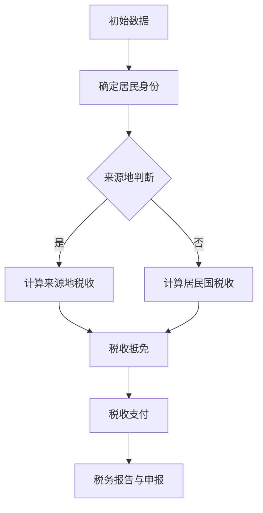

                 

### 引言

#### 1.1 问题的背景

在当今全球化的时代，数字经济正以前所未有的速度蓬勃发展。互联网、大数据、云计算和人工智能等新兴技术的广泛应用，不仅改变了人们的生活方式，也深刻影响了全球经济结构和商业模式。在这种背景下，跨国企业成为了推动全球经济增长的重要力量，它们通过在多个国家开展业务，实现了资源的最优配置和市场扩张。

然而，随着数字经济的发展，税收问题也日益复杂化。传统的税收制度在应对跨国企业的税收时显得力不从心，出现了许多漏洞和挑战。首先，全球化和数字经济的兴起使得企业可以通过各种手段实现税收优化，甚至逃避税收，这直接影响了各国政府的财政收入。其次，数字经济的虚拟性和跨国性使得税收管辖权的认定变得模糊，传统的基于实体经济的税收规则难以适应数字经济的特性。

此外，跨国企业税收政策的变化也带来了新的挑战。各国政府为了吸引外资和促进本地企业发展，不断调整税收政策，这导致跨国企业在不同国家面临不同的税收环境，增加了税务管理的复杂性。同时，全球税收治理体系也在不断改革，以应对跨国企业税收问题，但改革的过程并不顺利，存在许多争议和分歧。

综上所述，数字经济中的税收挑战不仅关系到跨国企业的利益，也影响着全球税收体系的稳定和公正。因此，深入研究跨国企业税收与数字税的问题，对于完善全球税收治理、维护各国税收权益具有重要意义。

#### 1.2 核心概念

在本篇文章中，我们将探讨以下几个核心概念：

**跨国企业税收**：跨国企业税收是指跨国企业在其全球业务运营过程中，在不同国家所承担的税收义务。这包括企业所得税收、财产税、流转税等多个方面。跨国企业税收的复杂性主要源于不同国家对税收规则的不同解释和应用。

**数字税**：数字税是指对数字经济中的企业，特别是跨国互联网公司征收的一种税收。数字税的征收主要针对企业的数字营业收入，而不一定是其实际利润。这种税收制度旨在应对传统税收规则在数字经济环境下的不适应性。

**国际税收规则**：国际税收规则是指各国政府在制定和实施税收政策时，所遵循的跨国税收合作原则和规范。这些规则旨在确保跨国企业在全球范围内的税收公平和合理，防止税收逃逸和规避行为。

**税收协定**：税收协定是两个或多个国家之间签订的协议，旨在避免双重征税和防止税收逃逸。税收协定通常规定了跨国企业在不同国家应承担的税收义务，以及如何处理跨国交易中的税收问题。

通过对比这些核心概念，我们可以更清晰地理解跨国企业税收与数字税之间的区别和联系，为后续的分析和讨论打下坚实的基础。

#### 1.3 研究目的与结构

本文的研究目的是深入探讨数字经济中的税收挑战，特别是跨国企业税收与数字税的问题，以期为全球税收治理提供有益的思考和解决方案。文章将按照以下结构展开：

**第1章 引言**：简要介绍数字经济中税收挑战的背景、核心概念和研究目的。

**第2章 跨国企业税收概述**：详细解析跨国企业税收的基本概念、国际税收规则和现状与挑战。

**第3章 数字税的概念与影响**：介绍数字税的基本概念、立法与实践以及对数字经济的影响。

**第4章 跨国企业与数字税的互动分析**：分析跨国企业应对数字税的策略、案例分析以及数字税的未来发展趋势。

**第5章 税收挑战下的全球合作**：探讨全球税收治理的改革方向、跨国企业与政府间的互动以及合作的重要性。

通过这种结构化的方式，我们希望能够系统地揭示跨国企业税收与数字税之间的复杂关系，为读者提供全面的视角和深入的理解。

### 第2章 跨国企业税收概述

#### 2.1 跨国企业税收的基本概念

跨国企业税收是指跨国企业在其全球业务运营过程中，在不同国家所承担的税收义务。这些税收主要包括企业所得税收、财产税、流转税等多个方面。企业所得税收是指跨国企业在其全球范围内的经营所得所应缴纳的税款；财产税则涉及企业在各国的房产、设备等财产的税收；而流转税则包括企业在跨国交易中所产生的税费，如增值税、关税等。

跨国企业税收的复杂性主要源于以下几个方面：

1. **税收管辖权问题**：跨国企业在不同国家运营，往往涉及多个国家的主权税收管辖权。不同国家对税收管辖权的认定标准不同，这导致税收争议和纠纷。

2. **跨国交易特性**：跨国企业往往通过跨国交易实现资源的最优配置，如跨国投资、转让定价等。这些交易形式复杂，涉及多个国家的税收利益，增加了税务管理的复杂性。

3. **税收优惠政策**：各国政府为了吸引外资和促进本地企业发展，往往提供各种税收优惠政策。这些政策在不同国家之间可能存在差异，进一步增加了跨国企业税收管理的难度。

#### 2.2 国际税收规则与税收协定

国际税收规则是指各国政府在制定和实施税收政策时，所遵循的跨国税收合作原则和规范。这些规则旨在确保跨国企业在全球范围内的税收公平和合理，防止税收逃逸和规避行为。国际税收规则主要包括以下几个方面：

1. **避免双重征税**：双重征税是指同一笔收入或财产在两个或多个国家同时被征税。为了避免这种情况，各国通过签订税收协定，明确划分税收管辖权，确保跨国企业在不同国家缴纳的税款不会重复计算。

2. **转让定价规则**：转让定价是指跨国企业内部不同子公司之间的交易定价。为了避免跨国企业通过转让定价手段逃避税收，国际税收规则规定了转让定价的原则和方法，如独立交易原则、利润分割法等。

3. **常设机构规则**：常设机构是指跨国企业在某国境内设立并从事经济活动的固定营业场所。国际税收规则明确了常设机构的认定标准，以及常设机构应承担的税收义务。

税收协定是两个或多个国家之间签订的协议，旨在避免双重征税和防止税收逃逸。税收协定通常规定了以下内容：

1. **税收管辖权的划分**：明确各国对跨国企业的税收管辖权范围，避免因税收管辖权的重叠而导致双重征税。

2. **税收协定的适用范围**：明确哪些跨国交易和收入应受到税收协定的保护。

3. **税收争议解决机制**：提供解决跨国税收争议的途径和方法，如相互协商程序、仲裁等。

#### 2.3 跨国企业税收的现状与挑战

目前，跨国企业税收面临的主要挑战包括：

1. **全球税收治理的困境**：全球税收治理体系在应对跨国企业税收问题时存在许多不足。各国在税收政策、税收规则和税收协定的制定和执行上存在差异，导致全球税收治理体系的碎片化和不协调。

2. **跨国企业避税与逃税问题**：跨国企业通过转让定价、规避常设机构认定等手段，实现税收优化甚至逃避税收。这种行为不仅损害了各国的税收权益，也影响了全球税收体系的公平性和稳定性。

3. **税收政策的不确定性**：各国政府为了吸引外资和促进本地企业发展，不断调整税收政策。这种不确定性增加了跨国企业的税务管理难度，也影响了全球税收体系的稳定性。

4. **数字经济带来的新挑战**：数字经济的虚拟性和跨国性，使得传统税收规则难以适用。跨国企业在数字经济环境下面临的税收挑战更加复杂，需要全球税收治理体系进行创新和改革。

综上所述，跨国企业税收的现状与挑战表明，完善全球税收治理、加强跨国企业税务管理已成为当务之急。通过国际合作和制度创新，我们可以应对这些挑战，确保跨国企业在全球范围内的税收公平和合理。

#### 2.4 跨国企业税收的算法原理

在跨国企业税收管理中，涉及多种算法原理，如国际税收规则、税收协定以及跨国交易定价策略等。以下是这些算法原理的简要介绍。

**国际税收规则**：
国际税收规则旨在避免双重征税和防止税收逃逸。其核心原则包括：

1. **居民税收原则**：依据企业的居民身份确定其税收义务。通常，企业在其注册国和实际管理控制国承担税收义务。

2. **来源地税收原则**：依据收入的来源地确定税收义务。例如，收入来源在某一国家，则该国对该收入征税。

3. **常设机构原则**：企业在一国境内设立并持续运营的常设机构，应在该国承担税收义务。

**税收协定**：
税收协定是两个或多个国家之间签订的协议，旨在避免双重征税和防止税收逃逸。其主要内容通常包括：

1. **税收管辖权划分**：明确各国对跨国企业的税收管辖权范围。

2. **税收优惠条款**：提供特定的税收减免或优惠政策，以吸引外资。

3. **争议解决机制**：规定解决跨国税收争议的途径和方法，如相互协商程序、仲裁等。

**跨国交易定价策略**：
跨国交易定价策略是企业进行跨国交易时，确定交易价格的方法。主要策略包括：

1. **独立交易原则**：根据独立第三方在相同或类似条件下的交易价格确定跨国交易价格。

2. **利润分割法**：根据各子公司的功能、风险和资产等因素，合理分割跨国企业的总利润。

**算法流程图**：
以下是跨国企业税收管理的算法流程图：



**Python 源代码示例**：
```python
def calculate_tax(income, source_country, resident_country):
    tax_rate = 0.3  # 假设税率
    if source_country == resident_country:
        tax_amount = income * tax_rate
    else:
        tax_amount = income * tax_rate / 2  # 假设非居民国家税收减半

    return tax_amount

# 示例
income = 100000
source_country = 'US'
resident_country = 'DE'
tax_amount = calculate_tax(income, source_country, resident_country)
print(f"Tax Amount: {tax_amount}")
```

通过以上算法原理和示例，我们可以更好地理解和应用跨国企业税收管理的核心方法和策略。

### 第3章 数字税的概念与影响

#### 3.1 数字税的基本概念

数字税是指对数字经济中的企业，特别是跨国互联网公司征收的一种税收。其基本概念主要包括以下几个方面：

**定义**：数字税是指对企业的数字营业收入或用户数据价值征税，而不是传统的利润或实体资产。这种税收制度旨在应对传统税收规则在数字经济环境下的不适应性。

**适用范围**：数字税的适用范围通常包括在线广告收入、在线销售服务收入、用户数据产生的收入等。主要针对大型跨国互联网企业，如谷歌、亚马逊、Facebook 等。

**征收原则**：数字税的征收原则主要包括：

1. **基于用户数据价值**：数字税通常基于用户数据的价值进行征收，而不考虑企业的实际利润。
2. **跨国适用性**：数字税具有跨国适用性，可以在多个国家征收，从而解决传统税收制度在数字经济环境下的地域局限性。

#### 3.2 数字税的立法与实践

数字税的立法与实践在全球范围内取得了显著进展，以下是几个主要国家的数字税立法动态和实践情况：

**美国**：美国尚未出台全面的数字税法案，但有几个州已经采取了行动。例如，加利福尼亚州在2020年通过了AB-156法案，对大型互联网平台上的广告收入征收数字税。

**欧洲**：欧洲是数字税立法的先锋，多个国家已经出台了数字税法案。例如，法国在2019年推出了数字服务税（DST），对全球年收入超过7500万欧元且在法国市场收入超过1000万欧元的大型互联网企业征税。

**其他国家**：除了美国和欧洲，其他国家如印度、澳大利亚等也正在考虑或已经出台了数字税法案。这些国家的数字税政策各有特点，但总体上都是为了应对数字经济带来的税收挑战。

#### 3.3 数字税的争议与挑战

尽管数字税在全球范围内得到了广泛讨论和实施，但仍然存在许多争议和挑战：

**国际协调不足**：数字税的立法和实践缺乏国际协调，各国政策之间存在冲突。这可能导致跨国互联网企业面临多重征税问题，影响其全球业务布局。

**合规成本增加**：数字税的实施增加了跨国互联网企业的合规成本，需要企业投入更多资源进行税务合规管理。这对企业的运营和盈利能力产生负面影响。

**税务风险**：数字税的跨国适用性增加了企业的税务风险，特别是在不同国家对数字税法规解释和执行存在差异的情况下，企业可能面临税收争议和法律风险。

**技术发展挑战**：数字税的征收需要依赖先进的技术手段，如数据分析和追踪等。这要求税务机关具备高水平的技术能力，以满足数字税的征收需求。

综上所述，数字税的立法与实践在应对数字经济税收挑战方面具有重要意义，但同时也面临诸多争议和挑战。全球税收治理体系需要不断改革和完善，以应对数字经济的快速发展。

#### 3.4 数字税对数字经济的影响

数字税对数字经济的影响是多方面的，既包括对跨国企业的影响，也涉及对消费者和全球税收体系的影响。以下是详细分析：

**对跨国企业的影响**：

1. **税收成本增加**：数字税的实施将导致跨国互联网企业的税收成本显著增加。企业需要在多个国家和地区缴纳数字税，这可能会影响其盈利能力和投资决策。

2. **业务调整**：为了应对数字税，跨国企业可能需要调整其业务模式，如增加本地化服务、调整广告投放策略等。这些调整可能会对企业的运营效率和市场份额产生影响。

3. **税收合规成本**：数字税的实施增加了企业的合规成本，需要企业投入更多资源进行税务合规管理。这包括建立专门的税务团队、购买合规软件、进行税务审计等。

**对消费者的影响**：

1. **价格上升**：数字税可能导致企业将部分税收成本转嫁给消费者，导致数字产品和服务的价格上升。这可能会影响消费者的购买意愿和消费体验。

2. **选择多样性**：数字税可能会促使企业调整其产品和服务组合，以规避税收。这可能导致市场出现更多的选择，但也可能减少某些服务或产品的供应。

**对全球税收体系的影响**：

1. **税收收入增加**：数字税的实施有望增加各国的税收收入，缓解一些国家因全球化导致的财政压力。

2. **税收竞争**：数字税的实施可能导致国家之间的税收竞争加剧。各国可能通过提供税收优惠来吸引跨国企业，这可能导致全球税收治理体系的碎片化和不稳定性。

3. **税收合规问题**：全球税收体系需要应对数字税带来的合规挑战，如跨国企业的税收规避和逃税问题。这需要国际社会加强合作，制定统一的税收规则和标准。

综上所述，数字税对数字经济的影响是复杂而深远的。各国政府和跨国企业需要共同努力，通过国际合作和制度创新，应对数字税带来的挑战，确保全球税收体系的公平和稳定。

### 第4章 跨国企业与数字税的互动分析

#### 4.1 跨国企业应对数字税的策略

随着数字税的立法和实践在全球范围内不断推进，跨国企业面临越来越多的税收压力。为了有效应对数字税，跨国企业采取了多种策略，主要包括以下几个方面：

**1. 税务规划**：

税务规划是跨国企业应对数字税的核心策略之一。企业通过合理的税务规划，可以最大限度地减少数字税负担。具体措施包括：

- **转让定价调整**：跨国企业可以通过调整跨国交易的价格，合理分配利润，以降低在数字税高税国的税负。
- **常设机构规避**：企业可以优化其全球业务布局，减少在数字税高税国的常设机构，从而规避相关税收义务。
- **税务遵从性提升**：企业通过加强税务遵从性，提前识别和解决税务风险，避免因数字税引发的罚款和滞纳金。

**2. 战略调整**：

为了应对数字税，跨国企业可能需要调整其全球业务战略。主要措施包括：

- **本地化运营**：企业可以通过增加在数字税低税国的投资和运营，优化全球税收结构，降低整体税负。
- **业务模式创新**：企业可以探索新的业务模式，如增加本地化服务、拓展线下业务等，以减少对数字税的依赖。
- **跨国联盟合作**：企业可以通过与当地企业合作，共享资源和税收优惠，共同应对数字税挑战。

**3. 全球税务风险管理**：

全球税务风险管理是跨国企业应对数字税的重要环节。企业需要建立健全的税务风险管理机制，包括：

- **税务风险识别**：企业应定期评估全球业务运营中的税务风险，及时发现潜在的数字税风险。
- **税务合规性检查**：企业应定期进行税务合规性检查，确保全球业务符合相关数字税法规。
- **税务争议解决**：企业应建立税务争议解决机制，及时应对和处理因数字税引发的税务争议。

#### 4.2 数字税对跨国企业税务影响的案例分析

为了更好地理解数字税对跨国企业税务影响，我们选择了几家知名跨国企业作为案例进行分析。

**案例一：亚马逊**

亚马逊是一家全球领先的电子商务公司，其业务覆盖多个国家和地区。随着欧洲各国数字税的实施，亚马逊面临着较大的税收压力。

- **税务影响**：亚马逊在多个欧洲国家需要缴纳数字税，导致其税收成本显著增加。根据相关数据，亚马逊在欧洲的数字税负担高达数亿美元。
- **应对策略**：亚马逊采取了多种策略应对数字税，包括调整广告投放策略、增加在低税国的投资等。此外，亚马逊还与当地企业合作，通过共享资源和税收优惠来减轻税负。

**案例二：谷歌**

谷歌是一家全球知名的科技公司，其业务涵盖广告、云计算、硬件等多个领域。数字税的实施对谷歌的全球税务管理提出了新的挑战。

- **税务影响**：谷歌在全球多个国家和地区需要缴纳数字税，尤其是在欧洲和澳大利亚等国家。数字税增加了谷歌的税收成本，对其盈利能力产生了一定影响。
- **应对策略**：谷歌采取了多种措施应对数字税，包括优化全球业务布局、加强税务规划等。此外，谷歌还积极参与全球税收治理，推动国际社会制定统一的数字税规则。

**案例三：苹果**

苹果是一家全球领先的科技公司，其产品和服务在全球范围内拥有广泛的用户基础。数字税的实施对苹果的全球税务管理提出了新的挑战。

- **税务影响**：苹果在全球多个国家和地区需要缴纳数字税，尤其是在欧洲和亚洲等地。数字税增加了苹果的税收成本，对其全球业务运营产生了一定的影响。
- **应对策略**：苹果采取了多种策略应对数字税，包括调整产品定价策略、增加在低税国的投资等。此外，苹果还积极参与全球税收治理，推动国际社会制定更加公平和透明的数字税规则。

通过以上案例分析，我们可以看到，数字税对跨国企业的税务管理带来了显著的影响。跨国企业需要采取多种策略应对数字税，以确保其全球业务的可持续发展。

#### 4.3 数字税的未来发展趋势

随着数字经济的不断发展，数字税在未来将继续发挥重要作用。以下是数字税未来发展趋势的几个主要方向：

**1. 数字税立法的全球扩展**

随着更多国家意识到数字经济带来的税收挑战，预计未来将有更多的国家出台数字税立法。特别是在欧洲、美洲和亚洲等主要经济体，数字税的立法步伐将进一步加快。

**2. 数字税规则的协调与统一**

为了解决数字税带来的国际协调问题，国际社会将继续推动数字税规则的协调与统一。这包括制定全球统一的数字税标准、规范跨国企业的税务义务等。

**3. 数字税技术的进步**

随着技术的不断发展，数字税的征收和管理将越来越依赖于先进的技术手段。例如，大数据分析、区块链技术等将被广泛应用于数字税的征收和管理，提高税务效率和合规性。

**4. 跨国企业与数字税的互动**

跨国企业将继续与数字税政策互动，通过税务规划、战略调整等手段应对数字税带来的挑战。同时，跨国企业也将积极参与全球税收治理，推动数字税规则的完善和公平。

**5. 数字税对全球经济的影响**

数字税将对全球经济产生深远影响。一方面，数字税有望增加各国的税收收入，缓解财政压力。另一方面，数字税可能导致跨国企业重新评估其全球业务布局，影响全球产业链和供应链的稳定性。

综上所述，数字税的未来发展趋势将呈现全球扩展、规则协调、技术进步和跨国企业互动等多个方向。这些趋势将对全球税收治理和数字经济的发展产生重要影响，需要各国政府和国际组织共同努力，以实现税收公平和经济的可持续发展。

### 第5章 税收挑战下的全球合作

#### 5.1 全球税收治理的改革方向

在应对跨国企业税收和数字税的挑战过程中，全球税收治理的改革方向显得尤为重要。以下是一些主要的改革方向：

**1. 税收规则的国际协调**

国际协调是解决跨国企业税收问题的关键。各国需要通过签订双边或多边税收协定，明确税收管辖权和税收分配规则，避免双重征税和税收逃逸。国际组织如经济合作与发展组织（OECD）和国际货币基金组织（IMF）可以发挥重要作用，推动全球税收规则的协调和统一。

**2. 数字税的国际合作**

随着数字经济的发展，数字税的国际合作也变得至关重要。各国需要共同制定全球统一的数字税标准，明确数字税的征收原则和适用范围。国际社会可以通过定期会议、工作组等形式，探讨数字税的立法和实践，推动国际协调和合作。

**3. 税收透明度和信息共享**

提高税收透明度和信息共享是应对跨国企业税收挑战的有效手段。各国可以建立跨国税务信息共享机制，加强税务数据的交换和共享，提高税务管理的效率和准确性。国际组织可以提供技术支持和指导，帮助各国建立和完善税收信息共享系统。

**4. 税收政策的稳定性**

税收政策的稳定性对于跨国企业和投资者至关重要。各国政府应避免频繁调整税收政策，以减少企业的税负不确定性和法律风险。国际社会可以共同制定税收政策的长期规划，确保税收政策的稳定性和可预见性。

**5. 税收争议的解决机制**

建立有效的税收争议解决机制是确保全球税收公平的重要环节。各国可以建立跨国税务争议解决机制，如国际税务仲裁庭或调解机构，为跨国企业提供公平、公正的税务争议解决途径。国际组织可以提供支持和协调，推动跨国税务争议的妥善解决。

#### 5.2 跨国企业与政府间的互动

跨国企业在全球范围内的税务管理和合规过程中，与各国政府之间的互动至关重要。以下是一些关键点：

**1. 税务规划和合规**

跨国企业应制定全面的税务规划，合理分配全球利润和承担相应的税收义务。企业需要遵守各国的税收法规，确保税务合规，避免因税务违规而面临罚款和滞纳金。

**2. 税务沟通和合作**

跨国企业应与各国税务机关保持良好的沟通和合作，及时报告税务信息，配合税务机关的审计和调查。企业可以通过建立专门的税务团队，加强与各国税务机关的互动，提高税务合规性和税务效率。

**3. 税务争议处理**

跨国企业在面对税务争议时，应积极采取法律手段，寻求公正的解决途径。企业可以寻求专业税务律师的帮助，参与税务争议调解或诉讼，确保自身权益得到有效保护。

**4. 政策建议和参与**

跨国企业可以通过行业协会、商业团体等渠道，向各国政府提出税收政策建议，参与税收立法和政策制定。企业可以通过提供专业意见和建议，推动税收政策的优化和改革，促进全球税收治理的完善。

综上所述，跨国企业与政府间的互动对于全球税收治理的完善和跨国企业的可持续发展具有重要意义。通过有效的税务规划和合规管理，以及与政府间的积极互动，跨国企业可以在全球范围内实现税收公平和经济的稳定增长。

### 结语

综上所述，数字经济中的税收挑战，尤其是跨国企业税收与数字税问题，对全球税收治理和经济体系提出了新的要求。本文通过深入分析跨国企业税收的基本概念、国际税收规则、数字税的立法与实践，探讨了数字税对数字经济的影响，以及跨国企业与数字税的互动策略。同时，我们也强调了全球税收治理改革的重要性，并提出了跨国企业与政府间互动的建议。

面对日益复杂的税收环境，跨国企业需要加强税务规划和合规管理，积极应对数字税带来的挑战。政府也应加强国际合作，推动全球税收规则的协调和统一，确保税收体系的公平和透明。只有通过共同努力，才能实现全球税收治理的优化和经济的可持续发展。

### 拓展阅读

- [OECD. (2020). Addressing the Tax Challenges of the Digital Economy.](https://www.oecd.org/tax/dgt/Addressing-the-Tax-Challenges-of-the-Digital-Economy-Executive-Summary.pdf)
- [欧盟委员会. (2018). A Fair and Efficient Tax System in the European Union for the Digital Single Market.](https://eur-lex.europa.eu/legal-content/EN/TXT/?uri=CELEX:52018DC0697)
- [美国国税局. (2021). International Taxpayers.](https://www.irs.gov/businesses/international-businesses)
- [世界经济论坛. (2021). The Future of Global Taxation.](https://www.weforum.org/reports/the-future-of-global-taxation)

### 注意事项

- 企业在制定税务规划时，应充分考虑各国税收法规的差异和变化，避免因法规不合规而面临税务风险。
- 政府在制定数字税政策时，应充分考虑跨国企业的实际运营情况和全球经济影响，确保税收政策的公平和合理性。
- 企业和政府应加强国际合作，积极参与全球税收治理，共同应对数字经济带来的税收挑战。

### 最佳实践 tips

- 企业应建立健全的税务管理体系，加强税务合规培训，确保员工了解和遵守相关税收法规。
- 政府应加强与跨国企业的沟通和合作，提供税务政策指导，帮助企业更好地理解和应对税收挑战。
- 企业和政府可以借助大数据、人工智能等先进技术，提高税务管理的效率和准确性，降低税务风险。

### 作者信息

- 作者：AI天才研究院/AI Genius Institute & 禅与计算机程序设计艺术 /Zen And The Art of Computer Programming

以上内容构成了对“数字经济中的税收挑战：跨国企业税收与数字税”这一主题的全面探讨。希望本文能为您在相关领域的学习和研究提供有价值的参考。

