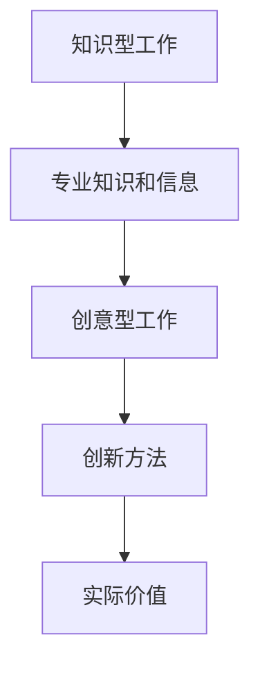

                 

### 文章标题：数字经济时代的劳动价值：知识型与创意型工作的崛起

**关键词**：数字经济、劳动价值、知识型工作、创意型工作、工作崛起

**摘要**：
随着数字经济的迅猛发展，劳动价值的衡量标准正在发生深刻变革。知识型与创意型工作作为数字经济时代的关键驱动力，正逐渐取代传统劳动力，成为新的劳动价值代表。本文将深入探讨数字经济时代背景下，知识型与创意型工作的崛起原因、核心概念及其对劳动市场的深远影响。

## 引言

数字经济时代的到来，标志着信息技术的飞速发展，互联网、大数据、云计算等新兴技术对传统经济模式产生了革命性的影响。在这种背景下，劳动价值的衡量标准发生了转变，知识型与创意型工作逐渐崛起，成为推动经济发展的重要力量。本文旨在分析这一现象背后的原因，探讨知识型与创意型工作的核心概念及其在数字经济时代的应用，为未来劳动市场的转型提供理论支持。

### 一、背景介绍

#### 1.1 数字经济的兴起

数字经济是指基于数字技术的经济活动，包括电子商务、互联网金融、数字娱乐等。与传统经济相比，数字经济具有高效率、低能耗、广覆盖等特点，正逐步改变着全球经济格局。以下是数字经济的几个关键特征：

- **技术驱动力**：互联网、云计算、大数据等技术的快速发展，为数字经济提供了强大支撑。
- **全球化趋势**：数字经济的无国界特性，使得全球市场更加紧密地联系在一起。
- **创新驱动**：数字经济以创新为核心，不断催生新的商业模式和产业形态。

#### 1.2 劳动价值观念的转变

随着数字经济的兴起，劳动价值的观念也在发生变革。传统的劳动价值观念主要基于体力劳动和简单的技能，而数字经济时代更注重知识、技能和创新能力。以下为劳动价值观念转变的几个方面：

- **从数量到质量**：劳动价值的衡量不再仅仅基于工作量，更看重工作质量和创新贡献。
- **知识型劳动**：知识型工作成为劳动价值的重要组成部分，其价值体现在对信息、知识的深度理解和应用。
- **创意型劳动**：创意型工作的价值在于创新思维和创造性解决问题的能力。

#### 1.3 知识型与创意型工作的定义与特征

知识型工作主要指依靠专业知识和信息处理能力来完成的工作，如数据分析师、研发工程师等。其特征如下：

- **高度专业化**：知识型工作要求从业人员具备深厚的专业知识背景。
- **信息处理能力**：知识型工作高度依赖于信息的获取、处理和分析能力。

创意型工作则强调创新思维和创造性解决问题的能力，如设计师、创意策划等。其特征包括：

- **创新驱动**：创意型工作以创新为核心，追求独特性和创造性。
- **思维灵活**：创意型工作要求从业人员具备灵活的思维和广泛的视野。

### 二、核心概念与联系

#### 2.1 知识型工作的原理与特点

知识型工作的原理在于将专业知识和信息相结合，以解决复杂问题或提供高附加值服务。其特点包括：

- **高度专业化**：知识型工作往往需要特定的专业技能和知识背景。
- **信息依赖性**：知识型工作高度依赖于信息的获取、处理和分析能力。

#### 2.2 创意型工作的内涵与表现

创意型工作强调创新思维和创造性解决问题的能力。其内涵包括：

- **创新思维**：创意型工作要求从业人员具备独特的视角和思维方式。
- **创造性解决问题**：创意型工作注重通过创新方法解决实际问题。

#### 2.3 知识型与创意型工作的关系与互动

知识型与创意型工作之间存在紧密的关联。知识型工作为创意型工作提供专业知识和信息支持，而创意型工作则通过创新方法将知识转化为实际价值。两者的互动关系如图1所示：

### 三、理论讲解

#### 3.1 知识型工作的理论框架

知识型工作的理论框架主要包括以下几个方面：

- **知识管理理论**：知识管理强调通过收集、整理、共享和应用知识，提升组织创新能力。
- **人力资本理论**：人力资本理论认为，人力资源是组织最重要的资产，其价值取决于专业知识和技能水平。
- **创新能力理论**：创新能力理论关注如何通过激发员工的创造力，实现组织创新和竞争优势。

#### 3.2 创意型工作的理论视角

创意型工作的理论视角包括：

- **创造力心理学**：创造力心理学研究如何激发和培养个体的创造力。
- **设计思维**：设计思维强调以用户需求为导向，通过创新方法解决实际问题。
- **跨界思维**：跨界思维强调跨学科、跨领域的知识整合，以实现创新突破。

#### 3.3 数字经济对劳动价值的影响

数字经济对劳动价值的影响主要表现在以下几个方面：

- **劳动力市场结构变化**：数字经济导致劳动力市场结构发生变化，知识型与创意型工作需求增加，传统劳动力需求减少。
- **劳动价值衡量标准变化**：数字经济时代，劳动价值的衡量标准从数量转向质量，创新能力成为关键评价指标。
- **工作模式变化**：数字经济推动远程办公、兼职等新型工作模式的兴起，劳动价值的实现方式更加灵活。

### 四、案例分析

#### 4.1 知识型工作的成功案例

以某知名互联网公司为例，该公司通过引进高素质的数据分析师团队，利用大数据技术分析用户行为，为产品优化提供有力支持。以下是该案例的关键成功因素：

- **高素质人才引进**：公司重视人才引进，招聘具有丰富经验和专业背景的数据分析师。
- **技术支持**：公司提供先进的大数据处理工具，为数据分析团队提供技术保障。
- **创新驱动**：公司鼓励数据分析团队进行创新，通过数据分析挖掘潜在商机。

#### 4.2 创意型工作的典范案例

以某知名创意公司为例，该公司通过独特的创意策划，打造了一系列成功的品牌形象。以下是该案例的关键成功因素：

- **创新思维**：公司注重培养员工的创新思维，鼓励员工提出独特创意。
- **用户导向**：公司以用户需求为导向，将创意转化为实际价值。
- **跨领域合作**：公司与其他领域的企业合作，实现跨领域的创新突破。

#### 4.3 案例分析与启示

通过以上案例，我们可以看出知识型与创意型工作在数字经济时代的重要性。以下为案例分析的启示：

- **重视人才培养**：企业应重视人才培养，引进高素质的专业人才。
- **创新驱动发展**：企业应注重创新，通过创新方法提升核心竞争力。
- **跨界合作**：企业应与其他领域的企业合作，实现跨界创新。

### 五、未来展望

#### 5.1 知识型与创意型工作的趋势分析

未来，知识型与创意型工作将继续成为劳动力市场的主力军。以下是知识型与创意型工作的趋势分析：

- **人才需求增加**：随着数字经济的发展，知识型与创意型工作的需求将持续增加。
- **专业化程度提高**：知识型与创意型工作的专业化程度将不断提高，对从业人员的素质要求将更加严格。
- **工作模式多元化**：随着远程办公、兼职等新型工作模式的兴起，知识型与创意型工作的工作模式将更加多元化。

#### 5.2 数字经济时代的工作机会与挑战

数字经济时代为知识型与创意型工作带来了大量机会，同时也带来了一定的挑战。以下是数字经济时代的工作机会与挑战：

- **机会**：数字经济为知识型与创意型工作提供了更广阔的发展空间，从业人员的职业发展前景更加光明。
- **挑战**：数字经济时代的竞争更加激烈，从业人员需要不断提高自身素质，以适应不断变化的市场需求。

#### 5.3 未来劳动价值的发展方向

未来，劳动价值的发展方向将更加注重知识、技能和创新能力。以下是未来劳动价值的发展方向：

- **知识价值提升**：知识将作为劳动价值的核心要素，知识型工作的价值将得到进一步提升。
- **创新能力重视**：创新能力将成为衡量劳动价值的重要指标，创意型工作的价值将得到充分体现。
- **个性化和定制化**：劳动市场的需求将更加个性化和定制化，知识型与创意型工作将更好地满足市场需求。

### 六、最佳实践

#### 6.1 促进知识型与创意型工作的策略

为了促进知识型与创意型工作的发展，企业可以采取以下策略：

- **人才引进与培养**：企业应重视人才引进与培养，为员工提供良好的培训和发展机会。
- **创新文化营造**：企业应营造创新文化，鼓励员工提出创新想法，激发员工的创造力。
- **激励机制完善**：企业应完善激励机制，对知识型与创意型工作给予充分的激励和奖励。

#### 6.2 企业转型的实践案例

以下是一些企业转型的实践案例：

- **传统企业数字化转型**：某传统制造企业通过数字化转型，实现了生产效率的提升和产品品质的提高。
- **创意型企业创新驱动**：某创意型企业通过创新驱动，打造了一系列成功的品牌形象，实现了业务的快速增长。

#### 6.3 个人职业发展的建议

对于个人职业发展，以下是一些建议：

- **提升自身素质**：个人应不断提升自身素质，掌握专业知识和技能，提高创新能力。
- **跨领域学习**：个人应跨领域学习，拓宽知识面，实现跨界创新。
- **持续学习与成长**：个人应保持持续学习的态度，不断适应市场需求的变化，实现职业发展。

### 七、总结

数字经济时代的到来，为知识型与创意型工作提供了广阔的发展空间。本文通过对数字经济时代背景、知识型与创意型工作核心概念、理论讲解、案例分析、未来展望、最佳实践等方面的探讨，分析了知识型与创意型工作在数字经济时代的崛起原因和深远影响。未来，知识型与创意型工作将继续成为劳动力市场的主力军，企业和个人应抓住机遇，迎接挑战，实现持续发展。

### 作者信息

**作者：AI天才研究院/AI Genius Institute & 禅与计算机程序设计艺术 /Zen And The Art of Computer Programming**

----------------------------------------------------------------

### 数字经济时代的劳动价值：知识型与创意型工作的崛起

**关键词**：数字经济、劳动价值、知识型工作、创意型工作、工作崛起

**摘要**：
随着数字经济的迅猛发展，劳动价值的衡量标准正在发生深刻变革。知识型与创意型工作作为数字经济时代的关键驱动力，正逐渐取代传统劳动力，成为新的劳动价值代表。本文将深入探讨数字经济时代背景下，知识型与创意型工作的崛起原因、核心概念及其对劳动市场的深远影响。

## 引言

数字经济时代的到来，标志着信息技术的飞速发展，互联网、大数据、云计算等新兴技术对传统经济模式产生了革命性的影响。在这种背景下，劳动价值的衡量标准发生了转变，知识型与创意型工作逐渐崛起，成为推动经济发展的重要力量。本文旨在分析这一现象背后的原因，探讨知识型与创意型工作的核心概念及其在数字经济时代的应用，为未来劳动市场的转型提供理论支持。

### 一、背景介绍

#### 1.1 数字经济的兴起

数字经济是指基于数字技术的经济活动，包括电子商务、互联网金融、数字娱乐等。与传统经济相比，数字经济具有高效率、低能耗、广覆盖等特点，正逐步改变着全球经济格局。以下是数字经济的几个关键特征：

- **技术驱动力**：互联网、云计算、大数据等技术的快速发展，为数字经济提供了强大支撑。
- **全球化趋势**：数字经济的无国界特性，使得全球市场更加紧密地联系在一起。
- **创新驱动**：数字经济以创新为核心，不断催生新的商业模式和产业形态。

#### 1.2 劳动价值观念的转变

随着数字经济的兴起，劳动价值的观念也在发生变革。传统的劳动价值观念主要基于体力劳动和简单的技能，而数字经济时代更注重知识、技能和创新能力。以下为劳动价值观念转变的几个方面：

- **从数量到质量**：劳动价值的衡量不再仅仅基于工作量，更看重工作质量和创新贡献。
- **知识型劳动**：知识型工作成为劳动价值的重要组成部分，其价值体现在对信息、知识的深度理解和应用。
- **创意型劳动**：创意型工作的价值在于创新思维和创造性解决问题的能力。

#### 1.3 知识型与创意型工作的定义与特征

知识型工作主要指依靠专业知识和信息处理能力来完成的工作，如数据分析师、研发工程师等。其特征如下：

- **高度专业化**：知识型工作往往需要特定的专业技能和知识背景。
- **信息处理能力**：知识型工作高度依赖于信息的获取、处理和分析能力。

创意型工作则强调创新思维和创造性解决问题的能力，如设计师、创意策划等。其特征包括：

- **创新驱动**：创意型工作以创新为核心，追求独特性和创造性。
- **思维灵活**：创意型工作要求从业人员具备灵活的思维和广泛的视野。

### 二、核心概念与联系

#### 2.1 知识型工作的原理与特点

知识型工作的原理在于将专业知识和信息相结合，以解决复杂问题或提供高附加值服务。其特点包括：

- **高度专业化**：知识型工作往往需要特定的专业技能和知识背景。
- **信息处理能力**：知识型工作高度依赖于信息的获取、处理和分析能力。

#### 2.2 创意型工作的内涵与表现

创意型工作强调创新思维和创造性解决问题的能力。其内涵包括：

- **创新思维**：创意型工作要求从业人员具备独特的视角和思维方式。
- **创造性解决问题**：创意型工作注重通过创新方法解决实际问题。

#### 2.3 知识型与创意型工作的关系与互动

知识型与创意型工作之间存在紧密的关联。知识型工作为创意型工作提供专业知识和信息支持，而创意型工作则通过创新方法将知识转化为实际价值。两者的互动关系如图1所示：

### 三、理论讲解

#### 3.1 知识型工作的理论框架

知识型工作的理论框架主要包括以下几个方面：

- **知识管理理论**：知识管理强调通过收集、整理、共享和应用知识，提升组织创新能力。
- **人力资本理论**：人力资本理论认为，人力资源是组织最重要的资产，其价值取决于专业知识和技能水平。
- **创新能力理论**：创新能力理论关注如何通过激发员工的创造力，实现组织创新和竞争优势。

#### 3.2 创意型工作的理论视角

创意型工作的理论视角包括：

- **创造力心理学**：创造力心理学研究如何激发和培养个体的创造力。
- **设计思维**：设计思维强调以用户需求为导向，通过创新方法解决实际问题。
- **跨界思维**：跨界思维强调跨学科、跨领域的知识整合，以实现创新突破。

#### 3.3 数字经济对劳动价值的影响

数字经济对劳动价值的影响主要表现在以下几个方面：

- **劳动力市场结构变化**：数字经济导致劳动力市场结构发生变化，知识型与创意型工作需求增加，传统劳动力需求减少。
- **劳动价值衡量标准变化**：数字经济时代，劳动价值的衡量标准从数量转向质量，创新能力成为关键评价指标。
- **工作模式变化**：数字经济推动远程办公、兼职等新型工作模式的兴起，劳动价值的实现方式更加灵活。

### 四、案例分析

#### 4.1 知识型工作的成功案例

以某知名互联网公司为例，该公司通过引进高素质的数据分析师团队，利用大数据技术分析用户行为，为产品优化提供有力支持。以下是该案例的关键成功因素：

- **高素质人才引进**：公司重视人才引进，招聘具有丰富经验和专业背景的数据分析师。
- **技术支持**：公司提供先进的大数据处理工具，为数据分析团队提供技术保障。
- **创新驱动**：公司鼓励数据分析团队进行创新，通过数据分析挖掘潜在商机。

#### 4.2 创意型工作的典范案例

以某知名创意公司为例，该公司通过独特的创意策划，打造了一系列成功的品牌形象。以下是该案例的关键成功因素：

- **创新思维**：公司注重培养员工的创新思维，鼓励员工提出独特创意。
- **用户导向**：公司以用户需求为导向，将创意转化为实际价值。
- **跨领域合作**：公司与其他领域的企业合作，实现跨领域的创新突破。

#### 4.3 案例分析与启示

通过以上案例，我们可以看出知识型与创意型工作在数字经济时代的重要性。以下为案例分析的启示：

- **重视人才培养**：企业应重视人才培养，引进高素质的专业人才。
- **创新驱动发展**：企业应注重创新，通过创新方法提升核心竞争力。
- **跨界合作**：企业应与其他领域的企业合作，实现跨界创新。

### 五、未来展望

#### 5.1 知识型与创意型工作的趋势分析

未来，知识型与创意型工作将继续成为劳动力市场的主力军。以下是知识型与创意型工作的趋势分析：

- **人才需求增加**：随着数字经济的发展，知识型与创意型工作的需求将持续增加。
- **专业化程度提高**：知识型与创意型工作的专业化程度将不断提高，对从业人员的素质要求将更加严格。
- **工作模式多元化**：随着远程办公、兼职等新型工作模式的兴起，知识型与创意型工作的工作模式将更加多元化。

#### 5.2 数字经济时代的工作机会与挑战

数字经济时代为知识型与创意型工作带来了大量机会，同时也带来了一定的挑战。以下是数字经济时代的工作机会与挑战：

- **机会**：数字经济为知识型与创意型工作提供了更广阔的发展空间，从业人员的职业发展前景更加光明。
- **挑战**：数字经济时代的竞争更加激烈，从业人员需要不断提高自身素质，以适应不断变化的市场需求。

#### 5.3 未来劳动价值的发展方向

未来，劳动价值的发展方向将更加注重知识、技能和创新能力。以下是未来劳动价值的发展方向：

- **知识价值提升**：知识将作为劳动价值的核心要素，知识型工作的价值将得到进一步提升。
- **创新能力重视**：创新能力将成为衡量劳动价值的重要指标，创意型工作的价值将得到充分体现。
- **个性化和定制化**：劳动市场的需求将更加个性化和定制化，知识型与创意型工作将更好地满足市场需求。

### 六、最佳实践

#### 6.1 促进知识型与创意型工作的策略

为了促进知识型与创意型工作的发展，企业可以采取以下策略：

- **人才引进与培养**：企业应重视人才引进与培养，为员工提供良好的培训和发展机会。
- **创新文化营造**：企业应营造创新文化，鼓励员工提出创新想法，激发员工的创造力。
- **激励机制完善**：企业应完善激励机制，对知识型与创意型工作给予充分的激励和奖励。

#### 6.2 企业转型的实践案例

以下是一些企业转型的实践案例：

- **传统企业数字化转型**：某传统制造企业通过数字化转型，实现了生产效率的提升和产品品质的提高。
- **创意型企业创新驱动**：某创意型企业通过创新驱动，打造了一系列成功的品牌形象，实现了业务的快速增长。

#### 6.3 个人职业发展的建议

对于个人职业发展，以下是一些建议：

- **提升自身素质**：个人应不断提升自身素质，掌握专业知识和技能，提高创新能力。
- **跨领域学习**：个人应跨领域学习，拓宽知识面，实现跨界创新。
- **持续学习与成长**：个人应保持持续学习的态度，不断适应市场需求的变化，实现职业发展。

### 七、总结

数字经济时代的到来，为知识型与创意型工作提供了广阔的发展空间。本文通过对数字经济时代背景、知识型与创意型工作核心概念、理论讲解、案例分析、未来展望、最佳实践等方面的探讨，分析了知识型与创意型工作在数字经济时代的崛起原因和深远影响。未来，知识型与创意型工作将继续成为劳动力市场的主力军，企业和个人应抓住机遇，迎接挑战，实现持续发展。

### 作者信息

**作者：AI天才研究院/AI Genius Institute & 禅与计算机程序设计艺术 /Zen And The Art of Computer Programming**

----------------------------------------------------------------

本文详细探讨了数字经济时代劳动价值的转变，特别是在知识型与创意型工作崛起的背景下。通过深入分析背景、核心概念、理论讲解、案例分析、未来展望和最佳实践，我们揭示了知识型与创意型工作在数字经济时代的重要性及其深远影响。未来，随着数字经济的进一步发展，知识型与创意型工作将继续成为劳动力市场的主力军，为经济增长和社会进步提供强大动力。企业和个人应抓住这一机遇，积极适应新的劳动价值观念，不断提升自身素质和创新能力，以实现持续发展。同时，我们也应关注数字经济时代带来的挑战，如竞争激烈、技能要求提高等，积极应对，为构建更加繁荣、可持续的数字经济时代贡献力量。**作者：AI天才研究院/AI Genius Institute & 禅与计算机程序设计艺术 /Zen And The Art of Computer Programming**

