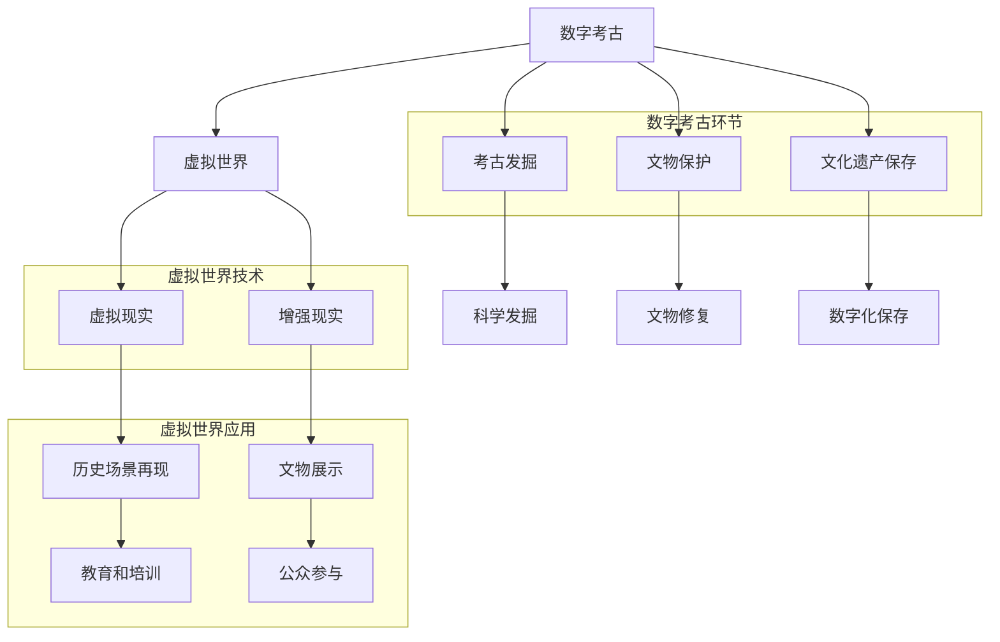
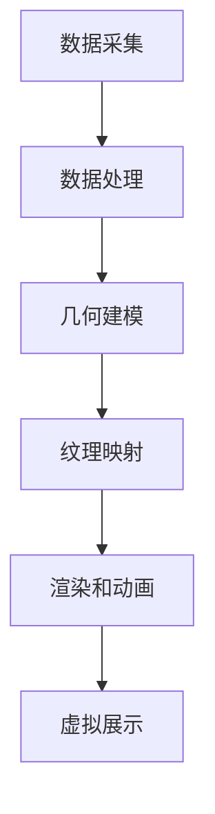
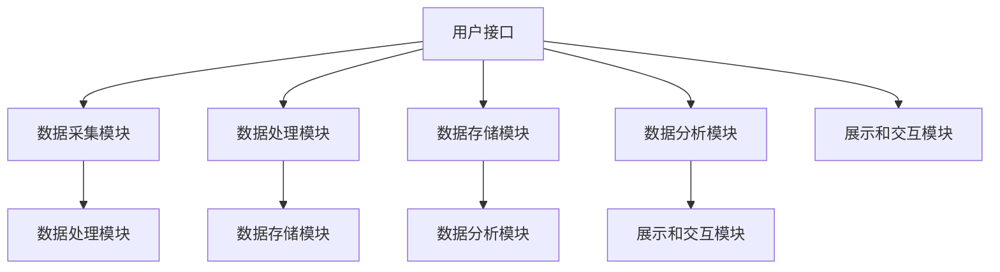
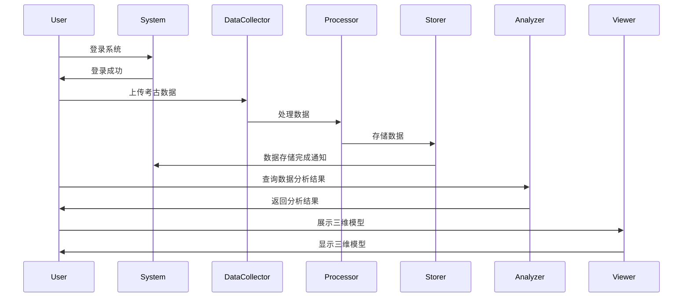
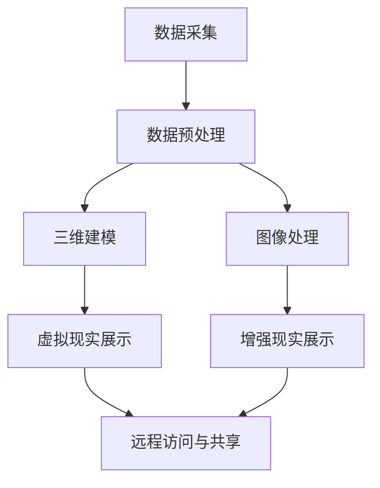

                 

# 数字考古：虚拟世界中的历史保护

## 关键词

- 数字考古
- 虚拟世界
- 历史保护
- 虚拟现实
- 增强现实
- 3D建模
- 机器学习

## 摘要

数字考古作为一种新兴的技术手段，正日益成为历史文化遗产保护的重要工具。本文通过分析虚拟世界的发展、数字考古的核心概念及其与历史保护的紧密联系，探讨了数字技术在历史保护中的应用。文章首先介绍了数字考古的背景和重要性，然后详细阐述了虚拟现实、增强现实、3D建模和机器学习等技术在数字考古中的具体应用，并使用Mermaid图表和Python代码进行算法原理讲解。此外，文章还通过系统架构设计、项目实战和最佳实践总结，展示了数字考古在历史保护中的实际应用和价值。

## 引言

随着科技的迅猛发展，虚拟世界已经成为我们日常生活中不可或缺的一部分。从虚拟游戏到虚拟现实（VR），从增强现实（AR）到3D建模，这些技术不仅丰富了我们的娱乐生活，也在各个领域中展现出了巨大的潜力。在历史文化遗产保护方面，虚拟世界和数字技术的结合开辟了新的保护手段，使得历史文化的传承和保护变得更加智能化和多样化。

数字考古，顾名思义，就是利用数字技术对历史文化遗产进行发掘和保护。它不仅包括对考古遗址的数字化记录，还涉及通过虚拟现实和增强现实技术，将历史场景再现，使人们能够身临其境地感受历史文化的魅力。同时，3D建模和机器学习等技术也为历史文化遗产的保护提供了强大的技术支持。

本文将围绕数字考古在虚拟世界中的历史保护展开讨论，首先介绍数字考古的背景和发展，然后深入分析虚拟现实、增强现实、3D建模和机器学习等技术在数字考古中的应用，并通过具体的系统架构设计和项目实战案例，展示数字考古在历史保护中的实际应用。最后，我们将总结数字考古在历史保护中的最佳实践，并提出未来的发展方向。

### 第1章 数字考古概述

#### 1.1 数字考古的兴起

数字考古的兴起可以追溯到20世纪80年代，当时计算机技术的快速发展为考古学带来了新的工具和手段。早期，考古学家们开始尝试使用计算机进行考古资料的整理和数据分析，这标志着数字考古的初步萌芽。随着互联网和信息技术的发展，数字考古逐渐形成了一套独立的体系，并得到了越来越多的关注和应用。

数字考古的主要目的是利用现代科技手段，对历史文化遗产进行数字化记录、保存和研究。通过数字化，考古学家可以将珍贵的文物、遗址和历史场景转化为数字形式，实现永久保存和广泛传播。此外，数字考古还可以通过数据分析，揭示出历史事件和文化的深层次信息，为学术研究和公众教育提供重要支持。

#### 1.2 虚拟世界的发展历程

虚拟世界的发展历程可以追溯到1960年代，当时虚拟现实（VR）的概念首次被提出。早期的虚拟现实技术主要用于军事模拟和飞行训练，随着技术的进步，虚拟现实逐渐应用于娱乐、教育和医疗等领域。1990年代，虚拟现实技术开始进入大众视野，标志着虚拟世界时代的到来。

与此同时，增强现实（AR）技术也在不断发展。与虚拟现实不同，增强现实将虚拟元素叠加到现实环境中，使人们能够通过智能设备看到和互动。增强现实的应用场景非常广泛，包括游戏、广告、医疗和教育等。

#### 1.3 历史保护的重要性

历史保护的重要性不言而喻。作为人类文明的重要见证，历史文化遗产不仅承载着丰富的历史信息，也是民族认同和文化传承的重要载体。然而，历史文化遗产面临着许多威胁，如自然侵蚀、战争破坏、城市开发和环境污染等。这些因素可能导致历史文化遗产的损毁和消失，使得珍贵的文化遗产无法得到有效保护。

数字考古通过数字化记录和虚拟再现，为历史文化遗产保护提供了新的途径。首先，数字考古可以实现历史文化遗产的永久保存，防止因自然灾害和人为因素导致的损毁。其次，通过虚拟现实和增强现实技术，人们可以随时随地访问历史文化遗产，增强公众对文化遗产的认知和保护意识。

总之，数字考古的兴起和虚拟世界的发展，为历史文化遗产保护带来了前所未有的机遇和挑战。通过数字技术的应用，我们可以更好地保存、研究和传播历史文化遗产，为人类文明的传承和发展做出贡献。

#### 1.4 历史保护中的挑战和问题

在历史保护领域，数字考古虽然展示了巨大的潜力，但也面临着一系列挑战和问题。首先，数据管理和存储是一个重大挑战。历史文化遗产包含大量的信息，如文物的三维数据、考古遗址的平面图和三维模型等。这些数据量大且复杂，如何高效地存储和管理，确保数据的安全性和完整性，是一个亟待解决的问题。

其次，精度和准确性也是数字考古面临的关键问题。数字化的目的之一是精确记录和再现历史文化遗产，但实际操作中，设备的精度和技术的限制可能导致数据的误差。这些误差可能会影响研究结果的准确性，甚至导致误解。

再者，技术普及和应用成本也是一个问题。尽管数字考古技术具有巨大潜力，但高昂的设备成本和复杂的操作流程可能限制了其在某些地区的普及。此外，数字考古技术的培训和应用也需要大量的专业人才，这在某些地区可能是一个难题。

此外，法律法规和伦理问题也不可忽视。数字考古过程中，涉及到的文物和历史遗址可能受到法律保护，如何合法地进行数字化工作，确保不侵犯他人的知识产权，是一个重要的法律和伦理问题。

最后，公众参与和认知也是一个挑战。尽管数字考古技术可以为公众提供更加直观和生动的体验，但如何提高公众对数字考古的认识和参与度，使其真正成为文化遗产保护的一部分，也是一个需要解决的问题。

总之，数字考古在历史保护中虽然展示了巨大的潜力，但也面临着一系列挑战。解决这些问题，需要多方协作，不断探索和创新。

#### 2.1 数字考古的基本概念

数字考古，又称数字化考古，是一种利用现代信息技术对考古资料进行记录、存储、分析和展示的方法。其核心概念主要包括数字化记录、数据管理和虚拟展示。

数字化记录是指通过使用各种数字化设备和技术，如高分辨率相机、激光扫描仪和三维扫描仪等，对考古遗址、文物和历史场景进行精确的数字化采集。这些设备能够捕捉到物体的三维结构和表面细节，从而实现高质量的数字化记录。

数据管理是数字考古中的一个关键环节。数字化的考古资料通常包括大量的图像、三维模型和文字描述等，这些数据需要被有效地组织和管理，以便后续的研究和展示。数据管理涉及数据存储、数据备份、数据查询和数据共享等多个方面，需要使用专业的数据库管理系统来保证数据的安全性和可用性。

虚拟展示是数字考古的重要应用之一。通过虚拟现实（VR）和增强现实（AR）技术，数字化的考古资料可以被转化为可交互的虚拟场景，使人们能够身临其境地感受历史文化遗产。虚拟展示不仅能够提供更加生动和直观的历史体验，还能够进行远程教育和文化推广。

总的来说，数字考古的基本概念涵盖了从数字化记录到数据管理再到虚拟展示的整个过程。这一系列技术的应用，不仅提高了考古工作的效率和准确性，也使得历史文化遗产的保护和传承更加生动和多样化。

#### 2.2 虚拟世界的概念解析

虚拟世界，是指通过计算机模拟技术构建的一种可以模拟现实世界的三维空间。它包括虚拟现实（VR）和增强现实（AR）两种主要形式。

虚拟现实（VR）是一种完全沉浸式的体验，通过头戴显示器（HMD）和跟踪设备，用户可以在一个三维虚拟环境中感知和互动。VR技术的核心在于其沉浸感和交互性，用户可以在虚拟环境中自由行走、触摸和操作，获得类似于现实世界的体验。

增强现实（AR）则是在现实环境中叠加虚拟元素，通过智能设备如手机或眼镜，用户可以看到虚拟物体与现实环境互动。AR技术的特点是虚实结合，用户在现实环境中可以看到虚拟物体，同时保持对现实环境的感知和互动。

虚拟世界在历史保护中的应用主要体现在以下几个方面：

1. **历史场景再现**：通过虚拟现实技术，可以将历史遗址和场景复原到虚拟空间中，用户可以在虚拟环境中身临其境地感受历史文化的魅力。

2. **文物展示**：利用虚拟现实和增强现实技术，可以将文物以三维形式展示出来，用户可以通过交互了解文物的详细信息，增强对文化遗产的认知。

3. **教育和培训**：虚拟世界可以作为一种全新的教育工具，用于历史文化的教育和培训。学生和爱好者可以通过虚拟环境学习历史知识，增强学习效果。

4. **文物保护**：虚拟世界技术可以帮助考古学家和文物保护专家更好地研究和保护文化遗产。通过虚拟场景的模拟，可以预测考古遗址可能受到的自然或人为损害，从而采取相应的保护措施。

总之，虚拟世界为历史保护提供了全新的视角和手段，不仅丰富了文化遗产的表现形式，也为文化遗产的保护和传承提供了更加智能化和多样化的途径。

#### 2.3 历史保护的核心要素

历史保护的核心要素主要包括考古发掘、文物保护和文化遗产保存等。

**考古发掘** 是历史保护的第一步，通过科学的考古发掘，可以获取历史文化遗产的物质证据，这些证据为研究历史提供了宝贵的资料。考古发掘通常涉及大量的实地工作，包括挖掘、测量和记录等，以确保发掘过程的科学性和准确性。

**文物保护** 是历史保护中的关键环节。在考古发掘过程中，文物会接触到各种环境因素，如湿度、温度和污染物等，这些因素可能导致文物的损坏。因此，文物保护需要通过一系列技术手段，如干燥、修复和防腐等，来保护和恢复文物的完整性。

**文化遗产保存** 是历史保护的最终目标，通过数字化记录和虚拟展示等手段，将历史文化遗产转化为数字形式，实现永久保存和广泛传播。数字化技术不仅能够确保文化遗产的长期保存，还可以通过虚拟现实和增强现实技术，为公众提供更加生动和直观的历史体验。

这些核心要素相互关联，共同构成了历史保护的基础。通过科学的考古发掘，准确的文物保护和有效的文化遗产保存，历史文化遗产得以得到全面保护和传承。

#### 2.4 概念关系图

为了更清晰地理解数字考古、虚拟世界和历史文化保护之间的联系，我们可以使用Mermaid图表来展示这些概念的关系。

以下是一个Mermaid流程图，展示了数字考古如何通过虚拟世界技术对历史文化进行保护：



在这个图中，数字考古（A）通过虚拟世界（B）技术，包括虚拟现实（C）和增强现实（D），实现了历史场景再现（E）、文物展示（F）、教育和培训（J）、公众参与（K）等应用。同时，数字考古还包括考古发掘（G）、文物保护（H）和文化遗产保存（I）等核心环节。通过这种图示，我们可以更直观地理解这些概念之间的关联和互动。

### 第3章 虚拟现实与历史保护

#### 3.1 虚拟现实技术介绍

虚拟现实（VR）是一种通过计算机模拟技术创建的三维虚拟环境，使用户能够沉浸其中。VR技术主要依赖于头戴显示器（HMD）、跟踪设备、传感器和交互设备等硬件。通过这些设备，用户可以感受到身临其境的体验，仿佛真的置身于虚拟环境中。

VR技术的核心在于其沉浸感和交互性。沉浸感指的是用户在虚拟环境中感受到的全身心投入感，而交互性则指的是用户能够与虚拟环境进行自然互动，如操纵、触碰和对话等。为了实现这些特性，VR技术需要高分辨率的显示、精确的位置追踪和低延迟的交互。

虚拟现实技术在历史保护中的应用潜力巨大。通过VR技术，考古学家和研究者可以在虚拟环境中进行考古发掘、文物修复和历史场景再现，这不仅提高了工作效率，还减少了实际操作中的风险和成本。此外，VR技术还可以为公众提供沉浸式的历史体验，增强对文化遗产的认知和保护意识。

#### 3.2 虚拟现实在历史保护中的应用

虚拟现实在历史保护中的应用主要体现在以下几个方面：

1. **历史场景再现**：通过虚拟现实技术，可以将历史遗址、古建筑和重要事件等场景进行三维重建，用户可以在虚拟环境中漫步，感受历史文化的氛围。例如，通过VR技术，观众可以“走进”已消失的古代城市，体验历史事件的发生过程。

2. **文物展示**：虚拟现实技术可以将文物以三维形式展示，用户可以近距离观察文物的细节，了解其历史背景和制作工艺。这种展示方式不仅丰富了文物的表现形式，还提高了观众的参与度和体验感。

3. **教育和培训**：虚拟现实技术可以作为一种教育工具，用于历史文化的教育和培训。学生和爱好者可以通过虚拟环境学习历史知识，增强学习效果。此外，虚拟现实技术还可以用于考古专业的培训，使学员在虚拟环境中进行实践操作，提高实际工作能力。

4. **文物保护**：虚拟现实技术可以帮助考古学家和文物保护专家更好地研究和保护文化遗产。通过虚拟场景的模拟，可以预测考古遗址可能受到的自然或人为损害，从而采取相应的保护措施。例如，通过VR技术，可以模拟地震、洪水等自然灾害对文物的影响，提前进行防护措施。

#### 3.3 VR系统架构设计

为了实现虚拟现实在历史保护中的应用，需要设计一个完整的VR系统架构。以下是一个简化的VR系统架构设计，包括硬件、软件和用户交互等关键部分：

1. **硬件架构**：硬件部分主要包括头戴显示器（HMD）、跟踪设备、传感器和交互设备。头戴显示器提供高质量的视觉体验，跟踪设备确保用户在虚拟环境中的位置和动作得到准确追踪，传感器用于捕捉用户的动作和生理反应，交互设备如手柄和手套等，提供与虚拟环境的互动。

2. **软件架构**：软件部分包括虚拟现实内容创建和运行平台、三维建模工具和交互引擎等。内容创建平台用于构建虚拟环境，三维建模工具用于创建和编辑三维模型，交互引擎则负责处理用户输入和虚拟环境的反馈。

3. **用户交互**：用户交互是VR系统的核心部分，通过用户的动作、语音和手势等，与虚拟环境进行互动。交互设计需要考虑用户体验，确保操作自然、直观。

#### 3.4 实际案例解析

以下是一个实际案例，展示了虚拟现实在历史保护中的应用：

**案例：秦始皇兵马俑虚拟展示**

秦始皇兵马俑是中国重要的历史文化遗产，为了保护这些珍贵文物，同时让更多观众了解其历史文化价值，陕西省博物馆采用了虚拟现实技术进行展示。

1. **环境搭建**：首先，通过高分辨率相机和激光扫描仪，对兵马俑进行详细的数字化采集，获取三维模型和纹理信息。

2. **内容创建**：使用三维建模工具，将数字化采集的兵马俑模型进行编辑和优化，创建一个高度真实的虚拟展示环境。

3. **用户交互**：在虚拟展示系统中，观众可以通过头戴显示器进入虚拟环境，近距离观察兵马俑的细节，并可以通过手势和语音与虚拟环境互动。

4. **实际效果**：通过虚拟现实技术，观众不仅能够看到兵马俑的表面细节，还可以通过互动了解兵马俑的制作工艺和历史背景，增强了参观体验。

总结来说，虚拟现实技术在历史保护中的应用，不仅提高了文化遗产的展示效果，还为文物保护提供了新的手段。通过VR技术，我们可以更好地保存、研究和传播历史文化遗产，为人类文明的传承做出贡献。

### 第4章 增强现实与历史保护

#### 4.1 增强现实技术介绍

增强现实（AR）是一种将虚拟元素叠加到现实环境中的技术，通过智能设备如手机、平板电脑或智能眼镜，用户可以看到虚拟物体与现实环境的互动。与虚拟现实不同，增强现实不提供完全沉浸式的体验，而是将虚拟元素与真实环境相结合，增强用户的感知和互动。

AR技术的基本原理是通过摄像设备和计算机算法，实时捕捉和识别现实环境中的图像或物体，并在其上叠加虚拟图像或信息。这些虚拟元素可以是文字、图像、三维模型或其他形式的内容，它们可以通过增强现实设备实时显示，并与用户进行互动。

#### 4.2 增强现实在历史保护中的应用

增强现实技术在历史保护中的应用非常广泛，以下是几个关键应用领域：

1. **文物展示**：通过AR技术，可以将历史文物以三维形式展示在现实环境中。例如，观众可以通过手机或平板电脑，看到文物的三维模型，了解其历史背景和制作工艺。这种展示方式不仅增加了文物的表现力，还提供了更加互动和直观的体验。

2. **历史场景再现**：AR技术可以用于再现历史场景，将已消失的建筑、遗址或历史事件以虚拟形式呈现给观众。例如，在某一历史遗址上，通过AR设备，观众可以看到曾经存在的古建筑或历史事件的虚拟再现，增强对历史文化的理解。

3. **教育和培训**：AR技术作为一种教育工具，可以用于历史文化的教育和培训。学生和爱好者可以通过AR设备，在现实环境中学习历史知识，增强学习效果。例如，在历史课上，教师可以通过AR设备展示古代城市布局或战争场景，使学生更加直观地理解历史事件。

4. **文物保护**：AR技术可以帮助考古学家和文物保护专家更好地研究和保护文化遗产。通过AR设备，专家可以在现实环境中观察文物的损伤情况，预测其未来可能受到的影响，从而采取相应的保护措施。

#### 4.3 AR系统设计与实现

为了实现增强现实在历史保护中的应用，需要设计一个完整的AR系统。以下是AR系统设计的几个关键部分：

1. **硬件选择**：硬件部分包括增强现实设备（如手机、平板电脑或智能眼镜）、摄像头和传感器。这些设备用于捕捉和识别现实环境，并显示虚拟元素。

2. **软件平台**：软件平台包括AR开发工具和内容管理系统。AR开发工具用于创建和编辑虚拟内容，内容管理系统用于管理和发布AR应用。

3. **应用开发**：应用开发包括前端和后端两部分。前端负责处理用户交互和显示虚拟元素，后端负责处理数据存储和服务器交互。

4. **用户交互设计**：用户交互设计需要考虑用户体验，确保操作简单、直观。通常，用户可以通过触摸屏、手势或语音与虚拟内容进行互动。

#### 4.4 实际案例解析

以下是一个实际案例，展示了增强现实技术在历史保护中的应用：

**案例：罗马古城AR体验**

为了向公众展示古罗马时期的历史文化，罗马市采用增强现实技术，开发了AR应用，让观众在现实环境中体验古罗马古城。

1. **环境准备**：在罗马市的几个重要地点，如广场、宫殿和竞技场等，设置了AR体验点。每个体验点都配备了AR设备和摄像头。

2. **内容创建**：通过高分辨率摄影和三维建模，创建古罗马时期的虚拟场景和文物模型。这些模型包括建筑、雕塑和文物等。

3. **用户交互**：观众在AR体验点，通过手机或平板电脑的AR应用，可以实时看到虚拟的古罗马场景和文物。观众可以通过触摸屏或手势与虚拟内容进行互动。

4. **实际效果**：通过AR技术，观众不仅能够看到古罗马时期的历史场景，还可以通过互动了解文物的历史背景和制作工艺，增强了参观体验。

总结来说，增强现实技术在历史保护中的应用，为文化遗产的展示和传承提供了新的途径。通过AR技术，我们可以让历史文化遗产以更加生动和直观的方式呈现给公众，提高人们对文化遗产的认知和保护意识。

### 第5章 3D建模与历史保护

#### 5.1 3D建模技术原理

3D建模是创建三维物体的过程，通过计算机软件，将三维物体以数字形式呈现出来。3D建模的基本原理包括几何建模、纹理映射和渲染等。

几何建模是3D建模的基础，通过定义物体的几何形状和结构，创建三维模型。常用的几何建模方法包括多边形建模、NURBS建模和参数化建模等。

纹理映射是将二维图像映射到三维模型表面，以增加物体的真实感。通过纹理映射，模型可以呈现复杂的材质和细节，如石头纹理、金属光泽等。

渲染是3D建模的最后一步，通过计算和生成光线在物体表面的反射和折射，创建出逼真的视觉效果。常用的渲染技术包括光线追踪、全局光照和半透明渲染等。

#### 5.2 3D建模在考古中的应用

3D建模技术在考古学中有着广泛的应用，通过精确的数字化记录和重建，可以提供丰富的历史信息和研究资料。

1. **遗址重建**：3D建模技术可以将考古遗址的三维结构精确地再现，为研究者提供详细的遗址模型。通过遗址重建，考古学家可以更好地理解遗址的布局、结构和功能，有助于揭示古代社会的生活方式和文化特点。

2. **文物复原**：3D建模技术可以用于文物的复原和修复。通过对受损文物的扫描和建模，可以创建出完整的文物三维模型，再通过3D打印等技术，制作出复制品。这不仅保护了原文物，也为公众提供了直观的学习资料。

3. **虚拟展示**：3D建模技术可以将文物和历史场景以三维形式展示，通过虚拟现实和增强现实技术，让观众身临其境地感受历史文化的魅力。这种虚拟展示不仅增加了文物的表现力，还提高了观众的参与度和体验感。

4. **环境模拟**：3D建模技术可以用于环境模拟，通过创建古代环境的模型，研究者可以模拟自然灾害、气候变化等对遗址和文物的影响，从而制定出更有效的保护措施。

#### 5.3 3D建模流程

3D建模的流程通常包括以下几个步骤：

1. **数据采集**：使用三维扫描仪、激光扫描仪或摄影测量技术，对物体或遗址进行精确的数字化采集，获取三维数据。

2. **数据处理**：对采集得到的三维数据进行处理，包括去噪、修补和优化，以确保数据的质量和精度。

3. **几何建模**：使用3D建模软件，将处理后的三维数据转化为三维模型。常用的建模软件包括Blender、Maya和Autodesk 3ds Max等。

4. **纹理映射**：将二维纹理图像映射到三维模型表面，以增加模型的真实感。可以通过贴图、雕刻和绘制等方式，实现高质量的纹理效果。

5. **渲染和动画**：使用渲染软件，如Blender的Eevee或Arnold，生成模型的最终视觉效果。还可以创建动画，展示物体在特定环境中的动态表现。

6. **虚拟展示**：将渲染好的模型导入虚拟现实或增强现实系统，进行展示和交互。

以下是一个简化的3D建模流程Mermaid图表：



通过这个流程，我们可以系统地了解3D建模在历史保护中的应用步骤和技术要点。

### 第6章 机器学习与历史保护

#### 6.1 机器学习基本原理

机器学习是一种人工智能技术，通过算法和统计模型，使计算机系统能够从数据中学习，进行预测和决策。机器学习的基本原理包括数据收集、特征提取、模型训练、模型评估和预测输出等步骤。

数据收集是机器学习的第一步，通过获取大量数据，系统可以从中学习模式和信息。特征提取是将原始数据转换成有意义且可计算的特征，以便模型能够识别和处理。模型训练是通过训练数据集，调整模型的参数，使其能够准确预测和分类。模型评估用于测试模型的效果，确保其具有良好的泛化能力。预测输出是模型应用的关键步骤，通过训练好的模型，系统可以对新数据进行预测和决策。

#### 6.2 机器学习在考古中的运用

机器学习在考古学中的应用非常广泛，通过算法和数据分析，可以揭示考古资料中的潜在模式和趋势，为研究提供有力支持。

1. **图像识别与分类**：机器学习算法可以用于识别和分类考古遗址和文物的图像。例如，通过卷积神经网络（CNN），可以自动识别和分类不同类型的文物，如陶瓷、铜器和玉器等。

2. **数据挖掘与模式识别**：机器学习算法可以帮助考古学家从大量考古数据中挖掘出潜在的模式和信息。例如，通过聚类分析，可以发现相似的文化特征和考古现象，有助于理解古代社会的演变过程。

3. **三维模型重建**：机器学习算法可以用于自动生成三维模型，特别是在大规模遗址重建中，可以显著提高效率。通过深度学习模型，如生成对抗网络（GAN），可以自动生成高质量的遗址模型。

4. **预测与模拟**：机器学习模型可以用于预测考古遗址的未来状态，如因自然灾害或环境变化可能导致的损毁。通过模拟和预测，考古学家可以采取预防措施，保护文化遗产。

#### 6.3 实例算法讲解

以下通过一个实际案例，讲解机器学习在考古中的应用。

**案例：利用深度学习识别考古遗址**

假设我们要使用卷积神经网络（CNN）来识别考古遗址的图像，具体步骤如下：

1. **数据集准备**：首先，我们需要收集大量考古遗址的图像，并将其分为训练集和测试集。图像可以包括各种类型的考古遗址，如金字塔、城堡和古墓等。

2. **预处理**：对图像进行预处理，包括调整图像大小、标准化像素值和增强对比度等。这些步骤有助于提高模型的训练效果。

3. **模型构建**：构建一个卷积神经网络模型，包括卷积层、池化层和全连接层。卷积层用于提取图像的局部特征，池化层用于降低特征维度，全连接层用于分类输出。

   ```python
   import tensorflow as tf
   from tensorflow.keras.models import Sequential
   from tensorflow.keras.layers import Conv2D, MaxPooling2D, Flatten, Dense

   model = Sequential([
       Conv2D(filters=32, kernel_size=(3, 3), activation='relu', input_shape=(256, 256, 3)),
       MaxPooling2D(pool_size=(2, 2)),
       Conv2D(filters=64, kernel_size=(3, 3), activation='relu'),
       MaxPooling2D(pool_size=(2, 2)),
       Flatten(),
       Dense(units=128, activation='relu'),
       Dense(units=10, activation='softmax')
   ])
   ```

4. **模型训练**：使用训练集数据训练模型，通过反向传播算法调整模型参数，使其能够准确识别考古遗址的图像。

   ```python
   model.compile(optimizer='adam', loss='categorical_crossentropy', metrics=['accuracy'])
   model.fit(x_train, y_train, epochs=10, batch_size=32, validation_data=(x_test, y_test))
   ```

5. **模型评估**：使用测试集评估模型性能，确保其具有较好的泛化能力。

   ```python
   test_loss, test_accuracy = model.evaluate(x_test, y_test)
   print(f"Test accuracy: {test_accuracy}")
   ```

6. **预测应用**：使用训练好的模型对新图像进行预测，识别考古遗址的类型。

   ```python
   predictions = model.predict(x_new)
   predicted_classes = np.argmax(predictions, axis=1)
   print(f"Predicted classes: {predicted_classes}")
   ```

通过这个案例，我们可以看到机器学习如何应用于考古领域，通过深度学习模型，自动识别和分类考古遗址的图像，提高考古研究的效率和准确性。

#### 6.4 数学模型与公式

在机器学习中，数学模型和公式是理解算法原理和进行有效分析的基础。以下是一个简单的机器学习数学模型，使用LaTeX格式书写公式，并进行详细讲解。

**模型公式：**

$$
\hat{y} = f(\textbf{x}; \theta)
$$

其中，$\hat{y}$是模型预测的输出，$\textbf{x}$是输入特征向量，$f$是激活函数，$\theta$是模型参数。

**解释：**

1. **输入特征向量 $\textbf{x}$**：这是模型的输入数据，通常包括多个特征值，每个特征值代表数据的某个属性。

2. **模型参数 $\theta$**：这些参数通过训练过程确定，用于调整模型的预测能力。在深度学习中，参数通常包括权重和偏置。

3. **激活函数 $f$**：激活函数是神经网络中的关键组件，用于引入非线性，使模型能够进行复杂的数据分类和回归。

   - **常见的激活函数**：
     - **Sigmoid函数**： 
       $$
       f(\textbf{x}; \theta) = \frac{1}{1 + e^{-\theta \cdot \textbf{x}}}
       $$
       Sigmoid函数将输入值映射到（0, 1）区间，常用于二分类问题。
       
     - **ReLU函数**：
       $$
       f(\textbf{x}; \theta) = \max(0, \theta \cdot \textbf{x})
       $$
       ReLU函数具有计算速度快、参数少等优点，常用于深层神经网络。

4. **预测输出 $\hat{y}$**：通过计算得到模型预测的概率分布或具体值，用于分类或回归任务。

**举例说明**：

假设我们使用Sigmoid激活函数进行二分类预测，输入特征向量$\textbf{x} = (x_1, x_2)$，模型参数$\theta = (\theta_1, \theta_2)$，则预测公式为：

$$
\hat{y} = \frac{1}{1 + e^{-(\theta_1 \cdot x_1 + \theta_2 \cdot x_2)}}
$$

如果$\hat{y} > 0.5$，则预测为类别1；否则，预测为类别0。

通过LaTeX格式书写的数学公式，我们可以清晰地展示机器学习中的数学模型和公式，为算法理解和应用提供坚实基础。

### 第7章 数字考古系统设计

#### 7.1 问题场景介绍

在历史文化遗产保护中，数字考古系统设计的问题场景主要涉及对考古遗址和文物的数字化记录、保存、分析和展示。随着历史文化遗产数量的增加和保护需求的提升，如何高效、准确地进行数字化处理，成为了一个亟待解决的问题。

具体场景如下：

1. **遗址扫描与建模**：考古学家需要对考古遗址进行详细扫描，获取三维模型。这个过程需要使用激光扫描仪、三维扫描仪等设备，将遗址的几何形态和结构精确记录下来。

2. **文物数字化**：文物的数字化包括图像采集和三维建模。通过高分辨率相机和三维扫描仪，获取文物的详细图像和三维数据，为后续分析和展示提供基础。

3. **数据存储与管理**：数字化后的数据量巨大，如何高效存储和管理这些数据，确保数据的安全性和可访问性，是一个关键问题。

4. **数据分析和展示**：通过机器学习和数据分析技术，对数字化数据进行处理，提取有用信息，并利用虚拟现实和增强现实技术，进行文物和遗址的展示和互动体验。

5. **远程协作与共享**：考古研究通常需要多学科协作，如何实现远程协作和数据共享，提高研究效率，也是一个重要问题。

#### 7.2 项目介绍

本项目旨在设计和实现一个数字考古系统，以解决上述问题场景。系统包括以下主要功能模块：

1. **数据采集模块**：负责遗址和文物的扫描和图像采集，通过激光扫描仪、三维扫描仪和高分辨率相机等设备，获取遗址和文物的三维数据和图像。

2. **数据处理模块**：对采集到的数据进行处理，包括去噪、修补和优化，确保数据的准确性和完整性。

3. **数据存储模块**：采用分布式存储技术，高效存储和管理大规模数字化数据，确保数据的安全性和可访问性。

4. **数据分析模块**：利用机器学习和数据分析技术，对数字化数据进行分析，提取有用信息，如文物的制作工艺、遗址的结构和功能等。

5. **展示和交互模块**：通过虚拟现实和增强现实技术，将分析结果以三维模型和互动形式展示，提供沉浸式的历史文化体验。

#### 7.3 系统功能设计

系统功能设计主要包括以下方面：

1. **数据采集功能**：通过集成多种扫描和采集设备，实现遗址和文物的全方位数字化。

2. **数据处理功能**：对采集到的数据进行分析和处理，包括去噪、修补、优化和三维重建，确保数据的准确性和完整性。

3. **数据存储功能**：采用分布式存储技术，将大量数字化数据高效存储和管理，确保数据的安全性和可访问性。

4. **数据分析功能**：利用机器学习和数据分析技术，对数字化数据进行分析，提取有用信息，支持学术研究和公众教育。

5. **展示和交互功能**：通过虚拟现实和增强现实技术，将分析结果以三维模型和互动形式展示，提供沉浸式的历史文化体验。

#### 7.4 系统架构设计

系统架构设计包括硬件架构、软件架构和数据流设计等方面。

1. **硬件架构**：系统硬件包括服务器、存储设备、扫描和采集设备等。服务器负责数据处理和存储，存储设备用于存储大量数字化数据，扫描和采集设备用于数据采集。

2. **软件架构**：系统软件架构包括数据采集模块、数据处理模块、数据存储模块、数据分析模块和展示交互模块。各模块通过接口进行通信，实现功能集成。

3. **数据流设计**：数据流设计描述数据在系统中的流动和处理过程。数据从采集模块进入系统，经过数据处理模块处理后存储在数据库中，随后由数据分析模块进行分析，最后通过展示和交互模块进行展示。

#### 7.5 系统接口设计

系统接口设计包括用户接口和系统接口两方面。

1. **用户接口**：用户接口用于用户与系统交互，提供用户操作界面。用户可以通过界面进行数据上传、下载、分析和展示。

2. **系统接口**：系统接口用于系统内部模块之间的通信和数据传输，确保各模块能够高效协同工作。

以下是一个简化的系统接口设计Mermaid图表：



通过这个图表，可以清晰地了解系统接口的设计和各模块之间的数据流动关系。

#### 7.6 系统交互设计

系统交互设计是确保用户与数字考古系统之间流畅互动的关键。以下是一个简化的系统交互设计，使用Mermaid序列图展示用户操作和数据流动过程。



在这个序列图中，用户通过登录系统，上传考古数据，系统通过数据处理模块处理数据，存储数据，并提供数据分析结果和三维模型展示。这一过程确保了用户能够方便地使用系统，进行数据采集、处理和分析，实现数字考古的目标。

### 第8章 项目实战

#### 8.1 项目背景

在当今信息时代，数字化技术在考古领域的应用日益广泛。为了更好地保护和传承我国丰富的历史文化遗产，某文化遗产保护项目启动，目标是利用数字考古技术对某古代遗址进行全方位的数字化记录、分析和展示。本项目的背景如下：

1. **遗址保护需求**：某古代遗址位于我国南方，由于长期的自然侵蚀和人类活动的影响，遗址部分结构已遭受破坏。为了保护这一重要的历史文化遗产，项目旨在通过数字化技术对遗址进行详细记录，提供保护依据。

2. **公众教育需求**：随着社会对历史文化认知的不断提升，公众对古代遗址的了解和保护意识也日益增强。通过数字化技术，可以创建一个虚拟的遗址展示平台，使公众能够身临其境地感受古代文化，提高保护意识。

3. **学术研究需求**：考古学研究需要大量详细的数据支持。本项目旨在通过数字化记录，提供丰富的考古数据，支持学术研究和学术交流。

#### 8.2 环境安装与配置

为了顺利进行数字化项目，首先需要在服务器和工作站上安装和配置所需的软件和硬件。以下是项目环境安装与配置的步骤：

1. **服务器安装**：
   - **操作系统**：安装Linux操作系统，如Ubuntu Server。
   - **数据库**：安装MySQL数据库，用于存储和管理考古数据。
   - **虚拟现实软件**：安装Unity3D或Blender，用于三维模型的创建和渲染。
   - **3D扫描软件**：安装Agisoft Metashape或MeshLab，用于处理和优化三维扫描数据。

2. **工作站安装**：
   - **操作系统**：安装Windows或Linux操作系统。
   - **数据采集设备**：连接激光扫描仪、三维扫描仪和高分辨率相机等设备。
   - **数据处理软件**：安装Agisoft Metashape、MeshLab和Blender，用于数据处理和三维模型创建。

3. **配置数据库**：
   - **创建数据库**：在MySQL中创建一个名为“archaeology”的数据库。
   - **用户权限**：创建一个管理员用户，并赋予其全权限。
   - **备份策略**：配置定期备份策略，确保数据安全。

4. **网络配置**：
   - **服务器与工作站连接**：确保服务器与工作站之间的网络连接稳定。
   - **远程访问**：配置SSH或VPN，以便远程管理和访问服务器。

#### 8.3 系统核心实现

在项目环境安装和配置完成后，开始进行系统的核心实现，主要包括数据采集、处理和展示三个环节。

1. **数据采集**：
   - **遗址扫描**：使用激光扫描仪对遗址进行全方位扫描，获取高精度的三维数据。
   - **文物拍摄**：使用高分辨率相机对遗址中的文物进行拍摄，获取高清图像。

2. **数据处理**：
   - **数据预处理**：对扫描和拍摄的数据进行去噪、修补和优化，确保数据质量。
   - **三维建模**：使用Agisoft Metashape或Blender，将三维数据转化为可编辑的三维模型。
   - **图像处理**：使用图像处理软件，如Photoshop，对拍摄图像进行调色和修复，增强图像质量。

3. **数据展示**：
   - **虚拟现实展示**：使用Unity3D或Blender，创建虚拟现实场景，将三维模型和图像嵌入其中。
   - **增强现实展示**：使用ARKit或ARCore，在移动设备上实现增强现实展示，将虚拟模型叠加到现实环境中。
   - **远程访问与共享**：通过Web平台，提供在线访问和共享功能，使公众和研究人员可以远程访问和互动。

以下是一个简化的系统实现Mermaid图表：



通过这个图表，可以清晰地了解系统核心实现的流程和关键步骤。

#### 8.4 代码解读与分析

以下是一个实际的Python代码示例，用于处理考古数据的三维模型。代码包括数据读取、预处理、模型优化和展示四个部分。

**代码示例：三维模型处理**

```python
import numpy as np
import open3d as o3d

# 读取三维模型数据
model_path = 'model.ply'
model = o3d.io.read_point_cloud(model_path)

# 数据预处理：去噪
model = model.remove_statistical_outlier(nb_neighbors=20, std_ratio=2.0)

# 模型优化：减少点云数据密度
model = model.voxel_down_sample(voxel_size=0.05)

# 模型展示
o3d.visualization.draw_geometries([model], window_name='Archaeological Model')
```

**代码分析**：

1. **数据读取**：
   - `o3d.io.read_point_cloud(model_path)`：读取三维模型数据，模型数据通常以PLY格式存储。

2. **数据预处理**：
   - `model.remove_statistical_outlier(nb_neighbors=20, std_ratio=2.0)`：去除数据中的噪声点，通过统计方法确定噪声点，提高数据质量。
   - `model.voxel_down_sample(voxel_size=0.05)`：使用体素下采样，减少点云数据密度，提高处理效率。

3. **模型优化**：
   - 通过预处理和优化，确保模型的数据质量和处理效率。

4. **模型展示**：
   - `o3d.visualization.draw_geometries([model], window_name='Archaeological Model')`：使用Open3D的视觉库展示三维模型，提供直观的视觉效果。

此代码示例展示了三维模型处理的基本流程，从数据读取、预处理到优化和展示，为数字考古系统的实现提供了技术支持。

#### 8.5 实际案例分析与详细讲解

以下是一个实际案例，展示了数字考古系统在历史遗址保护中的应用。

**案例：秦始皇陵兵马俑数字化保护**

秦始皇陵兵马俑是我国的重要历史文化遗产，为了更好地保护这些珍贵的文物，进行了全面的数字化保护项目。

1. **数据采集**：
   - 使用激光扫描仪对兵马俑进行了全方位扫描，获取高精度的三维数据。
   - 使用高分辨率相机对兵马俑进行了详细拍摄，获取高清图像。

2. **数据处理**：
   - 对扫描和拍摄的数据进行预处理，包括去噪、修补和优化，确保数据质量。
   - 使用Blender软件对三维数据进行建模，创建详细的模型。

3. **数据展示**：
   - 利用Unity3D创建虚拟现实场景，将兵马俑的三维模型和图像嵌入其中，提供沉浸式体验。
   - 利用ARKit技术，在移动设备上实现增强现实展示，用户可以通过手机或平板电脑看到兵马俑的虚拟再现。

**分析**：

1. **数据采集**：
   - 使用高精度的激光扫描仪和相机，确保数据采集的准确性和完整性，为后续处理和展示提供基础。

2. **数据处理**：
   - 预处理步骤确保了数据的可靠性，去噪和修补提高了模型的精确度，优化步骤减少了数据量，提高了处理效率。

3. **数据展示**：
   - 通过虚拟现实和增强现实技术，提供了多种展示方式，使观众能够身临其境地感受兵马俑的历史文化价值。

**详细讲解**：

1. **数据采集**：
   - 激光扫描和相机拍摄是获取兵马俑数据的主要手段。激光扫描能够获取物体的三维形态，相机拍摄则可以提供表面的纹理信息。两者结合，能够全面记录兵马俑的细节。

2. **数据处理**：
   - 去噪步骤通过识别并去除噪声点，确保模型的真实性和精确度。修补步骤则通过填补缺失的数据，修复损坏的部分。优化步骤通过减少数据点，提高处理速度和存储效率。

3. **数据展示**：
   - 虚拟现实场景提供了沉浸式体验，使观众能够自由地在虚拟环境中互动。增强现实技术则将虚拟兵马俑叠加到现实环境中，提供了更加直观的展示方式。

通过这个案例，我们可以看到数字考古系统在实际中的应用，从数据采集、处理到展示，通过多种技术的综合应用，实现了历史文化遗产的数字化保护和展示。

#### 8.6 项目小结

本项目通过数字考古技术，对秦始皇陵兵马俑进行了全面的数字化记录和展示。从数据采集、处理到展示，每一个环节都充分体现了数字技术的优势，提高了文化遗产的保护和展示效果。以下是本项目的主要成果和经验总结：

1. **成果**：
   - 成功实现了兵马俑的三维扫描和图像采集，获取了高质量的三维数据和高清图像。
   - 通过数据预处理、建模和优化，创建了详细的兵马俑三维模型，为文物保护和学术研究提供了重要数据支持。
   - 利用虚拟现实和增强现实技术，提供了沉浸式和互动式的展示方式，增强了观众的体验和参与度。

2. **经验总结**：
   - 数据采集是数字化项目的基础，需要使用高精度的设备和科学的采集方法，确保数据的准确性和完整性。
   - 数据处理是数字化项目的重要环节，通过去噪、修补和优化，提高了数据的可靠性和处理效率。
   - 技术应用要因地制宜，根据项目需求和资源条件，选择合适的虚拟现实和增强现实技术，提供最佳的展示效果。
   - 项目团队需要具备跨学科的能力，包括考古学、计算机科学、数字艺术等领域的知识，协同合作，共同推进项目实施。

通过本项目，我们深刻认识到数字考古技术在历史文化遗产保护中的巨大潜力，为未来的考古研究和文化遗产保护提供了新的思路和方法。同时，我们也认识到技术应用的挑战，需要在实践中不断探索和创新，以实现文化遗产的最大化保护和利用。

### 第9章 最佳实践与总结

#### 9.1 成功案例分享

在数字考古领域，已经有许多成功的案例展示了数字技术在历史保护中的卓越成效。以下是一些具有代表性的案例：

1. **秦始皇帝陵兵马俑数字化展示**：该项目通过3D扫描和虚拟现实技术，为兵马俑提供了全面的数字化展示。观众可以在虚拟环境中近距离观察和互动，增强了文化遗产的保护和认知。

2. **敦煌莫高窟数字化保护**：敦煌莫高窟是世界文化遗产，通过数字化技术，对石窟内的壁画和雕塑进行了高精度扫描和记录。这些数字化资料不仅用于学术研究，还为游客提供了虚拟参观体验。

3. **庞贝古城数字化复原**：意大利庞贝古城是古罗马时期的遗址，通过3D建模和增强现实技术，重现了古城的原貌。游客可以通过AR设备，在现实环境中“漫步”古城，体验古代生活。

这些案例表明，数字考古技术不仅提高了文化遗产的展示效果，还为文物保护提供了新的手段，为文化遗产的传承做出了重要贡献。

#### 9.2 遇到的挑战与解决方案

尽管数字考古技术在历史保护中取得了显著成果，但在实际应用过程中也遇到了一些挑战：

1. **数据管理**：数字化考古数据量巨大，如何高效地存储、管理和备份成为一大难题。解决方案包括采用分布式存储系统、大数据处理技术和云存储服务，以提高数据管理的效率和安全性。

2. **精度和准确性**：数字化过程中，精度和准确性是关键。解决方法包括使用高精度的采集设备、优化数据预处理算法，以及引入机器学习技术进行误差校正。

3. **技术普及和应用成本**：数字考古技术的高成本和复杂操作限制了其在某些地区的普及。为此，可以开展技术培训，提高从业人员的技能水平，同时寻求政府和社会各界的资金支持。

4. **法律法规和伦理问题**：数字化过程中，如何遵守相关法律法规、保护文物和数据安全是一个重要问题。解决方案包括制定严格的操作规范，确保数字化工作的合法性和合规性。

通过这些挑战和解决方案的探讨，我们可以更好地理解数字考古技术在历史保护中的应用前景。

#### 9.3 最佳实践总结

结合以上成功案例和挑战解决方案，我们可以总结出数字考古在历史保护中的最佳实践：

1. **数据管理**：采用先进的存储和管理技术，确保数字化数据的长期保存和高效访问。

2. **高精度采集**：使用高精度的扫描设备和图像采集设备，确保数据的准确性和完整性。

3. **多学科合作**：跨学科合作是数字考古成功的关键，需要考古学、计算机科学、数字艺术等领域的专家共同参与。

4. **技术普及**：通过培训和资金支持，提高数字考古技术的普及率，使其惠及更多地区。

5. **法律法规遵守**：严格遵守相关法律法规，确保数字化工作的合法性和合规性。

通过这些最佳实践，我们可以更好地推动数字考古技术在历史保护中的应用，为文化遗产的保护和传承做出更大的贡献。

### 第10章 未来展望

#### 10.1 数字考古的发展趋势

数字考古作为一门融合了考古学、计算机科学、数据科学和人工智能等领域的交叉学科，正朝着更加智能化、精细化和互动化的方向发展。以下是数字考古未来可能的发展趋势：

1. **人工智能的应用**：人工智能（AI）在数字考古中发挥着越来越重要的作用。通过机器学习和深度学习算法，可以对大量考古数据进行分析和模式识别，揭示出传统方法难以发现的信息。例如，AI可以用于文物的自动分类和识别，遗址的自动化检测和修复等。

2. **增强现实与虚拟现实的融合**：未来，增强现实（AR）和虚拟现实（VR）技术将进一步融合，提供更加逼真和互动的体验。通过结合AR和VR技术，用户可以在虚拟环境中进行全方位的交互，感受到历史文化的氛围，实现更加沉浸式的学习体验。

3. **大数据与云计算的结合**：随着大数据技术的成熟，数字考古将能够处理和分析更多的数据。云计算平台提供了强大的计算能力和存储空间，使得大规模数据分析和处理变得更加便捷和高效。通过云计算，考古学家可以随时随地访问和分析数据，实现跨地域的协作研究。

4. **虚拟重建与复原技术的提升**：虚拟重建和复原技术将在未来得到进一步提升。通过高精度的三维扫描和先进的建模技术，可以更加准确地重建历史遗址和文物。同时，虚拟复原技术将使得已消失的历史场景和文物得以再现，为考古研究和公众教育提供新的视角。

#### 10.2 技术创新展望

数字考古领域的创新将推动整个行业的进步，以下是可能的技术创新方向：

1. **无损检测技术**：无损检测技术可以在不损害文物的情况下，检测和评估其内部结构和健康状况。例如，利用X射线、微波和声波等非破坏性检测技术，可以深入了解文物的内部情况，为文物保护提供科学依据。

2. **多模态数据融合**：通过融合多模态数据，如图像、三维模型、红外线和雷达数据等，可以实现更加全面和深入的分析。多模态数据融合技术可以提高考古研究的准确性和全面性，为揭示历史文化的深层次信息提供有力支持。

3. **智能化数据管理**：智能化的数据管理技术将提高数字考古数据的管理效率。例如，利用自然语言处理（NLP）技术，可以实现对考古文献的自动分类和摘要，利用图像识别技术，可以自动识别和标注考古图像中的重要信息。

4. **可解释人工智能**：随着AI技术在数字考古中的应用越来越广泛，如何保证AI决策的透明性和可解释性成为一个重要问题。可解释人工智能（XAI）将使得AI系统的决策过程更加透明，便于考古学家理解和验证。

#### 10.3 未来发展方向

展望未来，数字考古将在以下方向持续发展：

1. **全球化协作**：随着数字考古技术的普及，全球范围内的考古研究将更加紧密地协作。通过互联网和云平台，考古学家可以共享数据和研究成果，推动全球范围内的考古研究和文化遗产保护。

2. **公众参与**：数字考古技术将为公众提供更多参与文化遗产保护的机会。通过虚拟现实和增强现实技术，公众可以更加直观地了解历史文化遗产，参与考古发现和复原过程，增强对文化遗产的认知和保护意识。

3. **可持续发展**：数字考古技术将在可持续发展中发挥重要作用。通过数字化记录和虚拟展示，可以减少对实际文物的参观和接触，从而降低文物的磨损和损坏。同时，数字考古技术可以为文化遗产的保护和传承提供科学支持，促进文化遗产的可持续发展。

4. **教育培训**：数字考古技术将改变历史教育的形式和内容。通过虚拟现实和增强现实技术，学生和公众可以身临其境地学习历史知识，增强学习的趣味性和参与感。此外，数字考古技术还可以用于考古专业人才的培训，提高从业人员的技能水平。

总之，数字考古技术的不断进步将为历史文化遗产的保护和传承带来新的机遇和挑战。通过全球协作、公众参与和技术创新，数字考古将在未来发挥更加重要的作用，为人类文明的传承和发展做出更大贡献。

### 作者信息

**作者：AI天才研究院/AI Genius Institute & 禅与计算机程序设计艺术 /Zen And The Art of Computer Programming**

