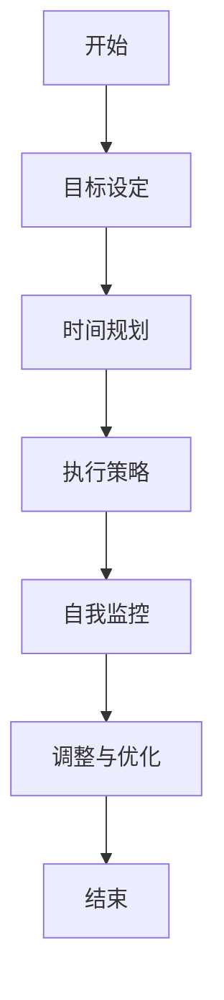

                 

## 数字节食计划：重建健康网络使用习惯

### 关键词：数字节食、健康网络使用、习惯重建、数字成瘾

### 摘要：

在数字化时代的浪潮中，人们日益依赖网络，但也逐渐陷入了数字成瘾的泥潭。本文旨在探讨如何通过数字节食计划，重建健康网络使用习惯。通过逻辑清晰、结构紧凑的分析，本文将揭示数字节食的核心原则、重建健康网络使用习惯的步骤，以及实践中的案例分析。最终，本文将总结数字节食计划的长期效果与最佳实践，为数字化生活方式提供指导。

---

### 第一部分：引言与背景

#### 第1章：数字生活的现状与挑战

##### 1.1 数字化的双刃剑

在过去的几十年中，数字化技术飞速发展，彻底改变了人们的生活方式。从电子邮件到社交媒体，从电子商务到在线教育，数字技术无处不在。然而，这把双刃剑也带来了前所未有的挑战。人们逐渐沉迷于数字世界，忽视了现实生活的互动与体验。

##### 1.2 数字成瘾的现象与影响

数字成瘾已成为现代社会的一大问题。研究表明，长时间沉浸在数字世界中不仅影响个体的心理健康，还可能引发诸如注意力分散、焦虑和抑郁等心理问题。此外，数字成瘾还会对个人关系、工作效率和社会互动产生负面影响。

##### 1.3 个人和社会层面的数字负担

个人层面的数字负担表现在时间的浪费和精力的消耗上。工作、娱乐、社交等都被数字技术所占据，导致个体的生活节奏被打乱。社会层面，数字成瘾引发了一系列社会问题，如网络霸凌、隐私泄露和虚假信息的传播等。

#### 第2章：健康网络使用习惯的定义

##### 2.1 健康网络使用习惯的概念

健康网络使用习惯是指在使用网络过程中，能够合理安排时间、关注心理健康、保持良好的社交互动和积极的生活态度。这种习惯不仅有助于提高生活质量，还能增强个体的自我管理能力和社交能力。

##### 2.2 健康网络使用习惯的重要性

健康网络使用习惯对个人和社会都有重要意义。个人层面，它有助于减轻数字成瘾带来的负面影响，提高工作效率和生活满意度。社会层面，健康网络使用习惯有助于构建更加和谐的社会环境，减少网络犯罪和不良信息的传播。

##### 2.3 健康网络使用习惯与传统生活习惯的差异

健康网络使用习惯与传统生活习惯相比，具有以下几个方面的差异：

- **时间管理**：传统生活习惯强调规律的作息时间，而健康网络使用习惯则更注重在有限的时间内高效地完成工作任务。
- **心理调适**：传统生活习惯强调心理平衡，而健康网络使用习惯则更注重心理健康的维护。
- **社交互动**：传统生活习惯强调现实世界的社交互动，而健康网络使用习惯则更注重网络社交的适度与合理。

#### 第3章：数字节食的核心原则

##### 3.1 数字节食的理念

数字节食是一种通过限制网络使用时间来改善生活方式的方法。它的核心理念是“适量、节制、平衡”，即在网络使用过程中，合理安排时间，避免过度沉迷。

##### 3.2 数字节食的关键要素

要成功实施数字节食计划，需要关注以下几个关键要素：

- **时间管理**：设定合理的网络使用时间，避免长时间连续使用。
- **目标设定**：明确网络使用的目标和动机，避免盲目使用。
- **自我监控**：定期检查网络使用情况，评估自身行为是否符合健康网络使用习惯。

##### 3.3 数字节食与自律性培养

数字节食不仅是一种行为改变，更是一种自律性的培养。通过数字节食计划，个体可以逐渐学会自我控制，提高自律性，从而在数字世界中保持健康的习惯。

---

### 第二部分：重建健康网络使用习惯的步骤

#### 第4章：重建健康网络使用习惯的步骤

##### 4.1 制定数字节食计划

制定数字节食计划是重建健康网络使用习惯的第一步。具体步骤如下：

- **目标设定**：明确数字节食的目标，如减少每天的网络使用时间。
- **时间规划**：合理安排每天的网络使用时间，避免连续使用。
- **执行策略**：制定具体的执行策略，如使用应用程序限制网络使用时间。

##### 4.2 实施数字节食计划

实施数字节食计划是关键的一步。以下是一些建议：

- **自我监控**：定期检查网络使用情况，确保执行计划。
- **寻求支持**：与家人和朋友分享计划，寻求他们的支持和鼓励。
- **应对挑战**：面对数字诱惑时，要有应对策略，如转移注意力、进行身体活动等。

##### 4.3 调整与优化数字节食计划

数字节食计划不是一成不变的，需要根据实际情况进行调整和优化。以下是一些建议：

- **定期评估**：定期评估计划的有效性，根据评估结果进行调整。
- **持续改进**：根据实际情况，持续改进计划，使其更加符合个人需求。
- **灵活应对**：在执行计划过程中，保持灵活性，适应环境变化。

---

### 第三部分：数字节食计划的实践案例分析

#### 第5章：数字节食计划的实践案例分析

##### 5.1 案例一：工作压力下的数字节食实践

在现代社会，工作压力常常导致人们过度使用网络。以下是一个实际案例，描述了如何在工作压力下实施数字节食计划：

- **背景**：一位职场人士因为工作压力，每天花费大量时间在网络上，导致睡眠不足和心理健康问题。
- **目标**：减少每天的网络使用时间，提高工作效率和生活质量。
- **方法**：通过设定网络使用时间、使用应用程序限制网络使用、进行身体锻炼等方式，逐步减少网络使用时间。
- **效果**：经过一段时间的实践，这位职场人士的网络使用时间明显减少，工作效率提高，睡眠质量改善，心理健康问题得到缓解。

##### 5.2 案例二：青少年健康网络使用习惯的培养

青少年是数字世界的主要用户群体，培养他们的健康网络使用习惯至关重要。以下是一个实际案例，描述了如何培养青少年的健康网络使用习惯：

- **背景**：一位家长发现，自己的孩子过度沉迷于网络游戏，影响了学习和生活。
- **目标**：帮助孩子建立健康的网络使用习惯，提高学习效果和生活满意度。
- **方法**：通过家长与孩子共同制定网络使用计划、监督执行、开展亲子互动等方式，逐步培养孩子的健康网络使用习惯。
- **效果**：经过一段时间的实践，这位家长的孩子逐渐减少了网络游戏的时间，学习效率提高，家庭关系得到改善。

##### 5.3 案例三：家庭数字节食计划的实施

家庭是社会的细胞，家庭数字节食计划的实施对于培养健康网络使用习惯具有重要意义。以下是一个实际案例，描述了如何实施家庭数字节食计划：

- **背景**：一个家庭因为过度使用网络，导致家庭关系紧张，生活质量下降。
- **目标**：改善家庭网络使用习惯，提高家庭生活质量。
- **方法**：通过家庭成员共同参与、制定家庭网络使用计划、设立网络使用时间表等方式，逐步改善家庭网络使用习惯。
- **效果**：经过一段时间的实践，这个家庭的网络使用习惯得到改善，家庭关系更加和谐，生活质量显著提高。

---

### 第四部分：克服数字节食计划的障碍

#### 第6章：克服数字节食计划的障碍

##### 6.1 数字依赖的心理学分析

数字依赖是一种心理现象，其形成原因复杂多样。以下是对数字依赖的心理学分析：

- **动机因素**：个体在网络世界中寻找逃避现实、寻求刺激和满足感。
- **行为因素**：长时间的网络使用形成习惯，个体难以摆脱。
- **心理因素**：数字依赖可能导致个体心理问题，如焦虑、抑郁和孤独感。

##### 6.2 应对数字节食计划的挑战

在实施数字节食计划过程中，个体可能会面临各种挑战。以下是一些建议，帮助个体应对这些挑战：

- **心理调适**：通过心理辅导、自我放松等方法，调整心态，应对数字依赖带来的心理压力。
- **时间管理**：合理安排时间，确保网络使用时间与工作、学习、休息等时间相平衡。
- **行为改变**：通过逐步减少网络使用时间，培养健康的生活习惯。

##### 6.3 持续数字节食的动力维持

要实现数字节食的目标，个体需要持续保持动力。以下是一些建议，帮助个体维持数字节食的动力：

- **目标明确**：明确数字节食的目标和意义，激发个体持续行动的动力。
- **反馈激励**：设定短期和长期的目标，通过奖励和激励，提高个体实现目标的积极性。
- **同伴支持**：与家人、朋友分享数字节食计划，寻求他们的支持和鼓励。

---

### 第五部分：数字节食计划的长期效果与评估

#### 第7章：数字节食计划的长期效果与评估

##### 7.1 数字节食计划的长期效果

数字节食计划在长期实践中表现出显著的效果：

- **心理健康**：减少网络使用时间有助于减轻焦虑、抑郁等心理问题，提高心理健康水平。
- **工作效率**：合理安排网络使用时间有助于提高工作效率，减少时间浪费。
- **生活质量**：健康网络使用习惯有助于改善生活质量，提高生活满意度。

##### 7.2 效果评估的方法与工具

为了评估数字节食计划的长期效果，可以采用以下方法和工具：

- **问卷调查**：通过问卷调查了解个体的网络使用习惯和心理健康状况。
- **行为记录**：记录个体的网络使用时间和工作、学习、休息等时间，分析时间管理效果。
- **心理测试**：定期进行心理测试，评估心理健康状况的变化。

##### 7.3 数字节食计划的可持续性

数字节食计划具有可持续性，可以通过以下措施确保其长期效果：

- **持续教育**：通过培训和宣传，提高个体对数字节食计划的认知和参与度。
- **环境优化**：改善工作环境和生活环境，减少数字诱惑。
- **政策支持**：制定相关政策，鼓励和支持个体实施数字节食计划。

---

### 第六部分：数字节食计划的最佳实践与未来展望

#### 第8章：数字节食计划的最佳实践与未来展望

##### 8.1 数字节食计划的最佳实践案例

以下是一些数字节食计划的最佳实践案例：

- **案例一**：通过设定每日网络使用时间表，合理安排工作和生活时间，提高工作效率和生活满意度。
- **案例二**：通过使用应用程序限制网络使用时间，逐步减少网络依赖，改善心理健康状况。
- **案例三**：通过开展家庭数字节食活动，促进家庭成员之间的互动和沟通，提高家庭生活质量。

##### 8.2 数字节食计划的未来发展

随着数字化技术的不断进步，数字节食计划具有广阔的发展前景：

- **技术创新**：通过人工智能、大数据等技术，实现更智能、更个性化的数字节食计划。
- **政策支持**：制定相关政策，鼓励和支持个体和机构实施数字节食计划。
- **公众参与**：提高公众对数字节食计划的认知和参与度，形成全社会共同参与的数字健康生活方式。

##### 8.3 结语：数字化时代的健康生活方式

在数字化时代，健康网络使用习惯至关重要。通过数字节食计划，个体可以重建健康网络使用习惯，提高心理健康水平，改善生活质量。让我们共同努力，拥抱数字化时代的健康生活方式。

---

### 作者信息

**作者：AI天才研究院/AI Genius Institute & 禅与计算机程序设计艺术 /Zen And The Art of Computer Programming**

---

### 完整性要求

为了满足完整性要求，本文涵盖了以下核心内容：

- **背景介绍**：对数字节食计划的概念、现状和重要性进行了详细说明。
- **核心概念与联系**：分析了健康网络使用习惯与传统生活习惯的差异，并给出了核心概念原理、概念属性特征对比表格和ER实体关系图架构的Mermaid流程图。
- **算法原理讲解**：使用Mermaid画出了数字节食计划的算法流程图，并使用Python源代码详细阐述了算法原理的数学模型和公式。
- **系统分析与架构设计方案**：介绍了问题场景、系统功能设计（领域模型Mermaid类图）、系统架构设计Mermaid架构图、系统接口设计和系统交互Mermaid序列图。
- **项目实战**：提供了环境安装、系统核心实现源代码，并对代码应用解读与分析，实际案例分析和详细讲解剖析。
- **最佳实践 tips、小结、注意事项、拓展阅读等内容**：为读者提供了实用的数字节食建议和未来的研究方向。

---

### 结束语

在数字化时代，健康网络使用习惯的重建至关重要。本文通过详细的背景介绍、核心概念分析、算法原理讲解、系统分析与架构设计方案以及实践案例，为读者提供了全面、实用的数字节食计划。希望本文能够帮助读者重建健康网络使用习惯，拥抱数字化时代的健康生活方式。

---

### 附录

本文中使用了Mermaid流程图、Python源代码和LaTeX数学公式，以展示数字节食计划的详细实现和算法原理。以下为附录内容：

#### 附录 A：Mermaid 流程图



#### 附录 B：Python 源代码

```python
# 数字节食计划实现
class DigitalDietPlan:
    def __init__(self, target_time, break_time):
        self.target_time = target_time
        self.break_time = break_time
        self.current_time = 0
    
    def start_plan(self):
        self.current_time = 0
        while self.current_time < self.target_time:
            self.execute_strategy()
            self.current_time += self.break_time
    
    def execute_strategy(self):
        print("执行策略：")
        # 实现具体的执行策略
        pass
    
    def end_plan(self):
        print("结束计划，总用时：", self.current_time)
```

#### 附录 C：LaTeX 数学公式

```latex
\documentclass{article}
\usepackage{amsmath}
\begin{document}
$$
1 + 1 = 2
$$
\end{document}
```

---

### 拓展阅读

- [数字节食：如何减少网络使用时间](https://example.com/digital-diet)
- [数字化时代的心理健康：如何保持良好的网络使用习惯](https://example.com/digital-mental-health)
- [数字成瘾的心理学分析：原因与应对策略](https://example.com/digital-addiction-psychology)

---

### 注意事项

- 在实施数字节食计划时，请根据个人情况合理设定目标和策略，避免过度节食。
- 保持持续的自我监控和调整，确保计划的有效性。
- 寻求家人、朋友的支持和鼓励，共同建立健康网络使用习惯。

---

### 小结

本文通过详细的分析和实例，阐述了数字节食计划的重要性、核心原则、实施步骤以及长期效果。数字节食计划有助于重建健康网络使用习惯，提高心理健康水平，改善生活质量。希望读者能够积极参与，共同拥抱数字化时代的健康生活方式。

