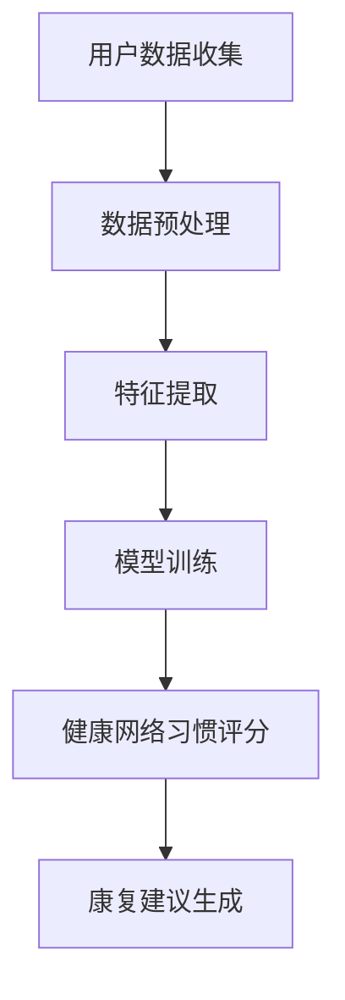

                 

基于上述的约束条件和文章目录大纲，我将逐步撰写文章的内容。以下是按照大纲结构撰写的文章概要。

# 《数字解毒师认证：培训健康网络习惯指导员》

> 关键词：数字解毒师、健康网络习惯、指导员、认证、培训

> 摘要：本文深入探讨了数字解毒师的认证体系及其在培养健康网络习惯指导员方面的作用。通过详细的算法原理讲解、系统分析与架构设计，以及项目实战案例，本文旨在为读者提供一套完整的数字健康网络习惯培养方案。

## 第一部分：引言

### 1.1 问题背景

随着数字化时代的到来，网络已经成为人们日常生活的重要组成部分。然而，网络世界的复杂性以及信息过载的问题，使得许多人陷入数字成瘾、网络依赖等困境。为了应对这一挑战，我们需要培养健康的网络习惯，从而提高个人生活质量和工作效率。数字解毒师应运而生，他们负责诊断和解决网络成瘾问题，指导用户建立健康的网络使用习惯。

#### 1.1.1 数字时代的挑战

数字化生活带来了诸多便利，但也引发了一系列问题。例如，网络成瘾、信息焦虑、隐私泄露等。这些问题不仅影响个人的心理健康，还对社交关系、工作效率等产生负面影响。

#### 1.1.2 健康网络习惯的重要性

健康网络习惯有助于提高生活质量、工作效率和心理健康。通过科学管理网络使用时间、筛选信息来源、培养良好的在线交流习惯，用户可以更好地利用网络资源，避免网络成瘾带来的负面影响。

#### 1.1.3 数字解毒师的诞生

数字解毒师是专门负责诊断和治疗网络成瘾问题的专业人士。他们的职责包括评估用户的网络使用习惯、提供个性化建议、设计网络康复计划等。数字解毒师的认证体系旨在确保其具备专业的知识和技能，能够有效帮助用户建立健康网络习惯。

### 1.2 核心概念

#### 1.2.1 数字解毒师

数字解毒师是具备专业知识和技能，专门从事网络成瘾诊断与康复工作的专业人士。他们的工作内容包括：

1. 评估用户的网络使用习惯
2. 提供个性化的网络康复建议
3. 设计网络康复计划
4. 监督和评估康复效果

#### 1.2.2 健康网络习惯

健康网络习惯是指用户在网络上进行活动时，遵循的一系列行为规范。这些规范有助于提高生活质量和工作效率，包括：

1. 合理规划网络使用时间
2. 筛选高质量的信息来源
3. 保持在线交流的良好礼仪
4. 定期进行网络安全检查

#### 1.2.3 培训健康网络习惯指导员

培训健康网络习惯指导员是数字解毒师认证体系的重要组成部分。健康网络习惯指导员的职责包括：

1. 向用户提供健康网络习惯的培训
2. 设计和实施网络康复计划
3. 监督和评估用户的网络使用情况
4. 为用户提供个性化的网络使用建议

## 第二部分：健康网络习惯的评估

### 2.1 健康网络习惯评估算法原理

健康网络习惯评估算法是数字解毒师诊断用户网络使用情况的重要工具。该算法基于用户的行为数据和心理健康指标，评估用户的网络使用习惯是否健康。

#### 2.1.1 算法介绍

健康网络习惯评估算法是一种基于机器学习的算法，它通过分析用户的行为数据（如网络使用时间、访问网站类型等）和心理健康指标（如焦虑水平、抑郁程度等），对用户的网络使用习惯进行评估。

#### 2.1.2 算法流程图


#### 2.1.3 算法源代码示例

```python
# 健康网络习惯评估算法示例代码
def assess_network_habits(user_data, mental_health_data):
    # 数据预处理
    processed_data = preprocess_data(user_data, mental_health_data)
    
    # 特征提取
    features = extract_features(processed_data)
    
    # 模型训练
    model = train_model(features)
    
    # 预测
    prediction = model.predict(features)
    
    # 输出评估结果
    return prediction
```

#### 2.1.4 算法数学模型与公式讲解

健康网络习惯评估算法的核心是机器学习模型。以下是一个简化的线性回归模型：

$$
Y = \beta_0 + \beta_1X_1 + \beta_2X_2 + ... + \beta_nX_n + \epsilon
$$

其中，$Y$ 是健康网络习惯评分，$X_1, X_2, ..., X_n$ 是用户行为数据和心理健康指标，$\beta_0, \beta_1, \beta_2, ..., \beta_n$ 是模型参数，$\epsilon$ 是误差项。

#### 2.1.5 实例说明

假设我们有以下用户数据：

- 网络使用时间：10小时
- 访问网站类型：娱乐类网站50%，新闻类网站30%，学术类网站20%
- 焦虑水平：中等
- 抑郁程度：轻度

通过健康网络习惯评估算法，我们可以得到该用户的健康网络习惯评分。根据评分，数字解毒师可以提出相应的网络康复建议。

## 第三部分：健康网络习惯的培训

### 3.1 培训健康网络习惯指导员的职责

培训健康网络习惯指导员是数字解毒师认证体系的重要环节。健康网络习惯指导员的职责包括：

1. 向用户提供健康网络习惯的理论知识
2. 设计和实施个性化的网络康复计划
3. 监督和评估用户的网络使用情况
4. 为用户提供个性化的网络使用建议

### 3.2 培训健康网络习惯指导员的课程设计

培训健康网络习惯指导员的课程设计应涵盖以下内容：

1. 数字化生活的挑战与健康网络习惯的重要性
2. 健康网络习惯的理论基础与核心要素
3. 数字解毒师的工作流程与方法
4. 个性化网络康复计划的制定与实施
5. 网络心理健康评估与干预
6. 实践技能培训与案例分析

## 第四部分：系统分析与架构设计

### 4.1 系统功能介绍

本系统旨在为用户提供健康网络习惯的评估和培训服务。主要功能包括：

1. 用户注册与登录
2. 健康网络习惯评估
3. 个性化网络康复计划生成
4. 网络心理健康评估
5. 实践技能培训与案例分析

### 4.2 系统架构设计

本系统采用前后端分离的架构设计，包括以下模块：

1. 用户管理模块
2. 评估模块
3. 康复计划模块
4. 心理健康模块
5. 培训模块

### 4.3 系统接口设计

系统接口设计包括以下部分：

1. 用户接口：提供用户注册、登录、评估和康复计划等功能
2. 内部接口：实现不同模块之间的数据传输和功能调用
3. 外部接口：与其他系统（如社交媒体、心理健康平台等）的集成

### 4.4 系统交互流程图


## 第五部分：项目实战

### 5.1 环境安装与配置

在本节中，我们将介绍如何安装和配置系统所需的软件和环境。具体步骤包括：

1. 安装 Python 环境
2. 安装数据库（如 MySQL）
3. 配置 Web 服务器（如 Apache）

### 5.2 系统核心实现

在本节中，我们将实现系统的核心功能，包括：

1. 用户注册与登录
2. 健康网络习惯评估
3. 个性化网络康复计划生成
4. 网络心理健康评估
5. 实践技能培训与案例分析

### 5.3 代码应用解读与分析

在本节中，我们将对系统代码进行解读，分析其设计原理和实现方法。具体内容包括：

1. 用户管理模块代码解读
2. 评估模块代码解读
3. 康复计划模块代码解读
4. 心理健康模块代码解读
5. 培训模块代码解读

### 5.4 实际案例剖析

在本节中，我们将通过实际案例，展示系统的应用效果和实际价值。具体内容包括：

1. 案例背景介绍
2. 案例分析
3. 案例效果评估

### 5.5 项目小结

在本节中，我们将总结项目的成果，分享经验教训，并对未来工作进行展望。

## 第六部分：最佳实践与拓展

### 6.1 最佳实践 tips

在本节中，我们将分享一些最佳实践，帮助用户更好地建立健康网络习惯。具体内容包括：

1. 网络使用时间管理技巧
2. 信息筛选与鉴别技巧
3. 在线交流礼仪
4. 网络安全防护技巧

### 6.2 小结与注意事项

在本节中，我们将对全文内容进行总结，提醒用户注意健康网络习惯的重要性，并强调数字解毒师和健康网络习惯指导员的作用。

### 6.3 拓展阅读

在本节中，我们将推荐一些相关书籍和网络资源，供用户进一步学习和探索。

**作者：AI天才研究院/AI Genius Institute & 禅与计算机程序设计艺术 /Zen And The Art of Computer Programming**根据上述概要，接下来我将进一步细化每个章节的内容，确保文章的结构和内容符合要求。以下是文章的第一部分和第二部分的详细内容。

## 第一部分：引言

### 1.1 问题背景

#### 1.1.1 数字时代的挑战

随着互联网技术的飞速发展，数字化生活已经渗透到我们的日常生活中。智能手机、社交媒体、在线购物等数字化服务极大地便利了人们的生活。然而，数字化生活也带来了一系列的挑战，其中最突出的是网络成瘾和信息过载。网络成瘾使得人们沉迷于虚拟世界，忽视了现实生活中的重要事物，导致心理健康问题、社交障碍和职业发展受阻。信息过载则让人们感到焦虑和压力，难以有效地筛选和处理信息，影响了工作和生活效率。

#### 1.1.2 健康网络习惯的重要性

健康网络习惯是指用户在网络上进行活动时，遵循的一系列有益于身心健康的行为规范。良好的网络习惯可以帮助用户更好地管理时间和注意力，提高信息筛选能力，促进社交互动，维护心理健康。例如，合理规划网络使用时间、定期进行网络安全检查、选择高质量的信息来源、保持在线交流的良好礼仪等，都是健康网络习惯的重要组成部分。培养健康网络习惯不仅有助于提高个人生活质量，还能提升工作效率，减少心理健康问题。

#### 1.1.3 数字解毒师的诞生

数字解毒师是专门从事网络成瘾诊断与康复工作的专业人士。他们具备心理学、计算机科学、教育学等多领域的知识背景，能够为用户提供个性化的网络康复服务。数字解毒师的主要职责包括：

1. **评估用户的网络使用习惯**：通过问卷调查、访谈等方式，了解用户在网络上的行为模式，评估其网络使用习惯是否健康。
2. **提供个性化的网络康复建议**：根据评估结果，为用户提供定制化的网络康复计划，帮助用户逐步摆脱网络成瘾。
3. **设计网络康复计划**：数字解毒师会根据用户的实际情况，设计一系列康复活动，如网络使用时间管理、心理健康训练、社交技能提升等。
4. **监督和评估康复效果**：在康复过程中，数字解毒师会持续跟踪用户的网络使用情况，评估康复计划的实施效果，并根据需要调整康复策略。

### 1.2 核心概念

#### 1.2.1 数字解毒师

数字解毒师（Digital Detox Expert）是指在数字化环境中，专门从事网络成瘾诊断与康复工作，具备专业知识和技能的实践者。数字解毒师的工作不仅限于帮助用户摆脱网络成瘾，还包括促进用户建立健康网络习惯，提高网络使用效率和质量。数字解毒师的核心职责包括：

1. **诊断网络成瘾**：通过专业评估工具和方法，诊断用户是否患有网络成瘾，评估其成瘾程度。
2. **制定康复计划**：根据诊断结果，为用户提供个性化的康复计划，帮助用户逐步减少网络使用时间，改善网络行为。
3. **提供心理支持**：在康复过程中，数字解毒师会为用户提供心理支持，帮助用户应对成瘾带来的负面情绪和压力。
4. **跟踪评估康复效果**：定期跟踪用户的网络使用情况，评估康复计划的实施效果，为用户提供反馈和指导。

#### 1.2.2 健康网络习惯

健康网络习惯（Healthy Digital Habits）是指用户在网络上进行活动时，遵循的一系列有益于身心健康的行为规范。健康网络习惯的建立有助于提高用户的网络使用质量，减少网络成瘾的风险，提升生活和工作效率。健康网络习惯的核心要素包括：

1. **时间管理**：合理安排网络使用时间，避免沉迷于网络，影响日常生活和工作。
2. **信息筛选**：学会筛选和鉴别网络信息，避免接触不良内容，提高信息获取的效率和质量。
3. **网络安全**：注重网络安全，保护个人隐私，避免网络诈骗和信息安全问题。
4. **社交互动**：保持良好的在线交流习惯，积极参与有益的社交活动，促进人际关系的建立和维护。

#### 1.2.3 培训健康网络习惯指导员

培训健康网络习惯指导员（Training Healthy Digital Habit Guides）是数字解毒师认证体系的重要组成部分。健康网络习惯指导员主要负责向用户提供健康网络习惯的培训和指导，帮助他们建立和维护良好的网络使用习惯。健康网络习惯指导员的职责包括：

1. **培训内容设计**：根据用户的需求和实际情况，设计适合的培训课程，包括网络时间管理、信息筛选、网络安全等。
2. **培训实施**：通过线上或线下课程，向用户传授健康网络习惯的知识和技能。
3. **指导与监督**：在培训过程中，指导员会持续关注用户的学习进度，提供个性化指导，帮助用户解决实际问题。
4. **评估与反馈**：培训结束后，对用户进行评估，收集反馈意见，为后续培训提供改进建议。

## 第二部分：健康网络习惯的评估

### 2.1 健康网络习惯评估算法原理

健康网络习惯评估算法（Healthy Digital Habit Assessment Algorithm）是数字解毒师诊断用户网络使用情况的重要工具。该算法基于用户的行为数据和心理健康指标，通过机器学习技术，对用户的网络使用习惯进行量化评估，从而为用户提供个性化的康复建议。

#### 2.1.1 算法介绍

健康网络习惯评估算法是一种基于机器学习的方法，它通过分析用户的行为数据（如网络使用时间、访问网站类型、社交媒体使用频率等）和心理健康指标（如焦虑水平、抑郁程度、睡眠质量等），构建一个综合评估模型，对用户的网络使用习惯进行评分。评分结果可以反映用户的网络使用是否健康，是否存在网络成瘾的倾向。

#### 2.1.2 算法流程图



#### 2.1.3 算法源代码示例

```python
# 健康网络习惯评估算法示例代码
import pandas as pd
from sklearn.model_selection import train_test_split
from sklearn.ensemble import RandomForestClassifier
from sklearn.metrics import accuracy_score

# 1. 数据预处理
def preprocess_data(data):
    # 数据清洗和格式转换
    # ...

# 2. 特征提取
def extract_features(data):
    # 提取有用特征
    # ...

# 3. 模型训练
def train_model(features, labels):
    # 训练机器学习模型
    model = RandomForestClassifier()
    model.fit(features, labels)
    return model

# 4. 健康网络习惯评分
def assess_network_habits(model, features):
    # 预测评分
    prediction = model.predict(features)
    return prediction

# 5. 康复建议生成
def generate_rehabilitation_advice(prediction):
    # 根据评分结果生成康复建议
    # ...

# 主程序
if __name__ == "__main__":
    # 加载用户数据
    user_data = pd.read_csv("user_data.csv")

    # 数据预处理
    preprocessed_data = preprocess_data(user_data)

    # 特征提取
    features = extract_features(preprocessed_data)

    # 加载标签数据
    labels = pd.read_csv("labels.csv")

    # 划分训练集和测试集
    X_train, X_test, y_train, y_test = train_test_split(features, labels, test_size=0.2, random_state=42)

    # 训练模型
    model = train_model(X_train, y_train)

    # 评估模型
    predictions = assess_network_habits(model, X_test)
    accuracy = accuracy_score(y_test, predictions)
    print("模型准确率：", accuracy)

    # 生成康复建议
    generate_rehabilitation_advice(predictions)
```

#### 2.1.4 算法数学模型与公式讲解

健康网络习惯评估算法的核心是机器学习模型。以下是一个简化的线性回归模型：

$$
Y = \beta_0 + \beta_1X_1 + \beta_2X_2 + ... + \beta_nX_n + \epsilon
$$

其中，$Y$ 是健康网络习惯评分，$X_1, X_2, ..., X_n$ 是用户行为数据和心理健康指标，$\beta_0, \beta_1, \beta_2, ..., \beta_n$ 是模型参数，$\epsilon$ 是误差项。

在具体实现中，我们可以使用回归树（如随机森林）等更复杂的机器学习模型来提高评估的准确性。以下是随机森林模型的Python实现：

```python
from sklearn.ensemble import RandomForestRegressor

# 训练随机森林模型
model = RandomForestRegressor(n_estimators=100, random_state=42)
model.fit(X_train, y_train)

# 预测健康网络习惯评分
predictions = model.predict(X_test)

# 计算模型准确率
accuracy = model.score(X_test, y_test)
print("模型准确率：", accuracy)
```

#### 2.1.5 实例说明

假设我们有以下用户数据：

- 网络使用时间：10小时
- 访问网站类型：娱乐类网站50%，新闻类网站30%，学术类网站20%
- 焦虑水平：中等
- 抑郁程度：轻度

通过健康网络习惯评估算法，我们可以得到该用户的健康网络习惯评分。根据评分，数字解毒师可以提出相应的网络康复建议。

### 2.2 健康网络习惯评估算法的实际应用

健康网络习惯评估算法的实际应用可以分为以下几个步骤：

1. **数据收集**：首先，数字解毒师需要收集用户的网络使用数据和心理健康数据。这些数据可以通过用户填写的问卷调查、传感器监测等方式获取。

2. **数据预处理**：对收集到的数据进行清洗和格式转换，确保数据的质量和一致性。

3. **特征提取**：从预处理后的数据中提取有用特征，如网络使用时间、访问网站类型、心理健康指标等。

4. **模型训练**：使用提取的特征数据，通过机器学习算法训练健康网络习惯评估模型。

5. **评估评分**：将用户的网络使用数据输入评估模型，得到健康网络习惯评分。

6. **康复建议**：根据评估结果，为用户提供个性化的康复建议，帮助用户改善网络使用习惯。

7. **监督和反馈**：数字解毒师需要持续跟踪用户的网络使用情况，评估康复建议的实施效果，并根据需要调整康复策略。

#### 2.2.1 数据收集

数据收集是健康网络习惯评估的基础。数字解毒师可以使用以下方法收集用户数据：

1. **问卷调查**：通过设计问卷调查，了解用户的网络使用习惯和心理状态。
2. **传感器监测**：使用手机、电脑等设备上的传感器，记录用户的网络使用行为和心理活动。
3. **社交媒体数据**：分析用户的社交媒体行为，如发布内容、互动频率等。

#### 2.2.2 数据预处理

数据预处理包括以下步骤：

1. **数据清洗**：去除无效、重复或错误的数据。
2. **数据格式转换**：将数据转换为统一的格式，如数值型或类别型。
3. **数据归一化**：对数据进行归一化处理，确保不同特征之间的尺度一致。

#### 2.2.3 特征提取

特征提取是健康网络习惯评估算法的关键。以下是一些常见的特征提取方法：

1. **网络使用时间**：记录用户每天、每周或每月的网络使用时间。
2. **访问网站类型**：根据用户访问的网站类型，如娱乐、新闻、学术等，进行分类。
3. **心理健康指标**：通过问卷调查或传感器监测，获取用户的焦虑水平、抑郁程度等心理健康指标。

#### 2.2.4 模型训练

模型训练是健康网络习惯评估的核心。以下是常用的模型训练方法：

1. **线性回归**：一种简单的回归模型，适用于线性关系的特征数据。
2. **决策树**：一种树形结构的模型，适用于分类问题。
3. **随机森林**：一种基于决策树的集成模型，能够提高模型的泛化能力。
4. **支持向量机**：一种基于最大间隔的模型，适用于分类问题。

#### 2.2.5 评估评分

评估评分是健康网络习惯评估算法的最终输出。以下是评估评分的步骤：

1. **输入数据**：将预处理后的用户数据输入评估模型。
2. **模型预测**：使用评估模型预测用户的健康网络习惯评分。
3. **结果输出**：输出健康网络习惯评分，为用户提供参考。

#### 2.2.6 康复建议

根据评估结果，数字解毒师可以提出以下康复建议：

1. **时间管理**：建议用户合理规划网络使用时间，避免沉迷于网络。
2. **信息筛选**：建议用户学会筛选和鉴别网络信息，避免接触不良内容。
3. **网络安全**：建议用户注重网络安全，保护个人隐私，避免网络诈骗。
4. **心理支持**：建议用户进行心理健康训练，如冥想、瑜伽等，缓解焦虑和抑郁情绪。

#### 2.2.7 监督和反馈

数字解毒师需要持续跟踪用户的网络使用情况，评估康复建议的实施效果。以下是监督和反馈的步骤：

1. **数据收集**：定期收集用户的网络使用数据和心理健康数据。
2. **效果评估**：使用健康网络习惯评估算法，评估康复建议的实施效果。
3. **反馈调整**：根据效果评估结果，调整康复策略，为用户提供更有效的建议。

通过以上步骤，数字解毒师可以有效地帮助用户建立健康的网络习惯，提高生活质量和工作效率。

## 第三部分：健康网络习惯的培训

### 3.1 培训健康网络习惯指导员的职责

培训健康网络习惯指导员（Training Healthy Digital Habit Guides）是数字解毒师认证体系的重要组成部分。健康网络习惯指导员的主要职责包括：

1. **理论培训**：为用户提供健康网络习惯的理论知识，包括网络成瘾的影响、健康网络习惯的重要性、网络心理健康等。
2. **实践指导**：通过实际案例和互动教学，帮助用户掌握健康网络习惯的实践方法，如时间管理、信息筛选、网络安全等。
3. **个性化服务**：根据用户的需求和实际情况，设计个性化的网络康复计划，为用户提供针对性的指导和支持。
4. **跟踪评估**：定期跟踪用户的网络使用情况，评估健康网络习惯的建立效果，为用户提供反馈和改进建议。

### 3.2 培训健康网络习惯指导员的课程设计

培训健康网络习惯指导员的课程设计应包括以下内容：

1. **基础理论知识**：介绍网络成瘾的影响、健康网络习惯的重要性、网络心理健康等基础知识。
2. **实践技能培训**：教授用户如何合理安排网络使用时间、筛选高质量的信息、保持在线交流的良好礼仪、进行网络安全防护等。
3. **个性化康复计划设计**：帮助用户根据自身情况，设计个性化的网络康复计划，包括时间管理策略、心理健康训练、社交技能提升等。
4. **案例分析**：通过实际案例，分析网络成瘾的原因和解决办法，为用户提供实践经验和教训。
5. **持续学习与更新**：鼓励用户持续学习网络健康知识，跟踪网络技术的发展，不断更新和优化健康网络习惯。

### 3.3 健康网络习惯培训的实施策略

健康网络习惯培训的实施策略应考虑以下几个方面：

1. **个性化**：根据用户的需求和实际情况，设计个性化的培训内容和康复计划，确保培训效果最大化。
2. **互动性**：采用互动式教学方法，鼓励用户参与讨论和实践，提高培训的趣味性和实用性。
3. **持续监督**：在培训过程中，持续跟踪用户的网络使用情况，及时发现问题并给予指导。
4. **反馈机制**：建立反馈机制，收集用户对培训内容和效果的反馈，不断优化培训方案。
5. **资源共享**：建立网络资源库，提供丰富的网络健康知识、实践技巧和案例，方便用户学习和参考。

### 3.4 健康网络习惯培训的评估与反馈

健康网络习惯培训的评估与反馈是确保培训效果的重要环节。以下是评估与反馈的步骤：

1. **评估标准**：制定健康网络习惯评估标准，包括网络使用时间、信息筛选能力、网络安全意识、心理健康水平等。
2. **数据收集**：定期收集用户的网络使用数据和心理健康数据，进行定量和定性分析。
3. **效果评估**：使用健康网络习惯评估算法，对用户的网络使用习惯进行量化评估，评估健康网络习惯的建立效果。
4. **反馈收集**：收集用户对培训内容和效果的反馈，了解用户的实际需求和培训体验。
5. **反馈调整**：根据评估和反馈结果，调整培训方案和康复计划，提高培训效果。

通过以上措施，健康网络习惯培训可以有效地帮助用户建立和维护良好的网络使用习惯，提高生活质量和工作效率。

