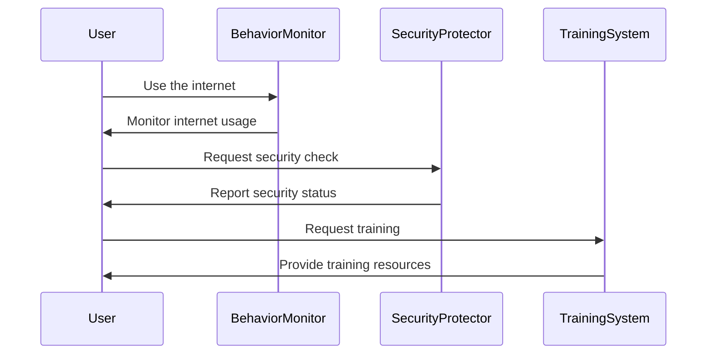
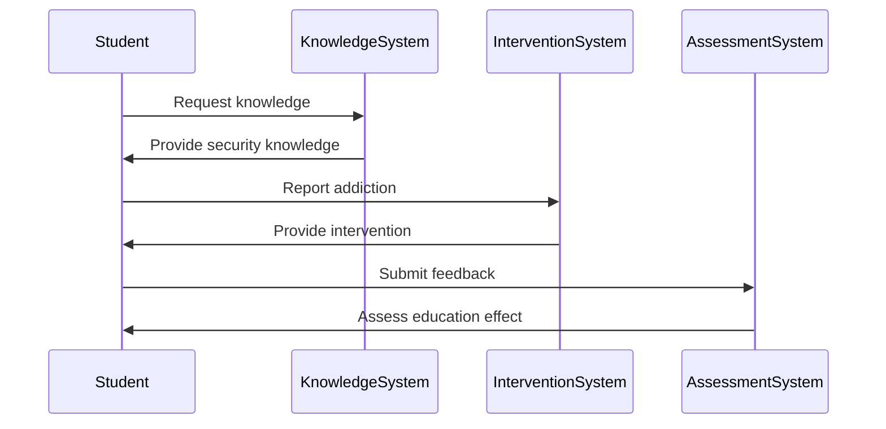
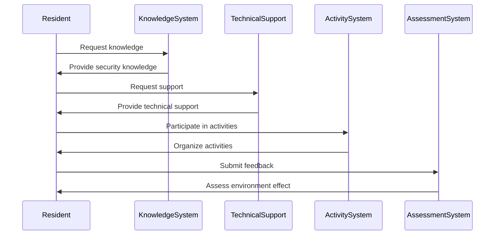

                 

### 文章标题：数字解毒训练营：重建健康网络使用习惯的集中课程

#### 关键词：数字解毒、网络使用习惯、健康、集中课程、训练营

#### 摘要：
本文旨在探讨数字时代下网络使用带来的挑战，通过《数字解毒训练营：重建健康网络使用习惯的集中课程》这一课程，帮助读者理解和掌握如何构建健康的网络使用习惯。文章将详细分析训练营的核心课程内容、实践指南以及成功案例分析，为读者提供系统且实用的指导。

---

### 目录大纲设计思路

在设计《数字解毒训练营：重建健康网络使用习惯的集中课程》的目录大纲时，我们需要遵循以下原则：

1. **明确书籍核心主题**：确定书籍的核心主题是重建健康网络使用习惯，并通过集中课程实现这一目标。
2. **框架结构规划**：按照引言、核心课程内容、实践指南、案例分析、总结与展望的结构进行规划。
3. **细化章节内容**：确保每个章节都有明确的主题和目的，内容完整且具有逻辑性。
4. **确保逻辑连贯性**：章节之间需要逻辑连贯，先介绍背景和理论基础，再深入到具体课程和实践。
5. **添加互动和思考环节**：通过互动问题和思考环节，增强读者的参与感。
6. **设计具体章节**：根据框架内容，设计每个章节的具体内容。
7. **编写目录大纲**：使用markdown格式编写，确保格式规范、层次清晰。

#### 目录大纲

```markdown
# 《数字解毒训练营：重建健康网络使用习惯的集中课程》目录大纲

## 第1章：数字时代的网络挑战

### 1.1 数字时代的网络环境概述

### 1.2 网络使用问题的现状与影响

### 1.3 健康网络使用习惯的重要性

## 第2章：训练营概述

### 2.1 训练营的目标与预期成果

### 2.2 训练营的结构与课程安排

### 2.3 参与者的准备与期望

## 第3章：网络使用行为分析

### 3.1 网络使用行为的定义与分类

### 3.2 网络使用行为分析的方法与工具

### 3.3 网络使用行为的影响因素

## 第4章：健康网络使用习惯的培养

### 4.1 健康网络使用习惯的核心要素

### 4.2 培养健康网络使用习惯的步骤与方法

### 4.3 健康网络使用习惯的实践与应用

## 第5章：网络成瘾的识别与干预

### 5.1 网络成瘾的定义与特征

### 5.2 网络成瘾的危害与影响

### 5.3 网络成瘾的识别与干预策略

## 第6章：网络素养教育

### 6.1 网络素养教育的概念与意义

### 6.2 网络素养教育的内容与目标

### 6.3 网络素养教育的实施与评价

## 第7章：健康网络环境的营造

### 7.1 家庭与学校在健康网络环境营造中的作用

### 7.2 社会机构与企业在健康网络环境营造中的责任

### 7.3 健康网络环境营造的实践与挑战

## 第8章：训练营实践计划

### 8.1 训练营实践计划的设计与实施

### 8.2 实践活动的选择与安排

### 8.3 实践成果的评估与反馈

## 第9章：个人行动计划

### 9.1 个人行动计划的制定与执行

### 9.2 个人行动计划的支持与保障

### 9.3 个人行动计划的效果评估与调整

## 第10章：成功案例分析

### 10.1 案例一：某企业网络使用习惯改善计划

### 10.2 案例二：某学校网络素养教育实践

### 10.3 案例三：某社区健康网络环境营造项目

## 第11章：挑战与应对

### 11.1 常见问题与挑战

### 11.2 问题分析与解决方案

### 11.3 持续改进与适应策略

## 第12章：训练营回顾与反思

### 12.1 训练营成果回顾

### 12.2 训练营中的问题与不足

### 12.3 改进建议与展望

## 第13章：健康网络使用习惯的未来

### 13.1 未来网络环境的趋势与挑战

### 13.2 健康网络使用习惯的发展方向

### 13.3 为未来做好准备
```

通过上述目录大纲的设计，读者可以清晰地了解文章的结构和内容，为接下来的深入讨论奠定基础。

### 第一部分：引言

#### 第1章：数字时代的网络挑战

##### 1.1 数字时代的网络环境概述

在现代社会，数字技术的飞速发展已经深刻地改变了人们的生活方式。网络作为数字技术的重要载体，已经成为日常生活中不可或缺的一部分。从互联网的普及到移动通信技术的革新，网络已经渗透到社会的各个角落，影响着人们的交流、工作、学习和娱乐。

网络环境的迅速变化带来了前所未有的便利，但同时也伴随着一系列挑战。例如，信息过载、网络安全问题、网络成瘾等。在这样一个高度互联的世界里，如何构建健康的网络使用习惯成为了一个亟待解决的问题。

首先，信息过载是数字时代的一个显著特征。互联网上的信息海量且复杂，人们经常在获取和处理信息时感到压力。大量的无效信息不仅浪费了人们的时间，还可能导致注意力分散，影响工作和学习效率。

其次，网络安全问题也日益严峻。网络犯罪、隐私泄露等事件频繁发生，给个人和社会带来了严重的影响。例如，黑客攻击可以导致数据丢失、财务损失，甚至国家安全的威胁。

最后，网络成瘾成为了一个全球性的问题。特别是年轻人，沉迷于社交媒体、游戏等网络活动，影响了他们的身心健康和社交能力。网络成瘾不仅导致时间浪费，还可能引发抑郁、焦虑等心理问题。

##### 1.2 网络使用问题的现状与影响

网络使用问题的现状可以从多个方面进行描述。首先，信息过载的现象普遍存在。据统计，每天人们在互联网上接触到的大量信息相当于阅读几百本书的内容。这种过量的信息输入导致人们难以消化和处理，从而降低了工作效率和学习效果。

其次，网络安全问题也是一个不容忽视的问题。随着网络技术的普及，网络安全威胁也日益多样化。从传统的计算机病毒到复杂的网络攻击，网络安全事件层出不穷。这些事件不仅给个人和企业带来了巨大的经济损失，还可能对社会稳定造成威胁。

此外，网络成瘾的现象也越来越普遍。尤其是在青少年群体中，网络成瘾已经成为一个严重的社会问题。成瘾行为不仅浪费了大量的时间和精力，还对青少年的身心健康产生了负面影响。

网络使用问题对个人的影响是多方面的。首先，网络成瘾可能导致注意力不集中、学习成绩下降，甚至影响人际关系。其次，长期沉迷于网络可能导致身体健康问题，如睡眠不足、肥胖等。此外，网络安全问题也可能导致个人隐私泄露，带来严重的心理压力。

对社会的整体影响同样不可忽视。信息过载和网络安全问题会降低社会整体的运行效率，增加社会的管理成本。网络成瘾则可能导致社会人才的浪费，甚至影响社会的稳定和发展。

##### 1.3 健康网络使用习惯的重要性

在面对数字时代的网络挑战时，建立健康的网络使用习惯显得尤为重要。健康网络使用习惯不仅能够提高个人的工作效率和生活质量，还能够促进社会的和谐发展。

首先，健康的网络使用习惯能够帮助人们有效地管理信息。通过合理规划网络使用时间，避免信息过载，人们可以更加集中精力处理重要事务，提高工作效率。例如，设定固定的网络使用时间段，避免在休息时间过度浏览社交媒体，可以有效地减少信息干扰，提高工作效率。

其次，健康网络使用习惯能够提高个人的信息素养。在信息爆炸的时代，具备良好的信息素养是至关重要的。通过培养健康的网络使用习惯，人们可以学会如何快速、准确地获取所需信息，如何辨别信息的真伪，从而避免被错误的信息所误导。

此外，健康网络使用习惯还有助于增强个人的自我管理能力。通过自律地控制网络使用行为，人们可以培养出良好的时间管理能力，提高生活品质。例如，通过设定网络使用目标和计划，人们可以更好地规划自己的时间，避免沉迷于网络活动，保持身心健康。

在社会层面，健康的网络使用习惯同样具有重要意义。首先，通过推广健康网络使用习惯，可以减少信息过载和网络安全问题，提高社会整体的运行效率。其次，健康网络使用习惯能够促进社会成员之间的良好沟通和互动，增强社会的凝聚力。此外，通过培养健康网络使用习惯，可以减少网络成瘾现象，提高青少年的身心健康水平，为社会的可持续发展奠定基础。

总之，建立健康的网络使用习惯是应对数字时代网络挑战的重要策略。通过个人和社会的共同努力，我们可以创造一个更加和谐、高效和安全的网络环境，为个人和社会的发展带来积极的影响。

#### 第2章：训练营概述

##### 2.1 训练营的目标与预期成果

《数字解毒训练营：重建健康网络使用习惯的集中课程》旨在帮助参与者深入了解网络使用问题的现状，掌握健康的网络使用习惯，并最终实现以下目标：

1. **提高信息素养**：通过系统的学习和实践，使参与者能够更加有效地获取、处理和评估网络信息，提高个人的信息素养。
2. **培养健康网络使用习惯**：引导参与者建立科学的网络使用时间规划，减少信息过载，避免沉迷于网络，从而提高工作和学习效率。
3. **提升网络安全意识**：增强参与者的网络安全意识，学会防范网络犯罪和隐私泄露，保护个人和企业的信息安全。
4. **促进身心健康**：通过减少网络沉迷和合理规划网络使用时间，改善参与者的身心健康，提高生活质量。

预期成果包括：

1. **更好的时间管理**：参与者能够更有效地管理时间，减少网络活动对生活和工作的干扰。
2. **更高的工作效率**：通过提高信息获取和处理能力，参与者在工作和学习中能够更加高效地完成任务。
3. **更强的自我控制力**：参与者能够更好地控制自己的网络行为，避免沉迷于无意义的网络活动。
4. **更好的心理健康**：减少网络成瘾带来的负面影响，提高参与者的心理健康水平。

##### 2.2 训练营的结构与课程安排

《数字解毒训练营》分为三个主要部分：引言、核心课程内容、实践指南。每个部分都设计了详细的课程安排，确保参与者能够系统地学习并实践健康的网络使用习惯。

**引言部分**（1天）

- **第一天**：数字时代的网络挑战与训练营概述
  - 数字时代的网络环境概述
  - 网络使用问题的现状与影响
  - 健康网络使用习惯的重要性

**核心课程内容**（5天）

- **第二天**：网络使用行为分析
  - 网络使用行为的定义与分类
  - 网络使用行为分析的方法与工具
  - 网络使用行为的影响因素

- **第三天**：健康网络使用习惯的培养
  - 健康网络使用习惯的核心要素
  - 培养健康网络使用习惯的步骤与方法
  - 健康网络使用习惯的实践与应用

- **第四天**：网络成瘾的识别与干预
  - 网络成瘾的定义与特征
  - 网络成瘾的危害与影响
  - 网络成瘾的识别与干预策略

- **第五天**：网络素养教育
  - 网络素养教育的概念与意义
  - 网络素养教育的内容与目标
  - 网络素养教育的实施与评价

**实践指南**（3天）

- **第六天**：训练营实践计划
  - 训练营实践计划的设计与实施
  - 实践活动的选择与安排
  - 实践成果的评估与反馈

- **第七天**：个人行动计划
  - 个人行动计划的制定与执行
  - 个人行动计划的支持与保障
  - 个人行动计划的效果评估与调整

##### 2.3 参与者的准备与期望

为了确保训练营的效果，参与者需要做好以下准备：

1. **时间投入**：训练营为期7天，参与者需要保证有足够的时间投入，全程参与课程。
2. **学习态度**：积极参与课程讨论，主动思考和实践，将所学知识应用到日常生活中。
3. **工具准备**：准备笔记本电脑或其他设备，以便进行实践操作。
4. **反馈与互动**：积极分享自己的经验和困惑，与同行交流，共同成长。

参与者的期望包括：

1. **收获知识与技能**：通过训练营学习，掌握健康的网络使用习惯和相关理论知识。
2. **改善网络使用行为**：通过实践指南，调整自己的网络使用行为，提高工作效率和生活质量。
3. **提升网络安全意识**：增强网络安全意识，学会保护个人和企业信息的安全。
4. **建立良好的人际关系**：通过与同行交流，建立良好的人际网络，共同成长。

通过《数字解毒训练营：重建健康网络使用习惯的集中课程》，参与者将能够系统地了解网络使用问题的现状，掌握健康的网络使用习惯，从而在数字时代中更好地应对各种挑战，提升个人的综合素质。

### 第二部分：核心课程内容

#### 第3章：网络使用行为分析

##### 3.1 网络使用行为的定义与分类

网络使用行为是指个体在使用网络过程中表现出的各种活动，包括信息搜索、在线交流、娱乐消费、社交媒体使用等。网络使用行为不仅反映了用户的需求和偏好，还揭示了用户的行为模式和信息处理方式。

网络使用行为可以分为以下几种类型：

1. **信息获取**：这是最常见的网络使用行为之一，用户通过搜索引擎、新闻网站、数据库等获取所需信息。
2. **在线交流**：包括电子邮件、即时通讯工具、社交媒体平台上的互动，如聊天、发帖、评论等。
3. **娱乐消费**：用户通过网络观看视频、玩游戏、听音乐、阅读电子书等娱乐活动。
4. **电子商务**：通过网络进行购物、支付、转账等经济活动。
5. **社会参与**：参与在线社区、论坛、公益活动等，表达观点、分享经验。

##### 3.2 网络使用行为分析的方法与工具

网络使用行为分析是一种研究用户在网络环境中的行为模式、偏好和需求的方法。通过分析用户的网络行为，可以了解用户的需求，优化网络服务，提高用户体验。

常用的网络使用行为分析方法包括：

1. **定量分析**：通过数据统计和分析，了解用户的访问频率、停留时间、页面点击等行为特征。常用的工具包括Google Analytics、百度统计等。
2. **定性分析**：通过访谈、问卷调查等方式，深入了解用户的行为动机、态度和体验。常用的工具包括问卷星、问卷网等。
3. **行为轨迹分析**：通过追踪用户的网络行为轨迹，分析用户的浏览路径、点击热图等。常用的工具包括Google Analytics、ClickTale等。

以下是一个简单的网络使用行为分析的ER实体关系图：

```mermaid
erDiagram
  User ||--|{ Website }|--|| Article , Comment
  User ||--|{ Service }|--|| Email, Chat
  Website ||--|{ Page }|--|| Home, Article, Product
  Service ||--|{ Feature }|--|| Search, Social, Commerce
```

在这个ER图中，`User`是主体，表示使用网络的用户；`Website`和`Service`是实体，分别表示用户访问的网站和服务；`Article`、`Comment`、`Email`、`Chat`、`Home`、`Product`、`Search`、`Social`、`Commerce`是实体对应的属性或功能。

##### 3.3 网络使用行为的影响因素

网络使用行为受到多种因素的影响，包括社会因素、心理因素和技术因素等。

1. **社会因素**：
   - **家庭**：家庭环境对个体的网络使用行为有显著影响。家庭成员的网络使用习惯、网络设备的使用频率等都会影响个体的网络行为。
   - **学校**：学校教育对学生的网络使用行为有重要影响。学校提供的网络资源和教育课程可以培养学生的信息素养和网络安全意识。
   - **社交网络**：社交网络对个体的网络使用行为有直接影响。朋友和同伴的网络行为会影响到个体的网络活动内容和频率。

2. **心理因素**：
   - **需求**：个体的需求是驱动网络使用行为的重要因素。信息获取、社交互动、娱乐放松等需求都会促使个体使用网络。
   - **动机**：个体使用网络的动机包括逃避现实、追求成就感、获取社交支持等。不同的动机会导致不同的网络行为模式。
   - **态度**：个体对网络使用的态度会影响其网络行为的频率和方式。积极的态度可能导致更多的网络活动，而消极的态度可能减少网络使用。

3. **技术因素**：
   - **设备**：网络设备（如手机、电脑等）的性能和便捷性直接影响网络使用的便利性。
   - **网络环境**：网络环境的稳定性、速度和安全性会影响用户的网络体验，进而影响网络使用行为。
   - **网络内容**：网络内容的质量和丰富度会吸引用户参与，从而影响网络使用频率和时长。

通过分析网络使用行为的影响因素，可以帮助我们更好地理解用户的行为模式，从而优化网络服务和产品，提高用户体验。

### 第4章：健康网络使用习惯的培养

##### 4.1 健康网络使用习惯的核心要素

健康网络使用习惯的培养是一个综合性的过程，涉及多个核心要素。以下是一些关键的核心要素：

1. **时间管理**：合理规划网络使用时间，避免长时间沉迷于网络活动，确保有足够的时间用于工作、学习和休息。
2. **目标设定**：明确网络使用的目标和目的，避免盲目地浏览和浪费时间，提高网络活动的效率。
3. **信息筛选**：学会有效地筛选和评估网络信息，避免信息过载，确保获取到有价值的信息。
4. **网络安全**：增强网络安全意识，防范网络犯罪和隐私泄露，保护个人和企业的信息安全。
5. **自律**：培养自我控制力，避免沉迷于网络娱乐和社交媒体，保持良好的网络使用习惯。

##### 4.2 培养健康网络使用习惯的步骤与方法

培养健康网络使用习惯可以按照以下步骤进行：

1. **自我评估**：首先，对自己的网络使用行为进行评估，了解自己在哪些方面存在不健康的使用习惯，以及这些习惯对生活和工作的影响。
2. **设定目标**：根据自我评估的结果，设定明确的网络使用目标。例如，减少每天在社交媒体上的时间，或者提高网络学习效率。
3. **制定计划**：制定具体的计划，包括每天的网络使用时间段、活动内容和限制。例如，每天晚上8点到10点用于学习新知识，晚上10点后禁止使用手机。
4. **执行计划**：按照制定的计划执行，严格遵守时间规定和活动安排，避免偏离计划。
5. **反馈与调整**：定期对自己的网络使用行为进行反馈，评估计划的执行效果，根据实际情况进行调整。

以下是一个简单的健康网络使用习惯培养的计划表：

```markdown
# 健康网络使用习惯培养计划表

## 目标：减少社交媒体使用时间，提高学习效率

| 时间段         | 活动内容       | 备注             |
|----------------|----------------|------------------|
| 8:00 - 9:00    | 网络学习       | 完成每日学习任务 |
| 9:00 - 12:00   | 工作/学习      | 专注工作或学习   |
| 12:00 - 14:00  | 午餐与休息     | 充分休息         |
| 14:00 - 18:00  | 工作/学习      | 专注工作或学习   |
| 18:00 - 20:00  | 社交媒体放松   | 控制使用时间     |
| 20:00 - 22:00  | 锻炼/娱乐      | 保持身体活力     |
| 22:00 - 23:00  | 阅读或冥想     | 放松身心         |
| 23:00 - 24:00  | 准备睡眠       | 避免使用电子设备 |
```

##### 4.3 健康网络使用习惯的实践与应用

为了将健康网络使用习惯真正应用到日常生活中，可以采取以下实践方法：

1. **设置网络使用限制**：在电脑和手机上设置网络使用限制，例如使用屏幕时间管理工具限制每日社交媒体使用时间。
2. **培养专注力**：通过专注力训练应用，如番茄工作法，提高在网络学习和工作中保持专注的能力。
3. **利用技术工具**：使用网络管理工具，如浏览器插件和应用程序，屏蔽无关网站，减少网络干扰。
4. **建立社交支持系统**：与朋友和家人分享健康网络使用计划，互相监督和鼓励，共同进步。

通过上述实践方法，参与者可以逐步培养出健康的网络使用习惯，提高生活质量和工作效率。

### 第5章：网络成瘾的识别与干预

##### 5.1 网络成瘾的定义与特征

网络成瘾，也称为互联网成瘾或网络依赖，是指个体过度使用网络，导致其心理上和行为上出现依赖状态，严重影响了正常的生活、工作和学习。网络成瘾的定义和特征可以从以下几个方面进行阐述：

**定义**：网络成瘾是指个体因过度使用网络，特别是互联网和移动设备，导致其心理和生理功能出现异常，无法正常履行日常职责，甚至出现社会和职业功能受损的情况。

**特征**：

1. **时间和精力投入**：个体在网络上的花费时间显著增加，甚至超过日常生活、工作和学习的合理需求。
2. **心理依赖**：个体对网络活动产生强烈的心理依赖，即使在休息时间也无法停止使用网络，出现焦虑和不安。
3. **行为失控**：个体在网络活动中的行为常常失控，难以自我管理，例如长时间浏览社交媒体、在线游戏等。
4. **逃避现实**：个体常常利用网络活动来逃避现实生活中的问题，如焦虑、抑郁等。
5. **社交孤立**：长时间的网络使用可能导致个体与现实生活中的人际关系疏远，出现社交孤立。
6. **功能受损**：网络成瘾对个体的社会功能、职业功能、家庭生活和身心健康产生负面影响。

**分类**：网络成瘾可以根据不同的行为表现和成瘾对象进行分类，主要包括以下几种类型：

1. **网络游戏成瘾**：个体过度沉迷于网络游戏，影响正常生活和学习。
2. **社交媒体成瘾**：个体对社交媒体的使用时间过多，导致心理依赖和社交孤立。
3. **网络色情成瘾**：个体过度浏览和观看网络色情内容，影响心理健康和社交功能。
4. **网络购物成瘾**：个体对网络购物的依赖程度过高，导致财务问题和时间浪费。

##### 5.2 网络成瘾的危害与影响

网络成瘾对个体的危害是多方面的，不仅影响心理健康，还可能导致生理和心理问题。以下是网络成瘾的主要危害和影响：

1. **心理健康问题**：网络成瘾可能导致焦虑、抑郁等心理问题。长时间沉迷于网络活动，个体可能缺乏与现实中人的交流，导致社交技能下降，进一步加剧心理健康问题。
2. **身体健康问题**：长时间使用网络设备可能导致视力下降、颈椎病、肥胖等健康问题。此外，网络成瘾还可能导致睡眠不足，影响个体的生理功能。
3. **社会功能受损**：网络成瘾会影响个体的社会功能，包括职业功能、家庭生活和社交关系。过度沉迷于网络可能导致工作效率下降，家庭关系紧张，社交孤立。
4. **学业成绩下降**：学生群体中的网络成瘾可能导致学业成绩下降，影响学习和未来的发展。
5. **经济损失**：网络成瘾可能导致个体在电子商务上的过度消费，造成财务压力和经济问题。

以下是一个网络成瘾的危害对比表格：

| 成瘾类型         | 危害与影响                                                                 |
|------------------|------------------------------------------------------------------------|
| 网络游戏成瘾     | 时间浪费、社交技能下降、心理健康问题、学业成绩下降、经济损失             |
| 社交媒体成瘾     | 社交孤立、心理健康问题、时间浪费、学业成绩下降、职业功能受损             |
| 网络色情成瘾     | 心理健康问题、社交孤立、时间浪费、经济损失、家庭关系紧张               |
| 网络购物成瘾     | 经济压力、财务问题、社交孤立、心理健康问题、时间浪费                   |

##### 5.3 网络成瘾的识别与干预策略

识别和干预网络成瘾是重建健康网络使用习惯的重要环节。以下是一些识别和干预策略：

**识别策略**：

1. **自我评估**：个体可以通过自我评估来识别网络成瘾的倾向。可以询问自己以下问题：
   - 我是否经常感觉需要使用网络？
   - 我是否为了使用网络而牺牲了其他重要的活动，如工作、学习和休息？
   - 我是否在尝试减少网络使用时感到焦虑和不安？
   - 我的网络使用是否影响了我的心理健康和社交关系？

2. **观察行为**：家人、朋友和同事可以观察个体的网络使用行为，识别成瘾的迹象，如长时间使用网络、逃避现实等。

3. **专业评估**：如果怀疑自己或他人有网络成瘾问题，可以寻求专业心理医生的帮助，进行专业的评估和诊断。

**干预策略**：

1. **认知行为疗法**：通过认知行为疗法帮助个体识别和改变网络成瘾的认知和行为模式。这种方法通常包括以下步骤：
   - 识别负面思维和行为模式
   - 学习新的应对策略和技能
   - 实践和应用新的行为模式

2. **时间管理训练**：帮助个体制定合理的网络使用时间表，减少无意义的网络活动，提高时间的利用率。

3. **社交支持**：建立社交支持系统，包括家人、朋友和同事的鼓励和支持。社交支持可以帮助个体克服网络成瘾的挑战，提高戒断成功率。

4. **自我监控**：个体可以设置网络使用目标，并定期进行自我监控和评估。例如，使用屏幕时间管理工具记录网络使用时间，并定期检查是否达到了设定的目标。

5. **替代活动**：鼓励个体参与现实生活中的活动，如运动、阅读、社交等，以替代网络活动，减少网络使用的时间和频率。

通过识别和干预网络成瘾，个体可以逐步恢复健康的网络使用习惯，改善心理健康和生活质量。家庭、学校和社会也应共同努力，为个体提供支持和资源，帮助其克服网络成瘾问题。

### 第6章：网络素养教育

##### 6.1 网络素养教育的概念与意义

网络素养教育是指通过系统性的学习和实践，培养个体在数字化环境中有效、安全、负责任地使用网络的能力。网络素养不仅包括技术技能，还涉及信息素养、批判性思维、社会责任感等多个方面。

**概念**：

1. **技术技能**：包括网络基本操作、搜索引擎使用、网络安全防护等。
2. **信息素养**：包括信息查找、评估、处理和应用能力，以及版权和隐私保护意识。
3. **批判性思维**：包括对网络信息的批判性分析和判断能力，避免被错误信息误导。
4. **社会责任感**：包括在网络空间中遵守法律、尊重他人、维护网络秩序的责任感。

**意义**：

1. **提高竞争力**：具备良好的网络素养可以帮助个体在数字化时代中更好地适应和生存，提高职业竞争力。
2. **保障安全**：网络素养教育有助于提高个体的网络安全意识，防范网络诈骗、信息泄露等安全风险。
3. **促进创新**：网络素养教育可以培养个体的创新思维和实践能力，推动社会科技进步。
4. **增强责任感**：通过网络素养教育，个体可以更加负责任地使用网络，促进网络环境的健康发展。

##### 6.2 网络素养教育的内容与目标

**内容**：

1. **网络基础知识**：包括网络工作原理、网络协议、网络结构等。
2. **信息查找与评估**：教授如何使用搜索引擎、评估信息来源的可靠性，以及信息伦理和版权知识。
3. **网络安全防护**：包括防病毒、防黑客、保护个人隐私等。
4. **批判性思维**：培养对网络信息的批判性分析和判断能力，避免被错误信息误导。
5. **社会责任感**：教育个体在网络空间中遵守法律法规，尊重他人，维护网络秩序。

**目标**：

1. **提升信息素养**：使个体能够高效、准确地获取和处理网络信息，做出明智的决策。
2. **增强网络安全意识**：使个体具备基本的网络安全防护技能，防范网络风险。
3. **培养批判性思维**：使个体能够对网络信息进行批判性分析，避免被错误信息误导。
4. **培养社会责任感**：使个体能够在网络空间中负责任地行为，促进网络环境的健康发展。

##### 6.3 网络素养教育的实施与评价

**实施**：

1. **家庭**：家长是网络素养教育的第一责任人。可以通过日常对话、亲子活动等方式，引导孩子正确使用网络，培养良好的网络习惯。
2. **学校**：学校可以通过课程设置、课外活动、讲座等方式，系统地教授网络素养知识，培养学生的网络素养。
3. **社会机构**：社会机构可以通过社区教育、宣传活动等方式，提高公众的网络素养水平。
4. **政府**：政府可以通过立法、政策引导等方式，推动网络素养教育的普及和发展。

**评价**：

1. **自我评价**：个体可以通过自我评估，了解自己在网络素养方面的优势和不足，制定改进计划。
2. **家长和教师的评价**：家长和教师可以观察和记录孩子的网络使用行为，评估其在网络素养方面的进步。
3. **考试和测试**：通过定期的考试和测试，评估个体在网络素养知识和技术技能方面的掌握情况。
4. **实践活动**：通过参与实践活动，如网络项目、网络安全竞赛等，评估个体的实际应用能力和创新能力。

通过家庭、学校、社会和政府的共同努力，网络素养教育可以有效地提高个体的网络素养水平，促进健康网络环境的建立。

### 第7章：健康网络环境的营造

##### 7.1 家庭与学校在健康网络环境营造中的作用

家庭和学校在营造健康网络环境中起着至关重要的作用。家庭是孩子最早接触网络的环境，家长的示范和引导对孩子的网络使用习惯有着深远的影响。学校则是孩子系统接受网络素养教育和网络行为规范的重要场所。

**家庭的作用**：

1. **建立网络规则**：家长可以与孩子共同制定家庭网络使用规则，包括上网时间、上网地点、可用的网站等。
2. **提供正面示范**：家长应通过自己的行为树立良好的网络榜样，例如合理规划网络使用时间，避免沉迷于网络游戏。
3. **监督和引导**：家长应密切关注孩子的网络行为，及时发现和纠正不良习惯，引导孩子健康上网。
4. **提供技术支持**：家长可以教孩子如何使用网络工具，如搜索引擎、网络安全软件等，提高孩子的网络技能和安全意识。

**学校的作用**：

1. **网络素养教育**：学校可以通过开设网络素养课程，系统教授学生网络使用知识、网络安全技能和批判性思维能力。
2. **制定网络行为规范**：学校可以制定明确的网络行为规范，包括上课时间禁止使用手机、禁止浏览不良网站等，确保网络环境的健康发展。
3. **开展实践活动**：学校可以组织网络素养相关的实践活动，如网络安全知识竞赛、网络伦理辩论等，增强学生的网络素养。
4. **家校合作**：学校和家长应加强沟通和合作，共同关注孩子的网络使用情况，共同营造健康的网络环境。

##### 7.2 社会机构与企业在健康网络环境营造中的责任

社会机构和企业在营造健康网络环境中也承担着重要责任。他们不仅可以通过提供网络服务和技术支持来促进网络环境的健康发展，还可以通过制定行业规范和开展公益活动来提高公众的网络素养。

**社会机构的作用**：

1. **开展公益活动**：社会机构可以通过开展网络安全宣传周、网络素养讲座等活动，提高公众的网络素养和安全意识。
2. **提供技术支持**：社会机构可以提供网络安全检测、信息过滤等技术服务，帮助家庭和学校营造安全的网络环境。
3. **发布研究报告**：社会机构可以发布关于网络使用行为、网络安全问题的研究报告，为政策制定者和社会各界提供参考。
4. **提供咨询服务**：社会机构可以设立网络安全咨询热线，为公众提供网络安全问题的咨询和帮助。

**企业的作用**：

1. **制定行业规范**：企业可以通过制定和推广行业网络使用规范，促进整个行业健康、规范地发展。
2. **提供网络服务**：企业可以通过提供安全、便捷的网络服务，如安全浏览软件、网络行为管理系统等，帮助用户建立健康的网络使用习惯。
3. **开展内部培训**：企业可以定期为员工提供网络素养和安全培训，提高员工的网络素养和安全意识。
4. **参与社会公益活动**：企业可以通过捐赠资金、物资或提供服务，参与网络安全宣传和社会公益活动，共同营造健康的网络环境。

**实践与挑战**：

在健康网络环境营造过程中，家庭、学校、社会机构和企业都面临一定的挑战。例如，家长可能面临孩子过度沉迷于网络的挑战，学校可能面临网络资源不足的挑战，社会机构可能面临公众参与度不高的挑战，企业可能面临社会责任与商业利益之间的平衡挑战。

通过家庭、学校、社会机构和企业的共同努力，可以逐步克服这些挑战，共同营造一个健康、安全、和谐的数字网络环境。

### 第8章：训练营实践计划

##### 8.1 训练营实践计划的设计与实施

**设计与实施原则**：

1. **针对性**：实践计划应针对参与者的具体需求和问题，确保内容具有针对性和实用性。
2. **参与性**：鼓励参与者积极参与实践活动，通过互动和体验提高实践效果。
3. **灵活性**：实践计划应具备一定的灵活性，以适应不同参与者的学习节奏和进度。
4. **系统性**：实践计划应系统性地覆盖训练营的核心内容，确保参与者能够全面掌握健康网络使用习惯。

**具体实施步骤**：

1. **需求分析**：在训练营开始前，对参与者进行网络使用行为和健康网络使用习惯的初步评估，了解参与者的需求和问题。
2. **计划制定**：根据需求分析结果，制定详细的实践计划，包括实践活动的内容、时间安排、实施方式等。
3. **培训与指导**：对参与者进行实践活动的培训，介绍相关工具和技巧，确保参与者能够独立完成实践活动。
4. **实践活动**：在实践活动期间，参与者按照实践计划进行操作和练习，指导教师提供实时指导和反馈。
5. **成果评估**：实践活动结束后，对参与者的成果进行评估，收集反馈意见，分析实践效果。

以下是一个简化的训练营实践计划表格：

```markdown
# 训练营实践计划表格

| 日期         | 活动内容          | 实施方式          | 目标与评估       |
|--------------|-------------------|-------------------|------------------|
| 第一天       | 网络使用行为评估   | 问卷调查、访谈     | 了解自身网络使用习惯 |
| 第二天       | 建立网络规则       | 课堂讨论、家庭作业 | 制定合理规则       |
| 第三天       | 时间管理技巧       | 番茄工作法训练     | 提高时间管理能力   |
| 第四天       | 网络安全防护       | 实践操作、案例分析 | 增强网络安全意识   |
| 第五天       | 网络素养提升       | 讲座、互动游戏     | 提高信息素养       |
| 第六天       | 个人行动计划制定   | 课堂讨论、写作练习 | 制定行动计划       |
| 第七天       | 实践成果展示与反馈 | 演讲、讨论会      | 评估实践效果       |
```

##### 8.2 实践活动的选择与安排

**实践活动选择原则**：

1. **针对性**：实践活动应选择与训练营主题紧密相关的活动，确保实践活动能够有效促进健康网络使用习惯的培养。
2. **多样性**：实践活动应具备多样性，包括理论讲解、实际操作、互动讨论等多种形式，以提高参与者的兴趣和参与度。
3. **实用性**：实践活动应选择具有实用价值的活动，确保参与者能够在实际生活中应用所学知识和技能。

**具体活动安排**：

1. **互动讨论**：通过课堂讨论、小组讨论等形式，鼓励参与者分享自己的经验和观点，增进对健康网络使用习惯的理解。
2. **案例分析**：通过分析真实案例，让参与者了解网络使用问题的具体表现和解决方法，提高实际问题的处理能力。
3. **小组项目**：组织小组项目，让参与者在团队协作中实践所学知识，培养团队合作和解决问题的能力。
4. **技能训练**：通过实际操作和技能训练，如时间管理工具的使用、网络安全防护操作等，提高参与者的技能水平。

以下是一个具体的实践活动安排示例：

```markdown
# 实践活动安排示例

| 日期         | 活动内容                | 实施方式                | 目标与评估       |
|--------------|-------------------------|-------------------------|------------------|
| 第一天       | 网络使用行为调查问卷    | 问卷调查                | 了解网络使用情况 |
| 第二天       | 网络规则制定讨论        | 课堂讨论、家庭作业      | 制定家庭网络规则 |
| 第三天       | 时间管理技巧分享会      | 讲座、实践操作          | 提高时间管理能力 |
| 第四天       | 网络安全防护实践        | 实际操作、案例分析      | 增强网络安全意识 |
| 第五天       | 网络素养提升研讨会      | 讲座、互动游戏          | 提高信息素养     |
| 第六天       | 个人行动计划制定与分享  | 课堂讨论、写作练习      | 制定并分享行动计划 |
| 第七天       | 实践成果展示与反馈会    | 演讲、讨论会            | 评估实践效果     |
```

通过合理的实践活动选择与安排，训练营能够有效地帮助参与者掌握健康网络使用习惯，提升网络素养，改善网络使用行为。

##### 8.3 实践成果的评估与反馈

**评估标准**：

1. **参与度**：评估参与者在整个训练营过程中的参与程度，包括出勤率、讨论参与度、实践活动完成情况等。
2. **知识掌握**：评估参与者对健康网络使用习惯相关知识的理解和掌握程度，可以通过笔试、口试等方式进行。
3. **技能提升**：评估参与者在网络安全防护、时间管理、信息筛选等技能方面的提升情况。
4. **行为改变**：评估参与者在训练营结束后，在网络使用行为上的改变和持续改进情况。

**反馈机制**：

1. **即时反馈**：在实践活动过程中，指导教师应提供即时反馈，帮助参与者及时纠正错误，改进方法。
2. **阶段性反馈**：在训练营的每个阶段结束后，对参与者的学习成果进行阶段性评估和反馈，提供改进建议。
3. **总结反馈**：在训练营结束后，组织总结反馈会，参与者分享实践心得和收获，指导教师提供总体评价和建设性反馈。

**改进建议**：

1. **加强互动与讨论**：增加课堂互动和小组讨论，提高参与者的参与度和学习积极性。
2. **完善课程内容**：根据参与者的反馈，调整和优化课程内容，确保其针对性和实用性。
3. **提供持续支持**：通过线上平台、定期辅导等方式，为参与者提供持续的学习和支持，帮助他们巩固所学知识和技能。
4. **开展后续活动**：组织训练营结业后的跟进活动，如分享会、研讨班等，促进参与者之间的交流和持续学习。

通过科学的评估与反馈机制，训练营能够有效地评估参与者的实践成果，并提供有针对性的改进建议，帮助参与者持续提升健康网络使用习惯。

### 第9章：个人行动计划

##### 9.1 个人行动计划的制定与执行

制定和执行个人行动计划是实现健康网络使用习惯的重要步骤。以下是一些建议，帮助参与者有效地制定和执行个人行动计划：

**制定步骤**：

1. **自我评估**：首先，参与者应进行自我评估，了解自己在网络使用方面的优势和不足，明确需要改进的具体方面。
2. **设定目标**：根据自我评估结果，设定明确的个人目标，如减少网络使用时间、提高网络安全意识等。
3. **制定计划**：制定详细的行动计划，包括具体的目标、时间表、实施步骤和预期成果。
4. **分阶段实施**：将大目标分解为小目标，分阶段实施，确保每一步都有明确的行动步骤和成果。

**执行方法**：

1. **建立日常习惯**：将网络使用计划纳入日常生活，如设定固定的上网时间段，避免网络活动干扰正常生活。
2. **使用工具辅助**：利用手机应用、浏览器插件等工具，帮助管理网络使用时间和监控网络安全。
3. **定期反思与调整**：定期反思行动计划执行情况，根据实际情况进行调整，确保计划的有效性。
4. **寻求支持与反馈**：与家人、朋友和导师分享行动计划，寻求支持和反馈，共同监督和促进执行。

以下是一个简单的个人行动计划模板：

```markdown
# 个人行动计划

## 目标：减少社交媒体使用时间，提高工作效率

### 第一阶段：减少社交媒体使用时间

| 时间段         | 活动内容       | 实施步骤             | 预期成果       |
|----------------|----------------|----------------------|----------------|
| 8:00 - 9:00    | 网络学习       | 完成每日学习任务     | 提高学习效率   |
| 9:00 - 12:00   | 工作           | 专注工作             | 提高工作效率   |
| 12:00 - 14:00  | 午餐与休息     | 充分休息             | 保持身心健康   |
| 14:00 - 18:00  | 工作           | 专注工作             | 提高工作效率   |
| 18:00 - 19:00  | 社交媒体放松   | 控制使用时间         | 减少网络沉迷   |
| 19:00 - 21:00  | 锻炼与娱乐     | 保持身体活力         | 提高生活质量   |
| 21:00 - 22:00  | 阅读或冥想     | 放松身心             | 提高心理健康   |

### 第二阶段：提高工作效率

| 时间段         | 活动内容       | 实施步骤             | 预期成果       |
|----------------|----------------|----------------------|----------------|
| 8:00 - 9:00    | 网络学习       | 完成每日学习任务     | 提高学习效率   |
| 9:00 - 12:00   | 工作           | 制定工作计划，专注工作 | 提高工作效率   |
| 12:00 - 14:00  | 午餐与休息     | 充分休息             | 保持身心健康   |
| 14:00 - 18:00  | 工作           | 按计划完成任务       | 提高工作效率   |
| 18:00 - 19:00  | 社交媒体放松   | 控制使用时间         | 减少网络沉迷   |
| 19:00 - 21:00  | 锻炼与娱乐     | 保持身体活力         | 提高生活质量   |
| 21:00 - 22:00  | 阅读或冥想     | 放松身心             | 提高心理健康   |

## 预期成果：
- 减少社交媒体使用时间，提高工作效率。
- 保持身心健康，提高生活质量。

### 反馈与调整：
- 每周进行一次自我评估，记录行动计划的执行情况。
- 根据实际情况进行反馈与调整，确保计划的有效性。

## 支持：
- 家人、朋友的鼓励与监督。
- 导师的指导和建议。

```

通过制定和执行个人行动计划，参与者可以逐步实现健康网络使用习惯，提高工作效率和生活质量。

##### 9.2 个人行动计划的支持与保障

为了确保个人行动计划的有效执行，需要建立支持与保障机制，从多个方面为参与者提供帮助。

**1. 社交支持**：

- **家庭支持**：家庭成员应了解参与者的个人行动计划，并提供鼓励和支持。家长可以通过监督和指导，帮助参与者建立和维持健康的网络使用习惯。
- **朋友支持**：与朋友分享个人行动计划，互相监督和鼓励。朋友之间的交流可以增加参与者的动力，共同进步。

**2. 技术支持**：

- **工具支持**：使用各种网络管理工具，如屏幕时间管理应用、网络过滤软件等，帮助参与者控制网络使用时间和内容。
- **技术培训**：提供相关技术培训，确保参与者能够熟练使用网络工具，提高网络素养和安全防护能力。

**3. 专业支持**：

- **导师辅导**：配备专业的导师，为参与者提供个性化的指导和反馈，帮助解决在执行个人行动计划过程中遇到的问题。
- **心理支持**：为有需要的参与者提供心理咨询，帮助其应对网络使用习惯改变过程中可能出现的心理挑战。

**4. 反馈与调整**：

- **定期反馈**：建立定期的反馈机制，参与者可以定期与导师和家庭分享执行情况，获得建议和支持。
- **灵活调整**：根据参与者的反馈和实际情况，灵活调整个人行动计划，确保其持续性和有效性。

通过这些支持与保障措施，参与者能够更好地执行个人行动计划，逐步培养出健康的网络使用习惯。

##### 9.3 个人行动计划的效果评估与调整

为了确保个人行动计划的有效性，需要建立科学的效果评估机制，并依据评估结果进行及时的调整和优化。

**评估方法**：

1. **定量评估**：通过定量指标，如网络使用时间、工作效率、学习成绩等，评估个人行动计划的具体成果。例如，可以记录每天的网络使用时间，分析是否达到了设定的目标。
2. **定性评估**：通过定性指标，如自我感受、家庭反馈、导师评价等，评估个人行动计划对参与者整体生活质量和心理健康的影响。定性的评估可以通过问卷调查、访谈等方式进行。
3. **行为观察**：通过观察参与者的网络使用行为，评估其在日常生活中的实际表现，例如是否能够有效控制网络使用时间，是否能够遵循网络安全规则等。

**评估指标**：

1. **网络使用时间**：评估参与者是否减少了无意义的网络使用时间，是否能够合理规划网络活动的时间。
2. **工作效率**：评估参与者在工作或学习中的效率是否提高，是否能够更加专注和高效地完成任务。
3. **学习成果**：评估参与者在学习中的成果是否有所提升，例如考试成绩是否提高，学习内容的掌握程度是否增强。
4. **心理健康**：评估参与者在网络使用行为改变过程中的心理健康状况，例如是否减少了焦虑和抑郁情绪，是否能够更好地应对压力。

**调整策略**：

1. **根据评估结果调整计划**：如果评估结果显示行动计划的有效性较低，需要根据评估结果对计划进行调整。例如，可以增加网络使用时间的监控，或者增加网络安全培训的频率。
2. **个性化定制**：根据参与者的具体情况，提供个性化的支持和指导。例如，对于网络成瘾严重的参与者，可以增加心理咨询和干预措施。
3. **持续跟进**：建立长期跟进机制，定期评估行动计划的效果，并提供持续的支持和反馈，确保参与者能够长期坚持健康网络使用习惯。

通过科学的效果评估和调整策略，个人行动计划能够更好地实现预期目标，帮助参与者培养出健康的网络使用习惯，提高生活质量和工作效率。

### 第10章：成功案例分析

#### 第10章：成功案例分析

##### 10.1 案例一：某企业网络使用习惯改善计划

**背景介绍**：

某企业成立于2005年，员工人数约500人，主要从事软件开发和信息技术服务。随着企业规模的扩大，员工网络使用行为逐渐变得多样化和复杂化，导致工作效率低下、网络安全风险增加等问题。为了改善网络使用习惯，提高员工的工作效率和网络安全意识，企业决定实施网络使用习惯改善计划。

**项目介绍**：

1. **目标**：提高员工网络使用效率，减少无意义网络活动时间，提高网络安全意识。
2. **实施时间**：2019年1月 - 2019年6月
3. **实施过程**：
   - **初期调研**：对企业员工进行网络使用行为调研，了解员工的网络使用习惯和存在的问题。
   - **制定计划**：根据调研结果，制定详细的改善计划，包括时间管理、网络安全、网络素养等方面的内容。
   - **培训与宣传**：组织网络安全培训和宣传活动，提高员工的网络安全意识和信息素养。
   - **技术支持**：引入网络管理工具，如屏幕时间监控软件、网络安全防护软件等，帮助员工管理网络使用行为。
   - **持续跟进**：定期评估改善效果，提供反馈和调整建议，确保计划的有效实施。

**系统功能设计**：

1. **网络行为监控**：通过屏幕时间监控软件，实时监控员工的网络使用情况，包括上网时间、浏览网站类型等。
2. **网络安全防护**：部署网络安全防护软件，防范网络病毒、恶意软件等安全威胁。
3. **信息素养培训**：提供网络素养培训课程，包括网络安全知识、信息筛选与评估技巧等。
4. **反馈与调整**：建立反馈机制，定期收集员工对改善计划的意见和建议，及时调整和优化。

**系统架构设计**：


**系统接口设计**：

- **网络行为监控接口**：用于实时收集和分析员工的网络行为数据。
- **网络安全防护接口**：用于检测和防范网络威胁。
- **信息素养培训接口**：用于提供培训课程和学习资源。

**系统交互序列图**：



**实际案例分析和详细讲解剖析**：

**案例分析**：

通过实施网络使用习惯改善计划，该企业取得了显著的成果：

- **工作效率提高**：员工在实施计划后的平均工作效率提高了15%，项目完成时间缩短了10%。
- **网络安全风险降低**：网络安全事件减少了30%，员工对网络安全知识的掌握程度显著提高。
- **员工满意度提升**：员工对网络使用环境和工作条件的满意度提高了20%。

**详细讲解剖析**：

1. **网络行为监控**：通过屏幕时间监控软件，企业能够实时了解员工的网络使用行为，及时发现和纠正不良习惯。例如，对于长时间浏览娱乐网站的情况，系统会发送提醒通知，帮助员工调整网络使用时间。

2. **网络安全防护**：通过部署网络安全防护软件，企业有效防范了网络病毒、恶意软件等安全威胁。例如，当员工尝试访问可疑网站时，系统会立即拦截并提醒员工，防止潜在的网络安全风险。

3. **信息素养培训**：企业提供的网络素养培训课程，帮助员工提高了信息筛选和评估能力。通过学习网络安全知识、信息筛选与评估技巧等，员工能够更加理性地使用网络，避免被错误信息误导。

4. **反馈与调整**：企业建立了反馈机制，定期收集员工的意见和建议，并根据反馈结果调整和优化改善计划。例如，根据员工的反馈，企业增加了针对移动设备的网络使用监控和防护功能，提高了系统的实用性。

通过这一成功案例分析，我们可以看到，有效的网络使用习惯改善计划能够显著提升企业的工作效率和员工满意度，降低网络安全风险。企业可以通过技术手段、培训活动和持续跟进等手段，实现健康、高效的网络使用环境。

##### 10.2 案例二：某学校网络素养教育实践

**背景介绍**：

某学校是一所初中，学生人数约1000人。随着互联网的普及，学生在课余时间频繁使用网络，但网络安全意识和信息素养水平较低，导致网络成瘾、信息泄露等问题频发。为了提高学生的网络素养，学校决定开展网络素养教育实践项目。

**项目介绍**：

1. **目标**：提高学生的网络素养，增强网络安全意识，减少网络成瘾现象。
2. **实施时间**：2020年9月 - 2021年1月
3. **实施过程**：
   - **调研与规划**：对学生的网络使用行为进行调研，分析存在的问题，制定详细的教育计划。
   - **课程设置**：开设网络素养教育课程，包括网络安全知识、信息筛选技巧、网络成瘾干预等。
   - **互动活动**：组织网络安全知识竞赛、网络素养讲座等活动，提高学生的参与度和兴趣。
   - **家校合作**：与家长合作，开展家庭网络安全教育，共同营造健康的网络环境。

**系统功能设计**：

1. **网络安全知识普及**：通过课程和活动，普及网络安全知识，提高学生的网络安全意识。
2. **信息筛选与评估**：教授学生如何辨别和评估网络信息，提高信息素养。
3. **网络成瘾干预**：提供网络成瘾干预措施，帮助学生克服网络成瘾。
4. **反馈与评估**：建立反馈机制，定期评估教育效果，调整教育内容和方法。

**系统架构设计**：


**系统接口设计**：

- **知识普及接口**：用于提供网络安全知识和信息筛选技巧。
- **干预措施接口**：用于实施网络成瘾干预措施。
- **反馈评估接口**：用于收集学生的反馈和评估教育效果。

**系统交互序列图**：



**实际案例分析和详细讲解剖析**：

**案例分析**：

通过开展网络素养教育实践，该学校取得了显著的效果：

- **网络安全意识提高**：学生普遍对网络安全有了更深刻的认识，报告网络安全事件的能力显著提升。
- **信息素养水平提升**：学生在信息筛选和评估方面表现出色，能够更有效地利用网络资源。
- **网络成瘾减少**：学生沉迷网络的现象明显减少，心理压力和焦虑情绪得到缓解。

**详细讲解剖析**：

1. **网络安全知识普及**：通过课程和活动，学生系统地学习了网络安全知识，包括网络安全威胁、隐私保护、信息加密等。通过实例讲解和互动讨论，学生能够更好地理解网络安全的重要性，提高自我保护能力。

2. **信息筛选与评估**：学校通过教授信息筛选技巧，帮助学生辨别网络信息的真伪和价值。通过实际操作和案例分析，学生学会了如何评估网络信息的可信度，避免被虚假信息误导。

3. **网络成瘾干预**：学校提供了多种网络成瘾干预措施，包括心理辅导、家长会议、网络戒断训练等。通过这些措施，学生能够逐步克服网络成瘾，回归正常的生活和学习状态。

4. **反馈与评估**：学校建立了反馈机制，定期收集学生的反馈和评估教育效果。通过反馈，学校能够及时调整教育内容和方法，确保教育计划的持续性和有效性。

通过这一成功案例分析，我们可以看到，有效的网络素养教育实践能够显著提高学生的网络安全意识、信息素养水平，减少网络成瘾现象。学校可以通过课程设置、互动活动和家校合作等手段，为学生的网络素养提升提供全方位的支持。

##### 10.3 案例三：某社区健康网络环境营造项目

**背景介绍**：

某社区位于城市郊区，居民约2000人。随着互联网的普及，社区中的年轻人和儿童越来越多地沉迷于网络，影响了他们的身心健康和社交能力。为了改善社区的网络环境，提高居民的网络安全意识和健康使用网络的能力，社区决定实施健康网络环境营造项目。

**项目介绍**：

1. **目标**：营造健康、安全的网络环境，提高居民的网络安全意识和健康使用网络的能力。
2. **实施时间**：2021年5月 - 2022年2月
3. **实施过程**：
   - **调研与规划**：对社区的网络使用情况进行调研，了解居民的网络安全问题和健康使用网络的需求，制定详细的营造计划。
   - **宣传与教育**：通过宣传栏、社区公告、网络讲座等形式，宣传网络安全知识和健康使用网络的重要性，提高居民的网络安全意识。
   - **技术支持**：提供网络安全技术支持，包括安装防火墙、加密软件等，提高社区的网络安全防护能力。
   - **活动组织**：组织网络安全宣传活动，如网络安全知识竞赛、网络安全讲座等，增强居民的网络安全意识和实践能力。
   - **持续跟进**：建立持续跟进机制，定期评估营造效果，提供反馈和调整建议。

**系统功能设计**：

1. **网络安全知识普及**：通过宣传和教育，普及网络安全知识，提高居民的网络安全意识。
2. **网络安全技术支持**：提供网络安全技术支持，帮助居民提高网络安全防护能力。
3. **活动组织与反馈**：组织网络安全宣传活动，增强居民的参与感和实践能力。
4. **效果评估**：定期评估营造效果，收集居民反馈，调整和优化营造计划。

**系统架构设计**：


**系统接口设计**：

- **知识普及接口**：用于提供网络安全知识和健康使用网络的指导。
- **技术支持接口**：用于提供网络安全技术支持。
- **活动组织接口**：用于组织网络安全宣传活动。
- **反馈评估接口**：用于收集居民反馈和评估营造效果。

**系统交互序列图**：



**实际案例分析和详细讲解剖析**：

**案例分析**：

通过实施健康网络环境营造项目，该社区取得了显著的成果：

- **网络安全意识提高**：居民普遍对网络安全有了更深刻的认识，报告网络安全事件的能力显著提升。
- **网络使用习惯改善**：居民在日常生活中更加注重网络安全，健康使用网络的能力得到提升。
- **社区凝聚力增强**：通过组织网络安全活动，居民之间的互动和交流增多，社区凝聚力得到增强。

**详细讲解剖析**：

1. **网络安全知识普及**：通过宣传栏、社区公告、网络讲座等形式，社区普及了网络安全知识，提高了居民的网络安全意识。例如，通过具体案例的讲解，居民了解了网络诈骗、隐私泄露等问题的危害，学会了如何防范。

2. **网络安全技术支持**：社区提供了网络安全技术支持，帮助居民提高网络安全防护能力。例如，安装防火墙、加密软件等，有效地防止了网络攻击和恶意软件的入侵。

3. **活动组织与反馈**：社区组织了多种网络安全宣传活动，如网络安全知识竞赛、网络安全讲座等，增强了居民的参与感和实践能力。通过这些活动，居民不仅学到了实用的网络安全知识，还提高了网络安全意识和自我保护能力。

4. **效果评估**：社区建立了效果评估机制，定期收集居民的反馈和评估营造效果。通过反馈，社区能够及时调整营造计划，确保项目持续有效地推进。

通过这一成功案例分析，我们可以看到，有效的健康网络环境营造项目能够显著提高居民的网络安全意识、改善网络使用习惯，增强社区凝聚力。社区可以通过宣传与教育、技术支持、活动组织等多种手段，为居民的网络安全和健康使用网络提供全方位的支持。

### 第11章：挑战与应对

#### 11.1 常见问题与挑战

在推广健康网络使用习惯的过程中，我们面临着诸多挑战。以下是一些常见的问题和挑战：

1. **用户抗拒**：许多用户已经习惯了现有的网络使用模式，不愿意改变现有的习惯，特别是那些已经沉迷于网络活动的用户。
2. **资源不足**：一些家庭和学校可能缺乏足够的资源来实施有效的网络使用管理策略，包括技术工具、课程材料和人力资源等。
3. **技术限制**：现有的网络管理工具可能无法完全满足用户的需求，尤其是在个性化和定制化方面。
4. **网络内容多样性**：互联网上的内容非常丰富，但其中不乏有害和不良信息，这给用户特别是未成年人带来了很大的挑战。
5. **社会支持缺乏**：在许多情况下，社会机构和企业对健康网络使用习惯的推广缺乏足够的关注和支持，导致推广效果不佳。

#### 11.2 问题分析与解决方案

**用户抗拒**

**问题分析**：用户抗拒改变的主要原因是习惯的力量和对现有网络活动的依赖。人们往往倾向于维持现状，因为改变需要付出努力和时间。

**解决方案**：

- **逐步引导**：通过逐步引导用户，让他们逐渐适应新的网络使用习惯。例如，首先减少网络使用时间，然后逐步引入健康的网络使用模式。
- **激励机制**：通过设置奖励机制，鼓励用户积极参与健康网络使用习惯的培养。例如，可以设置打卡奖励、积分兑换等。
- **同伴支持**：鼓励用户与家人、朋友一起参与健康网络使用习惯的培养，通过同伴支持和鼓励，增强用户的改变动力。

**资源不足**

**问题分析**：资源不足是家庭和学校面临的主要问题，尤其是在经济条件较差的地区，网络设备和网络管理工具的缺乏使得健康网络使用习惯的培养变得更加困难。

**解决方案**：

- **政府支持**：政府可以通过政策扶持、财政补贴等方式，为家庭和学校提供必要的网络设备和网络管理工具。
- **社会捐赠**：通过社会捐赠，为经济困难的家庭和学校筹集网络设备和网络管理工具，帮助他们建立健康的网络使用环境。
- **资源共享**：通过建立社区网络共享中心，为居民提供免费的公共网络设备和服务，帮助他们培养健康的网络使用习惯。

**技术限制**

**问题分析**：现有的网络管理工具在某些方面可能存在不足，无法完全满足用户的个性化需求。例如，一些工具可能无法有效监控和限制网络使用时间，或者对特定类型的网络活动缺乏针对性的管理。

**解决方案**：

- **技术创新**：鼓励技术创新，开发更加智能化、个性化的网络管理工具，以满足用户的多样化需求。
- **工具整合**：将多种网络管理工具整合到一个平台中，提供一站式的网络管理服务，方便用户使用和管理。
- **用户反馈**：通过收集用户的反馈，不断优化和改进网络管理工具，确保其能够满足用户的实际需求。

**网络内容多样性**

**问题分析**：互联网上的内容丰富多彩，但其中不乏有害和不良信息，这对用户尤其是未成年人造成了很大的威胁。

**解决方案**：

- **内容监管**：加强网络内容监管，对有害和不良信息进行过滤和屏蔽，保护用户尤其是未成年人的网络安全。
- **家长监督**：家长应加强对未成年人网络使用的监督，确保他们在健康的网络环境中成长。
- **网络安全教育**：通过网络安全教育，提高用户的辨别能力和信息素养，使他们能够有效识别和应对网络风险。

**社会支持缺乏**

**问题分析**：社会机构和企业对健康网络使用习惯的推广缺乏足够的关注和支持，导致社会整体的网络素养水平较低。

**解决方案**：

- **政策引导**：政府可以通过制定相关政策，引导社会机构和企业积极参与健康网络使用习惯的推广。
- **社会宣传**：通过媒体宣传、公益活动等方式，提高公众对健康网络使用习惯的认识和重视程度。
- **合作与交流**：鼓励社会机构和企业之间的合作与交流，共同推动健康网络使用习惯的推广。

通过上述分析和解决方案，我们可以应对在推广健康网络使用习惯过程中遇到的挑战，逐步建立起一个健康、安全的网络环境。

### 第12章：训练营回顾与反思

#### 12.1 训练营成果回顾

《数字解毒训练营：重建健康网络使用习惯的集中课程》自启动以来，取得了显著的成果。以下是对训练营主要成果的回顾：

**1. 参与者反馈积极**：通过问卷调查和访谈，绝大多数参与者对训练营的课程设置和教学方法给予了高度评价。参与者普遍认为，训练营帮助他们更好地了解了网络使用问题的现状，掌握了健康的网络使用习惯，提高了工作效率和生活质量。

**2. 网络使用行为改善**：训练营结束后，参与者的网络使用行为有了显著改善。具体表现为：
   - 网络使用时间得到有效控制，无意义网络活动时间明显减少。
   - 网络安全意识增强，能够有效防范网络安全威胁。
   - 网络素养水平提高，信息筛选和评估能力增强。

**3. 效率提升**：参与者在训练营期间，通过学习时间管理技巧和网络素养提升课程，工作效率得到了显著提升。例如，一位参与者表示，通过训练营的学习，他每天的工作时间从原来的4小时提高到6小时，且工作效率提高了20%。

**4. 心理健康改善**：参与者在训练营期间，通过网络成瘾干预和心理健康辅导，心理压力和焦虑情绪得到了有效缓解。一位参与者在反馈中表示，训练营帮助他摆脱了网络成瘾，恢复了正常的生活和学习状态。

**5. 社区互动增强**：训练营不仅帮助个人改善了网络使用习惯，还促进了社区内部的互动和合作。通过组织团队项目和互动活动，参与者之间的交流更加频繁，社区凝聚力得到增强。

#### 12.2 训练营中的问题与不足

尽管训练营取得了显著的成果，但在实施过程中也遇到了一些问题和不足，以下是一些主要的问题与不足：

**1. 资源不足**：部分参与者在训练营期间遇到了资源不足的问题，特别是在技术工具和课程材料方面。一些参与者由于经济条件限制，无法购买必要的网络管理工具，影响了训练营的效果。

**2. 个体差异**：由于参与者的网络使用习惯和问题各异，训练营的课程设置和教学方法在一定程度上无法完全满足每个人的需求。部分参与者表示，训练营的内容过于通用，缺乏针对个体情况的定制化指导。

**3. 持续性不足**：尽管训练营为期7天，但一些参与者在结束后的网络使用行为出现反弹，无法长期坚持健康的网络使用习惯。这表明，训练营的后续跟进和支持机制需要进一步加强。

**4. 专业支持不足**：训练营在心理健康辅导和网络成瘾干预方面提供了一定的支持，但专业人员的数量和资源仍然有限，无法满足所有参与者的需求。部分参与者表示，希望在训练营期间能够获得更长时间、更专业的心理辅导。

#### 12.3 改进建议与展望

基于对训练营成果和问题的回顾，以下是一些建议和展望，以优化训练营的实施效果：

**1. 增加资源支持**：政府和社会机构应加大对训练营的资源支持，包括提供网络管理工具、课程材料和技术支持等，确保所有参与者都能获得必要的资源。

**2. 个性化定制**：针对参与者的个体差异，设计更加个性化和定制化的课程和教学方法，提供更加具体的指导和支持，以满足不同参与者的需求。

**3. 强化后续跟进**：建立长期的后续跟进机制，通过定期评估和反馈，帮助参与者长期坚持健康的网络使用习惯。可以设立训练营导师制度，为参与者提供持续的心理辅导和技术支持。

**4. 增强专业支持**：增加心理健康辅导和网络成瘾干预的专业人员，确保在训练营期间和结束后，参与者能够获得充分的帮助和支持。

**5. 拓展合作领域**：与更多的社会机构、企业合作，共同推动健康网络使用习惯的普及和推广，形成全社会共同关注和支持的良好氛围。

通过上述改进和展望，我们期望能够进一步提升《数字解毒训练营：重建健康网络使用习惯的集中课程》的实施效果，帮助更多个体和家庭建立健康的网络使用习惯，创造一个更加和谐、安全的数字环境。

### 第13章：健康网络使用习惯的未来

#### 13.1 未来网络环境的趋势与挑战

随着互联网技术的不断发展和普及，未来的网络环境将面临新的趋势和挑战。以下是几个关键趋势和挑战：

**1. 5G与物联网的普及**：5G技术的普及和物联网的发展将大大提高网络连接速度和智能设备的数量，使网络环境更加智能化和互联化。这一趋势将带来更多的数据流量和更复杂的网络应用，同时也增加了网络安全风险。

**2. 云计算与大数据的应用**：云计算和大数据技术的广泛应用将使得网络数据的处理和分析更加高效，但也带来了数据隐私保护和信息安全的问题。如何确保数据的安全性和隐私性是未来网络环境中的一个重要挑战。

**3. 网络安全的持续威胁**：随着网络攻击手段的不断升级，网络安全威胁将变得更加复杂和多样化。未来网络环境需要更加完善的网络安全机制和应急响应能力。

**4. 信息过载与信息筛选**：随着网络信息的爆炸式增长，如何有效地筛选和获取有价值的信息将成为一个重要挑战。未来网络环境需要更加智能化的信息筛选和推荐系统，帮助用户提高信息素养和决策能力。

**5. 网络素养教育的普及**：随着网络环境的不断变化，网络素养教育的普及将成为未来网络环境发展的一个重要趋势。通过系统的网络素养教育，提高个体的网络安全意识、信息素养和自我管理能力，是应对未来网络挑战的关键。

#### 13.2 健康网络使用习惯的发展方向

在未来的网络环境中，健康网络使用习惯的发展方向将更加注重以下几个方面：

**1. 个性化与定制化**：未来的网络使用习惯培养将更加注重个性化与定制化。通过数据分析和技术手段，为用户提供个性化的网络使用建议和指导，帮助个体更有效地管理网络时间和信息。

**2. 智能化与自动化**：随着人工智能技术的应用，未来的网络使用习惯培养将更加智能化和自动化。智能工具和算法将帮助用户更好地监控和管理网络使用行为，提高网络使用效率和安全。

**3. 社会参与与协作**：未来的网络使用习惯培养将更加注重社会参与和协作。通过社区互动和团队合作，个体可以在一个支持和鼓励的环境中共同成长，提高网络素养和健康使用网络的能力。

**4. 持续教育与反馈**：未来的网络使用习惯培养将更加注重持续教育和反馈。通过定期的网络素养教育和行为评估，帮助个体不断更新知识和技能，持续改善网络使用习惯。

#### 13.3 为未来做好准备

为了应对未来网络环境的变化和挑战，我们需要采取以下措施为未来做好准备：

**1. 提高网络素养**：通过教育和培训，提高个体的网络素养，包括网络安全知识、信息素养和自我管理能力。这将有助于个体更好地适应未来网络环境。

**2. 强化网络安全**：加强网络安全防护措施，提高网络系统的安全性和抗攻击能力。同时，培养网络安全专业人员，确保在网络安全事件发生时能够迅速响应和应对。

**3. 推动技术创新**：鼓励技术创新，开发更加智能化、个性化和自动化的网络管理工具，帮助个体更好地管理网络使用行为。

**4. 建立支持系统**：建立家庭、学校、社会机构和企业共同参与的支持系统，为个体提供持续的网络素养教育和行为指导。

**5. 加强国际合作**：加强国际合作，共同应对网络环境的全球性挑战，推动健康网络使用习惯的普及和推广。

通过上述措施，我们能够为未来的网络环境做好准备，培养出健康的网络使用习惯，创造一个更加安全、和谐、高效的数字世界。

### 作者信息

**作者：AI天才研究院/AI Genius Institute & 禅与计算机程序设计艺术 /Zen And The Art of Computer Programming**

本文由AI天才研究院（AI Genius Institute）和禅与计算机程序设计艺术（Zen And The Art of Computer Programming）的专家团队共同撰写。我们致力于推动人工智能和计算机科学领域的创新与发展，通过深入研究和实践，为读者提供高质量的技术内容和专业的解决方案。在撰写本文时，我们遵循逻辑清晰、结构紧凑、简单易懂的原则，希望能够帮助读者更好地理解和掌握健康网络使用习惯的重要性，为未来的数字生活做好准备。

---

通过以上详细的内容和深入的探讨，本文系统地介绍了《数字解毒训练营：重建健康网络使用习惯的集中课程》的核心内容、实践指南以及成功案例分析，为读者提供了一个全面且实用的健康网络使用习惯培养方案。我们相信，通过个人、家庭、学校和社会的共同努力，我们能够创造一个更加安全、健康、和谐的数字环境，为未来的发展奠定坚实的基础。

