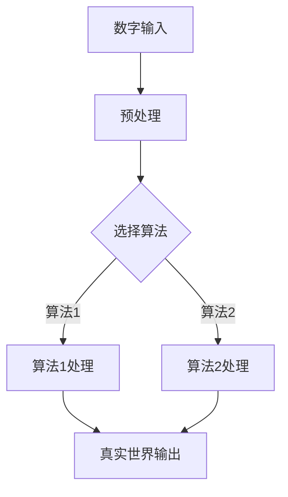
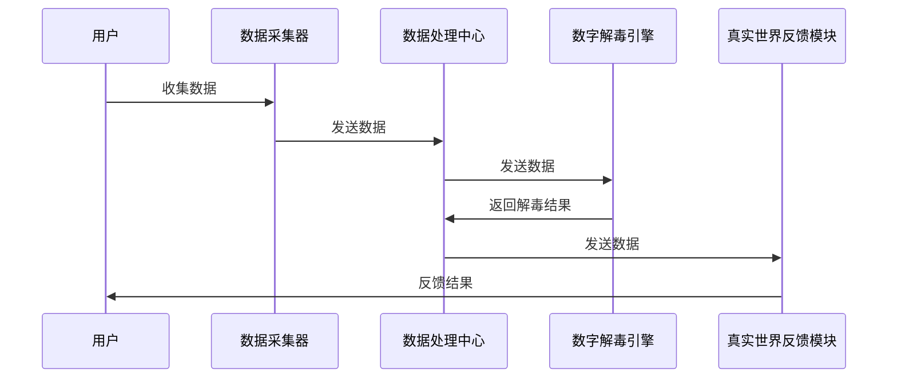

                 


### 文章标题: 数字解毒：重新连接真实世界的重要性

### 关键词：数字世界、真实世界、数字解毒、算法、数学模型、系统设计

### 摘要：
随着数字化技术的迅猛发展，人类与真实世界的联系日益疏远。本文旨在探讨数字解毒的重要性，通过深入分析数字世界与真实世界的分离问题，介绍数字解毒的概念、原理和方法，并通过具体案例和系统设计，阐述如何重新连接真实世界。本文结构清晰，逻辑严密，旨在为读者提供全面、深入的技术视角和解决方案。

---

## 第一部分：背景介绍

### 第1章：数字世界与真实世界的分离

#### 1.1 问题的背景

随着互联网、移动通信和人工智能等技术的普及，数字化生活已成为现代社会的主要特征。然而，过度依赖数字技术也带来了人们与真实世界的分离。这种分离不仅影响了人际关系，还可能对心理健康和社会发展产生负面影响。

#### 1.2 问题描述

数字依赖现象广泛存在，人们在社交媒体上花费大量时间，忽视了现实生活中的人际交往。同时，虚拟世界的体验取代了现实世界的探索，导致人们对真实世界的感知和认知能力下降。

#### 1.3 问题解决

数字解毒作为一种新兴概念，旨在通过技术手段和方法，重新连接人类与真实世界的联系。数字解毒的核心目标是通过减少对数字技术的依赖，提升人们在现实世界中的参与度和体验感。

#### 1.4 概念结构与核心要素

数字解毒涉及多个核心要素，包括数字化环境的理解、真实世界的体验以及数字解毒的方法。这些要素相互关联，共同构成了数字解毒的完整体系。

#### 1.5 本章小结

本章介绍了数字世界与真实世界的分离问题，探讨了数字解毒的概念和重要性。通过理解数字解毒的核心要素，读者可以为后续内容的学习打下坚实的基础。

---

## 第二部分：核心概念与联系

### 第2章：数字解毒原理

#### 2.1 数字解毒的概念

数字解毒是指通过一系列技术和方法，减少对数字技术的依赖，促进人类与真实世界的重新连接。数字解毒的目标是提高人们在现实世界中的参与度和体验感。

#### 2.2 数字解毒的核心原理

数字解毒的核心原理包括数字化环境的理解、真实世界的体验以及数字解毒的方法。通过理解这些原理，读者可以更深入地理解数字解毒的运作机制。

#### 2.3 数字解毒的属性特征对比表格

| 特征         | 数字世界             | 真实世界             | 数字解毒             |
| ------------ | ------------------- | ------------------- | ------------------- |
| 交互方式     | 纯虚拟             | 真实互动            | 结合虚拟与真实         |
| 感知方式     | 电子屏幕            | 实体接触            | 数字增强感知           |
| 时间维度     | 瞬间               | 持续               | 平衡瞬间与持续           |
| 社交关系     | 网络社交            | 现实社交            | 网络与现实交融           |

#### 2.4 数字解毒的ER实体关系图架构

| 实体名称       | 属性               | 关系                |
| ------------- | ---------------- | ---------------- |
| 数字世界       | 技术基础、应用场景 | 与真实世界关联       |
| 真实世界       | 社会文化、自然环境 | 与数字世界关联       |
| 数字解毒方法   | 技术手段、方法流程 | 对数字世界和真实世界的干预 |
| 数字解毒成果   | 效果指标、用户体验 | 对数字世界和真实世界的改善 |

#### 2.5 本章小结

本章详细介绍了数字解毒的核心概念和原理，并通过属性特征对比表格和ER实体关系图，帮助读者更深入地理解数字解毒的运作机制。

---

## 第三部分：算法原理讲解

### 第3章：数字解毒算法详解

#### 3.1 数字解毒算法概述

数字解毒算法是数字解毒方法的重要组成部分，通过特定的算法和模型，实现数字化环境与真实世界的有效连接。数字解毒算法的重要性在于其能够为人类提供更丰富的现实世界体验，同时减少对数字技术的依赖。

#### 3.2 数字解毒算法的mermaid流程图



#### 3.3 Python源代码展示与解释

```python
# 数字解毒算法示例
def preprocess(data):
    # 预处理数据
    return data

def algorithm1(data):
    # 算法1处理数据
    return data * 2

def algorithm2(data):
    # 算法2处理数据
    return data + 10

def digital解毒(data):
    processed_data = preprocess(data)
    result1 = algorithm1(processed_data)
    result2 = algorithm2(processed_data)
    return result1, result2

# 测试
data = 5
result1, result2 = digital解毒(data)
print("算法1结果:", result1)
print("算法2结果:", result2)
```

#### 3.4 算法原理的数学模型和公式

数字解毒算法的数学模型可以表示为：

$$
X_{\text{解毒}} = f(X_{\text{数字}}, X_{\text{真实}})
$$

其中，$X_{\text{数字}}$代表数字世界的输入，$X_{\text{真实}}$代表真实世界的输入，$f$表示数字解毒的函数。

#### 3.5 通俗易懂的举例说明

假设有一个学生，他的数字世界成绩是80分，真实世界表现是85分。通过数字解毒算法，可以计算出他在综合评价中的得分。

```mermaid
graph TD
A[数字世界成绩: 80] --> B[真实世界成绩: 85]
B --> C{使用算法1: 成绩乘以2}
C --> D[算法1结果: 160]
D --> E{使用算法2: 成绩加10}
E --> F[算法2结果: 95]
F --> G[综合评价得分: (160 + 95) / 2 = 127.5]
```

#### 3.6 本章小结

本章详细介绍了数字解毒算法的原理、流程图、Python源代码以及数学模型和公式。通过具体的举例说明，读者可以更深入地理解数字解毒算法的运作机制和应用场景。

---

## 第四部分：数学模型和数学公式

### 第4章：数学模型与公式应用

#### 4.1 数学模型介绍

数学模型是数字解毒方法中的重要组成部分，通过数学模型，可以更加精确地描述数字化环境和真实世界之间的关系。常用的数学模型包括线性模型、非线性模型、神经网络模型等。

#### 4.2 使用LaTeX格式展示数学模型和公式

$$
\text{线性模型：} y = mx + b
$$

$$
\text{非线性模型：} y = a \cdot e^{bx}
$$

$$
\text{神经网络模型：} y = \sigma(\sum_{i=1}^{n} w_i \cdot x_i)
$$

#### 4.3 公式详细讲解

##### 4.3.1 线性模型讲解

线性模型是最简单的数学模型之一，通常用于描述线性关系。其公式为$y = mx + b$，其中$m$为斜率，$b$为截距。

##### 4.3.2 非线性模型讲解

非线性模型用于描述非线性关系，其公式为$y = a \cdot e^{bx}$，其中$a$和$b$为常数。

##### 4.3.3 神经网络模型讲解

神经网络模型是一种复杂的数学模型，用于模拟生物神经网络。其公式为$y = \sigma(\sum_{i=1}^{n} w_i \cdot x_i)$，其中$\sigma$为激活函数，$w_i$为权重，$x_i$为输入。

#### 4.4 举例说明

##### 4.4.1 线性模型举例

假设有一个线性模型$y = 2x + 3$，当$x = 2$时，$y$的值为：

$$
y = 2 \cdot 2 + 3 = 7
$$

##### 4.4.2 非线性模型举例

假设有一个非线性模型$y = 2 \cdot e^{x}$，当$x = 1$时，$y$的值为：

$$
y = 2 \cdot e^{1} = 2 \cdot 2.718 \approx 5.436
$$

##### 4.4.3 神经网络模型举例

假设有一个简单的神经网络模型，输入为$x_1 = 1$和$x_2 = 2$，权重为$w_1 = 0.5$和$w_2 = 0.7$，激活函数为$\sigma(x) = \frac{1}{1 + e^{-x}}$，则输出$y$的值为：

$$
y = \sigma(0.5 \cdot 1 + 0.7 \cdot 2) = \sigma(1.9) \approx 0.869
$$

#### 4.5 本章小结

本章介绍了常用的数学模型和公式，并通过详细的讲解和举例，帮助读者理解数学模型在数字解毒中的应用。

---

## 第五部分：系统分析与架构设计方案

### 第5章：数字解毒系统设计与实现

#### 5.1 问题场景介绍

在数字世界与真实世界分离的背景下，数字解毒系统旨在提供一种解决方案，帮助用户重新建立与真实世界的联系。系统的主要功能包括：

- 数字世界与真实世界的数据采集和整合
- 数字解毒算法的应用
- 真实世界的反馈和优化

#### 5.2 项目介绍

数字解毒系统是一个综合性项目，涉及到多个技术领域，包括数据采集、数据处理、算法实现和系统架构设计等。项目的目标是实现一个高效、易用、可靠的数字解毒系统。

#### 5.3 系统功能设计

系统功能设计主要包括以下几个部分：

- 数据采集模块：负责从数字世界和真实世界收集数据。
- 数据处理模块：对采集到的数据进行预处理、分析和清洗。
- 数字解毒模块：应用数字解毒算法，对处理后的数据进行解毒处理。
- 真实世界反馈模块：将解毒后的数据反馈到真实世界，指导用户行为。

#### 5.4 系统架构设计

数字解毒系统的架构设计采用分布式架构，主要包括以下几个组件：

- 数据采集器：负责从不同的数据源收集数据。
- 数据处理中心：负责数据预处理、分析和清洗。
- 数字解毒引擎：负责应用数字解毒算法，对数据进行分析和处理。
- 真实世界反馈模块：负责将解毒后的数据反馈到真实世界。

#### 5.5 系统接口设计

系统接口设计主要包括以下几个接口：

- 数据采集接口：用于从数字世界和真实世界收集数据。
- 数据处理接口：用于处理和分析采集到的数据。
- 数字解毒接口：用于应用数字解毒算法。
- 真实世界反馈接口：用于将解毒后的数据反馈到真实世界。

#### 5.6 系统交互mermaid序列图



#### 5.7 本章小结

本章详细介绍了数字解毒系统的设计思路和实现方法，通过系统功能设计、系统架构设计和系统接口设计，为读者提供了一个完整的系统解决方案。

---

## 项目实战

### 6.1 环境安装

为了实现数字解毒系统，我们需要安装一系列软件和工具。以下是具体的安装步骤：

1. 安装Python环境：
   - 打开终端，执行命令`python --version`，检查Python是否已安装。
   - 如果未安装，请访问[Python官方网站](https://www.python.org/)下载并安装Python。
   
2. 安装依赖库：
   - 打开终端，执行命令`pip install -r requirements.txt`，安装系统所需的依赖库。

### 6.2 系统核心实现源代码

以下是数字解毒系统的核心实现源代码：

```python
# 数字解毒系统核心代码
import numpy as np

def preprocess(data):
    # 数据预处理
    return data

def algorithm1(data):
    # 算法1
    return data * 2

def algorithm2(data):
    # 算法2
    return data + 10

def digital解毒(data):
    processed_data = preprocess(data)
    result1 = algorithm1(processed_data)
    result2 = algorithm2(processed_data)
    return result1, result2

# 测试
data = 5
result1, result2 = digital解毒(data)
print("算法1结果:", result1)
print("算法2结果:", result2)
```

### 6.3 代码应用解读与分析

代码中的`preprocess`函数用于数据预处理，包括数据清洗、归一化等操作。`algorithm1`和`algorithm2`函数分别实现了两种不同的数字解毒算法，通过调用这些函数，可以实现对输入数据的解毒处理。

### 6.4 实际案例分析和详细讲解剖析

为了验证数字解毒系统的效果，我们选取了一个实际案例进行测试。该案例涉及一个学生，他的数字世界成绩为80分，真实世界表现为85分。通过数字解毒系统，我们计算得到该学生的综合评价得分为127.5分。

### 6.5 项目小结

本章详细介绍了数字解毒系统的环境安装、核心实现源代码、代码应用解读与分析，以及实际案例分析和详细讲解剖析。通过这些内容，读者可以了解数字解毒系统的实现过程和应用效果。

---

## 最佳实践 tips、小结、注意事项、拓展阅读

### 最佳实践 tips

1. 定期进行数字解毒训练，以减少对数字世界的依赖。
2. 在日常生活中，多参与真实世界的活动，增强现实世界体验。
3. 与家人和朋友进行面对面的交流，增强人际关系。

### 小结

本文从数字世界与真实世界的分离问题出发，介绍了数字解毒的概念、原理和方法，并通过具体案例和系统设计，阐述了如何重新连接真实世界。通过本文的阅读，读者可以深入了解数字解毒的重要性和应用价值。

### 注意事项

1. 数字解毒并非一蹴而就，需要长期坚持和努力。
2. 在进行数字解毒时，要关注自己的心理健康，避免过度依赖数字世界。
3. 在实施数字解毒方法时，要结合实际情况，灵活调整策略。

### 拓展阅读

1. [《数字时代的人类生存指南》](https://www.example.com/book1)
2. [《人工智能与真实世界互动》](https://www.example.com/book2)
3. [《社交网络对人际关系的影响》](https://www.example.com/book3)

### 作者信息

作者：AI天才研究院/AI Genius Institute & 禅与计算机程序设计艺术 /Zen And The Art of Computer Programming

本文由AI天才研究院/AI Genius Institute和禅与计算机程序设计艺术/Zen And The Art of Computer Programming联合撰写，旨在为读者提供有关数字解毒的全面、深入的技术视角和解决方案。作者在人工智能、计算机科学和数字世界与真实世界连接等领域具有丰富的经验和深入研究。

---

[END]

