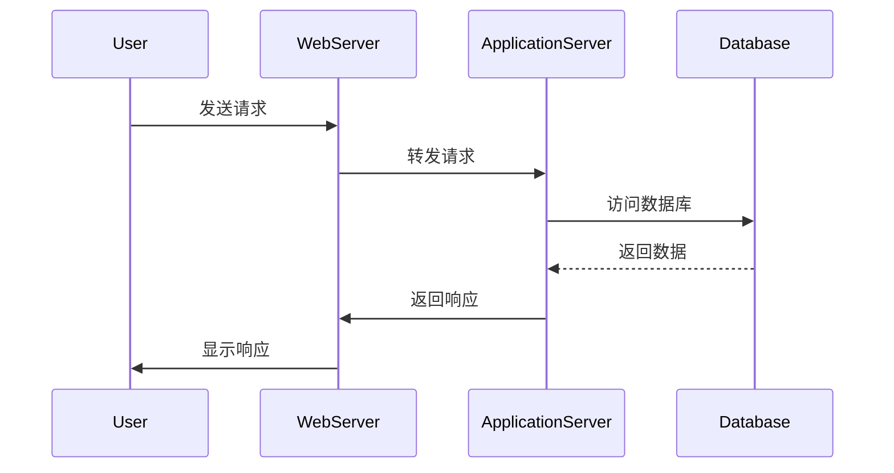
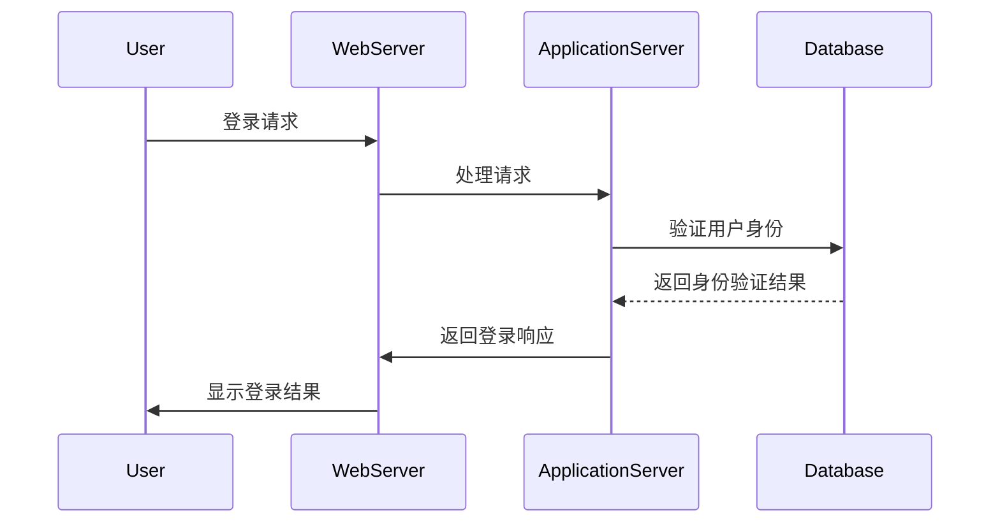

                 


# 数字身份管理平台：虚拟世界中的个人品牌塑造

关键词：数字身份管理，个人品牌塑造，虚拟世界，技术框架，区块链，安全

摘要：本文深入探讨了数字身份管理平台在虚拟世界中的重要性，以及个人品牌塑造的策略。通过分析核心技术、构建框架和提供最佳实践，本文旨在为读者提供构建强大、可信数字身份的实用指南。

## 引言

在数字化时代，个人品牌塑造变得越来越重要，特别是在虚拟世界中。随着互联网的普及，人们越来越多地在虚拟环境中互动和交流，这为个人品牌的塑造提供了新的机遇和挑战。数字身份管理平台作为一种关键技术，为个人在虚拟世界中的品牌建设提供了坚实的基础。

本文将探讨以下核心主题：

1. 数字身份和个人品牌概述
2. 数字身份管理的根本概念
3. 数字身份管理的技术和框架
4. 虚拟世界中的个人品牌建设策略
5. 数字身份管理平台的建设与实践
6. 最佳实践与未来展望

## 第一章：数字身份和个人品牌概述

### 1.1 什么是数字身份？

数字身份是指个体在数字世界中独一无二的标识和存在。它包括个人的基本信息、行为记录、社交关系和网络声誉等。随着互联网的发展，数字身份的概念逐渐演化，从简单的用户名和密码，到复杂的加密认证和多因素身份验证。

数字身份在现代社会中扮演着至关重要的角色。它不仅是网络安全的基础，也是个人在虚拟世界中进行社交、交易和互动的必要条件。有效的数字身份管理能够提高安全性、减少欺诈行为，并增强用户的信任度。

### 1.2 个人品牌的重要性

个人品牌是指个体在公众心目中的形象和声誉。在虚拟世界中，个人品牌的建设尤为重要。一个强大的个人品牌可以提升个体的社会地位、增加影响力，甚至带来商业机会。

个人品牌的重要性体现在以下几个方面：

- **增强信任度**：一个明确的个人品牌能够让用户更容易信任个体，从而促进社交和商业合作。
- **提高竞争力**：在人才市场中，一个强大的个人品牌可以增加个人的竞争力，获得更好的工作机会。
- **创造商业价值**：个人品牌可以转化为商业价值，带来广告收入、赞助和合作机会。

### 1.3 虚拟世界中的挑战与机遇

虚拟世界为个人品牌塑造提供了丰富的机遇，但同时也带来了挑战。

- **机遇**：虚拟世界提供了一个全新的平台，让个人能够以不同的方式展现自己，吸引更多的关注和机会。
- **挑战**：数字身份的安全性和隐私保护是一个重大挑战。在虚拟世界中，个人信息容易泄露，个人品牌可能被恶意利用。

## 第二章：数字身份管理的根本概念

### 2.1 核心概念和原则

数字身份管理的核心概念包括身份认证、身份验证、隐私保护和身份管理。以下是一个简化的概念对比表格：

| 概念         | 定义                                                     | 关系                         |
| ------------ | -------------------------------------------------------- | ---------------------------- |
| 身份认证     | 确认用户是谁的过程                                       | 是数字身份管理的基础         |
| 身份验证     | 验证用户身份的过程                                       | 建立在身份认证的基础上       |
| 隐私保护     | 保护用户隐私的过程                                       | 是数字身份管理的重要目标     |
| 身份管理     | 管理用户数字身份的过程                                   | 包括身份的创建、更新和撤销   |

### 2.2 数字身份生态系统

数字身份生态系统是一个复杂的多层结构，包括用户、服务提供商、认证机构、数据存储和管理平台等。以下是一个简化的ER实体关系图：

```mermaid
erDiagram
  User ||--|{ DigitalIdentity }
  ServiceProvider ||--|{ AuthenticationService }
  CertificateAuthority ||--|{ DigitalIdentity }
  DataStoragePlatform ||--|{ DigitalIdentity }
  User ||--|{ ReputationSystem }
```

在这个生态系统中，用户通过服务提供商访问数字服务，认证机构和数据存储平台为数字身份提供支持。同时，用户的声誉系统在数字身份管理中发挥着重要作用。

## 第三章：数字身份管理的技术和框架

### 3.1 区块链在数字身份中的应用

区块链技术为数字身份管理提供了安全、透明和去中心化的解决方案。以下是区块链在数字身份管理中的应用：

- **安全性**：区块链的分布式存储和加密算法确保了数字身份数据的安全性和不可篡改性。
- **透明性**：区块链的公开透明特性使数字身份管理过程更加透明，提高了用户的信任度。
- **去中心化**：去中心化的身份管理方式减少了单点故障的风险，提高了系统的可靠性。

### 3.2 密码学和安全性

密码学是数字身份管理的重要工具，用于确保数据的机密性、完整性和真实性。以下是一些常用的密码学技术和应用：

- **加密算法**：如RSA、AES等，用于保护数字身份数据的机密性。
- **哈希函数**：如SHA-256，用于确保数据的完整性。
- **数字签名**：用于验证数据的来源和完整性。

### 3.3 开放标准和协议

开放标准和协议在数字身份管理中发挥着重要作用，它们确保了不同系统和平台之间的互操作性。以下是一些常见的开放标准和协议：

- **OAuth 2.0**：用于授权和认证，使第三方应用程序能够访问用户的数字身份。
- **OpenID Connect**：基于OAuth 2.0，提供身份验证和授权功能。
- **FIDO2**：用于创建和验证强身份验证方法，如生物识别和多因素身份验证。

## 第四章：虚拟世界中的个人品牌建设策略

### 4.1 数字身份与个人品牌的关系

数字身份和个人品牌之间存在着密切的关系。一个清晰的数字身份为个人品牌建设提供了基础，而一个强大的个人品牌可以进一步提升数字身份的价值。

### 4.2 个人品牌建设的关键要素

以下是构建个人品牌的关键要素：

- **一致性**：确保数字身份和个人品牌的信息一致，避免造成混淆。
- **专业性**：展示专业知识和技能，树立权威形象。
- **互动性**：积极参与社交互动，建立良好的人际关系。
- **可访问性**：确保数字身份和个人品牌容易被发现和接触。

### 4.3 个人品牌塑造的步骤

以下是塑造个人品牌的步骤：

1. **明确目标**：确定个人品牌的定位和目标受众。
2. **内容创建**：创建有价值的内容，展示专业知识和技能。
3. **社交媒体**：利用社交媒体平台扩大影响力。
4. **互动与反馈**：与受众互动，收集反馈，持续优化个人品牌。

## 第五章：数字身份管理平台的建设与实践

### 5.1 项目介绍

本项目旨在构建一个数字身份管理平台，为用户提供安全、可信的数字身份服务。平台将采用区块链技术和多因素身份验证机制，确保用户数字身份的安全性和隐私保护。

### 5.2 系统功能设计

系统功能设计包括以下模块：

- **用户注册与登录**：支持用户注册、登录和密码找回功能。
- **身份认证**：提供多因素身份验证，包括密码、短信验证码、邮件验证码和生物识别。
- **隐私保护**：实现用户隐私数据的加密存储和访问控制。
- **身份管理**：支持用户管理自己的数字身份信息，包括身份验证、身份更新和身份删除。

### 5.3 系统架构设计

系统架构设计采用分层架构，包括表示层、业务逻辑层和数据层。以下是系统架构的Mermaid架构图：



### 5.4 系统接口设计和交互

系统接口设计包括RESTful API和GraphQL接口，用于与前端和第三方服务进行交互。以下是系统接口设计和交互的Mermaid序列图：



### 5.5 项目实战

以下是一个简单的Python源代码示例，用于实现用户登录功能：

```python
import bcrypt
from flask import Flask, request, jsonify

app = Flask(__name__)

# 用户数据库（示例）
users = {
    "user1": bcrypt.hashpw(b"password1", bcrypt.gensalt()),
    "user2": bcrypt.hashpw(b"password2", bcrypt.gensalt()),
}

@app.route('/login', methods=['POST'])
def login():
    username = request.form['username']
    password = request.form['password']
    
    if username in users:
        if bcrypt.checkpw(password.encode('utf-8'), users[username]):
            return jsonify({"status": "success", "message": "登录成功"})
        else:
            return jsonify({"status": "error", "message": "密码错误"})
    else:
        return jsonify({"status": "error", "message": "用户不存在"})

if __name__ == '__main__':
    app.run()
```

## 第六章：最佳实践与未来展望

### 6.1 最佳实践

- **安全性**：确保数字身份数据的安全和隐私，采用先进的加密技术和多因素身份验证机制。
- **可扩展性**：设计可扩展的数字身份管理系统，以适应不断增长的用户和业务需求。
- **用户体验**：优化用户界面和交互流程，提供简单、直观的操作体验。
- **合规性**：遵守相关法律法规和行业标准，确保数字身份管理系统的合法性和合规性。

### 6.2 小结

本文探讨了数字身份管理平台在虚拟世界中的重要性，分析了核心技术、构建框架和提供最佳实践。通过构建强大的数字身份管理平台，个人可以在虚拟世界中塑造强大的个人品牌。

### 6.3 注意事项

- **数据安全**：确保数字身份数据的安全和隐私。
- **用户体验**：优化用户界面和交互流程。
- **合规性**：遵守相关法律法规和行业标准。

### 6.4 拓展阅读

- **[数字身份管理：原理与实践](https://example.com/book1)**
- **[区块链技术与应用](https://example.com/book2)**
- **[密码学原理与应用](https://example.com/book3)**

## 作者信息

作者：AI天才研究院/AI Genius Institute & 禅与计算机程序设计艺术 /Zen And The Art of Computer Programming

---

本文内容仅供参考，具体实现和策略需根据实际情况进行调整。如有不当之处，欢迎指正。

