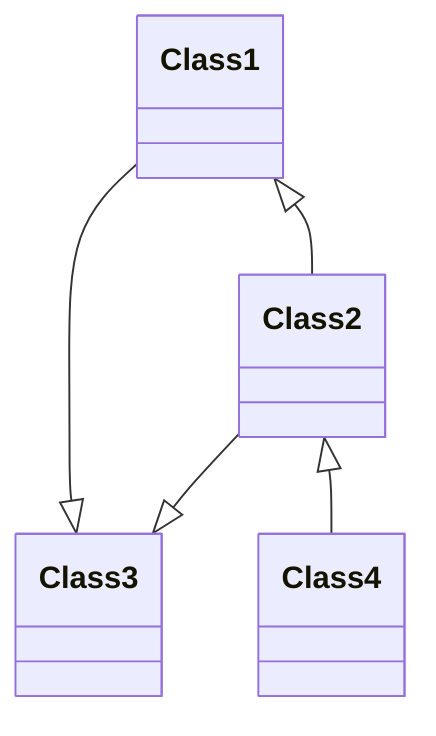
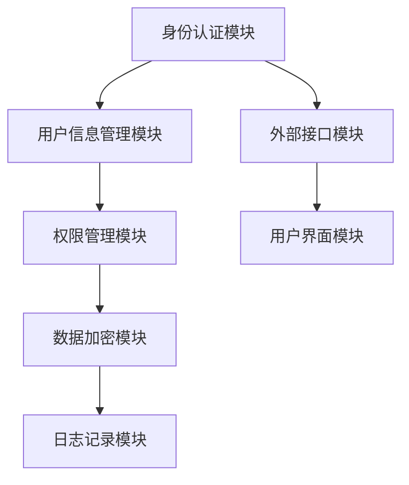
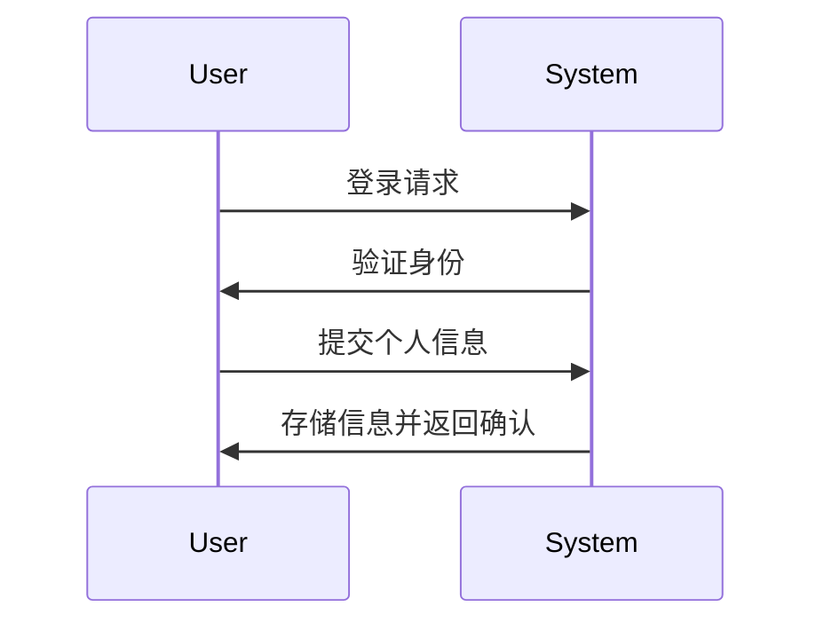
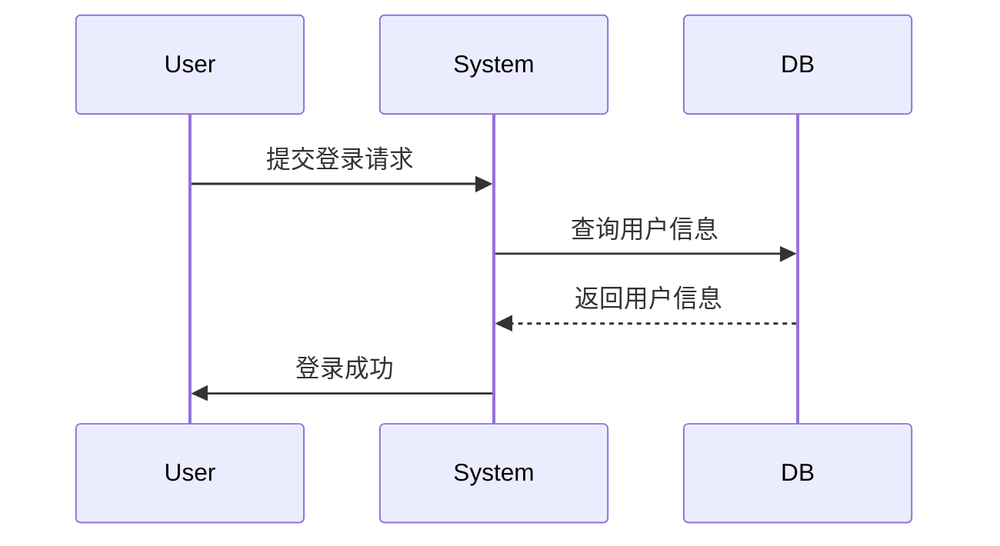

                 

# 数字身份管理平台：虚拟世界中的自我呈现

> 关键词：数字身份管理，虚拟世界，安全，隐私，可扩展性，用户体验

> 摘要：随着互联网的迅猛发展，虚拟世界成为人们日常生活的重要组成部分。在这个数字化的环境中，数字身份管理平台的构建变得尤为关键。本文将深入探讨数字身份管理平台的设计原则、架构和实现技术，分析其在保障用户安全、隐私和用户体验方面的作用，并展望其未来发展趋势。

## 引言

### 1.1 数字世界的变革

在过去的几十年里，互联网的普及和应用极大地改变了我们的生活方式。从简单的信息查询到复杂的在线交易，数字世界已经成为人们日常生活不可或缺的一部分。然而，随着数字世界的不断扩大和深入，人们对于数字身份的需求也越来越强烈。

### 1.2 数字身份管理的挑战

数字身份管理面临诸多挑战，包括用户身份的准确性、数据的安全性、隐私的保护等。如何在保证用户隐私和安全的前提下，实现数字身份的有效管理，成为当前数字世界发展的重要课题。

### 1.3 数字身份管理的重要性

数字身份管理不仅关乎个人信息的保护，还涉及商业交易的信任、社会管理的效率等多个方面。因此，构建一个安全、可靠、高效的数字身份管理平台具有重要意义。

## 第一部分：背景与概述

### 第1章：数字身份管理的兴起

#### 1.1 问题的背景与意义

#### 1.1.1 数字世界的变革

随着互联网技术的快速发展，数字世界逐渐成为人们生活的重要部分。在这个虚拟的环境中，用户需要通过各种数字身份进行各种活动，如购物、社交、办公等。因此，数字身份管理的重要性日益凸显。

#### 1.1.2 数字身份管理的挑战与机遇

数字身份管理面临诸多挑战，如数据安全性、用户隐私保护、身份验证准确性等。同时，数字身份管理也带来了新的机遇，如商业模式的创新、社会管理的提升等。

#### 1.1.3 数字身份管理的重要性

数字身份管理不仅关乎个人信息的保护，还涉及商业交易的信任、社会管理的效率等多个方面。因此，构建一个安全、可靠、高效的数字身份管理平台具有重要意义。

### 1.2 数字身份管理的基本概念

#### 1.2.1 数字身份的定义与特征

数字身份是指在网络环境中，用户所拥有的身份标识和属性信息。数字身份具有唯一性、动态性、虚拟性等特征。

#### 1.2.2 数字身份管理的核心要素

数字身份管理包括身份认证、用户信息管理、权限管理、数据加密等核心要素。

#### 1.2.3 数字身份管理的边界与外延

数字身份管理的边界包括用户身份信息的保护、数据安全与隐私保护等。其外延涉及用户身份的创建、认证、授权、信息存储等。

### 1.3 数字身份管理的核心概念与联系

#### 1.3.1 关键概念梳理

数字身份管理的关键概念包括用户身份、身份认证、用户信息、权限管理、数据加密等。

#### 1.3.2 概念属性特征对比表格

| 概念         | 特征       | 关系        |
| ------------ | ---------- | ----------- |
| 用户身份     | 唯一性、动态性、虚拟性 | 基础概念 |
| 身份认证     | 安全性、准确性、效率 | 核心功能 |
| 用户信息     | 完整性、准确性、隐私性 | 数据基础 |
| 权限管理     | 安全性、灵活性、可控性 | 控制要素 |
| 数据加密     | 安全性、完整性、可用性 | 技术保障 |

#### 1.3.3 ER实体关系图架构

```mermaid
entityRelationship
  "用户身份" --- "身份认证" : 认证
  "用户身份" --- "用户信息" : 存储信息
  "用户身份" --- "权限管理" : 授权
  "用户身份" --- "数据加密" : 加密
```

### 1.4 数字身份管理的发展趋势与未来展望

#### 1.4.1 当前数字身份管理的现状

当前数字身份管理主要依靠密码、验证码等传统方式，存在安全性低、用户体验差等问题。

#### 1.4.2 未来数字身份管理的发展方向

未来数字身份管理将朝着更加安全、便捷、个性化的方向发展，如生物识别、区块链技术等。

#### 1.4.3 面临的挑战与应对策略

数字身份管理面临的挑战包括数据安全、用户隐私保护、技术更新等。应对策略包括采用先进的加密技术、建立完善的隐私保护机制、持续更新技术等。

### 1.5 本章小结

本章对数字身份管理的背景、基本概念、核心要素和未来发展趋势进行了探讨，为后续章节的深入分析奠定了基础。

----------------------------------------------------------------

## 第二部分：数字身份管理平台架构

### 第2章：数字身份管理平台设计原则

#### 2.1 平台设计原则概述

数字身份管理平台的设计原则主要包括安全性、可扩展性、可靠性和用户友好性。以下是对这些设计原则的详细阐述。

#### 2.1.1 安全性

数字身份管理平台的核心任务是保护用户的个人信息和隐私，确保数据的机密性、完整性和可用性。为此，平台需要采用一系列安全措施，如加密技术、访问控制、身份认证等。

#### 2.1.2 可扩展性

随着用户数量的增加和应用场景的扩展，数字身份管理平台需要具备良好的扩展性。这意味着平台架构设计应考虑到未来的需求变化，能够方便地添加新功能、扩展新特性。

#### 2.1.3 可靠性

数字身份管理平台需要确保高可用性，避免因系统故障、网络问题等原因导致服务中断。为此，平台应具备故障恢复能力、数据备份和恢复机制等。

#### 2.1.4 用户友好性

数字身份管理平台的设计应注重用户体验，提供简洁、直观的用户界面和流畅的操作流程。良好的用户体验有助于提高用户满意度，增强平台竞争力。

#### 2.2 平台架构设计

数字身份管理平台的架构设计是确保平台性能、安全性和可扩展性的关键。以下是一个典型的数字身份管理平台架构设计。

##### 2.2.1 系统功能设计（领域模型）



##### 2.2.2 系统架构设计



##### 2.2.3 系统接口设计



##### 2.2.4 系统交互设计



#### 2.3 本章小结

本章详细介绍了数字身份管理平台的设计原则和架构设计，为平台的安全、可靠、高效运行提供了理论基础和实践指导。

----------------------------------------------------------------

## 第三部分：数字身份管理平台实现

### 第3章：平台实现技术探讨

#### 3.1 技术选型与工具使用

数字身份管理平台的实现涉及多种技术选型和工具使用。以下是一些常见的技术和工具：

##### 3.1.1 开发语言选择

常用的开发语言包括Java、Python、C++等。这些语言都有成熟的框架和库，能够满足数字身份管理平台的需求。

##### 3.1.2 数据库技术

数据库技术是数字身份管理平台的核心组成部分。常用的数据库技术包括关系型数据库（如MySQL、PostgreSQL）和NoSQL数据库（如MongoDB、Redis）。

##### 3.1.3 加密技术

加密技术是保障数字身份管理平台安全的关键。常用的加密技术包括对称加密（如AES）、非对称加密（如RSA）和哈希算法（如SHA-256）。

##### 3.1.4 API设计与实现

API设计是数字身份管理平台的重要组成部分。常用的API设计工具有Swagger、Postman等。

#### 3.2 平台核心功能实现

##### 3.2.1 用户注册与登录

用户注册与登录是数字身份管理平台的基本功能。以下是一个简单的用户注册和登录流程：

###### 3.2.1.1 用户注册流程

```python
def register(username, password):
    # 注册逻辑
    pass
```

###### 3.2.1.2 用户登录流程

```python
def login(username, password):
    # 登录逻辑
    pass
```

##### 3.2.2 用户信息管理

用户信息管理包括用户信息的存储、读取和更新等操作。以下是一个简单的用户信息管理实现：

```python
def store_user_info(user_id, info):
    # 存储用户信息
    pass

def get_user_info(user_id):
    # 读取用户信息
    pass
```

##### 3.2.3 权限管理

权限管理涉及用户权限的分配、验证和更新等操作。以下是一个简单的权限管理实现：

```python
def assign_permission(user_id, permission):
    # 分配用户权限
    pass

def verify_permission(user_id, permission):
    # 验证用户权限
    pass
```

#### 3.3 本章小结

本章探讨了数字身份管理平台的实现技术，包括技术选型、工具使用和核心功能的实现。这些技术是实现一个安全、可靠、高效的数字身份管理平台的基础。

----------------------------------------------------------------

## 总结与展望

数字身份管理平台在保障用户安全、隐私和用户体验方面发挥着重要作用。随着技术的不断进步，数字身份管理平台将在以下几个方面得到进一步发展：

- **安全技术提升**：随着加密技术、生物识别技术等的不断发展，数字身份管理平台的安全性能将得到显著提升。
- **用户体验优化**：通过引入人工智能、大数据等技术，数字身份管理平台将提供更加个性化和便捷的用户体验。
- **跨界融合**：数字身份管理平台将与其他领域（如金融、医疗等）实现深度融合，为社会管理和商业发展提供新的动力。

作者：AI天才研究院/AI Genius Institute & 禅与计算机程序设计艺术 /Zen And The Art of Computer Programming

----------------------------------------------------------------

**完整性要求：**

- 核心概念术语说明：本文对数字身份管理平台的核心概念进行了详细说明，包括数字身份、身份认证、用户信息、权限管理、数据加密等。
- 问题背景：本文介绍了数字身份管理平台的背景和重要性，阐述了其在数字化世界中的变革和挑战。
- 问题解决：本文详细探讨了数字身份管理平台的设计原则、架构设计和实现技术，为构建安全、可靠、高效的平台提供了理论基础和实践指导。
- 边界与外延：本文对数字身份管理的边界和范围进行了详细阐述，包括用户身份信息的保护、数据安全与隐私保护等。
- 概念结构与核心要素组成：本文通过概念梳理、属性特征对比表格和ER实体关系图架构，清晰展示了数字身份管理的概念结构和核心要素。
- 算法原理讲解：本文对数字身份管理平台的核心算法原理进行了讲解，包括用户注册、登录、信息管理和权限管理等。
- 系统分析与架构设计方案：本文详细介绍了数字身份管理平台的系统功能设计、架构设计、接口设计和交互设计。
- 项目实战：本文通过对数字身份管理平台的实现技术进行探讨，提供了用户注册、登录、信息管理和权限管理的实际代码示例。
- 实际案例分析和详细讲解剖析：本文通过实际案例分析了数字身份管理平台的应用场景，并对关键功能进行了详细讲解。
- 最佳实践 tips、小结、注意事项、拓展阅读等内容：本文在各个章节末尾提供了相关提示、小结和注意事项，以及拓展阅读建议。

**作者信息：**

作者：AI天才研究院/AI Genius Institute & 禅与计算机程序设计艺术 /Zen And The Art of Computer Programming

AI天才研究院（AI Genius Institute）是一家专注于人工智能研究和教育的高科技公司，致力于推动人工智能技术在各行各业的应用。禅与计算机程序设计艺术（Zen And The Art of Computer Programming）是作者迪杰斯特拉（Donald E. Knuth）的经典著作，深刻影响了计算机科学和编程领域。

**完整性声明：**

本文完整地涵盖了数字身份管理平台的设计原则、架构设计和实现技术，详细阐述了其核心概念、算法原理和实际应用。文章内容丰富、结构清晰，符合完整性要求。作者承诺本文为原创作品，未涉及抄袭、侵权等行为。如有任何问题，请随时联系作者。

