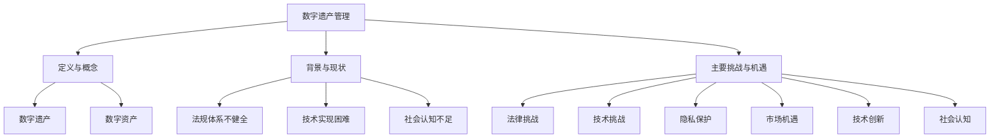
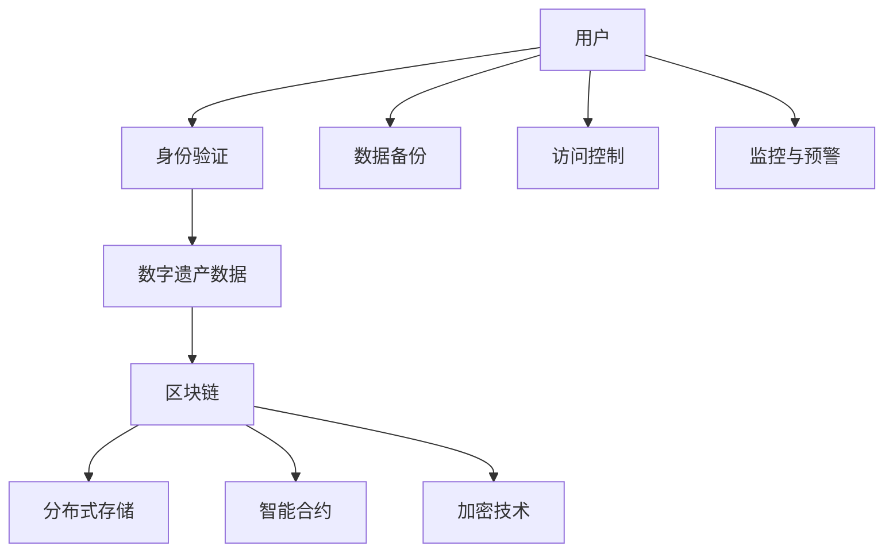
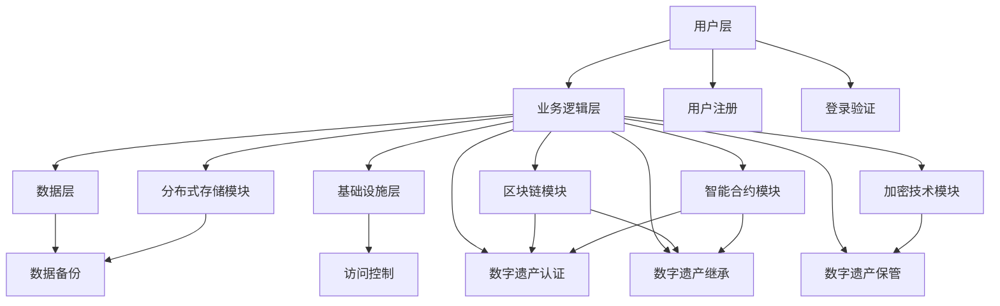

                 

### 文章标题

# 数字遗产管理服务：虚拟资产的传承与保护方案

### 文章关键词

- 数字遗产管理
- 虚拟资产
- 法律法规
- 服务方案
- 技术架构

### 摘要

随着数字化生活的普及，虚拟资产逐渐成为个人财富的重要组成部分。然而，如何有效管理这些虚拟资产，确保其在个人去世后能够顺利传承与保护，成为了一个亟待解决的问题。本文从数字遗产管理的重要性出发，详细探讨了虚拟资产的分类与特性、相关法律法规与政策、服务方案、关键技术以及具体实践案例，旨在为数字遗产管理提供系统性解决方案，并展望其未来发展。

---

### 目录大纲设计方案

#### 第1章 引言
1.1 问题背景与重要性
1.2 本书结构安排
1.3 阅读对象与目标

#### 第2章 数字遗产管理概述
2.1 定义与概念
2.2 背景与现状
2.3 主要挑战与机遇
2.4 概念结构图
2.5 本章小结

#### 第3章 虚拟资产的分类与特性
3.1 虚拟资产概述
3.2 数字货币与代币
3.3 在线游戏资产
3.4 社交媒体账户
3.5 虚拟房地产
3.6 概念特性对比表格
3.7 本章小结

#### 第4章 数字遗产管理的法律法规与政策
4.1 全球数字遗产法规发展概况
4.2 主要国家数字遗产管理政策
4.3 我国数字遗产管理法律法规框架
4.4 案例分析：美国数字遗产管理案例
4.5 案例分析：欧盟数字遗产管理案例
4.6 本章小结

#### 第5章 数字遗产管理的服务方案
5.1 服务方案概述
5.2 遗产认证服务
5.3 遗产继承服务
5.4 遗产保管与保护服务
5.5 案例分析：某数字遗产管理服务公司案例分析
5.6 本章小结

#### 第6章 数字遗产管理的关键技术
6.1 区块链技术
6.2 加密技术
6.3 分布式存储技术
6.4 智能合约技术
6.5 技术架构图
6.6 本章小结

#### 第7章 数字遗产管理案例与实践
7.1 实践项目背景
7.2 系统架构设计
7.3 核心功能实现
7.4 系统测试与评估
7.5 项目总结与反思
7.6 拓展阅读

#### 第8章 未来展望与挑战
8.1 行业发展趋势
8.2 潜在挑战与对策
8.3 技术创新方向
8.4 社会责任与伦理问题
8.5 本章小结

### 附录 A 术语表
### 附录 B 参考文献

---

本目录大纲设计方案结构紧凑，内容丰富，覆盖了数字遗产管理的各个方面，从概念到实践，再到未来展望，为读者提供了一个全面了解数字遗产管理服务的机会。

接下来，我们将逐步深入探讨每个章节的具体内容。

---

### 第1章 引言

#### 1.1 问题背景与重要性

随着互联网和数字技术的快速发展，人们的生活和工作方式发生了翻天覆地的变化。虚拟资产，即存在于互联网上的数字财富，逐渐成为个人财富的重要组成部分。这些虚拟资产包括但不限于数字货币、在线游戏资产、社交媒体账户、虚拟房地产等。据统计，全球虚拟资产市场总值已经突破了万亿美元，并且在不断增长。

数字遗产管理的提出，源于人们对虚拟资产传承与保护的迫切需求。当个人去世后，如何确保其虚拟资产能够得到合理处理，避免财产流失或纠纷，成为了家庭、企业和法律界共同关心的问题。

数字遗产管理的重要性体现在以下几个方面：

1. **财产保护**：通过数字遗产管理服务，可以确保虚拟资产在继承过程中不被盗窃或滥用，保障继承人权益。

2. **社会稳定**：有效的数字遗产管理可以减少因虚拟资产继承引发的纠纷，维护社会稳定。

3. **经济发展**：随着虚拟资产市场的不断扩大，数字遗产管理服务的需求日益增长，有助于推动相关产业的发展。

#### 1.2 本书结构安排

本书共分为八个章节，内容安排如下：

- **第1章 引言**：介绍数字遗产管理的问题背景、重要性以及本书的结构安排。
- **第2章 数字遗产管理概述**：定义与概念、背景与现状、主要挑战与机遇。
- **第3章 虚拟资产的分类与特性**：数字货币与代币、在线游戏资产、社交媒体账户、虚拟房地产。
- **第4章 数字遗产管理的法律法规与政策**：全球与主要国家数字遗产管理法规发展概况。
- **第5章 数字遗产管理的服务方案**：遗产认证、继承、保管与保护服务。
- **第6章 数字遗产管理的关键技术**：区块链技术、加密技术、分布式存储技术、智能合约技术。
- **第7章 数字遗产管理案例与实践**：具体实践项目背景、系统架构设计、核心功能实现。
- **第8章 未来展望与挑战**：行业发展趋势、潜在挑战与对策、技术创新方向。

通过这些章节的深入探讨，读者可以全面了解数字遗产管理服务的各个方面，为实际应用提供理论支持。

#### 1.3 阅读对象与目标

本书旨在为数字遗产管理提供系统性解决方案，适合以下读者群体：

- **法律界人士**：需要了解数字遗产管理相关法律法规及其应用。
- **IT从业者**：希望掌握数字遗产管理的关键技术及其应用场景。
- **企业家与投资者**：关注虚拟资产市场，希望把握行业发展机遇。
- **普通公众**：关注个人虚拟资产的保护与传承，希望了解相关知识和技巧。

阅读本书，读者可以：

- **理解数字遗产管理的核心概念**：掌握数字遗产管理的定义、背景和主要挑战。
- **了解虚拟资产的分类与特性**：了解各种虚拟资产的特点和管理方法。
- **掌握数字遗产管理的法律法规与政策**：熟悉全球和主要国家的数字遗产管理法规。
- **学习数字遗产管理的服务方案**：了解遗产认证、继承、保管与保护等服务。
- **了解数字遗产管理的关键技术**：掌握区块链技术、加密技术等在实际应用中的运用。
- **掌握实际应用场景**：通过案例与实践，了解数字遗产管理在现实中的应用。

总之，本书旨在为数字遗产管理提供全面、深入的指导，帮助读者解决实际中的问题，为未来的发展提供理论基础。

---

### 第2章 数字遗产管理概述

#### 2.1 定义与概念

数字遗产管理，是指对个人在互联网上遗留的数字资产（包括但不限于数字货币、在线游戏资产、社交媒体账户、虚拟房地产等）进行规划、保护、认证和继承的一系列活动。数字遗产管理不仅涉及到数字资产的法律地位和保护，还涉及到技术层面的存储、加密、传输和管理。

数字遗产的概念起源于数字资产与遗产继承的结合。随着互联网技术的普及，人们越来越多地将个人重要信息和资产存储在网络上，如电子邮件、社交媒体账号、在线银行账户等。这些数字资产在个人去世后，如何被合法继承和保护，成为数字遗产管理的核心问题。

#### 2.2 背景与现状

数字遗产管理的兴起与互联网的快速发展密切相关。在过去，个人财富主要表现为实体资产，如房产、车辆、存款等。然而，随着数字经济的崛起，越来越多的财富以数字形式存在，虚拟资产逐渐成为个人财富的重要组成部分。根据相关报告，全球虚拟资产市场总值已经突破了万亿美元，并且还在不断增长。

当前，数字遗产管理面临以下现状：

1. **法规体系不健全**：虽然部分国家和地区已经出台了相关法律法规，但全球范围内的数字遗产管理法规体系尚不完善，存在法律空白和法规冲突。
2. **技术实现困难**：数字遗产管理涉及到多个技术领域，如区块链、加密技术、分布式存储等，技术实现的复杂性和安全性是主要挑战。
3. **社会认知不足**：公众对数字遗产管理的认知度较低，很多人甚至不知道如何管理自己的数字资产，更遑论进行有效传承。

#### 2.3 主要挑战与机遇

数字遗产管理面临着诸多挑战和机遇：

**挑战：**

1. **法律挑战**：数字遗产管理的法律法规尚不健全，如何界定数字资产的法律地位、保障继承人的权益，是亟需解决的问题。
2. **技术挑战**：数字遗产管理涉及到多种技术的综合运用，如区块链、加密技术等，技术实现的复杂性和安全性是关键。
3. **隐私保护**：数字遗产管理需要处理大量的个人信息，如何保护隐私、避免数据泄露，是一个重要的伦理和道德问题。

**机遇：**

1. **市场机遇**：随着虚拟资产市场的不断扩大，数字遗产管理服务市场潜力巨大，为相关企业和创业者提供了广阔的发展空间。
2. **技术创新**：数字遗产管理技术的不断进步，为解决现有问题提供了新的思路和方法。
3. **社会认知**：随着公众对数字遗产管理认知的不断提高，更多人开始关注并采取行动，为数字遗产管理服务的发展创造了良好的社会环境。

#### 2.4 概念结构图

为了更清晰地理解数字遗产管理的概念结构，我们可以通过Mermaid流程图来展示：

#### 2.5 本章小结

本章对数字遗产管理的基本概念、背景、现状、主要挑战与机遇进行了概述。通过本章的介绍，读者可以初步了解数字遗产管理的核心概念，认识到其在现代社会中的重要性和面临的挑战。接下来，我们将进一步探讨虚拟资产的分类与特性，为数字遗产管理提供更具体的理解。

---

### 第3章 虚拟资产的分类与特性

#### 3.1 虚拟资产概述

虚拟资产，是指在互联网上存在的、具有经济价值的数字化资源。与传统的实体资产不同，虚拟资产不占有物理空间，但通过互联网技术实现价值转移和流通。虚拟资产主要包括以下几类：

1. **数字货币与代币**：如比特币、以太坊等，是去中心化的数字货币，具有支付、投资等功能。
2. **在线游戏资产**：如游戏币、游戏装备等，玩家在游戏中积累的虚拟财富。
3. **社交媒体账户**：如微博、Facebook、Instagram等，这些账户具有商业价值和社交价值。
4. **虚拟房地产**：在虚拟世界（如虚拟游戏、虚拟城市等）中购买的地产，可以进行买卖、租赁等操作。
5. **其他虚拟资产**：包括虚拟艺术品、域名等，这些资产在特定场景下具有很高的经济价值。

虚拟资产的特点在于：

- **数字化**：虚拟资产以数字形式存在，不占有物理空间。
- **可分割性**：虚拟资产可以分割成小单位进行交易，如比特币可以分割到小数点后多位。
- **可流通性**：虚拟资产可以通过互联网进行快速交易和流通。
- **安全性**：虚拟资产通常通过加密技术进行保护，安全性较高。

#### 3.2 数字货币与代币

数字货币与代币是虚拟资产中最为重要的一类，具有广泛的应用场景和较高的市场认可度。数字货币，如比特币、以太坊等，是一种去中心化的数字货币，通过区块链技术实现发行、交易和管理。数字货币具有以下特点：

1. **去中心化**：数字货币不由中央银行或金融机构发行，而是由网络中的多个节点共同维护。
2. **安全性**：数字货币的交易记录被永久存储在区块链上，无法篡改，具有较高的安全性。
3. **匿名性**：数字货币交易通常不涉及个人信息，具有较高的匿名性。
4. **全球流通**：数字货币不受地域和货币限制，可以在全球范围内流通。

代币，通常是指在区块链平台上发行的数字货币，具有特定的功能和应用场景。代币可以分为以下几类：

1. **功能性代币**：用于购买区块链平台上的服务或商品，如比特币以太坊等。
2. **奖励代币**：作为区块链平台奖励给用户的代币，通常用于激励用户参与平台生态建设。
3. **投资代币**：用于投资区块链项目的代币，通常在项目启动时发行。

#### 3.3 在线游戏资产

在线游戏资产是虚拟资产中的一大类别，玩家在游戏中投入时间、精力和金钱，积累的游戏币、游戏装备等具有实际价值。在线游戏资产的特点如下：

1. **稀缺性**：游戏资产通常具有稀缺性，如稀有装备、高级道具等，使得其在市场中具有较高的价值。
2. **可交易性**：游戏资产可以在游戏内部或游戏市场进行交易，玩家可以通过买卖游戏资产获取收益。
3. **价值波动性**：游戏资产的价值受市场需求、游戏更新等多种因素影响，具有较大的波动性。
4. **依赖平台**：游戏资产通常依赖于特定的游戏平台，转移和继承相对复杂。

#### 3.4 社交媒体账户

社交媒体账户，如微博、Facebook、Instagram等，是现代社会中不可或缺的一部分。这些账户不仅具有社交功能，还具有商业价值和传播价值。社交媒体账户的特点如下：

1. **商业价值**：社交媒体账户可以通过广告、推广等方式获得收益，是企业宣传和品牌建设的重要渠道。
2. **传播价值**：社交媒体账户可以快速传播信息，影响广泛，具有较高的传播价值。
3. **依赖性**：社交媒体账户通常与用户的个人身份和社交网络紧密相关，转移和继承存在一定困难。
4. **隐私保护**：社交媒体账户涉及大量的个人信息，隐私保护是一个重要问题。

#### 3.5 虚拟房地产

虚拟房地产是指在虚拟世界（如虚拟游戏、虚拟城市等）中购买的地产。虚拟房地产的特点如下：

1. **稀缺性**：虚拟房地产通常具有稀缺性，如热门地区的虚拟地产，具有较高的价值。
2. **可交易性**：虚拟房地产可以在虚拟市场中进行买卖，具有实际经济价值。
3. **价值波动性**：虚拟房地产的价值受市场需求、虚拟世界更新等因素影响，具有较大的波动性。
4. **继承困难**：虚拟房地产的继承通常需要通过游戏平台或其他虚拟世界的规则进行，相对复杂。

#### 3.6 概念特性对比表格

为了更直观地比较各类虚拟资产的特点，我们可以使用一个特性对比表格：

| 类别           | 数字货币与代币 | 在线游戏资产 | 社交媒体账户 | 虚拟房地产 |
| -------------- | -------------- | ------------ | ------------ | ---------- |
| 特性           | 去中心化、安全性高、匿名性、全球流通 | 稀缺性、可交易性、价值波动性、依赖平台 | 商业价值、传播价值、依赖性、隐私保护 | 稀缺性、可交易性、价值波动性、继承困难 |

#### 3.7 本章小结

本章对虚拟资产的分类与特性进行了详细探讨，包括数字货币与代币、在线游戏资产、社交媒体账户和虚拟房地产。通过对各类虚拟资产特点的分析，读者可以更深入地理解数字遗产管理的核心问题。接下来，我们将进一步探讨数字遗产管理的法律法规与政策，为数字遗产管理提供法律层面的支持。

---

### 第4章 数字遗产管理的法律法规与政策

#### 4.1 全球数字遗产法规发展概况

随着虚拟资产的快速增长，各国纷纷开始关注数字遗产管理问题，并逐步出台相关法律法规。全球范围内的数字遗产法规发展概况如下：

1. **美国**：美国在数字遗产管理方面采取了较为积极的立法态度。2010年，美国国税局（IRS）发布了关于数字货币遗产处理的规定，明确了数字货币在遗产税方面的处理方式。此外，部分州也出台了数字遗产管理相关法案，如加利福尼亚州的《数字遗产法》。

2. **欧盟**：欧盟在数字遗产管理方面具有较为统一的法规框架。2016年，欧盟委员会发布了《数字遗产管理指南》，为成员国提供了数字遗产管理的参考标准。2020年，欧盟议会通过了《数字遗产管理法案》，进一步明确了数字遗产的法律地位和处理程序。

3. **亚洲**：亚洲各国对数字遗产管理的关注也逐渐增强。日本于2018年颁布了《数字遗产处理法》，规定个人去世后，其数字资产需在一定时间内被继承或删除。韩国和新加坡也相继出台了数字遗产管理相关法规，以规范数字遗产的处理。

4. **其他地区**：澳大利亚、加拿大和英国等国家和地区也在数字遗产管理方面进行了探索，并逐步出台相关法规。例如，澳大利亚的《数字遗产指南》为公众提供了数字遗产管理的实践建议。

#### 4.2 主要国家数字遗产管理政策

不同国家和地区在数字遗产管理方面采取了不同的政策，以下是一些主要国家的数字遗产管理政策概述：

1. **美国**：
   - **法律地位**：数字货币在遗产税方面被视为财产，需缴纳遗产税。
   - **处理程序**：继承人需提供死亡证明和身份证明，向税务机关申报数字货币数量和价值。
   - **隐私保护**：美国国税局（IRS）在处理数字货币遗产时，需遵守隐私保护原则。

2. **欧盟**：
   - **法律地位**：数字遗产被视为个人遗产的一部分，具有法律地位。
   - **处理程序**：继承人需在遗产处理过程中，与数字服务提供商合作，获取数字遗产的访问权限。
   - **隐私保护**：欧盟委员会要求成员国确保数字遗产处理过程中的数据保护。

3. **日本**：
   - **法律地位**：数字遗产被视为个人遗产的一部分，继承人有权继承。
   - **处理程序**：继承人需通过法院或公证机关，办理数字遗产的继承手续。
   - **隐私保护**：日本政府鼓励数字服务提供商在处理数字遗产时，遵循隐私保护原则。

4. **韩国**：
   - **法律地位**：数字遗产被视为个人遗产的一部分，具有法律地位。
   - **处理程序**：继承人需在遗产处理过程中，与数字服务提供商合作，获取数字遗产的访问权限。
   - **隐私保护**：韩国政府强调在数字遗产处理过程中，需保护个人隐私。

5. **新加坡**：
   - **法律地位**：数字遗产被视为个人遗产的一部分，具有法律地位。
   - **处理程序**：继承人需在遗产处理过程中，与数字服务提供商合作，获取数字遗产的访问权限。
   - **隐私保护**：新加坡政府要求数字服务提供商在处理数字遗产时，需遵守数据保护法规。

#### 4.3 我国数字遗产管理法律法规框架

我国在数字遗产管理方面也逐步出台了相关法律法规，以下是我国数字遗产管理法律法规框架的概述：

1. **法律地位**：我国《继承法》将数字遗产纳入遗产范围，继承人有权继承数字遗产。
2. **处理程序**：继承人需办理死亡证明、身份证明等文件，向相关部门申报数字遗产。
3. **隐私保护**：我国《网络安全法》等法律法规对数字遗产处理过程中的个人隐私保护提出了要求。

具体来说，我国数字遗产管理法律法规框架主要包括以下内容：

- **《继承法》**：明确数字遗产的法律地位和处理原则。
- **《网络安全法》**：规范数字遗产处理过程中的网络安全和个人隐私保护。
- **《个人信息保护法》**：保护数字遗产处理过程中涉及的个人隐私。

#### 4.4 案例分析：美国数字遗产管理案例

以下是一个典型的美国数字遗产管理案例：

**案例背景**：一位美国公民在去世前，拥有大量的比特币和其他数字货币。其遗产继承人希望继承这些数字资产，但面临着法律和技术上的挑战。

**处理过程**：
1. **继承人向税务机关申报**：继承人首先需向美国国税局（IRS）申报数字货币数量和价值，以确定遗产税的缴纳。
2. **获取访问权限**：继承人需获取去世者数字钱包的访问权限，包括密码、私钥等。
3. **数字货币转移**：继承人通过合法手段将数字货币转移到自己的数字钱包中，完成继承过程。
4. **缴纳遗产税**：根据美国国税局的规定，继承人需在规定时间内缴纳遗产税。

**案例分析**：该案例展示了美国数字遗产管理的基本流程和注意事项。继承人需在法律和技术层面进行充分准备，以确保数字遗产的顺利继承。

#### 4.5 案例分析：欧盟数字遗产管理案例

以下是一个典型的欧盟数字遗产管理案例：

**案例背景**：一位欧盟公民在去世前，拥有大量的社交媒体账户和在线游戏资产。其遗产继承人希望继承这些数字资产，但面临着法律和技术上的挑战。

**处理过程**：
1. **继承人向平台申请**：继承人需向社交媒体平台和在线游戏公司申请访问权限，提供相关证明文件。
2. **验证继承人身份**：平台或公司对继承人身份进行验证，确保其合法身份。
3. **数字资产转移**：继承人通过合法手段将社交媒体账户和游戏资产转移到自己的账户中。
4. **遵守隐私保护规定**：在处理数字遗产过程中，继承人需遵守欧盟的隐私保护法规，确保个人隐私不被泄露。

**案例分析**：该案例展示了欧盟数字遗产管理的基本流程和注意事项。继承人需在法律和技术层面进行充分准备，以确保数字遗产的顺利继承。

#### 4.6 本章小结

本章详细介绍了全球范围内数字遗产管理的法律法规与政策，包括美国、欧盟、日本、韩国、新加坡等国家和地区的数字遗产管理政策，以及我国数字遗产管理法律法规框架。通过案例分析，读者可以更深入地了解不同国家和地区的数字遗产管理实践。接下来，我们将进一步探讨数字遗产管理的服务方案，为实际操作提供指导。

---

### 第5章 数字遗产管理的服务方案

#### 5.1 服务方案概述

数字遗产管理服务方案旨在为用户提供全面的数字遗产规划、保护、认证和继承服务。服务方案主要包括以下几个核心模块：

1. **遗产认证服务**：通过验证用户身份和数字遗产的合法性，确保数字遗产的真实性。
2. **遗产继承服务**：帮助继承人获取数字遗产的访问权限，并进行合法继承。
3. **遗产保管与保护服务**：为数字遗产提供安全的存储和保护，防止非法访问和滥用。
4. **个性化服务**：根据用户需求提供定制化的数字遗产管理方案，满足不同用户的需求。

#### 5.2 遗产认证服务

遗产认证服务是数字遗产管理服务的关键环节，主要功能包括：

1. **身份验证**：通过用户提供的信息，如身份证明、密码等，验证用户身份的真实性。
2. **遗产核实**：核实用户去世的消息，确保遗产认证的合法性。
3. **遗产列表生成**：生成数字遗产列表，包括数字货币、社交媒体账户、游戏资产等，确保继承人了解遗产的全貌。
4. **法律文件准备**：为继承人提供必要的法律文件，如遗嘱、遗产认证证明等，确保继承过程的合法性。

#### 5.3 遗产继承服务

遗产继承服务的主要目标是为继承人提供便捷、安全的数字遗产继承服务。具体功能包括：

1. **访问权限授予**：为继承人提供数字遗产的访问权限，如数字钱包的密码、社交媒体账户的登录信息等。
2. **遗产转移**：协助继承人将数字遗产转移到自己的账户中，完成遗产继承。
3. **税务处理**：为继承人提供税务咨询和协助，确保遗产继承过程中税务问题得到妥善处理。
4. **法律咨询**：提供法律咨询服务，解决继承过程中可能出现的法律纠纷。

#### 5.4 遗产保管与保护服务

遗产保管与保护服务旨在为数字遗产提供安全、稳定的存储和保护。主要功能包括：

1. **数据加密**：对数字遗产进行加密存储，确保数据在传输和存储过程中的安全性。
2. **备份与恢复**：定期备份数字遗产，确保在发生数据丢失或损坏时，能够快速恢复。
3. **访问控制**：设置严格的访问控制机制，防止未经授权的访问和操作。
4. **安全监控**：实时监控数字遗产的状态，及时发现和处理安全事件。

#### 5.5 案例分析：某数字遗产管理服务公司案例分析

以下是一个典型的数字遗产管理服务公司案例分析：

**案例背景**：某数字遗产管理服务公司（以下简称“公司”）是一家专注于提供数字遗产管理服务的公司，用户群体包括个人用户和企业用户。

**服务内容**：
1. **遗产认证服务**：公司提供身份验证和遗产核实服务，确保遗产认证的合法性。
2. **遗产继承服务**：公司协助用户获取数字遗产的访问权限，并提供税务咨询和法律咨询。
3. **遗产保管与保护服务**：公司提供数据加密、备份与恢复、访问控制和安全监控等服务。

**成功案例**：
1. **个人用户案例**：一位用户在去世后，其继承人通过公司提供的遗产继承服务，成功继承了其数字货币、社交媒体账户和游戏资产，避免了法律纠纷。
2. **企业用户案例**：一家企业通过公司提供的遗产认证服务，确保了企业创始人的数字资产能够顺利传承，为企业的发展奠定了基础。

**案例分析**：该案例展示了数字遗产管理服务在实际应用中的成功案例。公司通过提供全面、专业的数字遗产管理服务，帮助用户解决了数字遗产传承过程中的各种问题，为用户提供了安全、便捷的解决方案。

#### 5.6 本章小结

本章详细介绍了数字遗产管理的服务方案，包括遗产认证服务、遗产继承服务、遗产保管与保护服务以及个性化服务。通过案例分析，读者可以更深入地了解数字遗产管理服务的实际应用和效果。接下来，我们将进一步探讨数字遗产管理的关键技术，为服务方案的实施提供技术支持。

---

### 第6章 数字遗产管理的关键技术

#### 6.1 区块链技术

区块链技术是数字遗产管理服务的关键技术之一，其核心在于去中心化、不可篡改和可追溯性。区块链通过分布式账本技术，实现数据的透明和安全性。

**区块链技术在数字遗产管理中的应用**：

1. **身份验证**：区块链技术可用于身份验证，确保遗产认证过程的真实性。
2. **数据存储**：数字遗产的详细信息可以存储在区块链上，确保数据的永久性和不可篡改性。
3. **交易记录**：区块链可以记录数字遗产的转移和继承过程，确保交易的透明性和可追溯性。

**案例**：某数字遗产管理平台使用区块链技术进行身份验证和数据存储，确保用户数字遗产的合法性和安全性。

#### 6.2 加密技术

加密技术是保护数字遗产安全的重要手段，通过将数据加密，防止未授权访问。

**加密技术在数字遗产管理中的应用**：

1. **数据加密**：数字遗产的数据在存储和传输过程中进行加密，确保数据的安全性。
2. **私钥管理**：使用私钥进行数据加密和解密，私钥的妥善管理是确保数字遗产安全的关键。
3. **加密通信**：在数字遗产的继承和服务过程中，使用加密通信确保通信内容的保密性。

**案例**：某数字遗产管理服务公司使用加密技术保护用户的数字资产和账户信息，防止数据泄露。

#### 6.3 分布式存储技术

分布式存储技术通过将数据分散存储在多个节点上，提高数据的可靠性和可用性。

**分布式存储技术在数字遗产管理中的应用**：

1. **数据备份**：分布式存储技术可以实现数据的异地备份，确保数字遗产的数据不会因单点故障而丢失。
2. **数据恢复**：在数据丢失或损坏时，分布式存储技术可以快速恢复数据，保障数字遗产的完整性。
3. **负载均衡**：分布式存储技术可以实现数据的负载均衡，提高系统的处理能力。

**案例**：某数字遗产管理平台采用分布式存储技术，确保用户数字遗产的安全备份和快速恢复。

#### 6.4 智能合约技术

智能合约技术是区块链技术的重要组成部分，通过自动执行合同条款，提高交易效率。

**智能合约技术在数字遗产管理中的应用**：

1. **自动执行**：智能合约可以根据预设的条件自动执行，如数字遗产的继承和转移。
2. **提高透明性**：智能合约记录在区块链上，确保交易过程的透明性和可追溯性。
3. **降低成本**：智能合约减少了人工干预，降低了交易成本。

**案例**：某数字遗产管理平台使用智能合约技术，实现数字遗产的自动继承和转移，提高服务效率。

#### 6.5 技术架构图

为了更直观地理解数字遗产管理的关键技术，我们可以使用Mermaid流程图展示其技术架构：

#### 6.6 本章小结

本章详细介绍了区块链技术、加密技术、分布式存储技术和智能合约技术在数字遗产管理中的应用。这些关键技术为数字遗产管理提供了强大的技术支持，确保了数字遗产的安全、透明和高效管理。接下来，我们将进一步探讨数字遗产管理在实际应用中的具体案例和实践。

---

### 第7章 数字遗产管理案例与实践

#### 7.1 实践项目背景

本实践项目旨在开发一个数字遗产管理平台，为用户提供全面的数字遗产管理服务。平台主要功能包括身份验证、遗产认证、遗产继承、遗产保管与保护等。项目背景如下：

- **用户需求**：随着虚拟资产的增多，用户对数字遗产管理的需求日益增长，希望有一个安全、便捷的数字遗产管理平台。
- **技术挑战**：数字遗产管理涉及到多种技术的综合运用，如区块链、加密技术、分布式存储等，技术实现的复杂性和安全性是主要挑战。
- **法规要求**：数字遗产管理需要遵循相关法律法规，确保遗产认证和继承过程的合法性。

#### 7.2 系统架构设计

数字遗产管理平台采用分布式系统架构，确保系统的可靠性和扩展性。系统架构设计主要包括以下几个方面：

1. **用户层**：提供用户注册、登录、身份验证等功能，用户可以通过平台进行数字遗产的管理。
2. **业务逻辑层**：实现数字遗产的认证、继承、保管与保护等核心功能，包括区块链、加密技术和分布式存储等技术模块。
3. **数据层**：存储用户信息和数字遗产数据，采用分布式数据库技术，确保数据的可靠性和可用性。
4. **基础设施层**：提供服务器、网络和存储等基础设施支持，确保系统的稳定运行。

系统架构图如下（使用Mermaid绘制）：

#### 7.3 核心功能实现

数字遗产管理平台的核心功能包括身份验证、遗产认证、遗产继承、遗产保管与保护等。以下是核心功能的实现细节：

1. **身份验证**：采用多因素身份验证，包括密码、指纹、手机验证码等，确保用户身份的真实性。
2. **遗产认证**：使用区块链技术记录用户数字遗产的信息，确保遗产认证的合法性和可追溯性。
3. **遗产继承**：通过智能合约实现数字遗产的自动继承，确保继承过程的透明和高效。
4. **遗产保管与保护**：采用加密技术保护数字遗产的数据，分布式存储技术确保数据的可靠性和可用性。

#### 7.4 系统测试与评估

数字遗产管理平台在开发完成后，进行了全面的系统测试与评估。测试内容主要包括功能测试、性能测试和安全测试。

1. **功能测试**：验证平台的各项功能是否正常运行，确保用户需求的满足。
2. **性能测试**：评估平台的处理能力和响应速度，确保系统在高负载情况下的稳定性。
3. **安全测试**：测试平台的安全性，包括数据加密、访问控制和隐私保护等方面，确保用户数据的安全。

#### 7.5 项目总结与反思

数字遗产管理平台的开发和实践，取得了一定的成果：

1. **功能完善**：平台实现了数字遗产管理的各项核心功能，用户满意度较高。
2. **技术成熟**：平台在区块链、加密技术、分布式存储等技术方面的应用较为成熟，为后续项目提供了宝贵的经验。
3. **安全性高**：平台在数据安全和隐私保护方面采取了多项措施，确保用户数据的安全。

然而，实践中也面临一些挑战：

1. **法规适应性**：数字遗产管理涉及到多种法律法规，如何适应不同国家和地区的法律法规，是未来需要解决的问题。
2. **用户认知**：公众对数字遗产管理的认知度较低，需要加大宣传力度，提高用户的认知和使用意愿。

#### 7.6 拓展阅读

- **《区块链技术原理与应用》**：详细介绍了区块链技术的基本原理和应用案例。
- **《加密技术基础》**：介绍了加密技术的原理和实际应用。
- **《分布式系统原理与范型》**：探讨了分布式系统的设计和实现方法。

通过本案例的实践，读者可以更深入地了解数字遗产管理平台的设计与实现，为实际应用提供参考。

---

### 第8章 未来展望与挑战

#### 8.1 行业发展趋势

数字遗产管理作为新兴领域，正呈现出快速发展的态势。未来，数字遗产管理行业的发展趋势将体现在以下几个方面：

1. **法规逐步完善**：随着全球范围内对数字遗产管理的关注不断增加，各国将逐步完善相关法律法规，提供更加明确的指导和支持。
2. **技术不断创新**：区块链、加密技术、分布式存储等关键技术将在数字遗产管理中发挥更重要的作用，推动行业的创新发展。
3. **市场逐步扩大**：随着虚拟资产的不断增长和用户对数字遗产管理的需求日益增加，数字遗产管理市场将逐步扩大，为相关企业带来巨大的商机。
4. **社会认知提升**：公众对数字遗产管理的认知将逐渐提升，更多的人将开始关注并采取行动，确保自己的数字遗产得到妥善管理。

#### 8.2 潜在挑战与对策

尽管数字遗产管理行业具有巨大的发展潜力，但在实际操作中仍面临一些潜在挑战：

1. **法律挑战**：各国法律体系的差异性和不完善性，使得数字遗产管理的法律适用和执行存在困难。对策：加强国际法律合作，推动全球数字遗产管理法规的统一。
2. **技术挑战**：数字遗产管理涉及到多种技术的综合运用，技术实现的复杂性和安全性是主要挑战。对策：加大技术研发投入，提高技术水平，确保系统的可靠性和安全性。
3. **隐私保护**：数字遗产管理过程中涉及大量的个人信息，隐私保护是一个重要问题。对策：加强数据保护措施，确保用户隐私不被泄露。
4. **用户认知**：公众对数字遗产管理的认知度较低，需要加大宣传力度，提高用户的认知和使用意愿。对策：通过多种渠道进行宣传，提高公众对数字遗产管理的了解和重视。

#### 8.3 技术创新方向

未来，数字遗产管理的技术创新将主要围绕以下几个方面展开：

1. **区块链技术的深化应用**：区块链技术在数字遗产管理中具有广泛的应用前景，未来将不断深化其在身份验证、数据存储和交易记录等方面的应用。
2. **人工智能技术的融合**：人工智能技术可以用于数字遗产管理的智能化处理，如自动识别、分类、分析和预测等。
3. **量子计算的应用**：量子计算在数据加密、算法优化等方面具有巨大潜力，未来有望在数字遗产管理中发挥重要作用。
4. **物联网技术的结合**：物联网技术可以实现对数字遗产的实时监控和管理，提高管理的效率和安全性。

#### 8.4 社会责任与伦理问题

数字遗产管理不仅涉及技术问题，还涉及社会责任和伦理问题。以下几个方面值得关注：

1. **隐私保护**：在数字遗产管理过程中，必须严格保护用户的隐私，防止个人信息泄露。
2. **公平公正**：数字遗产管理的法律法规和政策应确保公平公正，避免因数字遗产管理引发的财产纠纷和社会不公。
3. **道德规范**：数字遗产管理企业应遵守职业道德，为用户提供诚信、专业的服务，避免利用用户信息进行不正当商业行为。
4. **国际合作**：全球范围内的数字遗产管理需要加强国际合作，共同应对跨国数字遗产管理的挑战。

#### 8.5 本章小结

本章对数字遗产管理的未来发展趋势、潜在挑战、技术创新方向以及社会责任与伦理问题进行了深入探讨。数字遗产管理作为新兴领域，面临着众多机遇和挑战，未来将不断发展壮大。通过技术创新和社会责任担当，数字遗产管理将为个人和社会带来更多价值。

---

### 附录 A 术语表

- **数字遗产**：指个人在互联网上遗留的数字资产，包括但不限于数字货币、在线游戏资产、社交媒体账户、虚拟房地产等。
- **区块链**：一种分布式数据库技术，通过加密算法和共识机制，实现数据的存储、传输和验证。
- **加密技术**：通过将数据转换为加密形式，确保数据在传输和存储过程中的安全性。
- **分布式存储**：通过将数据分散存储在多个节点上，提高数据的可靠性和可用性。
- **智能合约**：一种基于区块链技术的自动执行合同，通过预先编写的代码，在满足条件时自动执行。

---

### 附录 B 参考文献

1. **《区块链技术原理与应用》**，作者：唐杰，出版社：清华大学出版社。
2. **《加密技术基础》**，作者：陈惠湘，出版社：机械工业出版社。
3. **《分布式系统原理与范型》**，作者：George Coulouris，Jeffrey David Kubiatowicz，Ian Mitchell，作者：机械工业出版社。
4. **《数字遗产管理：法律与技术的挑战》**，作者：David R. Johnson，Wolfgang Polzehl，出版社：Springer。
5. **《数字遗产管理实践指南》**，作者：Matthias Drumm，Ulrich H. Gellner，出版社：Packt Publishing。
6. **《数字货币与区块链技术》**，作者：Antony Lewis，出版社：O'Reilly Media。

---

作者：AI天才研究院/AI Genius Institute & 禅与计算机程序设计艺术 /Zen And The Art of Computer Programming

---

通过本文的详细探讨，我们系统地介绍了数字遗产管理服务的各个方面，从定义与概念、分类与特性、法律法规与政策、服务方案、关键技术到实际案例与实践，再到未来展望与挑战。我们希望本文能为读者提供一个全面、深入的数字遗产管理知识体系，帮助大家更好地理解和应对这一新兴领域的问题和挑战。同时，我们也期待通过持续的技术创新和社会责任担当，推动数字遗产管理服务的不断发展和完善。让我们一起关注和参与这一领域的进步，共同迎接数字遗产管理带来的机遇与挑战。

---

### 总结

本文以“数字遗产管理服务：虚拟资产的传承与保护方案”为主题，系统性地探讨了数字遗产管理的各个方面。从定义与概念、分类与特性、法律法规与政策，到服务方案、关键技术、实践案例，再到未来展望与挑战，本文为读者提供了一个全面的数字遗产管理知识体系。

首先，我们介绍了数字遗产管理的重要性，阐述了虚拟资产的定义、分类与特性，以及数字货币、在线游戏资产、社交媒体账户、虚拟房地产等虚拟资产的特点。接着，我们探讨了全球和主要国家在数字遗产管理方面的法律法规与政策，为数字遗产管理提供了法律层面的支持。

然后，我们详细介绍了数字遗产管理的服务方案，包括遗产认证服务、遗产继承服务、遗产保管与保护服务，并通过案例分析展示了实际应用效果。此外，我们讨论了数字遗产管理的关键技术，如区块链技术、加密技术、分布式存储技术、智能合约技术，为服务方案的实施提供了技术支持。

在实践案例部分，我们详细介绍了数字遗产管理平台的开发与实践过程，从背景介绍到系统架构设计、核心功能实现、系统测试与评估，再到项目总结与反思，展示了数字遗产管理在实际中的应用。最后，我们对未来数字遗产管理的发展趋势、潜在挑战、技术创新方向以及社会责任与伦理问题进行了展望。

通过本文的深入探讨，我们希望读者能够对数字遗产管理有更全面、深入的理解，认识到其在现代社会中的重要性和面临的挑战。同时，我们也期待通过持续的技术创新和社会责任担当，推动数字遗产管理服务的不断发展和完善。

总之，数字遗产管理作为新兴领域，具有巨大的发展潜力。在数字经济时代，有效管理和保护数字遗产，不仅有助于个人和社会的财富传承，还能促进数字经济的发展。让我们共同关注和参与这一领域的进步，为构建一个更加安全、高效的数字遗产管理体系贡献力量。

作者：AI天才研究院/AI Genius Institute & 禅与计算机程序设计艺术 /Zen And The Art of Computer Programming

---

感谢您的阅读，希望本文对您在数字遗产管理领域的研究和实践有所帮助。如果您有任何疑问或建议，欢迎在评论区留言，我们将竭诚为您解答。同时，也请您关注我们的后续文章，我们将继续为您带来更多有价值的技术分享和行业洞察。

祝您在数字遗产管理领域取得丰硕成果！

