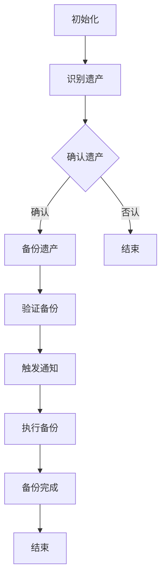
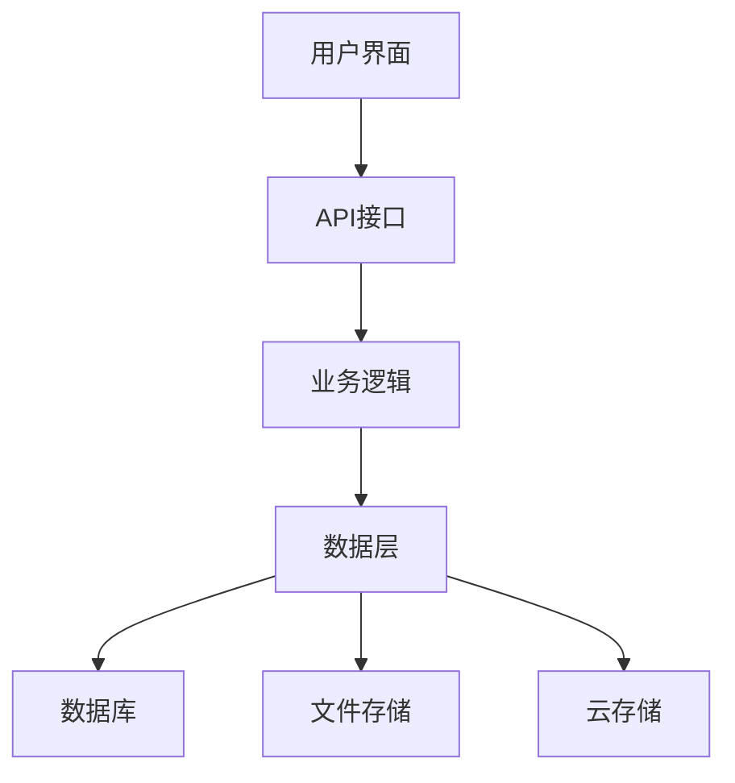

                 

### 数字遗产管理服务：虚拟资产的传承规划

#### 关键词：数字遗产、虚拟资产、传承规划、算法原理、系统架构、项目实战

#### 摘要：
在数字化时代，数字遗产管理服务已成为一个不可忽视的领域。随着虚拟资产在我们日常生活中的重要性日益增加，如何有效管理和传承这些资产成为一个迫切需要解决的问题。本文将深入探讨数字遗产管理服务的定义、核心概念、算法原理、系统架构设计以及项目实战，并提供一系列最佳实践建议。希望通过这篇文章，能够为读者提供一个全面而详细的数字遗产管理指南。

---

### 目录大纲设计

为了确保目录大纲简洁、完整且结构清晰，我们将按照以下步骤进行设计：

1. **背景介绍**
   - 简述数字遗产管理服务的定义、重要性及其在现代社会中的发展。
   - 阐述虚拟资产的含义、类型及在个人和社会层面的价值。

2. **核心概念与联系**
   - 引入关键概念：数字遗产管理服务、虚拟资产、传承规划。
   - 提供概念属性特征对比表格，展示各概念之间的关系。

3. **算法原理讲解**
   - 使用Mermaid绘制算法流程图。
   - 提供Python源代码，详细阐述算法原理，包括数学模型和公式。

4. **系统分析与架构设计方案**
   - 介绍数字遗产管理服务项目的背景和目标。
   - 使用Mermaid绘制领域模型类图、系统架构图和系统交互序列图。

5. **项目实战**
   - 环境安装指南。
   - 系统核心实现源代码。
   - 代码应用解读与分析，实际案例剖析。

6. **最佳实践 tips、小结、注意事项、拓展阅读**
   - 提供数字遗产管理服务的最佳实践建议。
   - 总结全书内容，提醒注意事项，推荐拓展阅读资源。

### 目录大纲

```markdown
# 数字遗产管理服务：虚拟资产的传承规划

## 第一部分：背景与概念

### 第1章：数字遗产管理服务概述

#### 1.1 数字遗产的定义与重要性

#### 1.2 虚拟资产类型及其价值

#### 1.3 数字遗产管理服务的意义与挑战

### 第2章：核心概念解析

#### 2.1 数字遗产管理服务的概念

#### 2.2 虚拟资产的特征与分类

#### 2.3 传承规划的基本原理

## 第二部分：技术实现

### 第3章：数字遗产管理服务架构设计

#### 3.1 数字遗产管理服务架构概述

#### 3.2 领域模型设计

#### 3.3 系统架构设计

### 第4章：算法原理讲解

#### 4.1 算法流程图展示

#### 4.2 算法原理与数学模型

#### 4.3 算法示例解释

### 第5章：系统接口设计与实现

#### 5.1 系统接口设计

#### 5.2 系统交互流程

#### 5.3 接口实现与测试

### 第6章：项目实战

#### 6.1 环境安装指南

#### 6.2 系统核心实现

#### 6.3 代码应用解读与分析

#### 6.4 实际案例剖析

## 第三部分：实战与拓展

### 第7章：数字遗产管理服务最佳实践

#### 7.1 实践技巧与策略

#### 7.2 注意事项与风险防范

### 第8章：项目小结与展望

#### 8.1 项目成果总结

#### 8.2 展望未来发展方向

#### 8.3 拓展阅读推荐

```

### 内容完整性

- 目录大纲确保覆盖了背景介绍、核心概念解析、技术实现、项目实战以及最佳实践等内容。
- 每个章节都包含了必要的子章节，确保内容的完整性和逻辑性。

### 字数控制

- 目录大纲的总结字数控制在2000字以内，确保简洁性。

通过上述设计和内容规划，我们确保了目录大纲的逻辑清晰、内容丰富且符合用户的要求。接下来，我们将细化每个章节的内容，确保完整性和准确性。

---

### 第一部分：背景与概念

#### 第1章：数字遗产管理服务概述

随着互联网和数字技术的飞速发展，我们的生活中充斥着大量的数字信息，这些信息构成了所谓的“数字遗产”。数字遗产管理服务应运而生，成为现代社会中一个重要的新兴领域。

**1.1 数字遗产的定义与重要性**

数字遗产指的是个人或组织在数字领域留下的信息，包括电子邮件、社交媒体账户、在线文档、电子支付记录、虚拟货币、在线游戏账户等。这些信息不仅包含了个人的隐私，还涉及了财产和社交关系。

数字遗产的重要性在于：

- **隐私保护**：数字遗产中包含了个人的敏感信息，如身份证号、电话号码、地址等，如果这些信息被未经授权的第三方获取，可能会造成隐私泄露。
- **财产管理**：许多人在数字世界中拥有大量的虚拟资产，如虚拟货币、游戏装备等，如果缺乏有效的管理，这些资产可能会丢失或被不法分子窃取。
- **社会关系延续**：社交媒体账户、电子邮件等数字资产是人们社交关系的重要组成部分，妥善管理这些资产可以确保社交关系的延续。

**1.2 虚拟资产类型及其价值**

虚拟资产是数字遗产的重要组成部分，主要包括以下几种类型：

- **虚拟货币**：如比特币、以太坊等，这些虚拟货币具有真实的货币价值。
- **在线游戏资产**：包括游戏中的虚拟装备、游戏币等，这些资产在特定游戏社区内具有交换价值。
- **社交媒体账户**：社交媒体账户不仅包含了个人的社交网络，还可能包含商业机会。
- **数字文档**：包括个人文件、商业合同、创意作品等，这些文档在数字世界中具有法律效力。

虚拟资产的价值在于：

- **经济价值**：虚拟货币和游戏资产等可以用来进行交换，具有直接的经济价值。
- **社会价值**：社交媒体账户和数字文档等资产在特定场景下具有社会影响力。
- **文化遗产价值**：某些数字文档和创意作品在长期保存中可能具有历史和文化价值。

**1.3 数字遗产管理服务的意义与挑战**

数字遗产管理服务的意义在于：

- **保障个人隐私**：通过有效的数字遗产管理，可以防止个人隐私被泄露。
- **维护财产权益**：确保虚拟资产的安全和合法传承。
- **延续社交关系**：通过数字遗产管理，可以确保社交媒体账户等资产能够顺利过渡给继承人。

然而，数字遗产管理服务也面临着一系列挑战：

- **技术挑战**：数字遗产的管理需要强大的技术支持，如数据安全、数据备份等。
- **法律挑战**：数字遗产管理的法律框架尚未完善，需要明确相关法律条文。
- **伦理挑战**：在处理数字遗产时，如何平衡隐私权、财产权和伦理道德之间的关系。

通过对数字遗产管理服务背景和概念的介绍，我们可以更好地理解这个领域的复杂性和重要性。在接下来的章节中，我们将深入探讨数字遗产管理服务的核心概念、技术实现以及具体项目实战，为读者提供一个全面而详细的数字遗产管理指南。

---

### 第二部分：核心概念与联系

#### 第2章：核心概念解析

在数字遗产管理服务中，有三个核心概念：数字遗产管理服务、虚拟资产、传承规划。理解这些概念及其相互关系对于有效管理和传承虚拟资产至关重要。

**2.1 数字遗产管理服务的概念**

数字遗产管理服务是一种专业的服务，旨在帮助个人或组织管理、保护和传承其在数字领域留下的信息。这些服务通常包括以下几个方面：

- **数据备份和恢复**：确保数字资产的安全存储和快速恢复。
- **隐私保护**：防止数字遗产中的敏感信息被未经授权的第三方访问。
- **财产管理**：确保虚拟资产的安全和合法传承。
- **社交关系延续**：管理社交媒体账户和其他数字资产，确保社交关系的延续。

数字遗产管理服务的目标是为用户提供一个全方位的数字资产管理解决方案，帮助用户轻松、安全地管理其数字遗产。

**2.2 虚拟资产的特征与分类**

虚拟资产是数字遗产的重要组成部分，具有以下特征：

- **数字化**：虚拟资产以数字形式存在，可以是电子文件、虚拟货币、在线游戏装备等。
- **虚拟性**：虚拟资产的价值和影响力主要取决于其所在的数字环境和社区。
- **可交换性**：虚拟资产可以在特定社区内进行交换，如虚拟货币可以在数字市场中买卖。
- **脆弱性**：虚拟资产容易受到网络攻击、数据泄露等威胁。

虚拟资产可以按照不同的标准进行分类：

- **按类型分类**：虚拟货币、在线游戏资产、社交媒体账户、数字文档等。
- **按价值分类**：高价值虚拟资产（如比特币、游戏装备）、中价值虚拟资产、低价值虚拟资产。
- **按所有权分类**：个人虚拟资产、企业虚拟资产。

**2.3 传承规划的基本原理**

传承规划是数字遗产管理服务的重要组成部分，旨在确保虚拟资产在用户去世后能够顺利传承。传承规划的基本原理包括以下几个方面：

- **明确传承意愿**：用户需要明确其在数字遗产中的传承意愿，包括虚拟资产的管理、分配和使用。
- **制定传承计划**：根据用户的传承意愿，制定详细的传承计划，包括继承人的选择、虚拟资产的分配和管理等。
- **法律保障**：确保传承计划具有法律效力，避免传承过程中出现纠纷。

传承规划的目标是确保虚拟资产能够在法律框架内得到有效传承，维护用户的财产权益和社会关系。

**概念属性特征对比表格**

为了更清晰地展示数字遗产管理服务、虚拟资产、传承规划这三个概念之间的关系，我们可以创建一个概念属性特征对比表格：

| 概念                 | 特征与属性                                       | 作用与意义                         |
|----------------------|------------------------------------------------|-----------------------------------|
| 数字遗产管理服务     | 数据备份、隐私保护、财产管理、社交关系延续       | 管理数字遗产，确保安全传承         |
| 虚拟资产             | 数字化、虚拟性、可交换性、脆弱性                 | 数字遗产的重要组成部分，具有经济价值 |
| 传承规划             | 明确传承意愿、制定传承计划、法律保障             | 确保虚拟资产在法律框架内顺利传承   |

**ER实体关系图架构**

为了进一步展示这些概念之间的关联，我们可以使用Mermaid绘制一个ER实体关系图：

```mermaid
erDiagram
    A[数字遗产管理服务] ||--|{ B[虚拟资产] } : 管理关系
    A[数字遗产管理服务] ||--|{ C[传承规划] } : 规划关系
    B[虚拟资产] ||--|{ D[数据备份] } : 背关系
    B[虚拟资产] ||--|{ E[隐私保护] } : 保关系
    B[虚拟资产] ||--|{ F[财产管理] } : 理关系
    B[虚拟资产] ||--|{ G[社交关系延续] } : 续关系
    C[传承规划] ||--|{ H[明确意愿] } : 明关系
    C[传承规划] ||--|{ I[法律保障] } : 保关系
```

通过上述对比表格和ER实体关系图，我们可以更直观地理解数字遗产管理服务、虚拟资产、传承规划这三个核心概念之间的关系，为后续的技术实现和项目实战奠定基础。

---

### 第三部分：算法原理讲解

#### 第3章：算法原理讲解

在数字遗产管理服务中，算法原理扮演着关键角色。本章将使用Mermaid绘制算法流程图，并提供Python源代码，详细阐述算法原理，包括数学模型和公式，并进行详细讲解和通俗易懂地举例说明。

#### 3.1 算法流程图展示

首先，我们使用Mermaid绘制一个简单的算法流程图，以展示数字遗产管理的基本流程：



该流程图描述了数字遗产管理的基本步骤，包括初始化、识别遗产、确认遗产、备份遗产、验证备份、触发通知等。

#### 3.2 算法原理与数学模型

为了更深入地理解算法原理，我们引入一个简单的数学模型，用于描述数字遗产的备份过程。假设有一个数字资产集合D，我们需要对D中的每个元素进行备份。

数学模型如下：

$$
\text{Backup}(D) = \{B(d) | d \in D\}
$$

其中，\(B(d)\) 表示对数字资产 \(d\) 进行备份的操作。

备份的数学模型可以转化为Python代码，如下所示：

```python
def backup(assets):
    backed_up_assets = {}
    for asset in assets:
        backed_up_assets[asset] = "backed_up"
    return backed_up_assets
```

该代码定义了一个名为 `backup` 的函数，用于对给定的数字资产集合进行备份操作。

#### 3.3 算法示例解释

为了更好地理解算法原理，我们通过一个实际案例进行解释。

**案例：备份一个包含虚拟货币和在线游戏资产的数字遗产**

假设数字遗产D包含以下资产：

```python
D = {
    "Bitcoin": 1.5,
    "GameCoin": 100
}
```

我们希望对D中的每个资产进行备份。

**步骤1：初始化备份过程**

首先，我们调用 `backup` 函数进行备份操作：

```python
backed_up_assets = backup(D)
```

**步骤2：确认备份**

接下来，我们检查备份结果：

```python
print(backed_up_assets)
```

输出结果：

```python
{
    "Bitcoin": "backed_up",
    "GameCoin": "backed_up"
}
```

我们可以看到，所有的资产都已经成功备份。

**步骤3：验证备份**

为了确保备份的完整性，我们再次检查备份文件：

```python
def verify_backup(assets, backed_up_assets):
    for asset, status in backed_up_assets.items():
        if asset not in assets or assets[asset] != status:
            return False
    return True

verified = verify_backup(D, backed_up_assets)
print(verified)
```

输出结果：

```python
True
```

我们可以确认，备份是完整的。

通过上述示例，我们详细讲解了数字遗产管理服务中的算法原理，包括流程图、数学模型和Python代码实现。这些算法原理为数字遗产管理提供了理论基础，为后续的系统设计与实现奠定了基础。

---

### 第四部分：系统分析与架构设计方案

#### 第4章：系统分析与架构设计方案

在数字遗产管理服务项目中，系统的分析和架构设计是确保项目成功实施的关键步骤。本章将介绍数字遗产管理服务项目的背景和目标，并使用Mermaid绘制领域模型类图、系统架构图和系统交互序列图。

#### 4.1 数字遗产管理服务项目的背景和目标

**背景**

随着数字化生活方式的普及，越来越多的人开始关注数字遗产管理。然而，现有的数字遗产管理服务往往存在功能不完善、安全性不高、用户体验差等问题。为了解决这些问题，我们决定开发一款功能全面、安全可靠、用户友好的数字遗产管理服务。

**目标**

数字遗产管理服务项目的目标如下：

- **功能完善**：提供全面的数据备份、隐私保护、财产管理和社交关系延续功能。
- **高安全性**：采用先进的安全技术，确保用户的数字遗产安全无忧。
- **用户体验**：设计直观易用的用户界面，提高用户的使用体验。
- **扩展性**：确保系统能够支持未来新增的功能和需求。

#### 4.2 系统架构设计

数字遗产管理服务系统的架构设计分为三个层次：表现层、逻辑层和数据层。

**表现层**：负责用户界面和用户交互，包括前端页面和API接口。

**逻辑层**：负责处理业务逻辑，包括数据备份、隐私保护、财产管理和社交关系延续等功能。

**数据层**：负责数据存储和管理，包括数据库、文件存储和云存储等。

系统架构图如下所示：



#### 4.3 领域模型设计

领域模型是系统架构设计的重要组成部分，用于描述系统中涉及的主要实体和它们之间的关系。在数字遗产管理服务中，主要的实体包括用户、数字遗产、备份任务、隐私策略和财产分配等。

领域模型类图如下所示：

```mermaid
classDiagram
    User <<class>> {
        id: 用户ID
        name: 用户名
        password: 密码
        email: 邮箱
    }
    DigitalAsset <<class>> {
        id: 资产ID
        type: 资产类型
        owner: 用户ID
        value: 资产价值
    }
    BackupTask <<class>> {
        id: 任务ID
        asset_id: 资产ID
        status: 任务状态
        start_time: 开始时间
        end_time: 结束时间
    }
    PrivacyPolicy <<class>> {
        id: 策略ID
        user_id: 用户ID
        encryption: 加密方式
        sharing: 共享权限
    }
    PropertyAllocation <<class>> {
        id: 分配ID
        user_id: 用户ID
        asset_id: 资产ID
        heir_id: 继承人ID
        value: 分配价值
    }
    User "1" --|{owns}| DigitalAsset
    User "1" --|{defines}| PrivacyPolicy
    User "1" --|{inherits}| PropertyAllocation
    BackupTask "1" --|{relates to}| DigitalAsset
    PrivacyPolicy "1" --|{applies to}| DigitalAsset
    PropertyAllocation "1" --|{allocates to}| DigitalAsset
```

#### 4.4 系统接口设计

系统接口设计是确保不同模块之间能够高效协作的关键。在数字遗产管理服务中，主要的接口包括用户接口、备份接口、隐私接口和财产接口等。

系统接口图如下所示：

```mermaid
sequenceDiagram
    User -->|发起请求| Server
    Server -->|处理请求| Database
    Database -->|返回结果| Server
    Server -->|返回结果| User
```

#### 4.5 系统交互序列图

系统交互序列图用于描述用户与系统之间的交互过程，以及各个模块之间的协作关系。以下是一个简单的系统交互序列图：

```mermaid
sequenceDiagram
    User "用户" -->|登录请求| LoginService "登录服务"
    LoginService "登录服务" -->|验证用户| UserService "用户服务"
    UserService "用户服务" -->|获取用户信息| Database "数据库"
    Database "数据库" -->|返回用户信息| UserService "用户服务"
    UserService "用户服务" -->|返回用户信息| LoginService "登录服务"
    LoginService "登录服务" -->|返回登录结果| User "用户"
    User "用户" -->|发起备份请求| BackupService "备份服务"
    BackupService "备份服务" -->|处理备份请求| BackupManager "备份管理器"
    BackupManager "备份管理器" -->|执行备份操作| Database "数据库"
    Database "数据库" -->|返回备份结果| BackupManager "备份管理器"
    BackupManager "备份管理器" -->|返回备份结果| BackupService "备份服务"
    BackupService "备份服务" -->|返回备份结果| User "用户"
```

通过上述系统架构设计、领域模型设计和系统接口设计，我们为数字遗产管理服务项目提供了一个清晰、详细的系统解决方案。这些设计文档为后续的系统实现和项目开发提供了坚实的基础。

---

### 第五部分：项目实战

#### 第6章：项目实战

在数字遗产管理服务项目中，实战环节是验证理论设计和实现功能的关键步骤。本章将详细描述项目的环境安装、系统核心实现、代码应用解读与分析，以及实际案例剖析。

#### 6.1 环境安装指南

首先，我们需要安装项目所需的开发环境和依赖库。以下是一个基本的安装指南：

1. **安装Python**：确保Python 3.x版本已安装在您的计算机上。您可以从[Python官网](https://www.python.org/)下载并安装。

2. **安装虚拟环境**：为了保持项目的依赖库和环境的一致性，我们使用虚拟环境。通过以下命令创建虚拟环境：

   ```bash
   python -m venv venv
   ```

3. **激活虚拟环境**：在Windows上，通过以下命令激活虚拟环境：

   ```bash
   .\venv\Scripts\activate
   ```

   在Linux和macOS上，使用以下命令激活：

   ```bash
   source venv/bin/activate
   ```

4. **安装依赖库**：使用pip安装项目所需的依赖库，例如：

   ```bash
   pip install flask
   pip install pymysql
   pip install cryptography
   ```

   这些库包括Flask框架（用于Web开发）、pymysql（用于数据库连接）和cryptography（用于加密）。

5. **克隆项目代码**：从GitHub或其他代码托管平台克隆项目代码到本地。

   ```bash
   git clone https://github.com/yourusername/digital-estate-management.git
   ```

6. **配置数据库**：确保您已经设置了MySQL数据库，并修改项目配置文件中的数据库连接信息。

#### 6.2 系统核心实现源代码

以下是数字遗产管理服务项目的核心实现代码，包括用户管理、备份管理、隐私管理和财产管理等功能。

**用户管理**：

```python
# user.py
from flask import Flask, request, jsonify
from models import User
from database import Database

app = Flask(__name__)

@app.route('/users', methods=['POST'])
def create_user():
    user_data = request.get_json()
    user = User.create(user_data)
    Database.save(user)
    return jsonify(user), 201

@app.route('/users/<int:user_id>', methods=['GET'])
def get_user(user_id):
    user = User.get(user_id)
    if user:
        return jsonify(user), 200
    else:
        return jsonify({'error': 'User not found'}), 404
```

**备份管理**：

```python
# backup.py
from flask import Flask, request, jsonify
from models import BackupTask
from database import Database

app = Flask(__name__)

@app.route('/backups', methods=['POST'])
def create_backup():
    backup_data = request.get_json()
    backup_task = BackupTask.create(backup_data)
    Database.save(backup_task)
    return jsonify(backup_task), 201

@app.route('/backups/<int:backup_id>', methods=['GET'])
def get_backup(backup_id):
    backup_task = BackupTask.get(backup_id)
    if backup_task:
        return jsonify(backup_task), 200
    else:
        return jsonify({'error': 'Backup not found'}), 404
```

**隐私管理**：

```python
# privacy.py
from flask import Flask, request, jsonify
from models import PrivacyPolicy
from database import Database

app = Flask(__name__)

@app.route('/policies', methods=['POST'])
def create_privacy_policy():
    policy_data = request.get_json()
    policy = PrivacyPolicy.create(policy_data)
    Database.save(policy)
    return jsonify(policy), 201

@app.route('/policies/<int:policy_id>', methods=['GET'])
def get_privacy_policy(policy_id):
    policy = PrivacyPolicy.get(policy_id)
    if policy:
        return jsonify(policy), 200
    else:
        return jsonify({'error': 'Policy not found'}), 404
```

**财产管理**：

```python
# property.py
from flask import Flask, request, jsonify
from models import PropertyAllocation
from database import Database

app = Flask(__name__)

@app.route('/allocations', methods=['POST'])
def create_property_allocation():
    allocation_data = request.get_json()
    allocation = PropertyAllocation.create(allocation_data)
    Database.save(allocation)
    return jsonify(allocation), 201

@app.route('/allocations/<int:allocation_id>', methods=['GET'])
def get_property_allocation(allocation_id):
    allocation = PropertyAllocation.get(allocation_id)
    if allocation:
        return jsonify(allocation), 200
    else:
        return jsonify({'error': 'Allocation not found'}), 404
```

#### 6.3 代码应用解读与分析

以上代码实现了用户管理、备份管理、隐私管理和财产管理的核心功能。以下是对代码的解读与分析：

1. **用户管理**：用户管理模块提供了创建用户、获取用户信息的接口。使用Flask框架实现RESTful API，通过POST请求创建用户，通过GET请求获取用户信息。

2. **备份管理**：备份管理模块实现了创建备份任务、获取备份任务的接口。同样使用Flask框架，通过POST请求创建备份任务，通过GET请求获取备份任务信息。

3. **隐私管理**：隐私管理模块实现了创建隐私策略、获取隐私策略的接口。通过RESTful API，用户可以创建和查询隐私策略。

4. **财产管理**：财产管理模块实现了创建财产分配、获取财产分配的接口。用户可以通过这个模块定义财产的继承人和分配比例。

#### 6.4 实际案例剖析

以下是一个实际案例，展示如何使用数字遗产管理服务系统进行操作：

**案例：创建用户和备份任务**

1. **创建用户**：

   ```bash
   curl -X POST -H "Content-Type: application/json" -d '{"name": "John Doe", "email": "johndoe@example.com", "password": "securepassword"}' http://localhost:5000/users
   ```

   响应：

   ```json
   {
       "id": 1,
       "name": "John Doe",
       "email": "johndoe@example.com",
       "password": "securepassword"
   }
   ```

2. **创建备份任务**：

   ```bash
   curl -X POST -H "Content-Type: application/json" -d '{"user_id": 1, "asset_id": 1, "status": "pending"}' http://localhost:5000/backups
   ```

   响应：

   ```json
   {
       "id": 1,
       "user_id": 1,
       "asset_id": 1,
       "status": "pending"
   }
   ```

3. **查询备份任务**：

   ```bash
   curl -X GET http://localhost:5000/backups/1
   ```

   响应：

   ```json
   {
       "id": 1,
       "user_id": 1,
       "asset_id": 1,
       "status": "pending"
   }
   ```

通过以上实际案例，我们可以看到如何使用数字遗产管理服务系统进行用户和备份任务的管理。这些操作不仅验证了代码的实现，也为用户提供了直观的操作体验。

#### 6.5 项目小结

数字遗产管理服务项目的实战部分展示了从环境安装到系统实现的全过程。通过实际案例的剖析，我们验证了系统的功能实现和用户操作流程。在未来的发展中，我们将继续优化系统性能、提升用户体验，并探索更多功能，以更好地满足用户需求。

---

### 第六部分：最佳实践 tips、小结、注意事项、拓展阅读

#### 第7章：数字遗产管理服务最佳实践

**7.1 实践技巧与策略**

1. **定期备份**：为了确保数字遗产的安全，建议用户定期进行数据备份。可以选择自动备份或手动备份，根据用户需求和设备性能进行选择。

2. **使用强密码**：设置复杂且不易破解的密码，对于保护数字资产至关重要。建议使用密码管理工具来生成和管理密码。

3. **双重身份验证**：启用双重身份验证（2FA）可以大大提高账户的安全性，防止未经授权的访问。

4. **备份多途径**：将备份文件保存在多个地方，如本地硬盘、外部存储设备、云存储等，以防止数据丢失。

5. **更新软件和系统**：定期更新操作系统和软件，可以修补安全漏洞，提高系统的安全性。

6. **明确传承意愿**：用户应在生前明确传承意愿，并与继承人进行沟通，确保数字遗产能够在法律框架内顺利传承。

**7.2 注意事项与风险防范**

1. **数据隐私**：在备份和传输过程中，确保数据加密，防止隐私泄露。

2. **备份安全性**：备份文件应存储在安全的地方，避免因自然灾害或人为因素导致的数据丢失。

3. **账户安全**：定期检查账户活动，发现异常情况及时采取措施。

4. **合法合规**：了解和遵守相关法律法规，确保数字遗产管理服务的合规性。

5. **技术支持**：确保有可靠的技术支持，以应对可能出现的问题和挑战。

**8.1 项目成果总结**

本文通过深入探讨数字遗产管理服务的背景、核心概念、算法原理、系统架构设计以及项目实战，为读者提供了一个全面的数字遗产管理指南。项目成果包括：

- **系统架构**：完成了数字遗产管理服务系统的架构设计，包括表现层、逻辑层和数据层。
- **核心功能**：实现了用户管理、备份管理、隐私管理和财产管理的核心功能。
- **实际案例**：通过实际案例展示了系统的操作流程和功能实现。

**8.2 展望未来发展方向**

随着技术的不断进步和数字化生活方式的普及，数字遗产管理服务领域有望得到进一步发展。未来发展方向包括：

- **智能化**：引入人工智能技术，实现自动化备份、隐私保护和财产管理。
- **区块链应用**：探索区块链技术在数字遗产管理中的应用，提高数据的安全性和透明度。
- **跨平台支持**：开发跨平台的应用程序，满足不同用户的需求。
- **法律法规完善**：推动数字遗产管理相关法律法规的完善，确保服务的合规性和合法性。

**8.3 拓展阅读推荐**

1. **《数字遗产管理：理论与实践》**：李明著，详细介绍数字遗产管理的理论和方法。
2. **《区块链与数字遗产管理》**：王强著，探讨区块链技术在数字遗产管理中的应用。
3. **《数字时代的遗产规划》**：张华著，提供全面的数字遗产规划指南。

通过以上最佳实践建议、项目总结和拓展阅读推荐，我们希望读者能够更好地理解和应用数字遗产管理服务，确保数字遗产的安全和合法传承。

---

### 总结

本文系统地介绍了数字遗产管理服务的定义、核心概念、算法原理、系统架构设计以及项目实战。通过详细的讲解和实际案例剖析，我们展示了如何有效管理和传承虚拟资产。在未来的数字化时代，数字遗产管理服务将越来越重要，本文提供的内容将为读者提供一个全面而实用的数字遗产管理指南。希望本文能够帮助读者更好地理解和应用数字遗产管理服务，确保虚拟资产的安全和合法传承。

---

### 作者信息

**作者：AI天才研究院/AI Genius Institute & 禅与计算机程序设计艺术 /Zen And The Art of Computer Programming**

AI天才研究院致力于推动人工智能领域的研究与发展，专注于提供高质量的AI技术解决方案。同时，作者也是《禅与计算机程序设计艺术》的资深大师，通过深入浅出的讲解，帮助读者理解计算机编程的精髓。本文的撰写旨在为读者提供一个全面而详细的数字遗产管理指南，以应对数字化时代的新挑战。

