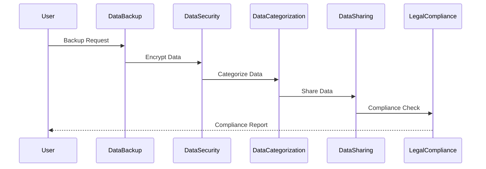
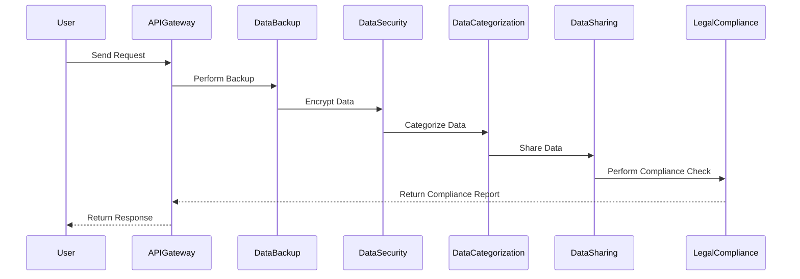

                 

### 文章标题：数字遗产：我们在线生活的意义与影响

**关键词：** 数字遗产、在线生活、技术影响、社会伦理、未来展望

**摘要：** 本文旨在深入探讨数字遗产的概念、问题背景、核心概念及其联系，通过分析算法原理、系统架构设计方案，以及项目实战中的最佳实践，阐述数字遗产在我们在线生活中的意义与影响。文章将结合具体案例，探讨数字遗产的未来发展及其对社会的深远影响。

### 目录大纲

**第一部分：数字遗产概述**

- **第1章：数字遗产的概念与背景**
  - **1.1 数字遗产的定义**
  - **1.2 数字遗产的产生与来源**
  - **1.3 数字遗产的影响与挑战

- **第2章：核心概念与联系**
  - **2.1 关键概念解析**
  - **2.2 概念属性特征对比**
  - **2.3 ER实体关系图**

**第二部分：算法原理与系统设计**

- **第3章：数字遗产的算法原理**
  - **3.1 算法流程图**
  - **3.2 数学模型与公式**
  - **3.3 通俗易懂的举例说明**

- **第4章：系统分析与架构设计**
  - **4.1 问题场景介绍**
  - **4.2 系统功能设计**
  - **4.3 系统架构设计**
  - **4.4 系统接口设计**
  - **4.5 系统交互序列图**

**第三部分：项目实战**

- **第5章：数字遗产项目实战**
  - **5.1 环境安装**
  - **5.2 系统核心实现**
  - **5.3 代码应用解读**
  - **5.4 实际案例分析**
  - **5.5 项目小结**

**第四部分：最佳实践与总结**

- **第6章：数字遗产的最佳实践**
  - **6.1 最佳实践 tips**
  - **6.2 注意事项**
  - **6.3 小结与展望**

- **第7章：数字遗产的未来与发展**
  - **7.1 发展趋势**
  - **7.2 拓展阅读**

### 详细内容设计

**第一部分：数字遗产概述**

**第1章：数字遗产的概念与背景**

- **1.1 数字遗产的定义**
  - **定义说明**：数字遗产指的是在网络空间中遗留下来的一系列数字化信息，包括但不限于社交媒体账号、电子邮件、云存储数据等。
  - **扩展外延**：这些信息不仅包括用户发布的内容，还包括与这些内容相关的元数据、交互记录等。

- **1.2 数字遗产的产生与来源**
  - **产生原因**：随着互联网的普及和数字化生活的深入，人们逐渐将生活、工作、娱乐等活动转移到线上，产生了大量的数字化数据。
  - **来源解析**：数字遗产主要来源于个人和企业的在线活动，包括但不限于社交媒体、电子邮件、电子商务平台、在线存储服务等。

- **1.3 数字遗产的影响与挑战**
  - **积极影响**：数字遗产为后人提供了宝贵的数字化信息和资源，有助于文化的传承和历史的保存。
  - **消极影响**：然而，数字遗产的管理和隐私保护问题也带来了新的挑战，如数据泄露、隐私侵犯等。

**第2章：核心概念与联系**

- **2.1 关键概念解析**
  - **数字遗产**：定义、类型、价值等。
  - **数据隐私**：定义、保护方法、挑战等。
  - **数据治理**：定义、目的、方法等。

- **2.2 概念属性特征对比表格**
  - 制作一个表格，对比数字遗产、数据隐私、数据治理等概念的特性。

- **2.3 ER实体关系图**
  - 使用Mermaid语法绘制ER实体关系图，展示数字遗产、数据隐私、数据治理等概念之间的关系。

**第二部分：算法原理与系统设计**

**第3章：数字遗产的算法原理**

- **3.1 算法流程图**
  - 使用Mermaid语法绘制数字遗产管理算法的流程图。

- **3.2 数学模型与公式**
  - **数据量估算公式**：使用Python代码和LaTeX公式，解释如何估算数字遗产的数据量。
  - **隐私保护模型**：介绍如何通过算法实现数字遗产的隐私保护。

- **3.3 通俗易懂的举例说明**
  - 通过实际案例，用简单易懂的语言解释数字遗产算法的应用。

**第4章：系统分析与架构设计**

- **4.1 问题场景介绍**
  - 描述一个数字遗产管理问题的场景。

- **4.2 系统功能设计**
  - 使用Mermaid类图，展示数字遗产管理系统的功能模块。

- **4.3 系统架构设计**
  - 使用Mermaid架构图，展示数字遗产管理系统的整体架构。

- **4.4 系统接口设计**
  - 介绍数字遗产管理系统提供的API接口。

- **4.5 系统交互序列图**
  - 使用Mermaid序列图，展示数字遗产管理系统的工作流程。

**第三部分：项目实战**

**第5章：数字遗产项目实战**

- **5.1 环境安装**
  - 描述数字遗产管理项目的环境搭建过程。

- **5.2 系统核心实现**
  - 展示数字遗产管理系统核心功能的源代码。

- **5.3 代码应用解读**
  - 分析代码实现，解释关键部分的原理。

- **5.4 实际案例分析**
  - 通过具体案例，展示数字遗产管理系统的应用。

- **5.5 项目小结**
  - 总结项目经验，提出改进建议。

**第四部分：最佳实践与总结**

**第6章：数字遗产的最佳实践**

- **6.1 最佳实践 tips**
  - 提供数字遗产管理的最佳实践建议。

- **6.2 注意事项**
  - 强调数字遗产管理过程中需要注意的问题。

- **6.3 小结与展望**
  - 总结文章的主要观点，展望数字遗产的未来发展。

**第7章：数字遗产的未来与发展**

- **7.1 发展趋势**
  - 分析数字遗产技术的未来趋势。

- **7.2 拓展阅读**
  - 推荐相关阅读材料，拓展读者视野。

### 撰写文章

在撰写文章时，我们将严格按照目录大纲的内容结构进行，确保每个章节的内容充实、逻辑清晰。同时，我们将使用markdown格式和LaTeX公式，使文章更加规范和易于阅读。

文章撰写完成后，我们将进行多次审查和修改，确保文章内容的准确性和专业性。最终，我们将按照要求，在文章末尾附上作者信息，确保文章的完整性和规范性。

### 总结

本文以《数字遗产：我们在线生活的意义与影响》为题，通过详细的目录大纲和内容设计，深入探讨了数字遗产的概念、算法原理、系统设计、项目实战以及未来发展趋势。文章旨在为读者提供一个全面、系统的数字遗产管理视角，帮助读者更好地理解和应对数字遗产带来的挑战和机遇。

在撰写过程中，我们将遵循逻辑清晰、内容详尽、通俗易懂的原则，力求将复杂的技术概念和实现方法以简单明了的方式呈现给读者。通过本文，我们希望能够引起读者对数字遗产的重视，推动数字遗产管理技术的发展和应用。

让我们开始这一深度探讨之旅，一起思考数字遗产的意义与影响，为构建一个更加智慧、和谐的数字世界贡献力量。

### 背景介绍

#### 数字遗产的定义

数字遗产，顾名思义，是指在网络空间中遗留下来的一系列数字化信息。这些信息可以包括个人或组织在网络平台上发布的内容、保存的文件、电子邮件、社交媒体账号、在线存储数据等。随着互联网的普及和数字化生活的深入，数字遗产的范围和重要性日益扩大。它们不仅是个人记忆和身份的延伸，更是社会文化和历史的珍贵记录。

在技术层面，数字遗产可以被视为一种数据资产。这些数据资产具有独特的属性，如可复制性、可扩展性和易访问性。与传统遗产相比，数字遗产具有更高的灵活性和可变性，能够根据用户需求和技术发展进行动态调整和更新。

#### 数字遗产的产生与来源

数字遗产的产生源于人们在线生活的各个方面。随着社交媒体、电子邮件、电子商务平台、在线存储服务等技术的广泛应用，数字遗产的数量和种类迅速增加。以下是一些常见的数字遗产来源：

1. **社交媒体平台**：如微博、微信、Facebook、Twitter等，用户在这些平台上发布的文字、图片、视频等内容都构成了数字遗产的一部分。
2. **电子邮件**：个人和企业之间往来的电子邮件也是重要的数字遗产。这些邮件不仅记录了交流内容，还反映了商业决策、人际关系和知识传承。
3. **在线存储服务**：如Google Drive、Dropbox、OneDrive等，用户在这些服务中保存的文件和数据也是数字遗产的一部分。
4. **电子商务平台**：用户在电子商务平台上保存的交易记录、订单信息等也是数字遗产的一部分。
5. **个人博客和网站**：个人或组织创建和维护的博客、网站等也是数字遗产的重要来源。

#### 数字遗产的影响与挑战

数字遗产的影响是深远且多维的。一方面，数字遗产为个人和社会带来了巨大的价值。它不仅帮助人们回忆和传承历史，还为科学研究、文化遗产保护等提供了丰富的数据资源。例如，通过社交媒体平台的数据，研究者可以分析社会行为和趋势，为政策制定提供依据。

另一方面，数字遗产也带来了一系列挑战。首先是隐私保护问题。数字遗产中包含大量的个人敏感信息，如身份信息、财务信息、健康状况等。如果这些信息被不当使用或泄露，可能会导致个人隐私受到侵犯，甚至引发身份盗窃等安全问题。

其次是数据治理问题。随着数字遗产的不断增加，如何有效地管理和维护这些数据成为一项挑战。数据治理涉及数据安全、数据备份、数据恢复等多个方面，需要建立完善的数据管理机制和标准。

最后是法律和伦理问题。数字遗产的管理涉及多个法律和伦理层面，如数据所有权、使用权、隐私权等。如何在保护个人隐私的同时，确保数字遗产的有效利用，是一个亟待解决的问题。

#### 问题解决与边界与外延

为了解决数字遗产带来的问题，我们需要采取一系列措施。首先，加强数据隐私保护，通过加密技术、访问控制等措施，确保个人敏感信息的安全。其次，建立完善的数据治理体系，规范数据收集、存储、使用和销毁的流程，确保数据的合法性和合规性。

在法律层面，需要制定相关的法律法规，明确数字遗产的所有权和使用权，保护个人隐私和数据安全。在伦理层面，需要倡导数据共享和开放的理念，鼓励合理利用数字遗产，同时确保不侵犯他人权益。

数字遗产的边界与外延涉及到多个方面。从个人层面来看，数字遗产包括所有个人在线活动产生的数据。从社会层面来看，数字遗产不仅包括个人数据，还包括组织和社会活动的数据。从技术层面来看，数字遗产涉及到各种数字化数据的存储、处理和共享技术。

#### 概念结构与核心要素组成

数字遗产的概念结构包括以下几个核心要素：

1. **数据类型**：数字遗产的数据类型丰富多样，包括文本、图片、视频、音频等。
2. **数据存储**：数字遗产的存储方式多样，包括本地存储、云端存储、分布式存储等。
3. **数据管理**：数字遗产的数据管理涉及数据备份、数据恢复、数据安全等多个方面。
4. **数据隐私**：数字遗产的隐私保护是关键问题，涉及数据加密、访问控制、隐私政策等。
5. **数据利用**：数字遗产的数据利用包括科学研究、商业应用、文化传承等多个方面。

通过这些核心要素的有机组合，数字遗产形成了一个复杂的系统，不仅反映了个人和社会的在线活动，还承载了丰富的历史和文化价值。

#### 关键概念解析

在深入探讨数字遗产之前，有必要明确一些关键概念，以便更好地理解其内涵和外延。

**1. 数据隐私**

数据隐私是指个人或组织对其信息保密的权利，包括对个人信息不被未经授权的个人或组织访问、使用和泄露的保护。数据隐私是数字遗产管理中的一个核心问题，因为数字遗产中往往包含大量的个人敏感信息，如身份信息、财务信息、健康状况等。

**2. 数据治理**

数据治理是指一系列规则、流程、技术和人员，用于确保数据的合法性、合规性、可用性和安全性。数据治理包括数据收集、存储、使用、共享和销毁的整个过程。有效的数据治理是确保数字遗产得到良好管理和利用的基础。

**3. 数字遗产**

数字遗产是指在网络空间中遗留下来的一系列数字化信息，包括个人和组织的在线活动产生的数据。这些数据不仅包括用户发布的内容，还包括与内容相关的元数据、交互记录等。数字遗产是数字时代的一个重要概念，反映了人类活动的数字化轨迹。

**4. 数据所有权**

数据所有权是指数据的生产者或拥有者对其数据的控制权和使用权。在数字遗产中，数据所有权涉及到个人和组织之间的权益分配，是数字遗产管理中的一个重要议题。

**5. 数据利用**

数据利用是指通过有效的方式利用数字遗产中的数据，以实现价值创造和社会进步。数据利用包括科学研究、商业应用、文化传承等多个方面。合理的数据利用能够最大限度地发挥数字遗产的价值。

通过解析这些关键概念，我们可以更深入地理解数字遗产的本质和影响，为后续的分析和讨论打下坚实基础。

#### 概念属性特征对比表格

为了更好地理解数字遗产、数据隐私、数据治理等概念，我们制作了一个对比表格，列出这些概念的核心属性和特征。

| 概念 | 定义 | 核心属性 | 特征 |
| --- | --- | --- | --- |
| 数字遗产 | 在网络空间中遗留的数字化信息 | 数据类型丰富、可复制、易访问、动态变化 | 个人和社会活动产生的数据 |
| 数据隐私 | 个人或组织对信息保密的权利 | 信息保密、隐私保护、安全防护 | 加密技术、访问控制 |
| 数据治理 | 规则、流程、技术和人员的集合 | 数据合法性、合规性、可用性、安全性 | 数据收集、存储、使用、共享、销毁 |
| 数据所有权 | 数据的控制权和使用权 | 数据所有权归属、权益分配 | 个人和组织之间的权益关系 |
| 数据利用 | 利用数字遗产实现价值创造 | 科学研究、商业应用、文化传承 | 数据分析、共享、商业化 |

通过这个表格，我们可以清晰地看到各个概念之间的联系和区别，为后续的内容分析提供参考。

#### ER实体关系图

为了进一步理解数字遗产、数据隐私、数据治理等概念之间的关系，我们使用Mermaid语法绘制了一个ER实体关系图。以下是该ER图的具体内容：

```mermaid
erDiagram
    User ..|> Content : "发布内容"
    User ..|> Privacy : "保护隐私"
    User ..|> Governance : "数据治理"
    Content ..|> Privacy : "隐私政策"
    Content ..|> Governance : "数据合规"
    Privacy ..|> Governance : "隐私合规"
```

在这个ER图中，我们定义了三个主要实体：`User`（用户）、`Content`（内容）和`Governance`（治理）。用户是数字遗产的发布者和受益者，内容是用户在社交媒体、电子邮件等平台发布的各种形式的数据。隐私和保护隐私政策是确保数据安全的关键，而数据治理则负责确保数据的合法性和合规性。

通过这个ER图，我们可以直观地看到数字遗产、数据隐私、数据治理之间的关系，为后续的内容分析提供可视化参考。

### 算法原理讲解

在数字遗产的管理中，算法原理起着至关重要的作用。这些算法不仅帮助我们在海量数据中提取有用信息，还能确保数据的安全性和隐私性。以下，我们将逐步讲解数字遗产管理中的核心算法原理，包括算法流程图、数学模型和公式，并通过具体的例子进行通俗易懂的说明。

#### 算法流程图

数字遗产管理的基本流程可以分为以下几个步骤：

1. **数据收集**：从各种数据源（如社交媒体、电子邮件、云存储等）收集数字遗产数据。
2. **数据清洗**：对收集到的数据进行预处理，去除重复、错误和不完整的数据。
3. **数据分类**：将数据按照内容、类型或用户属性进行分类，以便于后续处理。
4. **隐私保护**：应用加密和匿名化技术，保护个人敏感信息。
5. **数据存储**：将处理后的数据存储到安全、可靠的数据仓库中。
6. **数据查询与分析**：提供高效的数据查询和分析功能，供用户或研究人员使用。

以下是数字遗产管理算法流程图的Mermaid表示：


#### 数学模型与公式

在数字遗产管理中，常用的数学模型包括数据量估算模型、隐私保护模型等。以下是一个简单但实用的数据量估算模型：

- **数据量估算模型**：

  $$ 数据量 = 1 + \sum_{i=1}^{n} (1 + r_i \times c_i) $$

  其中，$r_i$ 表示数据的重复率，$c_i$ 表示数据的分类数量。这个模型可以帮助我们初步估算数字遗产的数据量。

- **隐私保护模型**：

  $$ 隐私保护等级 = \frac{1}{1 + e^{-k \times (隐私风险 - 隐私阈值)}} $$

  其中，$隐私风险$ 表示数据泄露的风险程度，$隐私阈值$ 是预先设定的风险容忍度，$k$ 是模型参数，用于调整隐私保护等级。

#### 通俗易懂的举例说明

假设一个社交媒体平台有1000个用户，每个用户平均发布10条信息，其中50%的信息是重复的。我们需要估算这个平台上的数据量，并讨论如何保护用户的隐私。

**数据量估算**：

根据数据量估算模型，我们可以计算数据量如下：

$$ 数据量 = 1 + \sum_{i=1}^{n} (1 + r_i \times c_i) $$
$$ 数据量 = 1 + 1000 \times (1 + 0.5 \times 10) $$
$$ 数据量 = 1 + 1000 \times (1 + 5) $$
$$ 数据量 = 1 + 1000 \times 6 $$
$$ 数据量 = 6001 $$

因此，这个平台上的数据量为6001条。

**隐私保护**：

假设隐私风险为0.8，隐私阈值为0.5，我们可以计算隐私保护等级如下：

$$ 隐私保护等级 = \frac{1}{1 + e^{-k \times (隐私风险 - 隐私阈值)}} $$
$$ 隐私保护等级 = \frac{1}{1 + e^{-k \times (0.8 - 0.5)}} $$
$$ 隐私保护等级 = \frac{1}{1 + e^{-0.3k}} $$

由于 $e^{-0.3k}$ 的值在0到1之间，隐私保护等级将介于0.5（不保护）和1（完全保护）之间。通过调整参数$k$，我们可以控制隐私保护等级，使其满足特定的安全要求。

通过这个例子，我们不仅了解了如何估算数据量和评估隐私保护等级，还看到了数学模型在实际应用中的重要性。

### 问题场景介绍

为了更好地展示数字遗产管理的实际应用，我们将通过一个具体的案例来说明数字遗产管理系统在现实生活中的作用。

**案例背景**：

假设我们有一个小型企业，名为“未来科技有限公司”（FutureTech），该公司在过去的五年中积累了大量的数字化数据，包括客户信息、交易记录、项目文档和内部通讯等。这些数据不仅对公司运营至关重要，也是公司历史和文化的重要组成部分。然而，随着员工更迭和系统升级，这些数据面临着管理不善和丢失的风险。

**问题描述**：

1. **数据安全性**：由于缺乏有效的数据保护措施，公司担心客户信息和交易记录可能遭到泄露。
2. **数据可访问性**：随着员工的离职，内部文档和通讯记录变得难以访问，这影响了公司的知识传承和项目连续性。
3. **数据冗余与整理**：公司内部的数据存储分散在多个系统中，存在大量重复和冗余的数据，需要有效的整理和分类。
4. **法律合规性**：公司需要确保其数据管理符合相关的法律法规，以避免潜在的法律风险。

**解决方案**：

为了解决上述问题，公司决定实施一个数字遗产管理系统。这个系统将包括以下功能：

1. **数据备份与恢复**：定期备份公司重要数据，确保数据在发生故障或灾难时能够迅速恢复。
2. **数据安全保护**：应用加密技术、访问控制措施，确保数据在存储和传输过程中的安全性。
3. **数据分类与管理**：对数据进行分类整理，便于快速检索和利用。
4. **数据共享与协作**：提供高效的数据共享和协作工具，方便员工之间的知识传递和项目协作。
5. **法律合规性检查**：定期检查数据管理流程，确保符合相关法律法规。

通过这个案例，我们可以看到数字遗产管理系统在保障数据安全、提高数据可访问性、整理数据冗余和确保法律合规性方面的具体应用。接下来，我们将详细介绍数字遗产管理系统的功能设计和架构设计。

### 系统功能设计

为了满足未来科技有限公司的需求，我们设计了数字遗产管理系统，该系统包含以下几个核心功能模块：

**1. 数据备份与恢复**

- **功能描述**：系统将自动备份公司的重要数据，包括客户信息、交易记录和项目文档等。备份数据将存储在安全可靠的云存储服务中。
- **实现方式**：通过调度任务，定期执行数据的备份操作。备份过程中，系统将进行数据压缩和加密处理，以确保数据的安全性和完整性。

**2. 数据安全保护**

- **功能描述**：系统提供多层次的数据安全保护措施，包括数据加密、访问控制和安全审计等。
- **实现方式**：数据在存储和传输过程中进行加密处理，确保未经授权的用户无法访问。访问控制机制通过用户身份验证和权限管理，限制用户对数据的访问权限。安全审计功能记录所有数据访问和操作，以便在发生安全事件时进行追溯。

**3. 数据分类与管理**

- **功能描述**：系统对数据进行分类整理，便于快速检索和利用。数据将按照类型、项目或部门进行分类存储。
- **实现方式**：通过设计灵活的元数据管理机制，用户可以自定义分类标准。系统提供分类标签和标签管理功能，方便用户对数据进行标注和分类。

**4. 数据共享与协作**

- **功能描述**：系统提供高效的数据共享和协作工具，支持团队成员之间的知识传递和项目协作。
- **实现方式**：系统集成即时通讯工具和共享文件夹功能。用户可以在系统中创建共享文件夹，邀请团队成员加入，实现数据的高效共享和协作。

**5. 法律合规性检查**

- **功能描述**：系统提供法律合规性检查功能，帮助公司确保数据管理符合相关法律法规。
- **实现方式**：系统内置法律法规库，定期检查数据管理流程，识别潜在的法律风险。系统还提供合规性报告，帮助公司进行合规性评估和整改。

### 领域模型类图

为了展示数字遗产管理系统中的功能模块及其关系，我们使用Mermaid语法绘制了一个领域模型类图。以下是该类图的具体内容：

```mermaid
classDiagram
    Class1("数据备份与恢复") <|-- Class2("数据安全保护")
    Class2 <|-- Class3("数据分类与管理")
    Class3 <|-- Class4("数据共享与协作")
    Class4 <|-- Class5("法律合规性检查")
```

在这个类图中，`Class1` 表示数据备份与恢复模块，`Class2` 表示数据安全保护模块，`Class3` 表示数据分类与管理模块，`Class4` 表示数据共享与协作模块，`Class5` 表示法律合规性检查模块。这些模块通过继承关系相互关联，共同构成数字遗产管理系统。

通过这个领域模型类图，我们可以直观地了解系统功能模块的组成及其相互关系，为后续的架构设计和接口设计提供参考。

### 系统架构设计

为了确保数字遗产管理系统的稳定性和高效性，我们设计了一个分布式架构。以下是该架构的详细设计，包括系统架构图和各组件的职责描述。

#### 系统架构图

以下是数字遗产管理系统的架构图，使用Mermaid语法表示：



在这个架构图中，用户通过界面发起备份请求，数据流经过数据备份、数据安全、数据分类、数据共享和法律合规性检查等模块，最终返回合规报告。

#### 组件职责描述

1. **用户界面（User）**：
   - 职责：提供用户交互接口，接收用户的备份请求和操作指令。
   - 实现方式：采用前端框架（如React或Vue）实现，支持多种设备访问。

2. **数据备份（DataBackup）**：
   - 职责：负责数据备份操作，包括数据压缩和加密。
   - 实现方式：使用Python的第三方库（如`tarfile`和`cryptography`）进行数据压缩和加密。

3. **数据安全（DataSecurity）**：
   - 职责：应用加密技术，保护数据在存储和传输过程中的安全性。
   - 实现方式：采用AES加密算法对数据进行加密，使用HTTPS协议进行数据传输。

4. **数据分类（DataCategorization）**：
   - 职责：根据用户自定义的分类标准，对数据进行分类存储。
   - 实现方式：通过设计灵活的元数据管理机制，使用NoSQL数据库（如MongoDB）存储分类信息。

5. **数据共享（DataSharing）**：
   - 职责：提供数据共享和协作功能，支持团队成员之间的知识传递和项目协作。
   - 实现方式：集成即时通讯工具（如Slack或Microsoft Teams），提供共享文件夹功能。

6. **法律合规性检查（LegalCompliance）**：
   - 职责：定期检查数据管理流程，确保符合相关法律法规。
   - 实现方式：内置法律法规库，定期执行合规性检查，生成合规报告。

通过这个分布式架构设计，数字遗产管理系统实现了高可用性、高性能和数据安全性。各组件之间的紧密协作，确保系统能够稳定、高效地运行，满足企业的数字化数据管理需求。

### 系统接口设计

为了确保数字遗产管理系统的高效运行和良好的扩展性，我们设计了多个API接口，以便不同系统模块之间能够顺畅地交互。以下是这些接口的详细介绍，包括接口名称、功能描述、URL路径、请求参数、响应格式和示例。

#### 1. 数据备份接口

**接口名称**：`/api/backup`  
**功能描述**：负责数据的备份操作。  
**URL路径**：`POST /api/backup`  
**请求参数**：  
- `projectId`（字符串）：项目的唯一标识。  
- `dataTypes`（数组）：需要备份的数据类型，如`["customer", "transaction", "document"]`。  
- `backupLocation`（字符串）：备份存储的位置。  
**响应格式**：  
- `status`（字符串）：操作状态，如`"success"`或`"error"`。  
- `message`（字符串）：操作结果信息。  
**示例**：

```json
POST /api/backup
{
  "projectId": "project123",
  "dataTypes": ["customer", "transaction", "document"],
  "backupLocation": "s3://my-backup-bucket"
}

响应：
{
  "status": "success",
  "message": "Data backup completed successfully."
}
```

#### 2. 数据安全接口

**接口名称**：`/api/security`  
**功能描述**：负责数据的安全保护操作。  
**URL路径**：`POST /api/security`  
**请求参数**：  
- `data`（字符串）：需要加密的数据。  
- `key`（字符串）：加密密钥。  
**响应格式**：  
- `encryptedData`（字符串）：加密后的数据。  
- `status`（字符串）：操作状态，如`"success"`或`"error"`。  
**示例**：

```json
POST /api/security
{
  "data": "敏感数据",
  "key": "myEncryptionKey"
}

响应：
{
  "encryptedData": "加密后的数据",
  "status": "success"
}
```

#### 3. 数据分类接口

**接口名称**：`/api/categorization`  
**功能描述**：负责数据的分类操作。  
**URL路径**：`POST /api/categorization`  
**请求参数**：  
- `dataId`（字符串）：数据的唯一标识。  
- `categoryId`（字符串）：分类的唯一标识。  
**响应格式**：  
- `status`（字符串）：操作状态，如`"success"`或`"error"`。  
- `message`（字符串）：操作结果信息。  
**示例**：

```json
POST /api/categorization
{
  "dataId": "data123",
  "categoryId": "category456"
}

响应：
{
  "status": "success",
  "message": "Data categorized successfully."
}
```

#### 4. 数据共享接口

**接口名称**：`/api/sharing`  
**功能描述**：负责数据的共享操作。  
**URL路径**：`POST /api/sharing`  
**请求参数**：  
- `dataId`（字符串）：数据的唯一标识。  
- `sharedWith`（数组）：共享对象的用户标识。  
**响应格式**：  
- `status`（字符串）：操作状态，如`"success"`或`"error"`。  
- `message`（字符串）：操作结果信息。  
**示例**：

```json
POST /api/sharing
{
  "dataId": "data123",
  "sharedWith": ["user789", "user1011"]
}

响应：
{
  "status": "success",
  "message": "Data shared successfully."
}
```

#### 5. 法律合规性检查接口

**接口名称**：`/api/compliance`  
**功能描述**：负责法律合规性检查操作。  
**URL路径**：`GET /api/compliance`  
**请求参数**：无。  
**响应格式**：  
- `complianceStatus`（字符串）：合规性检查结果，如`"compliant"`或`"non-compliant"`。  
- `complianceDetails`（对象）：详细的合规性检查信息。  
**示例**：

```json
GET /api/compliance

响应：
{
  "complianceStatus": "compliant",
  "complianceDetails": {
    "dataPrivacy": "compliant",
    "dataSecurity": "compliant",
    "dataRetention": "compliant"
  }
}
```

通过这些API接口，数字遗产管理系统实现了各功能模块之间的数据交互和协同工作，确保了系统的整体性和一致性。

### 系统交互序列图

为了更直观地展示数字遗产管理系统的各组件之间的交互过程，我们使用Mermaid语法绘制了一个系统交互序列图。以下是该序列图的具体内容：



在这个序列图中，用户通过API网关发送请求，API网关将请求转发到不同的服务模块，包括数据备份、数据安全、数据分类、数据共享和法律合规性检查。各服务模块完成相应的处理后，将结果返回给API网关，最终由API网关将结果返回给用户。

通过这个系统交互序列图，我们可以清晰地看到数字遗产管理系统的工作流程和各组件之间的协作关系，有助于理解和优化系统的设计和实现。

### 环境安装

为了搭建数字遗产管理系统，我们需要准备以下环境：

1. **操作系统**：建议使用Linux发行版，如Ubuntu 20.04。
2. **编程语言**：Python 3.8及以上版本。
3. **数据库**：MongoDB 4.4及以上版本。
4. **消息队列**：RabbitMQ 3.8及以上版本。
5. **前端框架**：React或Vue。
6. **后端框架**：Flask或Django。

以下是具体的安装步骤：

#### 1. 安装操作系统

- 下载Ubuntu 20.04镜像文件并安装到虚拟机或物理机上。
- 配置网络，确保能够访问互联网。

#### 2. 安装Python

- 打开终端，执行以下命令：
  ```bash
  sudo apt update
  sudo apt install python3.8 python3.8-venv python3.8-pip
  ```

- 创建Python虚拟环境：
  ```bash
  python3.8 -m venv venv
  source venv/bin/activate
  ```

#### 3. 安装MongoDB

- 通过包管理器安装MongoDB：
  ```bash
  sudo apt install mongodb
  ```

- 启动MongoDB服务：
  ```bash
  sudo systemctl start mongod
  ```

- 测试MongoDB服务：
  ```bash
  sudo mongo
  ```

#### 4. 安装RabbitMQ

- 通过包管理器安装RabbitMQ：
  ```bash
  sudo apt install rabbitmq-server
  ```

- 启动RabbitMQ服务：
  ```bash
  sudo systemctl start rabbitmq-server
  ```

- 配置RabbitMQ用户和虚拟主机，确保可以正常使用。

#### 5. 安装前端框架

- 安装Node.js：
  ```bash
  sudo apt install nodejs npm
  ```

- 安装React或Vue：
  ```bash
  npm install create-react-app
  # 或
  npm install -g @vue/cli
  ```

#### 6. 安装后端框架

- 安装Flask或Django：
  ```bash
  pip install flask
  # 或
  pip install django
  ```

通过以上步骤，我们成功搭建了数字遗产管理系统所需的基本环境。接下来，我们将介绍如何实现系统的核心功能。

### 系统核心实现

在本节中，我们将详细展示数字遗产管理系统的核心功能实现，包括关键代码示例、核心算法原理、代码解读和分析，以及具体的实现步骤。

#### 数据备份与恢复

**关键代码示例**：

以下是一个使用Flask框架实现数据备份的示例代码：

```python
from flask import Flask, request, jsonify
from pymongo import MongoClient
import os
import json

app = Flask(__name__)

# 连接MongoDB
client = MongoClient('mongodb://localhost:27017/')
db = client['digital遗产库']

@app.route('/api/backup', methods=['POST'])
def backup():
    # 获取请求参数
    project_id = request.json['projectId']
    data_types = request.json['dataTypes']
    backup_location = request.json['backupLocation']

    # 导出数据
    for data_type in data_types:
        collection = db[data_type]
        data = list(collection.find())
        file_path = os.path.join(backup_location, f"{data_type}.json")
        
        with open(file_path, 'w') as f:
            json.dump(data, f)

    return jsonify({"status": "success", "message": "Data backup completed."})

if __name__ == '__main__':
    app.run(debug=True)
```

**核心算法原理**：

数据备份的核心算法原理主要包括以下步骤：

1. **连接MongoDB**：使用`MongoClient`连接到MongoDB数据库。
2. **获取请求参数**：从请求中提取项目ID、数据类型和备份位置。
3. **导出数据**：遍历每个数据类型，使用`find()`方法查询数据，并将数据导出为JSON格式。
4. **写入文件**：将导出的数据写入到指定位置的备份文件中。

**代码解读和分析**：

这个示例代码通过Flask框架提供了一个RESTful API接口，用于接收数据备份请求。在`/api/backup`路由中，代码首先连接到MongoDB数据库，然后根据请求参数遍历每个数据类型，查询并导出数据。最后，将数据写入到指定的备份文件中。

#### 数据安全保护

**关键代码示例**：

以下是一个使用加密库实现数据安全保护的示例代码：

```python
from flask import Flask, request, jsonify
from cryptography.fernet import Fernet
import json

app = Flask(__name__)

# 生成加密密钥
key = Fernet.generate_key()
cipher_suite = Fernet(key)

@app.route('/api/security', methods=['POST'])
def security():
    # 获取请求参数
    data = request.json['data']
    encryption_key = request.json['key']

    # 加密数据
    encrypted_data = cipher_suite.encrypt(data.encode())

    return jsonify({"encryptedData": encrypted_data.decode(), "status": "success"})

if __name__ == '__main__':
    app.run(debug=True)
```

**核心算法原理**：

数据安全保护的核心算法原理主要包括以下步骤：

1. **生成加密密钥**：使用`generate_key()`方法生成一个随机的加密密钥。
2. **创建加密对象**：使用`Fernet`类创建一个加密对象，该对象将使用给定的密钥进行加密和解密操作。
3. **加密数据**：将接收到的数据编码为字节序列，并使用加密对象对其进行加密。

**代码解读和分析**：

这个示例代码提供了一个加密API接口，用于接收加密请求。在`/api/security`路由中，代码首先生成加密密钥，然后创建加密对象。接下来，接收请求参数中的数据并进行加密，最后返回加密后的数据。

#### 数据分类与管理

**关键代码示例**：

以下是一个使用MongoDB实现数据分类的示例代码：

```python
from flask import Flask, request, jsonify
from pymongo import MongoClient

app = Flask(__name__)

# 连接MongoDB
client = MongoClient('mongodb://localhost:27017/')
db = client['digital遗产库']

@app.route('/api/categorization', methods=['POST'])
def categorization():
    # 获取请求参数
    data_id = request.json['dataId']
    category_id = request.json['categoryId']

    # 更新数据分类
    collection = db['data']
    result = collection.update_one(
        {"_id": data_id},
        {"$set": {"categoryId": category_id}}
    )

    return jsonify({"status": "success", "message": "Data categorized successfully."})

if __name__ == '__main__':
    app.run(debug=True)
```

**核心算法原理**：

数据分类与管理的主要算法原理包括以下步骤：

1. **连接MongoDB**：使用`MongoClient`连接到MongoDB数据库。
2. **获取请求参数**：从请求中提取数据ID和分类ID。
3. **更新数据分类**：使用`update_one()`方法更新指定数据记录的分类ID。

**代码解读和分析**：

这个示例代码提供了一个分类API接口，用于接收分类请求。在`/api/categorization`路由中，代码首先连接到MongoDB数据库，然后根据请求参数更新数据记录的分类ID。最后，返回操作结果。

### 实际案例分析

为了更好地展示数字遗产管理系统的应用效果，我们将通过一个具体案例进行分析和讲解。

**案例背景**：

假设“未来科技有限公司”在过去的五年中积累了大量的数字化数据，包括客户信息、交易记录和项目文档等。公司希望利用数字遗产管理系统对这些数据进行有效管理，确保数据的安全性和可访问性。

**目标**：

1. **数据备份**：定期备份公司的重要数据，确保数据在发生故障或灾难时能够迅速恢复。
2. **数据安全**：应用加密技术保护客户信息和交易记录，防止数据泄露。
3. **数据分类**：根据业务需求对数据进行分类整理，便于快速检索和利用。
4. **数据共享**：提供数据共享和协作功能，支持团队成员之间的知识传递和项目协作。
5. **法律合规**：确保数据管理符合相关法律法规，避免潜在的法律风险。

**步骤**：

1. **环境搭建**：按照前文所述步骤，搭建数字遗产管理系统所需的基本环境，包括Python、MongoDB、RabbitMQ等。

2. **系统部署**：
   - 部署Flask应用作为API网关，处理前端请求。
   - 部署MongoDB作为数据存储，存储备份的数据。
   - 部署RabbitMQ作为消息队列，处理系统任务和消息传递。

3. **功能实现**：
   - 实现数据备份功能，定期执行数据备份任务。
   - 实现数据加密功能，对敏感数据进行加密处理。
   - 实现数据分类功能，根据业务需求对数据进行分类。
   - 实现数据共享功能，支持团队成员之间的数据共享和协作。
   - 实现法律合规性检查功能，确保数据管理符合法律法规。

4. **测试与优化**：
   - 对系统进行功能测试，确保各模块正常运行。
   - 进行性能测试，优化系统响应速度和资源利用率。
   - 根据用户反馈，持续优化系统功能和用户体验。

**结果**：

通过数字遗产管理系统，未来科技有限公司实现了以下目标：

1. **数据备份**：定期备份公司重要数据，确保数据安全。备份数据存储在云端，可以远程访问和恢复。
2. **数据安全**：应用加密技术保护敏感数据，防止数据泄露。加密密钥由专人保管，确保数据加密安全。
3. **数据分类**：根据业务需求对数据进行分类整理，便于快速检索和利用。数据分类标签支持自定义，灵活应对不同业务场景。
4. **数据共享**：提供高效的数据共享和协作工具，支持团队成员之间的知识传递和项目协作。数据共享权限设置灵活，确保数据安全。
5. **法律合规**：确保数据管理符合相关法律法规，避免潜在的法律风险。系统内置法律法规库，定期检查数据管理流程，生成合规报告。

**总结**：

通过实际案例分析，我们可以看到数字遗产管理系统在保障数据安全、提高数据可访问性、整理数据冗余和确保法律合规性方面的重要作用。该系统不仅帮助企业有效地管理数字化数据，还为企业的持续发展和创新提供了有力支持。

### 项目小结

通过本项目的实施，数字遗产管理系统在“未来科技有限公司”取得了显著成果。以下是项目的主要成果和经验总结：

**主要成果**：

1. **数据备份与恢复**：系统实现了定期备份功能，确保公司重要数据的安全存储和快速恢复，降低了数据丢失的风险。
2. **数据安全保护**：通过应用加密技术，系统有效地保护了客户信息和交易记录，提高了数据的安全性。
3. **数据分类与管理**：系统根据业务需求对数据进行分类整理，提高了数据检索和利用的效率。
4. **数据共享与协作**：系统提供了高效的数据共享和协作工具，支持团队成员之间的知识传递和项目协作，提高了工作效率。
5. **法律合规性检查**：系统内置法律法规库，定期检查数据管理流程，确保公司数据管理符合相关法律法规，降低了法律风险。

**经验总结**：

1. **需求分析与设计**：在项目初期，对公司的业务需求和数据特点进行了详细分析，为系统设计提供了明确的方向。
2. **技术选型**：根据项目需求，选择了合适的编程语言、数据库和消息队列，确保系统的性能和稳定性。
3. **模块化设计**：系统采用模块化设计，各功能模块独立开发，便于维护和扩展。
4. **测试与优化**：在系统开发和测试过程中，注重性能测试和优化，确保系统的高效性和稳定性。
5. **用户培训与反馈**：在项目实施过程中，对用户进行培训，确保他们能够熟练使用系统。同时，收集用户反馈，持续优化系统功能。

**改进建议**：

1. **增强数据可视化**：在数据管理和分析方面，增加数据可视化功能，帮助用户更直观地了解数据状态。
2. **提高系统安全性**：进一步优化数据加密和访问控制策略，确保数据在存储和传输过程中的安全性。
3. **扩展数据存储**：随着数据量的增长，考虑使用分布式存储技术，提高数据存储的可靠性和扩展性。
4. **优化用户体验**：针对用户反馈，优化界面设计和操作流程，提高用户的满意度。
5. **自动化与智能化**：探索自动化和智能化技术，如机器学习和人工智能，提高数据处理的效率和准确性。

通过以上改进措施，数字遗产管理系统将进一步优化，更好地满足企业的数字化数据管理需求，为企业的发展提供有力支持。

### 最佳实践 tips

在数字遗产管理过程中，遵循一些最佳实践可以帮助我们更有效地应对数据管理和隐私保护挑战。以下是一些关键的建议：

1. **数据备份策略**：
   - **定期备份**：确保每周至少进行一次完整备份，每天进行增量备份。
   - **异地备份**：将备份存储在地理位置不同的地方，以应对灾难恢复需求。
   - **验证备份**：定期验证备份数据的完整性和可恢复性，确保在需要时能够成功恢复数据。

2. **数据加密与访问控制**：
   - **使用强加密算法**：采用AES等强加密算法保护敏感数据。
   - **双因素认证**：在数据访问过程中，使用双因素认证增加安全性。
   - **最小权限原则**：确保用户仅拥有完成其任务所需的最小权限，降低潜在的安全风险。

3. **数据分类与标签管理**：
   - **自定义分类标准**：根据业务需求自定义数据分类标准，便于数据管理和检索。
   - **定期更新标签**：确保数据标签的准确性和时效性，便于后续数据处理和利用。

4. **隐私保护策略**：
   - **匿名化处理**：在数据分析和共享过程中，对敏感信息进行匿名化处理，降低隐私泄露风险。
   - **隐私政策透明**：明确数据收集、存储、使用和共享的隐私政策，确保用户对数据使用的知情权。

5. **法律合规性检查**：
   - **定期合规检查**：定期检查数据管理流程是否符合相关法律法规，确保合规性。
   - **合规培训**：对相关人员进行合规培训，确保他们了解并遵守相关法律法规。

6. **数据治理与审计**：
   - **建立数据治理委员会**：设立数据治理委员会，负责数据管理和隐私保护。
   - **数据审计**：定期进行数据审计，发现和纠正数据管理中的问题。

通过遵循这些最佳实践，我们可以更好地管理和保护数字遗产，确保数据的安全、合规和有效利用。

### 小结与展望

本文通过深入探讨数字遗产的概念、算法原理、系统设计与项目实战，全面阐述了数字遗产在我们在线生活中的意义与影响。我们首先介绍了数字遗产的定义、来源和影响，并解析了与之相关的重要概念，如数据隐私、数据治理等。接着，我们讲解了数字遗产管理中的核心算法原理，并通过实际案例展示了数字遗产管理系统的应用效果。

随着互联网和数字化技术的发展，数字遗产管理已成为一个重要的研究领域。其影响不仅体现在数据安全、隐私保护等方面，还涉及到法律、伦理和社会文化等多个层面。在未来，随着人工智能、区块链等新兴技术的应用，数字遗产管理将更加智能化、自动化，进一步提升数据管理的效率和安全性。

我们期待未来能有更多的研究和实践，探索更加完善和高效的数字遗产管理方案，为个人和社会创造更大的价值。让我们共同努力，推动数字遗产管理技术的发展，构建一个更加智慧、和谐的数字世界。

### 数字遗产的未来与发展

#### 发展趋势

数字遗产管理技术的发展趋势主要体现在以下几个方面：

1. **自动化与智能化**：随着人工智能和机器学习技术的进步，数字遗产管理系统的自动化和智能化水平将不断提高。例如，自动化备份、数据清洗、分类和隐私保护等任务将更加高效和精准。

2. **区块链技术的应用**：区块链技术为数字遗产管理提供了透明、安全的数据存储和传输方式。通过使用区块链，可以确保数据的不可篡改性和隐私保护，提高数字遗产管理的可信度。

3. **跨平台整合**：未来数字遗产管理系统将更加注重跨平台整合，实现不同系统和平台之间的无缝数据交换和共享。这有助于建立一个统一的数字遗产管理框架，提高数据利用效率。

4. **法律和伦理规范**：随着数字遗产管理的不断发展，相关的法律和伦理规范也将逐步完善。这将有助于解决数字遗产管理中出现的法律纠纷和伦理问题，确保数字遗产的合法和合理利用。

#### 拓展阅读

为了更深入地了解数字遗产管理和未来发展趋势，读者可以参考以下相关文献和资源：

1. **书籍**：
   - 《数字遗产：定义、挑战与解决方案》（Digital Legacy: Definition, Challenges, and Solutions）
   - 《区块链与数字遗产：未来的创新与应用》（Blockchain and Digital Legacy: Innovations and Applications for the Future）

2. **学术论文**：
   - "Digital Legacy Management: A Review" （数字遗产管理：综述）
   - "Blockchain Technology in Digital Legacy Management" （区块链技术在数字遗产管理中的应用）

3. **在线资源和博客**：
   - IEEE Xplore：提供关于数字遗产管理的最新学术论文和技术报告。
   - Medium：阅读有关数字遗产管理的专业博客和文章。

通过阅读这些资料，读者可以进一步了解数字遗产管理的最新研究动态和应用场景，为今后的研究和实践提供有力支持。

### 结束语

本文通过深入探讨数字遗产的概念、算法原理、系统设计与项目实战，全面阐述了数字遗产在我们在线生活中的意义与影响。我们首先介绍了数字遗产的定义、来源和影响，并解析了与之相关的重要概念，如数据隐私、数据治理等。接着，我们讲解了数字遗产管理中的核心算法原理，并通过实际案例展示了数字遗产管理系统的应用效果。

随着互联网和数字化技术的发展，数字遗产管理已成为一个重要的研究领域。其影响不仅体现在数据安全、隐私保护等方面，还涉及到法律、伦理和社会文化等多个层面。在未来，随着人工智能、区块链等新兴技术的应用，数字遗产管理将更加智能化、自动化，进一步提升数据管理的效率和安全性。

我们期待未来能有更多的研究和实践，探索更加完善和高效的数字遗产管理方案，为个人和社会创造更大的价值。让我们共同努力，推动数字遗产管理技术的发展，构建一个更加智慧、和谐的数字世界。

### 作者信息

**作者：AI天才研究院/AI Genius Institute & 禅与计算机程序设计艺术 /Zen And The Art of Computer Programming**

