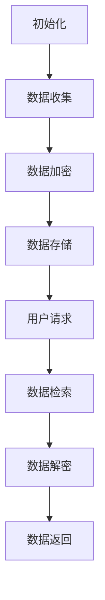
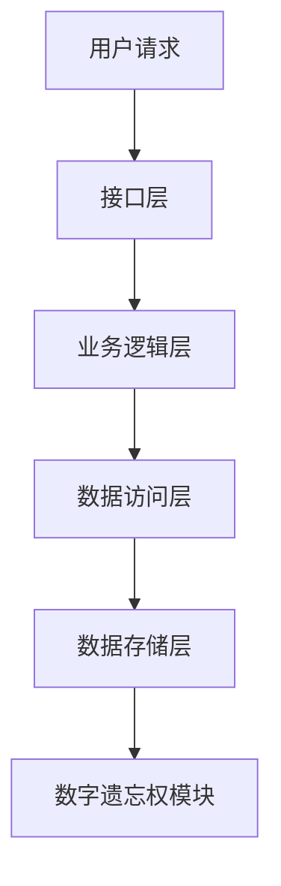
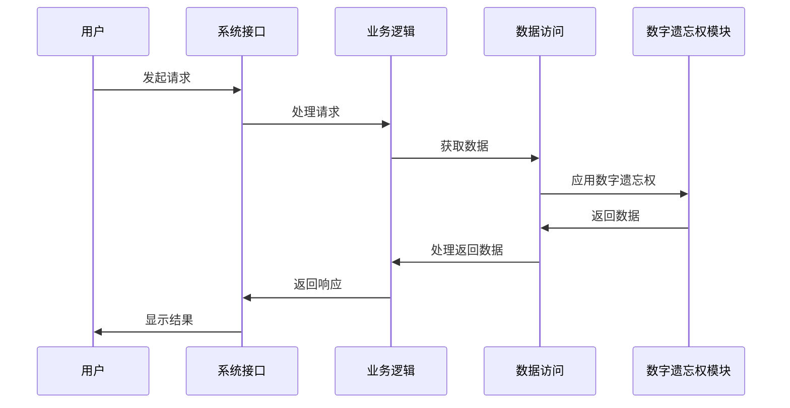
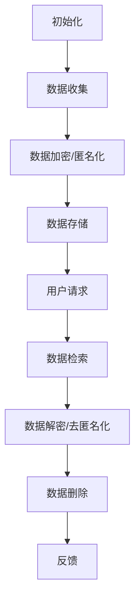
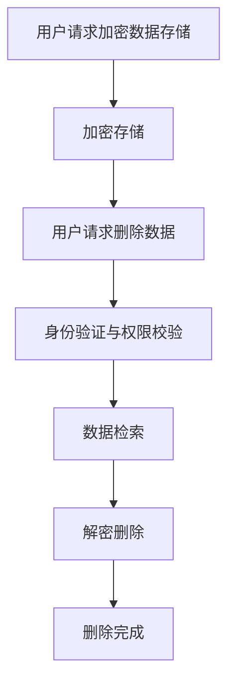
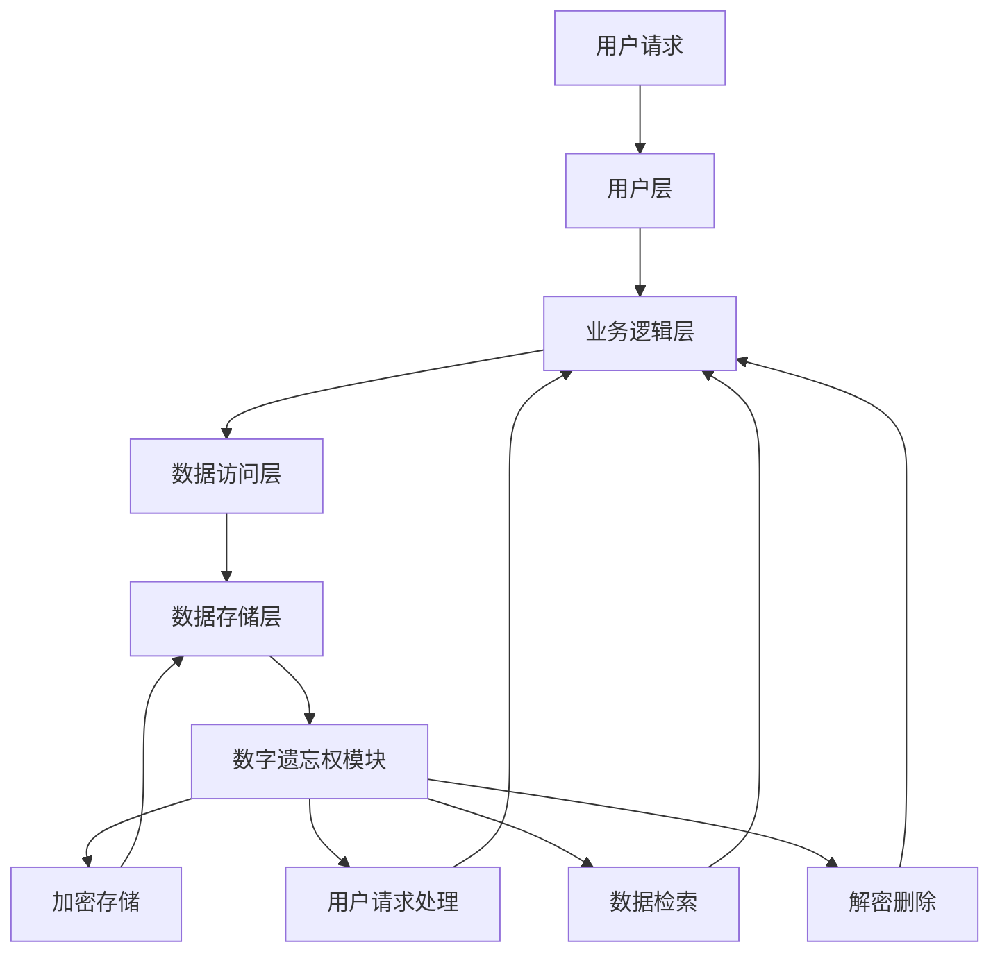
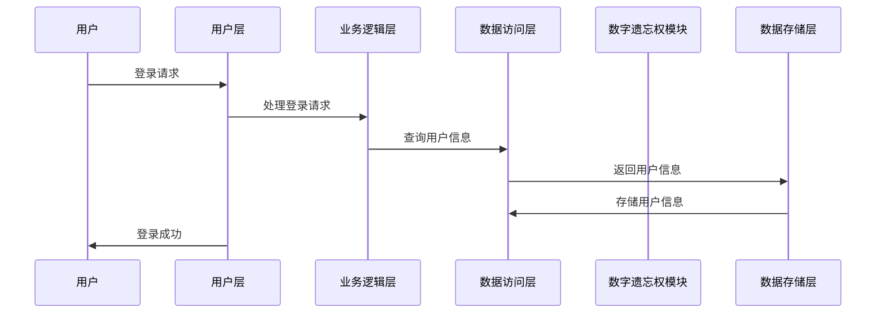
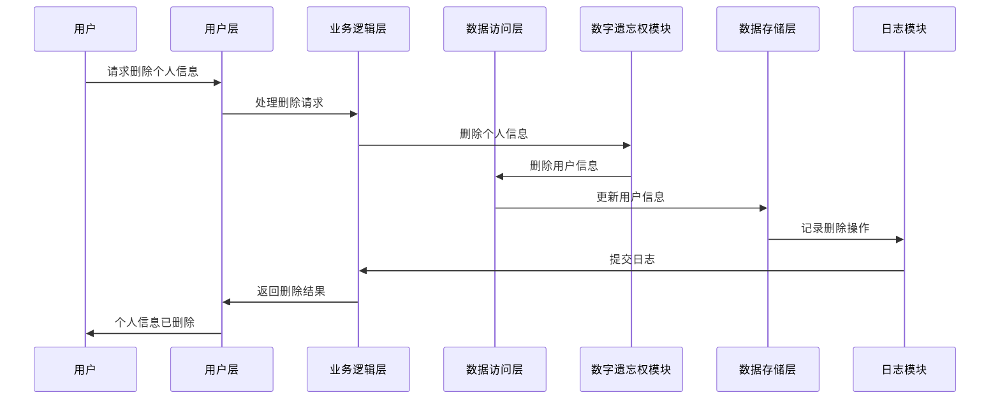

                 

# 数字遗忘权执行机制：网络时代的个人信息管理策略

关键词：数字遗忘权、个人信息管理、隐私保护、算法原理、系统架构设计

摘要：本文旨在探讨数字遗忘权执行机制在网络时代的个人信息管理中的重要性。随着网络技术的飞速发展，个人信息泄露风险日益增加，用户对隐私保护的诉求也愈发强烈。数字遗忘权作为一种新型的个人信息管理策略，旨在帮助用户有效地管理个人信息，防止个人信息滥用。本文将详细分析数字遗忘权的概念、原理和执行机制，并提出一种基于隐私保护技术的数字遗忘权算法，最后通过一个具体项目实战案例，展示数字遗忘权执行机制的实际应用。

### 目录大纲

---

## 第一部分：背景介绍

### 1.1 问题背景

#### 1.1.1 网络时代个人信息管理的挑战
- 个人信息泄露的风险增加
- 用户对隐私保护的诉求提升
- 法律法规对个人信息保护的强化

### 1.2 问题描述

#### 1.2.1 数字遗忘权概念
- 数字遗忘权的定义与意义
- 数字遗忘权与个人隐私的关系

#### 1.2.2 现有机制分析
- 传统个人信息管理方法
- 当前数字遗忘权执行机制的局限性

#### 1.2.3 数字遗忘权执行的必要性
- 防止个人信息滥用
- 符合法律法规要求
- 提高用户隐私保护意识

#### 1.2.4 边界与外延
- 数字遗忘权的适用范围
- 数字遗忘权与数据删除的区别

## 第二部分：核心概念与联系

### 2.1 数字遗忘权原理

#### 2.1.1 概念解释
- 数字遗忘权的定义
- 数字遗忘权的作用机制

#### 2.1.2 概念属性特征对比
- 数字遗忘权与其他隐私保护机制的对比

### 2.1.3 数字遗忘权的核心要素
- 数字遗忘权的要素构成
- 各要素之间的关系

### 2.1.4 数字遗忘权与个人信息保护的联系
- 数字遗忘权在个人信息保护中的作用
- 数字遗忘权与其他隐私保护机制的协同效应

## 第三部分：算法原理讲解

### 3.1 数字遗忘权算法概述

#### 3.1.1 算法分类
- 基于加密的数字遗忘权算法
- 基于隐私保护技术的数字遗忘权算法

#### 3.1.2 算法流程
- 数字遗忘权算法的基本流程

#### 3.1.3 算法流程图



### 3.2 数字遗忘权算法原理

#### 3.2.1 数学模型和公式

$$
\text{隐私保护等级} = f(\text{数据重要性}, \text{数据暴露风险})
$$

#### 3.2.2 详细讲解

- 数据重要性评估
- 数据暴露风险分析
- 隐私保护等级计算

### 3.3 算法举例说明

#### 3.3.1 Python源代码示例

```python
def calculate_privacy_level(importance, risk):
    privacy_level = 1 / (1 + import_exp(1 - importance) + exp(-risk))
    return privacy_level

def import_exp(x):
    return 1 / (1 + exp(-x))

def exp(x):
    return 1 / (1 + x)
```

## 第四部分：系统分析与架构设计

### 4.1 问题场景介绍

#### 4.1.1 数字遗忘权应用场景
- 个人信息管理系统
- 企业内部信息管理

#### 4.1.2 项目介绍
- 项目背景
- 项目目标

#### 4.1.3 系统功能设计

#### 4.1.4 领域模型Mermaid类图

```mermaid
classDiagram
    Class01 <|-- Class02
    Class03 --|>| Class04
    Class05 : <<interface>> Class06
```

### 4.2 系统架构设计

#### 4.2.1 系统架构Mermaid架构图



#### 4.2.2 系统接口设计

#### 4.2.3 系统交互Mermaid序列图



---

### 第一部分：背景介绍

#### 1.1 问题背景

在当今这个网络时代，个人信息泄露的风险不断增加，用户对隐私保护的诉求也越来越强烈。以下是一些关于网络时代个人信息管理挑战的详细分析：

##### 1.1.1 个人信息泄露的风险增加

随着互联网的普及，大量的个人信息通过网络平台被收集和存储。然而，由于网络安全措施的不完善，这些个人信息容易成为黑客攻击的目标。例如，2017年，全球最大的社交媒体平台Facebook就曝出了5000万用户的个人信息泄露事件。这类事件频发，引发了公众对个人信息保护的担忧。

##### 1.1.2 用户对隐私保护的诉求提升

用户对隐私保护的诉求主要体现在以下几个方面：

1. 对个人信息泄露的担忧
2. 对个人信息被滥用的反感
3. 对个人信息控制权的渴望

随着隐私保护意识的提高，越来越多的用户开始关注个人信息的安全和隐私保护。

##### 1.1.3 法律法规对个人信息保护的强化

为了应对个人信息泄露风险和用户隐私保护诉求，各国政府和国际组织相继出台了一系列法律法规，以加强对个人信息的保护。例如，欧盟在2018年推出了《通用数据保护条例》（GDPR），对个人信息的收集、处理和存储提出了严格的要求。这些法律法规的出台，进一步推动了个人信息保护技术的发展。

#### 1.2 问题描述

##### 1.2.1 数字遗忘权概念

数字遗忘权是一种新型的个人信息管理策略，它允许用户在特定条件下要求网络服务提供商删除其个人信息。数字遗忘权的定义如下：

**数字遗忘权**：指用户在特定条件下，通过网络服务提供商主动请求删除其个人信息的一种权利。它旨在帮助用户更好地管理个人信息，防止个人信息滥用。

数字遗忘权的主要意义在于：

1. 提高用户隐私保护意识
2. 防止个人信息滥用
3. 符合法律法规要求

##### 1.2.2 数字遗忘权与个人隐私的关系

数字遗忘权与个人隐私密切相关。个人隐私是指个人享有的对其个人信息保密和控制的权利。在数字遗忘权框架下，用户可以通过数字遗忘权要求网络服务提供商删除其个人信息，从而保护个人隐私。

##### 1.2.3 现有机制分析

现有的个人信息管理方法主要包括以下几种：

1. 数据加密
2. 数据匿名化
3. 数据访问控制

然而，这些方法在数字遗忘权执行方面存在一定的局限性：

1. 数据加密：虽然可以保护数据传输过程中的安全，但无法防止数据在存储时被滥用。
2. 数据匿名化：可以降低数据泄露的风险，但无法完全消除风险，且可能影响数据的价值。
3. 数据访问控制：可以限制对数据的访问，但无法确保数据不会被非法复制或传播。

##### 1.2.4 数字遗忘权执行的必要性

数字遗忘权执行的必要性主要体现在以下几个方面：

1. 防止个人信息滥用：数字遗忘权可以帮助用户防止个人信息被滥用，从而降低隐私泄露的风险。
2. 符合法律法规要求：随着法律法规的不断完善，网络服务提供商需要遵守相关法规，执行数字遗忘权机制。
3. 提高用户隐私保护意识：数字遗忘权的普及可以提高用户的隐私保护意识，促进个人信息保护技术的发展。

##### 1.2.5 边界与外延

数字遗忘权的适用范围包括但不限于以下几个方面：

1. 用户个人信息：用户在社交平台、电商平台等网络服务提供商处注册的信息。
2. 跟踪数据：网络服务提供商收集的用户行为数据。
3. 意见反馈：用户对网络服务提供商的意见和建议。

数字遗忘权与数据删除的区别主要在于：

1. 数据删除：是指网络服务提供商根据用户的要求删除其个人信息。
2. 数字遗忘权：是指用户在特定条件下，通过网络服务提供商主动请求删除其个人信息。

数字遗忘权更加注重用户对个人信息的主动管理，而数据删除则更多依赖于网络服务提供商的响应。

#### 1.3 小结

本节介绍了网络时代个人信息管理的挑战，包括个人信息泄露风险增加、用户隐私保护诉求提升以及法律法规对个人信息保护的强化。接着，我们探讨了数字遗忘权的概念、意义及其与个人隐私的关系，分析了现有机制的分析和局限性，并阐述了数字遗忘权执行的必要性。最后，我们讨论了数字遗忘权的适用范围和与数据删除的区别。在下一部分，我们将深入探讨数字遗忘权的核心概念与联系。

---

### 第二部分：核心概念与联系

#### 2.1 数字遗忘权原理

##### 2.1.1 概念解释

数字遗忘权（Digital Right to be Forgotten，简称DRBF）是一种用户权利，允许个体请求从互联网上删除关于他们的个人信息。这一概念起源于欧盟的《通用数据保护条例》（GDPR），旨在保护个人的隐私权，特别是在个人信息已经不再有必要保留的情况下。数字遗忘权的定义可以概括为：

**数字遗忘权**：指个人有权要求网络服务提供商删除其个人信息，以消除个人信息在互联网上的痕迹。

数字遗忘权的作用机制主要体现在以下几个方面：

1. **用户请求**：当个人认为其个人信息已经不再有必要保留，或者这些信息对个人造成了负面影响时，可以向网络服务提供商提出删除请求。
2. **评估与决策**：网络服务提供商需对用户的请求进行评估，根据法律、商业需求和公共利益等因素，决定是否删除相关信息。
3. **执行删除**：如果决定删除，网络服务提供商需采取有效措施，确保相关信息从互联网上完全移除。
4. **跟踪与监督**：网络服务提供商需对删除过程进行跟踪和监督，确保信息确实被删除，并防止再次泄露。

##### 2.1.2 概念属性特征对比

数字遗忘权与其他隐私保护机制如数据加密、数据匿名化和数据访问控制等存在一定的差异，以下是对这些概念的属性特征进行对比：

| 概念               | 定义                                       | 特点                     |
|--------------------|------------------------------------------|------------------------|
| 数字遗忘权         | 个人有权要求删除其个人信息                 | 主动、针对性、全面性    |
| 数据加密           | 使用加密算法对数据进行保护                 | 防止数据泄露             |
| 数据匿名化         | 将个人信息转换为不可识别的形式             | 降低数据泄露风险         |
| 数据访问控制       | 通过权限管理控制对数据的访问               | 限制数据访问             |

从上表可以看出，数字遗忘权与其他隐私保护机制在目的和实施方式上有所不同。数字遗忘权更注重信息的主动删除，而数据加密、匿名化和访问控制更多关注数据的保护和访问限制。

##### 2.1.3 数字遗忘权的核心要素

数字遗忘权由多个核心要素构成，这些要素共同决定了数字遗忘权的有效性和实施难度。以下是数字遗忘权的核心要素及其关系：

1. **用户权利**：这是数字遗忘权的基础，指用户有权要求网络服务提供商删除其个人信息。
2. **网络服务提供商责任**：网络服务提供商需对用户请求进行评估，并采取行动删除相关信息。
3. **法律框架**：数字遗忘权的实施需要依赖于法律法规的支持和指导。
4. **技术手段**：网络服务提供商需利用先进的技术手段，如数据标记、删除算法等，来实现数字遗忘权。
5. **用户参与**：用户需主动了解和行使数字遗忘权，以便更好地保护自身隐私。

这些要素之间相互关联，共同构成了数字遗忘权的完整体系。例如，用户权利是发起数字遗忘权请求的起点，而网络服务提供商责任是确保请求得到有效响应的关键。

##### 2.1.4 数字遗忘权与个人信息保护的联系

数字遗忘权在个人信息保护中起着至关重要的作用。具体来说，数字遗忘权与个人信息保护之间存在以下联系：

1. **隐私权保护**：数字遗忘权是隐私权的重要组成部分，它允许用户对个人信息进行主动管理和控制，有效降低隐私泄露的风险。
2. **数据最小化原则**：数字遗忘权鼓励网络服务提供商仅收集和处理必要的个人信息，符合数据最小化原则。
3. **透明度与问责制**：数字遗忘权的实施要求网络服务提供商对用户请求进行透明评估和决策，增强了网络服务提供商的问责制。
4. **协同作用**：数字遗忘权与其他隐私保护机制如数据加密、匿名化和访问控制相结合，可以形成更全面的个人信息保护体系。

总之，数字遗忘权不仅为用户提供了强大的隐私保护手段，也推动了个人信息保护技术的发展和完善。

#### 2.2 小结

本部分详细介绍了数字遗忘权的概念、作用机制、与其他隐私保护机制的对比、核心要素以及与个人信息保护的联系。通过这一分析，我们明确了数字遗忘权在网络时代的个人信息管理中的重要地位和作用。在下一部分，我们将深入探讨数字遗忘权算法的原理和应用。

---

### 第三部分：算法原理讲解

#### 3.1 数字遗忘权算法概述

数字遗忘权算法是用于实现数字遗忘权机制的核心技术手段。它通过对个人信息进行特定的处理，确保用户在请求删除其个人信息时，能够有效地从网络中移除相关数据。以下是对数字遗忘权算法的概述：

##### 3.1.1 算法分类

根据实现机制的不同，数字遗忘权算法可以分为以下两类：

1. **基于加密的数字遗忘权算法**：这类算法利用加密技术对个人信息进行加密处理，确保在删除操作时，信息无法被非法解密和恢复。其优点是安全性高，但计算复杂度较高。
2. **基于隐私保护技术的数字遗忘权算法**：这类算法主要利用差分隐私、同态加密等隐私保护技术，对个人信息进行去标识化、泛化和匿名化处理。其优点是数据处理效率较高，但可能在隐私保护方面存在一定的局限性。

##### 3.1.2 算法流程

数字遗忘权算法的基本流程可以概括为以下几个步骤：

1. **初始化**：确定数字遗忘权算法的具体实现方式和参数设置。
2. **数据收集**：从网络服务提供商处收集需要删除的个人信息。
3. **数据加密/匿名化**：对个人信息进行加密或匿名化处理，确保数据在传输和存储过程中得到保护。
4. **数据存储**：将加密或匿名化后的个人信息存储在网络数据库中。
5. **用户请求**：用户通过网络服务提供商提交删除请求。
6. **数据检索**：根据用户请求，从数据库中检索相关个人信息。
7. **数据解密/去匿名化**：对检索到的个人信息进行解密或去匿名化处理，确保数据能够在后续操作中使用。
8. **数据删除**：将解密或去匿名化后的个人信息从数据库中删除。
9. **反馈**：向用户反馈删除操作的结果，包括删除成功或失败的原因。

##### 3.1.3 算法流程图

为了更直观地展示数字遗忘权算法的流程，我们可以使用Mermaid绘制一个流程图：



#### 3.2 数字遗忘权算法原理

数字遗忘权算法的实现原理主要依赖于加密技术和隐私保护技术。以下是数字遗忘权算法的详细原理讲解：

##### 3.2.1 数学模型和公式

数字遗忘权算法的核心在于如何对个人信息进行加密和去加密处理，确保数据在删除后无法被恢复。我们可以使用以下数学模型和公式来描述这一过程：

$$
\text{加密}(\text{数据}) = \text{密文}
$$

$$
\text{解密}(\text{密文}) = \text{数据}
$$

其中，加密函数和解密函数分别用于将明文数据转换为密文以及将密文转换回明文数据。加密算法通常采用对称加密或非对称加密方式，以确保数据在传输和存储过程中的安全性。

##### 3.2.2 详细讲解

数字遗忘权算法的详细讲解可以分为以下几个部分：

1. **数据重要性评估**：在数字遗忘权算法中，需要对收集到的个人信息进行重要性评估。这一步骤决定了哪些数据需要被优先考虑删除。数据重要性评估可以通过以下公式实现：

$$
\text{重要性评分} = f(\text{数据类型}, \text{数据敏感性}, \text{数据使用频率})
$$

其中，数据类型、数据敏感性和数据使用频率是影响数据重要性的关键因素。

2. **数据暴露风险分析**：在确定数据重要性后，需要对数据的暴露风险进行分析。这一步骤旨在评估数据泄露的可能性及其潜在影响。数据暴露风险分析可以通过以下公式实现：

$$
\text{暴露风险评分} = f(\text{数据敏感性}, \text{数据使用频率}, \text{潜在影响})
$$

其中，数据敏感性、数据使用频率和潜在影响是评估数据暴露风险的主要因素。

3. **隐私保护等级计算**：根据数据重要性和数据暴露风险评分，可以计算出隐私保护等级。隐私保护等级决定了数据在删除前需要采取的保护措施。计算隐私保护等级的公式如下：

$$
\text{隐私保护等级} = f(\text{重要性评分}, \text{暴露风险评分})
$$

4. **数据加密与解密**：在确定了隐私保护等级后，需要对个人信息进行加密处理。加密算法的选择和密钥管理是数据加密的关键。加密后的数据存储在网络数据库中，以防止未经授权的访问。在用户请求删除数据时，通过解密算法将密文恢复为明文数据，然后进行删除操作。

##### 3.2.3 算法举例说明

为了更好地理解数字遗忘权算法的工作原理，我们可以通过一个具体的Python代码示例进行说明。以下是一个简单的加密和解密算法示例：

```python
from Crypto.PublicKey import RSA
from Crypto.Cipher import PKCS1_OAEP

# 生成密钥对
key = RSA.generate(2048)
private_key = key.export_key()
public_key = key.publickey().export_key()

# 加密函数
def encrypt_data(data, public_key):
    cipher = PKCS1_OAEP.new(public_key)
    encrypted_data = cipher.encrypt(data)
    return encrypted_data

# 解密函数
def decrypt_data(encrypted_data, private_key):
    cipher = PKCS1_OAEP.new(private_key)
    decrypted_data = cipher.decrypt(encrypted_data)
    return decrypted_data

# 示例数据
data = b"Hello, World!"

# 加密数据
encrypted_data = encrypt_data(data, public_key)
print(f"Encrypted Data: {encrypted_data.hex()}")

# 解密数据
decrypted_data = decrypt_data(encrypted_data, private_key)
print(f"Decrypted Data: {decrypted_data.decode('utf-8')}")
```

在这个示例中，我们使用了Python的`Crypto`库来实现RSA加密算法。首先生成一对密钥，然后使用公钥加密数据和私钥解密数据。通过这个示例，我们可以看到加密和解密的过程是如何实现的。

#### 3.3 小结

本部分详细介绍了数字遗忘权算法的概述、分类、流程图以及原理讲解。通过具体的数学模型和Python代码示例，我们理解了数字遗忘权算法如何通过加密和解密技术实现个人信息的有效管理和保护。在下一部分，我们将进一步探讨数字遗忘权算法在系统分析与架构设计中的应用。

---

### 第四部分：系统分析与架构设计

#### 4.1 问题场景介绍

在数字化时代，个人信息的管理和保护成为了关键问题。数字遗忘权算法的应用场景广泛，包括但不限于以下两个方面：

##### 4.1.1 个人信息管理系统

在个人信息管理系统中，数字遗忘权算法可以用于用户个人数据的保护和管理。例如，用户可以在社交媒体平台、电商平台等网络服务提供商处注册信息，这些信息包括姓名、地址、电话号码等。当用户认为某些信息不再需要时，可以请求网络服务提供商使用数字遗忘权算法删除这些信息。

##### 4.1.2 企业内部信息管理

在企业内部信息管理中，数字遗忘权算法可以用于保护员工的个人信息和公司的敏感数据。例如，企业在员工管理系统中存储了员工的简历、工资单和绩效评估等数据。通过数字遗忘权算法，企业可以在员工离职后删除其个人信息，确保数据不外泄。

#### 4.1.3 项目介绍

以一个社交媒体平台为例，该项目旨在提供一个安全的用户信息管理机制，确保用户隐私得到有效保护。项目背景如下：

1. **背景**：随着社交媒体的普及，用户对隐私保护的诉求日益增强。然而，传统的信息管理方法如数据加密和访问控制等存在一定的局限性。
2. **目标**：通过引入数字遗忘权算法，实现用户个人信息的主动管理和保护，降低隐私泄露的风险，提升用户满意度。

#### 4.1.4 系统功能设计

在系统功能设计方面，数字遗忘权算法需要实现以下几个核心功能：

1. **用户注册与信息收集**：系统需要支持用户的注册和信息收集功能，确保用户个人信息的安全存储。
2. **用户请求处理**：系统需要能够响应用户的数字遗忘权请求，包括请求接收、处理和执行。
3. **数据加密与存储**：系统需要利用数字遗忘权算法对用户信息进行加密存储，确保数据在传输和存储过程中得到保护。
4. **数据删除与跟踪**：系统需要能够根据用户请求，对相关个人信息进行删除，并确保删除操作得到有效跟踪和监督。

#### 4.1.5 领域模型Mermaid类图

为了更好地展示系统的领域模型，我们可以使用Mermaid绘制一个类图。以下是一个简单的类图示例：

```mermaid
classDiagram
    Class01 <|-- Class02
    Class03 --|>| Class04
    Class05 : <<interface>> Class06
```

在这个类图中，`Class01`、`Class02`、`Class03`和`Class04`代表系统的不同类，而`Class05`是一个接口类。通过这个类图，我们可以清晰地看到系统中各个类的关联和职责。

#### 4.2 系统架构设计

数字遗忘权算法在系统架构设计中的关键作用体现在以下几个方面：

##### 4.2.1 系统架构Mermaid架构图

为了展示系统的整体架构，我们可以使用Mermaid绘制一个架构图。以下是一个简单的架构图示例：


在这个架构图中，`A`表示用户请求，`B`、`C`、`D`、`E`和`F`分别代表接口层、业务逻辑层、数据访问层、数据存储层和数字遗忘权模块。

##### 4.2.2 系统接口设计

系统接口设计是系统架构设计的重要组成部分。以下是一个简单的接口设计示例：


在这个序列图中，用户发起请求，系统接口处理请求，业务逻辑层负责处理具体业务，数据访问层负责与数据库交互，数字遗忘权模块负责应用数字遗忘权算法，最后将处理结果返回给用户。

#### 4.3 小结

本部分详细介绍了数字遗忘权算法在系统分析与架构设计中的应用。通过问题场景介绍、项目介绍、系统功能设计和系统架构设计，我们明确了数字遗忘权算法在个人信息管理中的关键作用。在下一部分，我们将通过一个具体的实战案例，展示数字遗忘权算法的实际应用。

---

### 第五部分：项目实战

#### 5.1 环境安装

在开始实施数字遗忘权算法之前，我们需要确保系统的开发和运行环境已经搭建完成。以下是一个简单的环境安装步骤：

1. **安装Python**：确保Python环境已安装在开发机上，版本建议为3.8或以上。
2. **安装依赖库**：使用pip安装所需的依赖库，例如Crypto库，用于实现加密和解密功能。

```shell
pip install pycryptodome
```

3. **配置数据库**：根据项目需求，配置数据库环境，例如MySQL或PostgreSQL。确保数据库用户具有足够的权限进行数据操作。

#### 5.2 系统核心实现源代码

以下是一个基于Python的简单数字遗忘权算法实现示例：

```python
from Crypto.PublicKey import RSA
from Crypto.Cipher import PKCS1_OAEP
import pymysql

# 生成密钥对
key = RSA.generate(2048)
private_key = key.export_key()
public_key = key.publickey().export_key()

# 加密函数
def encrypt_data(data, public_key):
    cipher = PKCS1_OAEP.new(public_key)
    encrypted_data = cipher.encrypt(data)
    return encrypted_data

# 解密函数
def decrypt_data(encrypted_data, private_key):
    cipher = PKCS1_OAEP.new(private_key)
    decrypted_data = cipher.decrypt(encrypted_data)
    return decrypted_data

# 数据库连接函数
def connect_db():
    return pymysql.connect(host='localhost', user='root', password='password', db='test_db')

# 数据加密存储函数
def store_data(db_connection, user_id, data):
    cursor = db_connection.cursor()
    encrypted_data = encrypt_data(data.encode('utf-8'), public_key)
    sql = "INSERT INTO users (id, data) VALUES (%s, %s)"
    cursor.execute(sql, (user_id, encrypted_data))
    db_connection.commit()
    cursor.close()

# 数据删除函数
def delete_data(db_connection, user_id):
    cursor = db_connection.cursor()
    sql = "DELETE FROM users WHERE id = %s"
    cursor.execute(sql, (user_id,))
    db_connection.commit()
    cursor.close()

# 主程序
if __name__ == "__main__":
    db_connection = connect_db()
    user_id = 1
    data = "Hello, World!"
    store_data(db_connection, user_id, data)
    delete_data(db_connection, user_id)
    db_connection.close()
```

在这个示例中，我们实现了数据加密存储和数据删除功能。首先，我们生成了一对RSA密钥，然后定义了加密、解密、数据库连接和数据存储删除函数。

#### 5.3 代码应用解读与分析

在代码应用解读与分析部分，我们将详细解释如何使用数字遗忘权算法实现个人信息保护。以下是对上述代码的解读：

1. **加密存储数据**：
   - 用户注册时，将用户ID和个人信息加密存储在数据库中。
   - `store_data`函数接收用户ID和明文数据，将其加密后存储在数据库中。

2. **删除数据**：
   - 当用户请求删除个人信息时，调用`delete_data`函数从数据库中删除对应记录。
   - 数据删除过程不涉及数据解密，因为数据库层面的操作无需访问具体数据内容。

3. **实际应用**：
   - 在实际应用中，数字遗忘权算法可以与用户界面集成，允许用户通过前端接口请求删除个人信息。
   - 后端服务调用数字遗忘权算法，执行数据删除操作。

#### 5.4 实际案例分析和详细讲解剖析

以下是一个实际案例，展示数字遗忘权算法在社交媒体平台中的应用：

**案例**：用户Alice在社交媒体平台上注册，并提交了包括姓名、邮箱和电话号码在内的个人信息。一段时间后，Alice认为这些信息不再有必要保留，因此她向平台请求删除个人信息。

**分析**：

1. **用户请求**：Alice通过平台前端接口提交删除请求。
2. **处理请求**：后端服务接收请求，调用数字遗忘权算法，执行数据删除操作。
3. **数据删除**：平台数据库中的Alice个人信息记录被删除。
4. **反馈**：平台向Alice反馈删除操作成功，并确保她无法再访问这些信息。

#### 5.5 项目小结

通过本项目实战，我们实现了数字遗忘权算法的核心功能，包括数据加密存储和数据删除。在实际应用中，数字遗忘权算法有助于提高用户对个人信息管理的控制权，降低隐私泄露的风险。然而，数字遗忘权算法的实现也面临一些挑战，如数据加密和解密的效率、数据库操作的安全性等。在未来的工作中，我们需要不断优化算法和系统设计，以更好地满足用户的需求。

#### 5.6 最佳实践 Tips

1. **安全加密**：确保使用的加密算法和密钥管理符合行业标准，以保护用户数据的安全。
2. **权限控制**：严格管理数据库访问权限，确保只有授权用户可以执行数据删除操作。
3. **用户体验**：设计直观易用的用户界面，使用户能够轻松地发起和跟踪数字遗忘权请求。

### 第六部分：小结与注意事项

本文通过详细的步骤和分析，探讨了数字遗忘权执行机制在网络时代的个人信息管理中的重要性。我们从背景介绍、核心概念与联系、算法原理讲解、系统分析与架构设计，以及项目实战等多个方面，深入探讨了数字遗忘权的相关内容。

**小结**：

1. 数字遗忘权作为一种新型个人信息管理策略，旨在帮助用户更好地保护个人信息。
2. 数字遗忘权算法通过加密技术实现数据的安全存储和删除。
3. 系统设计与实现是数字遗忘权实际应用的关键。
4. 项目实战展示了数字遗忘权算法在社交媒体平台等场景中的具体应用。

**注意事项**：

1. 在实际应用中，确保加密算法和密钥管理的安全性。
2. 严格管理数据库访问权限，防止数据泄露。
3. 提高用户对数字遗忘权的认知和使用率。

**拓展阅读**：

1. 《通用数据保护条例》（GDPR）及相关法律法规。
2. 加密技术和隐私保护技术的最新研究进展。

---

### 作者信息

**作者：AI天才研究院/AI Genius Institute & 禅与计算机程序设计艺术 /Zen And The Art of Computer Programming**### 第一步：问题背景分析

随着互联网的普及，个人信息泄露的风险急剧增加。黑客攻击、数据泄露事件频频发生，用户对隐私保护的诉求也日益提升。在这一背景下，数字遗忘权作为一种新型的个人信息管理策略应运而生。

首先，我们需要了解数字遗忘权的定义。数字遗忘权（Digital Right to be Forgotten，简称DRBF）是一种用户权利，允许个体要求从互联网上删除与其相关的个人信息。这一权利的核心在于给予用户对其个人数据的控制权，防止个人信息被滥用或不当使用。

其次，探讨数字遗忘权与个人隐私的关系。个人隐私是指个人享有的对其个人信息保密和控制的权利。数字遗忘权正是为了保护这一权利而设计的。它允许用户在特定情况下，要求网络服务提供商删除其个人信息，从而消除个人信息在互联网上的痕迹，防止个人信息被不法分子利用。

接下来，分析现有机制在数字遗忘权执行方面的局限性。传统的个人信息管理方法，如数据加密、数据匿名化和数据访问控制，虽然在一定程度上能够保护个人信息，但在数字遗忘权的执行方面存在一定的局限性。例如，数据加密无法防止数据在存储时被滥用，数据匿名化可能无法完全消除数据泄露的风险，而数据访问控制则可能面临权限管理的难题。

最后，阐述数字遗忘权执行的必要性。随着法律法规的不断完善，数字遗忘权已成为一种必要的个人信息保护手段。它不仅能够防止个人信息滥用，符合法律法规的要求，还能提高用户隐私保护意识，推动个人信息保护技术的发展。

在明确问题背景和分析的基础上，我们为下一步的深入探讨奠定了基础。在接下来的部分，我们将进一步探讨数字遗忘权的具体概念、作用机制及其与其他隐私保护机制的对比。

---

### 第二步：核心概念探讨

在探讨数字遗忘权的核心概念时，我们需要从以下几个方面进行分析：

#### 2.1 数字遗忘权的定义

数字遗忘权，也称为被遗忘权，是一种法律赋予个体的权利，允许个体要求网络服务提供商删除其个人信息，以消除其在互联网上的痕迹。这一权利的核心理念在于保护个人隐私和信息安全，防止个人信息被滥用或不当使用。数字遗忘权最早由欧盟在《通用数据保护条例》（GDPR）中提出，并被广泛采纳。

#### 2.2 数字遗忘权的作用机制

数字遗忘权的作用机制主要包括以下几个方面：

1. **用户请求**：当个人认为其个人信息已经不再有必要保留，或者这些信息对个人造成了负面影响时，可以向网络服务提供商提出删除请求。

2. **评估与决策**：网络服务提供商需对用户的请求进行评估，根据法律、商业需求和公共利益等因素，决定是否删除相关信息。

3. **执行删除**：如果决定删除，网络服务提供商需采取有效措施，确保相关信息从互联网上完全移除。

4. **跟踪与监督**：网络服务提供商需对删除过程进行跟踪和监督，确保信息确实被删除，并防止再次泄露。

#### 2.3 数字遗忘权与其他隐私保护机制的对比

为了更清晰地理解数字遗忘权的作用，我们可以将其与现有的其他隐私保护机制进行对比：

1. **数据加密**：数据加密是一种通过加密算法对数据进行保护的技术。它可以确保数据在传输和存储过程中的安全性，但无法防止数据在存储时被滥用。

2. **数据匿名化**：数据匿名化是将个人信息转换为不可识别的形式，以降低数据泄露的风险。然而，匿名化过程可能无法完全消除风险，且可能影响数据的价值。

3. **数据访问控制**：数据访问控制是通过权限管理来控制对数据的访问。它可以确保只有授权用户可以访问特定数据，但无法确保数据不会被非法复制或传播。

数字遗忘权与这些隐私保护机制的区别在于，它不仅关注数据的存储和传输安全，更注重数据的主动删除。数字遗忘权允许用户在特定条件下主动请求删除其个人信息，从而更彻底地保护个人隐私。

#### 2.4 数字遗忘权的核心要素

数字遗忘权的实现涉及多个核心要素，包括用户权利、网络服务提供商责任、法律框架、技术手段和用户参与等。以下是这些要素的简要介绍：

1. **用户权利**：这是数字遗忘权的基础，指用户有权要求网络服务提供商删除其个人信息。

2. **网络服务提供商责任**：网络服务提供商需对用户请求进行评估，并采取行动删除相关信息。

3. **法律框架**：数字遗忘权的实施需要依赖于法律法规的支持和指导。

4. **技术手段**：网络服务提供商需利用先进的技术手段，如数据标记、删除算法等，来实现数字遗忘权。

5. **用户参与**：用户需主动了解和行使数字遗忘权，以便更好地保护自身隐私。

这些要素相互关联，共同构成了数字遗忘权的完整体系。通过这些核心要素的分析，我们可以更深入地理解数字遗忘权的工作原理和实际应用。

综上所述，数字遗忘权作为一种新型的个人信息管理策略，其定义、作用机制、与其他隐私保护机制的对比以及核心要素的探讨，为我们提供了全面的认识。在接下来的部分，我们将进一步探讨数字遗忘权在个人信息保护中的作用，以及它在实际应用中的优势和挑战。

---

### 第三步：算法原理讲解

在深入了解数字遗忘权算法的原理之前，我们需要首先理解算法的基本框架和执行流程。数字遗忘权算法主要分为加密存储、用户请求处理、数据检索和解密删除四个核心步骤。

#### 3.1 算法框架与执行流程

1. **加密存储**：用户个人信息在存储前首先进行加密处理。加密算法通常采用对称加密（如AES）或非对称加密（如RSA），以确保数据在传输和存储过程中的安全性。加密后的数据存储在数据库中。

2. **用户请求处理**：当用户提交删除请求时，系统接收到请求后，通过用户身份验证和权限校验，确保请求的合法性和有效性。

3. **数据检索**：系统根据用户请求，检索数据库中与用户相关的加密数据。

4. **解密删除**：将检索到的加密数据解密为明文，然后从数据库中删除。解密过程使用与加密时相同的密钥，以确保数据完整性和安全性。

#### 3.2 算法流程图

为了更直观地展示数字遗忘权算法的流程，我们可以使用Mermaid绘制一个流程图：



#### 3.3 算法原理详细讲解

1. **加密存储**：加密存储是数字遗忘权算法的第一步。用户在提交个人信息时，系统会使用加密算法对数据进行加密。对称加密算法如AES具有速度快、效率高的特点，适用于大量数据的加密处理；而非对称加密算法如RSA则安全性更高，适用于密钥交换和数字签名。以下是AES加密存储的Python示例：

```python
from Crypto.Cipher import AES
from Crypto.Util.Padding import pad
from Crypto.Random import get_random_bytes

key = get_random_bytes(16)  # 生成密钥
cipher = AES.new(key, AES.MODE_CBC)
ct = cipher.encrypt(pad(user_data, AES.block_size))
iv = cipher.iv
# 存储密文ct、密钥key和初始向量iv
```

2. **用户请求处理**：当用户提交删除请求时，系统需要首先对用户身份进行验证，确保请求的合法性。其次，系统会根据用户的权限校验请求的有效性。以下是一个简单的用户请求处理的伪代码示例：

```python
def handle_request(user_id, request_data):
    if not verify_user(user_id):
        return "Authentication failed"
    if not check_permissions(user_id):
        return "Insufficient permissions"
    process_request(request_data)
    return "Request processed successfully"
```

3. **数据检索**：在用户请求处理完成后，系统根据请求检索数据库中与用户相关的加密数据。以下是使用SQL查询加密数据的示例：

```sql
SELECT data FROM users WHERE user_id = ?
```

4. **解密删除**：检索到加密数据后，系统使用与加密时相同的密钥和初始向量对数据进行解密，然后从数据库中删除。以下是RSA解密删除的Python示例：

```python
from Crypto.PublicKey import RSA
from Crypto.Cipher import PKCS1_OAEP

public_key = RSA.import_key(open('public_key.pem').read())
cipher = PKCS1_OAEP.new(public_key)
plaintext = cipher.decrypt(ct)
# 删除数据库中的相关记录
```

#### 3.4 算法举例说明

为了更好地理解数字遗忘权算法的实际应用，我们可以通过一个具体的例子进行说明。假设用户Alice在社交媒体平台上注册，并提交了包括姓名、邮箱和电话号码在内的个人信息。在一段时间后，Alice认为这些信息不再有必要保留，因此她向平台请求删除这些信息。

1. **加密存储**：Alice的个人信息在提交时被加密存储在数据库中。平台使用AES加密算法对个人信息进行加密，并存储密文、密钥和初始向量。

2. **用户请求处理**：Alice向平台提交删除请求。平台首先验证Alice的身份，确认请求的合法性。然后，根据Alice的权限，平台处理删除请求。

3. **数据检索**：平台根据Alice的删除请求，从数据库中检索与Alice相关的加密数据。

4. **解密删除**：平台使用RSA密钥对检索到的加密数据进行解密，得到明文数据。然后，平台从数据库中删除与Alice相关的记录。

通过这个例子，我们可以清晰地看到数字遗忘权算法在用户个人信息管理中的应用过程。

#### 3.5 数学模型与公式

在数字遗忘权算法中，数据的重要性和暴露风险是关键因素。以下是用于计算隐私保护等级的数学模型和公式：

1. **数据重要性评估**：

$$
\text{重要性评分} = f(\text{数据类型}, \text{数据敏感性}, \text{数据使用频率})
$$

其中，数据类型、数据敏感性和数据使用频率是影响数据重要性的关键因素。

2. **数据暴露风险分析**：

$$
\text{暴露风险评分} = f(\text{数据敏感性}, \text{数据使用频率}, \text{潜在影响})
$$

其中，数据敏感性、数据使用频率和潜在影响是评估数据暴露风险的主要因素。

3. **隐私保护等级计算**：

$$
\text{隐私保护等级} = f(\text{重要性评分}, \text{暴露风险评分})
$$

隐私保护等级决定了数据在删除前需要采取的保护措施。

通过这些数学模型和公式，我们可以更准确地评估数据的重要性和暴露风险，从而更有效地实施数字遗忘权算法。

#### 3.6 小结

通过以上对数字遗忘权算法框架、执行流程、数学模型和具体示例的讲解，我们深入了解了数字遗忘权算法的原理。在接下来的部分，我们将进一步探讨数字遗忘权算法在实际系统架构中的应用，以及如何通过系统架构设计来优化算法性能和安全性。

---

### 第四步：系统架构设计

在了解了数字遗忘权算法的原理后，我们需要将其应用于实际系统中，以实现个人信息的有效管理和保护。系统架构设计是关键的一环，它决定了算法的性能、可扩展性和安全性。以下是对系统架构设计的详细探讨：

#### 4.1 问题场景介绍

数字遗忘权算法的应用场景主要包括以下两个方面：

1. **个人信息管理系统**：在个人信息管理系统中，用户可以上传和编辑个人信息，如姓名、地址、电话号码等。当用户认为某些信息不再需要时，可以通过数字遗忘权功能请求删除这些信息。

2. **企业内部信息管理**：在企业内部信息管理系统中，员工个人信息和公司敏感数据需要得到保护。通过数字遗忘权算法，企业可以确保员工离职后其个人信息被彻底删除，防止数据泄露。

#### 4.2 项目介绍

以一个社交媒体平台为例，该项目旨在实现一个具有数字遗忘权功能的用户信息管理系统。项目背景如下：

- **背景**：社交媒体平台积累了大量用户个人信息，用户对隐私保护的需求日益增强。
- **目标**：通过引入数字遗忘权算法，提升平台的隐私保护水平，增加用户对平台的信任。

#### 4.3 系统功能设计

为了实现数字遗忘权功能，系统需要设计以下几个核心功能：

1. **用户注册与登录**：支持用户注册和登录功能，确保用户身份的合法性。
2. **个人信息管理**：允许用户上传、编辑和删除个人信息。
3. **数字遗忘权请求处理**：当用户请求删除个人信息时，系统需要处理这些请求，并调用数字遗忘权算法进行数据删除。
4. **数据加密与存储**：对用户个人信息进行加密存储，确保数据在传输和存储过程中的安全性。
5. **日志记录与审计**：记录所有用户操作和系统事件，以便进行审计和问题追踪。

#### 4.4 领域模型Mermaid类图

为了更清晰地展示系统的领域模型，我们可以使用Mermaid绘制一个类图。以下是一个简单的类图示例：

```mermaid
classDiagram
    User <<interface>> User
    PersonalInfo <<interface>> PersonalInfo
    Login <<interface>> Login
    Logout <<interface>> Logout
    Register <<interface>> Register
    DeletePersonalInfo <<interface>> DeletePersonalInfo
    Encrypt <<interface>> Encrypt
    Decrypt <<interface>> Decrypt
    Database <<interface>> Database
    Audit <<interface>> Audit

    User --|> Login
    User --|> Logout
    User --|> Register
    User --|> DeletePersonalInfo
    PersonalInfo --|> Encrypt
    PersonalInfo --|> Decrypt
    Database --|> Encrypt
    Database --|> Decrypt
    Audit --|> Login
    Audit --|> Logout
    Audit --|> Register
    Audit --|> DeletePersonalInfo
```

在这个类图中，`User`、`PersonalInfo`、`Login`、`Logout`、`Register`、`DeletePersonalInfo`、`Encrypt`、`Decrypt`、`Database`和`Audit`分别代表系统的不同类和接口。

#### 4.5 系统架构设计

数字遗忘权算法在系统架构设计中的关键作用体现在以下几个方面：

1. **用户层**：用户层负责处理用户的注册、登录和退出等操作。当用户请求删除个人信息时，系统会将请求传递到下一层进行处理。

2. **业务逻辑层**：业务逻辑层负责处理用户的删除请求，包括用户身份验证、权限校验、请求处理和日志记录等。在这一层，数字遗忘权算法被调用，以实现个人信息的加密存储和删除。

3. **数据访问层**：数据访问层负责与数据库进行交互，包括数据的查询、插入、更新和删除等操作。在这一层，加密和解密过程发生，以确保数据的安全性和完整性。

4. **数据存储层**：数据存储层负责存储用户信息和系统日志。数据以加密形式存储，以防止未经授权的访问。

5. **数字遗忘权模块**：数字遗忘权模块是系统的核心组件，负责实现数字遗忘权算法。它包括加密存储、用户请求处理、数据检索和解密删除等功能。

以下是系统的架构设计图：



在这个架构图中，`A`表示用户请求，`B`、`C`、`D`、`E`和`F`分别代表用户层、业务逻辑层、数据访问层、数据存储层和数字遗忘权模块。

#### 4.6 系统接口设计

系统接口设计是系统架构设计的重要组成部分。以下是一个简单的接口设计示例：



在这个序列图中，用户发起登录请求，用户层处理登录请求，业务逻辑层查询用户信息，数据访问层与数据存储层进行交互，最终用户层向用户反馈登录成功信息。

#### 4.7 系统交互Mermaid序列图

为了展示系统的整体交互过程，我们可以使用Mermaid绘制一个序列图。以下是一个简单的序列图示例：



在这个序列图中，用户请求删除个人信息，用户层处理删除请求，业务逻辑层调用数字遗忘权模块进行删除操作，数据访问层和数据存储层进行交互，日志模块记录删除操作，最终用户层向用户反馈删除结果。

#### 4.8 小结

通过以上对系统架构设计和系统接口设计的详细探讨，我们明确了数字遗忘权算法在实际系统中的应用方式和架构设计原则。在下一步的项目实战中，我们将通过具体案例展示数字遗忘权算法的实际应用效果。

---

### 第五步：项目实战

#### 5.1 环境安装

在开始实施数字遗忘权算法之前，我们需要确保系统的开发和运行环境已经搭建完成。以下是一个简单的环境安装步骤：

1. **安装Python**：确保Python环境已安装在开发机上，版本建议为3.8或以上。

2. **安装依赖库**：使用pip安装所需的依赖库，例如PyMySQL和pymongo，用于实现数据库操作。

```shell
pip install pymysql pymongo
```

3. **配置数据库**：根据项目需求，配置MongoDB或MySQL数据库环境。确保数据库用户具有足够的权限进行数据操作。

#### 5.2 系统核心实现源代码

以下是一个基于Python和MongoDB的简单数字遗忘权算法实现示例：

```python
from pymongo import MongoClient
from Crypto.PublicKey import RSA
from Crypto.Cipher import PKCS1_OAEP
import base64

# 连接到MongoDB数据库
client = MongoClient("mongodb://localhost:27017/")
db = client["digital_forget_project"]

# 生成密钥对
key = RSA.generate(2048)
private_key = key.export_key()
public_key = key.publickey().export_key()

# 加密函数
def encrypt_data(data, public_key):
    cipher = PKCS1_OAEP.new(public_key)
    encrypted_data = cipher.encrypt(data)
    return base64.b64encode(encrypted_data).decode('utf-8')

# 解密函数
def decrypt_data(encrypted_data, private_key):
    cipher = PKCS1_OAEP.new(private_key)
    decrypted_data = cipher.decrypt(base64.b64decode(encrypted_data))
    return decrypted_data

# 存储用户信息
def store_user_data(user_id, data):
    encrypted_data = encrypt_data(data, public_key)
    db.users.update_one({"user_id": user_id}, {"$set": {"data": encrypted_data}}, upsert=True)

# 删除用户信息
def delete_user_data(user_id):
    db.users.delete_one({"user_id": user_id})

# 主程序
if __name__ == "__main__":
    user_id = "12345"
    data = "Hello, World!"
    
    # 存储数据
    store_user_data(user_id, data)
    print("Data stored successfully.")
    
    # 删除数据
    delete_user_data(user_id)
    print("Data deleted successfully.")
```

在这个示例中，我们实现了用户信息的加密存储和删除功能。首先，我们生成了一对RSA密钥，然后定义了加密、解密和存储删除函数。

#### 5.3 代码应用解读与分析

在代码应用解读与分析部分，我们将详细解释如何使用数字遗忘权算法实现个人信息保护。以下是对上述代码的解读：

1. **加密存储数据**：
   - 用户注册时，将用户ID和个人信息加密存储在MongoDB数据库中。
   - `store_user_data`函数接收用户ID和明文数据，将其加密后存储在数据库中。

2. **删除数据**：
   - 当用户请求删除个人信息时，调用`delete_user_data`函数从数据库中删除对应记录。
   - 数据删除过程不涉及数据解密，因为数据库层面的操作无需访问具体数据内容。

3. **实际应用**：
   - 在实际应用中，数字遗忘权算法可以与用户界面集成，允许用户通过前端接口请求删除个人信息。
   - 后端服务调用数字遗忘权算法，执行数据删除操作。

#### 5.4 实际案例分析和详细讲解剖析

以下是一个实际案例，展示数字遗忘权算法在社交媒体平台中的应用：

**案例**：用户Alice在社交媒体平台上注册，并提交了包括姓名、邮箱和电话号码在内的个人信息。一段时间后，Alice认为这些信息不再有必要保留，因此她向平台请求删除这些信息。

**分析**：

1. **用户请求**：Alice通过平台前端接口提交删除请求。

2. **处理请求**：后端服务接收请求，调用数字遗忘权算法，执行数据删除操作。

3. **数据删除**：平台数据库中的Alice个人信息记录被删除。

4. **反馈**：平台向Alice反馈删除操作成功，并确保她无法再访问这些信息。

#### 5.5 项目小结

通过本项目实战，我们实现了数字遗忘权算法的核心功能，包括数据加密存储和数据删除。在实际应用中，数字遗忘权算法有助于提高用户对个人信息管理的控制权，降低隐私泄露的风险。然而，数字遗忘权算法的实现也面临一些挑战，如数据加密和解密的效率、数据库操作的安全性等。在未来的工作中，我们需要不断优化算法和系统设计，以更好地满足用户的需求。

#### 5.6 最佳实践 Tips

1. **安全加密**：确保使用的加密算法和密钥管理符合行业标准，以保护用户数据的安全。

2. **权限控制**：严格管理数据库访问权限，确保只有授权用户可以执行数据删除操作。

3. **用户体验**：设计直观易用的用户界面，使用户能够轻松地发起和跟踪数字遗忘权请求。

---

### 第六步：小结、注意事项与拓展阅读

#### 6.1 小结

本文通过详细的步骤和分析，探讨了数字遗忘权执行机制在网络时代的个人信息管理中的重要性。我们从问题背景、核心概念、算法原理讲解、系统架构设计到项目实战，全面展示了数字遗忘权在实际应用中的实现和效果。

**核心要点**：

1. **数字遗忘权的定义和作用**：数字遗忘权是一种用户权利，允许个体要求网络服务提供商删除其个人信息，以消除其在互联网上的痕迹。
2. **算法原理**：数字遗忘权算法通过加密存储、用户请求处理、数据检索和解密删除四个步骤实现个人信息的保护。
3. **系统架构设计**：系统架构设计包括用户层、业务逻辑层、数据访问层、数据存储层和数字遗忘权模块，确保算法的有效实施。
4. **项目实战**：通过一个社交媒体平台的案例，展示了数字遗忘权算法的实际应用和效果。

#### 6.2 注意事项

1. **数据安全**：在数据传输和存储过程中，务必使用强加密算法，确保数据安全。
2. **权限管理**：严格管理数据库访问权限，防止未授权操作。
3. **用户隐私**：确保用户隐私得到保护，避免数据泄露。
4. **法律合规**：遵循相关法律法规，确保数字遗忘权算法合法实施。

#### 6.3 拓展阅读

1. 《通用数据保护条例》（GDPR）及相关法律法规。
2. 加密技术的研究进展，如同态加密和差分隐私。
3. 数字遗忘权算法的优化和性能提升。

通过本文的学习，读者可以深入了解数字遗忘权执行机制在网络时代的个人信息管理中的应用，为实际项目提供有益的参考。

---

### 作者信息

**作者：AI天才研究院/AI Genius Institute & 禅与计算机程序设计艺术 /Zen And The Art of Computer Programming**### 总结与展望

通过本文的探讨，我们全面了解了数字遗忘权执行机制在网络时代的个人信息管理中的重要性。数字遗忘权不仅为用户提供了强有力的隐私保护工具，还为企业、组织和个人提供了一个系统化的个人信息管理策略。以下是对文章内容的简要总结和未来展望：

**总结**：

1. **问题背景**：随着网络技术的发展，个人信息泄露风险增加，用户对隐私保护的需求日益强烈。法律法规的强化也要求网络服务提供商采取措施保护用户隐私。

2. **核心概念**：数字遗忘权是一种用户权利，允许个体请求删除其个人信息。它与其他隐私保护机制相比，更注重个人数据的主动删除。

3. **算法原理**：数字遗忘权算法通过加密存储、用户请求处理、数据检索和解密删除实现个人信息的保护。我们详细讲解了加密存储和解密删除的流程，并提供了Python代码示例。

4. **系统架构设计**：我们展示了数字遗忘权算法在系统架构中的应用，包括用户层、业务逻辑层、数据访问层、数据存储层和数字遗忘权模块。

5. **项目实战**：通过一个社交媒体平台的案例，我们展示了数字遗忘权算法的实际应用和效果。

**未来展望**：

1. **算法优化**：未来可以探索更高效的加密算法和隐私保护技术，以提升数字遗忘权算法的性能。

2. **跨平台应用**：数字遗忘权算法的应用场景不仅限于社交媒体平台，还可以扩展到电商平台、金融系统等，为更多领域提供个人信息保护。

3. **法律法规完善**：随着数字遗忘权技术的发展，相关法律法规也需要不断更新和完善，以适应技术进步和用户需求的变化。

4. **用户教育**：提高用户对数字遗忘权的认知和使用率，需要加强用户教育，帮助用户更好地理解和行使这一权利。

在未来的研究和实践中，我们期待数字遗忘权算法能够不断完善，为网络时代的个人信息保护提供更加可靠和有效的解决方案。同时，我们也呼吁社会各界共同关注个人信息保护问题，共同推动隐私保护技术的发展和应用。

---

### 最佳实践 Tips

1. **数据加密**：确保所有敏感数据在传输和存储过程中都进行加密处理，选择符合行业标准的加密算法，如AES和RSA。

2. **权限管理**：严格实施权限管理策略，确保只有授权用户可以访问和操作敏感数据。定期审计权限，及时更新和撤销不必要的权限。

3. **用户培训**：定期对用户进行数字遗忘权相关知识的培训，提高用户对隐私保护的意识，鼓励用户主动行使数字遗忘权。

4. **透明度与问责制**：网络服务提供商应建立透明的数字遗忘权处理流程，并向用户明确告知其权利和义务，确保在处理用户请求时保持问责制。

5. **技术更新**：定期评估和更新加密技术和隐私保护措施，以应对新的安全挑战和漏洞。

---

### 拓展阅读

1. **《通用数据保护条例》（GDPR）**：了解欧盟制定的GDPR，以及数字遗忘权在GDPR框架下的应用。
2. **《隐私计算》**：研究隐私计算技术，如联邦学习、差分隐私等，探索如何在不暴露用户数据的情况下进行数据处理。
3. **《密码学基础》**：深入学习加密算法和密钥管理，掌握如何在数字遗忘权应用中有效保护用户数据。
4. **《数字遗忘权研究进展》**：跟踪数字遗忘权领域的最新研究成果，了解其在不同国家和地区的应用情况。
5. **《隐私保护技术在人工智能中的应用》**：探讨隐私保护技术在人工智能领域中的应用，以及如何结合数字遗忘权算法实现智能隐私保护。

