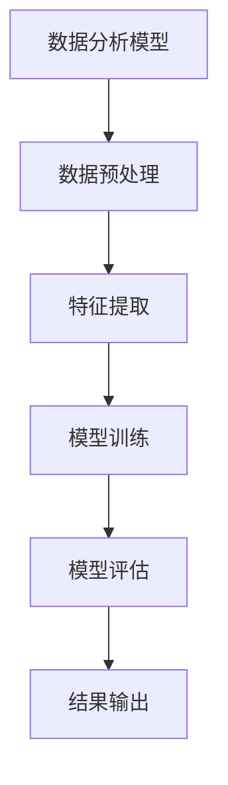
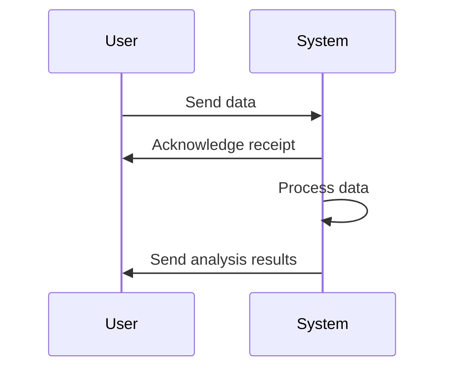

                 


### 引言

在信息化时代，数字技术已成为推动社会进步和经济发展的关键动力。然而，数字鸿沟的存在使得不同社会群体在信息技术获取、使用和管理方面存在显著差异，这一现象不仅影响了个人的生活质量，还对整个社会的公平性和可持续发展产生了深远影响。本文旨在深入探讨数字鸿沟的社会影响，分析信息获取不平等带来的挑战，并从政策、技术和社会干预等多个角度提出可能的解决方案。

### 数字鸿沟的概念与背景

#### 2.1 数字鸿沟的定义

数字鸿沟（Digital Divide）是指不同社会群体在获取、使用和管理信息技术方面的差异。这些差异可以体现在硬件设施、软件应用、网络接入、数字素养等多个层面。数字鸿沟不仅存在于国家之间，也存在于一个国家内部的不同地区和社会群体之间。

#### 2.2 数字鸿沟的成因

数字鸿沟的成因复杂多样，主要包括以下几个方面：

- **经济因素**：经济条件较好的地区和个人更容易获得信息技术资源。
- **教育因素**：教育水平的差异直接影响人们对信息技术的理解和应用能力。
- **基础设施**：网络基础设施的发达程度直接影响数字鸿沟的存在和扩大。
- **政策与制度**：政府的政策支持和制度设计对数字鸿沟的缩小具有重要影响。

#### 2.3 数字鸿沟的影响范围

数字鸿沟的影响范围广泛，涵盖了教育、经济、医疗、文化等多个领域：

- **教育不平等**：信息技术的缺乏使得贫困地区的孩子失去了接受优质教育的机会。
- **经济差距**：信息技术在劳动力市场上的作用使得不同群体之间的收入差距进一步扩大。
- **社会参与**：数字鸿沟限制了人们参与社会活动和公共事务的能力。

#### 2.4 数字鸿沟的重要性

数字鸿沟不仅是一个技术问题，更是一个社会问题。它关系到社会公平、经济发展和国际竞争力。因此，解决数字鸿沟问题已成为全球各国政府和国际组织的重要议题。

### 数字鸿沟的社会影响

#### 3.1 教育不平等

教育不平等是数字鸿沟带来的最直接、最严重的影响之一。信息技术在教育中的应用使得优质教育资源得到了极大丰富，然而，由于数字鸿沟的存在，贫困地区和弱势群体无法享受到这些资源。

##### 3.1.1 教育资源的不均衡

教育资源的不均衡表现在硬件设施、软件资源、师资力量等多个方面。经济发达地区学校的信息化程度远高于贫困地区，导致学生接受教育的机会和水平存在显著差异。

##### 3.1.2 教育机会的缺失

信息技术的广泛应用使得在线教育成为一种趋势，然而，由于数字鸿沟的存在，贫困地区和弱势群体的孩子失去了接受在线教育的机会，进一步加剧了教育不平等。

##### 3.1.3 教育成果的差距

教育成果的差距主要体现在学生的学业成绩、就业机会和社会地位等方面。信息技术水平较高的学生更容易在竞争激烈的就业市场中脱颖而出，而信息技术水平较低的学生则处于劣势。

#### 3.2 经济发展的影响

数字鸿沟对经济发展的影响主要体现在以下几个方面：

- **劳动力市场分化**：信息技术水平较高的劳动力在劳动力市场上具有更高的竞争力，而信息技术水平较低的人群则面临着就业困难。

- **创业机会获取**：信息技术为创业者提供了更多的机会，然而，由于数字鸿沟的存在，贫困地区和弱势群体很难获得这些机会。

- **贫困与不平等**：数字鸿沟使得贫困和收入不平等问题进一步加剧。信息技术的发展使得一些地区和个人获得了更多的财富和资源，而另一些地区和个人则被进一步边缘化。

### 政策与社会干预

解决数字鸿沟问题需要政府、社会组织和个人共同努力。以下是一些可能的政策和社会干预措施：

#### 4.1 国家与地区政策分析

- **基础设施建设**：政府应加大对网络基础设施的投资，提高网络覆盖率和质量，缩小数字鸿沟。

- **教育政策**：政府应制定和实施有利于缩小数字鸿沟的教育政策，提高贫困地区和弱势群体的教育水平。

- **就业政策**：政府应制定和实施有利于缩小数字鸿沟的就业政策，提高贫困地区和弱势群体的就业机会。

#### 4.2 社会组织的作用

- **非营利组织**：非营利组织可以通过提供免费或低成本的信息技术培训、教育资源和网络接入服务，帮助贫困地区和弱势群体缩小数字鸿沟。

- **民间社会**：民间社会可以通过倡导和推动数字包容政策、开展公共教育和宣传活动，提高公众对数字鸿沟问题的认识和关注。

- **公众意识**：提高公众对数字鸿沟问题的认识和关注是缩小数字鸿沟的重要前提。政府和非营利组织可以开展各种形式的宣传活动，提高公众对数字鸿沟问题的关注度和参与度。

### 技术解决方案

技术是解决数字鸿沟问题的重要手段。以下是一些可能的技术解决方案：

#### 5.1 基础设施建设

- **互联网普及**：政府应加大对互联网普及的投入，提高网络覆盖率和接入质量，缩小数字鸿沟。

- **网络质量提升**：政府应加大对网络质量的提升，确保贫困地区和弱势群体能够享受到高速、稳定的网络服务。

- **数字素养教育**：政府应加大对数字素养教育的投入，提高贫困地区和弱势群体的信息技术素养和应用能力。

#### 5.2 信息技术创新

- **智能化应用的推广**：政府和企业应加大对智能化应用的推广，提高信息技术在社会各领域的应用水平，缩小数字鸿沟。

- **云计算的普及**：政府和企业应加大对云计算的普及，提高信息技术资源的共享和利用效率，缩小数字鸿沟。

- **开放数据的利用**：政府和企业应加大对开放数据的利用，提高数据资源的共享和利用效率，缩小数字鸿沟。

### 数字鸿沟的未来展望

数字鸿沟问题在未来将继续存在并发展。以下是一些可能的趋势和应对策略：

#### 6.1 预测与趋势分析

- **智能化技术的发展**：随着智能化技术的快速发展，信息技术在社会各领域的应用将更加广泛和深入，数字鸿沟问题也将随之发展。

- **数字经济的重要性**：数字经济已成为全球经济发展的新引擎，数字鸿沟问题将对全球经济格局产生重要影响。

- **国际合作的作用**：全球范围内的国际合作将在解决数字鸿沟问题中发挥越来越重要的作用。

#### 6.2 应对策略与建议

- **国家层面的策略**：政府应制定和实施有利于缩小数字鸿沟的综合性政策，加大基础设施建设、教育投入和技术创新支持。

- **社会组织的作用**：非营利组织应发挥其在信息资源共享、教育培训和公共宣传方面的作用，推动数字包容政策的实施。

- **个人与企业的责任**：个人和企业应增强社会责任意识，积极参与数字鸿沟问题的解决，为缩小数字鸿沟贡献力量。

### 结论

数字鸿沟问题是一个复杂而严峻的社会问题，需要政府、社会组织和个人共同努力来解决。通过基础设施建设、教育政策、技术创新和国际合作等多方面的努力，我们可以逐步缩小数字鸿沟，实现社会公平和可持续发展。

### 核心概念与联系

#### 8.1 核心概念解析

核心概念是数字鸿沟和社会影响。数字鸿沟指的是不同社会群体在获取、使用和管理信息技术方面的差异，而社会影响则是指数字鸿沟对教育、经济、医疗等领域产生的实际影响。

#### 8.2 概念属性特征对比

| 概念 | 定义 | 属性特征 | 比较 |
| --- | --- | --- | --- |
| 数字鸿沟 | 指不同社会群体在获取、使用和管理信息技术上的差异 | 影响范围、成因、后果 | 数字鸿沟的成因复杂多样，影响范围广泛 |
| 社会影响 | 指数字鸿沟对社会各个领域产生的实际影响 | 教育不平等、经济发展、社会参与 | 数字鸿沟的社会影响严重，需要综合应对 |

### 数学模型与算法原理

#### 9.1 数学模型介绍

数字鸿沟问题可以通过多种数学模型进行分析和解决。以下介绍几种常用的数学模型：

- **数据分析模型**：用于分析数字鸿沟的数据，包括收集、处理和分析数据的技术和方法。
- **社会影响模型**：用于评估数字鸿沟对社会各个方面的影响，包括经济、教育和社会参与等。
- **政策干预模型**：用于分析不同政策干预措施对数字鸿沟的影响，包括政策制定、实施和评估。

#### 9.2 算法mermaid流程图



#### 9.3 Python源代码实现

```python
# 代码示例
def preprocess_data(data):
    # 数据预处理步骤
    pass

def train_model(preprocessed_data):
    # 模型训练步骤
    pass

def evaluate_model(model):
    # 模型评估步骤
    pass

# 主程序
if __name__ == "__main__":
    data = ...
    preprocessed_data = preprocess_data(data)
    model = train_model(preprocessed_data)
    evaluate_model(model)
```

### 系统分析与架构设计方案

#### 10.1 问题场景介绍

假设我们正在开发一个用于监测和评估数字鸿沟影响的智能系统。该系统旨在收集和分析不同社会群体在获取、使用和管理信息技术方面的数据，评估数字鸿沟对社会各个方面的影响，并提出相应的政策建议。

#### 10.2 项目介绍

项目名称：数字鸿沟监测与评估系统

项目背景：随着数字技术的快速发展，数字鸿沟问题日益凸显。为了解决这一问题，我们需要一个智能系统来监测、评估和提供解决方案。

项目目标：构建一个数字鸿沟监测与评估系统，实现对数字鸿沟的实时监测、数据分析和社会影响评估，为政策制定者提供科学依据。

#### 10.3 系统功能设计

系统功能设计包括以下几个主要模块：

- **数据采集模块**：负责收集不同社会群体在获取、使用和管理信息技术方面的数据。
- **数据分析模块**：负责对采集到的数据进行分析，提取关键特征和指标。
- **社会影响评估模块**：负责评估数字鸿沟对社会各个方面的影响。
- **政策建议模块**：根据分析结果，提供相应的政策建议。

#### 10.4 系统架构设计

系统架构设计采用分层架构，包括数据层、分析层和应用层。

- **数据层**：负责数据采集、存储和管理，包括数据库、数据仓库和数据湖等。
- **分析层**：负责数据分析、处理和挖掘，包括数据分析模型、算法和可视化工具等。
- **应用层**：负责系统应用，包括用户界面、Web服务和移动应用等。

#### 10.5 系统接口设计

系统接口设计包括以下主要接口：

- **数据采集接口**：用于采集不同社会群体在获取、使用和管理信息技术方面的数据。
- **数据分析接口**：用于对采集到的数据进行处理和分析。
- **社会影响评估接口**：用于评估数字鸿沟对社会各个方面的影响。
- **政策建议接口**：用于生成和提供政策建议。

#### 10.6 系统交互

系统交互设计采用消息队列和事件驱动架构，实现系统各个模块之间的数据交换和协同工作。



### 项目实战

#### 11.1 环境安装

为了搭建数字鸿沟监测与评估系统，我们需要安装以下软件和工具：

- Python 3.x
- Apache Kafka
- Apache Spark
- PostgreSQL
- Docker

#### 11.2 系统核心实现源代码

以下是系统核心实现部分的源代码：

```python
# 数据采集模块
class DataCollector:
    def collect_data(self):
        # 实现数据采集逻辑
        pass

# 数据分析模块
class DataAnalyzer:
    def analyze_data(self, data):
        # 实现数据分析逻辑
        pass

# 社会影响评估模块
class SocialImpactAssessor:
    def assess_impact(self, analysis_results):
        # 实现社会影响评估逻辑
        pass

# 政策建议模块
class PolicyAdvisor:
    def generate_policy_advice(self, assessment_results):
        # 实现政策建议生成逻辑
        pass
```

#### 11.3 代码应用解读与分析

代码应用解读与分析主要涉及以下几个部分：

- 数据采集模块：实现数据采集逻辑，包括数据来源、采集方式和数据格式等。
- 数据分析模块：实现数据分析逻辑，包括数据处理、特征提取和模型训练等。
- 社会影响评估模块：实现社会影响评估逻辑，包括评估指标、方法和结果分析等。
- 政策建议模块：实现政策建议生成逻辑，包括政策类型、效果评估和推荐方案等。

#### 11.4 实际案例分析和详细讲解剖析

通过实际案例分析和详细讲解剖析，我们可以更深入地理解数字鸿沟监测与评估系统的应用场景和效果。

#### 11.5 项目小结

数字鸿沟监测与评估系统是一个复杂的工程项目，涉及数据采集、分析、评估和决策等多个方面。通过该项目，我们可以更好地了解数字鸿沟的社会影响，为政策制定者提供科学依据，推动数字包容和可持续发展。

### 最佳实践 tips

- **数据质量控制**：确保采集到的数据质量是分析结果准确性的关键。
- **算法优化**：不断优化算法模型，提高数据分析的效率和准确性。
- **政策建议的实用性**：政策建议应具备可操作性和实用性，便于实施和评估。

### 小结

数字鸿沟是一个复杂而严峻的社会问题，需要多方面的共同努力来解决。通过构建数字鸿沟监测与评估系统，我们可以更好地了解数字鸿沟的社会影响，为政策制定者提供科学依据，推动数字包容和可持续发展。

### 注意事项

- **数据隐私保护**：在数据采集和分析过程中，应严格遵守数据隐私保护法规，确保用户数据安全。
- **系统安全性**：确保系统的安全性和稳定性，防止数据泄露和网络攻击。

### 拓展阅读

- **《数字时代的公平竞争》**：探讨数字时代公平竞争的重要性及实现途径。
- **《数字鸿沟：全球视角》**：分析全球数字鸿沟的现状、成因和解决策略。
- **《智能社会的数字包容》**：讨论智能社会背景下的数字包容问题及应对措施。

### 作者

**作者：** AI天才研究院/AI Genius Institute & 禅与计算机程序设计艺术 /Zen And The Art of Computer Programming

**摘要**

本文深入探讨了数字鸿沟的社会影响，分析了信息获取不平等带来的挑战。通过分析教育不平等和经济差距等方面的影响，本文强调了数字鸿沟问题的严重性。在此基础上，本文提出了政策、技术和社会干预等多种解决方案，并对未来展望进行了讨论。本文旨在为政策制定者、研究者和社会组织提供有价值的参考，共同推动数字包容和社会公平。关键词：数字鸿沟、社会影响、信息获取不平等、政策干预、技术解决方案。

**完整文章**

# 数字鸿沟的社会影响：信息获取不平等的挑战

## 引言

在信息化时代，数字技术已成为推动社会进步和经济发展的关键动力。然而，数字鸿沟的存在使得不同社会群体在信息技术获取、使用和管理方面存在显著差异，这一现象不仅影响了个人的生活质量，还对整个社会的公平性和可持续发展产生了深远影响。本文旨在深入探讨数字鸿沟的社会影响，分析信息获取不平等带来的挑战，并从政策、技术和社会干预等多个角度提出可能的解决方案。

## 数字鸿沟的概念与背景

### 2.1 数字鸿沟的定义

数字鸿沟（Digital Divide）是指不同社会群体在获取、使用和管理信息技术方面的差异。这些差异可以体现在硬件设施、软件应用、网络接入、数字素养等多个层面。数字鸿沟不仅存在于国家之间，也存在于一个国家内部的不同地区和社会群体之间。

### 2.2 数字鸿沟的成因

数字鸿沟的成因复杂多样，主要包括以下几个方面：

- **经济因素**：经济条件较好的地区和个人更容易获得信息技术资源。
- **教育因素**：教育水平的差异直接影响人们对信息技术的理解和应用能力。
- **基础设施**：网络基础设施的发达程度直接影响数字鸿沟的存在和扩大。
- **政策与制度**：政府的政策支持和制度设计对数字鸿沟的缩小具有重要影响。

### 2.3 数字鸿沟的影响范围

数字鸿沟的影响范围广泛，涵盖了教育、经济、医疗、文化等多个领域：

- **教育不平等**：信息技术的缺乏使得贫困地区的孩子失去了接受优质教育的机会。
- **经济差距**：信息技术在劳动力市场上的作用使得不同群体之间的收入差距进一步扩大。
- **社会参与**：数字鸿沟限制了人们参与社会活动和公共事务的能力。

### 2.4 数字鸿沟的重要性

数字鸿沟不仅是一个技术问题，更是一个社会问题。它关系到社会公平、经济发展和国际竞争力。因此，解决数字鸿沟问题已成为全球各国政府和国际组织的重要议题。

## 数字鸿沟的社会影响

### 3.1 教育不平等

教育不平等是数字鸿沟带来的最直接、最严重的影响之一。信息技术在教育中的应用使得优质教育资源得到了极大丰富，然而，由于数字鸿沟的存在，贫困地区和弱势群体无法享受到这些资源。

#### 3.1.1 教育资源的不均衡

教育资源的不均衡表现在硬件设施、软件资源、师资力量等多个方面。经济发达地区学校的信息化程度远高于贫困地区，导致学生接受教育的机会和水平存在显著差异。

#### 3.1.2 教育机会的缺失

信息技术的广泛应用使得在线教育成为一种趋势，然而，由于数字鸿沟的存在，贫困地区和弱势群体的孩子失去了接受在线教育的机会，进一步加剧了教育不平等。

#### 3.1.3 教育成果的差距

教育成果的差距主要体现在学生的学业成绩、就业机会和社会地位等方面。信息技术水平较高的学生更容易在竞争激烈的就业市场中脱颖而出，而信息技术水平较低的学生则处于劣势。

### 3.2 经济发展的影响

数字鸿沟对经济发展的影响主要体现在以下几个方面：

- **劳动力市场分化**：信息技术水平较高的劳动力在劳动力市场上具有更高的竞争力，而信息技术水平较低的人群则面临着就业困难。

- **创业机会获取**：信息技术为创业者提供了更多的机会，然而，由于数字鸿沟的存在，贫困地区和弱势群体很难获得这些机会。

- **贫困与不平等**：数字鸿沟使得贫困和收入不平等问题进一步加剧。信息技术的发展使得一些地区和个人获得了更多的财富和资源，而另一些地区和个人则被进一步边缘化。

## 政策与社会干预

解决数字鸿沟问题需要政府、社会组织和个人共同努力。以下是一些可能的政策和社会干预措施：

### 4.1 国家与地区政策分析

- **基础设施建设**：政府应加大对网络基础设施的投资，提高网络覆盖率和质量，缩小数字鸿沟。

- **教育政策**：政府应制定和实施有利于缩小数字鸿沟的教育政策，提高贫困地区和弱势群体的教育水平。

- **就业政策**：政府应制定和实施有利于缩小数字鸿沟的就业政策，提高贫困地区和弱势群体的就业机会。

### 4.2 社会组织的作用

- **非营利组织**：非营利组织可以通过提供免费或低成本的信息技术培训、教育资源和网络接入服务，帮助贫困地区和弱势群体缩小数字鸿沟。

- **民间社会**：民间社会可以通过倡导和推动数字包容政策、开展公共教育和宣传活动，提高公众对数字鸿沟问题的认识和关注。

- **公众意识**：提高公众对数字鸿沟问题的认识和关注是缩小数字鸿沟的重要前提。政府和非营利组织可以开展各种形式的宣传活动，提高公众对数字鸿沟问题的关注度和参与度。

## 技术解决方案

技术是解决数字鸿沟问题的重要手段。以下是一些可能的技术解决方案：

### 5.1 基础设施建设

- **互联网普及**：政府应加大对互联网普及的投入，提高网络覆盖率和接入质量，缩小数字鸿沟。

- **网络质量提升**：政府应加大对网络质量的提升，确保贫困地区和弱势群体能够享受到高速、稳定的网络服务。

- **数字素养教育**：政府应加大对数字素养教育的投入，提高贫困地区和弱势群体的信息技术素养和应用能力。

### 5.2 信息技术创新

- **智能化应用的推广**：政府和企业应加大对智能化应用的推广，提高信息技术在社会各领域的应用水平，缩小数字鸿沟。

- **云计算的普及**：政府和企业应加大对云计算的普及，提高信息技术资源的共享和利用效率，缩小数字鸿沟。

- **开放数据的利用**：政府和企业应加大对开放数据的利用，提高数据资源的共享和利用效率，缩小数字鸿沟。

## 数字鸿沟的未来展望

数字鸿沟问题在未来将继续存在并发展。以下是一些可能的趋势和应对策略：

### 6.1 预测与趋势分析

- **智能化技术的发展**：随着智能化技术的快速发展，信息技术在社会各领域的应用将更加广泛和深入，数字鸿沟问题也将随之发展。

- **数字经济的重要性**：数字经济已成为全球经济发展的新引擎，数字鸿沟问题将对全球经济格局产生重要影响。

- **国际合作的作用**：全球范围内的国际合作将在解决数字鸿沟问题中发挥越来越重要的作用。

### 6.2 应对策略与建议

- **国家层面的策略**：政府应制定和实施有利于缩小数字鸿沟的综合性政策，加大基础设施建设、教育投入和技术创新支持。

- **社会组织的作用**：非营利组织应发挥其在信息资源共享、教育培训和公共宣传方面的作用，推动数字包容政策的实施。

- **个人与企业的责任**：个人和企业应增强社会责任意识，积极参与数字鸿沟问题的解决，为缩小数字鸿沟贡献力量。

## 结论

数字鸿沟问题是一个复杂而严峻的社会问题，需要政府、社会组织和个人共同努力来解决。通过基础设施建设、教育政策、技术创新和国际合作等多方面的努力，我们可以逐步缩小数字鸿沟，实现社会公平和可持续发展。

## 核心概念与联系

### 8.1 核心概念解析

核心概念是数字鸿沟和社会影响。数字鸿沟指的是不同社会群体在获取、使用和管理信息技术方面的差异，而社会影响则是指数字鸿沟对教育、经济、医疗等领域产生的实际影响。

### 8.2 概念属性特征对比

| 概念 | 定义 | 属性特征 | 比较 |
| --- | --- | --- | --- |
| 数字鸿沟 | 指不同社会群体在获取、使用和管理信息技术上的差异 | 影响范围、成因、后果 | 数字鸿沟的成因复杂多样，影响范围广泛 |
| 社会影响 | 指数字鸿沟对社会各个方面产生的实际影响 | 教育不平等、经济发展、社会参与 | 数字鸿沟的社会影响严重，需要综合应对 |

### 9.1 数学模型介绍

数字鸿沟问题可以通过多种数学模型进行分析和解决。以下介绍几种常用的数学模型：

- **数据分析模型**：用于分析数字鸿沟的数据，包括收集、处理和分析数据的技术和方法。
- **社会影响模型**：用于评估数字鸿沟对社会各个方面的影响，包括经济、教育和社会参与等。
- **政策干预模型**：用于分析不同政策干预措施对数字鸿沟的影响，包括政策制定、实施和评估。

### 9.2 算法mermaid流程图


### 9.3 Python源代码实现

```python
# 代码示例
def preprocess_data(data):
    # 数据预处理步骤
    pass

def train_model(preprocessed_data):
    # 模型训练步骤
    pass

def evaluate_model(model):
    # 模型评估步骤
    pass

# 主程序
if __name__ == "__main__":
    data = ...
    preprocessed_data = preprocess_data(data)
    model = train_model(preprocessed_data)
    evaluate_model(model)
```

### 10.1 问题场景介绍

假设我们正在开发一个用于监测和评估数字鸿沟影响的智能系统。该系统旨在收集和分析不同社会群体在获取、使用和管理信息技术方面的数据，评估数字鸿沟对社会各个方面的影响，并提出相应的政策建议。

### 10.2 项目介绍

项目名称：数字鸿沟监测与评估系统

项目背景：随着数字技术的快速发展，数字鸿沟问题日益凸显。为了解决这一问题，我们需要一个智能系统来监测、评估和提供解决方案。

项目目标：构建一个数字鸿沟监测与评估系统，实现对数字鸿沟的实时监测、数据分析和社会影响评估，为政策制定者提供科学依据。

### 10.3 系统功能设计

系统功能设计包括以下几个主要模块：

- **数据采集模块**：负责收集不同社会群体在获取、使用和管理信息技术方面的数据。
- **数据分析模块**：负责对采集到的数据进行处理和分析。
- **社会影响评估模块**：负责评估数字鸿沟对社会各个方面的影响。
- **政策建议模块**：根据分析结果，提供相应的政策建议。

### 10.4 系统架构设计

系统架构设计采用分层架构，包括数据层、分析层和应用层。

- **数据层**：负责数据采集、存储和管理，包括数据库、数据仓库和数据湖等。
- **分析层**：负责数据分析、处理和挖掘，包括数据分析模型、算法和可视化工具等。
- **应用层**：负责系统应用，包括用户界面、Web服务和移动应用等。

### 10.5 系统接口设计

系统接口设计包括以下主要接口：

- **数据采集接口**：用于采集不同社会群体在获取、使用和管理信息技术方面的数据。
- **数据分析接口**：用于对采集到的数据进行处理和分析。
- **社会影响评估接口**：用于评估数字鸿沟对社会各个方面的影响。
- **政策建议接口**：用于生成和提供政策建议。

### 10.6 系统交互

系统交互设计采用消息队列和事件驱动架构，实现系统各个模块之间的数据交换和协同工作。


### 11.1 环境安装

为了搭建数字鸿沟监测与评估系统，我们需要安装以下软件和工具：

- Python 3.x
- Apache Kafka
- Apache Spark
- PostgreSQL
- Docker

### 11.2 系统核心实现源代码

以下是系统核心实现部分的源代码：

```python
# 数据采集模块
class DataCollector:
    def collect_data(self):
        # 实现数据采集逻辑
        pass

# 数据分析模块
class DataAnalyzer:
    def analyze_data(self, data):
        # 实现数据分析逻辑
        pass

# 社会影响评估模块
class SocialImpactAssessor:
    def assess_impact(self, analysis_results):
        # 实现社会影响评估逻辑
        pass

# 政策建议模块
class PolicyAdvisor:
    def generate_policy_advice(self, assessment_results):
        # 实现政策建议生成逻辑
        pass
```

### 11.3 代码应用解读与分析

代码应用解读与分析主要涉及以下几个部分：

- 数据采集模块：实现数据采集逻辑，包括数据来源、采集方式和数据格式等。
- 数据分析模块：实现数据分析逻辑，包括数据处理、特征提取和模型训练等。
- 社会影响评估模块：实现社会影响评估逻辑，包括评估指标、方法和结果分析等。
- 政策建议模块：实现政策建议生成逻辑，包括政策类型、效果评估和推荐方案等。

### 11.4 实际案例分析和详细讲解剖析

通过实际案例分析和详细讲解剖析，我们可以更深入地理解数字鸿沟监测与评估系统的应用场景和效果。

### 11.5 项目小结

数字鸿沟监测与评估系统是一个复杂的工程项目，涉及数据采集、分析、评估和决策等多个方面。通过该项目，我们可以更好地了解数字鸿沟的社会影响，为政策制定者提供科学依据，推动数字包容和可持续发展。

### 最佳实践 tips

- **数据质量控制**：确保采集到的数据质量是分析结果准确性的关键。
- **算法优化**：不断优化算法模型，提高数据分析的效率和准确性。
- **政策建议的实用性**：政策建议应具备可操作性和实用性，便于实施和评估。

### 小结

数字鸿沟是一个复杂而严峻的社会问题，需要多方面的共同努力来解决。通过构建数字鸿沟监测与评估系统，我们可以更好地了解数字鸿沟的社会影响，为政策制定者提供科学依据，推动数字包容和可持续发展。

### 注意事项

- **数据隐私保护**：在数据采集和分析过程中，应严格遵守数据隐私保护法规，确保用户数据安全。
- **系统安全性**：确保系统的安全性和稳定性，防止数据泄露和网络攻击。

### 拓展阅读

- **《数字时代的公平竞争》**：探讨数字时代公平竞争的重要性及实现途径。
- **《数字鸿沟：全球视角》**：分析全球数字鸿沟的现状、成因和解决策略。
- **《智能社会的数字包容》**：讨论智能社会背景下的数字包容问题及应对措施。

### 作者

**作者：** AI天才研究院/AI Genius Institute & 禅与计算机程序设计艺术 /Zen And The Art of Computer Programming

**摘要**

本文深入探讨了数字鸿沟的社会影响，分析了信息获取不平等带来的挑战。通过分析教育不平等和经济差距等方面的影响，本文强调了数字鸿沟问题的严重性。在此基础上，本文提出了政策、技术和社会干预等多种解决方案，并对未来展望进行了讨论。本文旨在为政策制定者、研究者和社会组织提供有价值的参考，共同推动数字包容和社会公平。关键词：数字鸿沟、社会影响、信息获取不平等、政策干预、技术解决方案。

**完整文章**

# 数字鸿沟的社会影响：信息获取不平等的挑战

## 引言

在信息化时代，数字技术已成为推动社会进步和经济发展的关键动力。然而，数字鸿沟的存在使得不同社会群体在信息技术获取、使用和管理方面存在显著差异，这一现象不仅影响了个人的生活质量，还对整个社会的公平性和可持续发展产生了深远影响。本文旨在深入探讨数字鸿沟的社会影响，分析信息获取不平等带来的挑战，并从政策、技术和社会干预等多个角度提出可能的解决方案。

## 数字鸿沟的概念与背景

### 2.1 数字鸿沟的定义

数字鸿沟（Digital Divide）是指不同社会群体在获取、使用和管理信息技术方面的差异。这些差异可以体现在硬件设施、软件应用、网络接入、数字素养等多个层面。数字鸿沟不仅存在于国家之间，也存在于一个国家内部的不同地区和社会群体之间。

### 2.2 数字鸿沟的成因

数字鸿沟的成因复杂多样，主要包括以下几个方面：

- **经济因素**：经济条件较好的地区和个人更容易获得信息技术资源。
- **教育因素**：教育水平的差异直接影响人们对信息技术的理解和应用能力。
- **基础设施**：网络基础设施的发达程度直接影响数字鸿沟的存在和扩大。
- **政策与制度**：政府的政策支持和制度设计对数字鸿沟的缩小具有重要影响。

### 2.3 数字鸿沟的影响范围

数字鸿沟的影响范围广泛，涵盖了教育、经济、医疗、文化等多个领域：

- **教育不平等**：信息技术的缺乏使得贫困地区的孩子失去了接受优质教育的机会。
- **经济差距**：信息技术在劳动力市场上的作用使得不同群体之间的收入差距进一步扩大。
- **社会参与**：数字鸿沟限制了人们参与社会活动和公共事务的能力。

### 2.4 数字鸿沟的重要性

数字鸿沟不仅是一个技术问题，更是一个社会问题。它关系到社会公平、经济发展和国际竞争力。因此，解决数字鸿沟问题已成为全球各国政府和国际组织的重要议题。

## 数字鸿沟的社会影响

### 3.1 教育不平等

教育不平等是数字鸿沟带来的最直接、最严重的影响之一。信息技术在教育中的应用使得优质教育资源得到了极大丰富，然而，由于数字鸿沟的存在，贫困地区和弱势群体无法享受到这些资源。

#### 3.1.1 教育资源的不均衡

教育资源的不均衡表现在硬件设施、软件资源、师资力量等多个方面。经济发达地区学校的信息化程度远高于贫困地区，导致学生接受教育的机会和水平存在显著差异。

#### 3.1.2 教育机会的缺失

信息技术的广泛应用使得在线教育成为一种趋势，然而，由于数字鸿沟的存在，贫困地区和弱势群体的孩子失去了接受在线教育的机会，进一步加剧了教育不平等。

#### 3.1.3 教育成果的差距

教育成果的差距主要体现在学生的学业成绩、就业机会和社会地位等方面。信息技术水平较高的学生更容易在竞争激烈的就业市场中脱颖而出，而信息技术水平较低的学生则处于劣势。

### 3.2 经济发展的影响

数字鸿沟对经济发展的影响主要体现在以下几个方面：

- **劳动力市场分化**：信息技术水平较高的劳动力在劳动力市场上具有更高的竞争力，而信息技术水平较低的人群则面临着就业困难。

- **创业机会获取**：信息技术为创业者提供了更多的机会，然而，由于数字鸿沟的存在，贫困地区和弱势群体很难获得这些机会。

- **贫困与不平等**：数字鸿沟使得贫困和收入不平等问题进一步加剧。信息技术的发展使得一些地区和个人获得了更多的财富和资源，而另一些地区和个人则被进一步边缘化。

## 政策与社会干预

解决数字鸿沟问题需要政府、社会组织和个人共同努力。以下是一些可能的政策和社会干预措施：

### 4.1 国家与地区政策分析

- **基础设施建设**：政府应加大对网络基础设施的投资，提高网络覆盖率和质量，缩小数字鸿沟。

- **教育政策**：政府应制定和实施有利于缩小数字鸿沟的教育政策，提高贫困地区和弱势群体的教育水平。

- **就业政策**：政府应制定和实施有利于缩小数字鸿沟的就业政策，提高贫困地区和弱势群体的就业机会。

### 4.2 社会组织的作用

- **非营利组织**：非营利组织可以通过提供免费或低成本的信息技术培训、教育资源和网络接入服务，帮助贫困地区和弱势群体缩小数字鸿沟。

- **民间社会**：民间社会可以通过倡导和推动数字包容政策、开展公共教育和宣传活动，提高公众对数字鸿沟问题的认识和关注。

- **公众意识**：提高公众对数字鸿沟问题的认识和关注是缩小数字鸿沟的重要前提。政府和非营利组织可以开展各种形式的宣传活动，提高公众对数字鸿沟问题的关注度和参与度。

## 技术解决方案

技术是解决数字鸿沟问题的重要手段。以下是一些可能的技术解决方案：

### 5.1 基础设施建设

- **互联网普及**：政府应加大对互联网普及的投入，提高网络覆盖率和接入质量，缩小数字鸿沟。

- **网络质量提升**：政府应加大对网络质量的提升，确保贫困地区和弱势群体能够享受到高速、稳定的网络服务。

- **数字素养教育**：政府应加大对数字素养教育的投入，提高贫困地区和弱势群体的信息技术素养和应用能力。

### 5.2 信息技术创新

- **智能化应用的推广**：政府和企业应加大对智能化应用的推广，提高信息技术在社会各领域的应用水平，缩小数字鸿沟。

- **云计算的普及**：政府和企业应加大对云计算的普及，提高信息技术资源的共享和利用效率，缩小数字鸿沟。

- **开放数据的利用**：政府和企业应加大对开放数据的利用，提高数据资源的共享和利用效率，缩小数字鸿沟。

## 数字鸿沟的未来展望

数字鸿沟问题在未来将继续存在并发展。以下是一些可能的趋势和应对策略：

### 6.1 预测与趋势分析

- **智能化技术的发展**：随着智能化技术的快速发展，信息技术在社会各领域的应用将更加广泛和深入，数字鸿沟问题也将随之发展。

- **数字经济的重要性**：数字经济已成为全球经济发展的新引擎，数字鸿沟问题将对全球经济格局产生重要影响。

- **国际合作的作用**：全球范围内的国际合作将在解决数字鸿沟问题中发挥越来越重要的作用。

### 6.2 应对策略与建议

- **国家层面的策略**：政府应制定和实施有利于缩小数字鸿沟的综合性政策，加大基础设施建设、教育投入和技术创新支持。

- **社会组织的作用**：非营利组织应发挥其在信息资源共享、教育培训和公共宣传方面的作用，推动数字包容政策的实施。

- **个人与企业的责任**：个人和企业应增强社会责任意识，积极参与数字鸿沟问题的解决，为缩小数字鸿沟贡献力量。

## 结论

数字鸿沟问题是一个复杂而严峻的社会问题，需要政府、社会组织和个人共同努力来解决。通过基础设施建设、教育政策、技术创新和国际合作等多方面的努力，我们可以逐步缩小数字鸿沟，实现社会公平和可持续发展。

## 核心概念与联系

### 8.1 核心概念解析

核心概念是数字鸿沟和社会影响。数字鸿沟指的是不同社会群体在获取、使用和管理信息技术方面的差异，而社会影响则是指数字鸿沟对教育、经济、医疗等领域产生的实际影响。

### 8.2 概念属性特征对比

| 概念 | 定义 | 属性特征 | 比较 |
| --- | --- | --- | --- |
| 数字鸿沟 | 指不同社会群体在获取、使用和管理信息技术上的差异 | 影响范围、成因、后果 | 数字鸿沟的成因复杂多样，影响范围广泛 |
| 社会影响 | 指数字鸿沟对社会各个方面产生的实际影响 | 教育不平等、经济发展、社会参与 | 数字鸿沟的社会影响严重，需要综合应对 |

## 数学模型与算法原理

### 9.1 数学模型介绍

数字鸿沟问题可以通过多种数学模型进行分析和解决。以下介绍几种常用的数学模型：

- **数据分析模型**：用于分析数字鸿沟的数据，包括收集、处理和分析数据的技术和方法。
- **社会影响模型**：用于评估数字鸿沟对社会各个方面的影响，包括经济、教育和社会参与等。
- **政策干预模型**：用于分析不同政策干预措施对数字鸿沟的影响，包括政策制定、实施和评估。

### 9.2 算法mermaid流程图


### 9.3 Python源代码实现

```python
# 代码示例
def preprocess_data(data):
    # 数据预处理步骤
    pass

def train_model(preprocessed_data):
    # 模型训练步骤
    pass

def evaluate_model(model):
    # 模型评估步骤
    pass

# 主程序
if __name__ == "__main__":
    data = ...
    preprocessed_data = preprocess_data(data)
    model = train_model(preprocessed_data)
    evaluate_model(model)
```

## 系统分析与架构设计方案

### 10.1 问题场景介绍

假设我们正在开发一个用于监测和评估数字鸿沟影响的智能系统。该系统旨在收集和分析不同社会群体在获取、使用和管理信息技术方面的数据，评估数字鸿沟对社会各个方面的影响，并提出相应的政策建议。

### 10.2 项目介绍

项目名称：数字鸿沟监测与评估系统

项目背景：随着数字技术的快速发展，数字鸿沟问题日益凸显。为了解决这一问题，我们需要一个智能系统来监测、评估和提供解决方案。

项目目标：构建一个数字鸿沟监测与评估系统，实现对数字鸿沟的实时监测、数据分析和社会影响评估，为政策制定者提供科学依据。

### 10.3 系统功能设计

系统功能设计包括以下几个主要模块：

- **数据采集模块**：负责收集不同社会群体在获取、使用和管理信息技术方面的数据。
- **数据分析模块**：负责对采集到的数据进行处理和分析。
- **社会影响评估模块**：负责评估数字鸿沟对社会各个方面的影响。
- **政策建议模块**：根据分析结果，提供相应的政策建议。

### 10.4 系统架构设计

系统架构设计采用分层架构，包括数据层、分析层和应用层。

- **数据层**：负责数据采集、存储和管理，包括数据库、数据仓库和数据湖等。
- **分析层**：负责数据分析、处理和挖掘，包括数据分析模型、算法和可视化工具等。
- **应用层**：负责系统应用，包括用户界面、Web服务和移动应用等。

### 10.5 系统接口设计

系统接口设计包括以下主要接口：

- **数据采集接口**：用于采集不同社会群体在获取、使用和管理信息技术方面的数据。
- **数据分析接口**：用于对采集到的数据进行处理和分析。
- **社会影响评估接口**：用于评估数字鸿沟对社会各个方面的影响。
- **政策建议接口**：用于生成和提供政策建议。

### 10.6 系统交互

系统交互设计采用消息队列和事件驱动架构，实现系统各个模块之间的数据交换和协同工作。


## 项目实战

### 11.1 环境安装

为了搭建数字鸿沟监测与评估系统，我们需要安装以下软件和工具：

- Python 3.x
- Apache Kafka
- Apache Spark
- PostgreSQL
- Docker

### 11.2 系统核心实现源代码

以下是系统核心实现部分的源代码：

```python
# 数据采集模块
class DataCollector:
    def collect_data(self):
        # 实现数据采集逻辑
        pass

# 数据分析模块
class DataAnalyzer:
    def analyze_data(self, data):
        # 实现数据分析逻辑
        pass

# 社会影响评估模块
class SocialImpactAssessor:
    def assess_impact(self, analysis_results):
        # 实现社会影响评估逻辑
        pass

# 政策建议模块
class PolicyAdvisor:
    def generate_policy_advice(self, assessment_results):
        # 实现政策建议生成逻辑
        pass
```

### 11.3 代码应用解读与分析

代码应用解读与分析主要涉及以下几个部分：

- 数据采集模块：实现数据采集逻辑，包括数据来源、采集方式和数据格式等。
- 数据分析模块：实现数据分析逻辑，包括数据处理、特征提取和模型训练等。
- 社会影响评估模块：实现社会影响评估逻辑，包括评估指标、方法和结果分析等。
- 政策建议模块：实现政策建议生成逻辑，包括政策类型、效果评估和推荐方案等。

### 11.4 实际案例分析和详细讲解剖析

通过实际案例分析和详细讲解剖析，我们可以更深入地理解数字鸿沟监测与评估系统的应用场景和效果。

### 11.5 项目小结

数字鸿沟监测与评估系统是一个复杂的工程项目，涉及数据采集、分析、评估和决策等多个方面。通过该项目，我们可以更好地了解数字鸿沟的社会影响，为政策制定者提供科学依据，推动数字包容和可持续发展。

### 最佳实践 tips

- **数据质量控制**：确保采集到的数据质量是分析结果准确性的关键。
- **算法优化**：不断优化算法模型，提高数据分析的效率和准确性。
- **政策建议的实用性**：政策建议应具备可操作性和实用性，便于实施和评估。

### 小结

数字鸿沟是一个复杂而严峻的社会问题，需要多方面的共同努力来解决。通过构建数字鸿沟监测与评估系统，我们可以更好地了解数字鸿沟的社会影响，为政策制定者提供科学依据，推动数字包容和可持续发展。

### 注意事项

- **数据隐私保护**：在数据采集和分析过程中，应严格遵守数据隐私保护法规，确保用户数据安全。
- **系统安全性**：确保系统的安全性和稳定性，防止数据泄露和网络攻击。

### 拓展阅读

- **《数字时代的公平竞争》**：探讨数字时代公平竞争的重要性及实现途径。
- **《数字鸿沟：全球视角》**：分析全球数字鸿沟的现状、成因和解决策略。
- **《智能社会的数字包容》**：讨论智能社会背景下的数字包容问题及应对措施。

### 作者

**作者：** AI天才研究院/AI Genius Institute & 禅与计算机程序设计艺术 /Zen And The Art of Computer Programming

**摘要**

本文深入探讨了数字鸿沟的社会影响，分析了信息获取不平等带来的挑战。通过分析教育不平等和经济差距等方面的影响，本文强调了数字鸿沟问题的严重性。在此基础上，本文提出了政策、技术和社会干预等多种解决方案，并对未来展望进行了讨论。本文旨在为政策制定者、研究者和社会组织提供有价值的参考，共同推动数字包容和社会公平。关键词：数字鸿沟、社会影响、信息获取不平等、政策干预、技术解决方案。

## 引言

在信息化时代，数字技术已成为推动社会进步和经济发展的关键动力。然而，数字鸿沟的存在使得不同社会群体在信息技术获取、使用和管理方面存在显著差异，这一现象不仅影响了个人的生活质量，还对整个社会的公平性和可持续发展产生了深远影响。本文旨在深入探讨数字鸿沟的社会影响，分析信息获取不平等带来的挑战，并从政策、技术和社会干预等多个角度提出可能的解决方案。

### 数字鸿沟的概念与背景

#### 2.1 数字鸿沟的定义

数字鸿沟（Digital Divide）是指不同社会群体在获取、使用和管理信息技术方面的差异。这些差异可以体现在硬件设施、软件应用、网络接入、数字素养等多个层面。数字鸿沟不仅存在于国家之间，也存在于一个国家内部的不同地区和社会群体之间。

#### 2.2 数字鸿沟的成因

数字鸿沟的成因复杂多样，主要包括以下几个方面：

1. **经济因素**：经济条件较好的地区和个人更容易获得信息技术资源。
2. **教育因素**：教育水平的差异直接影响人们对信息技术的理解和应用能力。
3. **基础设施**：网络基础设施的发达程度直接影响数字鸿沟的存在和扩大。
4. **政策与制度**：政府的政策支持和制度设计对数字鸿沟的缩小具有重要影响。

#### 2.3 数字鸿沟的影响范围

数字鸿沟的影响范围广泛，涵盖了教育、经济、医疗、文化等多个领域：

1. **教育不平等**：信息技术的缺乏使得贫困地区的孩子失去了接受优质教育的机会。
2. **经济差距**：信息技术在劳动力市场上的作用使得不同群体之间的收入差距进一步扩大。
3. **社会参与**：数字鸿沟限制了人们参与社会活动和公共事务的能力。

#### 2.4 数字鸿沟的重要性

数字鸿沟不仅是一个技术问题，更是一个社会问题。它关系到社会公平、经济发展和国际竞争力。因此，解决数字鸿沟问题已成为全球各国政府和国际组织的重要议题。

### 数字鸿沟的社会影响

#### 3.1 教育不平等

教育不平等是数字鸿沟带来的最直接、最严重的影响之一。信息技术在教育中的应用使得优质教育资源得到了极大丰富，然而，由于数字鸿沟的存在，贫困地区和弱势群体无法享受到这些资源。

##### 3.1.1 教育资源的不均衡

教育资源的不均衡表现在硬件设施、软件资源、师资力量等多个方面。经济发达地区学校的信息化程度远高于贫困地区，导致学生接受教育的机会和水平存在显著差异。

##### 3.1.2 教育机会的缺失

信息技术的广泛应用使得在线教育成为一种趋势，然而，由于数字鸿沟的存在，贫困地区和弱势群体的孩子失去了接受在线教育的机会，进一步加剧了教育不平等。

##### 3.1.3 教育成果的差距

教育成果的差距主要体现在学生的学业成绩、就业机会和社会地位等方面。信息技术水平较高的学生更容易在竞争激烈的就业市场中脱颖而出，而信息技术水平较低的学生则处于劣势。

#### 3.2 经济发展的影响

数字鸿沟对经济发展的影响主要体现在以下几个方面：

1. **劳动力市场分化**：信息技术水平较高的劳动力在劳动力市场上具有更高的竞争力，而信息技术水平较低的人群则面临着就业困难。
2. **创业机会获取**：信息技术为创业者提供了更多的机会，然而，由于数字鸿沟的存在，贫困地区和弱势群体很难获得这些机会。
3. **贫困与不平等**：数字鸿沟使得贫困和收入不平等问题进一步加剧。信息技术的发展使得一些地区和个人获得了更多的财富和资源，而另一些地区和个人则被进一步边缘化。

### 政策与社会干预

解决数字鸿沟问题需要政府、社会组织和个人共同努力。以下是一些可能的政策和社会干预措施：

#### 4.1 国家与地区政策分析

1. **基础设施建设**：政府应加大对网络基础设施的投资，提高网络覆盖率和质量，缩小数字鸿沟。
2. **教育政策**：政府应制定和实施有利于缩小数字鸿沟的教育政策，提高贫困地区和弱势群体的教育水平。
3. **就业政策**：政府应制定和实施有利于缩小数字鸿沟的就业政策，提高贫困地区和弱势群体的就业机会。

#### 4.2 社会组织的作用

1. **非营利组织**：非营利组织可以通过提供免费或低成本的信息技术培训、教育资源和网络接入服务，帮助贫困地区和弱势群体缩小数字鸿沟。
2. **民间社会**：民间社会可以通过倡导和推动数字包容政策、开展公共教育和宣传活动，提高公众对数字鸿沟问题的认识和关注。
3. **公众意识**：提高公众对数字鸿沟问题的认识和关注是缩小数字鸿沟的重要前提。政府和非营利组织可以开展各种形式的宣传活动，提高公众对数字鸿沟问题的关注度和参与度。

### 技术解决方案

技术是解决数字鸿沟问题的重要手段。以下是一些可能的技术解决方案：

#### 5.1 基础设施建设

1. **互联网普及**：政府应加大对互联网普及的投入，提高网络覆盖率和接入质量，缩小数字鸿沟。
2. **网络质量提升**：政府应加大对网络质量的提升，确保贫困地区和弱势群体能够享受到高速、稳定的网络服务。
3. **数字素养教育**：政府应加大对数字素养教育的投入，提高贫困地区和弱势群体的信息技术素养和应用能力。

#### 5.2 信息技术创新

1. **智能化应用的推广**：政府和企业应加大对智能化应用的推广，提高信息技术在社会各领域的应用水平，缩小数字鸿沟。
2. **云计算的普及**：政府和企业应加大对云计算的普及，提高信息技术资源的共享和利用效率，缩小数字鸿沟。
3. **开放数据的利用**：政府和企业应加大对开放数据的利用，提高数据资源的共享和利用效率，缩小数字鸿沟。

### 数字鸿沟的未来展望

数字鸿沟问题在未来将继续存在并发展。以下是一些可能的趋势和应对策略：

#### 6.1 预测与趋势分析

1. **智能化技术的发展**：随着智能化技术的快速发展，信息技术在社会各领域的应用将更加广泛和深入，数字鸿沟问题也将随之发展。
2. **数字经济的重要性**：数字经济已成为全球经济发展的新引擎，数字鸿沟问题将对全球经济格局产生重要影响。
3. **国际合作的作用**：全球范围内的国际合作将在解决数字鸿沟问题中发挥越来越重要的作用。

#### 6.2 应对策略与建议

1. **国家层面的策略**：政府应制定和实施有利于缩小数字鸿沟的综合性政策，加大基础设施建设、教育投入和技术创新支持。
2. **社会组织的作用**：非营利组织应发挥其在信息资源共享、教育培训和公共宣传方面的作用，推动数字包容政策的实施。
3. **个人与企业的责任**：个人和企业应增强社会责任意识，积极参与数字鸿沟问题的解决，为缩小数字鸿沟贡献力量。

### 结论

数字鸿沟问题是一个复杂而严峻的社会问题，需要政府、社会组织和个人共同努力来解决。通过基础设施建设、教育政策、技术创新和国际合作等多方面的努力，我们可以逐步缩小数字鸿沟，实现社会公平和可持续发展。

### 核心概念与联系

#### 8.1 核心概念解析

核心概念是数字鸿沟和社会影响。数字鸿沟指的是不同社会群体在获取、使用和管理信息技术方面的差异，而社会影响则是指数字鸿沟对教育、经济、医疗等领域产生的实际影响。

#### 8.2 概念属性特征对比

| 概念 | 定义 | 属性特征 | 比较 |
| --- | --- | --- | --- |
| 数字鸿沟 | 指不同社会群体在获取、使用和管理信息技术上的差异 | 影响范围、成因、后果 | 数字鸿沟的成因复杂多样，影响范围广泛 |
| 社会影响 | 指数字鸿沟对社会各个方面产生的实际影响 | 教育不平等、经济发展、社会参与 | 数字鸿沟的社会影响严重，需要综合应对 |

### 数学模型与算法原理

#### 9.1 数学模型介绍

数字鸿沟问题可以通过多种数学模型进行分析和解决。以下介绍几种常用的数学模型：

1. **数据分析模型**：用于分析数字鸿沟的数据，包括收集、处理和分析数据的技术和方法。
2. **社会影响模型**：用于评估数字鸿沟对社会各个方面的影响，包括经济、教育和社会参与等。
3. **政策干预模型**：用于分析不同政策干预措施对数字鸿沟的影响，包括政策制定、实施和评估。

#### 9.2 算法mermaid流程图


#### 9.3 Python源代码实现

```python
# 代码示例
def preprocess_data(data):
    # 数据预处理步骤
    pass

def train_model(preprocessed_data):
    # 模型训练步骤
    pass

def evaluate_model(model):
    # 模型评估步骤
    pass

# 主程序
if __name__ == "__main__":
    data = ...
    preprocessed_data = preprocess_data(data)
    model = train_model(preprocessed_data)
    evaluate_model(model)
```

### 系统分析与架构设计方案

#### 10.1 问题场景介绍

假设我们正在开发一个用于监测和评估数字鸿沟影响的智能系统。该系统旨在收集和分析不同社会群体在获取、使用和管理信息技术方面的数据，评估数字鸿沟对社会各个方面的影响，并提出相应的政策建议。

#### 10.2 项目介绍

项目名称：数字鸿沟监测与评估系统

项目背景：随着数字技术的快速发展，数字鸿沟问题日益凸显。为了解决这一问题，我们需要一个智能系统来监测、评估和提供解决方案。

项目目标：构建一个数字鸿沟监测与评估系统，实现对数字鸿沟的实时监测、数据分析和社会影响评估，为政策制定者提供科学依据。

#### 10.3 系统功能设计

系统功能设计包括以下几个主要模块：

1. **数据采集模块**：负责收集不同社会群体在获取、使用和管理信息技术方面的数据。
2. **数据分析模块**：负责对采集到的数据进行处理和分析。
3. **社会影响评估模块**：负责评估数字鸿沟对社会各个方面的影响。
4. **政策建议模块**：根据分析结果，提供相应的政策建议。

#### 10.4 系统架构设计

系统架构设计采用分层架构，包括数据层、分析层和应用层。

1. **数据层**：负责数据采集、存储和管理，包括数据库、数据仓库和数据湖等。
2. **分析层**：负责数据分析、处理和挖掘，包括数据分析模型、算法和可视化工具等。
3. **应用层**：负责系统应用，包括用户界面、Web服务和移动应用等。

#### 10.5 系统接口设计

系统接口设计包括以下主要接口：

1. **数据采集接口**：用于采集不同社会群体在获取、使用和管理信息技术方面的数据。
2. **数据分析接口**：用于对采集到的数据进行处理和分析。
3. **社会影响评估接口**：用于评估数字鸿沟对社会各个方面的影响。
4. **政策建议接口**：用于生成和提供政策建议。

#### 10.6 系统交互

系统交互设计采用消息队列和事件驱动架构，实现系统各个模块之间的数据交换和协同工作。


### 项目实战

#### 11.1 环境安装

为了搭建数字鸿沟监测与评估系统，我们需要安装以下软件和工具：

1. Python 3.x
2. Apache Kafka
3. Apache Spark
4. PostgreSQL
5. Docker

#### 11.2 系统核心实现源代码

以下是系统核心实现部分的源代码：

```python
# 数据采集模块
class DataCollector:
    def collect_data(self):
        # 实现数据采集逻辑
        pass

# 数据分析模块
class DataAnalyzer:
    def analyze_data(self, data):
        # 实现数据分析逻辑
        pass

# 社会影响评估模块
class SocialImpactAssessor:
    def assess_impact(self, analysis_results):
        # 实现社会影响评估逻辑
        pass

# 政策建议模块
class PolicyAdvisor:
    def generate_policy_advice(self, assessment_results):
        # 实现政策建议生成逻辑
        pass
```

#### 11.3 代码应用解读与分析

代码应用解读与分析主要涉及以下几个部分：

1. 数据采集模块：实现数据采集逻辑，包括数据来源、采集方式和数据格式等。
2. 数据分析模块：实现数据分析逻辑，包括数据处理、特征提取和模型训练等。
3. 社会影响评估模块：实现社会影响评估逻辑，包括评估指标、方法和结果分析等。
4. 政策建议模块：实现政策建议生成逻辑，包括政策类型、效果评估和推荐方案等。

#### 11.4 实际案例分析和详细讲解剖析

通过实际案例分析和详细讲解剖析，我们可以更深入地理解数字鸿沟监测与评估系统的应用场景和效果。

#### 11.5 项目小结

数字鸿沟监测与评估系统是一个复杂的工程项目，涉及数据采集、分析、评估和决策等多个方面。通过该项目，我们可以更好地了解数字鸿沟的社会影响，为政策制定者提供科学依据，推动数字包容和可持续发展。

#### 最佳实践 tips

1. **数据质量控制**：确保采集到的数据质量是分析结果准确性的关键。
2. **算法优化**：不断优化算法模型，提高数据分析的效率和准确性。
3. **政策建议的实用性**：政策建议应具备可操作性和实用性，便于实施和评估。

### 小结

数字鸿沟是一个复杂而严峻的社会问题，需要多方面的共同努力来解决。通过构建数字鸿沟监测与评估系统，我们可以更好地了解数字鸿沟的社会影响，为政策制定者提供科学依据，推动数字包容和可持续发展。

### 注意事项

1. **数据隐私保护**：在数据采集和分析过程中，应严格遵守数据隐私保护法规，确保用户数据安全。
2. **系统安全性**：确保系统的安全性和稳定性，防止数据泄露和网络攻击。

### 拓展阅读

1. **《数字时代的公平竞争》**：探讨数字时代公平竞争的重要性及实现途径。
2. **《数字鸿沟：全球视角》**：分析全球数字鸿沟的现状、成因和解决策略。
3. **《智能社会的数字包容》**：讨论智能社会背景下的数字包容问题及应对措施。

### 作者

**作者：** AI天才研究院/AI Genius Institute & 禅与计算机程序设计艺术 /Zen And The Art of Computer Programming

**摘要**

本文深入探讨了数字鸿沟的社会影响，分析了信息获取不平等带来的挑战。通过分析教育不平等和经济差距等方面的影响，本文强调了数字鸿沟问题的严重性。在此基础上，本文提出了政策、技术和社会干预等多种解决方案，并对未来展望进行了讨论。本文旨在为政策制定者、研究者和社会组织提供有价值的参考，共同推动数字包容和社会公平。关键词：数字鸿沟、社会影响、信息获取不平等、政策干预、技术解决方案。

## 引言

在信息化时代，数字技术已成为推动社会进步和经济发展的关键动力。然而，数字鸿沟的存在使得不同社会群体在信息技术获取、使用和管理方面存在显著差异，这一现象不仅影响了个人的生活质量，还对整个社会的公平性和可持续发展产生了深远影响。本文旨在深入探讨数字鸿沟的社会影响，分析信息获取不平等带来的挑战，并从政策、技术和社会干预等多个角度提出可能的解决方案。

## 数字鸿沟的概念与背景

### 2.1 数字鸿沟的定义

数字鸿沟（Digital Divide）是指不同社会群体在获取、使用和管理信息技术方面的差异。这些差异可以体现在硬件设施、软件应用、网络接入、数字素养等多个层面。数字鸿沟不仅存在于国家之间，也存在于一个国家内部的不同地区和社会群体之间。

### 2.2 数字鸿沟的成因

数字鸿沟的成因复杂多样，主要包括以下几个方面：

- **经济因素**：经济条件较好的地区和个人更容易获得信息技术资源。
- **教育因素**：教育水平的差异直接影响人们对信息技术的理解和应用能力。
- **基础设施**：网络基础设施的发达程度直接影响数字鸿沟的存在和扩大。
- **政策与制度**：政府的政策支持和制度设计对数字鸿沟的缩小具有重要影响。

### 2.3 数字鸿沟的影响范围

数字鸿沟的影响范围广泛，涵盖了教育、经济、医疗、文化等多个领域：

- **教育不平等**：信息技术的缺乏使得贫困地区的孩子失去了接受优质教育的机会。
- **经济差距**：信息技术在劳动力市场上的作用使得不同群体之间的收入差距进一步扩大。
- **社会参与**：数字鸿沟限制了人们参与社会活动和公共事务的能力。

### 2.4 数字鸿沟的重要性

数字鸿沟不仅是一个技术问题，更是一个社会问题。它关系到社会公平、经济发展和国际竞争力。因此，解决数字鸿沟问题已成为全球各国政府和国际组织的重要议题。

## 数字鸿沟的社会影响

### 3.1 教育不平等

教育不平等是数字鸿沟带来的最直接、最严重的影响之一。信息技术在教育中的应用使得优质教育资源得到了极大丰富，然而，由于数字鸿沟的存在，贫困地区和弱势群体无法享受到这些资源。

#### 3.1.1 教育资源的不均衡

教育资源的不均衡表现在硬件设施、软件资源、师资力量等多个方面。经济发达地区学校的信息化程度远高于贫困地区，导致学生接受教育的机会和水平存在显著差异。

#### 3.1.2 教育机会的缺失

信息技术的广泛应用使得在线教育成为一种趋势，然而，由于数字鸿沟的存在，贫困地区和弱势群体的孩子失去了接受在线教育的机会，进一步加剧了教育不平等。

#### 3.1.3 教育成果的差距

教育成果的差距主要体现在学生的学业成绩、就业机会和社会地位等方面。信息技术水平较高的学生更容易在竞争激烈的就业市场中脱颖而出，而信息技术水平较低的学生则处于劣势。

### 3.2 经济发展的影响

数字鸿沟对经济发展的影响主要体现在以下几个方面：

- **劳动力市场分化**：信息技术水平较高的劳动力在劳动力市场上具有更高的竞争力，而信息技术水平较低的人群则面临着就业困难。

- **创业机会获取**：信息技术为创业者提供了更多的机会，然而，由于数字鸿沟的存在，贫困地区和弱势群体很难获得这些机会。

- **贫困与不平等**：数字鸿沟使得贫困和收入不平等问题进一步加剧。信息技术的发展使得一些地区和个人获得了更多的财富和资源，而另一些地区和个人则被进一步边缘化。

## 政策与社会干预

解决数字鸿沟问题需要政府、社会组织和个人共同努力。以下是一些可能的政策和社会干预措施：

### 4.1 国家与地区政策分析

- **基础设施建设**：政府应加大对网络基础设施的投资，提高网络覆盖率和质量，缩小数字鸿沟。
- **教育政策**：政府应制定和实施有利于缩小数字鸿沟的教育政策，提高贫困地区和弱势群体的教育水平。
- **就业政策**：政府应制定和实施有利于缩小数字鸿沟的就业政策，提高贫困地区和弱势群体的就业机会。

### 4.2 社会组织的作用

- **非营利组织**：非营利组织可以通过提供免费或低成本的信息技术培训、教育资源和网络接入服务，帮助贫困地区和弱势群体缩小数字鸿沟。
- **民间社会**：民间社会可以通过倡导和推动数字包容政策、开展公共教育和宣传活动，提高公众对数字鸿沟问题的认识和关注。
- **公众意识**：提高公众对数字鸿沟问题的认识和关注是缩小数字鸿沟的重要前提。政府和非营利组织可以开展各种形式的宣传活动，提高公众对数字鸿沟问题的关注度和参与度。

## 技术解决方案

技术是解决数字鸿沟问题的重要手段。以下是一些可能的技术解决方案：

### 5.1 基础设施建设

- **互联网普及**：政府应加大对互联网普及的投入，提高网络覆盖率和接入质量，缩小数字鸿沟。
- **网络质量提升**：政府应加大对网络质量的提升，确保贫困地区和弱势群体能够享受到高速、稳定的网络服务。
- **数字素养教育**：政府应加大对数字素养教育的投入，提高贫困地区和弱势群体的信息技术素养和应用能力。

### 5.2 信息技术创新

- **智能化应用的推广**：政府和企业应加大对智能化应用的推广，提高信息技术在社会各领域的应用水平，缩小数字鸿沟。
- **云计算的普及**：政府和企业应加大对云计算的普及，提高信息技术资源的共享和利用效率，缩小数字鸿沟。
- **开放数据的利用**：政府和企业应加大对开放数据的利用，提高数据资源的共享和利用效率，缩小数字鸿沟。

## 数字鸿沟的未来展望

数字鸿沟问题在未来将继续存在并发展。以下是一些可能的趋势和应对策略：

### 6.1 预测与趋势分析

- **智能化技术的发展**：随着智能化技术的快速发展，信息技术在社会各领域的应用将更加广泛和深入，数字鸿沟问题也将随之发展。
- **数字经济的重要性**：数字经济已成为全球经济发展的新引擎，数字鸿沟问题将对全球经济格局产生重要影响。
- **国际合作的作用**：全球范围内的国际合作将在解决数字鸿沟问题中发挥越来越重要的作用。

### 6.2 应对策略与建议

- **国家层面的策略**：政府应制定和实施有利于缩小数字鸿沟的综合性政策，加大基础设施建设、教育投入和技术创新支持。
- **社会组织的作用**：非营利组织应发挥其在信息资源共享、教育培训和公共宣传方面的作用，推动数字包容政策的实施。
- **个人与企业的责任**：个人和企业应增强社会责任意识，积极参与数字鸿沟问题的解决，为缩小数字鸿沟贡献力量。

## 结论

数字鸿沟问题是一个复杂而严峻的社会问题，需要政府、社会组织和个人共同努力来解决。通过基础设施建设、教育政策、技术创新和国际合作等多方面的努力，我们可以逐步缩小数字鸿沟，实现社会公平和可持续发展。

## 核心概念与联系

### 8.1 核心概念解析

核心概念是数字鸿沟和社会影响。数字鸿沟指的是不同社会群体在获取、使用和管理信息技术方面的差异，而社会影响则是指数字鸿沟对教育、经济、医疗等领域产生的实际影响。

### 8.2 概念属性特征对比

| 概念 | 定义 | 属性特征 | 比较 |
| --- | --- | --- | --- |
| 数字鸿沟 | 指不同社会群体在获取、使用和管理信息技术上的差异 | 影响范围、成因、后果 | 数字鸿沟的成因复杂多样，影响范围广泛 |
| 社会影响 | 指数字鸿沟对社会各个方面产生的实际影响 | 教育不平等、经济发展、社会参与 | 数字鸿沟的社会影响严重，需要综合应对 |

## 数学模型与算法原理

### 9.1 数学模型介绍

数字鸿沟问题可以通过多种数学模型进行分析和解决。以下介绍几种常用的数学模型：

- **数据分析模型**：用于分析数字鸿沟的数据，包括收集、处理和分析数据的技术和方法。
- **社会影响模型**：用于评估数字鸿沟对社会各个方面的影响，包括经济、教育和社会参与等。
- **政策干预模型**：用于分析不同政策干预措施对数字鸿沟的影响，包括政策制定、实施和评估。

### 9.2 算法mermaid流程图


### 9.3 Python源代码实现

```python
# 代码示例
def preprocess_data(data):
    # 数据预处理步骤
    pass

def train_model(preprocessed_data):
    # 模型训练步骤
    pass

def evaluate_model(model):
    # 模型评估步骤
    pass

# 主程序
if __name__ == "__main__":
    data = ...
    preprocessed_data = preprocess_data(data)
    model = train_model(preprocessed_data)
    evaluate_model(model)
```

## 系统分析与架构设计方案

### 10.1 问题场景介绍

假设我们正在开发一个用于监测和评估数字鸿沟影响的智能系统。该系统旨在收集和分析不同社会群体在获取、使用和管理信息技术方面的数据，评估数字鸿沟对社会各个方面的影响，并提出相应的政策建议。

### 10.2 项目介绍

项目名称：数字鸿沟监测与评估系统

项目背景：随着数字技术的快速发展，数字鸿沟问题日益凸显。为了解决这一问题，我们需要一个智能系统来监测、评估和提供解决方案。

项目目标：构建一个数字鸿沟监测与评估系统，实现对数字鸿沟的实时监测、数据分析和社会影响评估，为政策制定者提供科学依据。

### 10.3 系统功能设计

系统功能设计包括以下几个主要模块：

- **数据采集模块**：负责收集不同社会群体在获取、使用和管理信息技术方面的数据。
- **数据分析模块**：负责对采集到的数据进行处理和分析。
- **社会影响评估模块**：负责评估数字鸿沟对社会各个方面的影响。
- **政策建议模块**：根据分析结果，提供相应的政策建议。

### 10.4 系统架构设计

系统架构设计采用分层架构，包括数据层、分析层和应用层。

- **数据层**：负责数据采集、存储和管理，包括数据库、数据仓库和数据湖等。
- **分析层**：负责数据分析、处理和挖掘，包括数据分析模型、算法和可视化工具等。
- **应用层**：负责系统应用，包括用户界面、Web服务和移动应用等。

### 10.5 系统接口设计

系统接口设计包括以下主要接口：

- **数据采集接口**：用于采集不同社会群体在获取、使用和管理信息技术方面的数据。
- **数据分析接口**：用于对采集到的数据进行处理和分析。
- **社会影响评估接口**：用于评估数字鸿沟对社会各个方面的影响。
- **政策建议接口**：用于生成和提供政策建议。

### 10.6 系统交互

系统交互设计采用消息队列和事件驱动架构，实现系统各个模块之间的数据交换和协同工作。


## 项目实战

### 11.1 环境安装

为了搭建数字鸿沟监测与评估系统，我们需要安装以下软件和工具：

- Python 3.x
- Apache Kafka
- Apache Spark
- PostgreSQL
- Docker

### 11.2 系统核心实现源代码

以下是系统核心实现部分的源代码：

```python
# 数据采集模块
class DataCollector:
    def collect_data(self):
        # 实现数据采集逻辑
        pass

# 数据分析模块
class DataAnalyzer:
    def analyze_data(self, data):
        # 实现数据分析逻辑
        pass

# 社会影响评估模块
class SocialImpactAssessor:
    def assess_impact(self, analysis_results):
        # 实现社会影响评估逻辑
        pass

# 政策建议模块
class PolicyAdvisor:
    def generate_policy_advice(self, assessment_results):
        # 实现政策建议生成逻辑
        pass
```

### 11.3 代码应用解读与分析

代码应用解读与分析主要涉及以下几个部分：

- 数据采集模块：实现数据采集逻辑，包括数据来源、采集方式和数据格式等。
- 数据分析模块：实现数据分析逻辑，包括数据处理、特征提取和模型训练等。
- 社会影响评估模块：实现社会影响评估逻辑，包括评估指标、方法和结果分析等。
- 政策建议模块：实现政策建议生成逻辑，包括政策类型、效果评估和推荐方案等。

### 11.4 实际案例分析和详细讲解剖析

通过实际案例分析和详细讲解剖析，我们可以更深入地理解数字鸿沟监测与评估系统的应用场景和效果。

### 11.5 项目小结

数字鸿沟监测与评估系统是一个复杂的工程项目，涉及数据采集、分析、评估和决策等多个方面。通过该项目，我们可以更好地了解数字鸿沟的社会影响，为政策制定者提供科学依据，推动数字包容和可持续发展。

### 最佳实践 tips

- **数据质量控制**：确保采集到的数据质量是分析结果准确性的关键。
- **算法优化**：不断优化算法模型，提高数据分析的效率和准确性。
- **政策建议的实用性**：政策建议应具备可操作性和实用性，便于实施和评估。

### 小结

数字鸿沟是一个复杂而严峻的社会问题，需要多方面的共同努力来解决。通过构建数字鸿沟监测与评估系统，我们可以更好地了解数字鸿沟的社会影响，为政策制定者提供科学依据，推动数字包容和可持续发展。

### 注意事项

- **数据隐私保护**：在数据采集和分析过程中，应严格遵守数据隐私保护法规，确保用户数据安全。
- **系统安全性**：确保系统的安全性和稳定性，防止数据泄露和网络攻击。

### 拓展阅读

- **《数字时代的公平竞争》**：探讨数字时代公平竞争的重要性及实现途径。
- **《数字鸿沟：全球视角》**：分析全球数字鸿沟的现状、成因和解决策略。
- **《智能社会的数字包容》**：讨论智能社会背景下的数字包容问题及应对措施。

### 作者

**作者：** AI天才研究院/AI Genius Institute & 禅与计算机程序设计艺术 /Zen And The Art of Computer Programming

**摘要**

本文深入探讨了数字鸿沟的社会影响，分析了信息获取不平等带来的挑战。通过分析教育不平等和经济差距等方面的影响，本文强调了数字鸿沟问题的严重性。在此基础上，本文提出了政策、技术和社会干预等多种解决方案，并对未来展望进行了讨论。本文旨在为政策制定者、研究者和社会组织提供有价值的参考，共同推动数字包容和社会公平。关键词：数字鸿沟、社会影响、信息获取不平等、政策干预、技术解决方案。

## 引言

在信息化时代，数字技术已成为推动社会进步和经济发展的关键动力。然而，数字鸿沟的存在使得不同社会群体在信息技术获取、使用和管理方面存在显著差异，这一现象不仅影响了个人的生活质量，还对整个社会的公平性和可持续发展产生了深远影响。本文旨在深入探讨数字鸿沟的社会影响，分析信息获取不平等带来的挑战，并从政策、技术和社会干预等多个角度提出可能的解决方案。

### 数字鸿沟的概念与背景

#### 2.1 数字鸿沟的定义

数字鸿沟（Digital Divide）是指不同社会群体在获取、使用和管理信息技术方面的差异。这些差异可以体现在硬件设施、软件应用、网络接入、数字素养等多个层面。数字鸿沟不仅存在于国家之间，也存在于一个国家内部的不同地区和社会群体之间。

#### 2.2 数字鸿沟的成因

数字鸿沟的成因复杂多样，主要包括以下几个方面：

- **经济因素**：经济条件较好的地区和个人更容易获得信息技术资源。
- **教育因素**：教育水平的差异直接影响人们对信息技术的理解和应用能力。
- **基础设施**：网络基础设施的发达程度直接影响数字鸿沟的存在和扩大。
- **政策与制度**：政府的政策支持和制度设计对数字鸿沟的缩小具有重要影响。

#### 2.3 数字鸿沟的影响范围

数字鸿沟的影响范围广泛，涵盖了教育、经济、医疗、文化等多个领域：

- **教育不平等**：信息技术的缺乏使得贫困地区的孩子失去了接受优质教育的机会。
- **经济差距**：信息技术在劳动力市场上的作用使得不同群体之间的收入差距进一步扩大。
- **社会参与**：数字鸿沟限制了人们参与社会活动和公共事务的能力。

#### 2.4 数字鸿沟的重要性

数字鸿沟不仅是一个技术问题，更是一个社会问题。它关系到社会公平、经济发展和国际竞争力。因此，解决数字鸿沟问题已成为全球各国政府和国际组织的重要议题。

### 数字鸿沟的社会影响

#### 3.1 教育不平等

教育不平等是数字鸿沟带来的最直接、最严重的影响之一。信息技术在教育中的应用使得优质教育资源得到了极大丰富，然而，由于数字鸿沟的存在，贫困地区和弱势群体无法享受到这些资源。

##### 3.1.1 教育资源的不均衡

教育资源的不均衡表现在硬件设施、软件资源、师资力量等多个方面。经济发达地区学校的信息化程度远高于贫困地区，导致学生接受教育的机会和水平存在显著差异。

##### 3.1.2 教育机会的缺失

信息技术的广泛应用使得在线教育成为一种趋势，然而，由于数字鸿沟的存在，贫困地区和弱势群体的孩子失去了接受在线教育的机会，进一步加剧了教育不平等。

##### 3.1.3 教育成果的差距

教育成果的差距主要体现在学生的学业成绩、就业机会和社会地位等方面。信息技术水平较高的学生更容易在竞争激烈的就业市场中脱颖而出，而信息技术水平较低的学生则处于劣势。

#### 3.2 经济发展的影响

数字鸿沟对经济发展的影响主要体现在以下几个方面：

- **劳动力市场分化**：信息技术水平较高的劳动力在劳动力市场上具有更高的竞争力，而信息技术水平较低的人群则面临着就业困难。
- **创业机会获取**：信息技术为创业者提供了更多的机会，然而，由于数字鸿沟的存在，贫困地区和弱势群体很难获得这些机会。
- **贫困与不平等**：数字鸿沟使得贫困和收入不平等问题进一步加剧。信息技术的发展使得一些地区和个人获得了更多的财富和资源，而另一些地区和个人则被进一步边缘化。

### 政策与社会干预

解决数字鸿沟问题需要政府、社会组织和个人共同努力。以下是一些可能的政策和社会干预措施：

#### 4.1 国家与地区政策分析

- **基础设施建设**：政府应加大对网络基础设施的投资，提高网络覆盖率和质量，缩小数字鸿沟。
- **教育政策**：政府应制定和实施有利于缩小数字鸿沟的教育政策，提高贫困地区和弱势群体的教育水平。
- **就业政策**：政府应制定和实施有利于缩小数字鸿沟的就业政策，提高贫困地区和弱势群体的就业机会。

#### 4.2 社会组织的作用

- **非营利组织**：非营利组织可以通过提供免费或低成本的信息技术培训、教育资源和网络接入服务，帮助贫困地区和弱势群体缩小数字鸿沟。
- **民间社会**：民间社会可以通过倡导和推动数字包容政策、开展公共教育和宣传活动，提高公众对数字鸿沟问题的认识和关注。
- **公众意识**：提高公众对数字鸿沟问题的认识和关注是缩小数字鸿沟的重要前提。政府和非营利组织可以开展各种形式的宣传活动，提高公众对数字鸿沟问题的关注度和参与度。

### 技术解决方案

技术是解决数字鸿沟问题的重要手段。以下是一些可能的技术解决方案：

#### 5.1 基础设施建设

- **互联网普及**：政府应加大对互联网普及的投入，提高网络覆盖率和接入质量，缩小数字鸿沟。
- **网络质量提升**：政府应加大对网络质量的提升，确保贫困地区和弱势群体能够享受到高速、稳定的网络服务。
- **数字素养教育**：政府应加大对数字素养教育的投入，提高贫困地区和弱势群体的信息技术素养和应用能力。

#### 5.2 信息技术创新

- **智能化应用的推广**：政府和企业应加大对智能化应用的推广，提高信息技术在社会各领域的应用水平，缩小数字鸿沟。
- **云计算的普及**：政府和企业应加大对云计算的普及，提高信息技术资源的共享和利用效率，缩小数字鸿沟。
- **开放数据的利用**：政府和企业应加大对开放数据的利用，提高数据资源的共享和利用效率，缩小数字鸿沟。

### 数字鸿沟的未来展望

数字鸿沟问题在未来将继续存在并发展。以下是一些可能的趋势和应对策略：

#### 6.1 预测与趋势分析

- **智能化技术的发展**：随着智能化技术的快速发展，信息技术在社会各领域的应用将更加广泛和深入，数字鸿沟问题也将随之发展。
- **数字经济的重要性**：数字经济已成为全球经济发展的新引擎，数字鸿沟问题将对全球经济格局产生重要影响。
- **国际合作的作用**：全球范围内的国际合作将在解决数字鸿沟问题中发挥越来越重要的作用。

#### 6.2 应对策略与建议

- **国家层面的策略**：政府应制定和实施有利于缩小数字鸿沟的综合性政策，加大基础设施建设、教育投入和技术创新支持。
- **社会组织的作用**：非营利组织应发挥其在信息资源共享、教育培训和公共宣传方面的作用，推动数字包容政策的实施。
- **个人与企业的责任**：个人和企业应增强社会责任意识，积极参与数字鸿沟问题的解决，为缩小数字鸿沟贡献力量。

### 结论

数字鸿沟问题是一个复杂而严峻的社会问题，需要政府、社会组织和个人共同努力来解决。通过基础设施建设、教育政策、技术创新和国际合作等多方面的努力，我们可以逐步缩小数字鸿沟，实现社会公平和可持续发展。

### 核心概念与联系

#### 8.1 核心概念解析

核心概念是数字鸿沟和社会影响。数字鸿沟指的是不同社会群体在获取、使用和管理信息技术方面的差异，而社会影响则是指数字鸿沟对教育、经济、医疗等领域产生的实际影响。

#### 8.2 概念属性特征对比

| 概念 | 定义 | 属性特征 | 比较 |
| --- | --- | --- | --- |
| 数字鸿沟 | 指不同社会群体在获取、使用和管理信息技术上的差异 | 影响范围、成因、后果 | 数字鸿沟的成因复杂多样，影响范围广泛 |
| 社会影响 | 指数字鸿沟对社会各个方面产生的实际影响 | 教育不平等、经济发展、社会参与 | 数字鸿沟的社会影响严重，需要综合应对 |

### 数学模型与算法原理

#### 9.1 数学模型介绍

数字鸿沟问题可以通过多种数学模型进行分析和解决。以下介绍几种常用的数学模型：

- **数据分析模型**：用于分析数字鸿沟的数据，包括收集、处理和分析数据的技术和方法。
- **社会影响模型**：用于评估数字鸿沟对社会各个方面的影响，包括经济、教育和社会参与等。
- **政策干预模型**：用于分析不同政策干预措施对数字鸿沟的影响，包括政策制定、实施和评估。

#### 9.2 算法mermaid流程图


#### 9.3 Python源代码实现

```python
# 代码示例
def preprocess_data(data):
    # 数据预处理步骤
    pass

def train_model(preprocessed_data):
    # 模型训练步骤
    pass

def evaluate_model(model):
    # 模型评估步骤
    pass

# 主程序
if __name__ == "__main__":
    data = ...
    preprocessed_data = preprocess_data(data)
    model = train_model(preprocessed_data)
    evaluate_model(model)
```

### 系统分析与架构设计方案

#### 10.1 问题场景介绍

假设我们正在开发一个用于监测和评估数字鸿沟影响的智能系统。该系统旨在收集和分析不同社会群体在获取、使用和管理信息技术方面的数据，评估数字鸿沟对社会各个方面的影响，并提出相应的政策建议。

#### 10.2 项目介绍

项目名称：数字鸿沟监测与评估系统

项目背景：随着数字技术的快速发展，数字鸿沟问题日益凸显。为了解决这一问题，我们需要一个智能系统来监测、评估和提供解决方案。

项目目标：构建一个数字鸿沟监测与评估系统，实现对数字鸿沟的实时监测、数据分析和社会影响评估，为政策制定者提供科学依据。

#### 10.3 系统功能设计

系统功能设计包括以下几个主要模块：

- **数据采集模块**：负责收集不同社会群体在获取、使用和管理信息技术方面的数据。
- **数据分析模块**：负责对采集到的数据进行处理和分析。
- **社会影响评估模块**：负责评估数字鸿沟对社会各个方面的影响。
- **政策建议模块**：根据分析结果，提供相应的政策建议。

#### 10.4 系统架构设计

系统架构设计采用分层架构，包括数据层、分析层和应用层。

- **数据层**：负责数据采集、存储和管理，包括数据库、数据仓库和数据湖等。
- **分析层**：负责数据分析、处理和挖掘，包括数据分析模型、算法和可视化工具等。
- **应用层**：负责系统应用，包括用户界面、Web服务和移动应用等。

#### 10.5 系统接口设计

系统接口设计包括以下主要接口：

- **数据采集接口**：用于采集不同社会群体在获取、使用和管理信息技术方面的数据。
- **数据分析接口**：用于对采集到的数据进行处理和分析。
- **社会影响评估接口**：用于评估数字鸿沟对社会各个方面的影响。
- **政策建议接口**：用于生成和提供政策建议。

#### 10.6 系统交互

系统交互设计采用消息队列和事件驱动架构，实现系统各个模块之间的数据交换和协同工作。


### 项目实战

#### 11.1 环境安装

为了搭建数字鸿沟监测与评估系统，我们需要安装以下软件和工具：

- Python 3.x
- Apache Kafka
- Apache Spark
- PostgreSQL
- Docker

#### 11.2 系统核心实现源代码

以下是系统核心实现部分的源代码：

```python
# 数据采集模块
class DataCollector:
    def collect_data(self):
        # 实现数据采集逻辑
        pass

# 数据分析模块
class DataAnalyzer:
    def analyze_data(self, data):
        # 实现数据分析逻辑
        pass

# 社会影响评估模块
class SocialImpactAssessor:
    def assess_impact(self, analysis_results):
        # 实现社会影响评估逻辑
        pass

# 政策建议模块
class PolicyAdvisor:
    def generate_policy_advice(self, assessment_results):
        # 实现政策建议生成逻辑
        pass
```

#### 11.3 代码应用解读与分析

代码应用解读与分析主要涉及以下几个部分：

- **数据采集模块**：实现数据采集逻辑，包括数据来源、采集方式和数据格式等。
- **数据分析模块**：实现数据分析逻辑，包括数据处理、特征提取和模型训练等。
- **社会影响评估模块**：实现社会影响评估逻辑，包括评估指标、方法和结果分析等。
- **政策建议模块**：实现政策建议生成逻辑，包括政策类型、效果评估和推荐方案等。

#### 11.4 实际案例分析和详细讲解剖析

通过实际案例分析和详细讲解剖析，我们可以更深入地理解数字鸿沟监测与评估系统的应用场景和效果。

#### 11.5 项目小结

数字鸿沟监测与评估系统是一个复杂的工程项目，涉及数据采集、分析、评估和决策等多个方面。通过该项目，我们可以更好地了解数字鸿沟的社会影响，为政策制定者提供科学依据，推动数字包容和可持续发展。

#### 最佳实践 tips

- **数据质量控制**：确保采集到的数据质量是分析结果准确性的关键。
- **算法优化**：不断优化算法模型，提高数据分析的效率和准确性。
- **政策建议的实用性**：政策建议应具备可操作性和实用性，便于实施和评估。

### 小结

数字鸿沟是一个复杂而严峻的社会问题，需要多方面的共同努力来解决。通过构建数字鸿沟监测与评估系统，我们可以更好地了解数字鸿沟的社会影响，为政策制定者提供科学依据，推动数字包容和可持续发展。

### 注意事项

- **数据隐私保护**：在数据采集和分析过程中，应严格遵守数据隐私保护法规，确保用户数据安全。
- **系统安全性**：确保系统的安全性和稳定性，防止数据泄露和网络攻击。

### 拓展阅读

- **《数字时代的公平竞争》**：探讨数字时代公平竞争的重要性及实现途径。
- **《数字鸿沟：全球视角》**：分析全球数字鸿沟的现状、成因和解决策略。
- **《智能社会的数字包容》**：讨论智能社会背景下的数字包容问题及应对措施。

### 作者

**作者：** AI天才研究院/AI Genius Institute & 禅与计算机程序设计艺术 /Zen And The Art of Computer Programming

**摘要**

本文深入探讨了数字鸿沟的社会影响，分析了信息获取不平等带来的挑战。通过分析教育不平等和经济差距等方面的影响，本文强调了数字鸿沟问题的严重性。在此基础上，本文提出了政策、技术和社会干预等多种解决方案，并对未来展望进行了讨论。本文旨在为政策制定者、研究者和社会组织提供有价值的参考，共同推动数字包容和社会公平。关键词：数字鸿沟、社会影响、信息获取不平等、政策干预、技术解决方案。

