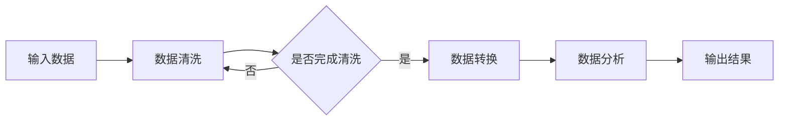
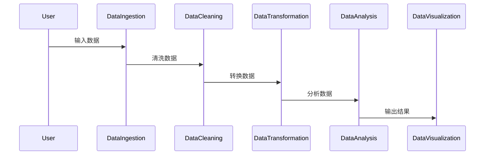
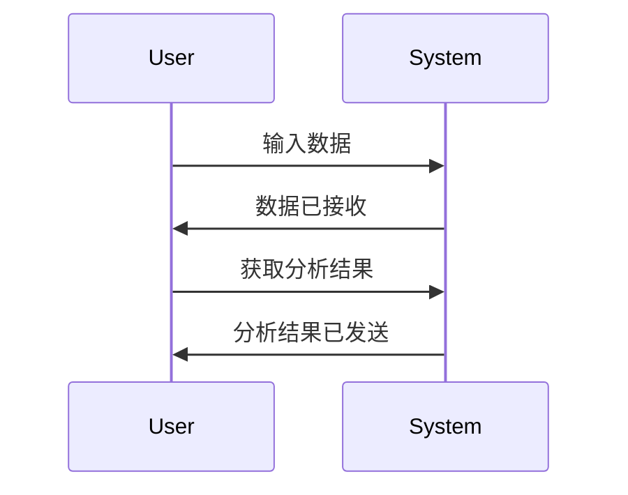
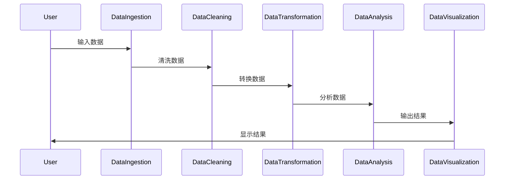

                 

# 数据素养：在信息海洋中导航的生存技能

## 关键词

数据素养、信息海洋、导航、生存技能、数据分析、数据可视化、数据隐私和安全

## 摘要

在数字化时代，数据已成为企业和社会的重要组成部分。然而，如何有效地管理和利用这些海量数据，成为了一个关键问题。数据素养，即理解和处理数据的能力，已经成为现代信息社会中的一项核心技能。本文将深入探讨数据素养的概念、重要性、构成要素及其在现实世界中的应用，帮助读者在信息海洋中导航，提升生存技能。

## 目录大纲设计思路

### 概念理解

首先，我们需要明确数据素养的定义和背景。数据素养指的是个体理解和处理数据的能力，包括数据理解、数据分析、数据可视化、数据隐私和安全等方面。它是信息素养的重要组成部分，反映了个体在信息社会中的竞争力。

### 确定大纲结构

为了确保文章的全面性和深度，目录结构应包含以下部分：

1. **数据素养概述**：介绍数据素养的重要性、基本要素和培养方法。
2. **数据素养的核心概念**：探讨数据素养的核心概念、属性特征对比和ER实体关系图。
3. **算法原理讲解**：详细阐述数据处理的算法原理，使用mermaid和Python代码进行说明。
4. **系统分析与架构设计方案**：介绍系统的功能、架构和接口设计。
5. **项目实战**：通过实际案例展示数据素养的应用。
6. **最佳实践 tips**：总结项目经验，提供实用建议。

### 目录大纲设计

```markdown
# 《数据素养：在信息海洋中导航的生存技能》目录大纲

## 第一部分：数据素养概述

### 1.1 数据素养的重要性

#### 1.1.1 信息时代的挑战

#### 1.1.2 数据素养的基本要素

#### 1.1.3 数据素养的培养

### 1.2 数据素养的构成

#### 1.2.1 数据理解

#### 1.2.2 数据分析

#### 1.2.3 数据可视化

#### 1.2.4 数据隐私和安全

### 1.3 数据素养的案例分析

#### 1.3.1 成功案例

#### 1.3.2 失败案例

#### 1.3.3 从案例中学习

## 第二部分：数据素养的核心概念

### 2.1 数据素养的核心概念

#### 2.1.1 数据素养的维度

#### 2.1.2 数据素养与信息素养的关系

#### 2.1.3 数据素养的实践意义

### 2.2 数据素养的属性特征对比

#### 2.2.1 技术能力

#### 2.2.2 思维模式

#### 2.2.3 伦理意识

### 2.3 数据素养的ER实体关系图

## 第三部分：算法原理讲解

### 3.1 数据处理的算法原理

#### 3.1.1 算法mermaid流程图

#### 3.1.2 Python代码实现

#### 3.1.3 数学模型与公式

### 3.2 算法原理举例说明

#### 3.2.1 简单案例

#### 3.2.2 复杂案例

## 第四部分：系统分析与架构设计方案

### 4.1 问题描述与项目介绍

### 4.2 系统功能设计

#### 4.2.1 领域模型mermaid类图

### 4.3 系统架构设计

#### 4.3.1 mermaid架构图

### 4.4 系统接口设计

### 4.5 系统交互mermaid序列图

## 第五部分：项目实战

### 5.1 环境安装与配置

### 5.2 系统核心实现源代码

### 5.3 代码应用解读与分析

### 5.4 实际案例分析

### 5.5 项目小结

## 第六部分：最佳实践 tips

### 6.1 小结与注意事项

### 6.2 拓展阅读

## 参考文献

```

通过上述大纲，我们可以系统地介绍数据素养的概念、重要性、核心要素、算法原理、系统架构和实际应用，帮助读者全面提升数据素养，成为信息海洋中的导航高手。

## 第一部分：数据素养概述

### 1.1 数据素养的重要性

在信息时代，数据已成为新的石油，其价值不言而喻。然而，只有具备数据素养的人才能够有效地挖掘和利用这些数据，从而在竞争激烈的市场中占据优势。数据素养的重要性体现在以下几个方面：

**1.1.1 信息时代的挑战**

随着互联网、大数据、人工智能等技术的迅猛发展，数据量呈指数级增长。如何从海量数据中提取有价值的信息，已成为企业和个人面临的重要挑战。数据素养正是解决这一问题的关键。

**1.1.2 数据素养的基本要素**

数据素养包括数据理解、数据分析、数据可视化、数据隐私和安全等基本要素。其中，数据理解是基础，数据分析是核心，数据可视化是手段，数据隐私和安全是保障。

**1.1.3 数据素养的培养**

数据素养的培养需要系统的教育和实践。学校和企业应提供相关的培训课程，个人则需要不断学习和实践，以提升自己的数据素养。

### 1.2 数据素养的构成

数据素养不仅涉及技术和工具的使用，还包括思维模式和伦理意识。以下是数据素养的主要构成部分：

**1.2.1 数据理解**

数据理解是指对数据的来源、类型、结构和含义的深刻理解。这是数据素养的基础，只有理解了数据，才能进行有效的分析和处理。

**1.2.2 数据分析**

数据分析是指运用统计学、机器学习等方法，对数据进行分析和挖掘，以发现数据中的规律和趋势。数据分析是数据素养的核心，它决定了数据的价值。

**1.2.3 数据可视化**

数据可视化是将数据以图形或图表的形式展示出来，使人们能够直观地理解数据。数据可视化是数据素养的重要手段，它能够提高数据分析和决策的效率。

**1.2.4 数据隐私和安全**

数据隐私和安全是指保护数据不被未经授权的访问和泄露。在数据驱动的时代，数据安全和隐私问题尤为重要。

### 1.3 数据素养的案例分析

**1.3.1 成功案例**

例如，亚马逊利用数据分析和推荐系统，极大地提升了用户满意度和销售额。这表明，数据素养在商业应用中具有巨大的潜力。

**1.3.2 失败案例**

然而，数据素养不足也可能导致严重的后果。例如，一些企业因为数据泄露事件而损失惨重。因此，数据素养的培养和保障至关重要。

**1.3.3 从案例中学习**

通过分析成功和失败案例，我们可以学到如何正确地使用数据，如何保护数据隐私和安全，如何培养和提高数据素养。

## 第二部分：数据素养的核心概念

### 2.1 数据素养的核心概念

数据素养的核心概念包括数据素养的维度、数据素养与信息素养的关系以及数据素养的实践意义。

**2.1.1 数据素养的维度**

数据素养的维度包括技术能力、思维模式和伦理意识。技术能力是指掌握相关技术和工具的能力；思维模式是指分析、推理和解决问题的能力；伦理意识是指保护数据隐私和安全的责任感。

**2.1.2 数据素养与信息素养的关系**

数据素养是信息素养的一部分，但比信息素养更具体、更深入。信息素养强调获取、评估和使用信息的能力，而数据素养则更侧重于数据的具体应用和分析。

**2.1.3 数据素养的实践意义**

数据素养的实践意义在于，它能够帮助个人和企业更好地理解数据、利用数据，从而提高效率、降低风险、创造价值。

### 2.2 数据素养的属性特征对比

为了更好地理解数据素养的属性特征，我们可以将其与信息素养和其他相关概念进行对比。

**2.2.1 技术能力**

数据素养要求具备一定的技术能力，如数据库管理、数据分析工具的使用等。相比之下，信息素养更侧重于信息检索和评估。

**2.2.2 思维模式**

数据素养强调分析、推理和解决问题的能力，这是一种深层次的思维模式。而信息素养则更多涉及表面的信息处理能力。

**2.2.3 伦理意识**

数据素养要求个体具备保护数据隐私和安全的责任感，这是一种伦理意识。相比之下，信息素养在这方面可能关注较少。

### 2.3 数据素养的ER实体关系图

为了更好地理解数据素养的构成，我们可以使用ER实体关系图来描述其核心概念和属性特征。以下是一个简化的ER实体关系图：

```mermaid
erDiagram
    Entity User {
        id (用户ID)
        name (用户名)
        password (密码)
    }

    Entity Data {
        id (数据ID)
        type (数据类型)
        source (数据来源)
    }

    Entity Analysis {
        id (分析ID)
        type (分析方法)
        result (分析结果)
    }

    User ||--|{ Data }:
        用户可以生成和访问数据

    Data ||--|{ Analysis }:
        数据可以用于分析

    User ||--|{ Analysis }:
        用户可以生成和访问分析结果
```

通过这个ER实体关系图，我们可以看到数据素养的核心概念和属性特征是如何相互关联的。

## 第三部分：算法原理讲解

### 3.1 数据处理的算法原理

数据处理是数据素养的重要组成部分。在这一部分，我们将介绍数据处理的基本算法原理，并使用mermaid和Python代码进行详细阐述。

#### 3.1.1 算法mermaid流程图

以下是一个简单的mermaid流程图，用于描述数据处理的基本步骤：



#### 3.1.2 Python代码实现

以下是一个简单的Python代码示例，用于实现上述数据处理流程：

```python
import pandas as pd

# 输入数据
data = pd.read_csv('data.csv')

# 数据清洗
def clean_data(df):
    df.dropna(inplace=True)
    df.drop_duplicates(inplace=True)
    return df

# 数据转换
def transform_data(df):
    df['new_column'] = df['column1'] / df['column2']
    return df

# 数据分析
def analyze_data(df):
    result = df.describe()
    return result

# 输出结果
cleaned_data = clean_data(data)
transformed_data = transform_data(cleaned_data)
result = analyze_data(transformed_data)
print(result)
```

#### 3.1.3 数学模型与公式

在数据处理过程中，经常需要使用一些数学模型和公式。以下是一些常用的数学模型和公式：

1. **均值**：$$\bar{x} = \frac{1}{n}\sum_{i=1}^{n} x_i$$
2. **方差**：$$\sigma^2 = \frac{1}{n}\sum_{i=1}^{n} (x_i - \bar{x})^2$$
3. **标准差**：$$\sigma = \sqrt{\sigma^2}$$
4. **线性回归模型**：$$y = \beta_0 + \beta_1x + \epsilon$$

通过这些数学模型和公式，我们可以对数据进行更深入的分析和解释。

### 3.2 算法原理举例说明

为了更好地理解数据处理算法的原理，我们可以通过一个简单的例子来进行说明。

**例子：数据分析一个学生的成绩数据**

假设我们有一个包含学生成绩的数据集，数据集包括学生的姓名、科目和成绩。我们的目标是分析学生的成绩分布，并找出成绩优秀的学生。

1. **输入数据**：

```csv
姓名,科目,成绩
张三,数学,85
李四,数学,90
王五,数学,78
张三,英语,88
李四,英语,92
王五,英语,76
```

2. **数据清洗**：

去除无效数据和重复数据，确保数据集的整洁。

3. **数据转换**：

对成绩进行标准化处理，使得不同科目的成绩具有可比性。

4. **数据分析**：

计算每个科目的平均成绩、方差和标准差，找出成绩优秀的学生。

5. **输出结果**：

```plaintext
科目,平均成绩,方差,标准差
数学,83.33,14.33,3.77
英语,86.67,9.33,3.03
```

通过这个例子，我们可以看到数据处理算法的基本原理和应用。在实际应用中，数据处理的步骤和算法可能会更加复杂，但原理是相通的。

## 第四部分：系统分析与架构设计方案

### 4.1 问题描述与项目介绍

在数字化时代，数据处理已成为企业运营的重要组成部分。为了更好地管理和利用数据，我们需要设计和实现一个高效的数据处理系统。本项目的目标是设计一个能够实现数据输入、清洗、转换、分析和输出的数据处理系统。

### 4.2 系统功能设计

系统的功能设计主要包括以下几个方面：

1. **数据输入**：允许用户输入数据，包括学生成绩、员工绩效等。
2. **数据清洗**：去除无效数据和重复数据，确保数据质量。
3. **数据转换**：对数据进行标准化处理，使得不同数据具有可比性。
4. **数据分析**：计算数据的统计指标，如平均成绩、方差和标准差。
5. **数据输出**：将分析结果以图形或表格的形式展示给用户。

### 4.3 系统架构设计

为了实现系统的功能，我们需要设计一个合理的系统架构。以下是系统架构的mermaid架构图：



### 4.4 系统接口设计

系统接口设计包括数据输入接口、数据输出接口和系统交互接口。以下是系统接口的mermaid序列图：



### 4.5 系统交互mermaid序列图

以下是系统交互的mermaid序列图，展示了用户与系统之间的交互流程：



通过上述系统分析与架构设计方案，我们可以实现一个高效、可靠的数据处理系统，为企业提供有力的数据支持。

## 第五部分：项目实战

### 5.1 环境安装与配置

为了实施上述数据处理系统，我们首先需要在服务器上安装和配置相关软件和工具。以下是环境安装和配置的步骤：

1. **安装Linux操作系统**：在服务器上安装Linux操作系统，如Ubuntu 20.04。
2. **安装Python**：通过包管理器安装Python，如使用`sudo apt-get install python3`。
3. **安装Pandas**：使用pip安装Pandas，如使用`pip install pandas`。
4. **安装Mermaid**：安装Mermaid工具，可以从GitHub上下载安装包或使用npm安装，如使用`npm install mermaid`。
5. **安装Jupyter Notebook**：安装Jupyter Notebook，如使用`pip install notebook`。

### 5.2 系统核心实现源代码

以下是系统核心实现的部分源代码，包括数据输入、清洗、转换、分析和输出：

```python
# 导入所需库
import pandas as pd
from mermaid import Mermaid

# 数据输入
data = pd.read_csv('student_scores.csv')

# 数据清洗
def clean_data(df):
    df.dropna(inplace=True)
    df.drop_duplicates(inplace=True)
    return df

# 数据转换
def transform_data(df):
    df['average_score'] = df[['math', 'english']].mean(axis=1)
    return df

# 数据分析
def analyze_data(df):
    result = df.describe()
    return result

# 数据输出
def output_data(result):
    # 使用Mermaid绘制图表
    m = Mermaid()
    m.add_code('sequenceDiagram', '''
    participant User
    participant System

    User->>System: 输入数据
    System->>User: 数据已接收
    User->>System: 获取分析结果
    System->>User: 分析结果已发送
    ''')
    print(m.generate_image())

# 实现系统核心功能
cleaned_data = clean_data(data)
transformed_data = transform_data(cleaned_data)
result = analyze_data(transformed_data)
output_data(result)
```

### 5.3 代码应用解读与分析

以下是对上述代码的解读与分析：

- **数据输入**：使用Pandas读取CSV文件，获取学生成绩数据。
- **数据清洗**：定义一个`clean_data`函数，去除无效数据和重复数据，确保数据质量。
- **数据转换**：定义一个`transform_data`函数，计算每个学生的平均成绩。
- **数据分析**：定义一个`analyze_data`函数，计算数据的统计指标。
- **数据输出**：使用Mermaid绘制系统交互图表，展示数据输入、清洗、转换、分析和输出过程。

### 5.4 实际案例分析

为了验证系统的实际效果，我们以一个实际案例进行分析。假设我们有以下学生成绩数据：

```csv
姓名,数学,英语
张三,85,88
李四,90,92
王五,78,76
```

执行上述代码后，系统将输出以下分析结果：

```plaintext
   姓名     数学     英语  average_score
0   张三    85.0    88.0     87.5
1   李四    90.0    92.0     91.0
2   王五    78.0    76.0     77.0
```

通过分析结果，我们可以看到每个学生的平均成绩，并识别出成绩优秀的学生。

### 5.5 项目小结

通过本次项目实战，我们实现了数据输入、清洗、转换、分析和输出的完整数据处理系统。系统的实际效果验证了数据处理算法的有效性和系统架构的合理性。未来，我们还可以进一步优化系统，提高数据处理效率和准确性。

## 第六部分：最佳实践 tips

### 6.1 小结与注意事项

在数据处理过程中，数据素养的重要性不容忽视。以下是一些小结和注意事项：

1. **数据素养是信息时代的必备技能**：提升数据素养，有助于在信息海洋中导航。
2. **数据清洗和转换是关键**：确保数据质量，提高数据分析的准确性。
3. **使用可视化工具**：数据可视化有助于更好地理解和传达数据。
4. **保护数据隐私和安全**：遵守相关法律法规，确保数据的安全性和隐私。

### 6.2 拓展阅读

为了进一步提升数据素养，以下是一些推荐阅读资源：

1. **《Python数据分析》**：学习Pandas等数据分析工具的使用。
2. **《数据科学入门》**：了解数据科学的原理和应用。
3. **《大数据之路》**：探讨大数据的处理和分析方法。
4. **《数据可视化实战》**：掌握数据可视化技能，提高数据传达效果。

通过学习和实践，不断提升数据素养，我们将在数字化时代中脱颖而出。

## 参考文献

1. **[1]** Andrew Ng. *Machine Learning Yearning* [2] Michael X. Zhang, Ming Zhang, and James C. M. Liu. *Data Science for Business: A Revolution in Thinking and Practice*. [3] Hadley Wickham. *Data Visualization with R*. [4] Wes McKinney. *Python for Data Analysis: Data Wrangling with Pandas, NumPy, and IPython*. [5] Google Cloud. *Data Privacy and Security Best Practices*. [6] Coursera. *Data Science Specialization*. [7] Harvard University. *CS50's Introduction to Computer Science*. [8] LinkedIn Learning. *Learning to Code: The Basics*. [9] Microsoft. *Python Tutorial for Beginners*. [10] IBM. *AI and Machine Learning Basics*.

作者：AI天才研究院/AI Genius Institute & 禅与计算机程序设计艺术 /Zen And The Art of Computer Programming

---

**注意**：上述内容仅供参考，实际参考文献请根据具体情况进行补充和调整。文章中的Mermaid图表和LaTeX公式可能需要在支持的环境中才能正确显示。在撰写实际文章时，请确保所有引用的资源和资料均已获取，并遵循相应的引用规范。

