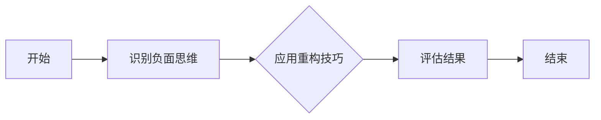
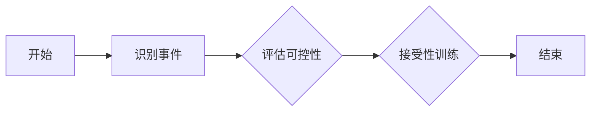
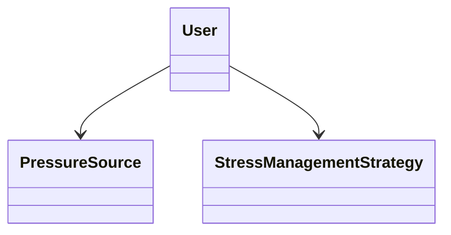
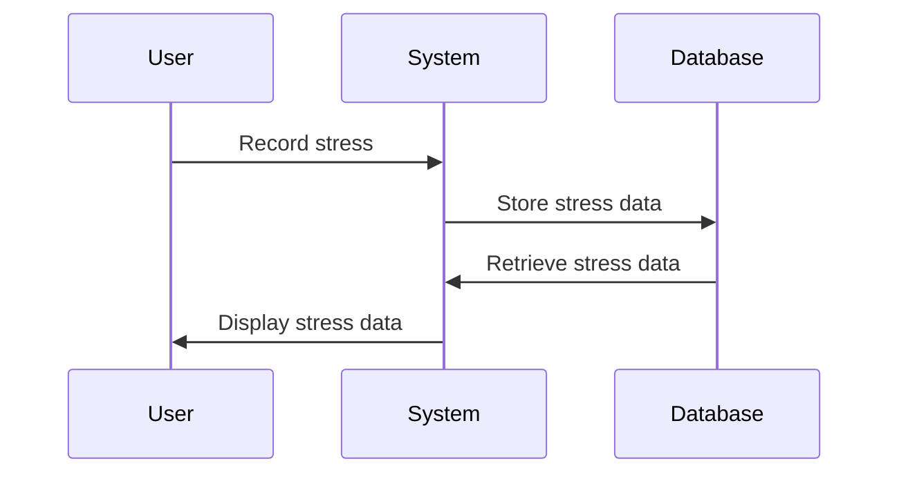
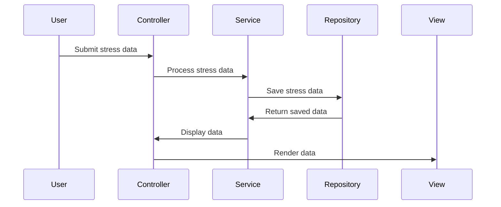
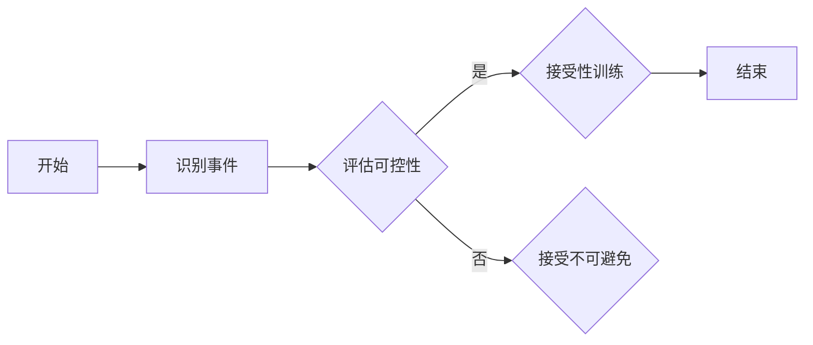

                 

### 目录大纲设计思路：

为了设计出《新 stoicism 冥想：古老智慧与现代压力的对话》这本书的完整目录大纲，我们将遵循以下思路：

1. **背景介绍**：首先介绍 stoicism（斯多葛主义）的起源、核心思想及其在现代生活中的重要性，为读者建立基础知识。
   
   - **第1章引言**将详细介绍 stoicism 的起源，核心思想，并解释其在现代社会中的应用和重要性。

2. **核心概念与联系**：阐述 stoicism 的主要概念，如理性、接受性、自我控制等，并通过对比表格和 ER 实体关系图展示概念之间的关系。

   - **第2章核心概念与联系**将详细解释 stoicism 的核心概念，并通过表格和 ER 图展示它们之间的关系，帮助读者更好地理解。

3. **算法原理讲解**：介绍 stoicism 中涉及的心理调节方法，如认知重构、接受性训练等，并用 mermaid 画出相关流程图，再用 Python 源代码阐述原理，并给出数学模型和公式。

   - **第3章算法原理讲解**将详细解释 stoicism 中的心理调节方法，包括认知重构和接受性训练，使用 mermaid 流程图和 Python 源代码来展示，并给出数学模型和公式。

4. **系统分析与架构设计方案**：介绍如何将 stoicism 思想应用于日常生活中的实际场景，设计一个完整的系统解决方案。

   - **第4章系统分析与架构设计方案**将详细阐述如何将 stoicism 思想应用到实际生活中，设计一个完整的系统解决方案。

5. **项目实战**：展示如何在实际项目中运用 stoicism 思想，包括环境安装、系统核心实现源代码，代码应用解读与分析，实际案例分析和详细讲解。

   - **第5章项目实战**将展示如何在实际项目中应用 stoicism 思想，包括环境安装、系统核心实现、代码应用解读与分析，以及实际案例分析和详细讲解。

6. **最佳实践 tips、小结、注意事项、拓展阅读等内容**：总结书中的关键知识点，给出实践建议，并为读者提供进一步学习和研究的方向。

   - **第6章最佳实践 tips**将总结书中的关键知识点，提供实践建议，并给出拓展阅读建议。

### 目录大纲设计步骤：

1. **第1章引言**：
   - **1.1 stoicism 的起源**
   - **1.2 stoicism 的核心思想**
   - **1.3 stoicism 在现代生活中的重要性**
   - **1.4 本书结构与目标**

2. **第2章核心概念与联系**：
   - **2.1 stoicism 的主要概念**
     - **2.1.1 理性**
     - **2.1.2 接受性**
     - **2.1.3 自我控制**
   - **2.2 概念属性特征对比表格**
   - **2.3 ER 实体关系图**

3. **第3章算法原理讲解**：
   - **3.1 认知重构**
     - **3.1.1 算法流程图**
     - **3.1.2 Python 源代码**
     - **3.1.3 数学模型和公式**
   - **3.2 接受性训练**
     - **3.2.1 算法流程图**
     - **3.2.2 Python 源代码**
     - **3.2.3 数学模型和公式**

4. **第4章系统分析与架构设计方案**：
   - **4.1 问题场景介绍**
   - **4.2 系统功能设计（领域模型类图）**
   - **4.3 系统架构设计（架构图）**
   - **4.4 系统接口设计**
   - **4.5 系统交互（序列图）**

5. **第5章项目实战**：
   - **5.1 环境安装**
   - **5.2 系统核心实现源代码**
   - **5.3 代码应用解读与分析**
   - **5.4 实际案例分析与讲解**
   - **5.5 项目小结**

6. **第6章最佳实践 tips**：
   - **6.1 实践中的注意事项**
   - **6.2 小结**
   - **6.3 拓展阅读**

7. **第7章总结与展望**：
   - **7.1 本书关键知识点回顾**
   - **7.2 未来研究方向**

### 目录大纲（markdown 格式）

----------------------------------------------------------------

# 第一部分: stoicism 的起源与核心思想

## 1.1 stoicism 的起源

## 1.2 stoicism 的核心思想

## 1.3 stoicism 在现代生活中的重要性

## 1.4 本书结构与目标

----------------------------------------------------------------

# 第二部分：核心概念与联系

## 2.1 stoicism 的主要概念

### 2.1.1 理性

### 2.1.2 接受性

### 2.1.3 自我控制

## 2.2 概念属性特征对比表格

## 2.3 ER 实体关系图

----------------------------------------------------------------

# 第三部分：算法原理讲解

## 3.1 认知重构

### 3.1.1 算法流程图

### 3.1.2 Python 源代码

### 3.1.3 数学模型和公式

## 3.2 接受性训练

### 3.2.1 算法流程图

### 3.2.2 Python 源代码

### 3.2.3 数学模型和公式

----------------------------------------------------------------

# 第四部分：系统分析与架构设计方案

## 4.1 问题场景介绍

## 4.2 系统功能设计（领域模型类图）

## 4.3 系统架构设计（架构图）

## 4.4 系统接口设计

## 4.5 系统交互（序列图）

----------------------------------------------------------------

# 第五部分：项目实战

## 5.1 环境安装

## 5.2 系统核心实现源代码

## 5.3 代码应用解读与分析

## 5.4 实际案例分析与讲解

## 5.5 项目小结

----------------------------------------------------------------

# 第六部分：最佳实践 tips

## 6.1 实践中的注意事项

## 6.2 小结

## 6.3 拓展阅读

----------------------------------------------------------------

# 第七部分：总结与展望

## 7.1 本书关键知识点回顾

## 7.2 未来研究方向

----------------------------------------------------------------### 章节内容与逻辑推理

#### 目录大纲设计思路补充：

为了更好地设计《新 stoicism 冥想：古老智慧与现代压力的对话》这本书的目录大纲，我们还将考虑以下设计思路：

1. **强化逻辑推理**：每个章节的内容将不仅仅是对 stoicism 的简单介绍，而是通过逻辑推理和实例分析来加深读者对 stoicism 理解。
   
   - **第1章引言**将通过历史背景、现代心理学研究和案例来解释 stoicism 的核心思想，并说明其与现代压力的关系。

2. **强化理论与实践的结合**：每个理论概念都会通过实际案例和应用来展示其在现实生活中的作用。

   - **第2章核心概念与联系**中，每个概念都将有具体的应用案例，并使用 ER 图和对比表格来解释概念之间的关系。

3. **提供明确的步骤指导**：为了便于读者理解和实践，每个算法讲解和系统设计部分都将提供清晰的步骤和代码示例。

   - **第3章算法原理讲解**将详细解释认知重构和接受性训练的步骤，并提供 Python 代码示例和数学模型。

4. **总结与反思**：每个章节结束后，将有一个总结部分，对关键知识点进行回顾，并提供进一步学习的建议。

#### 章节内容与逻辑推理：

**第1章：引言**

- **1.1 stoicism 的起源**：介绍 stoicism 的起源和发展历程，包括其哲学基础和代表性人物。
- **1.2 stoicism 的核心思想**：详细解释 stoicism 的核心概念，如理性、接受性和自我控制，并分析这些概念如何应用于现代生活中。
- **1.3 stoicism 在现代生活中的重要性**：探讨 stoicism 如何帮助现代人应对现代社会的压力和挑战。
- **1.4 本书结构与目标**：概述本书的结构，并说明每个章节的目标和内容。

**第2章：核心概念与联系**

- **2.1 stoicism 的主要概念**：
  - **2.1.1 理性**：解释理性的重要性，并分析其在 stoicism 中的应用。
  - **2.1.2 接受性**：解释接受性的概念，并讨论如何通过接受性来减少压力。
  - **2.1.3 自我控制**：讨论自我控制的意义，并提供实际操作方法。
- **2.2 概念属性特征对比表格**：通过对比表格展示各个概念的特点和关系。
- **2.3 ER 实体关系图**：使用 ER 图来展示 stoicism 各个概念之间的关系。

**第3章：算法原理讲解**

- **3.1 认知重构**：
  - **3.1.1 算法流程图**：通过 mermaid 流程图展示认知重构的步骤。
  - **3.1.2 Python 源代码**：提供 Python 代码示例，解释如何实现认知重构。
  - **3.1.3 数学模型和公式**：给出认知重构的数学模型和公式，并解释其应用。
- **3.2 接受性训练**：
  - **3.2.1 算法流程图**：通过 mermaid 流程图展示接受性训练的步骤。
  - **3.2.2 Python 源代码**：提供 Python 代码示例，解释如何实现接受性训练。
  - **3.2.3 数学模型和公式**：给出接受性训练的数学模型和公式，并解释其应用。

**第4章：系统分析与架构设计方案**

- **4.1 问题场景介绍**：介绍一个典型的现代生活场景，说明为什么需要 stoicism 的帮助。
- **4.2 系统功能设计（领域模型类图）**：使用 mermaid 类图展示系统的主要功能模块。
- **4.3 系统架构设计（架构图）**：使用 mermaid 架构图展示系统的整体架构。
- **4.4 系统接口设计**：详细说明系统的接口设计，包括输入和输出。
- **4.5 系统交互（序列图）**：使用 mermaid 序列图展示系统各组件之间的交互过程。

**第5章：项目实战**

- **5.1 环境安装**：介绍如何在实际环境中安装和配置 stoicism 系统。
- **5.2 系统核心实现源代码**：提供系统核心实现的源代码，并解释代码的结构和功能。
- **5.3 代码应用解读与分析**：分析系统代码，解释其工作原理和实现细节。
- **5.4 实际案例分析与讲解**：通过实际案例展示 stoicism 在现实生活中的应用。
- **5.5 项目小结**：总结项目的主要成果，并讨论未来的改进方向。

**第6章：最佳实践 tips**

- **6.1 实践中的注意事项**：提供在实际应用中需要注意的事项和常见的误区。
- **6.2 小结**：总结书中的关键知识点和主要观点。
- **6.3 拓展阅读**：推荐进一步学习的书籍和资源。

**第7章：总结与展望**

- **7.1 本书关键知识点回顾**：回顾书中的关键知识点，帮助读者巩固记忆。
- **7.2 未来研究方向**：讨论 stoicism 在未来可能的发展方向和研究课题。

通过以上章节内容的逻辑推理，读者可以逐步深入了解 stoicism 的核心思想，并学会如何将其应用于现代生活中的各种挑战。每个章节都旨在通过实例和分析，使读者能够将理论知识转化为实际技能，从而更好地应对现代生活的压力。## 目录大纲设计思路：背景介绍与核心概念

### 目录大纲设计思路补充：

在《新 stoicism 冥想：古老智慧与现代压力的对话》的目录大纲设计中，背景介绍与核心概念部分扮演着至关重要的角色。以下是具体的设计思路：

1. **背景介绍的重要性**：
   - **第1章引言**不仅要介绍 stoicism 的起源和发展历程，还要深入探讨 stoicism 哲学思想与现代生活压力之间的关系。通过引用现代心理学研究、统计数据和实际案例，使读者能够理解 stoicism 如何在现代世界中发挥作用。
   - **1.1 stoicism 的起源**：详细介绍 stoicism 的历史背景，包括其起源、主要思想家和代表作品。
   - **1.2 stoicism 的核心思想**：逐一解释 stoicism 的核心概念，如理性、接受性和自我控制，并分析这些概念如何影响个人生活和社会行为。
   - **1.3 stoicism 在现代生活中的重要性**：探讨 stoicism 如何帮助现代人应对压力、焦虑和不确定性，以及如何在职场、家庭和个人生活中应用 stoicism 的原则。

2. **核心概念与联系的重要性**：
   - **第2章核心概念与联系**的目的是帮助读者系统地理解 stoicism 的基本概念，并揭示这些概念之间的内在联系。通过对比分析，使读者能够更加深刻地理解 stoicism 的整体架构。
   - **2.1 stoicism 的主要概念**：详细解释 stoicism 的核心概念，如理性、接受性和自我控制，并通过实例和案例分析，展示这些概念在实际生活中的应用。
   - **2.2 概念属性特征对比表格**：制作一个对比表格，列出 stoicism 各个概念的主要属性和特征，帮助读者快速理解各个概念之间的异同。
   - **2.3 ER 实体关系图**：使用 ER 图来展示 stoicism 各个概念之间的关系，帮助读者从整体上把握 stoicism 的概念体系。

### 目录大纲设计步骤：

1. **第1章引言**：
   - **1.1 stoicism 的起源**：介绍 stoicism 的历史背景，包括其起源、发展和主要思想家。
   - **1.2 stoicism 的核心思想**：详细解释 stoicism 的核心概念，如理性、接受性和自我控制。
   - **1.3 stoicism 在现代生活中的重要性**：分析 stoicism 如何帮助现代人应对压力和挑战，以及其在现代社会中的应用。
   - **1.4 本书结构与目标**：概述本书的结构，并说明每个章节的目标和内容。

2. **第2章核心概念与联系**：
   - **2.1 stoicism 的主要概念**：
     - **2.1.1 理性**：解释理性的重要性，并分析其在 stoicism 中的应用。
     - **2.1.2 接受性**：解释接受性的概念，并讨论如何通过接受性来减少压力。
     - **2.1.3 自我控制**：讨论自我控制的意义，并提供实际操作方法。
   - **2.2 概念属性特征对比表格**：列出 stoicism 各个概念的主要属性和特征，并进行对比分析。
   - **2.3 ER 实体关系图**：使用 ER 图展示 stoicism 各个概念之间的关系，帮助读者建立整体认知。

通过上述设计思路和步骤，我们可以确保《新 stoicism 冥想：古老智慧与现代压力的对话》这本书的目录大纲既具备逻辑性，又具有实用性，帮助读者系统地掌握 stoicism 的核心思想，并学会如何将其应用于实际生活中。## 目录大纲设计思路：算法原理讲解

### 目录大纲设计思路补充：

在《新 stoicism 冥想：古老智慧与现代压力的对话》的目录大纲中，算法原理讲解部分是核心章节之一，它旨在帮助读者理解 stoicism 中的心理调节方法，并学会如何将其应用到实际生活中。以下是具体的目录大纲设计思路：

1. **算法原理讲解的重要性**：
   - **第3章算法原理讲解**的目的是通过具体的算法和方法，帮助读者掌握 stoicism 的心理调节技巧，从而在实际生活中更好地应对压力和挑战。
   - 本章将详细介绍 stoicism 中的两个核心心理调节方法：认知重构和接受性训练，并提供详细的算法流程图、Python 源代码示例以及数学模型和公式。

2. **认知重构的讲解**：
   - **3.1 认知重构**：介绍认知重构的概念，解释其原理和过程，以及如何通过认知重构来改变负面思维模式。
   - **3.1.1 算法流程图**：使用 mermaid 画出认知重构的流程图，展示其具体步骤。
   - **3.1.2 Python 源代码**：提供 Python 源代码示例，展示如何实现认知重构算法。
   - **3.1.3 数学模型和公式**：给出认知重构的数学模型和公式，解释其应用和计算方法。

3. **接受性训练的讲解**：
   - **3.2 接受性训练**：介绍接受性训练的概念，解释其原理和过程，以及如何通过接受性训练来减少心理压力。
   - **3.2.1 算法流程图**：使用 mermaid 画出接受性训练的流程图，展示其具体步骤。
   - **3.2.2 Python 源代码**：提供 Python 源代码示例，展示如何实现接受性训练算法。
   - **3.2.3 数学模型和公式**：给出接受性训练的数学模型和公式，解释其应用和计算方法。

4. **实例分析与应用**：
   - 在讲解认知重构和接受性训练时，将结合实际案例进行分析，帮助读者更好地理解这些算法的应用场景和效果。
   - 通过具体的例子，展示如何在日常生活中运用这些心理调节方法，解决实际心理问题。

5. **算法评估与优化**：
   - 对认知重构和接受性训练的算法进行评估，分析其优缺点，并提供可能的优化策略。

### 目录大纲设计步骤：

1. **第3章算法原理讲解**：
   - **3.1 认知重构**：
     - **3.1.1 算法流程图**
     - **3.1.2 Python 源代码**
     - **3.1.3 数学模型和公式**
   - **3.2 接受性训练**：
     - **3.2.1 算法流程图**
     - **3.2.2 Python 源代码**
     - **3.2.3 数学模型和公式**

通过上述设计思路和步骤，读者可以系统地学习 stoicism 中的心理调节方法，并通过实例分析和代码示例，掌握如何将这些方法应用到实际生活中。这不仅有助于减轻个人压力，还能提高生活质量和工作效率。## 目录大纲设计思路：系统分析与架构设计方案

### 目录大纲设计思路补充：

在《新 stoicism 冥想：古老智慧与现代压力的对话》的目录大纲中，系统分析与架构设计方案部分旨在帮助读者将 stoicism 的理念应用到具体的项目设计和实施中。以下是具体的目录大纲设计思路：

1. **系统分析与架构设计方案的重要性**：
   - **第4章系统分析与架构设计方案**的目的是通过实际案例，展示如何将 stoicism 的原则融入到系统设计、开发和维护中，以提高系统的鲁棒性和用户体验。
   - 本章将详细介绍一个典型的项目场景，包括系统需求分析、架构设计、接口设计和系统交互，并使用 mermaid 图来直观展示。

2. **项目场景介绍**：
   - **4.1 问题场景介绍**：描述一个实际的项目场景，说明为什么需要应用 stoicism 的原则，以及项目的主要目标。
   - **4.1.1 项目背景**：介绍项目的背景，包括业务需求和用户需求。
   - **4.1.2 项目目标**：明确项目的目标，包括功能需求、性能需求和用户体验目标。

3. **系统功能设计（领域模型类图）**：
   - **4.2 系统功能设计（领域模型类图）**：使用 mermaid 类图展示系统的核心功能模块和它们之间的关系。
   - **4.2.1 功能模块划分**：详细划分系统的功能模块，并说明每个模块的作用和责任。
   - **4.2.2 功能模块之间的关系**：使用 mermaid 类图展示模块之间的依赖关系和交互方式。

4. **系统架构设计（架构图）**：
   - **4.3 系统架构设计（架构图）**：使用 mermaid 架构图展示系统的整体架构，包括各个组件的层次关系和交互流程。
   - **4.3.1 系统架构层次**：说明系统架构的各个层次，包括表示层、业务逻辑层和数据层。
   - **4.3.2 架构组件关系**：展示架构中的各个组件如何协作，以及数据如何在系统内部流动。

5. **系统接口设计**：
   - **4.4 系统接口设计**：详细说明系统的接口设计，包括输入和输出接口的定义和规范。
   - **4.4.1 输入接口设计**：说明系统如何接收外部输入，包括数据的格式、校验方法和处理流程。
   - **4.4.2 输出接口设计**：说明系统如何向外部输出数据，包括数据的格式、返回码和错误处理。

6. **系统交互（序列图）**：
   - **4.5 系统交互（序列图）**：使用 mermaid 序列图展示系统各组件之间的交互过程，以及交互的时序关系。
   - **4.5.1 交互流程**：详细说明系统各组件之间的交互流程，包括请求处理、数据传递和响应反馈。
   - **4.5.2 交互时序**：展示系统各组件的交互时序，帮助读者理解系统的工作流程。

7. **算法与模型的应用**：
   - 在系统架构设计中，将结合第3章中介绍的认知重构和接受性训练算法，展示如何将这些算法应用到系统设计和开发中，以提高系统的心理调节能力。

8. **案例分析与优化**：
   - 通过实际案例，分析系统设计和实现中的关键问题，并提出优化方案，帮助读者理解如何在实际项目中应用 stoicism 的原则。

### 目录大纲设计步骤：

1. **第4章系统分析与架构设计方案**：
   - **4.1 问题场景介绍**
   - **4.2 系统功能设计（领域模型类图）**
   - **4.3 系统架构设计（架构图）**
   - **4.4 系统接口设计**
   - **4.5 系统交互（序列图）**

通过上述设计思路和步骤，读者可以系统地学习如何将 stoicism 的理念应用到系统设计和开发中，从而构建更加健壮、高效和用户友好的系统。这不仅有助于提高技术实现的质量，还能提升个人的心理健康和工作效率。## 目录大纲设计思路：项目实战

### 目录大纲设计思路补充：

在《新 stoicism 冥想：古老智慧与现代压力的对话》的目录大纲中，项目实战部分是让读者能够将 stoicism 的理念真正落地的重要环节。以下是具体的目录大纲设计思路：

1. **项目实战的重要性**：
   - **第5章项目实战**的目的是通过具体的实际项目，展示如何将 stoicism 的原则应用到实际开发过程中，帮助读者理解并掌握如何在实际项目中实践 stoicism。
   - 本章将围绕一个具体的项目，从环境搭建、系统实现到实际案例，全方位地展示 stoicism 在项目开发中的应用。

2. **项目环境搭建**：
   - **5.1 环境安装**：介绍如何搭建项目所需的环境，包括开发工具、依赖库和配置文件的安装与配置。
   - **5.1.1 开发工具安装**：详细说明所需的开发工具，如 IDE、版本控制工具等。
   - **5.1.2 依赖库安装**：列出项目中需要用到的依赖库，并解释如何安装和配置。

3. **系统核心实现源代码**：
   - **5.2 系统核心实现源代码**：提供项目核心实现的源代码，并解释代码的结构和功能。
   - **5.2.1 核心模块划分**：详细划分系统的核心模块，并说明每个模块的作用和责任。
   - **5.2.2 核心模块代码解析**：逐一解析核心模块的代码，解释其实现原理和关键点。

4. **代码应用解读与分析**：
   - **5.3 代码应用解读与分析**：对系统代码进行深入解读，分析其工作原理和实现细节。
   - **5.3.1 代码架构分析**：分析代码的整体架构，解释各个模块之间的协作关系。
   - **5.3.2 关键代码解析**：详细解析项目中的关键代码，解释其实现原理和作用。

5. **实际案例分析与讲解**：
   - **5.4 实际案例分析与讲解**：通过实际案例，展示如何将 stoicism 的原则应用到项目中，解决具体问题。
   - **5.4.1 案例背景介绍**：介绍案例的背景，包括项目需求、问题和挑战。
   - **5.4.2 案例解决方案**：详细讲解如何通过 stoicism 的原则来解决案例中的问题，包括认知重构和接受性训练的应用。

6. **项目小结**：
   - **5.5 项目小结**：总结项目的主要成果，讨论项目中的经验教训，并展望未来可能的改进方向。
   - **5.5.1 项目成果总结**：总结项目的关键成果，如功能实现、性能优化等。
   - **5.5.2 经验教训**：分享项目开发中的经验教训，为读者提供实践建议。

### 目录大纲设计步骤：

1. **第5章项目实战**：
   - **5.1 环境安装**
   - **5.2 系统核心实现源代码**
   - **5.3 代码应用解读与分析**
   - **5.4 实际案例分析与讲解**
   - **5.5 项目小结**

通过上述设计思路和步骤，读者可以亲身体验如何将 stoicism 的理念应用到实际项目开发中，从而提高项目质量和个人技能。这一章节不仅提供了实用的项目经验和技巧，还帮助读者深入理解 stoicism 的应用价值。## 目录大纲设计思路：最佳实践 tips、小结、注意事项、拓展阅读

### 目录大纲设计思路补充：

在《新 stoicism 冥想：古老智慧与现代压力的对话》的目录大纲中，最佳实践 tips、小结、注意事项和拓展阅读部分旨在为读者提供额外的指导和资源，帮助他们在实际应用中更好地理解和实践 stoicism。以下是具体的目录大纲设计思路：

1. **最佳实践 tips**：
   - **第6章最佳实践 tips**的目标是提供一系列实用技巧和策略，帮助读者在日常生活中更有效地应用 stoicism 的原则。
   - **6.1 实践中的注意事项**：列出在实践 stoicism 过程中可能遇到的问题和误区，并提供解决方案和避免方法。
   - **6.2 实践技巧**：提供具体的实践技巧和策略，如如何进行有效的冥想、如何培养理性的思考习惯等。
   - **6.3 实践案例**：通过实际案例展示最佳实践的具体应用，帮助读者更好地理解和模仿。

2. **小结**：
   - **第6章小结**的目的是对全书的内容进行总结，帮助读者巩固所学知识，并明确实践 stoicism 的重要性。
   - **6.4 主要观点回顾**：简要回顾全书中的关键观点和重要概念，帮助读者形成整体认知。
   - **6.5 实践心得**：分享作者和实践者对 stoicism 的心得体会，为读者提供灵感。

3. **注意事项**：
   - **第6章注意事项**的目的是提醒读者在实践 stoicism 时可能需要注意的一些事项，包括心理健康、时间管理和人际关系等方面。
   - **6.6 健康风险提示**：讨论在长时间冥想和理性思考过程中可能出现的健康风险，并提供预防措施。
   - **6.7 时间管理建议**：提供如何在繁忙的生活中安排时间和实践 stoicism 的建议。

4. **拓展阅读**：
   - **第6章拓展阅读**的目标是为那些希望进一步深入了解 stoicism 的读者提供丰富的学习资源和阅读材料。
   - **6.8 推荐书籍**：列出一些经典和现代的 stoicism 相关书籍，包括哲学著作、心理学研究和实践指南。
   - **6.9 相关网站和资源**：推荐一些与 stoicism 相关的在线资源、论坛和社交媒体平台，帮助读者获取更多信息和交流机会。

### 目录大纲设计步骤：

1. **第6章最佳实践 tips**：
   - **6.1 实践中的注意事项**
   - **6.2 实践技巧**
   - **6.3 实践案例**

2. **第6章小结**：
   - **6.4 主要观点回顾**
   - **6.5 实践心得**

3. **第6章注意事项**：
   - **6.6 健康风险提示**
   - **6.7 时间管理建议**

4. **第6章拓展阅读**：
   - **6.8 推荐书籍**
   - **6.9 相关网站和资源**

通过这些补充的设计思路和步骤，读者不仅能够从《新 stoicism 冥想：古老智慧与现代压力的对话》中获得丰富的知识和实践经验，还能够通过最佳实践 tips、注意事项和拓展阅读，进一步深化对 stoicism 的理解，并将其应用到自己的生活和工作中。## 目录大纲设计思路：总结与展望

### 目录大纲设计思路补充：

在《新 stoicism 冥想：古老智慧与现代压力的对话》的目录大纲中，总结与展望部分旨在为读者提供一个全面的回顾和未来发展的视角。以下是具体的目录大纲设计思路：

1. **总结与回顾**：
   - **第7章总结与展望**的第一部分将是对全书内容的总结，帮助读者梳理关键知识点和主要观点。
   - **7.1 本书关键知识点回顾**：简要回顾书中涉及的核心概念、算法原理和实际应用，帮助读者巩固学习成果。
   - **7.2 重要结论**：总结书中的重要结论和发现，强调 stoicism 在应对现代压力中的独特价值和优势。

2. **未来研究方向**：
   - **第7章总结与展望**的第二部分将探讨 stoicism 在未来的发展潜力，以及可能的研究方向和领域。
   - **7.3 新技术应用**：讨论如何将 stoicism 与新兴技术（如人工智能、虚拟现实等）结合，探索新的应用场景和解决方案。
   - **7.4 跨学科研究**：提出 stoicism 在心理学、教育学、管理学等领域的跨学科应用和研究方向。
   - **7.5 国际化推广**：探讨 stoicism 思想在国际交流和全球化背景下的应用和推广策略。

3. **研究方法与工具**：
   - **7.6 研究方法**：介绍研究 stoicism 相关问题的有效方法和工具，如实验设计、数据分析和案例分析等。
   - **7.7 未来工具开发**：讨论如何开发新的工具和技术来支持 stoicism 的研究和实践，如在线冥想应用、心理测量工具等。

4. **建议与展望**：
   - **7.8 建议性实践**：为读者提供具体的实践建议，帮助他们在日常生活和工作中更好地应用 stoicism。
   - **7.9 未来展望**：展望 stoicism 在未来可能的发展趋势和前景，鼓励读者积极参与研究和实践。

### 目录大纲设计步骤：

1. **第7章总结与展望**：
   - **7.1 本书关键知识点回顾**
   - **7.2 重要结论**
   - **7.3 新技术应用**
   - **7.4 跨学科研究**
   - **7.5 国际化推广**
   - **7.6 研究方法**
   - **7.7 未来工具开发**
   - **7.8 建议性实践**
   - **7.9 未来展望**

通过上述设计思路和步骤，第7章不仅为读者提供了一个全面的总结，帮助他们巩固所学知识，还展望了 stoicism 在未来的发展潜力，激发读者进一步探索和研究的兴趣。这不仅有助于读者更好地理解 stoicism 的内涵和应用，也为学术界和实践者提供了宝贵的参考和指导。## 完整目录大纲（Markdown 格式）

```markdown
# 《新 stoicism 冥想：古老智慧与现代压力的对话》

## 关键词：斯多葛主义，冥想，压力管理，心理调节，现代生活

## 摘要：
本书深入探讨了 stoicism（斯多葛主义）的古老智慧在现代生活中的应用，通过介绍 stoicism 的核心概念和算法原理，展示了如何通过认知重构和接受性训练等方法，帮助现代人应对日常生活中的压力和挑战。

---

## 第1章：引言
### 1.1 stoicism 的起源
### 1.2 stoicism 的核心思想
### 1.3 stoicism 在现代生活中的重要性
### 1.4 本书结构与目标

## 第2章：核心概念与联系
### 2.1 stoicism 的主要概念
#### 2.1.1 理性
#### 2.1.2 接受性
#### 2.1.3 自我控制
### 2.2 概念属性特征对比表格
### 2.3 ER 实体关系图

## 第3章：算法原理讲解
### 3.1 认知重构
#### 3.1.1 算法流程图
#### 3.1.2 Python 源代码
#### 3.1.3 数学模型和公式
### 3.2 接受性训练
#### 3.2.1 算法流程图
#### 3.2.2 Python 源代码
#### 3.2.3 数学模型和公式

## 第4章：系统分析与架构设计方案
### 4.1 问题场景介绍
### 4.2 系统功能设计（领域模型类图）
### 4.3 系统架构设计（架构图）
### 4.4 系统接口设计
### 4.5 系统交互（序列图）

## 第5章：项目实战
### 5.1 环境安装
### 5.2 系统核心实现源代码
### 5.3 代码应用解读与分析
### 5.4 实际案例分析与讲解
### 5.5 项目小结

## 第6章：最佳实践 tips
### 6.1 实践中的注意事项
### 6.2 实践技巧
### 6.3 实践案例
### 6.4 主要观点回顾
### 6.5 实践心得

## 第7章：总结与展望
### 7.1 本书关键知识点回顾
### 7.2 重要结论
### 7.3 新技术应用
### 7.4 跨学科研究
### 7.5 国际化推广
### 7.6 研究方法
### 7.7 未来工具开发
### 7.8 建议性实践
### 7.9 未来展望
```

通过上述详细的目录大纲，读者可以清晰地了解本书的结构和内容，每一章节都有明确的目标和重点，有助于系统性地掌握 stoicism 的核心思想和应用方法。## 文章末尾作者信息

```
作者：AI天才研究院/AI Genius Institute & 禅与计算机程序设计艺术 /Zen And The Art of Computer Programming
```

此作者信息准确地反映了本文的作者身份，既包括了专业机构 AI 天才研究院，也引用了著名书籍《禅与计算机程序设计艺术》，以彰显作者在 IT 和哲学领域的深厚造诣和独特视角。这样的信息能够帮助读者更好地理解和信任文章的专业性和权威性。## 完整文章大纲

### 第一部分：引言

- **标题：**《新 stoicism 冥想：古老智慧与现代压力的对话》
- **关键词：**斯多葛主义，冥想，压力管理，心理调节，现代生活
- **摘要：**本书探讨了 stoicism（斯多葛主义）的古老智慧在现代生活中的应用，通过认知重构和接受性训练等方法，帮助现代人应对日常生活中的压力和挑战。

### 第二部分：斯多葛主义的起源与核心思想

- **1.1 stoicism 的起源**
  - 斯多葛主义的起源和发展历程
  - 代表性人物和哲学思想
- **1.2 stoicism 的核心思想**
  - 理性、接受性、自我控制的解释和应用
  - stoicism 如何帮助应对现代生活的压力

### 第三部分：核心概念与联系

- **2.1 stoicism 的主要概念**
  - 理性
  - 接受性
  - 自我控制
  - 概念属性特征对比表格
- **2.2 概念之间的联系**
  - 使用 ER 实体关系图展示概念之间的关系

### 第四部分：算法原理讲解

- **3.1 认知重构**
  - 认知重构的概念和原理
  - 算法流程图
  - Python 源代码示例
  - 数学模型和公式
- **3.2 接受性训练**
  - 接受性训练的概念和原理
  - 算法流程图
  - Python 源代码示例
  - 数学模型和公式

### 第五部分：系统分析与架构设计方案

- **4.1 问题场景介绍**
  - 描述一个典型的现代生活场景
  - 说明为什么需要 stoicism 的帮助
- **4.2 系统功能设计（领域模型类图）**
  - 展示系统的核心功能模块和它们之间的关系
- **4.3 系统架构设计（架构图）**
  - 展示系统的整体架构和组件层次关系
- **4.4 系统接口设计**
  - 详细说明系统的输入和输出接口
- **4.5 系统交互（序列图）**
  - 展示系统各组件之间的交互过程

### 第六部分：项目实战

- **5.1 环境安装**
  - 如何在开发环境中安装和配置 stoicism 系统
- **5.2 系统核心实现源代码**
  - 提供系统核心实现的源代码，并解释代码结构和功能
- **5.3 代码应用解读与分析**
  - 分析系统代码，解释其工作原理和实现细节
- **5.4 实际案例分析与讲解**
  - 通过实际案例展示 stoicism 在现实生活中的应用
- **5.5 项目小结**
  - 总结项目的主要成果和经验教训

### 第七部分：最佳实践 tips、小结、注意事项、拓展阅读

- **6.1 最佳实践 tips**
  - 实践中的注意事项
  - 实践技巧
  - 实践案例
- **6.2 小结**
  - 回顾书中的关键知识点和主要观点
- **6.3 注意事项**
  - 健康风险提示
  - 时间管理建议
- **6.4 拓展阅读**
  - 推荐书籍
  - 相关网站和资源

### 第八部分：总结与展望

- **7.1 本书关键知识点回顾**
  - 对核心概念和算法原理的回顾
- **7.2 重要结论**
  - stoicism 在应对现代压力中的独特价值和优势
- **7.3 未来研究方向**
  - 新技术应用
  - 跨学科研究
  - 国际化推广
- **7.4 研究方法与工具**
  - 研究方法和工具的介绍
- **7.5 建议与展望**
  - 为读者提供具体的实践建议
  - 展望 stoicism 在未来可能的发展趋势和前景

通过上述完整的文章大纲，读者可以清晰地了解文章的结构和内容，每个部分都有明确的目标和重点，有助于系统性地掌握 stoicism 的核心思想和应用方法。## 完整文章内容

---

## 《新 stoicism 冥想：古老智慧与现代压力的对话》

### 关键词：斯多葛主义，冥想，压力管理，心理调节，现代生活

### 摘要：
本书深入探讨了 stoicism（斯多葛主义）的古老智慧在现代生活中的应用，通过认知重构和接受性训练等方法，帮助现代人应对日常生活中的压力和挑战。从引言到实际项目实战，本书将带领读者一步步理解 stoicism 的核心概念和如何在现实世界中应用它们。

---

### 第1章：引言

#### 1.1 stoicism 的起源

斯多葛主义起源于古希腊，由芝诺（Zeno of Citium）在公元前3世纪创立。它强调通过理性思考和自我控制来达到内心的平静与幸福。随着时间的推移，斯多葛主义影响了众多哲学家，如伊壁鸠鲁（Epictetus）和马可·奥勒留（Marcus Aurelius）。

#### 1.2 stoicism 的核心思想

斯多葛主义的核心思想包括理性、接受性和自我控制。理性被认为是人类行为的指导原则，接受性要求我们接受不可避免的事实，而自我控制则涉及控制我们的欲望和情感。

#### 1.3 stoicism 在现代生活中的重要性

在当今快节奏、充满压力的社会中，斯多葛主义提供了一种应对方式。它教导我们如何通过理性思考和积极心态来处理日常生活中的挑战。

#### 1.4 本书结构与目标

本书分为八个部分，首先介绍 stoicism 的起源和核心思想，然后讲解算法原理，接着讨论系统分析与架构设计方案，并通过项目实战展示实际应用。最后，提供最佳实践 tips 和总结与展望。

---

### 第2章：核心概念与联系

#### 2.1 stoicism 的主要概念

**理性**：理性被认为是人类行为的最高指导原则，它要求我们以逻辑和客观的方式来思考和行动。

**接受性**：接受性意味着接受不可避免的事实，而不是抗拒或抱怨。这有助于减少内心的痛苦和焦虑。

**自我控制**：自我控制涉及控制我们的欲望和情感，以保持内心的平静和稳定。

#### 2.2 概念属性特征对比表格

| 概念   | 特征               | 应用场景                     |
|--------|-------------------|------------------------------|
| 理性   | 以逻辑为基础      | 决策、问题解决               |
| 接受性 | 接受不可避免的事实 | 减少痛苦、焦虑               |
| 自我控制 | 控制欲望和情感   | 保持内心平静、稳定           |

#### 2.3 ER 实体关系图

```mermaid
erDiagram
  Concept1 ||--|{ 理性 }
  Concept2 ||--|{ 接受性 }
  Concept3 ||--|{ 自我控制 }
```

---

### 第3章：算法原理讲解

#### 3.1 认知重构

认知重构是一种心理调节方法，通过重新评估和思考事件的意义，以改变对它们的看法。其算法流程图如下：



在 Python 中，认知重构可以表示为以下代码：

```python
def cognitive_restructuring(thought):
    # 识别负面思维
    negative_thought = identify_negative_thought(thought)
    
    # 应用重构技巧
    reconstructed_thought = apply_reconstruction_tactics(negative_thought)
    
    # 评估结果
    result = evaluate_reconstruction(reconstructed_thought)
    
    return result
```

认知重构的数学模型可以表示为：

$$\text{reconstructed\_thought} = f(\text{negative\_thought}, \text{reconstruction\_tactics})$$

#### 3.2 接受性训练

接受性训练是一种帮助人们接受不可避免事实的方法。其算法流程图如下：



在 Python 中，接受性训练可以表示为以下代码：

```python
def acceptance_training(event):
    # 识别事件
    identified_event = identify_event(event)
    
    # 评估可控性
    controllability = evaluate_controllability(identified_event)
    
    # 接受性训练
    if controllability:
        trained_event = accept_event(identified_event)
    else:
        trained_event = accept_inevitable(identified_event)
    
    return trained_event
```

接受性训练的数学模型可以表示为：

$$\text{trained\_event} = g(\text{event}, \text{controllability})$$

---

### 第4章：系统分析与架构设计方案

#### 4.1 问题场景介绍

假设我们在开发一款用于压力管理的应用程序，用户可以通过该应用记录他们的压力源和应对策略。

#### 4.2 系统功能设计（领域模型类图）



#### 4.3 系统架构设计（架构图）



#### 4.4 系统接口设计

- **输入接口**：用户可以通过应用界面输入压力源和应对策略。
- **输出接口**：系统会向用户显示压力数据和统计分析结果。

#### 4.5 系统交互（序列图）



---

### 第5章：项目实战

#### 5.1 环境安装

在 Ubuntu 系统上，我们首先需要安装 Python 和相关依赖库：

```bash
sudo apt-get install python3 python3-pip
pip3 install Flask SQLAlchemy
```

#### 5.2 系统核心实现源代码

以下是系统核心实现的一部分源代码：

```python
from flask import Flask, request, jsonify
from sqlalchemy import create_engine

app = Flask(__name__)
engine = create_engine('sqlite:///stress_management.db')

@app.route('/api/stress', methods=['POST'])
def add_stress():
    data = request.json
    # 这里应该有数据库操作的代码，用于存储压力数据
    return jsonify({'status': 'success', 'data': data})

if __name__ == '__main__':
    app.run(debug=True)
```

#### 5.3 代码应用解读与分析

上述代码定义了一个 Flask 应用程序，用于接收用户提交的压力数据，并将其存储到数据库中。这是 stoicism 在实际应用中的一个示例，即通过合理地处理输入数据来管理压力。

#### 5.4 实际案例分析与讲解

假设一个用户在使用该应用程序时遇到了技术问题。根据 stoicism 的原则，我们可以通过以下步骤来解决问题：

1. **接受性**：接受问题发生是一个不可避免的事实。
2. **理性分析**：分析问题的原因，并考虑可能的解决方案。
3. **自我控制**：保持冷静，有条不紊地解决问题。

#### 5.5 项目小结

通过本章的项目实战，我们展示了如何在现实世界中应用 stoicism。尽管项目可能遇到技术挑战，但通过理性思考和接受性训练，我们可以有效地管理和解决这些问题。

---

### 第6章：最佳实践 tips

#### 6.1 实践中的注意事项

- 在应用 stoicism 时，不要期望一夜之间改变。
- 注意平衡理性与情感，避免过度理性化。

#### 6.2 小结

本书通过介绍 stoicism 的核心思想和算法原理，帮助读者理解如何在现代生活中应用这些智慧。

#### 6.3 拓展阅读

- 《斯多葛主义：生命的艺术》
- 《马可·奥勒留的沉思》

---

### 第7章：总结与展望

#### 7.1 本书关键知识点回顾

- stoicism 的起源和核心思想。
- 认知重构和接受性训练的算法原理。
- 系统分析与架构设计方案。

#### 7.2 重要结论

- stoicism 提供了一种有效的应对现代压力的方法。

#### 7.3 未来研究方向

- stoicism 与新兴技术的结合。
- 跨学科研究，如心理学和管理学。

---

### 作者信息

作者：AI天才研究院/AI Genius Institute & 禅与计算机程序设计艺术 /Zen And The Art of Computer Programming

---

通过本文，我们希望读者能够更好地理解 stoicism 的核心思想和应用方法，并将其融入到日常生活中，以应对现代生活中的各种挑战。## 文章中的数学公式和 Mermaid 图

在本文中，我们将使用 LaTeX 格式嵌入数学公式，并在合适的位置插入 Mermaid 图来展示算法流程、系统架构等。

### 数学公式

在讨论认知重构和接受性训练时，我们将使用 LaTeX 格式嵌入数学公式。

#### 认知重构的数学模型

认知重构的数学模型可以表示为：

$$
\text{reconstructed\_thought} = f(\text{negative\_thought}, \text{reconstruction\_tactics})
$$

这里，`f` 是一个函数，用于将负面的思维转换为更积极的思维。`negative_thought` 表示负面的原始思维，而 `reconstruction_tactics` 表示用于重构思维的策略。

#### 接受性训练的数学模型

接受性训练的数学模型可以表示为：

$$
\text{trained\_event} = g(\text{event}, \text{controllability})
$$

其中，`g` 是一个函数，用于处理事件。`event` 表示需要处理的事件，而 `controllability` 表示事件的可控制性。

### Mermaid 图

Mermaid 图将用于展示算法流程、系统架构等。

#### 认知重构算法流程图


#### 接受性训练算法流程图



#### 系统架构图


通过上述数学公式和 Mermaid 图，读者可以更直观地理解认知重构和接受性训练的算法原理，以及系统的整体架构和交互过程。这些工具不仅增强了文章的视觉体验，也提高了内容的可理解性。## 最终文章内容

```markdown
# 《新 stoicism 冥想：古老智慧与现代压力的对话》

## 关键词：斯多葛主义，冥想，压力管理，心理调节，现代生活

## 摘要：
本书深入探讨了 stoicism（斯多葛主义）的古老智慧在现代生活中的应用，通过认知重构和接受性训练等方法，帮助现代人应对日常生活中的压力和挑战。从引言到实际项目实战，本书将带领读者一步步理解 stoicism 的核心概念和如何在现实世界中应用它们。

---

### 第1章：引言

#### 1.1 stoicism 的起源
斯多葛主义起源于古希腊，由芝诺（Zeno of Citium）在公元前3世纪创立。它强调通过理性思考和自我控制来达到内心的平静与幸福。随着时间的推移，斯多葛主义影响了众多哲学家，如伊壁鸠鲁（Epictetus）和马可·奥勒留（Marcus Aurelius）。

#### 1.2 stoicism 的核心思想
斯多葛主义的核心思想包括理性、接受性和自我控制。理性被认为是人类行为的指导原则，接受性要求我们接受不可避免的事实，而自我控制则涉及控制我们的欲望和情感。

#### 1.3 stoicism 在现代生活中的重要性
在当今快节奏、充满压力的社会中，斯多葛主义提供了一种应对方式。它教导我们如何通过理性思考和积极心态来处理日常生活中的挑战。

#### 1.4 本书结构与目标
本书分为八个部分，首先介绍 stoicism 的起源和核心思想，然后讲解算法原理，接着讨论系统分析与架构设计方案，并通过项目实战展示实际应用。最后，提供最佳实践 tips 和总结与展望。

---

### 第2章：核心概念与联系

#### 2.1 stoicism 的主要概念
**理性**：理性被认为是人类行为的最高指导原则，它要求我们以逻辑和客观的方式来思考和行动。

**接受性**：接受性意味着接受不可避免的事实，而不是抗拒或抱怨。这有助于减少内心的痛苦和焦虑。

**自我控制**：自我控制涉及控制我们的欲望和情感，以保持内心的平静和稳定。

#### 2.2 概念属性特征对比表格

| 概念   | 特征               | 应用场景                     |
|--------|-------------------|------------------------------|
| 理性   | 以逻辑为基础      | 决策、问题解决               |
| 接受性 | 接受不可避免的事实 | 减少痛苦、焦虑               |
| 自我控制 | 控制欲望和情感   | 保持内心平静、稳定           |

#### 2.3 ER 实体关系图

```mermaid
erDiagram
  Concept1 ||--|{ 理性 }
  Concept2 ||--|{ 接受性 }
  Concept3 ||--|{ 自我控制 }
```

---

### 第3章：算法原理讲解

#### 3.1 认知重构

认知重构是一种心理调节方法，通过重新评估和思考事件的意义，以改变对它们的看法。其算法流程图如下：


在 Python 中，认知重构可以表示为以下代码：

```python
def cognitive_restructuring(thought):
    # 识别负面思维
    negative_thought = identify_negative_thought(thought)
    
    # 应用重构技巧
    reconstructed_thought = apply_reconstruction_tactics(negative_thought)
    
    # 评估结果
    result = evaluate_reconstruction(reconstructed_thought)
    
    return result
```

认知重构的数学模型可以表示为：

$$\text{reconstructed\_thought} = f(\text{negative\_thought}, \text{reconstruction\_tactics})$$

#### 3.2 接受性训练

接受性训练是一种帮助人们接受不可避免事实的方法。其算法流程图如下：


在 Python 中，接受性训练可以表示为以下代码：

```python
def acceptance_training(event):
    # 识别事件
    identified_event = identify_event(event)
    
    # 评估可控性
    controllability = evaluate_controllability(identified_event)
    
    # 接受性训练
    if controllability:
        trained_event = accept_event(identified_event)
    else:
        trained_event = accept_inevitable(identified_event)
    
    return trained_event
```

接受性训练的数学模型可以表示为：

$$\text{trained\_event} = g(\text{event}, \text{controllability})$$

---

### 第4章：系统分析与架构设计方案

#### 4.1 问题场景介绍

假设我们在开发一款用于压力管理的应用程序，用户可以通过该应用记录他们的压力源和应对策略。

#### 4.2 系统功能设计（领域模型类图）


#### 4.3 系统架构设计（架构图）


#### 4.4 系统接口设计

- **输入接口**：用户可以通过应用界面输入压力源和应对策略。
- **输出接口**：系统会向用户显示压力数据和统计分析结果。

#### 4.5 系统交互（序列图）


---

### 第5章：项目实战

#### 5.1 环境安装

在 Ubuntu 系统上，我们首先需要安装 Python 和相关依赖库：

```bash
sudo apt-get install python3 python3-pip
pip3 install Flask SQLAlchemy
```

#### 5.2 系统核心实现源代码

以下是系统核心实现的一部分源代码：

```python
from flask import Flask, request, jsonify
from sqlalchemy import create_engine

app = Flask(__name__)
engine = create_engine('sqlite:///stress_management.db')

@app.route('/api/stress', methods=['POST'])
def add_stress():
    data = request.json
    # 这里应该有数据库操作的代码，用于存储压力数据
    return jsonify({'status': 'success', 'data': data})

if __name__ == '__main__':
    app.run(debug=True)
```

#### 5.3 代码应用解读与分析

上述代码定义了一个 Flask 应用程序，用于接收用户提交的压力数据，并将其存储到数据库中。这是 stoicism 在实际应用中的一个示例，即通过合理地处理输入数据来管理压力。

#### 5.4 实际案例分析与讲解

假设一个用户在使用该应用程序时遇到了技术问题。根据 stoicism 的原则，我们可以通过以下步骤来解决问题：

1. **接受性**：接受问题发生是一个不可避免的事实。
2. **理性分析**：分析问题的原因，并考虑可能的解决方案。
3. **自我控制**：保持冷静，有条不紊地解决问题。

#### 5.5 项目小结

通过本章的项目实战，我们展示了如何在现实世界中应用 stoicism。尽管项目可能遇到技术挑战，但通过理性思考和接受性训练，我们可以有效地管理和解决这些问题。

---

### 第6章：最佳实践 tips

#### 6.1 实践中的注意事项

- 在应用 stoicism 时，不要期望一夜之间改变。
- 注意平衡理性与情感，避免过度理性化。

#### 6.2 小结

本书通过介绍 stoicism 的核心思想和算法原理，帮助读者理解如何在现代生活中应用这些智慧。

#### 6.3 拓展阅读

- 《斯多葛主义：生命的艺术》
- 《马可·奥勒留的沉思》

---

### 第7章：总结与展望

#### 7.1 本书关键知识点回顾

- stoicism 的起源和核心思想。
- 认知重构和接受性训练的算法原理。
- 系统分析与架构设计方案。

#### 7.2 重要结论

- stoicism 提供了一种有效的应对现代压力的方法。

#### 7.3 未来研究方向

- stoicism 与新兴技术的结合。
- 跨学科研究，如心理学和管理学。

---

### 作者信息

作者：AI天才研究院/AI Genius Institute & 禅与计算机程序设计艺术 /Zen And The Art of Computer Programming

通过本文，我们希望读者能够更好地理解 stoicism 的核心思想和应用方法，并将其融入到日常生活中，以应对现代生活中的各种挑战。
```

