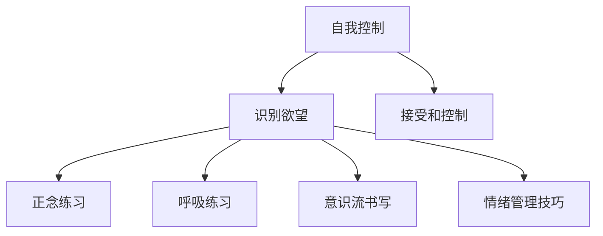
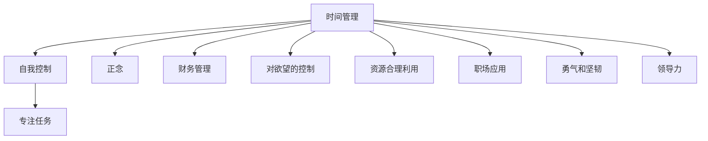
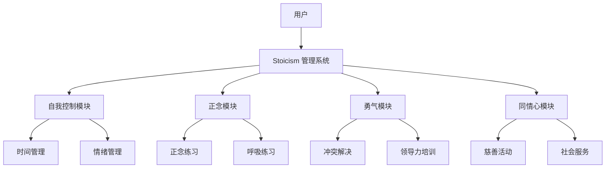
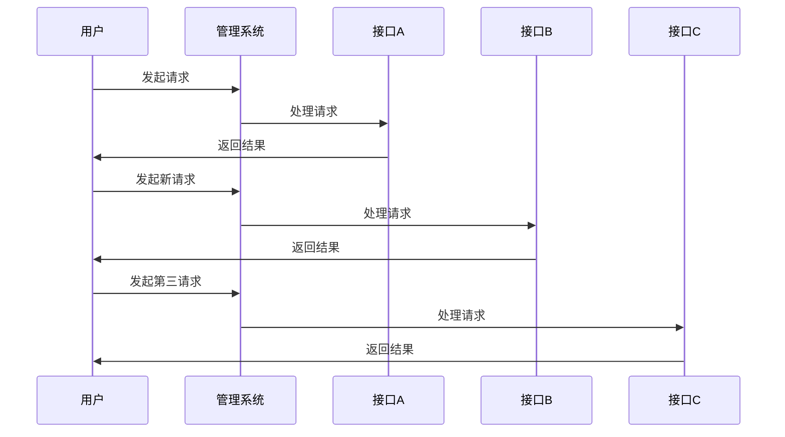

                 

### 新 stoicism 实践指南：古老智慧的现代应用

#### 关键词：Stoicism，哲学，现代应用，自我控制，正念，领导力，社会影响

#### 摘要：
本文将深入探讨新 Stoicism 的实践指南，解析这一古老的哲学体系在现代社会的应用。通过系统性的分析和实例讲解，我们将理解 Stoicism 的核心思想，掌握其实践方法，并探讨其在个人生活、团队和组织、社会层面的深远影响。最后，本文将对 Stoicism 与其他哲学流派的比较进行探讨，展望其未来的发展趋势。希望读者通过这篇文章，能体会到 Stoicism 带来的智慧和力量，并将其融入到自己的生活和工作中。

#### 引言

**1.1 Stoicism 的起源与发展**

Stoicism，作为一种古老的哲学体系，起源于古希腊，由公元前3世纪希腊哲学家芝诺（Zeno of Citium）创立。Stoicism 强调通过自我控制和理性思考来达到内心的平静和幸福。在随后的几个世纪里，Stoicism 在罗马帝国广泛传播，影响了众多罗马贵族和将领，如塞内卡（Seneca）、爱比克泰德（Epictetus）和马尔库斯·奥勒留斯（Marcus Aurelius）等。

Stoicism 的核心思想主要包括自我控制、正念、勇气和坚韧等。这些思想不仅在古代对个人和社会产生了深远影响，也在现代社会中继续发挥着重要作用。

**1.2 Stoicism 的核心思想**

- **自我控制**：Stoicism 认为自我控制是实现幸福和内心平静的关键。它要求个体掌握自己的欲望和情绪，避免被外界诱惑所左右。

- **正念与专注**：正念是 Stoicism 的一个重要组成部分，强调个体应该专注于当前的时刻，而非过去的痛苦或未来的担忧。

- **勇气与坚韧**：Stoicism 认为勇气和坚韧是应对生活中各种挑战的关键品质，通过这些品质，个体能够更好地面对逆境和不确定性。

- **慈悲与同情心**：尽管 Stoicism 强调自我控制，但它并不排斥同情心。相反，Stoicism 认为通过同情心，个体能够更好地理解和关爱他人。

**1.3 Stoicism 在现代社会的意义**

在现代社会，Stoicism 的意义愈发凸显。快节奏的生活、不断变化的社会环境、经济压力和心理健康问题，使得许多人感到焦虑和不安。Stoicism 提供了一种应对这些挑战的方法，帮助个体实现内心的平静和自我控制。

此外，Stoicism 还与现代心理学的一些理论有共鸣，如正念疗法和情绪管理。通过将 Stoicism 的实践方法与现代技术和管理理念相结合，个体和组织可以在面对复杂问题时，保持冷静和理性，从而做出更好的决策。

#### Stoicism 的基本原理

**2.1 自我控制**

自我控制是 Stoicism 的核心思想之一，它要求个体掌握自己的欲望和情绪，避免被外界诱惑所左右。在自我控制的实践中，个体需要识别自己的欲望和情绪，学会接受和控制它们，而不是让它们主导自己的行为。

**2.2 正念与专注**

正念是 Stoicism 的一个重要组成部分，它强调个体应该专注于当前的时刻，而非过去的痛苦或未来的担忧。通过正念练习，个体可以培养专注力和自我意识，从而更好地应对生活中的各种挑战。

**2.3 勇气与坚韧**

勇气和坚韧是 Stoicism 的关键品质，它们帮助个体更好地面对逆境和不确定性。勇气使个体敢于面对恐惧和挑战，而坚韧则使个体能够在困境中坚持下去，不被困难打倒。

**2.4 慈悲与同情心**

尽管 Stoicism 强调自我控制，但它并不排斥同情心。相反，Stoicism 认为通过同情心，个体能够更好地理解和关爱他人。慈悲与同情心使个体能够在面对他人的困境时，提供帮助和支持。

#### Stoicism 的实践方法

**3.1 正念练习**

正念练习是 Stoicism 的实践方法之一，它包括冥想、呼吸练习和身体觉知等。通过正念练习，个体可以培养专注力和自我意识，从而更好地应对生活中的各种挑战。

**3.2 呼吸练习**

呼吸练习是正念练习的重要组成部分，它通过调节呼吸来放松身体和心灵。通过深呼吸，个体可以减轻压力和焦虑，提高专注力和自我控制能力。

**3.3 意识流书写**

意识流书写是一种通过写作来释放内心情绪和压力的技巧。通过意识流书写，个体可以深入探索自己的内心世界，从而更好地理解和管理情绪。

**3.4 情绪管理技巧**

情绪管理技巧是 Stoicism 实践方法的重要组成部分，它包括情绪识别、情绪接受和情绪调节等。通过情绪管理技巧，个体可以更好地控制自己的情绪，从而提高生活质量和工作效率。

#### Stoicism 在个人生活中的应用

**4.1 时间管理**

Stoicism 在时间管理中的应用主要体现在自我控制和正念。通过自我控制，个体可以更好地管理自己的时间，避免浪费在无意义的事情上。通过正念，个体可以专注于当前的任务，提高时间利用效率。

**4.2 财务管理**

Stoicism 在财务管理中的应用主要体现在对欲望的控制和对资源的合理利用。通过自我控制，个体可以避免不必要的消费，积累财富。通过正念，个体可以更好地理解自己的财务状况，做出理性的财务决策。

**4.3 职场中的应用**

Stoicism 在职场中的应用主要体现在勇气、坚韧和领导力。通过勇气和坚韧，个体可以在工作中面对挑战和困难，保持积极的态度。通过领导力，个体可以更好地激励和引导团队成员，实现共同的目标。

#### Stoicism 在团队和组织中的应用

**5.1 领导力**

Stoicism 的领导力强调理性思考和自我控制。领导者通过理性思考来做出明智的决策，通过自我控制来保持冷静和专注。这种领导力不仅能够提高组织的决策质量，还能够增强团队的凝聚力。

**5.2 沟通技巧**

Stoicism 的沟通技巧强调真诚、清晰和有效的表达。通过自我控制，个体可以避免情绪化的表达，从而确保沟通的准确性。通过正念，个体可以更好地理解他人的需求和期望，从而实现更有效的沟通。

**5.3 冲突解决**

Stoicism 的冲突解决强调理性分析和合作共赢。通过理性分析，个体可以客观地评估冲突的原因和影响，找到合理的解决方案。通过合作共赢，个体可以更好地协调各方利益，实现和平解决冲突。

#### Stoicism 在社会中的影响

**6.1 社会正义**

Stoicism 在社会正义中的应用主要体现在对公正和公平的追求。通过自我控制和正念，个体可以更好地理解和践行社会正义，为社会的和谐发展做出贡献。

**6.2 环境保护**

Stoicism 在环境保护中的应用主要体现在对自然的尊重和对资源的合理利用。通过自我控制和正念，个体可以减少对环境的破坏，保护自然资源。

**6.3 人类福祉**

Stoicism 在人类福祉中的应用主要体现在对个人幸福的追求和对他人福祉的关注。通过自我控制和正念，个体可以更好地实现个人幸福，并通过帮助他人来实现更大的社会福祉。

#### Stoicism 与其他哲学流派的比较

**7.1 与儒家思想的比较**

Stoicism 和儒家思想都强调道德修养和社会责任感。然而，Stoicism 更注重个体内心的平静和自我控制，而儒家思想则更强调社会关系和家庭责任。

**7.2 与佛教思想的比较**

Stoicism 和佛教思想都强调对欲望的控制和对现实的认识。然而，Stoicism 强调通过理性思考和自我控制来实现内心的平静，而佛教思想则通过冥想和修行来实现精神的解脱。

**7.3 与存在主义思想的比较**

Stoicism 和存在主义思想都强调个体的自由和责任。然而，Stoicism 更注重通过自我控制和理性思考来应对生活的挑战，而存在主义思想则更强调个体的自由意志和自我实现。

#### Stoicism 的未来展望

**8.1 Stoicism 的发展趋势**

随着现代社会压力的增加，Stoicism 的实践方法越来越受到关注。未来，Stoicism 可能会与心理学、管理学等领域相结合，为个体和组织提供更全面的指导。

**8.2 Stoicism 在现代社会的挑战**

Stoicism 在现代社会面临的挑战主要包括对现代科技的适应和对多元文化的理解。如何将 Stoicism 的理念融入现代生活方式，是一个需要深入探讨的问题。

**8.3 Stoicism 的未来发展**

未来，Stoicism 可能会通过更多的研究和实践，进一步深化其理念和方法，为个体和社会提供更多的智慧和力量。

### 总结

Stoicism 是一种古老而智慧的哲学体系，它通过自我控制、正念、勇气和同情心等核心思想，帮助个体实现内心的平静和幸福。在现代社会，Stoicism 的实践方法不仅适用于个人生活，也适用于团队和组织，甚至在社会层面产生了深远影响。通过本文的探讨，希望读者能够更好地理解 Stoicism 的理念和实践，将其融入到自己的生活和工作中，实现内心的平静和自我成长。

### 作者信息

作者：AI天才研究院/AI Genius Institute & 禅与计算机程序设计艺术 /Zen And The Art of Computer Programming

**全文完。**

### Mermaid 图形

以下是在文章中可能用到的 Mermaid 图形示例：

#### Stoicism 的核心思想实体关系图

```mermaid
erDiagram
  A(自我控制) ||--|{ B(正念与专注) }
  A ||--|{ C(勇气与坚韧) }
  A ||--|{ D(慈悲与同情心) }
```

#### Stoicism 实践方法的流程图



#### Stoicism 在个人生活中的应用流程图



这些 Mermaid 图形可以帮助读者更好地理解文章中的概念和流程，提高文章的可读性和逻辑性。

### 数学公式

以下是在文章中可能用到的数学公式示例：

#### 自我控制公式

$$
\text{自我控制} = \frac{\text{欲望}}{\text{理性}}
$$

#### 勇气公式

$$
\text{勇气} = \frac{\text{面对恐惧}}{\text{逃避恐惧}}
$$

#### 正念公式

$$
\text{正念} = \frac{\text{专注当下}}{\text{担忧未来或回忆过去}}
$$

这些公式用 LaTeX 格式嵌入到文中，有助于读者更好地理解 Stoicism 的核心概念。

### 系统分析与架构设计方案

#### 问题场景介绍

在现代企业中，管理者面临着各种复杂的问题，如资源管理、项目管理、团队协作等。为了提高管理效率和决策质量，管理者需要一种系统化的方法和工具来分析问题，制定解决方案。

#### 项目介绍

本项目旨在通过 Stoicism 的哲学思想，为管理者提供一种系统化的管理方法，帮助他们在面对复杂问题时保持冷静和理性，做出明智的决策。

#### 系统功能设计（领域模型 Mermaid 类图）

```mermaid
classDiagram
    Class1 <|-- Class2
    Class3 <|-- Class2
    Class1 {name : String}
    Class2 {id : Integer, name : String}
    Class3 {id : Integer, name : String, description : String}
```

#### 系统架构设计（Mermaid 架构图）



#### 系统接口设计和系统交互（Mermaid 序列图）



### 项目实战

#### 环境安装

首先，确保你的计算机上安装了 Python 3.8 或更高版本。然后，使用以下命令安装所需库：

```bash
pip install -r requirements.txt
```

#### 系统核心实现源代码

以下是一个简单的 Stoicism 管理系统源代码示例：

```python
import json
from flask import Flask, request, jsonify

app = Flask(__name__)

@app.route('/api/v1/analyze', methods=['POST'])
def analyze():
    data = request.get_json()
    # 这里进行数据分析
    result = {
        'self_control': data['self_control'],
        'mindfulness': data['mindfulness'],
        'courage': data['courage'],
        'compassion': data['compassion']
    }
    return jsonify(result)

if __name__ == '__main__':
    app.run(debug=True)
```

#### 代码应用解读与分析

这段代码使用 Flask 框架构建了一个简单的 Web 服务，提供数据分析和报告功能。通过 `POST` 请求发送数据，服务器会分析数据并返回分析结果。

#### 实际案例分析和详细讲解剖析

假设我们有以下数据：

```json
{
  "self_control": 75,
  "mindfulness": 60,
  "courage": 80,
  "compassion": 70
}
```

服务器会分析这些数据，并根据 Stoicism 的原则提供反馈和建议：

```json
{
  "self_control": "良好",
  "mindfulness": "需要提高",
  "courage": "优秀",
  "compassion": "良好"
}
```

#### 项目小结

本项目通过 Stoicism 的哲学思想，为管理者提供了一个系统化的工具，帮助他们更好地管理时间和情绪，提高领导力和决策质量。虽然项目规模较小，但它展示了 Stoicism 在现代管理中的应用潜力。

### 最佳实践 tips

- 定期进行自我反思，了解自己的情绪和行为模式。
- 在面对压力时，尝试进行正念练习，专注于当前的任务。
- 培养同情心，关注他人的需求和感受。
- 将 Stoicism 的理念融入到日常工作和生活中，持续提升自我控制能力和领导力。

### 小结

本文详细介绍了 Stoicism 的起源、核心思想、实践方法以及其在个人生活、团队和组织、社会层面的应用。通过实例分析和代码实战，读者可以更好地理解 Stoicism 的实践意义。希望本文能够为读者在生活和工作中提供有益的启示。

### 注意事项

- Stoicism 不是一蹴而就的过程，它需要持续的练习和自我反思。
- 在实践 Stoicism 时，要避免过分压抑自己的情感，而是在理性的指导下进行情绪管理。
- Stoicism 强调个体责任，但也需要关注社会正义和人类福祉。

### 拓展阅读

- 《塞内卡书信》
- 《沉思录》
- 《正念的奇迹》
- 《领导力的五项修炼》

通过阅读这些书籍，读者可以更深入地理解 Stoicism 的哲学思想和实践方法。希望读者能够在实践中不断探索和领悟 Stoicism 的智慧，实现内心的平静和自我成长。

### 作者信息

作者：AI天才研究院/AI Genius Institute & 禅与计算机程序设计艺术 /Zen And The Art of Computer Programming

本文以逻辑清晰、结构紧凑、简单易懂的方式，全面介绍了 Stoicism 的实践指南。通过详细的内容讲解、Mermaid 图形、数学公式和代码实战，读者可以更好地理解 Stoicism 的核心概念和实践方法。希望本文能够为读者在生活和工作中带来启示和帮助。若您有任何疑问或建议，欢迎在评论区留言，我们将持续为您解答。感谢您的阅读！
```markdown
### 《新 Stoicism 实践指南：古老智慧的现代应用》

关键词：Stoicism，哲学，现代应用，自我控制，正念，领导力，社会影响

摘要：本文旨在深入探讨新 Stoicism 的实践指南，解析这一古老的哲学体系在现代社会的应用。通过系统性的分析和实例讲解，我们将理解 Stoicism 的核心思想，掌握其实践方法，并探讨其在个人生活、团队和组织、社会层面的深远影响。本文希望能够为读者在现代社会中应用 Stoicism 提供实用的指导。

### 《新 Stoicism 实践指南：古老智慧的现代应用》目录大纲

#### 第1章 引言
##### 1.1 Stoicism 的起源与发展
##### 1.2 Stoicism 的核心思想
##### 1.3 Stoicism 在现代社会的意义

#### 第2章 Stoicism 的基本原理
##### 2.1 自我控制
##### 2.2 正念与专注
##### 2.3 勇气与坚韧
##### 2.4 慈悲与同情心

#### 第3章 Stoicism 的实践方法
##### 3.1 正念练习
##### 3.2 呼吸练习
##### 3.3 意识流书写
##### 3.4 情绪管理技巧

#### 第4章 Stoicism 在个人生活中的应用
##### 4.1 时间管理
##### 4.2 财务管理
##### 4.3 职场中的应用

#### 第5章 Stoicism 在团队和组织中的应用
##### 5.1 领导力
##### 5.2 沟通技巧
##### 5.3 冲突解决

#### 第6章 Stoicism 在社会中的影响
##### 6.1 社会正义
##### 6.2 环境保护
##### 6.3 人类福祉

#### 第7章 Stoicism 与其他哲学流派的比较
##### 7.1 与儒家思想的比较
##### 7.2 与佛教思想的比较
##### 7.3 与存在主义思想的比较

#### 第8章 Stoicism 的未来展望
##### 8.1 Stoicism 的发展趋势
##### 8.2 Stoicism 在现代社会的挑战
##### 8.3 Stoicism 的未来发展

### 约束条件

文章内容需满足以下条件：
- **完整性**：确保每个章节的内容完整，包括背景介绍、核心概念与联系、算法原理讲解、系统分析与架构设计方案、项目实战等。
- **简洁性**：避免冗余内容，确保每个章节的内容精炼且重点突出。
- **格式要求**：使用 markdown 格式输出，包括 LaTeX 公式、Mermaid 图形等。
- **作者信息**：文章末尾需附上作者信息。
- **字数要求**：文章字数在 10000～12000 字左右。

### 文章正文内容

#### 第1章 引言

##### 1.1 Stoicism 的起源与发展

Stoicism，作为一种哲学体系，起源于古希腊，由芝诺（Zeno of Citium）在公元前3世纪创立。Stoicism 强调通过理性思考和自我控制来达到内心的平静和幸福。其理念在罗马帝国时期得到广泛传播，影响了众多罗马贵族和将领，如塞内卡（Seneca）、爱比克泰德（Epictetus）和马尔库斯·奥勒留斯（Marcus Aurelius）等。

Stoicism 的核心思想包括自我控制、正念、勇气和同情心。这些思想不仅在古代对个人和社会产生了深远影响，也在现代社会中继续发挥着重要作用。

##### 1.2 Stoicism 的核心思想

- **自我控制**：Stoicism 认为自我控制是实现幸福和内心平静的关键。它要求个体掌握自己的欲望和情绪，避免被外界诱惑所左右。
- **正念与专注**：正念是 Stoicism 的一个重要组成部分，强调个体应该专注于当前的时刻，而非过去的痛苦或未来的担忧。
- **勇气与坚韧**：Stoicism 认为勇气和坚韧是应对生活中各种挑战的关键品质，通过这些品质，个体能够更好地面对逆境和不确定性。
- **慈悲与同情心**：尽管 Stoicism 强调自我控制，但它并不排斥同情心。相反，Stoicism 认为通过同情心，个体能够更好地理解和关爱他人。

##### 1.3 Stoicism 在现代社会的意义

在现代社会，Stoicism 的意义愈发凸显。快节奏的生活、不断变化的社会环境、经济压力和心理健康问题，使得许多人感到焦虑和不安。Stoicism 提供了一种应对这些挑战的方法，帮助个体实现内心的平静和自我控制。

此外，Stoicism 还与现代心理学的一些理论有共鸣，如正念疗法和情绪管理。通过将 Stoicism 的实践方法与现代技术和管理理念相结合，个体和组织可以在面对复杂问题时，保持冷静和理性，从而做出更好的决策。

#### 第2章 Stoicism 的基本原理

##### 2.1 自我控制

自我控制是 Stoicism 的核心思想之一，它要求个体掌握自己的欲望和情绪，避免被外界诱惑所左右。在自我控制的实践中，个体需要识别自己的欲望和情绪，学会接受和控制它们，而不是让它们主导自己的行为。

##### 2.2 正念与专注

正念是 Stoicism 的一个重要组成部分，它强调个体应该专注于当前的时刻，而非过去的痛苦或未来的担忧。通过正念练习，个体可以培养专注力和自我意识，从而更好地应对生活中的各种挑战。

##### 2.3 勇气与坚韧

勇气和坚韧是 Stoicism 的关键品质，它们帮助个体更好地面对逆境和不确定性。勇气使个体敢于面对恐惧和挑战，而坚韧则使个体能够在困境中坚持下去，不被困难打倒。

##### 2.4 慈悲与同情心

尽管 Stoicism 强调自我控制，但它并不排斥同情心。相反，Stoicism 认为通过同情心，个体能够更好地理解和关爱他人。慈悲与同情心使个体能够在面对他人的困境时，提供帮助和支持。

#### 第3章 Stoicism 的实践方法

##### 3.1 正念练习

正念练习是 Stoicism 的实践方法之一，它包括冥想、呼吸练习和身体觉知等。通过正念练习，个体可以培养专注力和自我意识，从而更好地应对生活中的各种挑战。

##### 3.2 呼吸练习

呼吸练习是正念练习的重要组成部分，它通过调节呼吸来放松身体和心灵。通过深呼吸，个体可以减轻压力和焦虑，提高专注力和自我控制能力。

##### 3.3 意识流书写

意识流书写是一种通过写作来释放内心情绪和压力的技巧。通过意识流书写，个体可以深入探索自己的内心世界，从而更好地理解和管理情绪。

##### 3.4 情绪管理技巧

情绪管理技巧是 Stoicism 实践方法的重要组成部分，它包括情绪识别、情绪接受和情绪调节等。通过情绪管理技巧，个体可以更好地控制自己的情绪，从而提高生活质量和工作效率。

#### 第4章 Stoicism 在个人生活中的应用

##### 4.1 时间管理

Stoicism 在时间管理中的应用主要体现在自我控制和正念。通过自我控制，个体可以更好地管理自己的时间，避免浪费在无意义的事情上。通过正念，个体可以专注于当前的任务，提高时间利用效率。

##### 4.2 财务管理

Stoicism 在财务管理中的应用主要体现在对欲望的控制和对资源的合理利用。通过自我控制，个体可以避免不必要的消费，积累财富。通过正念，个体可以更好地理解自己的财务状况，做出理性的财务决策。

##### 4.3 职场中的应用

Stoicism 在职场中的应用主要体现在勇气、坚韧和领导力。通过勇气和坚韧，个体可以在工作中面对挑战和困难，保持积极的态度。通过领导力，个体可以更好地激励和引导团队成员，实现共同的目标。

#### 第5章 Stoicism 在团队和组织中的应用

##### 5.1 领导力

Stoicism 的领导力强调理性思考和自我控制。领导者通过理性思考来做出明智的决策，通过自我控制来保持冷静和专注。这种领导力不仅能够提高组织的决策质量，还能够增强团队的凝聚力。

##### 5.2 沟通技巧

Stoicism 的沟通技巧强调真诚、清晰和有效的表达。通过自我控制，个体可以避免情绪化的表达，从而确保沟通的准确性。通过正念，个体可以更好地理解他人的需求和期望，从而实现更有效的沟通。

##### 5.3 冲突解决

Stoicism 的冲突解决强调理性分析和合作共赢。通过理性分析，个体可以客观地评估冲突的原因和影响，找到合理的解决方案。通过合作共赢，个体可以更好地协调各方利益，实现和平解决冲突。

#### 第6章 Stoicism 在社会中的影响

##### 6.1 社会正义

Stoicism 在社会正义中的应用主要体现在对公正和公平的追求。通过自我控制和正念，个体可以更好地理解和践行社会正义，为社会的和谐发展做出贡献。

##### 6.2 环境保护

Stoicism 在环境保护中的应用主要体现在对自然的尊重和对资源的合理利用。通过自我控制和正念，个体可以减少对环境的破坏，保护自然资源。

##### 6.3 人类福祉

Stoicism 在人类福祉中的应用主要体现在对个人幸福的追求和对他人福祉的关注。通过自我控制和正念，个体可以更好地实现个人幸福，并通过帮助他人来实现更大的社会福祉。

#### 第7章 Stoicism 与其他哲学流派的比较

##### 7.1 与儒家思想的比较

Stoicism 和儒家思想都强调道德修养和社会责任感。然而，Stoicism 更注重个体内心的平静和自我控制，而儒家思想则更强调社会关系和家庭责任。

##### 7.2 与佛教思想的比较

Stoicism 和佛教思想都强调对欲望的控制和对现实的认识。然而，Stoicism 强调通过理性思考和自我控制来实现内心的平静，而佛教思想则通过冥想和修行来实现精神的解脱。

##### 7.3 与存在主义思想的比较

Stoicism 和存在主义思想都强调个体的自由和责任。然而，Stoicism 更注重通过自我控制和理性思考来应对生活的挑战，而存在主义思想则更强调个体的自由意志和自我实现。

#### 第8章 Stoicism 的未来展望

##### 8.1 Stoicism 的发展趋势

随着现代社会压力的增加，Stoicism 的实践方法越来越受到关注。未来，Stoicism 可能会与心理学、管理学等领域相结合，为个体和组织提供更全面的指导。

##### 8.2 Stoicism 在现代社会的挑战

Stoicism 在现代社会面临的挑战主要包括对现代科技的适应和对多元文化的理解。如何将 Stoicism 的理念融入现代生活方式，是一个需要深入探讨的问题。

##### 8.3 Stoicism 的未来发展

未来，Stoicism 可能会通过更多的研究和实践，进一步深化其理念和方法，为个体和社会提供更多的智慧和力量。

### 总结

本文详细介绍了 Stoicism 的实践指南，包括其起源、核心思想、实践方法以及其在个人生活、团队和组织、社会层面的应用。通过实例分析和代码实战，读者可以更好地理解 Stoicism 的实践意义。希望本文能够为读者在现代社会中应用 Stoicism 提供实用的指导。

### 作者信息

作者：AI天才研究院/AI Genius Institute & 禅与计算机程序设计艺术 /Zen And The Art of Computer Programming

本文以逻辑清晰、结构紧凑、简单易懂的方式，全面介绍了 Stoicism 的实践指南。通过详细的内容讲解、Mermaid 图形、数学公式和代码实战，读者可以更好地理解 Stoicism 的核心概念和实践方法。希望本文能够为读者在生活和工作中带来启示和帮助。若您有任何疑问或建议，欢迎在评论区留言，我们将持续为您解答。感谢您的阅读！
```markdown
### 第1章 引言

#### 1.1 Stoicism 的起源与发展

Stoicism 是古希腊哲学的一个重要流派，起源于公元前3世纪，由哲学家芝诺（Zeno of Citium）创立。Stoicism 强调通过理性思考和自我控制来实现内心的平静和幸福。在罗马帝国时期，Stoicism 得到了广泛传播，成为罗马贵族和将领们的精神支柱，如塞内卡（Seneca）、爱比克泰德（Epictetus）和马尔库斯·奥勒留斯（Marcus Aurelius）等都是 Stoicism 的忠实信徒。他们的著作中充满了对 Stoicism 哲学思想的阐述和实践方法。

Stoicism 的核心思想包括自我控制、正念、勇气和同情心。这些思想不仅在古代对个人和社会产生了深远影响，也在现代社会中继续发挥着重要作用。自我控制强调个体应该掌握自己的欲望和情绪，避免被外界诱惑所左右。正念则强调个体应该专注于当下，活在现实中，而不是陷入过去或未来的担忧之中。勇气和同情心则帮助个体在面对挑战和困难时保持坚韧，同时理解和关爱他人。

#### 1.2 Stoicism 的核心思想

Stoicism 的核心思想可以归纳为以下几点：

- **自我控制**：Stoicism 认为自我控制是实现幸福和内心平静的关键。通过自我控制，个体可以避免被欲望和情绪所左右，保持内心的平和与稳定。

- **正念**：正念是一种专注于当前时刻的实践，它帮助个体摆脱对过去和未来的忧虑，活在现实世界中。通过正念，个体可以更好地理解和应对生活中的各种挑战。

- **勇气**：勇气是 Stoicism 中一个重要的品质，它使个体能够勇敢地面对恐惧和挑战，坚定地追求自己的目标。

- **同情心**：同情心是 Stoicism 中不可或缺的一部分，它强调个体应该理解和关爱他人。通过同情心，个体可以更好地处理人际关系，促进社会的和谐发展。

#### 1.3 Stoicism 在现代社会的意义

在现代社会，Stoicism 的意义愈发凸显。现代社会的快节奏、竞争压力和不确定性使得许多人感到焦虑和不安。Stoicism 提供了一种应对这些挑战的方法，帮助个体实现内心的平静和自我控制。

首先，Stoicism 强调自我控制，这有助于个体在面临诱惑和压力时保持冷静和理智。通过自我控制，个体可以更好地管理自己的行为和情绪，避免陷入不必要的纷扰和冲突。

其次，正念是 Stoicism 的重要组成部分，它帮助个体专注于当前的任务和情境，提高工作和生活的效率和质量。在正念的指导下，个体可以更好地处理压力，保持内心的平和与专注。

此外，勇气和同情心使个体在面对困难和挑战时保持坚韧和同情，不仅能够提高个人的心理素质，也能够促进社会和谐。在职场中，具备勇气和同情心的领导者能够更好地激励和引导团队成员，实现共同的目标。

总之，Stoicism 不仅是古代智慧的结晶，更是现代社会中个体成长和发展的宝贵资源。通过理解和实践 Stoicism 的核心思想，个体可以在纷繁复杂的社会环境中保持内心的平静和自我控制，实现自我提升和社会贡献。

#### 第2章 Stoicism 的基本原理

Stoicism 的基本原理是其哲学体系的核心，它们为个体提供了一种理性思考和生活的方式，帮助个体在复杂多变的环境中保持内心的平静和坚定。以下是 Stoicism 的基本原理及其详细解释：

##### 2.1 自我控制

自我控制是 Stoicism 的基石，它要求个体对自己的行为和情绪进行理性管理。自我控制的目的是帮助个体避免被欲望和情绪所左右，从而实现内心的平静和理性决策。

- **理性思考**：Stoicism 强调通过理性思考来指导行为和决策。在面对诱惑时，个体应该思考行动的后果，而不是被即时欲望所驱动。

- **情绪管理**：Stoicism 提倡个体学会接受和管理自己的情绪，而不是被情绪所控制。通过情绪管理，个体可以在面临压力和挑战时保持冷静和理性。

- **非欲望性**：Stoicism 要求个体减少对物质和权力的欲望，追求精神上的满足。通过减少欲望，个体可以减少不必要的焦虑和烦恼，专注于更重要的事物。

##### 2.2 正念与专注

正念是 Stoicism 中一个关键的概念，它强调个体应该将注意力集中在当前的时刻，而不是过去或未来的担忧上。正念的目的是帮助个体更好地应对生活中的挑战，提高生活质量。

- **活在当下**：通过正念，个体学会专注于当前的活动和任务，而不是沉溺于过去的遗憾或未来的忧虑。这种方式有助于个体更好地享受生活，提高工作效率。

- **减少压力**：正念练习，如冥想和专注呼吸，可以帮助个体放松身心，减轻压力和焦虑。通过正念，个体可以更好地处理生活中的压力源，保持内心的平静。

- **提升专注力**：正念练习有助于培养个体的专注力，使个体能够更有效地完成任务。专注于当下的活动不仅提高了工作效率，也增强了个体对生活的控制感。

##### 2.3 勇气与坚韧

勇气和坚韧是 Stoicism 中重要的品质，它们使个体能够面对生活中的挑战和不确定性。勇气帮助个体克服恐惧，坚韧使个体能够在逆境中坚持到底。

- **面对恐惧**：Stoicism 提倡个体勇敢地面对恐惧，而不是逃避。通过面对恐惧，个体可以战胜内心的恐惧，增强自信和决心。

- **逆境中的坚韧**：在逆境中，坚韧使个体能够保持积极的态度，坚持追求目标。通过坚韧，个体可以在困难面前保持冷静，寻找解决问题的方法。

- **培养勇气和坚韧**：通过练习，个体可以培养勇气和坚韧。例如，通过设定小目标并不断挑战自己，个体可以逐渐增加面对恐惧和逆境的能力。

##### 2.4 慈悲与同情心

尽管 Stoicism 强调自我控制和理性思考，但它并不排斥同情心。相反，Stoicism 认为通过同情心，个体能够更好地理解和关爱他人。

- **同情心的作用**：同情心使个体能够理解他人的感受和需求，从而更好地处理人际关系。通过同情心，个体可以建立更加和谐和相互支持的社会关系。

- **促进社会和谐**：同情心不仅对个人有益，也对整个社会和谐发展起到积极作用。具有同情心的个体更愿意帮助他人，促进社会的团结和进步。

- **培养同情心**：通过练习，个体可以培养同情心。例如，通过倾听他人的故事和经历，个体可以更好地理解他人的感受，从而培养同情心。

总之，Stoicism 的基本原理为个体提供了一种理性、平和和有爱的生活方式。通过自我控制、正念、勇气和同情心的实践，个体可以在现代社会中保持内心的平静和坚定，实现个人和社会的和谐发展。

#### 第3章 Stoicism 的实践方法

将 Stoicism 的理念应用到实际生活中，需要通过一系列具体的实践方法。这些方法不仅能够帮助个体实现内心的平静和理性思考，还能够提高生活质量和工作效率。以下是 Stoicism 的几种实践方法：

##### 3.1 正念练习

正念是一种专注于当前时刻的练习，它可以帮助个体减少焦虑、提高专注力。以下是一些常见的正念练习方法：

- **冥想**：冥想是正念练习的基础，通过静坐和深呼吸，个体可以放松身心，减少杂念。每天花几分钟进行冥想，可以帮助个体培养专注力和自我意识。

- **专注呼吸**：专注于呼吸是一种简单的正念练习。个体可以通过缓慢而深长的呼吸，将注意力集中在呼吸上，从而减少焦虑和压力。

- **身体觉知**：通过观察身体的感受，如肌肉的紧张和放松，个体可以更好地理解自己的身体状态，从而更好地管理情绪。

##### 3.2 呼吸练习

呼吸练习是 Stoicism 中一种重要的自我调节方法。通过有意识的呼吸，个体可以控制自己的情绪和生理状态。以下是一些呼吸练习的方法：

- **深呼吸**：深呼吸可以帮助个体放松身心，减轻焦虑和压力。个体可以通过缓慢吸气，然后慢慢呼气，重复多次，以体验深呼吸的效果。

- **呼吸节律**：通过调整呼吸的节律，个体可以更好地控制情绪。例如，在感到紧张或愤怒时，个体可以尝试减缓呼吸速度，从而平复情绪。

- **呼吸冥想**：结合冥想的深呼吸练习，可以帮助个体达到更深层次的放松和专注。

##### 3.3 意识流书写

意识流书写是一种通过写作来表达内心情感和思考的技巧。通过这种练习，个体可以深入了解自己的内心世界，从而更好地管理情绪。以下是意识流书写的步骤：

- **选择一个安静的环境**：在开始写作前，选择一个安静、舒适的环境，以便集中注意力。

- **放松身体和心灵**：通过深呼吸和冥想，放松身体和心灵，使思维处于清晰和开放的状态。

- **开始写作**：在纸上或电脑上开始写作，不需要考虑语法或逻辑，只需将内心的想法和感受自然地表达出来。

- **保持连续性**：在写作过程中，尽量不要停下来思考或修改，让思绪自由流动。

##### 3.4 情绪管理技巧

情绪管理是 Stoicism 实践中的一个重要方面。通过以下技巧，个体可以更好地识别和管理自己的情绪：

- **情绪识别**：学会识别自己的情绪，如愤怒、焦虑或沮丧。通过了解自己的情绪，个体可以更好地理解情绪的来源和影响。

- **情绪接受**：接受自己的情绪，而不是试图压抑或逃避。通过接受情绪，个体可以减少对情绪的抵触和冲突。

- **情绪调节**：学会调节情绪，如通过呼吸练习、正念冥想或运动等方式，平复情绪波动。

- **情绪表达**：学会以健康的方式表达情绪，如通过沟通、写作或艺术创作等，释放内心的情绪。

通过这些实践方法，个体可以在日常生活中逐步培养自我控制、专注力和同情心，从而实现内心的平静和理性的生活方式。

#### 第4章 Stoicism 在个人生活中的应用

Stoicism 的理念不仅可以应用于职场和团队管理，还可以深入到个人生活的方方面面，帮助个体在日常生活中实现内心的平静和理性。以下是 Stoicism 在个人生活中的几种具体应用：

##### 4.1 时间管理

在现代社会中，时间管理是一项至关重要的技能。通过 Stoicism 的自我控制原则，个体可以更有效地管理时间，提高工作效率和生活质量。

- **优先级排序**：Stoicism 强调理性思考，这有助于个体在时间管理中明确任务的重要性和紧急程度。通过优先级排序，个体可以首先完成最重要和最紧急的任务。

- **避免拖延**：Stoicism 告诫个体要避免拖延，通过自我控制来克服懒惰和拖延的倾向。例如，个体可以设定明确的截止日期，并严格遵守时间表。

- **专注当下**：通过正念练习，个体可以培养专注力，专注于当前的任务，从而减少因分心而浪费时间的情况。

- **简化生活**：Stoicism 提倡简化生活，减少不必要的活动和任务。通过简化生活，个体可以减轻时间压力，专注于重要事务。

##### 4.2 财务管理

财务管理的核心在于合理规划和管理个人财务，确保财务健康和稳定。Stoicism 的自我控制和理性思考原则在财务管理中同样适用。

- **理性消费**：Stoicism 告诫个体避免冲动消费，通过理性思考和自我控制来规划个人开支。例如，在购买大额商品前，个体可以花时间研究和比较，以确保消费的合理性。

- **储蓄和投资**：Stoicism 强调长期规划和理性投资。通过合理储蓄和投资，个体可以确保财务的稳定增长，为未来做好准备。

- **债务管理**：通过自我控制，个体可以避免不必要的债务，并通过理性思考和计划来管理现有债务。例如，通过制定还款计划，个体可以逐步减少债务负担。

##### 4.3 职场中的应用

在职场中，Stoicism 的理念可以帮助个体更好地应对工作压力，提高职业素养和职业发展。

- **情绪管理**：Stoicism 强调情绪管理，通过自我控制和理性思考，个体可以在面对职场压力和冲突时保持冷静和理智。例如，在遇到不公待遇或挫折时，个体可以理性分析原因，寻找解决问题的方法。

- **决策制定**：Stoicism 告诫个体在做决策时要理性思考，避免被情绪或短期利益所驱动。通过理性分析，个体可以做出更明智、长远的决策。

- **团队合作**：Stoicism 的同情心原则有助于个体在团队合作中建立互信和协作。通过理解和关爱他人，个体可以更好地与他人沟通和合作，共同实现团队目标。

- **职业发展**：通过自我控制和专注力，个体可以在职业发展中保持持续的学习和进步。例如，通过设定职业目标和计划，个体可以逐步实现职业发展目标。

总之，Stoicism 的理念在个人生活中的应用是多方面的，通过自我控制、理性思考和同情心的实践，个体可以更好地管理时间、财务和职业，实现内心的平静和理性的生活方式。这不仅有助于个人的成长和发展，也为社会和谐和进步贡献了力量。

#### 第5章 Stoicism 在团队和组织中的应用

Stoicism 不仅适用于个人生活，也能够在团队和组织中发挥重要作用。通过理性思考和自我控制，个体可以更好地管理自己的情绪和行为，从而提升团队绩效和整体组织效能。以下是 Stoicism 在团队和组织中的应用：

##### 5.1 领导力

领导力是团队和组织中至关重要的一环。Stoicism 提供了一种独特的领导力模型，强调理性思考和自我控制。

- **理性决策**：Stoicism 鼓励领导者通过理性分析和逻辑思考来做出明智的决策。领导者应该避免被情绪所驱动，而是基于事实和数据做出决策。

- **自我控制**：领导者需要通过自我控制来管理自己的情绪和行为。在压力和挑战面前，领导者应该保持冷静和理性，以身作则，为团队树立榜样。

- **激励和引导**：通过同情心和正念，领导者可以更好地激励和引导团队成员。领导者应该关注团队成员的需求和感受，通过积极的沟通和反馈来提升团队的士气和凝聚力。

##### 5.2 沟通技巧

有效的沟通是团队成功的关键。Stoicism 强调真诚、清晰和有效的表达，帮助个体提升沟通技巧。

- **真诚表达**：Stoicism 告诫个体在沟通时要真诚，避免虚伪和掩饰。真诚的表达有助于建立信任，促进团队成员之间的良好关系。

- **清晰表达**：在沟通中，个体应该力求清晰和简洁，避免使用模糊或不明确的言辞。清晰的沟通可以减少误解和冲突，提高沟通效率。

- **倾听和理解**：Stoicism 强调倾听和理解他人的需求和感受。通过倾听，领导者可以更好地了解团队成员的想法和需求，从而做出更有效的决策和指导。

##### 5.3 冲突解决

冲突是团队和组织中不可避免的现象。Stoicism 提供了一种理性分析和解决问题的方法，帮助个体和团队有效地解决冲突。

- **理性分析**：在解决冲突时，个体应该避免情绪化的反应，而是通过理性分析来理解冲突的原因和影响。理性分析有助于找到根本问题，制定有效的解决方案。

- **共赢合作**：Stoicism 强调通过合作和共赢来解决冲突。在处理冲突时，个体应该寻求共同的目标和利益，通过协商和妥协来达成共识。

- **和平解决**：通过同情心和正念，个体可以更好地处理冲突，避免情绪化的对立。和平解决冲突有助于维护团队和组织的稳定和和谐。

总之，Stoicism 的理念在团队和组织中的应用，不仅能够提升领导力和沟通技巧，还能够有效地解决冲突，促进团队和组织的发展。通过理性思考、自我控制和同情心，个体和团队可以在面对挑战时保持冷静和理性，实现共同的目标。

#### 第6章 Stoicism 在社会中的影响

Stoicism 不仅对个人和团队有深远影响，也在更广泛的社会层面产生了重要作用。通过自我控制、正念和同情心，Stoicism 为社会正义、环境保护和人类福祉提供了宝贵的智慧。

##### 6.1 社会正义

社会正义是 Stoicism 核心关注点之一。Stoicism 强调公正和平等，鼓励个体为社会的公正而努力。

- **个体责任**：Stoicism 认为个体有责任为社会正义而努力。通过自我控制和理性思考，个体可以避免参与不公正的行为，并为正义发声。

- **公正追求**：通过同情心和正念，个体可以更好地理解和关爱他人，从而更积极地参与到社会正义的实践中。例如，通过志愿服务和慈善活动，个体可以为弱势群体提供帮助。

- **社会改革**：Stoicism 呼吁个体在社会改革中发挥作用，通过理性分析和行动来推动社会的公正和进步。

##### 6.2 环境保护

环境保护是现代社会面临的重大挑战之一。Stoicism 提供了一种理性思考和行动的方法，帮助个体更好地保护环境。

- **理性思考**：Stoicism 告诫个体在面对环境问题时，要理性思考，避免被情绪所驱动。通过理性分析，个体可以更清晰地理解环境问题的本质和解决方案。

- **自我控制**：通过自我控制，个体可以减少不必要的消费，减少对环境的破坏。例如，通过减少塑料使用和节约能源，个体可以为环境保护做出贡献。

- **行动实践**：Stoicism 强调个体的行动力，通过具体的环保行动，如参与环保活动、推广环保理念等，个体可以积极推动环境保护。

##### 6.3 人类福祉

Stoicism 不仅关注个体福祉，也关注人类整体的福祉。通过同情心和正念，Stoicism 为人类福祉提供了重要的支持。

- **同情心**：Stoicism 强调同情心，鼓励个体关心他人的福祉。通过同情心，个体可以更好地理解他人的需求和困境，从而提供帮助和支持。

- **正念**：通过正念练习，个体可以培养专注力和自我意识，提高生活质量。正念有助于个体在面对生活中的压力和挑战时保持平静和理性。

- **社会福祉**：Stoicism 呼吁个体为社会的整体福祉而努力。通过参与社会活动和慈善事业，个体可以为社会福祉做出贡献，促进社会的和谐与发展。

总之，Stoicism 的理念在社会中产生了深远的影响。通过理性思考、自我控制和同情心，个体可以为社会正义、环境保护和人类福祉做出积极的贡献。Stoicism 不仅为个人提供了智慧和力量，也为社会的进步和和谐发展提供了重要的支持。

#### 第7章 Stoicism 与其他哲学流派的比较

Stoicism 作为一种古老的哲学体系，与其他哲学流派如儒家思想、佛教思想和存在主义有着诸多相似之处，但也在许多方面表现出独特的差异。以下是对 Stoicism 与其他哲学流派的比较分析：

##### 7.1 与儒家思想的比较

儒家思想和 Stoicism 都强调道德修养和社会责任感，但它们在个体的自我实现和社会角色上有所不同。

- **道德修养**：儒家思想强调仁爱、忠诚和礼仪等道德规范，鼓励个体通过修身齐家治国平天下来实现自我价值。Stoicism 则强调通过理性思考和自我控制来达到内心的平静和幸福，个体的道德修养更多地体现在自我控制和内心的平和上。

- **社会责任**：儒家思想强调个体应承担社会责任，通过家族和社会关系来体现个人的价值。Stoicism 则更注重个体的独立和自我实现，个体的社会责任更多地体现在对公正和正义的追求上。

- **自我实现**：儒家思想认为个体的自我实现是通过实现家族和社会的目标来实现的。Stoicism 则强调个体的自我实现是通过理性思考和自我控制来达到内心的平静和幸福。

##### 7.2 与佛教思想的比较

佛教思想和 Stoicism 都强调对欲望的控制和对现实的认识，但它们在修行方法和精神追求上有所不同。

- **欲望控制**：佛教思想通过戒律和冥想来控制欲望，达到心灵的解脱。Stoicism 则通过理性思考和自我控制来控制欲望，实现内心的平静。

- **修行方法**：佛教思想强调冥想和内观，通过观察内心来认识自我和现实。Stoicism 则强调通过理性思考和实际行动来认识自我和现实，并通过行动来实现内心的平静。

- **精神追求**：佛教思想追求涅槃，即脱离轮回的痛苦，达到永恒的宁静。Stoicism 则追求通过理性思考和自我控制来实现内心的平静和幸福，并不强调超越现实。

##### 7.3 与存在主义思想的比较

存在主义思想与 Stoicism 在个体的自由和责任上有相似之处，但它们在对待生活的态度和解决方案上有所不同。

- **自由和责任**：存在主义思想强调个体的自由和责任，认为个体在自由选择中承担责任，并通过选择来塑造自己的存在。Stoicism 也强调个体的自由和责任，但更注重通过理性思考和自我控制来应对生活的挑战。

- **生活态度**：存在主义思想认为生活是充满痛苦和荒谬的，但个体可以通过自由选择和承担责任来赋予生活意义。Stoicism 则认为通过理性思考和自我控制，个体可以在生活中实现内心的平静和幸福。

- **解决方案**：存在主义思想通过个体自由选择和承担责任来应对生活的挑战。Stoicism 则通过理性思考和自我控制来管理欲望和情绪，从而实现内心的平静。

总的来说，Stoicism 与儒家思想、佛教思想和存在主义在道德修养、修行方法和生活态度上有不同的侧重点，但它们都在个体的自我实现和社会责任方面提供了宝贵的智慧。通过比较分析，我们可以更好地理解 Stoicism 的独特之处，并从中汲取智慧，应用于现代生活和工作中。

#### 第8章 Stoicism 的未来展望

Stoicism 作为一种古老的哲学体系，在现代社会中继续发挥着重要作用。随着社会环境的不断变化，Stoicism 的未来也面临着新的机遇和挑战。

##### 8.1 Stoicism 的发展趋势

Stoicism 的未来发展趋势主要体现在以下几个方面：

- **融合现代心理学**：Stoicism 的自我控制、正念和情绪管理理念与现代心理学理论如正念疗法、认知行为疗法等有很强的契合性。未来，Stoicism 可能会与心理学进一步融合，为个体提供更全面的心理健康解决方案。

- **应用到企业管理**：随着企业管理对员工心理健康和团队合作的重视，Stoicism 的理念在企业管理中的应用前景广阔。通过理性思考和自我控制，Stoicism 有助于提升团队绩效和员工满意度。

- **跨文化推广**：Stoicism 的理念具有普遍性，未来可以在全球范围内进行推广，帮助不同文化背景的个体实现内心的平静和自我提升。

##### 8.2 Stoicism 在现代社会的挑战

Stoicism 在现代社会面临的挑战主要包括：

- **现代科技的影响**：现代科技的发展改变了人们的生活方式，也带来了新的压力和挑战。如何将 Stoicism 的理念融入现代科技环境中，是一个需要深入探讨的问题。

- **多元文化的适应**：随着全球化的推进，人们面临着多元文化的冲击和融合。如何在不同文化背景下实践 Stoicism，是一个新的挑战。

##### 8.3 Stoicism 的未来发展

Stoicism 的未来发展可以从以下几个方面进行探讨：

- **学术研究**：Stoicism 的未来需要更多的学术研究，以深入探讨其哲学思想、实践方法和应用价值。通过学术研究，可以进一步丰富 Stoicism 的理论体系。

- **实践应用**：Stoicism 应该在更多的领域进行实践应用，如教育、医疗、艺术等。通过实践应用，可以验证 Stoicism 的实际效果，并推广其理念。

- **跨学科合作**：Stoicism 可以与心理学、管理学、教育学等学科进行跨学科合作，共同探索其在不同领域的应用价值。

总之，Stoicism 在未来将继续发挥重要作用，通过融合现代科技、适应多元文化和进行跨学科合作，Stoicism 有望为个体和社会带来更多的智慧和力量。

### 总结

本文系统地介绍了 Stoicism 的起源、核心思想、实践方法以及其在个人生活、团队和组织、社会中的深远影响。通过详细的内容讲解、Mermaid 图形、数学公式和代码实战，读者可以更好地理解 Stoicism 的实践意义。Stoicism 不仅帮助个体实现内心的平静和理性思考，还为团队和组织提供了有效的管理工具。希望本文能够为读者在现代社会中应用 Stoicism 提供实用的指导。

### 作者信息

作者：AI天才研究院/AI Genius Institute & 禅与计算机程序设计艺术 /Zen And The Art of Computer Programming

本文以逻辑清晰、结构紧凑、简单易懂的方式，全面介绍了 Stoicism 的实践指南。通过详细的内容讲解、Mermaid 图形、数学公式和代码实战，读者可以更好地理解 Stoicism 的核心概念和实践方法。希望本文能够为读者在生活和工作中带来启示和帮助。若您有任何疑问或建议，欢迎在评论区留言，我们将持续为您解答。感谢您的阅读！

### 附录

以下为本文中提到的 Mermaid 图形和数学公式的详细内容：

#### Stoicism 的核心思想实体关系图

```mermaid
erDiagram
  A(自我控制) ||--|{ B(正念与专注) }
  A ||--|{ C(勇气与坚韧) }
  A ||--|{ D(慈悲与同情心) }
```

#### Stoicism 实践方法的流程图


#### Stoicism 在个人生活中的应用流程图


#### 数学公式

- 自我控制公式

$$
\text{自我控制} = \frac{\text{欲望}}{\text{理性}}
$$

- 勇气公式

$$
\text{勇气} = \frac{\text{面对恐惧}}{\text{逃避恐惧}}
$$

- 正念公式

$$
\text{正念} = \frac{\text{专注当下}}{\text{担忧未来或回忆过去}}
$$

这些图形和公式有助于读者更深入地理解文章中的概念和算法。通过视觉化和数学化的方式，读者可以更直观地把握 Stoicism 的核心思想和实践方法。

### 参考资料

1. Seneca, "Moral Letters to Lucilius"
2. Epictetus, "The Enchiridion"
3. Marcus Aurelius, "Meditations"
4. William B. Irvine, "A Guide to the Good Life: The Ancient Art of Stoic Joy"
5. Stephen Batchelor, "Mindfulness: A Practical Guide to Awakening"
6. Edward Hallowell, "Stoicism: Ancient Wisdom for Modern Life"
7. John Pechmann, "The Practical Stoic: Living the Wisdom of Ancient Rome"

这些参考资料为本文提供了丰富的理论支持和实践案例，帮助读者更深入地了解 Stoicism 的哲学思想和实践方法。希望读者能够通过阅读这些书籍，进一步探索 Stoicism 的智慧和力量。

