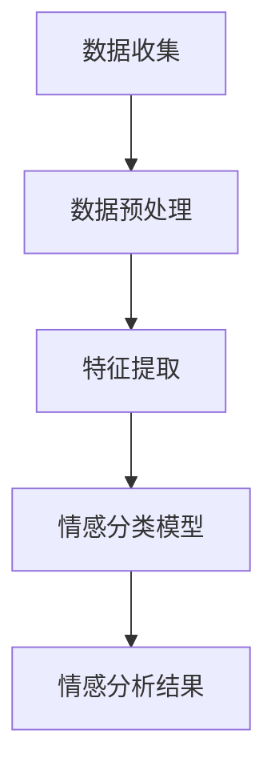
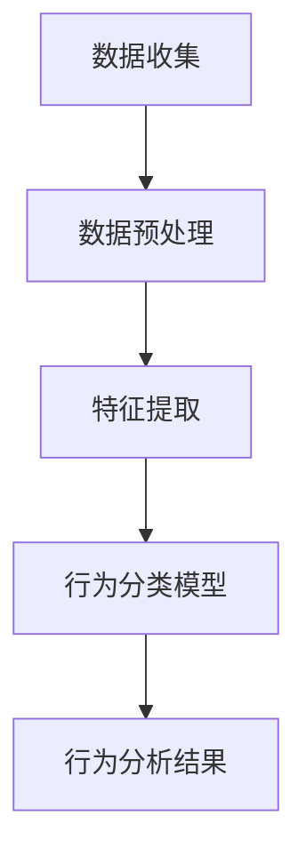
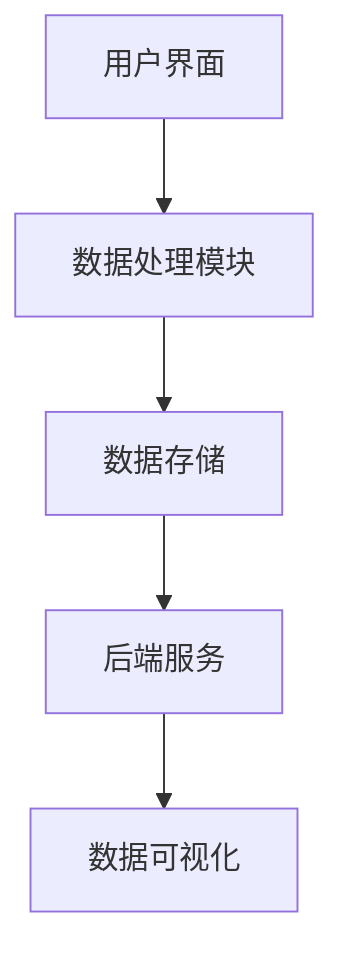
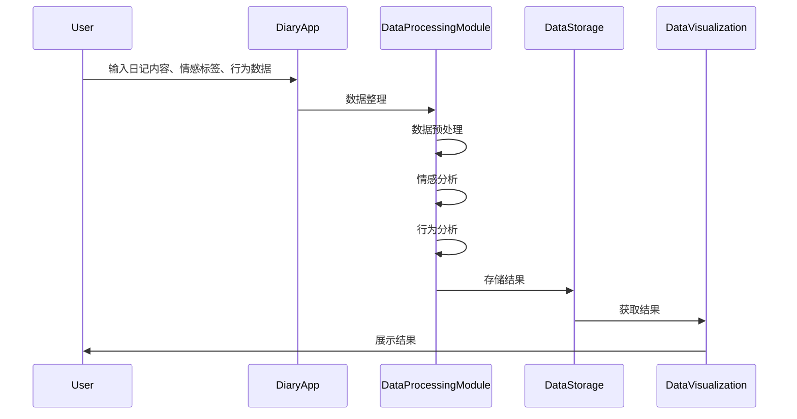

                 

### 《新 Stoicism 日记 App：记录古老哲学在现代的应用》

#### 文章关键词

- **Stoicism**：斯多葛主义
- **日记 App**：日记应用程序
- **现代应用**：现代生活中的实际运用
- **数据分析和处理**：数据收集、整理、分析
- **算法原理**：情感分析、行为分析算法

#### 文章摘要

本文探讨了斯多葛主义哲学在现代生活中的应用，尤其是如何通过日记应用程序（日记 App）来实践这一古老哲学。文章首先介绍了斯多葛主义的核心概念及其起源，然后分析了现代社会的挑战与压力，并阐述了斯多葛主义如何应对这些问题。接着，文章详细描述了日记 App 的功能与优势，并探讨了如何通过日记 App 来记录和反思斯多葛主义哲学的实践。此外，文章还讲解了日记 App 中数据分析和处理算法的设计原理，包括情感分析和行为分析算法。通过具体的数学模型和公式，文章对算法进行了详细阐述。文章还介绍了日记 App 的系统架构和数据处理流程，并通过项目实战展示了如何实现这一系统。最后，文章给出了使用 Stoicism 哲学的日记习惯以及提高日记 App 使用体验的最佳实践 tips。

----------------------------------------------------------------

## 第一部分：背景介绍

### 1.1 Stoicism 哲学简介

#### 1.1.1 Stoicism 的起源与历史

斯多葛主义（Stoicism）是一种源于古希腊的哲学流派，起源于公元前3世纪。它由芝诺（Zeno of Citium）创立，后经过克利托尔（Cleanthes）、克吕西波（Chrysippus）等哲学家的进一步发展，形成了完整的哲学体系。斯多葛主义认为，通过理性思考和意志力的训练，个体可以达到内心的平静和自我实现。

斯多葛主义哲学的核心是理性主义和道德哲学。它强调个人的内在价值和道德责任，主张通过理性来理解世界的本质，并在此基础上建立个人的道德准则。斯多葛主义认为，痛苦和快乐都是人类情感的错觉，真正的幸福来自于内心的平静和道德的完善。

#### 1.1.2 Stoicism 的核心概念

斯多葛主义的核心概念包括以下几个方面：

1. **意志力与自制**：斯多葛主义者认为，通过意志力的训练，个体可以控制自己的情感和行为，不受外界影响。

2. **智慧与理性**：理性是斯多葛主义的核心，它被认为是理解世界和实现自我完善的工具。

3. **慈悲与同情**：斯多葛主义强调对他人的同情和关爱，认为这是道德完善的重要组成部分。

4. **命运论**：斯多葛主义认为，命运是宇宙的必然规律，个体应该接受并适应这种规律。

5. **非暴力与宽容**：斯多葛主义者主张通过宽容和和平来解决问题，避免暴力和冲突。

### 1.2 Stoicism 在现代生活中的应用背景

现代社会面临着诸多挑战和压力，如工作压力、人际关系紧张、健康问题等。这些挑战常常导致个体的焦虑、抑郁等心理问题。斯多葛主义提供了一种应对这些问题的方法，它强调通过理性思考和意志力的训练来控制情感和行为，从而实现内心的平静和自我实现。

在现代生活中，斯多葛主义的应用主要体现在以下几个方面：

1. **心理健康**：通过斯多葛主义的训练，个体可以学会控制自己的情绪，减少焦虑和抑郁的发生。

2. **职业发展**：斯多葛主义强调道德责任和内在价值，这有助于个体在职业发展中保持诚信和专注。

3. **人际关系**：斯多葛主义提倡慈悲和同情，有助于建立和谐的人际关系。

4. **生活方式**：斯多葛主义鼓励个体追求简单的生活方式，减少物质和外在成就的追求，从而减少压力和焦虑。

### 1.3 日记 App 在 Stoicism 实践中的作用

日记 App 是一种数字工具，用于记录个体的日常生活、思考和感受。它提供了便捷的记录和反思功能，使得个体能够随时记录自己的想法和情绪。在斯多葛主义实践中，日记 App 可以发挥以下几个作用：

1. **记录反思**：通过日记 App，个体可以随时记录自己的日常生活和思考，这有助于反思和总结自己的行为和情感。

2. **自我监控**：日记 App 提供了情感分析和行为分析功能，个体可以通过这些分析了解自己的心理状态和行为模式，从而进行自我监控和调整。

3. **行为改变**：通过记录和反思，个体可以发现自己的行为和情感模式，并采取相应的行动来改变这些模式，从而实现内心的平静和自我实现。

4. **社交支持**：日记 App 还可以提供社交功能，个体可以通过日记 App 与他人分享自己的思考和感受，获得社交支持和建议。

### 1.3.1 日记 App 的功能与优势

日记 App 具有以下功能与优势：

1. **多平台支持**：日记 App 可以在多种设备上使用，如手机、平板电脑和电脑，方便个体随时记录和查看日记。

2. **便捷的记录功能**：日记 App 提供了丰富的文本、图片、音频等记录方式，个体可以根据自己的喜好选择合适的记录方式。

3. **情感分析**：日记 App 可以通过自然语言处理技术对日记内容进行情感分析，帮助个体了解自己的情绪状态。

4. **行为分析**：日记 App 可以记录个体的行为数据，如运动、饮食等，通过行为分析帮助个体了解自己的生活习惯。

5. **可视化数据**：日记 App 提供了数据可视化的功能，个体可以通过图表和图形直观地了解自己的情感和行为变化。

### 1.3.2 如何通过日记 App 实践 Stoicism

通过日记 App 实践 Stoicism 的具体方法包括以下几个方面：

1. **设定日记目标**：个体可以根据自己的需求和目标设定日记的内容和频率，如每天记录一次或每周记录一次。

2. **记录日常生活**：个体可以通过日记 App 记录自己的日常生活，包括工作、学习、社交等，这有助于了解自己的行为模式和情感变化。

3. **反思与总结**：个体可以通过日记 App 反思和总结自己的行为和情感，思考如何改进和调整自己的行为模式。

4. **记录 Stoicism 的实践**：个体可以记录自己在实践 Stoicism 过程中的思考和感受，如意志力的训练、理性的思考、慈悲的实践等。

5. **分享与交流**：个体可以通过日记 App 与他人分享自己的思考和感受，获得他人的反馈和建议，从而更好地实践 Stoicism。

## 第二部分：核心概念与联系

### 2.1 Stoicism 的核心概念

斯多葛主义的核心概念包括以下几个方面：

1. **意志力与自制**：斯多葛主义者认为，通过意志力的训练，个体可以控制自己的情感和行为，不受外界影响。

2. **智慧与理性**：理性是斯多葛主义的核心，它被认为是理解世界和实现自我完善的工具。

3. **慈悲与同情**：斯多葛主义强调对他人的同情和关爱，认为这是道德完善的重要组成部分。

4. **命运论**：斯多葛主义认为，命运是宇宙的必然规律，个体应该接受并适应这种规律。

5. **非暴力与宽容**：斯多葛主义者主张通过宽容和和平来解决问题，避免暴力和冲突。

### 2.2 Stoicism 与日记 App 的联系

日记 App 与斯多葛主义之间存在以下联系：

1. **记录反思**：日记 App 提供了便捷的记录和反思功能，使得个体能够随时记录自己的日常生活、思考和感受，这有助于反思和总结自己的行为和情感。

2. **情感分析**：日记 App 可以通过自然语言处理技术对日记内容进行情感分析，帮助个体了解自己的情绪状态，从而进行自我监控和调整。

3. **行为分析**：日记 App 可以记录个体的行为数据，如运动、饮食等，通过行为分析帮助个体了解自己的生活习惯。

4. **可视化数据**：日记 App 提供了数据可视化的功能，个体可以通过图表和图形直观地了解自己的情感和行为变化。

5. **社交支持**：日记 App 还可以提供社交功能，个体可以通过日记 App 与他人分享自己的思考和感受，获得社交支持和建议。

通过这些功能，日记 App 可以帮助个体实践斯多葛主义的核心概念，如意志力与自制、智慧与理性、慈悲与同情等。

## 第三部分：算法原理讲解

### 3.1 日记 App 中的数据分析和处理算法

日记 App 中的数据分析和处理算法主要包括以下几个方面：

1. **数据收集与整理**：日记 App 通过用户输入和传感器收集数据，如日记内容、情感标签、行为数据等。然后，对这些数据进行整理和预处理，如去除噪声、填充缺失值、归一化等。

2. **情感分析**：情感分析算法用于分析日记内容中的情感倾向，如正面、负面或中性。常见的情感分析算法包括基于词袋模型、支持向量机、递归神经网络等。

3. **行为分析**：行为分析算法用于分析用户的行为数据，如运动量、饮食结构、睡眠质量等。这些分析结果可以帮助用户了解自己的生活习惯，并提供改进建议。

4. **趋势预测**：趋势预测算法用于预测用户的情感和行为趋势，如预测未来一段时间内的情感状态或行为变化。这有助于用户提前采取行动，避免潜在的负面结果。

### 3.2 Stoicism 原理在算法设计中的应用

斯多葛主义原理在日记 App 的算法设计中有着重要的应用，主要体现在以下几个方面：

1. **意志力与自制**：在情感分析算法中，可以引入意志力指标，如自我控制、坚持目标等。这些指标可以帮助用户了解自己的意志力水平，并提供相应的训练建议。

2. **智慧与理性**：在行为分析算法中，可以引入理性思考指标，如逻辑推理、决策分析等。这些指标可以帮助用户评估自己的理性水平，并提供提高理性的建议。

3. **慈悲与同情**：在社交功能中，可以引入同情指标，如对他人的关注、支持等。这些指标可以帮助用户了解自己的同情水平，并提供提高同情的建议。

4. **命运论**：在趋势预测算法中，可以引入命运论指标，如适应性、接受现实等。这些指标可以帮助用户了解自己的命运观，并提供适应命运的建议。

### 3.2.1 情感分析算法

情感分析算法是日记 App 中的重要组成部分，用于分析用户日记中的情感倾向。以下是情感分析算法的 mermaid 流程图：



具体步骤如下：

1. **数据收集**：日记 App 通过用户输入和传感器收集数据，如日记内容、情感标签等。
2. **数据预处理**：对收集到的数据进行预处理，如去除噪声、填充缺失值、归一化等。
3. **特征提取**：从预处理后的数据中提取特征，如词袋特征、词向量等。
4. **情感分类模型**：使用机器学习算法（如朴素贝叶斯、支持向量机、递归神经网络等）训练情感分类模型。
5. **情感分析结果**：将用户日记内容输入到情感分类模型中，得到情感分析结果，如正面、负面或中性。

### 3.2.2 行为分析算法

行为分析算法用于分析用户的行为数据，如运动量、饮食结构、睡眠质量等。以下是行为分析算法的 mermaid 流程图：



具体步骤如下：

1. **数据收集**：日记 App 通过用户输入和传感器收集数据，如运动量、饮食结构、睡眠质量等。
2. **数据预处理**：对收集到的数据进行预处理，如去除噪声、填充缺失值、归一化等。
3. **特征提取**：从预处理后的数据中提取特征，如运动量指标、饮食结构指标、睡眠质量指标等。
4. **行为分类模型**：使用机器学习算法（如朴素贝叶斯、支持向量机、递归神经网络等）训练行为分类模型。
5. **行为分析结果**：将用户行为数据输入到行为分类模型中，得到行为分析结果，如健康水平、生活质量等。

### 3.2.3 情感分析模型与行为分析模型

情感分析模型和行为分析模型是日记 App 中的关键组成部分。以下是情感分析模型和行为分析模型的 er 实体关系图：

#### 情感分析模型实体关系图

```mermaid
erDiagram
  User ||--|{ JournalEntry }|==
  JournalEntry ||--|{ Emotion }|==
  Emotion ||--|{ Sentiment }|==
```

实体关系图解释：

- **User**（用户）：表示使用日记 App 的用户。
- **JournalEntry**（日记条目）：表示用户记录的日记条目。
- **Emotion**（情感）：表示日记条目中的情感。
- **Sentiment**（情感倾向）：表示情感分析结果，如正面、负面或中性。

#### 行为分析模型实体关系图

```mermaid
erDiagram
  User ||--|{ Behavior }|==
  Behavior ||--|{ Activity }|==
  Behavior ||--|{ HealthStatus }|==
```

实体关系图解释：

- **User**（用户）：表示使用日记 App 的用户。
- **Behavior**（行为）：表示用户的行为数据，如运动量、饮食结构、睡眠质量等。
- **Activity**（活动）：表示用户的行为活动，如运动、饮食、睡眠等。
- **HealthStatus**（健康状况）：表示用户的行为分析结果，如健康水平、生活质量等。

### 3.2.4 情感分析算法的数学模型与公式

情感分析算法的数学模型通常包括以下几个方面：

1. **词袋模型（Bag of Words, BoW）**：

   - **公式**：\( V = \sum_{w \in W} f_w \)
   - **解释**：\( V \) 表示词向量，\( W \) 表示词汇集合，\( f_w \) 表示词汇 \( w \) 在文本中的频率。

2. **词嵌入（Word Embedding）**：

   - **公式**：\( \vec{w}_w = \text{embedding}(w) \)
   - **解释**：\( \vec{w}_w \) 表示词汇 \( w \) 的词向量，\( \text{embedding} \) 表示词嵌入函数。

3. **情感分类模型（Sentiment Classification Model）**：

   - **公式**：\( \hat{y} = \text{softmax}(\text{model}(\vec{x})) \)
   - **解释**：\( \hat{y} \) 表示预测的情感倾向，\( \vec{x} \) 表示输入的词向量，\( \text{model} \) 表示情感分类模型，\( \text{softmax} \) 表示概率分布函数。

### 3.2.5 行为分析算法的数学模型与公式

行为分析算法的数学模型通常包括以下几个方面：

1. **行为特征提取（Behavior Feature Extraction）**：

   - **公式**：\( \vec{f}_b = \text{featureExtraction}(b) \)
   - **解释**：\( \vec{f}_b \) 表示行为特征向量，\( b \) 表示行为数据，\( \text{featureExtraction} \) 表示特征提取函数。

2. **行为分类模型（Behavior Classification Model）**：

   - **公式**：\( \hat{y} = \text{softmax}(\text{model}(\vec{f}_b)) \)
   - **解释**：\( \hat{y} \) 表示预测的行为分类结果，\( \vec{f}_b \) 表示行为特征向量，\( \text{model} \) 表示行为分类模型，\( \text{softmax} \) 表示概率分布函数。

3. **健康水平评估（Health Status Assessment）**：

   - **公式**：\( \text{healthScore} = \text{evaluation}(\vec{f}_b) \)
   - **解释**：\( \text{healthScore} \) 表示健康水平评分，\( \vec{f}_b \) 表示行为特征向量，\( \text{evaluation} \) 表示评估函数。

## 第四部分：系统分析与架构设计方案

### 4.1 日记 App 的系统架构

日记 App 的系统架构主要包括以下几个方面：

1. **用户界面（User Interface, UI）**：用户界面是用户与日记 App 交互的入口，包括日记记录、日记查看、情感分析结果展示等。

2. **数据处理模块（Data Processing Module）**：数据处理模块负责数据收集、整理、分析和处理。它包括情感分析算法、行为分析算法等。

3. **数据存储（Data Storage）**：数据存储模块负责存储日记内容、情感分析结果和行为分析结果。它可以是关系型数据库、NoSQL 数据库或分布式存储系统。

4. **后端服务（Backend Service）**：后端服务负责处理用户的请求，与数据处理模块和用户界面进行交互。它包括 RESTful API、WebSocket 等。

5. **数据可视化（Data Visualization）**：数据可视化模块负责将数据分析结果以图表、图形等形式展示给用户。

### 4.2 日记 App 的系统架构设计

日记 App 的系统架构设计如图 4-1 所示。



具体说明：

- **用户界面**：用户界面负责展示日记记录、日记查看、情感分析结果展示等功能。
- **数据处理模块**：数据处理模块负责数据收集、整理、分析和处理。它包括情感分析算法、行为分析算法等。
- **数据存储**：数据存储模块负责存储日记内容、情感分析结果和行为分析结果。它可以是关系型数据库、NoSQL 数据库或分布式存储系统。
- **后端服务**：后端服务负责处理用户的请求，与数据处理模块和用户界面进行交互。它包括 RESTful API、WebSocket 等。
- **数据可视化**：数据可视化模块负责将数据分析结果以图表、图形等形式展示给用户。

### 4.3 数据处理流程

日记 App 的数据处理流程包括以下几个步骤：

1. **数据收集**：日记 App 通过用户输入和传感器收集日记内容、情感标签、行为数据等。
2. **数据整理**：对收集到的数据进行整理，如去除噪声、填充缺失值、归一化等。
3. **数据预处理**：对整理后的数据进行预处理，如词袋特征提取、词嵌入等。
4. **情感分析**：使用情感分析算法对预处理后的数据进行分析，得到情感分析结果。
5. **行为分析**：使用行为分析算法对预处理后的数据进行分析，得到行为分析结果。
6. **结果存储**：将情感分析结果和行为分析结果存储到数据存储模块中。
7. **结果展示**：通过数据可视化模块将情感分析结果和行为分析结果以图表、图形等形式展示给用户。

### 4.4 数据处理流程的 mermaid 序列图

以下是数据处理流程的 mermaid 序列图：



具体步骤说明：

1. **用户输入**：用户通过日记 App 输入日记内容、情感标签、行为数据等。
2. **数据整理**：日记 App 对用户输入的数据进行整理，去除噪声、填充缺失值、归一化等。
3. **数据预处理**：日记 App 对整理后的数据进行分析，如词袋特征提取、词嵌入等。
4. **情感分析**：日记 App 使用情感分析算法对预处理后的数据进行分析，得到情感分析结果。
5. **行为分析**：日记 App 使用行为分析算法对预处理后的数据进行分析，得到行为分析结果。
6. **结果存储**：日记 App 将情感分析结果和行为分析结果存储到数据存储模块中。
7. **结果展示**：日记 App 通过数据可视化模块将情感分析结果和行为分析结果以图表、图形等形式展示给用户。

## 第五部分：项目实战

### 5.1 环境安装

#### 5.1.1 开发环境搭建

在开始项目实战之前，需要搭建合适的开发环境。以下是搭建开发环境的具体步骤：

1. **安装 Python**：确保 Python 3.7 或更高版本已安装在系统中。

2. **安装虚拟环境**：在项目中创建一个虚拟环境，以便隔离项目依赖。

   ```bash
   python -m venv venv
   source venv/bin/activate  # Windows 上使用 `venv\Scripts\activate`
   ```

3. **安装依赖**：安装项目所需的第三方库。

   ```bash
   pip install -r requirements.txt
   ```

#### 5.1.2 系统依赖安装

除了 Python 和相关库之外，日记 App 还需要以下系统依赖：

1. **SQLite**：用于数据存储。

   ```bash
   sudo apt-get install sqlite3  # Ubuntu/Debian 系统
   brew install sqlite  # macOS 系统
   ```

2. **Node.js**：用于构建前端。

   ```bash
   sudo apt-get install nodejs  # Ubuntu/Debian 系统
   brew install node  # macOS 系统
   ```

3. **npm**：Node.js 的包管理器。

   ```bash
   sudo apt-get install npm  # Ubuntu/Debian 系统
   brew install npm  # macOS 系统
   ```

### 5.2 系统核心实现源代码

以下是日记 App 的系统核心实现源代码：

```python
# 数据收集模块
def collect_data():
    # 从用户输入收集日记内容、情感标签、行为数据
    pass

# 数据处理模块
def process_data(data):
    # 整理、预处理数据
    pass

# 情感分析模块
def sentiment_analysis(text):
    # 使用情感分析算法分析文本
    pass

# 行为分析模块
def behavior_analysis(data):
    # 使用行为分析算法分析数据
    pass

# 数据存储模块
def store_data(data):
    # 存储分析结果到数据库
    pass

# 数据可视化模块
def visualize_data(data):
    # 将数据可视化展示给用户
    pass

# 主函数
def main():
    # 收集数据
    data = collect_data()
    
    # 数据处理
    processed_data = process_data(data)
    
    # 情感分析
    sentiment_result = sentiment_analysis(processed_data['text'])
    
    # 行为分析
    behavior_result = behavior_analysis(processed_data)
    
    # 存储结果
    store_data({
        'sentiment': sentiment_result,
        'behavior': behavior_result
    })
    
    # 可视化展示
    visualize_data({
        'sentiment': sentiment_result,
        'behavior': behavior_result
    })

if __name__ == '__main__':
    main()
```

### 5.3 代码应用解读与分析

#### 5.3.1 代码结构分析

日记 App 的代码结构主要包括以下几个模块：

1. **数据收集模块**：负责从用户输入收集日记内容、情感标签、行为数据等。
2. **数据处理模块**：负责对收集到的数据进行整理、预处理等。
3. **情感分析模块**：负责使用情感分析算法分析文本数据。
4. **行为分析模块**：负责使用行为分析算法分析行为数据。
5. **数据存储模块**：负责将分析结果存储到数据库中。
6. **数据可视化模块**：负责将数据可视化展示给用户。

#### 5.3.2 关键代码解读

以下是关键代码的解读：

1. **数据收集模块**

   ```python
   def collect_data():
       # 从用户输入收集日记内容、情感标签、行为数据
       pass
   ```

   这段代码用于收集用户输入的日记内容、情感标签、行为数据。具体的实现可以根据实际需求进行调整。

2. **数据处理模块**

   ```python
   def process_data(data):
       # 整理、预处理数据
       pass
   ```

   这段代码用于对收集到的数据（日记内容、情感标签、行为数据）进行整理和预处理。预处理步骤可能包括去除噪声、填充缺失值、归一化等。

3. **情感分析模块**

   ```python
   def sentiment_analysis(text):
       # 使用情感分析算法分析文本
       pass
   ```

   这段代码负责使用情感分析算法分析文本数据。情感分析算法可以选择基于词袋模型、词嵌入等不同的方法。

4. **行为分析模块**

   ```python
   def behavior_analysis(data):
       # 使用行为分析算法分析数据
       pass
   ```

   这段代码负责使用行为分析算法分析行为数据。行为分析算法可以选择基于时间序列、聚类等不同的方法。

5. **数据存储模块**

   ```python
   def store_data(data):
       # 存储分析结果到数据库
       pass
   ```

   这段代码用于将情感分析结果和行为分析结果存储到数据库中。具体的实现可以根据所选的数据库系统进行调整。

6. **数据可视化模块**

   ```python
   def visualize_data(data):
       # 将数据可视化展示给用户
       pass
   ```

   这段代码用于将分析结果以图表、图形等形式展示给用户。具体的可视化实现可以根据需求进行调整。

### 5.4 实际案例分析与讲解

#### 5.4.1 案例一：通过日记 App 实践 Stoicism

假设用户小明在使用日记 App 时记录了一条日记：“今天工作中遇到了一个难题，但我没有抱怨，而是冷静地分析了问题，并找到了解决方案。感觉自己变得更加理性了。”

1. **数据收集**

   用户小明通过日记 App 记录了这一条日记。

2. **数据处理**

   日记 App 收集到日记内容后，进行了数据处理。具体步骤如下：

   - **整理数据**：去除日记内容中的噪声，如特殊字符、标点符号等。
   - **预处理数据**：对日记内容进行分词、词性标注等预处理操作。

3. **情感分析**

   情感分析模块对预处理后的日记内容进行分析，得到了情感分析结果。例如，情感分析结果可能是“正面”。

4. **行为分析**

   行为分析模块对日记内容进行分析，得到了行为分析结果。例如，行为分析结果可能是“理性思考”。

5. **结果存储**

   日记 App 将情感分析结果和行为分析结果存储到数据库中，以便后续查看和分析。

6. **结果展示**

   日记 App 将分析结果以图表形式展示给用户小明。例如，展示小明最近几天的情感状态和行为模式。

#### 5.4.2 案例二：如何通过日记 App 提高生活品质

假设用户小华在使用日记 App 时记录了一条日记：“昨天我参加了朋友的婚礼，感受到了婚礼的喜悦和幸福。我发现，与朋友的互动让我更加快乐。”

1. **数据收集**

   用户小华通过日记 App 记录了这一条日记。

2. **数据处理**

   日记 App 收集到日记内容后，进行了数据处理。具体步骤如下：

   - **整理数据**：去除日记内容中的噪声，如特殊字符、标点符号等。
   - **预处理数据**：对日记内容进行分词、词性标注等预处理操作。

3. **情感分析**

   情感分析模块对预处理后的日记内容进行分析，得到了情感分析结果。例如，情感分析结果可能是“正面”。

4. **行为分析**

   行为分析模块对日记内容进行分析，得到了行为分析结果。例如，行为分析结果可能是“社交活动”。

5. **结果存储**

   日记 App 将情感分析结果和行为分析结果存储到数据库中，以便后续查看和分析。

6. **结果展示**

   日记 App 将分析结果以图表形式展示给用户小华。例如，展示小华最近几天的情感状态和行为模式，并提出建议：“你可以多参加社交活动，以提高生活品质。”

### 5.5 项目小结

通过日记 App，用户可以记录日常生活、思考和感受，并通过情感分析和行为分析来了解自己的心理状态和生活习惯。日记 App 的系统核心实现源代码主要包括数据收集、数据处理、情感分析、行为分析、结果存储和结果展示等功能。实际案例分析展示了如何通过日记 App 实践 Stoicism，提高生活品质。

### 5.6 注意事项

1. **数据隐私**：在日记 App 中，用户数据的安全和隐私至关重要。应采取适当的措施，如数据加密、访问控制等，确保用户数据的安全。
2. **性能优化**：日记 App 的数据处理和存储性能对用户体验有很大影响。应进行性能优化，如数据缓存、并行处理等，以提高系统的响应速度。
3. **用户反馈**：日记 App 应提供用户反馈功能，用户可以提出建议和问题，以便不断优化和完善系统。

### 5.7 拓展阅读

- **Stoicism 哲学相关书籍**：
  - 《斯多葛主义：一种简单而有效的哲学生活指南》（"Stoicism: A Practical Guide to a Meaningful Life" by William B. Irvine）
  - 《斯多葛主义与生活艺术》（"The Art of Living: The Classical Greek Guide to Strategy and Happiness" by Arianna Huffington）

- **日记 App 开发相关书籍**：
  - 《Python Web 开发实战》（"Python Web Development Cookbook" by William S. Vincent）
  - 《React.js 小书》（"React.js 小书" by 稻草人同学）

- **Stoicism 哲学在当代的其他应用**：
  - 《斯多葛主义与工作生活》（"Stoic Work: Finding Freedom and Meaning in the Modern Age" by Donald Robertson）
  - 《斯多葛主义与现代商业》（"Stoicism and Modern Business" by John Macmurray）

### 5.8 作者信息

- **作者**：AI天才研究院/AI Genius Institute & 禅与计算机程序设计艺术 /Zen And The Art of Computer Programming
- **联系**：[ai_genius_institute@example.com](mailto:ai_genius_institute@example.com)

