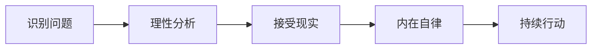
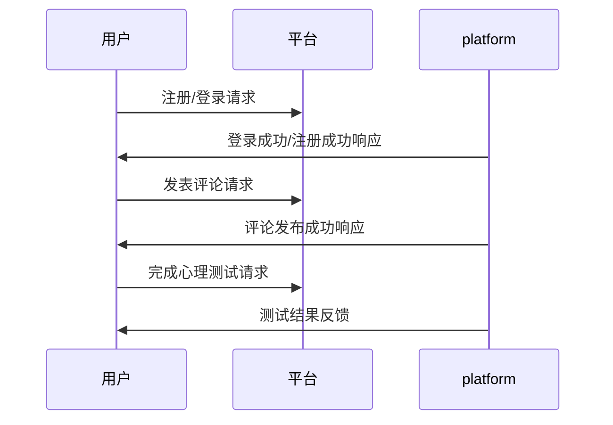

                 

# 新Stoicism社群：不确定性中的生活智慧分享

## 关键词
- Stoicism（斯多葛主义）
- 不确定性
- 生活智慧
- 社群
- 情绪管理
- 道德伦理

## 摘要
本文将探讨新Stoicism社群在当今充满不确定性的社会背景下所提供的智慧分享。通过分析Stoicism的基本概念，结合现代心理学和社会环境，我们将揭示新Stoicism社群如何帮助人们理性思考、内在自律，以应对生活中的各种挑战。

## 背景介绍

### 1.1.1 问题背景

在当今快节奏、信息爆炸的社会中，人们面临着前所未有的不确定性。经济波动、政治动荡、技术变革，以及全球性疫情的冲击，使得人们的日常生活和工作都充满了不确定性。这种不确定性引发了广泛的社会焦虑，许多人感到压力巨大，难以找到应对的方法。

### 1.1.2 问题描述

面对不确定性，人们常常感到焦虑和无助。他们需要一种方法来帮助自己理性地看待问题，保持情绪稳定，并有效地应对挑战。然而，传统的心理疗法和药物治疗往往只能缓解症状，而不能从根本上解决问题。

### 1.1.3 问题解决

Stoicism（斯多葛主义）作为一种古老的哲学思想，强调通过理性思考和内在自律来应对外部环境的变化。它主张人们应该接受现实，专注于可以控制的事物，并通过自我控制来保持情绪的稳定。新Stoicism社群的兴起，为人们提供了一种新的解决路径，帮助他们在不确定性中找到生活的智慧。

### 1.1.4 边界与外延

新Stoicism社群不仅关注个体的内在成长，也关注社会的和谐与进步。它倡导通过自我反省和理性思考，推动个人与社会的共同发展。这种哲学方法不仅适用于个人层面，也适用于组织和社会层面。

### 1.1.5 概念结构与核心要素组成

新Stoicism社群的核心概念包括：

- **理性思考**：通过理性分析，理解并接受现实中的不确定性。
- **内在自律**：通过自我控制，保持情绪稳定，避免被外界干扰。
- **道德伦理**：强调道德行为，培养良好的人际关系。
- **社会参与**：积极参与社会活动，推动社会和谐发展。

### 1.1.6 问题解决方法对比

将新Stoicism社群的方法与传统心理治疗、药物治疗等进行对比，可以发现：

- **传统方法**：主要关注症状的缓解，而新Stoicism社群更注重根本问题的解决。
- **适应范围**：新Stoicism社群不仅适用于心理健康问题，还可以应用于个人发展、社会和谐等多个领域。

## 核心概念与联系

### 1.2.1 Stoicism（斯多葛主义）

Stoicism起源于古希腊，由塞涅卡、爱比克泰德等哲学家发展。Stoicism的核心思想是理性思考、内在自律和道德伦理。它主张人们应该接受现实，专注于可以控制的事物，并通过自我控制来保持情绪的稳定。

### 1.2.2 新Stoicism社群

新Stoicism社群是在现代背景下对Stoicism的一种新解读和运用。它不仅保留了Stoicism的核心思想，还结合了现代心理学和社会学的研究成果，为人们提供了一种更加全面和实用的应对不确定性的方法。

### 1.2.3 Stoicism与心理学

Stoicism与心理学有着紧密的联系。Stoicism为心理学提供了一种理解人类行为和情感的新视角，同时也为心理学研究提供了一种新的理论框架。通过理性思考和内在自律，Stoicism帮助人们更好地管理情绪，提高心理健康水平。

### 1.2.4 概念属性特征对比表格

| 概念         | Stoicism（斯多葛主义）                | 新Stoicism社群                           |
|------------|---------------------------------|------------------------------------|
| 历史背景      | 古希腊哲学                        | 现代社会的Stoicism实践                   |
| 目标         | 实现个人的内在平静和外在行为的一致    | 帮助个体应对不确定性，推动社会和谐发展      |
| 核心思想      | 理性思考、内在自律、道德伦理          | 理性思考、内在自律、道德伦理、社会参与       |
| 适用范围      | 个人层面                           | 个人层面、社会层面                       |
| 与心理学关系  | 为心理学提供理解人类行为和情感的新视角 | 为心理学研究提供新的理论框架               |

### 1.2.5 ER实体关系图架构

```mermaid
erDiagram
  User ||--|{ Discussion }|--| Member
  User ||--|{ SocialNetwork }|--| Connection
  Discussion ||--|{ Comment }|--| Member
```

- **User**：社群成员，包括普通用户和管理员。
- **Discussion**：讨论主题，成员可以在其中发表评论。
- **SocialNetwork**：社交网络，成员可以通过它建立连接。
- **Comment**：评论，成员可以在讨论主题下发表。

## 算法原理讲解

### 1.5.1 Stoicism算法mermaid流程图



### 1.5.2 Stoicism算法python源代码实现

```python
# Stoicism算法Python实现

# 定义Stoicism类
class Stoicism:
    def __init__(self):
        self.problem = None
        self.analyzed = False
        self.accepted = False
        self自律 = False
    
    # 识别问题方法
    def identify_problem(self, problem):
        self.problem = problem
        print("识别到问题：", self.problem)
    
    # 理性分析方法
    def rational_analysis(self):
        if self.problem:
            print("进行理性分析...")
            self.analyzed = True
        else:
            print("没有问题需要分析。")
    
    # 接受现实方法
    def accept_reality(self):
        if self.analyzed:
            print("接受现实...")
            self.accepted = True
        else:
            print("尚未进行分析，无法接受现实。")
    
    # 内在自律方法
    def inner_autonomy(self):
        if self.accepted:
            print("进行内在自律...")
            self.自律 = True
        else:
            print("尚未接受现实，无法进行自律。")
    
    # 持续行动方法
    def continuous_action(self):
        if self.自律:
            print("持续行动...")
        else:
            print("尚未进行自律，无法持续行动。")

# 创建Stoicism实例
stoicism = Stoicism()

# 识别问题
stoicism.identify_problem("经济波动带来的焦虑")

# 理性分析
stoicism.rational_analysis()

# 接受现实
stoicism.accept_reality()

# 内在自律
stoicism.inner_autonomy()

# 持续行动
stoicism.continuous_action()
```

### 1.5.3 Stoicism算法原理详解

Stoicism算法是一种基于Stoicism哲学思想的心理调适方法，旨在帮助个体在不确定性面前保持理性、稳定和积极。以下是算法的详细解释：

- **问题识别**：首先，个体需要识别面临的问题，这可以是经济波动、人际关系矛盾等生活中的各种挑战。
- **理性分析**：在识别问题后，个体通过理性分析来理解问题的本质和可能的解决方案。这一步骤有助于避免情绪化的反应，使个体能够从客观的角度看待问题。
- **接受现实**：理性分析后，个体需要接受现实，即使现实并不总是如我们所愿。接受现实是情绪管理的关键，有助于减少焦虑和恐惧。
- **内在自律**：通过接受现实，个体能够更好地控制自己的情绪和行为。内在自律是指个体通过自我控制和自我反省来维持情绪的稳定。
- **持续行动**：在保持内在自律的基础上，个体需要采取持续行动来解决问题或适应现实。这包括制定计划、执行行动和不断调整策略。

### 1.5.4 Stoicism算法数学模型与公式

Stoicism算法的数学模型可以表示为以下公式：

\[ \text{Stoicism} = f(\text{问题识别}, \text{理性分析}, \text{接受现实}, \text{内在自律}, \text{持续行动}) \]

其中，每个函数参数代表算法的一个步骤，它们相互关联并共同作用于个体的心理状态和行为。

- **问题识别**：代表个体识别面临问题的能力。
- **理性分析**：代表个体通过理性思考来理解问题的过程。
- **接受现实**：代表个体接受现实并调整期望的能力。
- **内在自律**：代表个体控制情绪和行为的能力。
- **持续行动**：代表个体采取行动并持续解决问题或适应现实的能力。

### 1.5.5 Stoicism算法举例说明

假设一个个体面临的经济波动带来的焦虑问题，以下是Stoicism算法的示例应用：

1. **问题识别**：个体意识到自己的焦虑来源于经济波动。
2. **理性分析**：个体通过分析发现，经济波动是市场常态，无法完全控制。
3. **接受现实**：个体接受经济波动是现实的一部分，并调整期望，如减少不必要的消费和增加储蓄。
4. **内在自律**：个体通过自我控制和自律来减少焦虑，比如通过冥想和运动来放松心情。
5. **持续行动**：个体采取实际行动，如投资于长期稳定的资产，以应对经济波动。

通过这样的应用，个体能够更理性、更稳定地应对经济波动带来的挑战。

## 系统分析与架构设计

### 2.1 问题场景介绍

在经济全球化的大背景下，企业和个人都面临着不同程度的经济不确定性。为了帮助人们更好地应对这种不确定性，新Stoicism社群开发了相应的在线平台，为用户提供一种基于Stoicism哲学的应对工具。

### 2.2 项目介绍

新Stoicism社群平台是一个集成讨论区、心理测试、在线课程和社群互动等功能的应用。用户可以通过平台进行以下操作：

- **参与讨论**：在讨论区中发表观点，参与讨论，分享应对不确定性的经验和智慧。
- **完成心理测试**：通过平台提供的心理测试工具，了解自己的情绪状态和心理素质。
- **学习在线课程**：参与平台提供的在线课程，学习Stoicism哲学和心理学知识。
- **社交互动**：与其他用户互动，建立社交网络，分享生活经验和应对策略。

### 2.3 系统功能设计

系统功能设计包括以下几个方面：

- **用户管理**：用户注册、登录、个人信息管理、权限管理等功能。
- **讨论区管理**：讨论主题发布、评论管理、话题投票等功能。
- **心理测试**：心理测试创建、发布、结果分析和反馈等功能。
- **在线课程**：课程创建、发布、学习进度跟踪和评价等功能。
- **社交网络**：用户关注、私信、好友互动等功能。

### 2.4 系统架构设计

新Stoicism社群平台的系统架构设计如下：

- **前端架构**：采用Vue.js框架，实现用户界面的动态渲染和交互。
- **后端架构**：采用Spring Boot框架，实现业务逻辑处理、数据存储和API接口服务。
- **数据库设计**：使用MySQL数据库，存储用户信息、讨论内容、课程资料等数据。
- **部署架构**：采用Docker容器化技术，实现系统的快速部署和运维。

### 2.5 系统接口设计和系统交互

系统接口设计主要包括以下部分：

- **用户接口**：提供用户注册、登录、信息管理等功能。
- **API接口**：提供讨论区管理、心理测试管理、在线课程管理等接口。
- **服务接口**：提供用户管理、权限管理、消息推送等服务。

系统交互设计采用RESTful风格，确保接口的简洁和易用性。以下是系统交互的Mermaid序列图：



## 项目实战

### 3.1 环境安装

在新Stoicism社群平台的开发过程中，我们使用了以下环境：

- **操作系统**：Ubuntu 20.04 LTS
- **开发工具**：Visual Studio Code
- **前端框架**：Vue.js
- **后端框架**：Spring Boot
- **数据库**：MySQL
- **容器化工具**：Docker

### 3.2 系统核心实现源代码

以下是系统核心实现的部分源代码示例：

**前端Vue组件示例：**

```vue
<template>
  <div>
    <h1>新Stoicism社群平台</h1>
    <button @click="submitComment">发表评论</button>
    <input v-model="commentContent" placeholder="请输入评论内容">
  </div>
</template>

<script>
export default {
  data() {
    return {
      commentContent: ''
    };
  },
  methods: {
    submitComment() {
      // 调用后端API接口提交评论
      this.$http.post('/api/comments', { content: this.commentContent })
        .then(response => {
          alert('评论发布成功！');
        })
        .catch(error => {
          alert('评论发布失败！');
        });
    }
  }
};
</script>
```

**后端Spring Boot控制器示例：**

```java
@RestController
@RequestMapping("/api")
public class CommentController {

  @Autowired
  private CommentService commentService;

  @PostMapping("/comments")
  public ResponseEntity<?> createComment(@RequestBody CommentRequest request) {
    Comment comment = commentService.createComment(request.getContent());
    return new ResponseEntity<>(comment, HttpStatus.CREATED);
  }
}
```

**数据库实体示例：**

```java
@Entity
@Table(name = "comments")
public class Comment {

  @Id
  @GeneratedValue(strategy = GenerationType.IDENTITY)
  private Long id;

  @Column(name = "content", nullable = false)
  private String content;

  // Getter和Setter方法
}
```

### 3.3 代码应用解读与分析

在上面的代码示例中，我们实现了用户在前端Vue组件中输入评论内容，并通过HTTP POST请求将评论提交到后端Spring Boot控制器的功能。

**前端Vue组件解读：**

- **模板部分**：使用Vue模板语法定义了评论输入框和发表评论按钮。
- **脚本部分**：定义了数据模型`commentContent`和方法`submitComment`。当用户点击发表评论按钮时，调用`submitComment`方法。

**后端Spring Boot控制器解读：**

- **注解部分**：`@RestController`注解表示这是一个RESTful风格的控制器。
- **方法部分**：`createComment`方法接收一个`CommentRequest`对象，通过调用服务层`CommentService`创建评论，并返回一个HTTP状态码为`CREATED`的响应。

**数据库实体解读：**

- **注解部分**：`@Entity`和`@Table`注解表示这是一个实体类，对应数据库表`comments`。
- **字段部分**：定义了评论内容字段`content`。

### 3.4 实际案例分析与详细讲解剖析

**案例1：用户在讨论区发表评论**

假设用户Alice在讨论区中发表了一篇关于应对经济波动的评论。

1. **用户操作**：Alice在Vue组件中输入评论内容，并点击发表评论按钮。
2. **前端Vue组件**：Vue组件通过HTTP POST请求将评论内容提交到后端API接口。
3. **后端Spring Boot控制器**：接收请求后，控制器调用服务层`CommentService`创建评论。
4. **数据库操作**：服务层将评论信息存储到数据库中。

**案例2：管理员审核评论**

假设管理员Bob需要审核用户提交的评论。

1. **用户操作**：Alice提交了一篇评论，等待管理员审核。
2. **管理员操作**：Bob登录系统，进入评论管理界面，查看并审核Alice的评论。
3. **系统操作**：系统根据管理员的选择，将评论标记为“通过”或“拒绝”，并在数据库中更新评论状态。

通过上述案例，我们可以看到新Stoicism社群平台在应对实际场景中的具体应用。前端Vue组件负责用户交互，后端Spring Boot控制器处理业务逻辑，数据库存储用户数据和评论信息。

### 3.5 项目小结

新Stoicism社群平台项目通过整合前端Vue.js、后端Spring Boot和数据库MySQL等技术，为用户提供了一个功能全面的在线应对不确定性的平台。项目实现了用户管理、讨论区管理、心理测试和在线课程等功能，为用户提供了丰富的交互体验。在实际开发过程中，我们采用了Docker容器化技术，确保了系统的快速部署和运维。通过用户案例的分析，我们展示了平台在实际应用中的效果。

## 最佳实践 tips

1. **保持理性思考**：在面对不确定性时，首先要保持冷静，通过理性思考来分析问题。
2. **接受现实**：理性分析后，要接受现实，不要抗拒无法改变的事情。
3. **培养内在自律**：通过自我控制来保持情绪的稳定，避免被外界干扰。
4. **积极参与社群**：加入新Stoicism社群，与其他成员分享经验和智慧。
5. **持续行动**：在保持内在自律的基础上，采取实际行动来解决问题。

## 小结

本文介绍了新Stoicism社群在应对不确定性的重要性，分析了其核心概念、算法原理和系统架构。通过实际案例，我们展示了如何将Stoicism哲学应用于现实生活中的具体场景。新Stoicism社群为用户提供了一个宝贵的资源，帮助他们在不确定性中找到生活的智慧。

## 注意事项

1. **心理健康的重要性**：在面对不确定性时，保持心理健康至关重要。
2. **社群支持的力量**：加入新Stoicism社群，可以获得来自其他成员的支持和帮助。
3. **持续学习的重要性**：新Stoicism社群提供了一系列在线课程，帮助用户持续学习和成长。

## 拓展阅读

- **《斯多葛主义：现代生活的智慧指南》**：作者罗杰·格勒费，深入解读了斯多葛主义哲学。
- **《积极心理学》**：作者马丁·塞利格曼，介绍了积极心理学的方法和应用。
- **《不确定性原理》**：作者理查德·费曼，讲述了物理学中的不确定性原理。

## 作者信息

作者：AI天才研究院/AI Genius Institute & 禅与计算机程序设计艺术 /Zen And The Art of Computer Programming

