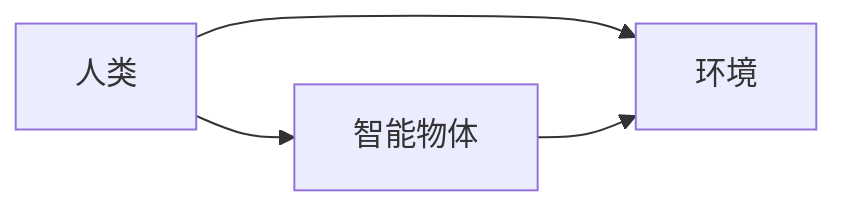
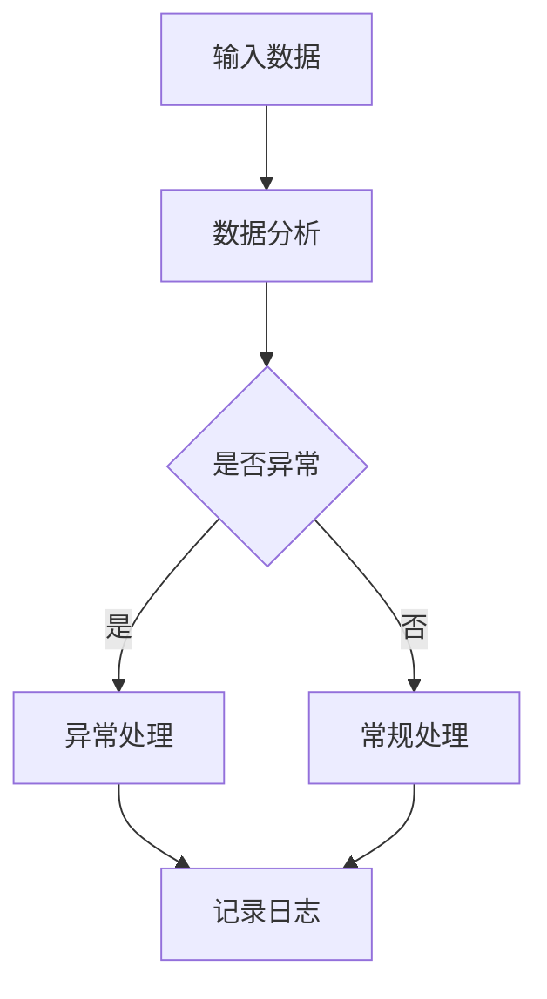
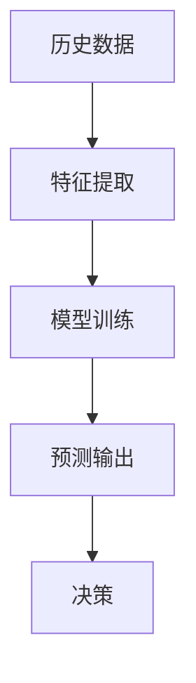
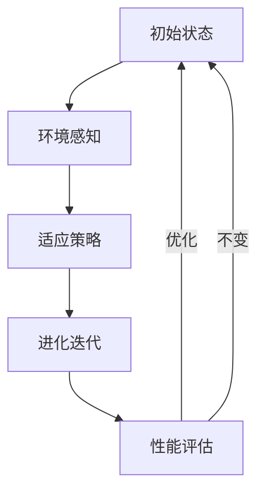
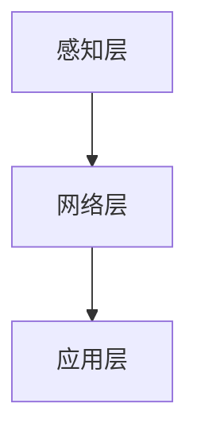
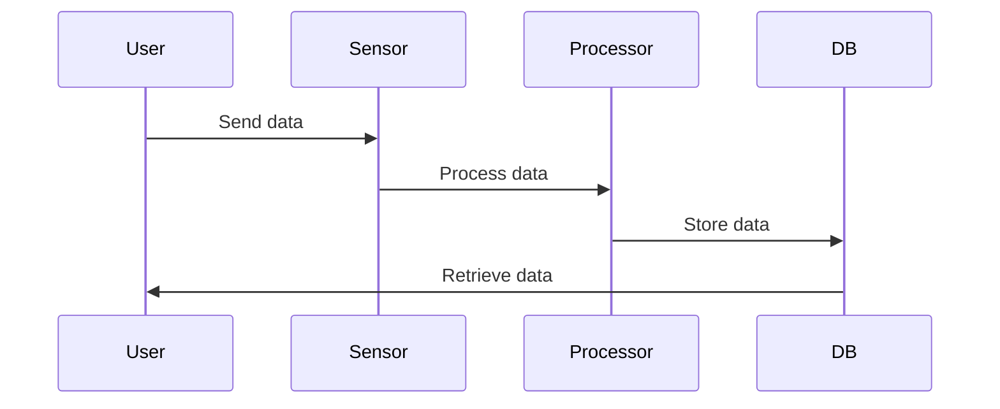

                 


### 文章标题：新万物有灵论：物联网时代的哲学思考

#### 关键词：万物有灵论、物联网、哲学、人工智能、算法、架构设计

#### 摘要：

在物联网技术快速发展的背景下，万物有灵论这一古老哲学思想在当代得到了新的诠释。本文旨在探讨物联网时代万物有灵论的哲学思考，通过逐步分析其核心概念、理论联系、算法原理以及系统架构设计，深入探讨物联网时代哲学思考的实际应用与意义。文章结构清晰，逻辑严密，旨在为读者提供一个全面、深入的物联网时代哲学思考框架。

----------------------------------------------------------------

## 第一部分：万物有灵论的起源与发展

### 1.1 问题背景

随着物联网技术的迅猛发展，万物互联成为现实，传统的哲学观念也在这一背景下发生了变化。物联网不仅改变了人类的生活方式，也对哲学领域提出了新的挑战。如何重新审视万物有灵论，以适应这一新时代的需求，成为哲学界关注的焦点。

### 1.2 物联网时代的哲学思考

万物有灵论在物联网时代具有重要的意义。它不仅挑战了人类与自然的关系，也对人工智能的发展提出了新的哲学问题。在物联网时代，如何理解智能物体与人类的关系，如何处理智能物体之间的互动，这些问题都需要从哲学的角度进行深入思考。

### 1.3 万物有灵论的边界与外延

万物有灵论的基本概念包括灵性、生命和意识等。在物联网时代，这些概念如何扩展和应用，成为哲学思考的重要内容。与传统哲学理论相比，万物有灵论在物联网时代具有独特的视角和解释力。

----------------------------------------------------------------

## 第二部分：物联网时代的哲学思考与实践

### 2.1 核心概念与联系

在物联网时代，核心概念包括智能物体、人工智能和人类与物体的互动关系。智能物体不仅具有感知和执行能力，还能够通过人工智能进行学习和决策。人类与智能物体的互动关系则决定了物联网的效率和效果。

### 2.2 概念属性特征对比表格

| 概念           | 万物有灵论视角 | 人工智能视角 | 传统哲学视角 |
|----------------|----------------|--------------|--------------|
| 智能物体       | 具有灵性       | 具有智能     | 没有特殊属性 |
| 人工智能       | 接近人类思维   | 机器学习     | 理性思维     |
| 人类与物体的关系 | 神圣不可分割   | 用户操作     | 主客体关系   |

### 2.3 ER实体关系图架构

在物联网环境中，实体关系图展示了人类、智能物体和环境之间的互动关系。这种关系不仅包括物理层面的连接，还包括信息层面的交流和决策。



----------------------------------------------------------------

## 第三部分：物联网时代的哲学算法原理

### 3.1 算法原理讲解

物联网时代的哲学算法涉及决策算法、人类行为预测与适应算法以及智能物体的自我进化算法。这些算法旨在优化人类与智能物体之间的互动，提高物联网系统的整体效率。

### 3.2 算法Mermaid流程图

#### 决策算法流程



#### 行为预测算法流程



#### 自我进化算法流程



### 3.3 Python源代码与算法原理

#### 决策算法Python代码

```python
def decision_algorithm(data):
    if is_anomaly(data):
        handle_anomaly()
    else:
        handle_normal()
    log_record()

def is_anomaly(data):
    # 数据异常判断逻辑
    return False

def handle_anomaly():
    # 异常处理逻辑

def handle_normal():
    # 常规处理逻辑

def log_record():
    # 日志记录逻辑
```

#### 行为预测算法Python代码

```python
def predict_behavior(history_data):
    features = extract_features(history_data)
    model = train_model(features)
    prediction = model.predict()
    return prediction

def extract_features(data):
    # 特征提取逻辑

def train_model(features):
    # 模型训练逻辑

def load_model():
    # 模型加载逻辑
```

#### 自我进化算法Python代码

```python
def evolve_algorithm(current_state):
    perception = perceive_environment(current_state)
    strategy = adapt_strategy(perception)
    new_state = evolve(current_state, strategy)
    performance = evaluate_performance(new_state)
    if performance > threshold:
        return new_state
    else:
        return current_state

def perceive_environment(state):
    # 环境感知逻辑

def adapt_strategy(perception):
    # 适应策略逻辑

def evolve(state, strategy):
    # 进化逻辑

def evaluate_performance(state):
    # 性能评估逻辑
```

### 3.4 数学模型和数学公式

#### 决策算法数学模型

$$
f(data) =
\begin{cases}
    handle_anomaly() & \text{if } data \text{ is anomalous} \\
    handle_normal() & \text{otherwise}
\end{cases}
$$

#### 行为预测算法数学模型

$$
\hat{y} = \text{model}(x)
$$

其中，$\hat{y}$ 为预测输出，$x$ 为输入特征，$\text{model}$ 为训练好的模型。

#### 自我进化算法数学模型

$$
s_{t+1} = s_t + \alpha \cdot (r_t - s_t)
$$

其中，$s_t$ 为当前状态，$r_t$ 为性能评估结果，$\alpha$ 为学习率。

----------------------------------------------------------------

## 第四部分：物联网时代的哲学系统分析与架构设计

### 4.1 问题场景介绍

在物联网环境中，哲学思考可以应用于多种场景，如智能家居、智能交通、智能医疗等。这些场景中的哲学问题包括伦理、隐私、安全等，需要通过系统分析与架构设计来加以解决。

### 4.2 系统功能设计

系统功能设计包括哲学思考模块、物联网数据采集模块和用户交互模块。哲学思考模块负责处理哲学问题的分析、推理和决策。物联网数据采集模块负责收集各种环境数据。用户交互模块负责与用户进行信息交换和互动。

### 4.3 系统架构设计

系统架构设计采用分层架构，包括感知层、网络层和应用层。感知层负责数据采集和预处理。网络层负责数据传输和存储。应用层负责哲学思考模块的实现。



### 4.4 系统接口设计和系统交互

系统接口设计包括数据采集接口、数据处理接口和用户交互接口。系统交互通过Mermaid序列图展示。



----------------------------------------------------------------

## 第五部分：项目实战

### 5.1 环境安装

环境安装包括Python环境、IoT开发工具和依赖库的安装。具体步骤如下：

1. 安装Python 3.8及以上版本。
2. 安装IoT开发工具，如Arduino IDE。
3. 安装依赖库，如TensorFlow、Scikit-learn等。

### 5.2 系统核心实现源代码

系统核心实现源代码包括数据采集、数据处理和哲学思考模块。以下是一个简单的数据采集模块示例。

```python
import serial

def collect_data():
    ser = serial.Serial('COM3', 9600)
    while True:
        data = ser.readline().decode('utf-8')
        process_data(data)

def process_data(data):
    # 数据处理逻辑
    pass
```

### 5.3 代码应用解读与分析

通过实际案例，展示哲学思考在物联网中的应用。例如，在智能家居场景中，如何通过哲学思考模块来优化家庭设备的交互体验。

### 5.4 详细讲解剖析

详细讲解哲学思考模块的实现原理、数据采集与处理流程以及用户交互细节。通过具体案例，展示哲学思考在物联网系统中的应用效果。

### 5.5 项目小结

项目总结中，回顾项目目标、实现过程和遇到的问题。总结经验与教训，为未来项目提供参考。

----------------------------------------------------------------

## 第六部分：最佳实践 tips、小结、注意事项、拓展阅读

### 6.1 最佳实践 tips

- 在物联网项目中，重视哲学思考的融入，以提升系统的伦理性和用户满意度。
- 定期评估和优化哲学思考模块，确保其适应性和实用性。

### 6.2 小结

本文探讨了物联网时代万物有灵论的哲学思考，通过核心概念分析、算法原理讲解和系统架构设计，展示了哲学思考在物联网中的应用价值。

### 6.3 注意事项

- 物联网哲学思考中的潜在风险包括数据隐私和安全问题，需要加强防护措施。
- 在实际应用中，要注意平衡哲学思考与系统性能，避免过度复杂化。

### 6.4 拓展阅读

- [1] Smith, A. (2019). *The Philosophy of Technology: An Introduction*. Routledge.
- [2] Anderson, C. A. (2011). *Machine Ethics*. Cambridge University Press.
- [3] Heidegger, M. (1962). *Being and Time*. Blackwell.

作者：AI天才研究院/AI Genius Institute & 禅与计算机程序设计艺术 /Zen And The Art of Computer Programming

