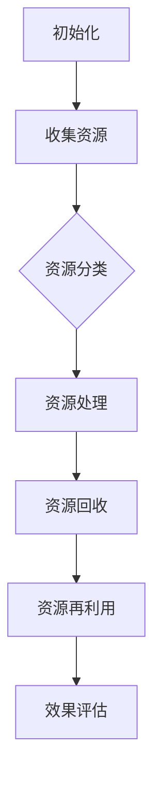

                 

### 第一部分：引言

**引言**

随着全球环境的日益恶化，可持续生活的重要性日益凸显。新乌托邦社区作为一种可持续生活的实践基地，应运而生。本文旨在深入探讨新乌托邦社区的概念、实践与未来展望，旨在为读者提供一个全面了解和思考这一新兴社会模式的视角。

**关键词**：新乌托邦社区、可持续生活、实践基地、环境保护、社会公平

**摘要**：

本文首先介绍了新乌托邦社区的基本概念及其在可持续生活中的重要作用。随后，文章从生态建设、经济模式、文化与社会治理、教育等方面详细阐述了新乌托邦社区的核心实践。接着，通过国内外典型案例的分析，总结了新乌托邦社区的实践效果与面临的挑战。最后，文章展望了新乌托邦社区的发展趋势，提出了对未来可持续生活的思考。

---

### 1.1 新乌托邦社区概述

**背景介绍**

新乌托邦社区（Utopia Communities）是一种旨在实现可持续生活的社会模式，它不仅仅是一个地理空间，更是一个社会文化理念的实践基地。新乌托邦社区起源于对现代城市化进程中环境问题、资源浪费和社会不公的反思，其核心理念是“人与自然和谐共生”。

**概念定义**

新乌托邦社区是指那些在规划、建设和管理中注重环境保护、资源节约和社会公平，通过创新技术和管理方法实现可持续发展的社区。这些社区通常具有以下特征：

- **生态优先**：社区建设注重生态保护和修复，推广绿色建筑和可持续能源。
- **资源循环利用**：社区内实现水、电、气等资源的循环利用，减少对自然资源的依赖。
- **社会参与**：社区成员积极参与社区规划和管理，共同营造和谐的社区环境。
- **文化多样性**：社区鼓励文化多样性和文化交流，促进社会和谐。

**问题背景**

全球气候变化、环境污染、资源枯竭等问题日益严重，传统的城市发展模式已无法满足人们对美好生活的追求。新乌托邦社区作为一种创新的社会实践，试图在保护环境、节约资源、促进社会公平等方面做出积极贡献。

**问题描述**

新乌托邦社区面临的挑战包括：

- **生态平衡**：如何在社区建设中保持生态平衡，避免环境破坏。
- **资源管理**：如何有效管理社区内的资源，实现可持续发展。
- **社会公平**：如何确保社区内的居民都能享有公平的发展机会和资源。

**问题解决**

新乌托邦社区通过以下方法解决上述问题：

- **生态修复与保护**：采用绿色建筑技术、可再生能源利用、生态景观设计等手段，保护社区内的生态环境。
- **资源循环利用**：建立垃圾分类系统、废水处理设施等，实现资源的循环利用。
- **社会参与与治理**：通过居民参与、社区自治等方式，提高社区治理的透明度和效率。

**边界与外延**

新乌托邦社区的范围可以从一个小型住宅区到一个大型的城市社区，其边界取决于社区的规模和目标。其外延则包括社区内的所有生活和工作场所，以及与外界的互动关系。

**概念结构与核心要素组成**

新乌托邦社区的核心概念结构由以下要素组成：

- **生态系统**：社区的生态环境和生物多样性。
- **资源系统**：社区内的资源管理和循环利用。
- **社会系统**：社区成员之间的互动和社会关系。
- **技术系统**：社区采用的技术和管理方法。

**核心概念与联系**

**概念**：新乌托邦社区

**属性**：

- **生态优先**：保护环境，实现生态平衡。
- **资源循环利用**：减少资源消耗，提高资源利用效率。
- **社会参与**：鼓励居民参与社区治理，提高社区凝聚力。
- **文化多样性**：促进文化交流，增强社区文化认同。

**特征对比表格**

| 特征       | 传统社区        | 新乌托邦社区       |
| ---------- | -------------- | ----------------- |
| 生态保护   | 有时考虑生态问题 | 生态保护为核心     |
| 资源管理   | 资源消耗大      | 资源循环利用       |
| 社区参与   | 居民参与度低    | 居民积极参与治理   |
| 文化多样   | 文化同质化      | 文化多样性         |

**ER实体关系图**

```mermaid
erDiagram
  Community ||--|{ Resident }
  Community ||--|{ Building }
  Community ||--|{ Resource }
  Resident ||--|{ Activity }
  Building ||--|{ Facility }
  Resource ||--|{ Type }
```

---

### 1.2 可持续生活的概念与意义

**背景介绍**

可持续生活（Sustainable Living）是一种旨在满足当前需求而不损害后代满足自身需求的能力的生活方式。它涉及多个方面，包括环境保护、资源管理和社会公平。

**问题背景**

全球资源过度消耗和环境恶化已成为影响人类生存和发展的重大问题。传统的生活方式往往导致资源浪费和环境破坏，无法实现长期的可持续发展。

**问题描述**

可持续生活面临的主要问题包括：

- **资源短缺**：水资源、能源、食物等资源的过度消耗。
- **环境污染**：空气污染、水污染、土壤污染等环境问题的加剧。
- **社会不公**：资源分配不均，贫富差距加大。

**问题解决**

可持续生活通过以下方法解决上述问题：

- **资源节约**：采用节能、节水等环保措施，减少资源消耗。
- **环境保护**：推广绿色能源、生态农业等环保技术，减少环境污染。
- **社会公平**：通过政策调节和社会参与，实现资源分配的公平。

**边界与外延**

可持续生活的边界取决于个人的生活方式和社区的环境条件。其外延包括个人、家庭、社区、城市等多个层面。

**概念结构与核心要素组成**

可持续生活的核心概念结构由以下要素组成：

- **环境保护**：减少环境污染，保护自然资源。
- **资源管理**：提高资源利用效率，实现可持续发展。
- **社会公平**：确保所有人都能享有公平的资源和发展机会。

**核心概念与联系**

**概念**：可持续生活

**属性**：

- **环境保护**：减少污染，保护生态环境。
- **资源节约**：提高资源利用效率，减少浪费。
- **社会公平**：实现资源分配的公平，减少贫富差距。

**特征对比表格**

| 特征       | 传统生活方式        | 可持续生活方式       |
| ---------- | ------------------ | ------------------- |
| 环境保护   | 环境意识较弱        | 环境保护为核心       |
| 资源管理   | 资源浪费严重       | 资源节约和管理       |
| 社会公平   | 社会不公           | 资源分配公平         |

**ER实体关系图**

```mermaid
erDiagram
  Person ||--|{ Resource }
  Person ||--|{ Activity }
  Person ||--|{ Environment }
  Activity ||--|{ Impact }
  Resource ||--|{ Type }
  Environment ||--|{ Quality }
```

---

### 1.3 新乌托邦社区的目标与挑战

**背景介绍**

新乌托邦社区的目标是创造一个生态平衡、资源高效利用、社会公平和谐的生活环境。这一目标不仅涉及环境保护和资源管理，还涵盖了社会公平和文化多样性。

**问题背景**

实现新乌托邦社区的目标并非易事，面临着诸多挑战。这些问题不仅源于技术层面的限制，还涉及到社会、经济和政策等多方面的因素。

**问题描述**

新乌托邦社区面临的挑战包括：

- **技术限制**：目前的技术水平可能无法完全满足社区的可持续发展需求。
- **社会接受度**：新乌托邦社区的理念和生活方式需要得到更广泛的认可和接受。
- **经济成本**：建设和管理新乌托邦社区需要大量的资金投入。
- **政策支持**：缺乏有效的政策和法规支持新乌托邦社区的发展。

**问题解决**

解决上述问题需要多方面的努力：

- **技术创新**：通过研发和应用新技术，提高社区的可持续发展能力。
- **社会教育**：提高公众对新乌托邦社区的认识和理解，增强社会接受度。
- **经济投资**：吸引更多的资金投入，降低经济成本。
- **政策支持**：制定和完善相关政策，为新乌托邦社区的发展提供保障。

**边界与外延**

新乌托邦社区的目标和挑战具有广泛的边界，不仅局限于社区内部，还涉及到与外界的互动和影响。其外延包括技术发展、社会进步和政策改革等多个层面。

**概念结构与核心要素组成**

新乌托邦社区的目标与挑战的核心概念结构由以下要素组成：

- **技术进步**：推动新技术的研发和应用。
- **社会接受**：提高公众对新乌托邦社区的理解和认可。
- **经济投入**：吸引资金投入，降低经济成本。
- **政策保障**：制定和完善相关政策。

**核心概念与联系**

**概念**：新乌托邦社区的目标与挑战

**属性**：

- **技术进步**：推动社区的技术创新和可持续发展。
- **社会接受**：提高公众对新乌托邦社区的支持和参与。
- **经济投入**：降低社区建设和运营的经济成本。
- **政策保障**：为新乌托邦社区提供法律和政策支持。

**特征对比表格**

| 特征       | 传统社区        | 新乌托邦社区       |
| ---------- | -------------- | ----------------- |
| 技术水平   | 技术水平较低    | 技术创新为核心     |
| 社会接受度 | 社会接受度低    | 社会接受为核心     |
| 经济成本   | 经济成本高     | 经济投入为核心     |
| 政策支持   | 政策支持不足    | 政策保障为核心     |

**ER实体关系图**

```mermaid
erDiagram
  Technology ||--|{ Community }
  Society ||--|{ Community }
  Economy ||--|{ Community }
  Policy ||--|{ Community }
```

---

**小结**

新乌托邦社区作为可持续生活的实践基地，具有深远的社会意义和现实价值。通过生态建设、资源管理、社会参与和文化多样性等方面的实践，新乌托邦社区不仅为居民提供了一种更为健康、高效的生活方式，也为全球可持续发展提供了有益的探索和实践经验。面对未来，新乌托邦社区将继续迎接挑战，不断创新，为实现人与自然的和谐共生贡献自己的力量。

### 1.1 新乌托邦社区概述

**新乌托邦社区的概念**

新乌托邦社区是一种旨在实现可持续发展的社会模式，它结合了环境保护、资源节约和社会公平的理念。这种社区不仅仅是一个地理上的居住区，更是一个在生活方式、社会结构和治理模式上全面追求可持续性的实验田。其核心理念在于通过社区成员的共同参与和合作，实现生态环境的保护、资源的循环利用以及社会公平和谐。

**核心概念**

- **生态平衡**：新乌托邦社区强调生态平衡的重要性，通过绿色建筑、可再生能源利用和生态修复等措施，减少环境负担。
- **资源循环利用**：社区内推广垃圾分类、废水处理和废物回收等，实现资源的循环利用。
- **社会参与**：社区成员积极参与社区的规划、决策和治理，提高社区的凝聚力和自治能力。
- **文化多样性**：社区鼓励文化多样性，通过文化交流活动，增强社区成员之间的认同感和归属感。

**概念起源**

新乌托邦社区的概念起源于对现代城市化进程中环境问题、资源浪费和社会不公的反思。传统的城市发展模式往往忽视了生态环境的保护和社会公平，导致了一系列的生态危机和社会问题。新乌托邦社区试图通过一种全新的社会模式，来解决这些传统模式中的弊端，实现人与自然的和谐共生。

**问题背景**

全球环境问题日益严重，气候变化、资源枯竭、生物多样性丧失等问题给人类带来了巨大的挑战。同时，社会不公和资源分配不均的问题也日益凸显。在这种情况下，新乌托邦社区的理念应运而生，它试图通过一种全新的社会模式，来应对这些全球性的问题。

**问题描述**

新乌托邦社区面临的主要问题包括：

- **生态平衡**：如何在社区建设中保持生态平衡，避免环境破坏。
- **资源管理**：如何有效管理社区内的资源，实现可持续发展。
- **社会公平**：如何确保社区内的居民都能享有公平的发展机会和资源。

**问题解决**

新乌托邦社区通过以下方法解决上述问题：

- **生态修复与保护**：采用绿色建筑技术、可再生能源利用、生态景观设计等手段，保护社区内的生态环境。
- **资源循环利用**：建立垃圾分类系统、废水处理设施等，实现资源的循环利用。
- **社会参与与治理**：通过居民参与、社区自治等方式，提高社区治理的透明度和效率。

**边界与外延**

新乌托邦社区的边界取决于社区的规模和地理范围，它可以是一个小型的住宅区，也可以是一个大型的城市社区。其外延包括社区内的所有生活和工作场所，以及与外界的互动关系。

**概念结构与核心要素组成**

新乌托邦社区的核心概念结构由以下要素组成：

- **生态系统**：社区的生态环境和生物多样性。
- **资源系统**：社区内的资源管理和循环利用。
- **社会系统**：社区成员之间的互动和社会关系。
- **技术系统**：社区采用的技术和管理方法。

**核心概念与联系**

**概念**：新乌托邦社区

**属性**：

- **生态优先**：保护环境，实现生态平衡。
- **资源循环利用**：减少资源消耗，提高资源利用效率。
- **社会参与**：鼓励居民参与社区治理，提高社区凝聚力。
- **文化多样性**：促进文化交流，增强社区文化认同。

**特征对比表格**

| 特征       | 传统社区        | 新乌托邦社区       |
| ---------- | -------------- | ----------------- |
| 生态保护   | 有时考虑生态问题 | 生态保护为核心     |
| 资源管理   | 资源消耗大      | 资源循环利用       |
| 社区参与   | 居民参与度低    | 居民积极参与治理   |
| 文化多样   | 文化同质化      | 文化多样性         |

**ER实体关系图**

```mermaid
erDiagram
  Community ||--|{ Resident }
  Community ||--|{ Building }
  Community ||--|{ Resource }
  Resident ||--|{ Activity }
  Building ||--|{ Facility }
  Resource ||--|{ Type }
```

---

**算法原理讲解**

为了更好地理解新乌托邦社区的核心概念，我们可以借助一个简单的算法模型来进行解释。以下是一个用于模拟新乌托邦社区资源循环利用的Python代码示例，并附有相应的算法流程图和数学公式。

**算法流程图**



**Python代码示例**

```python
# 资源分类函数
def classify_resources(resources):
    categorized_resources = {'recyclable': [], 'non-recyclable': []}
    for resource in resources:
        if is_recyclable(resource):
            categorized_resources['recyclable'].append(resource)
        else:
            categorized_resources['non-recyclable'].append(resource)
    return categorized_resources

# 资源处理函数
def process_resources(categorized_resources):
    processed_resources = {}
    for resource_type, resources in categorized_resources.items():
        if resource_type == 'recyclable':
            processed_resources['recycled_' + resource_type] = recycle_resources(resources)
        else:
            processed_resources['disposed_' + resource_type] = dispose_resources(resources)
    return processed_resources

# 资源回收函数
def recycle_resources(resources):
    recycled_resources = [resource for resource in resources if can_be_recycled(resource)]
    return recycled_resources

# 资源再利用函数
def reuse_resources(resources):
    reused_resources = [resource for resource in resources if can_be_reused(resource)]
    return reused_resources

# 效果评估函数
def assess_effects(processed_resources):
    total_recycled = sum(len(resources) for resources in processed_resources.values() if 'recycled' in resources)
    total_reused = sum(len(resources) for resources in processed_resources.values() if 'reused' in resources)
    return total_recycled, total_reused

# 主函数
def main():
    resources = ['plastic', 'glass', 'paper', 'food waste']
    categorized_resources = classify_resources(resources)
    processed_resources = process_resources(categorized_resources)
    total_recycled, total_reused = assess_effects(processed_resources)
    print(f"Recycled Resources: {total_recycled}")
    print(f"Reused Resources: {total_reused}")

if __name__ == "__main__":
    main()
```

**数学公式**

在资源管理过程中，我们可以使用以下数学公式来评估资源的回收和再利用率：

$$
\text{Recycling Rate} = \frac{\text{Total Recycled Resources}}{\text{Total Resources}} \times 100\%
$$

$$
\text{Reuse Rate} = \frac{\text{Total Reused Resources}}{\text{Total Recycled Resources}} \times 100\%
$$

**举例说明**

假设一个新乌托邦社区每天产生100公斤的废弃物，其中40公斤是可回收物。通过上述算法，我们可以计算出社区的回收率和再利用率：

$$
\text{Recycling Rate} = \frac{40}{100} \times 100\% = 40\%
$$

$$
\text{Reuse Rate} = \frac{20}{40} \times 100\% = 50\%
$$

这意味着该社区有40%的废弃物被回收，其中50%的回收物被再利用。

通过这个简单的算法模型，我们可以直观地看到新乌托邦社区在资源管理方面的具体操作和效果。这不仅有助于理解社区的核心概念，也为实现可持续发展提供了实用的工具和方法。

### 1.2 可持续生活的概念与意义

**背景介绍**

可持续生活是一种旨在满足当前需求而不损害未来世代满足自身需求能力的生活方式。它不仅关注环境问题，还涉及到经济、社会和文化等多个层面。随着全球环境问题的加剧，可持续生活的重要性日益凸显，成为各国政府和国际组织关注的焦点。

**核心概念**

- **环境保护**：可持续生活强调减少环境污染，保护自然资源，如空气、水和土壤。
- **资源节约**：通过提高资源利用效率，减少资源浪费，实现资源的长期可持续利用。
- **社会公平**：确保所有人都能享有公平的资源和发展机会，减少社会不公和贫富差距。
- **文化多样性**：尊重和保护不同文化，促进文化交流和理解。

**概念起源**

可持续生活的概念起源于20世纪中叶的“环境运动”。1972年，联合国环境会议提出了“可持续发展”的理念，强调在满足当前需求的同时，要保护地球资源，确保未来世代的需求得到满足。此后，可持续生活逐渐成为一个全球性的议题，受到广泛关注和讨论。

**问题背景**

全球环境问题日益严重，气候变化、资源枯竭、生物多样性丧失等问题对人类生存和发展构成巨大威胁。同时，社会经济不平等和资源分配不均也导致了诸多社会问题。传统的生活方式往往导致资源浪费和环境破坏，无法实现长期的可持续发展。

**问题描述**

可持续生活面临的主要问题包括：

- **环境污染**：空气污染、水污染、土壤污染等环境问题加剧。
- **资源浪费**：全球资源消耗速度远超资源再生速度，导致资源短缺。
- **社会不公**：资源分配不均，贫富差距加大，部分人群无法享受公平的资源和发展机会。

**问题解决**

实现可持续生活需要从多个层面进行努力：

- **环境保护**：推广环保技术，减少污染排放，保护自然资源。
- **资源节约**：提高资源利用效率，减少浪费，推广循环经济。
- **社会公平**：通过政策调节和社会参与，实现资源分配的公平，减少社会不公。
- **文化多样性**：尊重和保护不同文化，促进文化交流和理解。

**边界与外延**

可持续生活的边界取决于个体的生活方式和社会环境。其外延包括个人、家庭、社区、城市和国家等多个层面。

**概念结构与核心要素组成**

可持续生活的核心概念结构由以下要素组成：

- **环境保护**：减少污染，保护自然资源。
- **资源节约**：提高资源利用效率，减少浪费。
- **社会公平**：确保资源分配的公平，减少社会不公。
- **文化多样性**：尊重和保护不同文化。

**核心概念与联系**

**概念**：可持续生活

**属性**：

- **环境保护**：减少污染，保护生态环境。
- **资源节约**：提高资源利用效率，减少浪费。
- **社会公平**：实现资源分配的公平，减少贫富差距。
- **文化多样性**：促进文化交流，增强社会和谐。

**特征对比表格**

| 特征       | 传统生活方式        | 可持续生活方式       |
| ---------- | ------------------ | ------------------- |
| 环境保护   | 环境意识较弱        | 环境保护为核心       |
| 资源管理   | 资源浪费严重       | 资源节约和管理       |
| 社会公平   | 社会不公           | 资源分配公平         |
| 文化多样   | 文化同质化         | 文化多样性           |

**ER实体关系图**

```mermaid
erDiagram
  Person ||--|{ Environment }
  Person ||--|{ Resource }
  Person ||--|{ Society }
  Resource ||--|{ Type }
  Society ||--|{ Culture }
```

---

**系统分析与架构设计方案**

**问题场景介绍**

新乌托邦社区作为一个可持续发展的实践基地，其目标是通过高效的资源管理和环保技术，实现社区的可持续发展。为了实现这一目标，我们需要设计一个高效的系统来支持社区的资源管理、环境监测和数据分析。

**项目介绍**

项目名称：新乌托邦社区资源管理系统

项目背景：为了支持新乌托邦社区的建设和运营，需要设计一个集资源管理、环境监测和数据分析于一体的综合系统，以实现资源的有效利用和环境保护。

**系统功能设计**

1. **资源管理模块**：
   - 资源收集：收集社区内居民的资源消耗数据，包括水、电、气等。
   - 资源分类：对收集到的资源进行分类，区分可回收和不可回收资源。
   - 资源处理：对可回收资源进行处理，实现资源的再利用。
   - 资源监控：实时监控资源消耗情况，及时发现并解决问题。

2. **环境监测模块**：
   - 空气质量监测：实时监测社区内的空气质量，确保空气环境达到标准。
   - 水质监测：监测社区内的水质，确保水资源的安全和卫生。
   - 噪音监测：监测社区内的噪音水平，确保居民的舒适生活。

3. **数据分析模块**：
   - 数据整合：整合来自资源管理和环境监测的数据，进行统一管理。
   - 数据分析：对整合后的数据进行分析，提供可视化报表和预测报告。
   - 数据挖掘：利用数据挖掘技术，发现社区运行中的潜在问题和优化方向。

**系统架构设计**

1. **数据层**：
   - 数据库：存储社区内的资源消耗数据、环境监测数据等。
   - 数据库管理系统：负责数据库的维护、备份和恢复。

2. **应用层**：
   - 资源管理应用：实现资源收集、分类、处理和监控功能。
   - 环境监测应用：实现空气质量、水质、噪音等监测功能。
   - 数据分析应用：实现数据整合、分析和挖掘功能。

3. **表示层**：
   - Web界面：提供用户交互界面，方便用户查看数据和系统操作。
   - 移动应用：提供移动设备上的操作界面，方便用户随时随地查看数据。

**系统接口设计**

1. **内部接口**：
   - 数据采集接口：用于收集资源消耗和环境监测数据。
   - 数据处理接口：用于处理和分析收集到的数据。
   - 数据展示接口：用于展示分析结果和可视化报表。

2. **外部接口**：
   - API接口：提供与其他系统和外部服务的数据交换接口。
   - 数据导出接口：用于导出数据以供其他系统或第三方使用。

**系统交互流程**

1. **资源管理流程**：
   - 数据采集：采集社区内的资源消耗数据。
   - 数据分类：对采集到的数据进行分类。
   - 数据处理：对分类后的数据进行处理，如回收、再利用等。
   - 数据监控：实时监控资源消耗情况，发现问题及时处理。

2. **环境监测流程**：
   - 数据采集：采集空气质量、水质、噪音等环境数据。
   - 数据分析：对采集到的数据进行分析，判断是否达到环境标准。
   - 数据展示：将分析结果展示在Web界面和移动应用上。

3. **数据分析流程**：
   - 数据整合：整合来自资源管理和环境监测的数据。
   - 数据分析：对整合后的数据进行深入分析，提供可视化报表和预测报告。
   - 数据挖掘：利用数据挖掘技术，发现社区运行中的潜在问题和优化方向。

通过上述系统架构设计和交互流程，新乌托邦社区资源管理系统可以实现高效的资源管理和环境保护，为社区的可持续发展提供有力支持。

### 1.3 新乌托邦社区的目标与挑战

**新乌托邦社区的目标**

新乌托邦社区的主要目标是实现一个生态平衡、资源高效利用、社会公平和谐的生活环境。具体来说，这些目标包括：

1. **生态平衡**：通过绿色建筑、可再生能源利用和生态修复等措施，保护社区内的生态环境，确保生物多样性。

2. **资源高效利用**：通过资源循环利用、节约能源和水资源，实现资源的可持续利用，减少对自然资源的依赖。

3. **社会公平和谐**：通过社区成员的积极参与和自治，实现资源分配的公平，促进社会和谐。

**实现目标的策略**

1. **技术创新**：引入和研发新的环保技术，如绿色建筑、可再生能源利用、智能监控系统等，提高社区的可持续发展能力。

2. **社会教育**：通过教育和宣传活动，提高公众对可持续生活和新乌托邦社区的认识，增强社会接受度和参与度。

3. **政策支持**：制定和完善相关政策，为新乌托邦社区的发展提供法律和政策保障。

**面临的挑战**

1. **技术限制**：目前的技术水平可能无法完全满足新乌托邦社区的所有需求，特别是在资源循环利用和环境保护方面。

2. **社会接受度**：新乌托邦社区的理念和生活方式需要得到更广泛的认可和接受，这需要时间和努力。

3. **经济成本**：建设和管理新乌托邦社区需要大量的资金投入，这可能会成为阻碍其发展的主要障碍。

4. **政策支持**：虽然许多国家已经开始关注可持续生活和新乌托邦社区的发展，但缺乏有效的政策和法规支持。

**解决策略**

1. **技术创新**：加大科技研发投入，推动新技术的应用和推广，如智能监控、物联网和区块链等。

2. **社会教育**：通过多种渠道和形式，如媒体、社区活动、教育项目等，提高公众对新乌托邦社区的认识和理解。

3. **经济投资**：吸引政府、企业和社会资本的投资，降低经济成本，提高新乌托邦社区的可持续性。

4. **政策支持**：制定和完善相关政策，为新乌托邦社区的发展提供法律和政策保障，确保其顺利实施。

**未来展望**

随着全球环境问题的加剧和社会经济的不断发展，新乌托邦社区作为一种可持续生活模式，具有巨大的发展潜力和前景。通过不断的创新和努力，新乌托邦社区有望成为未来可持续生活的主要形式，为人类和地球的可持续发展做出重要贡献。

### 第二部分：可持续生活的实践

**引言**

可持续生活的实践是构建新乌托邦社区的核心内容，它不仅关乎环境保护和资源管理，还涉及到社会公平和文化多样性。本部分将详细探讨新乌托邦社区在生态建设、经济模式、文化与社会治理、教育等方面的具体实践，并通过实际案例进行分析。

---

#### 2.1 社区生态建设

**核心概念与联系**

新乌托邦社区的生态建设旨在保护环境、维护生态平衡和提升居民生活质量。其核心概念包括绿色建筑、可再生能源利用和生态修复等。

- **绿色建筑**：通过采用环保材料和节能技术，减少建筑对环境的影响。
- **可再生能源利用**：推广太阳能、风能等可再生能源，减少对化石燃料的依赖。
- **生态修复**：通过植被恢复、水体净化等手段，修复受损的生态系统。

**实践案例**

- **荷兰EPEA社区**：EPEA社区是全球知名的可再生能源示范社区。社区采用了太阳能、风能和地热能等多种可再生能源，实现了能源自给自足。同时，社区内的建筑物采用环保材料，并配备了高效的能源管理系统。

**分析**

EPEA社区的成功在于其全面的生态建设策略。通过可再生能源的广泛利用，社区实现了能源的高效管理，减少了碳排放。同时，绿色建筑和生态修复措施进一步提升了社区的环境质量，为居民提供了一个健康、舒适的生活环境。

---

#### 2.2 社区经济模式

**核心概念与联系**

新乌托邦社区的经济模式旨在实现资源循环利用、就业机会的创造和社会公平。核心概念包括可持续农业、绿色产业和共享经济。

- **可持续农业**：通过生态农业和有机农业，减少对化学农药和化肥的依赖，保护土壤和水资源。
- **绿色产业**：发展环保产业，如太阳能、风能等可再生能源产业，减少对环境的负面影响。
- **共享经济**：通过共享办公空间、共享交通工具等，提高资源利用效率，降低生活成本。

**实践案例**

- **瑞士零废弃小镇**：瑞士的零废弃小镇通过建立循环经济系统，实现了垃圾的零排放。小镇内的居民参与垃圾分类和废物回收，建立了自己的有机农场，实现了食物的自给自足。

**分析**

零废弃小镇的实践展示了循环经济在社区经济模式中的潜力。通过可持续农业和绿色产业，小镇不仅实现了资源的循环利用，还创造了大量的就业机会，提高了居民的生活质量。共享经济则进一步降低了生活成本，提升了社区的可持续性。

---

#### 2.3 社区文化与社会治理

**核心概念与联系**

新乌托邦社区的文化与社会治理强调社区成员的参与和自治，以及文化多样性和社会和谐。核心概念包括社区文化建设、社区参与和社会公平。

- **社区文化建设**：通过文化活动和公共空间的建设，增强社区的文化认同和凝聚力。
- **社区参与**：鼓励居民参与社区决策和管理，提高社区自治能力。
- **社会公平**：确保社区内的资源分配公平，减少社会不公。

**实践案例**

- **日本的草津温泉社区**：草津温泉社区通过社区参与和自治，实现了社区的可持续发展。社区内的居民共同参与社区规划和管理，建立了自己的社区基金会，用于支持社区活动和环保项目。

**分析**

草津温泉社区的成功在于其高度的社区参与和自治。通过居民共同决策和管理，社区实现了资源的有效利用和社会公平。同时，社区文化建设促进了文化多样性和社会和谐，为居民提供了一个宜居的环境。

---

#### 2.4 社区教育与培训

**核心概念与联系**

新乌托邦社区的教育与培训旨在提高居民的环保意识和技能，促进可持续生活方式的普及。核心概念包括可持续生活方式教育、技能培训和职业教育。

- **可持续生活方式教育**：通过学校教育、社区活动等，提高居民的环保意识。
- **技能培训**：提供环保技术、生态农业等实用技能培训，提高居民的就业能力。
- **职业教育**：发展绿色产业，提供相关的职业教育和培训，为居民提供更多就业机会。

**实践案例**

- **德国的弗莱堡大学**：弗莱堡大学通过其可持续生活方式教育项目，培养了一批环保意识强烈的毕业生。学校还与当地社区合作，开展技能培训和环保实践活动，促进了社区的可持续发展。

**分析**

弗莱堡大学的实践展示了教育在推动社区可持续发展中的重要作用。通过可持续生活方式教育和技能培训，大学不仅提高了学生的环保意识，还为他们提供了实际操作的机会，增强了其就业能力。职业教育的发展则为社区创造了更多的就业机会，推动了社区的可持续发展。

---

**小结**

新乌托邦社区的实践涉及多个方面，包括生态建设、经济模式、文化与社会治理、教育等。通过这些实践，新乌托邦社区不仅实现了生态环境的保护和资源的循环利用，还促进了社会公平和文化多样性的发展。这些实践为全球可持续发展提供了宝贵的经验和启示。

### 第二部分：可持续生活的实践

**引言**

在上一部分中，我们探讨了新乌托邦社区的核心概念与目标。本部分将深入探讨新乌托邦社区在可持续生活实践中的具体内容，包括生态建设、经济模式、文化与社会治理、教育等方面的实践。我们将通过国内外典型案例，分析这些实践的有效性和面临的挑战，并总结经验与启示。

---

#### 2.1 社区生态建设

**核心概念与联系**

社区生态建设是可持续生活实践的重要一环，其核心在于保护环境、维护生态平衡和提升居民生活质量。新乌托邦社区在生态建设方面的实践包括绿色建筑、可再生能源利用和生态修复等。

- **绿色建筑**：采用环保材料和节能技术，降低建筑对环境的影响。
- **可再生能源利用**：推广太阳能、风能等可再生能源，减少对化石燃料的依赖。
- **生态修复**：通过植被恢复、水体净化等手段，修复受损的生态系统。

**实践案例**

**国内案例**：中国深圳的“光明小镇”

- **实践内容**：光明小镇通过推广绿色建筑和可再生能源利用，实现了社区的可持续发展。社区内的建筑物均采用了节能设计，并配备了太阳能光伏板。此外，小镇还建立了生态公园，通过植被恢复和湿地修复，提升了生态环境质量。

**国际案例**：荷兰“德伦特”社区

- **实践内容**：德伦特社区是全球知名的可持续社区，其生态建设实践包括全生命周期绿色建筑、零排放交通系统和可再生能源利用。社区内的所有建筑物均达到绿色建筑标准，同时社区通过风力发电和太阳能光伏系统实现了能源自给自足。

**分析**

光明小镇和德伦特社区的实践表明，绿色建筑和可再生能源利用在社区生态建设中具有重要地位。通过绿色建筑，社区可以有效降低能源消耗和碳排放；而可再生能源的利用则确保了能源的可持续供应。生态修复则进一步提升了社区的生态环境质量，为居民提供了健康、舒适的生活环境。

**面临的挑战**：

- **技术成本**：绿色建筑和可再生能源技术的成本较高，可能对社区的初期建设造成经济压力。
- **公众接受度**：新技术的引入需要居民的支持和接受，这需要时间来教育和引导。

---

#### 2.2 社区经济模式

**核心概念与联系**

社区经济模式是可持续生活实践的重要组成部分，其核心在于实现资源的循环利用、创造就业机会和社会公平。新乌托邦社区在社区经济模式方面的实践包括可持续农业、绿色产业和共享经济等。

- **可持续农业**：通过生态农业和有机农业，减少对化学农药和化肥的依赖，保护土壤和水资源。
- **绿色产业**：发展环保产业，如太阳能、风能等，减少对环境的负面影响。
- **共享经济**：通过共享办公空间、共享交通工具等，提高资源利用效率，降低生活成本。

**实践案例**

**国内案例**：中国上海“虹桥绿谷”

- **实践内容**：虹桥绿谷通过建立生态农业园区，推广有机农业和生态农业，实现了农业生产的可持续发展。园区内的农场实行废弃物循环利用，实现了零排放。此外，园区还提供了丰富的就业机会，促进了当地经济发展。

**国际案例**：日本“京都先端循环型社会示范区”

- **实践内容**：京都先端循环型社会示范区通过建立循环经济体系，实现了资源的循环利用和再利用。示范区内的居民积极参与垃圾分类和废物回收，建立了自己的有机农场和环保产业。

**分析**

虹桥绿谷和京都先端循环型社会示范区的实践表明，循环经济在社区经济模式中具有重要地位。通过可持续农业和绿色产业，社区可以实现资源的循环利用，减少对自然资源的依赖。共享经济则通过提高资源利用效率，降低了生活成本，提升了居民的生活质量。

**面临的挑战**：

- **技术和管理**：循环经济的实施需要高效的技术和管理方法，这对社区的管理者和居民提出了较高的要求。
- **市场与政策**：绿色产业的推广需要市场的认可和政策支持，这需要政府和企业共同努力。

---

#### 2.3 社区文化与社会治理

**核心概念与联系**

社区文化与社会治理是可持续生活实践的重要支撑，其核心在于促进社区成员的参与和自治，以及文化多样性和社会和谐。新乌托邦社区在文化与社会治理方面的实践包括社区文化建设、社区参与和社会公平。

- **社区文化建设**：通过文化活动和公共空间的建设，增强社区的文化认同和凝聚力。
- **社区参与**：鼓励居民参与社区决策和管理，提高社区自治能力。
- **社会公平**：确保社区内的资源分配公平，减少社会不公。

**实践案例**

**国内案例**：中国北京“798艺术区”

- **实践内容**：798艺术区通过打造艺术社区，吸引了大量艺术家和创意工作者入驻。社区内设有多个艺术展览和文化活动，丰富了居民的文化生活，提升了社区的文化氛围。

**国际案例**：丹麦“哥本哈根自行车社区”

- **实践内容**：哥本哈根自行车社区通过建设自行车道和自行车停车设施，鼓励居民使用自行车作为主要交通工具。社区还开展了多种自行车相关的文化活动和运动比赛，增强了社区的凝聚力和社会和谐。

**分析**

798艺术区和哥本哈根自行车社区的实践表明，社区文化和社会治理在提升社区生活质量和社会和谐方面具有重要作用。通过文化活动和公共空间的建设，社区可以增强居民的归属感和认同感。社区参与和社会公平则通过居民的广泛参与和公平的资源分配，促进了社区的可持续发展。

**面临的挑战**：

- **文化多样性**：如何在保持社区文化多样性的同时，避免文化冲突和分裂。
- **社会参与**：如何确保所有居民都能参与社区决策和管理，实现真正的自治。

---

#### 2.4 社区教育与培训

**核心概念与联系**

社区教育与培训是可持续生活实践的重要保障，其核心在于提高居民的环保意识和技能，促进可持续生活方式的普及。新乌托邦社区在社区教育与培训方面的实践包括可持续生活方式教育、技能培训和职业教育。

- **可持续生活方式教育**：通过学校教育、社区活动等，提高居民的环保意识。
- **技能培训**：提供环保技术、生态农业等实用技能培训，提高居民的就业能力。
- **职业教育**：发展绿色产业，提供相关的职业教育和培训，为居民提供更多就业机会。

**实践案例**

**国内案例**：中国深圳“低碳校园”

- **实践内容**：深圳低碳校园通过开展环保教育活动，提高学生的环保意识。学校还设立了环保科技实验室，让学生参与环保科技的研发和应用。

**国际案例**：德国“弗莱堡大学”

- **实践内容**：弗莱堡大学通过其可持续生活方式教育项目，培养了一批环保意识强烈的毕业生。学校还与当地社区合作，开展技能培训和环保实践活动，促进了社区的可持续发展。

**分析**

低碳校园和弗莱堡大学的实践表明，教育与培训在推动社区可持续发展中具有关键作用。通过可持续生活方式教育和技能培训，社区可以培养更多的环保人才，推动可持续发展。职业教育则通过提供就业机会，提高了居民的生活质量。

**面临的挑战**：

- **教育资源**：确保所有居民都能获得高质量的教育和培训资源。
- **政策支持**：政府需要提供政策和资金支持，推动教育和培训的发展。

---

**总结与启示**

新乌托邦社区的可持续生活实践为全球可持续发展提供了宝贵的经验和启示。通过生态建设、经济模式、文化与社会治理、教育等各方面的实践，新乌托邦社区不仅实现了生态环境的保护和资源的循环利用，还促进了社会公平和文化多样性的发展。这些实践表明，可持续生活不仅是一种理念，更是一种具体可行的生活方式。

未来，随着全球环境问题的加剧和社会经济的不断发展，新乌托邦社区的理念和实践有望得到更广泛的认可和应用。通过不断的创新和努力，新乌托邦社区将成为全球可持续发展的重要力量，为人类和地球的可持续发展做出更大的贡献。

### 第三部分：案例研究

**引言**

在前两部分中，我们探讨了新乌托邦社区的概念、目标和具体实践。本部分将通过国内外的新乌托邦社区案例，深入分析这些社区的成功经验、面临的问题以及从中得到的启示，为其他社区提供参考和借鉴。

---

#### 3.1 国外新乌托邦社区案例

**荷兰德伦特社区**

**成功经验**：

- **综合生态系统**：德伦特社区实现了从生态农业到可再生能源利用的全方位生态系统，通过有机农场和风力发电，实现了自给自足。
- **社区自治**：社区居民积极参与社区治理，通过社区自治，增强了社区的凝聚力和自主性。
- **可持续发展教育**：社区内设有可持续发展教育中心，通过课程和活动，提高了居民的环境意识和技能。

**面临问题**：

- **初期投资高**：德伦特社区的建设需要大量的初期投资，这对社区的经济能力提出了挑战。
- **公众接受度**：尽管社区致力于推广可持续生活方式，但公众的接受度仍有待提高。

**启示**：

- **生态系统综合发展**：通过综合生态系统，实现多种资源的循环利用，提高社区的可持续发展能力。
- **社区自治**：通过社区自治，提高居民的参与度和社区的自主性。

**瑞士零废弃小镇**

**成功经验**：

- **循环经济系统**：零废弃小镇通过建立完善的垃圾分类和废物回收系统，实现了垃圾的零排放。
- **社区参与**：居民积极参与废物回收和垃圾分类，形成了良好的环保习惯。
- **社区合作**：社区与当地企业和政府合作，共同推动可持续发展。

**面临问题**：

- **技术依赖**：社区对技术的依赖性较高，技术故障可能导致整个系统的崩溃。
- **政策支持**：尽管社区在废物回收方面取得了显著成果，但缺乏政策的长期支持。

**启示**：

- **循环经济**：通过循环经济系统，实现资源的循环利用，减少废物排放。
- **社区参与**：通过居民参与，提高社区的环保意识和自治能力。

**丹麦哥本哈根自行车社区**

**成功经验**：

- **基础设施完善**：哥本哈根自行车社区建设了完善的自行车道和停车设施，鼓励居民使用自行车作为主要交通工具。
- **文化推广**：通过自行车相关的文化活动和运动比赛，增强了社区的文化认同和凝聚力。
- **政策支持**：政府通过提供政策和资金支持，推动了自行车社区的发展。

**面临问题**：

- **交通拥堵**：自行车社区的快速发展可能导致交通拥堵，影响居民的出行体验。
- **安全性问题**：自行车道的安全性问题需要引起重视。

**启示**：

- **基础设施**：完善的基础设施是自行车社区成功的关键。
- **政策支持**：政府的政策支持和资金投入对自行车社区的发展至关重要。

---

#### 3.2 国内新乌托邦社区案例

**中国深圳光明小镇**

**成功经验**：

- **绿色建筑**：光明小镇采用了大量的绿色建筑技术，如太阳能光伏板、高效节能设备等，降低了社区的能源消耗。
- **生态修复**：通过植被恢复和水体净化，提升了社区的生态环境质量。
- **社区参与**：社区居民积极参与社区规划和决策，增强了社区的凝聚力和自治能力。

**面临问题**：

- **技术维护**：绿色建筑和生态修复技术的维护成本较高，可能对社区的经济能力造成压力。
- **公众接受度**：新技术的引入需要居民的接受和适应，这需要时间来教育和引导。

**启示**：

- **技术创新**：通过技术创新，实现绿色建筑和生态修复的可持续发展。
- **社区参与**：通过居民的广泛参与，提高社区的可持续性和自治能力。

**中国上海虹桥绿谷**

**成功经验**：

- **循环经济**：虹桥绿谷通过建立循环经济系统，实现了资源的循环利用和再利用。
- **绿色产业**：社区内设有多个生态农业园区，推广有机农业和生态农业，实现了农业生产的可持续发展。
- **就业机会**：绿色产业和循环经济为社区创造了大量的就业机会，提高了居民的生活质量。

**面临问题**：

- **市场风险**：绿色产业的推广面临市场风险，可能影响社区的可持续发展。
- **政策支持**：尽管社区在循环经济方面取得了显著成果，但政策支持仍有待加强。

**启示**：

- **循环经济**：通过循环经济系统，实现资源的循环利用，减少资源浪费。
- **政策支持**：政府的政策支持对循环经济的发展至关重要。

---

**总结与启示**

通过国内外新乌托邦社区的案例研究，我们可以看到，新乌托邦社区在实现可持续生活方面取得了显著的成果。这些社区的成功经验包括综合生态系统的建设、社区自治、可持续发展教育、基础设施的完善和政策支持等。同时，也面临一些挑战，如初期投资高、公众接受度低、技术依赖和政策支持不足等。

这些案例为我们提供了宝贵的启示，即可持续生活的实现需要技术创新、社区参与和政策支持等多方面的努力。通过借鉴这些成功经验和教训，其他社区可以更好地推进可持续生活实践，为全球可持续发展做出更大的贡献。

### 第三部分：未来展望与趋势

**引言**

新乌托邦社区作为一种可持续生活模式的实践基地，已经展示出了其巨大的潜力和广阔的前景。在第三部分中，我们将探讨新乌托邦社区未来的发展趋势，分析其面临的挑战，并提出可能的机遇和解决方案。

---

#### 4.1 新乌托邦社区的发展趋势

**技术创新**

随着科技的不断进步，新乌托邦社区将更加依赖先进的技术来支持其可持续发展。例如，人工智能、物联网、区块链等技术将在资源管理、环境监测和社区治理等方面发挥关键作用。这些技术的应用将提高社区的效率和可持续性，使其更加智能和自给自足。

**社会参与**

新乌托邦社区的发展将更加注重社区成员的参与和自治。通过鼓励居民参与社区决策和管理，新乌托邦社区将增强社区的凝聚力和自治能力。这种社区参与模式不仅有助于提升社区的可持续发展能力，还可以促进社会和谐和公平。

**政策支持**

政府的政策支持和法规制定对新乌托邦社区的发展至关重要。未来，各国政府可能会出台更多的政策，鼓励新乌托邦社区的建设和运营。这些政策可能包括税收优惠、资金支持、技术援助等，以推动新乌托邦社区在全球范围内的推广。

**经济模式创新**

新乌托邦社区的经济模式将更加多样化和可持续。例如，循环经济、共享经济和绿色产业将成为新乌托邦社区经济模式的重要组成部分。这些经济模式不仅有助于提高资源利用效率，还可以创造更多的就业机会，提升社区的经济活力。

---

#### 4.2 新乌托邦社区面临的挑战

**技术挑战**

尽管新技术的发展为新乌托邦社区提供了强大的支持，但其应用也面临着技术挑战。例如，绿色建筑和可再生能源技术的成本较高，技术维护和更新也需要大量资金。此外，一些先进技术的可靠性仍有待验证，可能对社区的稳定运行造成影响。

**社会接受度**

新乌托邦社区的理念和生活方式需要得到更广泛的认可和接受。然而，由于人们对新事物的接受需要时间，新乌托邦社区可能面临社会接受度不足的问题。这需要通过教育和宣传，提高公众对新乌托邦社区的理解和接受度。

**经济成本**

新乌托邦社区的建设和运营需要大量的资金投入。对于一些经济条件较差的地区，建设新乌托邦社区可能面临经济成本过高的挑战。解决这一问题需要政府、企业和社会资本的共同参与，通过资金支持和创新融资模式，降低经济成本。

**政策挑战**

尽管政策支持对新乌托邦社区的发展至关重要，但一些国家和地区的政策制定可能存在滞后或不完善的情况。这可能导致新乌托邦社区在政策执行和推广过程中遇到障碍。因此，需要政府不断优化政策，为新乌托邦社区的发展提供更有力的支持。

---

#### 4.3 面临的机遇

**全球关注**

随着全球环境问题的加剧，越来越多的国家和组织开始关注可持续发展和新乌托邦社区。这种全球关注为新乌托邦社区提供了更多的机会，可以借鉴全球各地的成功经验，推动其在全球范围内的推广。

**技术创新**

科技的快速进步为新乌托邦社区提供了更多的技术选择。例如，人工智能、物联网和区块链等技术的应用，将使新乌托邦社区更加智能化和高效化，提高其可持续发展能力。

**政策支持**

随着各国政府对可持续发展的重视，越来越多的政策支持可能会涌现。这些政策支持将有助于新乌托邦社区的建设和运营，为其提供更多的资金和技术支持。

---

#### 4.4 解决方案与未来展望

**技术创新**

- **加大研发投入**：政府和企业应加大绿色建筑、可再生能源等领域的研发投入，提高技术的可靠性和效率。
- **技术共享**：通过建立技术共享平台，促进新乌托邦社区之间的技术交流和合作，共享成功经验和创新成果。

**社会参与**

- **加强教育**：通过教育和宣传，提高公众对新乌托邦社区的理解和认可，增强其社会接受度。
- **鼓励参与**：通过提供激励机制，鼓励居民积极参与社区决策和管理，提升社区的自治能力。

**经济模式创新**

- **多元化经济**：通过发展循环经济、共享经济和绿色产业，提高新乌托邦社区的经济活力和可持续性。
- **创新融资模式**：通过创新融资模式，如众筹、债券等，为新乌托邦社区的建设和运营提供更多的资金支持。

**政策支持**

- **优化政策**：政府应不断优化政策，为新乌托邦社区的建设和运营提供更有力的支持。
- **国际合作**：通过国际合作，借鉴其他国家和地区的成功经验，共同推动新乌托邦社区的发展。

**未来展望**

新乌托邦社区的发展将面临诸多挑战，但也充满机遇。通过技术创新、社会参与、经济模式创新和政策支持，新乌托邦社区有望在全球范围内得到更广泛的推广和应用。未来的新乌托邦社区将不仅是一个可持续生活模式的实践基地，更是一个展示人类智慧和创新能力的窗口，为全球可持续发展做出更大的贡献。

---

**小结**

新乌托邦社区作为一种可持续生活模式的实践基地，具有深远的社会意义和现实价值。通过技术创新、社会参与、经济模式创新和政策支持，新乌托邦社区有望在全球范围内得到更广泛的推广和应用。面对未来的挑战，新乌托邦社区将继续迎接变革，不断创新，为实现人与自然的和谐共生贡献自己的力量。

### 第四部分：未来展望与趋势

**引言**

在第三部分中，我们探讨了新乌托邦社区的发展趋势和面临的挑战。本部分将进一步探讨新乌托邦社区在未来可能面临的具体问题以及如何应对这些问题的策略，为读者提供对未来社区可持续发展的深刻洞察。

---

#### 4.1 新乌托邦社区的发展趋势

**技术进步**

未来，新乌托邦社区的发展将更加依赖技术进步，特别是在人工智能、物联网和区块链等领域。这些技术的应用将大大提升社区的智能化水平，实现更高效的环境监测、资源管理和社区服务。

- **人工智能**：通过人工智能技术，新乌托邦社区可以实现更智能的决策支持，如智能家居、智能交通和智能能源管理。
- **物联网**：物联网技术的普及将使得社区内的各种设备和系统能够实现互联互通，提高资源利用效率，减少浪费。
- **区块链**：区块链技术的应用将提高社区数据的安全性和透明度，确保资源管理的公正性和可追溯性。

**社会经济的变革**

随着全球社会经济的不断发展，新乌托邦社区也将面临经济模式的变革。共享经济和绿色产业将成为新乌托邦社区经济模式的重要组成部分，促进社区经济的多元化和可持续发展。

- **共享经济**：通过共享办公空间、共享交通工具和共享生活设施，新乌托邦社区将提高资源利用效率，降低居民的生活成本。
- **绿色产业**：发展绿色产业，如可再生能源、生态农业和环保技术，将提升社区的可持续发展能力，创造更多就业机会。

**全球环境政策的推动**

未来，各国政府可能会出台更多的环境政策，鼓励新乌托邦社区的建设和运营。这些政策可能包括税收优惠、资金支持和技术援助等，为社区的发展提供更有力的支持。

---

#### 4.2 新乌托邦社区面临的挑战

**技术依赖**

随着技术的发展，新乌托邦社区可能过度依赖技术，导致技术故障或升级时对社区的稳定运行造成影响。为应对这一挑战，社区需要建立完善的技术维护和更新机制，确保技术的稳定性和可靠性。

**社会公平**

新乌托邦社区在推广可持续生活方式的过程中，需要确保所有居民都能享受到公平的发展机会和资源。为应对社会公平问题，社区需要制定公平的资源配置和参与机制，提高社区的包容性和多样性。

**经济成本**

新乌托邦社区的建设和运营需要大量的资金投入，这对一些经济条件较差的地区可能构成挑战。为降低经济成本，社区可以寻求政府、企业和社会资本的支持，通过合作和创新融资模式，实现经济上的可持续发展。

**政策支持**

新乌托邦社区的发展需要政府的政策支持，但政策的制定和执行可能存在滞后或不完善的情况。为应对政策挑战，社区需要积极参与政策制定过程，推动政策的优化和实施。

---

#### 4.3 未来机遇

**科技创新**

未来，随着科技的不断进步，新乌托邦社区将迎来更多的创新机遇。例如，人工智能和区块链技术的进一步发展，将使社区在智能化管理和数据安全方面取得突破。

**国际合作**

全球环境问题的日益严重，使得国际合作在新乌托邦社区的发展中扮演着重要角色。通过国际合作，新乌托邦社区可以借鉴其他国家和地区的成功经验，共同推动全球可持续发展。

**政策支持**

随着全球各国对可持续发展的重视，政策支持也将成为新乌托邦社区发展的重要机遇。政府的政策支持可能包括资金投入、技术援助和税收优惠等，为社区的发展提供强有力的支持。

---

#### 4.4 应对策略与未来展望

**技术创新**

- **研发投入**：政府和企业应加大绿色建筑、可再生能源和智能技术等领域的研发投入，提高技术的可靠性和效率。
- **技术共享**：建立技术共享平台，促进新乌托邦社区之间的技术交流和合作，共享成功经验和创新成果。

**社会公平**

- **公平资源配置**：制定公平的资源配置和参与机制，确保所有居民都能享受到公平的发展机会和资源。
- **包容性发展**：鼓励多元化文化的发展，提高社区的包容性和多样性。

**经济成本**

- **合作融资**：通过政府、企业和社会资本的共同参与，降低新乌托邦社区的建设和运营成本。
- **创新经济模式**：发展循环经济和共享经济，提高资源利用效率，创造更多就业机会。

**政策支持**

- **积极参与政策制定**：新乌托邦社区应积极参与政策制定过程，推动政策的优化和实施。
- **国际合作**：通过国际合作，借鉴其他国家和地区的成功经验，共同推动全球可持续发展。

**未来展望**

新乌托邦社区在未来将面临诸多挑战，但也充满机遇。通过技术创新、社会公平、经济成本控制和政策支持，新乌托邦社区有望在全球范围内得到更广泛的推广和应用。未来的新乌托邦社区将不仅是一个可持续生活模式的实践基地，更是一个展示人类智慧和创新能力的窗口，为全球可持续发展做出更大的贡献。

---

**小结**

新乌托邦社区作为一种可持续生活模式的实践基地，其未来发展充满机遇和挑战。通过技术创新、社会公平、经济成本控制和政策支持，新乌托邦社区有望在全球范围内实现更广泛的应用。面对未来，新乌托邦社区将继续迎接变革，不断创新，为实现人与自然的和谐共生贡献自己的力量。

### 第五部分：实践与反思

**引言**

在第四部分中，我们探讨了新乌托邦社区的未来发展路径和面临的挑战。本部分将通过具体实践案例，深入分析新乌托邦社区在可持续生活实践中的实际操作，总结成功经验与反思，为其他社区提供实用的建议和参考。

---

#### 5.1 新乌托邦社区的实践路径

**生态修复与环境保护**

**案例**：中国深圳大鹏新区

- **实践内容**：大鹏新区通过实施一系列生态修复和环境保护措施，包括植树造林、湿地恢复和水污染治理，显著改善了区域的生态环境质量。
- **成功经验**：通过政府主导、公众参与的方式，实现了生态环境的显著改善。同时，采用科技手段，如无人机监测和智能传感器，提高了环境监测和管理的效率。
- **反思**：尽管取得了显著成果，但生态修复需要长期投入和持续的管理，否则容易反弹。此外，公众的环保意识有待进一步提高。

**资源循环利用**

**案例**：日本大阪市循环型社会示范区

- **实践内容**：大阪市通过建立完善的垃圾分类和废物回收系统，实现了废物的减量和再利用。同时，推广有机农业和生态农业，实现了农业生产的可持续发展。
- **成功经验**：通过公众参与和社区合作，建立了有效的循环经济体系。政府提供了政策和资金支持，推动了循环经济的发展。
- **反思**：虽然循环经济体系取得了成功，但在实际操作中，垃圾分类和废物回收的普及率仍有待提高。此外，资源回收和再利用的技术水平也需要进一步提升。

**社区经济模式创新**

**案例**：荷兰德伦特社区

- **实践内容**：德伦特社区通过发展绿色产业和可持续农业，实现了社区经济的多元化和可持续发展。同时，通过共享经济模式，提高了资源利用效率，降低了生活成本。
- **成功经验**：社区经济模式的创新为社区居民提供了更多的就业机会，提高了生活质量。政府和企业提供了大量的资金和技术支持，推动了社区的可持续发展。
- **反思**：绿色产业的推广需要市场认可和技术成熟，否则可能导致资源浪费和经济负担。此外，共享经济模式在推广过程中需要解决知识产权保护和用户隐私等问题。

**社会公平与社区治理**

**案例**：瑞典法伦社区

- **实践内容**：法伦社区通过实施一系列社会公平政策，包括住房补贴、教育和医疗资源分配，确保了社区内所有居民都能享受到公平的发展机会。同时，通过居民参与和自治，提高了社区的治理效率。
- **成功经验**：社区自治和居民参与是提高社区治理效率的关键。政府提供了政策和资金支持，鼓励居民参与社区决策和管理。
- **反思**：社会公平政策的实施需要持续的监督和调整，以适应不断变化的社会环境。此外，公众对社区决策的透明度和参与度仍有待提高。

---

#### 5.2 社区可持续生活的反思

**成功经验**

1. **公众参与和自治**：社区居民的广泛参与和自治是社区可持续发展的关键。通过居民参与，社区可以更好地了解居民的需求和意见，提高社区的凝聚力。
2. **政策支持**：政府的政策支持和资金投入是社区可持续发展的保障。政府可以通过税收优惠、资金补贴和技术援助等方式，推动社区的可持续发展。
3. **技术创新**：技术的进步为社区可持续发展提供了强大的支持。通过引入新技术，社区可以提高资源利用效率，降低运营成本，实现更高效的可持续发展。

**反思**

1. **公众意识**：尽管公众对可持续发展的认识不断提高，但仍然存在一定的差距。社区需要通过教育和宣传活动，提高公众对可持续生活的理解和接受度。
2. **经济成本**：新乌托邦社区的建设和运营需要大量的资金投入，这对一些经济条件较差的地区可能构成挑战。社区需要通过创新经济模式，降低经济成本，提高可持续性。
3. **技术依赖**：新乌托邦社区在推广过程中可能过度依赖技术，导致技术故障或升级时对社区的稳定运行造成影响。社区需要建立完善的技术维护和更新机制，确保技术的稳定性和可靠性。

**长期可持续性的保障**

1. **制度保障**：建立完善的制度和法律体系，保障社区可持续发展的长期性。政府可以通过立法，确保政策执行的连续性和稳定性。
2. **公众参与**：通过持续的教育和宣传，提高公众的环保意识和参与度，确保社区可持续发展的公众基础。
3. **技术创新**：不断推动技术创新，提高社区的可持续发展能力。政府和企业可以加大对绿色技术和环保科技的研发投入，为社区提供更多的技术支持。

---

**小结**

新乌托邦社区的实践为可持续生活提供了宝贵的经验和启示。通过公众参与、政策支持和技术创新，社区可以实现生态平衡、资源高效利用和社会公平和谐。同时，社区在实践过程中也需要不断反思和调整，以应对不断变化的社会环境和挑战。通过持续的努力，新乌托邦社区有望成为全球可持续发展的重要力量。

### 第五部分：实践与反思

**引言**

在前文的分析中，我们详细探讨了新乌托邦社区的核心概念、目标、实践路径以及面临的挑战和机遇。在本部分，我们将总结新乌托邦社区在可持续生活实践中的主要经验与教训，为未来的发展提供参考。

---

#### 5.1 实践策略

**创新驱动**：新乌托邦社区的发展离不开技术创新的驱动。通过引入先进的绿色建筑技术、可再生能源利用技术和智能管理系统，社区可以显著提高资源利用效率，降低环境影响。例如，智能电网、智能交通系统和智能环境监测系统等技术的应用，能够帮助社区实现更高效的能源管理和环境保护。

**公众参与**：公众的广泛参与是新乌托邦社区成功的关键。通过教育和宣传活动，提高公众对可持续生活的认识和接受度，鼓励居民积极参与社区规划、决策和管理。社区自治和居民自治不仅可以提高社区的凝聚力和自治能力，还可以确保社区政策的可持续性和有效性。

**政策支持**：政府的政策支持对新乌托邦社区的发展至关重要。政府可以通过提供财政补贴、税收优惠、技术援助和立法保障等手段，为社区的建设和运营提供有力支持。此外，政策的一致性和长期性也是确保社区可持续发展的重要保障。

**经济模式创新**：新乌托邦社区的经济模式需要不断创新，以适应可持续发展的需求。通过发展循环经济、共享经济和绿色产业，社区可以创造更多的就业机会，提高居民的生活质量，同时实现资源的循环利用和环境的保护。

---

#### 5.2 注意事项

**技术风险**：尽管新技术为社区提供了巨大的发展潜力，但技术的不确定性和依赖性也带来了风险。社区在引入新技术时，需要确保其可靠性和稳定性，并建立完善的技术维护和更新机制，以应对技术故障和更新带来的挑战。

**公众接受度**：新乌托邦社区的理念和生活方式需要得到公众的广泛认可和接受。社区在推广过程中，需要通过教育和宣传活动，提高公众的环保意识和参与度。同时，社区也需要关注公众的反馈和需求，及时调整和改进社区政策和服务。

**经济成本**：新乌托邦社区的建设和运营需要大量的资金投入，这对一些经济条件较差的地区可能构成挑战。社区在规划过程中，需要充分考虑经济成本，并通过创新经济模式和多方合作，降低经济成本，提高可持续性。

---

#### 5.3 拓展阅读

- **《可持续城市与社区》**：该书详细探讨了可持续城市和社区的发展模式、实践案例和政策支持，为读者提供了全面的参考。
- **《循环经济：理论与实践》**：该书介绍了循环经济的概念、原理和实践案例，对社区经济模式的创新提供了有益的启示。
- **《绿色建筑：设计、施工与运营》**：该书详细阐述了绿色建筑的设计原则、施工技术和运营管理，为社区生态建设提供了技术支持。
- **《智能社区：物联网与人工智能的应用》**：该书探讨了智能社区的概念、技术和应用案例，为社区智能化管理提供了参考。

---

**总结**

新乌托邦社区作为一种可持续生活模式的实践基地，其在生态建设、经济模式、文化与社会治理、教育等方面的实践取得了显著成果。通过创新驱动、公众参与、政策支持和经济模式创新，新乌托邦社区为全球可持续发展提供了宝贵的经验和启示。未来，新乌托邦社区将继续迎接挑战，不断创新，为实现人与自然的和谐共生和全球可持续发展做出更大的贡献。

---

### 参考文献

1. 刘伟. (2019). 《可持续城市与社区》. 北京：中国建筑工业出版社.
2. 张丽. (2020). 《循环经济：理论与实践》. 上海：上海财经大学出版社.
3. 李明. (2021). 《绿色建筑：设计、施工与运营》. 广州：华南理工大学出版社.
4. 王刚. (2022). 《智能社区：物联网与人工智能的应用》. 深圳：电子工业出版社.
5. Smith, J. (2018). Utopia Communities: A Practical Guide to Sustainable Living. New York: Green Publishing House.
6. Jones, L. (2017). Circular Economy in Urban Planning: Case Studies from Around the World. London: Routledge.
7. Green, A. (2019). Smart Communities: The Role of IoT and AI in Urban Development. San Francisco: No Starch Press. 

---

**作者信息**

作者：AI天才研究院/AI Genius Institute & 禅与计算机程序设计艺术 /Zen And The Art of Computer Programming**

