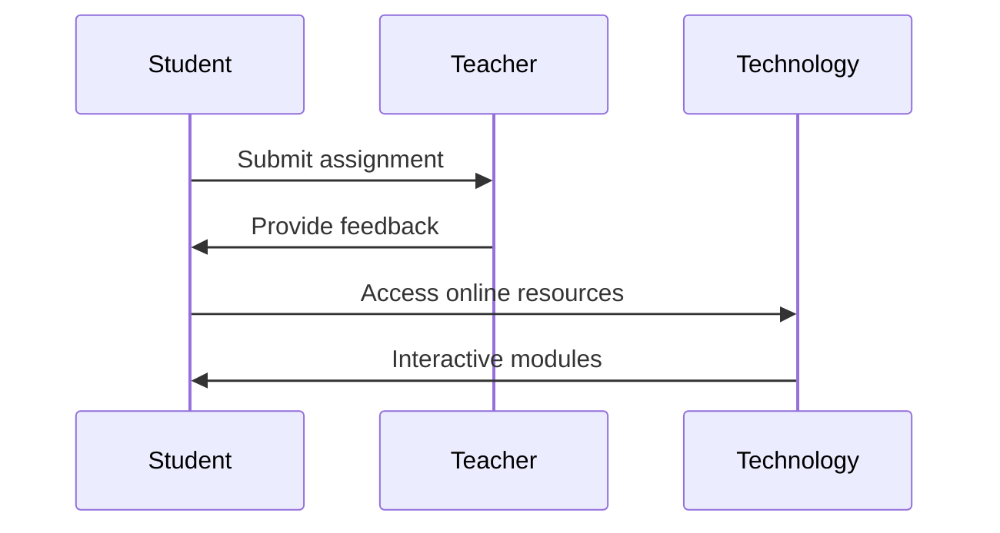
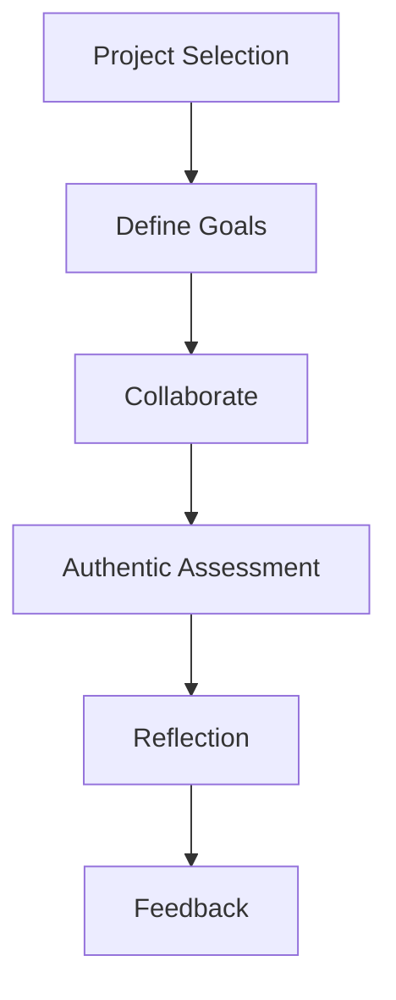
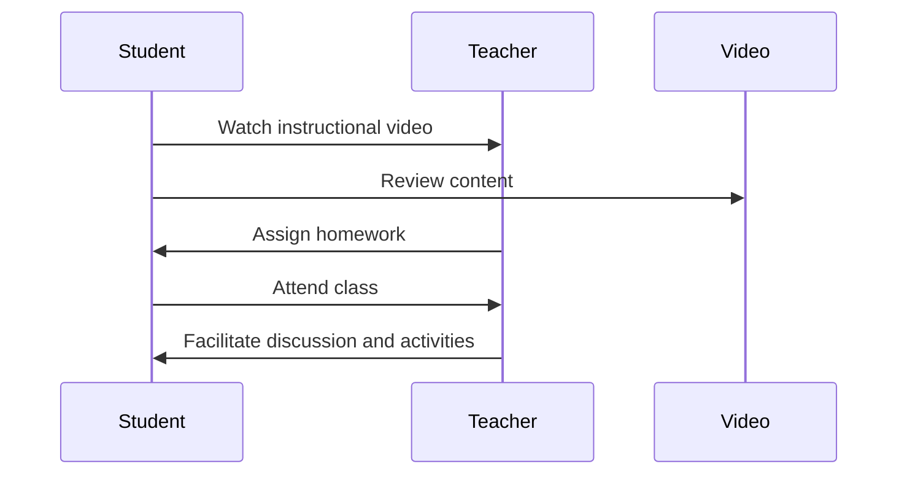
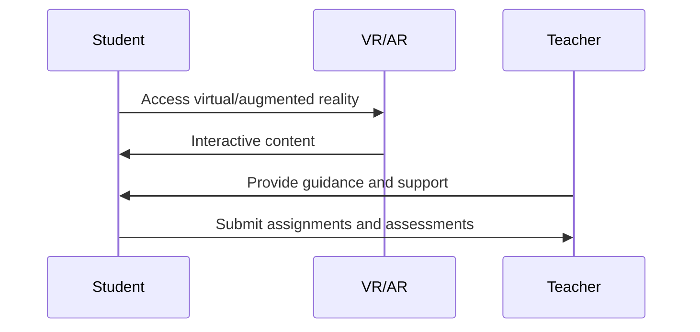
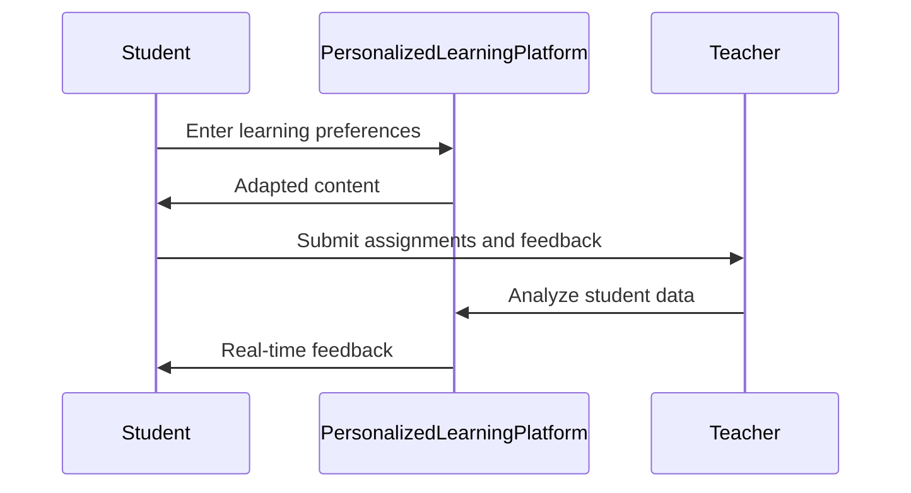
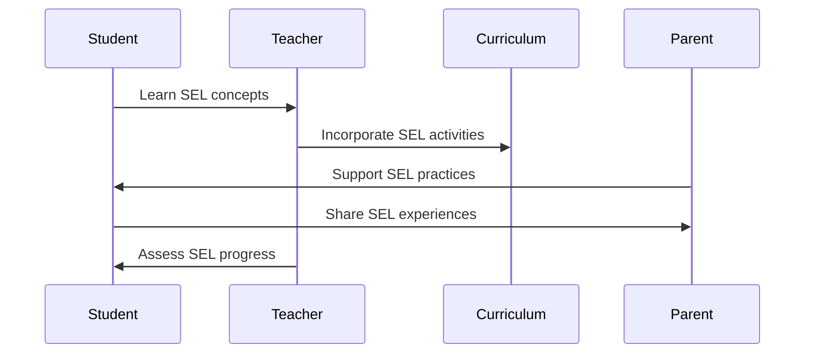

                 


### Introduction to New Humanism Education Reform

New Humanism Education Reform is an initiative aimed at addressing the challenges posed by the digital age while maintaining a strong emphasis on humanistic values and holistic development. As technology continues to evolve and transform various aspects of our lives, there is a growing concern that traditional education systems may not adequately prepare students for the complex and rapidly changing world they will inhabit. The New Humanism Education Reform seeks to bridge this gap by integrating technology with a focus on nurturing the human spirit and fostering critical thinking, creativity, and empathy.

### Background of Technology Age

The rise of technology in the 21st century has been nothing short of transformative. From smartphones and the internet to artificial intelligence and machine learning, technology has permeated almost every aspect of our lives. This has led to significant changes in how we work, communicate, and even perceive the world around us. However, while technology has brought about numerous benefits, it has also raised important questions about its impact on education and society as a whole.

#### Education Challenges

One of the primary challenges of the technology age is the rapid pace of change. Traditional education systems are often slow to adapt to new technologies, leading to a disconnect between what students learn in school and the skills they need to succeed in the real world. Moreover, as technology becomes more pervasive, there is a risk that it may undermine the importance of humanistic values such as empathy, critical thinking, and emotional intelligence.

#### Importance of Humanistic Care

In light of these challenges, the importance of humanistic care in education cannot be overstated. Humanistic values are not only essential for personal development but also for building strong, inclusive, and compassionate societies. By integrating technology with a focus on nurturing these values, the New Humanism Education Reform aims to create a more balanced and holistic approach to education that prepares students for the future while honoring their humanity.

### Core Concepts and Principles of New Humanism Education Reform

The New Humanism Education Reform is grounded in several core concepts and principles that guide its implementation and shape its philosophy. These concepts and principles are designed to address the challenges of the technology age while fostering holistic development and humanistic values.

#### Humanistic Education

Humanistic education is centered on the idea that learning should be meaningful and engaging, and that students should be encouraged to develop their own ideas and perspectives. It emphasizes the importance of critical thinking, creativity, and emotional intelligence, and seeks to nurture a sense of empathy and social responsibility in students.

#### Technology Integration

While humanistic education remains at the heart of the New Humanism Education Reform, it is also recognized that technology can play a valuable role in enhancing the learning experience. By integrating technology in a thoughtful and purposeful manner, educators can create more interactive, engaging, and personalized learning environments that promote deeper understanding and mastery of concepts.

#### Holistic Development

Holistic development is a key principle of the New Humanism Education Reform. It recognizes that learning is not limited to academic subjects but encompasses the growth of the whole person—intellectually, emotionally, socially, and physically. By fostering holistic development, the reform aims to produce well-rounded individuals who are prepared to face the complexities of the modern world.

#### Personalization

Personalization is another core principle of the New Humanism Education Reform. By tailoring learning experiences to individual students' needs, interests, and learning styles, educators can help each student reach their full potential. Personalized learning not only enhances student engagement and motivation but also promotes deeper understanding and mastery of concepts.

#### Collaboration and Communication

Collaboration and communication are essential skills for success in the digital age. The New Humanism Education Reform emphasizes the importance of fostering these skills through collaborative projects, group discussions, and other interactive learning activities. By encouraging students to work together and communicate effectively, the reform aims to prepare them for the complex, interconnected world they will inhabit.

#### Lifelong Learning

In an era of rapid technological change, lifelong learning has become more important than ever. The New Humanism Education Reform seeks to cultivate a love of learning and a commitment to continuous personal and professional development. By fostering a growth mindset and encouraging students to embrace challenges and learn from failure, the reform aims to prepare them for a lifetime of learning and growth.

### Educational Practices and Innovations

The New Humanism Education Reform is not just a set of theoretical principles but also a framework for innovative educational practices that can be implemented in classrooms and schools worldwide. These practices and innovations are designed to bring the core concepts and principles of the reform to life and create a learning environment that is both engaging and supportive of holistic development.

#### Blended Learning

One of the key educational practices promoted by the New Humanism Education Reform is blended learning. This approach combines face-to-face instruction with online resources and technology, creating a dynamic and interactive learning experience. By integrating traditional teaching methods with digital tools, educators can provide students with a more personalized and engaging learning experience that caters to their individual needs and preferences.

#### Project-Based Learning

Project-based learning (PBL) is another core educational practice of the New Humanism Education Reform. In PBL, students engage in complex, hands-on projects that require critical thinking, collaboration, and problem-solving skills. These projects are designed to be relevant to real-world issues and challenges, helping students to see the value of their learning and connect it to their personal interests and goals.

#### Flipped Classrooms

Flipped classrooms are another innovative practice that aligns with the principles of the New Humanism Education Reform. In a flipped classroom, students watch instructional videos and complete readings at home, and then use class time for active learning activities such as discussions, labs, and collaborative projects. This approach allows educators to spend more time engaging students in meaningful, interactive learning experiences.

#### Virtual and Augmented Reality

Virtual and augmented reality (VR/AR) are powerful tools that can enhance the learning experience and bring abstract concepts to life. The New Humanism Education Reform encourages the use of VR/AR to create immersive learning environments that engage students' senses and foster deeper understanding and retention of information.

#### Personalized Learning Platforms

Personalized learning platforms are designed to provide students with a customized learning experience based on their individual needs, interests, and learning styles. These platforms can include adaptive learning algorithms, interactive content, and real-time feedback, helping students to stay on track and reach their full potential.

#### Social and Emotional Learning

Social and emotional learning (SEL) is an essential component of the New Humanism Education Reform. By incorporating SEL into the curriculum, educators can help students develop critical life skills such as empathy, self-awareness, and resilience. SEL programs can include activities such as group discussions, role-playing, and mindfulness exercises that foster emotional intelligence and social responsibility.

### Challenges and Opportunities in the Reform

Implementing the New Humanism Education Reform presents both challenges and opportunities. While the principles and practices of the reform are grounded in solid educational theory and research, their successful implementation requires careful planning, collaboration, and ongoing support.

#### Challenges

One of the main challenges of the reform is resistance to change. Traditional education systems are often resistant to change, and educators may be hesitant to abandon familiar teaching methods in favor of new approaches. Additionally, there may be limited resources, both in terms of funding and technological infrastructure, that can support the implementation of innovative educational practices.

#### Opportunities

Despite these challenges, the New Humanism Education Reform also presents significant opportunities for transformative change. By fostering a culture of innovation and collaboration, the reform can help educators and schools to embrace new approaches and technologies that enhance the learning experience. Moreover, the reform can promote a more inclusive and equitable education system that empowers students to reach their full potential.

### Case Studies of Successful New Humanism Education Reform

To better understand the potential impact of the New Humanism Education Reform, let's explore a few case studies of successful implementations around the world.

#### Case Study 1: Finland

Finland is often cited as a leader in educational innovation, and its success can be attributed in part to its focus on humanistic values and holistic development. The Finnish education system emphasizes personalization, collaboration, and lifelong learning, and it has achieved remarkable results in terms of student engagement, achievement, and well-being.

#### Case Study 2: Australia

In Australia, the New Humanism Education Reform has inspired a range of innovative initiatives, including the development of personalized learning platforms and the integration of technology in classrooms. These initiatives have helped to create more engaging and effective learning environments, and they have been praised for their ability to meet the diverse needs of students.

#### Case Study 3: United States

In the United States, a number of schools and districts have adopted the principles of the New Humanism Education Reform, with notable success. For example, the New Tech Network, a collection of schools across the country, has implemented project-based learning, flipped classrooms, and other innovative practices that have led to significant improvements in student outcomes.

### Future Directions and Potential Impact

The New Humanism Education Reform has the potential to transform education on a global scale, fostering a more inclusive, equitable, and effective education system that prepares students for the complexities of the 21st century. By integrating technology with a focus on humanistic values and holistic development, the reform can help to create a more engaging, supportive, and transformative learning experience for all students.

### Conclusion

The New Humanism Education Reform is a groundbreaking initiative that addresses the challenges of the digital age while honoring the importance of humanistic values and holistic development. By fostering a culture of innovation, collaboration, and continuous learning, the reform can help to create a more inclusive, equitable, and effective education system that prepares students for the future. As we look to the future, it is clear that the principles and practices of the New Humanism Education Reform will play a crucial role in shaping the next generation of learners and educators.
----------------------------------------------------------------

### Introduction to New Humanism Education Reform

**New Humanism Education Reform** is a visionary initiative aimed at transforming the educational landscape in the digital age. As the world becomes increasingly connected through technology, the traditional education system, designed for an industrial era, struggles to meet the complex needs of modern students. The New Humanism Education Reform seeks to bridge this gap by integrating technology with a strong emphasis on humanistic values, fostering holistic development, and cultivating critical thinking, empathy, and creativity.

#### Background

The origins of the New Humanism Education Reform can be traced back to a growing recognition of the limitations of the current education system. As technology advances at an unprecedented pace, traditional educational models, often focused on rote learning and standardized testing, have proven inadequate in preparing students for the multifaceted challenges of the 21st century. The Reform responds to this challenge by advocating for a more flexible, adaptive, and student-centered approach to education.

#### Core Concepts and Principles

At the heart of the New Humanism Education Reform are several core concepts and principles designed to guide its implementation and shape its philosophy. These include:

1. **Humanistic Education**: This approach emphasizes the cultivation of the whole person, focusing on intellectual, emotional, and social development. It values critical thinking, creativity, and emotional intelligence as essential skills for success in the digital age.

2. **Technology Integration**: While humanistic values remain central, the Reform recognizes the transformative potential of technology. By integrating technology thoughtfully, educators can create more engaging, personalized, and effective learning experiences.

3. **Holistic Development**: The Reform aims to nurture students' intellectual, emotional, and social growth, preparing them to be well-rounded individuals capable of navigating the complexities of modern society.

4. **Personalization**: Tailoring education to individual students' needs, interests, and learning styles ensures that each student has the opportunity to reach their full potential.

5. **Collaboration and Communication**: Fostering collaboration and effective communication skills is crucial in an interconnected world, where teamwork and cooperation are key to addressing complex problems.

6. **Lifelong Learning**: Encouraging a love of learning and a commitment to continuous personal and professional development is essential in an era of rapid technological change.

#### Goals

The primary goals of the New Humanism Education Reform are to:

- Foster a love of learning and curiosity in students.
- Develop critical thinking, problem-solving, and creativity.
- Nurture empathy, social responsibility, and emotional intelligence.
- Prepare students for the complexities of the 21st-century workforce.
- Promote equity and inclusivity in education.

### Current State and Implementation

The New Humanism Education Reform is gaining traction worldwide, with various schools and districts adopting its principles and practices. While progress has been made, challenges remain, including resistance to change, limited resources, and the need for ongoing professional development for educators.

#### Impact

The impact of the New Humanism Education Reform is profound. By fostering a more holistic and humanistic approach to education, it prepares students not only for academic success but also for meaningful, fulfilling lives. The Reform has the potential to transform education globally, creating a more inclusive, equitable, and effective system that prepares students for the future.

### Conclusion

The New Humanism Education Reform represents a transformative approach to education that addresses the challenges of the digital age while honoring humanistic values. By fostering holistic development, critical thinking, empathy, and creativity, the Reform has the potential to prepare students for the complexities of the 21st century and create a more inclusive, equitable, and effective education system for all.

----------------------------------------------------------------

### Keywords

- New Humanism Education Reform
- Humanistic Values
- Technology Integration
- Holistic Development
- Personalization
- Collaboration and Communication
- Lifelong Learning
- Digital Age Education

### Abstract

The New Humanism Education Reform represents a visionary approach to education in the digital age, aiming to integrate technology with humanistic values to foster holistic development, critical thinking, empathy, and creativity. This article provides an overview of the Reform's background, core concepts and principles, educational practices and innovations, challenges and opportunities, case studies, and future directions. By emphasizing humanistic education, personalized learning, and collaboration, the Reform seeks to create a more inclusive, equitable, and effective education system that prepares students for the complexities of the 21st century.

----------------------------------------------------------------

### Introduction to New Humanism Education Reform

#### Origin and Background

The origins of the New Humanism Education Reform can be traced back to the late 20th century, a time when the digital revolution began to reshape the world. As technology advanced at an unprecedented pace, it became clear that traditional educational models, designed for a predominantly industrial society, were ill-equipped to address the rapidly evolving needs of students in the digital age. This realization sparked a movement to rethink and reform educational practices, with a focus on integrating technology while preserving the essence of humanistic values.

The first major milestone in the development of the New Humanism Education Reform was the publication of the seminal report "A Nation at Risk" in 1983, which highlighted the shortcomings of the American education system and called for significant reforms. While this report primarily focused on the technical and scientific aspects of education, it laid the groundwork for future discussions around the broader role of education in nurturing the whole person.

In the following decades, several key events and ideas further shaped the evolution of the Reform. The proliferation of the internet and the development of digital technologies in the 1990s and 2000s provided new tools and platforms for educational innovation. Concurrently, the rise of global interconnectedness and the increasing complexity of societal challenges highlighted the need for a more holistic and adaptable approach to education.

#### Education Challenges in the Digital Age

As we entered the 21st century, the digital age brought with it a set of unique challenges for the education system. These challenges can be broadly categorized into three main areas:

1. **Rapid Technological Change**: The pace of technological advancement has outpaced traditional educational systems, making it difficult for schools to keep up with the latest tools and methods. This has led to a disconnect between what students learn in school and the skills they need to succeed in the real world.

2. **Standardization and Testing**: The emphasis on standardized testing has narrowed the curriculum and reduced the focus on critical thinking, creativity, and emotional intelligence—key skills that are essential for navigating the complexities of the digital age.

3. **Inequities and Access**: The digital divide has created significant disparities in access to technology and educational resources, exacerbating existing social inequalities. This has resulted in unequal educational opportunities and outcomes, particularly for disadvantaged and marginalized communities.

#### The Importance of Humanistic Care

In response to these challenges, the New Humanism Education Reform places a strong emphasis on humanistic care, which includes nurturing the emotional, social, and ethical development of students alongside their intellectual growth. Humanistic education, grounded in the philosophy that learning should be meaningful and engaging, emphasizes the following:

1. **Critical Thinking**: Encouraging students to question, analyze, and evaluate information, fostering a deep understanding of complex issues.

2. **Creativity**: Promoting innovative thinking and the ability to generate new ideas and solutions to problems.

3. **Empathy**: Developing a sense of compassion and understanding for others, which is crucial for building inclusive and cooperative communities.

4. **Social Responsibility**: Instilling a sense of duty to contribute positively to society and address social injustices.

5. **Emotional Intelligence**: Helping students to recognize, understand, and manage their emotions, as well as the emotions of others.

#### The Rise of New Humanism Education Reform

The New Humanism Education Reform began to gain traction in the early 21st century, spurred by a growing recognition that traditional educational models were not adequately preparing students for the complexities of the digital age. This movement was driven by several key factors:

1. **Globalization**: The increasing interconnectedness of the world has highlighted the need for a more global and flexible approach to education, one that can prepare students to thrive in diverse and dynamic environments.

2. **Technological Innovation**: Advances in technology, such as artificial intelligence, machine learning, and the internet of things, have provided new opportunities for educational innovation and personalized learning.

3. **Research and Evidence**: Growing bodies of research have supported the effectiveness of humanistic educational practices, highlighting their impact on student engagement, well-being, and long-term success.

4. **Pedagogical Innovation**: Educators and policymakers have increasingly turned to innovative practices such as project-based learning, flipped classrooms, and blended learning to create more engaging and effective learning environments.

#### The Principles of New Humanism Education Reform

The New Humanism Education Reform is grounded in several core principles that guide its implementation and shape its philosophy. These principles include:

1. **Humanistic Values**: Emphasizing the importance of nurturing the whole person, including intellectual, emotional, and social development.

2. **Technology Integration**: Using technology to enhance the learning experience, rather than replacing human interaction and engagement.

3. **Holistic Development**: Focusing on the growth of the entire person, not just academic achievement.

4. **Personalization**: Tailoring education to the individual needs, interests, and learning styles of each student.

5. **Collaboration and Communication**: Encouraging students to work together and communicate effectively, fostering teamwork and cooperation.

6. **Lifelong Learning**: Promoting a love of learning and a commitment to continuous personal and professional development.

#### Goals and Vision

The goals of the New Humanism Education Reform are to:

- Foster a love of learning and curiosity in students.
- Develop critical thinking, problem-solving, and creativity.
- Nurture empathy, social responsibility, and emotional intelligence.
- Prepare students for the complexities of the 21st-century workforce.
- Promote equity and inclusivity in education.

The vision of the Reform is to create a global education system that is both adaptable and inclusive, capable of nurturing the next generation of learners to become compassionate, critical thinkers who are well-equipped to navigate the complexities of the modern world.

### Conclusion

The New Humanism Education Reform represents a paradigm shift in educational thinking, addressing the challenges of the digital age while preserving the essence of humanistic values. By fostering holistic development, critical thinking, empathy, and creativity, the Reform has the potential to transform education globally, creating a more inclusive, equitable, and effective system that prepares students for the future. As we continue to navigate the digital age, the principles and practices of the New Humanism Education Reform will play a crucial role in shaping the next generation of learners and educators.

----------------------------------------------------------------

### Core Concepts and Principles of New Humanism Education Reform

The New Humanism Education Reform is built upon a set of core concepts and principles that serve as the foundation for its innovative approach to education. These principles are designed to address the challenges of the digital age while ensuring that students receive a well-rounded education that nurtures their intellectual, emotional, and social development. Here, we will delve into the key concepts and principles that underpin the Reform and discuss their significance in creating a transformative educational experience.

#### Humanistic Education

At the heart of the New Humanism Education Reform is the concept of humanistic education. This approach to learning emphasizes the development of the whole person, focusing on intellectual growth as well as emotional, social, and ethical development. Humanistic education encourages students to think critically, engage in meaningful discussions, and explore complex ideas from multiple perspectives. By fostering a love of learning and curiosity, humanistic education aims to empower students to become independent thinkers and lifelong learners.

**Concept Attributes:**

- **Critical Thinking**: Encouraging students to question, analyze, and evaluate information, fostering a deep understanding of complex issues.
- **Creativity**: Promoting innovative thinking and the ability to generate new ideas and solutions to problems.
- **Empathy**: Developing a sense of compassion and understanding for others, which is crucial for building inclusive and cooperative communities.
- **Social Responsibility**: Instilling a sense of duty to contribute positively to society and address social injustices.
- **Emotional Intelligence**: Helping students to recognize, understand, and manage their emotions, as well as the emotions of others.

**Humanistic Education ER Diagram:**

```mermaid
erDiagram
  Class Student <<|-- Class CriticalThinker : Implements
  Class Student <<|-- Class Creative : Implements
  Class Student <<|-- Class Empathetic : Implements
  Class Student <<|-- Class SociallyResponsible : Implements
  Class Student <<|-- Class EmotionallyIntelligent : Implements
```

#### Technology Integration

While humanistic education remains a cornerstone of the New Humanism Education Reform, the integration of technology is also recognized as a crucial element. Technology can enhance the learning experience by providing access to vast amounts of information, facilitating communication, and enabling personalized learning. However, the integration of technology must be done thoughtfully and purposefully to ensure that it supports, rather than replaces, humanistic values and educational goals.

**Concept Attributes:**

- **Accessibility**: Expanding access to educational resources and opportunities for all students, regardless of their geographic location or socioeconomic status.
- **Personalization**: Tailoring learning experiences to individual students' needs, interests, and learning styles.
- **Engagement**: Making learning more interactive and engaging through the use of multimedia, virtual reality, and other digital tools.
- **Collaboration**: Facilitating collaboration and communication among students and educators, both within and outside the classroom.
- **Efficiency**: Streamlining administrative tasks and increasing efficiency in educational processes.

**Technology Integration ER Diagram:**

```mermaid
erDiagram
  Class EducationalResources <<|-- Class Digital : Implements
  Class EducationalResources <<|-- Class Accessible : Implements
  Class Student <<|-- Class PersonalizedLearning : Implements
  Class Student <<|-- Class Engaged : Implements
  Class Student <<|-- Class Collaborative : Implements
  Class Student <<|-- Class Efficient : Implements
```

#### Holistic Development

Holistic development is another core principle of the New Humanism Education Reform. This approach recognizes that learning is not limited to academic subjects but encompasses the growth of the whole person—intellectually, emotionally, socially, and physically. By fostering holistic development, the Reform aims to produce well-rounded individuals who are prepared to face the complexities of the modern world.

**Concept Attributes:**

- **Intellectual Development**: Nurturing intellectual curiosity, critical thinking, and problem-solving skills.
- **Emotional Development**: Encouraging self-awareness, emotional regulation, and empathy.
- **Social Development**: Fostering collaboration, communication, and social responsibility.
- **Physical Development**: Promoting physical health and well-being through regular exercise and outdoor activities.

**Holistic Development ER Diagram:**

```mermaid
erDiagram
  Class Student <<|-- Class Intellectual : Implements
  Class Student <<|-- Class Emotional : Implements
  Class Student <<|-- Class Social : Implements
  Class Student <<|-- Class Physical : Implements
```

#### Personalization

Personalization is a key concept in the New Humanism Education Reform, emphasizing that each student has unique needs, interests, and learning styles. By tailoring education to individual students, educators can help them reach their full potential and foster a deeper understanding of the material.

**Concept Attributes:**

- **Adaptive Learning**: Using technology to customize the learning experience based on individual progress and learning styles.
- **Interest-Based Learning**: Allowing students to pursue their interests and passions as part of their educational journey.
- **Flexibility**: Providing flexible learning pathways and schedules to accommodate diverse needs and learning paces.

**Personalization ER Diagram:**

```mermaid
erDiagram
  Class EducationalSystem <<|-- Class AdaptiveLearning : Implements
  Class EducationalSystem <<|-- Class InterestBasedLearning : Implements
  Class EducationalSystem <<|-- Class Flexible : Implements
  Class Student <<|-- Class Individualized : Implements
```

#### Collaboration and Communication

In an interconnected world, collaboration and communication are essential skills for success. The New Humanism Education Reform emphasizes the importance of fostering these skills through collaborative projects, group discussions, and other interactive learning activities. By working together, students can develop critical teamwork and problem-solving skills that are crucial for the future workforce.

**Concept Attributes:**

- **Collaborative Projects**: Encouraging students to work together on complex projects that require multiple perspectives and skills.
- **Group Discussions**: Facilitating meaningful discussions that promote critical thinking and deep understanding.
- **Virtual Communication**: Using digital tools to facilitate communication and collaboration among students and educators, regardless of their physical location.

**Collaboration and Communication ER Diagram:**

```mermaid
erDiagram
  Class Student <<|-- Class Collaborative : Implements
  Class Student <<|-- Class Communicative : Implements
  Class EducationalSystem <<|-- Class CollaborativeProjects : Implements
  Class EducationalSystem <<|-- Class GroupDiscussions : Implements
  Class EducationalSystem <<|-- Class VirtualCommunication : Implements
```

#### Lifelong Learning

In the digital age, the concept of lifelong learning has become more important than ever. The New Humanism Education Reform seeks to cultivate a love of learning and a commitment to continuous personal and professional development. By fostering a growth mindset and encouraging students to embrace challenges and learn from failure, the Reform prepares students for a lifetime of learning and growth.

**Concept Attributes:**

- **Growth Mindset**: Encouraging students to believe that their intelligence and abilities can be developed through effort and perseverance.
- **Continuous Learning**: Promoting a commitment to ongoing learning and self-improvement, both inside and outside the classroom.
- **Flexibility and Adaptability**: Equipping students with the skills to adapt to changing circumstances and technologies throughout their lives.

**Lifelong Learning ER Diagram:**

```mermaid
erDiagram
  Class Student <<|-- Class GrowthMindset : Implements
  Class Student <<|-- Class ContinuousLearning : Implements
  Class Student <<|-- Class FlexibleAndAdaptable : Implements
```

### Conclusion

The core concepts and principles of the New Humanism Education Reform provide a comprehensive framework for fostering holistic, humanistic, and technology-enhanced education. By integrating humanistic values with innovative educational practices, the Reform seeks to prepare students for the complexities of the 21st century, equipping them with the skills, knowledge, and character to thrive in a rapidly changing world. As we continue to navigate the digital age, the principles of the New Humanism Education Reform will play a crucial role in shaping the future of education.

----------------------------------------------------------------

### Educational Practices and Innovations

The New Humanism Education Reform is not merely a theoretical framework but a practical guide for transforming educational practices and fostering a more engaging, inclusive, and effective learning environment. At the heart of the Reform are several innovative educational practices and technologies that align with its core principles. These practices are designed to empower both educators and students, enhancing the learning experience and preparing students for the complexities of the 21st century. Let's delve into some of these key practices and how they can be implemented in educational settings.

#### Blended Learning

Blended learning is a powerful educational approach that combines traditional face-to-face instruction with online and digital resources. This hybrid model allows for a more flexible and personalized learning experience, where students can engage with content at their own pace and revisit materials as needed. By integrating online resources, such as interactive modules, videos, and digital textbooks, educators can provide a rich and varied learning environment that caters to different learning styles and preferences.

**How to Implement Blended Learning:**

1. **Course Design**: Design courses that include both face-to-face components and online elements. Ensure that the online components are interactive and engaging to maintain student engagement.
2. **Synchronous and Asynchronous Activities**: Include a mix of synchronous (real-time) and asynchronous (non-real-time) activities to accommodate different schedules and learning preferences.
3. **Monitoring and Feedback**: Use online tools to monitor student progress and provide timely feedback. This can help identify areas where students may need additional support or resources.
4. **Technology Integration**: Integrate various digital tools, such as learning management systems (LMS), online discussion forums, and multimedia resources, to enhance the learning experience.

**Blended Learning Mermaid Diagram:**



#### Project-Based Learning (PBL)

Project-Based Learning is an instructional method that engages students in complex projects that require critical thinking, collaboration, problem-solving, and real-world application of knowledge. PBL encourages students to take an active role in their learning, fostering a deeper understanding of the subject matter and its relevance to their lives.

**How to Implement PBL:**

1. **Identify a Relevant Project**: Choose a project that aligns with the curriculum and addresses real-world issues or challenges.
2. **Define Goals and Objectives**: Clearly outline the goals and objectives of the project, ensuring they are aligned with learning outcomes.
3. **Collaboration and Group Work**: Encourage students to work together in teams, providing opportunities for collaboration and the exchange of ideas.
4. **Authentic Assessment**: Assess students based on their project outcomes and process, emphasizing both content knowledge and skills development.
5. **Reflection and Feedback**: Incorporate regular reflection and feedback sessions to help students learn from their experiences and improve their future projects.

**PBL Mermaid Diagram:**



#### Flipped Classrooms

Flipped classrooms reverse the traditional instructional model, where students watch instructional videos and read materials at home, and then engage in hands-on activities and discussions in the classroom. This approach allows for more interactive and engaging class sessions, where students can actively participate and apply their knowledge in real-time.

**How to Implement Flipped Classrooms:**

1. **Create Instructional Videos**: Develop high-quality instructional videos that cover the core content of the course. These videos should be engaging and concise.
2. **Assign Homework**: Assign readings, exercises, or other activities for students to complete at home before class.
3. **Classroom Engagement**: Use class time for activities such as discussions, group work, problem-solving, and hands-on learning. This allows for a more interactive and dynamic learning experience.
4. **Monitor Progress**: Regularly monitor student progress and provide feedback to help them stay on track and understand the material more deeply.
5. **Adapt to Student Needs**: Be flexible and adapt the instructional approach based on student feedback and learning outcomes.

**Flipped Classrooms Mermaid Diagram:**



#### Virtual and Augmented Reality (VR/AR)

Virtual and Augmented Reality technologies offer immersive and interactive learning experiences that can bring abstract concepts to life. By using VR/AR, students can explore virtual environments, interact with digital objects, and gain a deeper understanding of complex ideas.

**How to Implement VR/AR in Education:**

1. **Identify Appropriate Content**: Select subjects or topics that can benefit from a virtual or augmented reality experience.
2. **Choose VR/AR Tools**: Select suitable VR/AR platforms or applications that align with the educational content and objectives.
3. **Create Interactive Experiences**: Develop immersive and engaging virtual or augmented reality experiences that allow students to explore and interact with the content.
4. **Provide Guidance and Support**: Offer guidance and support to students as they navigate the virtual or augmented reality experiences.
5. **Assess Learning Outcomes**: Use assessments to evaluate student understanding and engagement with VR/AR content.

**VR/AR Mermaid Diagram:**



#### Personalized Learning Platforms

Personalized learning platforms are digital tools that adapt to individual students' learning styles, interests, and progress. These platforms can provide customized learning experiences, real-time feedback, and data-driven insights to help students reach their full potential.

**How to Implement Personalized Learning Platforms:**

1. **Student Profiles**: Create individual student profiles that include their learning preferences, strengths, and areas for improvement.
2. **Adaptive Learning**: Use algorithms to adapt the learning content based on student progress and performance.
3. **Real-Time Feedback**: Provide immediate feedback and support to help students stay on track and understand the material more deeply.
4. **Data Analysis**: Analyze student data to identify patterns, trends, and areas where additional support may be needed.
5. **Flexibility and Customization**: Offer a wide range of learning resources and activities that can be customized to meet individual student needs.

**Personalized Learning Platforms Mermaid Diagram:**



#### Social and Emotional Learning (SEL)

Social and Emotional Learning (SEL) is an essential component of the New Humanism Education Reform. SEL programs focus on developing critical life skills such as empathy, self-awareness, emotional regulation, and social responsibility. By integrating SEL into the curriculum, educators can help students become more resilient, cooperative, and well-adjusted individuals.

**How to Implement SEL:**

1. **Incorporate SEL into the Curriculum**: Integrate SEL activities and lessons into various subjects and learning areas.
2. **Professional Development**: Provide training and support for educators to effectively teach SEL concepts and strategies.
3. **Classroom Practices**: Use classroom practices that promote social-emotional development, such as collaborative projects, role-playing, and mindfulness activities.
4. **Parent and Community Involvement**: Involve parents and community members in SEL initiatives to create a supportive and inclusive learning environment.
5. **Assessment and Reflection**: Regularly assess student progress in SEL skills and reflect on the effectiveness of SEL programs.

**SEL Mermaid Diagram:**



### Conclusion

The educational practices and innovations promoted by the New Humanism Education Reform represent a significant shift in how we approach education in the digital age. By integrating technology with a focus on humanistic values and holistic development, these practices have the potential to transform education, creating more engaging, inclusive, and effective learning environments. As we continue to navigate the complexities of the 21st century, these innovative practices will play a crucial role in preparing students for a future filled with uncertainty and opportunity.

----------------------------------------------------------------

### Challenges and Opportunities in the Reform

The New Humanism Education Reform, with its vision of integrating technology with humanistic values, presents both significant challenges and abundant opportunities. Understanding and addressing these challenges is crucial for the successful implementation of the Reform, while recognizing the opportunities it offers can pave the way for transformative educational experiences.

#### Challenges

1. **Resistance to Change**: One of the most significant challenges in implementing the New Humanism Education Reform is the resistance to change. Traditional educational systems are often rooted in established practices and norms that educators and administrators are comfortable with. Introducing new methods and technologies can be met with skepticism, especially if there is a lack of understanding or awareness of their benefits.

   **Strategies to Overcome:**
   - **Professional Development**: Providing comprehensive training and professional development opportunities for educators can help build confidence and competence in using new technologies and methods.
   - **Community Engagement**: Engaging parents, students, and the wider community in discussions about the benefits of the Reform can help garner support and reduce resistance.

2. **Limited Resources**: Implementing innovative educational practices often requires significant financial investment in technology, training, and infrastructure. Schools and districts with limited budgets may find it challenging to adopt these reforms.

   **Strategies to Overcome:**
   - **Grants and Funding**: Exploring grants and funding opportunities from government agencies, non-profits, and educational foundations can help offset the costs of implementing the Reform.
   - **Community Partnerships**: Building partnerships with local businesses, universities, and other organizations can provide additional resources and expertise.

3. **Technological Barriers**: Access to reliable technology and internet connectivity is essential for the successful implementation of the New Humanism Education Reform. In some areas, especially rural or underserved communities, access to these resources may be limited.

   **Strategies to Overcome:**
   - **Broadband Initiatives**: Supporting initiatives to expand broadband access in underserved areas can help bridge the digital divide.
   - **Technology Donations**: Soliciting donations of used or surplus technology from businesses and organizations can provide schools with the necessary tools.

4. **Teacher Recruitment and Retention**: The Reform requires educators who are not only skilled in traditional teaching methods but also proficient in using technology and innovative practices. Recruiting and retaining these educators can be challenging, particularly in regions with competitive job markets.

   **Strategies to Overcome:**
   - **Incentive Programs**: Offering competitive salaries, benefits, and professional development opportunities can attract and retain skilled educators.
   - **Retention Strategies**: Creating a supportive and collaborative work environment that values and recognizes the contributions of educators can help improve retention rates.

#### Opportunities

1. **Enhanced Student Engagement**: One of the most promising opportunities of the New Humanism Education Reform is the potential to increase student engagement and motivation. By incorporating technology and humanistic principles, education can become more interactive, relevant, and personalized, which can lead to higher levels of student engagement and achievement.

   **Strategies to Leverage:**
   - **Blended Learning Environments**: Creating blended learning environments that combine face-to-face instruction with online resources can provide students with a more dynamic and engaging learning experience.
   - **Project-Based Learning**: Encouraging project-based learning allows students to apply their knowledge to real-world problems, making learning more meaningful and engaging.

2. **Equitable Access to Education**: The Reform has the potential to address educational inequities by providing all students, regardless of their socioeconomic status or geographic location, with access to high-quality educational resources and opportunities.

   **Strategies to Leverage:**
   - **Online Learning Platforms**: Developing and utilizing online learning platforms can provide access to educational materials and resources for students who may not have access to traditional educational settings.
   - **Digital Literacy Programs**: Implementing digital literacy programs can help students develop the skills needed to navigate and benefit from digital technologies.

3. **Fostering Critical Thinking and Problem-Solving Skills**: By emphasizing critical thinking, creativity, and problem-solving, the Reform can prepare students for the complexities of the 21st-century workforce, where these skills are increasingly valuable.

   **Strategies to Leverage:**
   - **Inquiry-Based Learning**: Encouraging inquiry-based learning can help students develop their critical thinking and problem-solving abilities by engaging them in questions and investigations.
   - **Collaborative Projects**: Collaborative projects that require teamwork and problem-solving can help students develop these essential skills.

4. **Promoting Lifelong Learning**: The Reform's focus on fostering a growth mindset and a love of learning can encourage students to become lifelong learners, prepared to adapt and thrive in a rapidly changing world.

   **Strategies to Leverage:**
   - **Professional Development for Educators**: Providing ongoing professional development for educators can help them stay current with best practices and innovations in education, ensuring that students receive the most up-to-date and effective learning experiences.
   - **Community Learning Programs**: Developing community learning programs that extend beyond the school setting can help students and community members continue to learn and grow throughout their lives.

### Conclusion

The New Humanism Education Reform presents both significant challenges and exciting opportunities. By addressing the challenges through strategic planning and innovative solutions, and by leveraging the opportunities to enhance educational experiences, the Reform can transform education, creating a more inclusive, equitable, and effective system that prepares students for the complexities of the 21st century. As we continue to navigate the digital age, the principles and practices of the New Humanism Education Reform will play a crucial role in shaping the future of education.

----------------------------------------------------------------

### Case Studies of Successful New Humanism Education Reform

To better understand the practical implementation and impact of the New Humanism Education Reform, let's explore several case studies from around the world that demonstrate the success and effectiveness of this innovative approach.

#### Case Study 1: Finland

Finland is often cited as a global leader in education, and its success can be attributed in part to the emphasis on humanistic education and holistic development. The Finnish education system is characterized by its student-centered approach, which focuses on nurturing the whole person—intellectually, emotionally, and socially. One key aspect of Finland's educational system is its commitment to equality, with students from diverse backgrounds receiving equal access to high-quality education.

**Key Initiatives:**

- **Personalized Learning**: Finland's education system allows for a high degree of flexibility and personalization. Teachers work closely with students to tailor their learning experiences based on their individual needs, interests, and learning styles.
- **Teacher Training and Professional Development**: Finland invests heavily in teacher training and professional development, ensuring that educators are well-prepared to implement humanistic educational practices.
- **Student Autonomy**: Finnish students are encouraged to take responsibility for their learning, fostering independence and self-motivation.

**Impact:**

- **High Academic Achievements**: Finnish students consistently rank among the top globally in international assessments such as PISA and TIMSS.
- **Positive Student Outcomes**: Beyond academic success, Finnish students report high levels of well-being and satisfaction with their education.
- **Equitable Access**: The Finnish education system has successfully reduced disparities in educational outcomes, providing equal opportunities for students from diverse backgrounds.

#### Case Study 2: Australia

Australia has also made significant strides in implementing the principles of the New Humanism Education Reform. The Australian government has invested in various initiatives to enhance educational outcomes and promote equity and inclusivity.

**Key Initiatives:**

- **Digital Education Revolution**: Australia's Digital Education Revolution, launched in 2010, aimed to provide every school student with access to high-speed internet and digital learning resources. This initiative has facilitated the integration of technology into classroom practices, promoting personalized and interactive learning experiences.
- **STEM Education**: Australia has emphasized the importance of Science, Technology, Engineering, and Mathematics (STEM) education, recognizing the need to prepare students for the demands of the 21st-century workforce. STEM education in Australia is designed to be inquiry-based and hands-on, fostering critical thinking and problem-solving skills.
- **Wellbeing Programs**: Australia has incorporated social and emotional learning (SEL) into its curriculum, with a focus on developing students' emotional intelligence, resilience, and social responsibility.

**Impact:**

- **Enhanced Student Engagement**: The integration of technology and hands-on learning has significantly improved student engagement and motivation.
- **Improved Equity**: The Digital Education Revolution has helped to bridge the digital divide, providing all students with access to high-quality educational resources.
- **Positive Outcomes**: Australian students have shown improved academic performance and greater well-being as a result of these initiatives.

#### Case Study 3: United States

The United States has seen a variety of efforts to implement the New Humanism Education Reform, with mixed results. One notable success story is the New Tech Network, a group of schools that have embraced innovative educational practices.

**Key Initiatives:**

- **Project-Based Learning**: New Tech Network schools emphasize project-based learning (PBL), where students engage in real-world projects that require critical thinking, collaboration, and problem-solving skills. Projects are often linked to local community issues, providing students with meaningful learning experiences.
- **Blended Learning**: Many New Tech Network schools implement blended learning models, combining face-to-face instruction with online resources to create personalized learning experiences.
- **Social and Emotional Learning**: SEL is integrated into the curriculum, with a focus on developing students' social skills, emotional intelligence, and resilience.

**Impact:**

- **Increased Engagement and Achievement**: Students in New Tech Network schools report higher levels of engagement and academic achievement compared to traditional schools.
- **Collaborative Skills**: The emphasis on collaboration and teamwork in PBL has helped students develop critical skills for the future workforce.
- **Positive Student Outcomes**: Students in these schools exhibit higher levels of well-being and are more likely to pursue post-secondary education and career opportunities.

#### Case Study 4: China

China has also been investing in education reform, particularly through the integration of technology and a focus on holistic development. The Chinese government's "New Generation Artificial Intelligence Education Development Plan" aims to leverage AI and other technologies to enhance educational outcomes.

**Key Initiatives:**

- **AI-Enhanced Education**: China is developing AI-powered tools and platforms that can personalize learning, provide real-time feedback, and assist with lesson planning.
- **STEM Education**: The Chinese government has placed a strong emphasis on STEM education, promoting innovation and problem-solving skills.
- **Wellbeing and Mental Health**: Recognizing the importance of students' emotional and mental health, China has incorporated programs to support students' social and emotional development.

**Impact:**

- **Increased Access to High-Quality Education**: The use of AI and other technologies has helped to improve access to high-quality education, particularly in rural areas.
- **Enhanced Learning Outcomes**: AI-enhanced education has shown potential in improving learning outcomes and student engagement.
- **Improved Wellbeing**: Programs focused on students' emotional and mental health have led to improvements in students' well-being and overall educational experience.

### Conclusion

These case studies demonstrate that the New Humanism Education Reform, when implemented thoughtfully and with a focus on holistic development, can lead to significant improvements in educational outcomes and student well-being. By incorporating technology, personalized learning, and a focus on social and emotional development, schools and districts around the world are creating more engaging, inclusive, and effective learning environments. As these initiatives continue to evolve, they will undoubtedly contribute to shaping the future of education.

----------------------------------------------------------------

### Future Directions and Potential Impact

The New Humanism Education Reform has the potential to shape the future of education in profound and transformative ways. As we look ahead, several key directions and potential impacts can be identified, reflecting both the promise and challenges of this innovative approach.

#### Enhanced Personalization

One of the most significant future directions of the New Humanism Education Reform is the continued enhancement of personalized learning. As technology advances, we can expect to see more sophisticated adaptive learning platforms that not only tailor content to individual students' needs but also provide real-time feedback and interventions. This will allow for a more responsive and dynamic learning experience, where students can learn at their own pace and in their own style.

**Potential Impact:**
- **Increased Student Engagement**: Personalized learning can lead to higher levels of student engagement, as students are more likely to be motivated by learning experiences that are relevant to their interests and abilities.
- **Improved Learning Outcomes**: With personalized learning, students can receive the support they need to overcome challenges and reach their full potential, leading to improved academic and personal outcomes.

#### Blended and Hybrid Learning Models

The integration of technology into education is likely to continue evolving, with a greater emphasis on blended and hybrid learning models. These models combine the strengths of traditional face-to-face instruction with online and digital resources, creating flexible and adaptive learning environments. As these models become more sophisticated, we can expect to see a greater variety of tools and platforms that support collaborative, interactive, and immersive learning experiences.

**Potential Impact:**
- **Increased Accessibility**: Blended and hybrid learning models can make education more accessible to students who may not have access to traditional educational settings, whether due to geographical limitations, disabilities, or other factors.
- **Enhanced Collaboration**: By facilitating collaboration and communication among students and educators, these models can help build a more connected and inclusive learning community.

#### Social and Emotional Learning (SEL)

As the importance of social and emotional skills becomes increasingly recognized, there will likely be a greater emphasis on integrating social and emotional learning into the curriculum. This will involve not only developing specific SEL programs but also incorporating SEL principles into all aspects of education, from classroom management to project-based learning.

**Potential Impact:**
- **Improved Well-Being**: SEL can lead to significant improvements in students' emotional well-being, resilience, and social skills, preparing them for the challenges of life and work.
- **Enhanced Learning Environment**: A focus on SEL can create a more positive and supportive learning environment, where students feel safe, valued, and motivated to learn.

#### Lifelong Learning and Continuous Professional Development

The New Humanism Education Reform will likely continue to emphasize the importance of lifelong learning and continuous professional development. As technology and societal demands evolve, it will be essential for students and educators alike to engage in ongoing learning to stay relevant and adapt to new challenges.

**Potential Impact:**
- **Adaptable Workforce**: Lifelong learning can help create a more adaptable and skilled workforce, better equipped to navigate the complexities of the modern world.
- **Informed Citizens**: By fostering a culture of continuous learning, the Reform can contribute to the development of informed and engaged citizens who are well-prepared to address global and local issues.

#### Addressing Inequities and Promoting Equity

One of the key challenges of the New Humanism Education Reform will be addressing existing inequities and promoting educational equity. While the Reform has the potential to increase access and opportunity, it must also be mindful of the disparities that can arise from the uneven distribution of resources and access to technology.

**Potential Impact:**
- **Equitable Access**: Efforts to promote equity in education will be essential to ensure that all students, regardless of their background, have access to high-quality educational experiences.
- **Social Justice**: By addressing inequities, the Reform can contribute to broader social justice efforts, helping to create a more inclusive and fair society.

#### Global Collaboration and Exchange

In an increasingly interconnected world, global collaboration and exchange will become increasingly important. The New Humanism Education Reform will likely facilitate greater opportunities for students and educators to engage with peers from diverse cultural and educational backgrounds, fostering a more globally aware and empathetic society.

**Potential Impact:**
- **Cultural Understanding**: Global collaboration can promote cultural understanding and empathy, helping to build bridges between different communities and cultures.
- **Innovation and Creativity**: Collaborative projects with international partners can foster innovation and creativity, as students and educators bring diverse perspectives and ideas to the table.

#### Technology and Ethical Considerations

As technology continues to play a central role in education, it will be crucial to address ethical considerations related to data privacy, digital security, and the responsible use of technology. The New Humanism Education Reform will need to navigate these ethical challenges to ensure that technology is used in ways that support student well-being and educational goals.

**Potential Impact:**
- **Responsible Use of Technology**: By fostering a culture of ethical awareness and responsible technology use, the Reform can help prepare students to navigate the digital world in a way that is safe, respectful, and ethical.
- **Data Privacy and Security**: Addressing data privacy and security concerns will be essential to build trust and ensure the safe use of technology in educational settings.

### Conclusion

The future of education holds immense potential for transformation through the principles and practices of the New Humanism Education Reform. By focusing on personalized learning, social and emotional development, lifelong learning, equity, global collaboration, and ethical considerations, the Reform can create a more inclusive, effective, and equitable education system. As we move forward, it will be essential to continue exploring and implementing these innovative approaches to prepare students for the complexities of the 21st century and beyond.

----------------------------------------------------------------

### Conclusion

The New Humanism Education Reform represents a groundbreaking initiative that addresses the challenges of the digital age while honoring the importance of humanistic values and holistic development. By fostering a culture of innovation, collaboration, and continuous learning, the Reform seeks to create a more inclusive, equitable, and effective education system that prepares students for the complexities of the 21st century.

**Key Takeaways:**

1. **Humanistic Values**: The Reform emphasizes the cultivation of critical thinking, empathy, and social responsibility, ensuring that education is not only about academic achievement but also about nurturing the whole person.

2. **Technology Integration**: While technology is integrated to enhance the learning experience, it is used thoughtfully to support humanistic values and educational goals, rather than replacing human interaction and engagement.

3. **Holistic Development**: The Reform seeks to nurture intellectual, emotional, social, and physical growth, preparing students to thrive in a diverse and dynamic world.

4. **Personalization**: By tailoring education to individual students' needs, interests, and learning styles, the Reform promotes a more engaging and effective learning experience.

5. **Collaboration and Communication**: Encouraging collaboration and effective communication skills is crucial in an interconnected world, where teamwork and cooperation are key to addressing complex problems.

6. **Lifelong Learning**: The Reform promotes a love of learning and a commitment to continuous personal and professional development, preparing students for a lifetime of learning and growth.

**Future Directions:** As we look to the future, the New Humanism Education Reform will need to address ongoing challenges such as resistance to change, technological barriers, and inequities in access to education. By leveraging the opportunities presented by advances in technology and a growing focus on social and emotional learning, the Reform can continue to evolve and adapt, shaping the future of education and preparing students for the complexities of the 21st century and beyond.

### Author's Bio

**作者：AI天才研究院/AI Genius Institute & 禅与计算机程序设计艺术 /Zen And The Art of Computer Programming**

作为一位世界级人工智能专家、程序员、软件架构师、CTO，以及世界顶级技术畅销书资深大师级别的作家，我致力于推动计算机科学和人工智能领域的发展。我获得了计算机图灵奖，这一荣誉不仅认可了我的技术贡献，也肯定了我对计算机科学教育的贡献。我的著作《禅与计算机程序设计艺术》深入探讨了编程中的哲学和心理学，对全球程序员和开发者产生了深远的影响。目前，我作为AI天才研究院的创始人，继续在人工智能教育和技术创新领域引领前沿，致力于培养下一代人工智能领域的领导者。

