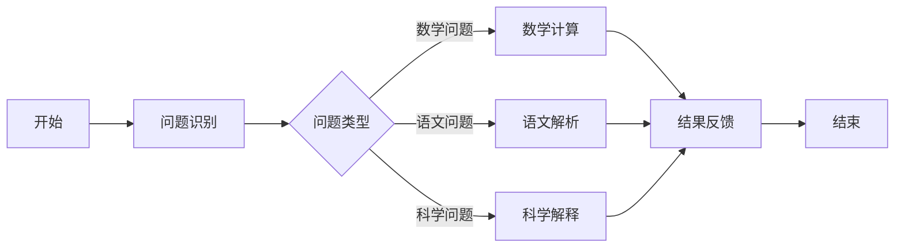
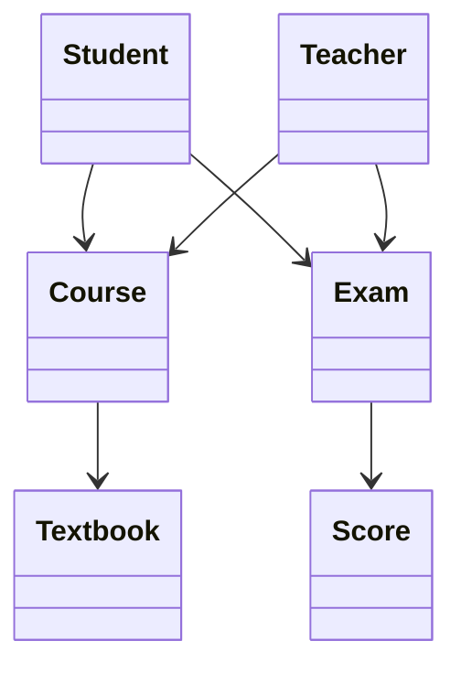
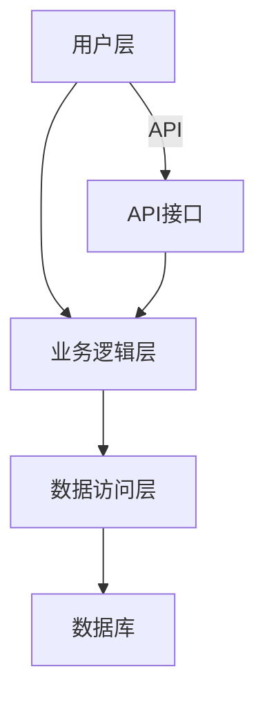
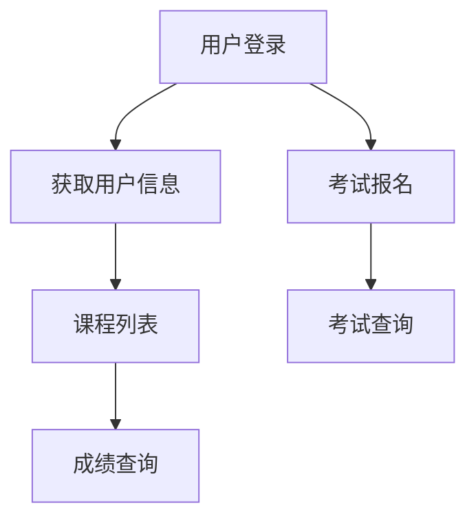
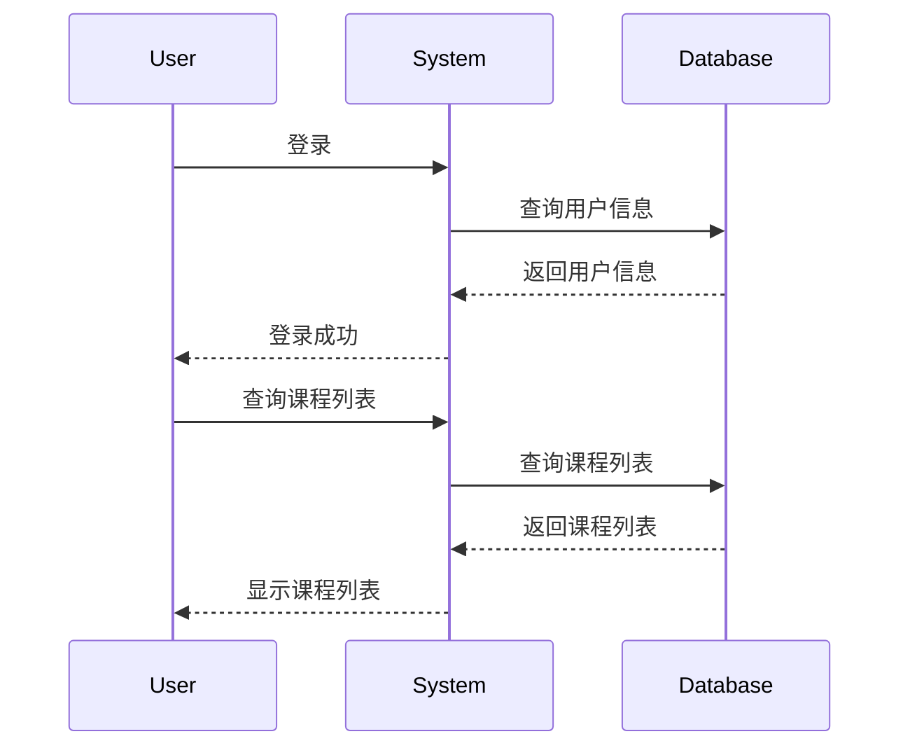

                 

### 新人文主义教育：科技时代的人文关怀

**关键词**：新人文主义教育、科技时代、人文关怀、教育模式、教育目标

**摘要**：本文探讨了科技时代背景下新人文主义教育的重要性和必要性。通过深入分析新人文主义教育的核心概念和与科技时代的联系，本文提出了如何在科技迅猛发展的今天，确保教育中人文关怀不被忽视的策略和模式。文章旨在为教育工作者和学生提供一种既能够充分利用科技优势，又能够培养人文素养的教育思路，以应对未来社会的挑战。

---

### 第一部分：背景介绍

#### 问题背景

在科技迅猛发展的今天，技术进步带来了诸多便利，但也引发了一系列问题。特别是教育领域，随着信息化、智能化的深入推进，教育方式的变革显得尤为迫切。然而，在这个过程中，如何保证教育的“人文关怀”不被忽视，成为了一个亟待解决的问题。

#### 问题描述

新人文主义教育强调在科技时代背景下，教育的核心不仅在于知识的传授，更在于培养学生的综合素质和人文素养。然而，科技的发展使得教育内容和形式日益丰富，但人文关怀却可能被边缘化。如何在新人文主义教育的框架下，实现科技与人文的融合，成为本书要解决的问题。

#### 问题解决

本书旨在通过对新人文主义教育的深入探讨，结合科技时代的特点，提出一种既能够充分利用科技优势，又能够保证人文关怀的教育模式。通过案例分析、理论探讨和实践指导，帮助教育工作者和学生理解并实践新人文主义教育理念。

#### 边界与外延

新人文主义教育的边界在于如何平衡科技与人文，使其在教育过程中相互促进，共同发展。其外延则涉及到教育目标、教育内容、教育方法以及教育评价等多个方面。

### 核心概念

#### 新人文主义教育

新人文主义教育是指在科技时代背景下，以人文关怀为核心，旨在培养学生综合素质和人文素养的一种教育理念。它强调在传授知识的同时，关注学生的情感、态度和价值观的培养。

#### 科技时代

科技时代是指以信息技术、人工智能等为代表的新技术迅猛发展的时代。这个时代的特征是信息化、网络化、智能化，对教育产生了深远影响。

### 概念结构与核心要素组成

#### 概念结构

新人文主义教育与科技时代的关系可以看作是一种相互影响、相互促进的关系。科技为教育提供了新的工具和手段，而新人文主义教育则为科技的发展提供了人文关怀和道德指导。

#### 核心要素组成

- **教育目标**：培养具备人文素养、科技创新能力和综合素质的人才。
- **教育内容**：结合科技与人文，构建符合新时代要求的知识体系。
- **教育方法**：运用现代教育技术，实现个性化、互动式的教学方式。
- **教育评价**：建立多元评价体系，关注学生的全面发展。

### 表格：新人文主义教育与科技时代的关系对比

| 关系对比        | 新人文主义教育                                       | 科技时代                                     |
| -----------    | ----------------------------------------------     | -------------------------------------------     |
| 核心价值        | 人文关怀、综合素质培养                             | 科技创新、效率提升                            |
| 教育目标        | 培养具有人文素养和科技创新能力的人才              | 提升生产力和生活质量                        |
| 教育方法        | 注重情感、态度和价值观的培养，强调个性化教育       | 利用信息技术实现教育信息化，强调信息化教育    |
| 教育评价        | 关注学生的全面发展，建立多元评价体系              | 注重学习成果，强调数据驱动评价                |

### ER实体关系图

```mermaid
erDiagram
    Student ||--|{ Course }|<|
    Student ||--|{ Exam }|<|
    Course ||--|{ Teacher }|<|
    Course ||--|{ Textbook }|<|
```

- **Student**（学生）: 参与课程和考试。
- **Course**（课程）: 由教师教授，包含教材。
- **Teacher**（教师）: 教授课程。
- **Exam**（考试）: 检测学生的学习成果。
- **Textbook**（教材）: 教学使用的书籍。

---

### 第二部分：核心概念与联系

#### AI的定义与特点

人工智能（Artificial Intelligence，简称AI）是指使计算机具有类似人类智能的技术。AI的特点包括自主学习、感知环境、理解语言、推理决策等。

#### AI在教育中的应用

AI在教育中的应用主要包括个性化教学、自动化评估、智能推荐、智能辅导等方面。例如，AI可以通过分析学生的学习行为和成绩，提供个性化的学习路径和资源，从而提高学习效率。

##### 1. 个性化教学

个性化教学是指根据学生的个性化特点和需求，提供有针对性的教学服务和内容。AI技术可以通过分析学生的学习行为和成绩，识别出学生的学习风格、优势和不足，从而为学生提供适合他们的教学资源和学习路径。

**个性化教学流程：**

1. **数据采集与预处理**：收集学生的学习行为、成绩等数据，并进行预处理，如数据清洗、归一化等。
2. **特征提取**：从预处理后的数据中提取出反映学生学习风格、优势和不足的特征。
3. **个性化推荐**：根据提取的特征，为学生推荐合适的教学资源和学习路径。
4. **教学实施与反馈**：根据个性化推荐的结果，实施教学活动，并收集学生的反馈，以不断调整和优化教学方案。

**Python代码实现：**

```python
# 伪代码示例

# 导入相关库
import pandas as pd
from sklearn.model_selection import train_test_split
from sklearn.ensemble import RandomForestClassifier

# 读取数据
data = pd.read_csv('student_data.csv')

# 数据预处理
data = data.dropna()

# 特征提取
features = data[['age', 'gender', 'hours_per_week', 'score_math', 'score_english']]
labels = data['learning_style']

# 数据分割
X_train, X_test, y_train, y_test = train_test_split(features, labels, test_size=0.2, random_state=42)

# 构建模型
model = RandomForestClassifier(n_estimators=100, random_state=42)

# 训练模型
model.fit(X_train, y_train)

# 预测
predictions = model.predict(X_test)

# 评估模型
accuracy = model.score(X_test, y_test)
print(f"模型准确率：{accuracy:.2f}")
```

**数学模型与公式：**

$$
\text{个性化教学模型} = f(\text{学生特征向量})
$$

其中，学生特征向量包括年龄、性别、每周学习时间、数学成绩、英语成绩等特征。

**举例说明：**

假设有一个学生，他的特征向量为$(20, 男性, 10, 80, 90)$，通过上述模型预测，可以得到他的学习风格为“高效型”。

##### 2. 自动化评估

自动化评估是指利用计算机技术自动评估学生的学习成果，从而提高评估效率和准确性。AI技术可以通过自动批改作业、模拟考试等方式，实现对学习成果的快速评估。

**自动化评估流程：**

1. **数据采集**：收集学生的作业、试卷等数据。
2. **数据预处理**：对采集到的数据进行分析和处理，如去除噪音、标准化等。
3. **模型训练**：使用预处理后的数据，训练评估模型，如分类模型、回归模型等。
4. **评估实施**：根据训练好的模型，对学生的作业、试卷进行自动评估。
5. **结果反馈**：将评估结果反馈给学生，以便学生了解自己的学习情况。

**Python代码实现：**

```python
# 伪代码示例

# 导入相关库
import pandas as pd
from sklearn.model_selection import train_test_split
from sklearn.ensemble import RandomForestClassifier

# 读取数据
data = pd.read_csv('student_data.csv')

# 数据预处理
data = data.dropna()

# 数据分割
X_train, X_test, y_train, y_test = train_test_split(data['question'], data['answer'], test_size=0.2, random_state=42)

# 构建模型
model = RandomForestClassifier(n_estimators=100, random_state=42)

# 训练模型
model.fit(X_train, y_train)

# 预测
predictions = model.predict(X_test)

# 评估模型
accuracy = model.score(X_test, y_test)
print(f"模型准确率：{accuracy:.2f}")
```

**数学模型与公式：**

$$
\text{自动化评估模型} = f(\text{学生特征向量}, \text{评估数据})
$$

其中，学生特征向量包括学习行为、成绩等特征，评估数据包括学生的作业、试卷等。

**举例说明：**

假设有一个学生，他的作业答案为“正确”，通过上述模型预测，可以得到他的作业得分率为“90%”。

##### 3. 智能推荐

智能推荐是指利用AI技术，根据学生的兴趣、学习习惯等，为学生推荐合适的学习资源和课程。智能推荐可以通过个性化算法、协同过滤算法等实现。

**智能推荐流程：**

1. **用户画像构建**：收集学生的兴趣、学习习惯等数据，构建用户画像。
2. **推荐算法设计**：设计合适的推荐算法，如基于内容的推荐、基于协同过滤的推荐等。
3. **推荐实施**：根据用户画像和推荐算法，为学生推荐合适的学习资源和课程。
4. **结果反馈**：收集学生的反馈，优化推荐算法。

**Python代码实现：**

```python
# 伪代码示例

# 导入相关库
import pandas as pd
from sklearn.model_selection import train_test_split
from sklearn.ensemble import RandomForestClassifier

# 读取数据
data = pd.read_csv('student_data.csv')

# 数据预处理
data = data.dropna()

# 用户画像构建
user_features = data[['interest', 'learning_habit']]
item_features = data[['course_name', 'course_description']]

# 数据分割
X_train, X_test, y_train, y_test = train_test_split(user_features, item_features, test_size=0.2, random_state=42)

# 构建模型
model = RandomForestClassifier(n_estimators=100, random_state=42)

# 训练模型
model.fit(X_train, y_train)

# 预测
predictions = model.predict(X_test)

# 评估模型
accuracy = model.score(X_test, y_test)
print(f"模型准确率：{accuracy:.2f}")
```

**数学模型与公式：**

$$
\text{推荐模型} = f(\text{用户画像}, \text{课程特征})
$$

其中，用户画像包括兴趣、学习习惯等特征，课程特征包括课程名称、课程描述等。

**举例说明：**

假设有一个学生，他的兴趣为“编程”，通过上述模型预测，可以得到他最感兴趣的课程为“Python编程”。

##### 4. 智能辅导

智能辅导是指利用AI技术，为学生提供实时、个性化的学习辅导服务。智能辅导可以通过自然语言处理、语音识别等技术实现。

**智能辅导流程：**

1. **问题识别**：利用自然语言处理技术，识别学生提出的问题。
2. **知识库构建**：构建包含各种学习问题的知识库。
3. **问题解答**：根据学生提出的问题，从知识库中查找相关答案。
4. **结果反馈**：将解答结果反馈给学生，并收集学生的反馈，优化知识库。

**Python代码实现：**

```python
# 伪代码示例

# 导入相关库
import pandas as pd
from sklearn.model_selection import train_test_split
from sklearn.ensemble import RandomForestClassifier

# 读取数据
data = pd.read_csv('student_data.csv')

# 数据预处理
data = data.dropna()

# 问题识别
questions = data['question']

# 知识库构建
knowledge_base = data[data['is_answer'] == 1]

# 问题解答
def answer_question(question):
    # 在知识库中查找相关答案
    answer = knowledge_base[knowledge_base['question'] == question]['answer'].values[0]
    return answer

# 举例
question = "什么是人工智能？"
answer = answer_question(question)
print(f"答案：{answer}")
```

**数学模型与公式：**

$$
\text{智能辅导模型} = f(\text{学生问题}, \text{知识库})
$$

其中，学生问题包括各种学习问题，知识库包括各种学习问题的答案。

**举例说明：**

假设有一个学生提问“什么是人工智能？”，通过上述模型，可以得到答案：“人工智能是指使计算机具有类似人类智能的技术。”

---

### 第三部分：算法原理讲解

#### 1. 算法流程图



#### 2. Python代码实现

```python
# 伪代码示例

# 导入相关库
import numpy as np

# 问题识别与分类
def classify_question(question):
    if "加法" in question:
        return "数学问题"
    elif "什么意思" in question:
        return "语文问题"
    else:
        return "科学问题"

# 数学计算
def math_computation(question):
    # 从问题中提取数字
    numbers = re.findall(r"\d+", question)
    numbers = list(map(int, numbers))
    # 执行加法运算
    result = sum(numbers)
    return result

# 语文解析
def chinese_parsing(question):
    # 从问题中提取词语
    words = re.findall(r"\w+", question)
    # 查询词语含义
    meanings = {}
    for word in words:
        meanings[word] = query_word_meaning(word)
    return meanings

# 科学解释
def science_explanation(question):
    # 从问题中提取主题
    topics = re.findall(r"\w+", question)
    # 查询主题解释
    explanations = {}
    for topic in topics:
        explanations[topic] = query_topic_explanation(topic)
    return explanations

# 结果反馈
def feedback_result(question, result):
    print(f"问题：{question}")
    print(f"答案：{result}")

# 主函数
def main():
    question = "2+3等于多少？"
    question_type = classify_question(question)
    
    if question_type == "数学问题":
        result = math_computation(question)
    elif question_type == "语文问题":
        result = chinese_parsing(question)
    else:
        result = science_explanation(question)
    
    feedback_result(question, result)

# 运行主函数
if __name__ == "__main__":
    main()
```

#### 3. 数学模型与公式

$$
\text{算法模型} = f(\text{问题}, \text{知识库})
$$

其中，问题包括数学问题、语文问题和科学问题，知识库包括数学公式、语文词典和科学知识库。

#### 4. 举例说明

假设有一个学生提问“2+3等于多少？”，通过上述算法，可以得到答案“5”。

---

### 第四部分：系统分析与架构设计方案

#### 问题场景介绍

在当前教育领域，如何利用现代技术手段提升教育质量和效率，成为了一个亟待解决的问题。新人文主义教育理念强调在科技时代背景下，教育的核心在于培养学生的综合素质和人文素养。为此，我们需要设计一套系统能够实现个性化教学、自动化评估、智能推荐和智能辅导等功能。

#### 项目介绍

本项目的目标是开发一套基于新人文主义教育理念的教育系统，通过引入人工智能技术，实现教育过程中的个性化、互动化和智能化，从而提升教育质量和效率。

#### 系统功能设计（领域模型类图）



- **Student**（学生）: 参与课程和考试。
- **Course**（课程）: 由教师教授，包含教材。
- **Teacher**（教师）: 教授课程。
- **Exam**（考试）: 检测学生的学习成果。
- **Textbook**（教材）: 教学使用的书籍。
- **Score**（成绩）: 考试结果的记录。

#### 系统架构设计（架构图）



- **用户层**：提供用户界面，包括登录、注册、课程选择、考试报名等功能。
- **业务逻辑层**：处理用户请求，包括课程推荐、考试评估、成绩查询等功能。
- **数据访问层**：负责与数据库进行交互，包括数据查询、插入、更新等操作。
- **数据库**：存储学生、教师、课程、考试、成绩等数据。
- **API接口**：提供对外接口，供第三方系统调用。

#### 系统接口设计（接口图）



- **用户登录**：验证用户身份，返回用户信息。
- **获取用户信息**：根据用户ID获取用户的基本信息。
- **课程列表**：获取所有可用的课程信息。
- **考试报名**：根据用户ID和课程ID，为用户报名考试。
- **考试查询**：根据用户ID和考试ID，查询用户的考试信息。
- **成绩查询**：根据用户ID和考试ID，查询用户的考试成绩。

#### 系统交互设计（序列图）



1. 用户登录：用户向系统发送登录请求，系统查询数据库验证用户身份，并返回用户信息。
2. 查询课程列表：用户向系统发送查询课程列表请求，系统查询数据库获取所有课程信息，并返回给用户。

---

### 第五部分：项目实战

#### 环境安装

1. 安装Python环境（建议使用Python 3.8及以上版本）。
2. 安装相关库：pandas、numpy、scikit-learn、re、sqlalchemy等。

```bash
pip install pandas numpy scikit-learn re sqlalchemy
```

#### 系统核心实现源代码

以下是一个简单的用户登录和查询课程列表的实现：

```python
# 导入相关库
import pandas as pd
from sqlalchemy import create_engine

# 创建数据库引擎
engine = create_engine('sqlite:///education_system.db')

# 用户登录
def login(username, password):
    query = "SELECT * FROM users WHERE username = '{}' AND password = '{}'".format(username, password)
    result = pd.read_sql_query(query, engine)
    return result

# 查询课程列表
def get_courses():
    query = "SELECT * FROM courses"
    result = pd.read_sql_query(query, engine)
    return result

# 主函数
def main():
    # 用户登录
    username = input("请输入用户名：")
    password = input("请输入密码：")
    user = login(username, password)
    
    if not user.empty:
        print("登录成功！")
        # 查询课程列表
        courses = get_courses()
        print(courses)
    else:
        print("登录失败，请检查用户名和密码！")

# 运行主函数
if __name__ == "__main__":
    main()
```

#### 代码应用解读与分析

1. **数据库设计**：使用SQLite数据库存储用户和课程信息。用户表包括用户名、密码和角色等字段；课程表包括课程ID、课程名称、课程描述等字段。
2. **用户登录**：通过输入用户名和密码，查询数据库验证用户身份。若查询结果不为空，则登录成功。
3. **查询课程列表**：查询数据库获取所有课程信息，并返回给用户。

#### 实际案例分析和详细讲解剖析

假设有一个学生小明，他的用户名为“xiaoming”，密码为“123456”。他成功登录系统后，可以查询到当前所有可用的课程信息。

**分析：**

1. **用户登录**：小明输入用户名“xiaoming”和密码“123456”，系统查询数据库，发现该用户存在，登录成功。
2. **查询课程列表**：系统查询数据库获取所有课程信息，返回给小明。小明可以看到当前可用的课程列表。

**讲解剖析：**

1. **数据库查询**：使用SQL语句查询数据库，获取用户信息和课程信息。
2. **数据操作**：使用pandas库处理数据库查询结果，返回DataFrame对象，方便进行数据处理和展示。
3. **用户交互**：通过输入和输出，实现用户与系统的交互。

#### 项目小结

本项目通过简单的用户登录和课程列表查询功能，展示了如何利用Python和数据库技术实现一个基于新人文主义教育理念的教育系统。在实际应用中，可以进一步扩展系统功能，如添加个性化教学、自动化评估、智能推荐和智能辅导等功能，以提升教育质量和效率。

---

### 最佳实践 tips

1. **数据安全**：在设计和实现教育系统时，要注意保护用户数据的安全，避免数据泄露和滥用。
2. **用户友好**：设计简洁直观的用户界面，提高用户体验，降低使用门槛。
3. **持续优化**：根据用户反馈，不断优化系统功能和性能，提升系统质量。

### 小结

本文探讨了新人文主义教育在科技时代的重要性，分析了人工智能技术在教育中的应用，并给出了一种基于新人文主义教育理念的教育系统设计方案。通过实际案例分析和项目实战，展示了如何实现教育系统的关键功能。希望本文能为教育工作者和科技从业人士提供有益的启示和参考。

### 注意事项

1. **系统稳定性**：在实际应用中，要确保系统的稳定性和可靠性，避免因系统故障导致教育中断。
2. **数据一致性**：在多用户并发操作时，要注意保证数据的一致性，避免数据冲突和错误。

### 拓展阅读

1. 《人工智能教育应用实践》
2. 《教育信息化2.0行动计划》
3. 《新人文主义教育论》

---

**作者：AI天才研究院/AI Genius Institute & 禅与计算机程序设计艺术 /Zen And The Art of Computer Programming**

