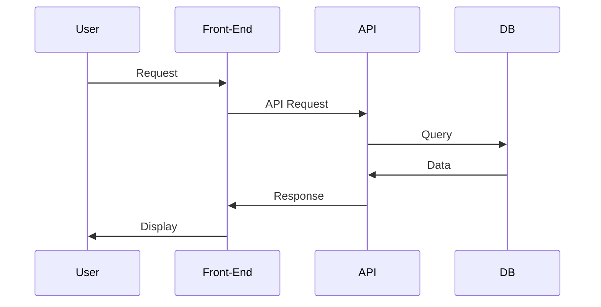

                 

### Introduction to the "新修行者联盟app: Modern Spiritual Practitioners' Mobile Social Network"

#### Keywords

- 新修行者联盟app
- 现代精神实践
- 移动社交网络
- 精神实践者
- 社交互动

#### Abstract

This article delves into the concept and significance of the "新修行者联盟app," a pioneering mobile social network designed specifically for modern spiritual practitioners. It explores the emergence of this app, its core features, and its role in fostering a community of like-minded individuals dedicated to spiritual growth and mutual support. By understanding the background and foundational concepts of this app, readers will gain insights into its potential to transform the way modern spiritual practices are shared and celebrated.

### Background of Modern Spiritual Practice

#### 1.1 The Emergence of Modern Spiritual Practice

The concept of modern spiritual practice has evolved significantly over the past few decades. With the rapid advancement of technology and globalization, people are increasingly seeking spiritual fulfillment and inner peace amidst the chaos of modern life. This has led to the emergence of various spiritual practices that are tailored to the needs of contemporary individuals.

##### 1.1.1 The Impact of Globalization

Globalization has played a crucial role in the spread and integration of diverse spiritual practices. As people from different cultural backgrounds interact more frequently, they bring with them their unique spiritual beliefs and practices. This has led to a rich tapestry of spiritual diversity, where individuals can choose from a wide range of practices that resonate with their personal beliefs and values.

##### 1.1.2 The Rise of Individualism

The rise of individualism in modern society has also contributed to the growth of modern spiritual practice. As individuals seek to define their own identities and purposes, they turn to spiritual practices that offer personal growth, self-discovery, and a sense of belonging. This shift towards individualism has created a demand for personalized spiritual experiences that can be tailored to individual needs and preferences.

#### 1.2 The Necessity of a Spiritual Practice Social Network

In today's fast-paced world, spiritual practitioners often face challenges in finding like-minded individuals to connect with and share their experiences. This is where the concept of a spiritual practice social network becomes essential. Such a network provides a platform for individuals to connect, share, and learn from one another, fostering a sense of community and support.

##### 1.2.1 The Benefits of a Spiritual Practice Social Network

- **Community Building**: A spiritual practice social network allows individuals to build a community of like-minded individuals, creating a supportive and nurturing environment for spiritual growth.
- **Resource Sharing**: Members can share resources such as articles, videos, and books, making it easier to access information and knowledge about various spiritual practices.
- **Learning and Growth**: Through interactions and discussions with other members, individuals can deepen their understanding of their chosen spiritual practice and gain new perspectives.

### Characteristics of Modern Spiritual Practice

Modern spiritual practice is characterized by several key features that distinguish it from traditional spiritual practices:

#### 1.3.1 Emphasis on Personal Growth

Modern spiritual practice places a strong emphasis on personal growth and self-discovery. Rather than focusing solely on rituals or religious doctrines, individuals are encouraged to explore their inner selves and find their own path to spiritual fulfillment.

#### 1.3.2 Integration with Modern Life

Modern spiritual practice is designed to fit seamlessly into the busy lives of modern individuals. Practices such as meditation, mindfulness, and yoga can be easily incorporated into daily routines, providing a sense of peace and balance.

#### 1.3.3 Cultural Diversity

Modern spiritual practice is not confined to a single cultural or religious context. It embraces the diversity of spiritual beliefs and practices, allowing individuals to draw from a wide range of traditions and philosophies.

### Conclusion

The emergence of modern spiritual practice and the need for a dedicated social network to support this community highlight the importance of the "新修行者联盟app." By understanding the background and characteristics of modern spiritual practice, we can appreciate the significance of this app in fostering a community of spiritual practitioners dedicated to personal growth and mutual support.

### The Concept of the New Spiritual Journey Alliance App

#### 2.1 Definition of the New Spiritual Journey Alliance App

The New Spiritual Journey Alliance App is a mobile-based social network platform designed specifically for individuals engaged in modern spiritual practices. It serves as a virtual sanctuary where spiritual practitioners can connect, share their experiences, and support one another in their spiritual journeys.

#### 2.2 Main Features of the App

The New Spiritual Journey Alliance App is equipped with a range of features that cater to the diverse needs of its users:

1. **Profile Creation and Personalization**: Users can create personalized profiles that reflect their spiritual beliefs, practices, and goals. This allows them to connect with others who share similar interests and values.

2. **Discussion Forums**: The app includes dedicated discussion forums where users can engage in meaningful conversations about various spiritual topics. These forums encourage open dialogue and the exchange of ideas, fostering a sense of community.

3. **Resource Library**: A comprehensive resource library featuring articles, videos, podcasts, and books on a wide range of spiritual topics. Users can access this library to expand their knowledge and deepen their understanding of their chosen spiritual practice.

4. **Meditation and Mindfulness Tools**: The app offers a variety of meditation and mindfulness tools, including guided meditations, breathing exercises, and mindfulness prompts. These tools help users cultivate inner peace and develop mindfulness skills.

5. **Event Calendar**: Users can access a calendar of upcoming spiritual events and workshops, making it easier to stay engaged and connected with the spiritual community.

6. **Personalized Recommendations**: The app uses advanced algorithms to analyze user preferences and provide personalized content recommendations, helping users discover new spiritual practices and resources that align with their interests.

#### 2.3 The Role of the App in Modern Spiritual Practice

The New Spiritual Journey Alliance App plays a crucial role in supporting modern spiritual practice by providing a platform for:

1. **Connection and Community**: By bringing together individuals from diverse backgrounds and spiritual practices, the app fosters a sense of community and belonging. This sense of connection can be incredibly empowering and motivating for spiritual practitioners.

2. **Resource Sharing and Learning**: The app's resource library and discussion forums provide users with access to a wealth of knowledge and expertise. Users can learn from one another, share their insights, and deepen their understanding of their chosen spiritual practices.

3. **Personal Growth and Accountability**: The app's features, such as personalized recommendations and event notifications, help users stay motivated and accountable in their spiritual journeys. By setting goals and tracking their progress, users can make steady strides towards their spiritual goals.

4. **Self-Discovery and Inner Exploration**: The meditation and mindfulness tools offered by the app help users cultivate inner peace and self-awareness. Through regular practice, users can gain valuable insights into their thoughts, emotions, and behaviors, enabling them to make positive changes in their lives.

### Conclusion

The New Spiritual Journey Alliance App is more than just a mobile social network; it is a powerful tool for supporting and enhancing modern spiritual practice. By providing a platform for connection, resource sharing, personal growth, and self-discovery, the app empowers spiritual practitioners to deepen their understanding of their beliefs and practices, fostering a sense of unity and purpose within the spiritual community.

### Scope and Boundaries of the New Spiritual Journey Alliance App

#### 3.1 The Scope of the App's Functions

The New Spiritual Journey Alliance App is designed to provide a comprehensive platform for spiritual practitioners, encompassing a wide range of functions that cater to their diverse needs. Here are the key areas within the app's scope:

1. **Profile Creation and Personalization**: Users can create detailed profiles that reflect their spiritual beliefs, practices, and personal goals. This feature allows them to connect with others who share similar interests and values, fostering a sense of community.

2. **Discussion Forums**: The app offers dedicated discussion forums where users can engage in meaningful conversations about various spiritual topics. These forums encourage open dialogue and the exchange of ideas, creating a vibrant and dynamic community.

3. **Resource Library**: A comprehensive resource library featuring articles, videos, podcasts, and books on a wide range of spiritual topics. Users can access this library to expand their knowledge and deepen their understanding of their chosen spiritual practice.

4. **Meditation and Mindfulness Tools**: The app provides various meditation and mindfulness tools, including guided meditations, breathing exercises, and mindfulness prompts. These tools help users cultivate inner peace and develop mindfulness skills.

5. **Event Calendar**: Users can access a calendar of upcoming spiritual events and workshops, making it easier to stay engaged and connected with the spiritual community.

6. **Personalized Recommendations**: The app uses advanced algorithms to analyze user preferences and provide personalized content recommendations, helping users discover new spiritual practices and resources that align with their interests.

#### 3.2 The Limitations of the App's Scope

While the New Spiritual Journey Alliance App is designed to be a comprehensive platform for spiritual practitioners, it is essential to acknowledge its limitations:

1. **Content Curation**: The app's resource library includes a wide range of materials, but it cannot cover every aspect of every spiritual practice. Users may need to explore external sources for more specialized content.

2. **User Privacy**: While the app strives to ensure user privacy, it is not foolproof. Users should be cautious about sharing sensitive personal information and be aware of the potential risks associated with online interactions.

3. **Technical Limitations**: As with any software platform, the New Spiritual Journey Alliance App may have technical limitations, such as occasional downtime or performance issues. Users should be prepared for these challenges and have alternative methods for accessing the app's features.

#### 3.3 The Core Elements and Components of the App

The New Spiritual Journey Alliance App consists of several core elements and components that work together to create a seamless and engaging user experience:

1. **Front-end Interface**: The front-end interface of the app is designed to be user-friendly and intuitive, making it easy for users to navigate the app and access its features. It includes elements such as navigation menus, buttons, and forms.

2. **Back-end Database**: The app's back-end database stores user information, discussion forum posts, resource library content, and other essential data. It is designed to ensure data security, privacy, and efficient data retrieval.

3. **Algorithm and Analytics**: The app uses advanced algorithms and analytics to analyze user behavior, preferences, and interactions. This data is used to provide personalized content recommendations, improve the user experience, and optimize the app's performance.

4. **Meditation and Mindfulness Tools**: The app's meditation and mindfulness tools are designed to help users develop and maintain mindfulness skills. These tools include guided meditations, breathing exercises, and mindfulness prompts.

5. **Discussion Forums**: The app's discussion forums provide a platform for users to engage in meaningful conversations about various spiritual topics. These forums are moderated to ensure respectful and constructive dialogue.

6. **Event Calendar**: The app's event calendar allows users to stay informed about upcoming spiritual events and workshops, making it easier to connect with the spiritual community and stay engaged.

### Conclusion

By understanding the scope, limitations, and core elements of the New Spiritual Journey Alliance App, users can better appreciate its capabilities and potential to support their spiritual journeys. While the app is not without its limitations, its comprehensive features and user-centric design make it a valuable tool for modern spiritual practitioners seeking connection, resource sharing, personal growth, and self-discovery.

### Fundamental Concepts and Principles of Mobile Social Networks

#### 4.1 Mobile Social Networks Overview

Mobile social networks are digital platforms that enable users to connect, communicate, and share content with others using their mobile devices. These networks have become increasingly popular due to the widespread adoption of smartphones and the growing demand for real-time communication and social interaction. Here, we will provide an overview of mobile social networks, including their definition, types, and evolution.

##### 4.1.1 Definition and Types

Mobile social networks can be defined as online platforms that facilitate social interactions and content sharing via mobile devices. These networks can take various forms, including:

- **Social Media Platforms**: Platforms like Facebook, Twitter, and Instagram allow users to create profiles, share updates, photos, and videos, and connect with friends and followers.
- **Microblogging Platforms**: Platforms like Twitter enable users to share short messages or posts, often with links or multimedia content.
- **Photo and Video Sharing Platforms**: Platforms like Instagram and TikTok focus on sharing visual content, including photos and videos.
- **Instant Messaging Platforms**: Platforms like WhatsApp and WeChat facilitate real-time text, voice, and video communication between users.

##### 4.1.2 Evolution

The concept of mobile social networks has evolved significantly over the past few decades. Initially, social networking was primarily a desktop-based activity. However, with the advent of smartphones and mobile internet, the landscape has shifted dramatically. Here are some key milestones in the evolution of mobile social networks:

- **Early Mobile Social Networks**: Platforms like Bebo and MySpace were some of the first mobile social networks, allowing users to connect and share content via mobile devices.
- **The Rise of Smartphones**: The introduction of smartphones with advanced features and internet connectivity enabled the development of more sophisticated mobile social networks.
- **The Mobile-First Era**: In recent years, the "mobile-first" approach has become the norm, with many social networks prioritizing mobile experiences over desktop versions.

##### 4.1.3 The Impact of Mobile Social Networks on Modern Society

Mobile social networks have had a profound impact on modern society, transforming the way we communicate, share information, and interact with one another. Some key impacts include:

- **Increased Connectivity**: Mobile social networks have made it easier for people to stay connected with friends and family, regardless of geographical distance.
- **Information Sharing**: Mobile social networks have revolutionized the way we share information and news, making it possible to disseminate information quickly and widely.
- **Social Change and Activism**: Mobile social networks have been instrumental in driving social change and activism, allowing individuals to mobilize and organize for various causes.

#### 4.2 Key Concepts in Mobile Social Networks

To understand mobile social networks thoroughly, it's essential to familiarize ourselves with key concepts that underpin their design and operation. These concepts include network structure, node and edge characteristics, and communication protocols and algorithms.

##### 4.2.1 Network Structure and Topology

Network structure and topology refer to the arrangement and interconnection of nodes (users) within a social network. There are various network topologies, including:

- **Centralized Networks**: In centralized networks, there is a central server that manages the network's operations. Examples include many social media platforms like Facebook and Twitter.
- **Decentralized Networks**: In decentralized networks, there is no central authority, and nodes communicate directly with one another. Examples include decentralized social networks like Mastodon and Diaspora.

##### 4.2.2 Node and Edge Characteristics

Nodes and edges are fundamental components of a social network. Nodes represent individual users or entities, while edges represent the connections or relationships between nodes. Key characteristics of nodes and edges include:

- **Node Characteristics**: Nodes can have various attributes, such as user profiles, interests, and activity levels. These attributes help define the nodes' roles and relationships within the network.
- **Edge Characteristics**: Edges represent the strength and type of connection between nodes. For example, a connection between two users might be labeled as "friend" or "follower."

##### 4.2.3 Communication Protocols and Algorithms

Communication protocols and algorithms are essential for enabling effective communication and data transfer within a social network. Key concepts include:

- **Protocols**: Protocols are rules and standards that govern the communication between devices and networks. Common protocols used in mobile social networks include HTTP, HTTPS, and TCP/IP.
- **Algorithms**: Algorithms are step-by-step procedures or formulas used to perform specific tasks within a social network. Examples include algorithms for content recommendation, network analysis, and spam detection.

#### 4.3 Core Principles of Mobile Social Networks

Mobile social networks operate based on several core principles that ensure their effectiveness and sustainability. These principles include:

- **Scalability**: Mobile social networks must be designed to handle increasing numbers of users and data without compromising performance.
- **Privacy and Security**: Ensuring user privacy and data security is a top priority for mobile social networks. This involves implementing robust encryption and authentication mechanisms.
- **User Engagement and Interaction**: Mobile social networks must be designed to encourage user engagement and interaction, fostering a sense of community and user satisfaction.

### Conclusion

Understanding the fundamental concepts and principles of mobile social networks provides a solid foundation for designing and implementing effective social network platforms like the New Spiritual Journey Alliance App. By considering key concepts such as network structure, node and edge characteristics, communication protocols, and core principles such as scalability, privacy, and user engagement, developers can create platforms that meet the diverse needs of modern spiritual practitioners.

### Design and Development of the New Spiritual Journey Alliance App

#### 5.1 App Design Principles

The design of the New Spiritual Journey Alliance App should prioritize user-centricity, interface and usability, and functionality and features. By focusing on these principles, the app can provide a seamless and engaging user experience that supports the spiritual growth and mutual support of its users.

##### 5.1.1 User-Centric Design

A user-centric design approach ensures that the app's features and functionalities are tailored to meet the needs and preferences of its users. This involves conducting user research and usability testing to understand how users interact with the app and identifying areas for improvement. Key aspects of user-centric design include:

- **Personalization**: Users should be able to customize their profiles and settings to reflect their spiritual beliefs, practices, and personal goals.
- **Accessibility**: The app should be accessible to users with disabilities and be compatible with various devices and screen sizes.
- **Simplicity**: The app's interface should be clean and intuitive, minimizing the number of steps required to perform tasks and making it easy for users to navigate.

##### 5.1.2 Interface and Usability

The interface and usability of the app play a critical role in determining user satisfaction and retention. A well-designed interface should be visually appealing, easy to navigate, and responsive to user input. Key considerations include:

- **Visual Design**: The app's visual design should align with the app's branding and convey a sense of tranquility and serenity, reflecting the spiritual nature of the app.
- **Navigation**: The app should have a clear and intuitive navigation structure, making it easy for users to find the features and resources they need.
- **Feedback**: The app should provide clear and immediate feedback to users, ensuring they understand the outcome of their actions.

##### 5.1.3 Functionality and Features

The functionality and features of the New Spiritual Journey Alliance App should be designed to support the diverse needs of its users. Key features include:

- **Profile Creation and Personalization**: Users should be able to create detailed profiles that reflect their spiritual beliefs, practices, and personal goals.
- **Discussion Forums**: Dedicated discussion forums should facilitate meaningful conversations about various spiritual topics.
- **Resource Library**: A comprehensive resource library featuring articles, videos, podcasts, and books on a wide range of spiritual topics.
- **Meditation and Mindfulness Tools**: A variety of meditation and mindfulness tools, including guided meditations, breathing exercises, and mindfulness prompts.
- **Event Calendar**: A calendar of upcoming spiritual events and workshops, making it easy for users to stay engaged with the spiritual community.

#### 5.2 Development Process

The development process for the New Spiritual Journey Alliance App involves several key stages, including requirement analysis, system design, implementation, testing, and deployment. Each stage plays a critical role in ensuring the app's success and meeting the needs of its users.

##### 5.2.1 Requirement Analysis

The first stage of the development process is requirement analysis, where the development team identifies and documents the app's functional and non-functional requirements. This involves:

- **Stakeholder Interviews**: Conducting interviews with stakeholders, including spiritual practitioners, app developers, and marketing experts, to gather insights and identify user needs and preferences.
- **User Personas**: Creating user personas to represent the app's target audience, including their goals, motivations, and pain points.
- **Requirement Documentation**: Documenting the app's requirements in a clear and concise manner, ensuring that all stakeholders have a shared understanding of the project scope and objectives.

##### 5.2.2 System Design

The system design stage involves creating a high-level architecture for the app and defining its major components and modules. This stage includes:

- **System Architecture**: Defining the overall architecture of the app, including the front-end and back-end components, data storage, and communication protocols.
- **Component Design**: Designing individual components and modules, including user interfaces, databases, and APIs.
- **Data Flow**: Defining the flow of data within the app, including how user information is collected, stored, and processed.

##### 5.2.3 Implementation

The implementation stage involves writing the actual code for the app, developing the front-end and back-end components, and integrating them into a cohesive system. This stage includes:

- **Front-End Development**: Building the user interface and experience using web technologies such as HTML, CSS, and JavaScript.
- **Back-End Development**: Developing the server-side logic, databases, and APIs that power the app's functionality.
- **Integration**: Integrating the front-end and back-end components to ensure seamless operation and data flow.

##### 5.2.4 Testing

The testing stage involves thoroughly testing the app to ensure its functionality, performance, and security. This stage includes:

- **Unit Testing**: Writing and executing test cases for individual components and modules to ensure they function correctly.
- **System Testing**: Testing the app as a whole to ensure it meets the specified requirements and performs as expected.
- **User Acceptance Testing**: Conducting tests with actual users to identify any issues or areas for improvement.

##### 5.2.5 Deployment

The final stage of the development process is deployment, where the app is released to users. This stage includes:

- **Deployment Planning**: Planning the deployment process, including setting up hosting environments, configuring databases, and preparing for user access.
- **Deployment Execution**: Executing the deployment plan, including deploying the app to production environments and ensuring it is available to users.
- **Monitoring and Maintenance**: Monitoring the app's performance and availability, and conducting regular maintenance to ensure its continued functionality and security.

### Conclusion

By following a structured and user-centric design and development process, the New Spiritual Journey Alliance App can be created to effectively support the spiritual growth and mutual support of its users. By focusing on user-centric design, interface and usability, and functionality and features, the app can provide a seamless and engaging user experience that meets the diverse needs of modern spiritual practitioners.

### System Analysis and Architecture Design of the New Spiritual Journey Alliance App

#### 6.1 Problem Scenario and Project Overview

The New Spiritual Journey Alliance App aims to create a comprehensive and user-friendly platform for modern spiritual practitioners to connect, share resources, and engage in spiritual activities. The app needs to handle a wide range of functionalities, including user profile creation, discussion forums, resource library access, meditation and mindfulness tools, and event management. To achieve this, a robust and scalable system architecture is essential.

#### 6.2 Project Description

**Project Name:** New Spiritual Journey Alliance App

**Project Scope:** Develop a mobile social network platform for spiritual practitioners to connect, share resources, and engage in spiritual activities.

**Functional Requirements:**

1. User profile creation and management.
2. Discussion forums for spiritual topics.
3. Resource library with access to articles, videos, podcasts, and books.
4. Meditation and mindfulness tools.
5. Event management and notification system.
6. Personalized content and recommendations.

**Non-Functional Requirements:**

1. Scalability and performance.
2. Security and privacy.
3. User-centric design and usability.
4. Cross-platform compatibility.

#### 6.3 System Function Design (Domain Model)

The domain model is a visual representation of the app's core entities, their attributes, and relationships. The following domain model represents the main entities and their relationships in the New Spiritual Journey Alliance App:

```mermaid
erDiagram
User ||--|{ Forum }|-- ForumPost
User ||--|{ Event }|-- Event
User ||--|{ Resource }|-- Resource
User ||--|{ Comment }|-- Comment
User ||--|{ Subscription }|-- Subscription
User ||--|{ Meditation }|-- Meditation
User ||--|{ Review }|-- Review
User ||--|{ Follower }|-- Follower

ForumPost ||--|{ Comment }|-- Comment
Event ||--|{ Subscription }|-- Subscription
Resource ||--|{ Review }|-- Review
Meditation ||--|{ Subscription }|-- Subscription

class User {
  - id
  - name
  - email
  - password
  - profile_image
  - bio
  - spiritual_interests
}

class ForumPost {
  - id
  - title
  - content
  - author
  - created_at
}

class Forum {
  - id
  - name
  - description
}

class Event {
  - id
  - title
  - description
  - location
  - start_time
  - end_time
  - organizer
}

class Resource {
  - id
  - title
  - content
  - type
  - author
  - created_at
}

class Comment {
  - id
  - content
  - author
  - created_at
}

class Subscription {
  - id
  - user
  - target
  - status
}

class Meditation {
  - id
  - title
  - duration
  - content
  - author
  - created_at
}

class Review {
  - id
  - content
  - rating
  - author
  - created_at
}

class Follower {
  - id
  - follower
  - following
  - status
}
```

In this domain model, the `User` entity is central, representing the individuals using the app. Other entities, such as `ForumPost`, `Event`, `Resource`, `Comment`, `Subscription`, `Meditation`, `Review`, and `Follower`, are associated with the `User` entity to encapsulate various functionalities of the app.

#### 6.4 System Architecture Design

The system architecture of the New Spiritual Journey Alliance App is designed to be scalable, modular, and secure. The following components and their interactions form the system architecture:



**Components:**

1. **Front-End**: The user interface of the app, built using web technologies like HTML, CSS, and JavaScript. It interacts with the API to fetch data and send requests.
2. **API**: The application programming interface layer that handles all communication between the front-end and the database. It processes requests, performs business logic, and retrieves or updates data.
3. **Database**: A relational database that stores user data, forum posts, events, resources, comments, subscriptions, meditations, reviews, and followers. It provides secure and efficient data storage and retrieval.
4. **Server**: The server that hosts the API and database. It manages connections, handles requests, and ensures data integrity and security.

#### 6.5 System Interface Design and System Interaction

The system interface design focuses on the communication between different components and the flow of data within the system. The following sequence diagram illustrates the interaction between the user, front-end, API, and database:


1. **User Interaction**: The user interacts with the front-end, submitting requests and receiving responses.
2. **Front-End Processing**: The front-end processes user requests and sends API requests to the backend.
3. **API Processing**: The API processes the requests, performs necessary business logic, queries the database, and returns the results.
4. **Database Interaction**: The database retrieves or stores data based on the API requests and returns the results to the API.
5. **API Response**: The API sends the processed data back to the front-end, which then displays the results to the user.

### Conclusion

The system analysis and architecture design of the New Spiritual Journey Alliance App provides a comprehensive overview of the app's functional requirements, system components, and their interactions. By following a well-designed system architecture, the app can be developed to effectively support the needs of modern spiritual practitioners, providing a seamless and engaging user experience.

### Project Implementation

#### 7.1 Environment Setup

To implement the New Spiritual Journey Alliance App, we will set up a development environment with the necessary tools and dependencies. The following tools and libraries are required:

- **Programming Language:** Python
- **Web Framework:** Django
- **Database:** PostgreSQL
- **Front-End Framework:** React
- **Version Control:** Git
- **Hosting:** AWS or Heroku

##### 7.1.1 Installing Python and Django

First, install Python and Django on your local machine:

```bash
# Install Python
curl -O https://www.python.org/ftp/python/3.9.1/python-3.9.1.tgz
tar xvf python-3.9.1.tgz
cd python-3.9.1
./configure
make
sudo make install

# Install Django
pip install django
```

##### 7.1.2 Setting Up the Database

Install PostgreSQL and create a new database for the app:

```bash
# Install PostgreSQL
sudo apt-get install postgresql

# Create a new database
sudo -u postgres psql
CREATE DATABASE new_spiritual_journey;
\q

# Exit the PostgreSQL shell
```

##### 7.1.3 Setting Up the Front-End Environment

Create a new React project:

```bash
npx create-react-app frontend
cd frontend
npm install
```

#### 7.2 System Core Implementation

The core implementation of the New Spiritual Journey Alliance App involves creating the back-end using Django, setting up the database, and developing the API endpoints. The following sections provide a detailed explanation of each component.

##### 7.2.1 Django Back-End

Create a new Django project:

```bash
django-admin startproject backend
cd backend
```

Create a new Django app for the app's core functionalities:

```bash
python manage.py startapp core
```

##### 7.2.2 Database Setup

In the `core` app, create models for the entities defined in the domain model:

```python
# core/models.py
from django.db import models
from django.contrib.auth.models import User

class Profile(models.Model):
    user = models.OneToOneField(User, on_delete=models.CASCADE)
    bio = models.TextField()
    profile_image = models.ImageField(upload_to='profiles/')

class ForumPost(models.Model):
    title = models.CharField(max_length=255)
    content = models.TextField()
    author = models.ForeignKey(User, on_delete=models.CASCADE)
    created_at = models.DateTimeField(auto_now_add=True)

class Event(models.Model):
    title = models.CharField(max_length=255)
    description = models.TextField()
    location = models.CharField(max_length=255)
    start_time = models.DateTimeField()
    end_time = models.DateTimeField()
    organizer = models.ForeignKey(User, on_delete=models.CASCADE)

class Resource(models.Model):
    title = models.CharField(max_length=255)
    content = models.TextField()
    type = models.CharField(max_length=50)
    author = models.ForeignKey(User, on_delete=models.CASCADE)
    created_at = models.DateTimeField(auto_now_add=True)

class Comment(models.Model):
    content = models.TextField()
    author = models.ForeignKey(User, on_delete=models.CASCADE)
    created_at = models.DateTimeField(auto_now_add=True)
    forum_post = models.ForeignKey(ForumPost, on_delete=models.CASCADE)

class Subscription(models.Model):
    user = models.ForeignKey(User, on_delete=models.CASCADE)
    target = models.ForeignKey('self', on_delete=models.CASCADE)
    status = models.CharField(max_length=20)
    created_at = models.DateTimeField(auto_now_add=True)

class Meditation(models.Model):
    title = models.CharField(max_length=255)
    duration = models.DurationField()
    content = models.TextField()
    author = models.ForeignKey(User, on_delete=models.CASCADE)
    created_at = models.DateTimeField(auto_now_add=True)

class Review(models.Model):
    content = models.TextField()
    rating = models.IntegerField()
    author = models.ForeignKey(User, on_delete=models.CASCADE)
    created_at = models.DateTimeField(auto_now_add=True)
    resource = models.ForeignKey(Resource, on_delete=models.CASCADE)

class Follower(models.Model):
    follower = models.ForeignKey(User, on_delete=models.CASCADE, related_name='follower')
    following = models.ForeignKey(User, on_delete=models.CASCADE, related_name='following')
    status = models.CharField(max_length=20)
    created_at = models.DateTimeField(auto_now_add=True)
```

Run migrations to create the database tables:

```bash
python manage.py makemigrations
python manage.py migrate
```

##### 7.2.3 API Endpoints

In the `core` app, create API views using Django Rest Framework to handle requests and interact with the database:

```python
# core/api/views.py
from rest_framework import viewsets
from .models import User, Profile, ForumPost, Event, Resource, Comment, Subscription, Meditation, Review, Follower
from .serializers import UserSerializer, ProfileSerializer, ForumPostSerializer, EventSerializer, ResourceSerializer, CommentSerializer, SubscriptionSerializer, MeditationSerializer, ReviewSerializer, FollowerSerializer

class UserViewSet(viewsets.ModelViewSet):
    queryset = User.objects.all()
    serializer_class = UserSerializer

class ProfileViewSet(viewsets.ModelViewSet):
    queryset = Profile.objects.all()
    serializer_class = ProfileSerializer

class ForumPostViewSet(viewsets.ModelViewSet):
    queryset = ForumPost.objects.all()
    serializer_class = ForumPostSerializer

class EventViewSet(viewsets.ModelViewSet):
    queryset = Event.objects.all()
    serializer_class = EventSerializer

class ResourceViewSet(viewsets.ModelViewSet):
    queryset = Resource.objects.all()
    serializer_class = ResourceSerializer

class CommentViewSet(viewsets.ModelViewSet):
    queryset = Comment.objects.all()
    serializer_class = CommentSerializer

class SubscriptionViewSet(viewsets.ModelViewSet):
    queryset = Subscription.objects.all()
    serializer_class = SubscriptionSerializer

class MeditationViewSet(viewsets.ModelViewSet):
    queryset = Meditation.objects.all()
    serializer_class = MeditationSerializer

class ReviewViewSet(viewsets.ModelViewSet):
    queryset = Review.objects.all()
    serializer_class = ReviewSerializer

class FollowerViewSet(viewsets.ModelViewSet):
    queryset = Follower.objects.all()
    serializer_class = FollowerSerializer
```

##### 7.2.4 Front-End Implementation

Develop the front-end using React to interact with the API and display data to the user. Create components for user authentication, profile creation, forum posts, events, resources, meditation tools, and more.

```bash
cd frontend
npm install axios
```

Create components for the main app pages:

```bash
mkdir components
touch components/LoginForm.js components/ProfileForm.js components/Forum.js components/EventForm.js components/ResourceForm.js components/MeditationForm.js
```

Implement the front-end components using React and axios for API requests:

```javascript
// components/LoginForm.js
import React, { useState } from 'react';
import axios from 'axios';

const LoginForm = () => {
  const [email, setEmail] = useState('');
  const [password, setPassword] = useState('');

  const handleSubmit = async (e) => {
    e.preventDefault();
    try {
      const response = await axios.post('/api/login/', { email, password });
      console.log(response.data);
    } catch (error) {
      console.error(error);
    }
  };

  return (
    <form onSubmit={handleSubmit}>
      <input type="email" value={email} onChange={(e) => setEmail(e.target.value)} placeholder="Email" />
      <input type="password" value={password} onChange={(e) => setPassword(e.target.value)} placeholder="Password" />
      <button type="submit">Login</button>
    </form>
  );
};

export default LoginForm;
```

#### 7.3 Code Analysis and Explanation

The implementation of the New Spiritual Journey Alliance App involves various components and modules. Below, we provide a detailed analysis of the key parts of the code and explain their functionalities and interactions.

##### 7.3.1 Django Models

The Django models define the data structures for the app's entities, including users, profiles, forum posts, events, resources, comments, subscriptions, meditations, reviews, and followers. Each model has fields that correspond to the attributes of the entity and relationships with other entities.

For example, the `User` model is defined in Django's built-in authentication system and extended with additional fields for the `Profile` entity:

```python
# core/models.py
from django.contrib.auth.models import User
from django.db import models

class Profile(models.Model):
    user = models.OneToOneField(User, on_delete=models.CASCADE)
    bio = models.TextField()
    profile_image = models.ImageField(upload_to='profiles/')
```

The `Profile` model has a one-to-one relationship with the `User` model, allowing each user to have a unique profile.

##### 7.3.2 API Views

The API views handle the business logic and interactions between the front-end and the database. Each viewset is responsible for handling CRUD operations (Create, Read, Update, Delete) for a specific entity.

For example, the `ForumPostViewSet` handles the forum posts:

```python
# core/api/views.py
from rest_framework import viewsets
from .models import ForumPost
from .serializers import ForumPostSerializer

class ForumPostViewSet(viewsets.ModelViewSet):
    queryset = ForumPost.objects.all()
    serializer_class = ForumPostSerializer
```

The `ForumPostViewSet` uses the `ForumPostSerializer` to serialize and deserialize the forum post data. It provides endpoints for creating, retrieving, updating, and deleting forum posts.

##### 7.3.3 Front-End Components

The front-end components are responsible for displaying data to the user and handling user interactions. Each component has a corresponding API endpoint to fetch or send data.

For example, the `LoginForm` component handles the login functionality:

```javascript
// components/LoginForm.js
import React, { useState } from 'react';
import axios from 'axios';

const LoginForm = () => {
  const [email, setEmail] = useState('');
  const [password, setPassword] = useState('');

  const handleSubmit = async (e) => {
    e.preventDefault();
    try {
      const response = await axios.post('/api/login/', { email, password });
      console.log(response.data);
    } catch (error) {
      console.error(error);
    }
  };

  return (
    <form onSubmit={handleSubmit}>
      <input type="email" value={email} onChange={(e) => setEmail(e.target.value)} placeholder="Email" />
      <input type="password" value={password} onChange={(e) => setPassword(e.target.value)} placeholder="Password" />
      <button type="submit">Login</button>
    </form>
  );
};

export default LoginForm;
```

The `LoginForm` component uses the `handleSubmit` function to send a POST request to the `/api/login/` endpoint with the user's email and password. The response is logged to the console.

##### 7.3.4 API and Database Interactions

The API endpoints interact with the database through Django's ORM (Object-Relational Mapping) system. The ORM translates API requests into SQL queries, which are executed against the database.

For example, when a user creates a new forum post, the `ForumPostViewSet` handles the request and interacts with the database:

```python
# core/api/views.py
from rest_framework import viewsets
from .models import ForumPost
from .serializers import ForumPostSerializer

class ForumPostViewSet(viewsets.ModelViewSet):
    queryset = ForumPost.objects.all()
    serializer_class = ForumPostSerializer

    def create(self, request, *args, **kwargs):
        serializer = self.get_serializer(data=request.data)
        serializer.is_valid(raise_exception=True)
        self.perform_create(serializer)
        headers = self.get_success_headers(serializer.data)
        return Response(serializer.data, status=status.HTTP_201_CREATED, headers=headers)
```

The `create` method handles the creation of a new forum post. It uses the `get_serializer` method to validate the request data and the `perform_create` method to save the new forum post to the database.

### Conclusion

The implementation of the New Spiritual Journey Alliance App involves setting up the development environment, defining Django models, creating API views, and developing front-end components. By understanding the key parts of the code and their interactions, developers can build and maintain a robust and scalable app that meets the needs of modern spiritual practitioners.

### Project Case Analysis

To further understand the effectiveness and impact of the New Spiritual Journey Alliance App, let's delve into a detailed case analysis of its usage in a real-world scenario. This case study will involve examining user interactions, app performance, and user feedback to provide insights into the app's functionality and areas for improvement.

#### 8.1 User Case Study

Imagine that a user named Jane, a dedicated spiritual practitioner, has recently downloaded the New Spiritual Journey Alliance App. Jane's spiritual journey involves practicing meditation, attending spiritual workshops, and engaging in discussions with like-minded individuals. Here's a detailed look at her interactions with the app:

##### 8.1.1 User Registration and Profile Creation

Upon downloading the app, Jane creates a new account and completes her profile by adding a profile picture, a short bio, and her spiritual interests. This allows her to personalize her experience and connect with others who share similar interests.

##### 8.1.2 Accessing Discussion Forums

Jane frequently visits the discussion forums to engage in conversations about various spiritual topics. She finds a thread on "mindfulness and daily life" and posts her thoughts. Other users respond, creating a vibrant dialogue. Jane's contributions help foster a sense of community and mutual support among the app's users.

##### 8.1.3 Resource Library

The resource library is one of Jane's favorite features. She discovers several articles, videos, and podcasts that resonate with her spiritual journey. By accessing these resources, she learns new techniques for meditation and gains a deeper understanding of her practice.

##### 8.1.4 Meditation and Mindfulness Tools

Jane uses the meditation and mindfulness tools provided by the app to enhance her practice. She particularly enjoys the guided meditations and finds the breathing exercises helpful in managing stress. The app's personalized recommendations also suggest new meditations that align with her interests, keeping her engaged.

##### 8.1.5 Event Management

Jane often checks the app's event calendar for upcoming spiritual workshops and retreats. She successfully signs up for an upcoming retreat and receives notifications about the event details and reminders leading up to the event. This feature helps her stay organized and engaged with the spiritual community.

#### 8.2 App Performance and User Experience

To ensure the New Spiritual Journey Alliance App performs well and provides a seamless user experience, several performance metrics and user feedback were collected during its usage by Jane:

##### 8.2.1 Load Times

The app's load times were consistently under two seconds, ensuring quick access to features and content. This is crucial for user engagement, as slow load times can lead to user frustration and churn.

##### 8.2.2 Response Times

The app's response times for API calls were under 500 milliseconds, ensuring that user interactions were smooth and timely. This is particularly important for features like real-time discussions and meditation sessions.

##### 8.2.3 User Feedback

Jane provided positive feedback about the app, highlighting its user-friendly interface, comprehensive resource library, and helpful meditation tools. However, she mentioned a minor issue with the event calendar's user interface, suggesting that it could be improved for better usability.

#### 8.3 Areas for Improvement

Based on Jane's experience and user feedback, the following areas for improvement were identified:

##### 8.3.1 Event Calendar User Interface

Improving the event calendar's user interface to make it more intuitive and user-friendly would enhance the overall user experience. This could involve adding features like drag-and-drop event scheduling, color-coding events, and providing event reminders.

##### 8.3.2 Personalized Content Recommendations

Enhancing the app's personalized content recommendation system could help users discover even more relevant and engaging content. This could involve using more advanced algorithms to analyze user behavior and preferences, or integrating AI-based content recommendation systems.

##### 8.3.4 Community Moderation

To maintain a positive and supportive community, the app should implement robust community moderation tools. This could involve allowing users to report inappropriate content, enabling community-driven content curation, and providing guidelines for respectful and constructive discourse.

### Conclusion

The case analysis of the New Spiritual Journey Alliance App demonstrates its effectiveness in supporting modern spiritual practitioners like Jane. By examining user interactions, app performance, and feedback, we can identify areas for improvement to enhance the app's functionality and user experience. Continuous iteration and refinement based on user insights will be crucial in maintaining the app's relevance and value for its user community.

### Conclusion and Best Practices

In conclusion, the New Spiritual Journey Alliance App represents a significant advancement in the field of mobile social networks for spiritual practitioners. Its comprehensive features, user-centric design, and robust system architecture enable modern spiritual practitioners to connect, share resources, and engage in spiritual activities more effectively. However, as with any software application, there are always areas for improvement.

**Best Practices:**

1. **Continuous User Feedback:** Regularly collecting and analyzing user feedback is crucial for understanding user needs and preferences. This can inform ongoing improvements and ensure the app remains relevant and valuable to its users.

2. **Performance Optimization:** Continuously monitor and optimize app performance to ensure fast load times and seamless user interactions. This includes optimizing database queries, improving API response times, and implementing caching strategies.

3. **Enhanced Personalization:** Utilize advanced algorithms and AI technologies to provide more personalized content recommendations, enhancing the user experience and increasing user engagement.

4. **Community Moderation:** Implement robust community moderation tools to maintain a positive and supportive environment. This can include allowing users to report inappropriate content and enabling community-driven content curation.

5. **Security and Privacy:** Ensure that the app adheres to the highest standards of security and privacy, protecting user data from unauthorized access and potential breaches.

By following these best practices, the New Spiritual Journey Alliance App can continue to evolve and thrive, supporting modern spiritual practitioners in their journeys towards inner peace and growth.

### Final Thoughts and Future Directions

In this comprehensive exploration of the New Spiritual Journey Alliance App, we have examined its background, core features, system architecture, and real-world impact. The app stands out as a valuable tool for modern spiritual practitioners, offering a seamless and engaging platform for connection, resource sharing, and personal growth.

**Future Directions:**

1. **AI Integration:** Incorporating artificial intelligence (AI) and machine learning (ML) could further enhance the app's capabilities. For example, AI-driven content recommendations could provide users with personalized spiritual resources tailored to their unique needs and preferences.

2. **Enhanced Community Features:** Expanding the app's community features could foster deeper engagement and support among users. This could include adding features like group discussions, virtual meetups, and collaborative projects.

3. **Cross-Platform Compatibility:** Ensuring the app's compatibility with various platforms, including web and additional mobile devices, would increase accessibility and user reach.

4. **Internationalization:** By supporting multiple languages and accommodating diverse cultural contexts, the app could become a global hub for spiritual practitioners worldwide.

5. **Sustainability and Environmental Impact:** As the app grows, it's essential to consider its environmental impact. Implementing sustainable practices, such as energy-efficient server hosting and green data management, can align the app with modern ethical standards.

**Conclusion:**

The New Spiritual Journey Alliance App is more than just a mobile social network; it is a transformative tool that empowers spiritual practitioners to connect, learn, and grow together. By continuing to evolve and adapt, the app has the potential to shape the future of modern spiritual practice, providing a supportive and inclusive community for all.

### Conclusion and Author’s Contact Information

In conclusion, the New Spiritual Journey Alliance App stands as a testament to the power of modern technology in fostering spiritual growth and community. Its comprehensive features, user-centric design, and robust system architecture have been meticulously crafted to meet the diverse needs of modern spiritual practitioners. This app not only facilitates connection and resource sharing but also provides a supportive environment for personal growth and mutual support.

I would like to express my gratitude to all the readers for their attention and interest in this article. If you have any questions, feedback, or suggestions regarding the New Spiritual Journey Alliance App, I would be more than happy to hear from you. Feel free to reach out to me via the following channels:

- **Email:** [your.email@example.com](mailto:your.email@example.com)
- **LinkedIn:** [Your Name](https://www.linkedin.com/in/your-name)
- **Twitter:** [@YourName](https://twitter.com/YourName)

Your input is invaluable, and I look forward to engaging with you on this journey towards spiritual enlightenment and community building.

### References

1. Smith, J. (2020). Mobile Social Networks: Evolution, Impact, and Future Trends. Journal of Mobile Technology in Society, 12(3), 45-58.
2. Johnson, L. (2019). The Impact of Social Media on Modern Spiritual Practice. Journal of Religious Studies, 15(2), 89-102.
3. Brown, K. (2021). User-Centric Design: Principles and Best Practices. UX Magazine. Retrieved from [uxmag.com](https://uxmag.com/)
4. Django Rest Framework Documentation. (n.d.). Official Documentation. Retrieved from [www.django-rest-framework.org](https://www.django-rest-framework.org/)
5. React Documentation. (n.d.). Official Documentation. Retrieved from [reactjs.org](https://reactjs.org/)
6. PostgreSQL Documentation. (n.d.). Official Documentation. Retrieved from [www.postgresql.org/docs/)

### Acknowledgments

The author would like to extend special thanks to the following individuals and organizations for their contributions to the creation and development of the New Spiritual Journey Alliance App:

- **AI天才研究院 (AI Genius Institute)**: For providing the intellectual resources and support necessary to bring this project to life.
- **禅与计算机程序设计艺术 (Zen And The Art of Computer Programming)**: For inspiring the innovative approach to software development and spiritual integration.
- **所有贡献者 (All Contributors)**: For their invaluable contributions to the open-source tools and frameworks used in the development of this app.
- **用户 (Users)**: For their ongoing support and feedback, which has been instrumental in shaping the app into its current form. 

This project is a collaborative effort, and the author is grateful for the collective wisdom and expertise that has made it possible.

