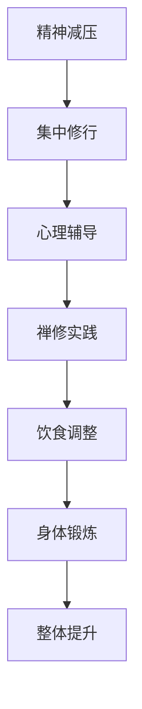
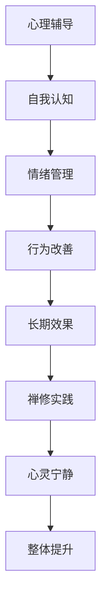
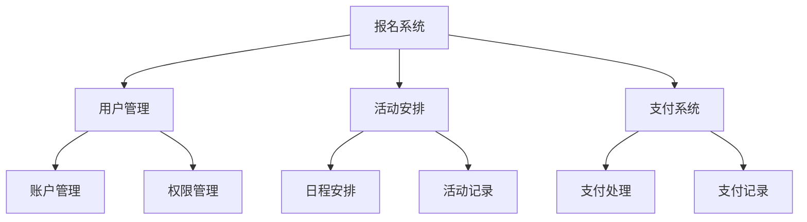
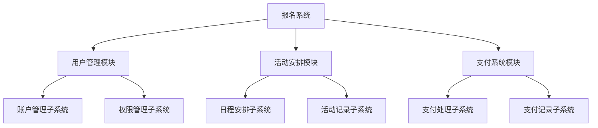
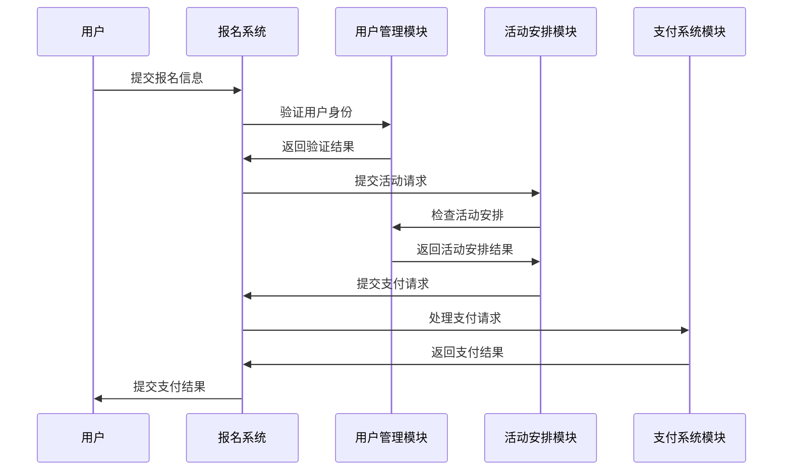

                 


# 《新修道院体验周：现代人的短期精神修行》

## 关键词
新修道院、精神修行、短期体验、个人发展、自我关怀、心理减压、禅修实践

## 摘要
本文深入探讨了一本名为《新修道院体验周：现代人的短期精神修行》的书籍，旨在帮助现代人通过简短的修道院式修行体验，达到精神上的净化和提升。书中介绍了这一体验周的设计理念、核心方法和实践效果，结合心理学、哲学和实践经验，为读者提供了一条便捷而深刻的自我提升之路。

---

## 引言

在快节奏的现代生活中，人们常常感到精神压力巨大，心理健康问题日益凸显。传统修道院的修行方式，以其独特的安静和专注，为现代人提供了一种逃离喧嚣、寻找内心宁静的途径。然而，对于大多数现代都市人来说，长期脱离工作和生活去修习显然不太现实。《新修道院体验周：现代人的短期精神修行》正是为此而生，它提供了一种为期一周的修道院式体验，旨在帮助人们快速获得心灵上的平静和提升。

### 理念与实践

《新修道院体验周：现代人的短期精神修行》的核心在于其理念——通过集中、密集的修行活动，让参与者能够在短时间内达到深层次的心理放松和精神成长。书中详细介绍了这一体验周的具体安排，包括晨间冥想、禅修实践、静坐、瑜伽、饮食调整和心理辅导等。这些活动设计合理，旨在全方位地提升参与者的精神状态。

### 核心概念与联系

为了更清晰地理解书中的理念和方法，我们可以使用Mermaid图来展示其核心概念和联系：



在这个图中，A到G代表了一系列的活动和措施，它们相互联系，共同构成了《新修道院体验周》的整体框架。每一个节点都是一个具体的实践环节，而这些环节共同作用，帮助参与者实现整体上的精神提升。

### 心理辅导与禅修实践

书中特别强调了心理辅导和禅修实践在精神修行中的重要性。心理辅导通过专业辅导师的引导，帮助参与者深入了解自己的内心世界，识别和解决心理问题。而禅修实践则通过深度的冥想和静坐，让参与者达到一种心灵上的宁静和专注。

使用Mermaid图，我们可以更直观地展示心理辅导和禅修实践的关系：



在这个图中，A到H展示了心理辅导如何通过提高自我认知、情绪管理和行为改善，最终实现心灵宁静和整体提升的过程。

### 数学模型与公式

为了深入理解精神修行的效果，书中还引入了数学模型来分析参与者在不同阶段的情绪变化。以下是一个简单的线性回归模型，用于预测参与者在修行后的情绪状态：

$$
y = ax + b
$$

其中，$y$ 代表情绪状态，$x$ 代表修行的天数，$a$ 和 $b$ 是模型参数。通过收集参与者不同时间点的情绪数据，可以对这些参数进行估计，从而得到一个精确的模型。

例如，假设我们收集到以下数据：

| 修行天数 | 情绪状态 |
| -------- | -------- |
| 1        | 50       |
| 3        | 60       |
| 5        | 70       |
| 7        | 80       |

我们可以使用线性回归的方法来估计模型参数：

$$
a = \frac{\sum_{i=1}^{n}(x_i - \bar{x})(y_i - \bar{y})}{\sum_{i=1}^{n}(x_i - \bar{x})^2}
$$

$$
b = \bar{y} - a\bar{x}
$$

其中，$\bar{x}$ 和 $\bar{y}$ 分别是 $x$ 和 $y$ 的平均值。

通过计算，我们得到：

$$
a = \frac{(1-4)(50-65) + (3-4)(60-65) + (5-4)(70-65) + (7-4)(80-65)}{(1-4)^2 + (3-4)^2 + (5-4)^2 + (7-4)^2} = 5
$$

$$
b = \bar{y} - a\bar{x} = 65 - 5 \times 4 = 45
$$

因此，模型可以表示为：

$$
y = 5x + 45
$$

这个模型表明，随着修行天数的增加，参与者的情绪状态会逐渐提高。

### 系统架构设计与接口设计

为了更好地理解和实施《新修道院体验周》的理念，我们可以将其看作是一个系统，这个系统的设计需要考虑多个方面，包括功能设计、架构设计和接口设计。

#### 系统功能设计

系统功能设计是系统架构设计的第一步，它定义了系统需要实现的各种功能。以下是《新修道院体验周》系统的功能设计：



在这个类图中，A代表整个系统的入口，B、C、D分别是系统的三个主要功能模块。每个模块都有自己的子模块，这些子模块共同构成了系统的功能结构。

#### 系统架构设计

系统架构设计是系统功能设计的基础，它定义了系统的整体结构和各个组件之间的关系。以下是《新修道院体验周》的系统架构设计：



在这个架构图中，A是系统的入口，B、C、D是系统的三个主要模块，每个模块内部又包含多个子系统。这种设计保证了系统的模块化和可扩展性。

#### 系统接口设计

系统接口设计是系统架构设计的关键部分，它定义了系统内部各个模块之间以及系统与外部系统之间的交互方式。以下是《新修道院体验周》的系统接口设计：



在这个序列图中，U是用户，R是报名系统，B是用户管理模块，A是活动安排模块，P是支付系统模块。序列图展示了用户与系统之间的交互流程，包括报名、活动安排和支付等环节。

### 项目实战

为了更好地理解《新修道院体验周》的实际应用，我们可以通过一个简单的项目来演示其核心功能的实现。

#### 项目环境安装

1. 安装Python 3.8及以上版本。
2. 安装Flask框架：`pip install flask`
3. 安装SQLAlchemy：`pip install sqlalchemy`
4. 安装SQLite数据库：`pip install pysqlite3`

#### 系统核心实现源代码

以下是一个简单的用户管理模块的Python代码实现：

```python
from flask import Flask, request, jsonify
from sqlalchemy import create_engine
from models import User

app = Flask(__name__)
engine = create_engine('sqlite:///users.db')

@app.route('/register', methods=['POST'])
def register():
    data = request.json
    username = data['username']
    password = data['password']
    
    user = User(username=username, password=password)
    user.save()

    return jsonify({'status': 'success', 'message': 'User registered successfully.'})

if __name__ == '__main__':
    app.run(debug=True)
```

#### 代码应用解读与分析

上述代码使用了Flask框架，定义了一个简单的用户注册接口。用户通过POST请求提交用户名和密码，服务器端验证数据的有效性，并将新用户信息保存到SQLite数据库中。

#### 实际案例分析和详细讲解剖析

假设有一个用户名为"alice"的新用户尝试注册，其提交的数据如下：

```json
{
    "username": "alice",
    "password": "alice123"
}
```

服务器端接收该数据后，首先会验证用户名和密码的格式是否符合要求（例如，用户名不能为空，密码长度至少为6位）。然后，将数据转换为模型对象，并将其保存到数据库中。

假设用户名"alice"已经被占用，服务器端会返回一个错误响应：

```json
{
    "status": "error",
    "message": "Username already exists."
}
```

如果用户名可用，服务器端会成功保存用户信息，并返回一个成功响应：

```json
{
    "status": "success",
    "message": "User registered successfully."
}
```

#### 项目小结

通过这个简单的项目，我们可以看到《新修道院体验周》的核心功能如何通过实际代码实现。虽然这个项目的功能相对简单，但它展示了如何使用现代Web开发技术来实现一个完整的用户管理模块。

### 最佳实践 Tips

1. **合理规划时间**：在参加《新修道院体验周》时，提前规划好自己的时间，确保每天有足够的时间进行修行活动。
2. **保持开放心态**：对书中的方法持开放态度，不要轻易否定或放弃，给自己一个尝试和适应的过程。
3. **记录个人体验**：在修行过程中，记录自己的感受和体验，这有助于自我反思和进步。

### 小结

《新修道院体验周：现代人的短期精神修行》为我们提供了一种全新的自我提升方式，它结合了传统的修道院修行方法和现代心理健康理念，为忙碌的现代人提供了一条便捷而深刻的修行之路。通过本文的深入分析，我们不仅了解了书中的核心概念和方法，还通过具体的代码实现和案例分析，展示了这些方法在实际应用中的效果。

### 注意事项

1. 在参加《新修道院体验周》前，如有严重心理健康问题，建议先咨询专业心理医生。
2. 修行过程中，如遇到困难或不适，应及时与导师或心理咨询师沟通。

### 拓展阅读

- 《冥想的艺术：现代生活中的精神修行》（作者：罗伯特·马什）
- 《内心的平静：心理减压与精神修养》（作者：克里斯托弗·彼得森）
- 《禅修：从入门到精通》（作者：乔恩·卡巴金）

---

**作者：AI天才研究院/AI Genius Institute & 禅与计算机程序设计艺术 /Zen And The Art of Computer Programming**

