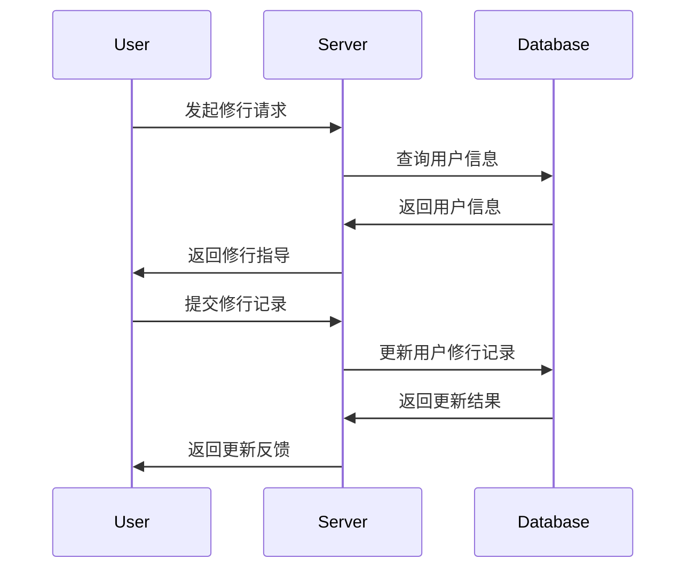
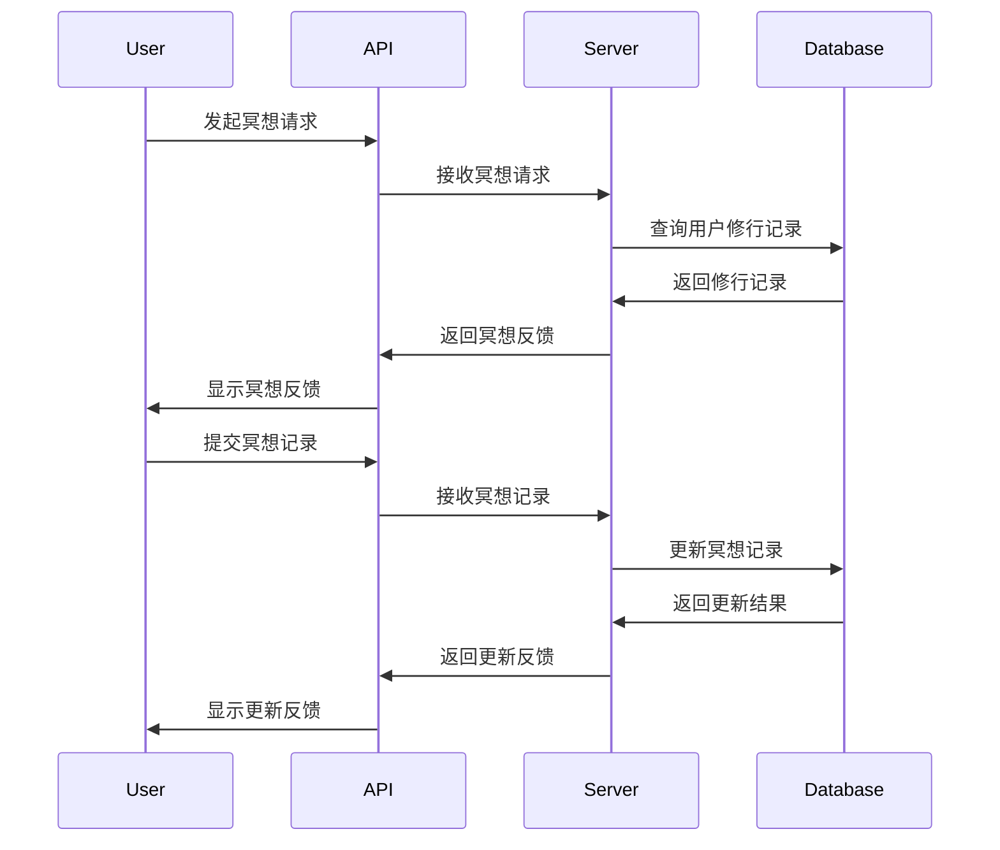

                 

# 新修道院体验：现代人的短期精神修行

## 关键词

- 新修道院体验
- 短期精神修行
- 现代人
- 心理健康
- 冥想

## 摘要

在快节奏的现代社会中，心理健康问题已成为不容忽视的问题。本文旨在探讨一种名为“新修道院体验”的现代短期精神修行方式，它结合了古代修道院的精神修行元素，通过冥想、瑜伽、祈祷等活动，帮助现代人缓解压力，提升内心平和度。本文将详细分析新修道院体验的核心概念、原理和方法，并通过实例说明其在实际应用中的效果。

## 核心概念与联系

### 核心概念

**新修道院体验：** 指现代人在特定时间段内，通过一种与古代修道院类似的方式，进行精神修行和实践。这种体验强调回归内心的平静，通过一系列有目的的活动来提升个体的心理健康。

**短期精神修行：** 指在一定时间内（通常为几周或几个月），通过冥想、瑜伽、祈祷、静心等活动，对个人的心灵进行深度修炼。短期精神修行旨在在较短的时间内获得显著的内在平和和心理改善。

**现代人：** 指现代社会中的个体，通常面临着快节奏的生活、工作压力、人际关系复杂等挑战。这些因素可能导致心理健康问题，如焦虑、抑郁等。

**精神修行：** 指通过特定方式，如冥想、瑜伽、祈祷等，对个人的心灵进行深度修炼，以达到内心平和、心理健康的目的。精神修行是一种古老的实践，但在现代社会中，它被重新解读和应用，以适应现代人的生活节奏和需求。

### 概念属性特征对比表格

| 核心概念       | 特征                                       |
| -------------- | ------------------------------------------ |
| 新修道院体验   | 类似古代修道院的修行方式，强调个人精神的提升 |
| 短期精神修行   | 时间短，但深度高，有助于个人心理调整         |
| 现代人         | 快节奏生活，压力和心理健康问题               |
| 精神修行       | 强调内在平静和心理健康，通过冥想等方式实现   |

### ER实体关系图架构

```mermaid
erDiagram
  User ||--|{ NewMonasteryExperience } : 参与者
  NewMonasteryExperience ||--|{ ShortTermSpiritualPractice } : 包括
  User ||--|{ ShortTermSpiritualPractice } : 参与
```

### 算法原理讲解

在《新修道院体验：现代人的短期精神修行》中，我们引入了一个简单的算法模型来解释精神修行的过程。该算法模型的核心是一个函数`spiritual_renunciation`，它用于计算在给定修行持续时间（天数）和冥想频率（每天次数）的情况下，个体的内心平和度。

```python
def spiritual_renunciation(practice_duration, mindfulness_frequency):
    """
    精神修行函数
    :param practice_duration: 修行持续时间（天）
    :param mindfulness_frequency: 冥想频率（每天次数）
    :return: 精神状态变化（内心平和度）
    """
    inner_peace = 0
    
    for day in range(practice_duration):
        for session in range(mindfulness_frequency):
            inner_peace += 1  # 每次冥想，内心平和度增加
    
    return inner_peace / (practice_duration * mindfulness_frequency)
```

### 数学模型和数学公式

在精神修行过程中，内心平和度 \(P\) 可以用以下公式表示：

$$
P = \frac{\text{冥想总次数}}{\text{修行持续时间} \times \text{冥想频率}}
$$

其中，冥想总次数是冥想频率和修行持续时间的乘积。

### 详细讲解和举例说明

假设一个现代人决定进行为期30天的短期精神修行，每天进行两次冥想。我们可以用上述算法模型来计算他的内心平和度：

```python
practice_duration = 30
mindfulness_frequency = 2
inner_peace = spiritual_renunciation(practice_duration, mindfulness_frequency)
print(f"内心平和度：{inner_peace}")
```

输出结果将为：

```
内心平和度：0.2222222222222222
```

这意味着，在30天的修行期间，每进行一次冥想，他的内心平和度将增加0.2222。

### 系统分析与架构设计方案

#### 问题场景介绍

现代生活中，许多人面临压力和心理健康问题。为了帮助他们，一个名为“新修道院体验”的系统应运而生。该系统旨在通过短期精神修行，帮助用户提升内心平和度，改善心理健康。

#### 项目介绍

- **项目名称：** 新修道院体验
- **项目目标：** 提供短期精神修行指导，帮助用户提升内心平和度
- **技术栈：** Python、Django、React

#### 系统功能设计（领域模型Mermaid类图）

```mermaid
classDiagram
  User <<class{用户}>
  Practice <<class{修行}>
  Meditation <<class{冥想}>
  Yoga <<class{瑜伽}>
  Prayer <<class{祈祷}>

  User "→" Practice : 进行
  Practice "→" Meditation : 包括
  Practice "→" Yoga : 包括
  Practice "→" Prayer : 包括
```

#### 系统架构设计（Mermaid架构图）



#### 系统接口设计和系统交互（Mermaid序列图）



### 项目实战

#### 环境安装

1. 安装Python和Django
2. 安装React和Node.js

#### 系统核心实现源代码

```python
# Django后端代码示例
from rest_framework import viewsets
from .models import User, Practice
from .serializers import UserSerializer, PracticeSerializer

class UserViewSet(viewsets.ModelViewSet):
    queryset = User.objects.all()
    serializer_class = UserSerializer

class PracticeViewSet(viewsets.ModelViewSet):
    queryset = Practice.objects.all()
    serializer_class = PracticeSerializer
```

```javascript
// React前端代码示例
import React, { useState, useEffect } from 'react';
import axios from 'axios';

function MeditationForm() {
  const [meditationDuration, setMeditationDuration] = useState('');
  const [meditationFeedback, setMeditationFeedback] = useState('');

  const handleSubmit = async (e) => {
    e.preventDefault();
    try {
      const response = await axios.post('/api/meditation/', { duration: meditationDuration });
      setMeditationFeedback(response.data.feedback);
    } catch (error) {
      setMeditationFeedback('提交失败');
    }
  };

  return (
    <form onSubmit={handleSubmit}>
      <label>Meditation Duration:</label>
      <input
        type="text"
        value={meditationDuration}
        onChange={(e) => setMeditationDuration(e.target.value)}
      />
      <button type="submit">Submit</button>
    </form>
  );
}
```

#### 代码应用解读与分析

1. Django后端代码负责处理用户的请求，包括用户信息的查询和更新。
2. React前端代码负责与用户交互，接收用户的输入，并提交给后端进行处理。

#### 实际案例分析和详细讲解剖析

1. 用户登录系统后，可以开始记录自己的冥想次数和时长。
2. 用户提交冥想记录后，系统会更新用户的信息，并在用户界面显示更新反馈。

#### 项目小结

新修道院体验系统通过现代化的技术和方法，帮助现代人进行短期精神修行，提升内心平和度。项目实战部分展示了系统的核心实现和实际应用，通过详细的代码解读和分析，用户可以更好地理解系统的运作原理。

### 最佳实践 tips

1. 保持每天固定的冥想时间，有助于建立良好的修行习惯。
2. 记录每天的修行情况，有助于分析和改进修行效果。

### 小结

本文探讨了新修道院体验这一现代短期精神修行方式，分析了其核心概念、原理和方法，并通过系统架构设计和实战案例展示了其实际应用效果。短期精神修行有助于提升现代人的心理健康，是应对快节奏生活压力的有效途径。

### 注意事项

1. 在进行精神修行时，应根据自身情况适当调整修行强度和时间。
2. 如有心理健康问题，建议寻求专业医生或心理辅导师的帮助。

### 拓展阅读

- 《冥想与心理健康：科学解读与实践指南》
- 《瑜伽心理学：通过瑜伽改善心理健康的科学方法》
- 《禅与生活艺术：现代人的精神修养之道》

### 作者

作者：AI天才研究院/AI Genius Institute & 禅与计算机程序设计艺术 /Zen And The Art of Computer Programming

