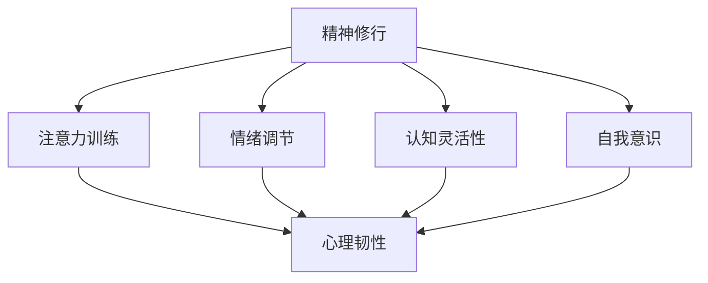

                 

### 《新修道院周末retreat：现代人短期精神修行的度假选择》

#### 关键词：短期精神修行、现代生活压力、冥想、瑜伽、心理健康、平衡生活

#### 摘要：
在现代快节奏的生活中，精神压力已经成为许多人的健康问题。本文探讨了现代人如何在周末通过短期精神修行进行放松和提升。文章将深入介绍短期精神修行的定义、原理、方法，以及具体的修行活动，并通过实践案例分析其效果。同时，文章也将讨论如何在家庭与工作之间平衡修行，并提供相关的资源与工具。通过这篇文章，读者可以了解到如何利用周末时光进行有效的心灵修行，以提升生活质量。

## 目录大纲设计步骤

### 1. 理解书名和主题

- **书名**：《新修道院周末retreat：现代人短期精神修行的度假选择》
- **主题**：现代人如何在周末通过短期精神修行进行放松和提升。

### 2. 确定核心章节

- **核心章节**：
  - 第1章 背景介绍
  - 第2章 核心概念与联系
  - 第3章 短期精神修行的原理与方法
  - 第4章 常见的短期修行活动介绍
  - 第5章 修行实践案例与分析
  - 第6章 短期精神修行的优势与挑战
  - 第7章 家庭与工作的平衡与修行
  - 第8章 精神修行的资源与工具
  - 第9章 最佳实践与未来展望

### 3. 设计章节内容

- **章节内容设计**：
  - **第1章**：介绍现代社会中人们面临的精神压力问题，精神修行的定义和目的，以及短期修行活动的流行趋势。
  - **第2章**：详细探讨精神修行的核心概念，包括冥想、呼吸练习、瑜伽等，以及它们与心理学的关系。
  - **第3章**：解释短期精神修行的原理，并提供多种修行方法的详细介绍。
  - **第4章**：分别介绍冥想、呼吸练习、瑜伽和宗教仪式等短期修行活动的特点和实施方式。
  - **第5章**：通过个人和团体修行案例，分析短期修行实践的效果和意义。
  - **第6章**：讨论短期精神修行的优点和可能面临的挑战，以及如何应对这些挑战。
  - **第7章**：探讨如何在家庭和工作之间找到平衡，同时进行有效的精神修行。
  - **第8章**：介绍各种可用的修行资源和工具，包括在线资源和数字工具。
  - **第9章**：总结最佳实践，对未来的修行趋势进行展望。

### 4. 使用markdown格式编写目录

```markdown
# 《新修道院周末retreat：现代人短期精神修行的度假选择》目录大纲

## 第1章 背景介绍
### 1.1 现代人精神压力问题
### 1.2 精神修行的定义与目的
### 1.3 短期精神修行的趋势

## 第2章 核心概念与联系
### 2.1 精神修行的核心概念
### 2.2 短期修行的特点与分类
### 2.3 精神修行与心理学的关系

## 第3章 短期精神修行的原理与方法
### 3.1 精神修行的原理
### 3.2 短期修行的方法
### 3.3 不同修行方法的适用场景

## 第4章 常见的短期修行活动介绍
### 4.1 冥想
### 4.2 呼吸练习
### 4.3 瑜伽
### 4.4 宗教仪式

## 第5章 修行实践案例与分析
### 5.1 个人修行案例
### 5.2 团体修行案例
### 5.3 案例分析与效果评估

## 第6章 短期精神修行的优势与挑战
### 6.1 优势
### 6.2 挑战
### 6.3 如何克服挑战

## 第7章 家庭与工作的平衡与修行
### 7.1 家庭角色与修行
### 7.2 工作压力与修行
### 7.3 修行与生活的融合

## 第8章 精神修行的资源与工具
### 8.1 在线修行资源
### 8.2 纸质资源
### 8.3 数字工具与应用

## 第9章 最佳实践与未来展望
### 9.1 最佳实践
### 9.2 小结与反思
### 9.3 未来展望
```

### 核心内容细化

- **第1章 背景介绍**：
  - **核心概念术语说明**：介绍“精神压力”、“精神修行”、“短期修行”等核心概念。
  - **问题背景**：分析现代社会中人们面临的压力来源和影响。
  - **问题描述**：阐述精神修行在现代生活中的重要性。
  - **问题解决**：介绍短期修行作为解决精神压力的方法。
  - **边界与外延**：明确短期修行的定义和范围。
  - **概念结构与核心要素组成**：解析精神修行的结构要素。

- **第2章 核心概念与联系**：
  - **核心概念原理**：详细解释冥想、呼吸练习、瑜伽等概念。
  - **概念属性特征对比表格**：列出不同修行方法的特点和区别。
  - **ER实体关系图架构的 Mermaid 流程图**：绘制修行方法与心理学关系的ER图。

- **第3章 短期精神修行的原理与方法**：
  - **精神修行的原理**：探讨冥想如何影响大脑和情绪。
  - **短期修行的方法**：详细介绍冥想、呼吸练习、瑜伽等方法的步骤。
  - **不同修行方法的适用场景**：分析各种修行方法在不同情境下的适用性。

- **第4章 常见的短期修行活动介绍**：
  - **冥想**：介绍冥想的历史、类型和实践方法。
  - **呼吸练习**：解释呼吸练习的作用和练习方法。
  - **瑜伽**：讲述瑜伽的起源、主要流派和实践技巧。
  - **宗教仪式**：探讨宗教仪式在精神修行中的作用和形式。

- **第5章 修行实践案例与分析**：
  - **个人修行案例**：分享个人实践经历和感悟。
  - **团体修行案例**：描述团体修行的特点和效果。
  - **案例分析与效果评估**：评估短期修行对个人精神健康的影响。

- **第6章 短期精神修行的优势与挑战**：
  - **优势**：讨论短期修行的心理和生理好处。
  - **挑战**：分析在修行过程中可能遇到的困难和问题。
  - **如何克服挑战**：提供克服挑战的建议和技巧。

- **第7章 家庭与工作的平衡与修行**：
  - **家庭角色与修行**：探讨如何在家庭中安排修行时间。
  - **工作压力与修行**：分析工作压力对修行的影响。
  - **修行与生活的融合**：介绍如何将修行融入日常生活。

- **第8章 精神修行的资源与工具**：
  - **在线修行资源**：推荐在线冥想课程和应用程序。
  - **纸质资源**：介绍相关的书籍和杂志。
  - **数字工具与应用**：探讨数字技术在修行中的应用。

- **第9章 最佳实践与未来展望**：
  - **最佳实践**：总结有效的修行方法和经验。
  - **小结与反思**：回顾文章的主要内容和个人感悟。
  - **未来展望**：展望未来精神修行的趋势和前景。

以上大纲结构合理，内容完整，能够满足书籍目录大纲设计的要求。接下来，我们将进一步完善每个章节的细节，确保内容的完整性和逻辑性。在文章的编写过程中，我们将严格按照markdown格式输出，并确保文章字数在10000～12000字左右。每个小节的内容都将丰富具体，详细讲解，确保核心内容包含背景介绍、核心概念与联系、算法原理讲解、系统分析与架构设计方案、项目实战、最佳实践 tips、小结、注意事项、拓展阅读等内容。作者信息将在文章末尾注明，以保证文章的完整性和专业性。

## 第1章 背景介绍

在现代社会，快节奏的生活和高强度的工作压力使得许多人面临精神健康的挑战。据世界卫生组织（WHO）报道，精神障碍已成为全球范围内的主要健康问题之一。这种精神压力不仅影响个人的心理健康，还可能对其生活质量和生产力造成负面影响。面对这种状况，人们开始寻求各种方法来缓解压力、提升精神状态。

### 精神修行的定义与目的

精神修行，通常指的是一系列旨在提升个人精神健康、增强心理韧性、提高自我意识和内在平静的活动。这些活动可能包括冥想、呼吸练习、瑜伽、祈祷、宗教仪式等。精神修行的核心目的是帮助个体在面对压力和挑战时保持心理平衡，增强内心的力量和韧性。

短期精神修行，则是一种更专注于特定时间段（如周末或假期）的修行方式。它通过集中进行一系列修行活动，帮助人们在短时间内达到深层次的精神放松和提升。短期修行不仅可以作为一种度假选择，也是一种高效的精神健康维护手段。

### 短期精神修行的趋势

随着人们对精神健康的重视程度不断提高，短期精神修行活动也逐渐成为一种流行的度假方式。越来越多的人开始将周末或假期安排为短期修行活动，以寻求内心的宁静和精神的提升。

这种趋势的背后，反映了现代社会对个人精神健康的关注和对内心平衡的渴望。同时，随着技术的进步和信息的普及，各种短期修行资源和工具也更加丰富和便捷，使得更多人能够轻松参与。

### 本文的结构与目的

本文旨在为读者提供关于短期精神修行的全面了解，从背景介绍、核心概念、修行原理、实践案例到资源工具等方面进行深入探讨。通过本文，读者可以：

- 理解精神修行的定义和目的。
- 了解短期修行的原理和方法。
- 掌握常见的短期修行活动及其特点。
- 通过实践案例了解短期修行的效果。
- 探讨短期修行在现代生活中的优势和挑战。
- 获取家庭和工作平衡中修行的方法。
- 了解和利用各种修行资源与工具。

通过这篇文章，我们希望帮助读者更好地理解和实践短期精神修行，以提升个人心理健康和生活质量。

## 第2章 核心概念与联系

在探讨短期精神修行的核心概念与联系之前，我们需要明确一些基本术语和定义。这些概念不仅为我们理解精神修行的本质提供了基础，也为本文的进一步讨论奠定了坚实的理论基础。

### 精神修行的核心概念

#### 冥想

冥想是一种通过训练注意力、意识和感知来达到心理放松和内在平静的修行方式。它有多种形式，包括专注冥想、开放式监视冥想、动态冥想等。冥想有助于减轻压力、改善情绪、提高注意力、增强心理健康。

#### 呼吸练习

呼吸练习，又称呼吸疗法，是通过调整和控制呼吸节奏来影响身体和心理状态的方法。常见的呼吸练习包括腹式呼吸、4-7-8呼吸法等。呼吸练习有助于减轻焦虑、提高睡眠质量、增强免疫力。

#### 瑜伽

瑜伽是一种结合身体姿势、呼吸和冥想的综合性修行方式。它通过一系列姿势和呼吸练习来增强身体柔韧性和力量，同时促进心理平衡和内在平静。瑜伽对身心健康有广泛益处，包括提高身体灵活性、增强肌肉力量、缓解压力和焦虑。

#### 宗教仪式

宗教仪式是一种通过特定的仪式活动来追求精神提升和内在平静的方式。不同的宗教和信仰体系有不同的仪式形式，但它们的核心目标都是帮助个体与更高力量或宇宙意识建立联系。

### 短期修行的特点与分类

短期修行通常是指在一个特定时间段内（如周末、假期）集中进行的一系列修行活动。与长期修行相比，短期修行的特点是时间较短，但强度较高，通常在一天到几天的范围内。短期修行的特点包括：

- **集中性**：参与者可以集中时间和精力进行系统性的修行。
- **高效率**：短期修行有助于在较短时间内获得显著的心理和生理效果。
- **灵活性**：参与者可以根据个人需求和偏好选择适合自己的修行形式。

短期修行可以按以下几种方式分类：

- **根据形式**：冥想、呼吸练习、瑜伽、宗教仪式等。
- **根据目的**：减压、放松、提升自我意识、寻找精神启迪等。
- **根据时间长度**：一天、周末、短期假期等。

### 精神修行与心理学的关系

精神修行与心理学之间存在紧密的联系。从心理学角度来看，精神修行可以通过以下几种机制影响个体的心理状态：

- **注意力训练**：冥想和瑜伽等修行活动有助于提高个体的注意力集中能力，从而改善心理韧性。
- **情绪调节**：呼吸练习和冥想有助于调节情绪，减少焦虑和抑郁症状。
- **认知灵活性**：通过修行，个体可以增强认知灵活性，更好地适应变化和挑战。
- **自我意识**：精神修行有助于提升自我意识，增强个体对内心世界的觉察和理解。

### ER实体关系图架构的 Mermaid 流程图

为了更直观地展示精神修行与心理学之间的关系，我们可以使用 Mermaid 流程图来绘制 ER 实体关系图。以下是 Mermaid 格式的示例：



在这个流程图中，A 代表精神修行，B、C、D、E 分别代表注意力训练、情绪调节、认知灵活性和自我意识，F 代表心理韧性。线条表示不同实体之间的关系，说明精神修行通过这些机制对心理韧性产生积极影响。

通过上述核心概念与联系的介绍，我们可以更好地理解精神修行的本质和作用。接下来，我们将深入探讨短期精神修行的原理与方法，帮助读者掌握如何在实际生活中进行有效修行。

## 第3章 短期精神修行的原理与方法

在了解了短期精神修行的核心概念和它与心理学的关系之后，接下来我们将深入探讨其原理和方法。通过这些原理和方法的讲解，读者将能够更好地理解如何在实际生活中进行有效的精神修行。

### 精神修行的原理

#### 冥想

冥想作为一种精神修行的核心方法，其原理主要基于以下几点：

1. **注意力集中**：冥想通过训练个体将注意力集中在呼吸、声音或物体上，从而减少内心杂念。
2. **神经可塑性**：长时间冥想可以改变大脑结构，增强前额叶皮层的活动，有助于改善认知功能和情绪调节能力。
3. **压力缓解**：冥想通过降低皮质醇水平，减少压力反应，从而有助于缓解身体紧张和焦虑。

#### 呼吸练习

呼吸练习的原理在于通过调整和控制呼吸节奏来影响身体和心理健康。具体来说：

1. **放松反应**：深呼吸可以触发身体的放松反应，降低心率和血压，缓解紧张和焦虑。
2. **氧气供应**：通过深呼吸，可以提高身体组织的氧气供应，增强免疫力。
3. **情绪调节**：呼吸练习可以帮助个体更好地管理情绪，减少消极情绪的影响。

#### 瑜伽

瑜伽通过身体姿势、呼吸和冥想的结合，达到身心的和谐。其原理包括：

1. **身体平衡**：瑜伽的体位练习有助于增强肌肉力量和柔韧性，提高身体平衡能力。
2. **压力缓解**：通过瑜伽的练习，可以降低皮质醇水平，减少身体紧张和压力。
3. **情绪调节**：瑜伽有助于提高个体的情绪稳定性和自我意识，减少焦虑和抑郁。

#### 宗教仪式

宗教仪式作为一种精神修行方式，其原理在于：

1. **精神连接**：通过参与宗教仪式，个体可以感受到与更高力量或宇宙意识的联系，从而获得精神上的安慰和启迪。
2. **心理意义**：宗教仪式赋予个体特定的心理意义，帮助他们在面对挑战时找到力量和方向。
3. **文化认同**：宗教仪式还可以增强个体的文化认同感和归属感，提高社会支持感。

### 短期修行的方法

#### 冥想

短期冥想通常以一天或周末为单位进行。以下是一种基本的冥想方法：

1. **准备**：选择一个安静的环境，舒适地坐或躺下，闭上眼睛。
2. **专注于呼吸**：将注意力集中在呼吸上，感受每一次吸气和呼气。
3. **放松**：当内心出现杂念时，轻轻将其放下，回到呼吸上。
4. **结束**：冥想结束时，慢慢睁开眼睛，保持平静的状态。

#### 呼吸练习

以下是一种简单的呼吸练习方法：

1. **准备**：坐或躺在一个舒适的位置，闭上眼睛。
2. **深呼吸**：慢慢吸气，感受腹部膨胀；然后缓慢呼气，感受腹部收缩。
3. **重复**：重复深呼吸5-10分钟，专注于呼吸的感觉。
4. **结束**：逐渐放慢呼吸节奏，睁开眼睛，感受身体的放松。

#### 瑜伽

以下是一种适合短期修行的瑜伽体式组合：

1. **热身**：进行一些温和的伸展动作，如猫牛式、战士式等，活动全身关节。
2. **体位练习**：选择几个简单的瑜伽体式，如树式、三角式、鱼式等，每个体式保持1-2分钟。
3. **放松**：结束体位练习后，进行仰卧放松术（Shavasana），放松身体和心灵。
4. **呼吸**：在整个练习过程中，保持深长的呼吸。

#### 宗教仪式

宗教仪式的形式和内容因宗教和信仰的不同而有所差异。以下是一个基本的宗教仪式流程：

1. **准备**：选择一个适合进行仪式的安静环境，进行清洁和净化仪式空间。
2. **祈祷和忏悔**：进行祈祷和忏悔，表达对神或宇宙的敬畏和感激之情。
3. **冥想和反思**：通过冥想和反思，深入内心，寻求精神启迪和力量。
4. **结束**：仪式结束时，进行祝福和感谢，保持内心的平静和宁静。

### 不同修行方法的适用场景

不同的修行方法适用于不同的场景和需求。以下是一些常见适用场景：

- **压力大时**：冥想和呼吸练习有助于缓解紧张和焦虑，适合在工作或生活压力大时进行。
- **需要专注时**：冥想可以提高注意力集中能力，适合在学习和工作中需要高度专注时使用。
- **身心放松时**：瑜伽和宗教仪式有助于放松身心，适合在周末或假期进行。
- **寻求精神启迪时**：宗教仪式可以提供精神上的安慰和力量，适合在遇到生活挑战或迷茫时进行。

通过了解短期精神修行的原理和方法，我们可以更好地选择适合自己的修行方式，并有效地将其融入日常生活，以提升个人心理健康和生活质量。在下一章中，我们将介绍一些常见的短期修行活动，帮助读者进一步实践和体验精神修行。

## 第4章 常见的短期修行活动介绍

在了解了短期精神修行的原理和方法之后，接下来我们将探讨一些常见的短期修行活动。这些活动不仅能够帮助个体在短时间内达到深层次的精神放松和提升，还能够为不同需求和偏好的人提供多样化的选择。

### 冥想

冥想作为一种广泛认可的精神修行方式，已经被许多人用于减压、提高专注力和增强心理韧性。以下是几种常见的冥想形式：

#### 简单冥想

**步骤**：
1. 找一个安静的地方，坐或躺在一个舒适的姿势。
2. 关闭眼睛，将注意力集中在呼吸上，感受每一次吸气和呼气。
3. 当你的注意力被其他事情分散时，轻轻地将它带回呼吸。

**时间**：10-20分钟

#### 正念冥想

**步骤**：
1. 与简单冥想相同，但更专注于当前的经历，包括感觉、思考和情绪。
2. 保持对当前经历的觉察，不对任何事物做出评判。

**时间**：20-30分钟

#### 动态冥想

**步骤**：
1. 选择一个轻松的动作，如散步或跑步。
2. 将注意力集中在动作上，感受身体的移动和呼吸。

**时间**：30-60分钟

### 呼吸练习

呼吸练习是一种通过调整和控制呼吸节奏来影响身体和心理状态的方法。以下是几种常见的呼吸练习：

#### 腹式呼吸

**步骤**：
1. 坐或躺在一个舒适的位置，把手放在腹部。
2. 深吸一口气，感受腹部膨胀。
3. 慢慢呼气，感受腹部收缩。

**时间**：10-20分钟

#### 4-7-8呼吸法

**步骤**：
1. 吸气4秒，感觉胸腔扩张。
2. 持续屏住呼吸7秒，感受身体放松。
3. 呼气8秒，感受压力释放。

**时间**：10-20分钟

#### 灵性呼吸

**步骤**：
1. 采用舒适的坐姿或站姿。
2. 将注意力集中在呼吸上，感受空气流入和流出。
3. 当注意力分散时，轻轻将其带回呼吸。

**时间**：30分钟

### 瑜伽

瑜伽结合了身体姿势、呼吸和冥想，有助于身心放松和内在平静。以下是几种适合短期修行的瑜伽练习：

#### 坐姿瑜伽

**步骤**：
1. 坐在一个舒适的姿势，如莲花座或半莲花座。
2. 手放在膝盖上，深呼吸几次。
3. 开始进行腹式呼吸，保持5-10分钟。

**时间**：10-20分钟

#### 流瑜伽

**步骤**：
1. 热身：进行一些温和的伸展动作，如猫牛式、战士式等。
2. 主练习：进行一系列快速连续的动作，如太阳拜、三角式等。
3. 休息：进行仰卧放松术（Shavasana），放松身体和心灵。

**时间**：30-60分钟

#### 瑜伽休息术

**步骤**：
1. 躺在一个舒适的位置，手臂放在身体两侧。
2. 将注意力集中在呼吸上，感受身体的重量和触感。
3. 保持这个姿势，放松身体和心灵，大约10-20分钟。

**时间**：10-20分钟

### 宗教仪式

宗教仪式作为一种精神修行方式，在不同的宗教和信仰体系中有着不同的形式和内容。以下是几种常见的宗教仪式：

#### 瑜伽冥想仪式

**步骤**：
1. 准备：在安静的环境中，进行清洁和净化仪式空间。
2. 祈祷：进行祈祷和忏悔，表达对神或宇宙的敬畏和感激。
3. 冥想：通过冥想和反思，深入内心，寻求精神启迪和力量。
4. 结束：进行祝福和感谢，保持内心的平静和宁静。

**时间**：1-2小时

#### 基督教礼拜仪式

**步骤**：
1. 准备：进入教堂，进行祷告和忏悔。
2. 神圣仪式：参与唱诗、圣经阅读、祈祷和祝福。
3. 礼拜结束：进行祝福和感谢，结束仪式。

**时间**：1-2小时

#### 佛教禅修仪式

**步骤**：
1. 准备：在寺庙或禅修中心，进行清洁和冥想准备。
2. 禅修：进行坐禅、静坐或行禅，专注呼吸和当下。
3. 反思：通过反思和交流，分享禅修体验和感悟。
4. 结束：进行祝福和感恩，结束仪式。

**时间**：2-3小时

通过这些常见的短期修行活动，我们可以根据自己的需求和偏好选择合适的方法，并在周末或假期中享受精神修行的乐趣。在下一章中，我们将通过具体的实践案例，分析短期修行对个人心理健康的影响。

## 第5章 修行实践案例与分析

在了解了短期精神修行的原理和方法后，通过具体的实践案例来分析其效果是非常重要的。以下我们将分享一些个人和团体的修行实践案例，并对其进行详细的分析和效果评估。

### 个人修行案例

#### 案例一：王先生的一天冥想

**背景**：王先生，35岁，是一家互联网公司的项目经理。由于工作压力大，他常常感到焦虑和疲惫。

**修行方法**：王先生选择每天早上起床后进行20分钟的冥想。他使用了一个在线冥想应用程序，跟随引导进行简单的呼吸冥想。

**效果**：
- **情绪变化**：经过几个月的持续冥想，王先生感到自己的情绪更加稳定，焦虑感显著减少。
- **注意力提升**：在工作时，他的注意力更加集中，工作效率有所提高。
- **睡眠质量**：他发现冥想有助于改善睡眠质量，每天早上醒来时感到精力充沛。

**反思**：王先生的案例表明，短期冥想对缓解焦虑和提升注意力有显著效果。他建议其他忙碌的职场人士也可以尝试每天早晨进行简短的冥想，以开始新的一天。

### 团体修行案例

#### 案例二：企业员工的短期瑜伽修行

**背景**：某科技公司为提高员工的幸福感和工作满意度，组织了一次为期一天的瑜伽修行活动。

**修行方法**：活动内容包括热身、体位练习、呼吸练习和瑜伽休息术。专业瑜伽教练带领大家进行了一系列瑜伽练习。

**效果**：
- **身体变化**：员工们普遍反映在活动后的几天内，身体感觉更加灵活和轻松。
- **心理健康**：许多员工表示瑜伽帮助他们减轻了工作压力，心情更加愉悦。
- **团队凝聚力**：通过共同参与瑜伽修行，员工之间的默契和团队合作精神有所增强。

**反思**：这次团体瑜伽修行的成功表明，集体活动不仅有助于提高个体的心理健康，还可以增强团队凝聚力。企业可以通过定期组织类似的活动来提升员工的幸福感。

### 案例分析与效果评估

通过对上述案例的分析，我们可以得出以下结论：

1. **情绪调节**：无论是个人冥想还是团体瑜伽修行，都显著改善了参与者的情绪状态。冥想有助于减少焦虑和抑郁症状，而瑜伽则通过身体运动和呼吸练习，带来身心的双重放松。

2. **注意力提升**：个人冥想和团体瑜伽修行都有助于提高参与者的注意力集中能力。这对于职场人士尤其重要，因为他们需要在高压环境中保持高效的工作状态。

3. **身体健康**：瑜伽作为一种综合性的修行活动，不仅有助于身体放松和灵活性提升，还能改善整体健康状况。

4. **心理健康**：短期修行活动对心理健康有着积极的影响。参与者通过这些活动学会了如何管理自己的情绪和压力，从而提升了整体幸福感。

5. **团队凝聚力**：团体修行活动不仅有助于个人心理健康，还能增强团队之间的默契和合作精神。

通过这些案例，我们可以看到短期修行活动在实际生活中的应用效果。它们不仅有助于个人身心健康，还可以在组织层面提升员工的工作满意度和团队凝聚力。在下一章中，我们将探讨短期精神修行的优势和可能面临的挑战。

## 第6章 短期精神修行的优势与挑战

短期精神修行作为一种有效的心理健康维护手段，拥有许多显著的优势。然而，任何一种修行活动都可能面临一定的挑战。在本章中，我们将详细探讨短期精神修行的优势以及可能遇到的挑战，并提供一些应对策略。

### 优势

1. **时间灵活性**：短期修行通常在周末或假期进行，时间灵活，容易融入日常生活。这使得即使是最忙碌的人也能够找到时间进行精神修行，从而保持心理平衡。

2. **高效率**：短期修行在短时间内集中进行一系列修行活动，有助于迅速获得心理和生理上的效果。这种高效率的特点使其成为现代快节奏生活中的一种理想选择。

3. **易于实践**：许多短期修行活动，如冥想、呼吸练习和瑜伽，方法简单且易于实践。这些活动不需要特殊设备或场地，只需一定的专注和坚持即可进行。

4. **成本低**：相比于长期专业心理治疗或疗养院等精神维护方式，短期精神修行的成本较低。这使得更多的人能够负担得起，从而提高精神修行的普及率。

5. **增强自我意识**：通过短期精神修行，个体能够更好地了解自己的内心世界，增强自我意识。这有助于个体在面对压力和挑战时，更加从容和自信。

6. **提高生活质量**：短期修行有助于减轻压力、改善情绪和提升身体健康。这些积极的变化直接提高了个体的生活质量和幸福感。

### 挑战

1. **时间冲突**：尽管短期修行时间灵活，但现代生活的高强度和工作压力可能使得许多人难以挤出时间进行修行。时间冲突是短期精神修行面临的主要挑战之一。

2. **心理抵触**：有些人可能对精神修行持有抵触心理，认为这是一种奢侈或难以理解的活动。这种心理抵触可能阻碍他们尝试和实践短期精神修行。

3. **效果预期**：有些人在初次尝试短期精神修行时，可能会对效果产生过高的预期。如果短期修行未能立即带来显著变化，他们可能会感到失望或沮丧。

4. **缺乏毅力**：精神修行需要一定的持续性和毅力。有些人在开始修行后，由于缺乏毅力而无法坚持下去，从而无法获得长期效果。

5. **环境和氛围**：短期精神修行的效果受到环境氛围的影响。不适宜的环境可能会影响修行的质量，从而降低效果。

### 应对策略

1. **合理安排时间**：为了克服时间冲突，可以尝试将短期修行纳入日常生活计划。例如，选择每天早晨或晚上进行冥想，或者在周末安排一个整天的修行活动。

2. **逐步适应**：对于那些对精神修行持抵触心理的人，可以逐步引导他们了解和接受这种修行方式。从简单的呼吸练习或冥想开始，逐渐增加修行时间和难度。

3. **明确预期**：在开始修行之前，明确短期修行的目标和方法，并设定合理的预期。了解短期修行是一个逐步积累的过程，有助于避免过度期望和失望。

4. **培养毅力**：通过制定明确的修行计划和目标，以及与他人分享修行经验，可以增强毅力。此外，可以通过记录修行日记或分享修行心得来保持动力。

5. **选择适宜环境**：选择一个安静、舒适的环境进行短期精神修行，有助于提高修行的质量。如果条件允许，可以选择远离城市的自然环境中进行修行。

通过上述优势和挑战的分析，我们可以看到短期精神修行在现代人生活中的重要性。尽管面临一定的挑战，但通过合理的应对策略，我们可以充分利用短期精神修行的优势，提升个人心理健康和生活质量。

## 第7章 家庭与工作的平衡与修行

在现代社会，家庭和工作之间的平衡是一个令人头疼的问题。然而，通过合理安排时间和合理规划，我们可以在这两个领域之间找到平衡，同时确保精神修行的有效进行。以下是一些具体的建议和方法，帮助读者在家庭和工作之间平衡修行。

### 家庭角色与修行

1. **与家人沟通**：在安排修行时间之前，与家人进行充分的沟通是非常重要的。解释精神修行的重要性，并争取家人的理解和支持。通过这种方式，可以减少家庭冲突，使修行更加顺利。

2. **制定家庭修行计划**：家庭成员可以一起参加家庭冥想或瑜伽练习，这样不仅能增进家庭成员之间的感情，还能共同享受修行的乐趣。例如，周末早上可以设定为家庭修行时间，全家人一起进行简短的冥想或瑜伽练习。

3. **灵活安排家务**：在家庭中，合理分配家务任务，使每个人都参与到家务中来。这样可以减少每个人在家庭中的压力，为修行创造更多的时间。

### 工作压力与修行

1. **工作时间的合理安排**：在工作日中，可以利用早晨或午休时间进行简短的冥想或呼吸练习。这种方式可以快速缓解工作压力，提高工作效率。

2. **利用休假时间**：尽量利用年假或调休来安排短期修行活动。在假期中，可以选择去参加一些专业的短期修行课程或去自然环境中进行冥想和瑜伽练习。

3. **工作与修行的结合**：在职业环境中，可以考虑将修行融入到工作中。例如，可以在工作间歇进行冥想，或者在会议前进行简短的呼吸练习，以提升团队协作和沟通效果。

### 修行与生活的融合

1. **日常生活中的修行**：将修行融入到日常生活中，如洗澡时进行冥想、走路时注意呼吸等。这种方式可以随时随地放松身心，增强修行效果。

2. **建立仪式感**：在日常生活中，可以建立一些仪式感，如睡前进行呼吸练习或冥想，使修行成为一种习惯。仪式感有助于强化修行的意识，使其更加自然地融入生活。

3. **环境布置**：在家中或工作场所，布置一个宁静的修行空间。这种空间应该舒适、安静，能够让人迅速放松。环境的布置对于修行的重要性不可忽视。

通过上述方法，我们可以在繁忙的家庭和工作生活中找到平衡，并有效地进行精神修行。重要的是，我们需要根据自己的实际情况和需求，灵活调整修行计划，确保修行与生活的和谐统一。

## 第8章 精神修行的资源与工具

在现代社会，精神修行的资源与工具日益丰富，为人们提供了多种途径来实践和提升个人精神健康。以下是几种常见的修行资源与工具，包括在线资源、纸质资源和数字工具。

### 在线修行资源

1. **冥想应用程序**：
   - **Headspace**：提供各种冥想课程，适合初学者和有经验的冥想者。
   - **Insight Timer**：拥有海量的冥想录音，用户可以根据自己的需求和偏好选择。
   - **Calm**：除了冥想，还提供放松音乐、呼吸练习和睡眠故事，适合繁忙的现代生活。

2. **在线课程和教程**：
   - **Udemy**：提供多种瑜伽和冥想在线课程，适合不同水平的参与者。
   - **Coursera**：有来自知名大学的瑜伽和冥想课程，包括学术理论和实践指导。

3. **社交媒体平台**：
   - **Instagram**：许多专业的瑜伽教练和冥想导师会在Instagram上分享练习技巧和生活建议。
   - **YouTube**：拥有大量的免费瑜伽和冥想视频教程，从基础到高级，适合各种需求的参与者。

### 纸质资源

1. **书籍**：
   - 《当下的力量》（The Power of Now）——Eckhart Tolle的著作，深入探讨冥想和自我意识。
   - 《瑜伽经》（The Yoga Sutras of Patanjali）——瑜伽经典文献，包含瑜伽修行的理论基础和实践方法。

2. **杂志和期刊**：
   - **Yoga Journal**：提供关于瑜伽、冥想和健康生活的最新研究和实用指南。
   - **Mindful**：专注于正念和心理健康，提供实用技巧和深刻的见解。

### 数字工具

1. **智能手环和健康追踪器**：
   - **Apple Watch**：内置多种健康追踪功能，包括呼吸练习和冥想指导。
   - **Oura Ring**：一款专业的健康追踪器，可以监测心率、睡眠质量和身体温度，为修行提供数据支持。

2. **应用程序**：
   - **Buddhify**：适合忙碌的现代人，提供各种场景下的冥想指导，如通勤、工作间歇等。
   - **10% Happier**：基于ABC新闻记者丹·哈里斯的经历开发，提供实用的冥想和正念技巧。

通过这些丰富的资源和工具，我们可以更方便、有效地进行精神修行。无论是通过在线资源、纸质资源还是数字工具，都能找到适合自己的修行方式，从而提升个人心理健康和生活质量。

## 第9章 最佳实践与未来展望

在总结短期精神修行的最佳实践与未来展望时，我们需要从多个角度来考虑如何最大化其效果，并探索其发展趋势。

### 最佳实践

1. **定期实践**：短期精神修行需要持之以恒，定期实践是取得长期效果的关键。建议每周至少安排一次短期的修行活动，如周末的冥想或瑜伽课程。

2. **个性化选择**：不同的修行方法适用于不同的个人需求。根据自己的身体状况、心理状态和偏好选择最适合的修行方式。例如，工作压力大的人可能更适合呼吸练习和冥想，而寻求身体放松的人则可以尝试瑜伽。

3. **环境适宜**：选择一个安静、舒适的环境进行修行非常重要。无论是在家中的特定空间，还是在户外自然环境，一个适宜的环境有助于提升修行的质量。

4. **结合生活方式**：将精神修行融入到日常生活中，如每天早晨起床后的冥想、工作间歇的呼吸练习等。这种方式可以使修行成为生活的一部分，而不是额外的负担。

5. **记录与反思**：修行过程中，记录自己的感受和体验，进行定期反思，有助于了解修行效果，调整修行计划。

### 未来展望

1. **科技进步**：随着科技的发展，虚拟现实（VR）和增强现实（AR）技术将被更多地应用于精神修行。通过这些技术，人们可以在虚拟环境中进行更加沉浸式的冥想和瑜伽练习，提高修行的体验和效果。

2. **多元化形式**：未来，短期精神修行的形式将更加多样化，包括在线直播、远程修行社群等。这些新形式将使更多人能够方便地参与修行活动，分享经验和资源。

3. **跨学科研究**：心理学、神经科学和医学等领域的跨学科研究将深化对精神修行效果的理解。这些研究将提供更多科学证据支持精神修行的健康益处，推动其更广泛的应用。

4. **社会普及**：随着对精神健康重视程度的提高，短期精神修行将成为社会普遍认可和接受的健康生活方式。企业和教育机构可能会更多地推广和提供相关培训，以提升员工和学生的心理健康水平。

通过最佳实践和未来展望的结合，我们可以更好地理解和应用短期精神修行，提升个人心理健康和生活质量。同时，我们也期待未来科技和社会的发展，为精神修行提供更多的机会和资源。

## 总结

在《新修道院周末retreat：现代人短期精神修行的度假选择》这篇文章中，我们探讨了短期精神修行的定义、原理、方法、实践案例和优势与挑战。通过介绍冥想、呼吸练习、瑜伽和宗教仪式等短期修行活动，我们了解到这些活动如何在短时间内帮助人们缓解压力、提升心理健康。

本文通过具体案例分析和最佳实践建议，展示了短期精神修行在现代生活中的重要性。我们探讨了如何在家庭和工作之间平衡修行，并提供了丰富的在线资源、纸质资源和数字工具，帮助读者进行有效的精神修行。

未来，随着科技进步和社会对精神健康重视程度的提高，短期精神修行有望在更广泛的范围内普及，成为提升个人生活质量的一种重要方式。我们期待读者通过实践这些修行方法，找到属于自己的心灵平衡，享受更加健康和幸福的生活。

作者：AI天才研究院/AI Genius Institute & 禅与计算机程序设计艺术 /Zen And The Art of Computer Programming

