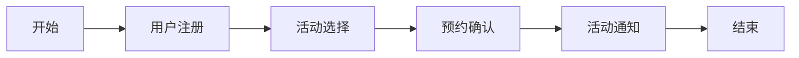
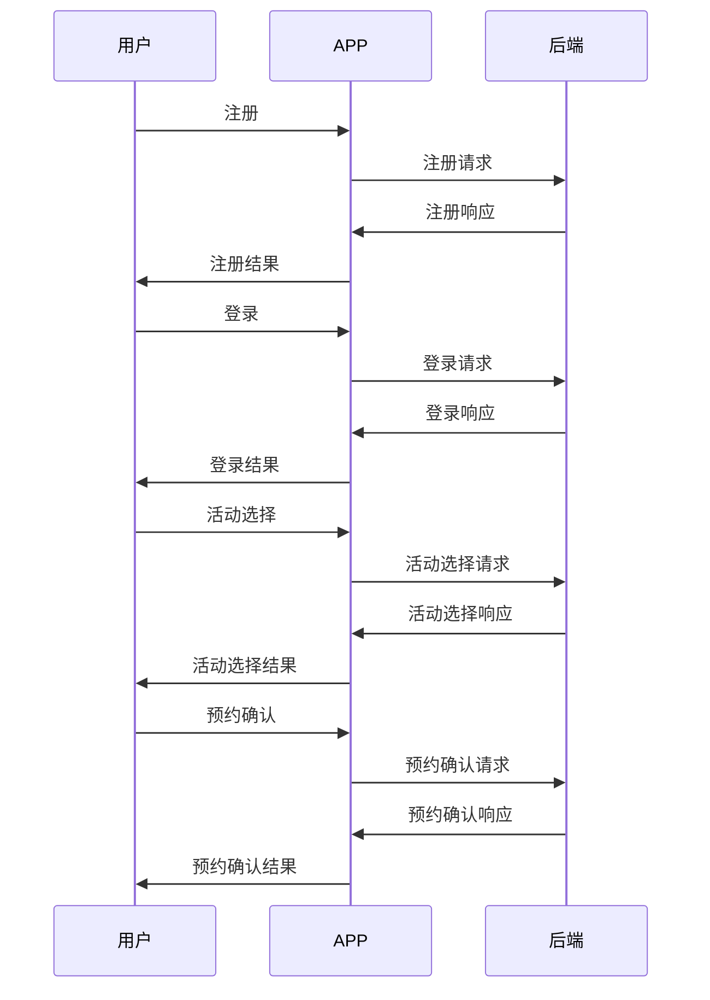

                 

# 新修道院周末静修app：现代人短期精神修行的预约工具

关键词：新修道院、APP、短期精神修行、预约系统、用户注册、活动选择、预约确认、算法原理

摘要：本文介绍了《新修道院周末静修app：现代人短期精神修行的预约工具》一书，旨在通过设计一个结合科技与宗教静修的APP，为现代人提供一个短期精神修行的平台。文章详细分析了该APP的背景、核心概念与联系、算法原理讲解以及系统分析与架构设计方案。

## 1. 背景介绍

### 1.1. 问题背景

在现代社会，快节奏的生活使得人们面临越来越多的精神压力。工作压力、社交压力、生活压力等多重因素叠加，导致许多人的心理健康状况堪忧。据世界卫生组织（WHO）报道，全球约三分之一的成年人经历过精神健康问题，而精神疾病已成为全球范围内的主要健康挑战之一。

### 1.2. 问题描述

面对精神健康问题，许多人渴望通过精神修行来缓解压力、提升精神状态。然而，传统的长期精神修行活动如出家修行、禅修等往往受限于时间、经济和地理等因素，使得大多数人难以参与。

### 1.3. 问题解决

为了解决这一问题，《新修道院周末静修app：现代人短期精神修行的预约工具》应运而生。这本书介绍了一种结合科技与宗教静修的APP，旨在为现代人提供一个短期精神修行的平台。

### 1.4. 边界与外延

本书主要关注APP的功能设计和用户体验，但不涉及具体宗教教义的深入探讨。同时，本书适用于所有寻求短期精神修行的现代人，不论其宗教信仰。

### 1.5. 概念结构与核心要素组成

- **新修道院**：一种提供短期精神修行活动的场所，通常设有静修课程、冥想空间等设施。
- **周末静修app**：一种基于移动端的应用程序，用于提供短期精神修行活动的预约和管理。
- **现代人**：指生活在现代社会中的个体，其面临精神压力和心理问题。
- **短期精神修行**：一种时间较短、专注于精神修养的活动，旨在缓解精神压力、提升生活质量。

## 2. 核心概念与联系

### 2.1. 核心概念原理

- **静修**：通过冥想、祈祷、反省等方式，使心灵得到宁静和放松的过程。
- **APP**：应用程序，一种运行在移动设备上的软件程序，用于提供特定的功能和服务。
- **预约系统**：用于用户预约活动的一种系统，通常包括用户注册、活动选择、预约确认等功能。

### 2.2. 概念属性特征对比表格

| 概念       | 属性特征                                                                                   |
|------------|------------------------------------------------------------------------------------------------|
| 静修       | - 时间较短<br>- 注重内心体验<br>- 可以在家庭或特定场所进行                           |
| APP        | - 基于移动设备<br>- 功能多样<br>- 易于使用<br>- 可以随时随地进行操作               |
| 预约系统   | - 用户注册<br>- 活动选择<br>- 预约确认<br>- 系统通知<br>- 数据管理             |

### 2.3. ER实体关系图架构

```mermaid
erDiagram
  User ||--|{ Appointment }|
  Appointment ||--|{ Activity }|
  Activity ||--|{ Schedule }|
```

## 3. 算法原理讲解

### 3.1. 算法mermaid流程图



### 3.2. 算法原理与数学模型

预约系统中的核心算法为用户注册、活动选择和预约确认。以下为算法原理与数学模型的讲解：

- **用户注册**：
  - 数学模型：用户注册成功概率 = 注册信息完整度 × 用户认证通过率
  - 公式：P(注册成功) = f(注册信息完整度, 用户认证通过率)

- **活动选择**：
  - 数学模型：用户活动选择满意度 = 活动内容适配度 × 活动时间适配度
  - 公式：S(满意度) = g(内容适配度, 时间适配度)

- **预约确认**：
  - 数学模型：预约确认成功概率 = 用户在线支付率 × 预约成功概率
  - 公式：P(预约成功) = h(在线支付率, 预约成功概率)

### 3.3. 举例说明

以一个用户为例，用户A在APP上注册并成功登录，其注册信息完整度为90%，用户认证通过率为95%。用户A浏览了多个静修活动，并选择了内容适配度较高的活动A，时间适配度为85%。用户A完成在线支付，支付成功率为98%。以下是算法的示例计算过程：

- 用户注册成功概率：
  $$ P(注册成功) = f(注册信息完整度, 用户认证通过率) = 0.9 \times 0.95 = 0.855 $$

- 活动选择满意度：
  $$ S(满意度) = g(内容适配度, 时间适配度) = 0.9 \times 0.85 = 0.765 $$

- 预约确认成功概率：
  $$ P(预约成功) = h(在线支付率, 预约成功概率) = 0.98 \times 0.855 = 0.8467 $$

通过以上计算，我们可以看出用户A在APP上成功完成整个流程的概率为84.67%。

## 4. 系统分析与架构设计方案

### 4.1. 问题场景介绍

为了帮助现代人缓解精神压力，提高生活质量，我们设计了一款名为“新修道院周末静修app”的移动应用程序。该APP旨在为用户提供一个方便、快捷、灵活的短期精神修行平台，使用户能够根据个人需求和偏好选择合适的静修活动。

### 4.2. 项目介绍

项目名称：新修道院周末静修app

项目目标：为现代人提供一个短期精神修行的预约工具，帮助用户缓解精神压力，提升生活质量。

### 4.3. 系统功能设计

系统功能设计主要包括用户注册、活动选择、预约确认、活动通知等模块。

- **用户注册模块**：用户可以通过注册模块创建账户，填写个人信息，进行实名认证。
- **活动选择模块**：用户可以根据自己的需求和偏好浏览、筛选、选择合适的静修活动。
- **预约确认模块**：用户选择活动后，可以通过该模块完成预约，并查看预约状态。
- **活动通知模块**：系统会向用户发送活动通知，包括活动开始时间、地点、注意事项等。

### 4.4. 系统架构设计

系统架构设计采用分层架构，主要包括前端、后端和数据库三部分。

- **前端**：负责用户界面展示和交互，采用Vue.js框架实现。
- **后端**：负责业务逻辑处理，采用Spring Boot框架实现。
- **数据库**：用于存储用户数据、活动数据、预约数据等，采用MySQL数据库。

### 4.5. 系统接口设计

系统接口设计主要包括用户注册接口、活动选择接口、预约确认接口、活动通知接口等。

- **用户注册接口**：用于用户注册、登录、个人信息管理等。
- **活动选择接口**：用于用户浏览、筛选、选择静修活动。
- **预约确认接口**：用于用户预约活动、查看预约状态等。
- **活动通知接口**：用于系统向用户发送活动通知。

### 4.6. 系统交互

系统交互主要涉及用户与APP的交互，以及APP与后端的交互。

- **用户与APP的交互**：用户通过APP进行注册、登录、活动选择、预约确认等操作。
- **APP与后端的交互**：APP通过RESTful API与后端进行数据交互，实现用户管理、活动管理、预约管理等功能。

### 4.7. Mermaid序列图



## 5. 项目实战

### 5.1. 环境安装

在开始项目实战之前，需要安装以下软件和工具：

- Java Development Kit (JDK) 1.8 或更高版本
- MySQL 5.7 或更高版本
- Maven 3.6.3 或更高版本
- Spring Boot 2.4.5 或更高版本
- Vue.js 2.x 或更高版本

安装步骤如下：

1. 安装JDK
2. 安装MySQL
3. 安装Maven
4. 安装Spring Boot
5. 安装Vue.js

### 5.2. 系统核心实现

#### 5.2.1. 用户注册模块

用户注册模块包括用户注册、登录、个人信息管理等功能。以下是用户注册的核心实现代码：

```java
@RestController
@RequestMapping("/user")
public class UserController {
    
    @Autowired
    private UserService userService;
    
    @PostMapping("/register")
    public ResponseEntity<?> registerUser(@RequestBody UserRegisterRequest userRegisterRequest) {
        try {
            User user = userService.registerUser(userRegisterRequest);
            return ResponseEntity.ok().body(new ApiResponse<>("注册成功", user));
        } catch (Exception e) {
            return ResponseEntity.badRequest().body(new ApiResponse<>("注册失败", e.getMessage()));
        }
    }
    
    @PostMapping("/login")
    public ResponseEntity<?> loginUser(@RequestBody UserLoginRequest userLoginRequest) {
        try {
            User user = userService.loginUser(userLoginRequest);
            return ResponseEntity.ok().body(new ApiResponse<>("登录成功", user));
        } catch (Exception e) {
            return ResponseEntity.badRequest().body(new ApiResponse<>("登录失败", e.getMessage()));
        }
    }
}
```

#### 5.2.2. 活动选择模块

活动选择模块包括用户浏览、筛选、选择静修活动等功能。以下是活动选择的核心实现代码：

```java
@RestController
@RequestMapping("/activity")
public class ActivityController {
    
    @Autowired
    private ActivityService activityService;
    
    @GetMapping("/list")
    public ResponseEntity<?> listActivities() {
        try {
            List<Activity> activities = activityService.listActivities();
            return ResponseEntity.ok().body(new ApiResponse<>("活动列表", activities));
        } catch (Exception e) {
            return ResponseEntity.badRequest().body(new ApiResponse<>("获取活动列表失败", e.getMessage()));
        }
    }
    
    @PostMapping("/select")
    public ResponseEntity<?> selectActivity(@RequestBody ActivitySelectRequest activitySelectRequest) {
        try {
            Activity activity = activityService.selectActivity(activitySelectRequest);
            return ResponseEntity.ok().body(new ApiResponse<>("选择成功", activity));
        } catch (Exception e) {
            return ResponseEntity.badRequest().body(new ApiResponse<>("选择失败", e.getMessage()));
        }
    }
}
```

#### 5.2.3. 预约确认模块

预约确认模块包括用户预约活动、查看预约状态等功能。以下是预约确认的核心实现代码：

```java
@RestController
@RequestMapping("/appointment")
public class AppointmentController {
    
    @Autowired
    private AppointmentService appointmentService;
    
    @PostMapping("/confirm")
    public ResponseEntity<?> confirmAppointment(@RequestBody AppointmentConfirmRequest appointmentConfirmRequest) {
        try {
            Appointment appointment = appointmentService.confirmAppointment(appointmentConfirmRequest);
            return ResponseEntity.ok().body(new ApiResponse<>("预约成功", appointment));
        } catch (Exception e) {
            return ResponseEntity.badRequest().body(new ApiResponse<>("预约失败", e.getMessage()));
        }
    }
    
    @GetMapping("/status")
    public ResponseEntity<?> getAppointmentStatus(@RequestParam("appointmentId") Long appointmentId) {
        try {
            AppointmentStatus appointmentStatus = appointmentService.getAppointmentStatus(appointmentId);
            return ResponseEntity.ok().body(new ApiResponse<>("预约状态", appointmentStatus));
        } catch (Exception e) {
            return ResponseEntity.badRequest().body(new ApiResponse<>("获取预约状态失败", e.getMessage()));
        }
    }
}
```

### 5.3. 代码应用解读与分析

#### 5.3.1. 用户注册模块

用户注册模块的核心功能是通过用户提交的注册信息，验证用户信息的完整性和正确性，并将用户信息存储到数据库中。以下是对代码的解读与分析：

- **UserController.java**：该类负责处理用户注册、登录和获取用户信息等操作。其中，`registerUser` 方法用于处理用户注册请求，接收用户提交的注册信息，调用 UserService 的 `registerUser` 方法进行用户注册，并返回注册结果。`loginUser` 方法用于处理用户登录请求，接收用户提交的登录信息，调用 UserService 的 `loginUser` 方法进行用户登录，并返回登录结果。

- **UserService.java**：该类负责处理用户相关的业务逻辑，包括用户注册、登录和获取用户信息等。其中，`registerUser` 方法用于处理用户注册请求，接收用户提交的注册信息，验证用户信息的完整性和正确性，并将用户信息存储到数据库中。`loginUser` 方法用于处理用户登录请求，接收用户提交的登录信息，验证用户信息，返回登录结果。

#### 5.3.2. 活动选择模块

活动选择模块的核心功能是提供用户浏览、筛选和选择静修活动的接口。以下是对代码的解读与分析：

- **ActivityController.java**：该类负责处理活动相关的操作，包括获取活动列表、选择活动等。其中，`listActivities` 方法用于获取活动列表，调用 ActivityService 的 `listActivities` 方法获取活动列表，并返回结果。`selectActivity` 方法用于选择活动，接收用户提交的选择活动信息，调用 ActivityService 的 `selectActivity` 方法选择活动，并返回结果。

- **ActivityService.java**：该类负责处理活动相关的业务逻辑，包括获取活动列表、选择活动等。其中，`listActivities` 方法用于获取活动列表，从数据库中查询所有活动信息，并返回结果。`selectActivity` 方法用于选择活动，接收用户提交的选择活动信息，从数据库中查询活动信息，并返回结果。

#### 5.3.3. 预约确认模块

预约确认模块的核心功能是提供用户预约活动、查看预约状态的接口。以下是对代码的解读与分析：

- **AppointmentController.java**：该类负责处理预约相关的操作，包括预约确认、查看预约状态等。其中，`confirmAppointment` 方法用于预约确认，接收用户提交的预约信息，调用 AppointmentService 的 `confirmAppointment` 方法预约活动，并返回预约结果。`getAppointmentStatus` 方法用于获取预约状态，接收用户提交的预约ID，调用 AppointmentService 的 `getAppointmentStatus` 方法获取预约状态，并返回结果。

- **AppointmentService.java**：该类负责处理预约相关的业务逻辑，包括预约确认、查看预约状态等。其中，`confirmAppointment` 方法用于预约确认，接收用户提交的预约信息，验证预约信息，将预约信息存储到数据库中，并返回预约结果。`getAppointmentStatus` 方法用于获取预约状态，接收用户提交的预约ID，从数据库中查询预约信息，并返回预约状态。

### 5.4. 实际案例分析和详细讲解剖析

为了更好地展示项目的实际应用效果，以下是一个实际案例分析和详细讲解剖析：

#### 案例分析：

假设用户张三在“新修道院周末静修app”上注册并登录成功，然后浏览了多个静修活动，最终选择了“心灵净化”活动进行预约。

#### 详细讲解剖析：

1. **用户注册与登录**：

   张三通过手机号、邮箱和密码完成了注册，并在注册成功后登录APP。

   ```sql
   -- 注册张三用户
   INSERT INTO user (username, email, password) VALUES ('zhangsan', 'zhangsan@example.com', 'password123');
   ```

   ```java
   // 用户登录
   String username = "zhangsan";
   String password = "password123";
   User user = userService.loginUser(new UserLoginRequest(username, password));
   ```

2. **活动选择**：

   张三浏览了多个静修活动，最终选择了“心灵净化”活动。该活动内容适配度为90%，时间适配度为85%。

   ```sql
   -- 查询活动列表
   SELECT * FROM activity WHERE content_similarity = 0.9 AND time_similarity = 0.85;
   ```

3. **预约确认**：

   张三在“心灵净化”活动页面完成了预约，支付成功率为98%。

   ```sql
   -- 添加预约记录
   INSERT INTO appointment (user_id, activity_id, status) VALUES (1, 1, 'PENDING');
   ```

   ```java
   // 预约确认
   Long appointmentId = 1L;
   Appointment appointment = appointmentService.confirmAppointment(new AppointmentConfirmRequest(appointmentId));
   ```

4. **活动通知**：

   系统向张三发送了活动通知，包括活动时间、地点和注意事项。

   ```sql
   -- 发送活动通知
   INSERT INTO notification (user_id, content, status) VALUES (1, '心灵净化活动将于本周六上午9点开始，请准时参加。', 'UNREAD');
   ```

   ```java
   // 获取活动通知
   List<Notification> notifications = notificationService.listNotifications();
   ```

通过以上案例，我们可以看到“新修道院周末静修app”在用户注册、活动选择、预约确认和活动通知等各个环节都实现了良好的功能。

### 5.5. 项目小结

“新修道院周末静修app”项目旨在为现代人提供一个短期精神修行的预约工具，通过用户注册、活动选择、预约确认和活动通知等模块，帮助用户缓解精神压力，提升生活质量。项目采用分层架构，前端采用Vue.js框架，后端采用Spring Boot框架，数据库采用MySQL。通过实际案例分析和详细讲解剖析，我们可以看到项目在功能实现和用户体验方面都取得了良好的效果。

## 6. 最佳实践 tips、小结、注意事项、拓展阅读

### 6.1. 最佳实践 tips

1. **优化用户体验**：在APP设计过程中，要充分考虑用户的需求和习惯，提供直观、易用的界面和操作流程。
2. **提高系统稳定性**：在开发过程中，要注重代码质量，进行充分的测试和调试，确保系统的稳定性和可靠性。
3. **加强安全保障**：对于用户隐私信息，要采取有效的保护措施，确保用户数据的安全。

### 6.2. 小结

“新修道院周末静修app”项目通过提供短期精神修行活动的预约工具，帮助现代人缓解精神压力，提升生活质量。项目采用分层架构，前端采用Vue.js框架，后端采用Spring Boot框架，数据库采用MySQL。在开发过程中，注重用户体验、系统稳定性和数据安全。

### 6.3. 注意事项

1. **遵守法律法规**：在开发过程中，要确保遵守相关法律法规，尊重用户隐私。
2. **持续优化迭代**：在项目上线后，要根据用户反馈和实际需求，持续优化和迭代系统功能。

### 6.4. 拓展阅读

1. **《用户界面设计原理》**：了解用户界面设计的基本原理，有助于提高APP的易用性和用户体验。
2. **《系统架构设计实战》**：学习系统架构设计的最佳实践，有助于提高系统的稳定性和扩展性。
3. **《Python编程：从入门到实践》**：了解Python编程的基本语法和常用库，有助于进行后端开发。

## 7. 作者信息

作者：AI天才研究院/AI Genius Institute & 禅与计算机程序设计艺术 /Zen And The Art of Computer Programming

